# The Averaged-value Model of a Flexible Power Electronics Based Substation in Hybrid AC/DC Distribution Systems

Hong Liu, Zhanfeng Deng, Xialin Li , Member, IEEE, Li Guo, Member, IEEE, Di Huang, Shouqiang Fu, Xiangyu Chen, and Chengshan Wang, Senior Member, IEEE

Abstract—The concept of a flexible power electronics substation (FPES) was first applied in the Zhangbei DC distribution network demonstration project. As a multi-port power electronics transformer (PET) with different AC and DC voltage levels, the FPES has adopted a novel topology integrating modular multilevel converter (MMC) and four-winding medium frequency transformer (FWMFT) based multiport DC-DC converter, which can significantly reduce capacitance in each sub-module (SM) of a MMC and also save space and cost. In this paper, in order to accelerate speed of electromagnetic transient (EMT) simulations of FPES based hybrid AC/DC distribution systems, an averaged-value model (AVM) is proposed for efficient and accurate representation of FPES. Assume that all SM capacitor voltages are perfectly balanced in the MMC, then the MMC behavior can be modeled using controlled voltage sources based on modulation voltages from control systems. In terms of the averaged current transfer characteristics among the windings of the FWMFT, we consider that all multiport DC-DC converters are controlled with the same dynamics, a lumped averaged model using controlled current and voltage sources has been developed for these four-port DC-DC converters connected to the upper or lower arms of the MMC. The presented FPES AVM model has been tested and validated by comparison with a detailed IGBT-based EMT model. Results show that the AVM is significantly more efficient while maintaining its accuracy in an EMT simulation.

Index Terms—Averaged-value model (AVM), flexible power electronics substation (FPES), four-winding medium frequency transformer (FWMFT), hybrid AC/DC distribution systems, modular multilevel converter (MMC), multiport DC-DC converter.

Manuscript received April 21, 2020; revised June 23, 2020; accepted July 31, 2020. Date of online publication October 6, 2020; date of current version November 17, 2020. This work was supported in part by the National Nature Science Foundation of China (51977142).   
H. Liu, X. Li (corresponding author, e-mail: xialinlee@tju.edu.cn; ORCID: https://orcid.org/0000-0003-1852-7823), L. Guo, and C. Wang are with the Key Laboratory of Smart Grid of Ministry of Education, Tianjin University, Tianjin 300072, China.   
Z. F. Deng is with the State Key Laboratory of Advanced Power Transmission Technology, Global Energy Interconnection Research Institute, Beijing 100220, China.   
S. Fu and X. Chen are with the State Grid Jibei Electric Power Economic Research Institute, Beijing 100038, China; X. Chen is also with State Key Laboratory of Reliability and Intelligence of Electrical Equipment, Hebei University of Technology, Tianjin, China.   
D. Huang is with the Guangzhou Power Supply Bureau of Guangdong Grid Co., Ltd., Guangzhou 510620, China.

DOI: 10.17775/CSEEJPES.2020.01340

# I. INTRODUCTION

H YBRID AC and DC distribution network has become acrucial trend for future intelligent distribution networks, with large-scale integration of renewable power generations (RPGs) (i.e. PV, wind), increasing DC loads, and diversified power supply requirements [1], [2]. To achieve more flexible, reliable, and efficient network architectures and power-flow scheduling and control among different AC and DC voltage levels, concepts of so-called multiport energy routers (ERs), solid state transformers (SSTs), and power electronic transformers (PETs) [3]–[5], have been proposed and developed. In the traditional cascaded topology of MMC based multiport PETs, a low DC voltage port is primarily obtained by a modular high or medium frequency DC transformer [6], which is interlinked directly to the medium DC link. It should be noted that massive capacitance in each sub-module (SM) of the MMC is necessary to reduce power ripples of the MMC arms with fundamental and double frequency. In contrast, a novel topology named flexible power electronics substation (FPES) [7] integrating MMC and four-winding medium frequency transformer (FWMFT) based multiport DC-DC converter was first applied in the Zhangbei DC distribution network demonstration project [8], [9], which significantly reduced capacitance in each SM of the MMC and also saved space and cost, due to the power ripples with fundamental and double frequency across the MMC arms in three phases, which can be balanced and offset.

For FPES based hybrid AC and DC distribution systems, electromagnetic transient (EMT) simulations can help to test and verify the dynamic characteristics of selected main circuits, control and protection systems. As is known, FPES with large numbers of SMs and FWMFT based four-port DC-DC converters, and a switching model with a solution time step of 1∼2 µs can provide high simulation accuracy, however, it will result in a heavy computational burden [10]. Thus, how to realize efficient electromagnetic transient (EMT) simulations of FPES has become the greatest motivation of this paper.

In order to reduce the computational time of the MMC without sacrificing accuracy, the Thevenin equivalent circuit ´ for the SM and multivalve of MMC was first proposed in [11]. With this model, capacitor voltage dynamics and balancing of the SMs in each arm of the MMC can be considered

as managed in the detailed switching model. An accelerated model of MMC was proposed in [12], based on Kirchhoff’s Law and the nodal analysis method. Furthermore, assuming the switches of MMC to be ideal and using the A-stable backward Ruler method (BEM) to calculate the voltages of SM capacitors, an integral MMC model was proposed in [13]. Assume all the SM capacitor voltages are being balanced, then the AC-side dynamic of MMC can be further simplified with controlled voltage sources based on the average-value model (AVM) [14], [15]. In addition, consider the second harmonic circulating currents in each phase to be suppressed, then the DC-side behavior of the MMC is modeled using a current source and an equivalent DC capacitance [14], [15]. The authors in [16] pointed out that the accuracy of AVM in [14], [15] was depended on SM capacitance, with such a condition that the SM capacitors should be large enough to obtain nearly constant DC voltage in each SM. It should be noted that these studies focused on traditional MMC applications. In the considered FPES, a FWMFT based multiport DC-DC converter is connected to the SM of the MMC, then the presented AVMs in [14]–[16] cannot be used directly due to this special topology of FPES. Therefore, it is necessary to develop a novel AVM for efficient EMT simulations of the FPES.

The multi-active-bridge (MAB) based Matrix Charge Balancer (MCB) has been proposed to minimize the size of the SM capacitors in the MMC in [17]. MAB Differential Power Processing (MAB-DPP) has also been presented for large scale modular DC energy systems [18]. However, instead of power transfer between the DC ports with different DC voltage levels, this structure is only used to reduce the capacitance of SMs or to balance DC voltages in multiple ports, and the related control system is also very complicated. Moreover, the authors did not discuss how to obtain an equivalent aggregated model of MAB for efficient EMT simulations. The authors in [19], [20] used time-varying resistors or ideal switches to replace switching devices in a dual-active-bridge (DAB) to reduce solution time in the EMT simulation. Although this method is simple and easy to be implemented, with increasing numbers of DC-DC converters, computational time will still not be significantly reduced. If averaged, the actual output voltage or current of DAB converters in a switching period, ignoring high-frequency components, ensures that AVM ideas are adopted for efficient EMT simulation of DAB converters [21]– [23]. By averaging the output current of DAB, a reduced AVM and an equivalent circuit is presented in [21], [22]. An averaged-value based equivalent model for a multiport solidstate transformer is proposed in [23]. However, the FWMFT based multiport DC-DC converter contains four active bridge (FAB) converters, and has a special design of a main circuit and dynamics of control which is different from the DABs or MABs in [17], [18], which may require a novel averaged-value model for efficient EMT simulation.

Motivated to significantly reduce computational time of EMT simulations of FPES, especially for FPES based hybrid AC/DC distribution systems, a novel averaged-value model (AVM) is first proposed for efficient and accurate representation of a FPES. On one hand, assume that all SM capacitor

voltages are perfectly balanced in the arms of the MMC, both the AC-side and DC-side model of MMC can be represented with controlled voltage sources. On the other hand, for efficient modeling of these multiple FWMFT based MAB converters connected to the upper or lower arms of the MMC, when ignoring differences of main circuit parameters and control of all converters, only a lumped averaged model using controlled current and voltage sources is needed. The rest of this paper is organized as follows: Section II introduces the structure and characteristics of FPES. The proposed model is provided in Section III. Section IV compares and discusses the simulation results. Section V concludes the paper.

# II. TOPOLOGY AND POWER CHARACTERISTICS OF FPES A. Basic Topology of Multi-port FPES

The main structure of the FPES studied in this paper is shown in Fig. 1, which has been applied in the Zhangbei DC distribution network demonstration project [8], [9]. Using the concept of multi-port integrated design, the FPES includes two AC ports (i.e. 10 kV and 380 V) and two DC ports (refers to ± 10 kV and 750 V) [7]. The AC side and DC side of the MMC are interlinked to a 10 kV AC grid and ± 10 kV DC network respectively. The inputs of the FWMFT based MAB converter are connected to three-phase SM capacitors of the MMC. In addition, all output sides of MAB converters are connected to the 750 V low-voltage DC link. This structure can realize flexible and isolated interconnection of medium-voltage and lowvoltage DC systems. Since the medium-frequency isolation transformer adopts the topology with four windings sharing a

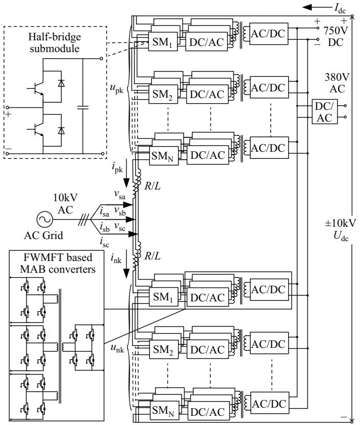  
Fig. 1. Main structure of the considered FPES.

common core, the instantaneous fundamental frequency and double frequency power ripples across MMC arms in three phases can be balanced and offset. Hence, the capacitor of SM is primarily to smooth power disturbance with the DC term, which can greatly reduce capacitance of SM compared to the traditional MMC topology, and can effectively save the size and cost of the FPES. It should be noted that low AC voltage 380 V can be provided by a conventional two-level or three-level voltage source converter (VSC), which is not considered in this paper.

# B. Instantaneous Power Characteristics of the MMC

This section is started with analysis of instantaneous powers of the upper and lower arms of phase A of a MMC, represented as $P _ { \mathrm { p a } } ( t )$ and $P _ { \mathrm { n a } } ( t )$ respectively. Assume that the DC voltage of MMC is $U _ { \mathrm { d c } }$ , DC current is $I _ { \mathrm { d c } } ,$ , and output power factor of the MMC is cos θ. When the FWMFT based MAB converters connected to three-phase SMs are not considered, arm voltages $u _ { \mathrm { p a } } / u _ { \mathrm { n a } }$ and currents ${ i _ { \mathrm { p a } } / i _ { \mathrm { n a } } }$ in phase A can be expressed respectively as (1) and (2) [24], [25]:

$$
\left\{ \begin{array}{l} u _ {\mathrm {p a}} (t) = \frac {1}{2} U _ {\mathrm {d c}} - v _ {\mathrm {s a}} (t) = \frac {1}{2} U _ {\mathrm {d c}} \left(1 - K \sin \left(\omega_ {0} t\right)\right) \\ u _ {\mathrm {n a}} (t) = \frac {1}{2} U _ {\mathrm {d c}} + v _ {\mathrm {s a}} (t) = \frac {1}{2} U _ {\mathrm {d c}} \left(1 + K \sin \left(\omega_ {0} t\right)\right) \end{array} \right. \tag {1}
$$

$$
\left\{ \begin{array}{l} i _ {\mathrm {p a}} (t) = \frac {1}{3} I _ {\mathrm {d c}} - \frac {1}{2} i _ {\mathrm {s a}} = \frac {1}{3} I _ {\mathrm {d c}} \left(1 - M \sin \left(\omega_ {0} t + \theta\right)\right) \\ i _ {\mathrm {n a}} (t) = \frac {1}{3} I _ {\mathrm {d c}} + \frac {1}{2} i _ {\mathrm {s a}} = \frac {1}{3} I _ {\mathrm {d c}} \left(1 + M \sin \left(\omega_ {0} t + \theta\right)\right) \end{array} \right. \tag {2}
$$

where ω0 is the fundamental angular frequency; K is the voltage modulation ratio, referring to the ratio of peak voltage $U _ { \mathrm { s a } }$ of phase A to $U _ { \mathrm { d c } } / 2 .$ . M is the ratio of peak current $I _ { \mathrm { s a } }$ of the AC side to $2 ~ I _ { \mathrm { d c } } / 3$ .

Therefore, the instantaneous powers of the upper and lower arms in Phase A can be obtained as:

$$
\left\{ \begin{array}{l} P _ {\mathrm {p a}} (t) = u _ {\mathrm {p a}} (t) \cdot i _ {\mathrm {p a}} (t) \\ \quad = \frac {1}{6} U _ {\mathrm {d c}} I _ {\mathrm {d c}} \left[ 1 + \frac {K M}{2} \cos \theta - M \sin \left(\omega_ {0} t + \theta\right) - \right. \\ \quad \left. K \sin \left(\omega_ {0} t\right) - \frac {K M}{2} \cos \left(2 \omega_ {0} t + \theta\right) \right] \\ P _ {\mathrm {n a}} (t) = u _ {\mathrm {n a}} (t) \cdot i _ {\mathrm {n a}} (t) \\ \quad = \frac {1}{6} U _ {\mathrm {d c}} I _ {\mathrm {d c}} \left[ 1 + \frac {K M}{2} \cos \theta + M \sin \left(\omega_ {0} t + \theta\right) + \right. \\ \quad \left. K \sin \left(\omega_ {0} t\right) - \frac {K M}{2} \cos \left(2 \omega_ {0} t + \theta\right) \right] \end{array} \right. \tag {3}
$$

From (3), it can be seen that the instantaneous power across each arm of the MMC primarily contains a DC component, fundamental frequency and double frequency components. The fundamental frequency ripples in the upper and lower arms have the same values of amplitudes, but with a 180◦ of phase difference. However, the double frequency components have the same amplitudes and phases. As for the instantaneous powers in other B and C phases, they have the same DC

component with that in phase A, and the fundamental frequency and double frequency ripples in the three-phase arms constitute symmetrical harmonic components [25]. Using the instantaneous powers of upper arms of B and C phases as an example, they can be obtained as:

$$
\left\{ \begin{array}{c} P _ {\mathrm {p b}} (t) = \frac {1}{6} U _ {\mathrm {d c}} I _ {\mathrm {d c}} \left[ 1 + \frac {K M}{2} \cos \theta - \right. \\ \quad \quad \quad \quad \quad \quad \quad \quad \quad \quad \quad \quad \quad \quad \quad \quad \quad \quad \quad \quad \quad \quad \quad \quad \quad \quad \quad \quad \quad \quad \left. K \sin \left(\omega_ {0} t + \theta - 1 2 0 ^ {\circ}\right) - \right. \\ \left. K \sin \left(\omega_ {0} t - 1 2 0 ^ {\circ}\right) - \frac {K M}{2} \cos \left(2 \omega_ {0} t + \theta - 2 4 0 ^ {\circ}\right) \right] \\ P _ {\mathrm {p c}} (t) = \frac {1}{6} U _ {\mathrm {d c}} I _ {\mathrm {d c}} \left[ 1 + \frac {K M}{2} \cos \theta - \right. \\ \quad \quad \quad \quad \quad \quad \quad \quad \quad \quad \quad \quad \quad \quad \quad \quad \left. M \sin \left(\omega_ {0} t + \theta + 1 2 0 ^ {\circ}\right) - \right. \\ \left. K \sin \left(\omega_ {0} t + 1 2 0 ^ {\circ}\right) - \frac {K M}{2} \cos \left(2 \omega_ {0} t + \theta + 2 4 0 ^ {\circ}\right) \right] \\ \end{array} \right. \tag {4}
$$

Hence, large SM capacitors usually need to be installed in conventional MMCs to smooth instantaneous power ripples across the MMC arms with fundamental and double frequencies. Then the four-winding DC-DC converters in FPES shown in Fig. 1 can provide a flow path for these symmetrical power ripples. Especially, due to the common core topology of FWMFT, the symmetrical three-phase power ripples can be balanced and offset in the iron cores. Fig. 2 shows comparisons of SM voltages of the upper arms before and after enabling the MAB. It can be seen that the power ripples have been significantly reduced with the performance of MAB. Therefore, only instantaneous power with DC term will be left to be balanced by the capacitors of the SMs, which can significantly reduce the values of SM capacitances compared to traditional MMC topology, and can effectively save the size and cost of the FPES. It is worth mentioning that the second harmonic circulating currents of the conventional MMC structure is caused by the fluctuation of the submodule voltage. In addition, a circulating currents suppression control (CCSC) is always adopted in traditional MMC control systems. In the considered FPES, double frequency components in DC voltages of SMs and second harmonic circulating currents can be eliminated simultaneously without additional CCSC, which can further reduce complexity and computing burden of the control system of the FPES.

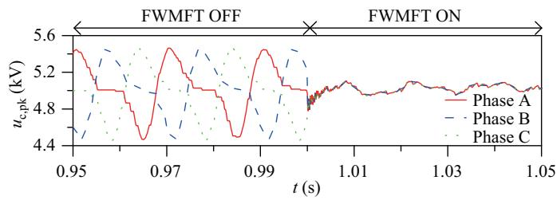  
Fig. 2. SM voltages of the upper and lower arms.

# III. AVM BASED EFFICIENT EMT MODELING OF FPES A. AVM Based Equivalent Modeling of the MMC in FPES

According to the topology of FPES and related voltage and current variables defined in Fig. 1, based on Kirchhoff’s voltage law, the following equations can be obtained:

$$
\left\{ \begin{array}{l} L \frac {\mathrm {d} i _ {\mathrm {p k}}}{\mathrm {d} t} + R i _ {\mathrm {p k}} + u _ {\mathrm {p k}} + v _ {\mathrm {s k}} = \frac {1}{2} U _ {\mathrm {d c}} \\ L \frac {\mathrm {d} i _ {\mathrm {n k}}}{\mathrm {d} t} + R i _ {\mathrm {n k}} + u _ {\mathrm {n k}} - v _ {\mathrm {s k}} = \frac {1}{2} U _ {\mathrm {d c}} \end{array} \right. \tag {5}
$$

where k represents the $\mathbf { a } , \mathbf { b } ,$ c phase; $v _ { \mathrm { s k } }$ is the AC voltage of the k-phase; $u _ { \mathrm { p k } }$ and $u _ { \mathrm { n k } }$ are the upper and lower arm voltages of the k-phase, respectively; $i _ { \mathrm { p k } }$ and $i _ { \mathrm { n k } }$ are the k-phase upper and lower arm currents, respectively. $U _ { \mathrm { d c } }$ is the DC side voltage of the MMC; L and R are the series inductance and equivalent resistance in the arms of the MMC, respectively.

With simple manipulations of the two formulas in (5), equivalent mathematical models for representing external characteristics of the MMC AC and DC sides can be derived as:

$$
\left\{ \begin{array}{l} \frac {R}{2} i _ {\mathrm {s k}} + \frac {L}{2} \frac {\mathrm {d} i _ {\mathrm {s k}}}{\mathrm {d} t} + \frac {u _ {\mathrm {n k}} - u _ {\mathrm {p k}}}{2} = v _ {\mathrm {s k}} \\ 2 R i _ {\mathrm {c i r k}} + 2 L \frac {\mathrm {d} i _ {\mathrm {c i r k}}}{\mathrm {d} t} + \left(u _ {\mathrm {n k}} + u _ {\mathrm {p k}}\right) = U _ {\mathrm {d c}} \end{array} \right. \tag {6}
$$

where $i _ { \mathrm { s k } }$ equals to $( i _ { \mathrm { n k } } - i _ { \mathrm { p k } } )$ , referring to the AC side current of the k-phase of the MMC; $i _ { \mathrm { c i r k } }$ is the k-phase circulating current of the MMC in the DC side, represented as $( i _ { \mathrm { p k } } + i _ { \mathrm { n k } } ) / 2$ . Thus, these arm currents $i _ { \mathrm { p k } }$ and $i _ { \mathrm { n k } }$ can be represented as:

$$
\left\{ \begin{array}{l} i _ {\mathrm {p k}} = i _ {\mathrm {c i r k}} - i _ {\mathrm {s k}} / 2 \\ i _ {\mathrm {n k}} = i _ {\mathrm {c i r k}} + i _ {\mathrm {s k}} / 2 \end{array} \right. \tag {7}
$$

Moreover, in terms of (7), the equivalent circuit model to represent the AC and DC side dynamic behavior of MMC can be obtained, as shown in Fig. 3.

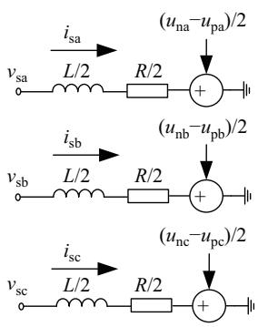  
(a) AC side model

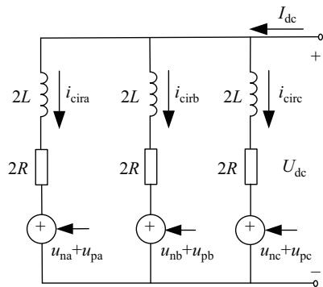  
(b) DC side model   
Fig. 3. The MMC equivalent circuit model based on controlled voltages.

It can be seen that the equivalent circuit model of MMC in Fig. 3 is based on controlled voltages $u _ { \mathrm { p k } }$ and $u _ { \mathrm { n k } } .$ , which are referred to as the upper and lower arm voltages of the k-phase, respectively. Next, based on the structure of the k-phase upper arm illustrated in Fig. 4, the MMC arm voltage $u _ { \mathrm { p k } }$ in (6) and Fig. 3 will be derived.

In Fig. 4, the subscript i means the i-th $( i = 1 , 2 , \dots , N )$ , and SM in the k-phase upper arm of the MMC. $u _ { i , \mathrm { p k } }$ is the input voltage of the i-th SM, and $u _ { c i , p k }$ is the output capacitor voltage of the i-th SM. iMABi ${ \mathbf { \nabla } } _ { \mathcal { P } } k$ is one of the input currents of the four-winding DC-DC converter connected to this ith SM. Let $S _ { i }$ be the control gating signal of the i-th SM, with two states. $S _ { i } ~ = ~ 1$ means the i-th SM is put into the arm and provides the DC voltage. In contrast, $S _ { i } = 0$ means

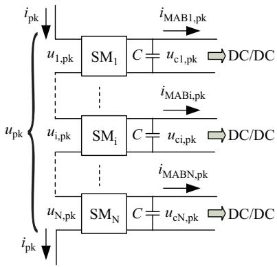  
Fig. 4. MMC upper arm structure of k-phase.

to remove the i-th SM. Then, with switching signals $S _ { i }$ , the capacitor voltages $u _ { \mathrm { c } i , \mathrm { p k } }$ of the SMs and arm voltage $u _ { \mathrm { p k } }$ can be expressed as:

$$
\left\{ \begin{array}{l} C \frac {\mathrm {d} u _ {\mathrm {c} i , \mathrm {p k}}}{\mathrm {d} t} = S _ {i} i _ {\mathrm {p k}} - i _ {\mathrm {M A B} i, \mathrm {p k}} \\ u _ {\mathrm {p k}} = \sum_ {i = 1} ^ {N} u _ {i, \mathrm {p k}} = \sum_ {i = 1} ^ {N} S _ {i} u _ {\mathrm {c} i, \mathrm {p k}} \end{array} \right. \tag {8}
$$

Assume that these capacitor voltages of the SMs can be balanced perfectly, and these FWMFT based MAB converters connected to the same arm have the same dynamic characteristics, which can be represented as:

$$
\left\{ \begin{array}{l} u _ {\mathrm {c} 1, \mathrm {p k}} = u _ {\mathrm {c} 2, \mathrm {p k}} = \dots = u _ {\mathrm {c} N, \mathrm {p k}} = u _ {\mathrm {c}, \mathrm {p k}} \\ i _ {\mathrm {M A B} 1, \mathrm {p k}} = i _ {\mathrm {M A B} 2, \mathrm {p k}} = \dots = i _ {\mathrm {M A B} N, \mathrm {p k}} = I _ {\mathrm {M A B}, \mathrm {p k}} \end{array} \right. \tag {9}
$$

Based on $( 7 ) \sim ( 9 )$ , and averaged switching functions, the dynamic characteristics of the capacitor voltages of the SMs and the voltages of the MMC upper arm can be obtained as:

$$
\left\{ \begin{array}{l} \frac {\left(1 + u _ {\mathrm {p k} , \text {r e f}}\right) \left(i _ {\text {c i r k}} - i _ {\mathrm {s k}} / 2\right)}{2} - I _ {\mathrm {M A B}, \mathrm {p k}} = C \frac {\mathrm {d} u _ {\mathrm {c} , \mathrm {p k}}}{\mathrm {d} t} \\ u _ {\mathrm {p k}} = \frac {N \left(1 + u _ {\mathrm {p k} , \text {r e f}}\right)}{2} u _ {\mathrm {c}, \mathrm {p k}} \end{array} \right. \tag {10}
$$

where the reference $u _ { \mathrm { p k , r e f } }$ is generated from the MMC control system and provides the reference voltages for the upper arms.

Similarly, the capacitor voltages of the SMs in the lower arms and voltages of each lower arm of the MMC can be expressed as:

$$
\left\{ \begin{array}{l} \frac {\left(1 + u _ {\mathrm {n k} , \text {r e f}}\right) \left(i _ {\text {c i r k}} + i _ {\mathrm {s k}} / 2\right)}{2} - I _ {\mathrm {M A B}, \mathrm {n k}} = C \frac {\mathrm {d} u _ {\mathrm {c} , \mathrm {n k}}}{\mathrm {d} t} \\ u _ {\mathrm {n k}} = \frac {N \left(1 + u _ {\mathrm {n k} , \text {r e f}}\right)}{2} u _ {\mathrm {c}, \mathrm {n k}} \end{array} \right. \tag {11}
$$

where $u _ { \mathrm { n k , r e f } }$ is the modulation voltage for the lower arms.

In summary, we can use the model shown in Fig. 3, (10) and (11) for efficient EMT simulations of the MMC in the FPES. In addition, it should be noted that the proposed model (10) and (11) can provide capacitor voltages of the SMs for MAB, and also need the current signals $( I _ { \mathrm { M A B , p k } }$ and $I _ { \mathrm { M A B , n k } } )$ from the MAB.

# B. Equivalent Modeling of the FWMFT Based MAB Converter

The detailed physical construction of FWMFT [26], [27] in the FPES is depicted in Fig. 5. The windings denoted as $A _ { 1 } – X _ { 1 } , A _ { 2 } – X _ { 2 } , A _ { 3 } – X _ { 3 }$ represent the primary three-phase windings connected to the Active-Bridges in the side of the SMs; $a _ { 1 } - x _ { 1 }$ is the secondary winding linked to the Active-Bridge in the side of the 750 V DC port. The primary sides adopt three pairs of windings with the same parameters, which

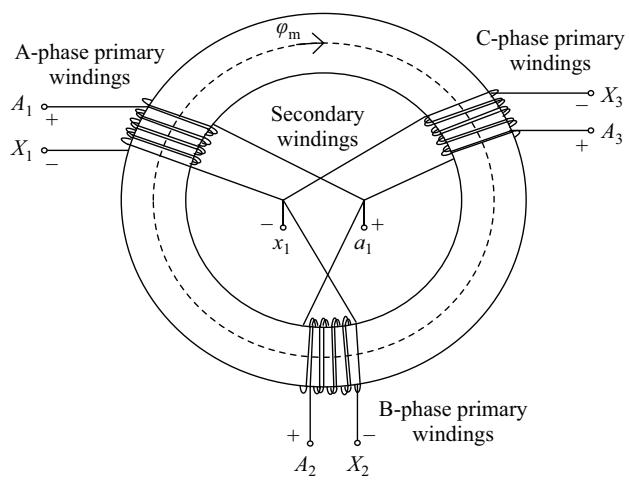  
Fig. 5. Physical structure of a FWMFT.

are symmetrically distributed in the whole ring magnetic core, and the secondary side windings are connected in parallel. The leakage field primarily exists within the winding space between the primary and the secondary windings. This allows the leakage inductance to be both controlled and minimized [27]. In other words, any primary winding has very little magnetic leakage coupling with other primary coils. Since the leakage inductance between the primary windings is extremely small, the power and voltage balance can be achieved to maintain the consistency of the capacitor voltages of three-phase SMs.

Each full bridge DC-AC converter in MAB produces a square voltage waveform with a fixed 50% duty cycle. Power flow between the SMs of the MMC and 750 V DC port can be achieved by controlling the phase shift angle of the square voltage waveforms of the primary and secondary side converters [6]. By ignoring the magnetizing currents, the FWMFT can be equivalent to a polygon equivalent circuit [28]–[30], as shown in Fig. 6. The effective leakage inductance between the primary and secondary windings is represented as $L _ { 1 k }$ . Considering that the effective leakage inductance $L _ { k m }$ among the primary windings k and m will be small due to special design, the effective resistance $R _ { k m }$ cannot be ignored. Starting with this structure, this section will introduce how to derive an equivalent modeling of four-winding DC-DC converters in FPES.

Using a four-winding DC-DC converter connected to the

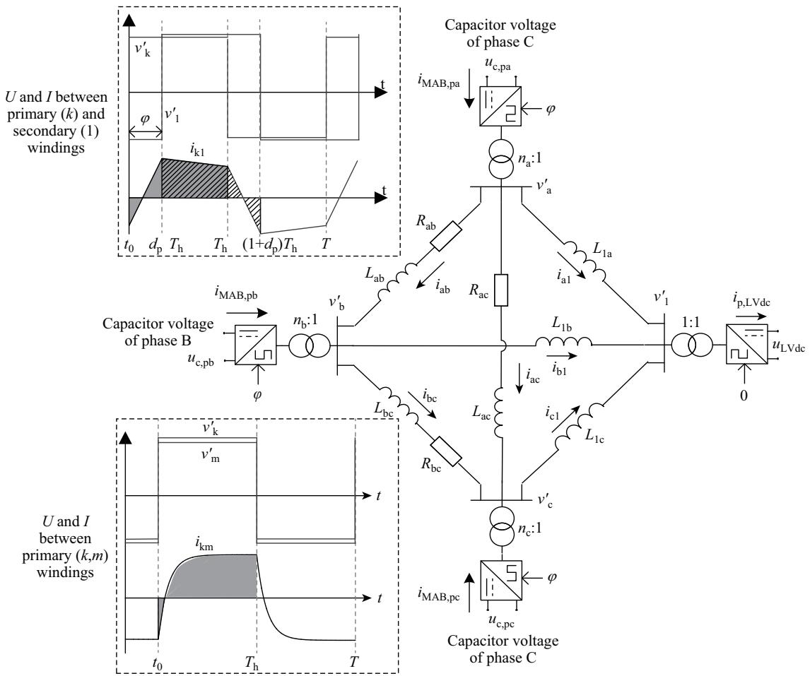  
Fig. 6. An equivalent circuit of four-winding dc-dc converter and voltage and current waveforms on each branch.

upper arm of MMC as an example, let $\varphi$ be the phase shift angle of the square voltage waveforms between the three primary converters and the secondary side converter; $T _ { \mathrm { h } }$ is half of the switching period $T \ : ( f$ is the switching frequency), and the ratio of $\varphi$ to $T _ { \mathrm { h } }$ is defined as the phase shift ratio $d _ { \mathrm { p } } . \ u _ { \mathrm { L V d c } } , \ u _ { \mathrm { c p , a } } , \ u _ { \mathrm { c p , b } } , \ u _ { \mathrm { c p , c } }$ are 750 V DC voltages and the capacitor voltages of the three-phase upper arm SMs of MMC respectively. $v _ { \mathrm { a } } ^ { \prime } , v _ { \mathrm { b } } ^ { \prime } , v _ { \mathrm { c } } ^ { \prime }$ are alternating square voltages of the primary windings converted to the secondary side, $v _ { 1 } ^ { \prime }$ is the alternating square voltage of the primary winding, and $n _ { \mathrm { a } } , n _ { \mathrm { b } } ,$ $n _ { \mathrm { c } }$ are the ratios of the three primary windings to the common secondary winding, respectively. To achieve power and voltage balancing, the four-winding transformer adopts three primary windings with the same parameters, that is, $n _ { \mathrm { a } } = n _ { \mathrm { b } } = n _ { \mathrm { c } }$ .

Power flow between primary and secondary windings can be achieved by controlling the phase-shift angle [6]. “U and I between primary and secondary windings” in Fig. 6 represent the instantaneous values of the voltages $v _ { k } ^ { \prime }$ and $v _ { 1 } ^ { \prime }$ applied across the link inductor $L _ { 1 k }$ and the inductor current $i _ { k 1 }$ . Due to the AC square waveforms with amplitudes $v _ { k } ^ { \prime }$ and $v _ { 1 } ^ { \prime }$ across $L _ { 1 k }$ , the inductor current $i _ { k 1 }$ is symmetrical in the first and second half periods [31], which can be derived as:

$$
i _ {k 1} = \left\{ \begin{array}{l} \frac {- T}{4 L _ {1 k}} \left(2 v _ {1} ^ {\prime} d _ {\mathrm {p}} + v _ {k} ^ {\prime} - v _ {1} ^ {\prime}\right) + \\ \frac {v _ {k} ^ {\prime} + v _ {1} ^ {\prime}}{L _ {1 k}} t t _ {0} <   t \leqslant d _ {\mathrm {p}} T _ {\mathrm {h}} \\ \frac {T}{4 L _ {1 k}} \left(2 v _ {k} ^ {\prime} d _ {\mathrm {p}} + v _ {1} ^ {\prime} - v _ {k} ^ {\prime}\right) + \\ \frac {v _ {k} ^ {\prime} - v _ {1} ^ {\prime}}{L _ {1 k}} \left(t - T _ {\mathrm {h}} d _ {\mathrm {p}}\right) d _ {\mathrm {p}} T _ {\mathrm {h}} <   t \leqslant T _ {\mathrm {h}} \end{array} \right. \tag {12}
$$

It should be noted that the currents $i _ { k 1 }$ are continuous, but due to the change of the full-bridge switching mode, the port currents of the MAB are not continuous. For instance, the input current of k-windings is the same as the leakage inductance current $i _ { k 1 }$ when $v _ { k } ^ { \prime }$ is positive, while the opposite is true when $v _ { k } ^ { \prime }$ is negative. Hence, the averaged input current $I _ { k 1 , i }$ of the primary k-winding and the averaged output current $I _ { k 1 , \mathrm { o } }$ of the secondary winding can be obtained by averaging $i _ { k 1 }$ in a switching period. Due to the symmetry of the circuit, the gray shadowed areas in Fig. 6 can also be used to obtain $I _ { k 1 , i } ,$ and the left slash areas can also be used to obtain $I _ { k 1 , o } \colon$

$$
\left\{ \begin{array}{l} I _ {k 1, \mathrm {i}} = \frac {1}{T} \left(\int_ {t _ {0}} ^ {T _ {\mathrm {h}}} i _ {k 1} \mathrm {d} t + \int_ {T _ {\mathrm {h}}} ^ {T} (- i _ {k 1}) \mathrm {d} t\right) \\ = \frac {v _ {1} ^ {\prime} d _ {\mathrm {p}} \left(1 - d _ {\mathrm {p}}\right)}{2 f L _ {1 k}} \\ I _ {k 1, \mathrm {o}} = \frac {1}{T} \left(\int_ {t _ {0}} ^ {d _ {\mathrm {p}} T _ {\mathrm {h}}} (- i _ {k 1}) \mathrm {d} t + \int_ {d _ {\mathrm {p}} T _ {\mathrm {h}}} ^ {\left(1 + d _ {\mathrm {p}}\right) T _ {\mathrm {h}}} i _ {k 1} \mathrm {d} t + \right. \\ \left. \int_ {(1 + d _ {\mathrm {p}}) T _ {\mathrm {h}}} ^ {T} (- i _ {k 1}) \mathrm {d} t\right) = \frac {v _ {k} ^ {\prime} d _ {\mathrm {p}} \left(1 - d _ {\mathrm {p}}\right)}{2 f L _ {1 k}} \end{array} \right. \tag {13}
$$

With the same phase shift angle $\varphi$ of the three primary windings, $^ { 6 6 } \mathrm { U }$ and I between primary windings” in Fig. 6 denote the instantaneous values of the voltages $v _ { k } ^ { \prime }$ and $ { v _ { m } ^ { \prime } }$

applied across the link inductor $L _ { k m }$ and resistance $R _ { k m }$ between three primary windings and the current $i _ { k m }$ . These current dynamics can be derived as:

$$
i _ {k m} (t) = I _ {k m, \mathrm {p}} - \left(I _ {k m, \mathrm {p}} - I _ {k m, 0}\right) \mathrm {e} ^ {- t / \tau} \tag {14}
$$

where, $k , m = a , b , c ,$ , and $k \neq m$ . The time constant $\tau$ is $L _ { k m } / R _ { k m } . \ L _ { k m }$ and $R _ { k m }$ are the effective leakage inductance and resistance between the primary k and m winding respectively. The initial and approximate stable values $I _ { k m , 0 }$ and $I _ { k m , \mathrm { p } }$ of $i _ { k m } ( t )$ can be calculated as:

$$
I _ {k m, 0} = - I _ {k m, \mathrm {p}} = - \frac {v _ {k} ^ {\prime} - v _ {m} ^ {\prime}}{R _ {k m}} \tag {15}
$$

Then, the averaged value of current $i _ { k m } ( t )$ between the primary k and $m$ windings in a switching period can also be obtained:

$$
\begin{array}{l} I _ {k m} = \frac {1}{T} \left[ \int_ {t _ {0}} ^ {T _ {\mathrm {h}}} i _ {k m} \mathrm {d} t + \int_ {T _ {\mathrm {h}}} ^ {T} (- i _ {k m}) \mathrm {d} t \right] \\ = \frac {v _ {k} ^ {\prime} - v _ {m} ^ {\prime}}{R _ {k m}} \left[ 1 + \frac {2 \tau \left(\mathrm {e} ^ {- T _ {\mathrm {h}} / \tau} - 1\right)}{T _ {\mathrm {h}}} \right] \tag {16} \\ \end{array}
$$

Based on (13) and (16), the averaged input currents of the primary converters connected to the capacitors of SMs in the MMC upper arms can be obtained as:

$$
I _ {\mathrm {M A B}, \mathrm {p k}} = \left(I _ {k 1, i} + \sum_ {m \neq k} I _ {k m}\right) / n _ {k} \tag {17}
$$

It has been assumed that all four-winding DC-DC converters connected to the same MMC arm have the same dynamic characteristics. Therefore, the total averaged current injected to the 750 V DC link by all the MAB in the upper arm of MMC can be represented as:

$$
I _ {\mathrm {p}, \mathrm {L V d c}} = N \left(I _ {\mathrm {a} 1, \mathrm {o}} + I _ {\mathrm {b} 1, \mathrm {o}} + I _ {\mathrm {c} 1, \mathrm {o}}\right) \tag {18}
$$

According to the above analysis, these FWMFT based MAB converters in the upper arm of MMC can be simplified to the equivalent controlled current source model shown in Fig. 7. In addition, the equivalent modeling of MAB connected to the lower arm can be achieved with the same method.

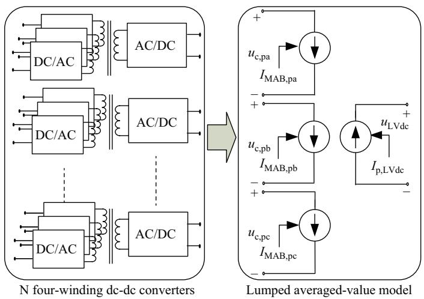  
Fig. 7. Lumped AVM of four-winding DC-DC converters in upper arm.

C. The Proposed AVM Based Efficient EMT Model for FPES

With the aforementioned theoretical analysis and equivalent modeling of MMC and FWMFT based MAB converters, an AVM based efficient EMT model for FPES has been proposed, as shown in Fig. 8. It should be noted that 380 V AC voltage can be provided with a conventional two-level VSC from a 750 V DC link in the FPES. The AVM method is very common for dynamic and stability analysis of two-level VSCs, which is not considered in this paper.

The main features of the proposed AVM of FPES are as follows:

1) Due to the balancing control algorithm, capacitor voltages of all SMs in the same arm of the MMC can be considered to have the same dynamics at every time point. Then, with averaged switching functions and reference voltages $u _ { \mathrm { p k , r e f } }$ and $u _ { \mathrm { n k , r e f } }$ from the system level control of the MMC, capacitor voltage dynamics of SMs and the voltages across the arms of the MMC can be derived. Finally, both the AC-side and DCside model of the MMC can be represented with controlled voltage sources.

2) Assume that all these MAB converters are designed

and controlled with the same dynamics, allowing a lumped averaged model using controlled current and voltage sources to be developed for multiple four-port DC-DC converters and connected to the upper or lower arms of the MMC. It can be seen that the controlled voltages in the input side model are provided by the capacitor voltages of the SMs. For the outside model, a total average is represented as the currents injected into the 750 V DC link by all the four-winding DC-DC converters in the upper or lower arm of the MMC, and the centralized capacitor in the low DC voltage bus can be modeled as N module capacitors in parallel.

# IV. VALIDATIONS OF THE PROPOSED AVM OF FPES

# A. Simulation System

A simulation platform of a hybrid AC/DC distribution network with two FPESs shown in Fig. 9 [8], [9] was built in PSCAD/EMTDC, with both the proposed AVM based efficient EMT model and detailed switching model of FPES being for comparisons in terms of accuracy and computational time. In the AC/DC distribution system, medium AC voltage ports of

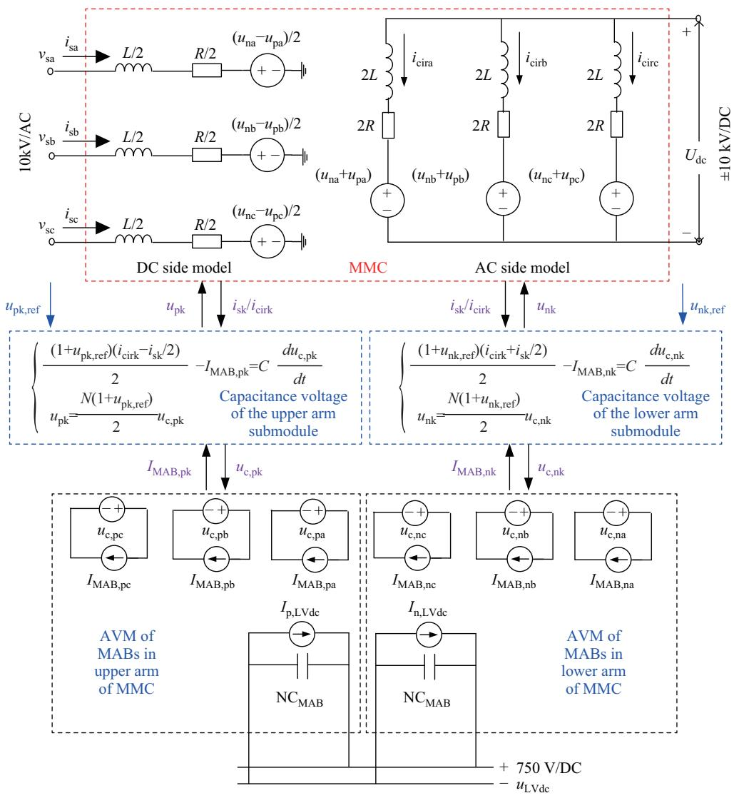  
Fig. 8. AVM based efficient EMT model of FPES.

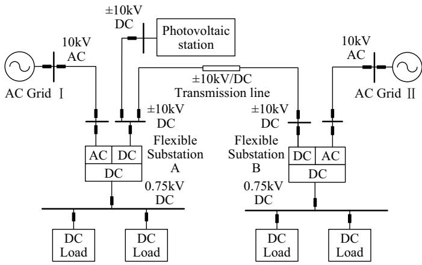  
Fig. 9. Considered AC/DC distribution network based on FPESs.

flexible substations A and B are connected to the AC grid I and AC grid II with a 10 kV voltage level respectively. In addition, the two ±10 kV DC ports of FPES A and B are interlinked through a DC transmission line with a distance of 10 km. A centralized photovoltaic station with 1 MW has been integrated to the ±10 kV DC port of FPES A. In the low DC voltage link, multiple DC loads have been considered. The other detailed parameters have been listed in Table I.

In FPES, medium DC voltage (±10 kV) and low DC voltage (750 V) are normally controlled by the MMC and MAB converters respectively. In order to enhance the dynamic stability of the medium DC voltage control, MMCs in two FPESs adopt the DC voltage droop control, including DC voltage droop, DC voltage control and inner current control, as shown in Fig. 10(a). Then, through the modulation loop, reference voltages for each upper and lower arm (referred to as $u _ { \mathrm { p k , r e f } }$ and $u _ { \mathrm { n k , r e f } } )$ can be obtained, which will be feedbacked to the proposed AVM of FPES in Fig. 8. It should be noted that there is no need for CCSC, due to the double frequency components in DC voltages of SMs and second harmonic circulating currents can be eliminated.

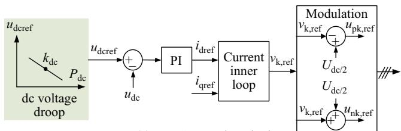

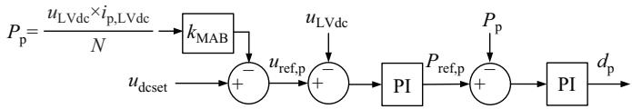  
(a) MMC control method   
(b) Four-winding dc-dc converter control strategy (Take upper arm for example)   
Fig. 10. Control of MMC and MAB converters in FPES.

To achieve coordinated control of multiple MAB converters without additional communications, the DC voltage droop method has also been considered in this study, as shown in Fig. 10(b). $k _ { \mathrm { M A B } }$ is droop gain, $P _ { \mathrm { p } }$ is the power of the MAB converter injected into the 750 V DC bus, $u _ { \mathrm { d c s e t } }$ is the

set voltage when it is unloaded. Reference DC voltage $u _ { \mathrm { r e f , p } }$ is calculated via droop control. Then, through the cascaded low DC voltage control and power tracking control with PI controllers, the phase shift ratio $d _ { \mathrm { p } }$ is finally generated.

The main circuit and control parameters of the FPES, photovoltaic station and DC transmission line in Fig. 9 are listed in Table I. The simulation environment is based on the PSCAD/EMTDC V4.6.0 version, running on Microsoft Win10/64-bit operating system, with the processor being Intel (R) Core (TM) i7-8565U CPU 1.99 GHz, 8 GB of RAM. In terms of accuracy and solution time, simulation results of the proposed AVM and detailed switching model have been compared under the following transient conditions: step change of loads, AC fault in the 10 kV system, and DC fault in the medium voltage DC system.

TABLE I SIMULATION PARAMETERS OF A FLEXIBLE SUBSTATION   

<table><tr><td>Subsystem</td><td>Parameter</td><td>Value</td></tr><tr><td rowspan="10">MMC</td><td>Rated Capacity</td><td>5 MW</td></tr><tr><td>Rated ac line voltage</td><td>10.5 kV</td></tr><tr><td>Rated medium voltage dc voltage</td><td>±10 kV</td></tr><tr><td>Number of SM in an arm</td><td>4</td></tr><tr><td>SM capacitance</td><td>420 μF</td></tr><tr><td>Bridge arm inductance</td><td>14 mH</td></tr><tr><td>Bridge arm resistance</td><td>0.4 Ω</td></tr><tr><td>Droop gain</td><td>0.02</td></tr><tr><td>Voltage control PI parameters</td><td>1/20</td></tr><tr><td>Current control PI parameters</td><td>1/10</td></tr><tr><td rowspan="10">MAB converters</td><td>Rated Capacity</td><td>0.625 MW</td></tr><tr><td>Transformer rated ratio na = nb = nc</td><td>5 kV/0.75 kV</td></tr><tr><td>Transformer rated frequency f</td><td>3000 Hz</td></tr><tr><td>Secondary side capacitance CMAB</td><td>1250 μF</td></tr><tr><td>Equivalent reactance among primary windings</td><td>0.0001 p.u</td></tr><tr><td>Equivalent resistance among primary windings</td><td>0.0009 p.u</td></tr><tr><td>Equivalent reactance between primary and secondary sides</td><td>0.074 p.u</td></tr><tr><td>Droop gain</td><td>0.05</td></tr><tr><td>Voltage control loop kP/ki</td><td>0.2/2</td></tr><tr><td>Power control loop kP/ki</td><td>0.05/10</td></tr><tr><td rowspan="2">Photovoltaic station</td><td>Rated Capacity</td><td>1 MW</td></tr><tr><td>Low-side voltage</td><td>760 V</td></tr><tr><td rowspan="3">DC transmission line</td><td>Line length</td><td>10 km</td></tr><tr><td>Resistance</td><td>0.121 Ω/km</td></tr><tr><td>Inductance</td><td>0.97 mH/km</td></tr></table>

# B. Verification of Simulation Accuracy

# 1) Case 1: Step Change of Load

In this case, the step change of load as a transient disturbance has been considered. The special simulation process is: when $t < 2 ~ \mathrm { s } ,$ , the DC loads of the FPES A and B connected to the low-voltage DC bus (750 V DC) are both 0.6 MW, and the output of the photovoltaic station is 0.5 MW; at t = 2 s, the power of the photovoltaic station is increased to 0.9 MW; at $t = 3 \mathrm { ~ s } ,$ and the DC load in low-voltage DC system of FPES A is changed to 1.2 MW; at $t = 4 \mathrm { ~ s } ,$ , the low-voltage DC load of flexible substation B is increased to 0.9 MW; at t = 5 s, the flexible substation B is disabled to test the performance of the medium DC voltage droop control. Simulation results have been compared under the detailed switching model with solution time step 2 µs, proposed AVM

with 2 µs, and proposed AVM with 50 µs, which are shown in Figs. 11 and 12.

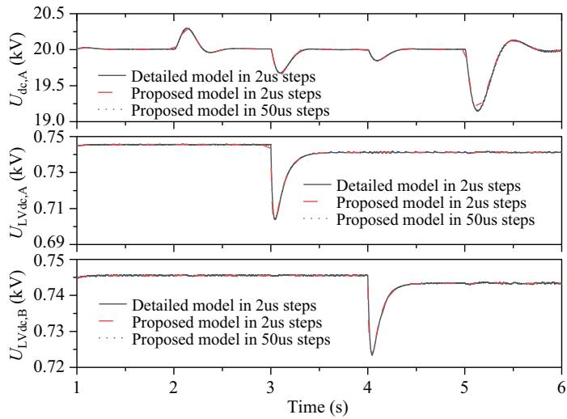  
Fig. 11. Comparison results of voltages under step change of load.

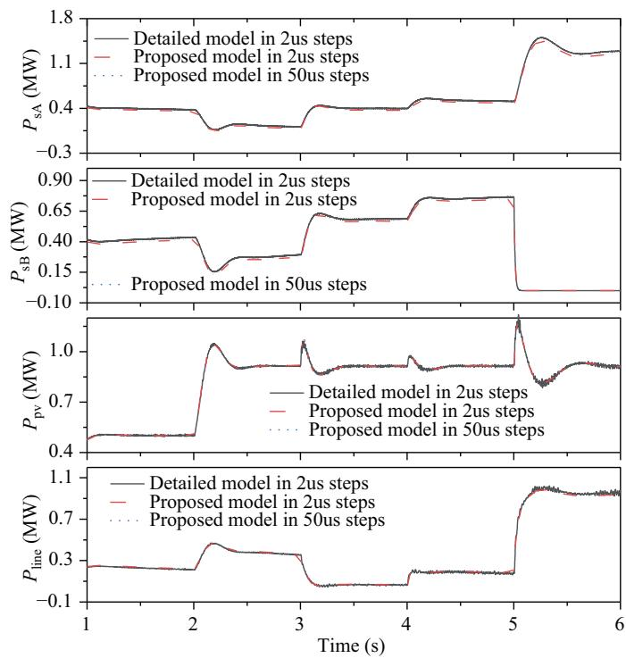  
Fig. 12. Comparison results of powers under step change of load.

In Fig. 11 and Fig. 12, $U _ { \mathrm { d c , ~ A } } , ~ u _ { \mathrm { L V d c , ~ A } } ,$ , and uLVdc, B are the medium DC voltages of FPES $\mathbf { A } ,$ low DC voltages of FPES A and B respectively; $\begin{array} { r } { P _ { \mathrm { s a } } , P _ { \mathrm { s B } } , P _ { \mathrm { p v } } , } \end{array}$ and $P _ { \mathrm { l i n e } }$ are the power in the medium AC voltage side of FPES A and B, output of photovoltaic station, and the power flow in the DC transmission line, respectively. As can be seen, under transients and steady states, the simulation results of the proposed averaged model of FPES are very consistent with the detailed model-based results. Moreover, the proposed AVM can be applied with a larger simulation step (i.e. 50 µs), which can further improve simulation efficiency without affecting the

dynamic performance. $\mathbf { A t } ~ t = 5 ~ \mathrm { s } ,$ , the FPES B is disabled, and the power has been seamlessly transferred to FPES A and the medium DC voltage is also controlled stably after transient, without any additional communications, which can be deduced that the dynamic stability of the medium DC voltage control can be perfectly enhanced with droop control.

# 2) Case 2: Three-phase AC Fault in 10 kV System

In this case, the AC fault in the 10 kV system is adopted as a transient disturbance. The special simulation process is: when $t < 2 ~ \mathrm { s } ,$ , the DC loads of the FPES A and B connected to the 750 V DC ports are 0.9 MW and 0.6 MW respectively, and the output of the photovoltaic station is 0.9 MW; at $t =$ 2 s, a three-phase metal grounding short-circuit fault occurred in the AC Grid II with a fault duration of 50 ms. Simulation results have been compared under the detailed switching model with solution time step 2 µs, proposed AVM with 2 µs, and proposed AVM with 50 µs, which are shown in Fig. 13 and Fig. 14.

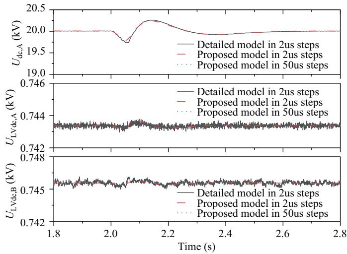  
Fig. 13. Comparison results of voltages under AC fault.

It can be seen that with the proposed averaged model of FPES in both small and large solution time steps (referred to as 2 µs and 50 µs), dynamics and steady values of the simulation results under AC fault are almost consistent with those of the detailed switching model, which should be worked under a small time step for simulation accuracy. The results have verified the effectiveness of the proposed AVM of FPES in an AC fault.

# 3) Unbalanced AC Fault in 10 kV System

In this case, the performance of the proposed model under an unbalanced AC fault is tested. The special simulation process is: when $t < 1 . 4 ~ \mathrm { s } ,$ the DC loads of the FPES A and B connected to the 750 V DC ports are 0.9 MW and 0.6 MW respectively, and the output of the photovoltaic station is 0; at $t = 1 . 4 ~ \mathrm { s } ,$ , the phase A grounding fault occurred in the AC Grid II with fault duration of 200 ms. Simulation results have been compared under the detailed model with solution time step 2 µs, proposed AVM with $2 \ \mu \mathrm { s } ,$ and proposed AVM with 50 µs, which are illustrated in Fig. 15 and Fig. 16.

In Fig. 15, $U _ { \mathrm { d c , A } } , P _ { \mathrm { s , A } }$ , and $P _ { \mathrm { s , B } }$ are the medium DC voltage of FPES A, and the powers in the medium AC voltage side

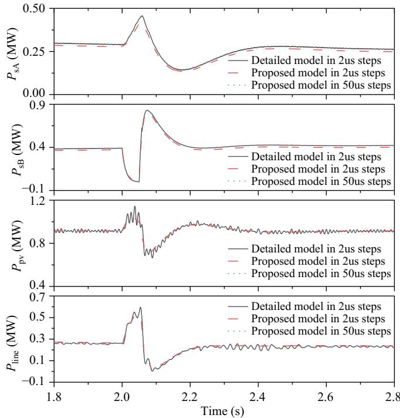

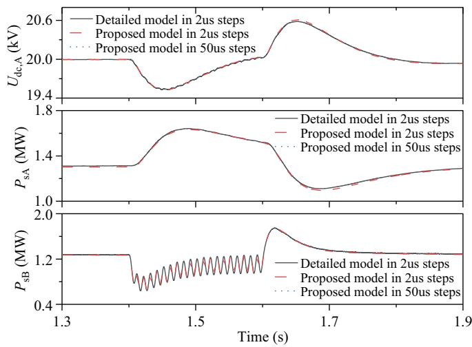  
Fig. 14. Comparison results of powers under AC fault.   
Fig. 15. Comparison results of DC voltage and powers under phase A grounding fault.

of FPES A and B respectively. In Fig. 16, $v _ { \mathrm { s k , B } } ,$ , isk,B, ucpk,B, and $u _ { \mathrm { c n k , B } }$ represent the AC voltages, AC current, upper and the lower SM voltages of phase k in FPES B respectively. It can be seen that: 1) with the proposed AVM of FPES in both small and large computing time steps (referred to as 2 µs and 50 µs), the dynamic response and steady values of the simulation results after being subjected to the phase A grounding fault are almost consistent with those based on the detailed switching model; 2) during the unbalanced AC fault, since the instantaneous powers across the three-phase arms is no longer symmetrical with the adopted control, the power ripples in the three-phase SMs cannot be completely eliminated, resulting in corresponding ripples in the SM voltages. The results have demonstrated the effectiveness of the proposed AVM of FPES in unbalanced AC faults.

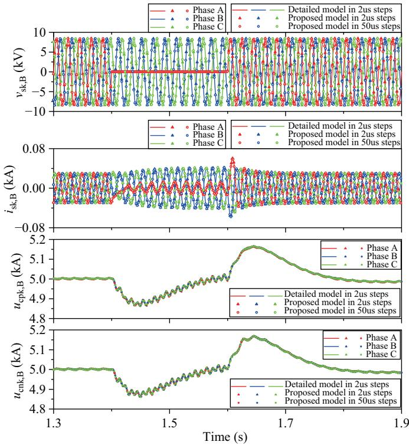  
Fig. 16. Comparison results of AC side voltages, currents and SM voltages under phase A grounding fault.

# 4) Case 4: DC Fault in ±10 kV System

In this case, the transient is the DC fault in $\textbf { a } \pm 1 0$ kV system. The special simulation process is: when $t < 2 ~ \mathrm { s } .$ , the DC loads of the FPES A and B connected to the 750 V DC ports are 0.9 MW and 0.6 MW respectively, and the output of the photovoltaic station is 0.9 MW; at $t = 2 \ \mathrm { s } ,$ a pole-to-pole DC fault occurs at the mid-point of the ±10 kV transmission line, with the transition resistance being 10Ω. After 10 ms, the DC fault is cleared. Simulation results are compared under the detailed switching model with solution time step 2 µs, proposed AVM with 2 µs, and proposed AVM with 50 µs, which are shown in Fig. 17 and Fig. 18.

In Fig. 17, $I _ { \mathrm { f a u l t } }$ is the short-circuit current across the

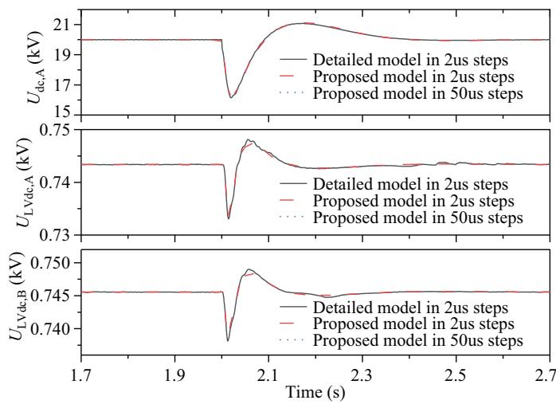  
Fig. 17. Comparison results of voltages under DC fault.

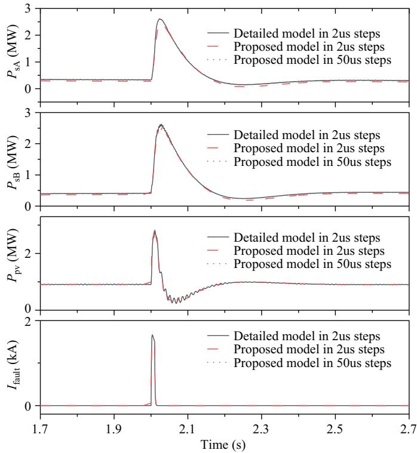  
Fig. 18. Comparison results of powers and fault current under DC fault.

transition resistor. As can be seen from Fig. 17 and Fig. 18, the results with the efficient EMT model proposed in this paper are almost consistent with those of the detailed switching model under DC fault, which verifies the effectiveness of the proposed model. In addition, the waveforms of the equivalent model in 2 µs and 50 µs steps can both fully match the detailed switching model, which indicates that the proposed efficient EMT simulation model of FPES can be used in a wide range of simulation step sizes.

# C. Comparison of Computational Time

Computing times for the simulations of the three cases in Section IV B are compared in Table II.

TABLE II COMPARISON OF COMPUTING TIMES FOR THE SIMULATIONS OF CASE 1∼3   

<table><tr><td rowspan="2">Model</td><td rowspan="2">Solution time step (μs)</td><td>Case 1</td><td>Case 2</td><td>Case 3</td><td>Case 4</td></tr><tr><td>Computing time (s)</td><td>Computing time (s)</td><td>Computing time (s)</td><td>Computing time (s)</td></tr><tr><td>Switching model</td><td>2</td><td>31065.1</td><td>15785.9</td><td>15248.2</td><td>16465.6</td></tr><tr><td rowspan="2">Proposed AVM</td><td>2</td><td>173.765</td><td>81.047</td><td>80.8</td><td>86.625</td></tr><tr><td>50</td><td>7.828</td><td>3.797</td><td>3.763</td><td>3.734</td></tr></table>

The results presented in Table II show that with the same solution time step 2 µs, the computing speed for the proposed AVM based efficient EMT simulation model is improved nearly 200 times when compared to the switching model. Moreover, the time-step and computing speed can be significantly increased for the AVM based efficient EMT simulation model, without affecting its accuracy.

# V. CONCLUSION

In this paper, a novel averaged-value model (AVM) is

first proposed for efficient and accurate representation of the FPES. First, assume that all SM capacitor voltages are perfectly balanced in the arms of the MMC, both AC-side and DC-side model of the MMC can be represented with controlled voltage sources. Then, ignoring differences of the main circuit parameters and control dynamics of all MAB converters, only a lumped averaged model using controlled current and voltage sources is needed to represent dynamic behavior of these multiple FWMFT based MAB converters connected to the upper or lower arms of the MMC. The proposed AVM of the FPES is based on rigorous theoretical derivations. Through detailed simulation comparisons, without affecting accuracy, computing speed by the proposed AVM based efficient EMT simulation model can be significantly increased when compared to the switching model.

For a future study, the following aspects would be recommended. First, with the proposed AVM, a small signal model for the FPES and FPES based hybrid AC/DC distribution networks can be developed. Then, using the small signal model, the dynamic stability of the FPES can be analyzed through eigenvalue theory. Moreover, through interactions between the control systems of MMC and MAB converters, the FPES and weak AC grid, can be further discussed, which may help to achieve optimal control parameters design.

# REFERENCES

[1] A. Q. Huang, M. L. Crow, G. T. Heydt, J. P. Zheng, and S. J. Dale, “The future renewable electric energy delivery and management (FREEDM) system: the energy internet,” Proceedings of the IEEE, vol. 99, no. 1, pp. 133–148, Jan. 2011.   
[2] L. Guo, P. F. Li, X. L. Li, F. Gao, D. Huang and C. S. Wang, “Reduced -order modeling and dynamic stability analysis of MTDC systems in DC voltage control timescale, “ CSEE Journal of Power and Energy Systems, vol. 6, no. 3, pp. 591-600, Sept. 2020.   
[3] X. Liu, Y. Liu, J. Liu, Y. Xiang and X. Yuan, “Optimal planning of AC-DC hybrid transmission and distributed energy resource system: Review and prospects,” CSEE Journal of Power and Energy Systems, vol. 5, no. 3, pp. 409–422, Sept. 2019.   
[4] M. Sabahi, A. Y. Goharrizi, S. H. Hosseini, M. B. B. Sharifian, and G. B. Gharehpetian, “Flexible power electronic transformer,” IEEE Transactions on Power Electronics, vol. 25, no. 8, pp. 2159–2169, Aug. 2010.   
[5] Z. X. Li, F. Q. Gao, C. Zhao, Z. Wang, H. Zhang, P. Wang, and Y. H. Li, “Research review of power electronic transformer technologies,” Proceedings of the CSEE, vol. 38, no. 5, pp. 1274–1289, Mar. 2018.   
[6] B. Zhao, Q. Song, J. G. Li, W. H. Liu, G. H. Liu, and Y. M. Zhao, “High-frequency-link DC transformer based on switched capacitor for medium-voltage DC power distribution application,” IEEE Transactions on Power Electronics, vol. 31, no. 7, pp. 4766–4777, Jul. 2016.   
[7] Z. F. Deng, L. T. Teng, Z. G. Lu, J. Y. Song, G. L. Zhao, Z. Y. Wei, L. H. Cai, Z. K. Wang, and J. Ge, “AC-DC converter circuit and power electronic transformer,” CN Patent 206077238U, Apr. 5, 2017.   
[8] S. Q. Fu, Y. Gao, X. Y. Chen, H. J. Li, H. H. Qi, P. L. Xu, and W. X. Xu, “Research and project practice on AC and DC distribution network based on flexible substations,” Electric Power Construction, vol. 39, no. 5, pp. 46–55, May 2018.   
[9] J. Y. Song, X. Wang, Z. G. Lu, Y. Z. Zhang, H. J. Liu, X. F. Wang, and T. Z. Cao, “A control and protection system in a loop testing technology for a flexible power electronics substation,” in Proceedings of the 13th IEEE Conference on Industrial Electronics and Applications, 2018, pp. 2051–2056.   
[10] H. Saad, S. Dennetiere, J. Mahseredjian, P. Delarue, X. Guillaud, J. ` Peralta, and S. Nguefeu, “Modular multilevel converter models for electromagnetic transients,” IEEE Transactions on Power Delivery, vol. 29, no. 3, pp. 1481–1489, Jun. 2014.

[11] U. N. Gnanarathna, A. M. Gole, and R. P. Jayasinghe, “Efficient modeling of modular multilevel HVDC converters (MMC) on electromagnetic transient simulation programs,” IEEE Transactions on Power Delivery, vol. 26, no. 1, pp. 316–324, Jan. 2011.   
[12] J. Z. Xu, C. Y. Zhao, W. J. Liu, and C. Y. Guo, “Accelerated model of Modular Multilevel Converters in PSCAD/EMTDC,” IEEE Transactions on Power Delivery, vol. 28, no. 1, pp. 129–136, Jan. 2013.   
[13] J. Z. Xu, C. Y. Zhao, and A. M. Gole, “Research on the Thevenin’s´ equivalent based integral modelling method of the modular multilevel converter,” Proceedings of the CSEE, vol. 35, no. 8, pp. 1919–1929, Apr. 2015.   
[14] J. Peralta, H. Saad, S. Dennetiere, J. Mahseredjian, and S. Nguefeu, “Detailed and averaged models for a 401-Level MMC–HVDC system,” IEEE Transactions on Power Delivery, vol. 27, no. 3, pp. 1501–1508, Jul. 2012.   
[15] H. Saad, J. Peralta, S. Dennetiere, J. Mahseredjian, J. Jatskevich, J. A. ` Martinez, A. Davoudi, M. Saeedifard, V. Sood, and X. Wang, “Dynamic averaged and simplified models for MMC-based HVDC transmission systems,” IEEE Transactions on Power Delivery, vol. 28, no. 3, pp. 1723–1730, Jul. 2013.   
[16] J. Z. Xu, A. M. Gole, and C. Y. Zhao, “The use of averaged-value model of modular multilevel converter in DC grid,” IEEE Transactions on Power Delivery, vol. 30, no. 2, pp. 519–528, Apr. 2015.   
[17] Y. N. Chen, Y. Elasser, P. Wang, J. Baek, and M. J. Chen, “Turbo-MMC: minimizing the submodule capacitor size in modular multilevel converters with a matrix charge balancer,” in 2019 20th Workshop on Control and Modeling for Power Electronics (COMPEL), Toronto, Canada, 2019, pp. 1–8.   
[18] P. Wang, Y. N. Chen, Y. Elasser, and M. J. Chen, “Small signal model for very-large-scale multi-active-bridge differential power processing (MAB-DPP) Architecture,” in 2019 20th Workshop on Control and Modeling for Power Electronics (COMPEL), Toronto, Canada, 2019, pp. 1–8.   
[19] C. X. Gao, J. P. Ding, J. Z. Xu, and C. Y. Zhao, “Equivalent modeling method of input series output parallel type dual active bridge Converter,” Proceedings of the CSEE, vol. 40, no. 15, pp. 4955–4964, Aug. 2020.   
[20] F. Zhang, M. M. U. Rehman, R. Zane, and D. Maksimovic, “Improved ´ steady-state model of the dual-active-bridge converter,” in 2015 IEEE Energy Conversion Congress and Exposition (ECCE), Montreal, QC, Canada, 2015, pp. 630–636.   
[21] A. Rodr´ıguez, A. Vazquez, D. G. Lamar, M. M. Hernando, and J. Se- ´ bastian, “Different purpose design strategies and techniques to improve ´ the performance of a dual active bridge with phase-shift control,” IEEE Transactions on Power Electronics, vol. 30, no. 2, pp. 790–804, Feb. 2015.   
[22] K. Zhang, Z. Y. Shan, and J. Jatskevich, “Large- and small-signal average-value modeling of dual-active-bridge DC–DC converter considering power losses,” IEEE Transactions on Power Electronics, vol. 32, no. 3, pp. 1964–1974, Mar. 2017.   
[23] S. Falcones, R. Ayyanar, and X. L. Mao, “A DC–DC multiportconverter-based solid-state transformer integrating distributed generation and storage,” IEEE Transactions on Power Electronics, vol. 28, no. 5, pp. 2192–2203, May 2013.   
[24] Q. R. Tu, Z. Xu, X Zhen g, and M. Y. G Guan, “Mechanism analysis on the circulating current in modular multilevel converter based HVDC,” High Voltage Engineering, vol. 36, no. 2, pp. 547–552, Feb. 2010.   
[25] X. Huang, Z. Wang, Z. H. Kong, J. Xiong, and K. Zhang, “Modular multilevel converter with three-port power channels for medium-voltage drives,” IEEE Journal of Emerging and Selected Topics in Power Electronics, vol. 6, no. 3, pp. 1495–1507, Sep. 2018.   
[26] K. K. Zhang, L. Qi, X. Cui, Y. Li, W. Kang, and G. L. Zhao, “Wideband modeling method of multi-winding medium frequency transformer,” Power System Technology, vol. 43, no. 2, pp. 582–590, Feb. 2019.   
[27] C. P Sun, N. H. Kutkut, D. W. Novotny, and D. M. Divan, “General equivalent circuit of a multi-winding co-axial winding transformer,” in IAS ’95. Conference Record of the 1995 IEEE Industry Applications Conference Thirtieth IAS Annual Meeting, Orlando, FL, USA, 1995, pp. 2507–2514.   
[28] C. Y. Gu, Z. D. Zheng, L. Xu, K. Wang, and Y. D. Li, “Modeling and control of a multiport power electronic transformer (PET) for electric traction applications,” IEEE Transactions on Power Electronics, vol. 31, no. 2, pp. 915–927, Feb. 2016.   
[29] R. W. Erickson and D. Maksimovic, “A multiple-winding magnetics model having directly measurable parameters,” in PESC 98 Record. 29th Annual IEEE Power Electronics Specialists Conference, Fukuoka, 1998, pp. 1472–1478.

[30] S. Ozdemir, N. Altin, A. El Shafei, M. Rashidi, and A. Nasiri, “A decoupled control scheme of four-port solid state transformer,” in 2019 IEEE Energy Conversion Congress and Exposition (ECCE), Baltimore, MD, USA, 2019, pp. 5009–5015.   
[31] C. Samende, N. Mugwisi, D. J. Rogers, E. Chatzinikolaou, F. Gao, and M. McCulloch, “Power loss analysis of a multiport DC – DC converter for DC Grid applications,” in IECON 2018–44th Annual Conference of the IEEE Industrial Electronics Society, Washington, DC, 2018, pp. 1412–1417.

Hong Liu received the B.Sc. degree in Electrical Engineering from Qingdao University, Qingdao, China, in 2019.

He is currently working toward the M.Sc. degree in Electrical Engineering at Tianjin University, Tianjin, China. His current research field is ac/dc hybrid power distribution system and multi-terminal dc grids.

Zhanfeng Deng received the B.S. and M.S. degrees in welding technology and equipment from Jilin Polytechnical University, Changchun, China, in 1996 and the Ph.D. degree in electrical engineering from Tsinghua University, Beijing, China, in 2003.

His research interests include the flexible AC transmission systems and power systems.

Xialin Li (M’15) received the B.Sc. degree and the Ph.D. degree from Tianjin University, Tianjin, China, in 2009 and 2014, respectively.

Since 2018, he has been an associate professor with the School of Electrical Engineering and Automation, Tianjin University, China. In 2016, under the State Scholarship Fund, he was invited as a Visiting Professor to the Department of Electrical and Computer Engineering, University of Alberta, Canada. His current research interests include the modeling and control of power converters, dis-

tributed generation, hybrid ac/dc microgrid, and multi-terminal dc grids (MTDC).

Li Guo (M’11) received the B.Sc. and the Ph.D. degree in Electrical Engineering from South China University of Technology in 2002 and 2007, respectively.

Dr. Guo is currently a full Professor at Tianjin University. His research interests include the optimal planning and design of microgrid, the coordinated operating strategy of microgrid, and the advanced energy management system.

Di Huang received the B.S. and M.S. degrees in electric engineering from Tianjin University in 2017 and 2020, respectively.

He is currently with Guangzhou Power Supply Bureau of Guangdong Power Grid Co., Ltd. His research interests in the flexible DC transmission and distribution system.

Xiangyu Chen received the B.Eng degree and the MA.Eng degree from Tsinghua University, Beijing, China in 2013 and 2015, respectively.

Since 2015, he has been an engineer with State Grid Jibei Electric Power Economic Research Institute. His research interests include power system analysis and flexible DC transmission system.

Shouqiang Fu received the B.Eng degree and the MA.Eng degree from Zhejiang University, Hangzhou, China in 2009 and 2014, respectively.

Since 2014, he has been an engineer with State Grid Jibei Electric Power Economic Research Institute. His research interests include power system analysis and flexible DC transmission system.

Chengshan Wang (SM’11) received the B.Sc. degree, the M.Sc. degree and the Ph.D. degree from Tianjin University, Tianjin, China, in 1983, 1985 and 1991, respectively.

He became a full professor of Tianjin University in 1996. He has been to Cornell University as a visiting scientist from 1994 to 1996 and to Carneigie Mellon University as a visiting professor from 2001 to 2002. Prof. Wang is the gainer of Fok Ying Tung Fund, Excellent Young Teacher Fund of Education Ministry and a winner of National Science Fund

for Distinguished Young Scholars. He is the Chief Scientist of 973 project, “Research on the Key Issues of Distributed Generation Systems” from 2009 to 2013 that was participated by Chinese power engineering scientists from 8 leading institutions. His research is in the area of distribution system analysis and planning, distributed generation system and microgrid, and power system security analysis.