# Implementation of an integrated online instantaneous discrete wavelet transform decomposition toolbox in ATP-EMTP

CrossMark

Nima Mahmoudpour a,c , Farhad Haghjoo b,c , Seyed Mohammad Shahrtash c,⇑

a Azarbaijan Regional Electricity Company, Tabriz, Iran   
b Shahid Beheshti University, Tehran, Iran   
c Center of Excellence for Power System Automation and Operation, Electrical Engineering Department, Iran University of Science and Technology, Tehran, Iran

# a r t i c l e i n f o

Article history:

Received 7 January 2014

Received in revised form 26 November 2014

Accepted 24 December 2014

Available online 17 January 2015

Keywords:

ATP-EMTP software

Discrete wavelet transform

Online decomposition

Power system transients simulation

# a b s t r a c t

Although wavelet transform decomposition has wide applications in the analysis of power system transients due to its multi-resolution analyzing nature, conventional transient simulation programs do not provide an effective inbuilt wavelet transform toolbox for online studies. This paper proposes the development and implementation of an Online Instantaneous Discrete Wavelet Transform Decomposition Toolbox (IWTD toolbox) in ATP-EMTP software by its MODELS programming language. Integration of a powerful online discrete wavelet transform toolbox with alternative transient program makes this software highly functional especially with selectable different full and reduced order mother wavelets with definable reduction degree. The proposed toolbox provides a user-friendly interface with additional capabilities and features for ATP users. Numerous cases simulated and compared with the results of the wellknown MATLAB Wavelet Toolbox have indicated that the proposed toolbox works reliably and accurately in the ATP-EMTP environment.

- 2014 Elsevier Ltd. All rights reserved.

# Introduction

Discrete Wavelet Transform (DWT) is well suited to non-stationary signals whose frequency spectrum is time-variant and may contain both high-frequency components and localized impulses superimposed on power frequency and its harmonics as is typical of fast power system transient signals. The ability of the wavelets to focus on short time intervals for high-frequency components and long time intervals for low-frequency components provides non-uniform division of frequency domain and improves the analysis of wide band electromagnetic transient signals [1]. Due to the wide variety of signals and problems encountered in power engineering, there are different applications of wavelet transform in power system analysis. These include power system protection and relaying [2–13], analysis of power quality disturbances [14–19], high voltage insulation condition monitoring [20–30], power measurement [31–32], and analysis of power system transients [33–35].

Nowadays, among all known software packages for studying power system transients, ATP-EMTP is considered to be one of the most widely used universal programs for simulation of transient phenomena of electromagnetic as well as electromechanical

nature in electric power systems. With this digital program, complex networks and control systems of arbitrary structure can be simulated. ATP-EMTP has also extensive modeling and additional important features besides the computation of transients.

Obviously, an integrated toolbox that can be used to perform wavelet transformation of the ATP simulated waveforms is a highly useful feature for those studies investigating wavelet transformation based techniques. Although several wavelet transform programs such as MATLAB Wavelet Toolbox are available, their usage generally requires that simulated waveforms to be saved in data files and then perform the analysis external to the simulation environment (i.e. ATP-EMTP). This kind of applying DWT and also what has been proposed in [36] should be categorized in offline approaches, as application of DWT is allowed when the whole signal is captured.

It was believed that there are some limitations in employing wavelet transformation in online applications, which had lead to using it only in offline mode; including:

a. Generating any of the upper level wavelet transform components should be performed through a successive step-bystep calculation from the first level up to the desired level. Therefore, there is a time consuming calculation process for each new sample of the original signal when it is calculated.

b. Down-sampling, which is employed by DWT in the decomposition process to avoid increase in computational burden (although it makes the reconstruction process as compulsory, whenever the original signal is required).

Nonetheless, if an online application of DWT is going to be introduced, to the authors’ knowledge, the requirements for an online version of WT can be summarized as follows:

1. The filters’ structures should be based on DWT, which mainly means employing low-pass filters for extracting approximation components in companion with band-pass filters for detail ones (these are basic structural properties of DWT).   
2. The filters for different decomposition levels should provide frequency responses matching with the prescribed frequencybands (this is another basic structural properties of DWT).   
3. The low-pass and band-pass filters at any desired decomposition level should be orthogonal (this is also a basic structural property of DWT).   
4. The procedure of applying each filter should be well-matched with moving data window principle and sample-by-sample calculation in any computational transient analysis (this is the basic formal feature for an online filter).   
5. Simultaneous calculations should be possible for the calculation of detail and/or approximation components at different levels (this is another formal feature for an online filter).   
6. Constructing WT filters, needed for extracting the detail or approximation components at different levels, should be performable without complexity.   
7. Order of the filters should be kept as low as possible, to keep the calculation burden as low as being insertible between samples.

Now, according to the above remarks for the evaluation of any proposed online version of DWT it is deducible that among the few proposed filters in the literature, [37,38] due to lack of the first three properties and [36] due to not possessing the fourth and fifth features cannot be categorized as online WT-based filters. On the other hand, [20,21] have recently proposed instantaneous wavelet transform decomposition filters with reduced order to overcome large calculation burden and compatible with moving data window and sample extraction from signals. These features will be so valuable for WT-based filters if implemented as an inbuilt online toolbox in ATP-EMTP environment. Fortunately, ATP-EMTP provides a powerful feature named MODELS programming language for the representation and study of the time-variant systems, which makes it proper to implement DWT calculations between two consecutive samples in the EMTP based simulation software [39].

In this paper, by taking advantage of the latter filters and MOD-ELS programming capabilities, a novel general-purpose integrated toolbox for the aforementioned purposes is implemented and investigated in ATP-EMTP software. The novelty of the proposed toolbox is that it can be used in an online manner to perform discrete wavelet transform on the samples as soon as they are generated by the simulation at each time-step (together with the previous samples). Thus, it is possible to have integrated simulation of power systems and any monitoring/control/protective apparatuses, such as DWT based protective relays.

In sequel, the theoretical bases of the conventional and Instantaneous Discrete Wavelet Transform Decomposition are described in Section ‘Theoretical bases of the instantaneous discrete wavelet transform decomposition’. Then, the proposed toolbox (IWTD toolbox) and its implementation method in ATP-EMTP are presented in Section ‘The proposed IWTD toolbox’. Section ‘Simulation and results’ contains simulations and the results of the proposed

toolbox considering different cases studies. Comparison between the performance of the proposed toolbox (as an online approach) and MATLAB Wavelet Toolbox (as an offline approach) are also made in this section. Conclusions and future work are included in Section ‘Conclusion’. Appendix A presents the basic equations and programming procedure of the toolbox in brief.

# Theoretical bases of the instantaneous discrete wavelet transform decomposition

Discrete wavelet transform

Wavelets are a family of functions obtained from a function, named as ‘mother wavelet’, w, by dilating and time-shifting. The discrete version of wavelet transform of a discrete signal x(k) is defined as:

$$
\mathrm {D W T} (m, k) = \frac {1}{\sqrt {a _ {0} ^ {m}}} \sum_ {n} x (n) \psi \left(\frac {k - n b _ {0} a _ {0} ^ {m}}{a _ {0} ^ {m}}\right) \tag {1}
$$

where $\psi ( \cdot )$ is the mother wavelet. ${ \boldsymbol { a } } = { \boldsymbol { a _ { 0 } } } ^ { m }$ and $b = n b _ { 0 } { a _ { 0 } } ^ { m }$ are the scaling and the translation parameters, respectively [1]. DWT provides a decomposition of the signal into sub bands with a bandwidth that increases linearly with frequency [36].

In other presentation, DWT is introduced as a set of low-pass (called by H) and band-pass (called by G) filters. Such a structure, with three level of decomposition, has been shown in Fig. 1, where the original signal is decomposed into the approximation (aj) and detail (dj) coefficients. G and H are orthogonal vectors with $N \times 1$ elements. The coefficients of the filters are determined according to the type of the selected mother wavelet. This implementation is commonly known as Mallat tree algorithm [1,12].

# Instantaneous wavelet transform decomposition

It is well known that in conventional DWT, the jth level detail or approximation component can only be calculated after a series of successive convolutions up to the desired level of decomposition.

But according to the new filter proposed in [20], named as ‘‘Instantaneous Wavelet Transform Decomposer’’ or $I W T D _ { ( N ) } ^ { ( j ) } ,$ ; to find the kth element of the $d _ { j }$ along with the kth element of any of upper level components, Eq. $( 2 )$ can be used, where $g _ { j } ( \cdot )$ and $h _ { j } ( \cdot )$ are the elements of $G _ { j }$ and $H _ { j }$ filters, respectively, j is the level of decomposition, N is the number of elements of mother wavelet vectors and $\alpha _ { \mathrm { j } } = 2 ^ { j } - 1$ .

$$
\left[ \begin{array}{c c} \vdots & \vdots \\ d _ {j} (n - 1) & a _ {j} (n - 1) \\ d _ {j} (n) & a _ {j} (n) \end{array} \right] = \left[ \begin{array}{c c c c} \vdots & \ddots & \vdots & \vdots \\ x (n - \alpha_ {j} (N - 1) - 2 ^ {j}) & \ddots & x (n - 1 - 2 ^ {j}) & x (n - 2 ^ {j}) \\ x (n - \alpha_ {j} (N - 1)) & \ddots & x (n - 1) & x (n) \end{array} \right]
$$

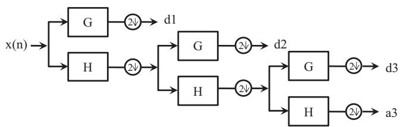  
Fig. 1. Tree implementation of wavelet filters.

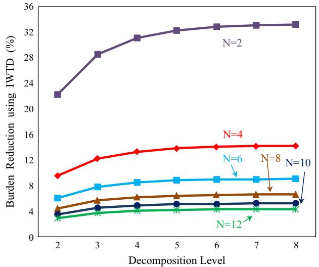  
Fig. 2. Calculation burden reduction at each decomposition level, according to the mother wavelet‘s length.

Using IWTD filter moderately reduces the number of mathematical operations and hence lowers the calculation time rather than the conventional DWT as shown in Fig. 2 for mother wavelets of various orders/elements. It is worth to mention that the calculation burden reduction with IWTD filters is similar for mother wavelets of equal order.

A heuristic technique for further reduction in order/length of IWTD filters also has been introduced in [20], which is based on discarding elements with relatively small magnitudes in the beginning and ending parts of the filter. This has been done by ignoring the elements of IWTD filter whose magnitudes are less than a percentage of the largest magnitude of filter elements. It is obvious that discarding some elements of the filter will lead to some degree of inaccuracy in the results. However, one can make a balance between required accuracy and computation burden with selecting different thresholds for order reduction. Fig. 3 shows the effect of applying this reduction method on the computation burden (with respect to the corresponding conventional filters) for the most well-known discrete mother wavelets where a threshold of 5% has been chosen to discard low magnitude elements. As shown, the advantage of using reduced order IWTD filters gets significant as the mother wavelet order and/or required decomposition level increases. This achievement makes reduced order IWTD appropriate for online applications even with high order mother wavelets and/or when high decomposition levels are desired. To figure out

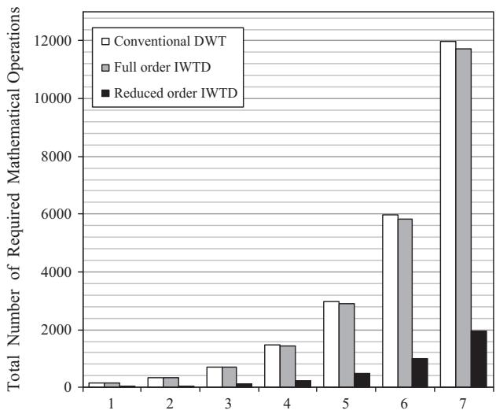  
Fig. 4. Calculation burden reduction at each decomposition level using conventional DWT, full order IWTD and reduced order IWTD (5%) methods for coif4 as the mother wavelet.

the effect of the using reduced order IWTD filters on reducing the number of calculations, Fig. 4 gives a picture of the number of total required mathematical operations for different levels of decomposition with coif4 as mother wavelet (whose length is 24). As expected, since the order of the mother wavelet is relatively high, the full order IWTD method has no significant difference with conventional successive DWT method in the number of calculations; while a great reduction in the calculation burden will be obtained with applying the reduced order IWTD.

To illustrate the effect of order reduction on the filter characteristics, the impulse responses of three IWTD filters with different mother wavelets and different lengths have been shown in Fig. 5, before and after order reduction, where 5% threshold has been applied to find the detail components of the fifth level. It is clear that the full order filters and the reduced order ones are still similar, and the reduced order filters provide the main features of their full order ones with reduced number of elements, and consequently, less time delay and calculation burden.

Finally, further improvement can be obtained in applying IWTD, by increasing resolution, as its important property. In other words, in contrast with DWT, which applies G and H filters to the approximation components of the previous level and hence uses downsampling to obtain halved frequency spectrum output in each level, in IWTD any output is calculated just by using samples of the original signal, where there is no need for down-sampling.

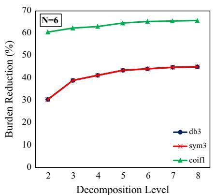

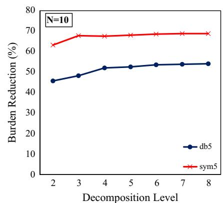

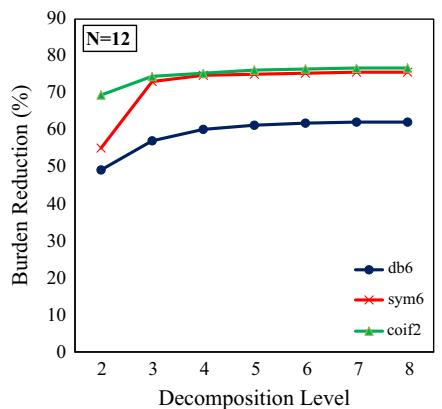  
Fig. 3. Calculation burden reduction using the reduced order IWTD filters (with 5% threshold) with different mother wavelets of the same order (N is the length of mother wavelet).

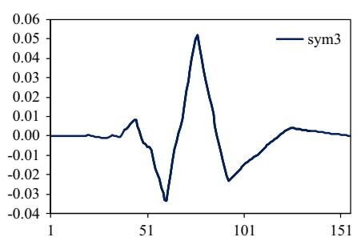

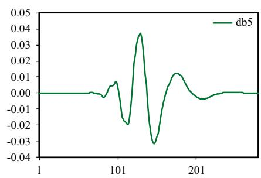

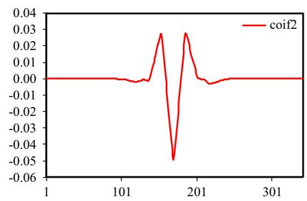

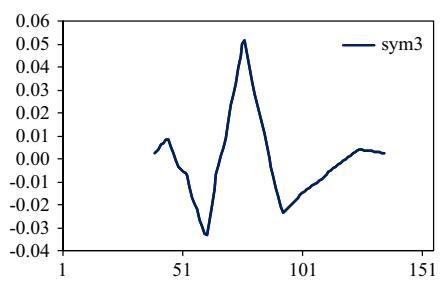

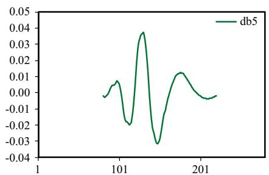

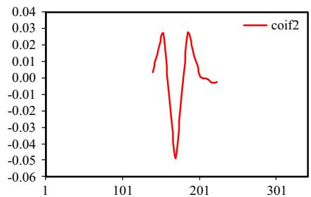  
Fig. 5. The impulse response of the IWTD filters for three different mother wavelets with different orders in 5th decomposition level (top) before order reduction (bottom) and after order reduction (with 5% threshold).

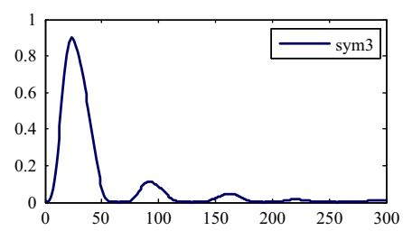

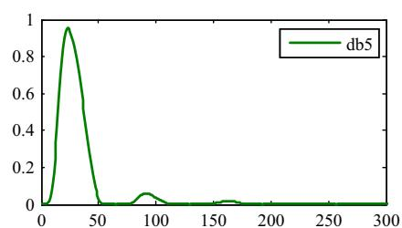

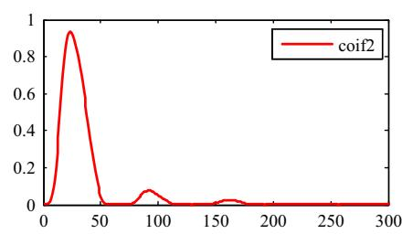

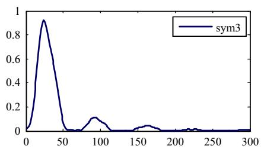

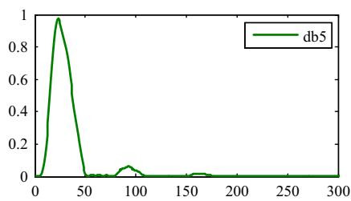

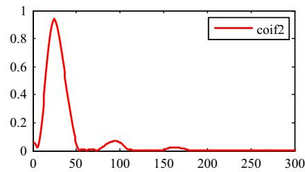

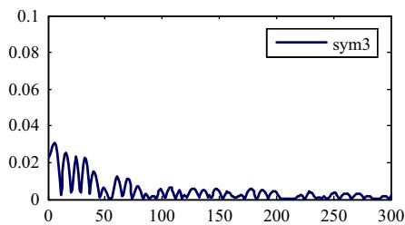

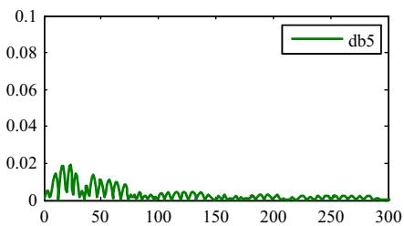

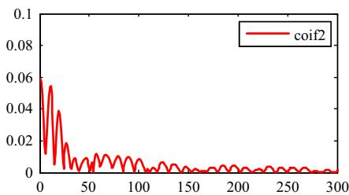  
Fig. 6. The frequency response of the IWTD filters for three different mother wavelets with different orders in 5th decomposition level, full order filters (top); reduced order ones with 5% threshold (middle), and corresponding absolute value of error (bottom).

Moreover, there is no change in the full and/or reduced order IWTD, and it is only the involved samples of the original signal that should be selected to provide higher resolution in the output [20] (the basic relations for applying IWTD are given in Appendix A).

For more investigation on the characteristics of full and reduced order IWTD filters, their frequency responses should be inspected, as shown in Fig. 6. It is obvious that the filters for deriving the components of different decomposition levels should provide

frequency responses similar enough to the corresponding original filters (i.e. full order IWTD as the reference, since it fully matches conventional DWT). Fig. 6 shows that there is a good agreement between frequency responses of the full and the reduced order filters even with an applied 5% reduction and the reduced order filters have appropriate behaviors as desired. In order to have a wider view on this substitution and as a supplementary information to Fig. 3, Fig. 7 illustratively summarizes the relative error of the energy of the reduced order filter (5%) with respect to the full order

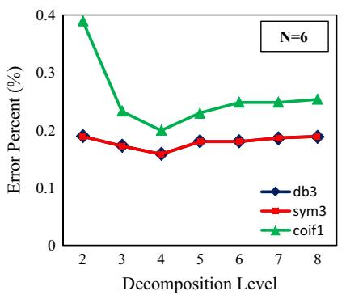

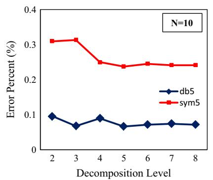

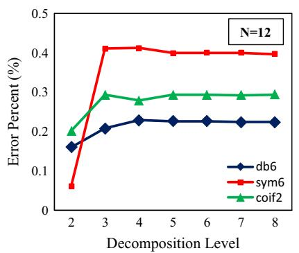  
Fig. 7. The relative error of the energy of the reduced order filter (5%) with respect to the full order filter, at different decomposition levels with various mother wavelets.

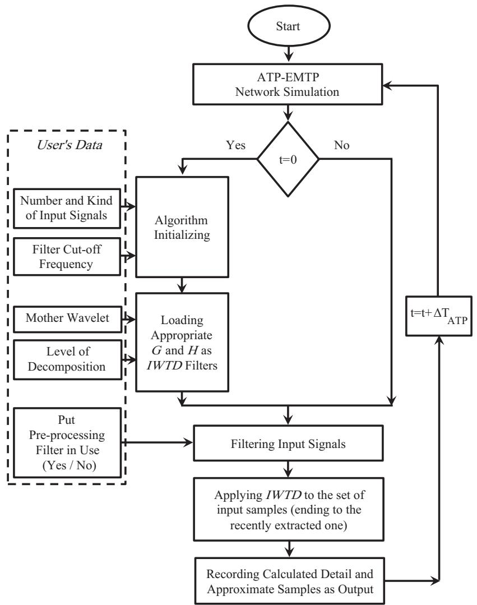  
Fig. 8. The flow diagram of the proposed toolbox in ATP-EMTP environment.

filter, at the corresponding frequency band of different decomposition levels with various mother wavelets. The relative error of the energy for each case was calculated by the following relation:

$$
\operatorname {E r r o r} = \frac {E _ {\text {f u l l}} - E _ {\text {r e d u c e d}}}{E _ {\text {f u l l}}} \times 1 0 0 \tag {3}
$$

where $E _ { f u l l }$ and $E _ { r e d u c e d }$ corresponds to the energy of the considered components at the desired decomposition level for the selected filter.

These results also prove that the proposed reduced order filters are good representatives of the corresponding conventional wavelet filters.

# The proposed IWTD toolbox

As aforementioned, the main characteristics of IWTD filters, i.e.

- having acceptable frequency response characteristics for both detail and approximation decomposition at different levels,   
being matched with moving data window principle, i.e. performing the transformation sample-by-sample, and   
imposing low calculation burden,

make it an appropriate online wavelet-transform filter.

Consequently, a user-friendly IWTD toolbox was implemented in ATP-EMTP which provides an integrated framework for simulation of network transients and wavelet transformation analysis. This toolbox performs online wavelet transformation in any transient analysis of power systems such as protection and power quality issues.

Fig. 8 shows the flow diagram for the proposed online IWTD toolbox. To apply the proposed toolbox, the following parameters should be delivered:

a. The number of simultaneous infeed signals.   
b. The kind of the input signals, for example, type ‘1’ for currents and ‘2’ for voltages [39].   
c. The cut-off frequency of the integrated low-pass Butterworth filter, if in use for pre-processing and signal conditioning purposes.   
d. The desired mother wavelet; currently, different types of mother wavelets have been implemented including Haar, Daubechies (db1, 2, 3, 4, 5, and 6), Symlets (sym1, 2, 3, 4, 5 and 6), Coiflets (coif1 and 2, 3, 4, and 5) and dmey.   
e. The desired decomposition level(s).   
f. The index for applying the full order filter or the reduced one with specifying the threshold for reduction.

Then, appropriate low and band-pass filters for decomposition are loaded into IWTD vector, according to the selected mother wavelet and determined decomposition level(s). In addition, inbuilt digital filter for noise reduction or any other signal conditioning processes can be activated.

During each time-step for MODELS calculation, elements of detail and/or approximation coefficients (corresponding to the applied signal) are calculated and recorded for further use.

Obviously, in order to include this toolbox in MODELS platform, some modifications are needed; including:

a. Inserting the toolbox into the simulation environment.   
b. Adding the required detail and/or approximation outputs to the ATP RECORD list.

# Simulation and results

Numerous studies were carried out on the proposed platform in the ATP-EMTP and MATLAB to evaluate the effectiveness and usefulness of the proposed toolbox.

# Test Case 1 – Comparison between IWTD and DWT in MATLAB environment

The accuracy of IWTD results were validated by comparing them with the results of MATLAB Wavelet Toolbox, which is one of the most widely used tools for wavelet analysis. In order to verify the operation of the proposed toolbox, the same algorithm was developed with reprogramming in MATLAB. Then, the samples of the following non-stationary signal were applied:

$$
\operatorname {S i g n a l} (k) = \left\{ \begin{array}{l l} \operatorname {S i n} (2 \pi f \cdot k \cdot \Delta t) & f = 8 5 0 \mathrm {k H z} \quad k = 1: 2 5 0 \\ - \operatorname {S i n} (2 \pi f \cdot k \cdot \Delta t) & f = 1. 7 5 \mathrm {M H z} \quad k = 2 5 1: 5 0 0 \end{array} \right.
$$

Fig. 9 shows the waveforms of the input signal and the detail coefficients extracted as the output of the proposed toolbox, and also illustrates the comparison of this result and the outputs of MATLAB Wavelet Toolbox. For this case, db2 has been used as the mother wavelet and 10 kHz as the sampling rate and the detail coefficients of the third decomposition level using two aforementioned methods have been shown. As shown, IWTD method has given similar results (albeit with higher resolution) as MATLAB Wavelet Toolbox. The extra elements between two marked points are due to not applying down-sampling in IWTD method, which causes higher resolution in the obtained results. In addition, the results completely comply with the result obtained in [20].

# Test Case 2 – Comparison in ATP-EMTP environment

As a different test case, a typical fault current signal was generated in ATP environment and detail coefficients of the first level of decomposition with full-order db4 mother wavelet were produced in three different ways, as shown in Fig. 10. Sampling frequency of calculations was chosen as 10 kHz.

First, the first detail coefficients by the proposed toolbox were generated (with keeping every other samples; to become comparable with the results of MATLAB Toolbox for the first detail coefficients, which are calculated after one down-sampling) in ATP environment. Second, this output was re-sketched by MATLAB.

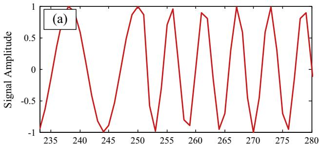

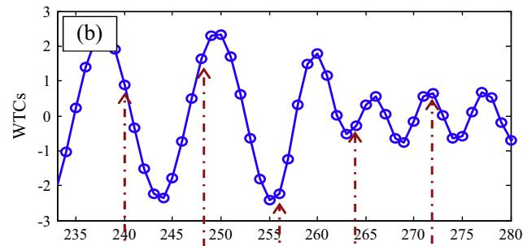

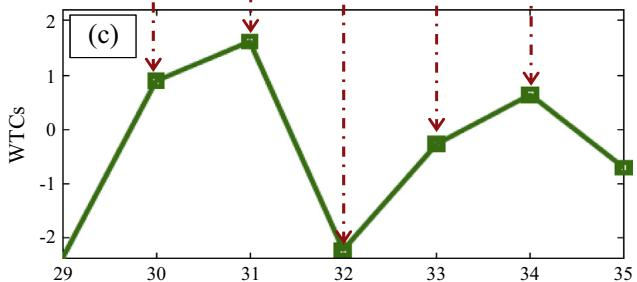  
Samples   
Fig. 9. (a) A non-stationary signal, (b) corresponding third level detail coefficients by the proposed method in MATLAB (without down-sampling), and (c) the output of the MATLAB Wavelet Toolbox (with down-sampling).

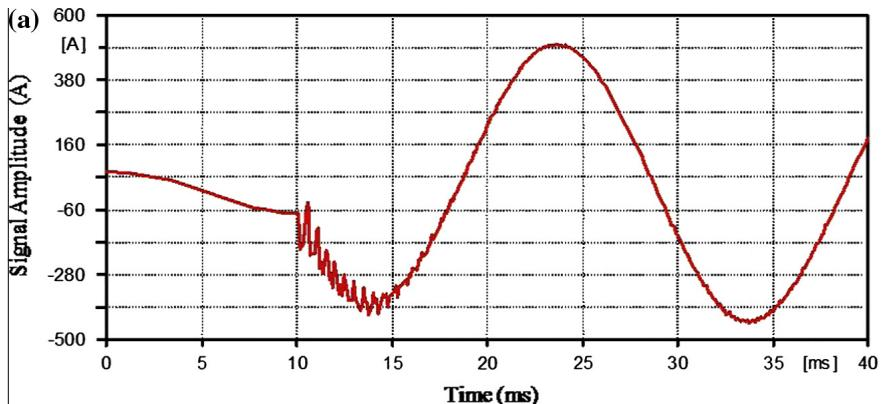

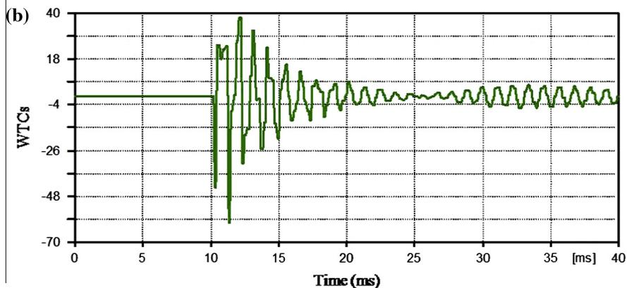

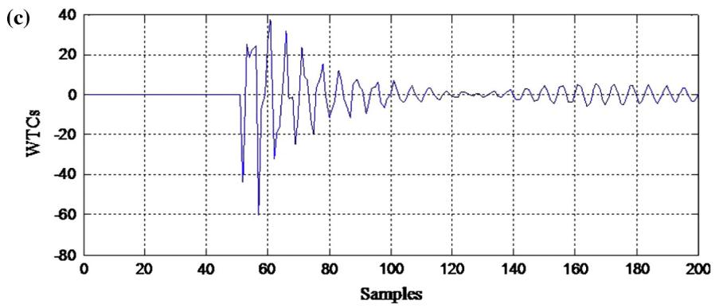

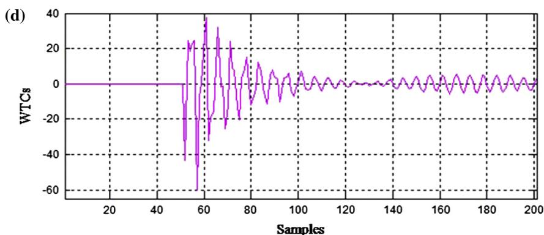  
Fig. 10. (a) Original signal (b) corresponding third level detail coefficients by the proposed toolbox in ATP, with keeping every other samples (c) output of the same algorithm simulated offline in MATLAB (d) offline MATLAB Wavelet Toolbox output (time in the first two figures can be converted to sample by being multiplied by $5 \times 1 0 ^ { + 3 } )$ .

Finally, the output of MATLAB Wavelet Toolbox for the same input in offline mode was extracted. This example shows full conformity of the results of the proposed online IWTD toolbox with the outputs of offline tools, i.e. MATLAB programming and MATLAB Wavelet Toolbox.

Test Case 3 – Comparison between full and reduced-order filters

The aim of this case study is to show the sample-by-sample construction of detail and/or approximation components and also the suppression of the time delay problem in DWT calculations

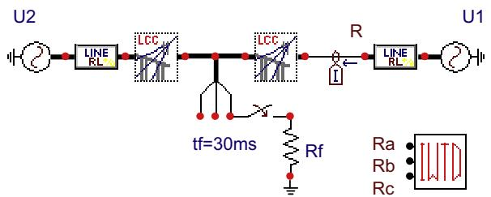  
Fig. 11. Online IWTD Toolbox applied in a sample ATP transient study for decomposing phase current signals.

(which has been addressed in [20,36]), by applying the proposed toolbox, when full or reduced order filters are applied. Among extensive simulation studies, an application of the proposed online toolbox has been shown in Fig. 11, where a fault study on a transmission line was considered. The utilized sampling rate was 20 kHz and the chosen mother wavelet was sym6, as an example, while the currents in different phases were selected as input signals of the toolbox. Only the detail coefficients of the faulty phase

in second, fourth and sixth decomposition levels have been reported here (by applying both full and reduced order IWTD filters). As shown in Fig. 12, as the level of decomposition increases, the time delay of the output coefficients gets longer. For a specific decomposition level, when full order filters are used (not shown), the time delay problem is much more distinguished. This problem is unavoidable in online calculations employing full-order filters and gets worse if the conventional DWT was employed. However, by applying the reduced order versions of the proposed filters, it can be observed that the output coefficients are almost instantaneously generated. For example, in the fourth decomposition level, the output time delay is 3 ms with full order filters and 0.25 ms with reduced order filters (5%).

This verifies the fact that the proposed reduced filters highly suppress the time delay difficulty, with more effective contribution in higher decomposition levels. Consequently, the capability of the proposed toolbox in fast and online calculation of the wavelet decomposition detail and approximation coefficients by applying full and/or reduced order filters makes it exceedingly appropriate for any online transient studies in ATP-EMTP simulation environment.

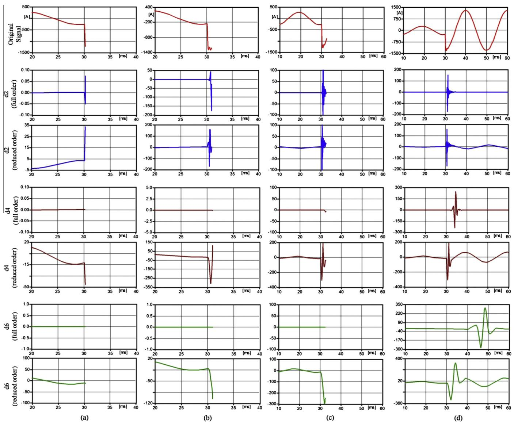  
Fig. 12. Step-by-step simulation of a typical fault current signal in ATP and comparison between its related detail decomposition coefficients at different levels, applying the proposed toolbox with full and reduced-order Sym6 mother wavelet (with 5% threshold). (a) Five samples after fault inception. (b) Twenty samples after fault inception. (c) Fifty samples after fault inception. (d) Thirty milliseconds (equal to 300 samples) after fault inception.

Table A.1 Basic relations for full order and reduced order IWTD filters.   

<table><tr><td>Full order IWTD filter for calculation of any detail component in a decomposition level</td><td>[ : dj(n-1) dj(n)] = [ x(n-αj(N-1)-1) x(n-αj(N-1)) ... x(n-2) x(n-1) x(n-1) ] ∑i=2Hij·G Gj = Hjj·Gj-1
Hjj = [H]Two rows shift [H]Other elements are zero [H]</td></tr><tr><td>Full order IWTD filter for calculation of any approximation component in a decomposition level</td><td>[ : a_j(n-1) a_j(n)] = [ x(n-αj(N-1)-1) x(n-αj(N-1)) ... x(n-2) x(n-1) x(n-1) ] ∑i=2Hij·Hj-1
Hj = Hjj·Hj-1</td></tr><tr><td>Reduced order IWTD filter for calculation of any detail component in a decomposition level</td><td>[ : d_j(n-1) d_j(n)] = [ x(n-lGr_j) ... x(n-2) x(n-1) x(n-1) x(an-1) x(n)]·Gr_j
Gr_j is the length of reduced order filter, i.e. Gr_j</td></tr><tr><td>Reduced order IWTD filter for calculation of any approximation component in a decomposition level</td><td>[ : a_j(n-1) a_j(n)] = [ x(n-lHr_j) ... x(n-2) x(n-1) x(n-1) x(n-1) x(n-1) x(n-1) x(Hr_j)</td></tr></table>

# Overall

In order to simulate a power system, e.g. with closed-loop operation of protection and/or control systems, it is obvious that the requirements of online applications should be fulfilled, i.e. the whole time of data processing after capturing any new data should not exceed the sampling time interval.

Regarding the above constraint makes the user to select a mother wavelet whose corresponding reduced filter has the highest accuracy and low enough calculation operations. This tradeoff, obviously, depends on how much data processing are remained and how much accuracy is enough for the desired application.

Now, the user may be in the situation of computing the components of a decomposition level by selecting one of the reduced order filters (with 5% reduction). As some examples, employing the reduced db3 for the fifth level requires 96 additions and 97 multiplications (more than 40% reduction in the calculation burden with respect to the conventional filter, as shown in Fig. 3) with the accuracy of more than 99.8% (as shown in Fig. 7), or employing the reduced sym5 for the seventh level contains 378 additions and 379 multiplications (more than 65% reduction in the calculation burden) with the accuracy of more than 99.75%, and/or selecting the reduced coif2 for the sixth level contains 169 additions and 170 multiplications (more than 70% reduction in the calculation burden) with the accuracy of more than 99.7%. Therefore, it seems that the main concern should be the calculation burden, as the accuracies are nearly the same.

Whichever of the filters might be selected, the corresponding reduced order filters can be implemented as shown in Fig. 8.

# Conclusion

An integrated online instantaneous wavelet transform decomposition toolbox has been developed and implemented in ATP-EMTP simulation environment. The proposed toolbox can be used as an additional capability in ATP-EMTP for performing DWT analysis simultaneously on various signals with the most functional mother wavelets in transient studies. The toolbox can handle full and/or reduced order filters, with any degree of reduction. Accuracy, speed and resolution of the calculations have been comprehensively validated against MATLAB Wavelet Toolbox and with reprogramming in MATLAB environment. Operation and performance of the presented toolbox have been shown through several test cases and its powerful aspects over similar packages and methods have been emphasized. Future ongoing research may lead to develop and implement another toolbox for the purpose of

online de-noising and reconstruction of original signals with suppressed noise, to be employed in power system transients and protection studies.

# Appendix A

# The basic IWTD equations

In the jth decomposition level, the nth element of the detail and approximation coefficients (without down sampling), i.e. dj(n) and aj(n) respectively, can be found from the corresponding equations in Table A.1. It should be noted that:

– Grj and Hrj are the reduced order IWTD filters, (whose examples have been shown in Fig. 5).   
– Simultaneous calculation of different elements is also possible with combining corresponding relations from Table A.1.

# The programming procedure

As described earlier, the proposed toolbox includes a database of full and/or reduced order IWTD filters, which have been prepared in MATLAB programming platform and aggregated as a filter data base in the initialization section of the program in MODELS environment. As soon as the program is executed, all required filters are loaded from data base and afterward the detail and/or approximate samples of the input signals at the selected level are calculated in each time step as the simulation proceeds. Fig. A.1 illustrates the basic structure of all processes as a simple block diagram.

The following is the summary of main programming part of the proposed toolbox in MODELS language:

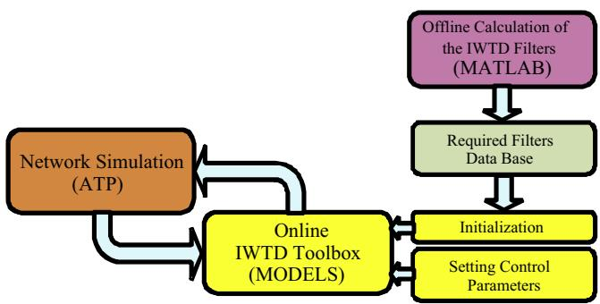  
Fig. A.1. Structure of the proposed toolbox.

EXEC PRE-PROCESSING FILTERING IF FILTER=1 THEN FOR i:=1 TO Inp_No DO LAPLACE(Fx[i]/x[i]:= (1|s0)/ (1|s0+(1.4142/Wc)|s1+(1/(Wc*Wc))|s2) ENDFOR ELSIF FILTER=0 THEN FOR i:=1 TO Inp_No DO Fx[i]:= x[i] ENDFOR ENDIF APPLYING-IWTD IF (t>Lg*DeltaT) and (t>Lh*DeltaT) THEN D[1..Inp_No]:= 0 A[1..Inp_No]:= 0 FOR k:=0 TO (Lg-1) DO FOR kk:=1 TO Inp_No DO D[kk]:=D[kk]+delay(Fx[kk], k*DeltaT)*g[k+1] ENDFOR ENDFOR FOR k:=0 TO (Lh-1) DO FOR kk:=1 TO Inp_No DO A[kk]:=A[kk]+delay(Fx[kk], k*DeltaT)*h[k+1] ENDFOR ENDFOR ENDIF ENDEXEC

# References

[1] Kim CH, Aggarwal R. Wavelet transforms in power systems Part 1, general introduction to the wavelet transforms. Power Eng J 2000;14(2):81–7.   
[2] Youssef OAS. A wavelet-based approach for protection of generators against unbalanced currents. Electric Power Syst Res 2002;63(1):73–80.   
[3] Combastel C, Lesecq S, Petropol S, Gentil S. Model-based and wavelet approaches to induction motor online fault detection. Control Eng Practice 2002;10(5):493–509.   
[4] Youssef OAS. Combined fuzzy-logic wavelet-based fault classification technique for power system relaying. IEEE Trans Power Deliv 2004;19(2):582–9.   
[5] Youssef OAS. New algorithm to phase selection based on wavelet transforms. IEEE Trans Power Deliv 2001;17(4):908–14.   
[6] Chaari O, Meunier M, Brouaye F. Wavelets: a new tool for the resonant grounded power distribution systems relaying. IEEE Trans Power Deliv 2002;11(3):1301–8.   
[7] Kitayama M. Wavelet-based fast discrimination of transformer magnetizing inrush current. Electrical Eng Japan 2007;158(3):19–28.   
[8] Youssef OAS. A wavelet-based technique for discrimination between faults and magnetizing inrush currents in transformers. IEEE Trans Power Deliv 2003;18(1):170–6.   
[9] Perera N, Rajapakse AD, Buchholzer TE. Isolation of faults in distribution network with distributed generators. IEEE Trans Power Deliv 2008;23(4):2347–55.   
[10] Sadeghian A, Ye Z, Wu B. Online detection of broken rotor bars in induction motors by wavelet packet decomposition and artificial neural networks. IEEE Trans Instrum Measure 2009;58(7):2253–63.   
[11] Cade IS, Keogh PS, Necip Sahinkaya M. Fault identification in rotor/magnetic bearing systems using discrete time wavelet coefficients. IEEE/ASME Trans Mechatronics 2005;10(6):648–57.   
[12] Mahmoudpour N, Jamali S, Shahrtash SM. Transient directional relay at the interconnection of remote distributed generations to distribution network. In: Proc. of the international conference on power systems transients (IPST 2011). Delft, The Netherlands; June 2011. p. 10–15.   
[13] Jensen CF, Nanayakkara OMKK, Rajapakse AD, Gudmundsdottir US, Bak CL. Online fault location on AC cables in underground transmission systems using sheath currents. Electric Power Syst Res 2014;115:74–9.   
[14] Santoso S, Powers EJ, Grady WM. Power quality disturbance data compression using wavelet transform methods. IEEE Trans Power Deliv 1997;12(3):1250–7.   
[15] Mokhtari H, Karimi-Ghartemani M, Reza Iravani M. Experimental performance evaluation of a wavelet-based online voltage detection method for power quality applications. IEEE Trans Power Deliv 2002;17(1):161–72.

[16] Karimi M, Mokhtari H, Reza Iravani M. Wavelet based online disturbance detection for power quality applications. IEEE Trans Power Deliv 2000;15(4):1212–20.   
[17] Pérez E, Barros J. A proposal for online detection and classification of voltage events in power systems. IEEE Trans Power Deliv 2008;23(4):2132–8.   
[18] Gaouda AM, Kanoun SH, Salama MMA, Chikhani AY. Pattern recognition applications for power system disturbance classification. IEEE Trans Power Deliv 2002;17(3):677–83.   
[19] Barros J, Diego RI, Apráiz M. Applications of wavelets in electric power quality: voltage events. Electric Power Syst Res 2012;88:130–6.   
[20] Shahrtash SM, Haghjoo F. Instantaneous wavelet transform decomposition filter for online applications. Iranian J Sci Technol 2009;33(B6):491–510.   
[21] Haghjoo F, Shahrtash SM. Wavelet transform based decomposition and reconstruction for online PD detection and measurement – Part I: Narrow band components decomposition. Eur Trans Electrical Power 2010;20(7):901–14.   
[22] Zhang H, Blackburn TR, Phung BT, Sen D. A novel wavelet transform technique for online partial discharge measurements. Part 1. WT de-noising algorithm. IEEE Trans Dielectrics Electrical Insulation 2007;14(1):3–14.   
[23] Zhang H, Blackburn TR, Phung BT, Sen D. A novel wavelet transform technique for online partial discharge measurements. Part 2. WT de-noising algorithm. IEEE Trans Dielectrics Electrical Insulation 2007;14(1):15–22.   
[24] Su J, Xu S, Chen C. Application of signal adapted wavelet to online partial discharge measurement. Eur Trans Electrical Power 2004;14(5):311–20.   
[25] Lalitha EM, Satish L. Wavelet analysis for classification of multi-source PD patterns. IEEE Trans Dielectrics Electrical Insulation 2000;7(1):40–7.   
[26] Werle P, Akbari A, Borsi H, Gockenbach E. Enhanced online PD evaluation on power transformers using wavelet techniques and frequency rejection filter for noise suppression. In: IEEE international symposium on electrical insulation; 2002. p. 195–98.   
[27] Wang H, Tan K, Zhu D. Experimental study on extraction of partial discharge signals from narrow band interference using wavelet transform. High Voltage Eng 1998;24(4):3–5.   
[28] Florkowski M, Florkowska B. Wavelet-based partial discharge image denoising. IET Gener Transm Distrib March 2007;1(2):340–7.   
[29] Hashmi M, Lehtonen M, Nordman M, Jabbar RA, Qureshi SA. Wavelet-based de-noising of online PD signals captured by Pearson coil in covered-conductor overhead distribution networks. Int J Electr Power Energy Syst 2012;43(1):1185–92.   
[30] Hussain GA, Shafiq M, Kumpulainen L, Mahmood F, Lehtonen M. Performance evaluation of noise reduction method during online monitoring of MV switchgear for PD measurements by non-intrusive sensors. Int J Electr Power Energy Syst Jan. 2015;64:596–607.

[31] Hamid EY, Kawasaki ZI. Wavelet packet transform for RMS values and power measurements. IEEE Power Eng Rev 2001;21(9):49–51.   
[32] Woen-Ki Y, Devaney MJ. Power measurement using the wavelet transform. IEEE Trans Instrum Measure 1998;47(5):1205–10.   
[33] Magnago FH, Abur A. Wavelet-based simulation of transients along transmission lines with frequency dependent parameters. In: IEEE power engineering society summer meeting. vol. 2; 2000. p. 689–94.   
[34] Wilkinson WA, Cox MD. Discrete wavelet analysis of power system transients. IEEE Trans Power Syst 1996;11(4):2038–44.   
[35] Meliopoulos APS, Chien-Hsing L. An alternative method for transient analysis via wavelets. IEEE Trans Power Deliv 2003;18(1):170–6.

[36] Perera N, Rajapakse AD, Jayasinghe RP. Online discrete wavelet transform in EMTP environment and applications in protection relaying. In: The international conference on power systems transients (IPST2007). Lyon, France; June 2007.   
[37] Youssef OAS. Online applications of wavelet transforms to power system relaying. IEEE Trans Power Deliv 2003;18(4):1158–65.   
[38] Youssef OAS. A modified wavelet-based fault classification technique. Electric Power Syst Res 2002;64(2):87–94.   
[39] Dube L. User’s Guide to MODELS in ATP; 1996.