# Structure Preserving Aggregation Method for Doubly-Fed Induction Generators in Wind Power Conversion

Wei Li , Member, IEEE, Iman Kaffashan, Graduate Student Member, IEEE, Aniruddha M. Gole, Fellow, IEEE, and Yi Zhang , Fellow, IEEE

Abstract—An aggregation method is proposed that transforms the multiple DFIGs into an equivalent DFIG model that retains the major collective dynamic characteristics of a group of DFIGs. It is intended for Electromagnetic Transients Simulation (EMT). The aggregated machine can take into account different speeds and parameters of each of the individual DFIGs and the connecting impedance of individual DFIGs. Starting with a State Variable (SV) model of an individual DFIG, aggregation is carried out recursively, by combining two DFIGs at a time and then reducing the order of the aggregate to match the state variable equations of a single DFIG so that the steady state performances are identical. Validation is carried out by comparing the detailed electromagnetic transient (EMT) simulation of the unreduced system with the reduced aggregate system. It is shown that the proposed aggregation method accurately matches the steady state response and also accurately reproduces the dominant transient response of the unreduced system. As the aggregate DFIG has the same number of state variables as a single DFIG, the overall wind farm’s order is reduced significantly to increase the modelling and simulation efficiency.

Index Terms—Aggregation method, DFIG, dynamic model, EMT simulation, structural preserving.

# NOMENCLATURE

<table><tr><td colspan="2">Amplitude, frequency and angle modulation indices of GSC</td></tr><tr><td colspan="2">Amplitude, frequency and angle modulation indices of RSC</td></tr><tr><td colspan="2">Back to back converter dc link capacitance and its voltage</td></tr><tr><td colspan="2">GSC d and q-axis component current</td></tr><tr><td colspan="2">Rotor d and q-axis component current</td></tr><tr><td colspan="2">Stator d and q-axis component current</td></tr><tr><td colspan="2">Stator leakage, rotor leakage and mutual inductance of induction machine</td></tr></table>

Manuscript received February 21, 2021; revised June 11, 2021 and October 10, 2021; accepted November 3, 2021. Date of publication November 9, 2021; date of current version May 20, 2022. This work was supported by the IRC Program of the Natural Sciences and Engineering Research Council (NSERC) of Canada. Paper no. TEC-00196-2021. (Corresponding author: Wei Li.)

Wei Li, Iman Kaffashan, and Aniruddha M. Gole are with the University of Manitoba, Winnipeg, Manitoba R3T 2N2, Canada (e-mail: wei.li2@ umanitoba.ca; kaffashi@myumanitoba.ca; aniruddha.gole@umanitoba.ca).

Yi Zhang is with RTDS Technologies Inc., Winnipeg, Manitoba R3T 2E1, Canada (e-mail: yzhang@rtds.com).

Color versions of one or more figures in this article are available at https://doi.org/10.1109/TEC.2021.3126571.

Digital Object Identifier 10.1109/TEC.2021.3126571

<table><tr><td>Ls_g, Rs_g</td><td>GSC side inductance and resistance</td></tr><tr><td>Ls_r, Rs_r</td><td>RSC side inductance and resistance</td></tr><tr><td>r_r, rs</td><td>Rotor and stator resistance of induction machine</td></tr><tr><td>R, X</td><td>Equivalent impedance resistance and reactivity</td></tr><tr><td>Tm, Te</td><td>Prime mover and electromagnetic torque</td></tr><tr><td>VH, VL, VT</td><td>Three-winding transformer high, low and tertiary winding nominal voltage</td></tr><tr><td>V0, θ0</td><td>PCC bus voltage magnitude and angle</td></tr><tr><td>ωr, ωs</td><td>Rotor and synchronous angular velocity</td></tr><tr><td>λdr, λqr</td><td>Rotor d and q-axis component flux linkage</td></tr><tr><td>λds, λqs</td><td>Stator d and q-axis component flux linkage</td></tr></table>

# I. INTRODUCTION

W IND power is the world’s fastest growing energy sourcein the past decade. An even higher wind power penetra- in the past decade. An even higher wind power penetration demand is expected to arrive in a near future [1]. To date, the two most widely used large scale wind energy conversion systems are the doubly fed induction generator (DFIG) and the permanent magnet synchronous generator (PMSG) [2]. Aggregation of DFIGs is the focus of this paper. The DFIG is a variablespeed wind turbine generation system, which can harness wind power with higher efficiency compared with fixed-speed systems [3]–[5]. Accumulated experience from installations over the world, demonstrates its many advantages. It increases the energy conversion efficiency, it has a large single-unit capacity and reduced mechanical stress caused by wind gusts [6]. However, modern wind farms require an expensive power converter interface to capture the maximum power from the wind at different rotor speeds [7]. Nevertheless, the power converter makes an asynchronous connection between the induction machine and the grid, and enables independent control of active and reactive power [8]. The converter only has to process the slip power in the rotor circuits, which is approximately 30% of the generator’s total power, in comparison with Type 4 generators where power electronic converters must have the full power rating [9].

The proposed aggregate DFIG model of wind farm is intended for representing the collective behavior of a group of DFIGs in a power system for steady state and dynamic behaviors. Hence the model can be used for efficient EMT simulations of several phenomena such as faults, instability, SSR and so on with a fraction

of the computational resources of modelling the entire system in detail with multiple DFIGs. It is not intended for protection studies of individual DFIGs within the farm as the identity of individual machines is not retained. This is a feature desired by many system level modelers for studying very large systems. It is particularly important for real-time simulators, where hardware limitations may preclude a fully detailed representation. A large grid can have several wind farms, each with hundreds of DFIGs. If each DFIG were individually modelled in detail on an electromagnetic transients (EMT) simulation platform, the overall model order would become extremely large, and the simulation would require a very large computation time [10], or in the case of real-time simulators, this would require increased number of processor cores. An accurate DFIG aggregation is an important step to reduce the computation burden of large scale power system studies that include windfarms [11].

For power system aggregation, traditional power networks with synchronous generators commonly use a coherency based aggregation approach [12]–[14], where closely coherent generators are clubbed into a single equivalent generator. However, “coherency” has a different meaning for DFIGs, as the induction generators are inherently asynchronous [15]. The “single-machine” wind farm aggregation method is reported in [16]–[18], where it is assumed that the whole wind farm operates uniformly in wind speed and power output terms, so an aggregated single wind turbine generator (WTG) is sufficient to represent the entire wind farm [19]. However, as the wind farm spans a wide area, this model is too simplified as it ignores wake effects, and type-differences between WTGs. To surmount these drawbacks, the multi-machine method [20]–[23], is proposed and is gaining popularity. Here, WTGs within a wind farm are clustered into different groups according to the similarity of WTG types and operating conditions, and each group is represented by an equivalent model [24]. Despite their popularity in literature, the methods still have disadvantages. Because wind speeds continuously change, the initial WTG aggregation groups may change as time progresses [25], and the transient simulation results from the aggregated equivalent and the original unreduced model do not always match. There are also low order models of type 3 wind turbine proposed in [26], [27] to study the system frequency response characteristics. In [28], a modelling method is proposed for the dynamic frequency response of type 3 wind turbines based on the mass-spring-damping concept, which provides a clear physical interpretation and mathematical description of type 3 wind turbine dynamics. Similar aggregated equivalent models have been proposed for other studies such as sub-synchronous resonance (SSR) [29].

In this paper, a new aggregation method for time domain EMT simulation that reproduces the transient voltages and currents from the terminals of the windfarm when connected to an external network is proposed for representing the collective dynamic behavior of a group of DFIGs with a single equivalent DFIG. It is intended for simulation studies concerning interactions of the entire windfarm following events in the larger external network. Starting from the state space dynamic model of the wind turbine generator, an aggregated DFIG model is developed which retains the same block structure as an individual DFIG

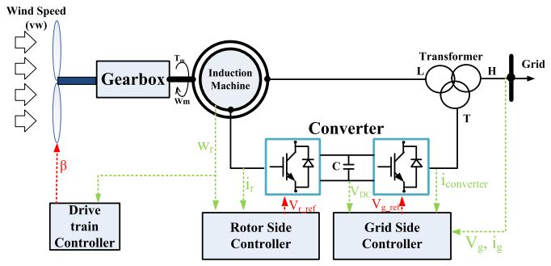  
Fig. 1. Schematic structure of DFIG.

from the DFIG cluster, but with adjusted parameter values. As multiple DFIGs are represented by a single DFIG, this results in considerable computational efficiency. This method is capable of aggregating DFIGs with different generator parameters and different incident wind speeds. To account for the power loss in impedances connecting individual DFIG to the collector system an equivalent impedance is included. A modified transformer model with the primary side current magnifying function is developed to implement the aggregate model in EMT simulation software.

Using electromagnetic transient (EMT) simulation, it is shown that the proposed aggregate model is able to retain the same steady state response and reproduce the essential transient response of the full system with a comparatively high accuracy. EMT simulation examples of a two machine system and a demonstration wind farm composed of 10 DFIGs is used to validate the effectiveness of the proposed aggregation method.

Following the introduction in Section I, a structurally complete dynamic model of a DFIG consisting of an induction machine, a back to back converter and a three-winding transformer is developed in Section II. In section III, a generalized state space mathematical aggregation procedure is developed, which aggregates the multiple DFIGs into a single DFIG. Section IV compares simulation results from detailed and aggregated modelling to validate the aggregation approach. Conclusions are presented in Section V.

# II. DFIG STATE SPACE DYNAMIC MODEL

A DFIG wind power conversion system as shown in Fig. 1 includes an induction machine, a back to back converter and a three-winding transformer [30]. The state space dynamic model of each component of the electrical components is presented in this section. A simple mechanical system is also included in the model but is not described below due to space limitation. Using a generalized combination method, these models are combined to yield the structurally complete dynamic model.

# A. Induction Machine Dynamic Model

The induction generator (IG) is the core of DFIG wind power conversion system. Ignoring the zero sequence, the dynamic equations of the IG in the synchronous rotating (d-q) reference frame are as in (1) – (6) [31], [32].

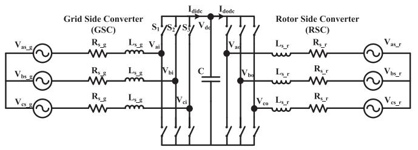  
Fig. 2. Schematic representation of a back to back converter.

Stator voltage equations:

$$
\left\{ \begin{array}{l} v _ {d s} = r _ {s} i _ {d s} - \omega_ {s} \lambda_ {q s} + p \lambda_ {d s} \\ v _ {q s} = r _ {s} i _ {q s} + \omega_ {s} \lambda_ {d s} + p \lambda_ {q s} \end{array} \right. \tag {1}
$$

Rotor voltage equations:

$$
\left\{ \begin{array}{l} v _ {d r} = r _ {r} i _ {d r} - \left(\omega_ {s} - \omega_ {r}\right) \lambda_ {q r} + p \lambda_ {d r} \\ v _ {q r} = r _ {r} i _ {q r} + \left(\omega_ {s} - \omega_ {r}\right) \lambda_ {d r} + p \lambda_ {q r} \end{array} \right. \tag {2}
$$

Flux-linkage equations:

$$
\left\{ \begin{array}{l} \lambda_ {d s} = L _ {l s} i _ {d s} + L _ {m} (i _ {d s} + i _ {d r}) = L _ {s} i _ {d s} + L _ {m} i _ {d r} \\ \lambda_ {q s} = L _ {l s} i _ {q s} + L _ {m} (i _ {q s} + i _ {q r}) = L _ {s} i _ {q s} + L _ {m} i _ {q r} \\ \lambda_ {d r} = L _ {l r} i _ {d r} + L _ {m} (i _ {d s} + i _ {d r}) = L _ {m} i _ {d s} + L _ {r} i _ {d r} \\ \lambda_ {q r} = L _ {l r} i _ {q r} + L _ {m} (i _ {q s} + i _ {q r}) = L _ {m} i _ {q s} + L _ {r} i _ {q r} \end{array} \right. \tag {3}
$$

Where, $L _ { s } = L _ { l s } + L _ { m } , L _ { r } = L _ { l r } + L _ { m }$

To combine (1), (2) and (3), circuit dynamic equations can be derived as below.

$$
\left[ \begin{array}{l} v _ {d s} \\ v _ {q s} \\ v _ {d r} \\ v _ {q r} \end{array} \right] = \left[ \begin{array}{c c c c} r _ {s} & - L _ {s} \omega_ {s} & 0 & - L _ {m} \omega_ {s} \\ L _ {s} \omega_ {s} & r _ {s} & L _ {m} \omega_ {s} & 0 \\ 0 & - L _ {m} \left(\omega_ {s} - \omega_ {r}\right) & r _ {r} & - L _ {r} \left(\omega_ {s} - \omega_ {r}\right) \\ L _ {m} \left(\omega_ {s} - \omega_ {r}\right) & 0 & L _ {r} \left(\omega_ {s} - \omega_ {r}\right) & r _ {r} \\ \end{array} \right] \left[ \begin{array}{l} i _ {d s} \\ i _ {q s} \\ i _ {d r} \\ i _ {q r} \end{array} \right] + \frac {d}{d t} \left[ \begin{array}{c c c c} L _ {s} & 0 & L _ {m} & 0 \\ 0 & L _ {s} & 0 & L _ {m} \\ L _ {m} & 0 & L _ {r} & 0 \\ 0 & L _ {m} & 0 & L _ {r} \end{array} \right] \left[ \begin{array}{l} i _ {d s} \\ i _ {q s} \\ i _ {d r} \\ i _ {q r} \end{array} \right] \tag {4}
$$

In compact form,

$$
\bar {V} _ {s r} = R \bar {I} _ {s r} + \frac {d}{d t} L \bar {I} _ {s r} \tag {5}
$$

The rotor mechanical dynamic equation is:

$$
T _ {J} \frac {d \omega_ {r}}{d t} + D \omega_ {r} = T _ {m} - T _ {e} \tag {6}
$$

Where, $T _ { J }$ denotes the inertia moment of the rotor.

# B. Back to Back Converter Dynamic Model

The voltage sourced converters (VSC) of the DFIG must also be included in the aggregated model. An averaged model of the VSC is used, in which the switching losses are neglected and the IGBT is taken to be an ideal switch [33]. Fig. 2 shows a schematic diagram of the grid side VSC (GSC) and the rotor

side VSC (RSC) that interface the step-up transformer tertiary winding with the induction machine rotor terminal.

Note that the frequency of voltages and currents on the grid side is the grid frequency $\omega _ { s }$ (nominally 50 Hz or 60 Hz in the steady state), and on the rotor side is $\omega _ { s } - \omega _ { r }$ .

In the paper, the converter dynamic model is derived in the abc frame using switching functions and then transformed from the abc to an appropriate dq0 frame [34].

The ac terminal voltages of the VSCs can be expressed as functions of dc voltage $\nu _ { d c }$ and modulation signals. Taking $S _ { 1 } , S _ { 2 } , S _ { 3 } { \mathrm { a s } }$ the switching functions of the GSC module, the GSC generated ac side fundamental frequency voltages $v _ { a b c \_ g } =$ $[ v _ { a i } , \bar { v } _ { b i } , v _ { c i } ] ^ { T }$ are:

$$
\left\{ \begin{array}{l} v _ {a i} = \frac {1}{2} v _ {d c} \cdot S _ {1} \\ v _ {b i} = \frac {1}{2} v _ {d c} \cdot S _ {2} \\ v _ {c i} = \frac {1}{2} v _ {d c} \cdot S _ {3} \end{array} \right. \tag {7}
$$

The corresponding switching functions of the converter module are as in (8).

$$
\left\{ \begin{array}{l} S _ {1} (t) = \frac {1}{2} A _ {m i} \sin \left(\theta_ {m i} (t)\right) \\ S _ {2} (t) = \frac {1}{2} A _ {m i} \sin \left(\theta_ {m i} (t) - \frac {2 \pi}{3}\right) \\ S _ {3} (t) = \frac {1}{2} A _ {m i} \sin \left(\theta_ {m i} (t) + \frac {2 \pi}{3}\right) \end{array} \right. \tag {8}
$$

Where, $\theta _ { m i } ( t ) = \omega _ { i } t + \alpha _ { m i } .$ .

Similar expressions as in (7) apply to the RSC voltages $v _ { a b c \_ r } = [ v _ { a o , } v _ { b o , } v _ { c o } ] ^ { T }$ .

Assuming $V _ { m s i }$ and αiare amplitude and phase-angle of the voltage source phase-a, gives the GSC and RSC equations in abc frames as below.

$$
\left\{ \begin{array}{l} v _ {a b c s - g} = R _ {s - g} i _ {a b c - i} + L _ {s - g} p (i _ {a b c - i}) + v _ {a b c - g} \\ v _ {a b c s - r} = R _ {s - r} i _ {a b c - o} + L _ {s - r} p (i _ {a b c - o}) + v _ {a b c - r} \end{array} \right. \tag {9}
$$

Equation (9) is transformed to dq0 coordinates giving (10). Choosing the initial angle of the dq0 transformation as $\alpha _ { i }$ , results in the q component of voltage being 0. This gives the dynamic model of back to back converter as in (10) and (11).

$$
\begin{array}{l} \left[ \begin{array}{c c c c} L _ {s _ {-} g} & & & \\ & L _ {s _ {-} g} & & \\ & & L _ {s _ {-} r} & \\ & & & L _ {s _ {-} r} \end{array} \right] \frac {d}{d t} \left[ \begin{array}{c} i _ {q i} \\ i _ {d i} \\ i _ {q o} \\ i _ {d o} \end{array} \right] \\ = \left[ \begin{array}{c c c c} - R _ {s \_ g} & - L _ {s \_ g} \omega_ {i} & 0 & 0 \\ L _ {s \_ g} \omega_ {i} & - R _ {s \_ g} & 0 & 0 \\ 0 & 0 & - R _ {s \_ r} & - L _ {s \_ r} \omega_ {o} \\ 0 & 0 & L _ {s \_ r} \omega_ {o} & - R _ {s \_ r} \end{array} \right] \left[ \begin{array}{l} i _ {q i} \\ i _ {d i} \\ i _ {q o} \\ i _ {d o} \end{array} \right] \tag {10} \\ + \left[ \begin{array}{c} 0. 5 A _ {m i} \sin (\alpha_ {i} - \alpha_ {m i}) \\ - 0. 5 A _ {m i} \cos (\alpha_ {i} - \alpha_ {m i}) \\ - 0. 5 A _ {m o} \sin (\alpha_ {o} - \alpha_ {m o}) \\ 0. 5 A _ {m o} \cos (\alpha_ {o} - \alpha_ {m o}) \end{array} \right] v _ {d c} + \left[ \begin{array}{c} 0 \\ V _ {m s i} \\ 0 \\ - V _ {m s o} \end{array} \right] \\ \end{array}
$$

The capacitor voltage dynamic equation is as below.

$$
C \frac {d}{d t} [ v _ {d c} ] = i _ {d i d c} - i _ {d o d c} \tag {11}
$$

The capacitor charging currents $i _ { d i d c }$ and $i _ { d o d c }$ are :

$$
i _ {d i d c} = \frac {3}{4} A _ {m i} \left[ i _ {q i} \sin (\alpha_ {m i} - \alpha_ {i}) + i _ {d i} \cos (\alpha_ {m i} - \alpha_ {i}) \right]
$$

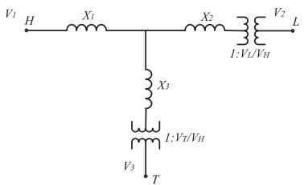  
Fig. 3. Three-winding transformer equivalent circuit.

$$
i _ {d o d c} = \frac {3}{4} A _ {m o} \left[ i _ {q o} \sin \left(\alpha_ {m o} - \alpha_ {o}\right) + i _ {d o} \cos \left(\alpha_ {m o} - \alpha_ {o}\right) \right]
$$

The GSC is used to maintain the dc capacitor voltage and control the reactive power of the DFIG. The RSC is tasked with controlling the rotor terminal voltage and the induction machine’s active power [35]. For any wind speed, the MPPT characteristic determines the optimal power and rotor speed settings which are implemented by the drive train system. The controller schematics are as in Appendix D. Other controls including crowbar and fault ride through controls are present but not shown.

# C. Transformer Model

The three-winding transformer in Fig. 1 is used to match the different voltage levels on the rotor and stator sides of the IG and then to step up the stator voltage to a medium voltage level for connecting to the grid. Neglecting the magnetizing branch, it is modelled as in Fig. 3, (with per-unit leakage impedances $\mathrm { X _ { 1 } , X _ { 2 } }$ and $\mathrm { X _ { 3 } ) } .$ , in which, the high voltage (H) terminal is connected to the wind farm collector system, (L) terminal is connected to induction machine stator, and terminal (T) is connected to the grid side VSC.

The current-voltage relationship is as in (12) [36], [37].

$$
\begin{array}{l} \frac {d}{d t} \left[ \begin{array}{c} I _ {1} \\ I _ {2} \\ I _ {3} \end{array} \right] = \frac {1}{L L} \left[ \begin{array}{c c c} L _ {2} + L _ {3} & - a _ {1 2} L _ {3} & - a _ {1 3} L _ {2} \\ - a _ {1 2} L _ {3} & a _ {2 2} (L _ {1} + L _ {3}) & - a _ {2 3} L _ {1} \\ - a _ {1 3} L _ {2} & - a _ {2 3} L _ {1} & a _ {3 3} (L _ {1} + L _ {2}) \end{array} \right] \\ \left[ \begin{array}{l} V _ {1} \\ V _ {2} \\ V _ {3} \end{array} \right] \tag {12} \\ \end{array}
$$

Where,

$L _ { 1 } , L _ { 2 } , L _ { 3 }$ are the inductances, taking $L _ { 1 }$ as an example,

$\begin{array} { r } { L _ { 1 } = \frac { V _ { 1 } ^ { 2 } \cdot X \% } { \omega \cdot M V A } } \end{array}$ (in pu)

$$
L L = L _ {1} \cdot L _ {2} + L _ {2} \cdot L _ {3} + L _ {3} \cdot L _ {1}
$$

$$
\begin{array}{l} a _ {1 2} = \frac {V _ {H}}{V _ {L}}, a _ {2 2} = \left(\frac {V _ {H}}{V _ {L}}\right) ^ {2}, a _ {1 3} = \frac {V _ {H}}{V _ {T}}, a _ {2 3} = \frac {V _ {H} ^ {2}}{V _ {L} V _ {T}}, \\ a _ {3 3} = \left(\frac {V _ {H}}{V _ {T}}\right) ^ {2} \\ \end{array}
$$

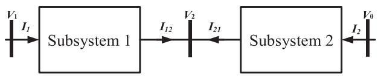  
Fig. 4. Schematic representation of two series connected components.

# D. Complete Dynamic Model of DFIG

In the previous section, the dynamic models for individual components were established separately. The individual components are connected at their terminals, which creates additional boundary constraints. The boundary voltages cannot be taken as separate inputs any longer when combining the two components as one complete system. A component combination method is put forward here to assemble all individual components into the full dynamic model.

As an example, consider a system as in Fig. 4, where Subsystem 1 connects to Subsystem 2 at the common boundary bus with voltage $V _ { 2 }$ . The subsystem equations are as in (13) and (14) which share the same voltage $V _ { 2 }$ as the rotor terminal voltage. The current $I _ { 1 2 } \left( = - I _ { 2 1 } \right)$ is also common to the two.

Subsystem 1:

$$
\frac {d}{d t} \left[ \begin{array}{l} I _ {1} \\ I _ {1 2} \end{array} \right] = \left[ \begin{array}{l l} A _ {c 1 1} & A _ {c 1 2} \\ A _ {c 2 1} & A _ {c 2 2} \end{array} \right] \left[ \begin{array}{l} I _ {1} \\ I _ {1 2} \end{array} \right] + \left[ \begin{array}{l} B _ {c 1 1} \\ B _ {c 1 2} \end{array} \right] V _ {1} + \left[ \begin{array}{l} B _ {c 2 1} \\ B _ {c 2 2} \end{array} \right] V _ {2} \tag {13}
$$

Subsystem 2:

$$
\frac {d}{d t} \left[ \begin{array}{l} I _ {2} \\ I _ {1 2} \end{array} \right] = \left[ \begin{array}{l l} A _ {m 1 1} & A _ {m 1 2} \\ A _ {m 2 1} & A _ {m 2 2} \end{array} \right] \left[ \begin{array}{l} I _ {2} \\ I _ {1 2} \end{array} \right] + \left[ \begin{array}{l} B _ {m 1 1} \\ B _ {m 1 2} \end{array} \right] V _ {0} + \left[ \begin{array}{l} B _ {m 2 1} \\ B _ {m 2 2} \end{array} \right] V _ {2} \tag {14}
$$

The common voltage $V _ { 2 }$ is eliminated to give:

$$
\begin{array}{l} \frac {d}{d t} \left[ \begin{array}{l} I _ {1} \\ I _ {1 2} \\ I _ {2} \end{array} \right] = \left[ \begin{array}{l l l} A _ {\text {c o m b 1 1}} & A _ {\text {c o m b 1 2}} & A _ {\text {c o m b 1 3}} \\ A _ {\text {c o m b 2 1}} & A _ {\text {c o m b 2 2}} & A _ {\text {c o m b 2 3}} \\ A _ {\text {c o m b 3 1}} & A _ {\text {c o m b 3 2}} & A _ {\text {c o m b 3 3}} \end{array} \right] \left[ \begin{array}{l} I _ {1} \\ I _ {1 2} \\ I _ {2} \end{array} \right] \tag {15} \\ + \left[ \begin{array}{l l} B _ {c o m b 1 1} & B _ {c o m b 1 2} \\ B _ {c o m b 2 1} & B _ {c o m b 2 2} \\ B _ {c o m b 3 1} & B _ {c o m b 3 2} \end{array} \right] \left[ \begin{array}{l} V _ {0} \\ V _ {1} \end{array} \right] \\ \end{array}
$$

The elements $A _ { c o m b 1 1 } \dots B _ { c o m b 1 1 } \mathrm { ~ e t c } .$ , are linear algebraic combinations of the original parameters $A _ { c 1 1 } , A _ { c 1 2 } \ldots$ . etc in (13) and (14). After the two subsystems are combined, the remaining constituent subsystems can be recursively added to the structure one by one in a similar manner culminating in the state space model of the entire DFIG. Finally, the dynamic model of the DFIG is obtained in the form ${ \dot { x } } = A x + B u$ , with a matrix A of dimension $( 1 9 \times 1 9 )$ having a structure (excluding the mechanical drivetrain) as in Fig. 5. The drivetrain system model outputs the prime mover torque to the IG with wind speed as its input.

The 19th order state vector is x = [ωr, vdc, x1˙recvsc, x2˙recvsc, $1 9 ^ { \mathrm { t h } }$ $\mathbf { x } = [ \omega _ { \mathrm { r } } , \mathrm { v } _ { \mathrm { d c } } ,$ x3˙recvsc, x4˙recvsc, x1˙invvsc, x2˙invvsc, x3˙invvsc, x4˙invvsc, x5˙invvsc, idi, iqi, ids, iqs, idr, iqr, x1˙ωrcon, x2˙ωrcon] T. State variables $\mathbf { X } _ { 1 }$ ˙invvsc, x2˙invvsc, x3˙invvsc, x4˙invvsc, x5˙invvsc are states associated with the voltage control and active power control of RSC. State variables x1˙recvsc, x2˙recvsc, x3˙recvsc, x4˙recvsc are states associated with the capacitance voltage control and reactive power control of GSC and are as marked on the controller

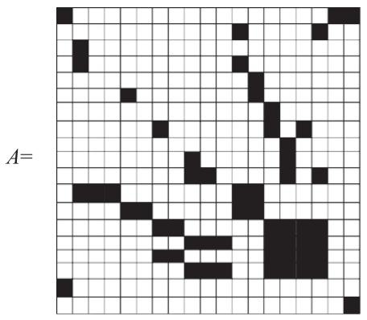

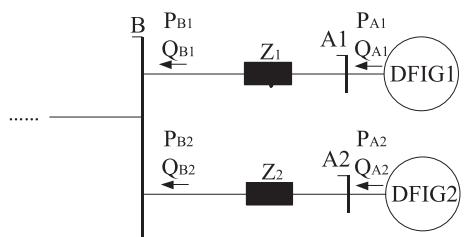  
Fig. 5. Distribution values of state matrix A of DFIG model (Note: the black blocks are non-zero elements – For values see Appendix A).

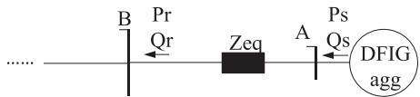  
(a)Two DFIGs in parallel   
(b）Aggregate model with Equivalent impedance Zeq

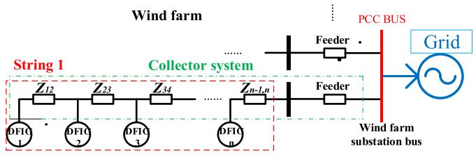  
Fig. 6. Equivalencing the individual DFIG connecting impedances in parallel.   
Fig. 7. Typical configuration of WTGs in a wind farm.

diagrams in Appendix D, Figs. 14 and 15. Similarly, x1˙ωrcon, $\mathbf { X } _ { \mathrm { 2 } } { \cdot } _ { \omega \mathrm { r c o n } }$ are the states of the machines speed controller as in Appendix D. The state variables $\omega _ { \mathrm { r } } , \mathrm { v _ { d c } , i _ { d i } , i _ { q i } , i _ { d s } , i _ { q s } , i _ { d r } , i _ { q } }$ r are as in (1) to (11).

Appendix A lists the elements of the matrix A in Fig. 5.

# III. MODEL STRUCTURE PRESERVING AGGREGATION METHOD

As mentioned in the previous section, the aggregated model is constructed recursively by combining two DFIG state space representations at a time and equivalencing it to the state space representation of a single DFIG, ensuring that they both have identical steady state responses.

# A. Equivalencing the Collector System Impedance

The impedances of cables connecting the DFIGs to the wind farm collector system cause voltage reduction and power losses.

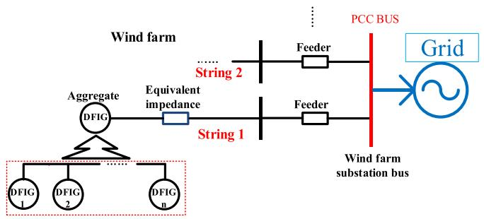  
Fig. 8. DFIGs in parallel with the equivalent impedance of string 1.

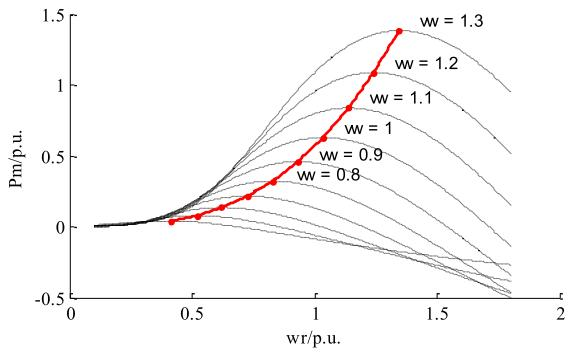  
Fig. 9. MPPT curve of a typical wind turbine.

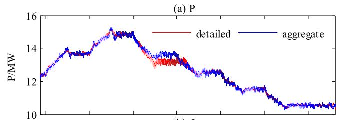

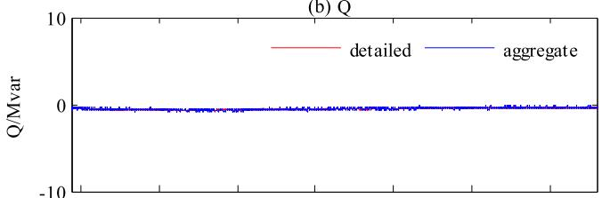

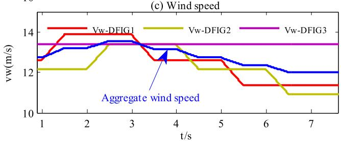  
Fig. 10. Simulation results for varying wind speeds.

This paper puts forth a more general method based on power flow for finding a single equivalent impedance which is different from that reported in previous work [19], [21]. This equivalent impedance is designed so that the total generated power, the power received at the PCC bus and the PCC bus voltage are the same as in the detailed model.

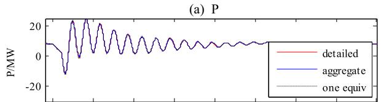

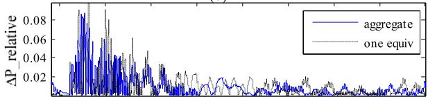  
(b)

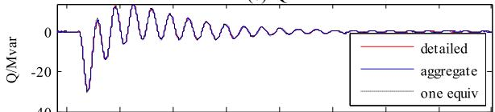  
  
(d)

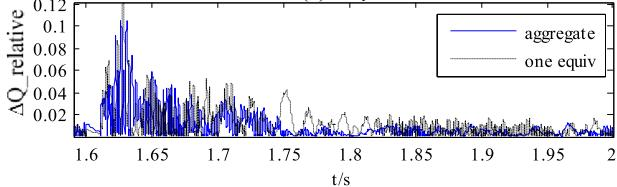  
Fig. 11. Comparison simulation results between detailed and aggregated model of 2 DFIGs of different parameters.

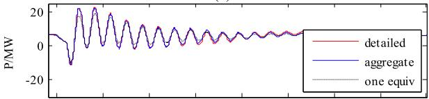  
(a)P

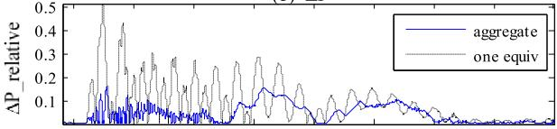  
(b)AP

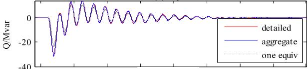  
  
(d）△Q

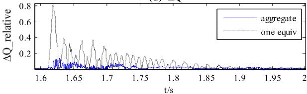  
Fig. 12. Comparison simulation results between detailed and aggregated model of 2 DFIGs of different rotor speeds.

Consider the case of two DFIGs in parallel with connecting impedances $Z _ { 1 }$ and $Z _ { \mathcal { 2 } }$ as in Fig. 6(a), the DFIG terminal bus is taken as a PQ node with generating powers as ordered by the converter control system corresponding to the turbine’s incident wind speed.

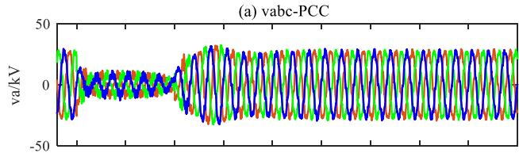

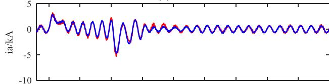  
(b) ia-PCC

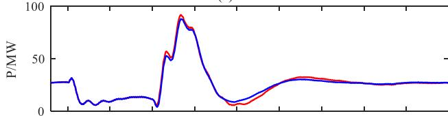  
(c) P-PCC   
(d) Q-PCC

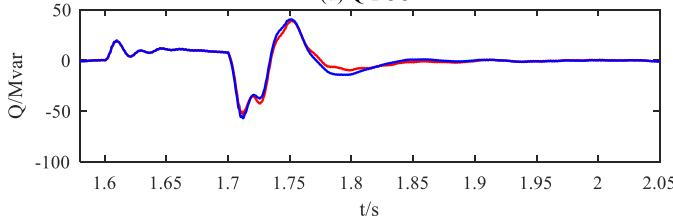  
Fig. 13. Comparison simulation results from PSCAD. Blue curves are for aggregate model and red curves are for detailed model.

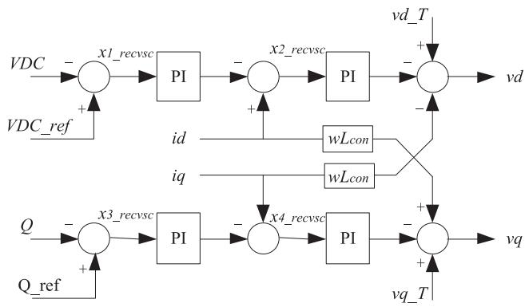

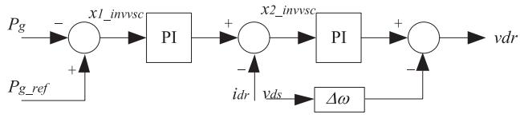  
Fig. 14. GSC Controller Schematic.

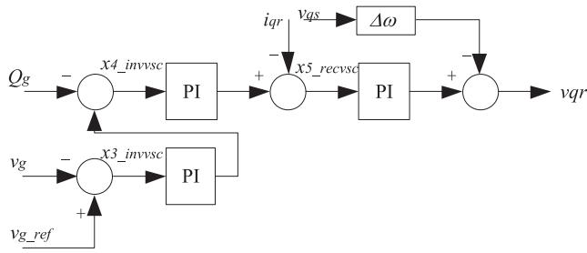  
Fig. 15. RSC Controller Schematic.

The wind generator power flows $( P _ { A 1 } , \ Q _ { A 1 } , \ P _ { B 1 } , \ Q _ { B 1 } ,$ , $P _ { A 2 } , \ldots { } \mathrm { e t c . } )$ and voltages $( V _ { A 1 } \angle \theta _ { A 1 } , V _ { A 2 } \angle \theta _ { A 2 }$ and $V _ { B } \angle \theta _ { B } )$ can be calculated using commercial software or, as is the case in this paper, by a user developed program. From these, the equivalent impedance $Z _ { e q } = \ R + j X$ of the collector system is calculated numerically by solving the following algebraic equations using the Newton-Raphson method in unknowns $R , X , V _ { A } { \mathrm { a n d } } \theta _ { A }$ .

$$
\left\{ \begin{array}{l} P _ {A} = \frac {X V _ {A} V _ {B} \sin \left(\theta_ {A} - \theta_ {B}\right) + R V _ {A} ^ {2} - R V _ {A} V _ {B} \cos \left(\theta_ {A} - \theta_ {B}\right)}{R ^ {2} + X ^ {2}} \\ Q _ {A} = \frac {X V _ {A} ^ {2} - X V _ {A} V _ {B} \cos \left(\theta_ {A} - \theta_ {B}\right) - R V _ {A} V _ {B} \sin \left(\theta_ {A} - \theta_ {B}\right)}{R ^ {2} + X ^ {2}} \\ P _ {B} = \frac {X V _ {A} V _ {B} \sin \left(\theta_ {A} - \theta_ {B}\right) - R V _ {B} ^ {2} + R V _ {A} V _ {B} \cos \left(\theta_ {A} - \theta_ {B}\right)}{R ^ {2} + X ^ {2}} \\ Q _ {B} = \frac {- X V _ {B} ^ {2} + X V _ {A} V _ {B} \cos \left(\theta_ {A} - \theta_ {B}\right) - R V _ {A} V _ {B} \sin \left(\theta_ {A} - \theta_ {B}\right)}{R ^ {2} + X ^ {2}} \end{array} \right. \tag {16}
$$

Where, $P _ { A } = P _ { A 1 } + P _ { A 2 } , Q _ { A } = Q _ { A 1 } + Q _ { A 2 } , P _ { B } = P _ { B 1 } + P _ { B }$ $P _ { B 2 } , Q _ { B } = Q _ { B 1 } + Q _ { B 2 }$ are for this two DFIGs in parallel.

This approach is directly applicable to machines directly connected to the PCC through impedances $Z _ { 1 } , ~ Z _ { 2 } , ~ Z _ { n } . . . e t c .$ However, windfarms may have different connection arrangements. For example, a typical configuration of WTGs in a wind farm is shown in Fig. 7 with the DFIGs connected in a string configuration. The DFIGs in the same string are connected to the wind farm substation bus (PCC bus) via a feeder. In this case a recursive procedure can be used. We start with DFIG1 with impedance $Z _ { \mathit { 1 } } = Z _ { \mathit { 1 2 } }$ and DFIG 2 with $Z _ { \mathcal { Q } } = 0$ . Using the above procedure, they can be combined to form an equivalent impedance $Z _ { e q 1 }$ and equivalent generator $\mathrm { D F I G _ { e 1 } }$ . In the next step, this can be combined with DFIG 3, again taking the first impedance as ${ Z _ { e q 1 } + Z _ { \ : 2 3 } }$ , and the second as $Z _ { 3 } = 0 .$ This process is continued till a single equivalent impedance $Z _ { e q }$ is obtained.

The equivalent impedance produces the same power losses and PCC voltage as the detailed model and ensures the same power flow seen from PCC bus.

The resulting equivalent system is shown in Fig. 8, and consists of a single equivalent generator connected to the PCC with an equivalent impedance as calculated above. The next section will show how the aggregate generator model is developed. The other strings can be made into similar equivalents. All these equivalents can be combined into a single DFIG with equivalent connecting impedance.

# B. Combining the State Space Representations of Two DFIGs

Many EMT programs model the machine as a current source which injects the calculated current from them [38]. Thus, an aggregation method is proposed, which combines the current generation from all the DFIGs with a similar block structure in the aggregate into a single equivalent DFIG of the same structure.

The current output of the equivalent generator is the sum of the currents of all the DFIGs in the string.

The aggregation of the DFIGs can be performed recursively with two units at a time, so that n-1 aggregation procedures are performed for n DFIGs in the string, as in [39], [40].

The state equations for DFIG 1 and 2 are considered as in (17) and (18) respectively.

$$
\left\{ \begin{array}{l} \dot {x} _ {1} = A _ {1} x _ {1} + B _ {1} u _ {1} = A _ {1} x _ {1} + B _ {1 v d q} \left[ v _ {d}, v _ {q} \right] ^ {T} + B _ {1 T m} \left[ T _ {m 1} \right] \\ y _ {1} = i _ {d q 1} = C _ {1} x _ {1} \end{array} \right. \tag {17}
$$

$$
\left\{ \begin{array}{l} \dot {x} _ {2} = A _ {2} x _ {2} + B _ {2} u _ {2} = A _ {2} x _ {2} + B _ {2 v d q} \left[ v _ {d}, v _ {q} \right] ^ {T} + B _ {2 T m} \left[ T _ {m 2} \right] \\ y _ {2} = i _ {d q 2} = C _ {2} x _ {2} \end{array} \right. \tag {18}
$$

The outputs in s domain can be expressed as in (19).

$$
\left\{ \begin{array}{l} i _ {d q 1} = C _ {1} (s E - A _ {1}) ^ {- 1} \left(B _ {1 v d q} \left[ v _ {d}, v _ {q} \right] ^ {T} + B _ {1 T m} \left[ T _ {m 1} \right]\right) \\ i _ {d q 2} = C _ {2} (s E - A _ {2}) ^ {- 1} \left(B _ {2 v d q} \left[ v _ {d}, v _ {q} \right] ^ {T} + B _ {2 T m} \left[ T _ {m 2} \right]\right) \end{array} \right. \tag {19}
$$

The outputs $y _ { 1 }$ and $y _ { 2 }$ are the injected currents $i _ { d }$ and $i _ { q }$ (in d-q coordinate) from these DFIGs which are states in the dynamic model, and hence the absence of the $^ { \bullet } D ^ { \bullet }$ matrix in (17) and (18). The C matrix only picks out the d and q components of stator current, so the remaining entries are zero. Thus:

$$
C _ {1} = C _ {2} = \left[ \begin{array}{c c c c c c c c c c c c c c c} 0 & 0 & 0 & 0 & 0 & 0 & 0 & 0 & 0 & 0 & 1 & 0 & 0 & 0 & 0 & 0 \\ 0 & 0 & 0 & 0 & 0 & 0 & 0 & 0 & 0 & 0 & 0 & 1 & 0 & 0 & 0 & 0 \\ \hline \end{array} \right]
$$

With identical parameters for transformer and converter and with data as in Appendix C, matrices $B _ { \perp }$ 1 and $B _ { \mathcal { Q } }$ are:

$$
B _ {1} = B _ {2} =
$$

$$
\left[ \begin{array}{c c c c c c c c c c c c c c} 0 & 0 & 0 & 0 & 0 & - 1 & - 1 & 0 & 0 & 0 & 0 & 0 & 0. 0 6 2 & 0 & - 0. 0 6 3 & 0 & 0 & 0 & 0 \\ 0 & 0 & 0 & 0 0 & 0 & 0 & 0 & 0 & 0 & 0 & 0 & 1. 7 6 1 & 0 & - 1. 2 4 5 & 0 & 0 & 0 & 0 \\ 0 & 0 & 0 & 0 0 & 0 & 0 & 0 & 0 & 0 & 0 & 0 & 0 & 1. 7 6 1 & 0 & - 1. 2 4 5 & 0 & 0 & 0 \end{array} \right] ^ {T}
$$

Converting to the Laplace (s) domain, the aggregate model is obtained by summing $y _ { 1 }$ and $y _ { 2 }$ as in (20).

$$
\begin{array}{l} i _ {d q C} = i _ {d q 1} + i _ {d q 2} \\ = C _ {1} \left(s E - A _ {1}\right) ^ {- 1} \left[ B _ {1 d q} v _ {d q 1} + B _ {1 T _ {m}} T _ {m 1} \right] \\ + C _ {2} \left(s E - A _ {2}\right) ^ {- 1} \left[ B _ {2 d q} v _ {d q 2} + B _ {2 T _ {m}} T _ {m 2} \right] \\ = C \left[ (s E - A _ {1}) ^ {- 1} B u _ {1} + (s E - A _ {2}) ^ {- 1} B u _ {2} \right] \tag {20} \\ \end{array}
$$

Where, E is identity matrix, s is Laplace operator. The inputs $u _ { 1 }$ and $u _ { \mathcal { Z } }$ typically include the components of the grid terminal voltage $\nu _ { d 1 } , \nu _ { q 1 }$ and $\nu _ { d \mathcal { Q } } , \nu _ { q \mathcal { Q } } ,$ and prime mover torques $T _ { m 1 }$ and $T _ { m \mathcal { Q } }$ . The input matrix B can be further simplified if the grid side voltages are assumed the same for all DFIGs in the string, which is reasonable since the impedances $Z _ { 1 2 } , \ Z _ { 2 3 }$ etc., are small. However, the prime mover torque inputs can be different because of different incident wind speeds. Taking k as the ratio between the torques $k = T _ { m 2 } / T _ { m 1 } , ( 2 0 )$ becomes (21). Note that in (21), A1 and $A _ { \mathcal { 2 } }$ have the same order, and hence the orders of matrices $( s E - A _ { 1 } ) ^ { - 1 }$ and $( s E - A _ { 2 } ) ^ { - 1 }$ are the same which makes it feasible to construct an equivalent of the same state

space structure as of the individual DFIGs.

$$
\begin{array}{l} i _ {d q C} = i _ {d q 1} + i _ {d q 2} \\ = C \left[ (s E - A _ {1}) ^ {- 1} B u _ {1} + (s E - A _ {2}) ^ {- 1} B k u _ {1} \right] \\ = (1 + k) C \left[ \frac {1}{1 + k} \left(s E - A _ {1}\right) ^ {- 1} + \frac {k}{1 + k} \left(s E - A _ {2}\right) ^ {- 1} \right] B u _ {1} \tag {21} \\ \end{array}
$$

At this stage, the order of the state equations will be typically twice that of an individual DFIG as two DFIGs are being combined. For the final implementation, this must be reduced to the order of a single DFIG. This is described below.

# C. Recursive Aggregation Procedure

Comparing (17) with (21), the matrices $A _ { 1 } , B _ { 1 }$ and $C _ { 1 }$ are replaced by the terms ${ A _ { a } } ^ { \prime } ( s ) , B _ { a } ,$ , and $C _ { a }$ as in (22).

$$
A _ {a} ^ {\prime} (s) = s E - \left[ \frac {1}{1 + k} (s E - A _ {1}) ^ {- 1} + \frac {k}{1 + k} (s E - A _ {2}) ^ {- 1} \right] ^ {- 1}
$$

$$
B _ {a} = B
$$

$$
C _ {a} = (1 + k) C \tag {22}
$$

For a representation that preserves the structure of a single DFIG, we need $A _ { a } ^ { \prime } ( s )$ to be a constant matrix (not a function of s).To get a single DFIG to represent the two DFIGs, it is observed that the steady state outputs must match, so setting $t = + \infty { \mathrm { i } . } \mathrm { e } . , s$ ${ \ o } = 0 .$ , in (22) gives matrix $\begin{array} { r } { A _ { a } = ( \frac { 1 } { 1 + k } ( \dot { A } _ { 1 } ) ^ { - 1 } + \frac { \smile k } { 1 + k } ( A _ { 2 } ) ^ { - 1 } ) ^ { - 1 } } \end{array}$ . Once $A _ { a }$ is known, and using $B _ { a }$ and $C _ { a }$ from (22), the equivalent system is formed in state variable form as in (23).

$$
\left\{ \begin{array}{l} \dot {x} = A _ {a} x + B _ {a} u \\ y = C _ {a} x \end{array} \right. \tag {23}
$$

Once these matrices are known, the parameters of the equivalent DFIG are determined and included in any EMT simulator as a single DFIG. Additional DFIGs can be added one at a time to this aggregate until all machines are included. The procedure automatically guarantees identical steady state response to the detailed model. Model validation will show that it also gives an accurate transient response.

# D. Modified Transformer Representation to Magnify Current

The step-up transformer can be used to scale the single DFIG’s current to that of the two DFIGs in accordance with the output matrix $C _ { a }$ by multiplying the currents from the ‘H’ terminal in Fig. 1 by a scale factor (1+k). This is achieved by multiplying the first row of the inductance matrix in (12) by (1+k) to give (24).

$$
\frac {d}{d t} \left[ \begin{array}{c} I _ {1 C} \\ I _ {2} \\ I _ {3} \end{array} \right] = \frac {1}{L L}
$$

$$
\left[ \begin{array}{c c c} (1 + k) (L _ {2} + L _ {3}) - (1 + k) a _ {1 2} L _ {3} - (1 + k) a _ {1 3} L _ {2} \\ - a _ {1 2} L _ {3} & a _ {2 2} (L _ {1} + L _ {3}) & - a _ {2 3} L _ {1} \\ - a _ {1 3} L _ {2} & - a _ {2 3} L _ {1} & a _ {3 3} (L _ {1} + L _ {2}) \end{array} \right] \left[ \begin{array}{l} V _ {1} \\ V _ {2} \\ V _ {3} \end{array} \right] \tag {24}
$$

The resulting DFIG can be treated as a single unit and combined with other DFIGs in the string in a recursive manner to

$\begin{array} { r l } { { } } & { { \mathrm { T A B L E ~ I ~ } } } \\ { 2 { \mathrm { D F I G ~ S Y S T E M : ~ P A R A M E T E R S ~ A N D ~ O p E R A T I N G ~ P O I N T S ~ F O R ~ } } V W } & { { } { \mathrm { 1 . 1 8 ~ P U } } } \\ { { \mathrm { ( W I N D ~ S P E E D ~ B A S E = 1 1 ~ M / S ) ~ } } P _ { \mathrm { b a s e } } = 5 . 6 { \mathrm { ~ M W } } } & { { } } \end{array}$   

<table><tr><td>DFIG #</td><td>Rotor angular speed at max. power ωr(p.u.)</td><td>Prime power Pm(pu) at ωr</td><td>Rotor leakage inductance Lrl(pu)</td><td>Stator leakage inductance Lsl(pu)</td><td>Impedance Z (Ohm)</td></tr><tr><td>DFIG1</td><td>1.1</td><td>0.76</td><td>0.11</td><td>0.1</td><td>0.1+j0.376</td></tr><tr><td>DFIG2</td><td>1.1</td><td>0.76</td><td>0.132</td><td>0.12</td><td>0.3+j1.131</td></tr></table>

eventually generate the entire aggregate equivalent. It should be noted that the aggregated model can be implemented as a single DFIG in any EMT simulation software, as it does not require modification of existing models in the software, merely an appropriate selection of the parameters.

# IV. MODEL VALIDATION

The proposed DFIG aggregation method is validated by comparing EMT simulation results for the case of all DFIGs modelled separately, with the aggregated DFIG. PSCAD/EMTDC is used as the EMT simulation tool. Initially two simple examples are used to demonstrate that the aggregation procedure works with changing wind speeds or different parameters for each DFIG. Next, a demo wind farm case with 10 DFIGs is investigated.

Data for the DFIG and feeder impedances are given in the Appendices. The turbine model is as in [41] with parameters as in Appendix E. The MPPT characteristic in per-unit is shown in Fig. 9 and is used to determine the mechanical power and hence torque, from the wind at any rotor speed. The power base for per-unitizing Pm is the induction machine’s rated power and the base wind speed is 11 m/s.

# A. Performance of Aggregate Model Under Changing Wind Speeds

A model consisting of 3 identical DFIGs in a string is used to investigate the method’s applicability to simulate conditions with varying wind speeds. The parameters are in the Appendix.

Fig. 10 shows the PSCAD simulation results when individual wind velocities range from 10.93m/s to 13.86 m/s. The wind velocity ramps from 12.61 m/s to 13.86 m/s at t = 1 s for DFIG 1, and then decreases to 11.34 m/s starting at t = 5 s. The ramp rate is $\pm 2 . 5 \mathrm { m } / \mathrm { s } ^ { 2 }$ . Similarly, the wind speed for DFIG 2 goes from 12.15 m/s to 13.37 m/s at t = 2 s, and then to 10.93 m/s at t = 6 s. The individual wind speeds are used to calculate the equivalent wind speed for the aggregated model (blue curve). The real and reactive power plots in Fig. 10 confirm that the aggregate model can still retain the same steady state total power as the detailed model.

# B. Performance of Aggregate Model With Non-Identical DFIGs

A two machines case with one machine having 20% larger leakage impedances as in Table I and consequently different state matrices A for each DFIG is considered below.

TABLE II COMPARISON OF SIMULATION ERRORS   

<table><tr><td></td><td>Active power P_RMSE</td><td>Reactive power Q_RMSE</td></tr><tr><td>Aggregate model</td><td>1.5%</td><td>1.7%</td></tr><tr><td>One-equivalent model</td><td>1.8%</td><td>1.92%</td></tr></table>

TABLE III THE OPERATING POINTS OF THE DFIGS (VW BASE = 11 M/S, $P _ { \mathrm { b a s e } } = 5 . 6 \ : \mathrm { M W } )$   

<table><tr><td>DFIG #</td><td>Wind speed vw (pu)</td><td>Rotor angular speed ωr (pu)</td><td>Prime mover power Pm (pu)</td></tr><tr><td>DFIG1</td><td>1.07</td><td>1.1</td><td>0.76</td></tr><tr><td>DFIG2</td><td>0.88</td><td>0.9</td><td>0.41</td></tr></table>

Fig. 11 shows a comparison of the transient responses for the 2 machine case from the detailed model, proposed aggregate model and the model in references [16], [17] (referred to as ‘one-equivalent’). The disturbance is a 10 ms short circuit which causes the terminal voltage to temporarily drop to zero. The active power (P) and relative errors between models are shown in Fig. 11(a) and (b) respectively, and the reactive power and errors in Fig. 11(c) and (d).

Table II gives the RMSE (root mean square relative error) from Fig. 11 for the proposed aggregate model and one- equivalent model when compare with the detailed model. The RMSE is calculated below as in (25).

$$
\begin{array}{l} R M S E _ {-} P = \left[ \int_ {t _ {1}} ^ {t _ {2}} \left(\frac {p _ {\text {a g g r e g a t e}} - p _ {\text {d e t a i l e d}}}{S}\right) ^ {2} d t / t _ {2} - t _ {1} \right] ^ {1 / 2} \\ R M S E _ {-} Q = \left[ \int_ {t _ {1}} ^ {t _ {2}} \left(\frac {q _ {\text {a g g r e g a t e}} - q _ {\text {d e t a i l e d}}}{S}\right) ^ {2} d t / t _ {2} - t _ {1} \right] ^ {1 / 2} \end{array} \tag {25}
$$

Here, $t _ { 1 }$ is the start instant of the transient, and $t _ { 2 }$ is the end time of the transient. In the example, $t _ { 1 } = 1 . 6 ~ \mathrm { s }$ and $t _ { 2 } = 2 \mathrm { s }$ , and $S = \sqrt { P _ { s t e a d y \_ s t a t e } ^ { 2 } + Q _ { s t e a d y \_ s t a t e } ^ { 2 } } .$

The comparison results suggest that the detailed model and the aggregate model have close transient responses with similar oscillation frequency and damping and reach the same steady state after the transients. There are minor differences giving an RMSE of 1.5% and 1.7% for P and Q, due to the aggregation approximation. Here the one-equivalent model from previous literature also gives fairly accurate results, with the error being only marginally larger.

# C. Performance of Aggregate Model With Different Loadings of Individual DFIGs

Now consider the case in Table III where the two identical DFIGs have different incident wind speeds (1.07 pu and 0.88 pu), and consequently different rotor speeds $\omega _ { \mathrm { r } }$ and different power levels $P _ { m }$ according to the MPPT curve from Fig. 9.

Fig. 12 shows the comparison results of the transient responses for the detailed and aggregated models (proposed and ‘one-equivalent’) for the same 10 ms short circuit fault applied

TABLE IV ERRORS DUE TO AGGREGATION   

<table><tr><td></td><td>Active power P_RMSE</td><td>Reactive power Q_RMSE</td></tr><tr><td>Aggregate model</td><td>5.93%</td><td>2.7%</td></tr><tr><td>One equivalent model</td><td>13%</td><td>14.7%</td></tr></table>

TABLE V SIMULATION TIME COMPARISON   

<table><tr><td>Model</td><td>Detailed model simulation time (s)</td><td>Aggregate model simulation time (s)</td><td>Speedup factor</td></tr><tr><td>2 DFIG system</td><td>351</td><td>45</td><td>7.8</td></tr><tr><td>3 DFIG system</td><td>879</td><td>48</td><td>18.3</td></tr><tr><td>10 DFIG system</td><td>7235</td><td>48</td><td>150.7</td></tr></table>

TABLE VI INCIDENT WIND SPEED ON EACH TURBINE   

<table><tr><td>DFIG No.</td><td>1</td><td>2</td><td>3</td><td>4</td><td>5</td><td>6</td><td>7</td><td>8</td><td>9</td><td>10</td></tr><tr><td>vw(m/s)</td><td>12.2</td><td>12</td><td>11.5</td><td>11.2</td><td>10.7</td><td>10.4</td><td>10.3</td><td>10.3</td><td>10.2</td><td>10.2</td></tr></table>

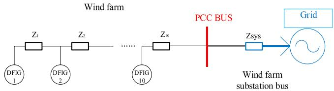  
Fig. 16. Wind farm consisting of 10 DFIGs.

at 1.6 s. Table IV shows the corresponding root mean square errors between the detailed and aggregate models.

The close comparisons show that the aggregation method is capable of handling DFIGs with different individual loadings.

Table IV shows that the RMSE for P and Q of the proposed aggregate model are less than 6% and 2.7% respectively for rotor speed variations of about 20%. The corresponding errors for the one-equivalent used in previous literature are significantly larger, at 13% and 14.7%.

# D. Performance of Aggregate Model With a Larger System

Further validation simulations for a wind farm consisting of 10 DFIGs are performed. The DFIGs have identical structures but have different incident wind speeds as shown in Table VI, again resulting in different state space matrices for each DFIG.

DFIG parameters and wind farm collector system impedances are given in Appendix F. The parameters of the aggregate DFIG wind farm are obtained using the recursive procedure of Section III and yield the parameters for the single aggregate wind farm. Fig. 13 shows the real and reactive powers, ac voltage and windfarm current following a temporary three-phase to ground fault at grid side with duration of 100ms.

The results in Fig. 13 indicate that the aggregated model maintains the same power flow into the PCC bus as the detailed model and has an essentially identical transient response. During the fault, a certain amount of reactive power is injected into the grid side from the wind farm with peak value of 19.6 Mvar and average value of 10.2 Mvar. It takes around 240 ms after fault clearance for the model to reach its new steady state. The

APPENDIX A: NON-ZERO ENTRIES OF MATRIX A   

<table><tr><td colspan="2">Element value</td><td colspan="2">Element value</td><td colspan="2">Element value</td></tr><tr><td>A1,1</td><td>-0.16668</td><td>A1,18</td><td>0.166667</td><td>A1,19</td><td>-16.6667</td></tr><tr><td>A2,12</td><td>0.0075</td><td>A2,16</td><td>-0.00061</td><td>A2,17</td><td>0.09375</td></tr><tr><td>A3,2</td><td>-10</td><td>A4,2</td><td>-250</td><td>A4,12</td><td>-50</td></tr><tr><td>A5,13</td><td>-15</td><td>A6,5</td><td>100</td><td>A6,13</td><td>-250</td></tr><tr><td>A7,14</td><td>1.5</td><td>A8,7</td><td>50</td><td>A8,14</td><td>1.5</td></tr><tr><td>A8,16</td><td>-50</td><td>A9,15</td><td>0.15</td><td>A10,9</td><td>0.2</td></tr><tr><td>A10,15</td><td>0.06</td><td>A11,9</td><td>0.1</td><td>A11,10</td><td>0.02</td></tr><tr><td>A11,15</td><td>0.03</td><td>A11,17</td><td>-0.02</td><td>A12,2</td><td>-6.19195</td></tr><tr><td>A12,3</td><td>1.23839</td><td>A12,4</td><td>1.031992</td><td>A12,12</td><td>-1.69247</td></tr><tr><td>A12,13</td><td>2</td><td>A13,5</td><td>2.063983</td><td>A13,6</td><td>1.031992</td></tr><tr><td>A13,12</td><td>-2</td><td>A13,13</td><td>-5.61404</td><td>A14,7</td><td>-3.11192</td></tr><tr><td>A14,8</td><td>-1.24477</td><td>A14,14</td><td>-0.2078</td><td>A14,15</td><td>3.19123</td></tr><tr><td>A14,16</td><td>3.369591</td><td>A14,17</td><td>3.099414</td><td>A15,9</td><td>-15.5596</td></tr><tr><td>A15,10</td><td>-3.11192</td><td>A15,11</td><td>-1.24477</td><td>A15,14</td><td>-3.19123</td></tr><tr><td>A15,15</td><td>-4.78233</td><td>A15,16</td><td>-3.09941</td><td>A15,17</td><td>3.369591</td></tr><tr><td>A16,7</td><td>3.153909</td><td>A16,8</td><td>1.261563</td><td>A16,14</td><td>0.175527</td></tr><tr><td>A16,15</td><td>-2.22079</td><td>A16,16</td><td>-3.41505</td><td>A16,17</td><td>-2.14123</td></tr><tr><td>A17,9</td><td>15.76954</td><td>A17,10</td><td>3.153909</td><td>A17,11</td><td>1.261563</td></tr><tr><td>A17,14</td><td>2.220793</td><td>A17,15</td><td>4.811773</td><td>A17,16</td><td>2.14123</td></tr><tr><td>A17,17</td><td>-3.41505</td><td>A18,1</td><td>-1</td><td>A19,19</td><td>-100</td></tr></table>

computation time is also significantly reduced as will be shown in the next section. These examples validate that the aggregated model retains the major collective oscillation modes of the original detailed system in the transient process and has the same steady response. The comparison was limited to a 10-machine case due to the large simulation time for the EMT model of the detailed system required for the validation. However, any number of machines can be included in the aggregate. Note that in an actual windfarm the local conditions at each DFIG may be quite different, with the possibility that one or more DFIGs may even have disconnected due to violation of its operating limit, which is not represented in the aggregate. Hence the aggregate model is not intended for protection design of individual DFIGs, as the identity of individual DFIGs is not maintained. However, if required, it is also possible to preserve a limited amount of granularity in the model. For example, a windfarm with 100 DFIGs could be represented with say, 5 aggregate models of 20 machines each. This would still result in significant computational savings as compared with a full detailed model.

# E. Computational Savings

As the multiple DFIGs are reduced to a single DFIG, there is a significant reduction in simulation times. Table V shows the simulation times for a Windfarm with 2, 3 and 10 DFIGs on a PC with an Intel Core i5-6200U CPU running at 2.30GHz. The speedup factor for 10 machines is over 150. With hundreds of machines, the time savings will be significantly larger.

# V. CONCLUSION

The paper proposes a new aggregation method for multiple DFIGs. The aggregation is achieved by recursively combining two structurally complete DFIG state space representations at a time and equivalencing this to the state space representation of a single DFIG ensuring that both have identical steady state

APPENDIX B: INDUCTION GENERATOR PARAMETERS   

<table><tr><td>Parameter</td><td>value</td></tr><tr><td>Rated power</td><td>5.6 MVA</td></tr><tr><td>Rated voltage (L-L)</td><td>0.9 kV</td></tr><tr><td>Base angular frequency</td><td>60 Hz</td></tr><tr><td>Stator/rotor turns ratio</td><td>0.391</td></tr><tr><td>Angular moment of inertia</td><td>6 s</td></tr><tr><td>Mechanical damping</td><td>0.0001 pu</td></tr><tr><td>Stator resistance</td><td>0.0054 pu</td></tr><tr><td>Wound rotor resistance</td><td>0.00607 pu</td></tr><tr><td>First squirrel cage resistance</td><td>0.298 pu</td></tr><tr><td>Second squirrel cage resistance</td><td>0.018 pu</td></tr><tr><td>Magnetizing inductance</td><td>4.5 pu</td></tr><tr><td>Stator leakage inductance</td><td>0.10 pu</td></tr><tr><td>Wound rotor leakage inductance</td><td>0.11 pu</td></tr></table>

APPENDIX C: STEP-UP TRANSFORMER PARAMETERS   

<table><tr><td>Parameter</td><td>value</td></tr><tr><td>3 Phase MVA</td><td>5.833 MVA</td></tr><tr><td>Base operation frequency</td><td>60 Hz</td></tr><tr><td>Winding 1 Line to Line voltage (H in Fig. 3)</td><td>33 kV</td></tr><tr><td>Winding 2 Line to Line voltage (T in Fig. 3)</td><td>0.69 kV</td></tr><tr><td>Winding 3 Line to Line voltage (L in Fig. 3)</td><td>0.9 kV</td></tr><tr><td>Winding 1/2/3 type</td><td>Y/Y/Y</td></tr><tr><td>Positive sequence leakage reactance (#1-#2)</td><td>0.025 pu</td></tr><tr><td>Positive sequence leakage reactance (#1-#3)</td><td>0.013 pu</td></tr><tr><td>Positive sequence leakage reactance (#2-#3)</td><td>0.013 pu</td></tr><tr><td>No load losses</td><td>0.002 pu</td></tr><tr><td>Copper losses</td><td>0.005 pu</td></tr><tr><td>Magnetizing current</td><td>2.0%</td></tr></table>

responses. The parameters and incident wind speeds can be different for each DFIG in the aggregate. The features of the aggregated model are:

1) It preserves the same block structure, i.e., the same outputs (injecting currents) and inputs (prime mover torque) and exactly matches the combined steady state outputs, while still giving a sufficiently accurate transient response.   
2) The aggregated model can be implemented as a single DFIG in any EMT simulation software. It is interfaced to the external system using a modified transformer representation that reflects the current scaling to multiple machines. It does not require modification of existing models in the software, merely an appropriate selection of the parameters   
3) The aggregated model retains the same major collective oscillation modes of the original cluster of DFIGs with the external network. However, the representation of intermachine transients within the windfarm is sacrificed due to the aggregation.   
4) The simplification of the detailed model is important for off-line as well as real-time simulation. For off-line simulation, it provides a significant speedup. For real-time simulation, it can result in savings in hardware, because more DFIGs in the model would require harnessing more computing cores.

APPENDIX D: VSC PARAMETERS   

<table><tr><td>Parameter</td><td>value</td></tr><tr><td>3 Phase MVA</td><td>2.15 MVA</td></tr><tr><td>dc Capacitance</td><td>75000 μF</td></tr><tr><td>Capacitor nominal voltage</td><td>1.45 kV</td></tr><tr><td>Grid side Line to Line voltage</td><td>0.69 kV</td></tr></table>

APPENDIX E: WIND TURBINE PARAMETERS   

<table><tr><td>Parameter</td><td>Value</td></tr><tr><td>Rated active power</td><td>5 MW</td></tr><tr><td>Turbine radius</td><td>68.5 m</td></tr><tr><td>Air density</td><td>1.225 kg/m3</td></tr><tr><td>Base wind speed</td><td>11 m/s</td></tr><tr><td>C1</td><td>0.5176</td></tr><tr><td>C2</td><td>116</td></tr><tr><td>C3</td><td>0.4</td></tr><tr><td>C4</td><td>5</td></tr><tr><td>C5</td><td>21</td></tr><tr><td>C6</td><td>0.0068</td></tr></table>

APPENDIX F: WIND FARM IMPEDANCE PARAMETERS   

<table><tr><td>Parameter</td><td>Value</td></tr><tr><td>Z1, Z3, Z5, Z7, Z9</td><td>0.046 Ω+0.000097609 H</td></tr><tr><td>Z2, Z4, Z6, Z8, Z10</td><td>0.092 Ω+0.00019522 H</td></tr><tr><td>Zsys (SCR=5)</td><td>0.560 Ω+0.01039865 H</td></tr></table>

# APPENDIX

The mechanical power of wind turbine obtained from the wind energy can be calculated based on the following formula.

$$
P = \frac {\rho}{2} \times A _ {r} \times V _ {W} ^ {3} \times C _ {p} (\lambda , \theta) \tag {A-1}
$$

Where, ρ is the air density

$A _ { r }$ is the area swept by the rotor blades

$V _ { W }$ is the wind speed

$C _ { p }$ is the power coefficient, a function of λand θ

$\lambda$ is the tip speed ratio

$\theta$ is the pitch angle

And the power coefficient $C _ { p } { \mathrm { c a n } }$ be calculated using the following formula.

$$
C _ {p} = C _ {p} (\theta , \lambda) = C _ {1} \left(\frac {C _ {2}}{\lambda_ {i}} - C _ {3} \theta - C _ {4}\right) e ^ {- \frac {C _ {5}}{\lambda_ {I}}} + C _ {6} \lambda \tag {A-2}
$$

Where, λi = λ+0.08θ $\begin{array} { r } { \lambda _ { i } = \frac { 1 } { \lambda + 0 . 0 8 \theta } - \frac { 0 . 0 3 5 } { \theta ^ { 3 } + 1 } } \end{array}$

Appendix F: Feeder Impedances (10 DFIG Wind Farm)

All the DFIGs are identical with the same parameters listed in Appendix A to E. The impedance parameters are listed in the following table.

# REFERENCES

[1] Global Wind Report: Annual Market Update, Brussels, Belgium: Global Wind Energy Council, 2019.

[2] Yipeng Song and Frede Blaabjerg, “Overview of DFIG-based wind power system resonances under weak networks,” IEEE Trans. Power Electron., vol. 32, no. 3, pp. 4370–4394, Jun. 2017.   
[3] V. Yaramasu, B. Wu, P. C. Sen, S. Kouro, and M. Narimani, “High power wind energy conversion systems: State-of-the-art and emerging technologies,” Proc. IEEE, vol. 103, no. 5, pp. 740–788, May 2015.   
[4] H. Nian, P. Cheng, and Z. Q. Zhu, “Independent operation of DFIGbased WECS using resonant feedback compendators under unbalanced grid voltage conditions,” IEEE Trans. Power Electron., vol. 30, no. 7, pp. 3650–3661, Jul. 2015.   
[5] Gonzalo Abad, Jesus Lopez, Miguel Rodriguez, Luis Marroyo, and Grzegorz Iwanski, Doubly Fed Induction Machine. Piscataway, NJ, USA: IEEE Press, 2011.   
[6] Edgar N. Sanchez and Riemann Ruiz-Cruz, Doubly Fed Induction Generators Control For Wind Energy. Boca Raton, FL, USA: CRC Press, 2016.   
[7] K. Ma, L. Tutelea, I. Boldea, D. M. Ionel, and F. Blaabjerg, “Power electronic drives, controls, and electric generators for large wind turbines An overview,” Electric Power Compon. Syst, vol. 43, no. 12, pp. 1406–1421, 2015.   
[8] R. Zhu, Z. Chen, Y. Tang, F. Deng, and X Wu, “Dual-loop control strategy for DFIG-based wind turbines under grid voltage disturbances,” IEEE Trans. Power Electron., vol. 31, no. 3, pp. 2239–2253, Mar. 2016.   
[9] Y. Mitsutoshi and O. Motoyoshi, “Active and reactive power control for doubly-fed wound rotor induction generator,” IEEE Trans. Power Electron., vol. 6, no. 4, pp. 624–629, Oct. 1991.   
[10] Husni Rois Ali, Linash P. Kunjumuhammed, Bikaash C. Pal, A. G. Adamczyk, and K. Vershinin, “Model order reduction of wind farms: Linear approach,” IEEE Trans. Sustain. Energy, vol. 10, no. 3, pp. 1194–1205, Jul. 2019.   
[11] J. Conroy and R. Watson, “Aggregate modelling of wind farms containing full-convertors wind turbine generators with permanent magnet synchronous machines: Transient stability studies,” Renewable Power Gener., IET, vol. 3, no. 1, pp. 39–52, Mar. 2009.   
[12] Ahmed M. Gallai and Robert J. Thomas, “Coherency identification for large electric power systems,” IEEE Trans. Circuit Syst., vol. CAS-29, no. 11, pp. 777–782, Nov. 1982.   
[13] Felix F. Wu and Natarajan Narasimhamurthi, “Coherency identification for power system dynamic equivalents,” IEEE Trans. Circuits Syst., vol. CAS-30, no. 3, pp. 140–147, Mar. 1983.   
[14] R. Podmore, “Dynamic aggregation of generating unit models,” IEEE Trans. Power App. Syst., vol. PAS-97, no. 4, pp. 1060–1069, Jul. 1978.   
[15] H. K. Lauw and W. S. Meyer, “Universal machine modeling for the presentation of rotating electric machinery in an electromagnetic transients program,” IEEE Trans. Power App. Syst., vol. PAS-101, no. 6, pp. 1342–1352, Jun. 1982.   
[16] J. Slootweg and W. Kling, “Aggregated modelling of wind parks in power system dynamics simulations,” Proc. IEEE Bologna Power Tech Conf. Proc., vol. 3, 2003, Art. no. 6.   
[17] M. Ali, I.-S. Ilie, J. V. Milanovic, and G. Chicco, “Wind farm model aggregation using probabilistic clustering,” IEEE Trans. Power Syst., vol. 28, no. 1, pp. 309–316, Feb. 2013.   
[18] J. Zhou, C. Peng, H. Xu, and Y. Yan, “A fuzzy clustering algorithm-based dynamic equivalent modelling method for wind farm with DFIG,” IEEE Trans. Energy Conv., vol. 30, no. 4, pp. 1329–1337, Dec. 2015.   
[19] E. Muljadi et al., “Equivalencing the collector system of a large wind power plants,” presented at the IEEE PES, Annual Conference, Montreal, Quebec, 2006, Art. no. 6.   
[20] Jacques Brochu, Chistian Larose, and Richard Gagnon, “Validation of single- and multiple-machine equivalents for modeling wind power plants,” IEEE Trans. Energy Conv., vol. 26, no. 2, pp. 532–541, Jun. 2011.   
[21] E. Muljadi, S. Pasupulati, A. Ellis, and D. Kosterov, “Method of equivalencing for a large wind power plant with multiple turbine representation,” presented at the IEEE Power and Energy Society General Meeting— Conversion and Delivery of Electrical Energy in the 21st Century, Pittsburgh, PA, USA, 2008, pp. 1–9.   
[22] L. M. Fernandez, C. A. Garcia, J. R. Saenz, and F. Jurado, “Equivalent models of wind farms by using aggregated wind turbines and equivalent winds,” Energy Convers. Manage., vol. 50, no. 3, pp. 691–704, 2009.   
[23] L. P. Kunjumuhammed, B. C. Pal, C. Oates, and K. J. Dyke, “The adequacy of the present practice in dynamic aggregated modeling of wind farm systems,” IEEE Trans. Sustain. Energy, vol. 8, no. 1, pp. 23–32, Jan. 2017.   
[24] Dong-Eok Kim and Mohamed A. El-Sharkawi, “Dynamic equivalent model of wind power plant using an aggregation technique,” IEEE Trans. Energy Convers., vol. 30, no. 4, pp. 1639–1649, Dec. 2015.

[25] M. Ali, J. Matevosyan, J. V. Milanovic, and L. Soder, “Effect of wake consideration on estimated cost of wind energy curtailments,” in Proc. 8th Int. Workshop Large-Scale Integration Wind Power Power Syst. Transmiss. Netw. Offshore Wind Farms, 2009, pp. 14–15.   
[26] Matej Krpan and Igor Kuzle, “Introducing low-order system frequency response modelling of a future power system with high penetration of wind power plants with frequency support capabilities,” IET Renewable Power Gener., vol. 12, no. 13, pp. 1453–1461, 2018.   
[27] R. Quan and W. Pan, “A low-order system frequency response model for DFIG distributed wind power generation systems based on small signal analysis,” Energies, vol. 10, no. 5, 2017, Art. no. 657.   
[28] J. Hu, L. Sun, X. Yuan, S. Wang, and Y. Chi, “Modeling of type 3 wind turbines with df/dt inertia control for system frequency response study,” IEEE Trans. Power Syst., vol. 32, no. 4, pp. 2799–2809, Jul. 2017.   
[29] J. Ma et al., “Multi-DFIG aggregation model based SSR analysis considering wind spatial distribution,” IET Renewable Power Gener., vol. 13, no. 4, pp. 549–554, 2019.   
[30] NREL, “Final project Report−WECC wind plant dynamic modeling guidelines,” Rep. no. NREL/SR-5500-52780, 2014.   
[31] Paul C. Krause, Oleg Wasynczuk, and Scott D. Sudhoff, Analysis of Electric Machinery and Drive Systems. Piscataway, NJ, USA: IEEE Press, 2002.   
[32] Panos M. Pardalos, S. Rebennack, M. V. F. Pereira, N. A. Iliadis, and V. Pappu. Handbooks of Wind Power Systems. New York, NY, USA: Springer Press, 2013.   
[33] H. Nikkhajoei and R. Iravani, “Dynamic model and control of AC-DC-AC voltage-source converter system for distributed resources,” IEEE Trans. Power Del., vol. 22, no. 2, pp. 1169–1178, Apr. 2007.   
[34] H. Nikkhajoei, A. Tabesh, and R. Iravani, “Dynamic model of a matrix converter for controller design and system studies,” IEEE Trans. Power Del., vol. 21, no. 2, pp. 744–754, Apr. 2006.   
[35] R. Pena, J. C. Clare, and G. M. Asher, “Doubly fed induction generator using back-to-back PWM converters and its application to variable-speed wind-energy generation,” IEE Proc. Electr. Power Appl., vol. 143, no. 3, pp. 380–387, Oct. 1996.   
[36] V. Brandwajn, H. W. Dommel, and I. I. Dommel, “Matrix representation of three-phase N-winding transformers,” IEEE Trans. Power App. Syst., vol. PAS-101, no. 6, pp. 1369–1378, Jun. 1982.   
[37] Leon Francsco de and Adam Semlyen, “Complete transformer model for electromagnetic transients,” IEEE Trans. Power Del., vol. 9, no. 1, pp. 231–239, Jan. 1994.   
[38] D. A. Woodford, A. M. Gole, and R. W. Menzies, “Digital simulation of DC links and AC machines,” IEEE Trans. Power App. Syst., vol. PAS-102, no. 6, pp. 1616–1623, Jun. 1983.   
[39] Bruce C. Moore, “Principal component analysis in linear systems: Controllability, observability, and model reduction,” IEEE Trans. Autom. Control, vol. AC-26, no. 1, pp. 17–32, Feb. 1981.   
[40] Masanao Aoki, “Control of large-scale dynamic systems by aggregation,” IEEE Trans. Autom. Control, vol. AC-13, no. 3, pp. 246–253, Jun. 1968.   
[41] A. Y. Goharrizi, J. C. Garcia Alonso, E. Borisova, F. Mosallat, and D. Muthumuni, “Benchmark model of Type-III wind turbine for research and development applications,” in Proc IEEE Can. Conf. Elect. Comput. Eng., 2018, pp. 1–6.

Wei Li (Member, IEEE) received the B.Sc. degree in electrical engineering from the Huazhong University of Science and Technology, Wuhan, China, in 2008, and the Ph. D. degree in electrical power system and its automation from North China Electric Power University, Beijing, China, in 2018. From 2011 to 2018, he worked in China Southern Power Grid with emphasis on large power system real time simulation. Since 2018, he has been working on HVDC and FACTS applications in power systems as a Postdoctoral Fellow with the University of Manitoba, Winnipeg, Canada.

His research interests include HVDC technology and large scale wind farms aggregation method.

Iman Kaffashan (Graduate Student Member, IEEE) received the B.Sc. degree in electrical engineering from the Shahed University, Tehran, Iran, in 2012, and the M.Sc. degree from the K. N. Toosi University of Technology, Tehran, Iran, in 2014. He is currently working toward the Ph.D. degree with the University of Manitoba, Winnipeg, MB, Canada. His research activities include power system simulation, power converters, HVDC, renewable energies, optimization and uncertainty modeling.

Aniruddha M. Gole (Fellow, IEEE) received the B. Tech. degree in electrical engineering from the Indian Institute of Technology, Bombay, Mumbai, India, in 1978, and the Ph.D. degree from the University of Manitoba, Winnipeg, MB, Canada, in 1982. He is a Distinguished Professor and the NSERC Industrial Research Chair in power systems simulation with the University of Manitoba. He is a Registered Professional Engineer with the province of Manitoba. In 2007, he was the recipient of the IEEE Power Engineering Society Nari Hingorani FACTS Award.

He is a Fellow of the Canadian Academy of Engineering.

Yi Zhang (Fellow, IEEE) received the Ph.D. degree in electrical engineering from the University of Manitoba, Winnipeg, MB, Canada. He joined RTDS Technologies, Inc., Winnipeg, in 2000 and currently holds the position of the Vice President and CTO. He is also an Adjunct Professor with the University of Manitoba, Winnipeg, Canada. His research interests include power system real time simulation technology and large scale AC-DC power system stability analysis. He is also a Registered Professional Engineer with the province of Manitoba, Canada.