# Enhanced high-speed electromagnetic transient simulation of MMC-MTdc grid

CrossMark

Jianzhong Xu a\*, Hui Ding b, Shengtao Fan b, Aniruddha M. Gole b, Chengyong Zhao a

${}^{a}$ The State Key Laboratory of Alternate Electrical Power System with Renewable Energy Sources,North China Electric Power University,Beijing,China

$^{b}$ Department of Electrical and Computer Engineering, University of Manitoba, Winnipeg, Manitoba, Canada

# ARTICLE INFO

Article history:  
Received 4 October 2015

Received in revised form 21 March 2016  
Accepted 29 March 2016

Available online 12 April 2016

Keywords:

Thévenin equivalent

Backward Euler (BE) method

Modular multilevel converter (MMC)

Nearest level control (NLC)

MMC-MTdc grid

# ABSTRACT

This paper introduces a very fast electromagnetic transient (EMT) simulation model for the HVdc modular multilevel converter (MMC) that maintains the identity of each switching level, but achieves computation speeds comparable to the much simplified averaged-value models (AVMs) when simulating the multi-terminal dc grid. Speedup is achieved by representing the off state of a MMC sub-module (SM) with ideal zero conductance, and representing the converter with a companion model using the A-stable Backward Euler (BE) method. Often, the user may wish to use the nearest level control (NLC) based voltage balancing algorithm. Then additional speedup can be obtained by using an efficient sorting algorithm which is integrated into the Thévenin equivalent circuit. This achieves a linear speedup (i.e. order O(N)) with system size. When compared with a fully detailed simulation (no simplifications), the method shows one to two orders of magnitude speed improvement with earlier reported fast MMC models, with negligible loss in accuracy.

© 2016 Elsevier Ltd. All rights reserved.

# Introduction

Modular multilevel converter (MMC) based high voltage direct current (MMC-HVdc) transmission is gaining in popularity as a dc power transmission option with low losses [1-4]. Compared to the conventional 2 and 3-level voltage source converters (VSC), the MMC topology offers several advantages such as:

- Its modular design permits easier scalability to any desired voltage level simply by using more sub-modules (SM)   
- The output voltage waveform has negligible ripple content which eliminates the need for ac filters   
- No common dc link capacitor is required   
- It has lower switching losses and hence high efficiency

In the future, simulation of large scale multi-terminal dc grid with multiple MMCs will be urgently required especially on the off-line electromagnetic transient (EMT) simulation platforms [5]. Novel MMC models have been proposed that approach the accuracy of the detailed MMC model, but greatly reduce the computational effort. These models can be classified into two categories [6]. In the first category [7,8], each SM retains its individual identity,

permitting access to its calculated internal voltages and currents. In the second category [9], all the SMs are combined into a single equivalent, accessing to internal capacitor voltages and currents in individual modules is lost and only the external behaviors are preserved.

The model proposed in this paper is of the first category, in that it maintains the individual identity of SMs and approaches the accuracy of fully detailed simulation. However, as it uses idealized representations of the switches (i.e. IGBTs and diodes) and restructuring of the way in which capacitor balancing is simulated. This accelerates the computation speed by an additional 1-2 orders of magnitude over existing high speed first category models and hence approaches the speeds possible with the second category models.

# Background: thevenin equivalent MMC model

This section discusses relevant previous work on developing a faster MMC model [8]. Later sections will show how this is extended to construct the even faster models which are the contributions of this paper. The fully detailed MMC model is comprised of three phase legs and each leg consists of two phase arms, as shown in Fig. 1.

Each phase arm includes $N$ identical SMs and a reactor $L_{\mathrm{s}}$ , $I_{\mathrm{ARM}}$ indicates the arm current. The SM is the basic building block of

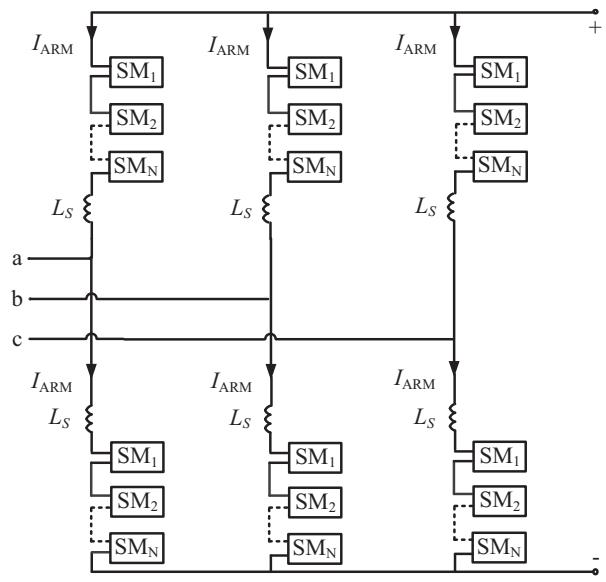  
Fig. 1. Schematic diagram of three-phase MMC.

MMC, as shown in Fig. 2(a). It consists of an insulated gate bipolar transistor (IGBT) half-bridge (IGBTs T1, T2 and diodes D1, D2) and a dc storage capacitor $C$ .

Each IGBT switch (i.e. the parallel connection of an IGBT and a diode) in Fig. 2(a) can be treated as two-state resistive devices [10]. In Fig. 2(a)-(c), $I_{\mathrm{SM}}$ equals to $I_{\mathrm{ARM}}$ as in Fig. 1.

Using the Trapezoidal Rule (TR), a companion circuit is constructed as shown in Fig. 2(b). The resistance and voltage source values as functions of time are given by (1) and (2). Capacitor current $I_{\mathrm{C}}(t)$ in Fig. 2 is obtained as (3), in which $I_{\mathrm{ARM}}$ represents the arm current. The superscript "T" indicates that TR was used in the construction of the companion model.

$$
R _ {C} ^ {T} = \frac {\Delta T}{2 C} \tag {1}
$$

$$
V _ {\mathrm {C E Q}} ^ {\mathrm {T}} (t - \Delta T) = V _ {\mathrm {C}} ^ {\mathrm {T}} (t - \Delta T) + R _ {\mathrm {C}} ^ {\mathrm {T}} I _ {\mathrm {C}} (t - \Delta T) \tag {2}
$$

$$
I _ {\mathrm {C}} (t) = \frac {I _ {\mathrm {A R M}} (t) \cdot R _ {2} - V _ {\mathrm {C E Q}} (t - \Delta T)}{R _ {1} + R _ {2} + R _ {\mathrm {C}}} \tag {3}
$$

Using TR, the updated capacitor voltage at time $t$ can be obtained from the voltage at time $(t - \Delta T)$ as in (4):

$$
V _ {\mathrm {C}} ^ {\mathrm {T}} (t) = V _ {\mathrm {C}} ^ {\mathrm {T}} (t - \Delta T) + \Delta V _ {\mathrm {C}} ^ {\mathrm {T}} \tag {4a}
$$

$$
\Delta V _ {\mathrm {C}} ^ {\mathrm {T}} (t) = \left[ I _ {\mathrm {C}} (t - \Delta T) + I _ {\mathrm {C}} (t) \right] \times R _ {\mathrm {C}} ^ {\mathrm {T}} \tag {4b}
$$

Converting Fig. 2(b) into a Thévenin equivalent gives the circuit of Fig 2(c), with the equivalent parameters $R_{\mathrm{SMEQ}}$ and $V_{\mathrm{SMEQ}}$ given by (5) and (6).

$$
R _ {\text {S M E Q}} (t) = R _ {2} \times \left(1 - \frac {R _ {2}}{R _ {1} + R _ {2} + R _ {C}}\right) \tag {5}
$$

$$
V _ {\text {S M E Q}} (t - \Delta T) = \left(\frac {R _ {2}}{R _ {1} + R _ {2} + R _ {\mathrm {C}}}\right) \times V _ {\text {C E Q}} (t - \Delta T) \tag {6}
$$

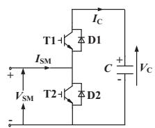  
(a)

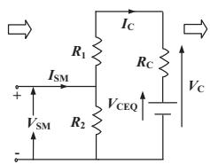  
(b)

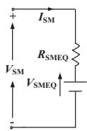  
(c)   
Fig. 2. Schematic diagram of MMC SM: (a) electric circuit, (b) companion equivalent circuit (c) SM Thévenin equivalent.

The Thévenin equivalents of the $N$ SMs in the bridge arm are then compressed into a single Thévenin equivalent as shown in the dashed area of Fig. 3.

In normal operation, the ON/OFF states of the SMs are determined by the controllers, $V_{C}$ and $T_{SM}$ in Fig. 3 are the output capacitor voltages and input firing pulses of the SMs. The values of the Thévenin equivalent resistance $R_{\mathrm{ARMEQ}}$ and the equivalent voltage $V_{\mathrm{ARMEQ}}$ are given by (7) and (8) where $V_{\mathrm{SMEQ\_i}}$ and $R_{\mathrm{SMEQ\_i}}$ are the Thévenin voltage and resistance of the ith SM as in Fig. 2(c).

$$
R _ {\text {A R M E Q}} (t) = \sum_ {i = 1} ^ {N} R _ {\text {S M E Q} - i} (t) \tag {7}
$$

$$
V _ {\text {A R M E Q}} (t - \Delta T) = \sum_ {i = 1} ^ {N} V _ {\text {S M E Q}, i} (t - \Delta T) \tag {8}
$$

However, this is not the case when the MMC valves are blocked, which occurs during MMC startup, protective actions, etc. When all the IGBTs are blocked the arms are only affected by the diodes, which determine whether the SMs are bypassed or inserted simultaneously, depending on the arm current directions.

In block state, the MMC arm can be modeled using the circuit shown in Fig. 3 [5], the two diodes D1 and D2 are used to represent the current direction selection effects. And the breakers BRK_1 and BRK_2 are responsible for changing the working modes of MMC either in normal operation or blocking state. If $I_{\mathrm{ARM}}$ is positive, the Thévenin equivalent resistance $R_{\mathrm{ARMEQ}}$ and voltage $V_{\mathrm{ARMEQ}}$ are used to represent the diodes and capacitors in Fig. 2, which can be respectively obtained from (7) and (8) through assuming all the SMs are inserted. If $I_{\mathrm{ARM}}$ is negative, the resistance $R_{\mathrm{ON\_EQ}}$ is used to represent the conducting resistance of the diodes in Fig. 2, which can be calculated using (9).

$$
R _ {\mathrm {O N} - \mathrm {E Q}} = N \cdot R _ {\mathrm {O N}} \tag {9}
$$

Regarding the equivalent circuit of MMC, no detail is lost in this process, but the overall final representation in the EMT solver is very simple, which leads to a much faster solution. However, even though this approach results in up to two orders of magnitude saving in computation time [8], it is still much slower than the less accurate AVMs [9], and hence modeling multi-terminal dc grids with several MMCs can still take a long time. The next section discusses the principal contributions of this paper, which is an attempt to further speed up the computation speed by another 1 or 2 orders of magnitude, without significant loss of accuracy.

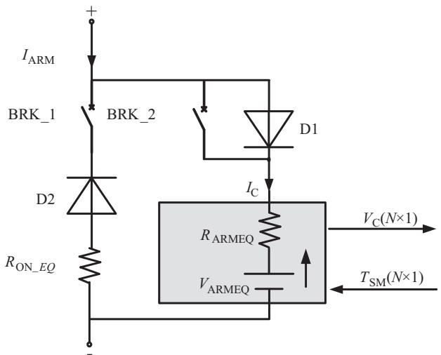  
Fig. 3. Thévenin equivalent for a single phase arm of MMC under both normal and blocking states.

# Proposed enhanced high-speed MMC model

The internal controller generates the desired instantaneous output voltage as per the voltage order and also implements the capacitor balancing algorithm. The paper shows that using the Backward Euler (BE) method to obtain the companion model with an idealized switch representation can provide a speedup as compared with the traditional TR method. Some of the coding details when implementing the proposed models in PSCAD/EMTDC are also provided and discussed for the convenience of the readers.

# Backward Euler Method based MMC model

# Idealized representation of switch conductance

In the previous Thévenin equivalent MMC model [8], the computation burden mainly consists of the construction of the Thévenin equivalent, the updating of each individual capacitor and the capacitor voltage balancing algorithms. However, through the assumption of zero conductance value of the switch in off state (i deal"OFF"state), Eqs. (3), (5) and (6) are greatly simplified into the following form (10)-(12):

$$
I _ {\mathrm {C}} (t) = \left\{ \begin{array}{l l} I _ {\mathrm {A R M}} (t), & \text {i f c a p c i t o r i s i n s e r t e d} \\ 0, & \text {i f c a p c i t o r i s b y p a s s e d} \end{array} \right. \tag {10}
$$

$$
R _ {\text {S M E Q}} (t) = \left\{ \begin{array}{l l} R _ {\mathrm {O N}} + R _ {\mathrm {C}}, & \text {i f c a p c i t o r i s i n s e r t e d} \\ R _ {\mathrm {O N}}, & \text {i f c a p c i t o r i s b y p a s s e d} \end{array} \right. \tag {11}
$$

$$
V _ {\text {S M E Q}} (t - \Delta T) = \left\{ \begin{array}{l l} V _ {\text {C E Q}} (t - \Delta T), & \text {i f c a p c i t o r i s i n s e r t e d} \\ 0, & \text {i f c a p c i t o r i s b y p a s s e d} \end{array} \right. \tag {12}
$$

Note that there are far fewer terms in Eqs. (10)-(12) and also there are no mathematical multiplications or divisions. Usually, the SMs have identical parameters, so that a simple expression for the Thévenin resistance of the entire arm is as

$$
R _ {\text {A R M E Q}} (t) = N \times R _ {\mathrm {O N}} + N _ {\mathrm {O N}} (t) \times R _ {\mathrm {C}} \tag {13}
$$

In (13), $N_{\mathrm{ON}}(t)$ is the number of conducting SMs in the arm at time $t$ . The Thévenin voltage can be directly obtained as the sum of the individual Thévenin voltage of the SMs which are in the "ON" state in this time-step. There is a slight additional computational saving compared to (7) because only the conducting SMs have to be added.

# Using Backward Euler Method

Like TR, BE is also A-stable, in that a stable real-world linear system also has a stable simulation. If the BE is employed to discretize the capacitor (the superscript "E" indicates that BE was used), the companion model in Fig. 2(b) can be obtained with:

$$
R _ {C} ^ {E} = \frac {\Delta T}{C} \tag {14}
$$

$$
V _ {\mathrm {C E Q}} ^ {\mathrm {E}} (t - \Delta T) = V _ {\mathrm {C}} ^ {\mathrm {E}} (t - \Delta T) \tag {15}
$$

$$
\begin{array}{l} V _ {C} ^ {E} (t) = V _ {C} ^ {E} (t - \Delta T) + \Delta V _ {C} ^ {E} (t) \\ = V _ {\mathrm {C}} ^ {\mathrm {E}} (t - \Delta T) + I _ {\mathrm {C}} (t) \times R _ {\mathrm {C}} ^ {\mathrm {E}} \\ \end{array}
$$

Eqs. (10)-(13) are still applicable, and combing (10) and (16) the formula for the updating of capacitor voltage needs some minor adjustments, which is shown in Table 1:

The immediate advantage is that only the "ON" state capacitors in the SMs in the present time-step need updating of voltage, which can be efficiently achieved through adding the same value (calculated once) to all capacitors in that category. Furthermore, it also brings some extra benefits in the sorting which will be shown in the next section.

# Using an improved sorting algorithm

The most popular MMC capacitor voltage balancing algorithm is "Nearest Level Control" (NLC). It uses ranking and sorting of the

Table 1   
Capacitor voltage increment (Backward Euler Method).   

<table><tr><td>Present state at t</td><td>ΔVC(t)</td></tr><tr><td>OFF</td><td>0</td></tr><tr><td>ON</td><td>IRM(t) × RC</td></tr></table>

capacitor voltages, and is recommended when the MMC has a very large number of SMs. Often the user does not model the detailed voltage balancing controller but desires a built in generic model. For such applications, this paper introduces a new type of modeling approach which combines the equivalent circuit generation method and a fast sorting algorithm to achieve superior speeds. This approach is described below.

At the start of the simulation, the capacitors are ranked in order of voltage magnitude. As this is only done once, the exact sorting algorithm used is not critical. In each following time step, the procedure for the sorting is shown in Fig. 4, which can be grouped into the following steps:

- Step I: At any stage in the procedure, the ranking of all the SMs by voltage is available. In Fig. 4, the ranking at the beginning of the time-step is shown as Step I, with capacitor voltages $a_1 \leqslant a_2 \leqslant \ldots \leqslant a_k \leqslant b_1 \leqslant b_2 \ldots \leqslant b_m$ . The reason for using different variable names (a and b) for the capacitor voltages will become clearer momentarily. At the present time $t$ the external controller gives a voltage order from which the number $N_{\mathrm{ON}}(t)$ of conducting SMs is determined. Assume the case when the arm current $I_{\mathrm{ARM}}$ is positive. As the positive current charges the capacitor in any conducting SMs, the $N_{\mathrm{ON}}(t)$ capacitors with the lowest voltages must be placed in the "ON" group. The SMs in the "ON" group are thus $\{a_1, a_2, \ldots, a_k\}$ , with $k = N_{\mathrm{ON}}(t)$ and in the "OFF" group are $\{b_1, b_2, \ldots, b_m\}$ where $m = N - k$ .   
- Step II: Because of the assumption of Backward Euler integration and an ideal switch, in the current time-step, the voltages in the "ON" state are all incremented by the same amount $\Delta V_{\mathrm{C}}(t) = I_{\mathrm{ARM}}(t)\times R_{\mathrm{C}}$ as indicated in (16) and Table 1. The capacitor voltages thus change from $\{\mathsf{a}_1,\mathsf{a}_2,\dots ,\mathsf{a}_k\}$ to $\{\alpha_{1},\alpha_{2},$ $\ldots ,\alpha_{\mathrm{k}}\}$ , and the relative ranking is still maintained (i.e., $\alpha_{1}\leqslant \alpha_{2}\leqslant \ldots \leqslant \alpha_{k})$ . Also, the capacitors in the "OFF" group retain their voltages and ordering (see Table 1) and remain at $\{\mathsf{b}_1,\mathsf{b}_2,$ $\ldots ,\mathsf{b}_{\mathfrak{m}}\}$ . This observation of unchanged ranking in both "ON" and "OFF" groups is what leads to the high computational efficiency of the proposed method.   
- Step III: At the start Step I a single ranking table of all capacitor voltages (regardless of whether they were in the "ON" or "OFF" states) was available. For Step I of the next time-step $(t + \Delta t)$ ,

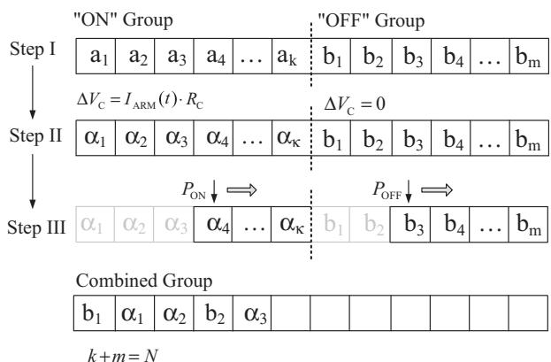  
Fig. 4. The proposed BE method based sorting algorithm for MMC.

Table 2 Capacitor voltage increment (Trapezoidal Rule).   

<table><tr><td rowspan="2" colspan="2">ΔVC(t)</td><td colspan="2">Present state at t</td></tr><tr><td>OFF</td><td>ON</td></tr><tr><td rowspan="2">Past state at (t-ΔT)</td><td>OFF</td><td>0</td><td>IARM(t) × RC</td></tr><tr><td>ON</td><td>IARM(t-ΔT) × RC</td><td>[IARM(t-ΔT) + IARM(t)] × RC</td></tr></table>

the same table will be required again assuming ranking in the ascending order of voltage. As the SMs in each group are already in ascending order, a small number of comparisons can be conducted to re-order the entries in the combined list with the "ON" and "OFF" groups combined. To facilitate the implementation, pointers $\mathrm{P_{ON}}$ and $\mathrm{P_{OFF}}$ are used. Initially, $\mathrm{P_{ON}} = 1$ , $\mathrm{P_{OFF}} = 1$ , and the first "ON" group location $(\alpha_{1})$ is compared with the first "OFF" group location $(b_{1})$ . If $b_{1} < \alpha_{1}$ , then $b_{1}$ is moved to the first location in the combined group and $\mathrm{P_{ON}} = 1$ and $\mathrm{P_{OFF}} = 2$ , which means that in the next sorting iteration, $\alpha_{1}$ will be compared with $b_{2}$ . Instead, if $b_{1} > \alpha_{1}$ , then $\alpha_{1}$ would become the first element in the combined group, and $\mathrm{P_{ON}}$ would be set to 2 and $\mathrm{P_{OFF}}$ would be 1, indicating that in the next iteration $\alpha_{2}$ would be compared with $b_{1}$ . Continuing this process, the entire table can be sorted in at most (N-1) comparison operations. Fig. 4 shows a typical sorting scenario after 5 sorting iterations assuming $b_{1} < \alpha_{1} < \alpha_{2} < b_{2} < \alpha_{3}$ .

The speedup of the algorithm comes from the fact that at each time step, one does not sort the whole capacitor voltage table using traditional sorting algorithms, while the efficient sorting shown in Fig. 4 is used, as within the groups, the rankings do not change. Note that this sorting is done assuming the BE method, and the assumption that the "OFF" switch is an ideal open circuit. In a field application, such an approach may not be possible, as an absolute ranking of the whole table may be necessary because of slightly different values of parameters in each SM, and the possibility of compounding of errors. The procedure was described for $I_{\mathrm{ARM}} > 0$ . For $I_{\mathrm{ARM}} < 0$ , the "ON" group is formed in a similar way in Step I, except that the k largest voltage capacitors are selected for the "ON" group.

# Trapezoidal rule based MMC model

The TR based MMC model also assumes an idealized off switch and hence (10)-(12) are applicable. Combining (10) and (4b) yields simple equations for the increment in capacitor voltage in a timestep as in Table 2.

From Table 2, it can be seen that voltage updating is not necessary when past and present states are "OFF", since the incremental value is zero. For the SMs whose past and present states are "ON", the incremental voltage calculated once can be used to update all these SM capacitor voltages, because the same arm current flows through all SMs and is responsible for charging or discharging the capacitors. For the other SMs (e.g. past states are "ON" while present states are "OFF"), similar updating scheme can also be used.

The NLC's sorting based on TR can also be speeded up as described for the BE approach. However, here, the SMs need to be divided into four rank-preserving groups. And a similar approach can be obtained through performing the sorting algorithm in BE method twice. In the first round, the four groups are combined into two intermediate fully ranked groups using the sorting process as in Fig. 4. Then the sorting problem becomes same as the one in BE method and therefore the same algorithm can be used again to get the fully ranked results. To achieve the full ranking, at most (2N-3) comparison operations are required as

opposed to at most (N-1) comparisons for the BE based MMC model.

# Model implementation in PSCAD/EMTDC

Both the proposed BE and TR methods based MMC models are developed and tested in PSCAD/EMTDC using the built-in functions. However, the Fortran Compliant in the EMTDC solver is not very convenient for user-defined purposes, such as it cannot set interruption and is very hard to debug the coding mistakes.

Although it is not easy, it is doable to implement step by step using the Eqs. (1)-(16) of this paper, they will include the integration and discretization of the capacitors to generate the companion circuit and further to generate the equivalent voltage and resistance of the entire bridge arm. Then using the "CALL" function to integrate the arm equivalent circuit into the external system to proceed one time step simulation.

In order to update all the N SM capacitor voltages once the calculation of the entire arm equivalent at each time step is finished, the history arm current as well as the capacitor current should be measured by the built-in "CBR" function. However, the EMTDC solver is not possible to provide the latest arm current value at time $t$ , "CBR" can only provide the current with one time step delay, i.e. updating and outputting the capacitor voltage at time $(t + \Delta T)$ . Actually, massive simulations show that this is not a big issue for accurate reproducing of MMC behaviors. Note that in the detailed SM, as shown in Fig. 2(a), the capacitor voltage $V_{C}$ will never go negative otherwise diodes D1 and D2 will discharge the capacitor. In the equivalent model, the freewheeling diodes are simulated as two-state resistances hence it cannot clamp the capacitor voltage to be positive or zero. This non-negative characteristic of $V_{C}$ is guaranteed using an "if" statement in the proposed model, i.e. if the updated $V_{C}$ is negative, it is set to be zero.

Also, the proposed approach can also be implemented on other EMT platforms such as MATLAB/SIMULINK, which indicates that the proposed generic model is also applicable to other platforms which permits user-defined access.

# Model validation

The accuracy and speed-up factors of the proposed high-speed MMC models are validated by comparison with the traditional EMT time domain simulation of fully detailed MMC and the previously developed Thévenin equivalent model [8]. The simulation time-step $\Delta T = 20~\mu s$

The accuracy of the proposed approaches is determined by comparing the following models with varying detail of representation:

(a) Detailed: The fully detailed EMT model which uses Trapezoidal Rule and bubble sorting;   
(b) Trap_ImpSort: The proposed Trapezoidal Rule based MMC model with the improved sorting algorithm;   
(c) BE ImpSort: The proposed Backward Euler method based MMC model with the improved sorting algorithm;

# Accuracy validation of proposed approach

In this sub-section, the proposed MMC models (b) and (c) above are compared with the fully detailed model (a) in order to validate the proposed MMC models for HVdc studies. A 49-level point to point MMC-HVdc test system, with a symmetrical monopole configuration as shown in Fig. 5 is used for this demonstration. The system parameters are listed in the Appendix (see Table A.1).

MMC1 is responsible for controlling the dc voltage and the reactive power, MMC2 regulates the real power and reactive power.

# Normal operation

At the beginning of the simulation, the MMCs are blocked to charge the capacitors. At $t = 1.0$ s, the MMCs are de-blocked. On attaining rated dc voltage, at $= 4.3$ s the circulating current suppression controller is put into operation. The dc voltage transient during startup and de-blocking is shown in Fig. 6.

The proposed models with idealized switch resistances and built in sorting (BE_ImpSort and Trap_ImpSort) give essentially the same start-up transient as the fully detailed model.

The upper arm current are shown in Fig. 7, and show that the results of the proposed models are close to the detailed simulation. To distinguish the curves easier, different line styles are used for the illustration.

The capacitor voltage of the uppermost SM in phase "a" is shown in Fig. 8(a). Now the detailed and equivalent models show a somewhat different capacitor voltage for each model although the maximum voltage ripple is identical for all models.

The reason for this is that the NLC algorithm which determines the switching actions selects which SM to switch based on its rank in the SM capacitor voltage table. Hence when two SMs (say SM "P" and SM "Q") are very close in voltage, even the slightest difference in calculated voltage may determine which SM is selected next. For example if P is selected, its voltage waveform will look quite different from that of Q. However, it is the sum of all capacitors in the "ON" condition that contribute to the MMC internal arm currents as seen in Fig. 8(b), and they are close. Thus, the curves of Figs. 6-8 show that even though the voltage of a given SM appears different, its essential metrics such as the maximum amplitude of capacitor voltage ripple, remain the same.

The next sub-section will validate the MMC external behaviors under transient ac and dc system fault conditions for the proposed models.

# Transient behaviors under ac fault

A $50\mathrm{ms}$ three-phase to ground short circuit fault is applied to the high voltage side of the Transformer T1 (see Fig. 5) at $t = 4.3\mathrm{s}$ . Fig. 9 shows the real power of MMC1. Note that the ac circuit breakers were not tripped because of the short duration of the temporary ac-side fault.

Fig. 9 indicates that the proposed models with built in sorting adequately reproduce system-level transients in the case of ac side faults. However, if zoom in these figures, the TR model is always more accurate than the BE model due to the essential differences of the two integration methods. The TR method uses both the previous and present time step information of the capacitor current and thus has larger computational complexity as compared to the BE method. Hence in the EMT simulation of large scale MMCs, the BE model would be suggested because it is accurate enough and yet more computational efficient than TR model.

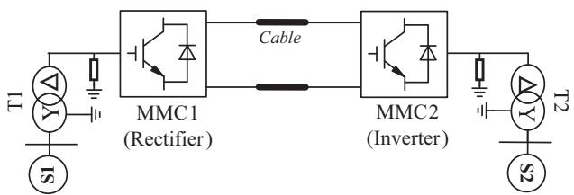  
Fig. 5. Point to point MMC-HVdc test system.

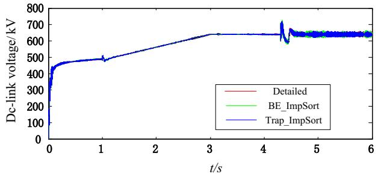  
Fig. 6. Dc-link voltage of MMC1 during system start-up.

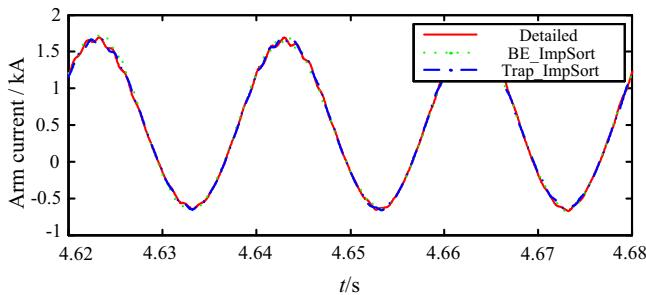  
Fig. 7. MMC1 phase "a" arm current.

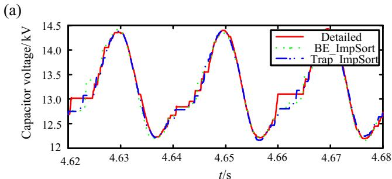

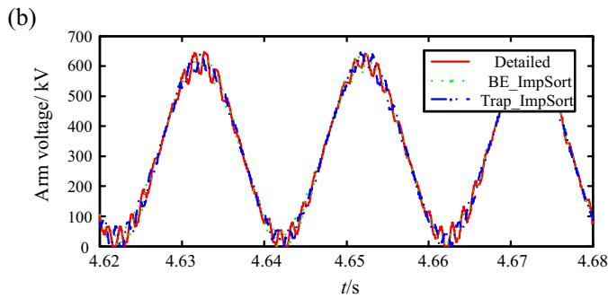  
Fig. 8. Individual capacitor voltage and arm voltage of MMC phase "a".

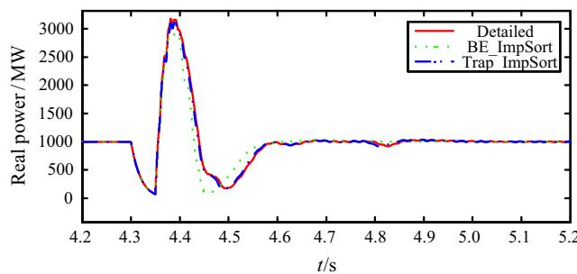  
Fig. 9. Transmitted real power of MMC1.

# Transient behaviors under dc fault

In order to showcase the robustness of the proposed models with dc faults, a pole to pole short circuit is applied at $t = 4.3$ s on the dc side of MMC1 in Fig. 5. The capacitor voltages of the uppermost phase "a" SMs are shown in Fig. 10 (without protection). The waveforms show near-identical responses to the detailed simulation. They also show no negative voltage transition.

Fig. 11 shows the capacitor voltage waveforms of the three models under dc short-circuit fault with converters blocked considering 1 ms delay.

It can be seen that the blocking algorithm embedded into the proposed MMC model can faithfully reproduce the clamping function of the capacitor voltages, as the fully detailed model.

# TR and BE algorithms stability analysis

To investigate the stability of the applied TR and BE methods, the three models are simulated with larger time steps, here, using $200\mu s$ . Then the waveforms of the real power under ac-side short circuit fault are shown in Fig. 12.

With the simulation time step increases, as indicated before, the accuracy of the BE model decreases more rapidly compared with the TR model. However, when simulating large scale MMC with hundreds of SMs per arm, the simulation time step should be selected relatively small, and in this case, the relative errors of both TR and BE based MMC models are in acceptable range.

# CPU time validation of proposed approach

The power of the proposed approach to speed up the simulation is presented in this section. The speed-up accrues from two factors. The first is the implementation of the idealized switches and the BE integration in the proposed algorithm. The second is due to the built-in integration of sorting and switching as described in section 'Proposed enhanced high-speed MMC model'. This section examines the speed-up due to both these factors. For computational speed comparisons, the following four models are considered in addition to the three listed at the top of section 'Model validation', i.e. Detailed, Trap ImpSort and BE ImpSort.

(a) Pre_eqv_BubSort: The previously developed high-speed Thévenin equivalent model [8] which uses Trapezoidal Rule and bubble sorting;   
(b) Pre_eqv_SheSort: The Thévenin equivalent model in (a) but using one of the fast state-of-the-art algorithms, i.e., shell sorting [11] instead of bubble sorting;   
(c) Trap_SheSort: The proposed Trapezoidal Rule based MMC model with efficient shell sorting;   
(d) BE SheSort: The proposed Backward Euler method based MMC model with efficient shell sorting;

The simulation platform used in these studies was an Pentium (R) dual core CPU 3.20 GHz with 2 GB of RAM and a 32-bit

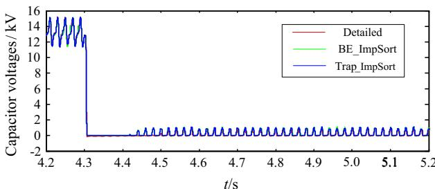  
Fig. 10. Capacitor voltages of MMC1 under dc faults without protection.

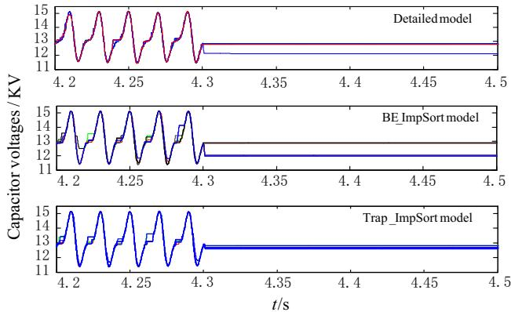  
Fig. 11. Capacitor voltages of MMC1 under dc faults with converter blocked.

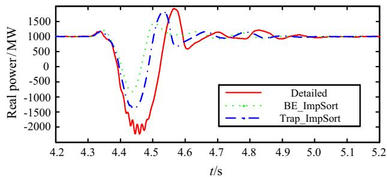  
Fig. 12. Real power of MMC1 under ac faults with larger time steps.

Windows 7 Operating System. All models were implemented on the PSCAD/EMTDC Professional V4.4.1 EMT program.

# NLC based single phase MMC models

In order to evaluate the CPU time-performance of the proposed models, single phase MMC models with the numbers of SMs varying from 12 to 800 are simulated. The time-step is $20~\mu \mathrm{s}$ and the total simulated period is $20\mathrm{s}$ . Note that testing the single-phase cases here is just to evaluate the computational burden of the models with simplest control systems. And later the proposed models applied to a real case, i.e. 4-terminal dc grid will be tested and compared.

Table 3 shows part of CPU times of all the NLC based models, as functions of the SM number. For cases exceeding 400 nodes, the simulation time for the detailed model is not included (blank entries) as the simulations would have taken too long (several days). Fig. 13 plots the CPU times as a function of the SM count. Both $x$ - and $y$ -axis scales are logarithmic.

Table 3 and Fig. 13 demonstrate the following aspects. Consider the case with 120 SMs, which is the largest number for which the detailed model CPU time is available. As was already known, the Thévenin equivalent model reported in [8] is much faster than

Table 3 CPU times of NLC based MMC models (single-phase).   

<table><tr><td rowspan="2" colspan="2">CPU time (s)</td><td colspan="4">Submodule number</td></tr><tr><td>48</td><td>120</td><td>400</td><td>800</td></tr><tr><td rowspan="7">Model</td><td>Detailed</td><td>1152</td><td>55490</td><td>-</td><td>-</td></tr><tr><td>Pre_eqv_BubSort</td><td>29.64</td><td>73.68</td><td>607.6</td><td>3230</td></tr><tr><td>Pre_eqv_SheSort</td><td>28.87</td><td>57.4</td><td>198.9</td><td>417.9</td></tr><tr><td>Trap_SheSort</td><td>14.66</td><td>25.6</td><td>83.69</td><td>167.9</td></tr><tr><td>Trap_ImpSort</td><td>14.6</td><td>24.2</td><td>66.5</td><td>123</td></tr><tr><td>BE_SheSort</td><td>11.51</td><td>17.55</td><td>58.68</td><td>120.3</td></tr><tr><td>BE_ImpSort</td><td>11.21</td><td>15.69</td><td>36.3</td><td>62.7</td></tr></table>

the detailed model. Replacing the sorting algorithm in the external controller with one of the fast state-of-the-art algorithms (shell-sorting) [11] does improve the speedup. The simulation time decreases from 73.68 s to 57.4 s. However, with the external controller implemented shell-sort algorithm, the proposed BE based algorithm with idealized switches requires only 17.55 s. If the built-in switching approach as proposed is used, the speedup is improved to 15.69 s, which is at least 3 orders of magnitude faster (3530 times) than the detailed model. CPU times with the trapezoidal integration are slower requiring 25.6 s and 24.2 s with external and internal sorting respectively.

Another interesting feature is that with the proposed BE method with built-in sorting, the dependence of computation time (CT) and number of sub-modules (SM) is very nearly given by the linear equation $\mathrm{CT} = 0.07\mathrm{SM} + 8$ , showing that computation burden of the proposed method grows only linearly with size. The above results show that even though some improvement in simulation time can accrue from simply improving the sorting algorithm, much faster speeds can be achieved with ideal switches and by combining the sorting and switching into a single algorithm.

As seen in Fig. 13, the speedup ratio gets even better as the submodule count increases. It is worth noting that compared with earlier approaches even when they are speeded up with fast sorting, the CPU times of both the BE and TR based MMC models using the proposed approach are significantly faster. However, the BE based model is about twice as fast for every large sub-module counts.

# BE and NLC based 4-terminal MMC-MTdc Grid

To see the real advantage of the new model, it was used for the simulation of the 4-terminal dc grid with closed-loop controls, as shown in Fig. 14, which becomes cumbersome to simulate even with previous Thévenin models, and impractical with fully detailed models.

The proposed approach is also compared with the averaged value model, and results are shown in Table 4.

Table 4 shows that with very large scale MMC-MTdc the computational efficiency of the proposed MMC model compares favorably with a simplified AVM which ignores individual capacitor switching. For example, with 100 SMs per arm, the proposed model requires only about twice the CPU time of the AVM. With 400 SMs, the AVM is only 3.6 times faster, and with 1000 SMs, it is about 6 times faster. In most practical cases the SM count will be less than

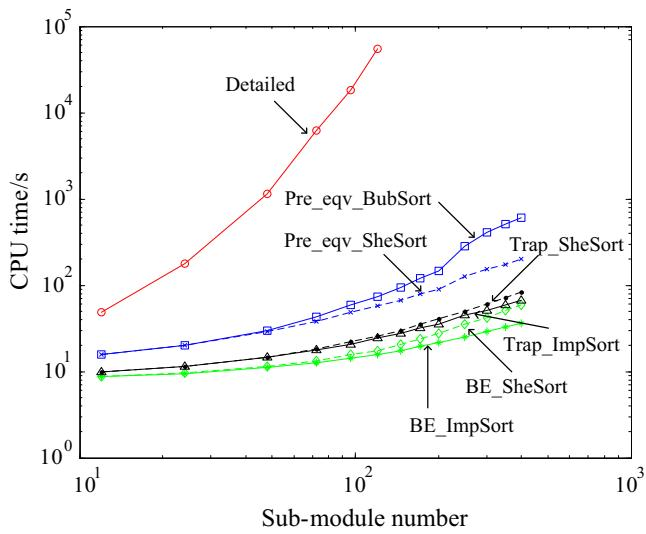  
Fig. 13. CPU time comparisons of NLC based MMC models.

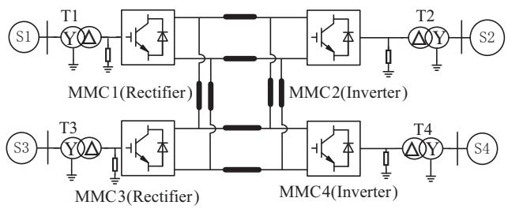  
Fig. 14. BE based 4-terminal MMC-MTdc test system.

Table 4 CPU times of NLC based 4-terminal MMC-MTDC grid.   

<table><tr><td>Submodule number</td><td>BE_ImpSort (s)</td><td>AVM (NLC) (s)</td></tr><tr><td>100</td><td>996</td><td>492</td></tr><tr><td>250</td><td>1452</td><td>492</td></tr><tr><td>300</td><td>1560</td><td>492</td></tr><tr><td>400</td><td>1780</td><td>492</td></tr><tr><td>600</td><td>2140</td><td>492</td></tr><tr><td>1000</td><td>3024</td><td>492</td></tr></table>

500. For example, with 400 SMs per arm, the simulation time for a $20\mathrm{~s}$ simulation using a $20~\mu \mathrm{s}$ time-step is only $1780\mathrm{~s}$ or less than half an hour. Note that AVM is less accurate as it does not consider individual SMs and hence its computation time does not change with SM count. The proposed model however can simulate all operating conditions. Hence, the proposed MMC model, particularly with BE and integrated sorting/switching is an excellent candidate for use in simulations that require a detailed representation of the MMC, including all individual SMs. It gives very high simulation accuracy, essentially equal to that of a fully detailed model, but with simulation time only 2-4 times larger than with an AVM for most practical cases.

# Conclusion

This paper introduces a new modeling approach for electromagnetic transient simulation of the MMC converter by using an idealized open-circuit representation for the "OFF" switch and using the A-stable integration methods of Backward Euler (BE) or Trapezoidal Rules (TR). This approach considerably reduces the mathematical operations for generating the Thévenin equivalent for interfacing to the main EMT solution, without significant sacrifice of accuracy compared to fully detailed modeling. The algorithm is especially fast if a built-in sorting algorithm is combined with the switching logic, and shows a linear relationship between computation time and number of submodules. Additionally, any arbitrary sorting algorithm implemented in an externally modeled controller (such as the external shell-sort sorting algorithm) can also be incorporated into the proposed BE and TR based algorithms with high efficiency.

The paper shows that the proposed BE model with built-in sorting is between 3 and 4 orders of magnitude faster than the fully detailed model and is even between 1 and 2 orders of magnitude faster than the fast algorithms proposed earlier. Within the same simulation time step range which is suitable for simulating MMC with large number of SMs, the BE based model is of comparable accuracy and yet $50\%$ faster than the TR model. Therefore, the proposed Backward Euler method based MMC equivalent model with built-in sorting is an ideal model for use in the simulation of large HVdc grids with multiple MMC converters.

Table A.1 Parameters of the point to point MMC-HVDC system.   

<table><tr><td rowspan="3">Ac system</td><td>Ac voltage</td><td>UBus(L-L_RMS)=230 kV</td></tr><tr><td>Real power</td><td>P=1000 MW</td></tr><tr><td>Winding type</td><td>YN/△-R</td></tr><tr><td rowspan="3">Transformer</td><td>Capacity</td><td>STN=1022.2 MVA</td></tr><tr><td>Turn ratio</td><td>K=230 kV/341.3 kV</td></tr><tr><td>Leakage reactance</td><td>LT=0.15 p.u.</td></tr><tr><td rowspan="4">MMC</td><td>Arm reactance</td><td>LS=85 mH</td></tr><tr><td>SM capacitance</td><td>C=1.2 mF</td></tr><tr><td>SM voltage</td><td>USM=13.33 kV</td></tr><tr><td>SM count per arm</td><td>N=48</td></tr><tr><td rowspan="2">Dc system</td><td>Dc voltage</td><td>UDc=640 kV</td></tr><tr><td>Dc cable</td><td>10.7 km frequency dependent model on PSCAD/EMTDC</td></tr></table>

# Acknowledgement

This work was supported by National High Technology Research and Development Program of China (863 Program) (2013AA050105). Also the authors would like to show their thanks to Dr. Yi Zhang and Mr. Sumek Elimban from RTDS Technologies Inc. for providing many useful suggestions.

# Appendix A.

See Table A.1.

# References

[1] Latorre HF, Ghandhari M. Improvement of power system stability by using a VSC-HVDC. Int J Electr Power Energy Syst 2011;33:332-9.   
[2] Tang Geng, Xu Zheng. A LCC and MMC hybrid HVDC topology with DC line fault clearance capability. Int J Electr Power Energy Syst 2014;62:419-28.   
[3] Tu Q, Xu Z. Impact of sampling frequency on harmonic distortion for modular multilevel converter. IEEE Trans Power Del 2011;26(1):298-306.   
[4] Xue Yinglin, Zheng Xu Zheng, Tu Qingrui. Modulation and control for a new hybrid cascaded multilevel converter with DC blocking capability. IEEE Trans Power Del 2012;27(4):2227-37.   
[5] Beddard A, Barnes M, Preece R. Comparison of detailed modeling techniques for MMC employed on VSC-HVDC schemes. IEEE Trans Power Del 2015;30 (2):579-89.   
[6] Saad H, Dennetiere S, Mahseredjian J, et al. Modular multilevel converter models for electromagnetic transients. IEEE Trans Power Del 2014;29 (3):1481-9.   
[7] Xu J, Zhao C, Liu W, et al. Accelerated model of modular multilevel converters in PSCAD/EMTDC. IEEE Trans Power Del 2013;28(1):129-36.   
[8] Gnanarathna UN, Gole AM, Jayasinghe RP. Efficient modeling of modular multilevel HVDC converters (MMC) on electromagnetic transient simulation programs. IEEE Trans Power Del 2011;26(1):316-24.   
[9] Xu J, Gole AM, Zhao C. The use of averaged-value model of modular multilevel converter in dc gird. IEEE Trans Power Del 2015;30(20):519-28.   
[10] PSCAD X4 User's Guide. Winnipeg, MB, Canada, Manitoba HVDC Research Center, 2009.   
[11] Donald Knuth. The art of computer programming. Sorting and Searching, 2nd ed. vol. 3, Addison-Wesley, 1998. p. 106-10, ISBN 0-201-89685-0.