# Comparison of soil modeling concerning physical factors: Application to transient analysis in wind turbines✩

Walter Luiz Manzi de Azevedo, Wagner Costa da Silva, Anderson Ricardo Justo de Araújo ∗, José Pissolato Filho

University of Campinas, Campinas, Brazil

# A R T I C L E I N F O

Keywords:

Electromagnetic analysis

Wind turbines

Lightning performance

Grounding system

Physical factors

# A B S T R A C T

This work analyzes the impact of the physical factors (frequency effect, water content, and porosity level) on the voltages developed along the wind turbine (WT) subjected to lightning strikes. The analysis is performed considering a realistic grounding system (GS) where the full-wave electromagnetic (ES) software FEKO/Altair Engineering® calculates the GS harmonic impedance (HI) for 100 Hz to 10 MHz. For this purpose, six soil models [Visacro–Portela, Portela, Visacro–Alípio, Alípio–Visacro, Datsios–Mikropoulos, and Archie] and their transient responses are assessed. Comparisons are made with those assuming a frequency-constant (FC) soil at the dry condition. The GPR on the GS and the voltages on the tower base and nacelle are calculated using the software ATP® for the transient analysis. Results show a significant impact on HI with the physical factors, being remarkable at high frequencies and for high-resistive soils. Consequently, a notable decrease in the GPR peaks is seen compared with those with FC soils. These soil models and the lightning currents influence voltages at the nacelle and tower base. Results demonstrated that the Portela model predicts a more significant decrease in the voltages, and Datsios-Mikropoulos’s model provides closer responses to the FC soil. Increasing porosity yields larger peak values, and increasing water content produces lower voltages.

# 1. Introduction

Wind energy is one of the most efficient renewable energy resources nowadays due to its constant replenishment in nature where wind turbines have become taller to maximize the energy produced. The inexhaustible presence of wind yields electricity, eliminating the problems caused by burning fuels or polluting the air, and its low cost of installation and maintenance are the main advantages. However, wind turbines (WT) are openly exposed to lightning discharges during thunderstorms, mainly on their blade’s tip, due to their height, locations on elevated terrains, or areas with high isokeraunic levels during thunderstorms [1–3]. Besides that, new WTs are taller nowadays to yield more power extracted from wind energy than in the past. Therefore, these new turbines are more vulnerable to lightning surges during thunderstorms since these structures can be excellent lightning initiators in both upward and downward directions [4,5]. These generated overvoltages can be very harmful to many components located at the nacelle, such as sensible electronic power equipment, generator, and transformer, being vulnerable to high impulsive voltages

during the transient state, leading to malfunctions or damage of these elements [2,6–8]. At the tower base, the abrupt ground potential rise (GPR) generated by the fast-front surge phenomena at the WT grounding system must be under a safe limit to guarantee the protection of people close to the grounding system (GS) and to reduce the damages to the installations and equipment in the vicinity [9,10]. In this frame, grounding systems are essential to estimate the temporary overvoltages along the parts of the WT and to design adequate insulation levels to protect several components during this transient state.

To correctly compute the overvoltages on a WT, the ground must be represented considering that its electrical parameters (electrical resistivity ??, magnetic permeability ??, and relative permittivity ??) are dependent on various physical factors, such as temperature [11], stratification [12,13], ionization [14,15], frequency dependency [16–21], water content [22–26] and porosity level [27,28]. Once a proper soil is adopted, the harmonic impedance of the GS can be assessed correctly for a large frequency range (from dc to MHz). Several ground models have been proposed in the literature to incorporate the frequency

dependency in the soil resistivity and permittivity to correctly assess the transient responses generated by lightning discharges on transmission lines and wind turbines $[ 6 , 2 1 , 2 5 ]$ .

The influence of the frequency effect on the soil resistivity ?? and relative permittivity $\varepsilon _ { r g }$ has been extensively studied in many papers in the literature since 1960s [16–21]. The frequency dependence occurs due to the polarization phenomena on the soil particles related to the increasing frequency of the incident electrical field penetrating the soil [29]. As a consequence, the soil resistivity and relative permittivity decrease with increasing frequency, this reduction more pronounced for high-resistive soils. Then, a remarkable decrease in the GPR (mainly the peak values) is seen when FD soils are used to represent the ground [21]. Cavka et al. in [19] have presented a comparison between the models of Scott [22], Longimre–Smith [23], Messier [24], Portela [16], Visacro–Portela [17] and Visacro–Alipio [18]. Further, they studied the impedance and GPR for a horizontal and wind turbine GS under first return stroke (FRS) and subsequent return stroke (SRS). Portela’s model presented a higher variation in the GPR waveshapes in this study. In[20], the authors have studied the impact of the frequencydependent soil models proposed by Longimre–Smith [23], Portela [16] and Visacro–Alipio [18] on the GPR and lightning-induced voltages on a 138-kV transmission line generated by FRS and SRS injected on the tower top. It was demonstrated that Portela’s model provided the most remarkable variations compared to the voltages computed assuming frequency-independent soil parameters. Further, the SRS current generated higher variations than those assessed by FRS, taking the exact value of soil resistivity [20].

Regarding the presence of water in the soil, this medium turns into a more conductive medium with increasing moisture as a result of the more ions from salts being dissolved in the voids between the solid parts of the ground. In Azevedo et al. [30], the authors investigated the impact of humidity on the WT using the soil model proposed by Messier. In [31], Azevedo et al. analyzed the impact of soil stratification, assuming that each layer is represented by Longmire-Smith’s model with certain water content. Nazari et al. [25] employed the method MoM to compute the HI of the grounding system of a WT composed of 20-m rods. The model Messier was used to represent the soil in their analysis [24]. Salarieh et al. [32] analyzed the soil models of Smith–Longmire [33], Scott [22], Messier [24] and Datsios–Mikropoulos [34] assuming distinct water levels, using only vertical and horizontal electrodes and their impact on GPR waveshapes, providing a comparative analysis between these soil approaches.

Soil is typically a porous medium composed of solid matter, air voids, and liquid water. When grounding electrodes are subjected to high current densities, the surrounding area of the conductor is exposed to an intensive electric field. If this field exceeds the critical electric field intensity of the soil, the ionization process occurs through the air voids. As a consequence, the grounding resistance of the conductor decreases $[ 1 4 , 1 5 , 3 5 ]$ . In this perspective, the porosity level and water content play a fundamental role in the soil ionization process and must be considered in the transient analysis involving lightning strikes [35]. Archie analyzed the resistivity of several samples of saturated soils through experiments and proposed an empirical formula relating the porosity and water content in 1942 [27]. Based on his work, many authors have proposed improvements on Archie’s model in the literature [36,37]. In 2021, Fu et al. in [28] proposed a general form of Archie model to estimate the soil electrical conductivity taking into account the porosity level and water content in the soil, based on the Archie work [27]. Recently, Liu et al. assessed the electromagnetic fields and induced overvoltages on overhead power lines located on porous grounds for distinct values of porosity level and water content. The general formula of Archie’s model proposed by Fu et al. [28] is further presented in this work.

To the best of the authors’ knowledge, the literature has not extensively presented an extensive study concerning soil electrical parameters varying with frequency, water content, and porosity level and their

impact on transient voltages along tall wind turbines (WT) subjected to lightning strikes. This work analyzes the impact of these physical factors on the transient voltages generated along a WT subjected to fast-rising pulses (lightning strikes). For this purpose, the harmonic impedance (HI) of the GS wind turbine is computed using the full-wave ES FEKO/Altair Engineering® employing the numerical Method of Moments (MoM) for 100 Hz to 10 MHz. The models concerning FD soils proposed by Visacro–Portela [17], Portela [16], Visacro–Alípio [38], Alípio–Visacro [39], Datsios–Mikropoulos [34], and the model relating to porosity and water content presented by Archie are used for this analysis. The influence of these soil models on transient voltages at the nacelle and WT base, ground potential rise (GPR), developed by lightning currents of first return stroke (FRS) and subsequent return stroke (SRS), are investigated using the software $\mathbf { A T P } ^ { \mathbb { ( B ) } }$ for the transient analysis. Responses obtained with frequency-constant (FC) soils in dry conditions are adopted as references. Results showed a pronounced impact on the HI considering these physical factors, being more remarkable for high-resistive soils at high frequencies. Results exhibited that the P model predicts a more significant decrease in the GPR and voltages along the WT due to the greater soil conductivity provided by his expression. However, Datsios-Mikropoulos’s (DM) model provides closer responses to the FC soil. The DM model was developed for wet sandy soils, varying the water content from 2.5% up to saturation, where the effect of the frequency dependency on the soil parameters is less pronounced. Increasing porosity yields more significant peaks of GPR due to increasing resistivity values, and increasing water content produces lower voltages as the soil gets more conductive.

The novelty of the work is a review of the physical factors (frequency effect, water content, and porosity) and their impact on the electrical parameters using a realistic GS of a wind turbine which was modeled using a full-wave ES. The wind turbine is also represented by lumped circuit model in the software ATP for lightning analysis. As a contribution, this paper provides a theoretical transient analysis of the voltages developed on tall WTs, which have increased their heights to generate more power nowadays concerning proper soil modeling. The rest of this article is organized as follows: In Section 2, six proposed soil models with their expressions are briefly presented. In Section 3, the methodology to represent the WT is explained. In Section 4, the simulation results are presented and discussed. The conclusion of this article is provided in Section 5.

# 2. Soil models variable with physical properties

# 2.1. Frequency-dependent soil electrical parameters

Soil is a non-ferromagnetic dispersive lossy medium can be characterized by a relative magnetic permeability being approximately 1 $\left( \mu _ { r } \right.$ ≈ 1). However, the conductivity (resistivity) $\sigma ( f ) \ ( \rho ( f ) )$ , and relative permittivity $\varepsilon _ { r } ( f )$ are strongly variable with the frequency [21]. This dependency occurs due to the various polarization mechanisms existing in this medium as the electric field varies with the frequency [21,40]. Further, the soil may vary its behavior depending on the frequency region by comparing the conduction $( J _ { c } = \sigma E )$ and displacement $( J _ { d } =$ $\varepsilon _ { 0 } \varepsilon _ { r } \omega E )$ current densities $( \mathsf { A } / m ^ { 2 } )$ , where ?? is the angular frequency (rad/s), and $E \ : ( \mathrm { V / m } )$ is the magnitude of the electric field propagating in the ground [29]. Then, at the low-frequency region, the ratio $J _ { c } / J _ { d }$ ≫ 1, and the ground behaves as a conductor. At the mid-frequency region, both currents are comparable, and the soil acts as a conductive and insulator medium, depending on the values of ?? and frequency. Finally, at the high-frequency region, the ratio $J _ { c } / J _ { d } \ll 1$ , the ground acts mainly as an insulator [29].

When lightning strikes are involved, these fast-front phenomena are characterized by a frequency spectrum varying from dc to some tens of MHz [21]; Therefore, the soil may behave as a conductive or insulator medium, which remarkably influences the transient responses generated. Over the past years, several researchers have proposed

Table 1 Formulations for the soil models with FD electrical parameters.   

<table><tr><td>Model/Year/Reference</td><td>Expression</td></tr><tr><td>VP-(1987) [17]</td><td>σ(f) = σ0(f/100)0.072εr(f) = 2,34 × 106σ00.535f-0.597</td></tr><tr><td>P-(1999) [16]</td><td>σ(f) = σ0 + Δi [cot (π/2 α)] (f/106)αεr(f) = Δi (f/106)α 1/2πfε0</td></tr><tr><td>VA-(2012) [39]</td><td>σ(f) = σ0{1 + [1,2 × 10-6(1/σ0)0.73][(f-100)0.65]}εr(f) = {7,6 × 103f-0.4 + 1,3 f ≥ 10 kHz192.20 f &lt; 10 kHz</td></tr><tr><td>AV-(2014) [18]</td><td>σ(f) = σ0 + σ0 × h(σ0) (f/1MHz)ξεr(f) = ε∞/ε0 + tan(πξ/2) × 10-3σ0 × h(σ0)fξ-1</td></tr><tr><td>DM-(2019) [34]</td><td>σ(f) = f × 10-6(σ0+0,65σ00.43) + [42-42(f-42) × 10-6[(σ0/42)-(σ0+0,65σ00.43) × 10-6]εr(f) = {1,24σ00.415ε∞+(3.000/f)K[4σ00.463(2,9ε∞-3,8)-1,24σ00.415ε∞] f ≥ 3 kHz1,24σ00.415ε∞+1K[4σ00.463(2,9ε∞-3,8)-1,24σ00.415ε∞] f &lt; 3 kHz</td></tr><tr><td>A-(2021)-[28]</td><td>σ(W,φ) = σdry + (σsat-σdry/φ2 - η)W2 + ηφWη = α δclay/δsand+δalt + β</td></tr></table>

different soil models to determine the dependency of frequency on soil parameters. This work investigates five FD ground models concerning their responses to frequency and time domains. These models are expressed in terms of curve-fit expressions. They are Visacro– Portela (VP) in [17], Portela (P) in [16], Visacro–Alípio (VA) in [39], Alípio–Visacro (AV) in [18], Datsios–Mikropoulos (DM) in [34] (in chronological order). The frequency range, number of soil samples, and type of measurements to determine the FD soil models are detailed in [19,29]. The expressions proposed by FD conductivity $\sigma ( f )$ and relative permittivity $\varepsilon _ { r } ( f )$ are organized in Table 1.

In this table, for DM model, $\varepsilon _ { \infty } ~ = ~ 3 . 5$ and $K \ : = \ : 0 . 5 3 7 \sigma _ { 0 } ^ { 0 . 1 6 }$ . In model $\mathbf { P } , \ \alpha = 0 . 7 0 6$ and $\Delta _ { \mathrm { i } } = 1 1 . 7 1$ mS/m. In model AV, $\varepsilon _ { \infty ^ { \prime } } / \varepsilon _ { 0 } =$ $1 2 , \mathrm { h } ( \sigma _ { 0 } ) = 1 . 2 6 \sigma _ { 0 } ^ { - 0 . 7 3 }$ and $\xi = 0 . 5 4 ,$ , see Fig. 8 in [18]. A comparison between the VP, P, VA, AV and DM models are described as follows: Four values of low-frequency resistivity (measured at 100 Hz) $\rho _ { 0 }$ of 500, 1000, 2500 and 5000 Ωm and frequency varying from 100 to 10 MHz are considered. The resistivity $\rho ( f )$ and relative permittivity $\varepsilon _ { \mathrm { r } } ( f )$ are plotted in Fig. 1. According to this figure, the $\rho _ { \mathrm { g } } ( f )$ and $\varepsilon _ { \mathrm { r } } ( f )$ decrease substantially with the increasing frequency due to increasing in the soil’s conductivity caused by the polarization processes. Further, a notable variation occurs between the proposed soil models in comparison with the frequency-constant (FC) soil. These differences are related to distinct measurements, number of soil samples and types of soils, in which empirical fitted expressions were obtained. The decrease in the soil parameters is more pronounced for increasing low-frequency resistivity $\rho _ { 0 } .$ As seen, the models of P, VP, and DM differ the most from the FC soil model, whereas VA and AV predict similar responses. At high frequencies, the $\varepsilon _ { \mathrm { r } } ( f )$ tends to static values employed in transient analysis. The P model has the highest variations from the other models, where according to [21], due to measurements carried out in the experiments that were used to determine parameters ?? and $\varDelta _ { \mathrm { i } }$ in his curve-fitted expressions. Nonetheless, the DM model provides less remarkable differences compared to other soils since this model was developed based on sandy soils [34]. The CICÈWG brochure (See Table 5.1 of [21]) recommends the causal model of AV [18] for FD soil models in major engineering applications when grounding systems in high-resistivity soils and lightning strikes are involved.

# 2.2. Soils electrical parameters dependent of porosity and water content

Soils consist of a solid part (with organic and inorganic matter), liquid water, and gases in voids, as depicted in Fig. 2-(a) [41]. The conductivity (??) is affected by the water and porosity as reported by several researchers [27,28,42]. Porosity refers to the spaces between

soil particles (typically filled with air), leading to a lower conductivity due to fewer conductive pathways being formed between the particles. Water fills these gaps and establishes more conductive paths due to the ions from dissolved salts present in the liquid water, causing a higher conductivity [41,42]. Fig. 2-(a) indicates the percentage of water and porosity. Archie proposed the first empirical formula for porous soil from several experiments carried out in 1940s [27]. Later, many works have improved the Archie’s model by new laboratory measurements where empirical formulas were proposed, such as [28,36,37]. Fu et al. provided an enhanced formula for soil’s conductivity $\sigma _ { \mathbf { g } } ( W , \phi ) ;$ , which assumes the dry and moist conditions of the ground. This formula for Archie’s (A) model is shown in Table 1. The variables ??clay, $\delta _ { \mathrm { s a n d } }$ , and $\delta _ { \mathrm { s i l t } }$ characterize the fractions of clay, sand, and silt in the soil volume. The ?? and ?? are coefficients that depend on the soil. For sandy soil, these parameters are $\delta _ { \mathrm { c l a y } } = 5 , \delta _ { \mathrm { s a n d } } = 9 0 , \delta _ { \mathrm { s i l t } } = 5 , \alpha = 0 . 6 5 4 ,$ , and $\beta =$ 0.018 [28]. Finally, $\varepsilon _ { \mathrm { r } }$ is assumed to be a constant value.

It is worth mentioning that the soil parameters, especially on the upper layer of the ground, vary significantly with moisture, temperature and seasonality [43,44]. Regarding the seasonality, rainy and dry seasons may occur throughout the year, providing the lowest and highest soil resistivity, respectively. Then, the grounding impedance of the wind turbine is also modified due to these changes over the year. If a region is constantly monitored, the ground parameters can be measured periodically, and the general Archie’s formula can be used to analyze the transient responses of the grounding systems located in this area.

Furthermore, the Archie’s model can be applied to the funicular state of the soil [45]. However, the general Archie’s formula presented by [28], based on statistical methods, can be applied for a volumetric water content varying from 0 to 50%, as demonstrated for different soil samples [See Figure 4 in [28]]. As advantages, the general Archie’s formula is a simple model that takes into account the water content and porosity level, where these last parameters can be monitored regularly throughout the year in a certain region. Then, soil’s conductivity can be estimated for sandy and clay grounds considering the water content and porosity level.

# 3. Methodology

# 3.1. Lightning modeling

The lightning strikes are represented as a current source injected at the electrode’s end. In this work, these fast-rising pulses are related to typical first (FRS) and subsequent return stroke (SRS) and their waveshapes. These pulses can be modeled as a current source injected at

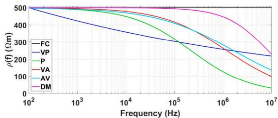

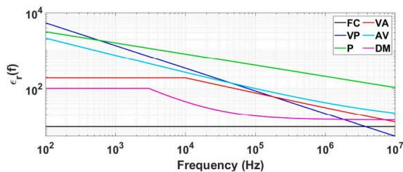

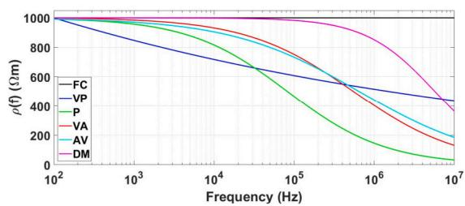

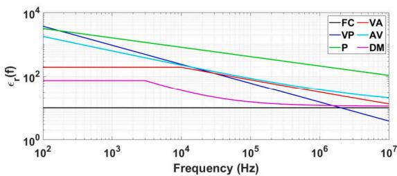  
(d)

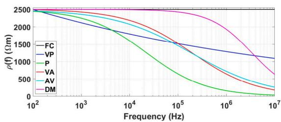  
(e）

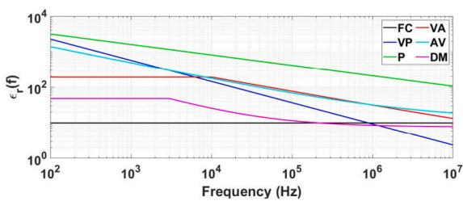  
(f)

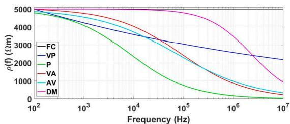  
(g）

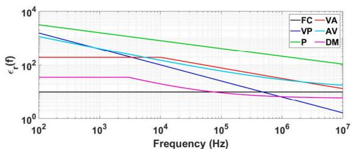  
(h)   
Fig. 1. Soil electrical resistivity (on the left-side column) and relative permittivity (on the ride-side column) for soils with $\rho _ { 0 }$ of: (a)–(b) 500 Ωm; (c)–(d) 1000 Ωm; (e)–(f) 2500 Ωm and (g)–(h) 5000 Ωm.

one end of the grounding system. Their waveshapes are mathematically represented by [46]

$$
i (t) = \sum_ {k = 1} ^ {m} \frac {I _ {0 k}}{\eta_ {k}} \frac {(t / \tau_ {1 k}) ^ {n _ {k}}}{1 + (t / \tau_ {1 k}) ^ {n _ {k}}} e ^ {- t / \tau_ {2 k}}; \quad \eta_ {k} = e ^ {\left[ - \left(\frac {\tau_ {1 k}}{\tau_ {2 k}}\right) \left(n _ {k} \frac {\tau_ {2 k}}{\tau_ {1 k}}\right) \right] ^ {1 / n _ {k}}}, \tag {1}
$$

where $I _ { 0 k }$ is the peak, $\tau _ { 1 k }$ is the front-time constant, $\tau _ { 2 k }$ is the decaytime constant, $n _ { k }$ is a steepness factor, and $\eta _ { k }$ is a peak correction factor. The lightning parameters are given in Table 2 [46]. The $T _ { 1 0 } ,$ ?? refer to the time difference between an increase from 10% to 90% and 30% to 90% before the first peak, respectively. According to this figure and table the subsequent peak is much lower than the FRS. The times $T _ { 1 0 }$ and $T _ { 3 0 }$ of the SRS are much smaller. A channel impedance of 400 ?? in parallel to the current source is adopted.

# 3.2. Wind turbine modeling

The WT shown in Fig. 3-(a) is used for the transient analysis in this work. Each component is detailed in the following sections.

Table 2 Parameters of the lightning currents [46].   

<table><tr><td>Current type</td><td>k</td><td>I0(kA)</td><td>n</td><td>τ1(μs)</td><td>τ2(μs)</td></tr><tr><td>First Return Stroke (FRS)</td><td>1</td><td>6</td><td>2</td><td>3</td><td>76</td></tr><tr><td>(T10=5.20 μs, T30=3.0 μs)</td><td>2</td><td>5</td><td>3</td><td>3.5</td><td>10</td></tr><tr><td></td><td>3</td><td>5</td><td>5</td><td>4.8</td><td>30</td></tr><tr><td></td><td>4</td><td>8</td><td>9</td><td>6</td><td>26</td></tr><tr><td></td><td>5</td><td>16.5</td><td>30</td><td>7</td><td>200</td></tr><tr><td></td><td>6</td><td>17</td><td>2</td><td>70</td><td>200</td></tr><tr><td></td><td>7</td><td>12</td><td>14</td><td>12</td><td>26</td></tr><tr><td>Subsequent Return Stroke (SRS)</td><td>1</td><td>10.7</td><td>2</td><td>0.25</td><td>2.5</td></tr><tr><td>(T10=0.50 μs, T30=0.3 μs)</td><td>2</td><td>6.5</td><td>2</td><td>2</td><td>230</td></tr></table>

# 3.2.1. Blade modeling

A thin wire (down-conductor) can be employed to represent each blade. This wire is represented by a vertical rod characterized by a surge impedance $Z _ { b } ,$ as seen in Fig. 3-(c), and expressed by [6]

$$
Z _ {b} = 6 0 \left[ \ln \left(4 \frac {h _ {b}}{r _ {b}}\right) - 1 \right], \tag {2}
$$

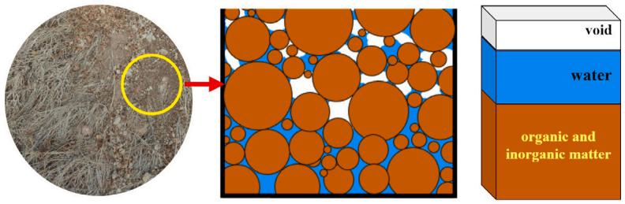  
(a)

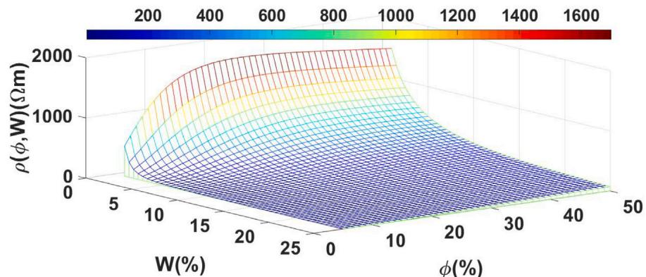  
(b)   
Fig. 2. (a) Representation of soil; (b) Resistivity plotted in 3D-surface as a function of porosity ??(%) and water content ?? (%).

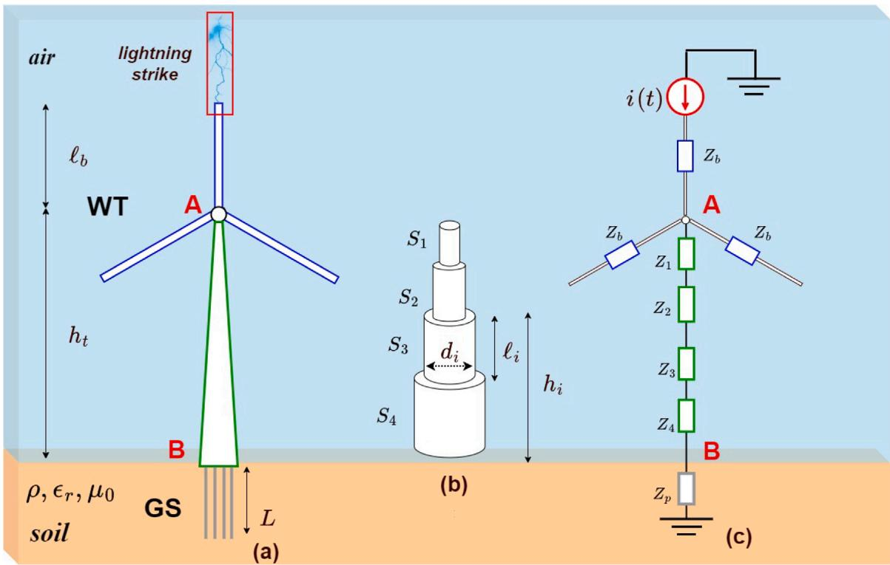  
Fig. 3. (a) Wind turbine struck by lightning at the blade tip; (b) Wind tower represented by cylindrical sections; (c) Equivalent circuit model represented by surge impedances.

where $h _ { b } ( \mathbf { m } )$ is the height from the ground, and $r _ { b } \ ( \mathbf { m } )$ is the radius of the rod. Due to the Skin effect on the rotor blade and the capacitive

effect of the blade’s structure, the propagation velocity $v _ { b }$ is reduced to 0.65??, where ?? is the speed of light [3]. The thin-wire (blade) has a

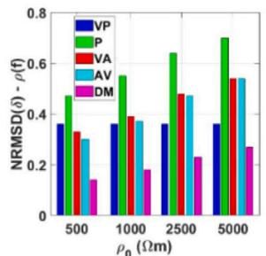

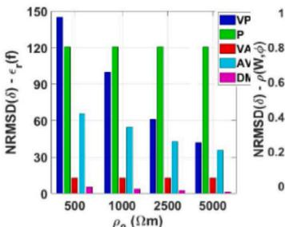  
（b)

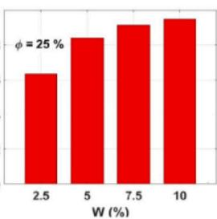  
（C）

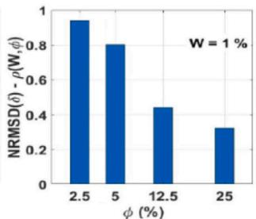  
  
Fig. 4. NRMSD for: (a) resistivity $\rho ( \mathrm { f } ) ;$ (b) relative permittivity ????(f); (c) ??(?? , ??) variable with water content; (d) ??(?? , ??) variable with porosity level ??.

Table 3 Tower parameters of the wind turbine.   

<table><tr><td>i- Section (S)</td><td>h_i (m)</td><td>d_i (m)</td><td>ε_i (m)</td><td>Z_i(Ω)</td><td>v_i (m/s)</td></tr><tr><td>1</td><td>88,17</td><td>2,33</td><td>28,50</td><td>262</td><td>0.85c</td></tr><tr><td>2</td><td>59,50</td><td>3,20</td><td>28,445</td><td>219</td><td>0.85c</td></tr><tr><td>3</td><td>31,055</td><td>3,60</td><td>16,655</td><td>173</td><td>0.85c</td></tr><tr><td>4</td><td>15,570</td><td>4,04</td><td>15,57</td><td>125</td><td>0.85c</td></tr></table>

length $\ell _ { b }$ of 47.5 m and radius $r _ { b }$ of 5 mm. Considering that the WT height $h _ { t }$ is 88 m, the height from the soil $h _ { b }$ is 135.70 m. Using (2) yields to $Z _ { b } = 6 1 0 ~ \varOmega _ { \mathrm { : } }$ , approximately.

# 3.2.2. Tower modeling

The tower is assumed as a truncated tubular cone bolted along the structure. Each segment is modeled as lossless lines as shown in Fig. 3-(b). The WT is partitioned into four sections (??), where each is represented by a conductor of length $\ell _ { i }$ related with a surge impedance $Z _ { i }$ and a propagation velocity $v _ { t } ,$ , as seen in Fig. 3-(c). The surge impedance $Z _ { i }$ given as follows [6]

$$
Z _ {i} = 6 0 \left[ \ln \left(4 \sqrt {2} \frac {h _ {i}}{d _ {i}}\right) - 1 \right], \tag {3}
$$

where $h _ { i } ( \mathbf { m } )$ is the height from the soil surface and $d _ { i } ( \mathbf { m } )$ its diameter. The propagation velocity $v _ { t }$ is assumed to be 0.85?? [47]. The tower parameters were estimated using (3), and the values are organized in Table 3.

# 3.2.3. Harmonic grounding impedance of WT

The harmonic impedance $Z _ { h } ( j \omega )$ of the grounding system of the WT is computed with full-wave ES FEKO/Altair Engineering® [48] employing the MoM whose steps are detailed in [49]. Then, the GPR is given expressed by

$$
G P R = \mathcal {F} ^ {- 1} \left\{I (j \omega) \times Z _ {h} (j \omega) \right\}, \tag {4}
$$

where the $_ { { \cal F } ^ { - 1 } }$ denotes the inverse Fourier Transform, and ??(????) is Fourier transform of the injected current from (1), respectively. Finally, to assess the transient responses in the wind turbine using the software ATP, the impedance of the GS is modeled by the impulse impedance, given by [50]

$$
Z _ {p} = \frac {\operatorname* {m a x} [ G P R ]}{\operatorname* {m a x} [ i (t) ]} = \frac {V _ {P}}{I _ {P}}, \tag {5}
$$

where $V _ { p }$ and $I _ { p }$ are the peak values of the GPR and injected current, respectively.

# 4. Numerical results

# 4.1. Variation of the soil with the physical properties

The normalized root-mean-square deviation (NRMSD) (??) is used to investigate the influence of the five FD soil models. The NRMSD is given

$$
\delta (\%) = \frac {1}{\chi_ {r e f}} \sqrt {\left[ \frac {1}{N} \sum_ {i = 1} ^ {N} \left(\chi_ {\text {model}} - \chi_ {r e f}\right) ^ {2} \right]} \times 100 \% \tag{6}
$$

where ?? is the number of data points $( \mathrm { N } = 2 0 0 0 ) , \chi$ can be either resistivity or relative permittivity, computed for the reference model (ref ) and soil model (model) with electrical parameters variable with the physical factors, such as the frequency effect $f ,$ water content ?? and porosity level ??. Firstly, considering the five FD soil models (VP, P, VA, AV and DM), four values of low-frequency resistivity $\rho _ { 0 }$ are assumed: 500, 1.000, 2.500 and 5.000 Ωm, with their expressions proposed in Table 1. The reference response (ref ) is assumed to be the frequency-constant (FC) soil resistivity of 500, 1.000, 2.500, and 5.000 Ωm. The reference response (ref ) for the relative permittivity is $\varepsilon _ { r } = 1 0$ . The calculated NRMSD for the soil resistivity and relative permittivity are plotted in Fig. 4-(a). According to these figures, one sees that deviations in the soil resistivity increase with the increasing low-frequency resistivity $\rho _ { 0 } ,$ except for the VP model in which NRMSD are kept constant for all values due to its expression ??(?? ). Then, VA and AV predict similar values of deviations, being closer to the FC soil than the other models. Further, Portela’s model P provides the highest variation for the increasing $\rho _ { 0 } ,$ whereas the DM model results in the less pronounced NRMSD. The lower deviation for DM occurs since this model is validated for sandy grounds with low moisture content where the conduction phenomena are less pronounced compared to the other models [29]. Regarding the relative permittivity, the NRMSD is presented in Fig. 4-(b); According to this figure, the NRMSD decreases significantly for increasing $\rho _ { 0 } ,$ as the VP model shows the most notable variations. On the other hand, P and VA models show a constant deviation because, in their expressions, the relative permittivity does not depend on $\rho _ { 0 }$ . The lowest variation is seen for DM model since it is developed for wet sandy soils where the polarization effect is less pronounced [see Fig. 1, magenta line on the right-side], compared to the other soil models [29]. Considering the general Archie’s (A) formula in Table 1, two different scenarios are assumed: $( S _ { 1 } )$ four values of porosity level $\phi$ of 2.50%, 5,0%, 12.5%, and 25% and water content $W = 1 \% ; ( S _ { 2 } )$ four values of water content ?? corresponding to 2.50%, 5%, 12.5%, and 25% and porosity level $\phi = 2 5 \% ;$ These scenarios are compared assuming the dry soil of 2.500 Ωm as the reference response (ref ) The calculated NRMSD for the soil resistivity is plotted in Fig. 4-(c) and (d). Fig. 4-(c), the NRMSD increases with increasing water percentage ?? as the ground becomes more conductive as more conductive paths are established and the soil resistivity decreases. On the other hand, Fig. 4-(d) shows a decreasing NRMSD with increasing porosity ?? as the soil gets less conductive, as the void volume increases which tends to the resistivity of dry ground.

# 4.2. HI of the WT grounding system

The HI $Z _ { h } ( j \omega )$ of the WT grounding system is assessed with the fullwave ES FEKO, [48] employing MoM [49]. The exact values of $\rho _ { 0 } , W _ { : }$ ,

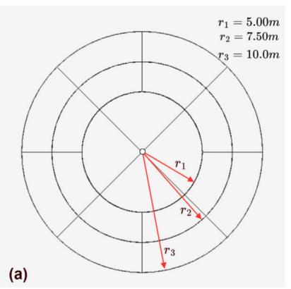

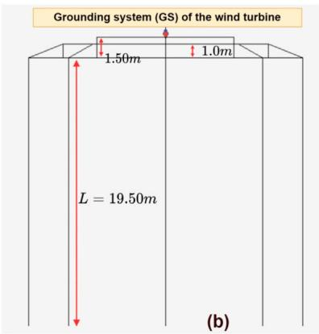

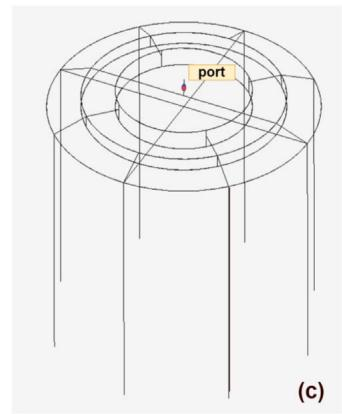  
Fig. 5. GS of the WT designed in FEKO: (a) upper; (b) side; and (c) 3D views.

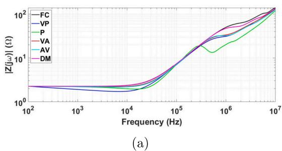

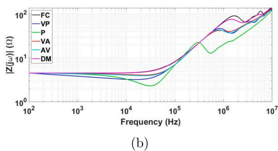

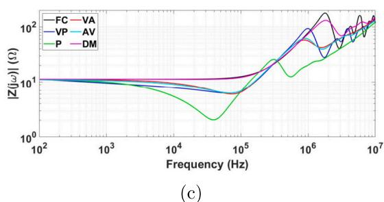

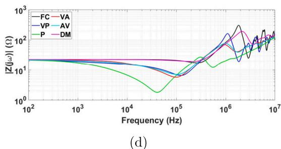  
Fig. 6. Magnitude of the harmonic impedance of the WT grounding system for: (a) 500 Ωm; (b) 1000 Ωm; (c) 2500 Ωm; (d) 5000 Ωm.

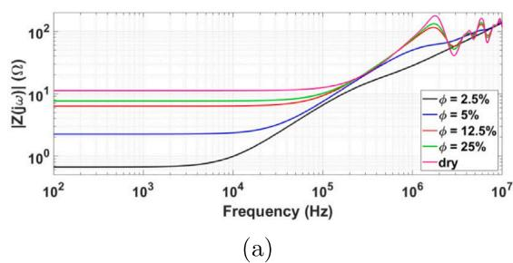

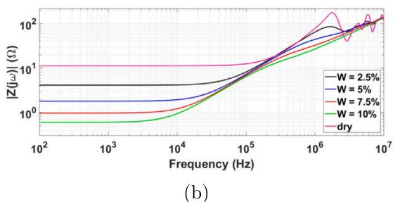  
Fig. 7. Magnitude of the harmonic impedance of the WT GS-Magnitude for constant: (a) water content (?? = 1%); (d) porosity level (?? = 25%).

and ?? from the previous section are adopted for these simulations. The WT’s grounding system (GS) is depicted in Fig. 5, formed by concentric rings and eight vertical rods. The calculated HI for the five frequencydependent soil models (VP, P, VA, AV and DM) are plotted in Fig. 6. The HI assessed for Archie’s A model are illustrated in Fig. 7.

In general, in Figs. 6 and 7, the HI of the grounding system is considerably affected by physical factors along the frequency range. At the low frequencies, the HI presents a pure resistive, also named lowfrequency resistance $R _ { L F } ,$ being dependent on resistivity ??(?? , ??) and geometrical parameters of GS. Above a particular frequency, the reactive part of HI has either an inductive or a capacitive predominance,

which is strongly influenced by physical factors. Concerning Fig. $^ { 6 , }$ as the low-frequency resistivity $\rho _ { 0 }$ increases, the low-frequency $R _ { L F }$ increases directly. However, the simulation results above a particular frequency indicate significant variations between the FD soil models, especially when assuming high-resistive soil. These differences are more pronounced for Portela’s (P) model, where larger levels of the decrease in the HI are seen. Compared to that obtained with those assessed with the frequency-constant (FC) model. The models VP, VA, and AV tend to predict similar results, and the Datsios-Mikropoulos’s (DM) model is closer to the HI computed with the FC soil for the reason that this model is developed concerning high-resistive sandy

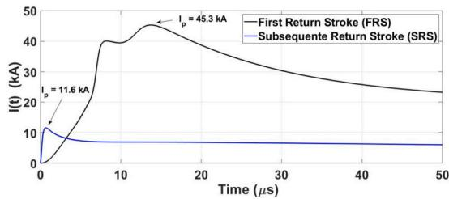  
(a)

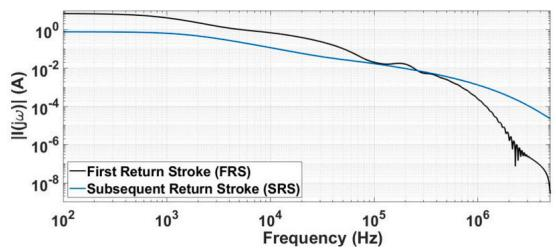  
(b)

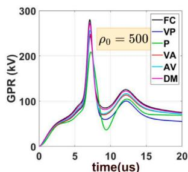  
Fig. 8. FRS and SRS waveshapes in: (a) time- and (b) frequency-domains.

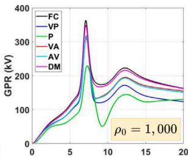

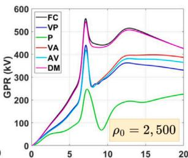

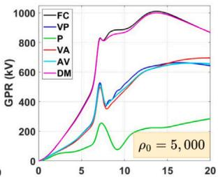

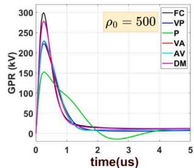

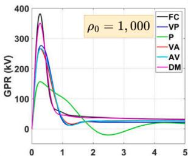

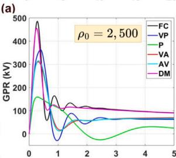

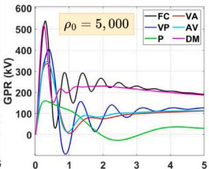  
(b)

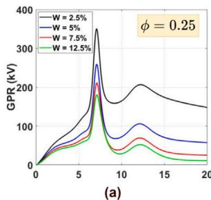  
Fig. 9. GPR waveshapes for the FD soil models developed by: (a) FRS and (b) SRS.

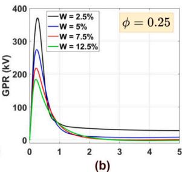

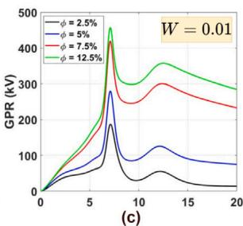

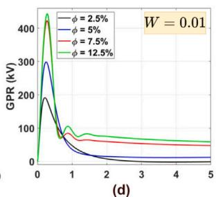  
Fig. 10. GPR waveshapes developed for Archie’s soil model varying ?? - (a) FRS; (b) SRS; Varying ??- (c) FRS and (d) SRS.

soil [34]. Regarding Fig. 7, the soil porosity and water percentages significantly impact the HI. For the dry soil (most conservative case), the highest ground resistivity $\rho$ of 2500 Ωm is obtained, resulting in the highest low-frequency $R _ { L F }$ compared with partially saturated soils using ??(?? , ??) proposed by general Archie’s model [42]. Further, as the porosity level increases, the $R _ { L F }$ increases, approaching the that assessed for the dry sandy ground. This increase in $R _ { L F }$ appears because fewer conductive paths are formed as the void space becomes larger in the ground [42]. As the water content increases, as result of the increasing quantity of hydrated ions, the number of conductive paths established through the pores increases, which improves continuity and connectivity of the current [45]. Consequently, the $R _ { L F }$ decreases compared to that value assessed for dry ground.

# 4.3. GPR and impulse impedance of the WT grounding system

The GPR is calculated using (4) for the currents representing the FRS and SRS, as described in (1). The transient GPR waveshapes computed

for the GS considering the FD soil models are depicted in Fig. 9 and those considering the soil variable with water level and porosity level are plotted in Fig. 10.

As seen in these figures, the GPR waveshapes depend on the soil model and the type of lightning current injected at the tip of the WT grounding system. According to Fig. 9, the frequency dependency on the soil parameters significantly impacts the GPR waveshapes. The difference between the models increases with increasing low-frequency resistivity $\rho _ { 0 } ,$ where the peaks strongly decrease depending on the model. One notes that Portela’s (P) model predicts higher differences for all GPR waveshapes. On the other hand, the DM models present similar responses compared with those calculated with the frequencyconstant (FC) model. The responses calculated with the AV, VP, and VA predict similar results. The differences related to the lightning currents are also very remarkable. The peaks of GPR waveshapes for the SRS are higher than those developed for the lightning of the first type. This difference occurs due to the higher frequency content related to shorter

Table 4 Comparison of impulse impedance $Z _ { p }$ (??) for soil models variable with frequency effect. the values in() represents the percentage difference ??(%) from (7).   

<table><tr><td colspan="9">Low-frequency resistivity ρ0(Ωm)</td></tr><tr><td rowspan="2">Soil model</td><td colspan="4">FRS</td><td colspan="4">SRS</td></tr><tr><td>500</td><td>1000</td><td>2500</td><td>5000</td><td>500</td><td>1000</td><td>2500</td><td>5000</td></tr><tr><td>FC</td><td>6.19(-)</td><td>8.02(-)</td><td>12.30(-)</td><td>22.32(-)</td><td>24.78(-)</td><td>31.60(-)</td><td>40.11(-)</td><td>44.60(-)</td></tr><tr><td>VP</td><td>5.39 (13)</td><td>7.01(13)</td><td>9.74(21)</td><td>14.68(34)</td><td>18.41(26)</td><td>22.83(28)</td><td>30.01(25)</td><td>33.52(25)</td></tr><tr><td>P</td><td>4.61(25)</td><td>5.06(37)</td><td>5.47(56)</td><td>7.79(65)</td><td>12.59(49)</td><td>12.91(59)</td><td>13.12(67)</td><td>13.20(70)</td></tr><tr><td>VA</td><td>5.49(11)</td><td>6.87(14)</td><td>9.27(25)</td><td>15.38(31)</td><td>18.92(24)</td><td>21.94(31)</td><td>25.71(36)</td><td>27.83(38)</td></tr><tr><td>AV</td><td>5.68(8)</td><td>6.99(13)</td><td>9.25(25)</td><td>14.60(35)</td><td>18.99(23)</td><td>22.04(30)</td><td>26.02(35)</td><td>28.75(36)</td></tr><tr><td>DM</td><td>6.01(3)</td><td>7.71(4)</td><td>12.00(2)</td><td>22.08(1)</td><td>23.03(7)</td><td>28.99(8)</td><td>37.66(6)</td><td>42.82(4)</td></tr></table>

Table 5 Comparison of impulse impedance $Z _ { p }$ (??) for soil models variable with water content and porosity level. the values in() represents the percentage difference ??(%) from $\left( 7 \right) .$ .   

<table><tr><td colspan="4">FRS</td><td colspan="4">SRS</td></tr><tr><td>Soil parameter (W = 1%)</td><td>Zp</td><td>Soil parameter (φ = 25%)</td><td>Zp</td><td>Soil parameter (W = 1%)</td><td>Zp</td><td>Soil parameter (φ = 25%)</td><td>Zp</td></tr><tr><td>Dry</td><td>12.30 (-)</td><td>Dry</td><td>12.30 (-)</td><td>Dry</td><td>40.11 (-)</td><td>Dry</td><td>40.11 (-)</td></tr><tr><td>φ = 2.5%</td><td>4.14 (66)</td><td>W = 2.5%</td><td>7.74 (37)</td><td>φ = 2.5%</td><td>15.82 (61)</td><td>W = 2.5%</td><td>30.66 (24)</td></tr><tr><td>φ = 5.0%</td><td>6.18 (50)</td><td>W = 5.0%</td><td>5.73 (53)</td><td>φ = 5.0%</td><td>24.70 (38)</td><td>W = 5.0%</td><td>22.70 (43)</td></tr><tr><td>φ = 12.5%</td><td>9.26 (25)</td><td>W = 7.5%</td><td>4.67 (62)</td><td>φ = 12.5%</td><td>34.96 (13)</td><td>W = 7.5%</td><td>18.06 (55)</td></tr><tr><td>φ = 25.0%</td><td>10.10 (18)</td><td>W = 10.0%</td><td>3.99 (68)</td><td>φ = 25.0%</td><td>36.71 (8)</td><td>W = 10.0%</td><td>15.24 (62)</td></tr></table>

front-time subsequent return than that from the FRS, as depicted in Fig. 8-(a). As noted in Fig. 10-(a) and -(b), as the moisture content increases, the GPR decreases due to lower soil resistivity resulted from the dissolved ions and more conductive paths established through soil particles and water. However, as the porosity grows, higher peaks of GPR are obtained because of the less conductive soil as more voids are generated in the ground, less conductive paths are formed, and lower dissipation of the lightning current occurs. Then, increasing peaks are obtained for the GPR as illustrated in Fig. 10-(c) and -(d).

The impulse impedance $Z _ { p }$ is assessed using the (5). The calculated $Z _ { p }$ are organized in Tables 4 and 5. To evaluate the impact of soil models with variable physical factors, the percentage difference ??(%) between the impulse impedance is calculated as follows

$$
\Delta (\%) = \frac {Z _ {p} (r e f) - Z _ {p} (m o d e l)}{Z _ {p} (r e f)} \times 100 \%, \tag{7}
$$

where $Z _ { p } ( r e f )$ and $Z _ { p ^ { \prime } }$ (??????????) are the impulse impedance calculated for the reference model (ref ) and soil model (model) variable with physical factors, such as frequency effect, water content, and porosity level, respectively. The percentage difference ??(%) are shown in Tables 4 and 5 in parenthesis. It is worth noting that this variation also corresponds to the percentage difference at the peaks of GPR. As a general behavior, the deviation ??(%) is higher for the $Z _ { p }$ calculated for the SRS in comparison with those from FRS. According to Table 4, results corroborate that the Portela (P) model (highlighted in green color) has the highest ??(%) of all FD soil models. This variation increases with increasing lowfrequency resistivity $\rho _ { 0 }$ where the most significant decrease (65% for the FRS and 70% for the SRS) is found. The lowest deviation occurs for the Datsios–Mikropoulos (DM) model (in Navajo color), being lower than 10% for all the soil resistivities, as the GPR waveshapes for this model are the closest to those assessed assuming the FC soils. The other soil models (VA, AV, and VP) predict similar values of deviation ??(%), as corroborated by the GPR waveshapes in Fig. 9. According to Table $^ { 5 , }$ as the porosity gets higher, the $Z _ { p }$ becomes more significant (as shown in the first and third columns), which results in a decrease in the percentage deviation ??(%). For example, ??(%) varies from 66% to 18% for the FRS and goes from 61% to 8% for the SRS. On the other hand, $Z _ { p }$ considerably decreases with increasing water content $W$ as the soil gets less resistive. Then, the percentage deviation ??(%) has a more notable increase varying from 37% to 68% for the FRS (second column) and ranging from 24% to 62% for the SRS (fourth column).

# 4.4. Time-domain voltages on the wind turbine: Nacelle and tower base

The software ATP [51] is employed to compute the time-domain voltages at the nacelle and tower base, assuming the soil with electrical parameters dependent on the physical factors. The blades and tower are modeled according to Sections 3.2.1 and 3.2.2. The impulse impedance $Z _ { p }$ is employed as the GS impedance of the WT depicted in Fig. 3- (a). This WT is subjected to the FRS and SRS striking the blade’s tip. The step size of 1 ns is adopted for the simulations. The transient voltages at the nacelle (Point A) and tower base (point B) for the soil models variable with frequency effect are shown in Figs. 11 and 12, respectively. The percentage difference (??) indicates the relative difference between the peaks of the voltage waveshapes from the FD soil models compared to those assessed with the FC soils. According to Fig. 11, after a short traveling time related to surge propagating from the tip blade to the point $\mathbf { A } ,$ the transient voltages at the nacelle increase for the increasing $\rho _ { 0 }$ for these lightning currents.

The percentage difference ?? is negligible for the voltages generated for the SRS (on the right-side column, all values of ?? are lower than 1.3%) due to the shorter front time, which is related to a higher propagation velocity for this lightning current. However, for the FRS, the lower front-time results in an increasing $\delta ,$ being small for grounds with low- and moderate-resistive values (500 and 1000 Ωm) but very elevated for high-resistive soils (2500 and 5000 Ωm). Further, the Portela (P) predicted the highest percentage difference $( \delta = 1 9 \% )$ and the lowest voltage response at steady state for each scenario since this model has the highest increase in ground conductivity. The DM model illustrates the opposite behavior, being closer to the FC soil where no significant variation is seen for increasing $\rho _ { 0 } ,$ all values of ?? are lower than 0.5% as shown in Fig. 11-(e). Concerning point B, the transient voltages have pronounced differences depending on the soil models and lightning currents at the tower base. These differences intensify for increasing $\rho _ { 0 } ,$ and SRS where Portela (P) model has predicted the worst reduction $( \delta = 6 6 . 2 \% )$ and DM’s model the closest $( \delta = 3 . 3 \% )$ compared with those assessed with the FC soil, as seen in Fig. 12-(h). Moreover, multiple reflections on the GPR waveshapes generated by the SRS until the steady state are observed due to the fast propagation surge waves compared to those produced by the FRS. The voltages at the nacelle (Point A) and tower base (point B) for the general Archie’s model are plotted in Figs. 13 and 14, respectively, with the difference percentage calculated assuming the dry soil of 2500 Ωm as reference. As seen in Fig. 13-(a), the voltage peaks for the FRS increase for increasing porosity level as the soil gets more resistive. However, the SRS produces similar peaks, as confirmed by the small $\delta ,$ lower than 1%, detailed in

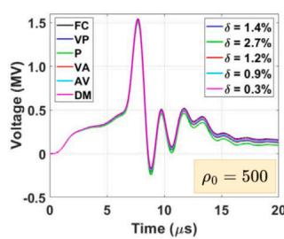

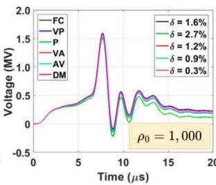

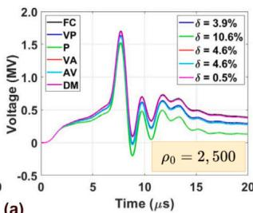

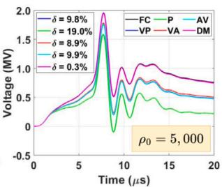

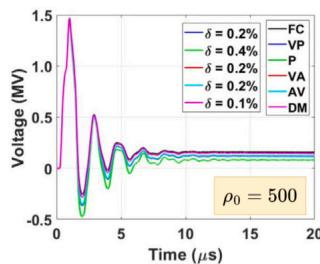

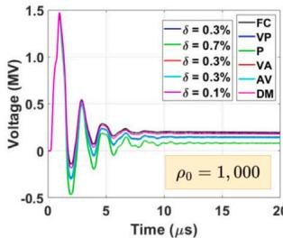

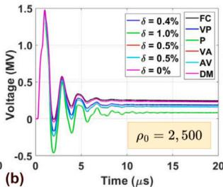

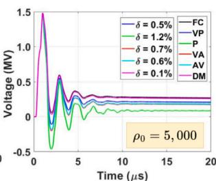  
Fig. 11. Voltage waveshapes for the FD soil models at point A developed by: (a) FRS and (b) SRS.

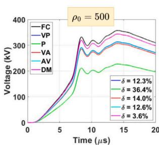

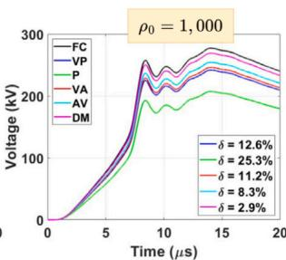

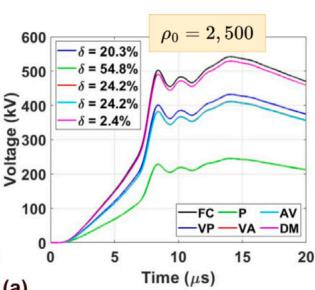

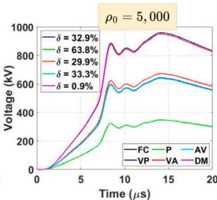

  
Fig. 12. Voltage waveshapes for the FD soil models at point B developed by: (a) FRS and (b) SRS.   
(a)

  
(b)

  
(c)

  
(d)   
Fig. 13. Voltage waveshapes at point A developed for the general Archie’s soil model varying porosity level ?? and water content ?? : (a) FRS; (b) SRS; (c) FRS and (d) SRS.

Fig. 13-(b). As the water level grows, the ground gets more conductive, and the peak voltages decrease notably, in which the highest ?? of 12.9% is observed for ?? = 10% in Fig. 13-(c). Further, the voltages produced by the SRS have less impact at the peaks, being $\delta = 0 . 9 0 \%$ for the same water level. The dry soil predicts the highest responses for each case, where the temporal responses vary significantly at the

steady state. Then, voltages computed by the highest porosity level and the lowest water level will be the closest to the responses assessed with the dry soil (magenta line). Regarding the voltages at the tower base (Point B), according to Fig. 14, the responses are notably affected by the porosity level, water content, and lightning waveforms. After a particular traveling time, the voltages at point B raises significantly

  
(a)

  
(b)

  
（c)

  
（d）  
Fig. 14. Voltage waveshapes at point B developed for the general Archie’s soil model varying porosity level ?? and water content ?? : (a) FRS; (b) SRS; (c) FRS and (d) SRS.

as the porosity increases, which results in decreasing values of ??, and the soil gets less conductive. The lowest percentage differences occurs for ?? = 25%, being $\delta \ : = \ : 1 7 . 5 \%$ for the FRS, as seen in Fig. 14-(a) and $\delta \ : = \ : 7 . 1 0 \%$ for the SRS as shown in Fig. 14-(b). On the other hand, the voltages decrease for diminishing water content as the soil gets more conductive because of the dissolved salts in the ground. The maximum difference is obtained with $W = 1 0 \% ,$ being ?? of 67.0% and 57.7% for the FRS and SRS, respectively, as illustrated in Fig. 14- (c) and (d). According to these simulation results, different transient voltage waveshapes are obtained when the physical factors are considered in soil electrical parameters. These differences are significant, especially when compared with results assessed assuming frequencyconstant soils that provide the most conservative responses. In this case, the insulation level of electrical components may be overestimated, increasing the final costs. The most sensitive equipment, such as generators, transformers, control, and electronic power systems, are located in the nacelle compartment. Then, the impulsive voltage may cause malfunctions or damage to these components. Besides that, people nearby the WT can be exposed to dangerous GPR during the transient state. Therefore, proper modeling of soil is essential to design an adequate grounding system for WTs that provide a safe potential to people and equipment nearby these structures.

# 5. Conclusions

This paper investigated the impact of the frequency effect, water content, and porosity level on soil’s electrical parameters and the transient responses of a wind turbine subjected to lightning strikes.

Concerning the studied FD soil models [Visacro–Portela (VP), Portela (P), Visacro–Alípio (VA), Alípio–Visacro (AV), Datsios–Mikropoulos (DM)], the harmonic impedance of WT is considerably affected by soil model, low-frequency resistivity $\rho _ { 0 }$ and frequency range. Simulation results demonstrated that the Portela (P)’s model predicts more considerable variation in the harmonic impedance, and Datsios– Mikropoulos (DM) model presents the closest responses, compared with those obtained with frequency-constant soil. The other soil models (AV, VP, VA) predict similar responses. The GPR waveshapes strongly depend on the soil model and lightning current, where the differences in the peak values increase for increasing low-frequency resistivity. Portela (P) and Datsios–Mikropoulos (DM) have presented the highest and lowest differences compared with those GPR from the frequencyconstant model, respectively. This variation also affects the impulse impedance, where considerable percentage differences are noted for the Portela (P), and minor values are seen Datsios–Mikropoulos (DM). The soil models and lightning current also impact the voltages along the WT. Results show a little difference at the nacelle for the SRS; however, significant variations occur to the FRS, increasing with the soil resistivity. Further, Portela (P) produced the highest difference for all cases. On the other hand, at the tower base, pronounced differences occur in all soil models. An oscillatory behavior appears due to reflections between the bottom and top of the WT. The Datsios– Mikropoulos (DM) model predicted the closest responses to the FC soil

model because this model is developed based on wet sandy soil, and the polarization effect is less noticeable than in humid grounds. Regarding the general Archie’s form, the porosity and water significantly influence the harmonic impedance. As the porosity increases, voids between soil parts result in a less conductive medium. Then, consequently, the static resistance $R _ { L F }$ increases considerably. Nevertheless, as the water content increases, the soil gets more continuous paths because of the dissolved salts on the aqueous solutions in the ground. In that condition, the static resistance decreases when the water content grows. Depending on the soil resistivity and frequency range, the impedance may be inductive or capacitive at high frequencies. Consequently, the transient GPR decreases for increasing water content, and this opposite behavior occurs for increasing porosity levels. The impulse impedance follows the same patterns observed for GPR. The voltages on the nacelle increase with the growth of porosity level, and they diminish with increasing water content for both lightning currents. However, the peaks of these voltages have a minor variation for both physical factors. These two parameters strongly influence the steady-state responses. Further, these soil factors remarkably affect the voltage waveshapes at the tower base. Additionally, oscillatory behavior rules the waveshapes due to reflections between the blade’s tip and the tower base. These results indicated that for accurate estimation of the transient voltages, the variable soil electrical parameters must consider its physical factors (frequency effect, water content, and porosity level) on the proper ground modeling. Precisely assessing these transient voltages is critical, especially at the nacelle, where sensitive equipment is located, and at the tower base, where people can be exposed to unsafe potentials under a transient state. Consequently, proper soil models are essential to developing an adequate grounding system for WTs, ensuring people’s safety and protecting electrical components against direct or inducted impulsive voltages at the nacelle.

As an advantage, the general Archie’s form is a simple model to compute the soil’s conductivity, especially when this parameter is monitored in a certain location yearly. Then, soil conductivity can be estimated for sandy and clay grounds considering the water content and porosity level. It is worth noting that these physical factors are generally neglected in most Electromagnetic Transient (EMT)-type programs, especially when lightning analysis is involved. As shown by this work, using a frequency-constant soil model overestimates the transient responses, which affects the final costs regarding the insulation level of components in the WT project. These costs can be reduced when the physical factors of the soil are adequately assumed in the simulations.

# CRediT authorship contribution statement

Walter Luiz Manzi de Azevedo: Conception and design of study, Acquisition of data, Analysis and/or interpretation of data, Writing – original draft, Writing – review & editing. Anderson Ricardo Justo de Araújo: Conception and design of study, Acquisition of data, Analysis and/or interpretation of data, Writing – original draft, Writing – review & editing. José Pissolato Filho: Conception and design of study, Acquisition of data, Analysis and/or interpretation of data, Writing – original draft, Writing – review & editing.

# Declaration of competing interest

The authors declare that they have no known competing financial interests or personal relationships that could have appeared to influence the work reported in this paper.

# Data availability

Data will be made available on request.

# Acknowledgments

All persons who have made substantial contributions to the work reported in the manuscript (e.g., technical help, writing and editing assistance, general support), but who do not meet the criteria for authorship, are named in the Acknowledgments and have given us their written permission to be named. If we have not included an Acknowledgments, then that indicates that we have not received substantial contributions from non-authors.

All authors approved version of the manuscript to be published.

# References

[1] Piantini A. Lightning interaction with power systems: applications, Vol. 2. Energy engineering, Institution of Engineering and Technology; 2020, [Online]. Available: https://books.google.com.br/books?id=pFvUDwAAQBAJ.   
[2] Sun Q, Yang L, Li Q, Zhang X, Wang F, Chen S, Zhong L. Surge analysis for lightning strike on overhead lines of wind farm. Electr Power Syst Res 2021;194:107066.   
[3] Sun Q, Yang L, Zheng Z, Han J, Wang Y, Yao L. A comprehensive lightning surge analysis in offshore wind farm. Electr Power Syst Res 2022;211:108259.   
[4] Yamamoto K, Noda T, Yokoyama S, Ametani A. Experimental and analytical studies of lightning overvoltages in wind turbine generator systems. Electr Power Syst Res 2009;79(3):436–42.   
[5] Shariatinasab R, Kermani B, Gholinezhad J. Transient modeling of the wind farms in order to analysis the lightning related overvoltages. Renew Energy 2019;132:1151–66.   
[6] Alipio R, Guimarães M, Passos L, Conceição D, de Barros MTC. Ground potential rise in wind farms due to direct lightning. Electr Power Syst Res 2021;194:107110.   
[7] Sunjerga A, Li Q, Poljak D, Rubinstein M, Rachidi F. Isolated vs. Interconnected wind turbine grounding systems: Effect on the harmonic grounding impedance, ground potential rise and step voltage. Electr Power Syst Res 2019;173:230–9.   
[8] Zhang X, Zhang Y, Xiao X. An improved approach for modeling lightning transients of wind turbines. Int J Electr Power Energy Syst 2018;101:429–38.   
[9] Araneo R, Celozzi S. Transient behavior of wind towers grounding systems under lightning strikes. Int J Energy Environ Eng 2016;7(2):235–47.   
[10] Gazzana DS, Smorgonskiy A, Mora N, Šunjerga A, Rubinstein M, Rachidi F. An experimental field study of the grounding system response of tall wind turbines to impulse surges. Electr Power Syst Res 2018;160:219–25.   
[11] Li Z, He J, Zhang B, Yu Z. Influence of frequency characteristics of soil parameters on ground-return transmission line parameters. Electr Power Syst Res 2016;139:127–32, [Online]. Available: https://www.sciencedirect.com/science/ article/pii/S0378779615002813, Progress on Lightning Research and Protection Technologies.   
[12] de Araújo AR, Kurokawa S, Seixas CM, Kordi B. Optimization of tower-footing grounding impedance for guyed-V transmission towers. Electr Power Syst Res 2019;177:105947.   
[13] Grcev L. Simple formulas for impulse characteristics of vertical and horizontal ground electrodes. IEEE Trans Power Deliv 2022;37(1):40–9.   
[14] Silva BP, Visacro S, Silveira FH. HEM-TD: New time-domain electromagnetic model for calculating the lightning response of electric systems and their components. IEEE Trans Power Deliv 2022;37(6):4848–57.   
[15] Cidras J, Otero A, Garrido C. Nodal frequency analysis of grounding systems considering the soil ionization effect. IEEE Trans Power Deliv 2000;15(1):103–7.   
[16] Portela C. Measurement and modeling of soil electromagnetic behavior. In: IEEE international symposium on electromagnetic compatability, Vol. 2. Seattle, WA: IEEE; 1999, p. 1004–9.   
[17] Visacro S, Portela C. Soil permittivity and conductivity behavior on frequency range of transient phenomena in electric power systems. In: Symp. high voltage eng.. 1987.   
[18] Alipio R, Visacro S. Modeling the frequency dependence of electrical parameters of soil. IEEE Trans Electromagn Compat 2014;56(5):1163–71.   
[19] Cavka D, Mora N, Rachidi F. A comparison of frequency-dependent soil models: Application to the analysis of grounding systems. IEEE Trans Electromagn Compat 2014;56(1):177–87.

[20] Schroeder MAO, de Barros MTC, Lima AC, Afonso MM, Moura RA. Evaluation of the impact of different frequency dependent soil models on lightning overvoltages. Electr Power Syst Res 2018;159:40–9.   
[21] CIGRE-WG433. Impact of soil-parameter frequency dependence on the response of grounding electrodes and on the lightning performance of electrical systems. Technical brochure 781, 2019.   
[22] Scott JH, Carroll RD, Cunningham DR. Dielectric constant and electrical conductivity measurements of moist rock: A new laboratory method. J Geophys Res 1967;72(20):5101–15.   
[23] Longmire CL, Smith KS. A universal impedance for soils. Tech. rep., Mission Research Corp Santa Barbara CA; 1975.   
[24] Messier M. Another soil conductivity model. internal rep., JAYCOR, Santa Barbara, CA 1985.   
[25] Nazari M, Moini R, Fortin S, Dawalibi FP, Rachidi F. Impact of frequencydependent soil models on grounding system performance for direct and indirect lightning strikes. IEEE Trans Electromagn Compat 2021;63(1):134–44.   
[26] Salarieh B, De Silva HJ, Kordi B. Electromagnetic transient modeling of grounding electrodes buried in frequency dependent soil with variable water content. Electr Power Syst Res 2020;189:106595.   
[27] Archie GE. The electrical resistivity log as an aid in determining some reservoir characteristics. Trans AIME 1942;146(01):54–62.   
[28] Fu Y, Horton R, Ren T, Heitman J. A general form of Archie’s model for estimating bulk soil electrical conductivity. J Hydrol 2021;597:126160.   
[29] Papadopoulos TA, Datsios ZG, Chrysochos AI, Mikropoulos PN, Papagiannis GK. Wave propagation characteristics and electromagnetic transient analysis of underground cable systems considering frequency-dependent soil properties. IEEE Trans Electromagn Compat 2021;63(1):259–67.   
[30] de Azevedo WLM, da Silva WC, de Araújo ARJ, Filho JP. Computation of transient voltages on wind turbines on frequency-dependent soil caused by lightning strikes. In: 2021 workshop on communication networks and power systems (WCNPS). 2021, p. 1–6.   
[31] Manzi Azevedo WL, Silva WC, Aslan D’Annibale JL, de Moraes Callegari RH, Justo Araújo AR, Filho JP. Transient analysis on wind turbines above frequencydependent stratified soils. In: 2022 IEEE power & energy society general meeting (PESGM). 2022, p. 01–5.   
[32] Salarieh B, Kordi B. Full-wave black-box transmission line tower model for the assessment of lightning backflashover. Electr Power Syst Res 2021;199:107399.   
[33] Longmire CL, Longley HJ. Time domain treatment of media with frequencydependent electrical parameters. MRC-N-1, DNA F, Vol. 3167, Santa Barbara, CA: Mission Research Corporation; 1971.   
[34] Datsios ZG, Mikropoulos PN. Characterization of the frequency dependence of the electrical properties of sandy soil with variable grain size and water content. IEEE Trans Dielectr Electr Insul 2019;26(3):904–12.   
[35] Fakhraei M, Mahmoudian M, Manuel Godinho Rodrigues E. Grounding system modeling and evaluation using integrated circuit based fast relaxed vector fitting approach, considering soil ionization. Appl Sci 2020;10(16):5632.   
[36] Ghanbarian B, Hunt AG, Ewing RP, Skinner TE. Universal scaling of the formation factor in porous media derived by combining percolation and effective medium theories. Geophys Res 2014;41(11):3884–90.   
[37] Glover PW. A new theoretical interpretation of Archie’s saturation exponent. Solid Earth 2017;8(4):805–16.   
[38] Visacro S, Alipio R. Frequency dependence of soil parameters: Experimental results, predicting formula and influence on the lightning response of grounding electrodes. IEEE Trans Power Deliv 2012;27(2):927–35.   
[39] Visacro S, Alipio R. Frequency dependence of soil parameters: Effect on the lightning response of grounding electrodes. IEEE Trans Electromagn Compat 2013;55(1):132–9.   
[40] Fano WG. The electrical properties of soils with their applications to agriculture, geophysics, and engineering. Electromagn Field Radiat Matter 2019;27.   
[41] Lal R, Shukla MK. Principles of soil physics. CRC Press; 2004.   
[42] Liu Y, Jiang Y, Gao Q, Li X, Yang G, Zhang Q, Tang B. Influences of soil water content and porosity on lightning electromagnetic fields and lightning-induced voltages on overhead lines. Front Environ Sci 2022;927.   
[43] Asimakopoulou FE, Tsekouras GJ, Gonos IF, Stathopulos IA. Estimation of seasonal variation of ground resistance using Artificial Neural Networks. Electr Power Syst Res 2013;94:113–21, Lightning Protection of Advanced Energy Systems.   
[44] Wang C, Liang X, Adajar E, Loewen P. Seasonal variations of tower footing impedance in various transmission line grounding systems. In: 2020 IEEE industry applications society annual meeting. IEEE; 2020, p. 1–8.   
[45] Datsios ZG, Mikropoulos PN, Karakousis I. Laboratory characterization and modeling of DC electrical resistivity of sandy soil with variable water resistivity and content. IEEE Trans Dielectr Electr Insul 2017;24(5):3063–72.   
[46] De Conti A, Visacro S. Analytical representation of single- and doublepeaked lightning current waveforms. IEEE Trans Electromagn Compat 2007;49(2):448–51.   
[47] Hernández YM, Tsovilis T, Asimakopoulou F, Politis Z, Barton W, Lozano MM. A simulation approach on rotor blade electrostatic charging and its effect on the lightning overvoltages in wind parks. Electr Power Syst Res 2016;139:22–31, Progress on Lightning Research and Protection Technologies.

[48] Altair-Hyperworks. Altair feko. Altair Engineering; 2023, [Online]. Available: https://altair.com/feko.   
[49] de Araújo AR, Colqui JS, de Seixas CM, Kurokawa S, Salarieh B, Pissolato Filho J, Kordi B. Computation of ground potential rise and grounding impedance of simple arrangement of electrodes buried in frequency-dependent stratified soil. Electr Power Syst Res 2021;198:107364.

[50] Alipio R, Conceicao D, De Conti A, Yamamoto K, Dias RN, Visacro S. A comprehensive analysis of the effect of frequency-dependent soil electrical parameters on the lightning response of wind-turbine grounding systems. Electr Power Syst Res 2019;175:105927.   
[51] The ATPDraw Simulation Software (2019), Version 7.0, https://www.atpdraw. net/.