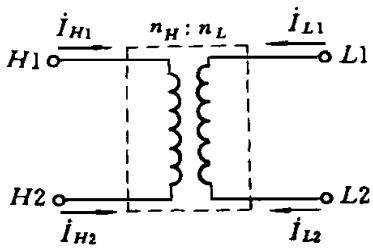
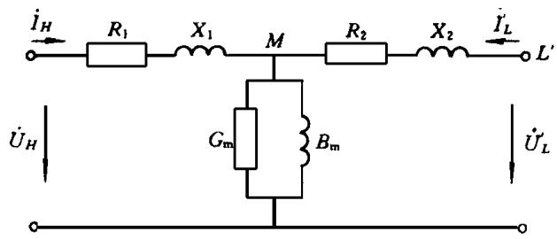
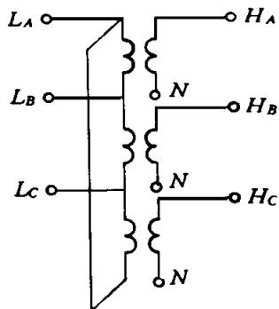
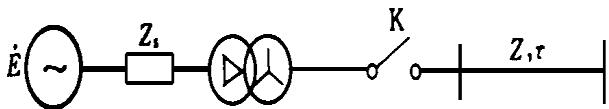
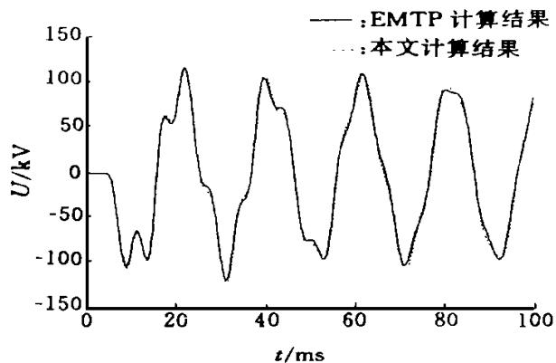
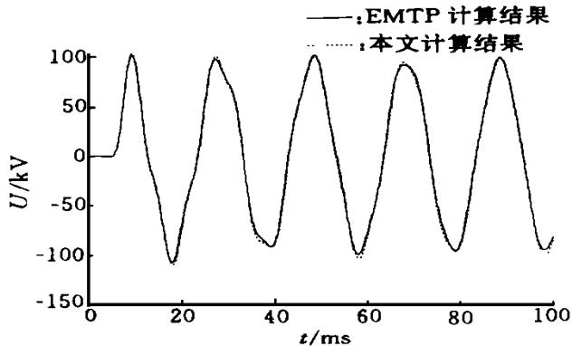
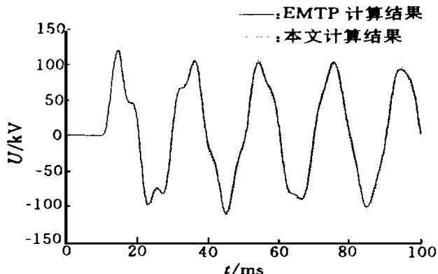
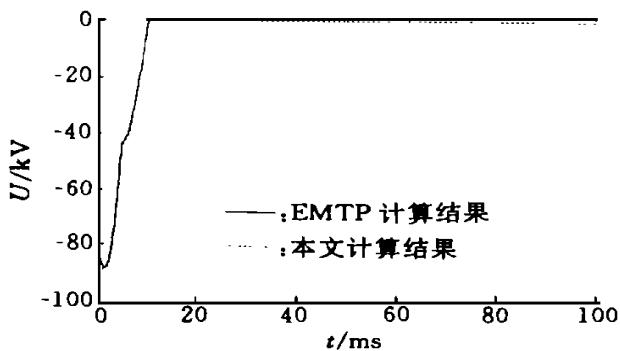

# 电磁暂态计算中新的变压器模型

王晓彤‚牛晓民‚施 围

（西安交通大学‚710049‚西安）

摘要 在变压器的诸多特性中 耦合性的变比与连接方式是最主要的 文章在 型等值电路的基础上‚提出了一个能计及变比、相间耦合、联结组及相移等特性的变压器模型．该模型的主要功能通过与 程序计算结果比较 证明是正确的

关键词 电磁暂态 耦合性变比 联结组 变压器模型

中国图书资料分类法分类号：TM864

# A Transformer Model for Electromagnetic Transients

Wang Xiaotong‚ Niu Xiaomin‚ Shi Wei

（X′i an Jiaotong University‚X′i an710049‚China）

Abstract：Based on the T-form equivalent circuit‚a transformer model that accounts for turn ratio‚interphase couple‚connection‚phase thift‚etc．is presented．The main functions are compared separately with EMTP（Electro-Magnetic Transient Program） showing the validity of the model．

Keywords： electro-magnetic transient；coupled turns ratio；connection；transformer model

在电磁暂态计算中 变压器是较难模拟的器件之一．其复杂性在于‚它不仅是一个多相的耦合性元件 而且是一个具有磁滞效应的饱和性电感元件 如果计算快速暂态过程 雷电过电压或 计及变压器的杂散电容时‚它还是一个与频率有关的元件人们在很早就开发了变压器的暂态计算模型［1］ 当然都是在忽略某些因素的条件下 如 型等值电路模型 理想变压器模型 饱和变压器元件 以及 准非线性磁滞电抗 等 但是 这些模型只能较准确地描述变压器的某一特性 很难满足各种暂态计算的需要 所以 人们至今仍在努力 试图建立一个较为完善的变压器模型［2］

在变压器的诸多特性中 耦合性的变比与连接

方式是最主要的 本文在 型等值回路的基础上 提出了一个计及变比、相间耦合、联结组及相移等特性的计算模型 将它做成一个块元件 在此基础上 再模拟变压器的其它特性就方便多了

# 1 变比的模拟

在基于 型等值电路的变压器模拟中 参数均归算至某一基值电压下 对标么制变比为 的变压器 可简单地用一个串联电感来模拟 但在有多个电压等级的系统中 往往存在着 非标准变比 的变压器 处理有名值变比 如 与其相应的标么制变比 如 难度相当 在这种情

况下 直接采用有名值变比更为直观 简便 它可以省去复杂的归算过程而直接使用设备的有名值‚同时解得的电压值为节点的实际电压

年 版本的 中加入了理想变压器模型 这种模型忽略了漏磁电感和激磁电抗 其等值电路存在一个附加节点 须用改进节点法来求解 同时 这种模型在变压器空载时 消元过程会失败［3］ 必须经过一定的处理 程序才能继续

  
图 单相变压器电路

执行 为解决该问题 本文采用的是新的处理变比的计算模型

图1和图2分别为单相变压器及其对应的 型等值电路 比较图 图

2可以看出‚显然存在如下关系

  
图 型等值电路

$$
\left. \begin{array}{l} \dot {U} _ {H} = \dot {U} _ {H 1} - \dot {U} _ {H 2} \\ \dot {U} _ {L} = t \left(\dot {U} _ {L 1} - \dot {U} _ {L 2}\right) \end{array} \right\} \tag {1}
$$

其中 $\ l _ { t } = \ l _ { n _ { H } } / \ l _ { n _ { L } }$

对于图2中的带变比支路 $M ^ { \sim } L ^ { ' }$ ‚经推导‚可得

$$
\left[ \begin{array}{l} \dot {I} _ {L 1} \\ \dot {I} _ {L 2} \\ \dot {I} _ {M} \end{array} \right] = \left[ \begin{array}{c c c} t ^ {2} Y _ {2} & - t ^ {2} Y _ {2} & - t Y _ {2} \\ - t ^ {2} Y _ {2} & - t ^ {2} Y _ {2} & - t Y _ {2} \\ - t Y _ {2} & t ^ {2} Y _ {2} & Y _ {2} \end{array} \right] \left[ \begin{array}{l} \dot {U} _ {L 1} \\ \dot {U} _ {L 2} \\ \dot {U} _ {M} \end{array} \right] \tag {2}
$$

其中 $Y _ { 2 } { = } \frac { 1 } { R _ { 2 } { + } \mathrm { j } X _ { 2 } }$

暂态计算时‚对带变比支路 $M ^ { \sim } L ^ { ' }$ ‚根据文献的差分方程 等值电流源及其递推计算式 并经推导得

$$
\boldsymbol {G} \mathbf {v} (t) = \boldsymbol {i} (t) - \boldsymbol {I} (t - \Delta t) \tag {3}
$$

$$
\left. \begin{array}{l} \boldsymbol {I} (t - \Delta t) = \boldsymbol {G} \mathbf {v} (t - \Delta t) + F _ {R L} \boldsymbol {i} (t - \Delta t) \\ \boldsymbol {I} (t - \Delta t) = \boldsymbol {H} \mathbf {v} (t - \Delta t) + F _ {R L} \boldsymbol {I} (t - 2 \Delta t) \end{array} \right\} \tag {4}
$$

$$
\left. \begin{array}{l} \mathbf {v} (t) = \left[ v _ {L 1} (t), v _ {L 2} (t), v _ {M} (t) \right] ^ {\mathrm {T}} \\ \boldsymbol {i} (t) = \left[ i _ {L 1} (t), i _ {L 2} (t), i _ {M} (t) \right] ^ {\mathrm {T}} \end{array} \right\} \tag {5}
$$

$$
\boldsymbol {I} (t - \Delta t) = [ I _ {L 1} (t - \Delta t),
$$

$$
\left. I _ {L ^ {2}} (t - \Delta t), I _ {M} (t - \Delta t) \right] ^ {\mathrm {T}} \tag {6}
$$

$$
\boldsymbol {G} = \left[ \begin{array}{c c c} t ^ {2} G _ {R L} & - t ^ {2} G _ {R L} & - t G _ {R L} \\ - t ^ {2} G _ {R L} & t ^ {2} G _ {R L} & t G _ {R L} \\ - t G _ {R L} & t G _ {R L} & G _ {R L} \end{array} \right] \tag {7}
$$

$$
\boldsymbol {H} = \left[ \begin{array}{c c c} t ^ {2} H _ {R L} & - t ^ {2} H _ {R L} & - t H _ {R L} \\ - t ^ {2} H _ {R L} & t ^ {2} H _ {R L} & t H _ {R L} \\ - t H _ {R L} & t H _ {R L} & H _ {R L} \end{array} \right] \tag {8}
$$

式中 $G _ { R L } = \bigg ( { \frac { 2 { X _ { 2 } } } { \omega \Delta _ { t } } } + { R _ { 2 } } ) \bigg ) ^ { - 1 } ; H _ { R L } = 2 ( G _ { R L } - G _ { R L }$ 2X2 R ）$R 2 G _ { R L } ) ; F _ { R L } { = } 1 { - } 2 G _ { R L } R _ { 2 }$

支路 $H ^ { \sim } M$ 可看作是支路 $M ^ { \sim } L$ ′在 $\iota ^ { = 1 . 0 }$ 时的特例．在本文所提出的计算模型中‚求解时只须用通常的节点电压法

# 2 联结组与相移

在现有的变压器模型中‚一般不考虑联结组别在某些连接方式中‚如 ／ 接法 会出现一定的相移 若不考虑相移 不但会使潮流计算出现与实际情况不符的结果‚而且会使工频过电压的计算失去准确性．由于稳态计算结果往往是作为暂态计算的初值‚这样‚不正确的初值就可能导致整个暂态计算结果的错误

另一方面‚联结组对零序电流的通道有很大影响‚不同的联结组对应着不同的零序回路．此外‚有时要计算不接地变压器的中性点电压‚也必须模拟变压器的连接方式

  
图 三相组的 $\mathrm { Y } / \triangle$ 接法

对于联结组‚可以通过耦合绕组编号来模拟．以一个三相变压器组为例‚如图 所示‚高压侧为 接法‚低压侧为 接法 可以通过三对耦合绕组来实现 分别为

（1） $H _ { A } \sim N$ 和 $L _ { A } \sim$ $L _ { B }$ ；

（2） $H _ { B } \sim N$ 和 $L _ { B } { \sim } L _ { C }$ ；  
（3） $H _ { C } { \sim } N$ 和 $L _ { C } { \sim } L _ { A }$

在计算中‚只须输入耦合绕组对应的节点编号即可．由联结组产生的相移及其零序回路‚都可通过这种方式自动实现

为了获得变压器中性点电压‚ 一般是在高压侧加入一个星形计算电路（零序阻抗为有限值正序阻抗为无穷大）．本文的计算模型可以通过联结组的模拟而直接获得中性点电压

# 3 相间耦合

在 中‚如果变压器为三相变压器组‚由于不必考虑三相之间的耦合‚所以用三对耦合支路即可以实现对联结组的模拟．但是‚对于三相三柱式变压器‚由于零序激磁电抗远小于正序激磁电抗‚因此相间耦合不能忽略‚在 中模拟这种情况是比较困难的

要考虑相间耦合‚必须分别输入变压器的正序和零序T 型回路的参数．这样‚就可以通过三相耦合支路来考虑相间耦合．如对于三相三柱式变压器‚其励磁支路的导纳矩阵为

$$
\mathbf {Y} = \left[ \begin{array}{l l l} G _ {\mathrm {S}} & G _ {\mathrm {m}} & G _ {\mathrm {m}} \\ G _ {\mathrm {m}} & G _ {\mathrm {S}} & G _ {\mathrm {m}} \\ G _ {\mathrm {m}} & G _ {\mathrm {m}} & G _ {\mathrm {s}} \end{array} \right] + \mathrm {j} \left[ \begin{array}{l l l} B _ {\mathrm {S}} & B _ {\mathrm {m}} & B _ {\mathrm {m}} \\ B _ {\mathrm {m}} & B _ {\mathrm {S}} & B _ {\mathrm {m}} \\ B _ {\mathrm {m}} & B _ {\mathrm {m}} & B _ {\mathrm {s}} \end{array} \right] \tag {9}
$$

式中元素可分别由正序和零序励磁导纳求得［4］

当铁芯结构为三相五柱式、三个单相组或壳式变压器时‚其零序参数与正序参数基本相同；当采用三相三柱式铁芯时‚由于箱壁的“ ”作用‚使得零序漏抗小于正序时的参数‚且零序激磁电抗远小于正序激磁电抗‚但仍大于短路阻抗（两者可比）．因此对于前者‚只须输入正序参数；而对于后者‚则须同时输入零序和正序参数

这样‚根据正序和零序 型回路参数‚单相变压器中的 $Y _ { 1 } , Y _ { 2 }$ 和 $Y _ { M }$ ‚在三相变压器中则分别变为$\times 3$ 的矩阵 $Y _ { 1 , Y } ,$ 和 $Y _ { M }$ ．当零序参数和正序参数不相等‚即存在相间耦合时‚其参数矩阵的非对角线元素不为 ．三相变压器计算模型的推导与单相变压器类似‚只须将对应的元素转化为矩阵即可

# 4 计算实例

本文采用了如图 所示的一个简单的电路系统 $\angle C = \angle C = \angle C = \angle C \angle P C P$ 来检验其计算结果．图中‚变压器联结组为 $\mathbf { Y } / \widetilde { \triangle } - 1 1 , \mathbf { \delta } _ { U _ { H } } / U _ { L } = 1 1 0 \mathbf { \delta } _ { \mathbf { k } } \mathbf { v } / 1 0 \mathbf { \delta } _ { \mathbf { k } } \mathbf { v }$ ‚短路阻抗

$Z _ { \mathrm { K } } = 4 . 0 8 + \mathrm { j } 6 3 . 6 \Omega ($ （高压侧）‚电源阻抗 $Z _ { \mathrm { s } } { = } 0 . 2 5 { + }$ $\mathrm { j } ^ { 2 } { \cdot } 5 0 \ \Omega$ ．无损线路参数为： $\scriptstyle { X _ { 0 } = 1 . 4 } \ \Omega / \mathrm { k m }$ ‚ $X _ { 1 } = 0 . 4$ $\Omega / \mathrm { k m } , C _ { 0 } { = } 0 . 0 0 7 \ 9 4 \ \mu \mathrm { _ { F } / k m } , C _ { 1 } { = } 0 . 0 0 9 \ 6 4 \ \mu \mathrm { _ { F } / k m }$

  
图 计算电路

根据该计算电路‚在合闸前稳态情况下‚二者计算结果如表1所示‚其中 $H _ { A } , H _ { B } , H _ { C }$ 分别为高压侧三相节点 $L _ { A } , L _ { B } , L _ { C }$ 分别为低压侧三相节点．值得说明的是‚在 中‚为使高压侧的电压相角正确‚须将电源（在低压侧）相角人为地转动 $3 0 ^ { \circ }$ ‚因此其计算结果只对高压侧是正确的；低压侧电压的幅值须根据变比关系进行转换‚其相角是错误的．由表可以看出‚用本文的计算模型所得结果‚高压侧电压幅值与低压侧电压幅值之比满足变比关系；低压侧电压相位比高压侧超前 $3 0 ^ { \circ }$ ．可见‚该计算模型可以正确地模拟变比和由联结组造成的相移

表 稳态计算结果  

<table><tr><td rowspan="2">节点名</td><td colspan="2">EMTP计算结果</td><td colspan="2">本文计算结果</td></tr><tr><td>幅值/kV</td><td>相角/(°)</td><td>幅值/kV</td><td>相角/(°)</td></tr><tr><td>HA</td><td>63.51</td><td>-30.00</td><td>63.51</td><td>-30.00</td></tr><tr><td>HB</td><td>63.51</td><td>-150.00</td><td>63.51</td><td>-150.00</td></tr><tr><td>HC</td><td>63.51</td><td>90.00</td><td>63.51</td><td>90.00</td></tr><tr><td>LA</td><td>63.51</td><td>-30.00</td><td>5.77</td><td>0.00</td></tr><tr><td>LB</td><td>63.51</td><td>-150.00</td><td>5.77</td><td>-120.00</td></tr><tr><td>LC</td><td>63.51</td><td>90.00</td><td>5.77</td><td>120.00</td></tr></table>

当三相开关分别在 $\scriptstyle t = 0 \cos , t = 5 \cos , t = 1 0 \cos$ 时合闸‚线路末端和变压器中性点 N 的电压波形如图5～8所示

  
图 A 相电压波形图

  
图 B 相电压波形图

  
图7 C 相电压波形图  
图 中性点 N 的电压波形

由波形图可以看出‚二者计算结果符合得很好证明了该计算模型的正确性

# 5 结 论

从稳态和暂态计算结果可以看出‚本文所提出的计算模型可以正确地模拟变压器的变比、相间耦合、联结组及其产生的相移．同时‚变压器中性点的电压可以直接求出‚而不必象 那样 须增加一个星形计算电路来模拟中性点 该模型的稳态和暂态的计算结果 经与 相比较 证明是正确的该模型经过发展‚可作为一个专门的块元件‚加进暂态计算程序中 以适应各种条件下的暂态计算的需要

# 参考文献：

［1］ Tinney W F‚Brandwajn V‚Chan S M．Sparse vector method·IEEE Trans on Power App Syst,1985,1O4(2).295 ～301.   
［2］ Dommel H W．Transformer models in the EMTP．In：Proceedings of the International Conference on Insulation Coordination and the EMTP Applications．Montreel‚1996‚121 ~126.   
［3］ 道梅尔 H W．电力系统电磁暂态计算理论．李永庄译北京 水利电力出版社  
［4］ 施围．电力系统过电压计算．西安：西安交通大学出版社，1998.

（编辑 杜秀杰）

# 上接第 页

［3］ 李民‚王兆安‚卓放∙基于瞬时无功功率理论的高次谐波和无功功率检测 电力电子技术  
杨君 王兆安 三相电路谐波电流两种检测方法的对比研究 电工技术学报  
刘进军 瞬时无功功率理论和串联混合型单相电力有

源滤波器的研究 博士学位论文 西安 西安交通大学电气工程学院  
薛定宇 控制系统计算机辅助设计 北京 清华大学出版社，1996.18～207.

（编辑 杜秀杰）