# 基于UMEC的双芯Sen变压器电磁暂态模型

卜亮，韩松，周超，冯金铃

（贵州大学 电气工程学院，贵州省 贵阳市 550025）

Electromagnetic Transient Model of Two-core Sen Transformer Based on UMEC

BU Liang, HAN Song, ZHOU Chao, FENG Jinling

(School of Electrical Engineering, Guizhou University, Guiyang 550025, Guizhou Province, China)

ABSTRACT: This paper proposes an electromagnetic transient model of the two-core Sen transformer (TCST) based on the unified magnetic equivalent circuit (UMEC) in order to analyze its electromagnetic characteristics. Firstly, the TCST may be divided into the two parts of the series winding and the exciting winding so that their magnetic equivalent circuits are established based on their iron core structures respectively, according to the magnetic coupling relationships among the internal windings of the TCST. Secondly, with the mathematical expressions of the electromagnetic transient models derived by the UMEC method for the two parts separately, an electromagnetic transient model of the TCST can be acquired by the combination of the series winding and the exciting winding in the light of their electrical connections in the TCST. Finally, with the help of the MATLAB and the PSCAD/EMTDC, the analytical calculation and the time-domain simulation have been carried out, proving the effectiveness of the proposed model. In comparisons with the results involving the currents, the voltages and the power flows in the existing published papers, it is found that the current flowing through the tap-changers in the TCST is about 50% of the line current, which can effectively reduce the manufacturing cost of the tap-changer. Meanwhile, the actual adjustment step length of the TCST is about 0.5 times smaller than that of the single-core Sen transformer (SCST), which may lead to more accurate performance in the TCST.

KEY WORDS: Sen transformer; two-core structure; unified magnetic equivalent circuit; electromagnetic transient model; series compensating voltage

摘要：为了分析 Sen 变压器(Sen transformer，ST)在双芯结构下的电磁特性，该文提出一种基于统一磁路模型(unifiedmagnetic equivalent circuit，UMEC)法的双芯 Sen 变压器

(two-core Sen transformer，TCST)电磁暂态模型。首先，根据TCST内部绕组的磁耦合关系，将TCST 分为串联变和励磁变两部分，并基于各自的铁芯结构建立了它们的磁等值回路；其次，采用 UMEC 原理分别对上述两部分进行电磁暂态建模，并由 TCST 内部串–励部分之间的电气连接关系，将该串–励部分结合，继而构建了 TCST 的电磁暂态模型。最后，借助 MATLAB 和 PSCAD/EMTDC 进行了解析计算与时域仿真分析，验证了该文所提模型的有效性。通过与现有论文电流电压和功率结果的对比，发现流过TCST分接开关的电流约为线路电流的 50%，可有效降低分接开关的制造成本。同时 TCST 的实际调节步长相比于单芯结构的ST(single-core Sen transformer，SCST)要小，约为 SCST 的0.5倍，使得其控制精度更高。

关键词：Sen变压器；双芯结构；统一磁路模型；电磁暂态模型；串联电压补偿

DOI：10.13335/j.1000-3673.pst.2021.0095

# 0 引言

光伏、风能等新能源的大量接入以及电网结构的复杂化给电力系统带来了潮流分布不均衡、系统运行灵活性以及稳定性下降等问题[1-4]。潮流控制器能够改变系统的潮流分布，改善系统的动态运行特性，在提高电力系统运行的稳定性、可靠性和输电能力等方面发挥着重要的作用[5-7]。Sen 变压器(Sentransformer，ST)是一种电磁式潮流控制器，其通过控制补偿电压的幅值与相位来实现潮流调节[8]。相较于同等容量的统一潮流控制器(unified powerflow controller，UPFC)，ST 的成本与损耗更低，具有良好的应用前景[9-10]。

从 ST 的拓扑结构发展角度来看，由于 ST 是通过控制副边绕组上的机械式分接开关来获取所需补偿电压，其调节属于离散调节，导致其潮流控制精度较差、调节速度慢。因此，文献[11-12]提出一种由 ST 与 UPFC 串联组成的混合式潮流控制器，其结合了 ST 大容量和高可靠性的优点和 UPFC 快

速响应和控制精度高的优点，但是 ST 和 UPFC 之间协调控制较为复杂。文献[13-14]和[15]分别提出基于副边绕组反相的扩展型Sen变压器和采用带有反相开关的不对称分布绕组的 ST，有效提高了 ST的控制精度，使得 ST 的调节具有更高的灵活性。上述文献所研究的 ST 均为单芯结构，单芯结构具有结构简单，绕组数少等优点，但是其副边绕组直接串联接入输电线路，由系统故障所产生的过电流和过电压会直接作用于调节绕组和分接开关，可能会导致设备损坏，也使得其绝缘成本和加工难度大幅增加[11,16-17]。从变压器的铁芯结构角度来看，双芯结构能够将调节绕组和分接开关从线路中隔离开来使其免于系统过电压和过电流的影响，使得分接开关的绝缘水平和成本大幅降低[17]，在特/超高压等应用场景中相较于单芯结构有一定优势。这也是双芯结构的移相变压器应用于特/超高压电网的潮流调控的原因[18-20]。因此，双芯结构的 ST 或是特/超高压场景下一种潜在应用形式。

从 ST 的建模研究角度来看，文献[21]提出由多个单相理想变压器组合的ST模型，其结构简单，但是忽略了多绕组耦合效应和铁芯饱和特性。文献[22]基于BCTRAN模型的构建方法提出ST的电磁暂态模型，其考虑了副边绕组的耦合效应以及铁芯饱和特性，但是未考虑铁芯的几何结构和磁通路径，而且忽略了涡流效应和磁滞效应。进而文献[23]提出了计及涡流效应和磁滞效应的 ST 电磁暂态模型，其采用统一磁路模型(unified magneticequivalent circuit，UMEC)法对其进行建模，能够有效分析铁芯结构和磁通路径所带来的影响。为了分析 ST 内部各个绕组之间的耦合作用，文献[24]基于UMEC 提出一种考虑内部多绕组耦合的 ST 电磁解析模型。但是，以上模型的构建都是围绕单芯结构的 ST(single-core Sen transformer，SCST)，有关双芯 Sen 变压器(two-core Sen transformer，TCST)的建模尚未有公开报道。在 PSCAD 中，可通过单芯双绕组变压器组合而获得 TCST 的模型，但是由这种方式获得的模型没有考虑TCST内部铁芯结构的影响，准确性有所欠缺。

为此，本文基于 UMEC 建立了一种 TCST 的电磁暂态模型，其能够考虑 TCST 内部铁芯结构以及相间绕组耦合的影响。同时，为了验证模型的有效性，借助 MATLAB 软件进行了解析计算，并将计算结果与PSCAD/EMTDC时域仿真结果进行对比，表明了所提模型的有效性。此外，分析了 TCST 和SCST 在控制精度和内部绕组电流上的差异，并与

UPFC 的潮流控制效果进行了比较。

# 1 TCST 的结构与原理

TCST 的结构如图 1 所示，TCST 励磁变原边为星形联结，并联接入电气系统送端，副边每相由3 个带有载分接开关的绕组串联而成，构成补偿电压调节单元，并与串联变相连。其中，绕组 $\mathbf { a } _ { 1 } \cdot$ 、 $\mathbf { b } _ { 1 } .$ 、$\mathrm { c } _ { 1 }$ 组成励磁变副边 A 相输出电压 $U _ { \mathrm { E a } }$ ，绕组 $\mathbf { a } _ { 2 } \cdot$ 、 $\mathsf { b } _ { 2 } .$ 、$\mathrm { c } _ { 2 }$ 组成励磁变副边 B 相输出电压 $U _ { \mathrm { E b } }$ ，绕组 ${ \bf a } _ { 3 } , { \bf b } _ { 3 } .$ 、$\mathrm { c } _ { 3 }$ 组成励磁变副边 C 相输出电压 $U _ { \mathrm { E c } }$ 。串联变由3 个单相双绕组变压器组成，原边与励磁变副边相连，副边串联接入电气系统。以 A 相为例，$U _ { \mathrm { E a } } { = } U _ { \mathrm { a l } } { + } U _ { \mathrm { b l } } { + } U _ { \mathrm { c 1 } } , \ U _ { \mathrm { E a } }$ 经过串联变感应至线路，形成串联补偿电压 $\Delta U _ { \mathrm { A } }$ 。由于 $U _ { \mathrm { a l } }$ 、 $U _ { \mathbf { b } 1 }$ 、 $U _ { \mathrm { c 1 } }$ 之间的相角差为 $1 2 0 ^ { \circ }$ ，通过调节励磁变副边绕组的抽头位置，从而改变串联补偿电压 $\Delta U _ { \mathrm { A } }$ ，达到调节线路潮流的目的。同理，亦可实现 B 相、C 相的潮流调节。

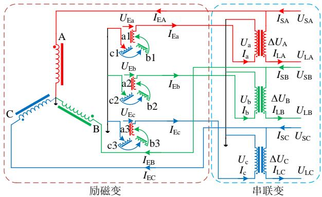  
图1 TCST 的基本拓扑结构  
Fig. 1 Basic topology of the TCST

# 2 TCST 的电磁暂态模型

由于 TCST由 2 个铁芯组成，建模分析时，首先将 TCST分为串联变和励磁变两部分，分别建立其电磁暂态模型。其次，根据其内部电气连接将上述 2 个部分的模型结合，从而得到 TCST 的电磁暂态模型。

# 2.1 TCST串联变的电磁暂态模型

TCST 的串联变采用三相组式结构，以 A相为例，图 2 为其磁等值回路。其中 $N _ { \mathrm { a } } I _ { \mathrm { a } }$ 和 $N _ { \mathrm { A } } I _ { \mathrm { L A } }$ 分别为由串联变一次侧绕组电流 $I _ { \mathrm { a } }$ 和二次侧绕组电流$I _ { \mathrm { L A } }$ 所产生的磁动势， $N _ { \mathrm { a } }$ 和 $N _ { \mathrm { A } }$ 分别为串联变一次侧绕组和二次侧绕组的匝数， $P _ { \mathrm { a } }$ 和 $P _ { \mathrm { l a } }$ 分别为串联变一次侧绕组的铁芯磁导和漏磁导， $P _ { \mathrm { { A } } }$ 和 $P _ { \mathrm { { l A } } }$ 分别为串联变二次侧绕组的铁芯磁导和漏磁导， $P _ { \mathrm { a A } }$ 为铁轭磁导， $\varPhi _ { \mathrm { a } }$ 和 $\varPhi _ { \mathrm { l a } }$ 分别为流过一次侧绕组的磁通和一次侧绕组的漏磁通， $\phi _ { \mathrm { A } }$ 和 $\phi _ { \mathrm { A } }$ 分别为流过二次侧绕组

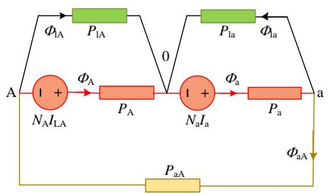  
图2 串联变的单相磁等值回路  
Fig. 2 Single-phase magnetic equivalent circuit of series winding

的磁通和二次侧绕组的漏磁通， $\phi _ { \mathrm { a A } }$ 为铁轭磁通。

由图 2，其支路磁通与磁动势之间的关系为

$$
\boldsymbol {\Phi} _ {\mathrm {S A}} = \boldsymbol {P} _ {\mathrm {S A}} \left(\boldsymbol {N} _ {\mathrm {S A}} \boldsymbol {I} _ {\mathrm {S A}} - \boldsymbol {\theta} _ {\mathrm {S A}} ^ {\prime}\right) \tag {1}
$$

式中： $\pmb { \mathcal { D } } _ { \mathrm { S A } }$ 为支路磁通矩阵； $P _ { \mathrm { S A } }$ 为支路磁导矩阵；$N _ { \mathrm { S A } }$ 为绕组匝数矩阵； $\pmb { I } _ { \mathrm { S A } }$ 为绕组电流矩阵； $\pmb { \theta } _ { \mathrm { S A } } ^ { \prime }$ 为支路磁动势矩阵。

根据高斯定律，有：

$$
\left\{ \begin{array}{l} \Phi_ {\mathrm {a}} - \Phi_ {\mathrm {a A}} - \Phi_ {\mathrm {l a}} = 0 \\ - \Phi_ {\mathrm {A}} + \Phi_ {\mathrm {a A}} - \Phi_ {\mathrm {l A}} = 0 \end{array} \right. \tag {2}
$$

转化成矩阵形式可得：

$$
\boldsymbol {A} _ {\mathrm {S A}} ^ {\mathrm {T}} \boldsymbol {\Phi} _ {\mathrm {S A}} = \mathbf {0} \tag {3}
$$

由图2可知，支路磁动势可由节点磁动势表示。

$$
\left\{ \begin{array}{l} \theta_ {\mathrm {a}} ^ {\prime} = \theta_ {\mathrm {a}} \\ \theta_ {\mathrm {A}} ^ {\prime} = - \theta_ {\mathrm {A}} \\ \theta_ {\mathrm {a A}} ^ {\prime} = - \theta_ {\mathrm {a}} + \theta_ {\mathrm {A}} \\ \theta_ {\mathrm {a l}} ^ {\prime} = - \theta_ {\mathrm {a}} \\ \theta_ {\mathrm {A l}} ^ {\prime} = - \theta_ {\mathrm {A}} \end{array} \right. \tag {4}
$$

转化成矩阵形式为

$$
\boldsymbol {\theta} _ {\mathrm {S A}} ^ {\prime} = \boldsymbol {A} _ {\mathrm {S A}} \boldsymbol {\theta} _ {\mathrm {S A}} \tag {5}
$$

联立式(1) (3)(5)可得：

$$
\boldsymbol {\Phi} _ {\mathrm {S A}} = \boldsymbol {Q} _ {\mathrm {S A}} \boldsymbol {N} _ {\mathrm {S A}} \boldsymbol {I} _ {\mathrm {S A}} \tag {6}
$$

式中： $Q _ { \mathrm { S A } } { = } E { - } P _ { \mathrm { S A } } A _ { \mathrm { S A } } ( A _ { \mathrm { S A } } ^ { \mathrm { T } } P _ { \mathrm { S A } } A _ { \mathrm { S A } } ) ^ { - 1 } A _ { \mathrm { S A } } ^ { \mathrm { T } } P _ { \mathrm { S A } }$ ；E 为单位矩阵。

将式(6)展开写成：

$$
\left[ \begin{array}{l} \boldsymbol {\Phi} _ {\mathrm {M A}} \\ \boldsymbol {\Phi} _ {\mathrm {N A}} \end{array} \right] = \left[ \begin{array}{l l} \boldsymbol {Q} _ {\mathrm {M M A}} & \boldsymbol {Q} _ {\mathrm {M N A}} \\ \boldsymbol {Q} _ {\mathrm {N M A}} & \boldsymbol {Q} _ {\mathrm {N N A}} \end{array} \right] \left[ \begin{array}{c} \boldsymbol {N} _ {\mathrm {M A}} \boldsymbol {I} _ {\mathrm {M A}} \\ \boldsymbol {0} \end{array} \right] \tag {7}
$$

式中： $\pmb { \mathcal { O } } _ { \mathrm { M A } }$ 为由流过绕组的磁通所构成的矩阵； $\pmb { \mathcal { O } } _ { \mathrm { N A } }$ 为由未流过绕组的磁通所构成的矩阵；QMMA、$Q _ { \mathrm { M N A } }$ 、 $Q _ { \mathrm { N M A } }$ 、 $Q _ { \mathrm { N N A } }$ 为 Q 的子矩阵； $N _ { \mathrm { M A } }$ 为 $2 \times 2$ 维匝数矩阵； ${ \cal I } _ { \mathrm { M A } }$ 为 $2 \times 2$ 维电流矩阵。

由式(7)可得：

$$
\boldsymbol {\Phi} _ {\mathrm {M A}} = \boldsymbol {Q} _ {\mathrm {M M A}} \boldsymbol {N} _ {\mathrm {M A}} \boldsymbol {I} _ {\mathrm {M A}} \tag {8}
$$

由法拉第电磁感应定律可知：

$$
\boldsymbol {U} _ {\mathrm {A}} = \boldsymbol {N} _ {\mathrm {M A}} \frac {\mathrm {d} \boldsymbol {\Phi} _ {\mathrm {M A}}}{\mathrm {d} t} \tag {9}
$$

$\exists \mathrm { ^ { \textregistered } \Psi _ { A } } \mathbf { U } _ { \mathrm { A } } = \mathbf { \left[ \begin{array} { l l } { U _ { \mathrm { a } } } & { \Delta U _ { \mathrm { A } } } \end{array} \right] } ^ { \mathrm { T } } \mathbf { \Psi } _ { \circ }$

用梯形积分定律离散式(9)可得：

$$
\boldsymbol {N} _ {\mathrm {M A}} \boldsymbol {\Phi} _ {\mathrm {M A}} (t) = \frac {\Delta t}{2} \boldsymbol {U} _ {\mathrm {A}} (t) + \boldsymbol {\Phi} _ {\mathrm {M A}, \text {h i s t}} (t) \tag {10}
$$

$\vec { \pm } \backslash \mp \llangle \pmb { \mathcal { P } } _ { \mathrm { M A , \ h i s t } } ( t ) = N _ { \mathrm { M A } } \pmb { \mathcal { P } } _ { \mathrm { M A } } ( t - \Delta t ) + \frac { \Delta t } { 2 } \pmb { U } _ { \mathrm { A } } ( t - \Delta t ) \circ$

由式(8)和式(10)可得：

$$
N _ {\mathrm {M A}} \boldsymbol {\Phi} _ {\mathrm {M A}} = N _ {\mathrm {M A}} Q _ {\mathrm {M M A}} N _ {\mathrm {M A}} \boldsymbol {I} _ {\mathrm {M A}} = Z _ {\mathrm {M A}} \boldsymbol {I} _ {\mathrm {M A}} \tag {11}
$$

将式(11)代入式(10)可得：

$$
\boldsymbol {I} _ {\mathrm {M A}} (t) = \boldsymbol {Y} _ {\mathrm {M A}} \boldsymbol {U} _ {\mathrm {A}} (t) + \boldsymbol {I} _ {\mathrm {M A}, \text {h i s t}} (t) \tag {12}
$$

$\vec { \pm } \{ \pmb { Y } _ { \mathrm { M A } } = \frac { \Delta t } { 2 } \pmb { Z } _ { \mathrm { M A } } ^ { - 1 } , \quad \pmb { I } _ { \mathrm { M A , h i s t } } ( t ) = \pmb { Z } _ { \mathrm { M A } } ^ { - 1 } \pmb { \varPhi } _ { \mathrm { M A , h i s t } } ( t ) \ \circ$ 式中 MAY

式(12)即为 TCST 串联变 A 相电磁暂态模型，同理，可得到串联变 B相与 C 相的电磁暂态模型。

$$
\boldsymbol {I} _ {\mathrm {M B}} (t) = \boldsymbol {Y} _ {\mathrm {M B}} \boldsymbol {U} _ {\mathrm {B}} (t) + \boldsymbol {I} _ {\mathrm {M B}, \text {h i s t}} (t) \tag {13}
$$

$$
\boldsymbol {I} _ {\mathrm {M C}} (t) = \boldsymbol {Y} _ {\mathrm {M C}} \boldsymbol {U} _ {\mathrm {C}} (t) + \boldsymbol {I} _ {\mathrm {M C}, \text {h i s t}} (t) \tag {14}
$$

将式(12)(13)(14)联立可得 TCST 串联变电磁暂态模型：

$$
\boldsymbol {I} _ {\mathrm {S u}} (t) = \boldsymbol {Y} _ {\mathrm {S u}} \boldsymbol {U} _ {\mathrm {S u}} (t) + \boldsymbol {I} _ {\mathrm {S u}, \text {h i s t}} (t) \tag {15}
$$

其中，

$$
I _ {\mathrm {S u}} (t) = \left[ \begin{array}{l l l} I _ {\mathrm {L A}} (t) & I _ {\mathrm {L B}} (t) & I _ {\mathrm {L C}} (t) \end{array} \right.
$$

$$
\left. \begin{array}{l l l} I _ {\mathrm {a}} (t) & I _ {\mathrm {b}} (t) & I _ {\mathrm {c}} (t) \end{array} \right] ^ {\mathrm {T}} \tag {16}
$$

$$
\boldsymbol {U} _ {\mathrm {S u}} (t) = \left[ \begin{array}{l l l} \Delta U _ {\mathrm {A}} (t) & \Delta U _ {\mathrm {B}} (t) & \Delta U _ {\mathrm {C}} (t) \end{array} \right.
$$

$$
\left. \begin{array}{l l l} U _ {\mathrm {a}} (t) & U _ {\mathrm {b}} (t) & U _ {\mathrm {c}} (t) \end{array} \right] ^ {\mathrm {T}} \tag {17}
$$

# 2.2 TCST励磁变的电磁暂态模型

TCST 的励磁变采用三相三柱式结构，图 3 为TCST 励磁变的磁等值回路。 $N _ { \mathrm { E A } } I _ { \mathrm { E A } } , N _ { \mathrm { E B } } I _ { \mathrm { E B } } , N _ { \mathrm { E C } } I _ { \mathrm { E C } }$ 分别为由励磁变一次侧 A、B、C 绕组的电流 $I _ { \mathrm { E A } } .$ 、$I _ { \mathrm { E B } } , \ I _ { \mathrm { E C } }$ 所产生的磁动势， $N _ { \mathrm { a l } } I _ { \mathrm { E a } } \setminus N _ { \mathrm { b l } } I _ { \mathrm { E a } } \setminus N _ { \mathrm { c l } } I _ { \mathrm { E a } } \setminus$ 、$N _ { \mathrm { a 2 } } I _ { \mathrm { E b } } \circ N _ { \mathrm { b 2 } } I _ { \mathrm { E b } } \circ N _ { \mathrm { c 2 } } I _ { \mathrm { E b } } \circ N _ { \mathrm { a 3 } } I _ { \mathrm { E c } } \circ N _ { \mathrm { b 3 } } I _ { \mathrm { E c } } \circ N _ { \mathrm { c 3 } } I _ { \mathrm { E c } }$ 分别为由励磁变二次侧 a1、b1、c1、a2、b2、c2、a3、b3、$^ { \mathrm { c 3 } }$ 绕组的电流 $I _ { \mathrm { E a } } \setminus I _ { \mathrm { E b } } \setminus I _ { \mathrm { E c } }$ 所产生的磁动势， $\phi _ { \mathrm { E A } } .$ 、$\phi _ { \mathrm { E B } }$ $\phi _ { \mathrm { E C } }$ 分别为流过励磁变一次侧绕组的磁通，$\phi _ { \mathrm { a l } } \setminus \phi _ { \mathrm { b 1 } } \setminus \phi _ { \mathrm { c 1 } } \setminus \phi _ { \mathrm { a 2 } } \setminus \phi _ { \mathrm { b 2 } } \setminus \phi _ { \mathrm { c 2 } } \setminus \phi _ { \mathrm { a 3 } } \setminus \phi _ { \mathrm { b 3 } } \setminus \phi _ { \mathrm { c 3 } }$ 分别为流过励磁变二次侧各个绕组的磁通， $\phi _ { \mathrm { A B } }$ 为 A相与 B 相之间的铁轭磁通， $\phi _ { \mathrm { B C } }$ 为B相与 C 相之间的铁轭磁通， $\phi _ { \mathrm { l E A } }$ 、 $\boldsymbol { \varPhi } _ { \mathrm { I E B } }$ 、 $\phi _ { \mathrm { l E C } }$ 分别为励磁变一次侧绕组的漏磁通， $\phi _ { \mathrm { { l a l } } }$ 、 $\phi _ { \mathrm { { b l } } }$ 、 $\phi _ { \mathrm { l c 1 } }$ 、 $\phi _ { { 1 a 2 } }$ 、 $\phi _ { \mathrm { l b } 2 }$ 、 $\boldsymbol { \phi } _ { \mathrm { l c } 2 } ,$ 、$\phi _ { 1 a 3 }$ $\phi _ { \mathrm { l b 3 } }$ $\phi _ { \mathrm { l c } 3 }$ 分别为励磁变二次侧各个绕组的漏磁通， $\phi _ { \mathrm { a 0 } } .$ 、 $\phi _ { \mathrm { { b 0 } } }$ 、 $\phi _ { \mathrm { c 0 } }$ 为 A、B、C 三相的零序磁通，$P _ { \mathrm { E A } }$ 、 $P _ { \mathrm { E B } }$ 、 $P _ { \mathrm { E C } }$ 分别为励磁变一次侧绕组的铁芯磁导， $P _ { \mathrm { a 1 } \setminus } \ : \ : P _ { \mathrm { b 1 } \setminus } \ : \ : P _ { \mathrm { c 1 } \setminus } \ : \ : P _ { \mathrm { a 2 } \setminus } \ : \ : P _ { \mathrm { b 2 } \setminus } \ : \ : P _ { \mathrm { c 2 } \setminus } \ : \ : P _ { \mathrm { a 3 } \setminus } \ : \ : P _ { \mathrm { b 3 } \setminus } \ : \ : P _ { \mathrm { c 3 } }$ 分别为励磁变二次侧各个绕组的铁芯磁导， $P _ { \mathrm { A B } }$ 为A相与 B 相之间的铁轭磁导， $P _ { \mathrm { B C } }$ 为 B 相与 C 相之间的铁轭磁导， $P _ { \mathrm { l E A } }$ 、 $P _ { \mathrm { l E B } }$ 、 $P _ { \mathrm { l E C } }$ 分别为励磁变一次侧绕组的漏磁导， $P _ { \mathrm { l a l } \setminus } \ P _ { \mathrm { l b l } \setminus } \ P _ { \mathrm { l c 1 \setminus } } \ P _ { \mathrm { l a 2 \setminus } } \ P _ { \mathrm { l b 2 \setminus } } \ P _ { \mathrm { l c 2 \setminus } }$ 、

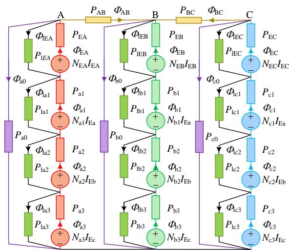  
图3 励磁变的磁等值回路  
Fig. 3 Magnetic equivalent circuit of excitation winding

$P _ { \mathrm { l a } 3 } .$ 、 $P _ { \mathrm { l b } 3 } .$ 、 $P _ { \mathrm { l c } 3 }$ 分别为励磁变二次侧各个绕组的漏磁导， $P _ { \mathrm { a 0 } }$ 、 $P _ { \mathrm { { b 0 } } }$ 、 $P _ { \mathrm { c 0 } }$ 为 A、B、C 三相的零序磁导。

同理，励磁变支路磁通可由绕组电流表示。

$$
\boldsymbol {\Phi} _ {\mathrm {E}} = \boldsymbol {Q} _ {\mathrm {E}} \boldsymbol {N} _ {\mathrm {E}} \boldsymbol {I} _ {\mathrm {E}} \tag {18}
$$

式中： $\pmb { \phi } _ { \mathrm { E } }$ 为励磁变支路磁通矩阵； $N _ { \mathrm { E } }$ 为励磁变绕组匝数矩阵； $\pmb { I } _ { \mathrm { E } }$ 为励磁变绕组电流矩阵； $Q _ { \mathrm { E } } { = } E { - } P _ { \mathrm { E } } A _ { \mathrm { E } }$ $\left( \boldsymbol { A } _ { \mathrm { E } } ^ { \mathrm { T } } \boldsymbol { P } _ { \mathrm { E } } \boldsymbol { A } _ { \mathrm { E } } \right) ^ { - 1 } ;$ ；其中 $P _ { \mathrm { E } }$ 为励磁变支路磁导矩阵； $A _ { \mathrm { E } } ^ { \mathrm { T } }$ 是磁等值回路中各个节点之间的关联矩阵，具体见附录 A1。

将励磁变磁通分为两部分， $\pmb { \phi } _ { \mathrm { E M } }$ 为由流过绕组的磁通所构成的矩阵， $\pmb { \mathcal { O } } _ { \mathrm { E N } }$ 为由未流过绕组的磁通所构成的矩阵，则式(18)可改写为下式：

$$
\left[ \begin{array}{l} \boldsymbol {\Phi} _ {\mathrm {E M}} \\ \boldsymbol {\Phi} _ {\mathrm {E N}} \end{array} \right] = \left[ \begin{array}{l l} \boldsymbol {Q} _ {\mathrm {E M M}} & \boldsymbol {Q} _ {\mathrm {E M N}} \\ \boldsymbol {Q} _ {\mathrm {E N M}} & \boldsymbol {Q} _ {\mathrm {E N N}} \end{array} \right] \left[ \begin{array}{c} \boldsymbol {N} _ {\mathrm {E M}} \boldsymbol {I} _ {\mathrm {E M}} \\ \boldsymbol {0} \end{array} \right] \tag {19}
$$

式中： $Q _ { \mathrm { E M M } }$ 、 $Q _ { \mathrm { E M N } }$ 、 $Q _ { \mathrm { E N M } }$ 、 $\varrho _ { \mathrm { E N N } }$ 为 $Q _ { \mathrm { { F } } }$ 的子矩阵，$N _ { \mathrm { E M } }$ 为 1212 维绕组匝数矩阵， $\pmb { I } _ { \mathrm { E M } }$ 为 121 维绕组电流矩阵，如式(20)所示。

$$
\begin{array}{l} I _ {\mathrm {E M}} = \left[ \begin{array}{l l l l l l} I _ {\mathrm {E A}} & I _ {\mathrm {E B}} & I _ {\mathrm {E C}} & I _ {\mathrm {E a}} & I _ {\mathrm {E a}} & I _ {\mathrm {E a}} \end{array} \right. \\ \left. I _ {\mathrm {E b}} \quad I _ {\mathrm {E b}} \quad I _ {\mathrm {E b}} \quad I _ {\mathrm {E c}} \quad I _ {\mathrm {E c}} \quad I _ {\mathrm {E c}} \right] ^ {\mathrm {T}} \tag {20} \\ \end{array}
$$

由式(19)可得：

$$
\boldsymbol {\Phi} _ {\mathrm {E M}} = \boldsymbol {Q} _ {\mathrm {E M M}} \boldsymbol {N} _ {\mathrm {E M}} \boldsymbol {I} _ {\mathrm {E M}} \tag {21}
$$

根据法拉第电磁感应定律可知：

$$
\boldsymbol {U} _ {\mathrm {E M}} = \boldsymbol {N} _ {\mathrm {E M}} \frac {\mathrm {d} \boldsymbol {\Phi} _ {\mathrm {E M M}}}{\mathrm {d} t} \tag {22}
$$

式中 $U _ { \mathrm { E M } }$ 为 121 维绕组电压矩阵，即

$$
\begin{array}{l} \boldsymbol {U} _ {\mathrm {E M}} = \left[ \begin{array}{l l l l l l} U _ {\mathrm {S A}} & U _ {\mathrm {S B}} & U _ {\mathrm {S C}} & U _ {\mathrm {a 1}} & U _ {\mathrm {b 1}} & U _ {\mathrm {c 1}} \end{array} \right. \\ \left. U _ {\mathrm {a} 2} \quad U _ {\mathrm {b} 2} \quad U _ {\mathrm {c} 2} \quad U _ {\mathrm {a} 3} \quad U _ {\mathrm {b} 3} \quad U _ {\mathrm {c} 3} \right] ^ {\mathrm {T}} \tag {23} \\ \end{array}
$$

但这种形式不够反映励磁变的输入与输出的关系，有必要对其进行修正。

结合励磁变的电压的输入输出关系将式(22)重新整理，得：

$$
\boldsymbol {U} _ {\mathrm {E u}} = \boldsymbol {N} _ {\mathrm {Z}} \frac {\mathrm {d} \boldsymbol {\Phi} _ {\mathrm {E M M}}}{\mathrm {d} t} \tag {24}
$$

式中： $\begin{array} { r l r l r } { U _ { \mathrm { E u } } = [ U _ { \mathrm { S A } } } & { { } U _ { \mathrm { S B } } } & { U _ { \mathrm { S C } } } & { U _ { \mathrm { E a } } } & { { } U _ { \mathrm { E b } } } & { U _ { \mathrm { E c } } ] ^ { \mathrm { T } } ; ~ N _ { \mathrm { Z } } } \end{array}$ 见附录 A2。

用梯形积分定律离散式(24)可得：

$$
N _ {\mathrm {Z}} \boldsymbol {\Phi} _ {\mathrm {E M}} (t) = \frac {\Delta t}{2} \boldsymbol {U} _ {\mathrm {E u}} (t) + \boldsymbol {\Phi} _ {\mathrm {E M}, \text {h i s t}} (t) \tag {25}
$$

$\vec { \pm } \nabla \Psi \bar { \pmb { \mathcal { P } } } _ { \mathrm { E M , h i s t } } ( t ) = \frac { \Delta t } { 2 } { \cal U } _ { \mathrm { E u } } ( t - \Delta t ) + { \cal N } _ { 2 } \bar { \pmb { \mathcal { P } } } _ { \mathrm { E M } } ( t - \Delta t ) \circ$

由式(21)和式(25)可知：

$$
N _ {Z} \boldsymbol {\Phi} _ {\mathrm {E M}} = N _ {Z} \boldsymbol {Q} _ {\mathrm {E M M}} \boldsymbol {N} _ {\mathrm {E M}} \boldsymbol {I} _ {\mathrm {E M}} = \boldsymbol {Z} _ {\mathrm {E M}} \boldsymbol {I} _ {\mathrm {E M}} \tag {26}
$$

式中 ${ \bf { Z } } _ { \mathrm { E M } }$ 为

$$
\mathbf {Z} _ {\mathrm {E M}} = \left[ \begin{array}{c c c c c} Z _ {1 - 1} & Z _ {1 - 2} & \dots & Z _ {1 - 1 1} & Z _ {1 - 1 2} \\ Z _ {2 - 1} & Z _ {2 - 2} & \dots & Z _ {2 - 1 1} & Z _ {2 - 1 2} \\ \cdot & \cdot & \cdot & \cdot & \cdot \\ \cdot & \cdot & \cdot & \cdot & \cdot \\ Z _ {5 - 1} & Z _ {5 - 2} & \dots & Z _ {5 - 1 1} & Z _ {5 - 1 2} \\ Z _ {6 - 1} & Z _ {6 - 2} & \dots & Z _ {6 - 1 1} & Z _ {6 - 1 2} \end{array} \right] \tag {27}
$$

为了将绕组电流整合为励磁变输入与输出的电流，将式(26)整理后可得：

$$
N _ {\mathrm {Z}} \boldsymbol {\Phi} _ {\mathrm {E M}} = \boldsymbol {Z} _ {\mathrm {E}} \boldsymbol {I} _ {\mathrm {E u}} \tag {28}
$$

式中： $\mathbf { Z } _ { \mathrm { E } }$ 为 $6 { \times } 6$ 等效阻抗矩阵，具体见附录 A3，$\boldsymbol { I } _ { \mathrm { E u } } = [ I _ { \mathrm { E A } } \quad I _ { \mathrm { E B } } \quad I _ { \mathrm { E C } } \quad I _ { \mathrm { E a } } \quad I _ { \mathrm { E b } } \quad I _ { \mathrm { E c } } ] ^ { \mathrm { T } } ,$ 。

将式(28)代入式(25)可得：

$$
\boldsymbol {I} _ {\mathrm {E u}} (t) = \boldsymbol {Y} _ {\mathrm {E u}} \boldsymbol {U} _ {\mathrm {E u}} (t) + \boldsymbol {I} _ {\mathrm {E u , h i s t}} (t) \tag {29}
$$

式中： EuY $Y _ { \mathrm { E u } } = \frac { \Delta t } { 2 } { \mathbf { Z } } _ { \mathrm { E u } } ^ { - 1 }$ ， ${ \pmb I } _ { \mathrm { E u , h i s t } } ( t ) = { \pmb Z } _ { \mathrm { E u } } ^ { - 1 } { \pmb \mathcal { \hat { P } } } _ { \mathrm { E M , h i s t } } ( t )$ 。则得到了 TCST 励磁变的电磁暂态模型。

最后，结合其内部连接可得：

$$
\begin{array}{l} \left\{ \begin{array}{l} I _ {\mathrm {S A}} = I _ {\mathrm {E A}} + I _ {\mathrm {L A}} \\ I _ {\mathrm {S B}} = I _ {\mathrm {E B}} + I _ {\mathrm {L B}} \\ I _ {\mathrm {S C}} = I _ {\mathrm {E C}} + I _ {\mathrm {L C}} \end{array} \quad \left\{ \begin{array}{l} U _ {\mathrm {a}} = U _ {\mathrm {E a}} \\ U _ {\mathrm {b}} = U _ {\mathrm {E b}} \\ U _ {\mathrm {c}} = U _ {\mathrm {E c}} \end{array} \right. \right. \tag {30} \\ \left\{ \begin{array}{l l} U _ {\mathrm {L A}} = U _ {\mathrm {S A}} + \Delta U _ {\mathrm {A}} & I _ {\mathrm {a}} = I _ {\mathrm {E a}} \\ U _ {\mathrm {L B}} = U _ {\mathrm {S B}} + \Delta U _ {\mathrm {B}} & I _ {\mathrm {b}} = I _ {\mathrm {E b}} \\ U _ {\mathrm {L C}} = U _ {\mathrm {S C}} + \Delta U _ {\mathrm {C}} & I _ {\mathrm {c}} = I _ {\mathrm {E c}} \end{array} \right. \\ \end{array}
$$

将式(15)(29)(30)联立可得 TCST 的电磁暂态模型，即：

$$
\boldsymbol {I} _ {\mathrm {T C S T}} (t) = \boldsymbol {Y} _ {\mathrm {T C S T}} \boldsymbol {U} _ {\mathrm {T C S T}} (t) + \boldsymbol {I} _ {\mathrm {T C S T}, \text {h i s t}} (t) \tag {31}
$$

式中： $I _ { \mathrm { T C S T } }$ 为 TCST 送端与受端的电流； $U _ { \mathrm { T C S T } }$ 为TCST 送端与受端的电压。

$$
\begin{array}{l} \boldsymbol {U} _ {\mathrm {T C S T}} = \left[ \begin{array}{l l l l l l} U _ {\mathrm {S A}} & U _ {\mathrm {S B}} & U _ {\mathrm {S C}} & U _ {\mathrm {L A}} & U _ {\mathrm {L B}} & U _ {\mathrm {L C}} \end{array} \right] ^ {\mathrm {T}} (32) \\ \boldsymbol {I} _ {\mathrm {T C S T}} = \left[ \begin{array}{l l l l l l} I _ {\mathrm {S A}} & I _ {\mathrm {S B}} & I _ {\mathrm {S C}} & I _ {\mathrm {L A}} & I _ {\mathrm {L B}} & I _ {\mathrm {L C}} \end{array} \right] ^ {\mathrm {T}} (33) \\ \end{array}
$$

# 2.3 解析计算流程

通过计算 TCST 内部各个参数[24-25]，构建 TCST的电磁暂态模型，并将其与线路联立，便可进行解

析计算。图 4 为解析计算流程。

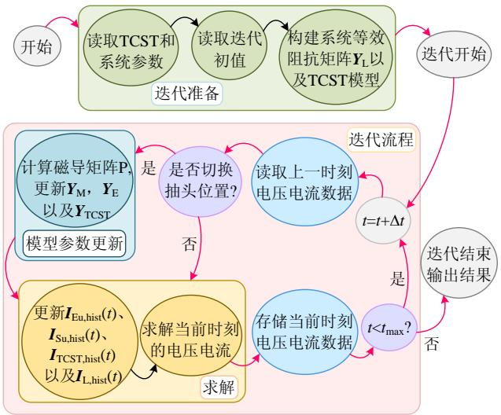  
图4 解析计算流程图  
Fig. 4 Flowchart of the analytical calculation

在解析计算中，外部电气系统模型如式(34)所示。

$$
\boldsymbol {I} _ {\mathrm {L}} (t) = \boldsymbol {Y} _ {\mathrm {L}} \boldsymbol {U} _ {\mathrm {L}} (t) + \boldsymbol {I} _ {\mathrm {L}, \text {h i s t}} (t) \tag {34}
$$

式中： $\scriptstyle { I _ { \mathrm { L } } }$ 为系统电流矩阵； $U _ { \mathrm { L } }$ 为系统电压矩阵； ${ \cal I } _ { \mathrm { L , h i s t } }$ 为由上个计算时刻的系统电流和电压组成的常量矩阵； $Y _ { \mathrm { L } }$ 为系统导纳矩阵。

此外，为了抑制仿真结果中由于抽头切换而产生的不真实的数值振荡，采用临界阻尼调整法(critical damping adjustment，CDA)[25-26]来消除数值振荡。

# 3 算例分析

含TCST的电气系统如图5所示，其主要参数见附录表A1。 $U _ { n } ( n { = } \mathbf { A } , \mathbf { B } , \mathbf { C } )$ 为系统送端电压， $U _ { \mathrm { r } n } ( n { = } \mathrm { A } ,$ B, C)为系统受端电压， $U _ { \mathrm { S } n } ( n { = } \mathbf { A } , \mathbf { B } , \mathbf { C } )$ 为 TCST 送端电压， $U _ { \mathrm { L } n } ( n { = } \mathbf { A } , \mathbf { B } , \mathbf { C } )$ 为TCST受端电压， $Z _ { \mathrm { S } n } ( n { = } \mathrm { A } ,$ B,C)为系统送端等效阻抗， $Z _ { \mathrm { L } n } ( n { = } \mathrm { A } , \ \mathrm { B } , \ \mathrm { C } )$ 为输电线路阻抗， $Z _ { \mathrm { r } n } ( n { = } \mathbf { A } , \mathbf { B } , \mathbf { C } )$ 为系统受端等效阻抗。

用于计算系统受端的暂态有功功率和无功功率的方程如下[22]：

$$
P _ {\mathrm {r}} = \left(U _ {\mathrm {r A}} I _ {\mathrm {L A}} + U _ {\mathrm {r B}} I _ {\mathrm {L B}} + U _ {\mathrm {r C}} I _ {\mathrm {L C}}\right) \tag {35}
$$

$$
Q _ {\mathrm {r}} = \sqrt {3} \left(U _ {\mathrm {r A}} I _ {\mathrm {L C}} - U _ {\mathrm {r C}} I _ {\mathrm {L A}}\right) \tag {36}
$$

在无补偿模式下， $P _ { \mathrm { ~ r ~ } }$ 和 $Q _ { \mathrm { r } }$ 为基准功率，并用$P _ { \mathrm { ~ n ~ } }$ 和 $Q _ { \mathrm { n } }$ 表示。

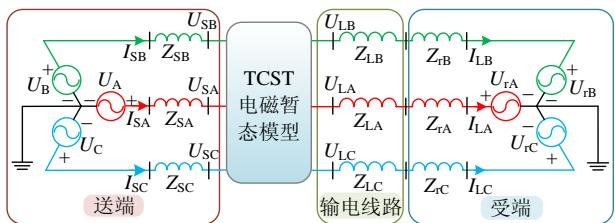  
图5 含TCST 的电气系统示意图  
Fig. 5 Schematic diagram of electrical system with TCST

同时，在 PSCAD/EMTDC 中，采用 12 个单相双绕组变压器建立了 TCST 的模型，并在算例中与所提模型计算结果进行对比。

针对所提 TCST 暂态模型，本文开展了如下实验，分别为：

1）模型有效性验证。调节 TCST 的补偿电压DU，使其补偿角在 $0 ^ { \circ }$ 到 360°之间变化，其幅值分别为 0.1、0.2、0.3 和 0.4pu，每次调整约 15°，并记录各个补偿电压的稳态功率和内部电压电流，并与 PSCAD/EMTDC 仿真结果进行对比。  
2）双芯结构影响分析。按给定方式调节 TCST补偿电压DU，并记录其暂态响应，并与现有 SCST仿真结果进行对比。  
3）潮流调节性能对比。在 IEEE2 机 5 节点系统中，根据给定的潮流目标进行潮流调控；并将含TCST 的系统的潮流暂态响应结果与含 UPFC 的系统的结果进行对比。

同时为了简化计算，在本文的实验中，将铁芯磁导率视为常数。TCST的铁芯材料皆视为硅钢片，其相对磁导率 $\mu _ { \mathrm { r } } { = } 1 0 0 0 0 ^ { [ 2 7 ] }$ 。

# 3.1 算例 1：模型有效性验证

为了验证本文所提 TCST 模型的有效性，参考文献[22]的调节方式设置，TCST的补偿电压DU幅值分别设置为 0.1、0.2、0.3、0.4pu，相角 $\beta \notin 0 ^ { \circ }$ 到 $3 6 0 ^ { \circ } .$ 之间变化，每次调整补偿电压相角约 $1 5 ^ { \circ } .$ 。以补偿 $0 . 4 \mathrm { p u } \angle 6 0 ^ { \circ }$ 为例，其解析计算得到的电压、电流波形与仿真结果对比如图 6—7 所示。

由图 6—7 对比可见，所提模型和 PSCAD仿真结果基本一致，验证了模型的有效性。但是由本文所提模型计算而来的受端三相电流存在一定的不对称的情况，这是由于TCST内部铁芯磁路不对称，

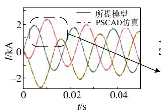

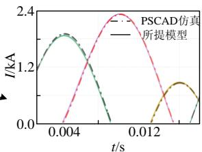

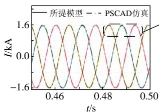  
(a) 暂态过渡波形对比

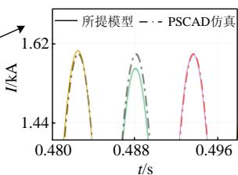  
(b) 稳态波形对比   
图6 受端三相电流 $\scriptstyle { I _ { \mathrm { L } } }$ 对比  
Fig. 6 Comparison of the current $\scriptstyle { I _ { \mathrm { L } } }$ at the receiving end

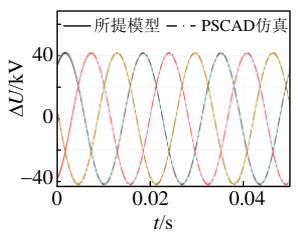  
(a) 暂态过渡波形对比

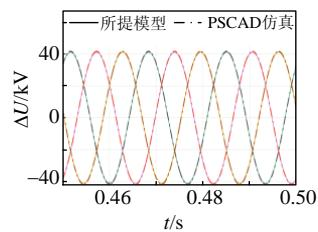  
(b) 稳态波形对比   
图7 补偿电压DU 对比  
Fig. 7 Comparison of compensating voltage DU

进而引起三相电流的不对称。而 PSCAD 中的模型由多个单相双绕组变压器组合而成，没有考虑铁芯结构和多绕组耦合的影响。这也进一步说明了本文所提模型能够反映由铁芯不对称和多绕组之间的耦合效应所带来的不对称现象，相比 PSCAD 中的模型具有更高的精确度。

同时，为了研究 TCST的外部运行特性，随补偿电压相角与幅值变化的受端稳态有功功率 $P _ { \mathrm { ~ r ~ } }$ 和稳态无功功率 $Q _ { \mathrm { r } }$ 如图 8所示。

由图 8 可见，随着相位角的变化，有功功率$P _ { \mathrm { ~ r ~ } }$ 呈现出先增后减的趋势，当 $\beta { = } 6 0 ^ { \circ }$ 时， $P _ { \mathrm { ~ r ~ } }$ 达到最大值，当 $\beta { = } 2 4 0 ^ { \circ }$ 时， $P _ { \mathrm { { r } } }$ 达到最小值；而无功功率$Q _ { \mathrm { r } }$ 则是呈先减后增的趋势，当 $\beta { = } 0 ^ { \circ }$ 时， $Q _ { \mathrm { r } }$ 达到最大值，当 $\beta { = } 1 8 0 ^ { \circ }$ 时， $Q _ { \mathrm { r } }$ 达到最小值，而且随着补偿电压DU 的幅值不断增大， $P _ { \mathrm { ~ r ~ } }$ 和 $Q _ { \mathrm { r } }$ 相较于 $P _ { \mathrm { ~ n ~ } }$ 和 $Q _ { \mathrm { n } }$ 的变化也越来越大。从整体功率分布来看，TCST 的功率调节域近似为以基准功率为中心的六边形，说明 TCST 能够实现功率的四象限调节。同时，由于TCST 本质为离散调节，在调节过程中必然会产生一定的误差。为了减小误差，充分发挥其调节作用，在分接开关位置的选择上，可根据补偿点的分布计算误差最小的补偿点来确认最佳的分接开关位置[21]，也可在线路中加入具有无差调节能力的潮流控制器，由 TCST完成较大范围的调节，由其他的潮流控制器来完成消除误差的工作[28-29]。

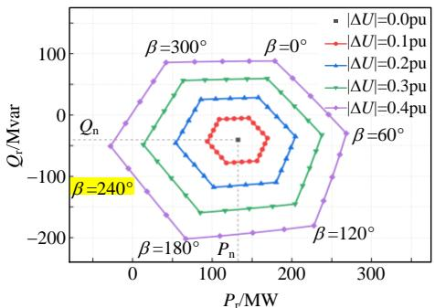  
图8 不同补偿电压下的受端有功功率 $P _ { \mathbf { r } }$ 和无功功率 $\varrho _ { \mathrm { r } }$   
Fig. 8 Active power $P _ { \mathbf { r } }$ and reactive power $\varrho _ { \mathrm { r } }$ at receiving end for various compensating voltages

# 3.2 算例 2：双芯结构影响分析

为了比较 TCST 与 SCST 在运行特性方面的差

异，参考文献[21]对 SCST的实验方案，TCST 在第5s 时开始调节，并逐步调节补偿电压 $\Delta U$ 至$0 . 2 \mathrm { p u } \angle 3 0 0 ^ { \circ }$ ，到14s时将补偿目标改为 $0 . 2 \mathrm { p u } \angle 2 4 0 ^ { \circ }$ ，最后，在 23s 时，将补偿目标调整为 0.4pu∠240°。文献[21]的暂态响应结果与本文所提模型计算结果对比如图 9—11 所示。

图 9 为系统受端的有功功率 $P _ { \mathrm { ~ r ~ } }$ 和无功功率 $Q _ { \mathrm { r } }$ 暂态响应。与文献[21]结果对比可见，TCST 的外部功率特性与 SCST 基本一致。同时，TCST 功率调节是阶梯式变化，在调节过程中，功率能很快稳定在所需的功率点，能够有效的实现功率调节。

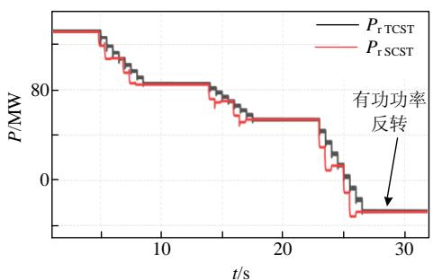

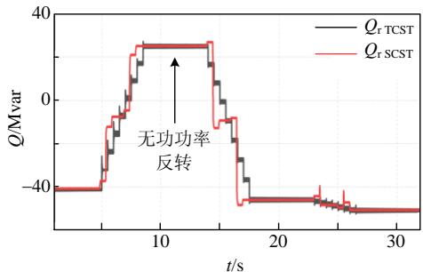  
图 9 $P _ { \mathbf { r } }$ 和 $Q _ { \mathrm { r } }$ 暂态响应  
Fig. 9 Transient response of $P _ { \mathbf { r } }$ and $\varrho _ { \mathrm { r } }$

图 10 为 TCST 开始补偿后流过励磁变 A 相副边分接开关的电流 $I _ { \mathrm { a \ T C S T } }$ 的暂态响应。与文献[21]结果对比可见， $I _ { \mathrm { a ~ T C S T } }$ 小于流过 SCST 的分接开关的电流 $I _ { \mathrm { L A ~ S C S T } }$ ，在本文的实验中，约为 $I _ { \mathrm { L A ~ S C S T } }$ 的50%。说明TCST 对分接开关具有一定的保护作用，能减小流过分接开关的电流，有效降低了外部故障所引起的过电流对绕组抽头的影响。

图11为TCST的补偿电压 $\Delta U$ 在调节过程中的暂态响应。与文献[21]结果对比可见，TCST 能够产生与 SCST 几乎一致的补偿电压，但是在 0.05pu 的调节步长上，SCST只需要进行4次抽头变化，TCST

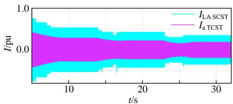  
图 10 ${ \cal I } _ { \bf a T C S T }$ 暂态响应  
Fig. 10 Transient response of ${ \pmb I } _ { \bf a T C S T }$

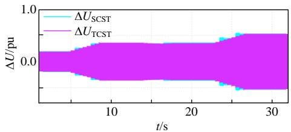  
图 11 DU 暂态响应  
Fig. 11 Transient response of DU

则需要8次抽头变化，调节时间也比SCST要更长。相比于 SCST，TCST 在线路中产生的补偿电压DU步长更低，约为 SCST 的 50%，使得其拥有更高的调节精度，但是受限于分接开关的调节机制，在同样的补偿目标下，TCST 分接开关所需调节的次数更多。

# 3.3 算例 3：潮流调节性能对比

为了对比TCST和UPFC在潮流调控特性上的差异，在 IEEE2 机 5 节点系统中，如图 12 所示，参照文献[29]进行了如下实验：将 TCST 或 UPFC置于节点3与节点4之间的线路，并加入节点6用于测量装置受端的瞬时功率。在5s前，系统处于稳态，TCST和UPFC均处于无补偿的状态；5s后，设置补偿目标并开始调节：有功功率目标为 38.90MW，无功功率目标为 7.13Mvar，并记录节点 6 功率的暂态响应。其对比图如图 13所示。

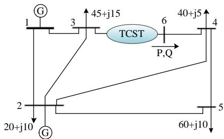  
图12 含潮流控制器的IEEE5 节点系统

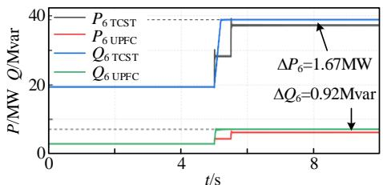  
Fig. 12 IEEE5 bus system with power flow controller   
图13 节点6功率暂态响应  
Fig. 13 Transient response of power at BUS 6

由图 13 可见，UPFC 调节为连续调节，调节速度较快，于5.2s完成调节，而且调节没有误差；TCST调节为离散调节，调节速度较慢，于 5.5s 完成调节，调节完成后的稳态功率与目标存在一定的误差，误差为 1.67MW 和 0.92Mvar。由上述比较可见，相较于 UPFC，TCST 调节较慢，且不能做到无差调节，但产生的误差在可接受范围内。造成上述差异原因

是由于 UPFC 是基于电力电子开关和 PWM 原理的潮流控制器，能够根据目标的变化，连续调节补偿电压，使得误差为 0，实现无差调节；而 TCST 是基于变压器原理和有载分接开关调节的潮流控制器，其调节精度和速度受限于分接开关的步进电压以及切换速度。但相较于 UPFC，TCST 成本要低的多，且损耗低，寿命长，可靠性更高。在控制精度以及调节速度要求不高的场景下，TCST 适用性要更好。

# 4 结论

本文提出一种基于UMEC的TCST电磁暂态模型，借助 MATLAB 和 PSCAD/EMTDC 进行了解析计算和验证，并与现有 SCST 时域仿真结果，UPFC潮流调节仿真结果进行了对比和分析。结论如下：

1）本文所提基于 UMEC 的 TCST 电磁暂态模型能够考虑其内部铁芯结构，磁路的不对称以及相间绕组耦合的影响，相较于 PSCAD 中由多个单相变压器组合而成的TCST模型，具有更高的精确度。  
2）TCST 能够使分接开关从线路中隔离开来，使其流过抽头的电流相比于 SCST 大幅降低，在本文的参数下，降低幅度约为 50%，说明这种设计能够有效降低由于外部故障所引起的过电流对分接开关影响的风险。  
3）在采用相同分接头调压步长的情况下，由于 TCST 的实际调节步长相比于 SCST 要更小，使得其精度更高，但是 TCST 所需调节次数更多。

附 录 见 本 刊 网 络 版 (http://www.dwjs.com.cn/CN/1000-3673/current.shtml)。

# 参考文献

[1] 张振宇，王文倬，马晓伟，等．基于风险控制的新能源纳入电力系统备用方法[J]．电网技术，2020，44(9)：3375-3382  
ZHANG Zhenyu，WANG Wenzhuo，MA Xiaowei，et al．Reserve of power system considering renewable energy based on risk control[J] Power System Technology，2020，44(9)：3375-3382(in Chinese)   
[2] 李亦凡，房鑫炎，王波，等．计及节点脆弱程度的新能源消纳能力风险评估[J]．电网技术，2020，44(12)：4479-4485  
LI Yifan，FANG Xinyan，WANG Bo，et al．Risk assessment of new energy consumption capacity considering node vulnerability[J] Power System Technology，2020，44(12)：4479-4485(in Chinese)   
[3] 张尚，王涛，顾雪平，等．基于输电网结构优化的电网安全均匀调度[J]．电网技术，2017，41(9)：2957-2963  
ZHANG Shang，WANG Tao，GU Xueping，et al．Power grid homogeneous dispatch based on transmission topology optimization [J]．Power System Technology，2017，41(9)：2957-2963(in Chinese)   
[4] 黎上强，乔颖，徐曼，等．新能源柔直汇集系统的分层多目标安全裕度优化[J]．电网技术，2020，44(12)：4513-4520  
LI Shangqiang ， QIAO Ying ， XU Man ， et al ． Hierarchical multi-objective safety margin optimization of renewable energy island collecting delivery system by VSC-HVDC[J] ． Power System

Technology，2020，44(12)：4513-4520(in Chinese)  
[5] 任必兴，杜文娟，王海风，等．UPFC与同步机轴系的强动态相互作用机理及影响评估[J]．中国电机工程学报，2020，40(4)：1117-1129  
REN Bixing，DU Wenjuan，WANG Haifeng，et al．Mechanism andimpact evaluation of strong dynamic interaction between upfc andgenerator shaft[J] ． Proceedings of the CSEE ， 2020 ， 40(4) ：1117-1129(in Chinese)  
[6] WANG L，VO Q S．Power flow control and stability improvement of connecting an offshore wind farm to a one-machine infinite-bus system using a static synchronous series compensator[J] ． IEEE Transactions on Sustainable Energy，2013，4(2)：358-369   
[7] 杨健，洪潮，周保荣，等．受端弱系统条件下 STATCOM 提升直流输电能力机理研究[J]．中国电机工程学报，2019，39(17)：5005-5014  
YANG Jian，HONG Chao，ZHOU Baorong，et al．Study on mechanism of STATCOM improving the transmission capability of HVDC connected to weak AC system[J]．Proceedings of the CSEE， 2019，39(17)：5005-5014(in Chinese)   
[8] SEN K K，SEN M L．Introducing the family of "Sen" transformers： a set of power flow controlling transformers[J]．IEEE Transactions on Power Delivery，2003，18(1)：149-157   
[9] SEN K K，SEN M L．Comparison of the "Sen" transformer with theunified power flow controller[J] ． IEEE Transactions on PowerDelivery，2003，18(4)：1523-1533  
[10] 谭振龙，张春朋，姜齐荣，等．旋转潮流控制器与统一潮流控制器和 Sen Transformer 的对比[J]．电网技术，2016，40(3)：868-874TAN Zhenlong ， ZHANG Chunpeng ， JIANG Qirong ， et alComparative research on rotary power flow controller，unified powerflow controller and Sen transformer[J]．Power System Technology，2016，40(3)：868-874(in Chinese)  
[11] 姚尧，邱昊，陈柏超，等．一种新型统一潮流控制器[J]．电力系统自动化，2008，32(16)：78-82  
YAO Yao，QIU Hao，CHEN Baichao，et al．A novel unified power flow controller[J]．Automation of Electric Power Systems，2008， 32(16)：78-82(in Chinese)   
[12] 陈柏超，曾永胜，刘俊博，等．基于 Sen Transformer 的新型统一潮流控制器的仿真与实验[J]．电工技术学报，2012，27(3)：233-238CHEN Baichao，ZENG Yongsheng，LIU Junbo，et al．Simulation andexperimental research of a novel unified power flow controller basedon Sen transformer[J] ． Transactions of China ElectrotechnicalSociety，2012，27(3)：233-238(in Chinese)  
[13] 贵州大学．变压器副边绕组反相的少级数特征潮流控制装置与方法：105262079A[P]．2016-01-20  
[14] 冯金铃，韩松，潘宇航．适用于统一迭代潮流计算的扩展型“Sen”变压器模型[J]．电力系统保护与控制，2020，48(21)：41-48  
FENG Jinling，HAN Song，PAN Yuhang．Modelling of extended Sen transformer for a unified iterative power flow solution[J]．Power System Protection and Control，2020，48(21)：41-48(in Chinese)   
[15] KUMARI D，CHATTOPADHYAY S K，VERMA A．Improvement of power flow capability by using an alternative power flow controller[J]．IEEE Transactions on Power Delivery，2020，35(5)： 2353-2362．   
[16] IMDADULLAH，AMRR S M，ASGHAR M S J，et al．A comprehensive review of power flow controllers in interconnected power system networks[J]．IEEE Access，2020，8：18036-18063   
[17] IEC ． Guide for the application ， specification ， and testing ofphase-shifting transformers：IEC 62032：2012(E)[S]，2012  
[18] KORAB R ， OWCZAREK R ． Application of phase shifting

transformers in the tie-lines of interconnected power systems[J] Przegląd Elektrotechniczny，2015，91(8)：166-170   
[19] REDDY T，GULATI A，KHAN M I，et al．Application of phase shifting transformer in Indian power system[J]．International Journal of Computer and Electrical Engineering，2012，4(2)：242-245   
[20] HRAÏECH A E，BEN-KILANI K，ELLEUCH M．Control of parallel EHV interconnection lines using Phase Shifting Transformers[C]// 2014 IEEE 11th International Multi-Conference on Systems，Signals & Devices (SSD14)．Barcelona：IEEE，2014：1-7   
[21] FARUQUE M O，DINAVAHI V．A tap-changing algorithm for theimplementation of “Sen” transformer[J]．IEEE Transactions on PowerDelivery，2007，22(3)：1750-1757  
[22] ASGHARI B，FARUQUE M O，DINAVAHI V．Detailed real-timetransient model of the "Sen" transformer[J]．IEEE Transactions onPower Delivery，2008，23(3)：1513-1521．  
[23] JIADAI L，DINAVAHI V．Nonlinear magnetic equivalent circuitbased real-time Sen transformer electromagnetic transient model on FPGA for HIL emulation[J]．IEEE Transactions on Power Delivery， 2016，31(6)：2483-2493   
[24] 潘宇航，韩松，冯金铃．考虑多绕组耦合的 Sen Transformer 电磁解析模型[J]．高电压技术，2020，46(6)：2131-2138  
PAN Yuhang，HAN Song，FENG Jinling．Electromagnetic analytical model of Sen transformer considering multi-winding coupling[J] High Voltage Engineering，2020，46(6)：2131-2138(in Chinese)   
[25] MARTI J R，LIN J．Suppression of numerical oscillations in the EMTP power systems[J]．IEEE Transactions on Power Systems， 1989，4(2)：739-747．   
[26] 王永，李强，冯书阅，等．基于改进临界阻尼调整法的电磁暂态仿真算法[J]．电力系统自动化，2019，43(15)：180-185  
WANG Yong，LI Qiang，FENG Shuyue，et al．Electromagnetic transient simulation algorithm based on improved critical damping adjustment[J]．Automation of Electric Power Systems，2019，43(15)： 180-185(in Chinese)   
[27] HIROSATO S，YAMAZAKI K，HARAGUCHI Y，et al．Design and construction method of an open-type magnetically shielded room for MRI composed of magnetic square cylinders[J]．IEEE Transactions on Magnetics，2009，45(10)：4636-4639   
[28] 陈柏超，刘雷，余梦泽，等．电磁混合式潮流控制器本体优化及控制[J]．高电压技术，2017，43(4)：1086-1094  
CHEN Baichao，LIU lei，YU Mengze，et al．Ontology optimization and control strategy of electromagnetic hybrid power flow controller[J]．High Voltage Engineering，2017，43(4)：1086-1094(in Chinese)．   
[29] MOHAMED S E G，JASNI J，RADZI M A M，et al．Implementation of the power transistor-assisted Sen transformer in steady-state load flow analysis[J]．IET Generation，Transmission & Distribution，2018， 12(18)：4182-4193

在线出版日期：2021-05-26。

收稿日期：2021-01-15。

作者简介：

卜亮(1996)，男，硕士研究生，研究方向为柔性输电技术，E-mail：fengde556@163.com；

韩松(1978)，通信作者，男，教授，硕士生导师，研究方向为交直流电力系统分析、新型电力电子装备以及配电网规划，E-mail：shan@gzu.edu.cn。

（实习编辑 李健一）

# 附录 A

表A1 TCST 和电气系统主要参数设置  
Table 1 Parameter setting of TCST and main component of the electrical system   

<table><tr><td>系统参数</td><td>数值</td></tr><tr><td>基准容量和基准电压</td><td>160MW, 138kV</td></tr><tr><td>送端线电压标幺值</td><td>1∠0°</td></tr><tr><td>受端线电压标幺值</td><td>1∠-20°</td></tr><tr><td>送端等效电源的串联阻抗</td><td>1.0053Ω, 19.17mH</td></tr><tr><td>受端等效电源的串联阻抗</td><td>0Ω, 0mH</td></tr><tr><td>输电线路阻抗</td><td>4.8013Ω, 106.59mH</td></tr><tr><td>TCST 原边漏抗</td><td>0.25mH</td></tr><tr><td>TCST 副边漏抗</td><td>0.08mH</td></tr><tr><td>励磁变铁芯长度/m</td><td>7.18</td></tr><tr><td>励磁变铁芯横截面积/m²</td><td>0.454</td></tr><tr><td>励磁变铁轭长度/m</td><td>2.66</td></tr><tr><td>励磁变铁轭横截面积/m²</td><td>0.454</td></tr><tr><td>串联变铁芯长度/m</td><td>3.59</td></tr><tr><td>串联变铁芯横截面积/m²</td><td>0.454</td></tr><tr><td>串联变铁轭长度/m</td><td>2.66</td></tr><tr><td>串联变铁轭横截面积/m²</td><td>0.454</td></tr><tr><td>励磁变原边匝数</td><td>64</td></tr><tr><td>励磁变副边匝数</td><td>52</td></tr><tr><td>串联变原边匝数</td><td>36</td></tr><tr><td>串联变副边匝数</td><td>18</td></tr><tr><td>双芯 ST 分接头数</td><td>17</td></tr><tr><td>TCST 分接头调压档位/步长标幺值</td><td>0.05</td></tr><tr><td>TCST 分接头最高档位标幺值</td><td>0.8</td></tr><tr><td>分接头动作时间(挡)/s</td><td>0.5</td></tr><tr><td>迭代计算步长/s</td><td>5×10^-5</td></tr></table>

励磁变绕组矩阵 $N _ { \mathrm { { Z } } } { \mathrm { { ; } } }$ ：

$$
N _ {Z} = \left[ \begin{array}{c c c c c c} N _ {\mathrm {E A}} & 0 & 0 & 0 & 0 & 0 \\ 0 & N _ {\mathrm {E B}} & 0 & 0 & 0 & 0 \\ 0 & 0 & N _ {\mathrm {E C}} & 0 & 0 & 0 \\ 0 & 0 & 0 & N _ {\mathrm {a l}} & 0 & 0 \\ 0 & 0 & 0 & N _ {\mathrm {b l}} & 0 & 0 \\ 0 & 0 & 0 & N _ {\mathrm {c l}} & 0 & 0 \\ 0 & 0 & 0 & 0 & N _ {\mathrm {a} 2} & 0 \\ 0 & 0 & 0 & 0 & N _ {\mathrm {b} 2} & 0 \\ 0 & 0 & 0 & 0 & N _ {\mathrm {c} 2} & 0 \\ 0 & 0 & 0 & 0 & 0 & N _ {\mathrm {a} 3} \\ 0 & 0 & 0 & 0 & 0 & N _ {\mathrm {b} 3} \\ 0 & 0 & 0 & 0 & 0 & N _ {\mathrm {c} 3} \end{array} \right] \tag {A2}
$$

励磁变磁等值回路节点关联矩阵 $A _ { \mathrm { E } } ^ { \mathrm { T } }$ ：

$$
\boldsymbol {A} _ {\mathrm {E}} ^ {\mathrm {T}} = \left[ \begin{array}{c c c c c c c c c c c} 1 & 0 & 0 & - 1 & 0 & 0 & 0 & 0 & 0 & 0 & 0 \\ 0 & - 1 & 0 & 0 & 1 & 0 & 0 & 0 & 0 & 0 & 0 \\ 0 & 0 & 1 & 0 & 0 & - 1 & 0 & 0 & 0 & 0 & 0 \\ 0 & 0 & 0 & 1 & 0 & 0 & - 1 & 0 & 0 & 0 & 0 \\ 0 & 0 & 0 & 0 & - 1 & 0 & 0 & 1 & 0 & 0 & 0 \\ 0 & 0 & 0 & 0 & 0 & 1 & 0 & 0 & - 1 & 0 & 0 \\ 0 & 0 & 0 & 0 & 0 & 0 & 1 & 0 & 0 & - 1 & 0 \\ 0 & 0 & 0 & 0 & 0 & 0 & 0 & - 1 & 0 & 0 & 1 \\ 0 & 0 & 0 & 0 & 0 & 0 & 0 & 0 & 1 & 0 & - 1 \\ 0 & 0 & 0 & 0 & 0 & 0 & 0 & 0 & 0 & 1 & 0 \\ 0 & 0 & 0 & 0 & 0 & 0 & 0 & 0 & 0 & - 1 & 0 \\ 0 & 0 & 0 & 0 & 0 & 0 & 0 & 0 & 0 & 0 & 1 \\ - 1 & 1 & 0 & 0 & 0 & 0 & 0 & 0 & 0 & 0 & 0 \\ 0 & 1 & - 1 & 0 & 0 & 0 & 0 & 0 & 0 & 0 & 0 \\ - 1 & 0 & 0 & 0 & 0 & 0 & 0 & 0 & 0 & 0 & 0 \\ 0 & - 1 & 0 & 0 & 0 & 0 & 0 & 0 & 0 & 0 & 0 \\ 0 & 0 & - 1 & 0 & 0 & 0 & 0 & 0 & 0< fcel>- \frac {1}{2} \times \frac {1}{2} \times \frac {1}{2} \times \frac {1}{2} \times \frac {1}{2} \times \frac {1}{2} \times \frac {1}{2} \times \frac {1}{2} \times \frac {1}{2} \times \frac {1}{2} \times \frac {1}{2} \times \frac {1}{2} \times \\ - \frac {1}{2} \times \frac {1}{2} \times \frac {1}{2} \times \frac {1}{2} \times \frac {1}{2} \times \frac {1}{2} \times \frac {1}{2} \times \frac {1}{2} \times \frac {1}{2} \times \frac {1}{2} \times \frac {1}{2} \times
$$

66 等效阻抗矩阵 $\mathbf { Z } _ { \mathrm { E } }$

$$
\mathbf {Z} _ {\mathrm {E}} = \left( \begin{array}{l l l l l l} Z _ {1 - 1} & Z _ {1 - 2} & Z _ {1 - 3} & Z _ {1 - 4} + Z _ {1 - 5} + Z _ {1 - 6} & Z _ {1 - 7} + Z _ {1 - 8} + Z _ {1 - 9} & Z _ {1 - 1 0} + Z _ {1 - 1 1} + Z _ {1 - 1 2} \\ Z _ {2 - 1} & Z _ {2 - 2} & Z _ {2 - 3} & Z _ {2 - 4} + Z _ {2 - 5} + Z _ {2 - 6} & Z _ {2 - 7} + Z _ {2 - 8} + Z _ {2 - 9} & Z _ {2 - 1 0} + Z _ {2 - 1 1} + Z _ {2 - 1 2} \\ Z _ {3 - 1} & Z _ {3 - 2} & Z _ {3 - 3} & Z _ {3 - 4} + Z _ {3 - 5} + Z _ {3 - 6} & Z _ {3 - 7} + Z _ {3 - 8} + Z _ {3 - 9} & Z _ {3 - 1 0} + Z _ {3 - 1 1} + Z _ {3 - 1 2} \\ Z _ {4 - 1} & Z _ {4 - 2} & Z _ {4 - 3} & Z _ {4 - 4} + Z _ {4 - 5} + Z _ {4 - 6} & Z _ {4 - 7} + Z _ {4 - 8} + Z _ {4 - 9} & Z _ {4 - 1 0} + Z _ {4 - 1 1} + Z _ {4 - 1 2} \\ Z _ {5 - 1} & Z _ {5 - 2} & Z _ {5 - 3} & Z _ {5 - 4} + Z _ {5 - 5} + Z _ {5 - 6} & Z _ {5 - 7} + Z _ {5 - 8} + Z _ {5 - 9} & Z _ {5 - 1 0} + Z _ {5 - 1 1} + Z _ {5 - 1 2} \\ Z _ {6 - 1} & Z _ {6 - 2} & Z _ {6 - 3} & Z _ {6 - 4} + Z _ {6 - 5} + Z _ {6 - 6} & Z _ {6 - 7} + Z _ {6 - 8} + Z _ {6 - 9} & Z _ {6 - 1 0} + Z _ {6 - 1 1} + Z _ {6 - 1 2} \end{array} \right) \tag {A3}
$$