# 模块化多电平换流器高效建模方法研究综述

许建中1, 李承昱1, 熊岩1, 姬煜轲1, 赵成勇1, 安婷2

(1.新能源电力系统国家重点实验室(华北电力大学)，北京市昌平区102206;2.国网智能电网研究院，北京市昌平区102211)

A Review of Efficient Modeling Methods for Modular Multilevel Converters  
XU Jianzhong1, LI Chengyu1, XIONG Yan1, JI Yuke1, ZHAO Chengyong1, AN Ting2

(1. State Key Laboratory of Alternate Electrical Power System with Renewable Energy Sources (North China Electric Power University), Changping District, Beijing 102206, China;

2. State Grid Smart Grid Research Institute, Changping District, Beijing 102211, China)

ABSTRACT: The modular multilevel converter (MMC) based HVDC system has shown its significant project prospects, hence the efficient modeling method of MMC is the basis for a series of theoretical and engineering studies. This paper respectively focused on different time scales and application scenarios to summarize the state of the art literatures of this field methodically, and then to explore the cutting-edge research to show the core issues and concerns in the MMC modeling area. The recent achievements on electromagnetic transient (EMT) accurate MMC models, i.e. the controlled sources based universal accelerated MMC model and the Thévenin equivalent integral MMC model based on the backward Euler method and the trapezoidal rule were rigorously and horizontally compared and validated. Then the applicability of the proposed simplified averaged-value MMC model under severe AC and DC transients were validated and the usage scenarios were pointed out. Finally, this paper introduces the main features of the electromechanical transient MMC model and the real time simulation models, then points out that both models have very good research and application prospects.

KEY WORDS: modular multilevel converter; electromagnetic transient; controlled source based model; Thévenin equivalent model; averaged-value model

摘要：模块化多电平换流器(modular multilevel converter,

MMC)已经展现出极其重要的工程应用前景，MMC的高效建模方法是开展一系列理论性和工程性问题研究的基础。文中分别针对不同时间尺度和不同的应用场景，对国内外已有的涉及到MMC建模的主要文献进行条分缕析式地整理归纳，进而探索该领域的研究前沿和关注的核心问题。对所提出的3种微秒级电磁暂态精确模型，也即基于受控源的MMC通用提速模型和基于后退欧拉法和梯形法的MMC戴维南等效整体模型进行了严格的横向对比和仿真验证；同时，针对所提出的电磁暂态平均简化模型，验证了其在仿真严重交直流暂态过程中的适用性，分析其适用场景和使用方法。最后，文中介绍了MMC机电暂态模型和实时仿真模型的主体思想，并指出二者具有很好的研究和应用前景。

关键词：模块化多电平换流器；电磁暂态；受控源模型；戴维南等效模型；平均值模型

# 0 引言

模块化多电平换流器(modular multilevel converter, MMC)已成为柔性直流输电系统的首选换流器拓扑[1-7]。我国已建成的上海南汇柔性直流工程[1]、南澳三端柔性直流工程[2]、舟山五端柔性直流输电工程[3]以及正在建设中的厦门柔性直流工程[4]都采用MMC结构。国际上SIEMENS已建成的美国跨湾工程(Trans Bay Cable Project, TBC)[5]和法国—西班牙联网工程(INELFE工程)[6]都采用MMC结构。同时，ABB公司提出了一种级联两电平结构(cascaded two level, CTL)，其本质仍为MMC，并且ABB后续建设的数项柔性直流工程都采用CTL结构[7]。因此，MMC已由最初的低压、小容量示范工程向高电压、大容量方向快速发展，展现出很好的发展前景。

然而，高电压、大容量、超大规模MMC高效建模受限于建模方法、数学理论、等效实验方法和计算机硬件等众多限制[5-9]，严重制约着相关领域的快速发展[10-12]。因此，建立MMC的数学和仿真模型能反映换流器的一般运行规律，对研究柔性直流输电系统运行特性、主电路参数的选取以及控制保护系统的设计具有重要的指导作用[13-14]，开展不同时间尺度的MMC电磁暂态建模方法的研究，在保证仿真精度的前提下研究极大地提高MMC仿真效率的理论和方法，提出适用于不同应用场景的MMC高效仿真模型，具有重要的理论和工程意义。

MMC系统的仿真分析，较之现场试验具有良好的可控性、无破坏性和经济性，对验证控制系统的有效性及进行工程方案的比较等方面发挥着重要作用，为工程调试奠定了基础。目前对MMC的仿真研究按仿真计算同实际过程的时间比例主要分为离线仿真和实时仿真，按仿真基于瞬时值或有效值分为电磁暂态仿真和机电暂态仿真，按不同的仿真步长可分为纳秒级仿真、微秒级仿真、毫秒级仿真。

MMC具有很好的工程应用前景，针对不同的仿真类型与仿真需求，MMC的建模方法各有不同。因此，对MMC建模方法的研究现状进行总结和剖析是很有必要的。本文在分析MMC拓扑结构及其仿真建模特点的基础上，针对国内外MMC建模方法的研究现状和最新研究成果，进行了详细的分类阐述。

# 1 MMC的拓扑结构与仿真特点

# 1.1 MMC及其子模块拓扑

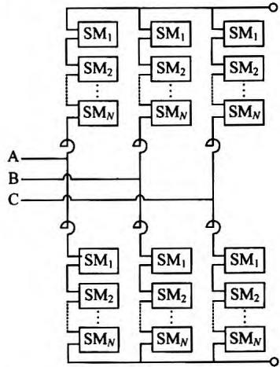  
图1所示为三相MMC的通用结构，该MMC  
图1 三相MMC通用结构图  
Fig.1 Schematic of a three-phase MMC

模型共有6个桥臂，每个桥臂包含 $N$ 个子模块。MMC拓扑创始人德国慕尼黑联邦国防军大学的Marquardt教授共提出了三种常见的子模块拓扑[10]，分别是半桥型子模块、全桥型子模块和双箱位型子模块。其中，半桥型子模块目前工程中应用最为普遍，但是其不具备直流故障穿越能力，需要依靠交流断路器实现故障电流的切除。全桥和双箱位子模块都具备直流故障穿越能力，但是由于投资和运行损耗较大目前尚无工程应用。为了在换流器投资、损耗和故障电流箱位能力之间实现折中平衡，有文献[15-16]等提出了改进MMC子模块拓扑，并给出了MMC桥臂中使用多种模块拓扑混联的方式以降低工程投资的思路，但是截止目前都尚未进入工程应用阶段。

对于MMC的仿真模型，已有文献大都针对半桥型MMC开展研究，所得成果可以较容易地通过自定义编程的方式扩展至其余MMC拓扑，因此本文将着重针对半桥型MMC的仿真建模方法进行探讨。

半桥型MMC子模块的详细拓扑如图2所示，其中最主要的器件是2组反并联的IGBT和二极管以及储能电容 $C$ 。在图2中，K1是一个高速旁路开关，其作用是保证子模块发生故障时将其快速、可靠地旁路。K2是一个压接式封装晶闸管，它可以在MMC闭锁时保护与其并联的续流二极管 $\mathrm{D}2^{[17]}$ 。由于K1和K2与子模块为并联结构，因此已有的MMC高效仿真模型大都不包含K1和K2，在某些特殊情况下需要仿真K1、K2时，本文将给出一种混合电路，用于在串联MMC阀中精确仿真K1、K2。图2中R为子模块电容的并联电阻，用于电容静态均压和MMC闭锁后电容的缓慢放电，由于其阻值很大，对电容的稳态特性几乎没有影响，因此除了某些特定场合，一般仿真中并不体现。

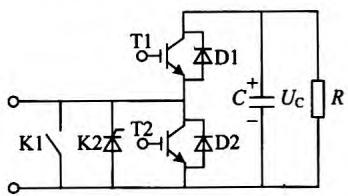  
图2半桥型子模块结构图  
Fig. 2 Schematic of half-bridge sub-module

# 1.2 MMC仿真特点

随着柔性直流输电不断向着高电压、大容量方向发展，MMC桥臂中通常需要数百个子模块级联。

例如，世界上第一个MMC工程，美国跨湾工程，单个桥臂含216个子模块(双端系统共2592个子模块)[5]，我国舟山5端柔性直流输电工程共包含上万个子模块。单个半桥子模块中至少包含4个电力电子开关，且不同子模块中的开关器件状态往往是不同时动作的。因此，在对MMC进行电磁暂态仿真时，必须设置较短的仿真步长，否则将严重影响仿真精度[18]。每一个仿真步长内都有大量开关器件导通状态发生变化，这将使得MMC系统的节点导纳矩阵在每一个仿真步长中都需要重新求逆，也即不断地对超高阶矩阵求逆将使得大规模MMC的仿真速度极其缓慢。

目前国内外已有的MMC建模方法都是从MMC仿真的特点出发，在尽可能保持仿真精度的前提下，显著降低MMC的矩阵求解阶数，达到仿真提速的效果，所提出模型根据简化信息的不同，分别适用于不同的场合。

# 2 MMC电磁暂态仿真模型

# 2.1 微秒级仿真模型综述

本文将按照所建MMC模型是否可以精确仿真每个子模块电容电压充、放电这一本质特征作为判据，将现有的MMC微秒级模型分为如下两类：

第一类模型：可以精确仿真每个子模块电容电压充、放电的MMC模型。这类模型主要包括采用IGBT、二极管等电子元件搭建的详细模型以及文献[19-22]所提出的等效模型。

详细模型由于真实搭建了MMC换流桥臂上的各个子模块，可以直接模拟每个子模块电容电压的充、放电过程。在文献[19]所提出模型中，电磁暂态仿真平台中搭建的2节点戴维南等效模型可以整体等效详细模型桥臂中 $N$ 个子模块，并可以反解求出每个子模块的电容电压值。文献[20]在文献[19]中的基础上，假设开关的关断电阻无穷大，进一步简化得到整个桥臂的戴维南等效模型，并提出了与之对应的有效均压算法，该模型在保证换流器仿真精度的前提下进一步提高了MMC的仿真速度。文献[21]中换流器等效建模方法与文献[20]相同，在电容均压算法中也采用与文献[20]类似的高效分组排序，但是在电容离散化时采用与文献[19]相同的梯形积分法，使得所提出MMC模型既保持了文献[20]中模型仿真速度快的优点，又得到了文献[19]中模型的高仿真精度的优势。文献[22]所提出模型中，

MMC桥臂经过局部优化，子模块间仍为直接串联，仍然可以精确仿真全部子模块电容的充、放电过程，但是随着仿真规模的增大，计算效率急剧下降。

第二类模型：不可以精确仿真每个子模块电容电压充、放电的MMC模型。

MMC的平均值模型，基频简化动态模型和连续模型等均属于这一类。文献[23]采用的是一种连续模型，其将MMC的桥臂等效成一个输出电压电流可控的电容器。文献[24]提出了一种桥臂开关函数等值模型，运用开关函数理论，将桥臂上的子模块输出电压平均化。文献[25]提出了MMC的平均值模型，将每个MMC的桥臂等效为一个元件，保留了MMC的输出谐波特性，但无法求解桥臂内部子模块电容电压信息，也无法仿真诸如换流器闭锁以及严重直流故障等一些特殊运行工况。文献[26]分析了平均值模型的适用性，并提出了一种改进平均值模型，使其可以精确仿真换流器闭锁以及严重交、直流故障等工况。同时，与文献[23-24]类似，MMC平均值模型也忽略了各子模块电容的区别，因此无法使用这类模型进行电容电压平衡算法的验证。

除了上述模型，本文还将探讨MMC纳秒级电磁暂态仿真模型以及MMC电磁暂态实时仿真模型的建模和硬件实现方法，它们均属于第一类模型。同时，考虑到大规模交、直流系统分析这一应用场合，本文还将探讨MMC机电暂态仿真模型的建模方法，由于忽略了MMC电容的充放电特性，该模型属于上述第二类模型。

# 2.2 微秒级仿真模型详述

# 2.2.1 MMC详细模型

本文所指的详细模型，指用电磁暂态仿真软件(PSCAD/EMTDC和MATLAB等)的元件库所包含的IGBT、二极管、电容等搭建的MMC及其子模块的详细仿真模型，拓扑结构分别如图1和图2所示。该模型能直观体现MMC每个子模块的详细情况，便于研究分析，且具有插值、数值振荡抑制和子模块可靠闭锁等功能。文献[27-32]均采用此种仿真模型进行控制、保护策略的验证。同时，MMC详细模型也成为了对比其他等效和简化模型的标准模型。但是，MMC详细模型在子模块数量较大时，仿真速度极慢，不适合大规模MMC柔性直流输电系统以及MMC多端柔性直流输电系统的仿真分析。

# 2.2.2 基于受控源的MMC通用等效模型

文献[33-34]提出基于受控电压源和受控电流源的MMC电磁暂态通用模型。如图3(a)所示，将详细模型的每个桥臂中全部子模块断开连接，子模块的正端口连接受控电流值均为 $I_{\mathrm{ARM}}$ 的电流源，负端口接地。MMC六个桥臂均置换为如图3(b)所示的受控电压源，如此MMC模型中桥臂与子模块之间不再有电气上的联系，只有二次信息的交换，实现了电气解耦，同时对待求解电路进行了导纳矩阵降阶处理。在仿真过程中只需对多个低阶矩阵同时求逆，避免了对高阶矩阵直接求逆，可以显著降低计算耗时。该模型等效仅针对换流阀，详细模型中的任意控制算法仍然适用。同时，模型等效所需元件都为仿真软件元件库已有的，子模块拓扑可以很容易地在半桥、全桥以及其余拓扑之间转换，因此这种模型称为MMC通用等效模型。

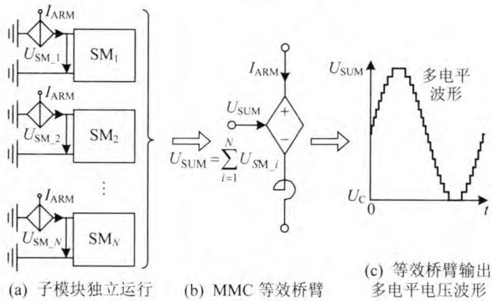  
图3 MMC通用等效模型的建模步骤  
Fig. 3 Implementation steps of the proposed model

文献[33]中以详细模型为基准，使用五电平MMC-HVDC测试系统，对比了MMC通用等效模型的仿真精度(见图4)，并测试了该模型的加速比(见图5)。

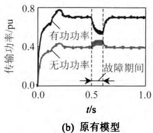  
图4暂态仿真结果对比图  
Fig. 4 Simulation comparisons under transient state

图4和图5表明，文献[33]所提出的MMC仿真提速模型保证了极高的仿真精度。同时，随着MMC电平数的增加，MMC详细模型仿真用时呈指数增长，而提速模型呈近似线性增长。

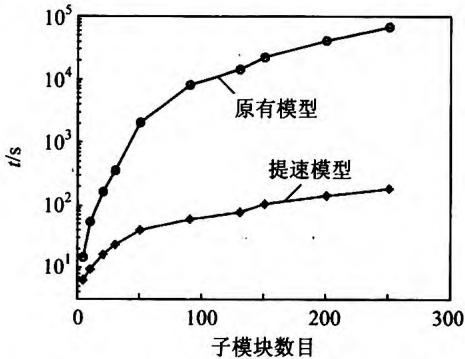  
图5 MMC通用等效模型仿真用时对比  
Fig.5 CPU time comparison of the MMC universal model 2.2.3 基于戴维南等效的MMC仿真模型

加拿大工程院院士、曼尼托巴大学 GOLE 教授研究团队在世界上首次提出基于戴维南等效原理的 MMC 模型，开创了 MMC 高精度与高效率并重的建模研究新领域[19]。该团队所提出的戴维南等效模型是 MMC 电磁暂态离线等效模型和实时仿真模型的本质原理，为 MMC 建模方法的研究奠定了坚实的理论基础。

全部已有戴维南等效模型的核心思想都是建立单个子模块的戴维南等效电路并进行代数叠加，从而将每个MMC桥臂等效为一个电压源与电阻串联的2节点支路，与外电路联立进行一个仿真步长的电磁暂态求解过程，然后根据相应的电气关系对该桥臂中保存的全部子模块电容电压进行更新。

1）等效模型1。

本文将文献[19]提出的基于戴维南等效原理的MMC提速模型称为等效模型1。图6所示为文献[19]中戴维南模型的等效过程：

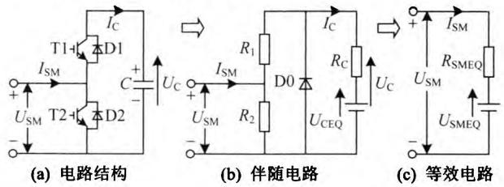  
图6 MMC子模块  
Fig. 6 MMC sub-module

① 将图6(a)中的T1和D1、T2和D2开关元件组(IGBT和反并联二极管)用ON/OFF可变电阻 $R_{1}$ 和 $R_{2}$ 代替。当开关组导通时，电阻取非常小的值；当开关组关断时，电阻取非常大的值。

②如图6(b)所示，采用梯形积分法将电容离散化为戴维南电阻 $R_{\mathrm{C}}$ 和戴维南电压源 $U_{\mathrm{CEQ}}$ ，子模块上下两个开关组分别由可变电阻和代替。D0 是一个强制赋零环节，其作用是防止子模块电容电压出

现负值。

③如图6(c)所示，求取MMC单个子模块的戴维南等效电阻 $R_{\mathrm{SM}}$ 与戴维南电压源 $U_{\mathrm{SMEQ}}$ ，并基于此将MMC桥臂上 $N$ 个串联的子模块的戴维南电路进行叠加，得到桥臂的戴维南等效电路，用于仿真计算。

该模型在保证MMC仿真精度的前提下显著提高了仿真速度，但由于其仅对换流器自身进行等效建模，在仿真超大规模MMC时由于其均压算法复杂度的迅速上升而导致该模型的仿真效率仍然较低。

在该模型基础上，文献[35]提出了一种基于Dommel等值计算原理的级联多电平换流器等效模型，提出了二极管插值和闭锁问题的解决方法。文献[36-37]提出了将MMC桥臂等效为电压源的新型等效模型，它将子模块等效为诺顿等效电路，并且考虑了电容泄漏电阻(均压电阻)的充放电过程。由于这2类模型并未改变戴维南等效模型的总体建模流程，本文暂不对其进行仿真验证。

# 2）等效模型2。

文献[20]在等效模型1的基础上从换流器模型与均压算法两个方面出发进行改进，提出了基于后退欧拉法的MMC戴维南等效整体模型，本文将其称为等效模型2。等效模型2的3点重要改进如下：

① 假设每个开关组的关断电阻为无穷大。基于该假设可使得更新MMC桥臂戴维南电路并反解出每个子模块电容电压时的计算复杂度大大降低。并且假设导通或者切除的子模块电气参数完全一致，使得整个桥臂戴维南等效电阻计算更加简洁。  
②在子模块电容离散化处理上，采用了后退欧拉法，因此子模块电容电压增量只与当前时刻子模块的导通状态有关，而与历史时刻导通状态无关。结合①中假设，导通组和切除组的子模块电容电压增量完全一致，如表1所示。

表 1 MMC 子模块电容电压增量(等效模型 2)  
Tab. 1 Capacitor voltage increment (equivalent model 2)   

<table><tr><td>t时刻子模块导通状态</td><td>电容电压增量 ΔUCE(t)</td></tr><tr><td>切除</td><td>0</td></tr><tr><td>投入</td><td>IARM(t)RC</td></tr></table>

③ 考虑到导通组和切除组的子模块电容电压增量完全一致的特点，可以在初始时刻进行电容电压全排序之后，后续仿真步长只在导通组和切除组之间进行一次比较组成新的电压升序数列，如图7所示。

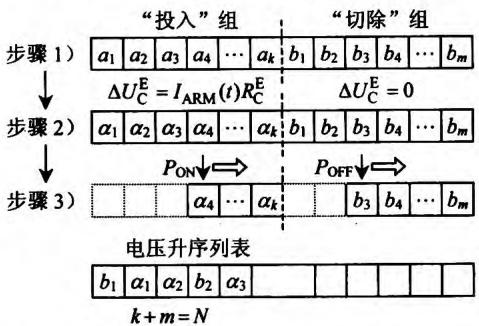  
图7适用于后退欧拉法MMC的排序算法  
Fig. 7 The sorting algorithm for backward Euler based MMC

图7中所示基于后退欧拉的排序算法的计算复杂度仅为 $O(N)$ ，最大计算复杂度为 $N - 1$ 。而对 $N$ 个乱序的子模块电容电压进行全排序(如采用冒泡排序等算法)，其复杂度通常为 $O(N^{2})$ 。等效模型2分别对等效模型1从一次和二次两个层面进行改进，在仿真超大规模MMC时仍然具有很高的仿真效率。

# 3）等效模型3。

工程中MMC电平数通常高达数百，为了精确仿真每个电平台阶，所需仿真步长通常在 $20\mu \mathrm{s}$ 以内，在这个时间尺度内后退欧拉法和梯形积分法具有相似的仿真精度。然而，在MMC电平数较低或仿真步长较高时，后退欧拉法在仿真较大暂态冲击时的仿真精度较低。因此，文献[21]提出一种基于梯形法的MMC戴维南等效整体模型，称为等效模型3。与等效模型2相比，具有如下特点：

①与等效模型2一样，假设了开关组的关断电阻为无穷大。  
② 电容离散化时采用了应用较广泛的梯形积分法，每个仿真步长的电容电压增量与当前步长以及前一个步长子模块的导通状态有关，根据两个步长时刻子模块的导通状态可将电容电压增量分为4组。  
③等效模型3采用类似等效模型2的分组排序，根据上一仿真时刻和当前仿真时刻，将子模块电容电压分为4组，组内都按照电压升序排列。先将4组进行两两分组采用图7中方法分别排序，得到2个升序的电压序列，然后再次利用图7中方法排序，得到总的电压升序列表。该排序算法的最大计算复杂度为 $2N - 3$

虽然等效模型3的分组排序的复杂度较等效模型2高，但是相比等效模型1还是大为降低。同时，由于等效模型3运用了梯形积分法离散化电容，其仿真精度比等效模型2高。

4）MMC戴维南等效模型的闭锁实现方法。

MMC通常在启动或发生直流故障后需要进行闭锁操作，详细模型可以通过直接封锁全部IGBT的触发脉冲实现闭锁。然而，戴维南等效模型中对IGBT和二极管不加区分，统一处理为开关组，用可变电阻代替。同时，在定步长仿真软件中仿真时，子模块闭锁后拓扑中只包含二极管，需要对这种不可控的自然关断器件的开关时刻及状态变量进行插值，以避免数值计算产生的错误[37]。文献[20,35]通过直接调用仿真软件中具备插值功能的二极管模型函数(Eqv_D1和Eqv_D2)与戴维南等效桥臂电容Eqv_C进行组合的方式模拟MMC闭锁，如图8所示。

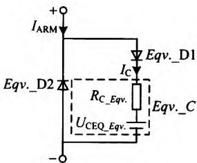  
图8 MMC闭锁时的等效桥臂模型  
Fig. 8 Equivalent MMC arm in blocked mode

下文中仿真验证部分将通过换流器的启动过程来验证所介绍的换流器闭锁方法的有效性。

5）戴维南等效模型的仿真验证。

为了更直观地表现等效模型1、2、3和详细模型之间的精度对比，将等效模型1、2、3和详细模型在相同硬件条件下进行相同工况的仿真测试。具体仿真参数如下：

3个模型均采用双端对称单极结构。交流系统线电压有效值为 $230\mathrm{kV}$ ，送端换流变压器变比为230/341.3，受端换流器变比为230/333.14，变压器接线都为星/三角接线方式。桥臂电感为 $0.085\mathrm{H}$ 直流电压为 $640\mathrm{kV}$ ，每个桥臂包含48个子模块(不计冗余，MMC均为49电平)。送端采用定直流电压和定无功功率控制，受端采用定有功功率和定无功功率控制。稳态运行时设定传输有功功率 $1000\mathrm{MW}$ ，无功功率双端都设置为0。传输线路采用电缆，电缆长度为 $10.7\mathrm{km}$

仿真步长 $20\mu \mathrm{s}$ ，仿真时长为6s，仿真都包含闭锁启动充电过程，在系统启动完毕且运行稳定之后，在4.3s时双端系统同时投入环流抑制控制策略。4个模型的仿真精度对比结果分别如图9—11所示。

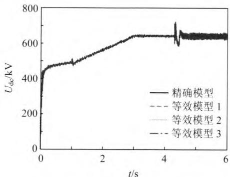  
图9 MMC模型直流电压对比

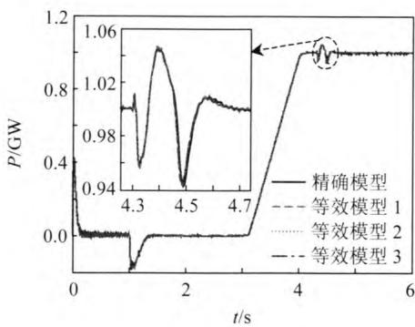  
Fig. 9 Steady-state dc voltage comparison   
图10 有功功率对比

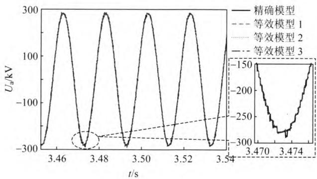  
Fig. 10 Steady-state real power compa6rison   
图11 送端阀侧A相电压对比  
Fig. 11 Phase A valve voltage comparison of the sending end

由图9—11可知，等效模型1、2、3都具有很高的仿真精度，并且等效模型2的仿真精度略差于等效模型1和等效模型3，这与之前关于后退欧拉法的仿真精度分析结果是一致的。

为了对比等效模型1、2、3的仿真速度的差异，对3个等效模型进行单相开环仿真速度测试，仿真时长 $10s$ ，仿真步长为 $20\mu s$ 。对比结果如图12所示。

由图12可以看出，等效模型2和模型3都为考虑了排序算法优化的戴维南等效整体模型，其仿真用时都是随着子模块数目的增加而线性增长，并且模型3的斜率约为模型2的2倍。然而模型1只

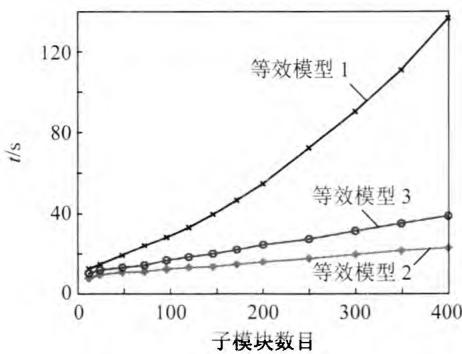  
图12 等效模型的仿真用时  
Fig. 12 Equivalentmodel CPU time comparison

对换流器部分进行了优化，其仿真用时仍然呈现出了非线性增长趋势。上述仿真结果与模型的建立方法以及理论分析结果一致。

6）戴维南等效模型桥臂内部故障仿真方法。

本文给出一种戴维南等效模型仿真子模块内部故障的方法。如图13所示，仿真第 $k$ 个子模块内部故障时，将仿真模型的第 $k$ 个子模块用详细模型替换(包含半桥子模块中的开关K1和K2)，而将本桥臂与其相连的1至 $k - 1$ 号子模块和 $k + 1$ 至 $N$ 号子模块分别用戴维南等效模型体现(可为等效模型1、2、3)。如此便可使得大规模MMC仿真中既能体现单个子模块的故障特性，又能保持很高的仿真效率。

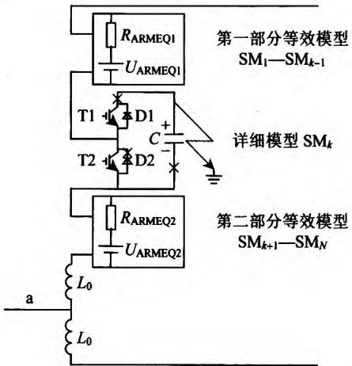  
图13 MMC单个子模块故障仿真模型  
Fig. 13 Single sub-module fault simulation model for MMC

# 2.2.4 桥臂等值模型

该部分模型属于本文所述的第二类模型。文献[23]提出一种连续模型，其将MMC的桥臂等效成一个输出电压电流可控的电容器，忽略了各子模块电容的区别，因此无法使用这种模型进行电压平衡算法的验证。

文献[24]提出了一种桥臂开关函数等值模型，

运用开关函数理论，将桥臂上的子模块电压平均化，它假设每个桥臂上的 $N$ 个子模块电容电压完全均衡，也即每个电容电压值都为桥臂电压的 $1 / N$ 。

据此可以推导出每个桥臂等效电容值为 $C_{\mathrm{SM}} / N$ 。对桥臂上第 $i$ 个子模块定义开关函数 $S_{i}$ 。 $S_{i} = 1$ 时表示子模块导通， $S_{i} = 0$ 时表示子模块切除，则桥臂的开关函数如式(1)所示。

$$
\frac {1}{N} \sum_ {i = 1} ^ {N} S _ {i} = s _ {n} \tag {1}
$$

该模型对MMC桥臂进行了简化，子模块不再有区别，不能用来分析子模块电容电压均衡算法，但是该模型包含了桥臂电容充放电过程，可以用来分析MMC基本能量控制策略以及环流抑制控制策略等。

# 2.2.5 平均值模型

该部分模型属于本文所述的第二类模型。平均值模型根据功率平衡理论，使用受控源实现自身交、直流侧的电气解耦，只有二次信息(电压值及电流值)的传递，实现虚拟的交直流联系。在系统研究分析中不要求体现MMC的内部特性而只要提供较精确的外部特性时，平均值模型具备独特的技术优势。

文献[38]介绍了两电平VSC的平均值模型及其在多端系统中的应用。文献[25]提出了MMC平均值模型，它的交流侧由6个受控电压源代替，直流侧由一个受控电流源和一个等效电容代替。该模型对基频下的调制波使用平均技术来决定MMC输出的交流波形，并通过台阶波形的叠加使得输出波形中包含谐波分量，也即保留了仿真MMC时的谐波特性。文献[39]提出了数值计算模块与受控电压源组合的桥臂等效模型，并且通过简化MMC的电压均衡控制及子模块状态的差异性，建立了数值计算平均值模型。

文献[26]指出了文献[25]所提出平均值模型的仿真缺陷，如适用性无法界定、无法仿真MMC闭锁、单极和双极直流故障无法精确模拟等。基于此，针对现有平均值模型的不足，文献[26]提出了如图14所示的改进平均值模型。

在正常运行(非故障，非闭锁)时，开关S3与级联开关S1闭合，级联开关S2打开。此时除与 $C_{\mathrm{AVM}}$ 永久并联的D3以及断态电阻很大的S2外，图14中的改进平均值模型与文献[25]现有模型相同。

文献[26]同时指出现有平均值模型适用的前提

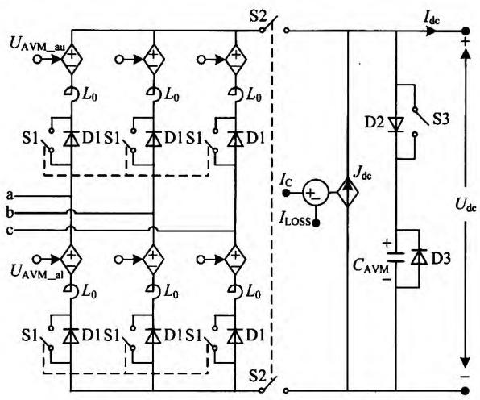  
图14 改进平均值模型的拓扑结构  
Fig. 14 The topology of the modified AVM

是其对应的详细模型的子模块电容值足够大以确保电容电压近似均衡。同时，改进平均值模型可以弥补已有平均值模型在仿真换流器闭锁时的不足，发生直流双极短路故障时，图14中与等效直流电容 $C_{\mathrm{AVM}}$ 永久并联的D3可以确保平均值模型的直流电压不会出现负值。发生单极直流母线接地故障时，打开的开关S2则可以使得改进后的平均值模型在交流输出电压中产生正确的直流偏置。

文献[26]通过对比改进平均值模型(图中标注“PROPOSED”)与已有平均值模型(图中标注“PREVIOUS”)以及详细模型(图中标注“DM”)在最严重的双极短路故障运行工况下的仿真结果，验证了所提出改进平均值模型的有效性，如图15所示。

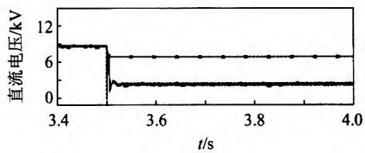  
(a) 直流电压

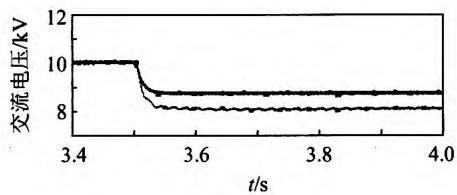  
(b) 交流电压

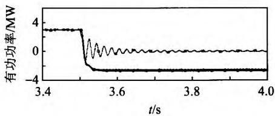  
(c) 有功功率

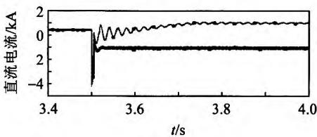  
图15 双极直流短路故障且闭锁后特性  
Fig. 15 Behaviors under pole to pole short circuit fault and converter blockings

(d) 直流电流

$$
\cdot \mathrm {D M}; \quad \cdot \text {P R E V I O U S}; \quad \triangle \text {P R O P O S E D 。}
$$

如图15所示，所提出改进平均值模型可以很好地仿真详细模型的双极直流故障特性，然而由于现有平均值模型[25]不具备改进平均值模型中的二极管D3的箝位作用，其在直流故障后包括直流电压在内的全部稳态特性均与详细模型以及改进平均值模型不同，因此改进后的平均值模型具有更高的仿真精度。

# 2.3 纳秒级仿真模型

MMC的纳秒级开关暂态仿真模型目前尚未见文献报道，已有纳秒级模型只针对IGBT和二极管的器件开关模型，重点关注器件开通和关断过程中的尖峰电压和拖尾电流等特性，可以用于器件暂态性能测试和损耗分析，一般不用于系统级分析[40]。同时，纳秒级模型的仿真步长大多在 $10\sim 100\mathrm{ns}$ ，在电磁暂态离线仿真平台中仿真单个器件的速率都极其缓慢，离线仿真双端数十电平MMC-HVDC的纳秒级模型几乎是不可能也是不必要的。虽然基于FPGA的实时仿真系统有望进行纳秒级MMC阀组或换流器的建模[41]，但是纳秒级MMC模型不是针对提高仿真效率的问题，与本文所述其余模型的研究目的不同，此处不再详细展开。

# 3 MMC机电暂态仿真模型

电磁暂态仿真能研究含有较多开关元件的MMC本身的动态特性，但是由于仿真速度和规模的限制，目前电磁暂态仿真不适合研究大规模交直流系统之间的相互作用。在研究含有MMC-HVDC的大规模交直流混联系统的稳定性时，可以忽略谐波对系统的影响，只考虑系统基频运行特性[42]。仿真计算的是三相对称交流系统基频下各参量的RMS值。仿真步长为毫秒级，仿真关注的时长为几s到几min[43]。建立能体现MMC基频动态特性的机电暂态模型，将为大规模交直流系统稳定性分析提供仿真基础。

文献[43]提出了MMC的简化稳态和动态机电暂态模型，保留了换流器的外部动态特性。能进行稳态运行和三相短路故障的分析，不能进行不对称故障分析。

文献[44]提出了适用于大规模MMC-MTDC仿真的MMC机电暂态模型，包括了适用于 $0.1\mathrm{ms}$ 仿真步长的MMC详细机电暂态模型以及适用于 $10\mathrm{ms}$ 仿真步长的MMC简化机电暂态模型。分别建立了MMC交流侧、 $d - q$ 双轴控制系统和MMC直流侧的详细机电暂态模型等。

如前所述，MMC电磁暂态和机电暂态模型是MMC高效模型中的两个重要分支，分别适用于不同的场合，两类模型之间没有优劣之分，都是为了服务于不同时间尺度交直流电力系统的运行特性分析。

# 4 MMC实时仿真系统

# 4.1 网络模型的等值简化

MMC 实时仿真系统是为了对物理控制器在工程投运之前进行全面的性能测试，仿真精度和实时性是对其最本质的要求。MMC 实时仿真的一次系统部分，通常是基于本文所介绍的戴维南等效原理而开发的，但是在开关元件的处理上略有区别。同时，目前对于 MMC 的实时仿真都是基于对网络模型一定程度的简化[45]和与硬件平台相结合的方式来实现的[46-49]。

文献[50]提出了一种基于分区戴维南等值和半步长插值的新型算法 MATE(multi area Theveninequivalent)，该算法的精髓是采用合适的方法设计一张状态地图，可以将网络导纳矩阵的变量信息存储下来用以反映网络拓扑的变化，如此便可以减少各子系统内部和各子系统之间重复的拓扑计算，同时减轻各子系统之间的通信负担。

文献[51]基于网络嵌套理论提出了一种新的网络等值算法GENE generation of electric network equivalents)。该算法的主要原理是将网络分层表示，即子系统和母系统。每个子系统是相对独立的，将子、母系统之间的信息交换做成合适的封装接口，以实现高速的系统通信。

# 4.2 与硬件相结合的MMC实时仿真

由于MMC-HVDC系统的复杂性及特殊性，实现高精度的实时仿真仅仅从算法模型上进行优化是不够的，采用合适的硬件平台与之相结合是目前

普遍采用的方法[52-53]。

文献[54]提出一个基于FPGA的实时仿真器来仿真MMC系统的电磁暂态模型，用光纤连接外部控制信号进行硬件闭环的测试。MMC阀模型的建立在FPGA中实现，仿真步长设为 $500\mathrm{ns}$ ，系统部分在CPU中仿真。驱动协议和FPGA一致，以保证高速的信息传输和低延时。该仿真平台支持多个FPGA板卡，因此可以进行超大规模物理控制器的闭环系统测试等。

# 5 结论

本文立足多个视角，针对不同的应用场景，对目前国内外MMC高效仿真建模方法进行了全面的梳理和归类，得到如下结论：

1) MMC 的电磁暂态模型开发仍是 MMC 建模领域最热门的话题，因其涵盖时间尺度范围广，离线仿真软件成本较低，且所得成果可以推广应用到不同的仿真平台乃至实时仿真系统中。  
2）基于受控源的MMC通用提速模型具有容易实现、一次系统可视化程度强以及可以仿真开关器件级别的插值和故障等优点，推荐在详细仿真较大规模双端MMC-HVDC系统时采用。  
3) MMC 戴维南等效整体模型兼具仿真精度和计算效率都较高的特点，突破性地实现了模型的计算复杂度与仿真规模的线性增长。在仿真步长较小时推荐采用基于后退欧拉法的整体模型，仿真步长较大时推荐采用基于梯形法的整体模型。该类模型适合于不但要关注换流器内、外部动态特性，而且仿真规模巨大时的应用场景。  
4）改进后的MMC平均值模型具备了精确仿真复杂交直流工况的能力，适合于只关注换流器外部动态特性且包含大规模MMC的交直流混联系统分析的场合。  
5）MMC的机电暂态和实时仿真系统将逐渐成为未来MMC建模领域的研究热点，因其更接近大系统分析和工程实际，可以更好地满足多样化需求。

# 参考文献

[1] 汤广福. 基于电压源换流器的高压直流输电技术[M]. 北京：中国电力出版社，2010：30-36.  
Tang Guangfu. VSC-HVDC technology[M]. Peking: China Electric Power Press, 2010: 30-36(in Chinese).   
[2] 陈名，饶宏，李立涅，等. 南澳柔性直流输电系统主接线分析[J]. 南方电网技术，2012(6)：1-5.

Chen Ming, Rao Hong, Li Licheng, et al. Analysis on the main wiring of Nan'ao VSC-HVDC transmission system[J]. Southern Power System Technology, 2012(6): 1-5(in Chinese).   
[3] 周浩，沈洋，李敏，等. 舟山多端柔性直流输电工程换流站绝缘配合[J]. 电网技术，2013，37(4)：879-890. Zhou Hao，Shen Yang，Li Min，et al. Research on insulation coordination for converter stations of Zhoushan multi-terminal VSC-HVDC transmission project[J]. Power System Technology，2013，37(4)：879-890(in Chinese).  
[4] 马为民，吴方劫，杨一鸣，等．柔性直流输电技术的现状及应用前景分析[J].高电压技术，2014，40(8)：2429-2439.  
Ma Weiming, Wu Fangjie, Yang Yiming, et al. Flexible HVDC transmission technology's today and tomorrow [J]. High Voltage Engineering, 2014, 40(8): 2429-2439(in Chinese).   
[5] Simon P T. Modeling the Trans. Bay cable project as voltage-sourced converter with modular multilevel converter design[C]/Power and Energy Society General Meeting. Detroit, Michigan, USA: IEEE, 2011: 1-8.   
[6] Dennetière S, Nguefeu S, Saad H, et al. Modeling of modular multilevel converters for the France-Spain link[C]/International Conference on Power Systems Transients, IPST'13. Vancouver, Canada, 2013.   
[7] Jacobson B, Karlsson P, Asplund G, et al. VSC-HVDC transmission with cascaded two-level converters[C]// CIGRE B4-110. Paris: CIGRE, 2010: 1-8.   
[8] 徐政，陈海荣．电压源换流器型直流输电技术综述[J].高电压技术，2007，33(1)：1-10. Xu Zheng, Chen Hairong. Review and applications of VSCHVDC[J]. High Voltage Engineering, 2007, 33(1): 1-10(in Chinese).   
[9] 汤广福，贺之渊，庞辉．柔性直流输电工程技术研究、及发展[J].电力系统自动化，2013，37(15)：3-14.TangGuangfu，HeZhiyuan，PangHui.Research，application and development of vsc-hvdc engineering technology[J].Automation of Electric Power Systems,2013，37(15):3-14(in Chinese).  
[10] Lesnicar A, Marquardt R. An innovative modular multilevel converter topology suitable for a wide power range[C]/Power Technology Conference Proceedings, 2003 IEEE, Bologna, 2003: 3-6.   
[11] 吴浩，徐重力，张杰峰，等．舟山多端柔性直流输电技术及应用[J].智能电网，2013，2(1)：22-26. Wu Hao, Xu Zhongli, Zhang Jiefeng, et al. VSC-MTDC transmission technologiesandits application in Zhoushan [J]. Power System Technology, 2013, 2(1): 22-26(in Chinese).

[12] 李力，伍双喜，张轩，等．南澳多端柔性直流输电工程的运行方式分析[J]. 广东电力，2014，27(5)：85-89. Li Li, Wu Shuangxi, Zhang Xuan, et al. Analysis on running mode of Nan'ao multi-terminal VSC-HVDC transmission system[J]. Guangdong Electric Power, 2014, 27(5): 85-89(in Chinese).  
[13] 王姗姗，周孝信，汤广福，等．模块化多电平电压源换流器的数学模型[J]. 中国电机工程学报，2011，31(24)：1-8. Wang Shanshan, Zhou Xiaoxin, Tang Guangfu, et al. Modeling of modular multi-level voltage source converter[J]. Proceedings of the CSEE, 2011, 31(24): 1-8(in Chinese).  
[14] Modeer T, Nee H P, Norrga S. Loss comparison of different sub-module implementations for modular multilevel converters in HVDC applications[C]// Proceedings of the 2011-14th European Conference on Power Electronics and Applications (EPE2011). Birmingham, United Kingdom: IEEE IAS, IEEE IES and IEEE PES, 2011: 1-7.   
[15] Qin J, Saeedifard M, Rockhill A, et al. Hybrid design of modular multilevel converters for HVDC systems based on various submodule circuits power[J]. IEEE Transactions on Delivery, 2014, 99(1): 1.   
[16]徐政，薛英林，张哲任．大容量架空线柔性直流输电关键技术及前景展望[J].中国电机工程学报，2014，34(29)：5051-5062. Xu Zheng，Xue Yinglin，Zhang Zheren.VSC-HVDC technology suitable for bulk power overhead line transmission[J].Proceedings of the CSEE,2014,34(29): 5051-5062(in Chinese).  
[17] Gemmell B, Dorn J, Retzmann D, et al. Prospects of multilevel VSC technologies for power transmission, in Proc[C]/IEEE Transmission and Distribution Conference and Exposition. CA, USA, 2008: 1-16.   
[18] Tu Qingrui, Xu Zheng. Impact of sampling frequency on harmonic distortion for modular multilevel converter[J]. IEEE Transactions on Power Delivery, 2011, 26(1): 298-306.   
[19] Gnanarathna UN, Gole AM, Jayasinghe RP. Efficient modeling of modular multilevel HVDC converters (MMC) on electromagnetic transient simulation programs[J]. IEEE Transactions on Power Delivery, 2011, 26(1): 316-324.   
[20] 许建中，赵成勇，Gole AM. 模块化多电平换流器戴维南等效整体建模方法[J]. 中国电机工程学报，2014，35(8)：1919-1929.  
Xu Jianzhong, Zhao Chengyong, Gole AM. Research on the Thévenin's equivalent based integral modelling method of the modular multilevel converter[J].

Proceedings of the CSEE, 2014, 35(8): 1919-1929(in Chinese).   
[21] 许建中. 模块化多电平换流器电磁暂态高效建模方法研究[D]. 北京：华北电力大学，2014.  
Xu Jianzhong. Research on the electromagnetic transient efficient modelling method of modular multilevel converter[D]. Beijing: North China Electric Power University, 2014(in Chinese).   
[22] 管敏渊，徐政. 模块化多电平换流器的快速电磁暂态仿真方法[J]. 电力自动化设备，2012，32(6)：36-40.  
Guan Minyuan, Xu Zheng. Fast electro-magnetic transient simulation method for modular multilevel converter[J]. Electric Power Automation Equipment, 2012, 32(6): 36-40(in Chinese).   
[23] Noman A, Lennart A, Staffan N, et al. Validation of the continuous model of the modular multilevel converter with blocking/deblocking capability[C]/10th IET International Conference on AC and DC Power Transmission. Birmingham, UK, 2012: 63.   
[24] Saad H Dennetière, Mahseredjian S, Delarue J, et al. Modular multilevel converter models for electromagnetic transients[J]. Power Delivery, IEEE Transactions on, 2014, 29(3): 1481-1489.   
[25] Peralta J, Saad H, Dennetiere S, et al. Detailed andaveraged models for a 401-Level MMC-HVDC system[J]. IEEE Transactions on Power Delivery, 2012, 27(3): 1501-1508.   
[26] Xu J, Gole A M, Zhao C. The Use of Averaged-Value Model of Modular Multilevel Converter in DC Grid[J]. IEEE Transactions on Power Delivery, 2015, 30(2): 519-528.   
[27] Dennetière S, Nguefeu S, Saad H, et al. Modeling of modular multilevel converters for the France-Spain link[J]. Star, 2013, 2(3): 4.   
[28] Sarafianos D N. Modular Multilevel Converter cell construction[C]//47thInternational Universities Power Engineering Conference(UPEC), London, UK, 2012.   
[29]韦延方，卫志农，孙国强，等.适用于电压源换流器型高压直流输电的模块化多电平换流器最新研究进展[J].高电压技术，2012，38(5)：1243-1252.  
Wei Yanfang, Wei Zhinong, Sun Guoqiang, et al. New prospects of modular multilevel converter applied to voltage source converter high voltage source converter high voltage direct current transmission[J]. High Voltage Engineering, 2012, 38(5): 1243-1252(in Chinese).   
[30] Gao Feng, Niu Decun, Jia Chunjuan, et al. Control of parallel-connected modular multilevel converters[C]// IEEE Energy Conversion Congress and Exposition Asia Downunder, Melbourne, Australia, 2013.   
[31] Perez M A, Rodriguez J. Generalized modeling and

simulation of a modular multilevel converter[C]//2011 IEEE International Symposium on Industrial Electronics, Gdansk, Poland, 2011.   
[32] 刘钟淇. 基于模块化多电平变流器的轻型直流输电系统研究[D]. 北京：清华大学，2010.  
Liu Zhongqi. Research on the VSC-HVDC system based on modular multilevel converter[D]. Beijing: Tsinghua University, 2010(in Chinese).   
[33] Xu J, Zhao C, Liu W, et al. Accelerated model of modular multilevel converters in PSCAD/EMTDC[J]. Power Delivery, IEEE Transactions on, 2013, 28(1): 129-136.   
[34] 许建中，赵成勇，刘文静．超大规模MMC电磁暂态仿真提速模型[J].中国电机工程学报，2013，33(10)：114-120.  
Xu Jianzhong, Zhao Chengyong, Liu Wenjing. Accelerated model of ultra-large scale MMC in electromagnetic transient simulations[J]. Proceedings of the CSEE, 2013, 33(10): 114-120(in Chinese).   
[35] 罗雨，饶宏，许树楷，等. 级联多电平换流器的高效仿真模型[J]. 中国电机工程学报，2014,34(15):2346-2352.  
Luo Yu, Rao Hong, Xu Shukai, et al. Efficient modeling for cascading multilevel converters[J]. Proceedings of the CSEE, 2014, 34(15): 2346-2352(in Chinese).   
[36] Xu Fei, Wang Ping, Li Zixin, et al. Effective model of MMC for multi-ports VSCHVDC system simulation[C]// IEEE Transportation Electrification Conference and Expo Asia-Pacific, Beijing, China, 2014.   
[37] 王成山，李鹏，黄碧斌，等. 一种计及多重开关的电力电子时域仿真插值算法[J]. 电工技术学报，2010, 25(6): 83-88.  
Wang Chengshan, Li Peng, Huang Bibin, et al. An interpolation algorithm for time-domain simulation of power electronics circuit considering multiple switching events[J]. Proceedings of the CSEE, 2010, 25(6): 83-88(in Chinese).   
[38] Peralta J, Saad H, Dennetiere S, et al. Dynamic performance of average-value models for multi-terminal VSC-HVDC systems[C]/IEEE Power and Energy Society General Meeting. Pittsburgh, USA, 2012.   
[39]喻锋，王西田，林卫星，等.模块化多电平换流器快速电磁暂态仿真模型[J].电网技术，2015,39(1):257-263.  
Yu Feng, Wang Xitian, Lin Weixing, et al. Fast electromagnetic transient simulation models of modular multilevel converter[J]. Power System Technology, 2015, 39(1): 257-263 (in Chinese).   
[40] 邓夷，赵争鸣，袁立强，等．适用于复杂电路分析的IGBT模型[J]. 中国电机工程学报，2010，30(9)：1-7. Deng Yi, Zhao Zhengming, Yuan Liqiang, et al. IGBT model for analysis of complicated circuits[J]. Proceedings of the CSEE, 2010, 30(9): 1-7(in Chinese).

[41] Aung M, Dinavahi V. FPGA-based real-time emulation of power electronic systems with detailed representation of device characteristics[J]. IEE Transactions on Industrial Electronics, 2011, 58(1): 358-368.   
[42] 徐政. 柔性直流输电系统[M]. 北京：机械工业出版社，2012：291-308.  
Xu Zheng. Flexible HVDC system[M]. Peking: Mechanical Industry Press, 2012: 291-308(in Chinese).  
[43] Simon P T. Simplified dynamic model of a voltage sourced converter with modular multilevel converter design[C]//IEEE/PES Power Systems Conference and Exposition. Seattle, USA, 2009: 1-6.   
[44] Liu Sheng, Xu Zheng, Hua Wen, et al. Electromechanical transient modeling of modular multilevel converter based multi-terminal HVDC systems[C]//2014 IEEE Power and Energy Society General Meeting Conference and Exposition. New York, USA, 2014.   
[45] Le-Huy P, Giroux P, Soumagne J C. Real-time simulation of modular multilevel converters for network integration studies[C]//International Conference on Power Systems Transients. Delft, Netherlands, 2011: 14-17.   
[46] Maguire T, Warkentin B, Chen Y, et al. Efficient techniques for real time simulation of MMC systems[C]/International Conference on Power Systems Transients (IPST2013) in Vancouver, Canada, 2013.   
[47] Saad H., Ould-Bachir T, Mahseredjian J, et al. Real-time simulation of MMCs using CPU and FPGA[J]. IEEE Transactions on Power Electronics, 2013, 30(1): 259-267.   
[48] 刘栋，汤广福，贺之渊，等．模块化多电平柔性直流输电数字-模拟混合实时仿真技术[J].电力自动化设备，2013(2)：68-73. Liu Dong，Tang Guangfu，He Zhiyuan，et al. Digital-analog hybrid real-time simulation technology on MMC-HVDC[J].Electric Power Automation Equipment, 2013(2):68-73(in Chinese).   
[49] Lin Xuehua, Ou Kaijian, Zhang Yi, et al. Simulation and analysis of the operating characteristics of MMC based VSC-MTDC system[C]//2013 4th IEEE PES Innovative Smart Grid Technologies Europe(ISGT Europe), Copenhagen, 2013.   
[50] Chen Laijun, Chen Ying, Xu Yin, et al. A novel algorithm for parallelepel electromagnetic transient simulation of power systems with switchingevents[C]/International Conference on Power System Technology. Hangzhou, China, 2010.   
[51] Strunz K, Carlson E. Nested fast and simultaneous

solution for time-domain simulation of integrative power-electric and electronic systems[J]. IEEE Transactions on Power Delivery, 2007, 22(1): 277-287.   
[52] Liu Dong, Tang Guangfu, He Zhiyuan, et al. A new type real-time simulation platform for modular multilevel converter based HVDC[C]//Power and Energy Engineering Conference (APPEEC). 2012 Asia-Pacific, Shanghai, China, 2012.   
[53] 刘崇茹，林雪华，李海峰，等. 基于RTDS的模块化多电平换流器子模块等效模型[J]. 电力系统自动化，2013，37(12)：92-99.  
Liu Chongru, Lin Xuehua, Li Xuehua, et al. Modular multilevel inverter modules equivalent model based on RTDS[J]. Automation of Electric Power Systems, 2013, 37(12): 92-99(in Chinese).   
[54] Li W, Gregoire L, Sisou Belanger J. An FPGA-based real-time simulator for HIL testing of modular multilevel converter controller[C]/2014 IEEE Energy Conversion Congress and Exposition. Pittsburgh, USA, 2014.

  
许建中

收稿日期：2014-09-20。

作者简介：

许建中(1987)，男，博士，讲师，主要从事直流输电与FACTS技术方面的研究工作，xujianzhong2005@163.com;

李承昱(1991)，男，博士研究生，主要从事高压柔性直流输电方面的研究工作，lichengyu0216@foxmail.com;

熊岩(1991)，男，硕士研究生，主要从事柔性直流输电研究工作，xiongyanricky@163.com;

姬煜轲(1992)，男，硕士研究生，主要从事高压柔性直流输电方面的研究工作，jiyuke2014@qq.com;

赵成勇(1964)，男，博士，教授，博士生导师，主要从事直流输电方面的研究，chengyongzhao@ncepu.edu.cn;

安婷(1960)，女，博士，中央“千人计划”国家级特聘专家，国网智能电网研究院智能设备系统设计首席专家，主要从事电力系统、高压直流输电和智能电网方面的研究工作，anting@sgri.sgcc.com.cn。

(责任编辑 车德竞)