# Electromagnetic Modeling of Transformers in EMT-Type Software by a Circuit-Based Method

Sadegh Rahimi Pordanjani , Mohammed Naïdjate , Nicolas Bracikowski , Mircea Fratila , Jean Mahseredjian , Fellow, IEEE, and Afshin Rezaei-Zare, Senior Member, IEEE

Abstract—This work proposes a fully circuit-based method for modelling electrical transformers. This method not only offers the advantages of circuit-based methods and can be implemented in electromagnetic transient (EMT) type software, but it can also provide a detailed representation of transformers, comparable to the finite element method (FEM). The proposed method enables a detailed geometrical modelling, as well as representation of magnetic flux paths and consideration of iron core saturation. It can be implemented in EMT-type software to see the effect of power networks on transformers. In addition, the proposed method can represent internal faults in transformers. The problem is constrained to a 2-D domain, which is often used in FEMs to represent the magnetic behavior of power equipment. Finite element analysis based on ANSYS Maxwell is used to verify the proposed method.

Index Terms—Transformer model, electromagnetic transients, magnetic circuits, finite element method (FEM), winding fault.

# I. INTRODUCTION

M AGNETIC devices such as transformers and rotatingelectrical machines play a critical role in power systems. electrical machines playacritical role inpowersystems. In order to accurately simulate phenomena like inrush currents, internal faults, ferroresonance and harmonic generation, detailed modelling of magnetic devices is a key issue in power system transient simulations. It is also critical for designers to examine how the external network affects magnetic device internal behavior. Circuit simulators and field solvers are two common tools used to carry out these analyses.

EMT-type software, such as EMTP [1], employ lumped parameter approaches to model transformers. Topological transformer models [2]–[5] are the most common lumped parameter

Manuscript received 21 December 2021; revised 31 March 2022; accepted 9 May 2022. Date of publication 23 May 2022; date of current version 28 November 2022. Paper no. TPWRD-01906-2021. (Corresponding author: Sadegh Rahimi Pordanjani.)

Sadegh Rahimi Pordanjani is with the Department of Electrical Engineering, Polytechnique Montreal, H3T 1J4 Montreal, Canada (e-mail: sadegh.rahimi-pordanjani@polymtl.ca).

Mohammed Naïdjate is with CRTT, University of Nantes, 44035 Saint Nazaire, France (e-mail: mohammed.naidjate@univ-nantes.fr).

Nicolas Bracikowski is with IREENA Laboratory, Nantes University, 44035 Saint Nazaire, France (e-mail: nicolas.bracikowski@univ-nantes.fr).

Mircea Fratila is with THEMIS, EDF Lab Paris-Saclay, 91120 Palaiseau, France (e-mail: mircea.fratila@edf.fr).

Jean Mahseredjian is with Ecole Polytechnique, H3T 1J4 Montreal, Canada (e-mail: jean.mahseredjian@polymtl.ca).

Afshin Rezaei-Zare is with the Electrical Engineering and Computer Science Department, York University-Keele Campus, M3J 2S5 Toronto, Canada (e-mail: rezaei@yorku.ca).

Color versions of one or more figures in this article are available at https://doi.org/10.1109/TPWRD.2022.3177137.

Digital Object Identifier 10.1109/TPWRD.2022.3177137

models employed in EMT-type software. In fact, existing topological transformer models are best suited for situations where the model’s input data is test based, such as open-circuit and short-circuit tests, for example. Despite the significant gains achieved to make these models more physically meaningful [6], [7], they are unable to account in detail for internal behavior of magnetic effects, including local magnetic saturation and local magnetic flux leakages, since they use a limited number of elements to represent flux paths.

A finite element method (FEM) [8] can accurately account for material nonlinearity, geometrical complexity, and material anisotropy, making it ideal for representing completely the magnetic device internal behavior [9]. Field solvers, on the other hand, lack the variety of power system components needed to simulate a practical power network comprising control systems, surge arresters, circuit breakers, and multiphase transmission lines. To address this issue, the solutions of field equations and circuit equations can be combined with each other. In the combination of circuit-based methods and FEM, 2-D FEM is usually the method of choice for predicting magnetic behavior in power equipment, due to the difficulty of 3-D, which derives from the complexity of the geometry and time-consuming challenges.

Two strategies are used to combine the solutions of field equations and circuit equations: direct and indirect.

The direct method combines and solves simultaneously field equations and circuit equations [10]. To solve the magnetic equations, a formulation involving the magnetic vector potential is used. The conductor current is expressed in terms of current density, and the flux linkage is determined from the potential vector to establish the coupling. Step-by-step numerical integration is used to solve the time-dependent differential system that results from coupling. A Newton–Raphson iterative approach is utilized to account for the magnetic and electric nonlinearities. However, because it cannot provide enough network component models, this strategy is not ideal for complicated and large power networks.

The indirect method allows the FEM-based model and EMT circuit portions to be treated separately while maintaining connection via coupling coefficients [11]. In contrast to direct methods, indirect methods can be used to study the behavior of magnetic devices in vast power networks with a variety of component models. Because the solved equations are nonlinear, the indirect techniques require numerous iterations between the field and circuit sections, which significantly deteriorates computational performance. Although both coupling-based approaches can be

quite accurate, their main disadvantages are extensive calculation periods and numerous numerical challenges in implementation [11]. Other difficulties and performance issues arise with both direct and indirect coupling approaches when modelling a circuit using FEM that contains multiple magnetic devices.

This paper presents a new strategy for coupling field and circuit equations using exclusively circuit-based methods. A meshed circuit-based method is proposed for modelling magnetic devices in great detail and accuracy. The Hopkinson analogy [12], commonly known as the magnetic equivalent circuit (MEC) or Reluctance Network Model (RNM), is used to create this circuit-based technique. In fact, the meshed version of RNM is developed to provide a distributed circuit-based representation of magnetic devices which is called Distributed Reluctance Network Model (DRNM). This paper also implements the proposed mesh models in EMT-type software, utilizing equivalent electric elements. Unlike existing topological approaches in EMT-type software that use a limited number of flux paths to represent the field behavior of a magnetic device, the DRNM suggested in this research is able to use a large number of flux paths. The proposed new approach in this research is to discretize space into electric/magnetic circuits. In addition, unlike topological models, this paper employs meshing and like in FEM, it allows to adapt to accuracy requirements. In fact, the most important contribution of this research is the accurate incorporation of an efficient FEM-like approach in EMT-type software. The proposed method outperforms methods that combine FEM and circuit methods in terms of computational performance while maintaining accuracy. It is also possible to represent non-homogeneous materials with magnetic saturation and incorporate all leakage and fringing flux paths.

An approach termed ‘reluctance network model’ [13] has been used to represent a meshed form of the transformer model using circuit elements (see also [14]–[16]). The proposed solution [13] is primarily for design purposes, whereas the one presented in our paper is for electromagnetic transient studies. Due to the design objective of [13], the number of nodes and elements is minimized to allow for repeated iterations in optimization methods. The model has between 50 to 100 nodes. In our work, the number of elements in the models is ranging from 1000 to 3000, to demonstrate all details of transformer geometry. In addition, [13] was originally presented for the purpose of calculating leakage inductances, and as such, aimed to distribute elements in the air that are crucial for leakage inductance calculations, but not the core, particularly the columns. In our contribution, the core, the air, the windings, and even the tank are divided into elements (meshes) and detailed representations of magnetic flux paths are provided for each of them. Due to the lack of coupling between the transformer model and the external circuit in [13], such a model cannot be utilized to study the transformer’s transient behavior in a network. Not only magnetomotive force sources, but also electromotive force sources have been distributed in our research to enable coupling between the magnetic equivalent circuit and the external electric circuit. Mutators have been used to achieve this coupling, whereas [13] distributed only magnetomotive force sources, not electromotive force sources, implying the absence of mutators. Also, the

authors of [13] used a 3D RNM [14] for calculating leakage inductances, however it kept the limitations explained above for the 2D model. Although the methodology provided in this paper is in 2D, a method known as the double-2D method [17] may be used to represent the transformer in 3D by integrating several 2D models in perpendicular planes, which the authors will investigate further in future studies.

Recently, [18] proposed mesh modelling of transformers using MEC in EMTP by establishing virtual circuits to account for magnetic flux distribution, which adds complexity to EMTtype software. In this paper, magnetic flux distribution is accomplished utilizing available elements in EMT-type software, which simplifies implementation.

One of the most appealing aspects of DRNM presented in our paper, is its ability to simulate internal faults in transformers. Existing circuit-based models used to model internal faults [19], [20], have limitations for accurately representing leakage flux paths and inductances associated with them, as well as accounting for the effect of the core, all of which are critical for investigating internal faults. The proposed method not only represents leakage flux paths accurately, but it also considers the effect of the core, including saturation behavior.

This paper starts by describing the principles of the proposed method for a basic two-winding single-phase transformer in Section II. Section III extends the proposed method to a real two-winding three-phase transformer. Section IV shows how to represent internal faults such as turn-to-turn and turn-to-ground faults. Finally, in Section V, the results for normal operating conditions, internal fault conditions, and a transient phenomenon are compared to those from FEM solution.

# II. METHODOLOGY

In this section, the proposed circuit-based method, DRNM, is explained for a single-phase shell-type transformer which is shown in Fig. 1. The primary winding is connected to the voltage source $U _ { P }$ through resistance $R _ { P }$ and the secondary winding is connected to the resistive load $R _ { L }$ through resistance $R _ { S }$ . Implementing an electromagnetic model for the defined transformer, using DRNM, includes three main steps. Firstly, the space of the problem is meshed into suitable number of elements based on required accuracy. Secondly, Maxwell’s equations including Ampere’s and Faraday’s are employed for the coupling parts. Finally, the boundary conditions are imposed.

In this section, as shown in Fig. 1(a), the problem space is meshed into 24 elements. The magnetic flux paths in each element are represented by two horizontal and two vertical reluctances. To impose the boundary conditions, reluctances perpendicular to the outside sides of the problem space are eliminated. In Fig. 1(a), the eliminated reluctances are represented by dashed blue reluctances.

The values of the magnetomotive force sources are derived by applying Ampere’s law as follows

$$
\mathbf {F} = \mathbf {N} _ {M M F} \mathbf {I} \tag {1}
$$

where $\textbf { F } = [ \mathcal { F } _ { 1 } \quad \mathcal { F } _ { 2 } \quad \ldots \mathcal { F } _ { 1 2 } ] ^ { \mathrm { T } }$ with $\left[ \mathcal { F } _ { 1 } \textbf { \textit { F } } _ { 2 } \textbf { \textit { \xi } } . \textbf { \textit { \xi } } _ { 1 2 } \textbf { \textit { F } } _ { 1 2 } \right]$ as the values of the magnetomotive force sources indicated in

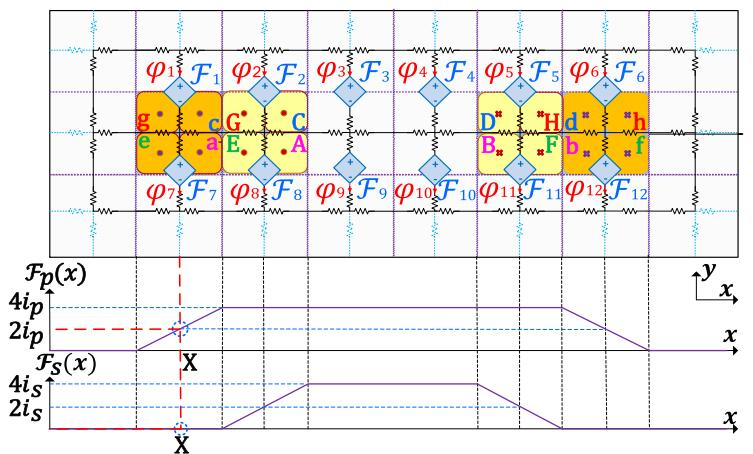  
(a)

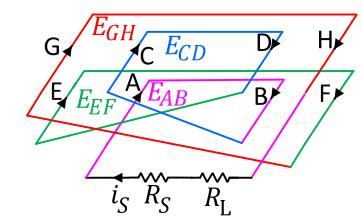

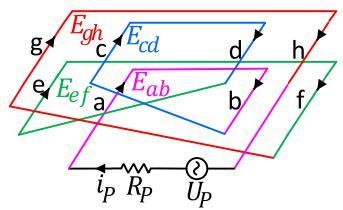  
(b)   
Fig. 1. (a) Distributed magnetic circuit with magnetomotive forces and (b) schematic of transformer winding turns and external circuit.

Fig. 1(a). And $\textbf { I } = [ i _ { p } \ i _ { s } ] ^ { T }$ which $i _ { P }$ and $i _ { S }$ are the primary and secondary winding currents, respectively. The components of ${ \bf N } _ { M M F }$ which has been introduced to relate F and I are derived using curves of the magnetomotive force distribution along the x axis for the primary and secondary windings $( \mathcal { F } _ { \mathrm { p } } ( x )$ and $\mathcal { F } _ { \mathrm { s } } ( x ) )$ ) presented below the transformer in Fig. 1(a). On each position in the x axis, the sum of the magnetomotive force sources displayed on the magnetic equivalent circuit must equal the sum of ${ \mathcal { F } } _ { \mathrm { s } } ( x )$ and ${ \mathcal { F } } _ { \mathrm { p } } ( x )$ at that point. For example, the sum of $\mathcal { F } _ { 1 }$ and $\mathcal { F } _ { 7 }$ in the circuit which are on the same position of $x = X$ , equals the sum of ${ \mathcal { F } } _ { \mathrm { p } } ( x )$ and ${ \mathcal { F } } _ { \mathrm { s } } ( x )$ at that position, which are $\mathcal { F } _ { \mathrm { p } } \left( X \right) = \ 2 i _ { p }$ and $\mathcal { F } _ { \mathrm { ~ s ~ } } ( X ) = ~ 0 .$ , and because the circuit has horizontal symmetry, the values of $\mathcal { F } _ { 1 }$ and $\mathcal { F } _ { 7 }$ are the same, and their values equal $i _ { p }$ . The other components of ${ \bf N } _ { M M F }$ are derived using the same rule as follows.

$$
\mathbf {N} _ {M M F} = \left[ \begin{array}{l l l l l l l l} 1 & 2 & 2 & 2 & 2 & 1 & 1 & 2 & 2 & 2 & 1 \\ 0 & 1 & 2 & 2 & 1 & 0 & 0 & 1 & 2 & 2 & 1 & 0 \end{array} \right] ^ {T} \tag {2}
$$

Until now, only the magnetic circuit has been included. Faraday’s law is used to include the electric circuit and the coupling of the electric and the magnetic circuits. Fig. 1(b) presents the schematic diagram for winding configuration demonstrating the total magnetic fluxes within each winding turn. The induced voltage in each turn is determined by the fluxes that flow through it. For instance, in the turn AB of the secondary winding which encloses the fluxes $\varphi _ { 9 }$ and $\varphi _ { 1 0 }$ , the voltage $E _ { A B }$ is induced which is derived by

$$
E _ {A B} = - \frac {d}{d t} \left(\varphi_ {9} + \varphi_ {1 0}\right) \tag {3}
$$

The voltages induced in other turns and the fluxes passing through them have the same relationship. Then, by adding the voltages induced in the turns of each winding, the total induced voltages in the primary winding $E _ { p }$ and secondary winding $E _ { s }$ are given by

$$
\mathbf {E} = - \frac {d}{d t} \mathbf {N} _ {E M F} \boldsymbol {\Phi} \tag {4}
$$

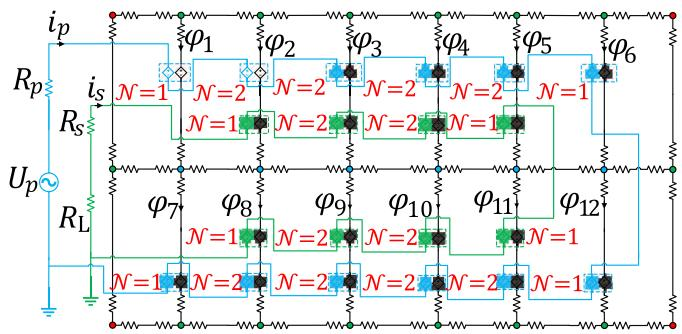  
Fig. 2. DRNM for a transformer (magnetic and electric circuits, as well as their coupling).

where

$$
\mathbf {E} = \left[ \begin{array}{l} E _ {P} \\ E _ {S} \end{array} \right] = \left[ \begin{array}{l} E _ {a b} + E _ {c d} + E _ {e f} + E _ {g h} \\ E _ {A B} + E _ {C D} + E _ {E F} + E _ {G H} \end{array} \right] \tag {5}
$$

$$
\boldsymbol {\Phi} = \left[ \varphi_ {1} \varphi_ {2} \varphi_ {3} \varphi_ {4} \varphi_ {5} \varphi_ {6} \varphi_ {7} \varphi_ {8} \varphi_ {9} \varphi_ {1 0} \varphi_ {1 1} \varphi_ {1 2} \right] ^ {T} \tag {6}
$$

$$
\mathbf {N} _ {E M F} = \mathbf {N} _ {M M F} ^ {T} \tag {7}
$$

In which $E _ { A B } , E _ { C D } , E _ { E F } , E _ { G H } , E _ { a b } , E _ { c d } , E _ { e f }$ and $E _ { g h }$ are the electromotive forces induced in the turns AB, CD, EF, GH, ab, cd, ef, and gh respectively. Moreover $\varphi _ { 1 } , \varphi _ { 2 } , \varphi _ { 3 } , . . . ,$ $\varphi _ { 1 2 }$ are the magnetic fluxes that pass through the winding turns which have been displayed in Fig. 1(a). And ${ \bf N } _ { E M F }$ is the matrix introduced to relate E and Φ.

Finally, the interface between the magnetic and electric circuits is derived using the above-mentioned relations and rules, as shown in Fig. 2. The magnetic circuit is shown in black, while the primary and secondary winding electric circuits are shown in blue and green, respectively. Coupling between the magnetic circuit with both the primary and secondary electric circuits has been achieved using a specific type of mutator element: Type-2 L-R mutator [21]. Fig. 3 depicts the Type-2 L-R mutator in schematic form. In EMT-type programs, two coupled series R-L branches can be deployed to implement this type of mutator [7]. The values of self and mutual resistances and inductances

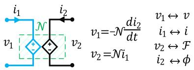  
Fig. 3. Type-2 L-R mutator.

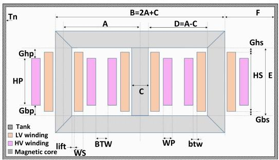  
Fig. 4. Schematic of a three-phase three-legged core-type transformer.

corresponding to the two branches are determined as follows.

$$
\left[ \begin{array}{l} v _ {1} \\ v _ {2} \end{array} \right] = \left[ \begin{array}{c c} 0 & 0 \\ \mathcal {N} & 0 \end{array} \right] \left[ \begin{array}{l} i _ {1} \\ i _ {2} \end{array} \right] + \left[ \begin{array}{c c} 0 & - \mathcal {N} \\ 0 & 0 \end{array} \right] \frac {d}{d t} \left[ \begin{array}{l} i _ {1} \\ i _ {2} \end{array} \right] \tag {8}
$$

where $\mathcal { N }$ is the coupling factor of the mutator and $v _ { 1 }$ and $i _ { 1 }$ are the current and voltage of the electric circuit which is displayed on the left side of Fig. 3 and represent the electric current and voltage, respectively, while $v _ { 2 }$ and $i _ { 2 }$ are the current and voltage of the magnetic equivalent circuit which is shown on the right side of Fig. 3 and represent magnetomotive force $\mathcal { F }$ and magnetic flux $\varphi$ , respectively.

# III. DISTRIBUTED RELUCTANCE NETWORK MODEL FOR A THREE-PHASE TRANSFORMER

In this section, DRNM, which was introduced in the previous section, is developed for a three-phase three-legged core-type transformer shown in Fig. 4. In addition, the problem space is meshed into a configurable number of elements, and the formulae required to calculate the properties of each element are presented in detail.

These steps are followed to implement DRNM for transformer model in EMT-type software. First, the problem space is subdivided into elements using a mesh refinement approach, which progresses from coarse to finer meshes until the accuracy of results reaches a satisfactory level. Second, the model’s elements are drawn from a set of generic types of elements. Third, the elements are connected based on how the transformer is meshed as well as the transformer winding connections. Finally, the values for the model’s elements are determined. In the following sections, these steps are described in detail.

# A. Meshing and Indexing

Since all three phases of the transformer are similar, the meshing, indexing, and value determination processes are the same for all three, and here, they are only explained for the

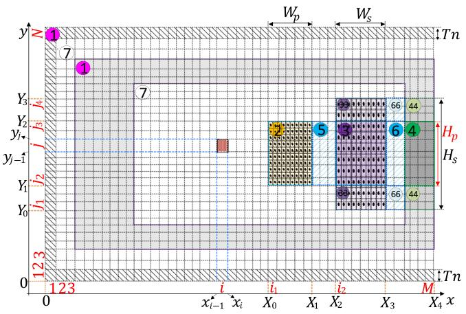  
Fig. 5. Cross-section of left half of the core (Only the windings on the middle column have been displayed.).

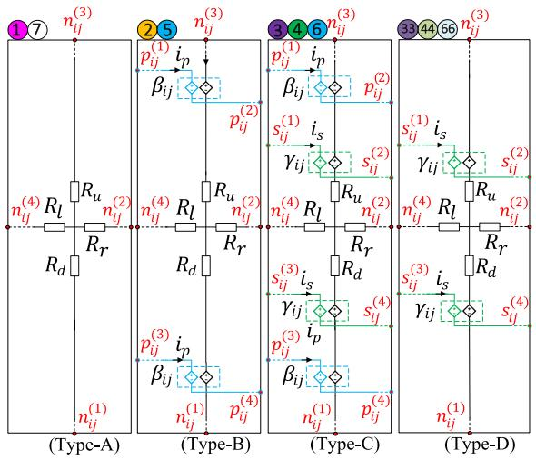  
Fig. 6. Circuits of four cell types (A, B, C, and D).

phase on the middle column of the core. It is worth noting that DRNM has been proposed to be capable of representing a wide range of operating conditions, and because out of core flux paths in the air and tank play a significant role in transformer behavior under unbalanced operating conditions, the effect of the tank and air outside the core has been considered for three-phase transformers, as illustrated in Fig. 5. Here, due to the vertical symmetry of the core, only the meshing for the left side of the core is explained, as illustrated in Fig. 5. DRNM for this transformer is made up of four general types of cells: Type-A, Type-B, Type-C, and Type-D which have been indicated in Fig. 6. Each of the four types of elements contains four linear or nonlinear reluctances called $R _ { u } , R _ { d } , R _ { r }$ and Rl. A pair of mutators for HV winding is included in Type-B cells. In addition, Type-C cells include two pairs of mutators, one pair for HV winding and the other pair for LV winding. A pair of mutators for LV winding is present in Type-D cells. In Fig. 6, the coupling factors of the mutators associated to HV and LV windings are defined by $\beta _ { i j }$ and $\gamma _ { i j }$ , respectively. As illustrated in Fig. 5, Type-A elements are used in parts 1 and 7, Type-B elements are

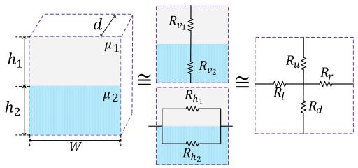  
Fig. 7. One nonuniform cell sample with two distinct materials.

used in parts 2 and 5, Type-C elements are used in parts 3, 4, and 6, and Type-D elements are used in parts 33, 44, and 66.

# B. Determination of Circuit Parameters

The parameters for elements are calculated in the manner shown below. Reluctances, both linear and nonlinear, are computed first. The linear reluctances are given by

$$
R = l / \left(\mu_ {0} S\right) \tag {9}
$$

where l and S denote the mean length and cross-section of the flux path that reluctance represents, and $\mu _ { 0 }$ is the magnetic permeability of air. To express nonlinear reluctances, a piecewise linear function with given number of segments is used to depict the magnetizing curve. The slope between change points p and $p { - } 1$ defines the incremental magnetic relative permeability $\mu _ { p }$ of each segment of the piecewise linear curve.

$$
\mu_ {p} = \frac {1}{\mu_ {0}} \frac {B _ {p} - B _ {p - 1}}{H _ {p} - H _ {p - 1}} \tag {10}
$$

As a result, nonlinear reluctance curves are modelled using a piecewise linear form. The incremental reluctance $R _ { p }$ of segment p of the piecewise-linear curve is defined as the slope between changepoints p and p-1

$$
R _ {p} = \left(v _ {p} - v _ {p - 1}\right) / \left(i _ {p} - i _ {p - 1}\right) \tag {11}
$$

where $R _ { p }$ is determined by (9) with $\mu$ set to $\mu _ { p }$

In (9)–(11), each mesh was assumed to be made up of a single material. However, depending on the size and location of the element, it could include several different types of materials with different permeabilities. Fig. 7 illustrates a nonuniform cell made up of two tubes with two different materials with relative permeabilities of $\mu _ { 1 }$ and $\mu _ { 2 }$ . Two tubes have the same width and thickness (W and d in Fig. 7), but not the same heights $( h _ { 1 }$ and $h _ { 2 }$ in Fig. 7). The following formula is used to compute the equivalent reluctances for this cell

$$
R _ {u} = R _ {d} = \left(R _ {v _ {1}} + R _ {v _ {2}}\right) / 2 \tag {12}
$$

$$
R _ {l} = R _ {r} = \left(R _ {h _ {1}} + R _ {h _ {2}}\right) / \left(2 \left(R _ {h _ {1}} + R _ {h _ {2}}\right)\right) \tag {13}
$$

where $R _ { u }$ and $R _ { d }$ are the vertical reluctances for the equivalent cell, $\boldsymbol { R _ { v _ { 1 } } }$ and $R _ { v _ { 2 } }$ are the vertical reluctances for the upper and lower tubes of the cell, respectively. $R _ { l }$ and $R _ { r }$ are the horizontal reluctances for the equivalent cell and $R _ { h }$ and $R _ { h _ { 2 } }$ are the horizontal reluctances for the upper and lower parts of the cell, respectively. $R _ { v _ { 1 } } , R _ { v _ { 2 } } , R _ { h _ { 1 } }$ and $R _ { h _ { 2 } }$ are given by

$$
R _ {v _ {1}} = h _ {1} / (\mu_ {1}. d. W) \tag {14}
$$

$$
R _ {v _ {2}} = h _ {2} / (\mu_ {2}. d. W) \tag {15}
$$

$$
R _ {h _ {1}} = W / \left(\mu_ {1}. d. h _ {1}\right) \tag {16}
$$

$$
R _ {h _ {2}} = W / \left(\mu_ {2}. d. h _ {1}\right) \tag {17}
$$

Finally, the parameters of the mutators of the Type-B, Type-C, and Type-D elements depicted in Fig. 6 are found by applying Ampere’s law and Faraday’s law in distributed form. The coupling factors $\beta _ { i j }$ and $\gamma _ { i j } .$ , which are related to the mutators of the HV and LV windings of the element in $i ^ { t h }$ column and $j ^ { t h }$ row, are given by (18) and (19) shown at the bottom of the next page respectively. Where $N _ { p }$ and $N _ { s }$ represent the number of HV and LV winding turns, respectively. $W _ { p }$ and $W _ { s }$ are the widths of the HV and LV windings, respectively, and $H _ { p }$ and $H _ { s }$ are the heights of the HV and LV windings. $x _ { i - 1 } , x _ { i } , y _ { j - 1 }$ and $y _ { j }$ are the horizontal and vertical coordinates of the cell placed in $i ^ { t h }$ column and $j ^ { t h }$ row. $X _ { 0 } , X _ { 1 } , Y _ { 1 }$ and $Y _ { 2 }$ are the horizontal and vertical coordinates of the HV winding and $X _ { 2 } , X _ { 3 } , Y _ { 0 }$ and $Y _ { 3 }$ are the horizontal and vertical coordinates of the LV winding. $X _ { 4 }$ is the horizontal coordinate of the center of the core.

# C. Connection of Model Elements

After finding and assigning the parameters for each element, the elements must now be connected. As it can be observed in the elements presented in Fig. 6, nodes n(1)ij , $n _ { i j } ^ { ( 1 ) } , n _ { i j } ^ { ( 2 ) } , n _ { i j } ^ { ( 3 ) }$ , and n ij $n _ { i j } ^ { ( 4 ) }$ are the nodes related to the magnetic part of the element placed in $i ^ { t h }$ column and $j ^ { t h }$ row of Fig. 5. In Algorithm 1, it has been shown how magnetic parts of the elements are connected through these nodes.

Algorithm 2 and Algorithm 3 are used to establish the internal electrical connections between elements. As it can be observed in the elements presented in Fig. 6, nodes p (1)ij , p (2)ij , $p _ { i j } ^ { ( 1 ) } , p _ { i j } ^ { ( 2 ) } , p _ { i j } ^ { ( 3 ) }$ ， , and p (4)ij $p _ { i j } ^ { ( 4 ) }$ are the nodes related to the HV winding of the element placed in $i ^ { t h }$ column and $j ^ { t h }$ row of Fig. 5 and they are connected using the procedure presented in Algorithm 2. Nodes $s _ { i j } ^ { ( 1 ) } , s _ { i j } ^ { ( 2 ) } , s _ { i j } ^ { ( 3 ) }$ ij i j , and $s _ { i j } ^ { ( 4 ) }$ ij are the nodes related to the LV winding of that element and they are connected using the procedure presented in Algorithm 3. The internal electrical connections for two other transformer phases are established using the same algorithms.

# IV. STUDY OF INTERNAL FAULTS

In this section, the proposed DRNM is used to model internal faults in transformers using EMT-type software. To accomplish this, the faulty part of the winding is treated as a distinct winding, and the healthy parts of the winding are also treated as distinct windings. The fault between a coil and the ground, as well as the fault between two turns of a winding, are both modelled using DRNM. To model a coil-to-earth fault, the faulty winding is divided into two parts, as shown in Fig. 8(a). And as illustrated in Fig. 8(b), the faulty winding is divided into three parts to model a turn-to-turn fault. In DRNM, each new part is treated as a distinct winding, with Ampere’s and Faraday’s laws applied independently. The distinct parts are then connected to one

Algorithm 1: Internal Magnetic Connections.   
for $j^{*}\gets 1$ to $N^{**}$ do for $i^{**}\gets 1$ to $(2M^{****})$ do if $j <   N$ & $i <   2M$ connect $(n_{ij}^{(2)},n_{(i + 1)j}^{(4)})$ connect $(n_{ij}^{(3)},n_{i(j + 1)}^{(1)})$ elseif $j = N$ & $i <   2M$ connect $(n_{ij}^{(2)},n_{(i + 1)j}^{(4)})$ elseif $j <   N$ & $i = 2M$ connect $(n_{ij}^{(3)},n_{i(j + 1)}^{(1)})$ end end end

another, with the faulty part is also being connected to the impedance of the fault. The steps in the prior section are almost followed to model internal faults. However, because additional parts have been introduced, new elements must be defined, their parameters set, and their connections made.

A pair of mutators are added to the model exclusively for each part of the faulty winding that was deemed as a separate winding. Fig. 9 shows three new defined element types (Type-${ \bf B } _ { 1 }$ , Type- $\cdot \mathbf { B } _ { 2 } .$ and Type- ${ \bf \cdot C } _ { 1 ) }$ for a case involving a coil-to-earth fault. For a turn-to-turn fault case, four new defined elements are displayed in Fig. 10. The parameters of the new mutators shown in Fig. 9 and Fig. 10 are given by (20), (21) and (22),

Algorithm 2: Electric Connections for HV Winding.   
for $j\gets j_2^*$ to $j_{3}^{**}$ do for $i\gets i_1^{***}$ to $(2M - i_{1})$ do connect $(p_{ij}^{(2)},p_{(i + 1)j}^{(1)})$ connect $(p_{ij}^{(4)},p_{(i + 1)j}^{(3)})$ end connect $(p_{(2M - i_1 + 1)^{****}j},p_{(i_1)j}^{(3)})$ if $j > j_{2}$ then connect $(p_{(2M - i_1 + 1)j}^{(4)},p_{(i_1)(j - 1)}^{(1)})$ end end \*: $j_{2}$ is the row number of the lowest cells related to HV winding in Fig.5. \*\*: $j_{3}$ is the row number of the highest cells related to HV winding in Fig.5. \*\*: $i_{1}$ is the column number of the leftmost cells related to HV winding in Fig.5. \*\*: $2M - i_{1} + 1$ is the column number of the rightmost cells related to right part of HV winding which due to the symmetry has not been shown in Fig.5.

as shown at the bottom of this page where $N _ { p }$ is the number of turns of HV winding. And for the turn to earth fault shown in Fig. 8(a), $W _ { p } ^ { \prime }$ and $\bar { W } _ { p } ^ { \prime \prime }$ are the width of the faulty and healthy parts of HV winding, $X _ { 0 } , X _ { 0 } ^ { \prime } , Y _ { 1 }$ and $Y _ { 2 }$ are the horizontal and vertical coordinates of the faulty part of HV winding and $X _ { 0 } ^ { \prime } ,$ $X _ { 0 } ^ { \prime \prime } , Y _ { 1 }$ and $Y _ { 2 }$ are the horizontal and vertical coordinates of the healthy part of HV winding. And for the turn-to-turn fault shown in Fig. 8(b), $W _ { p } ^ { \prime }$ and $\boldsymbol { W } _ { p } ^ { \prime \prime \prime }$ are the widths of the healthy parts of HV winding, and $\boldsymbol { W } _ { p } ^ { \prime \prime }$ is the width of the faulty part. $X _ { 0 } , X _ { 0 } ^ { \prime } , Y _ { 1 }$

$$
\beta_ {i j} = \left\{ \begin{array}{l l l l l} \frac {N _ {p} \left(y _ {j} - y _ {j - 1}\right)}{2 W _ {p} H _ {p}} \left(\frac {x _ {i - 1} + x _ {i}}{2} - X _ {0}\right) & x _ {i - 1} \geq X _ {0}, & x _ {i} \leq X _ {1}, & y _ {j - 1} \geq Y _ {1}, & y _ {j} \leq Y _ {2} \\ \frac {N _ {p} \left(y _ {j} - y _ {j - 1}\right)}{2 H _ {p}} & x _ {i - 1} \geq X _ {1}, & x _ {i} \leq X _ {4}, & y _ {j - 1} \geq Y _ {1}, & y _ {j} \leq Y _ {2} \end{array} \right. \tag {18}
$$

$$
\gamma_ {i j} = \left\{ \begin{array}{l l l l l} \frac {N _ {s} \left(y _ {j} - y _ {j - 1}\right)}{2 W _ {s} H _ {s}} \left(\frac {x _ {i - 1} + x _ {i}}{2} - X _ {2}\right) & x _ {i - 1} \geq X _ {2}, & x _ {i} \leq X _ {3}, & y _ {j - 1} \geq Y _ {0}, & y _ {j} \leq Y _ {3} \\ \frac {N _ {s} \left(y _ {j} - y _ {j - 1}\right)}{2 H _ {s}} & x _ {i - 1} \geq X _ {3}, & x _ {i} \leq X _ {4}, & y _ {j - 1} \geq Y _ {0}, & y _ {j} \leq Y _ {3} \end{array} \right. \tag {19}
$$

$$
\beta_ {i j} ^ {\prime} = \left\{ \begin{array}{l l l l l} \frac {N _ {p} \left(y _ {j} - y _ {j - 1}\right)}{2 W _ {p} H _ {p}} \left(\frac {x _ {i - 1} + x _ {i}}{2} - X _ {0}\right) & x _ {i - 1} \geq X _ {0}, & x _ {i} \leq X _ {0} ^ {\prime}, & y _ {j - 1} \geq Y _ {1}, & y _ {j} \leq Y _ {2} \\ \frac {N _ {p} W _ {p} ^ {\prime} \left(y _ {j} - y _ {j - 1}\right)}{2 W _ {p} H _ {p}} & x _ {i - 1} \geq X _ {0} ^ {\prime}, & x _ {i} \leq X _ {4}, & y _ {j - 1} \geq Y _ {1}, & y _ {j} \leq Y _ {2} \end{array} \right. \tag {20}
$$

$$
\beta_ {i j} ^ {\prime \prime} = \left\{ \begin{array}{l l l l l} \frac {N _ {p} \left(y _ {j} - y _ {j - 1}\right)}{2 W _ {p} H _ {p}} \left(\frac {x _ {i - 1} + x _ {i}}{2} - X _ {0} ^ {\prime}\right) & x _ {i - 1} \geq X _ {0} ^ {\prime}, & x _ {i} \leq X _ {0} ^ {\prime \prime}, & y _ {j - 1} \geq Y _ {1}, & y _ {j} \leq Y _ {2} \\ \frac {N _ {p} W _ {p} ^ {\prime \prime} \left(y _ {j} - y _ {j - 1}\right)}{2 W _ {p} H _ {p}} & x _ {i - 1} \geq X _ {0} ^ {\prime \prime}, & x _ {i} \leq X _ {4}, & y _ {j - 1} \geq Y _ {1}, & y _ {j} \leq Y _ {2} \end{array} \right. \tag {21}
$$

$$
\beta_ {i j} ^ {\prime \prime} = \left\{ \begin{array}{l l l l l} \frac {N _ {p} \left(y _ {j} - y _ {j - 1}\right)}{2 W _ {p} H _ {p}} \left(\frac {x _ {i - 1} + x _ {i}}{2} - X _ {0} ^ {\prime \prime}\right) & x _ {i - 1} \geq X _ {0} ^ {\prime \prime}, & x _ {i} \leq X _ {1}, & y _ {j - 1} \geq Y _ {0}, & y _ {j} \leq Y _ {3} \\ \frac {N _ {p} W _ {p} ^ {\prime \prime} \left(y _ {j} - y _ {j - 1}\right)}{2 W _ {p} H _ {p}} & x _ {i - 1} \geq X _ {1}, & x _ {i} \leq X _ {4}, & y _ {j - 1} \geq Y _ {0}, & y _ {j} \leq Y _ {3} \end{array} \right. \tag {22}
$$

Algorithm 3: Electric Connections for LV Winding.   
for $j\gets j_1^*$ to $j_4^{**}$ do  
for $i\gets i_2^{***}$ to $(2M - i_{2})$ do  
connect $(s_{ij}^{(2)},s_{(i + 1)j}^{(1)})$ connect $(s_{ij}^{(4)},s_{(i + 1)j}^{(3)})$ end  
connect $(s_{(2M - i_2 + 1)^{****}j},s_{(i_2)j}^{(3)})$ if $j > j_{1}$ then  
connect $(s_{(2M - i_2 + 1)j}^{(4)},s_{(i_2)(j - 1)}^{(1)})$ end

∗: $j _ { 1 }$ is the row number of the lowest cells related to LV winding in Fig. 5.   
$* * \colon j _ { 4 }$ is the row number of the highest cells related to LV winding in Fig. 5.   
∗∗∗: $i _ { 2 }$ is the column number of the leftmost cells related to LV winding in Fig. 5.   
∗∗∗∗: $2 M - i _ { 2 } + 1$ is the column number of the rightmost cells related to right part of LV winding which due to the symmetry has not been shown in Fig. 5.

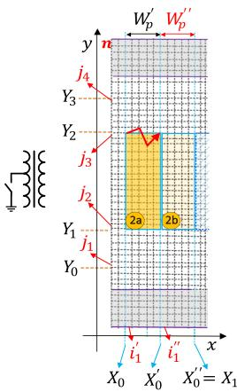  
(a)

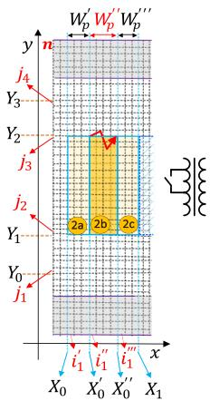  
(b)   
Fig. 8. Meshes generated for a portion of a faulty transformer with fault on the middle column’s HV winding. (a) Turn to earth fault. (b) Turn to turn fault.

and $Y _ { 2 }$ are the horizontal and vertical coordinates of the healthy part of HV winding which is on the left side of the faulty part and $\bar { X } _ { 0 } ^ { \prime } , X _ { 0 } ^ { \prime \prime } , Y _ { 1 }$ and $Y _ { 2 }$ are the horizontal and vertical coordinates of the faulty part of HV winding and $X _ { 0 } ^ { \prime \prime } , X _ { 0 } ^ { \prime \prime \prime } , Y _ { 1 }$ and $Y _ { 2 }$ are the horizontal and vertical coordinates of the healthy part of HV winding which is located on the right side of the faulty part. The rules for all magnetic/electric connections of the model are identical to the rules outlined in the preceding section. Except that the faulty winding is divided into distinct windings, and the connections between the mutators for each distinct winding are made by the procedure presented in Algorithm 4.

Until now, we have discussed the model creation procedure for a three-phase three-leg transformer. For a three-phase fiveleg transformer, all of the steps are identical to those for a

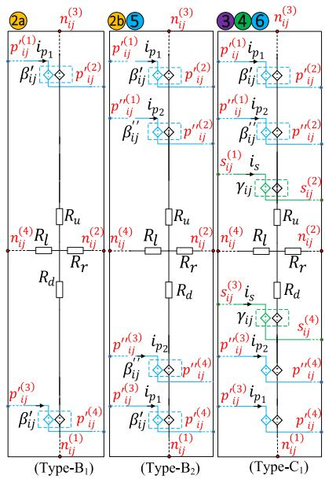  
Fig. 9. Circuits of cell types related to the mesh generated in Fig. 8(a).

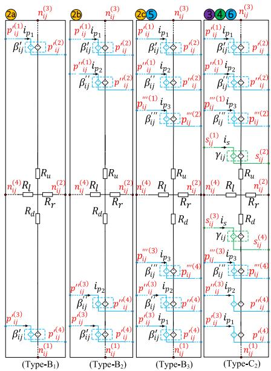  
Fig. 10. Circuits of cell types related to the mesh generated in Fig. 8(b).

three-phase three-leg transformer, except that two additional columns with no winding contain only type-A elements with nonlinear reluctances and they don’t have the coupling elements (mutators).

# V. RESULTS AND VALIDATION

In this section, the proposed DRNM approach is implemented for the three-phase transformer shown in Fig. 4, whose characteristics are listed in Table I and dimensions are listed in Table II, as well as the magnetic properties of the iron core, are presented in Table III. The DRNM approach is implemented using EMTP [1] and FEM is solved using ANSYS Electromagnetics.

Initially, we must determine the suitable mesh size before we can obtain the results. In a similar way to FEM, the accuracy that

Algorithm 4: Electric Connections for HV Winding.   
for $j\gets j_2$ to $j_{3}$ do for $w\gets \{i_1^{\prime \ast},i_1^{\prime \prime \ast \ast},i_1^{\prime \prime \prime \ast \ast}\}$ for $i\gets w$ to $(2M - w)$ do connect $(p_{ij}^{(2)},p_{(i + 1)j}^{(1)})$ connect $(p_{ij}^{(4)},p_{(i + 1)j}^{(3)})$ end connect $(p_{(2M - w + 1)^{****}j}^{(2)},p_{(w)j}^{(3)})$ if $j > j_{2}$ then connect $(p_{(2M - w + 1)j}^{(4)},p_{(w)(j - 1)}^{(1)})$ end End end

∗: $i _ { 1 } ^ { \prime }$ : for turn-to-earth fault in Fig. 8(a) is the column number of the leftmost cells related to the faulty part of HV winding called part 2a, and for turn-to-turn fault shown in Fig. 8(b) is the column number of the leftmost cells related to the healthy part of HV winding called part 2a.   
∗∗: $i _ { 1 } ^ { \prime \prime }$  : for turn to earth fault in Fig. 8(a) is the column number of the leftmost cells related to the healthy part of HV winding and for turn to turn fault in Fig. 8(b) is the column number of the leftmost cells related to the faulty part of HV winding called part 2b.   
∗∗∗: $i _ { 1 } ^ { \prime \prime \prime }$ : for turn-to-turn fault in Fig. 8(b) is the column number of the leftmost cells related to the healthy part of HV winding called part 2c.   
∗∗∗∗: $2 M - w + 1$ is the column number of the rightmost cells related to right part of different sections of HV windings which due to the symmetry has not been shown in Fig. 8.

can be obtained from DRNM is directly related to the mesh that is used. As the elements are reduced in size and the mesh is refined, the computed solution will approach the true solution. However, as the number of elements increases, the computational burden increase, and as a result, a technique known as mesh refinement is used. Mesh refinement is a process in which the mesh size is successively reduced, and the results are compared. Two mesh refinement metrics are investigated to determine whether the mesh refinement has resulted in a converged solution. One local metric and one global metric are used in this paper. The local metric is the magnetic flux amplitude in a single spot on the core, while the global metric is the current of the HV winding. Fig. 11 illustrates the convergence of both the global (red) and local (blue) metrics with 1% error bars in comparison to the most refined solution. After weighing all of these factors, the mesh size for DRNM is set to 2848. In addition, the FEM mesh includes 3292 elements.

First, open-circuit results are acquired by unloading the secondary, exciting the primary winding at various voltage levels, and deriving the current in the primary winding. In Fig. 12, rms voltage-current characteristics derived from DRNM are

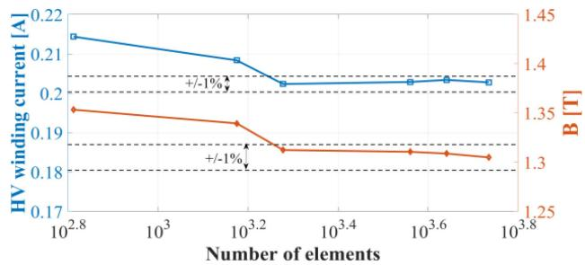  
Fig. 11. Convergence of a global metric (blue) and a local metric (red).

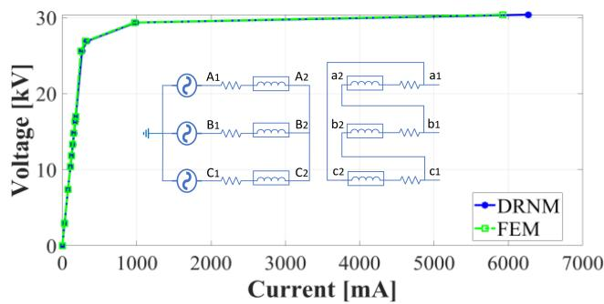  
Fig. 12. V-I characteristic for open-circuit.

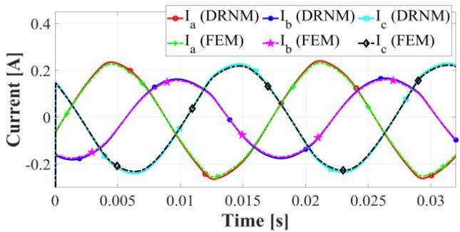  
Fig. 13. Primary winding currents in three phases during open-circuit.

compared to those obtained from FEM in 2-D. They are around 1-2 percent close in linear operating conditions, and 3-4 percent close in saturated operating conditions. In addition, as an example, the current of the primary windings has been shown in Fig. 13, when the voltage exciting the primary winding is set to 20 kV and the secondary winding is open-circuit. The results are extremely similar to those obtained by using FEM.

Second, in order to obtain short-circuit results, the secondary winding is short-circuited, and the current of the primary winding which has been excited at various voltage levels is derived. In Fig. 14, the DRNM results for the voltage-current characteristic of the primary winding are compared to the FEM results, and they differ by roughly 2-3 percent. Fig. 15 shows the current of the primary winding when its excitation voltage is set to 1000 V and the secondary winding is short circuited. Again, the DRNM results for a short-circuit are matched with FEM results.

DRNMs, like FEM, can reflect the internal behavior of magnetic devices. For example, as illustrated in Fig. 16, the magnetic

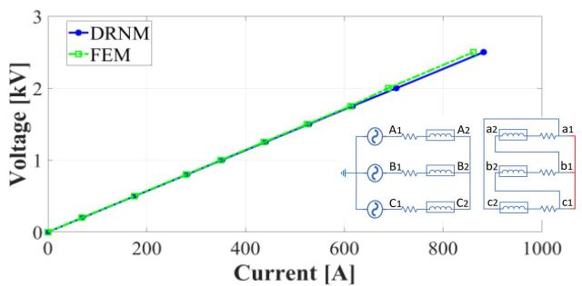  
Fig. 14. V-I characteristic while short-circuiting the secondary side.

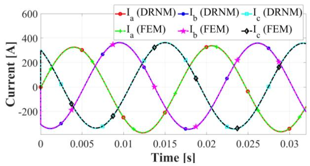  
Fig. 15. Primary winding currents in three phases during short-circuit.

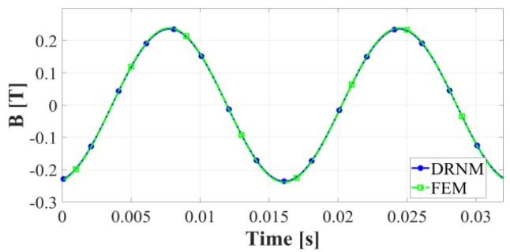  
Fig. 16. Magnetic flux density B regarding a point placed exactly in the center of left air-gap between the HV and LV windings of phase A.

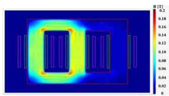

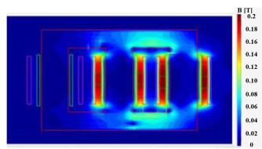  
(b)   
Fig. 17. Flux density distribution for (a) open-circuit and (b) short-circuit condition.

flux of a local point, calculated by DRNM and FEM, are very similar. Also, it is essential to represent how magnetic flux is distributed across a transformer’s core, windings, and air in order to calculate core losses and determine magnetic flux paths under various operating conditions. Fig. 17 shows two examples of flux distribution for open-circuit and short-circuit operating conditions derived by DRNM. It is apparent that DRNM has

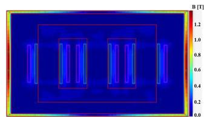

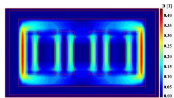

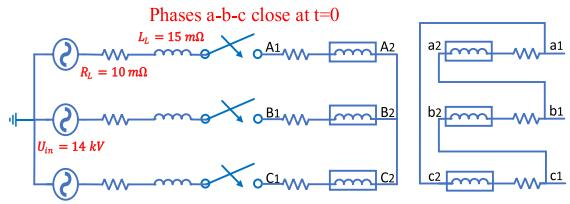  
Fig. 18. Flux density distribution in transformer under unbalanced operating condition (zero-sequence flux paths) in (a) three-leg transformer and (b) five-leg transformer.   
Fig. 19. Description of the circuit of transformer energization (transformer with Star-Delta connection and secondary is unloaded).

been able to provide a good resolution of flux paths in such a way that even the flux distribution in the edges has been successfully represented.

Furthermore, DRNM is capable of depicting the behavior of magnetic flux paths when operating under unbalanced operating conditions. For a three-leg transformer and a five-leg transformer, examples of flux distributions for an unbalanced operating condition involving zero-sequence flux paths were derived using DRNM, and they are depicted in Fig. 18(a) and (b). As can be seen, the zero-sequence flux in the three-leg core is unable to close its paths within the core and is forced to close them through the tank. Furthermore, it can be seen that DRNM has been able to present peak values of flux densities that can be used to detect the positions of spots that are likely to experience excessive local heating. However, in the case of a five-leg transformer, the zero-sequence flux closes the path through the two additional legs that lack windings, and it can be seen that DRNM accurately depicts the flux density distribution in this case.

To demonstrate that the proposed model can be used to study transformer electromagnetic transients, an example of energizing the transformer connected to an RL impedance and a voltage source (the circuit has been shown in Fig. 19) is investigated. The 3 phases are energized simultaneously. The inrush current generated by DRNM is compared to that of FEM. The phase b inrush currents are shown in Fig. 20. The maximum relative error between DRNM and FEM is 3 percent.

Finally, DRNM’s capacity to represent internal faults is demonstrated. To begin, only the phase on the middle column of the core is considered energized to validate the accuracy of DRNM in representing the leakage flux paths during internal faults. Transformer windings are multi-layered in this case, with ten layers in the high-voltage winding.

First, an internal fault with resistance $R _ { f }$ between the second and third layers of the HV winding is investigated.

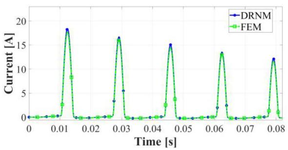  
Fig. 20. Inrush currents, solved with DRNM and FEM.

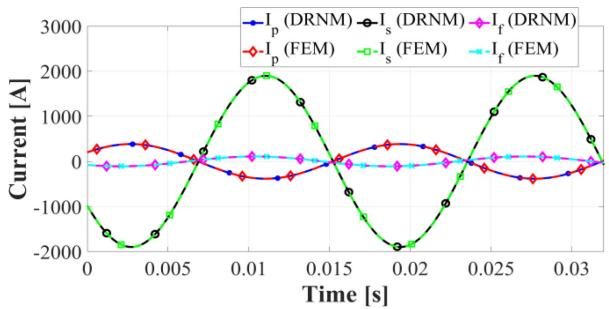  
Fig. 21. Currents during an inter-turn fault with $\boldsymbol { R _ { f } } = \mathrm { ~ \boldsymbol ~ { ~ 3 ~ } ~ }$ Ω, $R _ { l o a d }$ = 1.3681 Ω.

The HV winding is connected at its nominal voltage in this case, whereas the LV winding is connected to a resistive load of $R _ { l o a d } = 1 . 3 7 \Omega$ which makes nominal current to flow through the transformer. The currents of the healthy and faulty sections of the HV winding, denoted by $I _ { p }$ and $I _ { f }$ , as well as the current of the LV winding, denoted by $I _ { s } ,$ are determined using DRNM and FEM for various values of $R _ { f }$ . Fig. 21 shows the $I _ { p } , I _ { s }$ , and $I _ { f }$ derived for $R _ { f } = 3 \Omega$ .

Second, to demonstrate DRNM’s robustness for representing various internal faults, we calculated fault currents for various fault locations and fault resistances using DRNM and compared them to those obtained using FEM. When the fault is located at a distance of 5% of coil from the neutral point, the fault current for various fault resistors is calculated first, and then the fault current for various fault resistors is calculated at fault located at distances of 10, 20, 30, and 40% of coil from the neutral point. This procedure is performed for both windings, one fault is occurring in the HV winding and another fault is in the LV winding.

Figs. 22 and 23 illustrate the derived fault currents for internal faults in HV and LV windings using both DRNM and FEM. The difference between DRNM and FEM is less than 2% in cases where the faulty coil section exceeds 20% of the coil and around 4% in cases where the faulty coil section is less than 20% of the coil.

One of the critical characteristics of DRNM that should be compared to FEM is their computational speed. To accomplish this, simulations were run for 32 ms with a 1 μs time step, and as previously stated, the mesh size for DRNM is 2848, while the mesh size for FEM is 3292. As can be seen in Fig. 24, DRNM

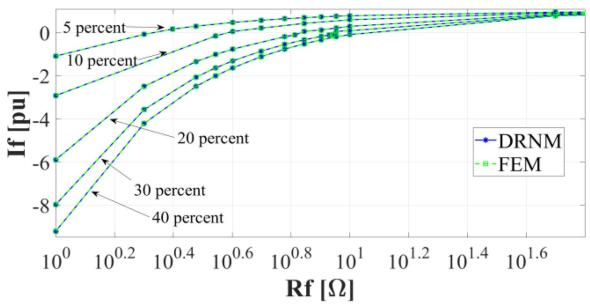  
Fig. 22. Per unit current of the affected winding for different fault resistance and different fault locations in the HV winding. (The base current in this figure is the winding current when there is no fault).

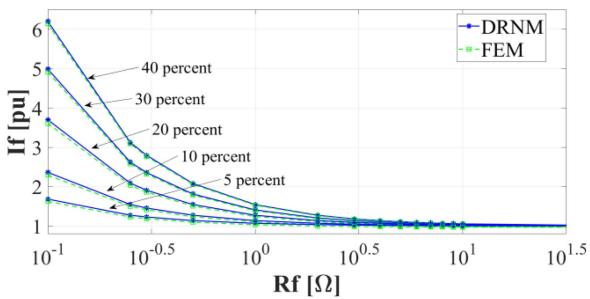  
Fig. 23. Per unit current of the affected winding for different fault resistance and different fault locations in the LV winding. (The base current in this figure is the winding current when there is no fault).

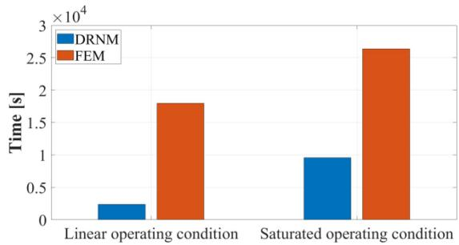  
Fig. 24. DRNM vs. FEM in terms of computation time.

is approximately eight times faster than FEM under linear operation conditions. Additionally, DRNM is approximately three times faster than FEM in saturated operation conditions with a high degree of nonlinearity. DRNM is computationally faster than FEM since it solves equations that are simpler, as DRNM considers the flux path in two directions, whereas FEM considers it in multiple directions. Furthermore, contrary to DRNM, where the direction of the flux path is known prior to application, in FEM, the direction of the flux path is also one of the unknowns that must be determined. Notably, the speed advantage of DRNM over FEM is better demonstrated when modelling transformers in large power systems.

In this paper the core losses have not been considered. The DRNM is proposed primarily for studies of steady-state operation, inrush currents, ferroresonance, internal faults between turns or windings, or to determine the zero-sequence impedance

and air-core inductances. However, we will integrate eddy current losses in future work, which may be deduced from the approach described in [22]. In which a coupled technique is used between the RNM and the eddy current circuit models.

# VI. CONCLUSION

A new meshed approach was proposed in this paper to make circuit-based methods as similar to FEMs as possible, in order to provide a detailed representation of transformers in power networks. This proposed approach can also be applied to any transformer topology. It was demonstrated that the proposed technique can accurately portray the internal and external behavior of three-phase transformer. And it can be used to investigate the transformer in both steady-state and transient state. The proposed method can be utilized to represent internal faults in transformers in such a way that not only can leakage flux path be accurately represented, but also the effect of the core can be considered. Both turn to earth and turn-to-turn faults can be modelled using this approach. This approach can also be used to model multi-winding transformers that are often employed in power electronic applications. The derived results were validated using the FEM, and it was determined that they were extremely similar to the FEM results, with an error of less than 3% in most situations, showing high modelling accuracy.

# APPENDIX

TABLE I SPECIFICATIONS OF TRANSFORMER   

<table><tr><td>Nominal power (MVA)</td><td>15</td><td>Connection type</td><td>YnD</td></tr><tr><td>Primary voltage (kV)</td><td>25.663</td><td>HV winding turns</td><td>317</td></tr><tr><td>Secondary voltage (kV)</td><td>4.530</td><td>LV winding turns</td><td>56</td></tr></table>

TABLE II DESIGN AND GEOMETRICAL PARAMETERS OF TRANSFORMER   

<table><tr><td>Parameter</td><td>Length [mm]</td><td>Parameter</td><td>Length [mm]</td><td>Parameter</td><td>Length [mm]</td></tr><tr><td>A</td><td>995</td><td>HS</td><td>1190</td><td>HP</td><td>1121</td></tr><tr><td>B</td><td>2410</td><td>Ghs</td><td>158</td><td>Ghp</td><td>197</td></tr><tr><td>C</td><td>420</td><td>Gbs</td><td>143</td><td>Gbp</td><td>182</td></tr><tr><td>D</td><td>575</td><td>Lift</td><td>21</td><td>WP</td><td>60</td></tr><tr><td>E</td><td>1491</td><td>WS</td><td>45.5</td><td>btw</td><td>91</td></tr></table>

TABLE III B-H CURVE OF THE MAGNETIC CHARACTERISTIC OF THE IRON CORE   

<table><tr><td></td><td>1</td><td>2</td><td>3</td><td>4</td><td>5</td><td>6</td><td>7</td><td>8</td><td>9</td><td>10</td><td>11</td><td>12</td><td>13</td></tr><tr><td>B[T]</td><td>1.45</td><td>1.5</td><td>1.55</td><td>1.6</td><td>1.65</td><td>1.7</td><td>1.75</td><td>1.8</td><td>1.85</td><td>1.9</td><td>1.92</td><td>1.94</td><td>1.98</td></tr><tr><td>H[A/m]</td><td>23.7</td><td>24.8</td><td>26.3</td><td>29.1</td><td>33.4</td><td>40.6</td><td>53.2</td><td>80.4</td><td>172</td><td>398</td><td>607</td><td>918</td><td>4943</td></tr></table>

# REFERENCES

[1] J. Mahseredjian, S. Dennetière, L. Dubé, B. Khodabakhchian, and L. Gérin-Lajoie, “On a new approach for the simulation of transients in power systems,” Electric Power Syst. Res., vol. 77, no. 11, pp. 1514–1520, 2007.   
[2] J. A. Martinez and B. A. Mork, “Transformer modeling for low- and midfrequency transients—A review,” IEEE Trans. Power Del., vol. 20, no. 2, pp. 1625–1632, Apr. 2005.

[3] S. Jazebi et al., “Duality derived transformer models for low-frequency electromagnetic transients—Part I: Topological models,” IEEE Trans. Power Del., vol. 31, no. 5, pp. 2410–2419, Oct. 2016.   
[4] A. Rezaei-Zare, “Enhanced transformer model for Low- and Mid-Frequency transients—Part I: Model development,” IEEE Trans. Power Del., vol. 30, no. 1, pp. 307–315, Feb. 2015.   
[5] M. Lambert, M. Martínez-Duró, A. Rezaei-Zare, and J. Mahseredjian, “Topological transformer leakage modeling with losses,” IEEE Trans. Power Del., vol. 35, no. 6, pp. 2692–2699, Dec. 2020.   
[6] M. Akbari, A. Rezaei-Zare, M. A. M. Cheema, and T. Kalicki, “Air gap inductance calculation for transformer transient model,” IEEE Trans. Power Del., vol. 36, no. 1, pp. 492–494, Feb. 2021.   
[7] M. Lambert, J. Mahseredjian, M. M. Duró, and F. Sirois, “Magnetic circuits within electric circuits: Critical review of existing methods and new mutator implementations,” IEEE Trans. Power Del., vol. 30, no. 6, pp. 2427–2434, Dec. 2015.   
[8] P. Silvester and R. Ferrari, Finite Elements for Electrical Engineers, 2nd ed., Cambridge, U.K.: Cambridge Univ. Press, 1990.   
[9] K. Yamada, Y. Takahashi, and K. Fujiwara, “Simplified 3-D modeling for skewed rotor slots with end-ring of cage induction motors,” IEEE Trans. Magn., vol. 52, no. 3, Mar. 2016, Art. no. 8101604.   
[10] F. Meng, D. Wang, Z. Liu, and W. Su, “Fast circuit-field coupling analysis for skewed induction motor,” IEEE Trans. Ind. Electron., vol. 68, no. 6, pp. 5088–5099, Jun. 2021.   
[11] S. Dennetière, Y. Guillot, J. Mahseredjian, and M. Rioual, “A link between EMTP-RV and FLUX3D for transformer energization studies,” in Proc. Int. Conf. Power Syst. Transients, 2007, pp. 5088–5099.   
[12] J. Hopkinson and E. Hopkinson, “Dynamo-electric machinery,” Philos. Trans. Roy. Soc. A, vol. 177, pp. 331–358, 1886.   
[13] J. Turowski, M. Turowski, and M. Kopec, “Method of three-dimensional network solution of leakage field of three-phase transformers,” IEEE Trans. Magn., vol. 26, pp. 2911–2919, no. 5, Sep. 1990.   
[14] J. Turowski, “Fast computation of coupled fields in complex, 3-D, industrial electromagnetic structures,” COMPEL, vol. 17, no. 4, pp. 489–505, 1998.   
[15] X. M. Lopez-Fernandez and C. Alvarez-Marino, P. Penabad-Duran, and J. Turowski, “RNM2D_0 fast stray losses hazard evaluation on transformer tank wall & cover due to zero sequence,” in Proc. 3rd Int. Adv. Res. Workshop Transformers, 2010, pp. 338–343.   
[16] J. Sykulski, J. Stoll, R. Sikora, K. Pawluk, J. Turowski, and K. Zakrzewski, Computational Magnetics. London, U.K.: Chapman & Hall, 1995.   
[17] R. Prieto, J. A. Cobos, O. Garcia, P. Alou, and J. Uceda, “Model of integrated magnetics by means of ‘double 2D’ finite element analysis techniques,” in Proc. 30th Annu. IEEE Power Electron. Specialists Conf., 1999, pp. 598–603.   
[18] M. Naïdjate et al., “An intelligent reluctance network model for the study of large power and distribution transformers,” in Proc. 6th Int. Adv. Res. Workshop Transformers, Córdoba, Spain, 2019, pp. 89–92.   
[19] L. M. R. Oliveira and A. J. M. Cardoso, “Leakage inductances calculation for power transformers interturn fault studies,” IEEE Trans. Power Del., vol. 30, no. 3, pp. 1213–1220, Jun. 2015.   
[20] S. C. Athikessavan, E. Jeyasankar, S. S. Manohar, and S. K. Panda, “Interturn fault detection of dry-type transformers using core-leakage fluxes,” IEEE Trans. Power Del., vol. 34, no. 4, pp. 1230–1241, Aug. 2019.   
[21] L. O. Chua, “Synthesis of new nonlinear network elements,” Proc. IEEE, vol. 56, no. 8, pp. 1325–1340, Aug. 1968.   
[22] K. Nakamura, S. Hisada, K. Arimatsu, T. Ohinata, K. Sakamoto, and O. Ichinokura, “Iron loss calculation in a three-phase-laminated-core variable inductor based on reluctance network analysis,” IEEE Trans. Magn., vol. 45, no. 10, pp. 4781–4784, Oct. 2009.

Sadegh Rahimi Pordanjani received the B.Sc. degree in electrical engineering from the Isfahan University of Technology, Isfahan, Iran, in 2013, and the M.Sc. degree in electrical engineering from the University of Tehran, Tehran, Iran, in 2016. He is currently working toward the Ph.D. degree with Polytechnique Montreal, Montreal, QC, Canada. Since April 2022, he has been with OPAL-RT, where his work focuses on power system modeling and real-time simulation. His research focuses on electromagnetic transients in power systems.

Mohammed Naïdjate received the Engineering degree in electronics and the master’s degree in photovoltaic physics from the University of Laghouat, Laghouat, Algeria, in 2009 and 2012, respectively, and the Ph.D. degree in 2021. He was an Assistant Professor with the Ecole Normale Supérieure of Laghouat from 2012 to 2017, and then a Researcher with the University of Nantes, Nantes, France, from 2017 to 2022. He is currently conducting his postdoctoral research with the Ecole Polytechnique of Montreal, Montreal, QC, Canada. His research interests include electromagnetic (EM) devices modeling, computational electromagnetics, and the conception of electromagnetic sensors.

Nicolas Bracikowski received the B.Sc. and M.Sc. degrees in electrical engineering from the University of Artois, Artois, France, and the Ph.D. degree from Ecole Centrale de Lille, Lille, France, in 2012. Since 2013, he has been an Associate Professor with Nantes University, Nantes, France, where he carries out research with IREENA Laboratory. His research interests include optimal design of electrotechnical device, multiphysics lumped models, and acoustic noise in electrical machine.

Mircea Fratila graduated in electrical engineering from the University Politehnica of Bucharest, Bucharest, Romania, in 2009, and the Ph.D. degree in electrical engineering from the University of Lille 1, Lille, France, in 2012. In 2014, he joined Electricité de France, R&D Division, France, and has been deeply involved in rotating electrical machines modeling for diagnostic purposes.

Jean Mahseredjian (Fellow, IEEE) received the Ph.D. degree in electrical engineering from Polytechnique Montréal, Montréal, QC, Canada, in 1991. From 1987 to 2004, he was with IREQ (Hydro-Québec), Montréal, QC, Canada, where he worked on research and development activities related to the simulation and analysis of electromagnetic transients. In December 2004, he joined the Faculty of Electrical Engineering, Polytechnique Montréal.

Afshin Rezaei-Zare (Senior Member, IEEE) received the B.Sc., M.Sc., and Ph.D. degrees (with Hons.) in electrical engineering from the University of Tehran, Tehran, Iran, in 1998, 2000, and 2007, respectively. From 2007 to 2009, he was a Postdoctoral Fellow with the Department of Electrical and Computer Engineering, University of Toronto, Toronto, ON, Canada. From 2010 to 2017, he was with the Department of Special Studies, Hydro One Networks Inc., Toronto, ON, Canada. In 2017, he joined the Department of Electrical Engineering and Computer Science, York University, Toronto, ON, Canada, as an Associate Professor. His research interests include power system resilience to geomagnetic disturbances, electromagnetic transients in power systems, microgrids, and electrified transportation. He is a registered Professional Engineer in the Province of Ontario, Canada, and an Associate Editor for the IEEE TRANSACTIONS ON POWER DELIVERY and IEEE POWER ENGINEERING LETTERS.