# Inaccuracies due to the frequency warping in simulation of electrical systems using combined state–space nodal analysis✩

A.A. Kida a,b,∗, A.C.S. Lima c, F.A. Moreira b, J.R. Martí d, J. Tarazona d

a Federal Institute of Bahia, Jacobina, BA, Brazil   
b Federal University of Bahia, Salvador, BA, Brazil   
c Federal University of Rio de Janeiro, COPPE/UFRJ, Rio de Janeiro, Brazil   
d University of British Columbia, Vancouver, BC, Canada

# A R T I C L E I N F O

Keywords:

Transient simulation

Frequency warping

Combined state–space nodal method

Trapezoidal integration rule

Recursive convolutions

# A B S T R A C T

The simulation of electromagnetic transients may suffer from inaccuracies due to a phenomenon known as frequency warping (FW). This paper presents an analysis of the effects of FW on the accuracy of digital simulations, demonstrating that the use of the trapezoidal integration rule (TR), commonly employed in many electromagnetic transients simulators, is the root cause of such inaccuracies. Although FW is considered a major problem in digital signal processing, it is often overlooked when simulating electrical transients. The analysis is carried out in a fourth-order RLC circuit, from which the analytic solution is derived. The circuit is solved using the combined state–space nodal method, considering the TR or recursive convolutions as solution methods for the state–space representation. It was observed that the FW caused a change in the natural oscillation frequency of the system, causing a pulsating behavior of absolute error. The accumulation of errors over time can result in deteriorated solutions when either the time steps are not sufficiently small or the simulation runs for a long enough duration. This paper emphasizes the significance of accounting for the FW phenomenon in digital simulations that rely on integration methods, such as the TR.

# 1. Introduction

The development of the Electromagnetic Transients (EMT) type of programs started around 50 years ago initially as the EMTP [1] and later as a ‘‘family’’ of programs such as PSCAD, MicroTran, ATP and others. These simulators obtain the solution in the discrete-time domain by transforming differential equations representing the dynamics of the network into algebraic equations using a numerical integration method. However, the basic modeling proposals from [1] are still used in several EMT-type programs, like the trapezoidal integration rule (TR) and the method of characteristics, for the propagation of traveling waves in transmission lines.

The TR is a linear multistep method with A-stability property [2], without risk of numerical instability, although it can lead to numerical bounded oscillations around the expected solution [3]. Numerical integration methods like the TR can introduce a non-linear mapping of the frequency axis, resulting in a type of numerical error known as frequency warping (FW) that can alter the frequency response of

the system [4]. This frequency distortion causes a deviation in the observed values of inductances (L) and capacitances (C) [5]. The FW is often taken into account in speech recognition [6,7], digital filter design [4,8], phase-locked loops analysis [9,10] and oscillator circuit analysis [11,12].

The dynamics of a system can also be modeled using state–space equations (SSE). This is the common approach in programs such as Simulink and Modelica [13]. This approach can also include Frequency Dependent Network Equivalent (FDNE) for wideband modeling of overhead lines [14–16] and underground cables [14,15,17] in phase coordinates. The SSE can be implemented with a pole-residue model [15], which leads to efficient recursive expressions implemented using TR or the so-called recursive convolutions (RC) [18]. More recently, Ref. [19] presented a methodology for combining SSE and nodal or modified nodal analysis.

The analysis of the inaccuracies resulting from FW is relevant due to its potential impact on the system response. FW can occur in resonant

phenomena, such as ferroresonance, where changes in the discretized L and C values can alter the natural frequency of oscillation. Another relevant situation is the scenario whenever power electronic converters are considered, such as in wind and photovoltaic generation for example, as the overall system inertia decreases, leading to low and high-frequency oscillations with poor damping [20]. This issue can affect simulation accuracy since the FW is frequency-dependent and the global truncation error (GTE) accumulates over time. Even small errors that occur early in a process can compound over time, leading to significant deviations from the correct solution. The local truncation error (LTE) estimator often overlooks this issue [11]. Furthermore, another impact of the FW is on network equivalents, potentially leading to inaccuracies in the system behavior at certain frequencies.

The investigation of the consequences of the FW in the simulation of electrical transients has been scarce in the specialized literature. Therefore, this paper aims to fill this gap by presenting an analysis of the FW in a fourth-order RLC circuit, modeled with the combined nodal and SSE method [19], and its potential impact on the accuracy of the solution. This work will demonstrate that, even with a theoretically adequate time step size, the simulation can produce erroneous results due to FW. However, the key findings presented in this paper are not limited to the proposed circuit. The selection of such a circuit was motivated by its potential for scalability to larger circuits, as FW is rooted in the discretization of L and C. The complexity of larger-scale applications may hinder the isolation of this particular phenomenon. Furthermore, obtaining the analytical response of an RLC circuit for use as a benchmark is feasible. Achieving such a response for larger and more intricate circuits can be impractical.

This paper is organized as follows. Section 2 provides a further discussion on FW. Section 3 outlines the electrical circuit under consideration and its analytical response. Section 4 describes the circuit modeling approach adopted in this study. Section 5 analyzes the impact of the FW on the proposed electric circuit using different solution methods and time step sizes. This section also presents the key findings of the study. Finally, Section 6 summarizes the main conclusions of this work.

# 2. Frequency warping

The bilinear transformation (BLT) maps the continuous-time domain to the discrete-time domain, using TR as the integration method. The relationship between the analog frequency $\scriptstyle ( \omega _ { a } )$ and its corresponding digital frequency (??) is non-linear and can be described [4] as

$$
\omega_ {a} = \frac {2}{h} \tan \left(\frac {\omega h}{2}\right), \tag {1}
$$

where ℎ is the integration or time step.

An immediate consequence of the BLT frequency mapping is that the inductance (??) and capacitance (??) in the discrete-time domain become frequency-dependent, $L _ { D T } ( \omega )$ and $C _ { D T } ( \omega )$ , respectively, [5] such that

$$
L _ {D T} (\omega) = \Psi (\omega) L, \tag {2}
$$

$$
C _ {D T} (\omega) = \Psi (\omega) C \tag {3}
$$

and

$$
\Psi (\omega) = \tan \left(\frac {\omega h}{2}\right) / \left(\frac {\omega h}{2}\right), \tag {4}
$$

where $\Psi ( \omega )$ is the FW effect. The mathematical derivation of (2)–(4) is presented in Appendix A.

The Nyquist frequency [4] can be defined as

$$
f _ {N Y} = \frac {1}{2 h}: \omega_ {N Y} = \frac {\pi}{h}, \tag {5}
$$

where $f _ { N Y }$ and ?? are the Nyquist frequency, expressed in Hz and rad/s, respectively.

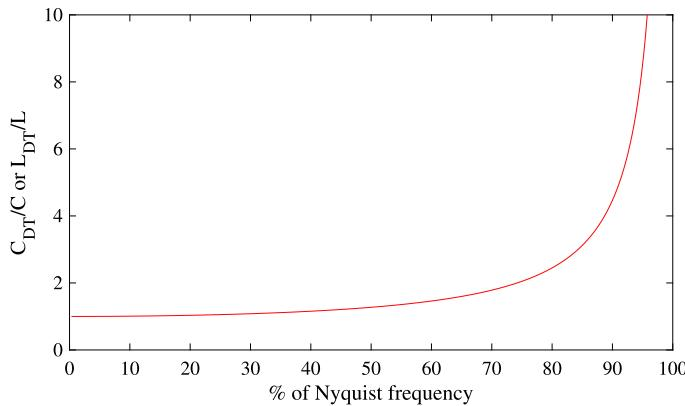  
Fig. 1. Frequency response of an inductor and a capacitor using TR.

In Fig. 1, the deviation of $L _ { D T } / L$ and $C _ { D T } / C$ is plotted against ??. The plot shows that as ?? approaches the Nyquist frequency, the deviation increases non-linearly and becomes infinitely large. This result is consistent with the limit of $\psi _ { ( \omega ) , }$ , as given in (4), as ?? approaches $\omega _ { N Y } ,$ such that

$$
\lim  _ {\omega \rightarrow \omega_ {N Y}} \tan \left(\frac {\omega h}{2}\right) / \left(\frac {\omega h}{2}\right) = \infty . \tag {6}
$$

Likewise, no distortion in $L _ { D T }$ and $C _ { D T }$ is observed when ?? approaches zero, such that

$$
\lim  _ {\omega \rightarrow 0} \tan \left(\frac {\omega h}{2}\right) / \left(\frac {\omega h}{2}\right) = 1. \tag {7}
$$

The representation of an analytic pole ?? in the z-domain, ??, is

$$
z = e ^ {p h} \approx \frac {1 + \frac {p h}{2}}{1 - \frac {p h}{2}}. \tag {8}
$$

The BLT is a first-order approximation of $e ^ { p h }$ . When mapping back to the time domain, the original eigenvalue ?? is not obtained, but a new (perturbed) pole $P ,$ such that

$$
P = \frac {\ln (z)}{h}. \tag {9}
$$

The difference between ?? and ?? increases with ℎ. The numerical error resulting from FW can be perceived as a disturbance of the original eigenvalues.

The simulated constant of attenuation will deviate from its analytical counterpart if the $R e \{ p \}$ is altered. Modifying the $I m \{ p \}$ will cause the natural oscillation frequency of the simulation to change. Furthermore, if the analytic solution has complex conjugate eigenvalues, the discrete-time solution will also exhibit complex conjugate eigenvalues.

# 3. Electrical circuit under consideration

The FW-induced numerical error is evaluated by utilizing the electrical circuit known as Test-case, depicted in Fig. 2. The circuit parameters are ??(??) = ??????(120????) V, ?? = 0, 1 Ω, ?? = ?? = 1 μH, $C _ { 1 } = 1 0 0$ μF and $C _ { 2 } = 1$ μF. The switch $S _ { 1 }$ has been open for a long time and closes at $t = 0 \mathrm { ~ s ~ }$ . This study focuses on the voltage at capacitor $C _ { 1 } , V _ { C _ { 1 } } ( t )$ .

The analytical solution of $V _ { C _ { 1 } } ( t )$ is

$$
V _ {C _ {1}} (t) = K _ {1} (t) + K _ {2} (t) + K _ {3} (t), \tag {10}
$$

where

$$
K _ {1} (t) = 1. 0 0 1 \cdot 1 0 ^ {- 2} e ^ {- 4. 9 9 9 5 \cdot 1 0 ^ {4} t}.
$$

$$
\cos \left(1. 0 0 3 7 9 3 \cdot 1 0 ^ {6} t - 2. 9 0 7 ^ {\circ}\right) \mathrm {V}, \tag {11}
$$

$$
K _ {2} (t) = 1. 0 0 1 \cdot 1 0 ^ {- 2} e ^ {- 4. 9 9 8 t}.
$$

$$
\cos \left(0. 0 9 9 4 9 9 \cdot 1 0 ^ {6} t + 1 7 9. 4 3 ^ {\circ}\right) \mathrm {V} \tag {12}
$$

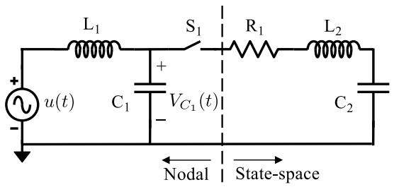  
Fig. 2. Lumped electrical circuit under consideration, Test-case.

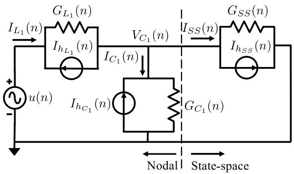  
Fig. 3. Companion circuits, suitable for nodal analysis.

and

$$
K _ {3} (t) = \cos (3 7 6. 9 9 t) \mathrm {V}. \tag {13}
$$

Eqs. (11) and (12) have damped oscillation frequencies of 159.758 kHz and 15.836 kHz, respectively. The last term (13) corresponds to the steady-state solution.

# 4. Problem formulation

# 4.1. Nodal representation

The branch formed by $\mathrm { L } _ { 1 }$ and $\mathrm { C } _ { 1 }$ in Fig. 2 has a nodal representation, modeled by the well-known companion circuits [1], as shown in the left portion of Fig. 3. TR is assumed to be the solution method for solving the differential equation $b ^ { \prime } ( t ) = f ( b , t ) ,$ , thus [4],

$$
b (t) = b (t - h) + \frac {h}{2} \left[ b ^ {\prime} (t - h) + b ^ {\prime} (t) \right], \tag {14}
$$

where $b ^ { \prime } ( t )$ is the first-order derivative with respect to time.

# 4.2. State-space representation

The branch formed by $\mathrm { R } _ { 1 } , \mathrm { L } _ { 2 }$ and ${ \sf C } _ { 2 }$ in Fig. 2 is represented by state–space equations (SSE), which will be solved using two solution methods: TR and recursive convolutions (RC).

Consider the following input–output relationship in the s-domain,

$$
I (s) = Y (s) V (s), \tag {15}
$$

where $I ( s )$ and $V ( s )$ are the terminal current and voltage, respectively. ?? (??) is the admittance matrix and can be approximated over the frequency band of interest using a pole-residue model [15] as follows

$$
Y (s) \approx \sum_ {i = 1} ^ {N} \frac {R _ {i}}{s - a _ {i}} + D + s E, \tag {16}
$$

where $a _ { i }$ and $R _ { i }$ are the $i _ { t h }$ poles (real or complex conjugate) and residue matrix of the SSE; ?? is the number of poles in the model; D and E are real and correspond to the conductance and capacitance matrices.

By using the convolution property in (15), it results in

$$
i (t) = Y (t) * v (t) = \int_ {0} ^ {\infty} Y (\tau) v (t - \tau) d \tau . \tag {17}
$$

If the step response of a system can be approximated by exponential functions, then it is possible to use a recursive solution for the convolution integral [18], which is

$$
i (t) = e ^ {a h} i (t - h) + r \int_ {0} ^ {h} e ^ {p \tau} v (t - \tau) d \tau . \tag {18}
$$

In the discrete-time domain, a generic pole-residue model can be rewritten [15] with SSE:

$$
x (n) = \alpha x (n - 1) + (\alpha \lambda + \mu) u (n - 1) \tag {19}
$$

and

$$
y (n) = x (n) + (D + \lambda) u (n), \tag {20}
$$

where ??, ?? and ?? are constants and depend on the solution method, see Appendix B for more details.

Given the terminal current, ??(??), and voltage, ??(??), the right-hand side of (20), denoted as ??(??), can be seen as a parallel association of a history current source, $I _ { h _ { S S } } ( n )$ , and a conductance, $G _ { S S } \mathrm { : }$ , similar to the companion circuit modeling approach. Thus,

$$
I _ {h _ {S S}} (n) = \sum_ {i = 1} ^ {N} \left(\alpha_ {i} x (n - 1) + \left(\alpha_ {i} \lambda_ {i} + \mu_ {i}\right) u (n - 1)\right) \tag {21}
$$

and

$$
G _ {S S} = D + \sum_ {i = 1} ^ {N} \lambda_ {i}. \tag {22}
$$

Therefore, the branch represented by SSE in Fig. 2 can be incorporated in the nodal analysis, as illustrated in the right portion of Fig. 3.

# 5. Numerical results and discussion

This section will present initial considerations and the most relevant results obtained in this work.

# 5.1. Initial considerations

This paper aims to analyze the behavior of the transient with an oscillating frequency of 15.836 kHz, as described by (12), while the transient with a higher oscillating frequency of 159.758 kHz, as given by (11), decays rapidly and is not of primary interest for this study. An integration time step should be small enough to capture the system dynamics, at a cost of increasing the computational burden. In order to keep the LTE less than 3%, it was considered the following condition [3],

$$
h \leq \frac {1}{1 0 f _ {\text {m a x}}} \leq \frac {1}{1 0 \cdot 1 5 . 8 3 6 \mathrm {k H z}} \leq 6. 3 1 \mu \mathrm {s}, \tag {23}
$$

where $f _ { m a x }$ is the highest frequency of interest, corresponding to 15.836 kHz.

The largest time step, $h _ { m a x } ,$ , utilized in this study is 4 μs. This value is considered theoretically appropriate as it is smaller than the restriction (23).

This study will model the problem with the combined method [19]. Specifically, the TR method will be employed to solve the branch comprising $\mathrm { L } _ { 1 }$ and $\mathrm { C } _ { 1 } ,$ , which is modeled with nodal representation. On the other hand, the branch consisting of $\mathrm { R } _ { 1 : }$ , L , and ${ \mathrm { C } } _ { 2 }$ will be represented with SSE and solved using either TR or RC. Table 1 presents a summary of the time steps, solution methods, and corresponding nomenclatures used in this work.

Table 1 Nomenclatures regarding the solution methods and integration time steps (ℎ).   

<table><tr><td rowspan="2">Nomenclature</td><td colspan="3">Solution method</td></tr><tr><td>Nodal</td><td>SSE</td><td>h(μs)</td></tr><tr><td>TR1</td><td>TR</td><td>TR</td><td>1</td></tr><tr><td>TR2</td><td>TR</td><td>TR</td><td>2</td></tr><tr><td>TR4</td><td>TR</td><td>TR</td><td>4</td></tr><tr><td>RC1</td><td>TR</td><td>RC</td><td>1</td></tr><tr><td>RC2</td><td>TR</td><td>RC</td><td>2</td></tr><tr><td>RC4</td><td>TR</td><td>RC</td><td>4</td></tr></table>

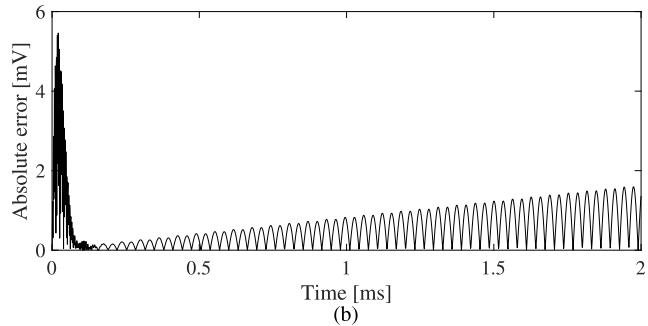  
Fig. 4. Voltage at capacitor $C _ { 1 }$ (a) and its absolute error (b) for $\mathrm { T R } _ { 1 }$

# 5.2. TR as solution method for SSE

To solve the SSE in the combined formulation, TR is first applied. The waveforms of $\mathrm { T R } _ { 1 } , \mathrm { T R } _ { 2 } ,$ and $\mathrm { T R } _ { 4 }$ are shown in solid blue in Figs. 4a, ${ \mathsf { I a } } ,$ and $^ { 6 \mathrm { a } , }$ respectively, along with the analytical response shown in solid red. The absolute errors of $\mathrm { T R } _ { 1 } , \ \mathrm { T R } _ { 2 } ,$ and $\mathrm { T R } _ { 4 }$ relative to the analytical response are shown in Figs. 4b, 5b, and $\mathbf { 6 b , }$ respectively.

The simulation in $\mathrm { F i g . }$ 4a exhibits an initial inaccuracy due to the presence of a high-frequency transient component in the analytic response (11). This transient component vanishes after approximately 0.1 s, resulting in an initial spike in the absolute error shown in Fig. 4b. The absolute error trend over time in Fig. 4b is a more clear indicator of the FW effect in $\mathrm { T R } _ { 1 }$ compared to its waveform in Fig. 4a. The slope near the maximum and minimum points of a sinusoidal wave becomes less steep, causing the absolute values to become closer. This reduces the difference between the simulated and analytical response, resulting in valleys on the absolute error as depicted Fig. 4b.

When ℎ is increased to $2 ~ \mu \mathrm { s } ,$ the waveform of $\mathrm { T R } _ { 2 }$ in $\mathrm { F i g . }$ 5a has a small, but noticeable, phase shift, with respect to the analytic response, at the end of the simulation (?? = 2 ms). This phase shift is a result of the FW altering the natural oscillation frequency of the simulated circuit. The absolute errors depicted in Fig. 5b share similar characteristics with those observed for TR in Fig. 4b, but with larger amplitudes.

Setting $\textit { h } = \textit { 4 }$ μs results in a significant phase shift visible in the waveform of $\mathrm { T R } _ { 4 }$ in $\mathrm { F i g . }$ 6a. Toward the end of the simulation, $\mathrm { T R } _ { 4 }$ becomes almost completely out of phase. The absolute error in $\mathrm { F i g . }$ 6b has a much larger amplitude compared to that of $\mathrm { T R } _ { 1 }$ (Fig. 4b) and $\mathrm { T R } _ { 2 }$ (Fig. 5b). Furthermore, the absolute error at the end of the simulation is greater than its initial value.

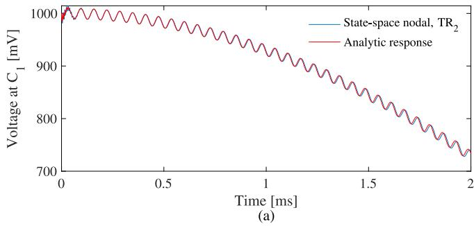

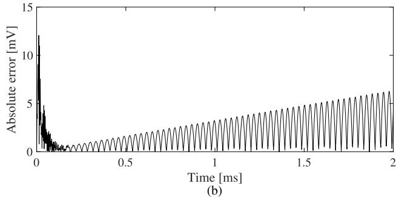  
Fig. 5. Voltage at capacitor $C _ { 1 }$ (a) and its absolute error (b) for $\operatorname { T R } _ { 2 } .$

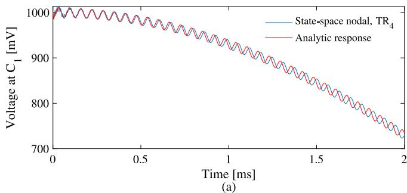

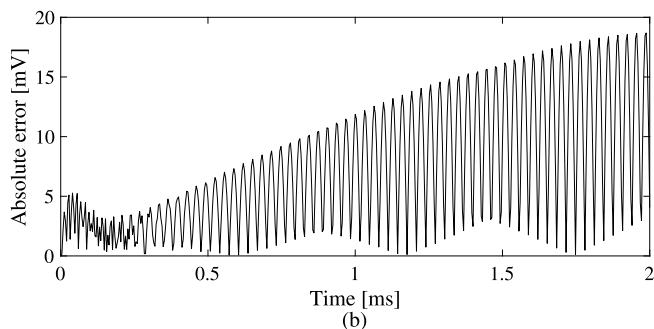  
Fig. 6. Voltage at capacitor $C _ { 1 }$ (a) and its absolute error (b) for $\mathrm { T R } _ { 4 }$

Table 2 MSE for $\mathrm { T R } _ { 1 } , \ \mathrm { T R } _ { 2 }$ and $\mathrm { T R } _ { 4 }$ until $t = 2$ ms.   

<table><tr><td>Nomenclature</td><td>TR1</td><td>TR2</td><td>TR4</td></tr><tr><td>h (μs)</td><td>1</td><td>2</td><td>4</td></tr><tr><td>MSE (μV2)</td><td>0.67</td><td>7.50</td><td>78.63</td></tr></table>

An increase in the value of ℎ resulted in a more pronounced FW effect. This observation is quantitatively supported by evaluating the mean square error (MSE) metric presented in Table 2.

Fig. 7 shows a pulsating absolute error behavior of $\mathrm { T R } _ { 4 }$ when the simulation duration is increased from 2 ms to 20 ms. Its peaks and valleys represent phase shifts of 180◦ and 0◦, respectively, due to a frequency deviation caused by FW. $\mathrm { T R } _ { 4 }$ takes about 2.4 ms to become

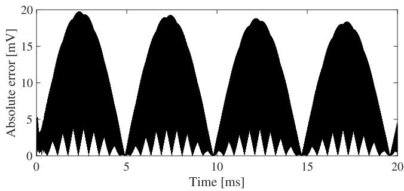  
Fig. 7. Absolute error of $\mathrm { T R } _ { 4 }$ until $t = 2 0$ ms.

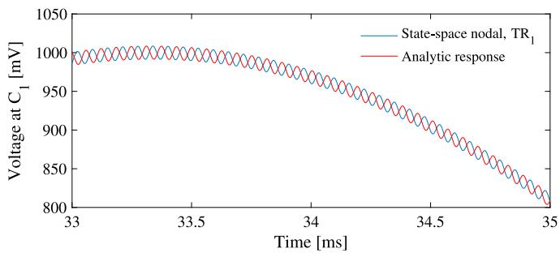  
Fig. 8. Voltage at capacitor $C _ { 1 }$ for $\mathrm { T R } _ { 1 : }$ , from 33 ms to 35 ms.

completely out of phase. If the analysis was held for $\mathrm { T R } _ { 1 }$ and $\mathrm { T R } _ { 2 } ,$ it would take about 34.2 ms and 9.5 ms to become 180◦ out of phase compared to the analytical solution. It should be noted that the FW effect on the waveform of TR was difficult to observe in Fig. 4a because the simulation was limited to only 2 ms. However, even for such a small time step, the GTE accumulation could lead to erroneous results if the simulation is sufficiently long, as depicted in Fig. 8. The frequency deviation of $\mathrm { T R } _ { 4 }$ and its analytical response $( \varDelta f _ { T R _ { 4 } } )$ can be estimated by the inverse of twice the period between two minima or two maxima. In this case, $\Delta f _ { T R _ { 4 } }$ is approximately 104.2 Hz, which corresponds to 0.66% of ????????. $f _ { m a x }$

# 5.3. RC as solution method for SSE

This section presents the results of using the RC as a solution method for the SSE. The waveforms and analytical responses for $\begin{array} { r } { \mathbf { R } \mathbf { C } _ { 1 } , \mathbf { R } \mathbf { C } _ { 2 } , } \end{array}$ , and ${ \mathrm { R C } } _ { 4 }$ are shown in Figs. 9a, 10a, and 11a, respectively, where the solid blue line represents the waveform of the combined method, while the solid red line corresponds to the analytical response. The absolute error of each method with respect to the analytical response is depicted in Figs. 9b, 10b, and 11b, respectively.

In contrast to $\mathrm { T R } _ { 1 } ,$ as seen in Fig. 4b, the absolute error of $\mathsf { R C } _ { 1 }$ shows a less pronounced peak at the beginning of the simulation, as depicted in Fig. 9b.

When $h \ = \ 2 \ \mu \mathrm { s } ,$ the ${ \mathsf { R C } } _ { 2 }$ waveform exhibits a slight decrease in amplitude and a phase shift due to a frequency deviation, as shown in Fig. 10a. These numerical errors are reflected in the absolute error behavior in Fig. 10b, which starts with a larger amplitude than those observed for $\mathrm { T R } _ { 2 }$ in Fig. 5b.

Increasing ℎ to 4 μs leads to an initial phase inversion in the waveform of $\mathrm { R C } _ { 4 } ,$ , as shown in Fig. 11a, where it starts out of phase by $1 8 0 ^ { \circ }$ and starts getting in phase due to the frequency deviation. The mathematical analysis regarding this initial phase inversion in $\mathrm { R C } _ { 4 }$ is held in Appendix C. The absolute error in Fig. 11b initially starts at its maximum value due to the 180◦ phase shift, but it decreases as the signal starts to approach the correct phase.

The MSE values for the SSE using RC as the solution method are reported in Table 3. As expected, the MSE increases with ℎ.

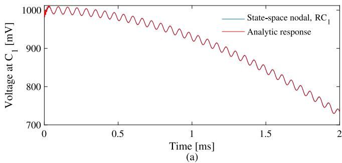

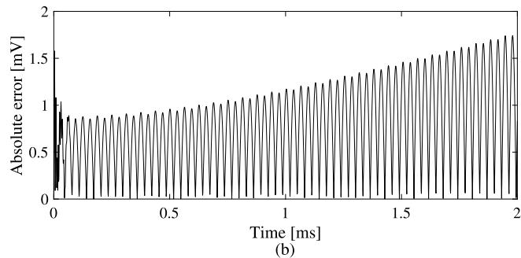  
Fig. 9. Voltage at capacitor $C _ { 1 }$ (a) and its absolute error (b) for $\operatorname { R C } _ { 1 } .$

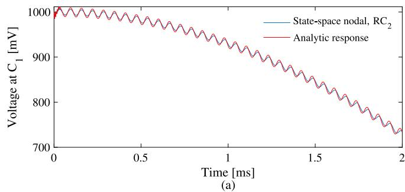

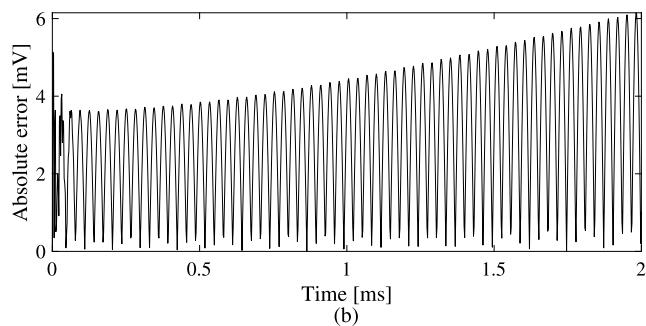  
Fig. 10. Voltage at capacitor $C _ { 1 }$ (a) and its absolute error (b) for $\mathrm { R C _ { 2 } }$ .

Table 3 MSE for $\mathrm { R C } _ { 1 } .$ , RC and $\mathrm { R C } _ { 4 } ,$ unti $t = 2$ ms.   

<table><tr><td>Nomenclature</td><td>RC1</td><td>RC2</td><td>RC4</td></tr><tr><td>h (μs)</td><td>1</td><td>2</td><td>4</td></tr><tr><td>MSE (μV2)</td><td>0.77</td><td>10.85</td><td>106.47</td></tr></table>

The simulation time of $\mathrm { R C } _ { 4 }$ was extended from $t = 2$ ms to $t = 2 0$ ms, as shown in Fig. 12. The pulsating trend of the absolute error starts with the maximum phase shift of 180◦. Applying the same methodology as used in the previous section for $\mathrm { T R } _ { 4 } ,$ , the frequency deviation of $\mathrm { R C } _ { 4 } ,$ , $\varDelta f _ { R C _ { 4 } }$ , is approximately 102.5 Hz, corresponding to 0.65% of $f _ { m a x } .$ .

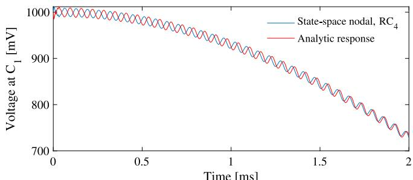

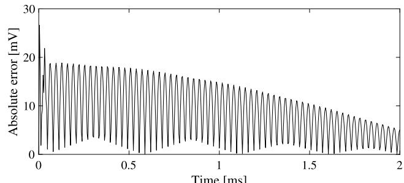  
  
Fig. 11. Voltage at capacitor ??1 (a) and its absolute error (b) for RC4.

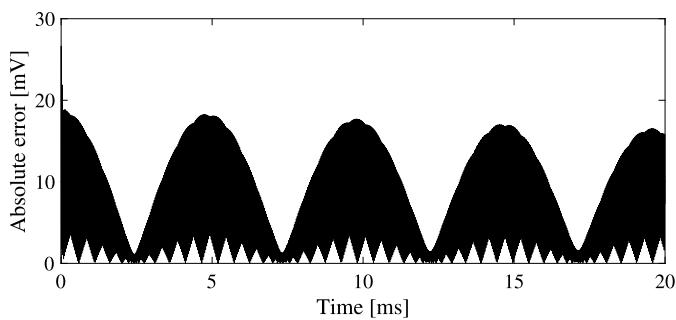  
Fig. 12. Absolute error of $\mathrm { R C } _ { 4 }$ until $t = 2 0$ ms.

# 6. Conclusions

This paper explored the impact of a subtle effect known as frequency warping (FW) on the accuracy of digital simulations of electromagnetic transients. The FW can be attributed to the behavior of L and C in the discrete-time domain obtained through an integration method such as the trapezoidal integration rule (TR), which is commonly used in EMT-type simulators. The FW caused a frequency deviation on the waveform, resulting from a change in the natural oscillation frequency of the system. If the simulation runs for a long enough time, the FW can cause the solutions to be completely out of phase due to error accumulation. Furthermore, the distortion was observed even when only a portion of the circuit was solved using TR, such as in the combined method where the nodal part was solved with TR and the state–space equations were solved using recursive convolutions. The distortion was clearly observed even for time step sizes less than $1 / ( 1 0 f _ { m a x } )$ and the simulation was executed up to 2 ms. Finally, the error increased non-linearly with the time step size, affecting the accuracy of the overall simulation. For future work, the authors plan to present possible methods for dynamically compensating the FW effect.

# CRediT authorship contribution statement

A.A. Kida: Investigation, Conceptualization, Methodology, Formal analysis, Validation, Writing. A.C.S. Lima: Conceptualization, Methodology, Formal analysis, Writing, Supervision. F.A. Moreira: Conceptualization, Methodology, Formal analysis, Writing, Supervision. J.R. Martí: Conceptualization, Methodology, Formal analysis, Validation, Writing, Supervision. J. Tarazona: Conceptualization, Methodology, Formal analysis, Validation, Writing.

# Declaration of competing interest

The authors declare that they have no known competing financial interests or personal relationships that could have appeared to influence the work reported in this paper.

# Data availability

No data was used for the research described in the article.

# Appendix A. Frequency warping effect on L and C

The relationship of the voltage $( v _ { L } )$ and current $( i _ { L } )$ in an inductor, with a true inductance $\mathbf { L } ,$ is

$$
i _ {L} (t) - i _ {L} (t - h) = \frac {h}{2 L} v _ {L} (t) + \frac {h}{2 L} v _ {L} (t - h) \tag {24}
$$

Taking $( v _ { L } )$ and $( i _ { L } )$ as the input and output, respectively,

$$
v _ {L} (t) = e ^ {j \omega t} \tag {25}
$$

and

$$
i _ {L} (t) = Y _ {L} (\omega) e ^ {j \omega t}, \tag {26}
$$

where $Y _ { L }$ is the admittance of the discretized inductor.

By replacing (25) and (26) in (24),

$$
Y _ {L} (\omega) e ^ {j \omega t} - Y _ {L} (\omega) e ^ {j \omega (t - h)} = \frac {h}{2 L} e ^ {j \omega t} + \frac {h}{2 L} e ^ {j \omega (t - h)}. \tag {27}
$$

By isolating $Y _ { L } ( \omega ) _ { . }$ ,

$$
Y _ {L} (\omega) = \frac {h}{2 L} \frac {e ^ {j \omega h} + 1}{e ^ {j \omega h} - 1}. \tag {28}
$$

The impedance of the discretized inductor $( Z _ { L } )$ is

$$
Z _ {L} (\omega) = \frac {1}{Y _ {L} (\omega)} = \frac {2 L}{h} \frac {e ^ {j \omega h} - 1}{e ^ {j \omega h} + 1} = j \frac {2 L}{h} \tan \left(\frac {\omega h}{2}\right). \tag {29}
$$

By defining an apparent inductance in discrete-time $( L _ { D T } )$ where

$$
Z _ {L} (\omega) = j \omega L _ {D T} (\omega). \tag {30}
$$

The inspection of (29) and (30) leads to

$$
L _ {D T} (\omega) = L \cdot \tan \left(\frac {\omega h}{2}\right) / \left(\frac {\omega h}{2}\right), \tag {31}
$$

Eq. (31) can be expressed as (2) and rewritten here for sake of clarity,

$$
L _ {D T} (\omega) = \Psi (\omega) L, \tag {2}
$$

where the frequency warping effect, ?? (??), is (4), and rewritten here as

$$
\Psi (\omega) = \tan \left(\frac {\omega h}{2}\right) / \left(\frac {\omega h}{2}\right). \tag {4}
$$

The relationship of voltage, $v _ { C } ( t ) ,$ , and current, $i _ { C } ( t )$ , of a capacitor with true capacitance $\mathrm { C } ,$ is

$$
v _ {C} (t) - v _ {C} (t - h) = \frac {h}{2 C} i _ {C} (t) + \frac {h}{2 C} i _ {C} (t - h). \tag {32}
$$

The analysis for the capacitor case is straightforward and follows the same procedure shown in (25)–(31), considering $v _ { C } ( t )$ as input, $i _ { C } ( t )$ as output and

$$
Z _ {C} (\omega) = \frac {1}{j \omega C _ {D T} (\omega)}, \tag {33}
$$

where $Z _ { C } ( \omega )$ is the impedance of the discretized capacitor $( C _ { D T } ) .$ . So,

$$
C _ {D T} (\omega) = C \cdot \tan \left(\frac {\omega h}{2}\right) / \left(\frac {\omega h}{2}\right) \tag {34}
$$

Eq. (34) can be expressed as (3) and it is shown here for sake of clarity,

$$
C _ {D T} (\omega) = \Psi (\omega) C. \tag {3}
$$

The derivation of the FW for other integration methods, such as the Backward Euler, follows a similar procedure as presented for TR in this work.

# Appendix B. Constants for the state-space equations

The constants ??, ?? and ?? for the TR [15] are

$$
\alpha = \frac {2 + a h}{2 - a h} \tag {35}
$$

and

$$
\lambda = \mu = \frac {r h}{2 - a h}. \tag {36}
$$

For RC, the constants $\alpha ,$ ?? and $\mu \ [ 1 8 ]$ are

$$
\alpha = e ^ {a h}, \tag {37}
$$

$$
\lambda = - \frac {r}{a} \left(1 + \frac {1 - \alpha}{a h}\right) \tag {38}
$$

and

$$
\mu = \frac {r}{a} \left(\alpha + \frac {1 - \alpha}{a h}\right). \tag {39}
$$

Note that when $a h  0 ,$ the constants ?? (38) and $\mu \ ( 3 9 )$ approach infinity, leading to inaccurate results.

# Appendix C. Analysis of the initial phase inversion in $\mathbf { R C } _ { 4 }$

In the beginning of the simulation, ?? = 0 and the initial voltage at capacitor $\mathrm { C } _ { 1 }$ is $1 \vee ( V _ { C _ { 1 } } ( 0 ) = 1 \ : \mathrm { V } )$ . In the next time step $( n = 1 ) ,$ a phase inversion is observed as the voltage at ${ \mathrm { R C } } _ { 4 }$ increases and the analytic response decreases, as seen in Fig. 11. Per-unit values will be used in this section to simplify the notation. $V _ { C _ { 1 } } ( n )$ can be computed with

$$
V _ {C _ {1}} (n) = G _ {A} ^ {- 1} \left(I _ {A} (n) - G _ {L 1} \cos (1 2 0 \pi n h)\right), \tag {40}
$$

where

$$
G _ {A} = G _ {C _ {1}} + G _ {S S} + G _ {L _ {1}} \text {a n d} \tag {41}
$$

$$
I _ {A} (n) = I _ {h _ {C _ {1}}} (n) - I _ {h _ {S S}} (n) - I _ {h _ {L _ {1}}} (n). \tag {42}
$$

The phase inversion at ?? = 1 implies that the voltage at the capacitor increases, so

$$
V _ {C _ {1}} (1) > 1. \tag {43}
$$

The condition in (43) is satisfied if

$$
G _ {A} ^ {- 1} \left(I _ {A} (1) - G _ {L _ {1}} \cos \left(1 2 0 \pi \cdot 4 \cdot 1 0 ^ {- 6}\right)\right) > 1. \tag {44}
$$

By replacing (41) and (42) in (44),

$$
I _ {h _ {C _ {1}}} (1) - I _ {h _ {S S}} (1) - I _ {h _ {L _ {1}}} (1) -
$$

$$
G _ {L _ {1}} \cdot \cos (1 2 0 \pi \cdot 4 \cdot 1 0 ^ {- 6}) > \left(G _ {C _ {1}} + G _ {S S} + G _ {L _ {1}}\right). \tag {45}
$$

Isolating $G _ { S S } \mathrm { : }$

$$
G _ {S S} <   \Phi (1), \tag {46}
$$

where

$$
\begin{array}{l} \Phi (1) = I _ {h _ {C _ {1}}} (1) - I _ {h _ {S S}} (1) - I _ {h _ {L _ {1}}} (1) \\ - G _ {L _ {1}} \cdot \cos (1 2 0 \pi \cdot 4 \cdot 1 0 ^ {- 6}) - \left(G _ {C _ {1}} + G _ {L _ {1}}\right). \tag {47} \\ \end{array}
$$

Table 4 Per-unit values of $G _ { S S }$ and ??(1).   

<table><tr><td>Nomenclature</td><td>Gss</td><td>Φ(1)</td><td>Gss&lt;Φ(1)?</td><td>Initial phase inversion?</td></tr><tr><td>TR1</td><td>0.38462</td><td>-0.38</td><td>No</td><td>No</td></tr><tr><td>TR2</td><td>0.47619</td><td>-0.48</td><td>No</td><td>No</td></tr><tr><td>TR4</td><td>0.38462</td><td>-0.38</td><td>No</td><td>No</td></tr><tr><td>RC1</td><td>0.44501</td><td>-0.35</td><td>No</td><td>No</td></tr><tr><td>RC2</td><td>0.66662</td><td>-0.16</td><td>No</td><td>No</td></tr><tr><td>RC4</td><td>0.39228</td><td>1.01</td><td>Yes</td><td>Yes</td></tr></table>

For $\mathrm { R C } _ { 4 } , I _ { h _ { C _ { 1 } } } ( 1 ) = 5 0 \mathrm { ~ A } , I _ { h _ { S S } } ( 1 ) = 5 0 \mathrm { ~ A } , I _ { h _ { L _ { 1 } } } ( 1 ) = 0 \mathrm { ~ A } , G _ { L _ { 1 } } = 2 \mathrm { ~ S } ,$ $G _ { C _ { 1 } } = 5 0 ~ \mathrm { S }$ and $\stackrel { \cdot } { G } _ { S S } = 0 . 3 9 2 2 8 \mathrm { ~ S } ,$ 1 which leads to

$$
\Phi (1) = 1. 0 1. \tag {48}
$$

Thus, (46) is satisfied.

Table 4 demonstrates that the initial phase inversion occurs when the condition given in (46) is satisfied, which was the case only for ${ \mathrm { R C } } _ { 4 }$

# References

[1] H. Dommel, Digital computer solution of electromagnetic transients in singleand multiphase networks, IEEE Trans. Power Appar. Syst. PAS-88 (4) (1969) 388–399.   
[2] G.G. Dahlquist, A special stability problem for linear multistep methods, BIT 3 (1) (1963) 27–43.   
[3] J. Marti, J. Lin, Suppression of numerical oscillations in the EMTP, IEEE Trans. Power Syst. 4 (2) (1989) 739–747.   
[4] L. Tan, in: Elsevier (Ed.), Digital Signal Processing: Fundamentals and Applications, first ed., Academic Press, Decatur, Georgia, 2008, p. 838.   
[5] H. Dommel, EMTP Theory Book, Microtran Power System Analysis Corporation, 1996.   
[6] N. Upadhyay, H.G. Rosales, Robust recognition of English speech in noisy environments using frequency warped signal processing, Nat. Acad. Sci. Lett. 41 (1) (2018) 15–22.   
[7] G. Yeung, R. Fan, A. Alwan, Fundamental frequency feature warping for frequency normalization and data augmentation in child automatic speech recognition, Speech Commun. 135 (2021) 1–10.   
[8] S.K. Mishra, D.K. Upadhyay, M. Gupta, Optimized first-order s-to-z mapping function for IIR filter designing, in: 2019 20th International Conference on Intelligent System Application to Power Systems, ISAP, 2019, pp. 1–5.   
[9] M. Biggio, F. Bizzarri, A. Brambilla, G. Carlini, M. Storace, Reliable and efficient phase noise simulation of mixed-mode integer-N Phase-Locked Loops, in: 2013 European Conference on Circuit Theory and Design, ECCTD, 2013, pp. 1–4.   
[10] J. Wang, J. Wang, X. Luo, Novel PLL for power converters under unbalanced and distorted grid conditions, J. Eng. 2019 (17) (2019) 3895–3899.   
[11] A. Brambilla, G. Storti-Gajani, Frequency warping in time-domain circuit simulation, IEEE Trans. Circuits Syst. I 50 (7) (2003) 904–913.   
[12] A. Brambilla, G. Gruosso, M.A. Redaelli, G.S. Gajani, D.D. Caviglia, Improved small-signal analysis for circuits working in periodic steady state, IEEE Trans. Circuits Syst. I. Regul. Pap. 57 (2) (2010) 427–437.   
[13] D. Moormann, G. Looye, The Modelica flight dynamics library, in: Proceedings of the 2nd International Modelica Conference, 2002, pp. 275–284.   
[14] A. Morched, B. Gustavsen, M. Tartibi, A universal model for accurate calculation of electromagnetic transients on overhead lines and underground cables, IEEE Trans. Power Deliv. 14 (3) (1999) 1032–1038.   
[15] B. Gustavsen, O. Mo, Interfacing convolution based linear models to an electromagnetic transients program, in: International Conference on Power Systems Transients (IPST 2007), Vol. 1, 2007, pp. 4–7, no. 4.   
[16] S. Kurokawa, F.N. Yamanaka, A.J. Prado, J. Pissolato, Inclusion of the frequency effect in the lumped parameters transmission line model: State space formulation, Electr. Power Syst. Res. 79 (7) (2009) 1155–1163.   
[17] A. Ramirez, Vector fitting-based calculation of frequency-dependent network equivalents by frequency partitioning and model-order reduction, IEEE Trans. Power Deliv. 24 (1) (2008) 410–415.   
[18] A. Semlyen, A. Dabuleanu, Fast and accurate switching transient calculations on transmission lines with ground return using recursive convolutions, IEEE Trans. Power Appar. Syst. 94 (2) (1975) 561–571.   
[19] C. Dufour, J. Mahseredjian, J. Bélanger, A combined state-space nodal method for the simulation of power system transients, IEEE Trans. Power Deliv. 26 (2) (2011) 928–935.   
[20] M. Beza, M. Bongiorno, Impact of converter control strategy on low- and highfrequency resonance interactions in power-electronic dominated systems, Int. J. Electr. Power Energy Syst. 120 (2020) 105978.