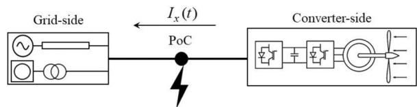
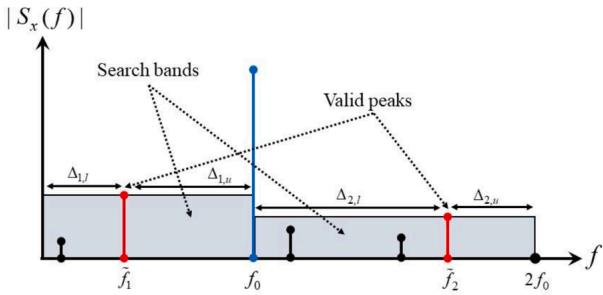
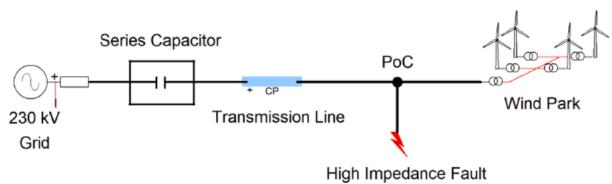
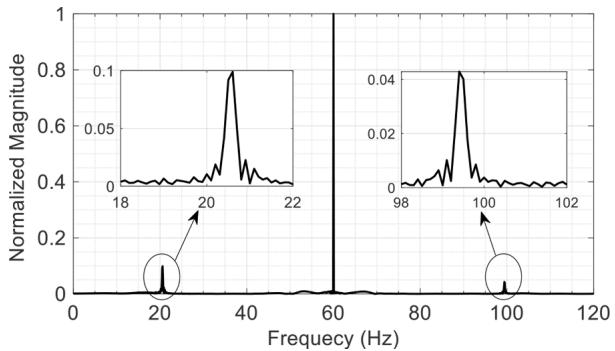
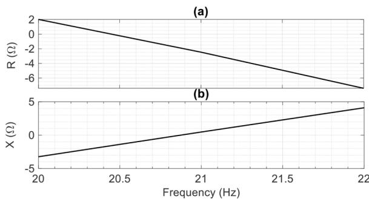
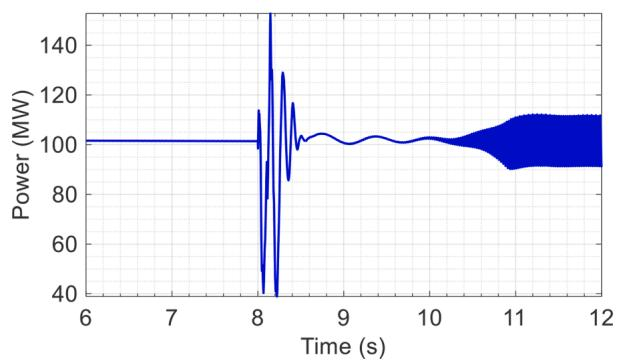
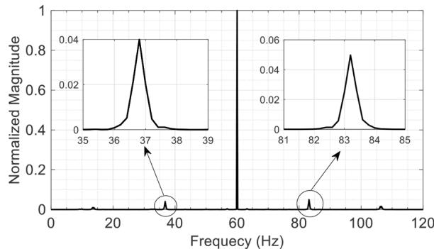
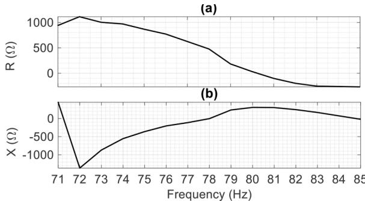
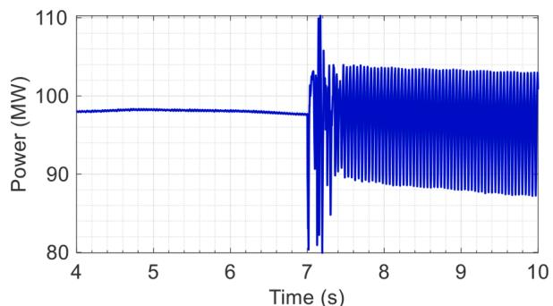

# Fast Detection of SSR for Wind Parks Connected to Series-Compensated Transmission Systems

Younes Seyedi a,* , Jean Mahseredjian a , Houshang Karimi a , Ulas Karaagac c , Aramis Schwanka Trevisan b

a Department of Electrical Engineering, Polytechnique Montreal, QC Canada   
b RTE International, Courbevoie, France   
c Department of Electrical Engineering, The Hong Kong Polytechnic University, Hong Kong

# A R T I C L E I N F O

Keywords:

Control interaction

Electromagnetic transients

Stability

Power systems

Wind park

# A B S T R A C T

The interactions between wind parks and the series-compensated transmission lines can bring about sub- or super-synchronous resonance (SSR) incidents which jeopardize the safe operation of the entire network. In practice, such incidents may emerge under various conditions as different types of wind turbines with various parameters can be deployed at several locations in the network. Hence, it is crucial to efficiently identify the conditions that lead to adverse interactions and their subsequent SSR incidents. This paper proposes a simulation-based method, namely disturb and scan (DaS), for fast and automated detection of SSR. The proposed technique uses small-scale disturbances in time-domain electromagnetic transient (EMT) simulations to perform spectral analysis along with positive-sequence impedance scans. Numerical results are presented and validated for benchmark systems that utilize type-III and type-IV wind turbines. The system operators can adopt the developed methodology to quickly assess the risks of SSR, evaluate conditions of instability, and improve their network protection and control schemes.

# 1. Introduction

Power systems which involve long transmission lines can employ compensation techniques to increase their power transfer capability, and to improve transient stability [1,2]. However, modern transmission systems encounter new and important challenges as more renewable and inverter-based resources, such as wind and solar photovoltaic (PV) parks, are interconnected to the network [3]. Among these challenges are harmful control interactions that lead to oscillations and voltage instability in transmission systems incorporating inverter-based resources [4,5]. Field measurements have also revealed that oscillations and harmonic resonance may occur when the controllers in wind parks interact with the controllers in high voltage DC (HVDC) transmission systems [6].

Sub- or super-synchronous resonance (SSR) incidents may arise when wind turbine-generators interact with the series capacitors in the transmission system such that the oscillatory power exchange is undamped or even unstable [7,8]. Specifically, in the case of doubly-fed induction generator (DFIG) wind parks, the study in [9] uses modal

analysis to show that sub-synchronous oscillations occur under low wind speed and high compensation conditions.

The SSR incidents are adverse to safe operation of power systems since they can damage the wind turbines and lead to wide area outages. It is shown that the wind park operating conditions as well as the control parameters of their power converters can lead to SSR in case of DFIG wind systems [10]. Moreover, the type of wind systems, e.g., DFIG or full converter, can affect the emergence of SSR in series-compensated transmission systems [11]. Since wind parks are large-scale systems that incorporate different control and protection sub-systems, several parameters contribute to stability issues. It is thus crucial to detect the operating conditions that may lead to oscillations and instability in power systems that incorporate wind parks.

In general, measurement-based SSR detection methods can be classified into two groups. The time-series analysis methods [12–16] obtain voltage/current samples (generated via time-domain EMT simulations or recorded by digital relays) and process them by signal processing or machine learning tools to identify oscillations. The impedance scanning methods [17–20] extract the frequency-dependent impedances of the

transmission grid and the wind park and use a stability criterion to identify instabilities and undamped oscillations.

This paper proposes a measurement-based technique, namely disturb and scan (DaS), to accelerate the identification of operational conditions that lead to SSR in power systems with wind parks. The proposed technique consists of three main steps. In the first step, a highimpedance fault at the point of connection (PoC) creates small-scale voltage disturbances, and the currents injected by the wind park are captured in the simulations. In the second step, the search bands are identified based on the peak analysis of the magnitude spectra of the time-domain results. The peaks in the spectra may be related to damped or undamped oscillations that exist in the system response. In the third step, the positive-sequence impedance scans are carried out for the frequencies that belong to the search bands. Finally, undamped oscillations and SSR events are detected by inspecting the impedancefrequency points with proper stability criterion.

The main contributions of this paper are as follows. The proposed scheme requires fewer number of EMT simulations to detect the operating conditions that lead to instability. Hence, it can significantly reduce the computational burden as well as the simulation time for SSR detection. The proposed method can be integrated in an automated procedure that facilitates training of data-driven and predictive models. Therefore, it can be integrated into protection systems to adaptively predict SSR incidents even when the network topology changes, e.g., when the number of operational wind turbines changes.

# 2. Positive-Sequence Scanning Technique

In this paper, the positive-sequence scanning method is used for extracting the frequency-dependent impedances of the grid and the wind park [18]. The impedances are extracted from the measurements of voltage and current at the PoC. The combined impedance is obtained by adding the grid and the wind park impedances. The combined scan consists of two steps: 1) converter-side positive-sequence scan, and 2) grid-side positive-sequence scan. The converter-side scan aims to extract the positive-sequence impedance of the wind park based on the voltage/current perturbation injection at the PoC. The objective of the grid-side scan is to calculate the positive-sequence impedance of the grid that is connected to the wind park.

Let $R _ { g } ( f )$ and $X _ { g } ( f )$ respectively denote the estimated grid resistance and reactance at the frequency $f .$ Moreover, suppose that $R _ { w } ( f )$ and $X _ { w } ( f )$ represent the wind park resistance and reactance, respectively. The combined resistance and reactance are obtained as

$$
R (f) = R _ {g} (f) + R _ {w} (f) \tag {1}
$$

$$
X (f) = X _ {g} (f) + X _ {w} (f) \tag {2}
$$

The system is stable if all zeros of the total impedance have negative real parts [21]. Hence, it can be shown that the system is stable when the following relationship holds [21]:

$$
R (f) \frac {d}{d f} X (f) \Bigg | _ {f = f _ {i}} > 0, \quad \forall f _ {i} \in F \tag {3}
$$

where F denotes the set of frequencies at which a reactance zero-crossing occurs. If there exists at least one fi that does not satisfy condition in (3), then the system is deemed to be unstable.

# 3. Disturb and Scan Technique

SSR incidents can be potentially identified by finding the set of zerocrossing frequencies followed by assessment of the criterion in (3). The basic premise of the DaS scheme is to find candidate frequencies that belong to the set F without performing the positive-sequence scan in a wide range of sub- and super-synchronous frequencies. If the system leads to SSR incidents under the operating conditions, the DaS method

can confirm instability with less computational burden in a shorter time. The main steps of the DaS scheme are explained in the sequel.

In the first step, a time-domain EMT simulation is carried out that applies a temporary and high-impedance fault at the $\mathrm { P o C , }$ as shown in Fig. 1. The post-fault current, denoted by $I _ { x } ( t ) \mathrm { i } s$ measured and stored for post-processing. The high-impedance fault creates small-signal disturbances that can potentially excite different modes in the system.

In the second step, the magnitude spectrum of the post-fault current is extracted using the Fourier transform, and the peaks are identified. Let $S _ { x } ( f )$ denote the Fourier transform of $I _ { x } ( t ) ,$ , the peaks are local maxima in the magnitude spectrum that satisfy the following condition:

$$
\left| S _ {x} \left(\widetilde {f} _ {i}\right) \right| > \lambda \left| S _ {x} \left(f _ {0}\right) \right| \tag {4}
$$

where $f _ { 0 }$ represents the fundamental frequency, and $\stackrel { \sim } { f } _ { i } \neq f _ { 0 }$ show the frequency of the $i ^ { t h }$ peak. The coefficient λis a small positive number that aims to reject spurious peaks due to presence of noise and interharmonics in the measurements. The condition in (4) ensures that insignificant local maxima do not trigger unnecessary scans. Assuming that the DFT window is large enough, the proper value of λ can be found by inspecting the magnitude spectrum of the currents when the system operates under the steady-state (normal) conditions.

Let $\widetilde { F }$ represent the set of peak frequencies that are sorted based on a descending order of their magnitude, i.e.

$$
\begin{array}{l} \widetilde {F} = \{\widetilde {f} _ {1}, \widetilde {f} _ {2}, \widetilde {f} _ {3}, \dots \} \\ | S _ {x} (\widetilde {f} _ {i}) | > | S _ {x} (\widetilde {f} _ {j}) | \Leftrightarrow i <   j \end{array} \tag {5}
$$

In the third step, search bands are constructed around each frequency $\widetilde { f } _ { i } \in \widetilde { F } .$ The search bands can be defined based on different methods. In this paper, it is assumed that the $i ^ { t h }$ search band spans the frequency range $\widetilde { \boldsymbol { \mathsf { f } } } _ { i } - \Delta _ { i , l } \widetilde { \boldsymbol { f } } _ { i } + \Delta _ { i , u } \boldsymbol { \mathsf { I } }$ Hz, where the upper and lower deviations satisfy the following relationships:

$$
\Delta_ {i, l} = \left\{ \begin{array}{l l} \widetilde {f} _ {i} - \max  \left\{1, \max  \left\{\widetilde {f} _ {j} \mid \widetilde {f} _ {j} <   \widetilde {f} _ {i} \right\} \right\}, & \widetilde {f} _ {i} <   f _ {0} \\ \widetilde {f} _ {i} - \max  \left\{f _ {0}, \max  \left\{\widetilde {f} _ {j} \mid \widetilde {f} _ {j} <   \widetilde {f} _ {i} \right\} \right\}, & \widetilde {f} _ {i} > f _ {0} \end{array} \right. \tag {6}
$$

$$
\Delta_ {i, u} = \left\{ \begin{array}{l l} \min  \left\{f _ {0}, \min  \left\{\widetilde {f} _ {j} \mid \widetilde {f} _ {j} > \widetilde {f} _ {i} \right\} \right\} - \widetilde {f} _ {i}, & \widetilde {f} _ {i} <   f _ {0} \\ \min  \left\{2 f _ {0}, \min  \left\{\widetilde {f} _ {j} \mid \widetilde {f} _ {j} > \widetilde {f} _ {i} \right\} \right\} - \widetilde {f} _ {i}, & \widetilde {f} _ {i} > f _ {0} \end{array} \right. \tag {7}
$$

Fig 2. illustrates an example of peak identification and the associate search bands that are used for performing the SSR assessment.

Once the search bands are determined the combined scan is performed that aims to distinguish between undamped and damped oscillations based on the criterion in (3). This screening method is called selective scan since the frequency-dependent impedances of the subsystems are evaluated in a specific frequency range.

Algorithm 1 explains the selective scan procedure for detection of SSR under given operating conditions. To this aim, the following function is defined assuming that the input arguments $f _ { 1 }$ and $f _ { 2 }$ always satisfy $f _ { 2 } > f _ { 1 }$ :

$$
\alpha \left(f _ {1}, f _ {2}\right) = \left(X \left(f _ {2}\right) - X \left(f _ {1}\right)\right) \rho \left(f _ {1}, f _ {2}\right) \tag {8}
$$

where

  
Fig. 1. The high-impedance fault at the PoC, and the post-fault current that flows through the PoC.

  
Fig. 2. An example of peak identification and construction of the search bands: $\widetilde { \boldsymbol { F } } = \widetilde { \{ f _ { 1 } , f _ { 2 } \} }$ }.

$$
\rho \left(f _ {1}, f _ {2}\right) = R \left(f _ {1}\right) - \frac {R \left(f _ {2}\right) - R \left(f _ {1}\right)}{X \left(f _ {2}\right) - X \left(f _ {1}\right)} X \left(f _ {1}\right) \tag {9}
$$

In the above equations, Rand Xrespectively denote the combined resistance and reactance given by Eqs. (1) and (2). α(f1,f2)calculates the product of reactance difference and the resistance at the estimated reactance zero-crossing frequency. Eq. (9) represents a linear estimator of the resistance at the reactance zero-crossing frequency. The use of a linear estimator is justified by the observation that for small values of the frequency step $( \delta \leq 1 )$ , the combined impedance is a monotonic function of frequency. The procedure in Algorithm 1 gives the highest priority to the frequencies that are immediate neighbors of the selected peak frequency. Afterwards, the lower search band has a higher priority over the higher band. The algorithm stops searching when either a search band indicates SSR or all of the search bands have been scanned and evaluated without showing instability.

In general, symmetrical faults (e.g., three-phase-to-ground) or asymmetrical faults (e.g., single-phase-to-ground) can be used for disturbing the system. Regardless of the fault type, if SSR incident occurs, some peaks exist in the spectrum of $I _ { x } ( t )$ , where the exact number of peaks depends on the frequency coupled components, the DFT window size, inter-harmonics, etc. The peaks with the largest magnitude should be prioritized to ensure a low number of scans.

Regardless of the degree of nonlinearity of the system, the Fourier transform finds the oscillatory components that may emerge upon a disturbance. The combined scan, however, employs the frequencydependent impedance modeling to determine which oscillatory component is persistent or undamped. Therefore, the performance of the combined scan and the overall detection reliability of the DaS method can be affected by the nonlinearity of the system specially around the selected peak frequency.

It is to be noted that time-domain EMT simulations are essential for implementing the DaS method. The frequency step, δ, controls the granularity of the perturbation frequencies that are scanned for impedance modeling. It is known that the nonlinear dynamical behavior of the wind park controllers has impact on the total system impedance. Therefore, a smaller frequency step leads to a more accurate estimate of the total impedance which is in general a nonlinear function of the frequency. Under such circumstances, the combined impedance can be deemed as a monotonic function when the difference between the perturbation frequencies is small enough. Extensive EMT simulations of wind parks under different operating conditions can help to choose a proper frequency step that provides accurate impedance models for reliable screening.

# 4. Simulation Results

The performance of the proposed detection scheme is evaluated through simulations of a benchmark system implemented in EMTP [22]. The main components of the developed benchmark system include:

1) Grid: The grid is modeled as a balanced voltage source with the rated voltage of 230 kV, and the source impedance is equal to $2 + j 2 5 \Omega .$ .   
2) Series capacitor: The capacitance of the series capacitor is automatically calculated based on the compensation level of the system.   
3) Transmission line: A constant parameter line with the length of 100 km connects the transmission system to the wind park.   
4) Wind park: The wind parks are either DFIG- or full converter- based systems. The wind systems operate at unity power factor and generate a certain amount of real power depending on the wind speed and the number of operating turbines. The wind park consists of interconnected turbines, equivalent collector grid, inverter and park transformers, converter and park controllers, and a protection unit. The average value model is used for simulation of the power converters. The rated voltage and the nominal power of each wind system are 0.575 kV, and 1.6 MVA, respectively. The nominal voltage of the collector grid is 34.5 kV. Unless otherwise stated, the wind park contains 66 operational wind systems.

The following simulation results are obtained based on the frequency step δ = 1. A high impedance fault has a resistance equal to 150 Ωwhich produces small-signal disturbances at the operating point. The spectrum analysis is carried out with the coefficient $\lambda = 0 . 0 3$ .

Fig. 3.

# 4.1. Scenario I: DFIG-based Wind Park

In the first scenario, type-III wind systems are used in the park and the wind speed is 11.5 m/s. The series compensation level is equal to 40%. The spectrum analysis yields two valid peaks for the search bands, $\widetilde { \boldsymbol { F } } = \{ 2 1 , 1 0 0 \}$ , as demonstrated in Fig. 4. Since the magnitude of the current at the sub-synchronous frequency is the largest, the selective scan starts with the initial frequency $\widetilde { f } = 2 1 \mathrm { H z } .$ . In this scenario, the following search bands are obtained: [1, 60] Hz and [61, 120] Hz. However, it is noted that the scanning is performed for a limited frequency range within the search bands.

Fig. 5. shows the combined scan results in scenario I where a reactance zero-crossing is detected in the frequency range [20, 21] Hz. In this case, $\alpha ( 2 0 , 2 1 ) \ : = \ : \ : - \ : \ : 4 . 1 7 \mathrm { w h i c h }$ indicates that a sub-synchronous controller interaction occurs in this network. It is observed that the proposed DaS scheme predicts oscillations with just 3 scans instead of scanning the entire frequency range [1, 120]Hz. The prediction is confirmed through a time-domain simulation which shows that after a small-signal perturbation is applied to the system, the system undergoes persistent and undamped oscillations, as demonstrated in Fig. 6.

# 4.2. Scenario II: Full Converter Wind Park

In the second scenario, type-IV wind turbines are deployed in the system and the wind speed is 11.8 m/s. The series compensation level is increased to 70% to reach the operational conditions that lead to the controller interaction. The spectrum analysis of the post-fault current shows two valid peaks and the two candidate frequencies are ${ \widetilde { \boldsymbol { F } } } = \{ 3 7$ 84}, as shown in Fig 7. In this case, the magnitude at the supersynchronous frequency is the largest, hence, the selective scan starts with the frequencỹf = 84Hz, and the following upper and lower

  
Fig. 3. The benchmark system simulated in EMTP for assessment of SSR incidents.

  
Fig. 4. The normalized spectrum of the post-fault current in scenario I: two valid peaks are identified.

  
Fig. 5. Scan results in scenario I: (a) Combined resistance (b) Combined reactance.

  
Fig. 6. Time-domain simulation in scenario I: The real power generated by type-III wind park shows oscillations.

  
Fig. 7. The normalized spectrum of the post-fault current in scenario II: two peaks are observed.

  
Fig. 8. Scan results in scenario II: (a) Combined resistance (b) Combined reactance.

deviations are obtained: $\Delta _ { 1 , l } = 2 4 , \Delta _ { 1 , u } = 3 6 , \Delta _ { 2 , l } = 3 6 , \Delta _ { 2 , u } = 2 2$ Hz.

The combined scan results in scenario II are shown in Fig. $8 . ,$ where the combined reactance crosses zero at multiple frequencies in the lower search band. The first reactance zero-crossing occurs in the range [78, 79]Hz, however, Algorithm 1 does not stop at this point since $\alpha ( 7 8 ,$ $7 9 ) > 0 .$ . The second reactance zero-crossing occurs in the frequency range [71, 72]Hz where $\alpha ( 7 1 , 7 2 ) < 0 ,$ and thus Algorithm 1 stops scanning at frequency 71 Hz. The DaS technique indicates that a supersynchronous controller interaction occurs in scenario II by performing 15 scans. As shown in Fig. 9., the instability prediction is validated by a time-domain simulation which reveals that undamped oscillations take place immediately after a small-signal perturbation.

# 4.3. Impact of Wind Speed

Comprehensive EMT simulations are carried out to numerically evaluate the performance of the DaS technique under different wind speeds. Table 1 shows the number of converter-side positive-sequence scans that are performed to detect SSR for both types of wind systems when the wind speed varies between 9 and 13 ms. It is seen that the proposed technique can significantly reduce the number of scans (or equivalently the number of EMT simulations) in both cases. The results reported in Table 1 show that the fastest SSR detection is achieved with DFIG-based wind systems where 2 or 3 scans are performed. For wind speed equal to 9 m/s the DFIG-based wind park is stable and there is no significant peaks in the magnitude spectrum of the post-fault current. SSR detection for full converter wind systems requires a relatively higher number of scans, with minimum 3 and maximum 20 scans. It can be concluded that if the operating conditions change due to time-varying wind speed, the proposed detection scheme can quickly predict instability by efficient use of time-domain EMT simulations.

# 5. Conclusion

The DaS technique is developed for fast detection of operating

  
Fig. 9. Time-domain simulation in scenario II: The real power generated by type-IV wind park shows oscillations.

Table 1 Detection of SSR under different wind speeds.   

<table><tr><td>Wind speed (m/s)</td><td>Number of scans
Type-III wind system</td><td>Type-IV wind system</td></tr><tr><td>9</td><td>-</td><td>11</td></tr><tr><td>10</td><td>3</td><td>18</td></tr><tr><td>11</td><td>2</td><td>18</td></tr><tr><td>12</td><td>3</td><td>3</td></tr><tr><td>13</td><td>3</td><td>20</td></tr></table>

Algorithm 1 Selective Scan Procedure.   

<table><tr><td>Inputs: F, δ</td></tr><tr><td>Initialize: k = 1, ku = 1, kl = 1</td></tr><tr><td>1: if k ≤ |F|, then</td></tr><tr><td>Set f̅ = [F(k)], and ku = 1, kl = 1</td></tr><tr><td>Cu = {f̅, f̅ + δ, f̅ + 2δ, ..., f̅ + Δk,u}</td></tr><tr><td>C_l = {f̅, f̅ - δ, f̅ - 2δ, ..., f̅ - Δk,l}</td></tr><tr><td>else</td></tr><tr><td>Terminate</td></tr><tr><td>end if</td></tr><tr><td>2: Set f1 = Cu(ku) and f2 = Cu(ku + 1)</td></tr><tr><td>Run the scan for frequencies f1 and f2</td></tr><tr><td>Calculate R(f1),X(f1),R(f2),X(f2)</td></tr><tr><td>Set ku = ku + 1 and go to 3</td></tr><tr><td>3: if either of conditions C1 or C2 is met, then</td></tr><tr><td>Go to 4</td></tr><tr><td>else</td></tr><tr><td>Go to 6</td></tr><tr><td>end if</td></tr><tr><td>C1: X(f1) &gt; 0 &amp; X(f2) &lt; 0</td></tr><tr><td>C2: X(f1) &lt; 0 &amp; X(f2) &gt; 0</td></tr><tr><td>4: Calculate α(f1, f2) and go to 5</td></tr><tr><td>5: if α &lt; 0, then</td></tr><tr><td>Set the instability indicator, and terminate</td></tr><tr><td>else</td></tr><tr><td>Go to 6</td></tr><tr><td>end if</td></tr><tr><td>6: if kl = |C_l|, then</td></tr><tr><td>if ku = |Cu|, then</td></tr><tr><td>Set k = k + 1 and go to 1</td></tr><tr><td>else</td></tr><tr><td>Go to 8</td></tr><tr><td>end if</td></tr><tr><td>else</td></tr><tr><td>Go to 7</td></tr><tr><td>end if</td></tr><tr><td>7: Set f1 = C_l(kl + 1) and f2 = C_l(kl)</td></tr><tr><td>if R(f1) and X(f1) are unknown, then</td></tr><tr><td>Run the scan for frequency f1</td></tr><tr><td>Calculate R(f1) and X(f1)</td></tr><tr><td>Set kl = kl + 1 and go to 3</td></tr><tr><td>else</td></tr><tr><td>Set kl = kl + 1 and go to 6</td></tr><tr><td>end if</td></tr><tr><td>8: f1 = Cu(ku) and f2 = Cu(ku + 1)</td></tr><tr><td>if R(f2) and X(f2) are unknown, then</td></tr><tr><td>Run the scan for frequency f2</td></tr><tr><td>Calculate R(f2) and X(f2)</td></tr><tr><td>Set ku = ku + 1 and go to 3</td></tr><tr><td>else</td></tr><tr><td>Set ku = ku + 1 and go to 6</td></tr><tr><td>end if</td></tr><tr><td>Output: Instability indicator</td></tr></table>

conditions that lead to sub- or super-synchronous controller interactions between wind parks and series-compensated transmission systems. In this approach, time-domain EMT simulations and Fourier analysis provide useful information that are used to define search bands for a selective scan algorithm. Combined scan is carried out for the frequencies that lie in the search bands for impedance-based stability assessment. Numerical results are presented for two benchmarks in EMTP that

include type-III and type-IV wind systems under different operating conditions. The results confirm that the DaS technique can significantly decrease the stability assessment time by reducing the number of scans in both benchmark systems.

# CRediT authorship contribution statement

Younes Seyedi: Conceptualization, Methodology, Writing – original draft. Jean Mahseredjian: Supervision, Software, Validation, Project administration. Houshang Karimi: Formal analysis, Writing – review & editing. Ulas Karaagac: Investigation. Aramis Schwanka Trevisan: Investigation.

# Declaration of Competing Interest

The authors declare that they have no known competing financial interests or personal relationships that could have appeared to influence the work reported in this paper.

# References

[1] S. Kincic, M. Papic, Impact of Series Compensation on the voltage profile of transmission lines, in: Proc. IEEE Power & Energy Society General Meeting, 2013. Jul.   
[2] D. Barros, W.L.A. Neves, K.M. Dantas, Controlled switching of series compensated transmission lines: challenges and solutions, IEEE Transactions on Power Delivery 35 (1) (2020) 47–57. Feb.   
[3] Z. Zhuo, N. Zhang, J. Yang, C. Kang, C. Smith, M.J. O’Malley, B. Kroposki, Transmission expansion planning test system for ac/dc hybrid grid with high variable renewable energy penetration, IEEE Transactions on Power Systems 35 (4) (2020) 2597–2608. Jul.   
[4] L. Dewangan, H.J. Bahirat, Controller Interaction and Stability Margins in Mixed SCR MMC-Based HVDC Grid, IEEE Transactions on Power Systems 35 (4) (2020) 2835–2846. Jul.   
[5] W. Du, Z. Zhen, H. Wang, The Subsynchronous Oscillations Caused by an LCC HVDC Line in a Power System Under the Condition of Near Strong Modal Resonance, IEEE Transactions on Power Delivery 34 (1) (2019) 231–240. Feb.   
[6] M. Amin, M. Molinas, Understanding the Origin of Oscillatory Phenomena Observed Between Wind Farms and HVdc Systems, IEEE Journal of Emerging and Selected Topics in Power Electronics 5 (1) (2017) 378–392. Mar.   
[7] U. Karaagac, S.O. Faried, J. Mahseredjian, A. Edris, Coordinated Control of Wind Energy Conversion Systems for Mitigating Subsynchronous Interaction in DFIG-Based Wind Farms, IEEE Transactions on Smart Grid 5 (5) (2014) 2440–2449. Sep.   
[8] L. Wang, X. Xie, Q. Jiang, H. Liu, Y. Li, H. Liu, Investigation of SSR in Practical DFIG-Based Wind Farms Connected to a Series-Compensated Power System, IEEE Transactions on Power Systems 30 (5) (2015) 2772–2779. Sep.   
[9] D. Fateh, A.A.M. Birjandi, J.M. Guerrero, Safe Sub Synchronous Oscillations Response for Large DFIG-Based Wind Farms, IEEE Access 8 (2020) 169822–169834. Aug.   
[10] A.S. Trevisan, M. Fecteau, A. ˆ Mendonça, R. Gagnon, J. Mahseredjian, Analysis of low frequency interactions of DFIG wind turbine systems in series compensated grids, Electric Power Systems Research 191 (2021). Feb.   
[11] S. Shah, P. Koralewicz, V. Gevorgian, R. Wallen, K. Jha, D. Mashtare, R. Burra, L. Parsa, Large-Signal Impedance-Based Modeling and Mitigation of Resonance of Converter-Grid Systems, IEEE Transactions on Sustainable Energy 10 (3) (2019) 1439–1449. Jul.   
[12] M. Bongiorno, J. Svensson, L. Angquist, ¨ Online estimation of subsynchronous voltage components in power systems, IEEE Transactions on Power Delivery 23 (1) (2008) 410–418. Jan.   
[13] M. Orman, P. Balcerek, M. Orkisz, Effective method of subsynchronous resonance detection and its limitations, International Journal of Electrical Power & Energy Systems 43 (1) (2012) 915–920.   
[14] Y. Xia, B.K. Johnson, H. Xia, Application of modern techniques for detecting subsynchronous oscillations in power systems, in Proc. IEEE Power Energy Soc. Gen. Meeting (2013). Jul.   
[15] Y. Xia, B.K. Johnson, Y. Jiang, N. Fischer, H. Xia, A new method based on artificial neural network, wavelet transform and short time Fourier transform for subsynchronous resonance detection, International Journal of Electrical Power & Energy Systems 103 (2018) 377–383. Dec.   
[16] H. Li, M. Abdeen, Z. Chai, S. Kamel, X. Xie, Y. Hu, K. Wang, An Improved Fast Detection Method on Subsynchronous Resonance in a Wind Power System with a Series Compensated Transmission Line, IEEE Access 7 (2019) 61512–61522. May.   
[17] Y. Hu, S. Bu, B. Zhou, Y. Liu, C. Fei, Impedance-Based Oscillatory Stability Analysis of High Power Electronics-Penetrated Power Systems - A Survey, IEEE Access 7 (2019) 120774–120787. Aug.   
[18] U. Karaagac, J. Mahseredjian, S. Jensen, R. Gagnon, M. Fecteau, I. Kocar, Safe Operation of DFIG-Based Wind Parks in Series-Compensated Systems, IEEE Transactions on Power Delivery 33 (2) (2018) 709–718. Apr.

[19] A.S. Trevisan, A. ˆ Mendonça, R. Gagnon, J. Mahseredjian, M. Fecteau, Analytically Validated SSCI Assessment Technique for Wind Parks in Series Compensated Grids, IEEE Transactions on Power Systems 36 (1) (2021) 39–48. Jan.   
[20] C. Zhang, M. Molinas, A. Rygg, X. Cai, Impedance-Based Analysis of Interconnected Power Electronics Systems: Impedance Network Modeling and Comparative Studies of Stability Criteria, IEEE Journal of Emerging and Selected Topics in Power Electronics 8 (3) (2020) 2520–2533.

[21] D. Shu, X. Xie, H. Rao, X. Gao, Q. Jiang, Y. Huang, Sub- and Super-Synchronous Interactions Between STATCOMs and Weak AC/DC Transmissions With Series Compensations, IEEE Transactions on Power Electronics 33 (9) (2018) 7424–7437. Sep.   
[22] J. Mahseredjian, S. Denneti`ere, L. Dub´e, B. Khodabakhchian, L. G´erin-Lajoie, On a new approach for the simulation of transients in power systems, Electric Power Systems Research 77 (11) (2007) 1514–1520. Sep.