Received 19 July 2022, accepted 16 August 2022, date of publication 25 August 2022, date of current version 2 September 2022.

Digital Object Identifier 10.1109/ACCESS.2022.3201503

# RESEARCH ARTICLE

# Using the Exact Equivalent π -Circuit of Transmission Lines for Electromagnetic Transient Simulations in the Time Domain

JUAN P. ROBLES BALESTERO1,2, JAIMIS SAJID LEON COLQUI 3, AND SÉRGIO KUROKAWA 1, (Member, IEEE)

1Department of Electrical Engineering, São Paulo State University—UNESP, Ilha Solteira 15385-000, Brazil   
2Department of Electrical Engineering, Federal Institute of São Paulo—IFSP, Votuporanga 15503-110, Brazil   
3School of Electrical and Computer Engineering, State University of Campinas—UNICAMP, Campinas 13083-852, Brazil

Corresponding author: Juan P. Robles Balestero (juanbalestero@gmail.com)

This work was supported in part by the Coordenação de Aperfeiçoamento de Pessoal de Nível Superior (CAPES) under Grant 001, and in part by the São Paulo Research Foundation (FAPESP) under Grant 2021/06157-5.

ABSTRACT This work presents a transmission line model for simulating electromagnetic transients directly in the time domain. For this purpose, the exact equivalent π -circuit is used, which represents the line taking into account its distributed and frequency-dependent parameters. The admittances that constitute the exact equivalent π-circuit are approximated by rational functions using the vector fitting technique. Then, for each admittance, an electrical circuit is synthesized, consisting of an association of discrete elements (resistors, inductors, and capacitors) aiming at modeling the transmission line, thus allowing its use in any circuit simulation software and the eventual connection of nonlinear elements. From the simulation results, it is reasonable to state that the proposed model is a feasible representation, which aggregates the same features of the exact equivalent π-circuit directly in the time domain, not only in steady state, but mainly during transients and also without the need for using convolutions, as well as inverse Laplace or Fourier transforms.

INDEX TERMS Electromagnetic transients, transmission line model, time-domain analysis, vector fitting.

# I. INTRODUCTION

Transmission line (TL) models used in the simulation of electromagnetic transients have better accuracy when taking into account the frequency-dependent effects, that is, when the calculation of the longitudinal parameters of the line is obtained considering the skin effect and soil influence on the conductors. Such parameters must be considered as distributed along the line length, which make the currents and voltages to behave like waves and, in such case, they can be obtained from the solution of the line hyperbolic equations [1]. Thus, such equations allow considering the distributed nature of the line parameters and their dependence on the frequency. The exact equivalent π-circuit of the TL directly represents the line hyperbolic equations and, for this reason, the term ‘‘exact’’ is used to name this model because

The associate editor coordinating the review of this manuscript and D approving it for publication was Diego Bellan

it performs such a representation without the use of approximations [2].

In the literature, the exact equivalent π -model is widely used for the analysis of transients in the frequency domain [3]. However, in [4] it is evident that in the time domain it is only possible to use it in a steady state, whereas the solution is obtained for a single frequency, both at the fundamental and harmonic frequencies. This restriction makes its use unfeasible for the simulation of electromagnetic transients because the line response covers a wide frequency range during this such a period [5].

In [6], it is shown that when considering short or medium length lines, the exact equivalent π-circuit tends to the socalled ‘‘nominal π -circuit’’ of the transmission line, which can be implemented using lumped elements (resistors, inductors, and capacitors), therefore allowing the time-domain transient analysis. In this case, for longer lines, a large number of cascaded nominal π-circuits are employed to accurately

calculate the transient responses, whose frequency ranges are on the order of kilohertz. Although this method is attractive and easy to implement, its disadvantage is the inclusion of erroneous peaks that distort transient responses, especially around their peak values, called ‘‘spurious oscillations’’ [7]. These oscillations are caused by the nominal π-circuit cascade that represents the TL, but they do not represent the real value of the electromagnetic transients. To reduce the spurious oscillations, in [8] damping resistances are added in parallel with the longitudinal impedance of each section of the nominal π-circuit. Later on in [9] and [10], a methodology was presented to better adjust the damping resistance values in order to reduce the transient response distortion.

Since the nominal π -circuit in its original form does not take into account the frequency effect, in order to improve the accuracy of the results using this model, the authors in [11] present a proposal that includes the frequency dependence on the longitudinal parameters of the line. This procedure is performed from the rational approximation of such parameters that are synthesized by an equivalent electric circuit. Despite the improvements introduced in this model, it still uses a relevant approximation, as it considers that a small line segment is represented by discrete parameters. Therefore, it does not consider that the line parameters are distributed along its length [12].

A technique that allows the time-domain transient analysis, using the exact equivalent π-circuit of the TL, is based on the frequency-to-time transformation using inverse Laplace or Fourier transforms [13]. Currently, the numerical Laplace transform (NLT) method with the implementation described in [14] is the most used scheme because it is highly efficient and accurate. The technique consists of calculating the line voltages and currents in the frequency domain and transforming them into the time domain using NLT. Although such a model offers excellent accuracy in obtaining the frequency domain transient response, it often prevents the connection of nonlinear and time-variable elements, especially in the simulation of events that trigger sudden changes in network configurations, such as faults or circuit breaker switching, for instance [15]. Some models include nonlinear conditions in the frequency domain, e.g., the technique based on the superposition principle developed in [16]. However, they do not cover all the variety of elements that can be connected to the line terminals when compared with the transient simulation performed directly in the time domain [17].

Several models are developed to obtain the voltages and currents at the line ends directly in the time domain. Among them, JMarti’s model [18] and the universal line model (ULM) [19] stand out. They are mainly characterized by the rational approximation of the characteristic admittance $Y _ { c }$ and the propagation function H. The adjustment of $Y _ { c }$ is generally simple, but the adjustment of H is more complex, as it is also requires the association with a time delay τ .

JMarti’s model is implemented in Electromagnetic Transient (EMT) programs, such as the ATP-EMTP software, where $Y _ { c }$ and H are approximated by rational functions using

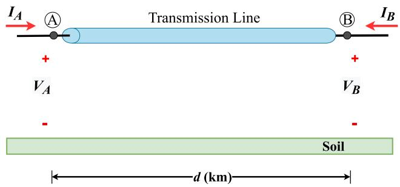  
FIGURE 1. Single-phase overhead TL in the frequency domain.

Bode’s method. In [20], the authors present a proposal to improve the accuracy of the model, replacing Bode’s method with the vector fitting technique [21]. The ULM circumvents some limitations of JMarti’s model because the solution is directly in the phase domain. This model is also available in Electromagnetic Transient (EMT) programs, and recently in [22] the authors present a technique that allows the implementation of ULM in ATP-EMTP. Although they are quite accurate, both JMarti’s model and ULM depend mainly on the previous calculation of the time delay τ , which is performed numerically and can affect the quality of the rational approximation [23].

In this context, this work describes a new transmission line model for the simulation of electromagnetic transients represented directly in the time domain. The proposed model constitutes the synthesis of the exact equivalent π -circuit of the transmission line from an electric circuit composed of the association of discrete elements (resistors, inductors, and capacitors). Thus, one can model the TL under study using typical passive elements and a single π-circuit for any line length. This novel model can be used in electromagnetic transients simulation software such as ATP, EMTP-RV or PSCAD. Since it consists only of circuit elements, it can be implemented in any other electric circuit simulation software. In summary, the introduced modeling aggregates the benefits of the exact equivalent π-model, which considers the distributed and frequency-dependent parameters. The main advantage of this approach is that it allows the simulations of electromagnetic transient phenomena directly in the time domain, without requiring the previous calculation of the travel time τ and, above all, not using the inverse Laplace or Fourier transforms.

This article is organized as follows. Section II presents the exact equivalent π-circuit and the expressions for the calculation of their respective admittances in the frequency domain. The synthesis of the π -circuit by means of circuit elements is presented in Section III. Section IV validates the proposed model, whereas the simulation results are presented in the time and frequency domain. A thorough comparison with the reference model based on the NLT [14]. Finally, Section V presents the conclusions, summarizing the main contributions and proposals for future works.

# II. EXACT EQUIVALENT π-CIRCUIT OF TLs

For the analysis of electromagnetic transients in the frequency domain, we initially consider the representation of a generic single-phase TL as shown in Figure 1. The sender and receiver are represented by A and B, respectively. The components $I _ { A }$ and $I _ { B }$ are the longitudinal currents and the terminal voltages are $V _ { A }$ and $V _ { B }$ . Expressions (1) and (2), known as line hyperbolic equations, describe the behavior of voltage and current at any point of the line, respectively [1].

$$
V _ {A} (\omega) = V _ {B} (\omega) \cosh (\gamma (\omega) d) - I _ {B} (\omega) Z _ {c} (\omega) \sinh (\gamma (\omega) d) \tag {1}
$$

$$
I _ {A} (\omega) = V _ {B} (\omega) \frac {1}{Z _ {c} (\omega)} \sinh (\gamma (\omega) d) - I _ {B} (\omega) \cosh (\gamma (\omega) d) \tag {2}
$$

The terms $Z _ { c } ( \omega )$ and $\gamma ( \omega )$ are the propagation constant and the characteristic impedance, given by (3) and (4), respectively [18]:

$$
Z _ {c} (\omega) = \sqrt {\frac {Z (\omega)}{Y (\omega)}} \tag {3}
$$

$$
\gamma (\omega) = \sqrt {Z (\omega) Y (\omega)} \tag {4}
$$

The variables $Z ( \omega )$ and $Y ( \omega )$ are the longitudinal impedance and the transverse admittance of the line per unit length, respectively, where $\scriptstyle \omega = 2 \pi f$ is the angular frequency in [rad/s] and f is the frequency [Hz]. It is observed in (5) and (6) that the longitudinal parameters $( R ( \omega )$ and $L ( \omega ) )$ are represented as a function of (ω), and therefore they take into account the frequency effect, i.e., they consider the skin effect and soil influence on the conductor.

$$
Z (\omega) = R (\omega) + j \omega L (\omega) \tag {5}
$$

$$
Y (\omega) = G (\omega) + j \omega C (\omega) \tag {6}
$$

To obtain the new model that represents the TL in the time domain, let us consider that the π -circuit in Figure 2 is the equivalent circuit of a TL with length d. It is characterized by a series admittance $Y _ { z \pi }$ and a shunt admittance $Y _ { \pi }$ between terminals A and B.

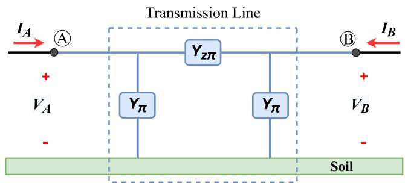  
FIGURE 2. Exact equivalent π-circuit of the TL.

Equations (7) and (8) describe the behavior of voltages and currents at terminals A and B of the equivalent π -circuit,

respectively.

$$
V _ {A} (\omega) = \left(1 + \frac {Y _ {\pi} (\omega)}{Y _ {z \pi} (\omega)}\right) V _ {B} + \frac {1}{Y _ {z \pi} (\omega)} I _ {B} \tag {7}
$$

$$
I _ {A} (\omega) = \left(2 Y _ {\pi} (\omega) + \frac {Y _ {\pi} (\omega) ^ {2}}{Y _ {z \pi} (\omega)}\right) V _ {B} + \left(1 + \frac {Y _ {\pi} (\omega)}{Y _ {z \pi} (\omega)}\right) I _ {B} \tag {8}
$$

Comparing the coefficients of $V _ { B }$ and $I _ { B }$ in (1) and (7), one can obtain (9) and (10), which correspond to the admittances $Y _ { z \pi }$ and $Y _ { \pi }$ of the equivalent π-circuit shown in Figure 2.

$$
Y _ {z \pi} (\omega) = \frac {1}{Z _ {c} (\omega) \sinh (\gamma (\omega) d)} \tag {9}
$$

$$
Y _ {\pi} (\omega) = \frac {\cosh (\gamma (\omega) d) - 1}{Z _ {c} (\omega) \sinh (\gamma (\omega) d)} \tag {10}
$$

This model exactly matches the hyperbolic equations of the line for any values assumed by the length and frequency. So, a single π-circuit can be used to represent a TL with a generic length, as its parameters are considered distributed per unit length and also take into account the frequency effect. This model is widely used in the literature and often referred to as exact equivalent π-circuit [2], [4]. Another term use to define it is ‘‘ long π ’’, because it represents a long-distance TL using a single π -circuit [24], or simply equivalent π -circuit of the TL [25], [26].

In addition to the explicit frequency dependency in (9) and (10), the longitudinal parameters $R ( \omega )$ and $L ( \omega )$ in (5) that are inserted in the calculation of the propagation function $\gamma ( \omega )$ and the characteristic impedance of the line $Z _ { c } ( \omega )$ , are also dependent functions frequency. Owing to this two-fold frequency dependence, the exact equivalent π-circuit does not have its direct representation in the time domain [4].

# III. EXACT EQUIVALENT π-CIRCUIT OF A TL FORMED BY CIRCUIT ELEMENTS

The proposed model is obtained from the representation of the TL equivalent π-circuit (from Figure 2) by circuit elements (resistors, inductors, and capacitors). Initially, the admittance curves $Y _ { z \pi }$ and $Y _ { \pi }$ in the frequency domain are approximated by rational functions using the VF algorithm [21], [27], [28]. To use the algorithm, has considered that the generic rational function F(s) (11) can represent the admittance $Y _ { z \pi }$ or the admittance $Y _ { \pi }$ in the domain [29], [30] frequency.

$$
F (s) = \sum_ {k = 1} ^ {N _ {p}} \left(\frac {r _ {k}}{s - p _ {k}}\right) + d + e s \tag {11}
$$

Parameters $r _ { k }$ and $p _ { k }$ in (11) correspond to the kth residue and kth pole, respectively, whereas the index $N _ { p }$ is the number of pole/residues of the rational function. The term s is the complex angular frequency and the terms D and E are real coefficients, these being considered zero in this work. The residues and poles can be formed by real or complex numbers, and therefore, the partial fractions that constitute the generic expression (11) result from two types of functions. The function formed by real numbers is given by $Y _ { r } ( s )$ in (12),

being represented by a RL series circuit as in Figure 3. The other partial fraction is formed by a pair of complex conjugate number as $Y _ { c } ( s )$ in (13) while the corresponding electrical circuit is shown in Figure 3b [30].

$$
Y _ {r} (s) = \frac {r _ {k}}{s - p _ {k}} \tag {12}
$$

$$
Y _ {c} (s) = \frac {r _ {m}}{s - p _ {m}} + \frac {r _ {m} ^ {*}}{s - p _ {m} ^ {*}} \tag {13}
$$

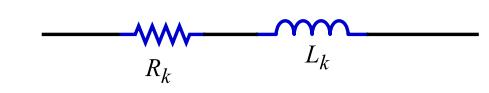  
(a)

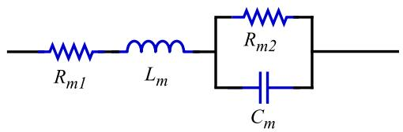  
(b)   
FIGURE 3. Equivalent RLC circuits: (a) real pole; (b) complex poles.

Equations (14) and (15) are used to calculate the elements R (resistance) and L (inductance) of the equivalent RL circuit show in Figure 3a from their respective real poles/residues [31].

$$
R = \frac {p _ {k}}{r _ {k}} \tag {14}
$$

$$
L = \frac {1}{r _ {k}} \tag {15}
$$

Equations (16) to (19) are used to calculate the elements R (resistance), L (inductance), and C (capacitance) of the equivalent circuit shown in Figure 3b from their respective complex poles/residues [31].

$$
L _ {m} = \frac {1}{r _ {m} + r _ {m} ^ {*}} \tag {16}
$$

$$
R _ {m 1} = - \frac {p _ {m} r _ {m} + p _ {m} ^ {*} r _ {m} ^ {*}}{2 r _ {m} ^ {2}} \tag {17}
$$

$$
C _ {m} = \frac {\left(r _ {m} + r _ {m} ^ {*}\right) ^ {2}}{r _ {m} r _ {m} ^ {*} \left(p _ {m} - p _ {m} ^ {*}\right) ^ {2}} \tag {18}
$$

$$
R _ {m 2} = \frac {r _ {m} + r _ {m} ^ {*}}{C \left(p _ {m} r _ {m} ^ {*} + r _ {m} p _ {m} ^ {*}\right)} \tag {19}
$$

For each partial fraction that constitutes (11), a branch of an electrical circuit equivalent to it is obtained. The number of branches will depend on the number of poles/residues. Such branches are connected in parallel according to Figure 4, which presents the arrangement formed by RL and RLC branches that compose the generic admittance representing the rational function F(s).

From a circuit theory point of view, the following conditions must be satisfied in order to achieve a passive circuit,

$$
r _ {k} \geq \left\{ \begin{array}{l} r _ {m} p _ {m} ^ {*} + r _ {m} ^ {*} p _ {m} \leq 0 \\ r _ {m} p _ {m} - r _ {m} ^ {*} p _ {m} ^ {*} \leq 0 \end{array} \right. \tag {20}
$$

that is, the values of all circuit elements of $Y _ { r } ( s )$ and $Y _ { c } ( s )$ must be positive. Although ‘‘passivity’’ can be applied using vector fitting (VF), sometimes this condition may not be satisfied and a passivity violation problem may be introduced. The reason is that VF is a method of mathematical approximation that cannot guarantee ‘‘passivity’’. In order to solve this problem, passivity is forced for the admittances obtained after using VF by applying the Fast Modal Perturbation (FMP) [32]. A detailed description of this procedure can be found in [32], in which the passivity of each admittance can be assured. Using FMP, an equivalent circuit can be obtained and simulated in ATP software with its built-in R, L, and C components.

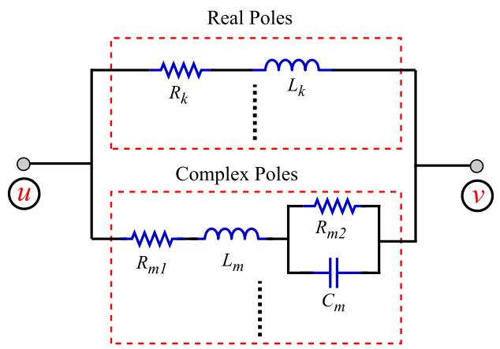  
FIGURE 4. Representative circuit for a generic admittance.

Figure 5 shows the connections of terminals u and v of their corresponding admittances so that they represent the equivalent π-circuit of the TL.

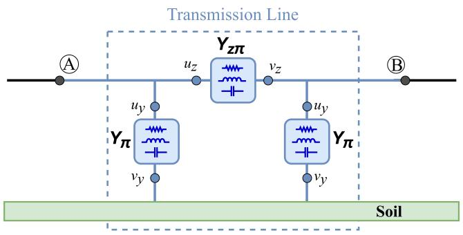  
FIGURE 5. Equivalent π-circuit of a TL formed by circuit elements.

# IV.VALIDATIONOFTHEPROPOSEDMODEL

To validate the model, the single-phase TL shown in Figure 1 is adopted. It consists of four Grosbeak-type

conductors, in which each subconductor has a radius of 0.0153 m and a spacing of 0.4 m as shown in Figure 6. The soil resistivity $\rho _ { \mathrm { s o i l } }$ is considered to be constant and equal to 1000 .m.

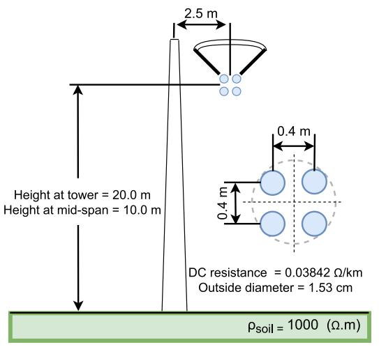  
FIGURE 6. Geometry of a single-phase TL.

The longitudinal parameters of the TL shown in Figure 6 were calculated taking into account the frequency effect, that is, considering the soil and skin effect influence for the range of frequencies between 0.1 Hz and 100 kHz [33]. The transversal capacitance was considered constant and its calculated value is 6.89 nF/km, whereas the conductance was neglected [34]. Results were then obtained using MATLAB software.

# A. RATIONAL APPROXIMATION OF THE ADMITTANCES

$\pmb { Y } _ { z \pi } \pmb { E } \pmb { Y } _ { \pi }$

The approximation of the admittance curves $Y _ { z \pi }$ and $Y _ { \pi }$ were obtained for a TL with a length of 100 km. Figure 7 shows the magnitude and phase of the exact admittance $Y _ { z \pi }$ (obtained directly from the line parameters) and the curves of its approximate functions with 15, 25, and 60 poles/residues. Figure 8 presents the magnitude and phase curves of the exact admittance $Y _ { \pi }$ and their approximations with 15, 25, and 60 poles/residues. Such poles/residues were obtained using the VF algorithm.

For both admittance curves $( Y _ { z \pi }$ and $Y _ { \pi } )$ the maximum frequencies of adjustments were defined as being after the end of the resonance peaks. It can be seen in Figures 7 and 8 that the magnitudes and phases of the curves were very precisely approximated, considering each number of poles used. In both cases, it is observed that when the number of poles/residues increases, the approximated curves overlap the exact curve up to higher frequencies, especially the approximate curve with 60 poles, which is identical to the exact curve until the end of the resonance peaks.

The proposed model has the characteristic of using the same number of poles to adjust the curves of $Y _ { z \pi }$ and $Y _ { \pi }$ for any line length, taking into account that the adjustment is

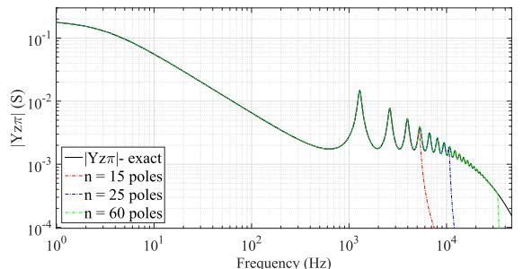

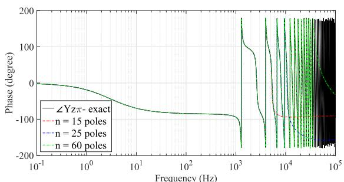

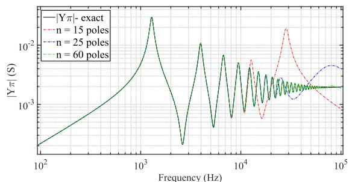  
FIGURE 7. Admittance $\pmb { \gamma _ { Z \pi } } \colon ( \mathsf { a } )$ Magnitude; (b) Phase.   
(a)

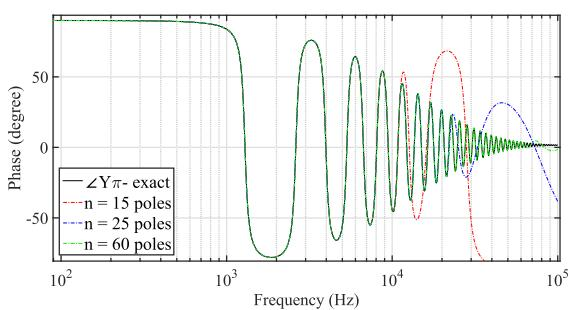  
(b)   
FIGURE 8. Admittance $\pmb { Y } _ { \pi } \colon ( \mathsf { a } )$ Magnitude; (b) Phase.

made until the end of the resonance peaks. This is because the number of poles/residues needed for the adjustment strongly depends on the number of resonance peaks [21]. With the variation in the length of the line, there is a displacement of the region of the resonance peaks along the frequency spectrum. However, the number of resonance peaks changes little as seen in Figure 9. The plot shows the resonance region

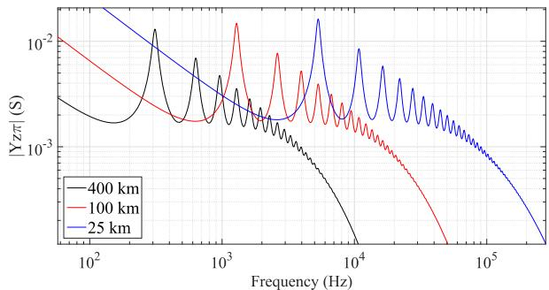  
FIGURE 9. Magnitudes of admittance curves $\pmb { \gamma } _ { \pmb { z } \pi }$ for different line lengths.

of the exact curves of $Y _ { z \pi }$ for three different line lengths, according to the legend. It is worth noting that the curve $Y _ { z \pi }$ of the TL with a length of 100 km (the same shown in Figure 7) is in the center, while the curve of the TL with 25 km is on the right side, with resonance peaks ending close to 160 kHz. The curve $Y _ { z \pi }$ of the 400-km TL is within a lower frequency range and its resonance peaks end around 8 kHz. The admittance curves $Y _ { \pi }$ follow the same characteristic as $Y _ { z \pi }$ , i.e., they follow the same rule for the variation of the line length.

# B. FREQUENCY DOMAIN ANALYSIS

The behavior of the novel model can be analytically evaluated in the frequency domain from the voltage ratio between the sending and receiving ends. Considering that the circuit representing the TL in Figure 2 has its receiver open, the voltage ratio is obtained as in (21).

$$
\frac {V _ {B}}{V _ {A}} = \frac {Y _ {z \pi} (\omega)}{Y _ {z \pi} (\omega) + Y _ {\pi} (\omega)} \tag {21}
$$

Figure 10 shows the magnitude and phase of the exact relationship $V _ { B } / V _ { A }$ and the results obtained considering the approximate $Y _ { z \pi }$ and $Y _ { \pi }$ admittances using 15, 25, and 60 poles, for a frequency range between 10 Hz and 100 kHz. It is observed that 60 poles are enough for the curve to be precisely fitted for frequencies higher than the end of the resonance peaks. This result validates the performance of the model in the frequency domain considering the association of the admittances that constitute the equivalent π -circuit.

# C. TIME-DOMAIN ANALYSIS

To analyze the results in the time domain, the exact equivalent π-circuit of the TL formed by circuit elements was implemented, whereas simulation results were obtained with ATPDraw software.

Using the admittances $Y _ { z \pi }$ and $Y _ { \pi }$ obtained in section IV-A, three equivalent π-circuits synthesized with 15, 25, and 60 poles were formed for the 100 km TL. Such circuits were implemented in ATPDraw using the LIB component according to Figure 11 [35].

The simulation results of the three circuits are compared with the values of the reference model, which in this case

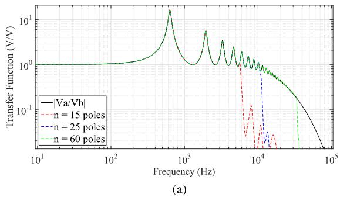

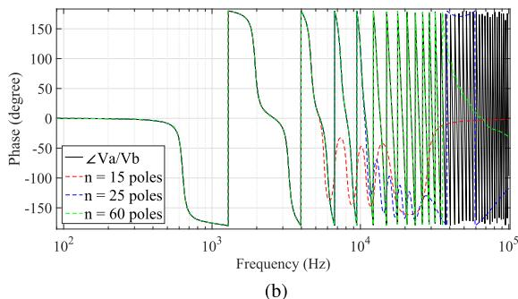  
FIGURE 10. Transfer function $v _ { B } / v _ { A } \colon ( \mathsf { a } )$ Magnitude; (b) Phase.

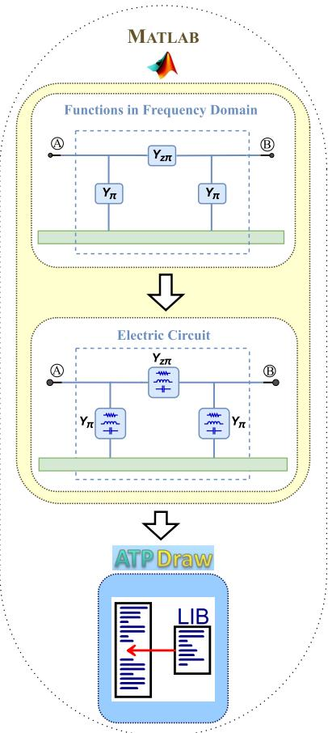  
FIGURE 11. Implementation of the proposed model.

uses the voltages and currents obtained with the hyperbolic equations of the line in the frequency domain and converted to the time domain using the NLT [14].

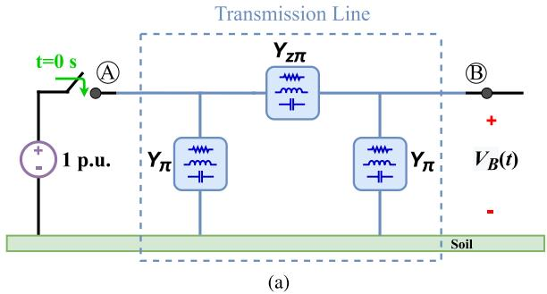

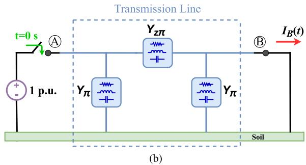  
FIGURE 12. DC voltage source: (a) open-circuit test; (b) short-circuit test.

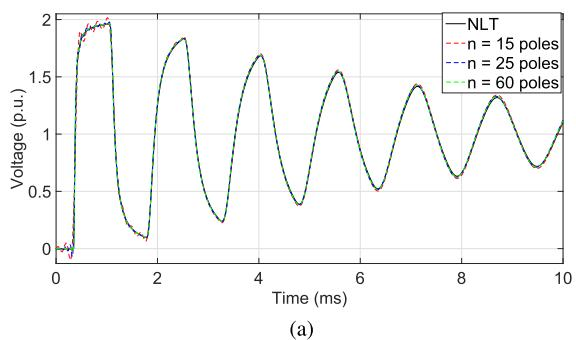

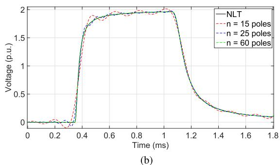  
FIGURE 13. Open-circuit voltage at the receiving end (DC voltage source): (a) transient up to t = 10ms; (b) first reflection wave.

# 1) LOW FREQUENCIES ANALYSIS

In order to validate the proposed model for transients composed of low frequencies, a DC voltage source of 1 p.u. is applied in the sending end, considering that the switch is closed at t=0, while two simulations are performed. In the first one, the receiving end of the line is open as shown in Figure 12. In the second one, the receiving end is short-circuited as shown in Figure 12b.

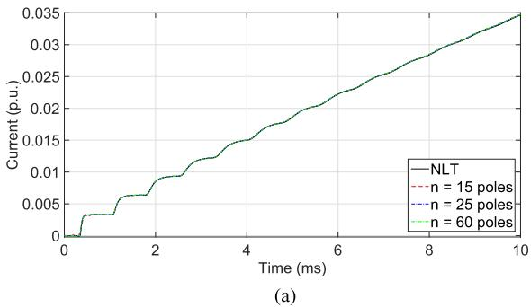

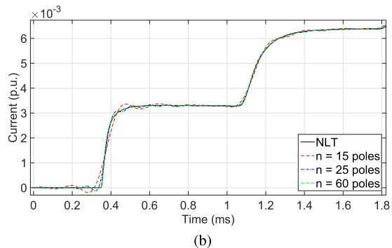  
FIGURE 14. Current transient at the short-circuited receiving end of the line: (a) transient up to t = 10ms; (b) first reflection wave.

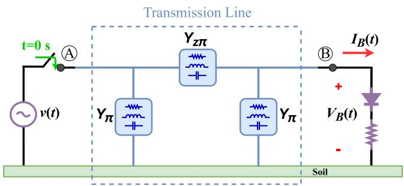  
FIGURE 15. TL with an AC source voltage and a nonlinear load.

The results obtained with the receiving end open are shown in Figure 13, where the voltage at the receiving end calculated with NLT is compared with the corresponding voltage obtained with the simulation of the proposed model in ATPDraw environment. It is observed in Figure 13b that, at the beginning of the transient, the voltage curves of $V _ { B } ( t )$ with 15 and 25 poles present a small distortion when compared with the reference value. However, they overlap after the first reflected wave, thus denoting that the novel model presents results very close to the reference model even with the curve fitted with fewer poles (25 poles). When checking the curve fitted with 60 poles, it is observed that it overlaps the reference value from the beginning of the transient. It is noticed that when the admittances $Y _ { z \pi }$ and $Y _ { \pi }$ are fitted until the end of the respective resonance peaks, the result in the time domain has no oscillations and its response is the same as that obtained with NLT. Figure 14 shows the current $I _ { B }$ flowing through the short-circuited receiving end.

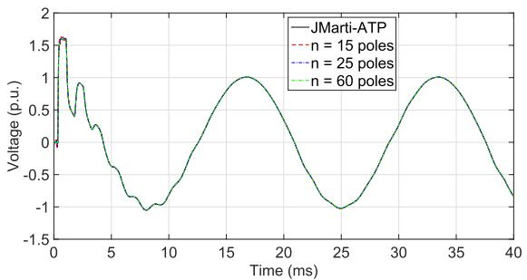  
(a)

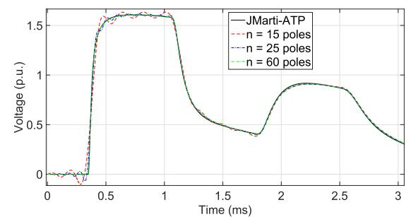  
(b)   
FIGURE 16. Voltage $( \pmb { V _ { B } } ( t ) )$ at the receiving end of the TL connected to a nonlinear load: (a) time < 40ms; (b) time < 3ms.

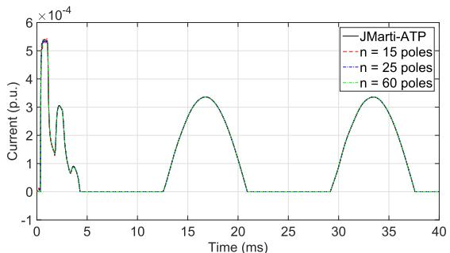  
(a)

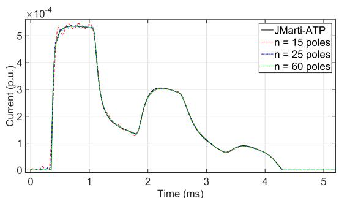  
(b)   
FIGURE 17. Current $( I _ { B } ( t ) )$ at the receiving end of the TL connected to a nonlinear load: (a) time < 40ms; (b) time < 5ms.

For the simulation results of Figures 13 and 14, a time step of $\Delta t = 1 \mu s$ was used.

To obtain simulation results involving the proposed method applied to alternating current (AC), the TL is excited at $t = 0 s$ by a 60 Hz sinusoidal voltage source with an amplitude of 1 p.u. A diode is connected to the receiving end in series with a resistor to represent a nonlinear load as in Figure 15.

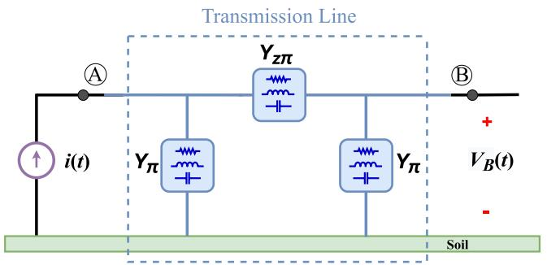  
FIGURE 18. Open-circuited TL with an atmospheric impulse applied at the sending end.

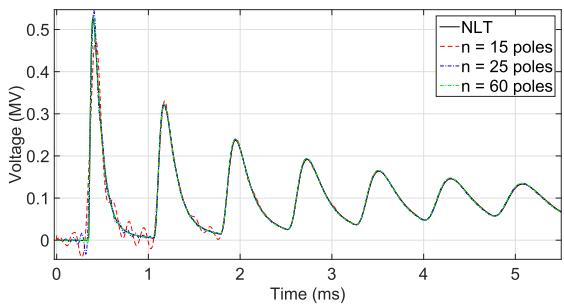  
(a)

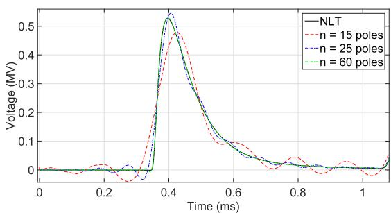  
(b)   
FIGURE 19. Open-circuit voltage at the receiving end (atmospheric impulse): (a) transient up to $\pmb { t = 5 }$ ms; (b) first reflection wave.

In this simulation, JMarti’s model was used as a reference available in ATP-EMTP program, as it allows simulations involving nonlinear loads and a fair comparison with the proposed model. Figures 16 and 17 show, respectively, the voltages and currents at the receiving end obtained with JMarti’s and the proposed model. As for simulations both in steady-state and transient regimes,it is observed that the proposed model is quite accurate at low frequencies.

# 2) HIGH FREQUENCIES ANALYSIS

The validation of the proposed model for higher frequencies is carried out by means of an atmospheric impulse applied at the sending end of the line, with the receiving end open as in Figure 18. This input signal is modeled by a current source equivalent to a double exponential function 1.20/50 $\mu \mathrm { s }$ (front time/tail time) and amplitude of 1 kA [36]

Figure 19 shows the voltage curves $V _ { B }$ calculated with the reference model (NLT) and the simulation results of the

proposed model fitted with 15, 25, and 60 poles. It is observed in Figure 19a that the oscillations at the beginning of the transient using the 15-pole model are greater when compared with the line excitation at low frequencies. Figure 19b shows that, in the first wave reflection at the receiving end, the model fitted with 60 poles does not have voltage oscillations and its curve overlaps the reference value.

According to Figure 10, the 60-pole model has its maximum adjustment frequency after the end of the resonance peaks. In this case, the time-domain simulations showed excellent results both for the line energization and high-frequency lightning strikes. Thus, one can state that it is not necessary to adjust the ratio curve corresponding to Figure (10) to implement the model at frequencies higher than those of the resonance peaks, which for the 100-km line occur at 33 kHz.

# V. CONCLUSION

This work has presented a novel model for representing single-phase TLs directly in the time domain, which was developed from the synthesis of the exact equivalent π-circuit by on an association of discrete elements (R, L, and C). The model considers the parameters as distributed along the line length, and also takes into account the frequency-dependent effects, that is, the calculation of the longitudinal parameters of the line is obtained considering the skin effect and soil influence on the conductors, and in this case, constant soil parameters can be used, but also, the novel model allows including the frequency dependence of the soil electrical parameters.

The main disadvantage of the proposed model is that it uses a high number of poles to obtain the rational function, which requires a higher number of circuit elements for the synthesis of the equivalent π-circuit. Even so, the required simulation time interval in ATPDraw is not long and does not exceed three seconds.

The proposed model was validated in a steady state and especially for electromagnetic transients composed of a wide range of frequencies with accurate results. Because it is made up only of circuit elements, the introduced model can be used in any electric circuit simulation software. This allows the inclusion of nonlinear and time-varying elements, also avoiding the use of convolution integrals or even inverse transforms, that is, Laplace or Fourier ones.

Future work includes the possible extension of the proposed model to three-phase TLs using modal transformation. The technique consists of transforming a line with n phases into n independent single-phase lines called propagation modes. Each propagation mode can be modeled as an exact equivalent π-circuit formed by circuit elements.

# REFERENCES

[1] A. Budner, ‘‘Introduction of frequency-dependent line parameters into an electromagnetic transients program,’’ IEEE Trans. Power App. Syst., vol. PAS-89, no. 1, pp. 88–97, Jan. 1970.   
[2] H. W. Dommel, EMTP Theory Book. Vancouver, BC, Canada: Microtran Power System Analysis Corporation, 1996.

[3] G. Bilal, P. Gomez, R. Salcedo, and J. M. Villanueva-Ramirez, ‘‘Electromagnetic transient studies of large distribution systems using frequency domain modeling methods and network reduction techniques,’’ Int. J. Electr. Power Energy Syst., vol. 110, pp. 11–20, Sep. 2019.   
[4] J. R. Marti, L. Marti, and H. W. Dommel, ‘‘Transmission line models for steady-state and transients analysis,’’ in Proc. Int. Power Conf. Athens Power Tech., vol. 2, Sep. 1993, pp. 744–750.   
[5] J. A. Martinez-Velasco, Transient Analysis of Power Systems: A Practical Approach. Hoboken, NJ, USA: Wiley, 2020.   
[6] J. A. R. Macias, A. G. Exposito, and A. B. Soler, ‘‘A comparison of techniques for state-space transient analysis of transmission lines,’’ IEEE Trans. Power Del., vol. 20, no. 2, pp. 894–903, Apr. 2005.   
[7] A. R. J. Araújo, S. Kurokawa, A. A. Shinoda, and E. C. M. Costa, ‘‘Mitigation of erroneous oscillations in electromagnetic transient simulations using analogue filter theory,’’ IET Sci., Meas. Technol., vol. 11, no. 1, pp. 41–48, Jan. 2017.   
[8] A. I. Chrysochos, G. P. Tsolaridis, T. A. Papadopoulos, and G. K. Papagiannis, ‘‘Damping of oscillations related to lumped-parameter transmission line modeling,’’ in Proc. Conf. Power Syst. Transients (IPST), vol. 7, 2015.   
[9] J. S. L. Colqui, A. R. J. Araújo, and S. Kurokawa, ‘‘Improving the performance of a lumped transmission line model used in electromagnetic transient analysis,’’ IET Gener., Transmiss. Distrib., vol. 13, no. 21, pp. 4942–4951, Nov. 2019.   
[10] J. S. L. Colqui, A. R. J. de Araújo, S. Kurokawa, and J. P. Filho, ‘‘Optimization of lumped parameter models to mitigate numerical oscillations in the transient responses of short transmission lines,’’ Energies, vol. 14, no. 20, p. 6534, Oct. 2021.   
[11] S. Kurokawa, F. N. R. Yamanaka, A. J. Prado, and J. Pissolato, ‘‘Inclusion of the frequency effect in the lumped parameters transmission line model: State space formulation,’’ Electr. Power Syst. Res., vol. 79, no. 7, pp. 1155–1163, Jul. 2009.   
[12] A. R. J. Araujo, R. C. Silva, and S. Kurokawa, ‘‘Comparing lumped and distributed parameters models in transmission lines during transient conditions,’’ in Proc. IEEE PES TD Conf. Expo., Apr. 2014, pp. 1–5.   
[13] F. A. Uribe, J. L. Naredo, P. Moreno, and L. Guardado, ‘‘Electromagnetic transients in underground transmission systems through the numerical Laplace transform,’’ Int. J. Electr. Power Energy Syst., vol. 24, no. 3, pp. 215–221, Mar. 2002.   
[14] P. Moreno and A. Ramirez, ‘‘Implementation of the numerical Laplace transform: A review task force on frequency domain methods for EMT studies,’’ IEEE Trans. Power Del., vol. 23, no. 4, pp. 2599–2609, May 2008.   
[15] M. S. Mamiş, ‘‘Computation of electromagnetic transients on transmission lines with nonlinear components,’’ IEE Proc.-Generation, Transmiss. Distrib., vol. 150, no. 2, pp. 200–204, Mar. 2003.   
[16] P. Gómez and F. A. Uribe, ‘‘The numerical Laplace transform: An accurate technique for analyzing electromagnetic transients on power system devices,’’ Int. J. Electr. Power Energy Syst., vol. 31, nos. 2–3, pp. 116–123, Feb. 2009.   
[17] J. C. Salari and C. Portela, ‘‘A methodology for electromagnetic transients calculation—An application for the calculation of lightning propagation in transmission lines,’’ IEEE Trans. Power Del., vol. 22, no. 1, pp. 527–536, Jan. 2006.   
[18] J. R. Marti, ‘‘Accurate modeling of frequency-dependent transmission lines in electromagnetic transient simulations,’’ IEEE Power Eng. Rev., vol. PER-2, no. 1, pp. 29–30, Jan. 1982. [Online]. Available: http://ieeexplore.ieee.org/document/5519686/   
[19] A. Morched, B. Gustavsen, and M. Tartibi, ‘‘A universal model for accurate calculation of electromagnetic transients on overhead lines and underground cables,’’ IEEE Trans. Power Del., vol. 14, no. 3, pp. 1032–1038, Jul. 1999.   
[20] E. S. Bañuelos-Cabral, J. A. Gutiérrez-Robles, J. L. García-Sánchez, J. Sotelo-Castañón, and V. A. Galván-Sánchez, ‘‘Accuracy enhancement of the JMarti model by using real poles through vector fitting,’’ Electr. Eng., vol. 101, no. 2, pp. 635–646, Jun. 2019.   
[21] B. Gustavsen and A. Semlyen, ‘‘Rational approximation of frequency domain responses by vector fitting,’’ IEEE Trans. Power Del., vol. 14, no. 3, pp. 1052–1059, Jul. 1999.   
[22] F. O. S. Zanon, O. E. S. Leal, and A. De Conti, ‘‘Implementation of the universal line model in the alternative transients program,’’ Electr. Power Syst. Res., vol. 197, Aug. 2021, Art. no. 107311.

[23] B. Gustavsen, ‘‘Optimal time delay extraction for transmission line modeling,’’ IEEE Trans. Power Del., vol. 32, no. 1, pp. 45–54, Feb. 2016.   
[24] C. Portela and M. C. Tavares, ‘‘Modeling, simulation and optimization of transmission lines. applicability and limitations of some used procedures,’’ IEEE Transmiss. Distrib. Latin Amer., p. 38, Mar. 2002.   
[25] J. D. Glover, M. S. Sarma, and T. Overbye, Power System Analysis & Design, SI Version. Boston, MA, USA: Cengage Learning, 2012.   
[26] W. Stevenson, Jr., and J. Grainger, Power System Analysis. New York, NY, USA: McGraw-Hill, 1994.   
[27] D. Deschrijver, M. Mrozowski, T. Dhaene, and D. D. Zutter, ‘‘Macromodeling of multiport systems using a fast implementation of the vector fitting method,’’ IEEE Microw. Wireless Compon. Lett., vol. 18, no. 6, pp. 383–385, Jun. 2008.   
[28] B. Gustavsen, ‘‘Improving the pole relocating properties of vector fitting,’’ IEEE Trans. Power Del., vol. 21, no. 3, pp. 1587–1592, Jul. 2006.   
[29] B. Gustavsen and A. Semlyen, ‘‘Enforcing passivity for admittance matrices approximated by rational functions,’’ IEEE Trans. Power Syst., vol. 16, no. 1, pp. 97–104, Feb. 2001.   
[30] B. Gustavsen, ‘‘Computer code for rational approximation of frequency dependent admittance matrices,’’ IEEE Trans. Power Del., vol. 17, no. 4, pp. 1093–1098, Oct. 2002.   
[31] G. Antonini, ‘‘SPICE equivalent circuits of frequency-domain responses,’’ IEEE Trans. Electromagn. Compat., vol. 45, no. 3, pp. 502–512, Aug. 2003.   
[32] B. Gustavsen, ‘‘Fast passivity enforcement for pole-residue models by perturbation of residue matrix eigenvalues,’’ IEEE Trans. Power Del., vol. 23, no. 4, pp. 2278–2285, Oct. 2008.   
[33] W. Mingli and F. Yu, ‘‘Numerical calculations of internal impedance of solid and tubular cylindrical conductors under large parameters,’’ IEE Proc. Gener., Transmiss. Distrib., vol. 151, no. 1, pp. 67–72, Jan. 2004.   
[34] J. A. Martinez, B. Gustavsen, and D. Durbak, ‘‘Parameter determination for modeling system transients—Part I: Overhead lines,’’ IEEE Trans. Power Del., vol. 20, no. 3, pp. 2038–2044, Jul. 2005.   
[35] (2021). The ATPDraw Simulation Software (2021), Version 7.3. Accessed: Mar. 20, 2021. [Online]. Available: https://www.atpdraw.net/   
[36] W. Jia and Z. Xiaoqing, ‘‘Double-exponential expression of lightning current waveforms,’’ in Proc. 4th Asia–Pacific Conf. Environ. Electromagn., Aug. 2006, pp. 320–323.

JUAN P. ROBLES BALESTERO received the B.Sc. and M.Sc. degrees in electrical engineering from São Paulo State University (UNESP), Ilha Solteira, Brazil, in 2004 and 2006, respectively, where he is currently pursuing the Ph.D. degree in electrical engineering. He was a Professor with the Federal Institute of Education, Science and Technology of Santa Catarina, Chapecó, from 2007 to 2014. Since 2014, he has been a Professor and a Researcher with the Federal Institute

of Education, Science, and Technology of São Paulo, Votuporanga, Brazil. His research interest includes transmission line modeling for electromagnetic transients simulations in power systems.

JAIMIS SAJID LEON COLQUI received the B.Sc. degree in electrical engineering from National University Engineering (UNI), Peru, in 2014, and the M.Sc. and Ph.D. degrees in electrical engineering from São Paulo State University, in 2017 and 2021, respectively. He is currently a Postdoctoral Researcher with the State University of Campinas, Campinas, Brazil. His research interests include transmission tower and line modeling for electromagnetic transient simulations in power systems.

SÉRGIO KUROKAWA (Member, IEEE) received the B.Sc. degree in electrical engineering from São Paulo State University (UNESP), in 1990, the M.Sc. degree from the Federal University of Uberlandia (UFU), in 1994, and the Ph.D. degree from the University of Campinas (Unicamp), in 2003. Since 1994, he has been as a Professor and a Researcher with UNESP, Ilha Solteira Campus. His current interests include electromagnetic transients in power systems and transmission line modeling.