# !‘?@*!K\l!LK\M&*+E?{;lx|

&’(" ) *" + ’" ,-.)

!"556&’(bC(BCDB::NrQ3 /7/"###@$ )5bAEV338Xv/b:/7b: /7/"###@(#

./ ! (o<=jK>?78P(o<=:;1(k7>? 7O‘‘l/~^)hm34YH I56(nk7>? [JKUV’1(k7JQx(nk7JQ/_lmn b~!yP3( o<=/BY,x674,%m’d/C< LN,=w%o./1(x(nk7jK>?Q p 8KqF/4qUw GTS^Q’(o<=jK>?<=ir S%&’9:d/E1gp -lHRjkMx,-$/E1ISxBY’pUw v\*/>?ir’stv*’ ;#u =j/ %U’>?/vw,xs] rsX&/>?Utr^’v%&/Hx/*;,k4q Uw/Op,

012 ! (o<=>? jK>? E1-l BY’p QpGT

34567 ! &’!$(

# ( |}

1g|~ azrs(eHtc [G\DT( !]3[-#8}+$DT(CD!IV-&W# %(B( iPQj}]*CDPQ vfjww6_|82 }#GHb()}!+8(‘)}!+Lt$E m,(BCDH&’~9TU KDHb()}‘ a^(‘)}‘a34W)jd$"% (BCDHW K8XA‘a34i2+?,H;68FG

(BCD|5‘a34O)cR(q#fh5 >~ A5r(BCDkQb()}‘a JhH. :e}^z#$UVB.(‘)}‘a [EF& rd(BCDHa$G82}#G29?,H# 8

KDH|5‘aCD,^&"K.qHHb( 8(‘)}c,+f cJh,R[T+f <‘, RP[i+f%*Jh$)+$% IJb-+f29HF $vC:^zd2~PE6I3( lR!+%O -#J*P. "S+I[TU "|M}+G

]^AEpH|5‘aCD,^B.FT$8 Hb()}8(‘)}‘a+f EM#H9K| 5‘aE3 j&T’ ’-)IJ5;EcF6i t CD+k>OWX 2[?|5‘aH}+G jH<Op‘a,^Q??^W$,%A2+H6I 3(Hj#G

# ! *!l!LK\E?

|5‘ahB.H7FT$8Hb()}+f

!&W# 8(‘)}+f !&O# HI3( : & c I4HCH/9nJr_ K6IQ6LIH+f%! [cc^V\p JJ:&c-kknJ$8

# !%! *!K\E?@A

&WB.j \8?fLgdSkQE3 8( bB.5ON:HT&R+x* e}B.<NT d;H{S;< b()}!+&’Hr4Ec6 h["O,#T&-:R+#H6L

$$
\left\{ \begin{array}{l} \frac {\mathrm {d} x}{\mathrm {d} t} = f (x, y) \\ \mathbf {0} = g (x, y) \end{array} \right. \tag {1}
$$

Sh *% x*T&R+#h;<CD2}#GH| }Wg(+ x*-:R+#hCDHPQWg

IJAE3hK0Y;6HjwcdEF>? HG4 EB.LwTU+YHUV:’d2$*%

]^B.$.,-HR(6LS!"# vw/> ?cH6LHR+Hrd K,$+YCK~?3 (K&}KYCHjd E30Yik#cd*+ 5; 1H$.,-(K.6I(DO2}UVE 3Ke}E3&o w6xv5LS# vKO,U Vd2HE*8|5‘aHr_

# !%" !LK\E?@W

&OB./0FSLa]\dSkQE3 8(b .C8MQR+;< e}B.T&R+^DT& R+~;< e}hHUV}&oxgY,-,C Y%\(d8%\(D’Hjc{S iq)}E 3%\(8 GY%!}&YHsNEGdekQ 6L

&OEcdbCD!x#5OHPQ8<2| b hX@cA8<W8}q<W cdV:<W %

&O29?@carEFH(BCDUVd 2$*% hX8(b WGO T(q (2b (’ } 8O (Dt:O (Gt:OcdK8(b\pL IH ZOOOpSH_‘XsO XKO8(BCD a$O$!%

# " M&*+ZNE?{;EFz

# "%! ?@:+;<EFz

?@IJCDH_!no89:kQb()} dSOHCDE3 ,-LIsN878HS!0 |}Wg8|}Wg P[|5‘aHS!Wg CDEkK$!‘a]v-@A +15;%E. -a}YQ$!|5‘aE3

# "%" "A[\l]^EFz

S!g|5‘ahe}HvI:J8no" hXUVfUK78gAwIC e}sNEGdet^no%

# "%# ]Onjl]^EFz

5;Q6H6InoT;hX6Ik>8R : b()}‘a)( (‘)}‘a)(cd[? >![K‘aw)1P$Hw)]p%9:

# # PQjRd?jw<F

K|5‘ah [G;)*b(K8(‘KH :J]f$t!+ :J]f$tT;v.Q8j Q)cRS K0vH|5‘a+fh&"B.. QRS

V"7,cI[5UH.QRS Jh $\Delta T , \Delta t$ &Sx*b()}8(‘)}‘a)(":Z"")" ($x*:J]f$tH@Y>f 0V*H$t !+EcO+ KE3b(K] (‘KQO%‘| } E3(‘K] b(KiQO%‘|} PQH $t!+E9U^W$@+%% 7vBAK%\no K-]fY ]KQ$!O,)(H‘a bcR S0YI[ R7KYIL eccd|5‘ahr ]$tH;6

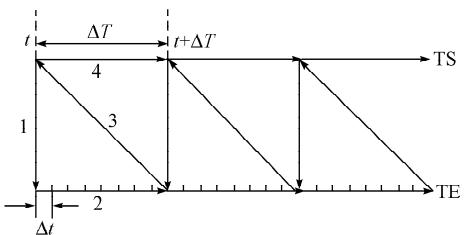  
4! @Al@WSBjRjw_‘   
"#$%! A02#0.)(1(0\:;(/$0601;’)’*@A(/)@W

V)7,cjQ:J$tRS "0Vh$t!万方数据

+EO+ [KK‘a!+h"j5;p]%‘ @ FjQE3 +12[?‘aKY [r]|5‘a ’_?wV$@% RKE3]Kr,b()(]sN ] B.H"7C,b()(AKH%\9:no +1%&?|5‘aHE30Y #SKe}hi 89Wg] 6IN(G8(DO[89LW "K B.bcjQ:J$tRS )AKe}H<Wn oec,-d] S# ’&HKh i1(j#v fAKe}2}WgA]K_qH%&

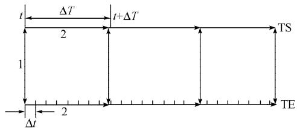  
44 @Al@WTBjRjw_‘   
"#$%4 K(2(++0+)(1(0\:;(/$0601;’)’*@A(/)@W

]^B..Q8jQLh5H:J]f$tR S fBCDa}PQ] B.jQRS .c2[ |5‘aHKY Ke}hi89Wg] B..Q RS .c2[|5‘aH0Y %!cC)cR (Hc5m. EcI#f^X:J$t=>H‘ a0Y8KY>?

qnr_!+UV( #’ 7b()}‘a) ( ’P , ]^(‘Ke}hi89Wg :J$t RS6jQ|[.Q f(‘Ke}@K $, ,k $\Delta T _ { - }$ %]sC‘a GY2^+Aw]soH<NL gKo-b(K 6zb(K$! $[ t , t + \Delta T ]$ ]s CH‘a jHKO,b()(]sN $t + \Delta T$ :, |[jQRS

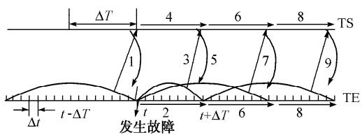  
49 TBlSBJ&(jRjw_‘   
"#$%9 I’6<#/0)7(2(++0+(/).02#0.)(1( 0\:;(/$0601;’)

# $ jRl]btucd<F

?@&’jQ:J$tRSOHb(K8(‘K:J%ndw)\pR( "V$A* ’$[KBAE3]^[ $t _ { \mathrm { c } }$ w)]^[ $t _ { \mathrm { b } }$ Ow $t _ { \mathrm { c } } < t _ { \mathrm { b } }$ ] b(K8(‘K&SkQ‘a ,\E3-$t _ { \mathrm { c } } = t _ { \mathrm { b } }$ 时刻。

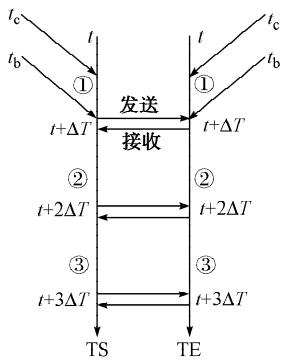  
4> TBjw_‘c(jRl]ltucd   
"#$%> L(1(:’66=/#:(1#’/(/).8/:;2’/#M(1#’/:’/12’+ #/7(2(++0+)(1(0\:;(/$0601;’)

b(KK,Rb()(]sC75E3"’ 1Hd2LATU +1&V:abOb(K@- .w)]p $t _ { \mathrm { b } }$ ’$[K&SkQ0 , - $t + \Delta T -$ Rb()(]sCHE3 cb(K[T\k+ Bb(K@‘a-O,b()( $t + \Delta T$ !fBAw )]p $t _ { \mathrm { b } } )$ ] Kob(KH%\no-(‘K R j9K(‘KBAH‘aE3 B(‘Ki-.w )]p $t _ { \mathrm { b } }$ ] ,Rrkb(KKo%\no <, RrGKoAwHw)ng K[K"8+w)n gH6&-AKH%\noY $[ t , t + \Delta T ]$ ]sC H‘a!+h8 ~]Fw)]p $t _ { \mathrm { b } } = t _ { \mathrm { b } } + \Delta T$ ) BAE3]pacdICS $t _ { \mathrm { c } } < t _ { \mathrm { b } }$ [KV"kQ O,b()(H‘a \-e}hi89Wg^z ‘ah8

Ke}hi89Wg] B..Q:J$tR S :J%n8w)\p3(KjQRSvq&j w

"V,A* ’$ $t + \Delta T$ ]^e}hi89W g B.b(Kp],Rb()(H.Q:J$t RS ~] (‘KE3wVG7 $t _ { \mathrm { c } } < t _ { \mathrm { b } }$ Rb(K E3wVWq $t _ { \mathrm { c } } + \Delta T { < } t _ { \mathrm { b } }$ K $t + \Delta T$ ]^"[KH w)]p"7 $t + 2 \Delta T$ K(‘K6O $t _ { \mathrm { c } } = t + \Delta T <$ $t + 2 \Delta T = t _ { \mathrm { b } }$ ，满足向前计算条件，但机电侧由于 $t _ { \mathrm { c } } + \Delta T = t + 2 \Delta T = t _ { \mathrm { b } }$ ,不满足向下一机电步长仿真 E3HwV

B(‘K‘a- $t + 2 \Delta T$ ]^ kb(KKh%\no8w)ng Fb(Kw)]p $t _ { \mathrm { b } } = t _ { \mathrm { b } } +$ $\Delta T$ )v $t _ { \mathrm { c } } + \Delta T = t + 2 \Delta T < t _ { \mathrm { b } }$ cdkO,b()(‘aE3wV +1CD$! $[ t + \Delta T , t + 2 \Delta T ]$ ]sCHb(K‘a - $t + 2 \Delta T$ ]^YKo%\no8w)ng-(‘K ~]F(‘Kw)]p$t _ { \mathrm { b } } = t _ { \mathrm { b } } + \Delta T = t + 3 \Delta T$ ,则电磁侧满足了关系式 $t _ { \mathrm { c } } =$ $t + 2 \Delta T { < } t _ { \mathrm { b } }$ ,又可以继续下一机电步长的仿真计算，\-e}hi89Wg^z‘ah8

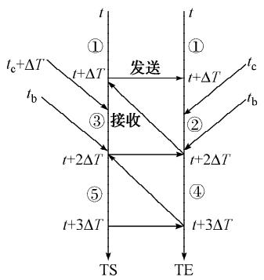  
4C SBjw_‘c(jRl]ltucd   
"#$%C L(1(:’66=/#:(1#’/(/).8/:;2’/#M(1#’/:’/12’+ #/.02#0.)(1(0\:;(/$0601;’)

# % E?{;’IJKlU+6;

V*7(‘KH+fPEM/hi b(KK JOM bej*P<

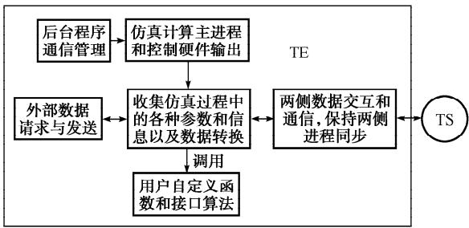  
4F E?{;’IJK   
"#$%F "2(60.12=:1=20’*72’$2(6)0.#$/

]^PE$8H|5‘aCD&’,^qvc O#N *

"#B.(%FT$8Hb()}+f8(‘) }+f [K+f"2vT0(& 2[?|5‘a H}+G +k>OWX   
)#B..Q8jQLh5H:J$tRS K >?E30YHA2O 2[?E3we w][r ]|5‘a’_?wV   
(#OBit’-) &S4b()}+f &W 8(‘)}+f &OPQKjwHTb!b=# C Eck,)2[‘aKY [<OVTb!b=#8 V-LNjQr]|5‘alO?H#H<=

# & *+<L

B.itYHZOOO"$sNCDP[3! Q ?^W$,%A2+H3(cd]^+fPER(H j#G V![itYHZOOO"$sNe}hiT U*xV Vh &W8 &OA%rs&SB.b( )}‘a8(‘)}‘a 8(b9:Ux" J hA*:\t[p\\ JJ9:U^W$"#%

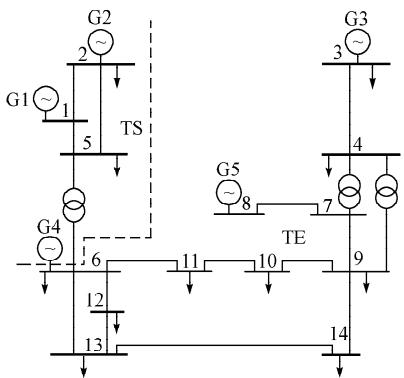  
4H WX&(RWWW!>a;JK   
"#$%H A8.106.12=:1=20’*20-#.0)RWWW!>?<=..8.106

M! m!*nj   
@(<+0! K(2(60102.’*$0/02(1’2.   

<table><tr><td>名称</td><td>类型</td><td>P</td><td>Q</td><td>V</td><td>θ</td></tr><tr><td>G1</td><td>平衡</td><td></td><td></td><td>1.060</td><td>0</td></tr><tr><td>G2</td><td>PV</td><td>0.180</td><td></td><td>1.055</td><td></td></tr><tr><td>G3</td><td>PV</td><td>0.400</td><td></td><td>1.070</td><td></td></tr><tr><td>G4</td><td>PV</td><td>0.400</td><td></td><td>1.030</td><td></td></tr><tr><td>G5</td><td>PV</td><td>0.140</td><td></td><td>1.040</td><td></td></tr></table>

’$|5‘ahb()}‘a)(["#A1 (‘)}‘a)([ $1 0 0 ~ \mu \mathrm { s }$ " CDK#5,189S LA86f<W 6f(d[#5#" - <W!" #5"1 )*"O)c<WRS

"#<W89K[q""Q

V@A*H7p<WRSOB.%(‘‘a8 |5‘a,-H[q$H V L(G V%A*[ B.%b(‘a8|5‘a,-H8(b >)Hv ++e

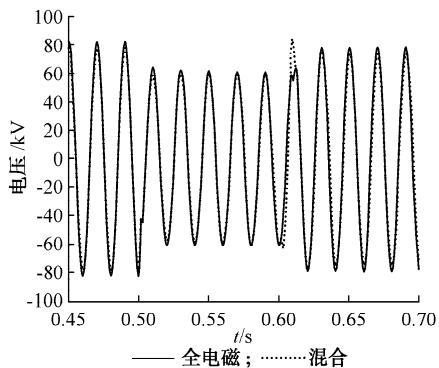  
4J Y^>(Pv!TFG

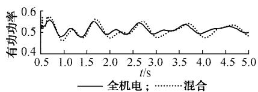  
"#$%J I’67(2#.’/’*7;(.0P-’+1($0’*<=.>   
4Y m!*N4(C445FG   
"#$%Y I’67(2#.’/’*(:1#-07’,02’*$0/02(1’24万方数据

)#<W89K[q$Q

V"#A*[p<WRSOB.%(‘‘a8 |5‘a,-H[q%8"$(sq8 V L(D V""A*[B.%(‘‘a8|5‘a,-H[ q"(H VL(G

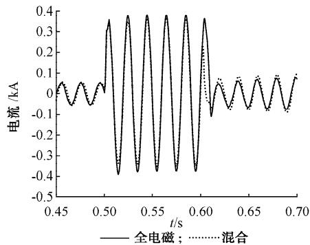  
4!X Y^Yl!>ZX^Q(Pv!+FG

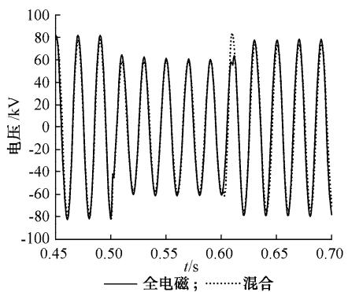  
"#$%!X I’67(2#.’/’*7;(.0P+#/0:=220/1*2’6 <=.Y1’<=.!>   
4!! Y^!9(Pv!TFG   
"#$%!! I’67(2#.’/’*7;(.0P-’+1($0’*<=.!9

0C<‘alqAHEcO+ )c<WRS O B.|5‘a,-H(G(DN{K%:B. (‘)}‘a,-HhKHI,% v++eN{ K%:B.b(‘a,-H95<],% 77K e}hi89Wg]zvjw +1|5‘a,- HhK7j# EFH

# ’ Jp

|5‘a7,c&’&rd(BCD)}a$G82}#GH,R( ]^%!FT$8Hb()}+f8(‘)}+f PE8r_?(BCD|5‘aCD,^ Em5)*?(BCDh$EK,>Hb()}!+8(‘)}!+HLt%& q#f^X?CD‘ahHKY80Y>?+6IQN{NW8[’ON [K%\(8H{qcd:J|o (‘K<N:JH2^%>?KjAU<WabOQ6;TU,V ]^A2+H

6I3(K&’jAUabOHe}2}!+G5 k,)EF

# n q r s

$"% ,H8 P&h Qlq5i@21+~’OH(BCD|5‘ a,3(EF5(BCDdJF2g’- ")##$""*!"# *!$+!! XV6> cBQ:B" IV6> [/^E49;" b]J6> [:FE:9;5V 9:Q ER0HB<1BA82/CB49/2;4HBCEAS4HT4Q:H1R1C:A QBCE1C/CBF3VK F4AT:91/C4H5LH4F::<B9;14SCE:OLWV" )##$" "*!"# * !$+!!   
$)% V6[OKWJ6> X7 XV&WJ66K VK6Jc[-L :C/25V 9:Q ER0HB< /2;4HBCEA S4H/9/2R1B1 4S ]3[- /9< IV-&W 1R1C:A122 LH4F::<B9;14SCE:"%%,Z9C:H9/CB49/2-49S:H:9F:49 O9:H;R’/9/;:A:9C/9<L4Q:H[:2BY:HR* 342)" 64Y)"+)(" "%%, WB9;/T4H:5LB1F/C/Q/R 67 NWV ZOOO "%%, $*)+ $*!5   
$(% WN ]49;CB/9" ‘O3Z6 ‘" -]V6 X5 Z9C:HS/FB9; /9 :2:FCH4A/;9:CBF W3- A4<:2 B9C4 CE: CH/91B:9C 1C/0B2BCR 1BA82/CB4922 LH4F::<B9;14SZ9C:H9/CB49/2-49S:H:9F:49L4Q:H WR1C:A&:FE9424;R* 342(" JFC"(+"!")##)" ‘89AB9;" -EB9/ ‘89AB9;" -EB9/* P899/9WFB:9F:n &:FE9424;RLH:11" )##)* ",*@+",!)   
$$% XV6> M8:;49;" XZcWJ6 L" XJJ[IJK[ [5Z9C:HS/FB9; CH/91B:9C1C/0B2BCRTH4;H/AC4O’&[-TH4;H/A22 LH4F::<B9;1 4SZ9C:H9/CB49/2 -49S:H:9F: 49 L4Q:H WR1C:A &:FE9424;R* 342)" JFC"(+"!" )##)" ‘89AB9;" -EB9/5‘89AB9;" -EB9/* P899/9WFB:9F:n &:FE9424;RLH:11 )##) ")*$+")*%   
$,% o@z Rm S@ %5(BCD|5‘aH6I3(5(BC DF2g )##*(#!""# $$+$@ cZN P49;a89 cZV6> M8 ’Z6 P49; :C /25Z9C:HS/F: /2;4HBCEA B9 T4Q:H1R1C:A :2:FCH4A:FE/9BF/2CH/91B:9C /9< :2:FCH4A/;9:CBFCH/91B:9C ER0HB< 1BA82/CB495 V8C4A/CB49 4S

O2:FCHBFL4Q:HWR1C:A1" )##*" (#!""# * $$+$@   
$*% ,-.5_-(BCD&’5/7 *3’+bc ")##(   
XV6>MBS/95’4<:H9T4Q:H1R1C:A/9/2R1B15.:BaB9;* WFB:9F: LH:11 )##(   
$!% TSH Rm gU %5<OTbH(BCD:Z2}r]‘av>5(BCDF2g )##$)@!"# ),+)!  
b]O6>W/92B" cZV6>M8" WN6 >/9;" :C/25L4Q:H1R1C:A H:/2+CBA:<B;BC/21BA82/C4H0/1:<49L-5V8C4A/CB494SO2:FCHBF L4Q:HWR1C:A1" )##$" )@!"# * ),+)!   
$@% V6[OKWJ6 > X 75]R0HB<1BA82/CB49 4S V-+[- T4Q:H 1R1C:A1 $[%5 -EHB1CFE8HFE 6:Q b:/2/9<* N9BY:H1BCR 4S -/9C:H08HR "%%,   
$%% =+Y5(BCD(‘)}8b()}|5r]‘aHEF $[%5/7 hB(B3’EF, )##$   
PNO -E:9;R/95 WC8<R 4S T4Q:H 1R1C:A :2:FCH4A/;9:CBF CH/91B:9C /9< :2:FCH4A:FE/9BF/2 CH/91B:9C H:/2+CBA: ER0HB< 1BA82/CB49 $ [%5 .:BaB9;* -EB9/ O2:FCHBF L4Q:H K:1:/HFE Z91CBC8C: )##$   
$"#% hUS efg5[%(Be}&’5/7 56&’+bc "%%*5   
b]V6>.4AB9; -]O6WE481895V<Y/9F:<:2:FCHBFT4Q:H 9:CQ4HU/9/2R1B15.:BaB9; &1B9;E8/N9BY:H1BCRLH:11 "%%*

# L0.#$/(/)G0(+#M(1#’/’*K2’$2(6*’2K’,02A8.106W+0:12’60:;(/#:(+ @2(/.#0/1(/)W+0:12’6($/01#:@2(/.#0/1]8<2#)A#6=+(1#’/

LIUYongjun1,LIANG Xu1，MIN Yong1，HUMingliang²

d"eWC/C:‘:Rc/04SL4Q:HWR1C:A1f[:T/HCA:9C4SO2:FCHBF/2O9;B9::HB9;f&1B9;E8/N9BY:H1BCRf.:BaB9;"###@$f-EB9/h d)eZ6+&J&:FE9424;R[:Y:24TA:9C-4cC<f.:BaB9;"###@(f-EB9/h

P<.12(:1SZ9T4Q:H1R1C:A ER0HB<1BA82/CB49fCE: A8C8/2B9S28:9F:0:CQ::9CE::2:FCH4A:FE/9BF/2CH/91B:9CTH4F:11/9< :2:FCH4A/;9:CBFCH/91B:9CTH4F:11F/90:1R9CE:CBF/22RF491B<:H:<e&E:H48CB9:1R1C:AF/90:1BA82/C:<B9CE::2:FCH4A:FE/9BF/2 A4<:QEB2:CE:4CE:H24F/29:CQ4HU4H1T:FB/2F4AT49:9CB9CE::2:FCH4A/;9:CBFA4<:/9<BCTH4YB<:1/9:Q1428CB49C4CE:1C8<R 4SCH/91B:9C1C/0B2BCR/9<<R9/ABFFE/H/FC:HB1CBF4SCE:2/H;:+1F/2:T4Q:H1R1C:Ae./1:<49CE:1:2S+<:Y:24T:<:2:FCH4A:FE/9BF/2 /9<:2:FCH4A/;9:CBFCH/91B:9C1BA82/CB49TH4;H/A1/9<CE:1T:FBSBFB9C:HS/F:/2;4HBCEAfCE:T2/CS4HAS4HT4Q:H1R1C:AER0HB< 1BA82/CB49B1<:1B;9:</9<BAT2:A:9C:<fB9QEBFE/9:Q</C/:GFE/9;:1:i8:9F:A:CE4</9<F4HH:2/CBY:</C/F4AA89BF/CB49/9< 1R9FEH49B^/CB49/2;4HBCEA/H:/214T8CS4HQ/H<eV1BC1148HF:F4<:B1CH/91T/H:9CfF49CH422/02:/9<:GT/9</02:fCE:S2:GB0B2BCR /9<:SSBFB:9FR/H:BATH4Y:<e&E:1BA82/CB49H:182C11E4QCE:S:/1B0B2BCR4SCE:1FE:A:/9<F4HH:FC9:114SCE:B9C:HS/F: /2;4HBCEAe

&EB1Q4HUB118TT4HC:<0R6/CB49/26/C8H/2WFB:9F:I489</CB494S-EB9/d64e,#()(##)h

T08,’2).ST4Q:H1R1C:A1BA82/CB49gER0HB<1BA82/CB49g</C/:GFE/9;:g1R9FEH49B^/CB49F49CH42gTH4;H/A<:1B;9