# Analytical Modeling of the Half-Bridge Leg Using an Associated Discrete Circuit Model

Guolin Lai, Quanming Luo, Member, IEEE, Shufan Dong, Zihong Xie, Ting Luo, Jia Li, and Yangfan Chen, Member, IEEE

Abstract— Gallium nitride high electron mobility transistors (GaN HEMTs) have been considered as potential power semiconductor devices in modern power electronics owing to their high switching speed and low conduction loss, which facilitate efficient and compact solutions in high-frequency applications. However, their fast-switching behavior introduces challenges like voltage/current overshoot and parasitic sensitivity, necessitating accurate modeling for circuit optimization. This paper proposes an associate discrete circuit (ADC) model for half-bridge leg inspired by the fixed-equivalent-admittance methodology in electromagnetic transient (EMT) simulations. Unlike traditional piece-wise linear state-space models that require switching between different equation sets, the proposed ADC-based analytical model utilizes a unified framework to represent all transient sub-modes, thereby reducing modeling complexity and significantly improving computational efficiency. By incorporating layout parasitic parameters and nonlinear junction capacitances, the model accurately characterizes both switching transient and steady-state behaviors across various operating conditions. Simulation and experimental results validate the model's accuracy, speed, and scalability. The proposed modeling method can be extended to various devices and topologies, providing a practical framework for high-frequency power system design.

Index Terms—GaN HEMTs (gallium nitride high electron mobility transistors), associated discrete circuit model, switching analytical model, computational efficiency.

# I. INTRODUCTION

HE Gallium nitride high electron mobility transistors (GaN HEMTs) have become key devices in modern power electronics due to their advantages such as high switching speed, low conduction loss, and high breakdown voltage[1]-[4]. These features enable efficient and compact designs in applications including data center power supplies [5], on-board chargers [6], [7], and PV inverters [8], [9], [10]. However, the very advantages of GaN HEMTs also introduce critical challenges in practical implementations. For instance, the rapid voltage and current transitions (dv/dt and di/dt) during turn-on and turn-off can lead to overshoot, ringing, and crosstalk in bridge configurations, resulting in increased power losses or even device failure [11]-[18]. As GaN devices are increasingly adopted in highfrequency power systems, accurate modeling of their switching behavior has become essential for circuit design and system optimization.

Compared with physical model and behavioral model, analytical model strikes a balance between accuracy and efficiency and are widely adopted in system design [3]. The popular

switching transient analytical model is the piecewise linear model [19], [20], which simplifies the model structure and reduces computational complexity, but the exclusion of nonlinear parameters leads to discrepancies between simulation and experimental results, especially under high-frequency operation, as the switching transients and associated losses are inadequately represented.

As switching frequencies extend into the multi-MHz range, the influence of parasitic parameters becomes non-negligible in GaN-based circuits. To accurately characterize switching behavior under high-frequency operation, an analytical model that comprehensively considers PCB parasitic parameters, nonlinear junction capacitance, and nonlinear transconductance is presented in [3] and [21]. However, the mutual influence between switching devices is ignored. Moreover, [15]-[18] propose analytical models for a GaN-based synchronous BUCK converter to investigate switching behaviors under the influence of deadtime effects and parasitic parameter coupling, as well as the interaction between the upper and lower switch. The switching transients are segmented into distinct modes, with state equations established and solved for each, enabling accurate prediction of transient voltage and current waveforms.

However, in practical applications, traditional state space modeling still faces several major challenges. In state space modeling, a power system is modeled as a set of state space equations

$$
\dot {\mathbf {x}} (t) = \mathbf {A} \mathbf {x} (t) + \mathbf {B} \mathbf {u} (t) \tag {1}
$$

Where x(t) denotes as vector of state variables and u(t) is input variable vector. Matrices A and B depend on the circuit topology and component parameters. Consequently, during switching transitions, the circuit passes through multiple sub-modes, and each mode requires its own A and B matrices. As the number of switches and state variables increases, the derivation and management of these matrices become increasingly complex. Furthermore, when nonlinear parasitic capacitances are considered, device parameters vary with voltage and current, so the entries of A and B must be updated at every simulation timestep. This real-time updating significantly raises the computational burden and slows down the overall simulation.

What’s more, the initial values of state variables, such as inductor currents and capacitor voltages, are difficult to determine. [18] first estimates the initial state variables using an ideal circuit model and then performs periodic iterations by adjusting the duty cycle and initial values until the steady state condition x(0)≈x(T) is satisfied. This approach has several limitations: 1) the iterative process may fail to converge; 2) the duty cycle is

not effectively constrained during the iterations, which can lead to deviations from the actual operating conditions; and 3) the periodic iteration relies on a predefined set of modes and their switching sequence, so under different operating conditions new or unexpected states may arise, causing the iteration to break down.

Different from state space model, in electromagnetic transient (EMT) simulations of power systems, a fixed-equivalentadmittance model, also termed as the associated discrete circuit (ADC) model, is proposed in [22]-[26]. In this framework, components are modeled as a fixed equivalent admittance in parallel with a history current source. This approach avoids matrix reconstruction and significantly accelerates simulation. However, traditional ADC models are primarily optimized for system-level analysis, where switches are simplified as ideal devices, thus overlooking the nanosecond-scale dynamic processes and nonlinearities of power devices. In contrast, the ADC-based analytical model proposed in this paper extends this methodology from system-level simulation to circuit-level switching transient modeling. By incorporating the effective treatment of nonlinear capacitances and mode-switching transitions within the ADC framework, this model is designed to present a comprehensive and accurate process for both switching transition and steady-state without compromising computational efficiency, representing a significant advancement by bridging the gap between high-speed EMT methodology and high-fidelity device modeling. The main contributions of this paper can be summarized as follows:

1) With nonlinear capacitances are modeled as linear capacitances in parallel with current sources, a unified half-bridge ADC framework is developed in which the nodal-admittance matrix remains constant throughout all switching modes.   
2) Within the unified framework, a detailed analysis of the GaN switching process is carried out to identify the submode divisions and transition boundaries, upon which a mode-switching strategy based on history current updates is formulated.   
3) This work establishes a complete half-bridge analytical model that incorporates the dynamic behaviors of GaN devices under zero-voltage switching (ZVS), incomplete zero-voltage switching (inc-ZVS), and hard switching (HS) conduction scenarios. The model enables simulation from zero initial conditions without the need to specify initial state variables.   
4) The proposed model accurately captures both switching transients and steady-state waveforms, offers high computational efficiency for rapid switching-loss evaluation, and provides strong scalability for extension to more complex circuits or control strategies.

In this paper, the ADC models of fundamental components are described in Section II. Then, the complete analytical model of GaN-based half-bridge leg and calculation method is discussed in detail in Section III and Section IV, respectively. In Section V, simulation and experimental results validate the precision of the proposed model. Finally, the study is concluded in Section VI.

In ADC model, basic circuit components, such as inductors and capacitors, are represented with Norton equivalent circuit model, as shown in Fig. 1(a). Each Norton model consists of a fixed equivalent admittance $Y _ { e q }$ and a history current source $I _ { h } ,$ the value of which is determined by the computation results of the last step.

The trapezoidal integration method is employed to discrete components due to its A-stability and second-order accuracy, and the equivalent admittance and the history current source are expressed as follows.

For the inductor

$$
Y _ {L} = \frac {\Delta t}{2 L} \tag {2}
$$

$$
I _ {h} \quad_ {L} (n + 1) = - Y _ {L} V _ {b} (n) - I _ {b} (n)
$$

For the capacitor

$$
Y _ {C} = \frac {2 C}{\Delta t} \tag {3}
$$

$$
I _ {h} \quad C (n + 1) = Y _ {C} V _ {b} (n) + I _ {b} (n)
$$

where $I _ { b } ( n )$ and $V _ { b } ( n )$ are the current and voltage of the inductor or capacitor branch obtained from the last step calculation result. Besides, the resistor is represented by an equivalent admittance and its history current $I _ { h \_ R } { = } 0$ . Therefore, with a fixed time-step $\Delta \mathfrak { t } ,$ the equivalent admittance is constant for a linear component.

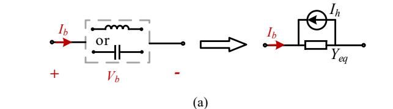  
II. ADC MODEL OF FUNDAMENTAL CIRCUIT COMPO-NENTS

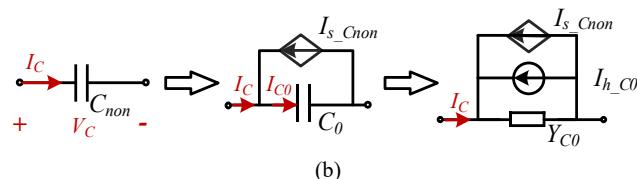  
Fig. 1. Discrete ADC model of basic components. (a) linear components. (b) nonlinear capacitor Cnon.

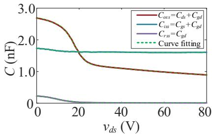  
Fig. 2. Nonlinear characteristic of GaN parasitic capacitances.

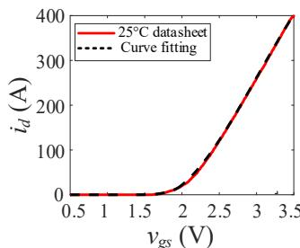  
(a)

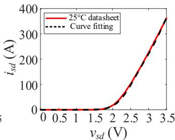  
(b)   
Fig. 3. Transfer characteristics of GaN HEMTs. a) forward conduction. b) reverse conduction.

Modeling nonlinear components presents a challenge in maintaining a constant admittance matrix. As indicated by (3), there exists a directly proportional relationship between the admittance of a capacitor and its capacitance value. To address this, as shown in Fig. 1(b), the nonlinear capacitor $C _ { n o n }$ can be modeled as a fixed linear capacitor $C _ { \boldsymbol { \theta } }$ connected in parallel with a compensation current source $I _ { s \_ C n o n }$ to preserve admittance invariance of the branch. The key to modeling lies in determining the value of $I _ { s \_ C n o n } .$ Based on the law of charge conservation, the current expression of nonlinear capacitor is shown as

$$
I _ {C} = C _ {\text {n o n}} \frac {d V _ {C}}{d t} = C _ {0} \frac {d V _ {C}}{d t} - I _ {s - C \text {n o n}} \tag {4}
$$

Where $C _ { n o n }$ denotes the capacitance value of nonlinear capacitor, which can be obtained from datasheet as depicted in Fig. 2. Discretize (4) using the trapezoidal integration method:

$$
I _ {s \_ C n o n} (n + 1) = 2 \left(C _ {0} - C _ {n o n}\right) \frac {V _ {C} (n + 1) - V _ {C} (n)}{\Delta t} - I _ {s \_ C n o n} (n) \tag {5}
$$

Linear capacitor C0 can also be transferred into a Norton form, based on (3), the expression of corresponding history current source is

$$
I _ {h \_ C 0} (n + 1) = Y _ {C 0} V _ {C} (n) + I _ {C 0} (n) \tag {6}
$$

Where $I _ { C 0 } ( n )$ is the previous-step current of the linear capacitor. Considering that the calculation results include only the branch current $I _ { \cal C } ( n ) , I _ { \cal C 0 } ( n )$ needs to be recalculated. Since

$$
I _ {C} (n) = I _ {C 0} (n) - I _ {s \_ C n o n} (n) \tag {7}
$$

Transfer the item $- I _ { s \_ C n o n } ( n )$ from (5) to (6), the equations can be rewrite as

$$
Y _ {C 0} = \frac {2 C _ {0}}{\Delta t}
$$

$$
I _ {h - C 0} (n + 1) = Y _ {C 0} V _ {C} (n) + I _ {C} (n) \tag {8}
$$

$$
I _ {s \_ C n o n} (n + 1) = 2 \left(C _ {0} - C _ {n o n}\right) \frac {V _ {C} (n + 1) - V _ {C} (n)}{\Delta t}
$$

Consequently, the nonlinearity is fully encapsulated within the updated current source $I _ { s \_ C n o n } ,$ allowing the branch admittance $Y _ { C O }$ to remain strictly constant. The resulting equivalent circuit shows in Fig. 1(b).

With a fixed time-step, the branch maintains constant equivalent admittance, thereby establishing the foundation for a constant admittance matrix.

# III. SWITCHING TRANSIENT AND STEADY-STATE MODEL

# A. Unified ADC Framework of Half-Bridge Leg

Considering PCB parasitic inductors and parasitic capacitances of power devices, the complete equivalent circuit of the GaN HEMTs-based half-bridge leg is illustrated in Fig. 4(a). The upper main switch S and the lower synchronous switch $S _ { b o t }$ operate complementarily, with a dead-time inserted during switching transitions to prevent simultaneous conduction and avoid shoot-through. The power loop inductances including the drain-source inductances $L _ { d }$ and $L _ { d b o t } { \mathrm { . } }$ source inductances $L _ { s }$ and $L _ { s b o t } . L _ { g }$ and $L _ { g b o t }$ represent the drive loop inductances. The stray resistance in the power loop is $R _ { l o o p } , R _ { g }$ and $R _ { g b o t }$ are gate drive resistors.

Based on the modeling method in Section II, all capacitances and inductances in Fig. 4(a) are discretized into Norton equivalents. The switch channel currents are represented by controlled

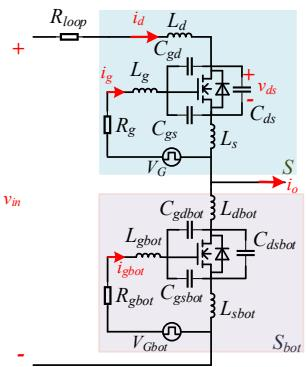

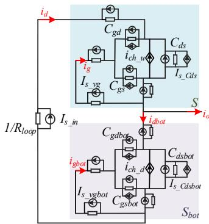  
  
Fig. 4. Model of half-bridge leg. (a) Equivalent circuit of the half-bridge leg. (b) Discrete form of half-bridge leg.

current sources $i _ { c h \_ u } / i _ { c h \_ d } ,$ which is derived from fitting the transfer characteristic curves provided in the datasheet (Fig. 3). Voltage sources in series with resistors are also converted into Norton equivalents, allowing a consistent modeling approach for all elements. Finally, the half-bridge circuit is converted into the unified discrete ADC framework illustrated in Fig. 4(b). Crucially, this unified framework serves as a universal representation for all switching sub-modes detailed in the subsequent analysis, ensuring an invariant circuit topology and a constant admittance matrix throughout the entire simulation process.

With the admittance matrix fixed, the system dynamics are driven solely by the nodal current injections. In the framework, current sources in the Norton equivalent circuit can be classified into two types: one type arises from the nonlinear components $( i _ { c h \_ u } / i _ { c h \_ d } , I _ { s \_ C d s } / I _ { s \_ C d s b o t } , I _ { s \_ C g s } / I _ { s \_ C g s b o t } , I _ { s \_ C g d } / I _ { s \_ C g d b o t } )$ and voltage sources with series resistances $( I _ { s \_ i n } , I _ { s \_ \nu g } , I _ { s \_ \nu g b o t } )$ , referred to as ${ \bf { I } } _ { \bf { S } } ;$ the other type comes from the discretization of capacitances and inductances, referred to as $\mathbf { I _ { h } }$ (history current sources).

For a system with $N _ { b }$ branches and $N _ { n }$ nodes, based on (2) and (3), the vector $\mathbf { I _ { h } }$ of unified framework can be abstracted into a generalized formulation and calculated globally

$$
\mathbf {I} _ {\mathrm {h}} (n + 1) = \boldsymbol {\alpha} \mathbf {Y} _ {\mathrm {b}} \mathbf {M} ^ {T} \mathbf {V} _ {\mathrm {n}} (n) + \boldsymbol {\beta} \mathbf {I} _ {\mathrm {b}} (n) \tag {9}
$$

where M is the $N _ { n } \times N _ { b }$ incidence matrix, $\mathbf { Y _ { b } }$ is the $N _ { b } \times N _ { b }$ diagonal matrix of equivalent branch admittance, Ib is the $N _ { b } \times$ 1 vector of branch current and $\mathbf { V _ { n } }$ is the $N _ { n } \times 1$ vector of nodal voltage. The diagonal elements of α and $\mathfrak { B }$ are defined as follows.

$$
\boldsymbol {\alpha} (i, i) = \left\{ \begin{array}{l} - 1, \text {b r a n c h} i \text {i s a} L \\ 1, \text {b r a n c h} i \text {i s a} C, i <   = N _ {b} \\ 0, \text {o t h e r s} \end{array} \right. \tag {10}
$$

$$
\boldsymbol {\beta} (i, i) = \left\{ \begin{array}{l} - 1, \text {b r a n c h} i \text {i s a} L \\ 1, \text {b r a n c h} i \text {i s a} C, i <   = N _ {b} \\ 0, \text {o t h e r s} \end{array} \right.
$$

On the basis of the unified framework, the approach to submode partitioning and switching is critical to the accuracy and computational efficiency of the complex switching model. In [22]-[24], a L/C-ADC model is proposed to model an ideal switch, where the switch is represented as a small inductor in on-state and a small capacitor in off-state. By configuring equal equivalent admittances for both states, the system matrix

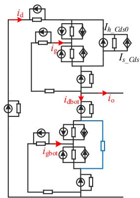

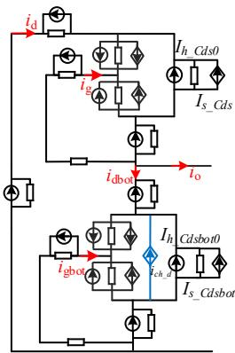

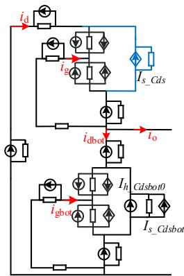  
（c）

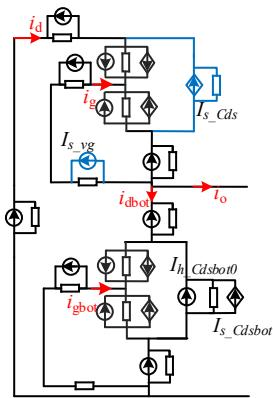

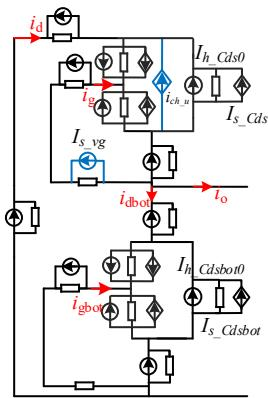  
  
Fig. 5. Transition process of Sbot turn-off and S ZVS turn-on. $\mathbf { \Omega } ( \mathbf { a } ) Z _ { 1 } , S _ { b o t }$ turn-off delay period. $( \mathbf { b } ) Z _ { 2 . 1 } , S _ { b o t }$ turn-off transition period. $\left( \mathbf { c } \right) Z _ { 2 . 2 } , S _ { b o t }$ turn-off transition period. (d) Z3, S turn-on delay period. (e) $Z _ { 4 } ,$ S turn-on transition period.

remains constant, the switching action is realized solely by changing the history current calculation formula between (2) and (3).

Inspired by this principle, this paper extends the concept to the modeling of the entire half-bridge transient process. Based on the unified framework established in Fig. 4(b), the complex transitions between different sub-modes are achieved by selectively updating the specific components of the current source vectors (Ih and Is). This approach ensures that the global admittance matrix remains invariant throughout the switching process, eliminating the need for matrix reconstruction.

Although the following analysis demonstrates the framework using GaN HEMTs, the proposed modeling methodology is inherently device-agnostic at the framework level. The framework can be readily extended to devices with distinct switching characteristics—such as IGBTs (tail currents) or SiC MOSFETs (body diode reverse recovery)—by simply adapting the sub-mode partitioning or source expressions. Taking the process of $S _ { b o t }$ turns off and S turns on as an example, S may operate under three different turn-on conditions depending on the load: zero-voltage switching (ZVS), incomplete ZVS (inc-ZVS) and hard switching (HS). The detailed process is described below.

# B. ZVS Turn-On Process

When output current $i _ { o }$ is negative in the whole turn-on process, the reverse current flowing through switch S completely discharges $C _ { d s } ,$ enabling reverse conduction of S before the gate drive signal arrives, thus achieving ZVS turn-on. The detailed process is analyzed below.

Z1: Sbot Turn-Off Delay Period. This mode starts when $\vec { S _ { b o t } ^ { \mathrm { ~ ~ s ~ } } }$ gate drive is removed, (11) is satisfied, as shown in Fig. 5(a). igbot begins discharging Cissbot, causing $\nu _ { g s b o t }$ to decrease. However, $S _ { b o t }$ remains in forward conduction with current flowing through its on-state resistance, satisfying (12).

$$
I _ {s \_ v g b o t} = 0 \tag {11}
$$

$$
i _ {c h \_ d} = 0, I _ {h \_ C d s b o t} = 0, I _ {s \_ C d s b o t} = 0 \tag {12}
$$

Meanwhile, S maintains its off-state with:

$$
I _ {s \_ v g} = 0, i _ {c h \_ u} = 0 \tag {13}
$$

This mode persists until $\nu _ { g s b o t }$ decreases to the value in (14), indicating $S _ { b o t }$ exits saturation region and enters linear operation, at which point the mode terminates.

$$
v _ {\text {g s b o t}} = V _ {\text {g s t h}} + \frac {i _ {\text {d b o t}}}{\mathbf {g} _ {\text {f s}}} \tag {14}
$$

where $g _ { f s }$ is the nonlinear transconductance of GaN HEMTs fitted from the datasheet and $V _ { g s t h }$ is the forward threshold voltage.

Z2: $S _ { b o t }$ Turn-Off Transition Period. Fig. 5(b) shows the corresponding state. In linear operation, the drain-source channel current of $S _ { b o t }$ flows in the forward direction and is controlled by gate-source voltage $\nu _ { g s b o t } ,$ conforms to:

$$
i _ {c h \_ d} = - g _ {f s} \left(v _ {g s b o t} - V _ {g s t h}\right) \tag {15}
$$

$\ " _ { - } , \ "$ indicates $i _ { c h \_ d }$ is flowing opposite to the defined positive direction. igbot continues discharging Cissbot, forcing $i _ { c h \_ d }$ to decrease rapidly. This persists until $\nu _ { g s b o t }$ drops below the threshold voltage $V _ { g s t h } ,$ at which point the $S _ { b o t }$ completely turns off, resulting in $i _ { c h \ d } = 0$ as illustrated in Fig. 5(c).

Simultaneously, for switch $S ,$ the negative current $i _ { d }$ discharges $C _ { d s } .$ , causing vds to decrease. This continues until the S enters reverse conduction, with current flowing through its equivalent body diode (with no reverse recovery)—represented in the model as an equivalent voltage source $V _ { r o n }$ as shown in Fig. 5(c), we have

$$
I _ {h \_ C d s 0} = 0, I _ {s \_ C d s} = - \frac {V _ {r o n}}{Y _ {C d s 0}} \tag {16}
$$

Until completion of the dead time $t _ { d , }$ the application of the gate drive to S terminates this operational mode, initiating the S turn-on transient process.

Z3: S Turn-On Delay Period. As shown in Fig. $5 ( d ) ,$ the drive voltage is applied to S, fulfill equation (17). io still flows through the equivalent diode of S, thus (16) is still satisfied.

$$
I _ {s \_ v g} = \frac {V _ {G}}{R _ {g}} \tag {17}
$$

Given the reverse conduction of S, GaN HEMT follows the reverse conduction characteristic. This mode ends when $\nu _ { g d }$ rises to the reverse threshold voltage $V _ { g d t h }$ .

$\mathbf { \nabla } _ { Z 4 : }$ S Turn-On Transition Period. S enters linear operation and follows the reverse conduction characteristic, thus (18) is satisfied, as shown in Fig. 5(e).

$$
i _ {c h \_ u} = g _ {r s} \left(v _ {g d b o t} - V _ {g d t h}\right) \tag {18}
$$

$g _ { r s }$ is the reverse transconductance of GaN HEMTs fitted from the datasheet. $i _ { g }$ continuously charges $C _ { i s s } ,$ , driving rapid

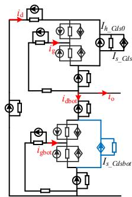

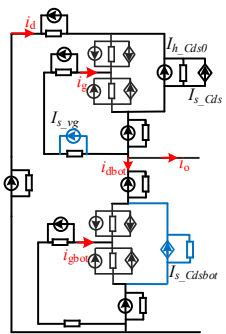

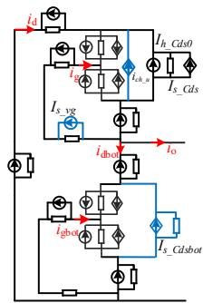  
  
Fig. 6. Partly transition process of $S _ { b o }$ t turn-off and S HS turn-on. (a) H2, Sbot turn-off transition period. (b) $\mathrm { H } _ { 3 } ,$ S turn-on delay period. $\mathrm { ( c ) H _ { 4 } , }$ S turn-on transition period.

increase of ${ \dot { \iota } } _ { c h \underline { { u } } } .$ Simultaneously, the current difference between $i _ { d }$ and $i _ { c h \_ u }$ charges $C _ { d s } ,$ causing $\nu _ { d s }$ to rise.

This mode ends when $\nu _ { d s }$ reaches zero, S turns on completely.

# C. HS Turn-On Process

When output current $i _ { o }$ is positive during dead time interval, with no discharge path for $C _ { d s } ,$ leading to hard-switching turnon for S. The output current requires freewheeling through $S _ { b o t }$ , causing Cdsbot to discharge until reverse conduction is achieved. The detailed sequence is as follows.

$H _ { I } \colon S _ { b o t }$ Turn-Off Delay Period. The equivalent circuit is the same as Fig. 5(a), but the critical difference lies in the reverse direction of current of $S _ { b o t } ,$ hence $S _ { b o t }$ follows reverse conduction characteristic, this mode ends when achieve (19).

$$
v _ {g d b o t} = V _ {g d t h} + \frac {i _ {d b o t}}{g _ {r s}} \tag {19}
$$

H2: $S _ { b o t }$ Turn-Off Transition Period. Fig. 5(b) shows the equivalent circuit, similarly, the channel current of $S _ { b o t }$ flows in the reverse direction and is controlled by gate-drain voltage $\nu _ { g d b o t } ,$ confirms to:

$$
i _ {c h \_ d} = g _ {r s} \left(v _ {g d b o t} - V _ {g d t h}\right) \tag {20}
$$

Meanwhile, the current difference between $i _ { d b o t }$ and $i _ { c h \_ d }$ begins to discharge $C _ { d s b o t } { , }$ causing $\nu _ { d s b o t }$ to decrease until reaching $- V _ { r o n } ,$ at which point reverse conduction is established through equivalent body diode, as shown in Fig. 6(a), represented by

$$
I _ {h \_ C d s b o t 0} = 0, I _ {s \_ C d s b o t} = - \frac {V _ {r o n}}{Y _ {C d s b o t 0}} \tag {21}
$$

The application of the gate drive to S terminates this operational mode.

H3: S Turn-On Delay Period. The drive voltage is applied to S, fulfill equation (17). S remains in cut-off region as performed in Fig. 6(b).

At the same time, for $S _ { b o t } , i _ { o }$ still flows through the equivalent diode, (21) is still satisfied until $i _ { d b o t } { = } 0 .$ , which indicates the output current transfers from $S _ { b o t }$ to S completely and $S _ { b o t }$ is fully turns off.

Given that $i _ { o }$ is still positive, this mode ends when $\nu _ { g s }$ rises to the threshold voltage $V _ { g s t h }$ .

H4: S Turn-On Transition Period. In Fig. 6(c), channel current of S is controlled by $\nu _ { g s } ,$ expressed as:

$$
i _ {c h \_ u} = - g _ {f s} \left(v _ {g s} - V _ {g s t h}\right) \tag {22}
$$

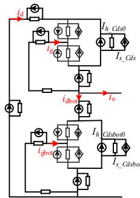

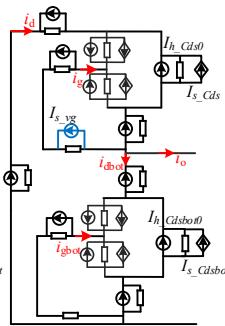  
(b)

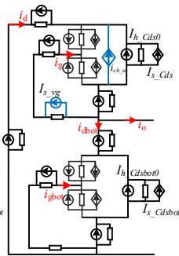  
  
Fig. 7. Partly transition process of Sbot turn-off and S inc-ZVS turn-on. (a) H2, $S _ { b o t }$ t turn-off transition period. (b) H3, S turn-on delay period. (c) H4, S turn-on transition period.

The current difference between $i _ { d }$ and $i _ { c h \_ u }$ discharges $C _ { d s } .$ , causing vds to decrease. When vds reaches zero, S turns on completely and this mode terminates.

# D. Inc-ZVS Turn-On Process

If $i _ { o }$ is negative at the beginning, it causes $\nu _ { d s }$ to discharge. However, when the dead time is insufficient, or when $i _ { o }$ increases and changes direction during the dead time interval, $C _ { d s }$ begins to charge instead. Both conditions prevent $C _ { d s }$ from fully discharging to − ${ \cdot } V _ { r o n }$ within the dead time, and as a result, S achieves inc-ZVS.

Inc1: $S _ { b o t }$ Turn-Off Delay Period. Same as mode $Z _ { 1 }$ and Fig. 5(a).

Inc2: Sbot Turn-Off Transition Period. The equivalent circuit can be seen in Fig. 5(b). If io<0, ich_d is positive and satisfies (15) until $\nu _ { g s b o t } = V _ { g s t h } .$ , otherwise, $i _ { c h \_ d }$ is expresses as (20) until vgdbot $= V _ { g d t h } .$ , equivalent circuit of the end can be seen in Fig. 7(a).

Inc3: S Turn-On Delay Period. As shown in Fig. 7(b), current flows through capacitance, the value of history current and equal current source have no need to change, following (9) and (8) respectively.

Inc4: S Turn-On Transition Period. As shown in Fig. 7(c), $i _ { o } { > } 0 .$ , ich_u is controlled by $\nu _ { g s } ,$ following (22). When vds reaches zero, S turns on completely and enters S turn-on steady-state period.

# E. S Turn-On Switching Steady-State Process

As seen in Fig. 8, when $\nu _ { d s }$ reaches to zero, S turns on completely and current flows through the on-state resistance, thus

$$
I _ {h \_ C d s 0} = 0, I _ {s \_ C d s} = 0 \tag {23}
$$

This mode ends when the gate drive signal for S is removed.

The switching transient and steady-state processes of $S _ { b o t }$ turn-off and S turn-on are illustrated in the flowchart Fig. 9. The process of S turn-off and $S _ { b o t }$ turn-on is symmetrical to the above and will not be repeated.

During the switching transient, current flows through the parasitic capacitance $( C _ { d s } / C _ { d s b o t } )$ , whereas during the steady-state on-condition, it flows through the on-resistance $( R _ { o n } / R _ { o n \_ b o t } )$ . In order to maintain a constant circuit admittance matrix throughout the simulation, the admittance of the two components should be the same

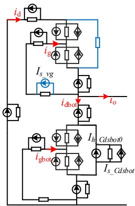  
Fig. 8. S turn-on steady state.

$$
Y _ {C d s 0} = \frac {2 C _ {d s 0}}{\Delta t} = Y _ {o n} \tag {24}
$$

$$
Y _ {C d s b o t 0} = \frac {2 C _ {d s b o t 0}}{\Delta t} = Y _ {o n \_ b o t}
$$

Given that the equivalent admittance of the parasitic capacitance $Y _ { C d s 0 } / Y _ { C d s b o t 0 }$ and the admittance of the on-resistance $Y _ { o n } / Y _ { o n \_ b o t }$ are of the same millisiemens (mS) magnitude, equation (24) can be satisfied through designing the value of $C _ { d s 0 } / C _ { d s b o t 0 }$ and $\Delta t .$ .

On the other hand, to further enhance simulation efficiency, the steady-state behavior—characterized by a much longer time scale compared to the switching transients—can be modeled separately using an increased timestep.

# IV. CALCULATION METHOD OF THE DISCRETE MODEL

In ADC model, the circuit state is primarily characterized by nodal voltages and branch currents, the nodal equations can be formulated as follows.

$$
\mathbf {Y} _ {\mathrm {n}} \mathbf {V} _ {\mathrm {n}} (n) = \mathbf {I} _ {\mathrm {n}} (n) \tag {25}
$$

where $\mathbf { I _ { n } }$ is the $N _ { n } \times 1$ nodal injection current vector, which includes history current source Ih and equivalent current source $\mathbf { I } _ { \mathbf { S } } \mathbf { : }$

$$
\mathbf {I} _ {\mathrm {n}} (n) = \mathbf {M} \left(\mathbf {I} _ {\mathrm {h}} (n) + \mathbf {I} _ {\mathrm {s}} (n)\right) \tag {26}
$$

If the positive direction of the branch current is set to be opposite to $I _ { h } ,$ branch currents can be expressed as

$$
\mathbf {I} _ {\mathrm {b}} (n) = \mathbf {Y} _ {\mathrm {b}} \mathbf {V} _ {\mathrm {b}} (n) - \mathbf {I} _ {\mathrm {h}} (n) - \mathbf {I} _ {\mathrm {s}} (n) \tag {27}
$$

where

$$
\mathbf {V} _ {\mathrm {b}} (n) = \mathbf {M} ^ {\mathrm {T}} \mathbf {V} _ {\mathrm {n}} (n) \tag {28}
$$

The nodal voltage and branch current expression can be derived by solving the coupled equations (9), (25) - (28) as:

$$
\begin{array}{l} \mathbf {V} _ {\mathrm {n}} (n + 1) = \mathbf {Y} _ {\mathrm {n}} ^ {- 1} \mathbf {M} \left(\mathbf {I} _ {\mathrm {h}} (n + 1) + \mathbf {I} _ {\mathrm {s}} (n + 1)\right) \\ = \mathbf {K} _ {1} \left(\mathbf {I} _ {\mathrm {h}} (n + 1) + \mathbf {I} _ {\mathrm {s}} (n + 1)\right) (29) \\ \mathbf {I} _ {\mathrm {b}} (n + 1) = \left(\mathbf {Y} _ {\mathrm {b}} \mathbf {M} ^ {\mathrm {T}} \mathbf {Y} _ {\mathrm {n}} ^ {- 1} \mathbf {M} - \mathbf {I}\right) \left(\mathbf {I} _ {\mathrm {h}} (n + 1) + \mathbf {I} _ {\mathrm {s}} (n + 1)\right) (29) \\ = \mathbf {K} _ {2} \left(\mathbf {I} _ {\mathrm {h}} (n + 1) + \mathbf {I} _ {\mathrm {s}} (n + 1)\right) \\ \end{array}
$$

where

$$
\mathbf {K} _ {1} = \mathbf {Y} _ {\mathrm {n}} ^ {- 1} \mathbf {M} \tag {30}
$$

$$
\mathbf {K} _ {2} = \mathbf {Y} _ {\mathrm {b}} \mathbf {M} ^ {\mathrm {T}} \mathbf {Y} _ {\mathrm {n}} ^ {- 1} \mathbf {M} - \mathbf {I}
$$

I is a $N _ { b } \ \times \ N _ { b }$ identity matrix, $\mathbf { K } _ { 1 }$ is a $N _ { n } \times N _ { b }$ constant matrix and K2 is a $N _ { b } \times N _ { b }$ constant matrix.

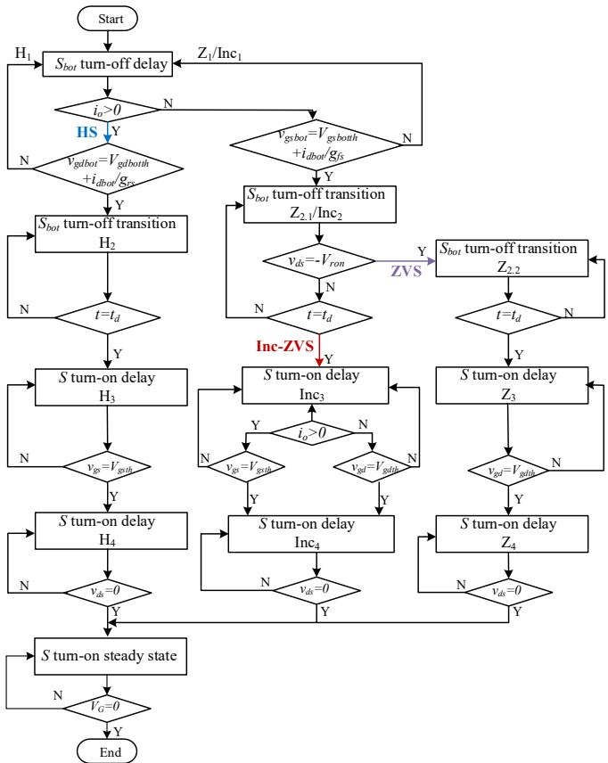  
Fig. 9. The transient process flowchart of $S _ { b o t }$ turn-off and S turn-on.

$\mathbf { K } _ { 1 }$ and ${ \bf K } _ { 2 }$ depend solely on the admittance and topology, which remains invariant during simulation, allowing K1, K2 to be precomputed and stored to accelerate solving. What’s more, since most of the matrices involved in the model are sparse, their sparsity can be effectively utilized to minimize memory consumption and alleviate computational complexity.

The step-by-step modeling and numerical implementation workflow of the half-bridge leg is illustrated in Fig. 10.

Step 1: Modeling and Offline Pre-processing. The model is discretized into Norton equivalent representation in Fig. 4(b) to extract key matrixes like $\mathrm { Y } _ { \mathrm { b } } , \mathrm { Y } _ { \mathrm { n } } , \mathrm { M } ,$ , α and $\beta .$ . Subsequently, the system characteristic matrices $\mathrm { K } _ { 1 }$ 1 and $\mathrm { K } _ { 2 }$ are calculated according to (30) and stored.   
Step 2: Source Updating. Subsequently, $\mathrm { I _ { h } }$ and $\mathrm { I _ { s } }$ can be determined from the nodal voltages and branch currents of last step, according to equation (9) and (8).   
Step 3: Model-based Modification. Based on the sub-modes and the corresponding mode boundary conditions explained in Section III, $\mathrm { I _ { h } }$ and $\mathrm { I _ { s } }$ are modified to reflect the correct physical behavior.   
Step 4: Algebraic Solution and Time Stepping. New nodal voltages and branch currents are then computed with (29). The simulation time is then incremented, and the procedure loops back to Step 2 until the total simulation time $t \_ e n d$ is reached.

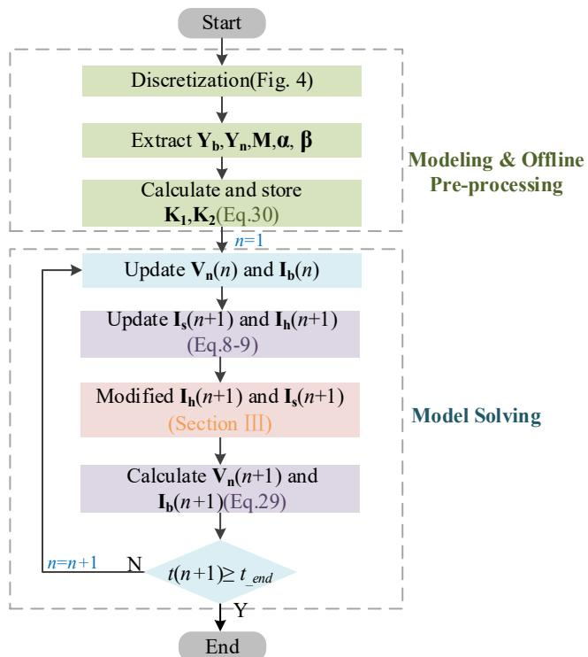  
Fig. 10. The modeling and solving procedure for half-bridge circuit.

# V. MODEL VERIFICATION

# A. Validation of Nonlinear Capacitance Model

From (8), the history current value of the linear part can be directly obtained from the results of the previous calculation step. However, the formula for the compensating current source contains the unknown term $\nu _ { C } ( n { + } 1 )$ , which introduces an additional predictive iteration algorithm and increases the computational burden. Considering that the simulation step size is small enough to accurately capture the waveform of the switching transient process, and the voltage of nonlinear capacitance changes slowly, equation in (8) can be approximated as

$$
I _ {s - C n o n} (n + 1) = 2 \left(C _ {0} - C _ {n o n}\right) * \frac {v _ {C} (n) - v _ {C} (n - 1)}{\Delta t} \tag {31}
$$

The circuit of steady state in Fig. 8 is used to testify the accuracy of proposed nonlinear capacitance model and the parameters of the main circuit components and parasitic inductances are as shown in TABLE I and TABLE II, respectively.

Fig. 11 shows the simulated vds/vdsbot, vgd/vgdbot, and vgs/vgsbot waveforms. The blue dashed trace corresponds to the direct nonlinear parasitic-capacitance model, in which both the capacitance value and system admittance matrix are updated at every time-step to serve as an accuracy benchmark. The red trace corresponds to the proposed ADC model with Δt=1e-10 s, which exhibits identical phase and amplitude to the benchmark, verifying the model's accuracy. However, as time-step increases to 1e-9 (yellow line) and 3e-9 (purple line), the simulation results begin to deviate from the benchmark. This discrepancy arises because the compensation current in the equivalent model is computed using the dv/dt from the previous timestep. Given the ultra-small parasitic capacitances and high-frequency nature of GaN devices, the voltage transitions are too rapid for this linear prediction to track accurately at larger time-steps. Consequently,

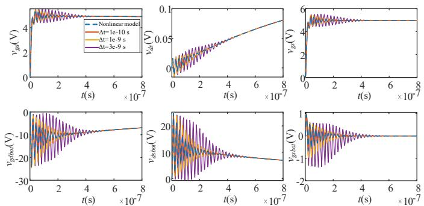  
Fig. 11. Simulation comparison between the exact nonlinear model and the proposed ADC model under different time-steps.

a sufficiently small time-step (approximately 0.1 ns) is requisite to match the transient timescale, ensuring the model's high fidelity without the need for iterative matrix updates.

# B. Simulation Verification

Aiming to fully verify the accuracy and feasibility of the model, a GaN HEMT synchronous BUCK converter model is built on the basis of half-bridge leg, and the model calculation results are compared with LTspice simulation results in both zero-state startup transients and steady-state operation. Circuit parameters are the same as TABLE Ⅰ and TABLE II.

Fig. 12 compares the key transient waveforms from the proposed model with those of the simulation. During system startup, the model accurately reproduces the transient behaviors of critical parameters. For example, the output-inductor current in Fig. 12 (a) and the switch current in Fig. 12 (c) exhibit nearly identical di/dt slopes and peak values during both turn-on and turn-off, demonstrating the model’s capability to predict transient energy transfer. Furthermore, Fig. 12(b) and Fig. 12(d) show that the model precisely captures the rapid voltage oscillations and damping characteristics, with timing deviations of

TABLE I KEY CIRCUIT PARAMETERS   

<table><tr><td>Parameters</td><td>Values</td></tr><tr><td>Input voltageVin</td><td>12 V</td></tr><tr><td>Output voltageVo</td><td>3.3 V</td></tr><tr><td>Output current Io</td><td>1A/5A/10A</td></tr><tr><td>Switching frequency fs</td><td>1 MHz</td></tr><tr><td>Gate drive resistor Rg/Rgbot</td><td>5.4 Ω</td></tr><tr><td>Output inductor L</td><td>150 nH</td></tr><tr><td>Output capacitor C</td><td>40 μF</td></tr><tr><td>Deadtime td</td><td>40 ns</td></tr></table>

TABLE II PARASITIC PARAMETERS   

<table><tr><td>Parameters</td><td>Values</td></tr><tr><td>Drain inductance of SLd</td><td>3.63 nH</td></tr><tr><td>Source inductance of S Ls</td><td>0.61 nH</td></tr><tr><td>Drain-loop inductance of SLg</td><td>4.29 nH</td></tr><tr><td>Drain inductance of SbotLdbot</td><td>0.81 nH</td></tr><tr><td>Source inductance of SbotLsbot</td><td>0.20 nH</td></tr><tr><td>Drain-loop inductance of SbotLgbot</td><td>3.52 nH</td></tr><tr><td>Drain-source capacitance Cdst0/Cdsbot0</td><td>2500 pF</td></tr><tr><td>Gate-source capacitance Cgs0/Cgsbot0</td><td>150 pF</td></tr><tr><td>Gate-drain capacitance Cgd0/Cgdbot0</td><td>1600 pF</td></tr></table>

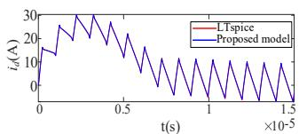

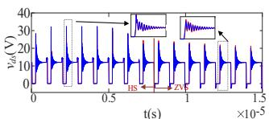

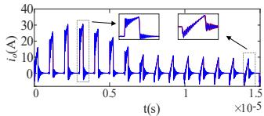

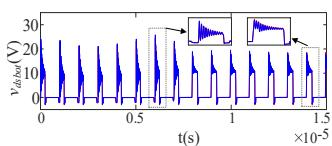  
  
Fig. 12. Comparation of key transient waveforms between model and simulation with a load resistance of 3.3 . (a) output current (io). (b) drain-source voltage of S $( \nu _ { d s } )$ . (c) current of S (id). (d) drain-source voltage of $\cdot S _ { b o t } \left( \nu _ { d s b o t } \right)$ .

less than 1% of the switching period and peak-value errors under 6 %. More importantly, during the eighth switching period the inductor current iL falls below zero, and the switch S transitions from HS to ZVS. This behavior is fully consistent with the theoretical analysis presented earlier and confirms that the proposed model can accurately capture the operating conditions and perform the corresponding mode transition.

The model's performance is further verified under steadystate conditions, as shown in Fig. 13 Comparisons with LTspice simulations at output currents of $1 \mathrm { A } , 5 \mathrm { A } ,$ and 10A, which correspond to $Z \mathrm { V } \mathrm { S } ,$ inc-ZVS, and HS operation condition, demonstrate consistent agreement in amplitude, phase, and transient characteristics across all load conditions. These results confirm the model's accuracy in replicating converter dynamics under various operating points and its capability to predict both transient and steady-state behaviors with high fidelity.

# C. Comparison of the ADC Model and the State-Space Model

A comparative analysis is conducted between the ADC model and the conventional state-space model from three aspects, as summarized in TABLE IV.

From a modeling perspective, state-space modeling typically establishes a steady-state model and solves it through steadystate iteration. However, similar to Fig. 12, even if the final steady state of S is ZVS, inc-ZVS or HS conditions may still occur during the iteration process. But establishing a complete state-space model for the half-bridge leg is extremely challenging. Take synchronous BUCK converter as an example, to accurately characterize the ZVS turn-on of the $S _ { b o t }$ and the multimode operation (ZVS/inc-ZVS/HS) of the S, it is necessary to establish more than 25 sub-modal six-order state equations[15],[16],[18], while extracting and storing the corresponding system matrices （A and B） for each mode. In contrast, the proposed ADC model utilizes a unified framework that enables zero-state startup simulation. Consequently, only a single modeling procedure is required to compute and store the matrices $\mathbf { K } _ { 1 } , \mathbf { K } _ { 2 } , \mathbf { \mu } ( \mathbf { \beta } ;$ , sparse matrix), M and $\mathbf { Y _ { b } }$ (diagonal matrix).

From the perspective of scalability and modularity, the ADC framework inherently supports component-level autonomy, enabling a half-bridge to be encapsulated as a standardized computational module. Since mode-specific rule sets govern the history current behaviors of S and $S _ { b o t }$ locally and independently, the interaction of rules enables natural mode selection and transition. Circuit topology is therefore decoupled from device dynamics and handled exclusively through nodal connectivity.

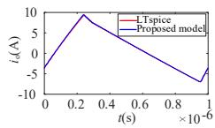

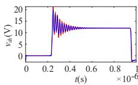

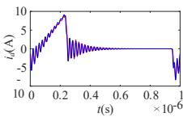

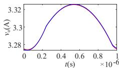

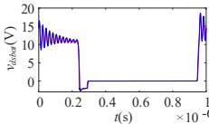

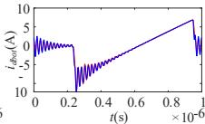

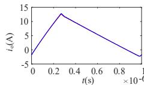

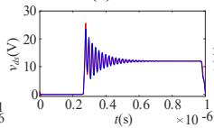

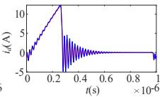

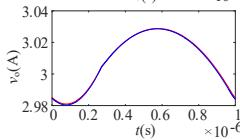

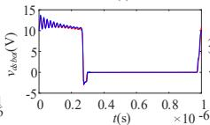

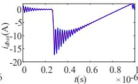

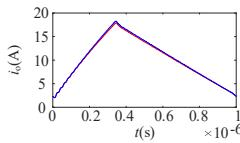

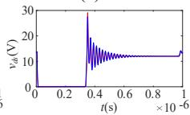

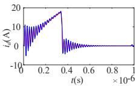

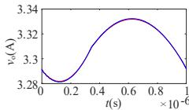

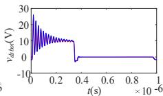

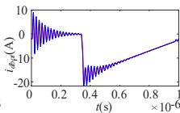  
  
Fig. 13. Comparation of key steady waveforms between model and simulation at an output current of (a) 1A. (b) 5A. (c) 10A.

This modular independence permits the direct interconnection of multiple units to synthesize complex topologies (e.g., Full-Bridge or Multi-Phase inverters). When integrated with domain decomposition methods like Diakoptics[27], these modules can be solved in parallel, ensuring linear scalability. In contrast, State-space-based transient models embed circuit topology and switching logic directly into the system equations through predefined state variables. As circuit complexity increases, substantial re-derivation of mode-dependent state equations becomes unavoidable, leading to rapidly growing modeling and maintenance complexity.

From the perspective of computational complexity and tool compatibility, the proposed ADC model fundamentally differs from traditional approaches. State-space models typically require solving high-order differential equations using numerical integrators (e.g., MATLAB's ode45 or ode15s). This process is computationally expensive because the strong nonlinearity of parasitic capacitances forces the solver to recompute system matrices (A, B) and update the Jacobian matrix at every timestep. The ADC model, conversely, converts these differential equations into algebraic forms in advance. By decoupling nonlinearities into current sources, the system admittance matrix becomes constant. Consequently, the simulation at each time step is reduced to solving a linear algebraic system via basic matrix operations, effectively eliminating the need for internal iterations and matrix reconstruction. Furthermore, the purely algebraic nature of the ADC model ensures platform

TABLE III COMPARISON OF THE AVERAGE COMPUTATION TIME   

<table><tr><td>Number</td><td>Ode45/s</td><td>Ode15s/s</td><td>Fixed step/s</td><td>Hybrid step/s</td><td>LTspice/s</td></tr><tr><td>1</td><td>11.83</td><td>6.51</td><td>0.28</td><td>0.14</td><td>0.59</td></tr><tr><td>2</td><td>20.99</td><td>8.14</td><td>0.28</td><td>0.13</td><td>0.54</td></tr><tr><td>3</td><td>12.34</td><td>7.50</td><td>0.29</td><td>0.14</td><td>0.56</td></tr><tr><td>4</td><td>14.19</td><td>8.25</td><td>0.28</td><td>0.13</td><td>0.61</td></tr><tr><td>5</td><td>10.66</td><td>6.67</td><td>0.29</td><td>0.15</td><td>0.57</td></tr><tr><td>6</td><td>11.24</td><td>7.27</td><td>0.29</td><td>0.14</td><td>0.58</td></tr><tr><td>7</td><td>13.00</td><td>6.22</td><td>0.28</td><td>0.15</td><td>0.55</td></tr><tr><td>8</td><td>15.48</td><td>8.55</td><td>0.28</td><td>0.13</td><td>0.58</td></tr><tr><td>9</td><td>13.37</td><td>7.55</td><td>0.29</td><td>0.15</td><td>0.55</td></tr><tr><td>10</td><td>15.15</td><td>9.44</td><td>0.29</td><td>0.14</td><td>0.53</td></tr><tr><td>Average</td><td>13.82</td><td>7.61</td><td>0.28</td><td>0.14</td><td>0.57</td></tr></table>

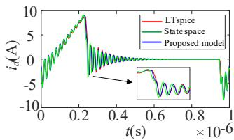

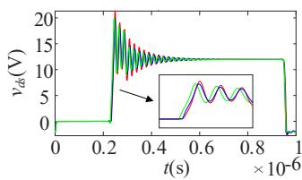

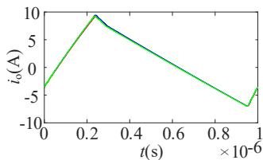

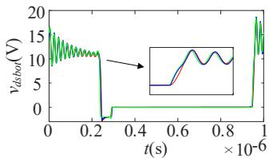  
Fig. 14. Comparation of key steady waveforms between LTspice, state space mode and the proposed model.

independence, allowing for potential implementation in universal EDA tools using standard languages like Python, Verilog-A, or C++.

To quantitatively evaluate the computational efficiency, a comparative study was conducted under strictly consistent conditions. TABLE III compares the average computation time per switching cycle across 10 sets of randomly generated circuit parameters. All simulations were executed on an identical workstation equipped with an Intel i7-12700H CPU and 16 GB RAM running MATLAB R2024b, with LTspice included as a crossplatform reference. The traditional state space model and the corresponding modal iteration process are established following [18]. To address the potential numerical stiffness inherent in the high-order system, standard MATLAB built-in ODE solvers were employed, including ode45 (as a representative non-stiff solver) and ode15s (specifically designed for stiff systems), both of which utilize error-controlled adaptive stepping. Conversely, the proposed model employs a predefined fixed time-step. A sufficiently small fixed time step of 0.04 ns was adopted to ensure that the switching transient resolution is comparable to that achieved by the state-space solvers, as evidenced by the waveform agreement shown in Fig. 14.

The results presented in TABLE III demonstrate that while maintaining simulation accuracy, the proposed model offers significant computational speed advantages: it is twice as fast as LTspice, 50 times faster than the state-space model based on ode45, and 27 times faster than the state-space model using ode15s. Additionally, owing to the clear time-scale separation between fast switching transients and slower switching steadystate intervals, the adoption of the hybrid step-size strategy

TABLE IV COMPARISON OF STATE-SPACE MODEL AND PROPOSED ADC MODEL   

<table><tr><td colspan="2"></td><td>[15]</td><td>[16]</td><td>[18]</td><td>Proposed ADC model</td></tr><tr><td rowspan="2" colspan="2">Model Feature</td><td>HS</td><td>ZVS</td><td>HS, ZVS and inc-ZVS</td><td>HS, ZVS and inc-ZVS</td></tr><tr><td colspan="3">Steady-state iteration</td><td>Zero-state transient</td></tr><tr><td colspan="2">Modeling</td><td colspan="3">Multi-mode topology (&gt;25 sub-modes)</td><td>Unified framework</td></tr><tr><td colspan="2">Scalability and modularity</td><td colspan="3">Low</td><td>High</td></tr><tr><td rowspan="2">Computational complexity</td><td>System Matrix</td><td colspan="3">Time-variant</td><td>Constant</td></tr><tr><td>Solving Algo-rithm</td><td colspan="3">ODE solvers</td><td>Non-itera-tive linear algebra</td></tr></table>

(0.04ns for switching transients and 0.2ns for switching steadystate) can nearly double the computational speed.

# D. Experiment Validation

An experimental prototype is built as shown in Fig. 15. The power device used in the experiment is EPC2021, and the driver chip is LM5113. The experimental waveforms were recorded using a Tektronix oscilloscope with 1 GHz bandwidth. To ensure accurate capture of the high-speed GaN switching transients, the drain-source voltage was measured using Tektronix P5050 passive probes (500 MHz bandwidth). Crucially, the channel current was measured using a high-bandwidth Coaxial Shunt (SSDN-10). This shunt features a resistance of 0.1 Ω, a parasitic inductance of less than 2 nH, and a bandwidth of 2000 MHz, ensuring that the steep di/dt and high-frequency oscillations are accurately captured.

The parasitic inductances of the PCB power and drive loops were extracted using Ansys Maxwell Q3D simulation. Due to the Chip-Scale Package (CSP) structure of the EPC2021, the package inductance is considered negligible. The linear capacitance value was determined by calculating the average capacitance across the operating voltage range. The detailed extracted parameters are listed in TABLE II.

Fig. 16 presents a comparison of model and experimental waveforms under steady-state load currents of 1 A, 5 A, and 10 A. It can be seen that the steady-state waveforms of the model and experiments match very well under various loads. Using the scenario of a 1A load as a case study, as shown in TABLE V, the average oscillation frequencies over the first three cycles for the model and experimental results are 44.56 MHz and 44.94 MHz, respectively. With peak error less than 6.7%, the rising/falling rates of the predicted drain-source voltage vds/vdsbot and the rising rate of the drain current id are consistent with the experimental results.

The observed discrepancies in oscillation peak values can be attributed to multiple factors. First, the model is constructed based on data provided in the datasheet, which are measured under specific operating and temperature conditions that differ from those in the actual experiment. Also, the junction temperature variation under different load currents is not considered. Second, the approximations introduced by device aging and the compensation current sources in the equivalent modeling of nonlinear capacitances also introduce error.

Fig. 17 shows the power waveforms of the main switch S within one switching cycle obtained from the experiment and

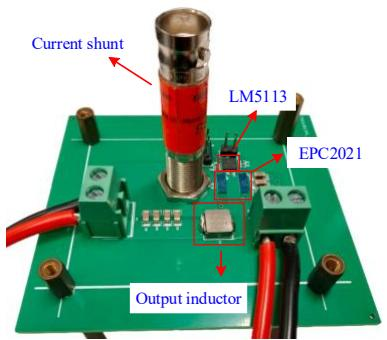  
Fig. 15. Physical prototype of BUCK converter.

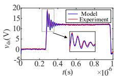

  
Fig. 16. Comparison of key waveforms between model and experiment at an output current of (a) 1A. (b) 5A. (c) 10A.

  
Fig. 17. Power of switch S at an output current of 1A, 5A and 10A.

TABLE V PARAMETERS FOR MODEL AND EXPERIMENTAL RESULTS (1A)   

<table><tr><td>Parameters</td><td>Model</td><td>Experiment</td><td>Error</td></tr><tr><td>Oscillation frequency</td><td>44.56 MHz</td><td>44.94MHz</td><td>0.8%</td></tr><tr><td>Peak value of vds</td><td>18.54 V</td><td>19.20 V</td><td>3.4%</td></tr><tr><td>Peak value of vdsbot</td><td>17.36 V</td><td>18.61 V</td><td>6.7%</td></tr><tr><td>Peak value of id</td><td>8.26 A</td><td>8.20 A</td><td>0.7%</td></tr><tr><td>Raise time of vds</td><td>19.62 ns</td><td>20.36 ns</td><td>3.6%</td></tr><tr><td>Fall time of vds</td><td>18.76 ns</td><td>19.24 ns</td><td>2.5%</td></tr><tr><td>Raise time of vdsbot</td><td>20.40 ns</td><td>20.64 ns</td><td>1.2%</td></tr><tr><td>Fall time of vdsbot</td><td>20.87 ns</td><td>22.04 ns</td><td>5.3%</td></tr></table>

the proposed model. The power is simply obtained through the multiplication of the drain current id and the drain–source voltage vds. By integrating the waveform data, the energy losses of S under different conditions can be obtained and it can be found that the proposed model enables fast and accurate estimation of switching losses. Furthermore, the proposed model also allows for the construction of the detailed, mode by mode switching loss model. This facilitates analysis of the distribution of switching losses across different sub-intervals, thereby

providing critical insights for further improving circuit efficiency and power density.

# VI. CONCLUSION

In this paper, a novel modeling approach is proposed to build a complete analytical model of a half bridge leg. By retaining the constant admittance matrix property of the ADC model, the proposed model achieves accurately prediction of both switching transient and steady-state behaviors in power electronic circuits, while simultaneously reducing modeling complexity and improving model scalability. Compared to traditional statespace models, the proposed method offers lower modeling complexity, higher computational efficiency, and better adaptability. Future work will explore modular extensions for automated modeling of complex topologies and integration with real-time simulation platforms for hardware-in-the-loop applications.

# REFERENCES

[1] D. Han and B. Sarlioglu, “Deadtime effect on GaN-based synchronous boost converter and analytical model for optimal deadtime selection,” IEEE Trans. Power Electron., vol. 31, no. 1, pp. 601–612, Jan. 2016.   
[2] J. L. Afonso, M. Tanta, and J. G. Oliveira, “A Review on Power Electronics Technologies for Power Quality Improvement,” Energies, vol. 14, no. 24, pp. 8585, Dec. 2021.   
[3] D. Yan, L. Hang, and Y. He, “An Accurate Switching Transient Analytical Model for GaN HEMT under the Influence of Nonlinear Parameters,” Energies, vol. 15, no. 8, pp. 2966, Apr. 2022.   
[4] E. A. Jones, F. F. Wang, and D. Costinett, “Review of commercial GaN power devices and GaN-based converter design challenges,” IEEE J. Emerg. Sel. Top. Power Electron., vol. 4, no. 3, pp. 707–719, Sep. 2016.   
[5] C. Fei, R. Gadelrab, Q. Li and F. C. Lee, "High-Frequency Three-Phase Interleaved LLC Resonant Converter with GaN Devices and Integrated Planar Magnetics," IEEE Journal of Emerging and Selected Topics in Power Electronics, vol. 7, no. 2, pp. 653-663, Jun. 2019.   
[6] Z. Liu, B. Li, F. C. Lee and Q. Li, "High-Efficiency High-Density Critical Mode Rectifier/Inverter for WBG-Device-Based On-Board Charger," IEEE Trans. Ind. Electron., vol. 64, no. 11, pp. 9114-9123, Nov. 2017.   
[7] S. Zhao, A. Kempitiya, W. T. Chou, V. Palija and C. Bonfiglio, "Variable DC-Link Voltage LLC Resonant DC/DC Converter with Wide Bandgap Power Devices," IEEE Trans. Ind. Appl., vol. 58, no. 3, pp. 2965-2977, Jun. 2022.   
[8] Z. Wang, F. Qi and Y. Wu, "High Efficient Single-phase Transformerless PV Inverter using GaN HEMTs and Si MOSFETs," 2019 IEEE Applied Power Electronics Conference and Exposition (APEC), Anaheim, CA, USA, pp. 3189-3194, 2019.   
[9] Q. Huang, A. Q. Huang, R. Yu, P. Liu and W. Yu, "High-Efficiency and High-Density Single-Phase Dual-Mode Cascaded Buck–Boost Multilevel Transformerless PV Inverter with GaN AC Switches," IEEE Trans. Power Electron, vol. 34, no. 8, pp. 7474-7488, Aug. 2019.   
[10] O. Karimzada and G. De Donato, "Design and Verification of a GaN-Based, Single Stage, Grid-Connected Three-Phase PV Inverter," IEEE Trans. Power Electron., vol. 40, no. 4, pp. 5496-5504, Apr. 2025.   
[11] J. Millan, P. Godignon, X. Perpina, A. Perez-Tomas, and J. Rebollo, “A survey of wide bandgap power semiconductor devices,” IEEE Trans. Power Electron., vol. 29, no. 5, pp. 2155–2163, May 2014.   
[12] X. C. Huang, Q. Li, Z. Y. Liu and F. C. Lee, "Analytical loss model of high voltage GaN HEMT in cascode configuration", IEEE Trans. Power Electron., vol. 29, no. 5, pp. 2208-2219, May 2014.   
[13] K. P. Wang, X. Yang, H. C. Li, H. Ma, X. J. Zeng and W. J. Chen, "An analytical switching process model of low-voltage eGaN HEMTs for loss calculation", IEEE Trans. Power Electron., vol. 31, no. 1, pp. 635-647, Jan. 2016.   
[14] Z. Qi, Y. Pei, L. Wang and K. Wang, "An Accurate Datasheet-Based Full-Characteristics Analytical Model of GaN HEMTs for Deadtime Optimization," IEEE Trans. Power Electron., vol. 36, no. 7, pp. 7942-7955, Jul. 2021.   
[15] J. Chen, Q. Luo, and J. Huang, “A complete switching analytical model of low-voltage eGaN HEMTs and its application in loss analysis,” IEEE Trans. Ind. Electron., vol. 67, no. 2, pp. 1615–1625, Feb. 2020.

# IEEE POWER ELECTRONICS REGULAR PAPER/LETTER/CORRESPONDENCE

[16] M. Wei, Q. Luo, and J. Chen, “A Multitime-Scale Analytical Model of ZVS Buck Converter”. IEEE Trans. Power Electron., vol. 38, no. 9, pp. 11141-11151, Sept. 2023.   
[17] Z. Qi, Y. Pei, and L. Wang, "An Accurate Datasheet-Based Full-Characteristics Analytical Model of GaN HEMTs for Deadtime Optimization," IEEE Trans. Power Electron., vol. 36, no. 7, pp. 7942-7955, Jul. 2021.   
[18] S. Dong, Q. Luo, and M. We, “Automatic Digital Optimization Design of Synchronous Rectification Buck Converter”. IEEE Trans. Power Electron., vol. 39, no. 10, pp. 13429-13441, Jul. 2024.   
[19] D. Yuan, Y. Zhang, X. Wang and J. Gao, "A Detailed Analytical Model of SiC MOSFETs for Bridge-Leg Configuration by Considering Staged Critical Parameters," IEEE Access, vol. 9, pp. 24823-24847, Feb. 2021.   
[20] Q. Yang, L. Wang, Z. Ma, X. Lu, H. Wang and Z. Qi, "Calculation and Analysis of the Dynamic Turn-On Process of SiC MOSFET Based on a Piecewise Linearization Method," IEEE J. Emerg. Sel. Top. Power Electron, vol. 12, no. 4, pp. 3948-3966, Aug. 2024.   
[21] Z. Ma, Y. Pei, L. Wang, Q. Yang, Z. Qi and G. Zeng, "An Accurate Analytical Model of SiC MOSFETs for Switching Speed and Switching Loss Calculation in High-Voltage Pulsed Power Supplies," IEEE Trans. Power Electron., vol. 38, no. 3, pp. 3281-3297, Mar.2023.   
[22] S. Y. R. Hui and C. Christopoulos, “A discrete approach to the modeling of power electronic switching networks,” IEEE Trans. Power Electron., vol. 5, no. 4, pp. 398–403, Oct 1990.   
[23] S. Y. R. Hui and C. Christopoulos, “Discrete transform technique for solving coupled integro-differential equations in digital computers,” IEE Proc. A, Sci., Meas. Technol., vol. 138, no. 5, pp. 273–280, Sep. 1991.   
[24] S. Y. R. Hui and S. Morrall, “Generalised associated discrete circuit model for switching devices,” IEE Proc. A, Sci., Meas. Technol., vol. 141, no. 1, pp. 57–64, Jan. 1994.   
[25] P. Pejovic and D. Maksimovic, “A method for fast time-domain simulation of networks with switches,” IEEE Trans. Power Electron., vol. 9, no. 4, pp. 449–456, Jul. 1994.   
[26] K. Wang, J. Xu, G. Li, N. Tai, A. Tong and J. Hou, "A Generalized Associated Discrete Circuit Model of Power Converters in Real-Time Simulation," IEEE Trans. Power Electron., vol. 34, no. 3, pp. 2220-2233, Mar. 2019.   
[27] Fabian M. Uriarte, “On Kron's diakoptics”, Electric Power Systems Research, vol. 88, pp. 146-150, Feb. 2012.