# Harmonic-Preserved Average-Value Model for Converters in Electromagnetic Transient Simulation

Yang Cao , Graduate Student Member, IEEE, Wei Gu , Senior Member, IEEE, Mingwang Xu , Graduate Student Member, IEEE, Fei Zhang , Member, IEEE, Wei Liu , Senior Member, IEEE, and Suhan Zhang , Member, IEEE

Abstract—The increasing utilization of power electronic devices has heightened the impact of harmonics in modern power systems. However, compared with detailed models, conventional averagevalue models (AVMs) result in reduced accuracy due to the neglect of switching harmonics, making it challenging to meet the accuracy requirements when focusing on transient responses or harmonic dynamics. To address this limitation, this paper proposes a systemlevel converter model called the harmonic-preserved AVM (HP-AVM). This time-domain-based model integrates AVM computation with harmonic component calculation into a unified simulation framework, enabling precision comparable to that of switchingfunction models (SFMs) for system-level simulation, while avoiding the high computational burden of detailed models. By leveraging AVMs as the backbone and preserving harmonic details, HP-AVM achieves both high computational efficiency and accurate harmonic representation in system-level simulations. Furthermore, HP-AVM demonstrates broad applicability across various converter topologies, including rectifiers, inverters, and choppers. Both simulation and experimental results validate the effectiveness of HP-AVM, demonstrating its high accuracy and computational efficiency.

Index Terms—Average-Value Model, Converter Modeling, EMT Simulation, Harmonic Calculation, HP-AVM, Stability.

# I. INTRODUCTION

P OWER systems have undergone a major transformationcharacterized by increased penetration of power electronic characterized by increased penetration of power electronic converter-interfaced technologies [1], [2]. Furthermore, the substantial integration of converter-interfaced generation (CIG) technologies, loads, and transmission devices has led to an augmented reliance on fast-responding power electronics for the dynamic response of the power system. This phenomenon has resulted in a transformative shift in the dynamic characteristics of the power system. In this context, the analysis of power

Received 14 October 2024; revised 15 May 2025 and 24 November 2025; accepted 14 December 2025. Date of publication 16 December 2025; date of current version 26 January 2026. This work was supported by the Science and Technology Project of State Grid Corporation, Key Technologies and Application of Digital Twin for Distribution Network with High DG Penetration under Grant 5400-202255154A-1-1-ZN. Paper no. TPWRD-01564-2024. (Corresponding author: Wei Gu.)

Yang Cao, Wei Gu, Mingwang Xu, Fei Zhang, and Suhan Zhang are with the School of Electrical Engineering, Southeast University, Nanjing 210096, China (e-mail: yangcao@seu.edu.cn; wgu@seu.edu.cn; 230228745@seu.edu.cn; zhangfei@seu.edu.cn; zhangsh_seu@163.com).

Wei Liu is with the School of Automation, Nanjing University of Science and Technology, Nanjing 210094, China (e-mail: wliu@njust.edu.cn).

Digital Object Identifier 10.1109/TPWRD.2025.3645046

system stability has evolved beyond categories of rotor angle, frequency, and voltage. It now encompasses the assessment of “converter-driven stability” and “resonance stability” to account for the impacts of fast-responding power electronic devices on electromagnetic transients (EMTs) [3]. The stability of fast interactive converter drives is mainly affected by power electronics, and one non-negligible impact of power electronics integration is the increase of high-order harmonics [4], [5], [6]. Hence, it is necessary to develop high-performance simulation models for EMT studies [7].

In EMT simulation, converter modeling stands out as a primary focus. Balancing sufficient accuracy and efficiency remains the key to converter modeling. Presently, commercial simulation software mainly adopts the two-value-resistor $( \mathrm { R _ { o n } } / \mathrm { R _ { o f f } } )$ model and the L/C-based associated discrete circuit (ADC) model to construct converter models. However, the former is difficult to extend to high-frequency small-step or large-scale simulations due to its low simulation efficiency, while the latter is limited by the simulation time step and may cause spurious harmonic problems [8].

A desired simulation model should combine sufficient simulation accuracy with high computational efficiency in the target simulation scenario. High accuracy ensures the precise representation of dynamic responses, while high efficiency supports fast simulation of high-frequency or large-scale converter-based systems. The average-value model (AVM) technique is widely adopted to help meet these requirements in system-level dynamic analysis [9], [10]. Lian et al. [11] and Horiuchi et al. [12] proposed time average methods for EMT simulations. Compared to detailed models, AVMs consume fewer computational resources and provide sufficient accuracy for large-signal time-domain simulations and small-signal frequency-domain impedance analysis [13], [14], [15].

The advancement of power electronics technologies and the advent of next-generation power semiconductor devices have led to increasingly stringent accuracy demands for EMT simulations. Despite progress in AVM techniques, the neglect of harmonic components compared to detailed models continues to compromise performance in certain scenarios. Bacha et al. [16] systematically analyze the discrepancies between average state variables of state-space models (SSMs) and those of state-space AVMs. Moreover, models based on the dynamic phasor method [17], [18], [19] and the harmonic state-space method [20], [21], [22] have been proposed. Nevertheless, the computational

efficiency of these models exhibits a strong dependence on the highest harmonic order considered, and their frequencydomain formulations require further adaptation for integration with time-domain-related applications such as real-time simulation and hardware-in-the-loop testing. Recent advancements by Ebrahimi et al. [23], [24], [25] have developed multiple novel high-precision AVMs for targeted converter topologies and transient fault scenarios.

To extend these AVM improvements in EMT simulations to broader applications, it is valuable to develop a generalized time-domain AVM that incorporates all harmonics, providing high accuracy across various converter topologies and transient events with low computational overhead [26]. Therefore, in this paper, a harmonic-preserved AVM (HP-AVM) for converters is proposed, offering the following key contributions:

- A unified EMT simulation framework of “AVM + harmonics” is proposed, which enables the simultaneous computation of AVMs and harmonic components within a single simulation process, alleviating the long-standing trade-off between detailed model complexity and AVM accuracy limitations in system-level EMT simulations.   
- A time-domain-based harmonic model is constructed to capture dynamics accurately, which considers a wide range of harmonics and avoids the limitation of the highest harmonic order in frequency-domain-based modeling.   
- To facilitate harmonic calculation and enhance the computational efficiency of the HP-AVM, a harmonic-based decoupling strategy is proposed, enabling decoupled simulation with high flexibility and numerical stability.   
- To improve the accuracy of AVM, a duty cycle prediction strategy based on the half carrier period (HCP) is proposed, which balances the computational overhead and precision, typically requiring only one state matrix update per HCP.

The rest of the paper is organized as follows. Section II reviews the basic principles of the switching-function model (SFM) and AVM. Section III describes the proposed HP-AVM, including the simulation framework, decoupling strategy, and duty cycle prediction strategy. Section IV validates the accuracy and efficiency performance of the HP-AVM through simulation, and the experimental verification is given in Section V. Finally, Section VI concludes the paper.

# II. PRELIMINARIES

Currently, EMT simulations primarily employ the following converter models: the $\mathrm { R _ { o n } / R _ { o f f } }$ model, SFM, AVM, and L/Cbased ADC model. To set the stage for the proposed HP-AVM in this study, this section briefly reviews the SFM and AVM.

# A. Switching-Function Model

The SFM, often regarded as the ideal-switch-based representation, can reflect the switching states of power converters and is widely used as a baseline in system-level EMT simulations [27], [28], [29]. However, the state matrix changes whenever the switching state changes, making SFM-based simulations

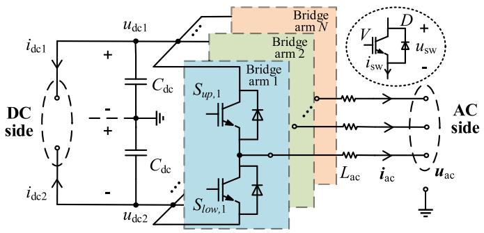  
Fig. 1. N-phase bridge converter with a grounded midpoint on the DC side.

computationally intensive, especially in high-frequency or largescale converter systems. Neglecting the simultaneous conduction of switches in the same bridge arm, the state-space equation of the SFM for converters in Fig. 1 is:

$$
\left\{ \begin{array}{l} \dot {\mathbf {x}} = d \boldsymbol {x} / d t = \boldsymbol {A} \cdot \boldsymbol {x} + \boldsymbol {b} \\ \boldsymbol {A} = \boldsymbol {A} _ {0} + \sum_ {k = 1} ^ {N} \left(S _ {u p, k} \cdot \boldsymbol {A} _ {u p, k} + S _ {l o w, k} \cdot \boldsymbol {A} _ {l o w, k}\right) \end{array} \right. \tag {1}
$$

where x, u, andb denote the state variables, input variables, and input vector, respectively; A is the state matrix; $S \in \{ 0 , 1 \}$ i s the switching state; subscripts up and low correspond to the upper and lower bridge-arm switches; subscript 0 represents the elements not directly related to the switch, and $k \in \{ 1 , 2 , . . . , N \}$ represents the k-th phase bridge arm, with N as the total count of bridge arms. The detailed expression of (1) in Fig. 1 is provided in Appendix A.

Throughout this work, the superscript n denotes variables at $t _ { n } = t _ { 0 } { + } n \cdot h$ , where $t _ { 0 }$ is the initial simulation time and h is the fixed time step. Taking the converter topology illustrated in Fig. 1 as an example, the switching state S at $t _ { n }$ is defined as:

$$
\begin{array}{l} S ^ {n} = C ^ {n} + \left(1 - C ^ {n}\right) \cdot \left(1 - S ^ {n - 1}\right) \cdot \mathbb {I} \left(u _ {\mathrm {s w}} ^ {n - 1} <   0\right) \\ + \left(1 - C ^ {n}\right) \cdot S ^ {n - 1} \cdot \mathbb {I} \left(i _ {\mathrm {s w}} ^ {n - 1} <   0\right) \tag {2} \\ \end{array}
$$

where $u _ { \mathrm { s w } }$ and $i _ { \mathrm { s w } }$ are the voltage and current across the switches:

$$
\left\{ \begin{array}{l} u _ {\mathrm {s w}, u p} ^ {n - 1} = \left(1 - S _ {u p} ^ {n - 1}\right) \cdot \left(u _ {\mathrm {d c} 1} ^ {n - 1} - u _ {\mathrm {a c}} ^ {n - 1}\right) \\ + S _ {l o w} ^ {n - 1} \cdot \left(u _ {\mathrm {a c}} ^ {n - 1} - u _ {\mathrm {d c} 2} ^ {n - 1}\right) \\ u _ {\mathrm {s w}, l o w} ^ {n - 1} = S _ {u p} ^ {n - 1} \cdot \left(u _ {\mathrm {d c} 1} ^ {n - 1} - u _ {\mathrm {a c}} ^ {n - 1}\right) \\ + \left(1 - S _ {l o w} ^ {n - 1}\right) \cdot \left(u _ {\mathrm {a c}} ^ {n - 1} - u _ {\mathrm {d c} 2} ^ {n - 1}\right) \end{array} \right. \tag {3}
$$

$$
i _ {\mathrm {s w}, u p} ^ {n - 1} = S _ {u p} ^ {n - 1} \cdot i _ {L} ^ {n - 1}, i _ {\mathrm {s w}, l o w} ^ {n - 1} = - S _ {l o w} ^ {n - 1} \cdot i _ {L} ^ {n - 1} \tag {4}
$$

II() is the indicator function; $C \in \{ 0 , 1 \}$ is the control signal:

$$
C ^ {n} = \mathbb {I} (\text {u n b l o c k e d}) \cdot \mathrm {H} \left(v _ {\mathrm {m}} ^ {n} - v _ {\mathrm {c}} ^ {n}\right) \tag {5}
$$

where H() denotes the Heaviside step function; $\nu _ { \mathrm { m } }$ and $\nu _ { \mathrm { c } }$ represent the modulated and carrier signals, respectively.

The term b in (1) is relevant to the network-injected sources, which are known before each simulation step. For illustration, applying the trapezoidal rule (TR) to discretize (1) yields:

$$
\left\{ \begin{array}{l} \boldsymbol {x} ^ {n} = (\boldsymbol {F}) ^ {- 1} \cdot \left(\boldsymbol {I} + \frac {h}{2} \boldsymbol {A}\right) \cdot \boldsymbol {x} ^ {n - 1} + (\boldsymbol {F}) ^ {- 1} \cdot \frac {h}{2} \left(\boldsymbol {b} ^ {n} + \boldsymbol {b} ^ {n - 1}\right) \\ \boldsymbol {F} = \boldsymbol {I} - h \boldsymbol {A} / 2 \end{array} \right. \tag {6}
$$

where I denotes the K × K identity matrix; K is the dimension of x, which is the total number of inductors and capacitors. Since matrix F depends on the switching state, its inverse must be recalculated whenever the state changes, which is the main source of computational burden in SFM-based EMT simulation.

# B. Average-Value Model

The AVM is typically established using analytical averaging methods [11], [28], [29]. The core principle involves treating the duty cycle, defined as the ratio of on-time to carrier period $T _ { \mathrm { c } }$ , as a weighting factor. By weighting and averaging the statespace equations of the SFM at different switching states, the state-space equations of the AVM can be derived as [30]:

$$
\left\{ \begin{array}{l} \dot {\bar {x}} = d \bar {\mathbf {x}} / d t = \bar {\mathbf {A}} \cdot \bar {\mathbf {x}} + \bar {\mathbf {b}} \\ \bar {\mathbf {A}} = \mathbf {A} _ {0} + \sum_ {k = 1} ^ {N} \left(D _ {u p, k} \cdot \mathbf {A} _ {u p, k} + D _ {l o w, k} \cdot \mathbf {A} _ {l o w, k}\right) \end{array} \right. \tag {7}
$$

where x¯ represents the average state variables; D is the duty cycle, which represents the average switching state:

$$
D _ {u p, k} = \frac {1}{T _ {\mathrm {c}}} \int_ {t} ^ {t + T _ {\mathrm {c}}} S _ {u p, k} d t, D _ {l o w, k} = \frac {1}{T _ {\mathrm {c}}} \int_ {t} ^ {t + T _ {\mathrm {c}}} S _ {l o w, k} d t \tag {8}
$$

Using the same TR, the discretization of (7) yields:

$$
\left\{ \begin{array}{l} \bar {\mathbf {x}} ^ {n} = (\bar {\mathbf {F}}) ^ {- 1} \cdot (I + \frac {h}{2} \bar {\mathbf {A}}) \cdot \bar {\mathbf {x}} ^ {n - 1} + (\bar {\mathbf {F}}) ^ {- 1} \cdot \frac {h}{2} (\bar {\mathbf {b}} ^ {n} + \bar {\mathbf {b}} ^ {n - 1}) \\ \bar {\mathbf {F}} = I - h \bar {\mathbf {A}} / 2 \end{array} \right. \tag {9}
$$

The AVM retains fundamental-frequency dynamics while suppressing high-frequency switching details, significantly improving simulation efficiency. One of its key advantages lies in the constant matrix F¯ within each carrier period, which avoids frequent matrix inversions caused by switching events, thereby reducing computational overhead compared to SFMs. However, conventional AVMs fail to capture high-frequency harmonics induced by pulse-width-modulation (PWM) ripple, dead-time effects, or transient faults. This limits their applicability in scenarios requiring precise harmonic analysis.

# III. THE PROPOSED HP-AVM MODELING METHOD

To bridge this research gap in AVMs, the HP-AVM that quantifies the harmonic components and integrates them with AVMs into a unified EMT simulation framework is proposed. The HP-AVM preserves the efficiency of AVMs while achieving SFM-level accuracy, as elaborated in this section.

# A. Simulation Framework Based on AVM and Harmonics

First, the simulation framework based on the AVM and harmonics is introduced, as it forms the core of HP-AVM.

In detailed system-level models such as SFMs, matrix inversion operations dominate the total simulation time, accounting for most of the computational overhead. The number of matrix inversions per carrier period scales directly with the number of switches. For a system with N independent switch pairs, SFMs require at least 2N matrix inversions per carrier period. In contrast, AVMs reduce the computational burden by leveraging duty-cycle averaging, limiting matrix inversions to a

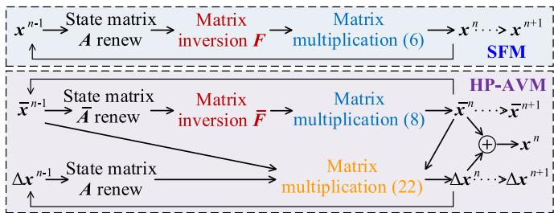

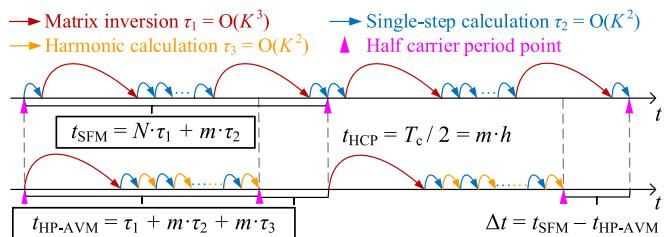  
(a)   
  
Fig. 2. Comparison of EMT simulations based on SFM and HP-AVM: (a) one-step simulation diagram and (b) overall time consumption.

small number per carrier period. However, this advantage comes at a cost: AVMs neglect high-frequency harmonics due to the low-frequency approximation.

To reconcile accuracy with efficiency, a simulation framework is proposed, which integrates the fast simulation capability of the AVM with precise harmonic characterization. The framework contains three main parts:

1) The AVM computes the fundamental-frequency dynamics with one matrix inversion per HCP.   
2) The harmonic components Δx are calculated from the AVM outputs and switching states, which avoids complex matrix inversions through the harmonic-based decoupling method introduced in the following subsection.   
3) The final state variables are reconstructed as x = x¯ + Δx.

The direct AVM and harmonic outputs of HP-AVM enable precise assessment of PWM ripple and dynamic responses without additional post-processing. Regardless of the number of switching events, this framework inverts the system matrix only once per HCP, while maintaining accuracy comparable to the SFM reference, thereby achieving a dual win in efficiency and precision in system-level EMT simulation. Moreover, the HP-AVM is applicable to scenarios where SFMs can be employed. Assume that a system has N pairs of switches, the order of the state matrix is K (total count of L and C), and the HCP satisfies Tc /2 = mh. Fig. 2 shows the one-step simulation diagram and overall time consumption of SFM and HP-AVM.

While Section II details the simulation of AVMs, the computation of harmonic components necessitates further analysis. Conventional harmonic modeling methods rely on frequencydomain transformations of time-domain equations to capture key dynamic characteristics [31]. However, these methods have a critical limitation, as they may neglect some higher-order harmonics and may lead to inaccuracies in high-frequency dynamics, such as PWM carrier harmonics, especially during transient events [26]. To overcome this limitation, we construct a timedomain-based harmonic model that can capture higher-order

harmonics without imposing a predefined truncation order. By comparing (1) and (7), the harmonic component $\Delta x$ is derived as:

$$
\left\{ \begin{array}{l} \Delta \dot {\mathbf {x}} = d \Delta \boldsymbol {x} / d t = \boldsymbol {A} \cdot \Delta \boldsymbol {x} + \Delta \boldsymbol {A} \cdot \bar {\mathbf {x}} + \Delta \boldsymbol {b} \\ = \bar {\mathbf {A}} \cdot \Delta \boldsymbol {x} + \Delta \boldsymbol {A} \cdot \Delta \boldsymbol {x} + \Delta \boldsymbol {A} \cdot \bar {\mathbf {x}} + \Delta \boldsymbol {b} \\ \Delta \boldsymbol {A} = \boldsymbol {A} - \bar {\mathbf {A}} = \sum_ {k = 1} ^ {N} \left(\Delta S D _ {u p, k} \cdot A _ {u p, k} + \Delta S D _ {l o w, k} \cdot A _ {l o w, k}\right) \\ \Delta \boldsymbol {b} = \boldsymbol {b} - \bar {\mathbf {b}}, \Delta S D = S - D \end{array} \right. \tag {10}
$$

Through TR discretization, (10) is transformed into:

$$
\begin{array}{l} \Delta \boldsymbol {x} ^ {n} = (\boldsymbol {F}) ^ {- 1} \cdot \left(\boldsymbol {I} + \frac {h}{2} \boldsymbol {A}\right) \cdot \Delta \boldsymbol {x} ^ {n - 1} \\ + (\boldsymbol {F}) ^ {- 1} \cdot \frac {h}{2} \Delta \boldsymbol {A} \cdot \left(\bar {\mathbf {x}} ^ {n} + \bar {\mathbf {x}} ^ {n - 1}\right) + (\boldsymbol {F}) ^ {- 1} \cdot \frac {h}{2} \left(\boldsymbol {b} ^ {n} + \boldsymbol {b} ^ {n - 1}\right) \tag {11} \\ \end{array}
$$

Direct calculation of (11) preserves the $O ( K ^ { 3 } )$ computational complexity of inverting matrix $F ,$ yielding no efficiency gain over SFM-based simulations. To avoid the high computational overhead while maintaining the harmonic fidelity, a harmoniccomponent-based network decoupling strategy is proposed.

# B. Decoupling Strategy Based on Harmonic Components

The decoupling strategy plays a significant role in enhancing the efficiency of EMT simulations. By dividing a large system into small, independently solvable subsystems, the simulation speed can be significantly increased. Since the direct computation of (11) is resource-intensive, a suitable decoupling method is essential to accelerate HP-AVM simulations further.

Converter ports are typically connected to inductors and capacitors. On the time scale of EMT simulations, the capacitor voltage and inductor current, as system state variables, tend to remain relatively stable [32]. Leveraging this characteristic, decoupling is preferably carried out at inductors or capacitors. Fig. 3 illustrates conventional one-step delay decoupling strategies, where Fig. 3(a) is applied at the LC filter [33], [34], [35], and Fig. 3(b) and (c) are applied at the independent inductors and capacitors [36], [37], [38], [39]. Essentially, decoupling based on the one-step delay approximation of the inductor current and capacitor voltage is equivalent to applying the forward Euler (FE) method at these elements.

Specifically, (1) can be rewritten as:

$$
\left[ \begin{array}{l} \dot {\mathbf {x}} _ {1} \\ \dot {\mathbf {x}} _ {2} \\ \dots \\ \dot {\mathbf {x}} _ {M} \end{array} \right] = \left[ \begin{array}{c c c c} A _ {1 1} & A _ {1 2} & \dots & A _ {1 M} \\ A _ {2 1} & A _ {2 2} & \dots & A _ {2 M} \\ \dots & \dots & \dots & \dots \\ A _ {M 1} & A _ {M 2} & \dots & A _ {M M} \end{array} \right] \cdot \left[ \begin{array}{l} x _ {1} \\ x _ {2} \\ \dots \\ x _ {M} \end{array} \right] + \left[ \begin{array}{l} b _ {1} \\ b _ {2} \\ \dots \\ b _ {M} \end{array} \right] \tag {12}
$$

where M represents the total number of independent subsystems to be decoupled. Each subsystem may contain independent inductors, independent capacitors, or inductors and capacitors within submodules that do not require internal decoupling. Based on (12), the conventional one-step delay decoupling strategy can be expressed as follows:

$$
\dot {\mathbf {x}} = \boldsymbol {\Lambda} \cdot \boldsymbol {x} + (\boldsymbol {A} - \boldsymbol {\Lambda}) \cdot \boldsymbol {X} + \boldsymbol {b} \tag {13}
$$

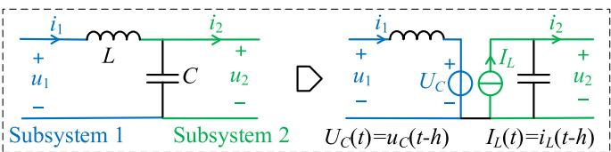  
(a)

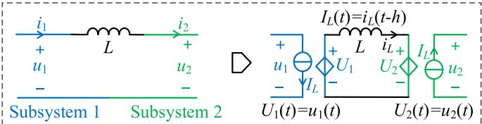  
(b)

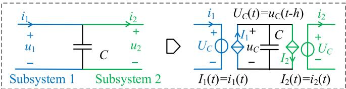  
(c)   
Fig. 3. Conventional one-step delay decoupling strategy at: (a) LC filter, (b) inductor, and (c) capacitor.

where

$$
\begin{array}{l} \boldsymbol {\Lambda} = \left[ \begin{array}{c c c c} \boldsymbol {\Lambda} _ {1 1} & \boldsymbol {O} _ {1 2} & \dots & \boldsymbol {O} _ {1 M} \\ \boldsymbol {O} _ {2 1} & \boldsymbol {\Lambda} _ {2 2} & \dots & \boldsymbol {O} _ {2 M} \\ \dots & \dots & \dots & \dots \\ \boldsymbol {O} _ {M 1} & \boldsymbol {O} _ {M 2} & \dots & \boldsymbol {\Lambda} _ {M M} \end{array} \right], \boldsymbol {X} = \left[ \begin{array}{c} \boldsymbol {X} _ {1} (t) \\ \boldsymbol {X} _ {2} (t) \\ \dots \\ \boldsymbol {X} _ {M} (t) \end{array} \right] \\ = \left[ \begin{array}{c} \boldsymbol {x} _ {1} (t - h) \\ \boldsymbol {x} _ {2} (t - h) \\ \dots \\ \boldsymbol {x} _ {M} (t - h) \end{array} \right] \tag {14} \\ \end{array}
$$

The truncation error of the conventional decoupling method is:

$$
\varepsilon \boldsymbol {x} ^ {n} = \boldsymbol {x} \left(t _ {n}\right) - \boldsymbol {x} ^ {n} = h ^ {2} \cdot \boldsymbol {V} \cdot d \boldsymbol {x} \left(\xi^ {n}\right) / d t, \xi^ {n} \in \left(t _ {n - 1}, t _ {n}\right) \tag {15}
$$

The equations for each subsystem are detailed as follows:

$$
\left\{ \begin{array}{l} \dot {\mathbf {x}} _ {j} = \boldsymbol {\Lambda} _ {j j} \cdot \boldsymbol {x} _ {j} + \sum_ {m = 1} ^ {M} \left(\boldsymbol {A} _ {j m} \cdot \boldsymbol {X} _ {m}\right) - \boldsymbol {\Lambda} _ {j j} \cdot \boldsymbol {X} _ {j} + \boldsymbol {b} _ {j} \\ j \in \{1, 2, \dots , M \} \end{array} \right. \tag {16}
$$

Using the TR as an example, the discretization of (16) yields:

$$
\left\{ \begin{array}{l} \boldsymbol {x} _ {j} ^ {n} = \boldsymbol {x} _ {j} ^ {n - 1} + \left(\boldsymbol {P} _ {j j}\right) ^ {- 1} \cdot \sum_ {m = 1} ^ {M} \left(h \boldsymbol {A} _ {j m} \cdot \boldsymbol {x} _ {m} ^ {n - 1}\right) \\ + \left(\boldsymbol {P} _ {j j}\right) ^ {- 1} \cdot h \left(\boldsymbol {b} _ {j} ^ {n} + \boldsymbol {b} _ {j} ^ {n - 1}\right) / 2 \\ \boldsymbol {P} _ {j j} = \boldsymbol {I} _ {j j} - h \boldsymbol {\Lambda} _ {j j} / 2 \end{array} \right. \tag {17}
$$

Before decoupling, the time complexity of directly solving the K-dimensional differential equations using implicit methods is primarily determined by the $O ( K ^ { 3 } )$ complexity of matrix inversion. However, since $P$ is a diagonal matrix with matrix inversion complexity $O ( K ) .$ , the complexity of the conventional one-step delay decoupling strategy is reduced to the $O ( K ^ { 2 } )$ complexity of matrix-vector multiplication, which significantly increases the simulation efficiency. Nevertheless, this approach does not flexibly account for scenarios where subsystems should remain

internally coupled. Furthermore, the conventional decoupling strategy based on state variables requires further improvement in terms of accuracy and stability when relatively large time steps are employed.

To achieve decoupling between subsystems and to reduce the error in one-step delay decoupling strategies, we adjust the decoupling target from the state variables xto their harmonic components Δx. Accordingly, an improved decoupling strategy based on harmonic components is proposed. This strategy allows a flexible definition of the size for each subsystem, enabling external decoupling while preserving partial internal coupling. The proposed decoupling strategy is detailed below.

First, (10) can be re-expressed as:

$$
\begin{array}{l} \left[ \begin{array}{c} \Delta \dot {\mathbf {x}} _ {1} \\ \Delta \dot {\mathbf {x}} _ {2} \\ \dots \\ \Delta \dot {\mathbf {x}} _ {M} \end{array} \right] = \left[ \begin{array}{c c c c} \boldsymbol {A} _ {1 1} & \boldsymbol {A} _ {1 2} & \dots & \boldsymbol {A} _ {1 M} \\ \boldsymbol {A} _ {2 1} & \boldsymbol {A} _ {2 2} & \dots & \boldsymbol {A} _ {2 M} \\ \dots & \dots & \dots & \dots \\ \boldsymbol {A} _ {M 1} & \boldsymbol {A} _ {M 2} & \dots & \boldsymbol {A} _ {M M} \end{array} \right] \cdot \left[ \begin{array}{c} \Delta \boldsymbol {x} _ {1} \\ \Delta \boldsymbol {x} _ {2} \\ \dots \\ \Delta \boldsymbol {x} _ {M} \end{array} \right] \\ + \left[ \begin{array}{c c c c} \Delta A _ {1 1} & \Delta A _ {1 2} & \dots & \Delta A _ {1 M} \\ \Delta A _ {2 1} & \Delta A _ {2 2} & \dots & \Delta A _ {2 M} \\ \dots & \dots & \dots & \dots \\ \Delta A _ {M 1} & \Delta A _ {M 2} & \dots & \Delta A _ {M M} \end{array} \right] \cdot \left[ \begin{array}{c} \bar {\mathbf {x}} _ {1} \\ \bar {\mathbf {x}} _ {2} \\ \dots \\ \bar {\mathbf {x}} _ {M} \end{array} \right] + \left[ \begin{array}{c} \Delta b _ {1} \\ \Delta b _ {2} \\ \dots \\ \Delta b _ {M} \end{array} \right] \tag {18} \\ \end{array}
$$

The proposed strategy is equivalent to rewriting (18) as:

$$
\begin{array}{l} \Delta \dot {\mathbf {x}} = \bar {\mathbf {J}} \cdot \Delta x + (\bar {\mathbf {A}} - \bar {\mathbf {J}}) \cdot \Delta X + \Delta A \cdot \Delta X + \Delta A \cdot \bar {\mathbf {x}} + \Delta b \\ = \bar {\mathbf {J}} \cdot \Delta \boldsymbol {x} + (\boldsymbol {A} - \bar {\mathbf {J}}) \cdot \Delta \boldsymbol {X} + \Delta \boldsymbol {A} \cdot \bar {\mathbf {x}} + \Delta \boldsymbol {b} \tag {19} \\ \end{array}
$$

where

$$
\left\{ \begin{array}{l} \bar {\mathbf {J}} = \left[ \begin{array}{c c c c} \bar {\mathbf {A}} _ {1 1} & O _ {1 2} & \dots & O _ {1 M} \\ O _ {2 1} & \bar {\mathbf {A}} _ {2 2} & \dots & O _ {2 M} \\ \dots & \dots & \dots & \dots \\ O _ {M 1} & O _ {M 2} & \dots & \bar {\mathbf {A}} _ {M M} \end{array} \right] \\ \Delta \boldsymbol {X} = \left[ \begin{array}{c} \Delta \boldsymbol {X} _ {1} (t) \\ \Delta \boldsymbol {X} _ {2} (t) \\ \dots \\ \Delta \boldsymbol {X} _ {M} (t) \end{array} \right] = \left[ \begin{array}{c} \Delta \boldsymbol {x} _ {1} (t - h) \\ \Delta \boldsymbol {x} _ {2} (t - h) \\ \dots \\ \Delta \boldsymbol {x} _ {M} (t - h) \end{array} \right] \end{array} \right. \tag {20}
$$

Equation (19) can be regarded as applying the FE method for the harmonic components of state variables at the interfaces between subsystems, which introduces the truncation error as:

$$
\varepsilon \boldsymbol {x} ^ {n} = h ^ {2} (\boldsymbol {A} - \bar {\mathbf {J}}) \cdot d \Delta \boldsymbol {x} \left(\eta^ {n}\right) / d t, \eta^ {n} \in \left(t _ {n - 1}, t _ {n}\right) \tag {21}
$$

The equations for each decoupled subsystem can then be written as:

$$
\begin{array}{l} \Delta \dot {\mathbf {x}} _ {j} = \bar {\mathbf {A}} _ {j j} \cdot \Delta \boldsymbol {x} _ {j} + \sum_ {m = 1} ^ {M} \left(\boldsymbol {A} _ {j m} \cdot \Delta \boldsymbol {X} _ {m}\right) - \bar {\mathbf {A}} _ {j j} \cdot \Delta \boldsymbol {X} _ {j} \\ + \sum_ {m = 1} ^ {M} \left(\Delta A _ {j m} \cdot \bar {\mathbf {x}} _ {m}\right) + \Delta \boldsymbol {b} _ {j} \tag {22} \\ \end{array}
$$

Discretizing (22) via the TR yields:

$$
\left\{ \begin{array}{l} \Delta \boldsymbol {x} _ {j} ^ {n} = \Delta \boldsymbol {x} _ {j} ^ {n - 1} + \left(\boldsymbol {Q} _ {j j}\right) ^ {- 1} \cdot \sum_ {m = 1} ^ {M} \left(h \boldsymbol {A} _ {j m} \cdot \Delta \boldsymbol {x} _ {m} ^ {n - 1}\right) \\ \quad + \left(\boldsymbol {Q} _ {j j}\right) ^ {- 1} \cdot \sum_ {m = 1} ^ {M} \left[ h \Delta \boldsymbol {A} _ {j m} / 2 \cdot \left(\bar {\mathbf {x}} _ {m} ^ {n} + \bar {\mathbf {x}} _ {m} ^ {n - 1}\right) \right] \\ \quad + \left(\boldsymbol {Q} _ {j j}\right) ^ {- 1} \cdot h \left(\Delta \boldsymbol {b} _ {j} ^ {n} + \Delta \boldsymbol {b} _ {j} ^ {n - 1}\right) / 2 \\ \boldsymbol {Q} _ {j j} = \boldsymbol {I} _ {j j} - h \bar {\mathbf {A}} _ {j j} / 2 \end{array} \right. \tag {23}
$$

Since matrix Q of each subsystem is generally non-diagonal, the simulation complexity depends not only on the $O ( K ^ { 2 } )$ cost of matrix-vector multiplication but also on the $O ( K _ { \operatorname* { m a x } } ^ { 3 } )$ matrix inversion complexity of the largest subsystem. Thus, the overall computational overhead of the proposed decoupling strategy is O(max $\{ K ^ { 2 } , K _ { \mathrm { m a x } } { } ^ { 3 } \} )$ . When the subsystem sizes are properly selected, the complexity does not increase significantly compared with the conventional decoupling strategy.

Additionally, when the system incorporates very small inductors or capacitors (e.g., on the order of tens of $\mu \mathrm { H } / \mu \mathrm { F }$ or smaller), the filtering and stabilizing effects of these components are weak, and direct decoupling at these elements is not recommended. For such components, a specific enhanced decoupling strategy is adopted: all of them are grouped into a single Subsystem 0. Within Subsystem 0, internal coupling is maintained while external subsystems are decoupled, enabling Subsystem 0 to be solved independently. Conversely, from the perspective of other subsystems, Subsystem 0 remains coupled and must be incorporated into their network solution. This approach achieves a unidirectional decoupling treatment for these components with improved stability. The equations are shown below, where the subscript 0 represents the very small inductors and capacitors within Subsystem 0, and the subscript ex denotes all inductors and capacitors in Subsystems 0-M:

$$
\Delta \dot {\mathbf {x}} _ {\mathrm {e x}} = \boldsymbol {U} \cdot \Delta \boldsymbol {x} _ {\mathrm {e x}} + (\boldsymbol {A} _ {\mathrm {e x}} - \boldsymbol {U}) \cdot \Delta \boldsymbol {X} _ {\mathrm {e x}} + \Delta \boldsymbol {A} _ {\mathrm {e x}} \cdot \bar {\mathbf {x}} _ {\mathrm {e x}} + \Delta \boldsymbol {b} _ {\mathrm {e x}}
$$

$$
\begin{array}{l} \left[ \begin{array}{c} \Delta \dot {\mathbf {x}} \\ \Delta \bar {\dot {\mathbf {x}}} _ {0} \end{array} \right] = \left[ \begin{array}{c} \bar {\mathbf {J}} \\ \bar {\boldsymbol {O}} _ {0 \mathrm {e x}} ^ {-} + \bar {\boldsymbol {A}} _ {\mathrm {e x} 0} ^ {-} \end{array} \right] \cdot \left[ \begin{array}{c} \Delta \boldsymbol {x} \\ \Delta \bar {\boldsymbol {x}} _ {0} \end{array} \right] \\ + \left[ \begin{array}{c c} \boldsymbol {A} - \bar {\mathbf {J}} & \boldsymbol {O} _ {\mathrm {e x 0}} \\ \bar {\boldsymbol {A}} _ {0 \mathrm {e x}} & \bar {\boldsymbol {O}} _ {0 0} \end{array} \right] \cdot \left[ \begin{array}{c} \Delta \boldsymbol {X} \\ \Delta \bar {\boldsymbol {X}} _ {0} \end{array} \right] \\ + \left[ \begin{array}{l} \Delta \boldsymbol {A} \\ \Delta \bar {\boldsymbol {A}} _ {0 \text {e x}} ^ {- - } \end{array} + \frac {\Delta \boldsymbol {A} _ {\mathrm {e x 0}}}{\Delta \bar {\boldsymbol {A}} _ {0 0} ^ {- - }} \right] \cdot \left[ \begin{array}{l} \bar {\mathbf {x}} \\ \bar {\mathbf {x}} _ {0} \end{array} \right] + \left[ \begin{array}{l} \Delta \boldsymbol {b} \\ \Delta \bar {\boldsymbol {b}} _ {0} \end{array} \right] \tag {24} \\ \end{array}
$$

where

$$
\left\{ \begin{array}{l} \Delta \boldsymbol {x} _ {\mathrm {e x}} = \left[ \begin{array}{c} \Delta \boldsymbol {x} \\ \bar {\Delta} \bar {\boldsymbol {x}} _ {0} \end{array} \right], \Delta \boldsymbol {b} _ {\mathrm {e x}} = \left[ \begin{array}{c} \Delta \boldsymbol {b} \\ \bar {\Delta} \bar {\boldsymbol {b}} _ {0} \end{array} \right], U = \left[ \begin{array}{c c} \bar {\mathbf {J}} & \boldsymbol {A} _ {\mathrm {e x} 0} \\ \bar {\boldsymbol {O}} _ {0 \mathrm {e x}} & \bar {\boldsymbol {A}} _ {0 0} ^ {-} \end{array} \right] \\ \boldsymbol {A} _ {\mathrm {e x}} = \left[ \begin{array}{c c} \boldsymbol {A} & \boldsymbol {A} _ {\mathrm {e x} 0} \\ \bar {\boldsymbol {A}} _ {0 \mathrm {e x}} & \bar {\boldsymbol {A}} _ {0 0} ^ {-} \end{array} \right], \Delta \boldsymbol {A} _ {\mathrm {e x}} = \left[ \begin{array}{c c} \Delta \boldsymbol {A} & \Delta \bar {\boldsymbol {A}} _ {\mathrm {e x} 0} \\ \bar {\Delta} \bar {\boldsymbol {A}} _ {0 \mathrm {e x}} & \bar {\Delta} \bar {\boldsymbol {A}} _ {0 0} ^ {-} \end{array} \right] \end{array} \right. \tag {25}
$$

Further simplification yields the following decoupled equations for Subsystem 0 and Subsystems 1-M:

$$
\left\{ \begin{array}{l} \Delta \dot {\mathbf {x}} _ {0} = \boldsymbol {A} _ {0 0} \cdot \Delta \boldsymbol {x} _ {0} + \sum_ {m = 1} ^ {M} \left(\boldsymbol {A} _ {0 m} \cdot \Delta \boldsymbol {X} _ {m}\right) \\ + \sum_ {m = 0} ^ {M} \left(\Delta \boldsymbol {A} _ {0 m} \cdot \bar {\mathbf {x}} _ {m}\right) + \Delta \boldsymbol {b} _ {0} \\ \Delta \dot {\mathbf {x}} _ {j} = \bar {\mathbf {A}} _ {j j} \cdot \Delta \boldsymbol {x} _ {j} + \sum_ {m = 1} ^ {M} \left(\boldsymbol {A} _ {j m} \cdot \Delta \boldsymbol {X} _ {m}\right) - \bar {\mathbf {A}} _ {j j} \cdot \Delta \boldsymbol {X} _ {j} \\ + \boldsymbol {A} _ {j 0} \cdot \Delta \boldsymbol {x} _ {0} + \sum_ {m = 0} ^ {M} \left(\Delta \boldsymbol {A} _ {j m} \cdot \bar {\mathbf {x}} _ {m}\right) + \Delta \boldsymbol {b} _ {j} \end{array} \right. \tag {26}
$$

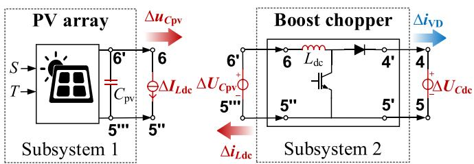

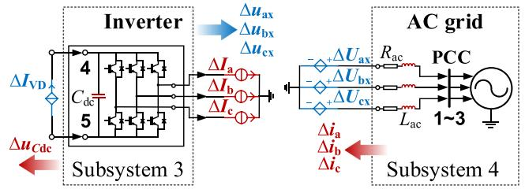  
Fig. 4. Decoupled subsystems of the two-stage grid-connected PVGS.

Discretizing (26) through the TR yields:

$$
\left\{ \begin{array}{l} \Delta \boldsymbol {x} _ {0} ^ {n} = \Delta \boldsymbol {x} _ {0} ^ {n - 1} + \left(\boldsymbol {F} _ {0 0}\right) ^ {- 1} \cdot \sum_ {m = 0} ^ {M} \left(h \boldsymbol {A} _ {0 m} \cdot \Delta \boldsymbol {x} _ {m} ^ {n - 1}\right) \\ \quad + \left(\boldsymbol {F} _ {0 0}\right) ^ {- 1} \cdot \sum_ {m = 0} ^ {M} \left[ h \Delta \boldsymbol {A} _ {0 m} / 2 \cdot \left(\bar {\mathbf {x}} _ {m} ^ {n} + \bar {\mathbf {x}} _ {m} ^ {n - 1}\right) \right] \\ \quad + \left(\boldsymbol {F} _ {0 0}\right) ^ {- 1} \cdot h \left(\Delta \boldsymbol {b} _ {0} ^ {n} + \Delta \boldsymbol {b} _ {0} ^ {n - 1}\right) / 2 \\ \Delta \boldsymbol {x} _ {j} ^ {n} = \Delta \boldsymbol {x} _ {j} ^ {n - 1} + \left(\boldsymbol {Q} _ {j j}\right) ^ {- 1} \cdot \sum_ {m = 1} ^ {M} \left(h \boldsymbol {A} _ {j m} \cdot \Delta \boldsymbol {x} _ {m} ^ {n - 1}\right) \\ \quad + \left(\boldsymbol {Q} _ {j j}\right) ^ {- 1} \cdot h \boldsymbol {A} _ {j 0} / 2 \cdot \left(\Delta \boldsymbol {x} _ {0} ^ {n} + \Delta \boldsymbol {x} _ {0} ^ {n - 1}\right) \\ \quad + \left(\boldsymbol {Q} _ {j j}\right) ^ {- 1} \cdot \sum_ {m = 0} ^ {M} \left[ h \Delta \boldsymbol {A} _ {j m} / 2 \cdot \left(\bar {\mathbf {x}} _ {m} ^ {n} + \bar {\mathbf {x}} _ {m} ^ {n - 1}\right) \right] \\ \quad + \left(\boldsymbol {Q} _ {j j}\right) ^ {- 1} \cdot h \left(\Delta \boldsymbol {b} _ {j} ^ {n} + \Delta \boldsymbol {b} _ {j} ^ {n - 1}\right) / 2 \end{array} \right. \tag {27}
$$

When Subsystem 0 is introduced for very small inductors and capacitors, an additional matrix Finversion cost of $O ( K _ { 0 } { } ^ { 3 } )$ i s incurred, so the complexity becomes O(max $\{ K ^ { 2 } , K _ { \mathrm { m a x } } { } ^ { 3 } , K _ { 0 } { } ^ { 3 } \} )$ . In practical EMT models, only a limited number of such small L/C elements require this specific treatment, so the dimension $K _ { 0 }$ is typically much smaller than the overall system order K. As a result, the extra overhead introduced by Subsystem 0 does not materially affect the overall computational complexity.

Based on the above, the differential equations for the harmonic components of the individual subsystems can be solved separately, eliminating the need to solve the large-scale differential equation system for the entire system as a whole. To visually illustrate the improved strategy, an example of a two-stage gridconnected photovoltaic generation system (PVGS) is shown in Fig. 4 [40]. In Fig. 4, the red arrows represent harmonic components that can be directly transferred to adjacent models for decoupling. In contrast, the blue arrows denote those associated with switching states, which can only be transferred to adjacent modules for decoupling after the switching states at the new time step have been determined. Assuming that no excessively small inductors or capacitors exist in the system, the equations of the harmonic components for the decoupled subsystems are as follows. The detailed derivation is given in Appendix B.

1) Subsystem 1: interface capacitor of the PV array

$$
\frac {d \Delta u _ {C \mathrm {p v}}}{d t} = - \frac {G _ {e q , \mathrm {p v}}}{C _ {\mathrm {p v}}} \cdot \Delta u _ {C \mathrm {p v}} - \frac {\Delta I _ {L \mathrm {d c}}}{C _ {\mathrm {p v}}} + \frac {\Delta I _ {e q , \mathrm {p v}}}{C _ {\mathrm {p v}}} \tag {28}
$$

2) Subsystem 2: internal inductor of the boost chopper

$$
\begin{array}{l} \frac {d \Delta i _ {L \mathrm {d c}}}{d t} = \frac {S _ {V} + S _ {V D}}{L _ {\mathrm {d c}}} \cdot \Delta U _ {C \mathrm {p v}} - \frac {S _ {V D}}{L _ {\mathrm {d c}}} \cdot \Delta U _ {C \mathrm {d c}} \\ + \frac {\Delta S D _ {V} + \Delta S D _ {V D}}{L _ {\mathrm {d c}}} \cdot \bar {u} _ {C \mathrm {p v}} - \frac {\Delta S D _ {V D}}{L _ {\mathrm {d c}}} \cdot \bar {u} _ {C \mathrm {d c}} \tag {29} \\ \end{array}
$$

3) Subsystem 3: DC-link capacitor of the inverter

$$
\frac {d \Delta u _ {C \mathrm {d c}}}{d t} = \frac {\Delta I _ {V D}}{C _ {\mathrm {d c}}} - \left[ \begin{array}{c c c} \frac {S _ {u p , 1}}{C _ {\mathrm {d c}}} & \frac {S _ {u p , 2}}{C _ {\mathrm {d c}}} & \frac {S _ {u p , 3}}{C _ {\mathrm {d c}}} \end{array} \right] \cdot \left[ \begin{array}{c} \Delta I _ {\mathrm {a}} \\ \Delta I _ {\mathrm {b}} \\ \Delta I _ {\mathrm {c}} \end{array} \right]
$$

$$
- \left[ \begin{array}{c c c} \frac {\Delta S D _ {u p , 1}}{C _ {\mathrm {d c}}} & \frac {\Delta S D _ {u p , 2}}{C _ {\mathrm {d c}}} & \frac {\Delta S D _ {u p , 3}}{C _ {\mathrm {d c}}} \end{array} \right] \cdot \left[ \begin{array}{l} \bar {i} _ {\mathrm {a}} \\ \bar {i} _ {\mathrm {b}} \\ \bar {i} _ {\mathrm {c}} \end{array} \right] \tag {30}
$$

4) Subsystem 4: AC-side filter inductor at the point of common coupling (PCC)

$$
\begin{array}{l} \left[ \begin{array}{c} \frac {d \Delta i _ {\mathrm {a}}}{d t} \\ \frac {d \Delta i _ {\mathrm {b}}}{d t} \\ \frac {d \Delta i _ {\mathrm {c}}}{d t} \end{array} \right] = - \left[ \begin{array}{c c c} \frac {R _ {\mathrm {a c}}}{L _ {\mathrm {a c}}} & 0 & 0 \\ 0 & \frac {R _ {\mathrm {a c}}}{L _ {\mathrm {a c}}} & 0 \\ 0 & 0 & \frac {R _ {\mathrm {a c}}}{L _ {\mathrm {a c}}} \end{array} \right] \cdot \left[ \begin{array}{c} \Delta i _ {\mathrm {a}} \\ \Delta i _ {\mathrm {b}} \\ \Delta i _ {\mathrm {c}} \end{array} \right] \\ + \left[ \begin{array}{l} \frac {\Delta U _ {\mathrm {a x}} - \Delta u _ {\mathrm {a}}}{L _ {\mathrm {a c}}} \\ \frac {\Delta U _ {\mathrm {b x}} - \Delta u _ {\mathrm {b}}}{L _ {\mathrm {a c}}} \\ \frac {\Delta U _ {\mathrm {c x}} - \Delta u _ {\mathrm {c}}}{L _ {\mathrm {a c}}} \end{array} \right] \tag {31} \\ \end{array}
$$

where

$$
\left\{ \begin{array}{l} \Delta I _ {V D} = S _ {V D} \cdot \Delta I _ {L \mathrm {d c}} + \Delta S D _ {V D} \cdot \bar {\iota} _ {L \mathrm {d c}} \\ \Delta U _ {\mathrm {a x}} = \left(S _ {u p, 1} - S _ {a v m}\right) \cdot \Delta U _ {C \mathrm {d c}} \\ \quad + \left(\Delta S D _ {u p, 1} - \Delta S D _ {a v m}\right) \cdot \bar {u} _ {C \mathrm {d c}} + \Delta u _ {a v m} \\ \Delta U _ {\mathrm {b x}} = \left(S _ {u p, 2} - S _ {a v m}\right) \cdot \Delta U _ {C \mathrm {d c}} \\ \quad + \left(\Delta S D _ {u p, 2} - \Delta S D _ {a v m}\right) \cdot \bar {u} _ {C \mathrm {d c}} + \Delta u _ {a v m} \\ \Delta U _ {\mathrm {c x}} = \left(S _ {u p, 3} - S _ {a v m}\right) \cdot \Delta U _ {C \mathrm {d c}} \\ \quad + \left(\Delta S D _ {u p, 3} - \Delta S D _ {a v m}\right) \cdot \bar {u} _ {C \mathrm {d c}} + \Delta u _ {a v m} \\ \Delta S D _ {a v m} = \frac {1}{3} \sum_ {i = 1} ^ {3} \Delta S D _ {u p, i}, \\ \Delta u _ {a v m} = \frac {1}{3} (\Delta u _ {\mathrm {a}} + \Delta u _ {\mathrm {b}} + \Delta u _ {\mathrm {c}}) \end{array} \right. \tag {32}
$$

The inductors and capacitors within each subsystem can also be individually grouped into smaller-scale subsystems for decoupling if needed. The encapsulation shown here serves solely to illustrate the flexibility of this strategy. In principle, any inductor or capacitor in the system can be included within a chosen subsystem or form a single independent subsystem.

Compared with the conventional one-step delay decoupling methods based on full state variables, the proposed improved decoupling strategy offers two main advantages:

1) The proposed strategy targets the harmonic component Δxin the “AVM + harmonics” framework rather than state variables x, while the AVM output is obtained through accurate AVM-based simulation. Typically, the amplitude of the harmonic component Δx is much smaller than that of state variable x. This approach effectively reduces the error magnitude of the one-step delay decoupling strategy at passive components such as inductors and capacitors, without affecting the AVM simulation accuracy.

2) The proposed algorithm achieves independent subsystem decoupling while preserving partial internal coupling within each subsystem. For small inductors or capacitors with weak filtering or voltage support capabilities, the unidirectional decoupling treatment improves numerical stability while preserving the flexibility of the overall strategy. This approach enables more efficient use of computational resources and higher decoupling stability, with only a minor impact on efficiency.

Before solving (9) and (23) or (27), the duty cycle D needs to be determined. The duty cycle prediction strategy for HP-AVM will be discussed in the following subsection.

# C. Duty Cycle Prediction Based on Half Carrier Period

The HP-AVM simulation process involves two main stages in each step: pre-solution and formal solution. During the presolution stage, internal variables from the previous simulation step are retrieved. Based on this, the current switching state of each converter unit can be further determined. The formal solution phase consists of AVM simulation and harmonic component calculation. In AVM simulation, the fundamentalfrequency dynamics are obtained by solving (9), while in harmonic component calculation, high-frequency harmonics are derived from (23) or (27). Through this cycle of pre-solution and formal solution, both the fundamental-frequency dynamics and high-frequency harmonics can be simulated while maintaining high computational efficiency.

The switching instants and the duty cycle affect the accuracy of HP-AVM. The switching instants are primarily determined by control logic, and the interpolation algorithm can be utilized in EMT simulations to mitigate discretization errors. The duty cycle represents the proportion of switch-on time within a time period. Since it is difficult to directly obtain the duty cycle of the corresponding period at each discrete moment, a high-precision prediction method is typically applied to estimate it.

For open-loop controlled converters, all switching moments are already determined before simulation, which allows precalculation of duty cycles. Therefore, the duty cycle prediction strategy is not necessary. While under closed-loop control, duty cycles depend on control loop feedback. In order to guarantee high accuracy, efficiency, and computational feasibility, it is essential to consider a suitable duty cycle prediction strategy.

Conventional methods that estimate duty cycles over full carrier periods (FCPs) generally have relatively low accuracy. This inadequacy necessitates a refined prediction strategy. Commercial EMT simulation tools such as RT-LAB [41] and RTDS [42] employ sub-intervals combined with extrapolation techniques to precisely locate modulation wave-carrier intersections at each time step. While this approach enhances prediction accuracy, its reliance on ultra-fine temporal resolution necessitates frequent duty cycle updates and matrix inversions. Consequently, the computational complexity far exceeds that of conventional AVMs.

To address this dilemma and balance computing overhead with precision, this study presents a duty cycle prediction method based on HCPs for closed-loop controlled converters.

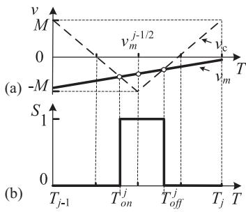

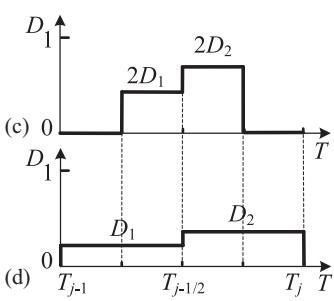  
Fig. 5. Duty cycle prediction in the bipolar PWM-controlled system.

Combined with extrapolation techniques, the duty cycle of the current HCP is predicted using the modulation signal value at the initial instant and the duty cycle of the previous HCP. This approach effectively adjusts the temporal resolution to the HCP level. Compared to conventional FCP-based strategies, this method allows for a more precise determination of duty cycles while guaranteeing high efficiency, ensuring that the time resolution can reflect the waveform information more accurately. Moreover, if necessary (e.g., in scenarios with low carrier frequencies), the number of segments within each FCP can be increased to more than two to mitigate prediction errors, albeit with a proportionally increased computational cost.

For the bipolar PWM-controlled system in Fig. 5, the carrier signal $\nu _ { \mathrm { c } }$ and the modulation signal $\nu _ { \mathrm { m } }$ at the switching instants in the j-th FCP are given by:

$$
\left\{ \begin{array}{l} v _ {\mathrm {c}} \left(T _ {o n} ^ {j}\right) = - 4 M / T _ {\mathrm {c}} \cdot \left(T _ {o n} ^ {j} - T _ {j - 1 / 2}\right) - M \\ v _ {\mathrm {c}} \left(T _ {o f f} ^ {j}\right) = 4 M / T _ {\mathrm {c}} \cdot \left(T _ {o f f} ^ {j} - T _ {j - 1 / 2}\right) - M \end{array} . \right. \tag {33}
$$

$$
\left\{ \begin{array}{l} v _ {\mathrm {m}} \left(T _ {o n} ^ {j}\right) = v _ {\mathrm {m}} \left(T _ {j - 1 / 2}\right) + v _ {\mathrm {m}} ^ {\prime} \left(\gamma_ {o n} ^ {j}\right) \cdot \left(T _ {o n} ^ {j} - T _ {j - 1 / 2}\right) \\ v _ {\mathrm {m}} \left(T _ {o f f} ^ {j}\right) = v _ {\mathrm {m}} \left(T _ {j - 1 / 2}\right) + v _ {\mathrm {m}} ^ {\prime} \left(\gamma_ {o f f} ^ {j}\right) \cdot \left(T _ {o f f} ^ {j} - T _ {j - 1 / 2}\right). \\ \gamma_ {o n} ^ {j} \in \left(T _ {o n} ^ {j}, T _ {j - 1 / 2}\right), \gamma_ {o f f} ^ {j} \in \left(T _ {j - 1 / 2}, T _ {o f f} ^ {j}\right) \end{array} \right. \tag {34}
$$

Rearranging (33) and (34), the relation between the on and off instants and the modulation signal value at $T _ { j - 1 / 2 }$ is derived as:

$$
\left\{ \begin{array}{l} T _ {o n} ^ {j} = T _ {j - 1 / 2} - \frac {v _ {\mathrm {m}} \left(T _ {j - 1 / 2}\right) + M}{4 M / T _ {\mathrm {c}} + v _ {\mathrm {m}} ^ {\prime} \left(\gamma_ {o n} ^ {j}\right)} \\ T _ {o f f} ^ {j} = T _ {j - 1 / 2} + \frac {v _ {\mathrm {m}} \left(T _ {j - 1 / 2}\right) + M}{4 M / T _ {\mathrm {c}} - v _ {\mathrm {m}} ^ {\prime} \left(\gamma_ {o f f} ^ {j}\right)} \end{array} . \right. \tag {35}
$$

Then, the duty cycle sum across adjacent HCPs can be obtained:

$$
\begin{array}{l} D _ {1} ^ {j} + D _ {2} ^ {j} = 2 \cdot (T _ {j - 1 / 2} - T _ {o n} ^ {j}) \bigg / T _ {\mathrm {c}} + 2 \cdot (T _ {o f f} ^ {j} - T _ {j - 1 / 2}) \bigg / T _ {\mathrm {c}} \\ = \frac {2 + 2 v _ {\mathrm {m}} (T _ {j - 1 / 2}) \Big / M}{4 + v _ {\mathrm {m}} ^ {\prime} (\gamma_ {\partial n} ^ {j}) \cdot T _ {\mathrm {c}} \Big / M} + \frac {2 + 2 v _ {\mathrm {m}} (T _ {j - 1 / 2}) \Big / M}{4 - v _ {\mathrm {m}} ^ {\prime} (\gamma_ {o f f} ^ {j}) \cdot T _ {\mathrm {c}} \Big / M} \\ = 1 + v _ {\mathrm {m}} \left(T _ {j - 1 / 2}\right) / M + O \left[ \left(T _ {\mathrm {c}}\right) ^ {2} \right] \tag {36} \\ \end{array}
$$

Assuming that the modulation signal value at the end of the previous HCP is $v _ { m } ^ { j }$ , the duty cycle $D _ { l }$ of the l-th HCP can be

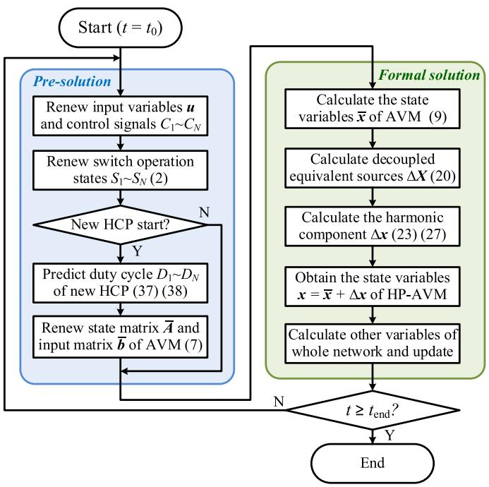  
Fig. 6. Flowchart of HP-AVM simulation.

predicted based on (36):

$$
D _ {l} = \left\{ \begin{array}{l l} 1 & , v _ {\mathrm {m}} ^ {l} \geq M D _ {l - 1} \\ \left(1 + v _ {\mathrm {m}} ^ {l} / M\right) - D _ {l - 1} & , M \left(D _ {l - 1} - 1\right) \leq v _ {\mathrm {m}} ^ {l} <   M D _ {l - 1} \\ 0 & , v _ {\mathrm {m}} ^ {l} <   M \left(D _ {l - 1} - 1\right) \end{array} \right. \tag {37}
$$

Similarly, in the unipolar PWM mode, $D _ { l }$ can be predicted as:

$$
D _ {l} = \left\{ \begin{array}{l l} 1 & , v _ {\mathrm {m}} ^ {l} \geq M \left(1 + D _ {l - 1}\right) / 2 \\ 2 v _ {\mathrm {m}} ^ {l} / M - D _ {l - 1}, & M D _ {l - 1} / 2 \leq v _ {\mathrm {m}} ^ {l} <   M \left(1 + D _ {l - 1}\right) / 2 \\ 0 & , v _ {\mathrm {m}} ^ {l} <   M D _ {l - 1} / 2 \end{array} \right. \tag {38}
$$

Moreover, when the switch is blocked, $D _ { l }$ should be set to zero.

The proposed strategy achieves a prediction error of ${ \cal O } ( T _ { \mathrm { c } } { } ^ { 2 } )$ , which is sufficient for the accuracy requirements of the AVM. After the duty cycle prediction, the AVM and the harmonic components can be simulated, and state variables x of the HP-AVM can then be obtained.

The simulation flowchart using HP-AVM is shown in Fig. 6.

# IV. PERFORMANCE VERIFICATION

This section evaluates the simulation accuracy and computational efficiency of converter models with diverse topologies under both steady-state and transient conditions, in order to assess the performance of the proposed HP-AVM. The host processor is Intel Core i7-12700H @ 2.30 GHz with 16 GB DDR5 RAM. To ensure a consistent evaluation environment, the $\mathrm { R _ { o n } / R _ { o f f } }$ model, SFM, and HP-AVM are implemented on a C++-based simulation platform. The results of AVMs are also obtained during HP-AVM simulation. In addition, the $\mathrm { R _ { o n } / R _ { o f f } }$ model is implemented in PSCAD as the accuracy benchmark.

Using the $\mathrm { R _ { o n } / R _ { o f f } }$ model in PSCAD as the reference, the accuracy comparison is performed based on the results of the

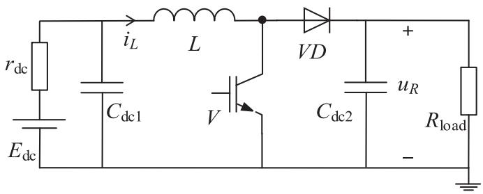  
Fig. 7. Boost chopper topology.

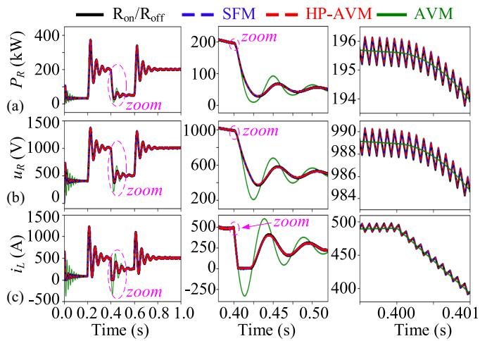  
Fig. 8. Waveforms in Case 1: (a) active power of load, (b) voltage of load, and (c) inductor current.

HP-AVM, AVM, and SFM. In addition, the runtime comparison is conducted on the self-developed C++-based simulation platform, providing a consistent environment for unified testing. The error $x _ { \mathrm { e r r } }$ represents the maximum relative error of the state variables x, and the time τ denotes the average execution time per simulated second, computed over ten independent runs to reduce random error.

$$
x _ {\text {e r r}} = \left| x _ {1} - x _ {2} \right| _ {\max } / x _ {\text {r e f}}, \tau = \tau_ {\text {t o t a l}} / 1 0. \tag {39}
$$

# A. Boost Chopper

The boost chopper is a typical asymmetric converter, as illustrated in Fig. 7. The simulation duration is set to 1 s with a time step of 10 μs and interpolation enabled, and the relevant parameters are summarized in Appendix C. During 0-0.2 s, the converter is in standby mode and only the diode conducts for capacitor charging. The DC input source $E _ { \mathrm { d c } }$ undergoes a 50% voltage sag at 0.4 s and recovers to 400 V at 0.6 s. The results are shown in Fig. 8, where HP-AVM refers to the proposed HP-AVM, AVM refers to the conventional AVM without preserved harmonics, SFM refers to the switching function model, and $\mathrm { R _ { o n } / R _ { o f f } }$ refers to the two-value-resistor model.

By observing the waveforms in Fig. 8, whether in the standby mode or normal operating mode, the characteristics of the

HP-AVM and SFM are consistently aligned with those of the $\mathrm { R _ { o n } / R _ { o f f } }$ model. Moreover, by analyzing the harmonic components in Fig. 9, the timing of dynamic events and the harmonic peaks following these events can be easily identified, which is

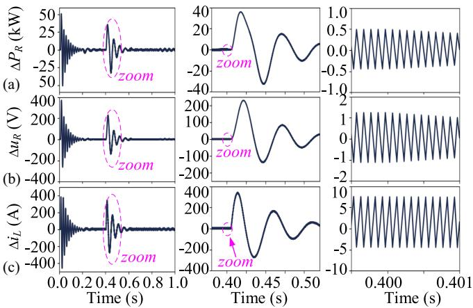  
Fig. 9. Waveforms of harmonic components in Case 1: (a) active power of load, (b) voltage of load, and (c) inductor current.

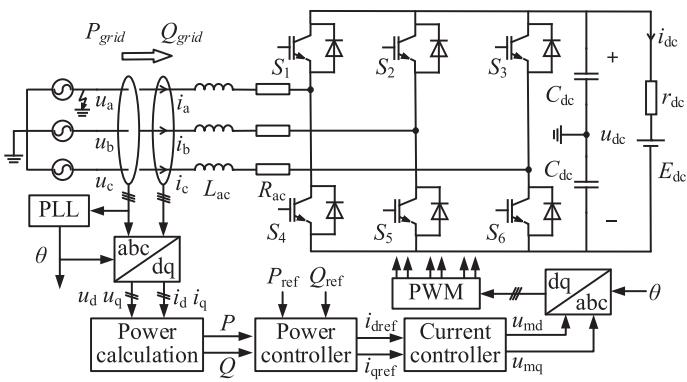  
Fig. 10. Three-phase full-bridge VSC topology.

meaningful for analyzing the impact of transient events and fully understanding the operating states of the system.

# B. Three-Phase Full-Bridge VSC

The three-phase full-bridge voltage source converter (VSC) is a symmetrical converter widely used in CIGs [23]. In this subsection, we construct its rectifier mode based on Fig. 10, and the inverter mode is tested in Section V.

The simulation duration is set to 1 s with a 20 μs time step. The parameters are provided in Appendix C. The converter is blocked until 0.2 s. The control signal of $S _ { 1 }$ is lost at 0.4 s and recovered at 0.45 s. A single-phase-to-ground fault at phase A occurs at 0.6 s and is recovered at 0.65 s. The simulation results are shown in Fig. 11.

As illustrated in Fig. 11, the dynamic responses of HP-AVM and SFM remain consistent with $\mathrm { R _ { o n } / R _ { o f f } }$ under fault conditions. Moreover, Table I summarizes the maximum feasible step size $h _ { \mathrm { m a x } }$ for various parameters within illustrative ranges for the VSC rectifier system in Case 2 and the VSC inverter system in Section V. For each parameter set, $h _ { \mathrm { m a x } }$ is obtained from the spectral radius condition $\rho < 1$ , and any time step satisfying

$h \in ( 0 , h _ { \operatorname* { m a x } } ]$ preserves numerical stability. These results indicate that HP-AVM maintains numerical stability over relatively wide ranges of step sizes in the tested parameter intervals.

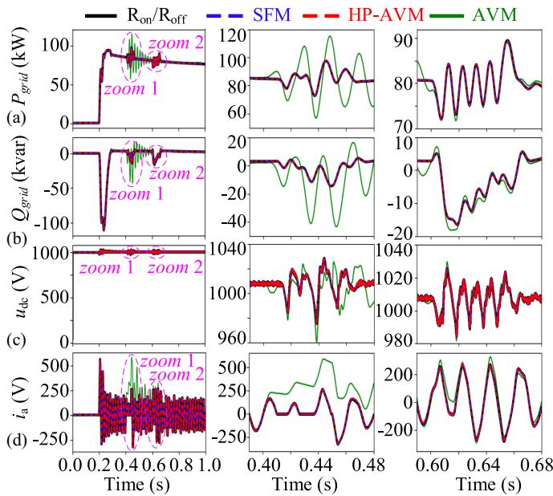  
Fig. 11. Waveforms in Case 2: (a) active power input to the converter, (b) reactive power input to the converter, (c) DC voltage, and (d) A phase current.

TABLE I MAXIMUM FEASIBLE STEP SIZE FOR VSC SYSTEMS UNDER PARAMETER RANGES ENSURING SPECTRAL RADIUS < 1   

<table><tr><td>Parameters</td><td>Lac/mH</td><td>Cdc/mF</td><td>rdc/Ω</td><td>Rac/Ω</td><td>hmax/μs</td></tr><tr><td rowspan="4">Rectifier(Fig. 10)</td><td>0.01~20</td><td>5</td><td>0.1</td><td>0.1</td><td>338</td></tr><tr><td>8</td><td>0.5~20</td><td>0.1</td><td>0.1</td><td>72</td></tr><tr><td>8</td><td>5</td><td>0.001~10</td><td>0.1</td><td>333</td></tr><tr><td>8</td><td>5</td><td>0.1</td><td>0.02~10</td><td>94</td></tr><tr><td rowspan="4">Inverter(Fig. 14)</td><td>0.01~20</td><td>1.36</td><td>0.1</td><td>20</td><td>&gt;1000</td></tr><tr><td>5</td><td>0.02~20</td><td>0.1</td><td>20</td><td>266</td></tr><tr><td>5</td><td>1.36</td><td>0.001~10</td><td>20</td><td>&gt;1000</td></tr><tr><td>5</td><td>1.36</td><td>0.1</td><td>0.2~100</td><td>188</td></tr></table>

# C. Two-Stage Grid-Connected PVGS

A two-stage grid-connected PVGS is constructed as shown in Fig. 12, with system parameters detailed in Appendix C. The simulation duration is set to 1.0 s with a fixed time step of 10 μs. The following two transient events are introduced:

1) DC side: The PV irradiance drops from 1000 W/m2 to 700 W/m2 at 0.3 s and recovers at 0.4 s;   
2) AC side: At the A-phase terminal of the PCC, a singlephase-to-ground fault occurs at 0.7 s and clears at 0.71 s.

As demonstrated in Fig. 13, the waveforms of the HP-AVM and the SFM align consistently with the reference $\mathrm { R _ { o n } / R _ { o f f } }$ model throughout the simulation. Notably, no divergence is observed between the models during transient events or steadystate operation. These results confirm that the HP-AVM achieves high simulation accuracy and exhibits numerical stability under both normal and fault conditions.

Furthermore, to conduct an in-depth comparison of the efficiency characteristics of HP-AVM, SFM, and the $\mathrm { R _ { o n } / R _ { o f f } }$ model, we extend Case 3 to a larger-scale grid-connected system comprising multiple PVGS modules, as illustrated in Fig. 12(a).

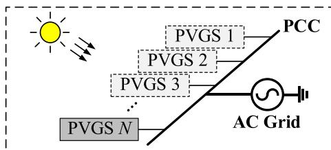  
(a)

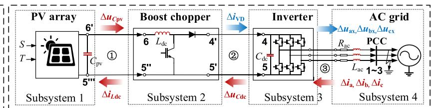  
(b)

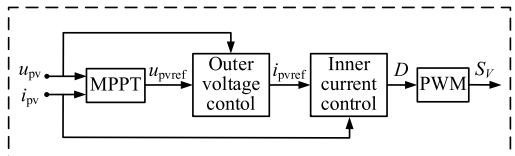  
(c)

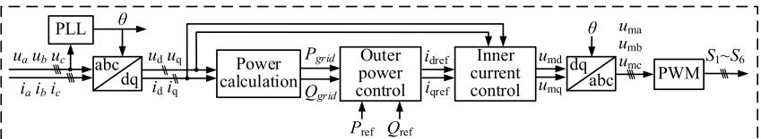  
(d)   
Fig. 12. Two-stage grid-connected PVGS: (a) diagram of N PVGS modules, (b) internal topology of a PVGS, and control loops of the (c) chopper and (d) inverter.

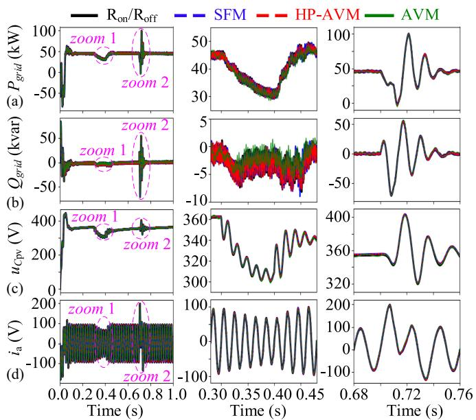  
Fig. 13. Waveforms in Case 3: (a) active power output to the grid, (b) reactive power output to the grid, (c) PV array voltage, and (d) A phase current.

TABLE II MAXIMUM RELATIVE ERRORS COMPARED WITH $\mathrm { R _ { O N } } / \mathrm { R _ { O F F } }$ (%)   

<table><tr><td rowspan="2">Case</td><td colspan="4">HP-AVM</td><td colspan="4">SFM</td></tr><tr><td>Perr</td><td>Qerr</td><td>uerr</td><td>ierr</td><td>Perr</td><td>Qerr</td><td>uerr</td><td>ierr</td></tr><tr><td>1</td><td>0.55</td><td>-</td><td>0.08</td><td>0.88</td><td>0.55</td><td>-</td><td>0.07</td><td>0.87</td></tr><tr><td>2</td><td>0.91</td><td>0.82</td><td>0.37</td><td>2.19</td><td>0.88</td><td>0.73</td><td>0.32</td><td>1.64</td></tr><tr><td>3</td><td>2.45</td><td>2.41</td><td>1.60</td><td>2.31</td><td>2.17</td><td>2.36</td><td>1.72</td><td>2.10</td></tr></table>

By setting the number of PVGS modules to 2, 5, 10, and 20 respectively, we measure the average runtime per simulated second for all three models on the same platform. The corresponding results, summarized in Table IV, are used to assess the efficiency performance of HP-AVM in larger-scale EMT simulations.

# D. Accuracy and Efficiency Evaluation

Table II summarizes the maximum relative errors $x _ { \mathrm { e r r } }$ of the proposed HP-AVM and the SFM against the reference $\mathrm { R _ { o n } / R _ { o f f } }$

TABLE III AVERAGE RUNTIME τ FOR ONE-SECOND SIMULATION (S)   

<table><tr><td rowspan="2">Case</td><td colspan="3">10μs</td><td colspan="3">1μs</td></tr><tr><td>HP-AVM</td><td>SFM</td><td>Ron/Roff</td><td>HP-AVM</td><td>SFM</td><td>Ron/Roff</td></tr><tr><td>1</td><td>0.011</td><td>0.012</td><td>0.026</td><td>0.075</td><td>0.074</td><td>0.098</td></tr><tr><td>2</td><td>0.069</td><td>0.075</td><td>1.035</td><td>0.607</td><td>0.699</td><td>1.428</td></tr><tr><td>3</td><td>0.145</td><td>0.183</td><td>0.742</td><td>0.779</td><td>0.783</td><td>1.470</td></tr></table>

TABLE IV AVERAGE RUNTIME τ FOR ONE-SECOND SIMULATION IN MULTI-PVGS SYSTEMS (S)   

<table><tr><td rowspan="2">Module Num</td><td colspan="3">10μs</td><td colspan="3">1μs</td></tr><tr><td>HP-AVM</td><td>SFM</td><td>Ron/Roff</td><td>HP-AVM</td><td>SFM</td><td>Ron/Roff</td></tr><tr><td>2</td><td>0.347</td><td>0.462</td><td>2.603</td><td>1.590</td><td>1.648</td><td>4.239</td></tr><tr><td>5</td><td>1.457</td><td>2.202</td><td>19.464</td><td>4.577</td><td>5.363</td><td>25.817</td></tr><tr><td>10</td><td>5.378</td><td>8.624</td><td>126.705</td><td>12.128</td><td>18.083</td><td>139.867</td></tr><tr><td>20</td><td>25.936</td><td>77.375</td><td>795.790</td><td>43.064</td><td>105.907</td><td>886.043</td></tr></table>

model across three test cases. As evidenced by Table II, during the transient process, the maximum relative error remains below 2.5%, while the steady-state error does not exceed 0.5%. The proposed HP-AVM achieves high-fidelity system-level simulation across both transient and steady-state conditions.

Tables III and IV quantify the computational efficiency by comparing the average runtime τ at different time steps h. Table III indicates that, in small-scale systems, HP-AVM is slightly faster than SFM, while both models are significantly more efficient than the $\mathrm { R _ { o n } / R _ { o f f } }$ model. Table IV shows that, in larger-scale systems, HP-AVM achieves substantially shorter execution times than both SFM and the $\mathrm { R _ { o n } / R _ { o f f } }$ model, and the relative speed-up of HP-AVM increases as the number of PVGS modules grows. Overall, the test results indicate that HP-AVM requires less computational time than SFM and the $\mathrm { R _ { o n } / R _ { o f f } }$ model. Furthermore, the efficiency advantage becomes more pronounced with larger system scales. These results demonstrate that HP-AVM is more efficient than SFM and the $\mathrm { R _ { o n } / R _ { o f f } }$ model, especially in large-scale systems.

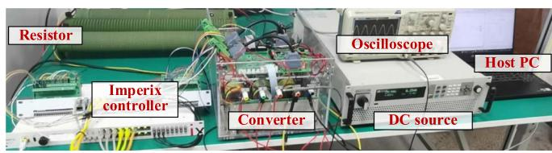

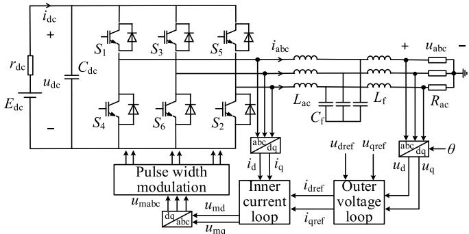  
(b)

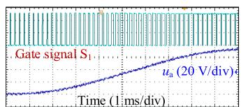  
Fig. 14. Experimental setup: (a) hardware platform, and (b) circuit topology.

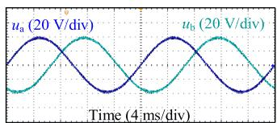

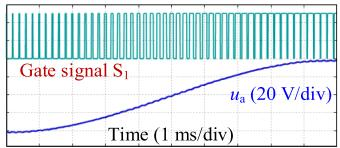

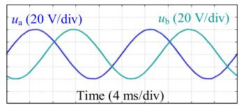  
  
Fig. 15. Waveforms under normal operating conditions: (a)(b) experimental results, and (c)(d) simulation results.

Matrix inversion is the main time-consuming aspect of EMT simulations. In the proposed HP-AVM, only one matrix inversion per HCP is required, which reduces the inversion overhead compared with SFM and the $\mathrm { R _ { o n } / R _ { o f f } }$ model. Additionally, the harmonic components are obtained directly during the simulation, allowing the system operating state during events to be assessed, which is useful for fault detection and protection studies. Hence, HP-AVM has great potential for application in EMT simulations.

# V. EXPERIMENTAL VERIFICATION

In this section, a physical experimental platform shown in Fig. 14 has been constructed to further verify the performance of the HP-AVM under both normal and fault conditions. The platform employs a V/F control strategy for load voltage/frequency regulation, with parameters detailed in Appendix D. In addition, the corresponding simulation based on the HP-AVM is implemented in Simulink with a fixed time step of $2 \mu \mathrm { s }$ .

The waveforms under normal conditions are presented in Fig. 15. Fig. 15(a) and (c) show that as the duty cycle of $S _ { 1 }$

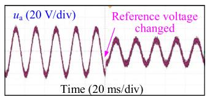

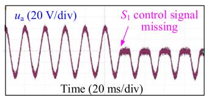

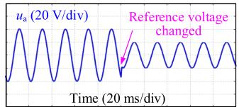

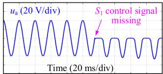  
  
Fig. 16. Waveforms under fault conditions: (a) experimental result for reference voltage step change, (b) experimental result for signal loss, (c) simulation result for reference voltage change, and (d) simulation result for signal loss.

increases, the phase voltage $u _ { \mathrm { a } }$ gradually rises from -40 V to 40 V in simulation and from -39.3 V to 39.3 V in experiment, with a relative error below 2%. Considering the losses in the experimental hardware, the simulation results of HP-AVM are in good agreement with the measurements. Fig. 15(b) and (d) demonstrate that the phase difference between $u _ { \mathrm { a } }$ and $u _ { \mathrm { b } }$ remains stable in simulation, aligning with experimental observations.

The waveforms under fault conditions are illustrated in Fig. 16. Fig. 16(a) and (c) present the experimental and simulation results under a step change of the reference voltage from 40 V to 20 V, while Fig. 16(b) and (d) show the experimental and simulation responses corresponding to a gate control signal loss for switch $S _ { 1 }$ . The results verify that the HP-AVM accurately reproduces the experimental responses to these transient events.

These results confirm that the HP-AVM is well aligned with the physical system, with deviations below 2% during both transient events and steady-state operation, further validating its high accuracy and robustness.

# VI. CONCLUSION

This paper proposes a harmonic-preserved AVM for power electronic converters in EMT simulations. The HP-AVM integrates an “AVM + harmonics” simulation framework, featuring two core innovations: a harmonic-based decoupling strategy for subsystem separation and a duty cycle prediction method based on HCPs. Compared to conventional AVMs, the HP-AVM provides an accurate representation of fundamental-frequency dynamics and harmonic components for system-level EMT simulations, while maintaining high computational efficiency. Its efficiency advantage becomes more pronounced as the system scale increases. Validated across simulations of diverse converter topologies, such as choppers, rectifiers, and inverters, the model demonstrates high accuracy and robustness under both normal and fault conditions. Experimental results further confirm its alignment with the physical system, with waveform deviations within 2%.

The HP-AVM’s balance of accuracy and efficiency shows great potential for application in high-frequency system-level

converter simulations and large-scale EMT studies, offering a promising approach for converter modeling and simulation.

# APPENDIX

A. Detailed Mathematical Expressions of x, A, and b in VSC

$$
\boldsymbol {A} = \left[ \begin{array}{l l} \boldsymbol {O} & \boldsymbol {A} _ {C} \\ \boldsymbol {A} _ {L} ^ {-} & \boldsymbol {O} \end{array} \right], \boldsymbol {x} = \left[ \begin{array}{l} \boldsymbol {x} _ {\mathrm {d c}} \\ \boldsymbol {x} _ {\mathrm {a c}} \end{array} \right], \boldsymbol {b} = \left[ \begin{array}{l} \boldsymbol {b} _ {\mathrm {d c}} \\ \boldsymbol {b} _ {\mathrm {a c}} \end{array} \right] \tag {A1}
$$

$$
\left\{ \begin{array}{l} \boldsymbol {A} _ {C} = - \left[ \begin{array}{c c c c} S _ {u p, 1} / C _ {s} & S _ {u p, 2} / C _ {s} & \dots & S _ {u p, N} / C _ {s} \\ S _ {l o w, 1} / C _ {s} & S _ {l o w, 2} / C _ {s} & \dots & S _ {l o w, N} / C _ {s} \end{array} \right] \\ \boldsymbol {A} _ {L} = \left[ \begin{array}{c c c c} S _ {u p, 1} / L _ {s} & S _ {u p, 2} / L _ {s} & \dots & S _ {u p, N} / L _ {s} \\ S _ {l o w, 1} / L _ {s} & S _ {l o w, 2} / L _ {s} & \dots & S _ {l o w, N} / L _ {s} \end{array} \right] ^ {T} \end{array} \right. \tag {A2}
$$

$$
\left\{ \begin{array}{l} \boldsymbol {x} _ {\mathrm {d c}} = \left[ \begin{array}{c c} u _ {\mathrm {d c} 1} & u _ {\mathrm {d c} 2} \end{array} \right] \\ \boldsymbol {x} _ {\mathrm {a c}} = \left[ \begin{array}{c c c} i _ {\mathrm {a c}, 1} & i _ {\mathrm {a c}, 2} & \dots & i _ {\mathrm {a c}, N} \end{array} \right] \\ \boldsymbol {b} _ {\mathrm {d c}} = - \left[ \begin{array}{c c} i _ {\mathrm {d c} 1} / C _ {\mathrm {d c}} & i _ {\mathrm {d c} 2} / C _ {\mathrm {d c}} \\ u _ {\mathrm {a c}, 1} / L _ {\mathrm {a c}} & u _ {\mathrm {a c}, 2} / L _ {\mathrm {a c}} \end{array} \right] \\ \boldsymbol {b} _ {\mathrm {a c}} = - \left[ \begin{array}{c c c} u _ {\mathrm {a c}, 1} & u _ {\mathrm {a c}, 2} & \dots & u _ {\mathrm {a c}, N} / L _ {\mathrm {a c}} \end{array} \right] \end{array} \right. \tag {A3}
$$

# B. Specific Example of the Decoupling Method in PVGS

The state-space equations for a PVGS are:

$$
\dot {\mathbf {x}} = \boldsymbol {A} \cdot \boldsymbol {x} + \boldsymbol {b}
$$

$$
\left\{ \begin{array}{l} \dot {\mathbf {x}} _ {1} = \boldsymbol {A} _ {1 1} \cdot \boldsymbol {x} _ {1} + \boldsymbol {A} _ {1 2} \cdot \boldsymbol {x} _ {2} + \boldsymbol {A} _ {1 3} \cdot \boldsymbol {x} _ {3} + \boldsymbol {A} _ {1 4} \cdot \boldsymbol {x} _ {4} + \boldsymbol {b} _ {1} \\ \dot {\mathbf {x}} _ {2} = \boldsymbol {A} _ {2 1} \cdot \boldsymbol {x} _ {1} + \boldsymbol {A} _ {2 2} \cdot \boldsymbol {x} _ {2} + \boldsymbol {A} _ {2 3} \cdot \boldsymbol {x} _ {3} + \boldsymbol {A} _ {2 4} \cdot \boldsymbol {x} _ {4} + \boldsymbol {b} _ {2} \\ \dot {\mathbf {x}} _ {3} = \boldsymbol {A} _ {3 1} \cdot \boldsymbol {x} _ {1} + \boldsymbol {A} _ {3 2} \cdot \boldsymbol {x} _ {2} + \boldsymbol {A} _ {3 3} \cdot \boldsymbol {x} _ {3} + \boldsymbol {A} _ {3 4} \cdot \boldsymbol {x} _ {4} + \boldsymbol {b} _ {3} \\ \dot {\mathbf {x}} _ {4} = \boldsymbol {A} _ {4 1} \cdot \boldsymbol {x} _ {1} + \boldsymbol {A} _ {4 2} \cdot \boldsymbol {x} _ {2} + \boldsymbol {A} _ {4 3} \cdot \boldsymbol {x} _ {3} + \boldsymbol {A} _ {4 4} \cdot \boldsymbol {x} _ {4} + \boldsymbol {b} _ {4} \end{array} \right. \tag {A4}
$$

The specific elements within each matrix/vector are as follows:

$$
\begin{array}{r} \pmb {x} = \left[ \begin{array}{l} \pmb {x} _ {1} \\ \pmb {x} _ {2} \\ \pmb {x} _ {3} \\ \pmb {x} _ {4} \end{array} \right] = \left[ \begin{array}{l} u _ {C \mathrm {p v}} \\ i _ {L \mathrm {d c}} \\ u _ {C \mathrm {d c}} \\ i _ {\mathrm {a}} \\ i _ {\mathrm {b}} \\ i _ {\mathrm {c}} \end{array} \right], \pmb {b} = \left[ \begin{array}{l} \pmb {b} _ {1} \\ \pmb {b} _ {2} \\ \pmb {b} _ {3} \\ \pmb {b} _ {4} \end{array} \right] = \left[ \begin{array}{l} I _ {- - } \frac {I _ {e q , \mathrm {p v}}}{- - } / C _ {\mathrm {p v}} \\ 0 \\ 0 \\ (\bar {u} _ {a v m} - \bar {u} _ {\mathrm {a}}) / L _ {\mathrm {a c}} ^ {- - } \\ (u _ {a v m} - u _ {\mathrm {b}}) / L _ {\mathrm {a c}} \\ (u _ {a v m} - u _ {\mathrm {c}}) / L _ {\mathrm {a c}} \end{array} \right] \end{array}
$$

$$
\boldsymbol {A} = \left[ \begin{array}{c c c c} \boldsymbol {A} _ {1 1} & \boldsymbol {A} _ {1 2} & \boldsymbol {A} _ {1 3} & \boldsymbol {A} _ {1 4} \\ \overline {{\boldsymbol {A}}} _ {2 1} & \overline {{\boldsymbol {A}}} _ {2 2} & \overline {{\boldsymbol {A}}} _ {2 3} & \overline {{\boldsymbol {A}}} _ {2 4} \\ \overline {{\boldsymbol {A}}} _ {3 1} & \overline {{\boldsymbol {A}}} _ {3 2} & \overline {{\boldsymbol {A}}} _ {3 3} & \overline {{\boldsymbol {A}}} _ {3 4} \\ \overline {{\boldsymbol {A}}} _ {4 1} & \overline {{\boldsymbol {A}}} _ {4 2} & \overline {{\boldsymbol {A}}} _ {4 3} & \overline {{\boldsymbol {A}}} _ {4 4} \end{array} \right]
$$

$$
\left\{ \begin{array}{l} \boldsymbol {A} _ {1 1} = \left[ - \frac {G _ {e q , \mathrm {p v}}}{C _ {\mathrm {p v}}} \right], \boldsymbol {A} _ {1 2} = \left[ - \frac {1}{C _ {\mathrm {p v}}} \right], \boldsymbol {A} _ {1 3} = [ 0 ], \boldsymbol {A} _ {1 4} = \boldsymbol {O} _ {1 4} \\ \boldsymbol {A} _ {2 1} = \left[ \frac {S _ {V} + S _ {V D}}{L _ {\mathrm {d c}}} \right], \boldsymbol {A} _ {2 2} = [ 0 ], \boldsymbol {A} _ {2 3} = \left[ - \frac {S _ {V D}}{L _ {\mathrm {d c}}} \right], \boldsymbol {A} _ {2 4} = \boldsymbol {O} _ {2 4} \\ \boldsymbol {A} _ {3 1} = [ 0 ], \boldsymbol {A} _ {3 2} = \left[ \frac {S _ {V D}}{C _ {\mathrm {d c}}} \right], \boldsymbol {A} _ {3 3} = [ 0 ] \\ \boldsymbol {A} _ {3 4} = \left[ - \frac {S _ {u p , 1}}{C _ {\mathrm {d c}}} - \frac {S _ {u p , 2}}{C _ {\mathrm {d c}}} - \frac {S _ {u p , 3}}{C _ {\mathrm {d c}}} \right], \boldsymbol {A} _ {4 1} = \boldsymbol {O} _ {4 1}, \boldsymbol {A} _ {4 2} = \boldsymbol {O} _ {4 2} \\ \boldsymbol {A} _ {4 3} = \left[ \begin{array}{c c c} \frac {S _ {u p , 1} - S _ {a v m}}{L _ {\mathrm {a c}}} & & \\ \frac {S _ {u p , 2} - S _ {a v m}}{L _ {\mathrm {a c}}} & & \\ \frac {S _ {u p , 3} - S _ {a v m}}{L _ {\mathrm {a c}}} & & \end{array} \right], \boldsymbol {A} _ {4 4} = \left[ \begin{array}{c c c} - \frac {R _ {\mathrm {a c}}}{L _ {\mathrm {a c}}} & 0 & 0 \\ 0 & - \frac {R _ {\mathrm {a c}}}{L _ {\mathrm {a c}}} & 0 \\ 0 & 0 & - \frac {R _ {\mathrm {a c}}}{L _ {\mathrm {a c}}} \end{array} \right] \\ (A) \end{array} \right.
$$

where:

$$
u _ {a v m} = \frac {1}{3} \left(u _ {\mathrm {a}} + u _ {\mathrm {b}} + u _ {\mathrm {c}}\right), S _ {a v m} = \frac {1}{3} \sum_ {i = 1} ^ {3} S _ {u p, i} \tag {A7}
$$

The one-step delay decoupling strategy based on harmonic components is applied to the capacitor between the PV array and the chopper, the inductor within the chopper, the capacitor between the chopper and the inverter, and the filter inductor on the AC output side of the inverter. This strategy enables independent calculations of the harmonic components for the PV array, chopper, inverter, and AC grid. The equations deployed using the proposed decoupling strategy are as follows:

$$
\Delta \dot {\mathbf {x}} = \bar {\mathbf {J}} \cdot \Delta \boldsymbol {x} + (\boldsymbol {A} - \bar {\mathbf {J}}) \cdot \Delta \boldsymbol {X} + \Delta \boldsymbol {A} \cdot \bar {\mathbf {x}} + \Delta \boldsymbol {b}
$$

$$
\left\{ \begin{array}{l} \Delta \dot {\mathbf {x}} _ {1} = \bar {\mathbf {A}} _ {1 1} \cdot \Delta \mathbf {x} _ {1} + \Delta \mathbf {b} _ {1} \\ \quad + \Delta \mathbf {A} _ {1 1} \cdot \Delta \mathbf {X} _ {1} + \mathbf {A} _ {1 2} \cdot \Delta \mathbf {X} _ {2} + \mathbf {A} _ {1 3} \cdot \Delta \mathbf {X} _ {3} + \mathbf {A} _ {1 4} \cdot \Delta \mathbf {X} _ {4} \\ \quad + \Delta \mathbf {A} _ {1 1} \cdot \bar {\mathbf {x}} _ {1} + \Delta \mathbf {A} _ {1 2} \cdot \bar {\mathbf {x}} _ {2} + \Delta \mathbf {A} _ {1 3} \cdot \bar {\mathbf {x}} _ {3} + \Delta \mathbf {A} _ {1 4} \cdot \bar {\mathbf {x}} _ {4} \\ \Delta \dot {\mathbf {x}} _ {2} = \bar {\mathbf {A}} _ {2 2} \cdot \Delta \mathbf {x} _ {2} + \Delta \mathbf {b} _ {2} \\ \quad + \mathbf {A} _ {2 1} \cdot \Delta \mathbf {X} _ {1} + \Delta \mathbf {A} _ {2 2} \cdot \Delta \mathbf {X} _ {2} + \mathbf {A} _ {2 3} \cdot \Delta \mathbf {X} _ {3} + \mathbf {A} _ {2 4} \cdot \Delta \mathbf {X} _ {4} \\ \quad + \Delta \mathbf {A} _ {2 1} \cdot \bar {\mathbf {x}} _ {1} + \Delta \mathbf {A} _ {2 2} \cdot \bar {\mathbf {x}} _ {2} + \Delta \mathbf {A} _ {2 3} \cdot \bar {\mathbf {x}} _ {3} + \Delta \mathbf {A} _ {2 4} \cdot \bar {\mathbf {x}} _ {4} \\ \Delta \dot {\mathbf {x}} _ {3} = \bar {\mathbf {A}} _ {3 3} \cdot \Delta \mathbf {x} _ {3} + \Delta \mathbf {b} _ {3} \\ \quad + A _ {3 1} \cdot \Delta X _ {1} + A _ {3 2} \cdot \Delta X _ {2} + A _ {3 3} \cdot \Delta X _ {3} + A _ {3 4} \cdot \Delta X _ {4} \\ \quad + \Delta A _ {3 1} \cdot \bar {\mathbf {x}} _ {1} + A _ {3 2} \cdot \bar {\mathbf {x}} _ {2} + A _ {3 3} \cdot \bar {\mathbf {x}} _ {3} + A _ {3 4} \cdot \bar {\mathbf {x}} _ {4} \\ \Delta \dot {\mathbf {x}} _ {4} = \bar {\mathbf {A}} _ {4 4} \cdot \Delta x _ {4} + \Delta b _ {4} \\ + A _ {4 1} \cdot \Delta X _ {1} + A _ {4 2} \cdot \Delta X _ {2} + A _ {4 3} \cdot \Delta X _ {3} + A _ {4 4} \cdot \Delta X _ {4} \\ + A _ {4 1} \cdot \bar {\mathbf {x}} _ {1} + A _ {4 2} \cdot \bar {\mathbf {x}} _ {2} + A _ {4 3} \cdot \bar {\mathbf {x}} _ {3} + A _ {4 4} \cdot \bar {\mathbf {x}} _ {4} \\ (A) ^ {(8)}
$$

The specific elements in (A8) are as follows:

$$
\Delta \boldsymbol {x} = \left[ \begin{array}{c} \Delta \boldsymbol {x} _ {1} \\ \bar {\Delta} \boldsymbol {x} _ {2} \\ \bar {\Delta} \boldsymbol {x} _ {3} \\ \bar {\Delta} \boldsymbol {x} _ {4} \end{array} \right] = \left[ \begin{array}{c} \Delta u _ {C \mathrm {p v}} \\ \bar {\Delta} i _ {L \mathrm {d c}} \\ \bar {\Delta} u _ {C \mathrm {d c}} \\ \bar {\Delta} i _ {\mathrm {a}} \\ \Delta i _ {\mathrm {b}} \\ \Delta i _ {\mathrm {c}} \end{array} \right], \Delta \boldsymbol {X} = \left[ \begin{array}{c} \Delta \boldsymbol {X} _ {1} \\ \bar {\Delta} \bar {\boldsymbol {X}} _ {2} \\ \bar {\Delta} \bar {\boldsymbol {X}} _ {3} \\ \bar {\Delta} \bar {\boldsymbol {X}} _ {4} \end{array} \right] = \left[ \begin{array}{c} \Delta U _ {C \mathrm {p v}} \\ \bar {\Delta} I _ {L \mathrm {d c}} \\ \bar {\Delta} U _ {C \mathrm {d c}} \\ \bar {\Delta} I _ {\mathrm {a}} \\ \Delta I _ {\mathrm {b}} \\ \Delta I _ {\mathrm {c}} \end{array} \right]
$$

$$
\bar {\mathbf {x}} = \left[ \begin{array}{l} \bar {\mathbf {x}} _ {1} \\ \bar {\mathbf {x}} _ {2} \\ \bar {\mathbf {x}} _ {3} \\ \bar {\mathbf {x}} _ {4} \end{array} \right] = \left[ \begin{array}{l} \bar {u} _ {C _ {\mathrm {p v}}} \\ \bar {i} _ {L _ {\mathrm {d c}}} \\ \bar {u} _ {C _ {\mathrm {d c}}} \\ \bar {i} _ {\mathrm {a}} \\ \bar {i} _ {\mathrm {b}} \\ \bar {i} _ {\mathrm {c}} \end{array} \right],
$$

$$
\begin{array}{l} \Delta \boldsymbol {b} = \left[ \begin{array}{l} \Delta \boldsymbol {b} _ {1} \\ \bar {\Delta} \bar {\boldsymbol {b}} _ {2} \\ \bar {\Delta} \bar {\boldsymbol {b}} _ {3} \\ \bar {\Delta} \bar {\boldsymbol {b}} _ {4} \end{array} \right] = \left[ \begin{array}{c} \frac {\Delta I _ {e q , \mathrm {p v}}}- - - - - - - - - - - - - - - - - - - - - - - - - - - - - - - - - - - - - - - - - - - - - - - - - - - - - - - - - - - - - - - - - - - - - - - - - - - - - - - - - - - - - - - - - - - - - - - - - - - - - 0 \\ 0 \\ 0 \\ (\bar {\Delta} \bar {u} _ {a v m} - \bar {\Delta} \bar {u} _ {\mathrm {a}}) / L _ {\mathrm {a c}} \\ (\Delta u _ {a v m} - \Delta u _ {\mathrm {b}}) / L _ {\mathrm {a c}} \\ (\Delta u _ {a v m} - \Delta u _ {\mathrm {c}}) / L _ {\mathrm {a c}} \end{array} \right] (A9) \\ \bar {\mathbf {J}} = \left[ \begin{array}{c c c c} \bar {\mathbf {A}} _ {1 1} & O _ {1 2} & O _ {1 3} & O _ {1 4} \\ \bar {O} _ {2 1} & \bar {\mathbf {A}} _ {2 2} & \bar {O} _ {2 3} & \bar {O} _ {2 4} \\ \bar {O} _ {3 1} & \bar {O} _ {3 2} & \bar {\mathbf {A}} _ {3 3} & \bar {O} _ {3 4} \\ \bar {O} _ {4 1} & \bar {O} _ {4 2} & \bar {O} _ {4 3} & \bar {\mathbf {A}} _ {4 4} \end{array} \right] \\ \left\{ \begin{array}{l} \bar {\mathbf {A}} _ {1 1} = \left[ - \frac {G _ {e q , \mathrm {p v}}}{C _ {\mathrm {p v}}} \right], \bar {\mathbf {A}} _ {2 2} = [ 0 ], \bar {\mathbf {A}} _ {3 3} = [ 0 ] \\ \bar {\mathbf {A}} _ {4 4} = \left[ \begin{array}{c c c} - \frac {R _ {\mathrm {a c}}}{L _ {\mathrm {a c}}} & 0 & 0 \\ 0 & - \frac {R _ {\mathrm {a c}}}{L _ {\mathrm {a c}}} & 0 \\ 0 & 0 & - \frac {R _ {\mathrm {a c}}}{L _ {\mathrm {a c}}} \end{array} \right] \end{array} \right. (A10) \\ \Delta \boldsymbol {A} = \left[ \begin{array}{c c c c} \Delta \boldsymbol {A} _ {1 1} & \Delta \boldsymbol {A} _ {1 2} & \Delta \boldsymbol {A} _ {1 3} & \Delta \boldsymbol {A} _ {1 4} \\ \hline \Delta \bar {\boldsymbol {A}} _ {2 1} & \Delta \bar {\boldsymbol {A}} _ {2 2} & \Delta \bar {\boldsymbol {A}} _ {2 3} & \Delta \bar {\boldsymbol {A}} _ {2 4} \\ \hline \Delta \bar {\boldsymbol {A}} _ {3 1} & \Delta \bar {\boldsymbol {A}} _ {3 2} & \Delta \bar {\boldsymbol {A}} _ {3 3} & \Delta \bar {\boldsymbol {A}} _ {3 4} \\ \hline \Delta \bar {\boldsymbol {A}} _ {4 1} & \Delta \bar {\boldsymbol {A}} _ {4 2} & \Delta \bar {\boldsymbol {A}} _ {4 3} & \Delta \bar {\boldsymbol {A}} _ {4 4} \end{array} \right] \\ \left\{ \begin{array}{l} \Delta A _ {1 1} = [ 0 ], \Delta A _ {1 2} = [ 0 ], \Delta A _ {1 3} = [ 0 ], \Delta A _ {1 4} = O _ {1 4} \\ \Delta A _ {2 1} = \left[ \frac {\Delta S D _ {V} + \Delta S D _ {V D}}{L _ {\mathrm {d c}}} \right], \Delta A _ {2 2} \\ = [ 0 ], \Delta A _ {2 3} = \left[ - \frac {\Delta S D _ {V D}}{L _ {\mathrm {d c}}} \right] \\ \Delta A _ {2 4} = O _ {2 4}, \Delta A _ {3 1} = [ 0 ], \Delta A _ {3 2} \\ = \left[ \frac {\Delta S D _ {V D}}{C _ {\mathrm {d c}}} \right], \Delta A _ {3 3} = [ 0 ] \\ \Delta A _ {3 4} = \left[ - \frac {\Delta S D _ {u p , 1}}{C _ {\mathrm {d c}}} - \frac {\Delta S D _ {u p , 2}}{C _ {\mathrm {d c}}} - \frac {\Delta S D _ {u p , 3}}{C _ {\mathrm {d c}}} \right], \\ \Delta A _ {4 1} = O _ {4 1} \\ \Delta A _ {4 2} = O _ {4 2}, \Delta A _ {4 3} = \left[ \begin{array}{c} \frac {\Delta S D _ {u p , 1} - \Delta S D _ {a v m}}{L _ {\mathrm {a c}}} \\ \frac {\Delta S D _ {u p , 2} - \Delta S D _ {a v m}}{L _ {\mathrm {a c}}} \\ \frac {\Delta S D _ {u p , 2} - \Delta S D _ {a v m}}{L _ {\mathrm {a c}}} \end{array} \right], \\ \Delta A _ {4 4} = O _ {4 4} \end{array} \right. (A11) \\ \end{array}
$$

where:

$$
\left\{ \begin{array}{l} D _ {a v m} = \frac {1}{3} \sum_ {i = 1} ^ {3} D _ {u p, i} \\ \Delta S D _ {u p, i} = S _ {u p, i} - D _ {u p, i} \\ \Delta S D _ {a v m} = \frac {1}{3} \sum_ {i = 1} ^ {3} \Delta S D _ {u p, i} \\ \Delta u _ {a v m} = \frac {1}{3} \left(\Delta u _ {\mathrm {a}} + \Delta u _ {\mathrm {b}} + \Delta u _ {\mathrm {c}}\right) \end{array} \right. \tag {A12}
$$

Substituting (A9)-(A12) into (A8) and simplifying yields:

a) $\Delta x _ { \mathit { 1 } }$ for Subsystem 1:

$$
\frac {d \Delta u _ {C \mathrm {p v}}}{d t} = - \frac {G _ {e q , \mathrm {p v}}}{C _ {\mathrm {p v}}} \cdot \Delta u _ {C \mathrm {p v}} - \frac {\Delta I _ {L \mathrm {d c}}}{C _ {\mathrm {p v}}} + \frac {\Delta I _ {e q , \mathrm {p v}}}{C _ {\mathrm {p v}}} \tag {A13}
$$

b) $\Delta x _ { \mathrm { 2 } } f o r$ Subsystem 2:

$$
\begin{array}{l} \frac {d \Delta i _ {L \mathrm {d c}}}{d t} = \frac {S _ {V} + S _ {V D}}{L _ {\mathrm {d c}}} \cdot \Delta U _ {C \mathrm {p v}} - \frac {S _ {V D}}{L _ {\mathrm {d c}}} \cdot \Delta U _ {C \mathrm {d c}} \\ + \frac {\Delta S D _ {V} + \Delta S D _ {V D}}{L _ {\mathrm {d c}}} \cdot \bar {u} _ {C \mathrm {p v}} \\ - \frac {\Delta S D _ {V D}}{L _ {\mathrm {d c}}} \cdot \bar {u} _ {C \mathrm {d c}} \tag {A14} \\ \end{array}
$$

c) $\Delta x _ { \mathcal { S } , }$ for Subsystem $3 ;$

$$
\begin{array}{l} \frac {d \Delta u _ {C \mathrm {d c}}}{d t} = \frac {\Delta I _ {V D}}{C _ {\mathrm {d c}}} - \left[ \begin{array}{c c c} \frac {S _ {u p , 1}}{C _ {\mathrm {d c}}} & \frac {S _ {u p , 2}}{C _ {\mathrm {d c}}} & \frac {S _ {u p , 3}}{C _ {\mathrm {d c}}} \end{array} \right] \cdot \left[ \begin{array}{c} \Delta I _ {\mathrm {a}} \\ \Delta I _ {\mathrm {b}} \\ \Delta I _ {\mathrm {c}} \end{array} \right] \\ - \left[ \begin{array}{c c c} \frac {\Delta S D _ {u p , 1}}{C _ {\mathrm {d c}}} & \frac {\Delta S D _ {u p , 2}}{C _ {\mathrm {d c}}} & \frac {\Delta S D _ {u p , 3}}{C _ {\mathrm {d c}}} \end{array} \right] \cdot \left[ \begin{array}{l} \bar {i} _ {\mathrm {a}} \\ \bar {i} _ {\mathrm {b}} \\ \bar {i} _ {\mathrm {c}} \end{array} \right] \tag {A15} \\ \end{array}
$$

where:

$$
\Delta I _ {V D} = S _ {V D} \cdot \Delta I _ {L \mathrm {d c}} + \Delta S D _ {V D} \cdot \bar {i} _ {L \mathrm {d c}} \tag {A16}
$$

d) $\Delta x _ { 4 }$ for Subsystem 4:

$$
\left[ \begin{array}{c} \frac {d \Delta i _ {\mathrm {a}}}{d t} \\ \frac {d \Delta i _ {\mathrm {b}}}{d t} \\ \frac {d \Delta i _ {\mathrm {c}}}{d t} \end{array} \right] = - \left[ \begin{array}{c c c} \frac {R _ {\mathrm {a c}}}{L _ {\mathrm {a c}}} & 0 & 0 \\ 0 & \frac {R _ {\mathrm {a c}}}{L _ {\mathrm {a c}}} & 0 \\ 0 & 0 & \frac {R _ {\mathrm {a c}}}{L _ {\mathrm {a c}}} \end{array} \right] \cdot \left[ \begin{array}{l} \Delta i _ {\mathrm {a}} \\ \Delta i _ {\mathrm {b}} \\ \Delta i _ {\mathrm {c}} \end{array} \right] + \left[ \begin{array}{c} \frac {\Delta U _ {\mathrm {a x}}}{L _ {\mathrm {a c}}} \\ \frac {\Delta U _ {\mathrm {b x}}}{L _ {\mathrm {a c}}} \\ \frac {\Delta U _ {\mathrm {c x}}}{L _ {\mathrm {a c}}} \end{array} \right] \tag {A17}
$$

where:

$$
\left\{ \begin{array}{l} \Delta U _ {\mathrm {a x}} = \left(S _ {u p, 1} - S _ {a v m}\right) \cdot \Delta U _ {C \mathrm {d c}} \\ \quad + \left(\Delta S D _ {u p, 1} - \Delta S D _ {a v m}\right) \cdot \bar {u} _ {C \mathrm {d c}} + \Delta u _ {a v m} \\ \Delta U _ {\mathrm {b x}} = \left(S _ {u p, 2} - S _ {a v m}\right) \cdot \Delta U _ {C \mathrm {d c}} \\ \quad + \left(\Delta S D _ {u p, 2} - \Delta S D _ {a v m}\right) \cdot \bar {u} _ {C \mathrm {d c}} + \Delta u _ {a v m} \\ \Delta U _ {\mathrm {c x}} = \left(S _ {u p, 3} - S _ {a v m}\right) \cdot \Delta U _ {C \mathrm {d c}} \\ \quad + \left(\Delta S D _ {u p, 3} - \Delta S D _ {a v m}\right) \cdot \bar {u} _ {C \mathrm {d c}} + \Delta u _ {a v m} \end{array} \right. \tag {A18}
$$

This provides a detailed example of the decoupled differential equations for the two-stage grid-connected PVGS used in Section IV-C.

# C. Parameters of the Simulation Cases

1) Boost Chopper:

<table><tr><td>Symbol</td><td>Parameter</td><td>Value</td></tr><tr><td>Edc</td><td>DC input voltage source</td><td>400 V</td></tr><tr><td>rdc</td><td>Internal resistance of DC source</td><td>0.001 Ω</td></tr><tr><td>Rload</td><td>Load resistance</td><td>5 Ω</td></tr><tr><td>Cdc1 / Cdc2</td><td>DC-link capacitance</td><td>5 mF</td></tr><tr><td>L</td><td>Internal boost inductance</td><td>2 mH</td></tr><tr><td>D</td><td>Duty cycle</td><td>0.6</td></tr><tr><td>fC</td><td>Carrier frequency</td><td>10 kHz</td></tr></table>

2) Three-Phase Full-Bridge VSC:

<table><tr><td>Symbol</td><td>Parameter</td><td>Value</td></tr><tr><td>Vac</td><td>AC source line-to-line RMS voltage</td><td>400 V</td></tr><tr><td>fac</td><td>AC source frequency</td><td>50 Hz</td></tr><tr><td>θac</td><td>AC source initial phase angle</td><td>0 rad</td></tr><tr><td>Edc</td><td>DC input voltage source</td><td>1000 V</td></tr><tr><td>rdc</td><td>Internal resistance of DC source</td><td>0.1 Ω</td></tr><tr><td>Cdc</td><td>DC-link capacitance</td><td>5 mF</td></tr><tr><td>Lac</td><td>AC-side equivalent inductance</td><td>8 mH</td></tr><tr><td>Rac</td><td>AC-side equivalent resistance</td><td>0.1 Ω</td></tr></table>

Controller: dual closed-loop control: PQ outer loop control, current inner loop control

<table><tr><td>Symbol</td><td>Parameter</td><td>Value</td></tr><tr><td>Pref</td><td>Reference active power</td><td>75 kW</td></tr><tr><td>Qref</td><td>Reference reactive power</td><td>0 kvar</td></tr><tr><td>kp_P / kp_Q</td><td>PQ outer loop proportional gains</td><td>50</td></tr><tr><td>ki_P / ki_Q</td><td>PQ outer loop integral gains</td><td>2</td></tr><tr><td>kp_id / kp_iq</td><td>Current inner loop proportional gains</td><td>5</td></tr><tr><td>ki_id / ki_iq</td><td>Current inner loop integral gains</td><td>10</td></tr><tr><td>fC</td><td>Carrier frequency</td><td>5 kHz</td></tr></table>

# 3) Two-Stage Grid-Connected PVGS:

a) PV array:

<table><tr><td>Symbol</td><td>Parameter</td><td>Value</td></tr><tr><td>CT</td><td>Temperature coefficient</td><td>0.0017 A/K</td></tr><tr><td>Eg</td><td>Bandgap energy</td><td>1.237 eV</td></tr><tr><td>Rs</td><td>Series resistance</td><td>0.01 Ω</td></tr><tr><td>Rsh</td><td>Shunt resistance</td><td>1×105Ω</td></tr><tr><td>Iphref</td><td>Standard photogenerated current</td><td>3.35 A</td></tr><tr><td>Isref</td><td>Standard diode saturation current</td><td>0.545×10-6A</td></tr><tr><td>Ns</td><td>Number of series PV cells</td><td>720</td></tr><tr><td>Np</td><td>Number of parallel PV cells</td><td>45</td></tr><tr><td>A</td><td>Diode ideality factor</td><td>1.5</td></tr><tr><td>Sref</td><td>Standard irradiance</td><td>1000 W/m2</td></tr><tr><td>Tref</td><td>Standard temperature</td><td>298 K</td></tr></table>

Controller: MPPT: perturbation and observation method b) Boost chopper:

<table><tr><td>Symbol</td><td>Parameter</td><td>Value</td></tr><tr><td>Cpv</td><td>PV-side DC-link capacitance</td><td>5 mF</td></tr><tr><td>Ldc</td><td>Internal boost inductance</td><td>2 mH</td></tr></table>

Controller: dual closed-loop control: voltage outer loop control, current inner loop control

<table><tr><td>Symbol</td><td>Parameter</td><td>Value</td></tr><tr><td>kp_u</td><td>Voltage outer loop proportional gain</td><td>0.8</td></tr><tr><td>ki_u</td><td>Voltage outer loop integral gain</td><td>10</td></tr><tr><td>kp_i</td><td>Current inner loop proportional gain</td><td>0.4</td></tr><tr><td>ki_i</td><td>Current inner loop integral gain</td><td>100</td></tr><tr><td>fc</td><td>Carrier frequency</td><td>2 kHz</td></tr></table>

# c) Three-phase bridge converter:

<table><tr><td>Symbol</td><td>Parameter</td><td>Value</td></tr><tr><td>Vac</td><td>AC source line-to-line RMS voltage</td><td>400 V</td></tr><tr><td>fac</td><td>AC source frequency</td><td>50 Hz</td></tr><tr><td>θac</td><td>AC source initial phase angle</td><td>0 rad</td></tr><tr><td>Cdc</td><td>DC-link capacitance</td><td>5 mF</td></tr><tr><td>Lac</td><td>AC-side equivalent inductance</td><td>8 mH</td></tr><tr><td>Rac</td><td>AC-side equivalent resistance</td><td>0.1 Ω</td></tr></table>

Controller: dual closed-loop control: PQ outer loop control, current inner loop control

<table><tr><td>Symbol</td><td>Parameter</td><td>Value</td></tr><tr><td>Pref</td><td>Reference active power</td><td>45 kW</td></tr><tr><td>Qref</td><td>Reference reactive power</td><td>0 kvar</td></tr><tr><td>kp_p/P/kp_Q</td><td>PQ outer loop proportional gains</td><td>50</td></tr><tr><td>ki_p/P/ki_Q</td><td>PQ outer loop integral gains</td><td>2</td></tr><tr><td>kp_id/kp_iq</td><td>Current inner loop proportional gains</td><td>5</td></tr><tr><td>ki_id/ki_iq</td><td>Current inner loop integral gains</td><td>10</td></tr><tr><td>fc</td><td>Carrier frequency</td><td>2 kHz</td></tr></table>

# D. Parameters of the Experimental Platform

<table><tr><td>Symbol</td><td>Parameter</td><td>Value</td></tr><tr><td>Edc</td><td>DC input voltage source</td><td>100 V</td></tr><tr><td>rdc</td><td>Internal resistance of DC source</td><td>0.1 Ω</td></tr><tr><td>Cdc</td><td>DC-link capacitance</td><td>1.36 mF</td></tr><tr><td>Lac</td><td>AC-side equivalent inductance</td><td>5 mH</td></tr><tr><td>Rac</td><td>AC-side load resistance</td><td>20 Ω</td></tr><tr><td>Lf</td><td>AC-side filter inductance</td><td>0.1 mH</td></tr><tr><td>Cf</td><td>AC-side filter capacitance</td><td>0.01 mF</td></tr></table>

Controller: dual closed-loop control: voltage outer loop control, current inner loop control

<table><tr><td>Symbol</td><td>Parameter</td><td>Value</td></tr><tr><td>uref</td><td>Reference phase voltage</td><td>40 V</td></tr><tr><td>kp_u</td><td>Voltage outer loop proportional gain</td><td>1</td></tr><tr><td>ki_u</td><td>Voltage outer loop integral gain</td><td>0.1</td></tr><tr><td>kp_i</td><td>Current inner loop proportional gain</td><td>1</td></tr><tr><td>ki_i</td><td>Current inner loop integral gain</td><td>2</td></tr><tr><td>fC</td><td>Carrier frequency</td><td>5 kHz</td></tr></table>

# REFERENCES

[1] International Renewable Energy Agency (IRENA), “Renewable energy statistics 2023,” Abu Dhabi, United Arab Emirates, Jul. 2023. Accessed: Nov. 02, 2025. [Online]. Available: https://www.irena.org/Publications/ 2023/Jul/Renewable-energy-statistics-2023   
[2] B. Kroposki et al., “Achieving a 100% renewable grid: Operating electric power systems with extremely high levels of variable renewable energy,” IEEE Power Energy Mag., vol. 15, no. 2, pp. 61–73, Mar./Apr. 2017.   
[3] N. Hatziargyriou et al., “Definition and classification of power system stability – revisited & extended,” IEEE Trans. Power Syst., vol. 36, no. 4, pp. 3271–3281, Jul. 2021.   
[4] X. Wang and F. Blaabjerg, “Harmonic stability in power electronic-based power systems: Concept, modeling, and analysis,” IEEE Trans. Smart Grid, vol. 10, no. 3, pp. 2858–2870, May 2019.   
[5] X. Wang, F. Blaabjerg, and W. Wu, “Modeling and analysis of harmonic stability in an AC power-electronics-based power system,” IEEE Trans. Power Electron., vol. 29, no. 12, pp. 6421–6432, Dec. 2014.   
[6] S. Eftekharnejad, V. Vittal, G. T. Heydt, B. Keel, and J. Loehr, “Small signal stability assessment of power systems with increased penetration of photovoltaic generation: A case study,” IEEE Trans. Sustain. Energy, vol. 4, no. 4, pp. 960–967, Oct. 2013.   
[7] N. Lin, S. Cao, and V. Dinavahi, “Massively parallel modeling of battery energy storage systems for AC/DC grid high-performance transient simulation,” IEEE Trans. Power Syst., vol. 38, no. 3, pp. 2736–2747, May 2023.

[8] Z. Li, J. Xu, K. Wang, G. Li, and P. Wu, “A discrete small-step synthesis real-time simulation method for power converters,” IEEE Trans. Ind. Electron., vol. 69, no. 4, pp. 3667–3676, Apr. 2022.   
[9] Q. Zhang, J. He, Y. Xu, Z. Hong, Y. Chen, and K. Strunz, “Average-value modeling of direct-driven PMSG-based wind energy conversion systems,” IEEE Trans. Energy Convers., vol. 37, no. 1, pp. 264–273, Mar. 2022.   
[10] S. R. Rimmalapudi, S. S. Williamson, A. Nasiri, and A. Emadi, “Validation of generalized state space averaging method for modeling and simulation of power electronic converters for renewable energy systems,” J. Elect. Eng. Technol., vol. 2, no. 2, pp. 231–240, 2007.   
[11] K. L. Lian and P. W. Lehn, “Real-time simulation of voltage source converters based on time average method,” IEEE Trans. Power Syst., vol. 20, no. 1, pp. 110–118, Feb. 2005.   
[12] S. Horiuchi, K. Sano, and T. Noda, “An inverter model simulating accurate harmonics with low computational burden for electromagnetic transient simulations,” IEEE Trans. Power Electron., vol. 36, no. 5, pp. 5389–5397, May 2021.   
[13] S. A. Akbarabadi, H. Atighechi, and J. Jatskevich, “Circuit-averaged and state-space-averaged-value modeling of second-order flyback converter in CCM and DCM including conduction losses,” in Proc. 4th Int. Conf. Power Eng., Energy Elect. Drives, May 2013, pp. 995–1000.   
[14] M. K. Kazimierczuk and S. Wang, “Frequency-domain analysis of series resonant converter for continuous conduction mode,” IEEE Trans. Power Electron., vol. 7, no. 2, pp. 270–279, Apr. 1992.   
[15] P. R. K. Chetty, “Current injected equivalent circuit approach to modeling switching DC-DC converters,” IEEE Trans. Aerosp. Electron. Syst., vol. AES-17, no. 6, pp. 802–808, Nov. 1981.   
[16] S. Bacha, I. Munteanu, and A. I. Bratcu, “Power electronic converters modeling and control: With case studies,” in Advanced Textbooks in Control and Signal Processing. London, U.K.: Springer, 2014, pp. 55–96.   
[17] U. C. Nwaneto and A. M. Knight, “Using dynamic phasors to model and analyze selective harmonic compensated single-phase grid-forming inverter connected to nonlinear and resistive loads,” IEEE Trans. Ind. Appl., vol. 59, no. 5, pp. 6136–6154, Sep./Oct. 2023.   
[18] S. Vejdan, M. Sanaye-Pasand, and O. P. Malik, “Accurate dynamic phasor estimation based on the signal model under off-nominal frequency and oscillations,” IEEE Trans. Smart Grid, vol. 8, no. 2, pp. 708–719, Mar. 2017.   
[19] B. Zeng, Z. Teng, Y. Cai, S. Guo, and B. Qing, “Harmonic phasor analysis based on improved FFT algorithm,” IEEE Trans. Smart Grid, vol. 2, no. 1, pp. 51–59, Mar. 2011.   
[20] K. Wang, F. Wu, and J. Su, “Harmonic state-space modeling and closedloop control of single-stage high-frequency isolated DC–AC converter,” IEEE Trans. Ind. Electron., vol. 71, no. 5, pp. 4576–4585, May 2024.   
[21] J. Zhu, Z. Guo, J. Hu, S. Ma, and J. Guo, “Truncation number selection of harmonic state-space model based on the Floquet characteristic exponent,” IEEE Trans. Ind. Electron., vol. 70, no. 3, pp. 3222–3228, Mar. 2023.   
[22] Y. Cai, Y. He, H. Zhang, H. Zhou, and J. Liu, “Research on harmonic statespace modeling and calculation analysis of low-switching-frequency gridconnected inverter considering the impact of digitization,” IEEE Trans. Power Electron., vol. 38, no. 1, pp. 1003–1021, Jan. 2023.   
[23] S. Ebrahimi and J. Jatskevich, “Average-value model for voltage-source converters with direct interfacing in EMTP-type solution,” IEEE Trans. Energy Convers., vol. 38, no. 3, pp. 2231–2234, Sep. 2023.   
[24] S. Ebrahimi, N. Amiri, and J. Jatskevich, “Hybrid average-value/detailed modeling of line-commutated AC–DC converters with internal faults for electromagnetic transient simulations,” IEEE Trans. Power Syst., vol. 36, no. 5, pp. 4852–4855, Sep. 2021.   
[25] S. Ebrahimi, N. Amiri, and J. Jatskevich, “Average-value modeling of line-commutated AC–DC converters with unbalanced AC network,” IEEE Trans. Energy Convers., vol. 36, no. 4, pp. 3533–3544, Dec. 2021.   
[26] H. Li, K. Wang, J. Fang, W. Chen, and X. Yang, “High-order generalized averaging method for power electronics modeling from DC to above half the switching frequency,” IEEE Trans. Power Electron., vol. 40, no. 1, pp. 176–194, Jan. 2025.   
[27] R. D. Middlebrook and S. Cuk, “A general unified approach to modelling switching-converter power stages,” in Proc. IEEE Power Electron. Specialists Conf., Jun. 1976, pp. 18–34.   
[28] MATLAB, “Power Converters - MATLAB & Simulink,” MATLAB Help Center, 2025. Accessed: Nov. 02, 2025. [Online]. Available: https://www. mathworks.com/help/releases/R2025a/sps/power-converters.html   
[29] OPAL-RT, “Network Voltage Source Converters - HYPERSIM Documentation - OPAL-RT,” OPAL-RT Wiki, 2024. Accessed: Nov. 02, 2025. [Online]. Available: https://opal-rt.atlassian.net/wiki/spaces/PDOCHS/ pages/150209819/Network+Voltage+Source+Converters

[30] S. R. Sanders, J. M. Noworolski, X. Z. Liu, and G. C. Verghese, “Generalized averaging method for power conversion circuits,” IEEE Trans. Power Electron., vol. 6, no. 2, pp. 251–259, Apr. 1991.   
[31] F. J. Azcondo, A. Pigazo, C. Brañas, P. Lamo, F. J. Díaz, and R. Casanueva, “Generalized envelope-based modeling of single-phase gridconnected power converters,” IEEE Trans. Ind. Electron., vol. 71, no. 11, pp. 14011–14020, Nov. 2024.   
[32] OPAL-RT, “How-to decouple eHS Gen5 circuit to improve minimum time step - eHS FPGA-based Power Electronics Toolbox - OPAL-RT,” OPAL-RT Wiki, 2024. Accessed: Nov. 04, 2025. [Online]. Available: https: //opal-rt.atlassian.net/wiki/spaces/PFPET/pages/1027866787/Howto+decouple+eHS+Gen5+circuit+to+improve+minimum+time+step   
[33] J. Xu, K. Wang, P. Wu, and G. Li, “FPGA-based sub-microsecond-level real-time simulation for microgrids with a network-decoupled algorithm,” IEEE Trans. Power Del., vol. 35, no. 2, pp. 987–998, Apr. 2020.   
[34] T. Ould-Bachir, H. F. Blanchette, and K. Al-Haddad, “A network tearing technique for FPGA-based real-time simulation of power converters,” IEEE Trans. Ind. Electron., vol. 62, no. 6, pp. 3409–3418, Jun. 2015.   
[35] T. Kato, K. Inoue, T. Fukutani, and Y. Kanda, “Multirate analysis method for a power electronic system by circuit partitioning,” IEEE Trans. Power Electron., vol. 24, no. 12, pp. 2791–2802, Dec. 2009.   
[36] OPAL-RT, “Decoupling model for capacitive blocks - Common Internal Documentation - OPAL-RT,” OPAL-RT Wiki, 2024. Accessed: Nov. 06, 2025. [Online]. Available: https://opal-rt.atlassian.net/wiki/spaces/ PINT/pages/1027899530/Decoupling+model+for+capacitive+blocks   
[37] OPAL-RT, “Decoupling model for inductive blocks - Common Internal Documentation - OPAL-RT,” OPAL-RT Wiki, 2024. Accessed: Nov. 06, 2025. [Online]. Available: https://opal-rt.atlassian.net/wiki/spaces/ PINT/pages/1027899471/Decoupling+model+for+inductive+blocks   
[38] J. Paull, H. Li, L. Wang, and W. Li, “High-order exponential integrator with network decoupling for numerically efficient simulation of large-scale power electronic systems,” in Proc. IEEE 16th Int. Symp. Power Electron. Distrib. Gener. Syst., Nanjing, China, Jun. 2025, pp. 1170–1174.   
[39] B. Shi, Z. Zhao, Y. Zhu, Z. Yu, and J. Ju, “Discrete state event-driven simulation approach with a state-variable-interfaced decoupling strategy for large-scale power electronics systems,” IEEE Trans. Ind. Electron., vol. 68, no. 12, pp. 11673–11683, Dec. 2021.   
[40] OPAL-RT, “Photovoltaic Generation System (PVGS) - Switching Function - HYPERSIM Documentation - OPAL-RT,” OPAL-RT Wiki, 2023. Accessed: Nov. 05, 2025. [Online]. Available: https://opalrt.atlassian.net/wiki/spaces/PDOCHS/pages/150111444/Photovoltaic+ Generation+System+PVGS+-+Switching+Function   
[41] W. Li and F. Zhang, “A general interpolated model of voltage source converters for real-time simulation and HIL test applications,” in Proc. IEEE Energy Convers. Congr. Expo., Oct. 2020, pp. 6155–6161.   
[42] K. Sidwall and P. Forsyth, “A review of recent best practices in the development of real-time power system simulators from a simulator manufacturer’s perspective,” Energies, vol. 15, no. 3, Feb. 2022, Art. no. 3.

Yang Cao (Graduate Student Member, IEEE) received the B.S. and M.S. degrees in electrical engineering in 2018 and 2021, respectively, from Southeast University, Nanjing, China, where he is currently working toward the Ph.D. degree in electrical engineering. His research interests include modeling, control, and real-time simulation of power electronic systems.

Wei Gu (Senior Member, IEEE) received the B.S. and Ph.D. degrees in electrical engineering from Southeast University, Nanjing, China, in 2001 and 2006, respectively. From 2009 to 2010, he was a Visiting Scholar with the Department of Electrical Engineering, Arizona State University, Tempe, AZ, USA. He is currently a Professor with the School of Electrical Engineering, Southeast University. He is the Director of the Institute of Distributed Generations and Active Distribution Networks. His research interests include distributed generations and microgrids, and integrated energy systems.

Mingwang Xu (Graduate Student Member, IEEE) received the B.S. and M.S. degrees in power engineering from North China Electric Power University, Beijing, China, in 2019 and 2022, respectively. He is currently working toward the Ph.D. degree in electrical engineering from Southeast University, Nanjing, China. His research interests include modeling and real-time simulation of power electronic systems.

Wei Liu (Senior Member, IEEE) received the M.S. and Ph.D. degrees in electrical engineering from Southeast University, Nanjing, China, in 2011 and 2015, respectively. From 2015 to 2017, he was a Postdoctoral Fellow with the School of Automation, Southeast University. He is currently an Associate Professor with the Department of Electrical Engineering, School of Automation, Nanjing University of Science and Technology, Nanjing, China. His research interests include distributed control, optimization, and real-time simulation of microgrids and smart distribution systems.

Fei Zhang (Member, IEEE) received the B.S. and M.S. degrees in electrical engineering from Tsinghua University, Beijing, China, in 2009 and 2012, respectively, and the Ph.D. degree in electrical engineering from McGill University, Montreal, QC, Canada, in 2018. From 2018 to 2020, he was a Specialist in modeling and electrical simulation with Opal-RT Technologies, Montreal. Since 2020, he has been an Associate Professor with the School of Electrical Engineering, Southeast University, Nanjing, China. His research interests include HVDC converters, highpower electronics, and real-time simulation.

Suhan Zhang (Member, IEEE) received the B.S. degree in electrical engineering from North China Electric Power University, Beijing, China, in 2018, and the Ph.D. degree in electrical engineering from Southeast University, Nanjing, China, in 2023. He is currently a Postdoctoral Research Associate with the School of Electrical and Electronic Engineering, University of Sheffield, Sheffield, U.K. His research interests include modeling, simulation, and operation of cyber-physical energy systems.