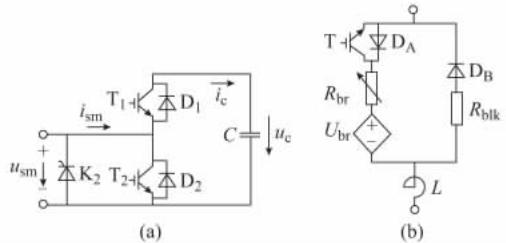
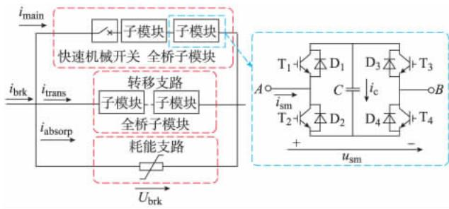
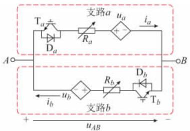
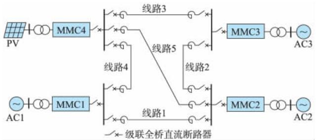
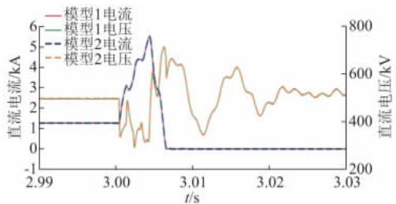

# 柔性直流电网的快速电磁暂态仿真

范新凯，王艳婷，张保会

(电力设备电气绝缘国家重点实验室(西安交通大学)，陕西省西安市 )

摘要: 柔性直流电网含多个模块化多电平换流器与直流断路器 需要快速准确的换流器与直流断路器仿真模型 为提高模块化多电平换流器的仿真速度 利用电容能量均分的思想简化子模块均压策略 并准确保留桥臂闭锁与不闭锁时的外特性 提出了一种能量均分模型。 针对级联全桥型直流断路器 给出一种断路器支路子模块串等值电路简化方法 提出了一种快速仿真模型。 在中搭建模型并进行了电磁暂态仿真 验证了所提出模型的准确性与快速性

关键词: 柔性直流电网; 模块化多电平换流器; 直流断路器; 快速仿真

# 0 引言

直流电网技术是接纳超大规模可再生能源的有效手段之一［］，采用模块化多电平换流器( )的柔性直流电网是未来的重要发展方向。 国家电网将在北京、 河北建设一个四端架空线柔性直流电网［］。 目前，直流电网控制保护原理尚不成熟，需要大量的仿真计算以设计验证，因此，研究高效准确的直流电网电磁暂态仿真方案具有重要意义

由于包含每个子模块结构的详细模型( )仿真速度缓慢，国内外文献已在 电磁暂态快速仿真方面开展了大量研究工作 文献［ ］提出了一类详细等价模型( )，将桥臂等效为受控电压源与可变电阻，具有明显的提速效果，该类模型在不需要研究桥臂内部特性及控制策略的系统中，仿真速度仍有提升空间。 文献［］在文献［］的平均值模型基础上提出了能准确描述电磁暂态的改进平均值模型，但该模型需要知道故障发生确切时间，并在故障时切换电路结构。 文献［］提出了一种数值计算平均值模型，可准确描述故障下 外特性，但在迭代过程中使用了大量乘方开方运算，仍可进一步提高 目前，国际大电网会议( )推荐使用详细等价模型代替详细模型进行直流电网电磁暂态仿真［ ］。 该模型在含有较多换流站的大规模直流电网仿真中，速度仍然十分缓慢［］

目前，工程中常用的半桥 应用于架空线

输电直流电网时，需要配置直流断路器［ ］。 由中国全球能源互联网研究院研制的级联全桥型直流断路器［12］已通过技术成果鉴定，将于舟山五端直流系统挂网运行。 直流断路器需要复杂结构制造电流过零点，开断过程复杂［ ］。 为准确描述直流电网线路故障后跳闸的整个电磁暂态过程，能表征开断特性的断路器模型必不可少。 随着直流电网规模的扩大与拓扑结构的复杂化，断路器数量也大幅增加，若采用包含断路器详细结构的模型，同样会造成仿真速度缓慢 因此，研究精确快速的断路器电磁暂态模型十分必要。

为解决大规模直流电网电磁暂态仿真缓慢的问题，本文针对 ，利用能量均分思想简化子模块均压策略并保留桥臂外特性，提出了一种能量均分模型( ) 针对级联全桥型直流断路器，给出一种断路器支路子模块串等值电路简化方法，提出了一种快速仿真模型。 在 软件中分别搭建 详细模型、详细等价模型及能量均分模型，断路器详细模型及快速仿真模型，验证了提出的模型的可靠性与快速性。

# 1 MMC 能量均分模型

# 1 1 MMC 基本结构与详细等价模型

三相MMC［ ］由6 个桥臂组成，每个桥臂包含N个子模块与一个桥臂电抗器。 其基本结构如附录图 所示。 换流器正常工作时，通过改变上、下桥臂投入子模块个数跟踪控制系统输出的正弦电压参考值。 目前，学者提出过多种子模块拓扑结构［ ］实际工程中应用最为广泛的是半桥子模块(见图( ))，其主要由绝缘栅双极型晶体管( )开关

$\mathrm { T } _ { 1 }$ 和 $\mathrm { T } _ { 2 }$ ，二极管 $\mathrm { D } _ { 1 }$ 和 $\mathrm { D } _ { 2 }$ ，电容 C 及保护晶闸管$\mathrm { K } _ { \mathfrak { p } }$ ［9］组成。 控制系统通过控制 $\mathrm { T } _ { 1 }$ 和 $\mathrm { T } _ { 2 }$ 的触发信号，决定子模块是否投入。 $i _ { \mathrm { s m } } , u _ { \mathrm { s m } } , u _ { \mathrm { c } }$ 分别为桥臂电流、子模块输出电压与电容电压。

  
图1 半桥子模块基本结构及桥臂等值电路  
Fig． 1 Basic structure of half-bridge sub-module and equivalent circuit of arm

在电磁暂态仿真的详细等价模型［］中，电容可等效为受控电压源 $u _ { \mathrm { c e q } }$ 与等效电阻 $R _ { \mathrm { c } }$ ，且满足:

$$
u _ {\mathrm {c}} (t) = R _ {\mathrm {c}} i _ {\mathrm {c}} (t) + u _ {\mathrm {c e q}} (t - \Delta T) \tag {1}
$$

$$
\left\{ \begin{array}{l} u _ {\mathrm {c e q}} (t - \Delta T) = R _ {\mathrm {c}} i _ {\mathrm {c}} (t - \Delta T) + u _ {\mathrm {c}} (t - \Delta T) \\ R _ {\mathrm {c}} = \frac {\Delta T}{2 C} \end{array} \right. \tag {2}
$$

式中 $: i _ { \mathrm { c } }$ 为电容电流; $\Delta T$ 为仿真步长。

及反并联二极管可被视为一个由开关指令控制的等值可变电阻，导通取 $R _ { \mathrm { o n } }$ ，若设关断电阻为无穷大，则当 $\mathrm { T } _ { 1 }$ 触发、 $\mathrm { T } _ { 2 }$ 闭锁时，子模块等效为受控电压源 $u _ { \mathrm { s m e q } }$ 与电阻 $R _ { \mathrm { s m e q } }$ 的串联，且

$$
\left\{ \begin{array}{l} u _ {\text {s m e q}} (t - \Delta T) = u _ {\text {c e q}} (t - \Delta T) \\ R _ {\text {s m e q}} = R _ {\mathrm {c}} + R _ {\text {o n}} \end{array} \right. \tag {3}
$$

当 $\mathrm { T } _ { 1 }$ 闭锁、 $\dot { \mathrm { \Omega } } _ { \mathrm { ~ \normalfont ~ T _ { 2 } ~ } }$ 触发时，电容未被接入，此时有

$$
\left\{ \begin{array}{l} u _ {\text {s m e q}} (t - \Delta T) = 0 \\ R _ {\text {s m e q}} = R _ {\text {o n}} \end{array} \right. \tag {4}
$$

一个桥臂输出电压为桥臂各子模块输出电压之和，桥臂等效受控电压源 $U _ { \mathrm { b r } }$ 与受控电阻 $R _ { \mathrm { b r } }$ 为:

$$
\left\{ \begin{array}{l} U _ {\mathrm {b r}} (t) = \sum_ {i = 1} ^ {N} u _ {\mathrm {s m e q}, i} (t - \Delta T) \\ R _ {\mathrm {b r}} = \sum_ {i = 1} ^ {N} R _ {\mathrm {s m e q}, i} \end{array} \right. \tag {5}
$$

的详细等价模型桥臂等值电路如图 ( )所示［］。 等值电路中， $R _ { \mathrm { b r } }$ 及 $U _ { \mathrm { b r } }$ 用于表征桥臂正常工作特性，， $\mathrm { D } _ { \mathrm { A } }$ ， $\mathrm { D } _ { \mathrm { B } }$ ， $R _ { \mathrm { b l k } }$ 用于模拟 的闭锁功能，L 为桥臂电抗器 换流器工作时，首先，由电压调制策略计算投入子模块数 $N _ { \mathrm { o n } }$ ，并利用式( )计算每个子模块电压值。 电压均衡算法对各子模块电压排序，在桥臂充电时，选择电压较低的子模块，放电时选择电压较高的子模块，得到投入子模块编号。通过式( )—式( )计算所有子模块等效电压电阻，代入式( )得桥臂等效电压源及等效电阻的控制

值。 关于直流电网建模的报告中［ ］推荐应用该类模型进行电磁暂态仿真。

详细等价模型可以精确仿真每个子模块电容电压充、放电情况，可用于电容电压均衡算法研究，且相较于详细模型，大大提高了仿真速度。 然而，在高电平数 系统中，电压均衡控制算法大量排序运算一定程度上降低了模型的计算速度。 当其应用于大规模直流电网时，该类问题更为严重［］。

# 1 2 MMC 的能量均分模型

本文通过简化详细等价模型中的电压均衡控制算法，给出了一种能量均分模型。 主要思想为认为电压均衡控制充分发挥作用，各子模块电容 C 的电压均等于 $u _ { \textup { c } }$ 。 当投入子模块数为 $N _ { \mathrm { o n } }$ 时，等效为投入了一个大小为 $C / N _ { \mathrm { o n } } \cdot$ 、电压为 $N _ { \mathrm { o n } } u _ { \mathrm { c } }$ 的电容 $C _ { \mathrm { o n } }$ 。余下未投入的电容，在迭代过程中电压不变，可等效为大小为 $C / ( N - N _ { \mathrm { o n } } )$ 、电压为 $\left( N - N _ { \mathrm { o n } } \right)  { u _ { \mathrm { c } } }$ 的电容$C _ { \mathrm { o f f } } \cdot$ 。 当完成一步迭代后，根据能量守恒原则，将投入与未投入的电容能量平均分配给各子模块 具体算法如下。

假定上一仿真时刻，所有子模块电容电压均为$u _ { \mathrm { c } } \left( t - \Delta t \right)$ ，则等效的投入电容 $C _ { \mathrm { o n } }$ n的电压 $u _ { \mathrm { c o n } }$ 满足:

$$
u _ {\text {c o n}} (t) = R _ {\text {c o n}} i _ {\mathrm {c}} (t) + u _ {\text {c e q o n}} (t - \Delta T) \tag {6}
$$

$C _ { \mathrm { o n } }$ 的等效电压源 $u _ { \mathrm { c e q o n } }$ 与电阻 $R _ { \mathrm { c o n } }$ 分别取:

$$
u _ {\text {c e q o n}} (t - \Delta T) = R _ {\text {c o n}} i _ {\mathrm {c}} (t - \Delta T) + N _ {\text {o n}} u _ {\mathrm {c}} (t - \Delta T) \tag {7}
$$

$$
R _ {\mathrm {c o n}} = N _ {\mathrm {o n}} R _ {\mathrm {c}} \tag {8}
$$

对于 $C _ { \mathrm { o f f } }$ ，其电压为:

$$
u _ {\mathrm {c o f f}} (t) = N _ {\mathrm {o f f}} u _ {\mathrm {c}} (t - \Delta T) \tag {9}
$$

$$
N _ {\text {o f f}} = N - N _ {\text {o n}} \tag {10}
$$

将 $C _ { \mathrm { o n } }$ 和 $C _ { \mathrm { o f f } }$ 能量平均分配给各子模块，有

$$
\frac {1}{2} N C u _ {\mathrm {c}} ^ {2} (t) = \frac {1}{2} C _ {\mathrm {o n}} u _ {\mathrm {c o n}} ^ {2} (t) + \frac {1}{2} C _ {\mathrm {o f f}} u _ {\mathrm {c o f f}} ^ {2} (t) \tag {11}
$$

若直接使用式( )计算 $u _ { \textup { c } }$ ，需要用到开方运算，可进行进一步简化。 将上式中 $C _ { \mathrm { o n } }$ 和 $C _ { \mathrm { o f f } }$ 展开并变换为:

$$
\sqrt {N} u _ {\mathrm {c}} (t) = \left(\frac {u _ {\text {c o n}} (t)}{\sqrt {N _ {\text {o n}}}}\right) \sqrt {1 + \left(\frac {\sqrt {N _ {\text {o n}}}}{\sqrt {N _ {\text {o f f}}}} \frac {u _ {\text {c o f f}} (t)}{u _ {\text {c o n}} (t)}\right) ^ {2}} \tag {12}
$$

由于电容电压不会突变，故

$$
\left\{ \begin{array}{l} \frac {u _ {\text {c o f f}} (t)}{u _ {\text {c o n}} (t)} \approx \frac {N _ {\text {o f f}}}{N _ {\text {o n}}} \\ \frac {\sqrt {N _ {\text {o n}}} u _ {\text {c o f f}} (t)}{\sqrt {N _ {\text {o f f}}} u _ {\text {c o n}} (t)} \approx \sqrt {\frac {N _ {\text {o f f}}}{N _ {\text {o n}}}} \end{array} \right. \tag {13}
$$

将式( )最右侧开方项在 $\sqrt { N _ { \mathrm { o f f } } / N _ { \mathrm { o n } } }$ 处泰勒展 开，并保留一阶项，化简后可得:

$$
u _ {\mathrm {c}} (t) = \frac {u _ {\text {c o n}} (t) + u _ {\text {o f f}} (t)}{N} \tag {14}
$$

由于反并联二极管的存在，电容电压不可能为负值，为保证迭代正确，当 $u _ { \mathrm { c } } \left( t \right) < 0$ 时，置 $u _ { \mathrm { c } } \left( t \right)$ 为桥臂等值电路采用与详细等价模型相同的结构，取

$$
U _ {\mathrm {b r}} (t) = u _ {\mathrm {c e q o n}} (t - \Delta T) \tag {15}
$$

$$
R _ {\mathrm {b r}} = N R _ {\mathrm {o n}} + R _ {\mathrm {c o n}} \tag {16}
$$

$$
R _ {\mathrm {b l k}} = N R _ {\mathrm {o n}} \tag {17}
$$

能量均分模型与详细等价模型类似，利用受控电压源及电阻代替子模块详细结构进行仿真，大大降低了运算量。 保留了 电路主体结构，可用于换流器稳态及外部故障情况下换流器特性等研究。 同时，相较于详细等价模型，能量均分模型省略了复杂的电压均衡控制算法，可进一步加快仿真速度 。

# 1 3 MMC 能量均分模型验证

一般直流电网具有 个或以上换流站，规模较大，难以进行详细模型的仿真并用其进行校验，故分别采用详细模型 详细等价模型与能量均分模型在搭建双端直流系统，其结构见附录图 直流系统两端交流额定电压 ，采用伪双极接线，额定容量 ，额定直流电压250 kV，架空线输电，长度 200 km，仿真步长10 μs，时长 。 程序运行于 位系统，处理器为 ，内存 ， 版本为V4.6.0。

本文于附录 图 中给出了 电平时 种模型直流故障时的仿真波形对比。 其结果可以说明，无论换流器是否闭锁，详细等价模型及能量均分模型与详细模型计算结果高度一致

附录 表 给出了基于详细等价模型与能量均分模型的 至 电平系统在发生极间金属性短路故障未闭锁时，正极直流电压 电流与详细模型仿真结果比较所得的残差可信度指标 $\boldsymbol { \Phi } ^ { [ 1 5 ] }$ ，其定义为:

$$
\left\{ \begin{array}{l} \varphi = \sum_ {i = 1} ^ {N} \gamma_ {i} x _ {i} \\ \gamma_ {i} = \frac {\mid y _ {i} \mid}{\sum_ {i = 1} ^ {N} \mid y _ {i} \mid} \\ x _ {i} = 1 - \frac {\mid y _ {i} - \hat {y} _ {i} \mid}{\max (\mid y _ {i} \mid , \mid \hat {y} _ {i} \mid)} \end{array} \right. \tag {18}
$$

式中 $: y _ { i }$ 取详细模型计算结果 $; \hat { y } _ { i }$ 取详细等价模型或能量均分模型计算结果。 $\varphi$ 值越接近 ，仿真精度

越高 。

从附录 表 可以看出，在不同电平下，详细等价模型与能量均分模型均具有较高的仿真精度，且误差水平没有明显差异。

附录 表 给出了 至 电平数下的仿真耗时。 从中可知，本文提出的能量均分模型具有良好的加速效果，且仿真耗时几乎不随电平数增加而增加。 当达到  电平时，相比于详细等价模型，提速 倍以上。

附录 表 给出了不同仿真步长下 电平时详细等价模型与能量均分模型的仿真耗时及精度。 从中可以看出，采用不同仿真步长时， 种模型有相近的仿真精度，且本文提出的能量均分模型仿真速度始终快于详细等价模型。 另外，当仿真步长增大超过 μ 后， 种模型仿真精度均出现明显下降。 而当仿真步长小于 $1 0 ~ \mu \mathrm { s }$ 时，仿真耗时大大增加，精度却没有明显提高。 故推荐仿真步长介于$1 0 \sim 2 5 ~ \mu \mathrm { s }$ 之间。

通过本节的仿真波形及结果对比可知，详细等价模型与能量均分模型在仿真步长低 $\mp 2 5 ~ \mu \mathrm { s }$ 时均具有良好的仿真精度，且能量均分模型具有更好的加速效果，可应用于高电压等级大规模柔性直流电网的稳态及故障情况下的电磁暂态仿真。

# 2 级联全桥型直流断路器快速仿真模型

# 2 1 基本工作原理

级联全桥型直流断路器及全桥子模块的结构如图2［ ］所示。 该型直流断路器包含由快速机械开关和少量全桥子模块组成，用于导通直流系统负荷电流的主支路，由多级全桥子模块组成的转移支路，以及由多个避雷器组串并联构成的耗能支路 图中 $: i _ { \mathrm { b r k } }$ 为流过断路器的总电流; $; i _ { \mathrm { m a i n } }$ 和 $i _ { \mathrm { t r a n s } }$ 分别为主支路和转移支路电流; $U _ { \mathrm { b r k } }$ 为断路器两端电压

  
图2 级联全桥型直流断路器及全桥子模块拓扑结构   
Fig． 2 Structures of cascaded full-bridge DC breaker and full-bridge sub-module

正常工作时，各支路子模块串内所有 被触发，由于主支路的通态压降小于转移支路，负荷电

流经主支路流通。 开断电流时，首先闭锁主支路子模块，电流由主支路转移到转移支路，并开始分断快速机械开关。 当快速机械开关达到耐压要求，闭锁转移支路子模块，分断短路电流。 开断过程中，直流系统中感性元件中的能量被避雷器吸收。

# 2 2 级联全桥型直流断路器快速仿真模型的等效方法

对于全桥子模块，当 $\mathrm { T } _ { 1 }$ 至 $\mathrm { T } _ { 4 }$ 均被触发时，电流从 或反并联二极管中流过，电容被短接，电压为 ，全桥子模块可等效为阻值为 倍电力电子器件导通电阻 $R _ { \mathrm { o n } }$ 的电阻。 当全桥子模块被闭锁时，若$u _ { \mathrm { s m } }$ 高于电容电压 $u _ { \textup { c } }$ ，电流经 $\mathrm { D } _ { 1 } , C , \mathrm { D } _ { 4 }$ 从A 端流向 B端，当 $- \mathrm { \Delta } u _ { \mathrm { s m } }$ 高于电容电压 $u _ { \textup { c } }$ ，电流经 $\mathrm { D } _ { 3 } , C , \mathrm { D } _ { 2 }$ 从 B端流向 A 端。 此时，满足:

$$
u _ {\mathrm {s m}} (t) = 2 i _ {\mathrm {s m}} (t) R _ {\mathrm {o n}} + \operatorname {s g n} \left(i _ {\mathrm {s m}} (t)\right) u _ {\mathrm {c}} (t) \tag {19}
$$

$$
u _ {\mathrm {c}} (t) = u _ {\mathrm {c}} (t - \Delta t) + \frac {1}{C} \int_ {t - \Delta t} ^ {t} | i _ {\mathrm {s m}} (t) | \mathrm {d} t \tag {20}
$$

式中: ( · )为符号函数。

根据全桥子模块特点，设计全桥子模块等值电路如图 所示。

  
图3 全桥型子模块等值电路  
Fig． 3 Equivalent circuit of full-bridge sub-module

等值电路由 条支路组成，每个支路包含用于模拟子模块触发或关断 及二极管，模拟各种情况下电力电子器件及电容等效电阻的可变电阻，和模拟电容电压的受控电压源，且取 $R _ { a } = R _ { b } = R , u _ { a }$ $= u _ { b } = u$ 。 根据前文分析，当子模块不闭锁时，触发$\mathrm { T } _ { a }$ 与 $\mathrm { T } _ { b }$ ，取 $R = 2 R _ { \mathrm { o n } } , u = 0$ 。 当子模块闭锁时，关断$\mathrm { T } _ { a }$ 与 $\mathrm { T } _ { b } :$ ，当 $u _ { A B } > u$ 时，电流从支路 a 流过， ${ \dot { \iota } } _ { b } = 0$ ，当$- { \boldsymbol { u } } _ { A B } > u$ 时，电流从支路 b 流过， $\ i _ { a } \ = 0$ 。 根据式( )—式( )离散化表达形式可得:

$$
u (t) = R _ {\mathrm {c}} \left(i _ {a} (t - \Delta T) + i _ {b} (t - \Delta T)\right) + u _ {\mathrm {c}} (t - \Delta T) \tag {21}
$$

$$
u _ {\mathrm {c}} (t) = u (t - \Delta T) + R _ {\mathrm {c}} \left(i _ {a} (t) + i _ {b} (t)\right) \tag {22}
$$

$$
R = 2 R _ {\mathrm {o n}} + R _ {\mathrm {c}} \tag {23}
$$

对于 N 个全桥子模块串联而成的子模块串，由于串的所有 均同时被触发或关断，在忽略元器件误差的情况下，所有子模块电力电子器件导通

关断情况相同，电容在任何时刻均流过相同大小的电流，故各子模块电容电压相等。 整个串仍可等值为图 所示电路，此时 $R _ { a }$ 和 $R _ { b }$ 值取 $R ^ { \prime }$ ，将 $u _ { a }$ 和 $u _ { b }$ 值取 $u ^ { \prime }$ ，其中

$$
\left\{ \begin{array}{l} u ^ {\prime} (t) = N u (t) \\ R ^ {\prime} = N R \end{array} \right. \tag {24}
$$

# 2 3 模型验证

为验证断路器快速仿真模型，于中搭建测试电路［ ］。 仿 真 平 台 条 件 同节，仿真时长 。 测试电路结构及功能见附录 图 。

直流断路器额定电压 ，主支路含 个子模块，转移支路含 个子模块，避雷器保护水平。 模拟系统于 时发生短路故障，后检测到故障电流后开始对电流进行分断，闭锁主支路子模块，   后快速机械开关开断完成，闭锁转移支路子模块［ ］，故障后5 ms 时，断路器完全开断 。

附录 图 ( )展示了包含每一个子模块元件的断路器详细模型开断时断路器电压、流过断路器总电流及 条支路的电流波形，附录 图 ( )给出了采用等值电路的断路器快速仿真模型在相同条件下的仿真波形。 通过对比可以看出， 种模型具有高度一致的仿真结果。 快速模型相对详细模型断路器电压 $U _ { \mathrm { b r k } }$ 和电流 $i _ { \mathrm { m a i n } }$ 计算结果残差可信度指标分别为 和 ，具有较高的仿真精度。 同时，仿真运行时间由详细模型的缩减到 ，速度加快约 倍。

# 3 快速仿真方法在直流电网模型中的应用

本文采用的直流电网结构如图 所示。

  
图4 直流电网结构示意图  
Fig． 4 Structure of DC grid

系统额定电压 ，包含 个 换流站、 条直流母线与 条直流架空输电线路，采用对称双极结构 母线与换流阀间及直流线路间均配有直流断路器，正负极共计 台。 为限制短路电流，直流线路两端配有限流电抗器［］。 换流站 MMC1

至 连接至交流电网，采用电压裕度控制。 正常工作时， 为主站，控制直流电压， 和控制有功功率。 连接至孤岛运行的额定容量为 的光伏电站，采用定交流母线电压频率的控制方式。 各站参数如附录 表 所示，线路参数如附录 表 所示

在 中搭建直流电网模型，由于系统换流站数较多，且电平数较高，运算量巨大，采用详细模型仿真耗时已不能接受。 故模型 换流站采用 详细等价模型［］，直流断路器采用详细模型，模型 采用本文提出的 能量均分模型与直流断路器快速仿真模型。 将模型 与模型 对比，证明仿真的正确性与快速性。 仿真条件同节，考察直流电网在正常工作时的功率波动及故障后响应。

附录 图 展示了直流电网模型正常工作时功率波动下各站输入功率与正极直流母线电压。 从中可以看出，模型 与模型 得到相同的仿真结果。当光伏电站出力减小时， 站提高功率输出，维持电网功率平衡。 在整个波动过程中，各站直流电压基本维持稳定，显示出直流电网良好的控制性能。

图 展示了直流电网模型在故障期间线路 正极 站侧的直流电压及电流波形。 系统运行至 时，线路 中点正极发生金属性接地短路。故障后 系统检测到故障，向线路 正极两端断路器发出跳令，闭锁断路器主支路子模块，跳开快速机械开关。 故障后 ，机械开关断开完毕，闭锁断路器转移支路子模块，至故障后 ，断路器完全断开。 从图中可看出，模型 与模型 具有高度一致的仿真结果。

  
图5 直流电网线路故障暂态状态  
Fig． 5 Transient state during DC line fault

通过对模型 与模型 正常工作及故障情况下的计算结果进行对比，可知在直流电网仿真中，本文提出的 能量均分模型与 推荐的详细等价模型具有高度接近的仿真结果，直流断路器快速仿真模型亦能准确地描述断路器开断过程 对于一个时长 的仿真，模型 耗时 ，模型耗时 ，仿真速度相较模型 提高约 倍，加速

效果明显。 因此，模型 采用的能量均分模型与直流断路器快速仿真模型组成的直流电网仿真方案在高电平数架空线直流电网系统中具有良好的应用效果 。

# 4 结论

本文针对 提出了一种能量均分模型，针对级联全桥型直流断路器，提出了一种快速断路器仿真模型。 对提出模型精度与加速效果进行验证，并将其应用于架空线输电柔性直流电网电磁暂态仿真中，得出如下结论。

)所提出的 能量均分模型具有与已有的详细等价模型相近的仿真精度，在仿真步长低于 时具有良好的仿真精度 同时，能量均分模型较详细模型最高提速 倍，较详细等价模型最高提速 倍，且仿真时间基本不受电平数影响，在高电平数 系统中具有良好的应用效果。  
)提出了断路器快速仿真模型能够准确描述级联全桥型断路器开断过程，同时仿真速度加快约倍 。  
)将所提出的 能量均分模型与断路器快速仿真模型应用于架空线输电柔性直流电网中，在直流电网正常工作与故障状态下取得了与采用详细等价模型和详细断路器模型相一致的仿真结果，同时仿真速度提升约 倍。  
)涉及子模块内部故障的电磁暂态过程较为复杂，目前尚未见到有数学模型能对该情况进行有效的描述，包括其引起的 换流站内部故障及级联全桥型断路器失灵等问题，有待进一步研究。

附 录 见 本 刊 网 络 版 ( http: / /www． aeps-info．com/aeps /ch/index.aspx）。

# 参 考 文 献

［1］汤广福，贺之渊，庞辉． 柔性直流输电工程技术研究 应用及发展［］ 电力系统自动化， ， ( ):  
TANG Guangfu，HE Zhiyuan，PANG Hui． Research，application and development of VSC-HVDC engineering technology [J]. Automation of Electric Power Systems，2013，37(15）:3-14.   
［2］孙栩，曹士冬，卜广全，等． 架空线柔性直流电网构建方案［J］．电网技术，2016，40(3):678-682．  
SUN Xu，CAO Shidong，BU Guangquan，et al.Constructionscheme of overhead line flexible HVDC grid［J］． Power System， ， ( ):  
［3］GNANARATHNA U N，GOLE A M，JAYASINGHE R P． Efficient modeling of modular multilevel HVDC converters ( MMC ) on electromagnetic transient simulation programs [J]．IEEE Trans on ， ， ( ):   
［4］许建中，赵成勇，GOLE A M． 模块化多电平换流器戴维南等效整

体建模方法［］ 中国电机工程学报， ， ( ):  
XU Jianzhong，ZHAO Chengyong，GOLE A M.Research on theThévenin’s equivalent based integral modelling method of the［ ］    ， ，( ):  
［5］ AJAEI F B， IRAVANI R． Enhanced equivalent model of the modular multilevel converter［J］． IEEE Trans on Power Delivery， ， ( ):   
［］唐庚，徐政，刘昇 改进式模块化多电平换流器快速仿真方法［］ 电力系统自动化， ， ( ): :AEPS20131204005.  
TANG Geng， XU Zheng， LIU Sheng． Improved fast model ofmodular multilevel converter ［J］ Automation of Electric Power， ， ( ) :  :AEPS20131204005.  
［7］ XU J，GOLE A M，ZHAO C． The use of averaged-value model ofmodular multilevel converter in DC Grid ．IEEE Trans on Power， ， ( ):  
8]PERALTA J，SAAD H，DENNETIERE S，et al．Detailed and averaged models fora 401-evel MMC-HVDC system [J]．IEEE Trans on Power Delivery，2012，27(3）:1501-1508.   
［9］喻锋，王西田，林卫星，等． 模块化多电平换流器快速电磁暂态仿真模型［］ 电网技术， ， ( ):  
YU Feng，WANG Xitian，LIN Weixing，et al. Fast electromagnetic transient simulation models of modular multilevel converter [J]. Power System Technology，2015，39(1): 257-263．   
[10]Working Group B4-57.Guide for the development of models for HVDC converters in a HVDC grid [R].2014.   
［11］刘剑，邰能灵，范春菊． 柔性直流输电线路故障处理与保护技术评述［］ 电力系统自动化， ， ( ): :10.7500/AEPS20150125002.  
LIU Jian，TAI Nengling，FAN Chunju. Comments on fault handingand technology for VSC-HVDC transmission lines  Automation ofElectric Power Systems，2015，39(20)：158-l67．DOI:10.7500/AEPS20150125002.  
［12］魏晓光，高冲，罗湘，等． 柔性直流输电网用新型高压直流断路器设计方案［］ 电力系统自动化， ， ( ):

WEI Xiaoguang,GAO Chong,LUO Xiang，et al．A novel designof high-voltage DC circuit breaker in HVDC flexible transmission［］     ， ， ( ) :95-02.  
［13］史宗谦，贾申利． 高压直流断路器研究综述［J］． 高压电器，， ( ):  
SHI Zongqian， JIA Shenli.Research on high-voltage direct current circuit breaker:a review []．High Voltage Apparatus，2015，51 (11): 1-9．   
［ ］杨晓峰，郑琼林，薛尧，等 模块化多电平换流器的拓扑和工业应用综述［］ 电网技术， ， ( ):  
YANG Xiaofeng，ZHENG T Q，XUE Yao，et al． Review ontopology and industry applications of modular multilevel converter［］   ， ， ( ):  
［15］贾旭东，李庚银，赵成勇，等． 电力系统仿真可信度评估方法的研究［］ 中国电机工程学报， ， ( ):  
JIA Xudong，LI Gengyin，ZHAO Chengyong，et al．Study of the credibility evaluation method for the power system simulation ]. Proceedings of the CSEE，2010，30(19）:51-57.   
［16］魏晓光，杨兵建，贺之渊，等． 级联全桥型直流断路器控制策略及其动态模拟试验［］ 电力系统自动化， ， ( ):135.DOI:10.7500/AEPS20150630010.  
WEI Xiaoguang，YANG Bingjian，HE Zhiyuan，et al．Control strategy and physical dynamic simulation of cascaded full-bridge DC circuit breaker [J]．Automation of Electric Power Systems, 2016，40(1）:129-135．DOI:10.7500/AEPS20150630010.

范新凯( —) 男 通信作者 硕士研究生 主要研究方向: 柔性直流输电系统。 :

王艳婷( —) 女 博士研究生 主要研究方向: 高压直流输电线路保护。 :

张保会( 1953—) 男 教授 博士生导师 主要研究方向: 电力系统继电保护、 安全稳定控制和电力系统通信。E-mail:bhzhang@ mail.xjtu.edu.cn

( 编辑 蔡静雯)

# Fast Electromagnetic Transient Simulation for Flexible DC Power Grid

FAN Xinkai，WANG Yanting，ZHANG Baohui

(         ( ’  ) ， ’ ， )

Abstract :              ， of converter and DC breaker are needed． For the sake of accelerating the simulation of modular multilevel converters，an energy equiparitionmodelisproposedbyqualdistributionofteowerofcapacitortosmplifythevoltagebalancingcontrolandetaining the externalcharacteristicofthebridgearminblockedandunblockedstatus.AsforthecascadedfullbidgeDCbreaker，afastsimulation modelisdevelopedbysimplifyingthefullbridgesub-modulesinbreakersub-circuits.Electromagnetic transientsimulationson PSCAD/EMTDC are carried out to verify the accuracy and acceleration of the proposed model.

This work is supported by National Key Research and Development Program of China ( No． 2016YFB0900600 ) and National Natural Science Foundation of China （No. 51577148）.

K ey words :    ;   ;  ;