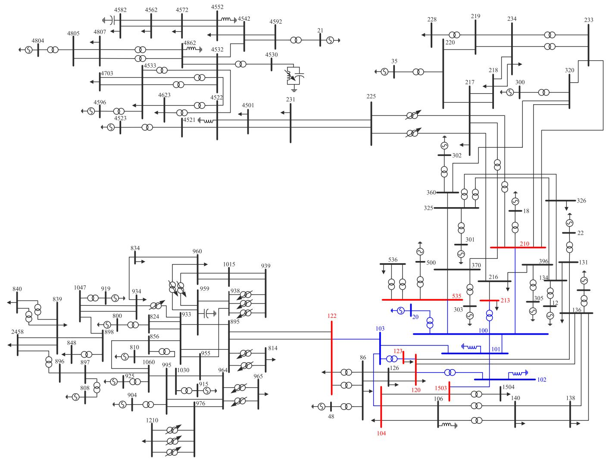
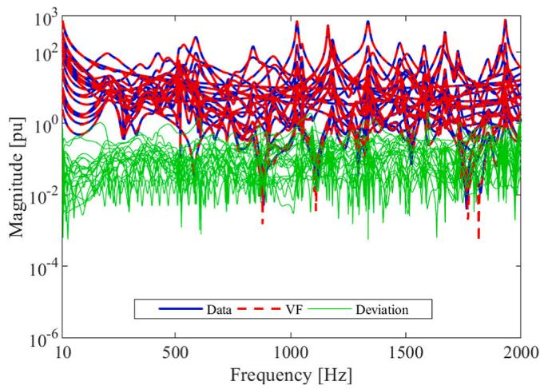
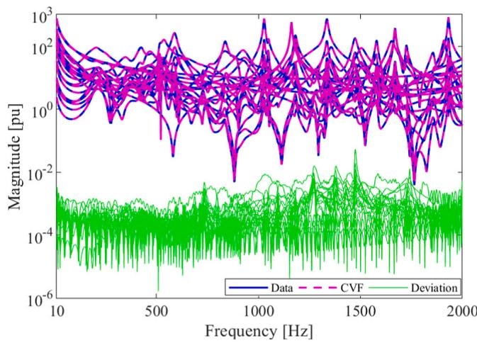
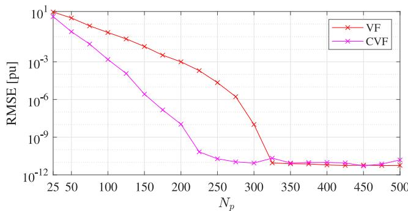
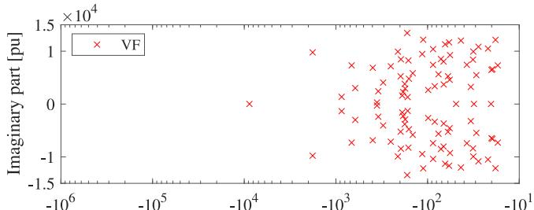
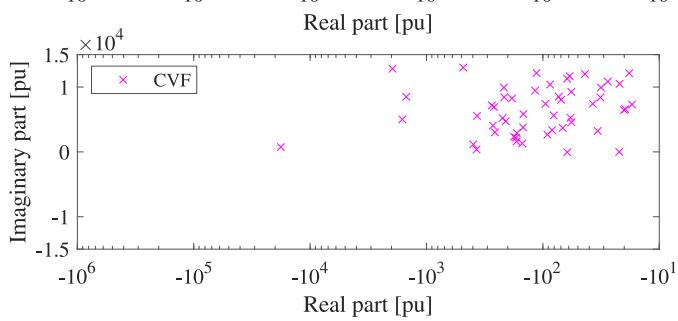
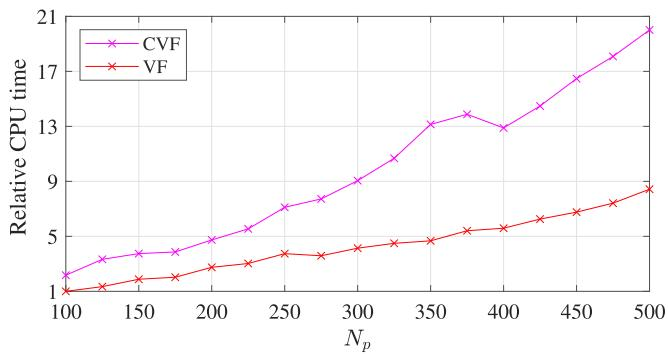
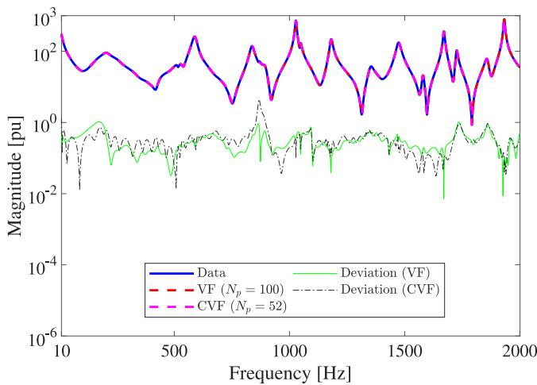
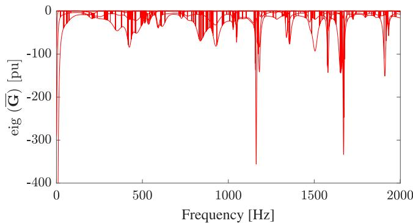
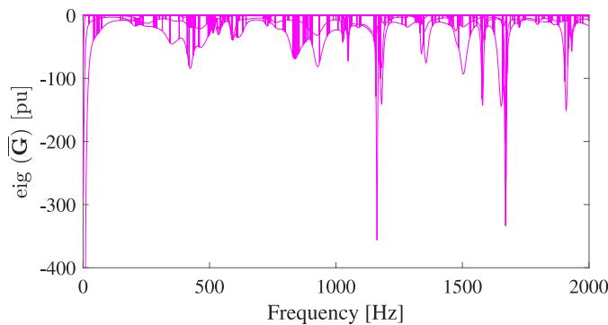

# Enhancing computation performance of rational approximation for frequency-dependent network equivalents with parallelism and complex vector fitting✩

Alexandre A. Kida a,b,∗, Felipe N.F. Dicler c, Thomas M. Campello c,d, Loan T.F.W. Silva c, Antonio C.S. Lima c, Fernando A. Moreira a, Robson F.S. Dias c, Glauco N. Taranto c

a Federal University of Bahia, UFBA, BA, Brazil   
b Federal Institute of Bahia, IFBA, BA, Brazil   
c Federal University of Rio de Janeiro, COPPE/UFRJ, RJ, Brazil   
d CEFET/RJ – Federal Center for Technological Education Celso Suckow da Fonseca, RJ, Brazil

# A R T I C L E I N F O

Keywords:

Complex vector fitting

Electromagnetic transients

Frequency-domain realization

Vector fitting

Parallelization

# A B S T R A C T

This work examines two strategies for enhancing the rational approximation of Frequency-Dependent Network Equivalents (FDNE) using an 8-port FDNE featuring a frequency response marked by numerous peaks and valleys. Firstly, we employ Complex Vector Fitting (CVF), an alternative to the Vector Fitting (VF). CVF eliminates the constraint of complex conjugate pairs and was originally conceived for modeling baseband equivalents through scattering parameters. The implications of CVF for admittance (or impedance) matrix synthesis have not yet been previously reported in specialized literature. To enhance code performance and remove dependence on commercial software such as MATLAB®, VF and CVF were implemented in the Clanguage, utilizing a low-level linear algebra package and exploiting parallelism. We evaluated performance by varying the model order, number of ports, and frequency samples. The results confirm the feasibility of our approach, prompting a more in-depth exploration of the potential benefits regarding FDNE realization.

# 1. Introduction

Power systems are undergoing significant transformations, marked by the increasing adoption of converter-based generation and HVDC technologies, alongside increasing environmental constraints [1]. These transformations introduce new network dynamics, emphasizing the necessity for a comprehensive network representation to ensure accurate modeling. However, electromagnetic transient (EMT) phenomena may have extensive frequency bandwidth. Thus, modeling an entire electric power system with such a detailed representation greatly increases the model complexity. In addition, simulation times can be impractical, especially for statistical cases and sensitivity analysis [2].

Therefore, it is convenient to separate the electrical power system into two subsystems [3]. The first one is the study system, which is modeled in detail, including its nonlinearities. The second subsystem, known as the external system, is characterized by a Frequency-Dependent Network Equivalent (FDNE). This system encompasses the

remainder of the network and has linear and time-invariant characteristics, tailored for analyzing EMT phenomena. The buses connecting the study and external systems are called boundary buses (or equivalent ports). The selection of these ports considers the interest area where an EMT phenomenon or equipment will be analyzed.

Typically, the external area is represented by a simplified shortcircuit equivalent at grid frequency, preserving only the fundamental frequency characteristics of the external area. On the other hand, FDNEs maintain their characteristics across a wide range of frequencies, offering higher accuracy [4]. Among the available methods for obtaining FDNEs, rational models (RMs) have been extensively utilized for this purpose and other important applications [5].

Another method for obtaining FDNEs involves solving a system of differential–algebraic equations, typically derived from a circuit model formulation. This approach yields a complex equation set, often simplified using model order reduction (MOR) techniques. The resulting

∗ Corresponding author at: Federal Institute of Bahia, IFBA, BA, Brazil.

E-mail address: alexandre.kida@ifba.edu.br (A.A. Kida).

equations can be directly integrated into an EMT solver like ATP, EMTP or PSCAD, or synthesized as an equivalent circuit. However, most commercial programs lack external equation exporting capabilities. As an alternative, frequency scan tools within these programs, along with curve fitting methods, are commonly employed to approximate the system frequency response and obtain an FDNE [5].

The RM employing curve fitting methods for realizing FDNE has been under considerable investigation in recent years. In addition to the pole-relocation algorithm, known as Vector Fitting (VF) [6–8], the Frequency-partitioning Fitting [3,9], the Matrix Pencil Method [10] and the Loewner Matrix [11] have been applied successfully to RM. Interested readers should check [4,12] for a detailed comparison of these formulations. However, irrespective of the chosen approach, there are two common challenges.

The first challenge regards the necessity for a post-processing routine to enforce passivity [13–19]. The second concern revolves around the significant decrease in numerical performance as the number of ports increases. To address the latter, [9] suggests two enhancements for the VF: a stop criterion for iterative process and a modification that leverages frequency partitioning and MOR, grounded in balanced truncation [20]. Alternatively, to improve the numerical performance, one may also consider a parallelization of the VF algorithm [21].

Concerning passivity, the expected behavior from the resulting RM implies that it must absorb active power under any given set of applied voltages, regardless of frequency. Thus, the passivity is essential to ensure stable time-domain simulations [22]. This topic has received considerable attention in the literature [23,24].

Passivity violations of an RM might occur outside the frequency range of interest, regardless of the accuracy of the model. Furthermore, enforcing passivity might deteriorate the overall quality of the RM. The specifics of when passivity breaks down depend on the particular RM being analyzed. For models with very low orders, this issue arises from insufficient fitting precision, leading to eigenvalues of the RM that fail to adequately approximate the original eigenvalues of the frequency response. As a result, passivity violations can occur at any point within the fitting range. Passivity violations in models with very high orders often happen beyond the fitting range, as they incorporate poles with resonant frequencies outside this range, leading to uncontrolled responses beyond it [25].

This study explores strategies to improve the performance (speed and accuracy) of RMs by exploiting parallelization and leveraging on the Complex Vector Fitting (CVF) [26]. While both algorithms share a similar underlying framework, CVF differs from VF in that it does not impose complex conjugacy constraints on poles (and residues). The implications of applying CVF to admittance (Y) parameters systems will be investigated, given its successful application in modeling baseband photonic systems characterized by their scattering (S) parameters [26–28]. Furthermore, while $\mathbf { M A T L A B } ^ { \textregistered }$ scripts for both VF [29] and CVF [27] are freely available, they rely on commercial software for implementation. To address this limitation, we implement parallelization techniques based on freely distributed C-language libraries.

This paper is organized as follows. Section 2 shows the theoretical groundwork for frequency-domain realization, including the CVF method, passivity criteria and strategies for parallelization. Following this, Section 3 delves into the modeling of an 8-port FDNE used for results validation. In Section 4, the numerical results and discussions regarding the proposed approach are presented. Finally, the key insights and conclusions are summarized in Section 5.

# 2. Mathematical modeling

# 2.1. Frequency-domain realization

The approximation of an NxN Multiple-Input Multiple-Output Transfer Function (MIMO TF) Y(s) by an RM ??(??) is given by

$$
\mathbf {Y} (s) \approx \overline {{\mathbf {Y}}} (s) = \sum_ {n = 1} ^ {N _ {p}} \frac {\mathbf {R} _ {\mathbf {n}}}{s + p _ {n}} + \mathbf {D} + s \mathbf {E}, \tag {1}
$$

where $s = j \omega \in \mathbb { C } ,$ , ?? is the angular frequency in rad/s, $\overline { { \mathbf { Y } } } ( s ) \in \mathbb { C } ^ { N \times N }$ is the approximated (fitted) nodal admittance, $N _ { p }$ is the number of poles (model order), ?? ${ \bf \Psi } ) \in \mathbb { R } ^ { N \times N }$ and ${ \bf E } \in \mathbb { R } ^ { N \times N }$ are positive definite matrices, $p _ { n }$ is the ??th pole and ${ \mathbf { R } } _ { n } \in \mathbb { C } ^ { N \times N }$ is the associated ??th residues matrix.

The expression in (1) can be converted from the pole-residue realization to a state-space formulation [30–33], such as

$$
\dot {\mathbf {x}} (t) = \mathbf {A} \mathbf {x} (t) + \mathbf {B} \mathbf {u} (t), \tag {2}
$$

$$
\mathbf {y} (t) = \mathbf {C} ^ {T} \mathbf {x} (t) + \mathbf {D u} (t) + \mathbf {E} \dot {\mathbf {u}} (t), \tag {3}
$$

where $\mathbf { A } \in \mathbb { C } ^ { N \cdot N _ { p } \times N \cdot N _ { p } }$ is a diagonal matrix containing all poles, ?? is the number of ports, $\mathbf { x } ( \mathbf { t } ) \in \mathbb { C } ^ { N }$ is the state variable vector, ??̇ (??) is the time derivative of $\mathbf { x } ( \mathbf { t } ) , \mathbf { u } ( \mathbf { t } ) \in \mathbb { C } ^ { N }$ is the input vector, ?? $\in \mathbb { C } ^ { N \cdot N _ { p } \times N }$ is a matrix with ones and zeros, ?? corresponds to the transpose operator, $\mathbf { C } \in \mathbb { R } ^ { N \cdot N _ { p } \times N }$ is a matrix having all $\mathbf { R _ { n } }$ and $\mathbf { y } ( \mathbf { t } ) \in \mathbb { C } ^ { N }$ is the output vector.

Applying the Laplace transform to (2) and (3) yields

$$
(s \mathbf {I} - \mathbf {A}) \mathbf {x} (s) = \mathbf {B} \mathbf {u} (s), \tag {4}
$$

$$
\mathbf {y} (s) = \mathbf {C} ^ {T} \mathbf {x} (s) + \mathbf {D u} (s) + s \mathbf {E u} (s), \tag {5}
$$

where $\mathbf { I } \in \mathbb { Z } ^ { N \cdot N _ { p } \times N \cdot N _ { p } }$ is the identity matrix.

Solving (4) for ??(??), substituting in (5) and considering that the input ??(??) are the voltages at boundary buses and the output ??(??) are the currents injected in those buses, obtains ??(??) as

$$
\overline {{\mathbf {Y}}} (s) = \mathbf {C} (s \mathbf {I} - \mathbf {A}) ^ {- 1} \mathbf {B} + \mathbf {D} + s \mathbf {E}. \tag {6}
$$

Similarly, the pole-residue formulation can be obtained from the state-space formulation as demonstrated in [33].

The matrices in (6) are obtained with the VF (or CVF) by solving an over-determined linear system. The dimensions of this system are directly proportional to $N \cdot N _ { p } ,$ and the complexity of the VF algorithm is not less than $O ( N ^ { 2 } )$ [21].

# 2.2. Complex vector fitting

In contrast to the VF, the CVF accommodates the modeling of nonphysical systems, like those operating at baseband frequencies, which lack Hermitian symmetry [26]. This flexibility is achieved by relaxing the conjugacy constraint imposed on VF, which forces poles with nonzero imaginary parts (complex poles) to manifest as complex conjugate pairs. The same considerations can be extended to the residues. Due to the conjugacy constraint relaxation, baseband models achieved with CVF are complex-valued, presenting complex impulse responses even for real-valued inputs [34].

The CVF also integrates improvements from VF, including the relaxation of the non-triviality constraint for enhanced convergence [35] and QR decomposition for improved numerical performance [8].

The baseband modeling may find application in electric power systems within a framework known as Shifted Frequency Analysis (SFA) [36–40] developed in [38]. In this framework, voltages and currents in a power system are represented by frequency-shifted analytic signals. Such signals, akin to an FDNE, are inherently band-limited, offering advantages in accuracy and computational efficiency for simulations of complex electrical systems within their frequency band of interest [2]. While the usage of complex-valued arithmetic increases computational and memory usage, the baseband modeling diminishes the maximum frequency of interest, allowing the usage of larger time steps without compromising accuracy [38].

# 2.3. Passivity assessment

Given $\overline { { \mathbf { G } } } ( s ) = \mathbb { R } ( \overline { { \mathbf { Y } } } ( s ) ) \in \mathbb { R } ^ { N \times N }$ , with eigenvalues $\lambda ( s ) = \mathrm { e i g } ( \overline { { { \bf G } } } ( s ) )$ , a system is passive if $\overline { { \mathbf { G } } } _ { n } ( s )$ is positive definite, that is $\lambda ( s ) > 0$ for all frequencies [15].

  
Fig. 1. Single-line diagram of the Test-system.

A straightforward method for evaluating passivity involves frequency sweeping the singular values of $\overline { { \mathbf { G } } } _ { n } ( s ) .$ . However, this approach is slow and also does not guarantee that the sampling is fine enough to capture all regions where passivity violations $\left( \lambda ( s ) \ < \ 0 \right)$ occur. Those regions indicate the frequencies where the equivalent model will generate, instead of consume, active power. This might lead to instability in time-domain simulations, even if the RM only contains stable poles $\left( \mathbb { R } ( p _ { n } ) < 0 \right)$ [22].

Analytically, the passivity violation regions can be identified through the cross-over frequencies, computed via singular values (purely imaginary eigenvalues) of the Hamiltonian matrix $\mathbf { H } \in \mathbb { C } ^ { 2 N \cdot N _ { p } ^ { \mathbf { \tilde { \alpha } } } \times 2 N \cdot \Breve { N } _ { p } }$ [34], where

$$
\mathbf {H} = \left[ \begin{array}{c c} \mathbf {A} - \mathbf {B} (\mathbf {D} + \mathbf {D} ^ {\mathbf {h}}) ^ {- 1} \mathbf {C} & \mathbf {B} (\mathbf {D} + \mathbf {D} ^ {\mathbf {h}}) ^ {- 1} \mathbf {B} ^ {\mathbf {h}} \\ - \mathbf {C} ^ {\mathbf {h}} (\mathbf {D} + \mathbf {D} ^ {\mathbf {h}}) ^ {- 1} \mathbf {C} & - \mathbf {A} ^ {\mathbf {h}} + \mathbf {C} ^ {\mathbf {h}} (\mathbf {D} + \mathbf {D} ^ {\mathbf {h}}) ^ {- 1} \mathbf {B} ^ {\mathbf {h}} \end{array} \right], \tag {7}
$$

where ?? corresponds to the complex conjugate transpose operator.

The primary distinction between (7) and the Hamiltonian matrix employed in VF [15] lies in the utilization of ?? instead of ??, attributed to the complex-valued nature of systems without Hermitian symmetry [34]. Consequently, CVF cannot exploit the efficient halfsize singularity test used for passivity assessment in VF [15], as it is designed only for real-valued systems [26].

# 2.4. Parallelization

A multi-port structure can be conceptualized as a series of interconnected yet distinct subsystems. Thus, it is feasible to apply a

parallelization algorithm, either VF or CVF, by dividing the complete system into subsystems. By integrating these subsystems into a comprehensive model, state-space realizations with increased sparsity are achieved, facilitating parallel execution.

VF and CVF algorithms are implemented in C-language using LA-PACK linear algebra functions from the Intel® oneAPI Math Kernel Library. This library is widely employed for its high-performance numerical computing capabilities and is conveniently freely accessible at [41].

To enhance performance, the parallelism strategy outlined in [21] is adopted, which highlighted the QR decomposition as the most computationally intensive step of the VF algorithm in terms of number of floating-point operations accounting for over 95% of the VF execution time in virtually all analyzed cases. The same consideration can be extended to the CVF.

Given the nearly diagonal block structure of the matrix employed for system pole identification, it becomes feasible to execute the QR decomposition in parallel for each block [8]. OpenMP directives preceding relevant for-loops are employed for parallelization, requiring minimal alterations to the original code structure. This approach ensures an efficient parallel implementation of the VF and CVF algorithms.

# 3. Electrical system under consideration

The electrical network under analysis is referred to as the Testsystem and it is depicted in Fig. 1, where the external area, study area

Table 1 Comparison performance between VF and the CVF.   

<table><tr><td>Method</td><td>Np</td><td>RMSE (pu)</td><td>RRMSE (%)</td><td>Relative CPU time</td></tr><tr><td>VF</td><td>100</td><td>0.2127</td><td>0.5319</td><td>1.00</td></tr><tr><td>CVF</td><td>100</td><td>0.0015</td><td>0.0037</td><td>2.18</td></tr></table>

and boundary buses are delineated in black, blue and red, respectively. The Test-system includes 107 buses, 104 transmission lines, 9 shunt branches (either capacitor or reactor banks), 67 transformers, 1 static compensator, 39 loads and 24 synchronous generators [9].

The external area is modeled using an 8-port FDNE, covering a frequency range from 10 Hz to 2 kHz with sampling intervals of 1 Hz. The model encompasses 36 scalar MIMO TFs of $\mathbf { Y } ( s ) ,$ with 15 of them being null. This reduces the problem to 21 unique frequency responses, akin to a 6-port FDNE $( N ~ = ~ 6 )$ , as the number of distinct transfer functions ?????? ?? is

$$
N D T F = N (N + 1) / 2. \tag {8}
$$

# 4. Numerical results and discussion

This paper adopts Root Mean Square Error (RMSE) and Relative Root Mean Square Error (RRMSE) metrics for evaluating the fitting accuracy of $\overline { { \mathbf { Y } } } ( s ) ,$ as shown in (9) and (10), respectively. The former quantifies the average magnitude of errors between fitted and measured values, providing a straightforward measure of model fitting. In contrast, the RRMSE scales the RMSE with the RMS of the observed data, providing a normalization and facilitating more meaningful comparisons of errors across datasets.

$$
R M S E ^ {(i)} = \sqrt {\frac {\sum_ {q = 1} ^ {N} \sum_ {m = 1} ^ {N} \sum_ {k = 1} ^ {N _ {S}} \left| \overline {{\mathbf {Y}}} _ {\mathbf {q m}} ^ {(i)} (s) - \mathbf {Y} _ {\mathbf {q m}} (s) \right| ^ {2}}{N _ {T F} N _ {S}}}, \tag {9}
$$

where $R M S E ^ { ( i ) }$ is the RMSE at the ??th iteration, $N _ { s }$ is the number of frequency samples and $N _ { T F }$ is the number of scalar TF. $\overline { { \mathbf { Y } } } _ { \mathbf { q m } } ( s )$ （24号 and $\mathbf { Y _ { q m } } ( s )$ are the fitted and frequency response data admittance, respectively, between ports ?? and ??.

$$
R R M S E ^ {(i)} = \sqrt {\frac {\sum_ {q = 1} ^ {N} \sum_ {m = 1} ^ {N} \sum_ {k = 1} ^ {N _ {S}} \left| \overline {{\mathbf {Y}}} _ {\mathbf {q m}} ^ {(i)} (s) - \mathbf {Y} _ {\mathbf {q m}} (s) \right| ^ {2}}{\sum_ {q = 1} ^ {N} \sum_ {m = 1} ^ {N} \sum_ {k = 1} ^ {N _ {S}} \left| \mathbf {Y} _ {\mathbf {q m}} (s) \right| ^ {2}}}, \tag {10}
$$

where ?????? $S E ^ { ( i ) }$ is the RRMSE at the ??th iteration.

The computational efficiency is also meticulously scrutinized. For a fair comparison, we employ for VF and CVF the same number of iterations (10), model order $( N _ { p } ~ = ~ 1 0 0 )$ and initial set of linearspaced complex-conjugated poles, unless specified otherwise. The RMs are strictly proper $( \mathbf { D } \neq 0$ and ${ \bf E } = 0 )$ . Numerical computations were executed on an 8-core Ryzen 7 5800X @ 3.80 GHz, with 16 GB of RAM and $\mathbf { M A T L A B } ^ { \textregistered }$ R2019b.

# 4.1. Fitting accuracy

The magnitude of the frequency responses of VF and CVF are depicted in Fig. 2 and Fig. 3, respectively. Those illustrations depict that the error associated with VF is approximately two orders of magnitude greater than that obtained using CVF, across the specified frequency range. Quantitatively, the accuracy metrics presented in Table 1 validate the observed disparity in error discrepancy between both techniques. Specifically, the RRMSE of the CVF indicates that for $N _ { p } = 1 0 0$ , the error is nearly negligible, suggesting that the model order can be further reduced while maintaining satisfactory accuracy.

The behavior of RMSEs concerning model order is illustrated in Fig. 4, where $2 5 \leq N _ { p } \leq 5 0 0 ,$ in increments of 25. This depiction shows that RMSEs associated with VF are noticeably superior to those attained

  
Fig. 2. Magnitude of frequency response, using VF.

  
Fig. 3. Magnitude of frequency response, using CVF.

  
Fig. 4. RMSE vs model order for VF and CVF.

with CVF for $2 5 \leq N _ { p } \leq 3 0 0$ . Both methodologies show similar RMSE for $N _ { p } \geq 3 2 5 .$ . The same conclusions can be extended for the RRMSE as both techniques share the same Y(s) as input.

The resulting poles placement for VF and CVF are illustrated in Fig. 5. As anticipated, the poles of the former exhibit symmetry around the imaginary axis, whereas those of the latter do not.

  
Fig. 5. Poles of the VF (top) and CVF (bottom).

  
Fig. 6. Relative CPU time vs model order for VF and CVF. Results are scaled to the CPU time of the VF with $N _ { p } = 1 0 0$ .

# 4.2. Computational performance

# 4.2.1. Vector fitting vs complex vector fitting

From the optimization standpoint, relaxing the complex conjugate constraint streamlines the optimization problem by increasing the solution search space. The effective number of variables for the VF $( N V ^ { V F } )$ ) is

$$
N V ^ {V F} = N R P + N C P / 2, \tag {11}
$$

where ?????? and ?????? are the number of real and complex conjugate poles, respectively.

For the VF, the ?????? is divided by the factor of two in (11), as the poles must come as complex conjugate pairs. In contrast, the effective number of variables for the CVF $( N V ^ { C V F } )$ is

$$
N V ^ {C V F} = N R P + N C P = N _ {p}. \tag {12}
$$

Fig. 6 illustrates that the CPU time required for both techniques increases with $N _ { p } .$ Additionally, CVF was consistently slower than ${ \mathrm { V F } } ,$ , for the same $N _ { p } .$ This discrepancy arises due to $N V ^ { C V F } > N V ^ { V F }$ when complex poles are employed.

# 4.2.2. Model order reduction

The $N V ^ { V F }$ and $N V ^ { C V F }$ are 52 $( N R P ~ = ~ 4$ and $N C P ~ = ~ 9 6 ) ~ $ and 100 $( N R P = 0$ and $N C P \ = \ 1 0 0 )$ , respectively. To simplify the mathematical model, while preserving its core characteristics, a model

Table 2 Comparison between VF and the CVF with model order reduction.   

<table><tr><td>Method</td><td>Np</td><td>RMSE (pu)</td><td>RRMSE (%)</td><td>Relative CPU time</td></tr><tr><td>VF</td><td>100</td><td>0.2127</td><td>0.5319</td><td>1.00</td></tr><tr><td>CVF</td><td>52</td><td>0.2106</td><td>0.5338</td><td>1.06</td></tr></table>

  
Fig. 7. Magnitude of frequency response for the element $\overline { { Y } } _ { 1 , 1 }$ using different number of poles for VF and CVF.

order reduction (MOR) is applied to the CVF, reducing $N _ { p }$ from 100 to 52, as $N R P = 4 .$ Theoretically, the maximum achievable MOR using CVF is 50%, when the RM contains only complex poles. The results in Table 2 highlight that even with a reduced order, CVF has comparable performance to VF with a higher order.

The results depicted in Fig. 7 contrasts the magnitude of frequency response of $\mathbf { Y } _ { 1 , 1 } ( s )$ using VF $( N _ { p } = 1 0 0 )$ and CVF $( N _ { p } = 5 2 )$ . Notably, despite a reduction of 48 poles in CVF, the congruence between both fittings remains consistent across the considered frequency range.

# 4.2.3. Parallelism

The CVF implementation introduces a trade-off: while it enhances accuracy, it makes the fitting process slower. To overcome this issue, Parallel Vector Fitting (PVF) and Parallel Complex Vector Fitting (PCVF) were implemented in C-language using the methodology described in Section $2 . 4 .$ .

Eighteen cases based on the Test-system were employed to investigate the scalability of the proposed methodology across various scenarios. These cases were generated by altering the number of poles $( 1 0 0 \leq N _ { p } \leq 3 0 0 )$ , the effective number of ports $( 2 \leq N \leq 6 )$ and the frequency samples $( 1 9 9 1 \le N _ { s } \le 1 9 9 9 1 )$ .

The performance results between the $\mathbf { M A T L A B } ^ { \textregistered }$ scripts (VF[29] and CVF [27]) and the proposed implementation (PVF and PCVF) are summarized in Table 3. It is noteworthy that linear algebra and numerical functions such as ??????, ??????, and ???????? have been natively multi-threaded in MATL $\mathbf { A B } ^ { \mathbb { ( B ) } }$ since version R2008a [42].

Three main observations emerge upon analyzing the effects of individually increasing $N _ { p } ,$ ?? or $N _ { s }$ at Table 3.

Firstly, CPU times grew alongside these variables. This behavior is expected as the computational complexity scales quadratically with the number of poles and linearly with the number of MIMO TFs (8), frequency samples and iterations [21].

Secondly, the speed-up observed for most PVF and PCVF cases was more pronounced for smaller $N _ { p } ,$ ?? or $N _ { s } .$ . For instance, when comparing Case 1 with Case 3 (where ?? increases from 2 to 6), the speed-up (VF/PVF) decreases from 3.00 to 1.78, respectively. Similarly, comparing Case 5 with Case 14 (where $N _ { s }$ increases from 1991 to

Table 3 Summary of the computational performance for VF, PVF, CVF and PCVF, considering one iteration.   

<table><tr><td>Case</td><td>Np</td><td>N</td><td>Ns</td><td>VFa(s)</td><td>PVFb(s)</td><td>Speed-upc</td><td>CVFa(s)</td><td>PCVFb(s)</td><td>Speed-upd</td></tr><tr><td>1</td><td>100</td><td>2</td><td>1991</td><td>0.18</td><td>0.06</td><td>3.00</td><td>0.28</td><td>0.15</td><td>1.87</td></tr><tr><td>2</td><td>100</td><td>4</td><td>1991</td><td>0.28</td><td>0.17</td><td>1.65</td><td>0.80</td><td>0.46</td><td>1.74</td></tr><tr><td>3</td><td>100</td><td>6</td><td>1991</td><td>0.64</td><td>0.36</td><td>1.78</td><td>1.52</td><td>0.91</td><td>1.67</td></tr><tr><td>4</td><td>200</td><td>2</td><td>1991</td><td>0.32</td><td>0.16</td><td>2.00</td><td>0.77</td><td>0.43</td><td>1.79</td></tr><tr><td>5</td><td>200</td><td>4</td><td>1991</td><td>0.81</td><td>0.45</td><td>1.80</td><td>2.28</td><td>1.31</td><td>1.74</td></tr><tr><td>6</td><td>200</td><td>6</td><td>1991</td><td>1.68</td><td>0.93</td><td>1.81</td><td>4.51</td><td>2.68</td><td>1.68</td></tr><tr><td>7</td><td>300</td><td>2</td><td>1991</td><td>0.55</td><td>0.30</td><td>1.83</td><td>1.51</td><td>0.87</td><td>1.74</td></tr><tr><td>8</td><td>300</td><td>4</td><td>1991</td><td>1.58</td><td>0.88</td><td>1.80</td><td>4.52</td><td>2.77</td><td>1.63</td></tr><tr><td>9</td><td>300</td><td>6</td><td>1991</td><td>2.94</td><td>1.75</td><td>1.68</td><td>8.98</td><td>5.70</td><td>1.58</td></tr><tr><td>10</td><td>100</td><td>2</td><td>19991</td><td>1.20</td><td>0.50</td><td>2.40</td><td>2.41</td><td>1.39</td><td>1.73</td></tr><tr><td>11</td><td>100</td><td>4</td><td>19991</td><td>2.52</td><td>1.40</td><td>1.80</td><td>6.74</td><td>4.85</td><td>1.39</td></tr><tr><td>12</td><td>100</td><td>6</td><td>19991</td><td>4.92</td><td>2.97</td><td>1.66</td><td>13.40</td><td>8.65</td><td>1.55</td></tr><tr><td>13</td><td>200</td><td>2</td><td>19991</td><td>2.70</td><td>1.43</td><td>1.89</td><td>8.10</td><td>4.82</td><td>1.68</td></tr><tr><td>14</td><td>200</td><td>4</td><td>19991</td><td>6.70</td><td>4.36</td><td>1.54</td><td>21.54</td><td>14.95</td><td>1.44</td></tr><tr><td>15</td><td>200</td><td>6</td><td>19991</td><td>13.58</td><td>8.78</td><td>1.55</td><td>43.65</td><td>30.50</td><td>1.43</td></tr><tr><td>16</td><td>300</td><td>2</td><td>19991</td><td>5.55</td><td>2.97</td><td>1.87</td><td>16.22</td><td>10.61</td><td>1.53</td></tr><tr><td>17</td><td>300</td><td>4</td><td>19991</td><td>13.86</td><td>8.77</td><td>1.58</td><td>45.58</td><td>32.17</td><td>1.42</td></tr><tr><td>18</td><td>300</td><td>6</td><td>19991</td><td>29.89</td><td>17.90</td><td>1.67</td><td>90.68</td><td>68.75</td><td>1.32</td></tr></table>

a MATLAB® implementation.   
b Proposed implementation.   
c Computed by VF/PVF.   
d Computed by CVF/PCVF.

Table 4 Passivity violations metrics.   

<table><tr><td>Method</td><td>Min. λ(s)</td><td>Mean λ(s) &lt; 0</td><td>Count λ(s) &lt; 0</td></tr><tr><td>VF</td><td>-2914.4</td><td>-39.656</td><td>25501</td></tr><tr><td>CVF</td><td>-2889.6</td><td>-39.650</td><td>25524</td></tr></table>

19991), the speed-up (CVF/PCVF) decreases from 1.74 to 1.44, respectively. Also, when comparing Case 1 with Case 7 (where $N _ { p }$ increases from 100 to 300), the speed-up (VF/PVF) decreases from 3.00 to 1.83. In such instances, more mathematical operations are needed. Thus, the communication overhead between parallel processes can cause dependency bottlenecks that limit parallelization efficiency.

Lastly, parallelization consistently reduced CPU times across all cases. In worst-case scenarios, Case 14 and Case 18, speed-up reached 1.54 (VF/PVF) and 1.32 (CVF/PCVF), respectively. Conversely, the best-case scenario (Case 1) yielded speed-up values of 3.00 (VF/PVF) and 1.87 (CVF/PCVF).

Overall, the proposed implementation offered a straightforward and effective solution to enhance the computational performance of FDNE realization.

# 4.3. Passivity

As mentioned in Section 2, passivity violations, if present, can be identified by the singular values of ?? or by conducting a frequency sweep on the eigenvalues ??(??) of $\begin{array} { l } { \displaystyle \overline { { \mathbf { G } } } ( s ) . } \end{array}$ . Figs. 8 and 9 illustrate the passivity violations $( \lambda ( s ) < 0 )$ for VF and CVF, respectively, using a frequency sweep from 10 Hz to 2 kHz, with a resolution of 0.2 Hz. To enhance clarity and avoid using a negative log scale, the ??-axis was truncated at −400 pu. The synthesized RM is non-passive across the entire frequency range of interest.

Although both techniques yield non-passive models, they do not necessarily exhibit the same passivity characteristics. To illustrate this point, we developed three passivity metrics Min. ??(??), Mean. ??(??) and Count $\lambda ( s ) < 0 $ using the previously computed ??(??) The first metric indicates the most significant passivity violation. The second metric represents the average values of passivity violations. Finally, the last metric denotes the number of passivity violations.

Table 4 presents these passivity metrics for both VF and CVF, with the latter showing smaller yet noticeable passivity differences compared to the former across all metrics provided.

  
Fig. 8. Passivity of $\overline { { \mathbf { G } } } ( s )$ using VF.

  
Fig. 9. Passivity violations of $\overline { { \mathbf { G } } } ( s )$ using CVF.

# 5. Conclusions

This paper shows that Complex Vector Fitting (CVF) consistently outperforms Vector Fitting (VF) in terms of accuracy in the rational model synthesis of a Nodal Admittance Multiple-input Multiple-output $\overline { { \mathbf { Y } } } ( s )$ for the same number of poles $( N _ { p } ) .$ . However, CVF increases the computational burden due to the increased number of variables for the same $N _ { p }$ and it leads to complex impulse responses. CVF shows promise in reducing model order (up to 50%), while achieving performance comparable to VF with fewer poles. Our results demonstrate that even with a 48% reduction in model order, the CVF maintains fitting

accuracy and computational performance similar to VF. Additionally, differences in passivity characteristics can be observed when comparing VF and CVF. Finally, the parallel implementations of VF and CVF (PVF and PCVF) in C-language using LAPACK and OpenMP directives are straightforward and further enhance computational efficiency, eliminating the need for reliance on commercial software like MATLAB®. For future work, the authors intend to incorporate additional techniques for FDNE rational modeling and compare their performance against the CVF method.

# CRediT authorship contribution statement

Alexandre A. Kida: Conceptualization, Data curation, Formal analysis, Investigation, Methodology, Project administration, Supervision, Validation, Writing – original draft, Writing – review & editing. Felipe N.F. Dicler: Conceptualization, Data curation, Investigation, Software, Validation, Visualization, Writing – original draft, Writing – review & editing. Thomas M. Campello: Conceptualization, Data curation, Formal analysis, Investigation, Methodology, Validation, Writing – original draft, Writing – review & editing. Loan T.F.W. Silva: Conceptualization, Data curation, Formal analysis, Validation, Writing – original draft, Writing – review & editing. Antonio C.S. Lima: Conceptualization, Data curation, Formal analysis, Investigation, Methodology, Project administration, Writing – original draft, Writing – review & editing. Fernando A. Moreira: Conceptualization, Data curation, Formal analysis, Investigation, Methodology, Project administration, Writing – original draft, Writing – review & editing. Robson F.S. Dias: Conceptualization, Supervision, Writing – original draft, Writing – review & editing. Glauco N. Taranto: Supervision, Writing – original draft, Writing – review & editing, Conceptualization, Project administration.

# Declaration of competing interest

The authors declare that they have no known competing financial interests or personal relationships that could have appeared to influence the work reported in this paper.

# Data availability

No data was used for the research described in the article.

# References

[1] M. Paolone, T. Gaunt, X. Guillaud, M. Liserre, S. Meliopoulos, A. Monti, T. Van Cutsem, V. Vittal, C. Vournas, Fundamentals of power systems modelling in the presence of converter-interfaced generation, Electr. Power Syst. Res. 189 (April) (2020) 106811.   
[2] A.C. Lima, F. Camara, J.P. Salvador, M.T.C. de Barros, Frequency-dependent equivalent based on idempotent decomposition and grouping, Electr. Power Syst. Res. 189 (2020) 106800.   
[3] T. Noda, Identification of a multiphase network equivalent for electromagnetic transient calculations using partitioned frequency response, IEEE Trans. Power Deliv. 20 (2) (2005) 1134–1142.   
[4] T. Campello, F. Dicler, S. Varricchio, H. de Barros, C. Costa, A. Lima, G. Taranto, Reviewing the large electrical network equivalent methods under development for electromagnetic transient studies in the Brazilian interconnected power system, Int. J. Electr. Power Energy Syst. 151 (2023) 109033.   
[5] S. Grivet-Talocia, B. Gustavsen, Black-box macromodeling and its EMC applications, IEEE Electromagn. Compat. Mag. 5 (2016) 71–78.   
[6] B. Gustavsen, A. Semlyen, Rational approximation of frequency domain responses by vector fitting, IEEE Trans. Power Deliv. 14 (3) (1999) 1052–1061.   
[7] B. Gustavsen, Improving the pole relocation properties of vector fitting, IEEE Trans. Power Delivery 21 (3) (2006) 1587–1592.   
[8] D. Deschrijver, M. Mrozowski, T. Dhaene, D. De Zutter, Macromodeling of multiport systems using a fast implementation of the vector fitting method, IEEE Microw. Wirel. Compon. Lett. 18 (6) (2008) 383–385.   
[9] T. Campello, S. Varricchio, G. Taranto, A. Ramirez, Enhancements in vector fitting implementation by using stopping criterion, frequency partitioning and model order reduction, Int. J. Electr. Power Energy Syst. 120 (2020) 105905.

[10] K. Sheshyekani, H.R. Karami, P. Dehkhoda, M. Paolone, F. Rachidi, Application of the matrix pencil method to rational fitting of frequency-domain responses, IEEE Trans. Power Deliv. 27 (4) (2012) 2399–2408.   
[11] M. Kabir, R. Khazaka, Macromodeling of distributed networks from frequencydomain data using the loewner matrix approach, IEEE Trans. Microw. Theory Tech. 60 (12) (2012) 3927–3938.   
[12] J. Morales Rodriguez, E. Medina, J. Mahseredjian, A. Ramirez, K. Sheshyekani, I. Kocar, Frequency-domain fitting techniques: A review, IEEE Trans. Power Deliv. 35 (3) (2020) 1102–1110.   
[13] B. Gustavsen, Computer code for passivity enforcement of rational macromodels by residue perturbation, IEEE Trans. Adv. Packag. 30 (2) (2007) 209–215.   
[14] D. Deschrijver, T. Dhaene, D. De Zutter, Robust parametric macromodeling using multivariate orthonormal vector fitting, IEEE Trans. Microw. Theory Tech. 56 (7) (2008) 1661–1667.   
[15] B. Gustavsen, Fast passivity enforcement for pole-residue models by perturbation of residue matrix eigenvalues, IEEE Trans. Power Delivery 23 (3) (2008) 2278–2285.   
[16] A. Semlyen, B. Gustavsen, A half-size singularity test matrix for fast and reliable passivity assessment of rational models, IEEE Trans. Power Delivery 24 (1) (2009) 345–351.   
[17] B. Gustavsen, Passivity enforcement by residue perturbation via constrained non-negative least squares, IEEE Trans. Power Deliv. 36 (5) (2021) 2758–2767.   
[18] T. Bradde, S. Grivet-Talocia, A. Zanco, G.C. Calafiore, Data-driven extraction of uniformly stable and passive parameterized macromodels, IEEE Access 10 (2022) 15786–15804.   
[19] L.P.R.K. Ihlenfeld, G.H.C. Oliveira, Completion-based passivity enforcement for multiport networks rational models, IEEE Trans. Power Deliv. 36 (4) (2021) 2213–2220.   
[20] W.H. Schilders, H.A. Van der Vorst, J. Rommes, Model Order Reduction: Theory, Research Aspects and Applications, vol. 13, Springer, 2008.   
[21] A. Chinea, S. Grivet-Talocia, On the parallelization of vector fitting algorithms, IEEE Trans. Compon. Packag. Manuf. Technol. 1 (11) (2011) 1761–1773.   
[22] B. Gustavsen, A. Semlyen, Enforcing passivity for admittance matrices approximated by rational functions, IEEE Trans. Power Syst. 16 (1) (2001) 97–104.   
[23] A. Semlyen, B. Gustavsen, A half singularity test matrix for fast and reliable passivity assessment of rational models, IEEE Trans. Power Syst. 24 (1) (2009) 345–351.   
[24] J. Morales, J. Mahseredjian, K. Sheshyekani, AbnerRamirez, E. Medina, I. Kocar, Pole-selective residue perturbation technique for passivity enforcement of FDNEs, IEEE Trans. Power Syst. 33 (6) (2018) 2746–2754.   
[25] J.M. Rodríguez, Computation of Frequency Dependent Network Equivalents Using Vector Fitting, Matrix Pencil Method and Loewner Matrix (Ph.D. thesis), Université de Montréal, Montreal, Canada, 2019.   
[26] Y. Ye, D. Spina, D. Deschrijver, W. Bogaerts, T. Dhaene, Time-domain compact macromodeling of linear photonic circuits via complex vector fitting, Photonics Res. 7 (7) (2019) 771.   
[27] D. Spina, Y. Ye, D. Deschrijver, W. Bogaerts, T. Dhaene, Complex vector fitting toolbox: a software package for the modelling and simulation of general linear and passive baseband systems, Electron. Lett. 57 (10) (2021) 404–406.   
[28] Y. Ye, T. Ullrick, W. Bogaerts, T. Dhaene, D. Spina, SPICE-compatible equivalent circuit models for accurate time-domain simulations of passive photonic integrated circuits, J. Lightwave Technol. 40 (24) (2022) 7856–7868.   
[29] B. Gustavsen, The Vector Fitting Website, Sintef, 2008, [Online]. Available https://www.sintef.no/projectweb/vectorfitting/.   
[30] B. Gustavsen, A. Semlyen, Simulation of transmission line transients using vector fitting and modal decomposition, IEEE Trans. Power Deliv. 13 (1998) 605–614.   
[31] B. Gustavsen, Time delay identification for transmission line modeling, in: Signal Propagation on Interconnects, 2004. Proceedings. 8th IEEE Workshop on, 2004, pp. 103–106.   
[32] B. Gustavsen, H.M.J. De Silva, Inclusion of rational models in an electromagnetic transients program: Y-parameters, Z-parameters, S-parameters, transfer functions, IEEE Trans. Power Deliv. 28 (2) (2013) 1164–1174.   
[33] T. Campello, S. Varricchio, G. Taranto, Three-phase frequency-dependent network equivalents in the ATP for lumped parameter systems using descriptor formulation, rational models, and symmetrical component data, J. Control Autom. Electr. Syst. 32 (2021) 1690–1703.   
[34] Y. Ye, D. Spina, Y. Xing, W. Bogaerts, T. Dhaene, Numerical modeling of a linear photonic system for accurate and efficient time-domain simulations, Photon. Res. 6 (6) (2018) 560–573.   
[35] B. Gustavsen, Relaxed vector fitting algorithm for rational approximation of frequency domain responses, in: Signal Propagation on Interconnects, 2006. IEEE Workshop on, 2006, pp. 97–100.   
[36] K. Strunz, R. Shintaku, F. Gao, Frequency-adaptive network modeling for integrative simulation of natural and envelope waveforms in power systems and circuits, IEEE Trans. Circuits Syst. I. Regul. Pap. 53 (12) (2006) 2788–2803.   
[37] F. Gao, K. Strunz, Frequency-adaptive power system modeling for multiscale simulation of transients, IEEE Trans. Power Syst. 24 (2) (2009) 561–571.

[38] P. Zhang, J.R. Marti, H.W. Dommel, Shifted-Frequency Analysis for EMTP Simulation of Power-System Dynamics, IEEE Trans. Circuits Syst. I. Regul. Pap. 57 (9) (2010) 2564–2574.   
[39] J.R. Marti, H.W. Dommel, B.D. Bonatto, A.F.R. Barrete, Shifted Frequency Analysis (SFA) concepts for EMTP modelling and simulation of Power System Dynamics, in: 2014 Power Systems Computation Conference, IEEE, 2014, pp. 1–8.

[40] F. Camara, A.C. Lima, K. Strunz, Multi-scale formulation of admittance-based modeling of cables, Electr. Power Syst. Res. 195 (2021) 107120.   
[41] Intel, Intel OneAPI Math Kernel Library, Intel, 2023, [Online]. Available https: //www.intel.com/content/www/us/en/developer/tools/oneapi/onemkl.html.   
[42] Mathworks, The MATLAB Multicore, Sintef, 2023, [Online]. Available https: //www.mathworks.com/discovery/matlab-multicore.html.