# 大规模交直流电网电磁暂态数模混合仿真平台构建及验证

# （二）直流输电工程数模混合仿真建模及验证

朱艺颖1 于 钊2 李柏青1 郭 强1 谢国平1 林少伯1

（1．电网安全与节能国家重点实验室（中国电力科学研究院有限公司） ， 北京市100192；

2．国家电网有限公司 ， 北京市100031）

摘要 ： 特高压电网的快速发展对直流输电工程动态特性的仿真提出了更高需求 文中提出了接入多直流控制保护的大规模交直流电网数模混合仿真平台建设技术方案 并从直流输电工程控制保护装置简化原则 数模混合仿真接口技术 直流输电系统一次建模要求等方面提出了适用于接入大规模仿真电网的直流输电工程数模混合仿真建模方法 选择宾金特高压直流工程现场调试的典型故障 将直流输电工程数模混合仿真结果与现场波形进行了详细对比 对比结果表明直流输电数模混合仿真模型的动态响应特性与实际工程的动作特性高度吻合 能够真实再现实际系统情况 可以较为准确地仿真交直流相互影响的现象 为交直流电网安全稳定运行提供强有力的技术支撑 同时可以作为其他数字仿真模型的校准工具

关键词 ： 直流输电工程； 数模混合仿真； 控制保护装置； 仿真建模； 模型验证

# 0 引言

为满足未来持续增长的电力需求 实现更大范围的资源优化配置 ， 推动电力工业技术创新和能源的高效开发利用 促进经济社会可持续发展和全面建设小康社会 国家电网有限公司提出了加快建设以百万伏级交流和±800kV级直流系统特高压电网为核心的坚强电网的战略思想［1］ 随着特高压电网的快速发展 国家电网呈现出交直流混联的显著特征 在传统交流系统运行特性的基础上 交直流之间 多回直流之间的相互耦合 直流送受端间的相互影响等新特性逐渐显现 并随着直流输电规模的提升日趋复杂 已成为影响大电网安全稳定的关键因素［2］ 准确地认识和把握交直流电网的机理 特性关乎特高压电网安全和运行效率 是发展规划 调度运行必须着重考虑的问题 准确的仿真手段是人们认识电网的有力工具［3］ 针对中国目前特高压交直流电网的实际情况 在进行电网安全稳定仿真研究中 对直流输电工程动态特性的仿真提出了更高需求 ［4－6］ 。

大规模交直流电网电磁暂态数模混合仿真平台构建及验证内容共分为两篇文章进行描述 上一

篇［7］主要描述仿真平台整体构架及大规模交直流电网仿真验证 本文主要描述直流输电工程数模混合仿真建模及验证

本文从直流输电工程控制保护装置简化原则数模混合仿真接口技术 直流输电系统一次建模要求 模型功能试验等方面 提出了直流输电工程数模混合仿真建模方法 为了校验模型的动态响应特性与实际工程的一致性 选择宾金特高压直流工程现场调试的典型故障 将直流输电工程数模混合仿真结果与现场波形进行了详细对比 对比结果表明 直流输电数模混合仿真模型的动态响应特性与实际工程的动作特性高度吻合 能够真实再现实际系统情况 可以较为准确地仿真交直流相互影响的动态特性，同时可以作为其他数字仿真模型的校准工具

# 1 接入多套直流工程控制保护装置的大规模交直流电网数模混合仿真

对于直流输电仿真 在进行大电网运行特性研究时 用数字模型来仿真直流输电系统的一次部分也已经能够真实模拟暂 稳态下系统的运行特性 而对于直流输电控制保护系统 采用将实际控制器接入数字电网的数模混合仿真是对实际电网特性较真实的模拟［8］ 对于研究多直流落点的电网来说 将多套直流控制保护装置接入交直流仿真电网的实时仿真 是研究大规模交直流电网交互特性的较为准

确的手段［9－10］

数模混合仿真所用的实际直流控制保护仿真系统除了取消控制保护配置冗余外 其结构 硬件及软件包括编译环境和系统软件与实际功能控制保护系统是一致的 故其在性能上与实际控制保护系统具有很好的一致性 为了能高效真实地模拟实际电网特性，在仿真技术允许的前提下，较准确的方案便是将电网中在运的全部直流工程的控制保护装置均接入数字仿真电网

# 2 直流输电工程控制保护仿真装置简化原则

实际直流输电工程控制保护屏柜的总数量超过200面，这是因为实际控制保护系统进行了分区控制及保护 每个区域均配置了控制保护系统 而且每个区域均配置了3套保护系统 采用三取二的动作策略 每套保护的测量回路是独立的；同时控制系统配置互为备用的2套系统， 每套控制系统的测量回路均是独立的［11］ 从软件上来说 互为备用的控制主机软件是一样的 另外， 控制保护系统还包括冷却系统控制等与直流输电系统运行特性不直接相关的部分

对于直流输电数模混合仿真模型中使用的实际控制保护装置来说 无需考虑运行的可靠性及测量回路的独立性 也无需考虑与直流系统运行特性不直接相关的部分 因此可以在确保与现场控制保护装置动作特性一致的前提下 进行大幅简化 简化原则如下

1）所有分区的控制保护系统均保留一套 ， 每套包含一套主机 主机所含的软件略做修改 如保护主机去除三取二逻辑 控制主机去除切换功能 同时同极的控制保护主机 同换流器的控制保护主机布置在一面屏中 从布局上尽量减少屏柜数 对于一个特高压工程来说 两站最终的控制保护主机屏柜数约为13至14面  
2）测量回路集成在6至8面屏柜中 包含所有的测量回路保护输入／输出信号处理板卡及对应的接线端子屏柜  
3）去除冷却系统控制等数模混合仿真系统无法模拟的控制保护功能 仅保留与直流输电系统运行特性相关的控制保护功能

屏柜数量的减少并不意味着功能大量缩减 仿真系统的整体结构与实际控制保护系统还是一致的 包括双极区域控制保护 极区域控制保护 换流器区域控制保护；同时 实际直流控制保护仿真系统所有控制保护主机中的软件来自实际工程 仅对其

中无需在实验室进行试验验证的部分进行了去除

控制主机的其他主要功能均保留， 包括基本的控制各个调节器控制环节 阀组投退控制 分接头控制 无功功率控制 操作的顺序控制 大地金属回线转换等 保护主机除了三取二逻辑不起作用外 软件与实际工程是一致的。

从控制保护系统的功能上来说 ，20面屏的直流控制保护仿真系统与超过200面屏的实际控制保护系统在系统动态响应特性上是完全一致的 ， 可以满足交直流电网交互特性的研究需要［12］

# 3 直流输电工程数模混合仿真接口技术

直流输电工程控制保护装置与全数字实时仿真装置的数模接口有2种方案 方案1是通过模数转换 发出方将需要交互的数据首先从数字量转换为模拟量 接收方将收到的模拟量再转换成数字量以备使用 模数转换板卡的输入／输出电压范围是－10～10V， 开 关 量 的 模 拟 信 号 输 入 电 压是5V［13］ 方案2是采用光纤数字通信技术实现电网全数字实时仿真装置与控制保护装置的连接该技术无需模数转换 ， 通过协议直接实现数字信号在控制保护装置和全数字实时仿真装置之间的传输 光纤通道传输的信号量非常大 这样大大提高了数模混合仿真建模效率 ，另外，使用光纤通信允许连接线长度大大增加 信号衰减极小 便于数字仿真装置与位于不同距离范围内的多个控制保护装置的连接 2种方案下数据经数模接口装置到电网实时仿真软件通常均需要小于2个计算步长的时间 也就是说数模接口延时通常在50～100 s之间 试验表明 这样的延时对直流系统仿真的稳定性及准确性并无明显影响 不需进行额外补偿

由于数字传输具有离散性 对于一个步长内交互信号的变化 是无法在数字实时仿真和控制保护装置之间传递的 也就是说有可能对一个信号数值会有不大于50 s的误差 然而 对于直流输电的换流阀触发脉冲信号来说 是在0和1之间变化 而50 s对应于换流阀触发角 相当于近1°的误差 在进行直流输电数模混合仿真时 1°的误差有可能造成仿真模型计算的不稳定 因此 对于直流输电控制器每个计算步长向数字仿真装置发出的换流阀的触发脉冲信号 需要同时给数字阀模型提供该计算步长内触发脉冲变化的准确时刻 然后用插值法按照触发脉冲变化的准确时刻精确模拟阀的响应特性 光纤数字通信接口无法获取触发脉冲变化的准确时刻 只能采用模拟电信号进行交互 即控制保护装置直接发出脉冲电信号给数模接口装置 因为数

模接口装置中的快速处理器可以用1 s的速率实时采集从控制保护装置发出的持续电信号 ， 从而获得触发脉冲变化的准确时刻 并传递给数字仿真系统 图1为直流输电工程数模混合仿真接口方案示意图

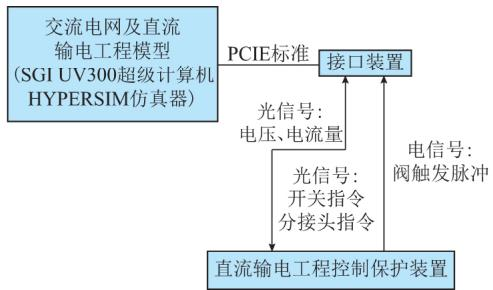  
图1 直流输电工程数模混合仿真接口方案示意图  
Fig．1 Schematicdiagramofinterfaceschemefor digital－analoghybridsimulationinaDC transmissionproject

# 4 直流输电工程数模混合仿真一次系统建模

直流输电工程数模混合仿真一次系统必须严格按照实际工程主回路结构及参数进行搭建 微小的差异都有可能带来仿真结果的极大不同 直流输电系统的一次模型为电磁暂态仿真模型 ， 既要保证准确性和详细度 又要考虑能够在现有的仿真平台上实现仿真步长为 $5 0 ~ \mu \mathrm { s }$ 的实时仿真

下面总结几点在建模过程中需要注意的事项

1）对于直流线路的模拟 应当严格按照杆塔和导线参数 利用与频率相关的分布参数模型进行搭建  
2）对于交直流滤波器的模拟 应当按照实际工程的详细结构及配置组数进行搭建 并应分别对各类别的谐振特性及容量进行仿真验证 以确保模型的正确性  
3）对于换流变压器的模拟 应当采用可解耦的变压器模型 以使整个直流一次模型能够利用多个计算核并行计算以确保实时性  
4）对于在中性线装设工频阻波器的工程 必须严格按照回路参数进行搭建  
5）为了节省计算资源 确保模型实时性 模型中应尽量减少额外的电压 电流传感器 尽可能从主回路的元件或开关上获取状态量

直流输电系统的一次模型搭建完成后 应当首先跟数字控制保护模型连接 ， 对一次系统的稳态进行实时仿真 确保模型的正确性及实时性

以宾金特高压直流工程数模混合仿真模型为例 图2说明了搭建直流输电工程数模混合仿真模

型时，为确保实时性采用的解耦方案 ，图中用不同颜色将整个直流一次部分通过输电线解耦、变压器解耦及添加解耦元件等方法分为6个子任务 另外全部信号输入／输出按照整流 逆变2个站被分为2个子任务 整个模型分为8个子任务 不同子任务可以放在不同的处理器中进行仿真 确保了仿真的实时性

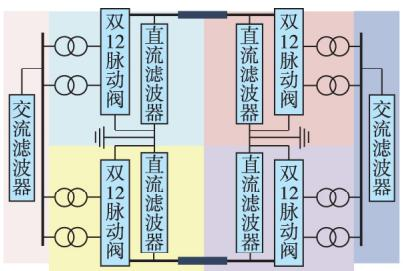  
图2 宾金特高压直流输电工程数模混合仿真模型解耦方案  
Fig．2 Decouplingschemeofdigital－analoghybrid simulationmodelinYibin－JinhuaUHVDC transmissionproject

# 5 直流输电工程数模混合仿真模型功能试验

直流输电工程数模混合仿真模型的功能性试验目的是为了验证直流工程控制保护装置的各项控制及保护功能是否动作正确 是否满足该工程的控制保护动作的技术规范［14］ 为了能确保全面验证直流输电控制保护装置的各项功能 ， 结合控制保护装置出厂试验和现场调试内容 总结出实验室控制保护装置试验项目应当包括表1所示内容

表1 直流工程数模混合仿真模型功能性试验内容  
Table1 Functionaltestcontentsofdigital－analoghybrid simulationmodelinaDCtransmissionproject   

<table><tr><td>序号</td><td>控制试验</td><td>保护试验</td></tr><tr><td>1</td><td>有功控制试验</td><td>阀区保护试验</td></tr><tr><td>2</td><td>系统监视与切换试验</td><td>极区保护试验</td></tr><tr><td>3</td><td>无功控制试验</td><td>双极区保护试验</td></tr><tr><td>4</td><td>控制外特性试验</td><td>直流线路保护试验</td></tr><tr><td>5</td><td>顺序控制与联锁试验</td><td>直流滤波器保护试验</td></tr><tr><td>6</td><td>解/闭锁顺序控制试验</td><td>交流系统保护试验</td></tr><tr><td>7</td><td>空载加压试验</td><td>-</td></tr><tr><td>8</td><td>附加控制试验</td><td>-</td></tr><tr><td>9</td><td>换流变压器分接头控制</td><td>-</td></tr><tr><td>10</td><td>阀组在线投退试验</td><td>-</td></tr></table>

以宾金直流工程数模混合仿真模型功能性试验为例 共计进行了664项试验项目 其中控制试验331项 保护试验333项 以控制试验中功率正送1．0（标幺值）极 Ⅰ 有通信大地回线全压电流阶跃响应试验（阶跃－0．5（标幺值）） 为例 附录 A 为试验

波形，试验结果表明响应时间和超调量均满足工程成套设计要求

功能性试验的正确性可以证明所搭建的直流工程数模混合仿真模型的控制保护功能及特性满足工程设计技术规范 能够真实模拟实际工程控制保护响应的动态特性。

# 6 直流输电工程数模混合仿真模型准确性验证

为了进一步验证直流工程数模混合仿真模型与实际直流工程的一致性 最好的办法是针对同样的系统运行条件 在仿真模型上模拟与现场一样的故障，并将仿真波形与现场实测波形进行对比［15］ 本文以宾金直流工程为例 ， 首先收集了宾金特高压直流工程系统调试期间交流侧单相对地故障试验的录波波形及当时试验的系统运行状态 然后将仿真模型调整到相应的初始运行状态 ，模拟相同故障，通过波形对比验证宾金直流工程数模混合仿真模型与实际直流工程的一致性

故障试验选用2014年3月24日进行功率反送，极 Ⅱ 低端交流系统单相接地故障， 试验工况如下 ：接地故障位置为宜宾换流站交流出线出口位置 ；试验 故 障 相 别 为 C 相； 直 流 系 统 输 送 功 率 为400MW；直流系统运行方式为功率反送 双极低端阀组运行

首先 通过分析现场故障电流波形 估算故障时刻交流侧运行电压 短路容量等 并获得故障接地电阻 故障清除时间等详细信息 然后将仿真试验系统工况调整为与现场故障试验前一致 模拟接地故障位置与现场也保持一致 即在宜宾换流站交流出线出口位置 通过现场波形分析得出 宜宾侧短路电流为36kA 接地故障在39．6ms清除 通过拟合故障相电压波形 估算现场故障的接地电阻为1．02Ω图3至图5为仿真波形与现场波形的对比中直流电压电流及触发角的对比 其他主要状态量对比见附录B

根据现场波形进行分析 功率反送 交流系统单相接地故障 宜宾站极 Ⅱ 低端阀组发生6次换相不成功 直流电流最高值到5227A 直流电压振荡最低跌至116kV 金华站直流电流最高到5267A 直流电压振荡最低至96．5kV 仿真试验中 在和现场同样的工况下 宜宾站极 Ⅱ 低端阀组也发生6次换相不成功 直流电流最高至5407A 直流电压振荡最低至87kV 金华站直流电流最高到5262A 直流电压振荡最低至130kV 仿真试验波形显示 宜宾站熄弧角调节和金华站触发角调节现场保持较高

的一致性 波形比对分析显示 仿真模型系统特性与现场保持一致

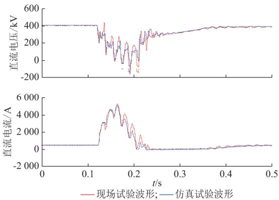  
图3 金华站直流电压和直流电流波形

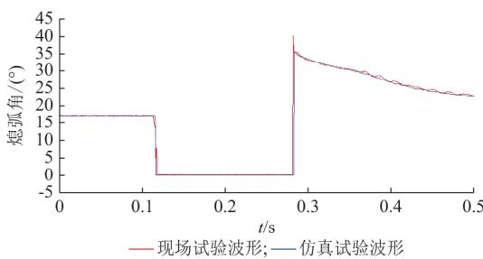  
Fig．3 WaveformsofDCvoltageandDC currentatJinhuastation   
图4 宜宾站熄弧角波形

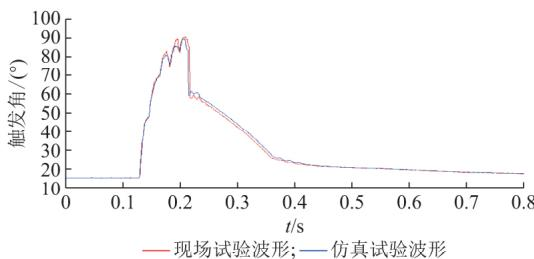  
Fig．4 WaveformsofextinctionangleatYibinstation   
图5 金华站触发角波形  
Fig．5 WaveformsoffiringangleatJinhuastation

通过对多个直流工程数模混合仿真模型的对比校核发现 现场录制的波形越充足 建模依据越真实 仿真结果就越与现场一致 宾金直流现场试验录制了整流侧 逆变侧直流电压和电流波形 两侧触发角波形 交流侧换流母线电压波形 阀侧电流波形 并录制了故障出线电压及电流波形 资料比较完整 现场波形与试验波形吻合程度非常高 需要说明的是，一次系统的电磁暂态仿真模型参数中设备的准确运行参数 各处的杂散电容等均无法做到没有偏差，而电磁暂态仿真步长为50μs，对电磁振荡过程仿真得比较精细 此过程与模型参数密切相关因此 无法做到所有振荡幅值和频率均与现场波形

完全吻合 但整体变化趋势和幅值吻合得都非常好，作为研究交直流系统相互影响的工具 ，可以认为模型特性与实际工程是一致的

# 7 结论

交直流特高压电网的发展需要强大的仿真工具进行技术支撑［16］ 本文提出了直流输电工程数模混合仿真建模的详细方案 并以宾金特高压直流工程为例，将数模混合仿真结果与现场调试试验波形进行了详细对比 得出如下结论

1）直流输电工程控制保护装置通过合理简化能够将屏柜数量压缩到20面屏柜以内，同时保证动态响应特性与实际系统一致 可以满足交直流电网交互特性的研究需要  
2）数模混合仿真接口技术不断发展 ， 大大提高了大规模电网接入多套直流控制保护装置的数模混合仿真模型建模效率和可靠性  
3）直流输电工程数模混合仿真模型的结构和参数应当在尽可能与实际工程保持一致的前提下 巧妙解耦 确保模型的实时性  
4）直流输电数模混合仿真模型的响应特性与实际系统的动作特性高度吻合 能够真实再现实际系统情况 可以作为其他数字仿真模型的校准工具

附 录 见 本 刊 网 络 版 （http： ／／www．aeps－infocom／aeps／ch／index．aspx）

# 参 考 文 献

［1］ 刘振亚．中国电力与能源 ［M］．北京 ： 中国电力出版社 2012：38－65．LIUZhenya．PowerandenergyinChina［M］．Beijing： ChinaElectricPowerPress 2012 3865  
［2］ 李明节．大规模特高压交直流混联电网特性分析与运行控制［J］电网技术 201640（4） 985990LIMingjie．Characteristicanalysisandoperationalcontroloflarge－scalehybridUHV AC／DCpowergrid［J］．PowerSystemTechnology， 2016， 40（4） ： 985－990  
［3］ 蒋卫平 朱艺颖 王明新 等．国家电网仿真中心建设项目总报告［R］．北京 中国电力科学研究院 2009JIANG Weiping， ZHUYiying， WANGMingxin， etal．GeneralreportonconstructionprojectofStateGridSimulationCenter［R］．Beijing： ChinaElectricPowerResearchInstitute， 2009  
［4］ 饶宏．交直流大电网运行关键技术的研究与实践［R］．2017RAOHong．Researchandpracticeonkeytechnologiesoflarge－scaleAC／DCpowergridoperation［R］．2017  
［5］ 《中国电力百科全书》编辑委员会．中国电力百科全书［M］．北京2014145146EditorialBoardofChinaElectricPowerEncyclopedia．Chinaelectricpowerencyclopedia［M］．Beijing： ChinaElectricPower

Press， 2014： 145－146  
［6］ 朱艺颖 ，蒋卫平 ，印永华．电力系统数模混合仿真技术及仿真中心建设［J］．电网技术 ，2008，32（22） ：35－38ZHUYiying JIANGWeiping YINYonghua．Generalsituationofpowersystem hybridsimulationcenter［J］．PowerSystemTechnology， 2008， 32（22） ： 35－38  
［7］ 朱艺颖 ，于钊 ，李柏青 ，等．大规模交直流电网电磁暂态数模混合仿真平台构建及验证 （一）整体构架及大规模交直流电网仿真验证［J］．电力系统自动化 ，2018，42（15） ：164－170．DOI：10．7500／AEPS20180302008ZHU Yiying， YU Zhao， LIBaiqing， etal．Constructionandvalidation ofelectromagnetictransient digital－analog hybridsimulationplatformforlarge－scaleAC／DCpowergrids： Partone generalconfigurationandsimulationvalidationoflarge－scaleAC／DCpowergrid［J］．AutomationofElectricPowerSystems 2018 42（15） ： 164－170． DOI： 10．7500／AEPS20180302008  
［8］ 汤涌 印永华．电力系统多尺度仿真与试验技术［M］．北京 中国电力出版社 2013184188TANG Yong YIN Yonghua．Multi－scalesimulationandtesttechnologyofpowersystem［M］．Beijing： ChinaElectricPowerPress 2013 184－188  
［9］ 周俊 郭剑波 郭强 等．交直流大电网数模混合仿真系统的并行计算效率研究［J］．电网技术 201135（6） 3438ZHOU Jun， GUO Jianbo， GUO Qiang， et al．Parallelcomputingefficiencyofdigital／analoghybridsimulationsystemfor large－scale AC／DC power grid ［J］．Power SystemTechnology， 2011， 35（6） ： 34－38  
［10］ LAROSEC GUERETTES GUAYF．Afullydigitalreal－ time power system simulator based on PC－cluster ［J］ MathematicsandComputersinSimulation 2003 63（3／4／5） 151－159   
［11］ 赵畹君．高压直流输电工程技术［M］．北京 ： 中国电力出版社2004．ZHAO Wanjun．High voltage directcurrenttransmissionengineeringtechnology［ M］．Beijing： China ElectricPowerPress 2004  
［12］ 中国电力科学研究院．新一代特高压交直流电网仿真平台建设可行研究方案［R］．北京 中国电力科学研究院 2015ChinaElectricPowerResearchInstitute．FeasibilityresearchschemeforconstructionofnewgenerationUHVAC／DCpowergridsimulationplatform［R］．Beijing： ChinaElectricPowerResearchInstitute 2015  
[13]刘云，蒋卫平，印永华，等.特高压交直流大电网的数模混合实时仿真系统建模［J］．电力系统自动化 200832（12） ：52－56LIUYun JIANG Weiping YINYonghua etal．Modelingofanalogue－digitalhybridreal－timesimulationsystemappliedintheUHVAC／DCgreatpowergrid［J］．AutomationofElectricPowerSystems 2008 32（12） 5256  
［14］ 朱艺颖．电力系统数模混合仿真技术及发展应用［J］．电力建设201536（12） 4247

ZHU Yiying．Developmentandapplicationofpowersystemdigital－analoghybridsimulationtechnology［J］．ElectricPowerConstruction， 2015， 36（12） ： 42－47  
［15］ 张民．交直流系统电磁暂态模型研究及仿真验证［M］．北京 ： 中国水利水电出版社 2014：9－12  
ZHANGMin．StudyonelectromagnetictransientmodelofAC－DCsystem andsimulationverification［ M］．Beijing： ChinaWater＆ PowerPress， 2014： 9－12  
［16］ 刘振亚．中国特高压交流输电技术创新 ［J］．电网技术 ，2013，37（3） ：567－574  
LIUZhenya．InnovationofUHVACtransmissiontechnologyin

China［J］．PowerSystemTechnology， 2013， 37（3） ： 567－574  
朱艺颖（1974—） ， 女 ， 通信作者 ， 博士 ， 教授级高级工程师 ，主要研究方向 ：电力系统实时仿真 直流输电及电磁暂态分析。 E－mail： wzhyyf＠epri．sgcc．com．cn  
于 钊（1979—） ，男 ，硕士 ，高级工程师 ，主要研究方向 ：大电网安全稳定运行及调度  
李柏青（1963—） ， 男 ， 教授级高级工程师 ， 主要研究方向 ：电力系统分析与控制

（编辑 蔡静雯）

# ConstructionandValidationofElectromagneticTransientDigital－Analog HybridSimulationPlatformforLarge－scaleAC／DCPowerGrids

# PartTwo ModelingandValidationofDigital－AnalogHybridSimulationofDCTransmissionProjects

ZHU Yiying1,YU Zhao²，LI Baiqing1，GUO Qiang1，XIE Guoping1，LIN Shaobo1

（1．StateKeyLaboratoryofPowerGridSafetyandEnergyConservation

（ChinaElectricPowerResearchInstitute） ， Beijing100192， China；

2．StateGridCorporationofChina， Beijing100031， China）

Abstract： Withthefastdevelopmentofultra－highvoltagepowergrid， thehigh－levelrequirementsareputforwardfor simulatingthedynamiccharacteristicofDCtransmissionprojects．Thispaperproposesatechnicalschemeofconstructing digital－analoghybridsimulationplatformwithmultipleDCcontrolandprotectiondevicesforlarge－scaleAC／DCpowergrids FromtheaspectsofsimplifyingtheprincipleofDCcontrolandprotectiondevices，interfacetechniquesfordigital－analoghybrid simulation， andrequirementsofDCsystem modeling， thispaperputsforwardamodelingmethodofdigital－analoghybrid simulationfortheDCtransmissionprojectaccessingtothelarge－scalesimulationpowergrid．Thetypicalfaultduringthesite commissioningtestofYibin－JinhuaUHVDCprojectisusedtomakeadetailedcomparisonbetweenthedigital－analoghybrid simulationtestresultsandthefieldtestwaveforms．Thecomparisonresultsshowthatthedynamicresponsecharacteristicsof theproposeddigital－analoghybridsimulationmodelarehighlyconsistentwiththeoperationcharacteristicsoftheactualproject Thedigital－analoghybridsimulationmodelisabletoreproducetheactualsystemandaccuratelysimulatethephenomenonof AC／DCinteraction， whichcouldprovidethestrongtechnicalsupportforthesafeandstableoperationofAC／DCpowergrids Theproposedsimulationmodelcanalsobeusedasacalibrationtoolforotherdigitalsimulationmodels

Keywords： DCtransmissionproject； digital－analoghybridsimulation； controlandprotectiondevice； simulationmodeling；modelvalidation

●行业动态、两刊最新文章全部“一手掌握”   
●SCI论文抢“鲜”看   
●好文章分享一下  
自己的文章在朋友圈炫一下  
●名家大师真知灼见全收藏   
期刊动态、征文通知、有奖调查问卷等互动内容   
随时查看稿件状态   
还有更多新内容，等您来发现

官方微信

微信号：AEPS-1977

《电力系统自动化》

微信

至简成精 见微知著

# 附录 A 电流阶跃响应试验波形

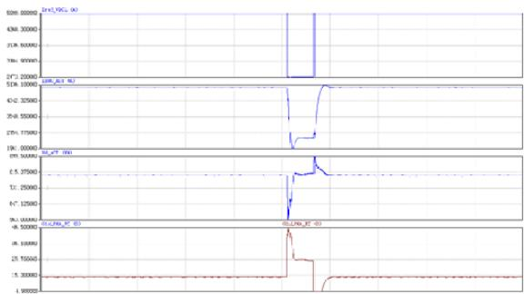  
从上至下：电流指令，直流电流，直流电压，触发角  
图 A1 电流阶跃响应试验波形（阶跃-0.5（标幺值））  
Fig.A1 Waveforms of current step response test

# 附录 B 宾金直流工程数模混合仿真波形与现场波形的对比

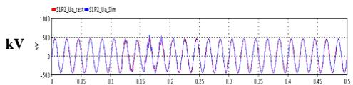

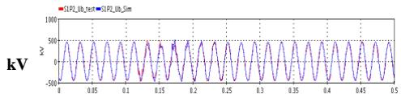

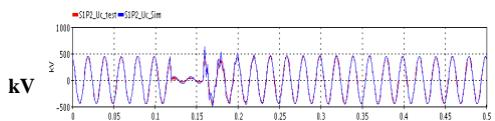  
S   
图 B1 换流母线电压，从上至下：A 相，B 相，C 相

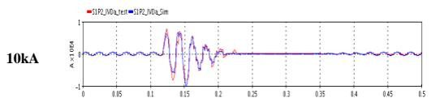  
Fig.B1 The converter bus voltage. From top to bottom: Phase A, Phase B, Phase C

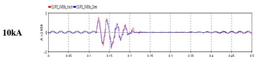

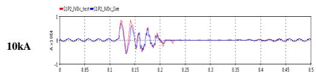  
S   
图 B2 Y/Y 换流变阀侧电流，从上至下：A 相，B 相，C 相  
Fig.B2 The Y/Y converter transformer current on valve side. From top to bottom: Phase A, Phase B, Phase C

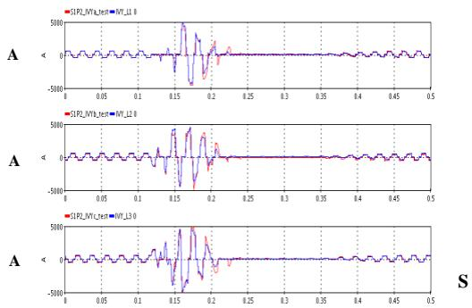  
图 B3 Y/∆换流变阀侧电流，从上至下：A 相，B 相，C 相  
Fig.B3 The Y/∆ converter transformer current on valve side. From top to bottom: Phase A, Phase B, Phase C