# Multirate EMT Simulation of Power Electronic Transformers With High-Precision Firing Signals

Huize Wang1, Jianzhong Xu1*, Senior Member, IEEE, and Moke Feng2

Abstract—The electromagnetic transient (EMT) simulation of power electronic transformers (PETs) encounters significant computational challenges due to the high switching frequency nature imposing small simulation time step. This paper proposes a multirate simulation method incorporating high-precision firing signals, which enhances the simulation efficiency of PETs by reducing the number of numerical operations within specified simulation durations. Unlike the existing methods that utilize simplified models with unanimous simulation time step, the proposed approach leverages the inherent frequency disparities in multi-level conversion circuits of PETs to partition the entire system into distinct subsystems. They each are simulated with different time steps optimized for their specific frequencies and precision requirements. To achieve the coordination between subsystems with different rates while ensuring simulation stability, a simulation data transmission method for different subsystems and an interleaved equivalence multirate interaction algorithm are developed. By formulating the currents on both sides of the high frequency transformer as state variables, which are derived by modified nodal analysis (MNA), high-precision firing signals are introduced achieving significant time step enlargement in high frequency subsystem. The performance of the proposed method is validated through comparative studies with traditional single rate (TSR) EMT simulations under various operating conditions.

Index Terms—cascaded H-bridge-type dual active bridge (DAB), electromagnetic transient (EMT) simulation, multi-rate simulation, power electronic transformer (PET).

# I. INTRODUCTION

stP OWER electronic transformers (PETs) have garnered ignificant interest in modern power systems owing to heir superior capabilities in efficient and flexible energy conversion with the large scale integration of distributed energy resources and renewable energy sources into power grids [1]. Many projects utilizing power electronic transformers as energy routing devices have been constructed in China in recent years, such as Xiaoertai Flexible Substation in Zhangbei and Tongli Integrated Energy Town in Suzhou. Therefore, the research into primary circuit parameters and control system design of PETs has become an important

This work was supported by the National Natural Science Foundation of China under Grant 52277094. (Corresponding author: Jianzhong Xu.)

Huize Wang and Jianzhong Xu are now with the State Key Laboratory of Alternate Electrical Power System with Renewable Energy Sources, North Ch ina Electric Power University, Beijing 102206, China (email: wanghuize@nce pu.edu.cn; xujianzhong@ncepu.edu.cn).

Moke Feng is now with the State Key Laboratory of Power Transmission Equipment Technology, Chongqing University, Chongqing, 400044, China (email: fengmoke@cqu.edu.cn)

subject. Electromagnetic transient (EMT) simulation is widely adopted for this purpose due to its capability to characterize detailed dynamics of power electronic apparatus with microsecond-level temporal resolution [2].

However, EMT software requires a substantial amount of computational time to simulate PETs [3], [4]. To satisfy the requirements of high voltage and large capacity, PETs are often comprised of multiple power units (PUs) connected in various configurations. A typical cascaded H-bridge-type dual active bridge (CHB-DAB) based PET [5] illustrated in Fig. 1 includes three phases configured in an input-series-outputparallel (ISOP) pattern. The cascading configuration of CHB provides significant enhancement of equivalent switching frequency, though its actual switching frequency is typically in the range of hundreds of Hertz. In contrast, to minimize the physical dimensions and manufacturing costs of apparatus, the DAB section containing high frequency transformers generally functions at kilohertz-level. The high switching frequency requires a sufficiently small time step to accurately capture the switching transients and ensure the simulation accuracy, ultimately leading to a huge computational burden.

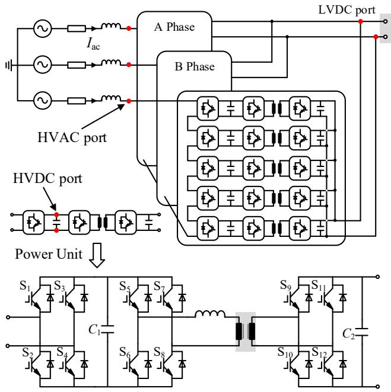  
Fig. 1. Structure of the CHB-DAB-based PET.

Several equivalent models from the perspective of single rate have been proposed to enhance simulation efficiency. For instance, in [6], by analyzing the power flow equations and inductance current waveforms, an average-value model of

# > REPLACE THIS LINE WITH YOUR MANUSCRIPT ID NUMBER (DOUBLE-CLICK HERE TO EDIT) <

PETs is achieved. By neglecting the excitation inductance and resistance currents within PETs while representing the input and output currents with averaged quantities, the reducedorder model [7] was established. However, a significant drawback of these average-value models is that they reduce the simulation accuracy and cannot reflect the high frequency transient characteristics. Therefore, an accurate equivalent modeling approach is proposed in [8], which introduces a time step delay and equivalently represents the PETs as two singleport circuits, significantly improving simulation speed while minimizing accuracy loss. In [9], a hierarchical modeling scheme for PETs is proposed, recursively reducing the dimension of the node admittance matrix (NAM) to improve simulation efficiency. Parallel computing techniques have been further applied in [10], [11] to enhance the simulation efficiency of PETs. Nevertheless, all the existing equivalent models constrained to single time step within the framework of established EMT software do not take advantage of the inherent frequency disparities in PETs to reduce the number of numerical operations by using multirate techniques.

Multirate simulation can be achieved through various methods, such as the ideal transformer method [12], transmission line method [13], latency insertion method (LIM) [14], multi-area Thevenin equivalent (MATE) method [15], etc. The LIM is used to combine nodal analysis and statespace solvers, permitting distinct subsystems to be solved with different time steps [14]. In [16], [17], multirate simulation based on the MATE method is proposed. Through accumulation and interpolation of the history source across all subsystems, simulation data interaction errors are significantly mitigated. Ref. [18] proposes a time-variant Thevenin/Norton equivalent modeling method to construct interface models and utilizes the root-matching algorithm to suppress numerical oscillations. This enables a multirate co-simulation of large AC and multi-terminal DC power grids. However, these studies only achieve coarse-grained partitioning at system level, failing to realize intra-device multirate simulation for power electronic apparatus. While [19] achieved multirate simulation of power electronic converters by modifying the discretization of energy storage element, the explicit integration stability domain is limited, requiring a sufficiently small simulation time step to ensure numerical stability [20]. Therefore, additional research is needed on multirate simulation for power electronic apparatus, such as PETs.

This paper proposes a multirate EMT simulation method suitable for PETs, which partitions the PETs into fast and slow subsystems and simulates them with different time steps. The high-precision firing signals are introduced to further increase the time step of the fast subsystem by formulating the currents on both sides of the high frequency transformer as state variables, which are derived by modified nodal analysis (MNA). By reducing the number of numerical computations within a given simulation time, the proposed method enhances simulation efficiency and extends multirate applications from system level to device level.

The main contributions of this paper are outlined below:

1) Simulation data is transmitted at the interconnection node between the CHB and DAB subsystems in the form of multiport Norton equivalent and current source equivalent. Through different transmission methods, the partitioning of the PET is achieved, and the frequent reconstruction of the CHB admittance matrix is avoided.   
2) The proposed multirate interaction framework is closely related to the subsystem equivalent methods. By reasonably designing the timing of equivalence and data transmission for each subsystem, it avoids the time step delay caused by current source equivalence and extends multirate simulation from the system level to the device level.   
3) A DAB model capable of accepting high-precision firing signals is proposed. By using the MNA, the unified solution of the AC and DC sides is realized. It is organically integrated with the proposed multirate simulation method, which expands the time step of the fast subsystem and further improves the simulation efficiency.

The rest of this paper is organized as follows: Taking the CHB-DAB based PET as an example, Section II presents a multirate EMT method which includes the partition scheme of PET, the simulation data transmission method for subsystems of PETs with different rates, and an interaction algorithm. Section III discusses an integrated method for high-precision firing signals in PETs simulation. Subsequently, Section IV validates this method through comprehensive comparisons with the traditional single rate (TSR) EMT simulation. Brief conclusions are finally given in Section V.

# II. MULTIRATE EMT SIMULATION METHOD FOR CHB-DAB BASED PET

The fundamental idea of the multirate EMT simulation for CHB-DAB based PET is to separate the PETs system into a subsystem comprising CHB and a subsystem comprising DAB, based on different switching frequencies. Simulation data is transferred between subsystems via methods based on multi-port Norton equivalent and current source equivalent at the interconnection nodes of the subsystems. Moreover, a well-designed data interaction process is established to enable the interaction of the simulation data between the two subsystems, thus completing the multirate simulation of PETs without time delay.

# A. CHB-DAB Based PET Partitioning

PETs are usually composed of multi-level conversion circuits to achieve flexible energy transformation. Taking a typical CHB-DAB based PET shown in Fig. 1 as an example, its PU consists of two-level circuits. CHB, composed of IGBT/anti-paralleled diode switches $\mathrm { S } _ { 1 } , \mathrm { S } _ { 2 } , \mathrm { S } _ { 3 } , \mathrm { S } _ { 4 } ,$ utilizes a cascaded voltage division topology to connect to the AC grid for AC/DC conversion. DAB, which is used to complete DC/DC conversion, comprises switches ${ \mathrm { S } } _ { 5 } – { \mathrm { S } } _ { 1 2 } ,$ capacitors $\mathrm { C _ { 1 } } .$ , C2 and a high-frequency isolation transformer.

CHB often employs carrier phase-shifted sinusoidal pulse width modulation (CPS-SPWM) to enhance its equivalent switching frequency, with the actual switching frequency at a

relatively low level, typically several hundred hertz. DAB commonly utilizes phase-shift control to adjust power flow between the two sides of the transformer [5]. The switching frequency of DAB is often set at a high frequency of several thousand hertz. To satisfy the Nyquist sampling theorem, a smaller time step simulation is often required for DAB. Conversely, the lower switching frequency of CHB allows a larger time step, yet conventional single rate approaches only adopt a unanimous small step to both levels, resulting in computational resource redundancy.

Therefore, as shown in Fig. 2, the entire PETs system is partitioned into two subsystems at the interconnection nodes of the CHB and DAB subsystems. The DAB subsystem, due to its faster dynamic characteristics compared to the CHB subsystem, should be simulated at a faster rate. In contrast, the CHB subsystem can be simulated at a slower rate.

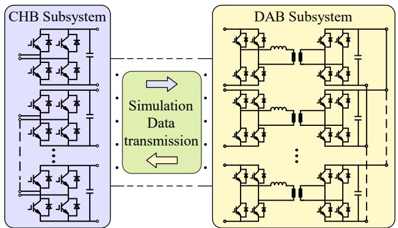  
Fig. 2. Subsystem partition of CHB-DAB Based PET.

In TSR EMT simulation, the companion circuits of each component are interconnected according to the system topology. As a result, a node admittance matrix and a node injection current source vector are formed. Then, a node voltage equation is established, and the computer is used to solve all the state variables of the system to complete the calculation at this moment. According to the mathematical recursive relationships, each component updates the companion circuit parameters i.e. admittance and current source values, referred to as simulation data in this paper. This forms a new equation for subsequent time steps. The iterative process continues until reaching the specified simulation duration and the simulation ends. However, for multirate simulation, on the basis of network partition, there are still many issues that need to be discussed. Aspects such as the companion circuit of the PU, the transmission method of simulation data between different subsystems, and the timing of resynchronization will be introduced as follows.

# B. Companion Circuit of PU

The discrete companion equivalent circuit [21] is fundamental to the implementation of EMT simulations for PETs. The high frequency transformer plays a vital role in voltage transformation, electrical isolation, and power transfer. Its magnetic coupling relationship is usually made equivalent in an electrical circuit, so as to achieve the EMT simulation of the transformer.

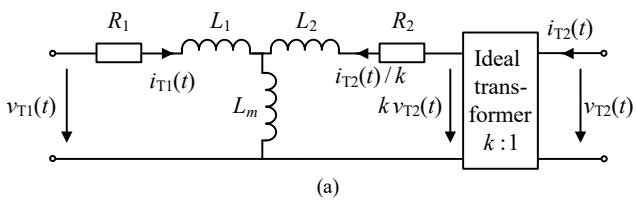

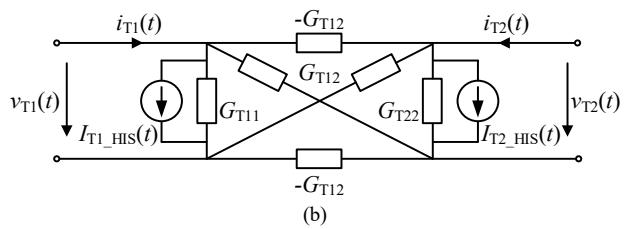  
Fig. 3. Equivalent circuit for transformer.

The equivalent circuit of a two-winding transformer is shown in Fig. 3(a). The leakage inductances of the primary and secondary windings are $L _ { 1 }$ and $L _ { 2 } ,$ respectively, while the resistances are $R _ { 1 }$ and $R _ { 2 } .$ . The voltages are coupled through $L _ { m } .$ They are all expressed in per-unit. $\nu _ { \mathrm { T 1 } } ,$ vT2, $i _ { \mathrm { T 1 } }$ and $i _ {  { \mathrm { T } } 2 }$ are the port voltages and currents of the primary and secondary sides respectively. k is the voltage ratio of the transformer. Its value is determined by the rated voltage on the primary side $\nu _ { \mathrm { r a t e d l } }$ and that on the secondary side $\nu _ { \mathrm { r a t e d } 2 }$ . The rated capacity of the transformer is $S _ { \mathrm { { r a t e d } } } .$ Under the reference direction shown in Fig. 3(a), the port voltages and currents are expressed as:

$$
\left[ \begin{array}{l} v _ {\mathrm {T} 1} (t) \\ v _ {\mathrm {T} 2} (t) \end{array} \right] = \boldsymbol {R} _ {\mathrm {T}} \left[ \begin{array}{l} i _ {\mathrm {T} 1} (t) \\ i _ {\mathrm {T} 2} (t) \end{array} \right] + \boldsymbol {L} _ {\mathrm {T}} \frac {d}{d t} \left[ \begin{array}{l} i _ {\mathrm {T} 1} (t) \\ i _ {\mathrm {T} 2} (t) \end{array} \right] \tag {1}
$$

where

$$
\left\{ \begin{array}{l} \boldsymbol {R} _ {\mathrm {T}} = \left[ \begin{array}{c c} R _ {1} \frac {v _ {\text {r a t e d 1}} ^ {2}}{s _ {\text {r a t e d}}} & 0 \\ 0 & R _ {2} \frac {v _ {\text {r a t e d 2}} ^ {2}}{s _ {\text {r a t e d}}} \end{array} \right] \\ \boldsymbol {L} _ {\mathrm {T}} = \left[ \begin{array}{c c} \left(L _ {m} + L _ {1}\right) \frac {v _ {\text {r a t e d 1}} ^ {2}}{s _ {\text {r a t e d}}} & \frac {L _ {m} v _ {\text {r a t e d 1}} v _ {\text {r a t e d 2}}}{s _ {\text {r a t e d}}} \\ \frac {L _ {m} v _ {\text {r a t e d 1}} v _ {\text {r a t e d 2}}}{s _ {\text {r a t e d}}} & \left(L _ {m} + L _ {2}\right) \frac {v _ {\text {r a t e d 2}} ^ {2}}{s _ {\text {r a t e d}}} \end{array} \right] \end{array} \right. \tag {2}
$$

In (2), the elements of matrices $\pmb { R } _ { \mathrm { T } }$ and $\pmb { L } _ { \mathrm { T } }$ are all actual values.

After discretization using the Trapezoidal rule, (1) can be rewritten as:

$$
\left[ \begin{array}{l} i _ {\mathrm {T} 1} (t) \\ i _ {\mathrm {T} 2} (t) \end{array} \right] = \boldsymbol {G} _ {\mathrm {T}} \left[ \begin{array}{l} v _ {\mathrm {T} 1} (t) + v _ {\mathrm {T} 1} (t - h) \\ v _ {\mathrm {T} 2} (t) + v _ {\mathrm {T} 2} (t - h) \end{array} \right] + \boldsymbol {H} _ {\mathrm {T}} \left[ \begin{array}{l} i _ {\mathrm {T} 1} (t - h) \\ i _ {\mathrm {T} 2} (t - h) \end{array} \right] \tag {3}
$$

in which

$$
\left\{ \begin{array}{l} \boldsymbol {G} _ {\mathrm {T}} = \frac {h}{2} \left[ \frac {h \boldsymbol {R} _ {\mathrm {T}}}{2} + \boldsymbol {L} _ {\mathrm {T}} \right] ^ {- 1} = \left[ \begin{array}{l l} G _ {\mathrm {T} 1 1} & G _ {\mathrm {T} 1 2} \\ G _ {\mathrm {T} 1 2} & G _ {\mathrm {T} 2 2} \end{array} \right] \\ \boldsymbol {H} _ {\mathrm {T}} = \boldsymbol {G} _ {\mathrm {T}} \left[ \frac {2 \boldsymbol {L} _ {\mathrm {T}}}{h} - \boldsymbol {R} _ {\mathrm {T}} \right] \end{array} \right. \tag {4}
$$

Define

$$
\left[ \begin{array}{l} I _ {\mathrm {T 1} - \mathrm {H I S}} (t) \\ I _ {\mathrm {T 2} - \mathrm {H I S}} (t) \end{array} \right] = \boldsymbol {G} _ {\mathrm {T}} \left[ \begin{array}{l} v _ {\mathrm {T 1}} (t - h) \\ v _ {\mathrm {T 2}} (t - h) \end{array} \right] + \boldsymbol {H} _ {\mathrm {T}} \left[ \begin{array}{l} i _ {\mathrm {T 1}} (t - h) \\ i _ {\mathrm {T 2}} (t - h) \end{array} \right] \tag {5}
$$

From (3)-(5), the companion circuit of the transformer can be derived, shown in Fig. 3(b). The subscript “HIS” indicates that the calculation of this variable is related to the values at previous moments.

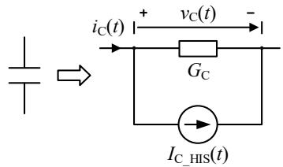  
Fig. 4. Capacitor companion circuit.

Similarly, the companion circuit of capacitor is depicted in Fig. 4 by applying the same discretization process according to the dynamic characteristics of capacitor. Its mathematical expression is given as:

$$
i _ {\mathrm {C}} (t) = \frac {2 C}{h} v _ {\mathrm {C}} (t) - \frac {2 C}{h} v _ {\mathrm {C}} (t - h) - i _ {\mathrm {C}} (t - h) \tag {6}
$$

Define

$$
\left\{ \begin{array}{l} G _ {\mathrm {C}} = \frac {2 C}{h} \\ I _ {\mathrm {C} - \mathrm {H I S}} (t) = - \frac {2 C}{h} v _ {C} (t - h) - i _ {C} (t - h) \end{array} \right. \tag {7}
$$

In this paper, the two-value resistance model [22] is used to represent switches in CHB subsystem and the current source model represents switches in DAB subsystem. Different subsystems employ distinct switching models, which is closely associated with the form of simulation data transmission among subsystems. The time step delay caused by the current source can be solved by MNA which works out the current and voltage simultaneously [23], [24]. This will be illustrated in detail in Section III. By doing so, it becomes possible to optimize the resynchronization timing of subsystems and develop an interaction algorithm.

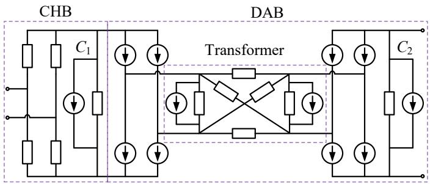  
Fig. 5. Companion circuit of PU.

The companion circuit of the PU is shown in Fig. 5. A PU involves 10 nodes in EMT simulation. Under the ISOP connection, the total node count scales according to the relationship with the number of PUs N being 7N+3, which causes an enormous computational burden as N increases.

C. Simulation Data Transmission Method Between Subsystems

EMT simulation requires knowledge of the structure and parameters of the whole system. In order to solve each subsystem separately, the transmission of simulation data is required so that the subsystems can sense each other.

1) The simulation data transmission of the CHB subsystem: The position of these interconnection nodes serves as the boundary for partitioning the CHB and DAB subsystems. The node voltage equations for the CHB subsystem can be expressed as:

$$
\left[ \begin{array}{l l} \boldsymbol {G} _ {2 N, 2 N} & \boldsymbol {G} _ {2 N, a} \\ \boldsymbol {G} _ {a, 2 N} & \boldsymbol {G} _ {a, a} \end{array} \right] \left[ \begin{array}{l} \boldsymbol {V} _ {2 N} \\ \boldsymbol {V} _ {a} \end{array} \right] = \left[ \begin{array}{l} \boldsymbol {J} _ {2 N} \\ \boldsymbol {J} _ {a} \end{array} \right] \tag {8}
$$

where $\pmb { G } _ { 2 N , 2 N }$ and $\pmb { G } _ { a , a }$ represent the nodal admittance matrices corresponding to interconnection nodes and internal nodes of CHB subsystem, respectively. 2N is the number of interconnection nodes, and a is the number of internal nodes in the CHB subsystem. ${ \bf G } _ { 2 N , a }$ and $\pmb { G } _ { a , 2 N }$ denote the admittance matrices between interconnection nodes and internal nodes. $V _ { 2 N }$ is the voltage vector of the interconnection nodes, while $V _ { a }$ is the voltage vector of the internal nodes of the CHB subsystem. $J _ { 2 N } , J _ { a }$ are the current source vectors flowing into interconnection nodes and internal nodes, respectively.

By setting the element in the first row and second column of the admittance matrix in (8) to 0 via matrix row transformation and inverting the modified matrix, (9) can be obtained. This allows the CHB subsystem to be represented as a multi-port Norton equivalent circuit.

$$
\begin{array}{l} \left[ \begin{array}{c} \boldsymbol {V} _ {2 N} \\ \boldsymbol {V} _ {a} \end{array} \right] = \left[ \begin{array}{c c} \boldsymbol {G} _ {2 N, 2 N} - \boldsymbol {G} _ {2 N, a} \boldsymbol {G} _ {a, a} ^ {- 1} \boldsymbol {G} _ {a, 2 N} & 0 \\ \boldsymbol {G} _ {a, 2 N} & \boldsymbol {G} _ {a, a} \end{array} \right] ^ {- 1} \tag {9} \\ \left[ \begin{array}{c} \boldsymbol {J} _ {2 N} - \boldsymbol {G} _ {2 N, a} \boldsymbol {G} _ {a, a} ^ {- 1} \boldsymbol {J} _ {a} \\ \boldsymbol {J} _ {a} \end{array} \right] \\ \end{array}
$$

Define

$$
\left\{ \begin{array}{l} \boldsymbol {G} _ {\mathrm {C H B}} = \boldsymbol {G} _ {2 N, 2 N} - \boldsymbol {G} _ {2 N, a} \boldsymbol {G} _ {a, a} ^ {- 1} \boldsymbol {G} _ {a, 2 N} \\ \boldsymbol {J} _ {\mathrm {C H B}} = \boldsymbol {J} _ {2 n} - \boldsymbol {G} _ {2 n, a} \boldsymbol {G} _ {a, a} ^ {- 1} \boldsymbol {J} _ {a} \end{array} \right. \tag {10}
$$

where $\mathbf { { \cal G } } _ { \mathrm { C H B } } , \mathbf { { \cal J } } _ { \mathrm { C H B } }$ are the admittance and current source observed from the ports formed by each interconnection node and the ground node towards the CHB subsystem.

The switching process of the CHB is reflected in the matrix of equivalent admittances while the variations of other energy storage elements in the subsystem are represented by the vector of equivalent current sources. The equivalent circuit connects to the DAB subsystem through the interconnection nodes, which manifests itself in the equation as a mapping superposition of corresponding matrix elements [25]. This process completes the transmission of CHB subsystem simulation data, allowing the DAB subsystem to perceive variations of the external system.

2) The simulation data transmission of the DAB subsystem: After completing a single step simulation, the DAB subsystem possesses complete state variable information for the current moment. This allows it to obtain the currents flowing out of the interconnection nodes to the CHB subsystem. According to the branch cutting method [26], these currents can be

# > REPLACE THIS LINE WITH YOUR MANUSCRIPT ID NUMBER (DOUBLE-CLICK HERE TO EDIT) <

identified as equivalent current sources injected into the CHB subsystem, reflecting the influence exerted by the DAB subsystem on the CHB subsystem. In essence, the amount of current flowing out from the DAB interconnection nodes is the simulation data that the DAB subsystem needs to transmit.

The attribution problem of the capacitor at the interconnection node is worthy of discussion. Since the DAB subsystem is represented in the form of a current source when transmitting, the voltage across its two terminals is determined by external circuits. Given that this capacitor serves a crucial function in providing active voltage support within the PU, it is essential to allocate this capacitor to the CHB subsystem. This is because the admittance of the CHB subsystem contributes to supporting voltage during the transmission of simulation data.

Specifically, lacking a capacitor, the dynamic changes in the switching states of the CHB subsystem will cause voltage fluctuations between the CHB and DAB subsystems. After such error fluctuations are transmitted to the DAB subsystem, they will lead to the failure of the equivalent current source calculation in the DAB subsystem, which in turn will react on the CHB subsystem. Moreover, if the CHB subsystem adopts a constant voltage strategy, the PI of the control system will enter saturation and clipping states due to the lack of the capacitor to establish a stable DC voltage. The above factors are coupled with each other, eventually leading to the error.

# D. Framework of the Multirate Interaction Algorithm

In contrast to TSR, multirate simulations involve data exchange between subsystems. The correct timing of data interaction is a prerequisite for ensuring the stable operation of the simulation. The multirate interaction framework is proposed in Fig. 6.

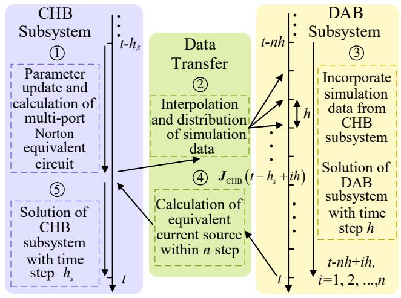  
Fig. 6. Multirate interaction framework.

Since the DAB subsystem is simulated at a faster rate, it will generate more simulation data compared to the CHB subsystem. Therefore, to address the dimensional mismatch between subsystems with different simulation rates, an approach employing averaging and interpolation techniques is adopted. At the same time, the EMT process is reasonably

designed according to the different data transmission methods of the CHB and DAB subsystems. This framework does not introduce additional time step delays.

In Fig. 6, the time step of the DAB fast subsystem is h, and the time step of the CHB slow subsystem is $h _ { s } .$ The subscript $^ { 6 6 } \mathrm { \vec { s } } ^ { , 5 }$ represents the slow subsystem. The rate ratio is defined as $n ~ = ~ h _ { s } / h$ , where n must be an integer. Each subsystem in multirate simulation still executes the complete EMT process. The following takes the example of advancing one large step from the moment of $t \mathrm { - } h _ { s }$ to t to illustrate the calculation process of each subsystem in detail.

1) Simulation data calculation for CHB subsystem: After the solution at $t \mathrm { - } h _ { s }$ is complete, the state of the entire system is known. Each component of the CHB subsystem updates the parameters of the companion circuit with time step of $h _ { s }$ according to the voltage and current values at the moment of ths. Switching states are changed according to the firing signals generated by the control system. After all the parameters are updated, the multi-port Norton equivalent circuit of the CHB subsystem can be obtained from (10).   
2) Interpolation and distribution of simulation data for CHB subsystem: $J _ { \mathrm { C H B } }$ is the vector of equivalent current source transmitted from CHB subsystem to DAB subsystem, and its calculation at time t is only related to the variables at time $t \mathrm { - } h _ { s }$ . The injection current vectors at two moments $J _ { \mathrm { C H B } } ( t )$ and $J _ { \mathrm { C H B } } ( t - h _ { s } )$ are linearly interpolated according to the rate ratio n to obtain $J _ { \mathrm { C H B } } ( t { - } h _ { s } { + } h )$ , $J _ { \mathrm { C H B } } ( t { - } h _ { s } { + } 2 h )$ , …, JCHB(t). Therefore, the DAB fast subsystem can obtain the dynamic changes of energy storage elements of the CHB slow subsystem at corresponding moment in each small time step h. ${ \bf G } _ { \mathrm { s } }$ is considered constant within $h _ { s } ,$ meaning the switching states of the CHB subsystem are assumed to remain unchanged during the calculation performed by the faster DAB subsystem. This is due to the fact that if the switch states of the CHB subsystem change within $h _ { s } .$ , the time step $h _ { s }$ must be reduced.   
3) Solution of the DAB subsystem: Each component of the DAB subsystem updates the parameters of the companion circuit with a time step of h according to the voltage and current values and the switching signals at the moment of t-$h _ { s } .$ The simulation data of the CHB subsystem at the corresponding moment is incorporated into the node voltage equation at DAB interconnection nodes. By performing n iterative operations, the simulation of the DAB subsystem can be advanced to the moment of t.   
4) Simulation data calculation for DAB subsystem: Since the simulation of the DAB subsystem has been advanced to the moment of t, the currents flowing out of the DAB subsystem through the interconnection nodes at $t - h _ { s } \mathrm { + } h .$ t-$h _ { s } + 2 h , . . . ,$ t are all known. Therefore, the influence of the DAB subsystem on the CHB subsystem is known. However, the DAB subsystem generates n current source vectors, which don't match the single current source vector required by the CHB subsystem. Obviously, directly using the current source vector at the moment of t as the interactive data cannot reflect the fluctuations of the state of the DAB at each small time

step. Taking n current source vectors as excitations, according to the principle of area equivalence, it can be known that by calculating the average excitation within hs as (11) and Fig. 7, the influence of the DAB subsystem on the CHB subsystem can be comprehensively reflected [16].

$$
\boldsymbol {i} _ {f - \text {a v g}} (t) = \frac {1}{n} \sum_ {i = 1} ^ {n} \boldsymbol {i} _ {f} (t - h _ {s} + i h) \tag {11}
$$

where $i _ { f }$ is the current vector flowing out of the DAB subsystem through the interconnection nodes, and ${ \dot { \pmb { i } } } _ { f , a \nu g }$ is the average value of if over hs.

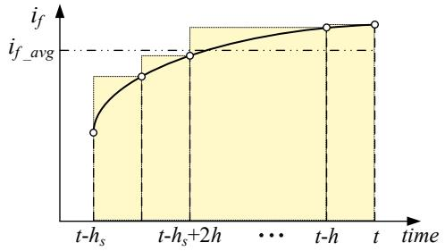  
Fig. 7. Average current excitation.

5) Solution of the CHB subsystem: By superimposing the equivalent current source of the DAB subsystem on the node voltage equation of the CHB subsystem, the CHB subsystem can sense the changes of the external system. Through one step solution, the state of the CHB subsystem at the moment of t can be obtained. As is well known, the introduction of a current source can cause the problem of time step delay in EMT simulation [27], [28]. Under this simulation framework, since the DAB subsystem completes the solution ahead of the CHB subsystem, the equivalent current source represents the current injected from the DAB to the CHB subsystem at the moment of t. This alignment ensures consistency between the equivalent current source and the companion circuit parameters of CHB components, eliminating the time step delay issue.

Once the state variables of the CHB subsystem are solved, the state of the entire system at t is known. The simulation advances from t-hs to t. By iteratively executing steps 1)-5), the DAB and CHB subsystems alternately solve their respective equations until reaching the specified simulation duration, thus completing the multirate simulation of PETs.

# III. INTEGRATION OF HIGH-PRECISION FIRING SIGNALS

The asynchronism between the switching instants and the solution instants is one of the reasons for the problems such as non-characteristic harmonics, oscillations, and DC offsets in EMT simulations [29]. In order to mitigate these impacts and accurately capture the changes of switches, EMT simulations conventionally adopt a time step approximating 1% of the switching period [30]. The proposed multirate simulation method drastically reduces unnecessary numerical calculations within the CHB subsystem. However, due to the high switching frequency of the DAB subsystem, the required time step is extremely small, resulting in a large computational burden. Therefore, in this section, the high-precision firing

signals are integrated with the multirate simulation method to further increase the time step of the DAB fast subsystem, enhancing overall simulation efficiency. At the same time, the processing of the current source switching model proposed above in the DAB subsystem is also explained in detail.

# A. High-Precision Firing Signals

Double-interpolation, which accurately determines the switching instants by detecting zero-crossing points of electrical quantities, is used in some commercial offline digital simulation software such as PSCAD/EMTDC [31]. However, the continuous interpolation and rollback process greatly reduces the efficiency of the simulation especially when there are a large number of switches. As a result, the time consumption of simulation of PETs is unacceptable. By interpolating the control signals within each time step, floating-point switching signals [32] with higher precision can be generated. Compared with the traditional binary 0/1 firing signals, floating-point signals contain information about the change instants of switches within the time step. Since this method does not require rolling back the simulation process, it can greatly improve the simulation efficiency of the converter. This technology has currently been applied to the RTDS commercial real-time digital simulator [33], [34], [35].

The firing signal is generated by comparing the modulation wave with the carrier wave. As shown in Fig. 8, at time t, traditional 0/1 switch signals utilize only the data at t. When the modulation wave is greater than the carrier wave, 1 is output; otherwise, 0 is output. In contrast, high-precision firing signals leverage the values of modulation wave and carrier wave at both t and t-h as well as their slopes. As the switching frequency cannot exceed the Nyquist frequency, there are at most two crossing points between the modulation wave and carrier wave within each simulation time step. These two situations are respectively demonstrated in Fig. 8(a) and (b).

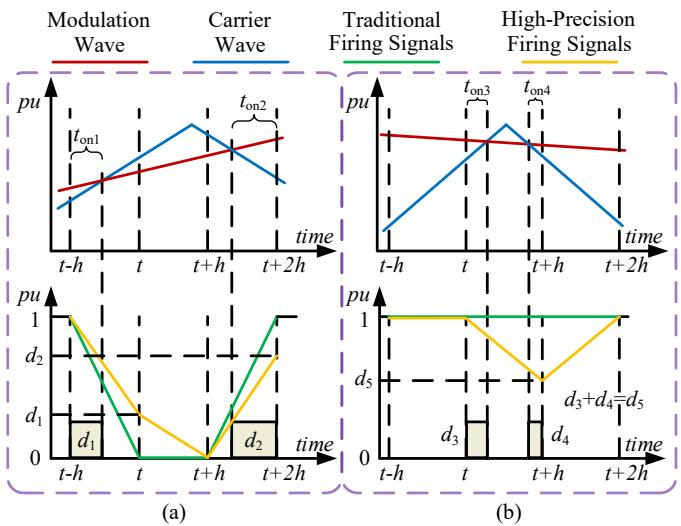  
Fig. 8. Interpolation of firing signals within one time step: (a) Single crossing point; (b) Two crossing points.

By determining the number of crossing points and interpolation, the duty cycle d of firing signal, that is, the high-

precision firing signal, can be obtained. It can be expressed as:

$$
d = \frac {t _ {\text {o n}}}{h} \tag {12}
$$

The cutoff frequency of the time averaging method has been presented in [31], which can be expressed as:

$$
f _ {\text {c u t o f f}} = \frac {1}{2 . 2 5 7 6 \cdot d t} \tag {13}
$$

where dt is the simulation time step. This cutoff frequency is close to the Nyquist frequency [30], which is the highest frequency that can be represented in discrete processes. However, in simulations that use traditional firing signals, to accurately capture the switching instant, the time step is usually set to at most 1/20 of the switching period according to the precision requirements [4], [36], [37]. Therefore, highprecision firing signals can reflect the high frequency process by using a relatively large simulation time step.

# B. Firing Signals of DAB in MNA

The two-value resistance model only has two states and cannot establish a mapping relationship with high-precision floating-point numbers. The current source model which is not constrained by ON/OFF states is the best way to represent floating-point numbers. The integration of high-precision firing signals with the multirate method requires adding the firing signals as variables within the node voltage equations of the DAB subsystem. In this paper, by introducing the currents on both sides of the high frequency transformer, a correlation between high-precision firing signals and the current flowing through each switch is established. Therefore, they can be reflected in the equation. In order to prevent the current source model from causing a time step delay in simulation, MNA is adopted to solve these additional unknown variables with the nodal voltages at the same time.

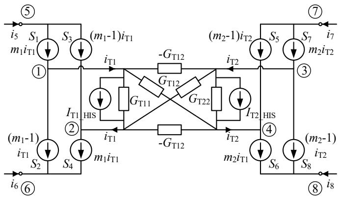  
Fig. 9. Relationship between high-precision firing signal and currents on both sides of high frequency transformer.

The relationship between the currents on both sides of the high frequency transformer in DAB and the firing signals of switches is shown in Fig. 9. The H-bridge-type circuits are connected to the transformer through nodes 1 to 4. Since the transformer is a two-port component, according to the reference direction shown in Fig. 9, the current $i _ { \mathrm { T 1 } }$ flowing into the primary side of the transformer from node 1 is equal to the current flowing out from node 2. The port composed of

nodes 3 and 4 has the same property.

Moreover, the firing signals of these switches in the bridge circuit are complementary, which means that when one switch group is conducting, the other switch group must be in the off state. $\mathrm { S } _ { 1 } , \mathrm { S } _ { 4 }$ and $\mathrm { S } _ { 2 } , \mathrm { \Delta } { \cal S } _ { 3 }$ are a pair of complementary switch groups. Assume that $m _ { 1 }$ is the firing signal for the switch group of $\mathrm { S } _ { 1 } , \mathrm { S } _ { 4 }$ . When $m _ { 1 } { = } 1$ , the current $i _ { \mathrm { T 1 } }$ flows through $\mathrm { S } _ { \mathrm { l } } ,$ $\mathrm { S } _ { 4 } ,$ while no current passes through $\mathrm { S } _ { 2 } , \mathrm { \Lambda } \mathrm { S } _ { 3 }$ . Conversely, when $m _ { 1 } { = } 0 , \ \mathrm { S } _ { 1 } .$ , $\mathrm { S } _ { 4 }$ have no current flowing through them, and $\mathrm { S } _ { 2 } , \mathrm { ~ } \mathrm { S } _ { 3 }$ carry a current $i _ { \mathrm { T 1 } }$ in the opposite direction to the reference direction. Consequently, the current passing through switches $\mathrm { S } _ { 1 } , \mathrm { S } _ { 4 }$ can be represented as $m _ { 1 } i _ { \mathrm { T 1 } } .$ , and the current flowing through $\mathrm { S } _ { 2 } ,$ S3 can be written as $( m _ { 1 } { - } 1 ) i _ { \mathrm { T } 1 }$ . When $m _ { 1 }$ takes on the form of a high-precision floating-point number, the strict complementary conduction behavior of switch groups evolves into a proportional distribution of the current $i _ { \mathrm { T 1 } }$ between the two groups of switches. For instance, when $m _ { 1 }$ $= 0 . 9$ , the switch group consisting of $\mathrm { S } _ { 1 } ,$ $\mathrm { S } _ { 4 }$ conducts 90% of the primary side current of transformer, while the remaining 10% is carried by the switch group of $\mathrm { S } _ { 2 } , \mathrm { S } _ { 3 } .$ . In the highprecision floating-point firing scenario, each node still satisfies Kirchhoff's current law, demonstrating the rationality of the relationship depicted in Fig. 9.

In MNA, as two extra unknown variables are added, two supplementary equations are required. The relationships among nodes 1, 2, 4 and 5 can be expressed as:

$$
\left\{ \begin{array}{l} v _ {\mathrm {n} 1} = m _ {1} v _ {\mathrm {n} 5} + \left(1 - m _ {1}\right) v _ {\mathrm {n} 6} \\ v _ {\mathrm {n} 2} = \left(1 - m _ {1}\right) v _ {\mathrm {n} 5} + m _ {1} v _ {\mathrm {n} 6} \end{array} \right. \tag {14}
$$

where ${ \nu _ { \mathrm { n } i } } ( i = 1 , 2 , 3 , . . . , 8 )$ are the nodal voltages. When $m _ { 1 }$ $= 1$ , node 1 is connected to node 5. Consequently, the voltages of the two nodes are equal. When $m _ { 1 } { = } 0 .$ , the voltage of node 1 is equal to that of node 6. The physical significance of $m _ { 1 }$ when it functions as a high-precision firing signal is identical to that of the previously mentioned current source. Similarly, the relationships between $\nu _ { \mathrm { n } 2 } , \nu _ { \mathrm { n } 5 }$ and $\nu _ { \mathrm { n 6 } }$ can be obtained.

Based on (14), the first equation to be supplemented is:

$$
v _ {n 1} - v _ {n 2} = (2 m _ {1} - 1) v _ {n 5} - (2 m _ {1} - 1) v _ {n 6} \tag {15}
$$

Similarly, the second supplementary equation can be expressed as:

$$
v _ {n 3} - v _ {n 4} = (2 m _ {2} - 1) v _ {n 7} - (2 m _ {2} - 1) v _ {n 8} \tag {16}
$$

The improved nodal voltage equation of Fig. 9 is shown in (17). In Fig. $9 , i _ { 5 } , i _ { 6 } , i _ { 7 } ,$ and $i _ { 8 }$ are the external currents flowing into the DAB.

In blocked mode, the switch groups do not have the complementary characteristics. The above relationships cannot reflect that all switches in the H-bridge are in the off state. The two-value resistance model is still needed to represent the state of diodes. To integrate these two cases, a small conductance is placed in parallel with the equivalent current source of the switch. During the deblocked mode, this conductance remains inactive. However, once the DAB enters the blocking state, the value of this parallel conductance toggles in line with the state of the diodes. Simultaneously, one can eliminate the rows and columns in the matrix corresponding to the extra unknown variables and then proceed with the solution.

# > REPLACE THIS LINE WITH YOUR MANUSCRIPT ID NUMBER (DOUBLE-CLICK HERE TO EDIT) <

$$
\left[ \begin{array}{c c c c c c c c c c} G _ {\mathrm {T} 1 1} & - G _ {\mathrm {T} 1 1} & G _ {\mathrm {T} 1 2} & - G _ {\mathrm {T} 1 2} & 0 & 0 & 0 & 0 & - 1 & 0 \\ - G _ {\mathrm {T} 1 1} & G _ {\mathrm {T} 1 1} & - G _ {\mathrm {T} 1 2} & G _ {\mathrm {T} 1 2} & 0 & 0 & 0 & 0 & 1 & 0 \\ G _ {\mathrm {T} 1 2} & - G _ {\mathrm {T} 1 2} & G _ {\mathrm {T} 2 2} & - G _ {\mathrm {T} 2 2} & 0 & 0 & 0 & 0 & 0 & - 1 \\ - G _ {\mathrm {T} 1 2} & G _ {\mathrm {T} 1 2} & - G _ {\mathrm {T} 2 2} & G _ {\mathrm {T} 2 2} & 0 & 0 & 0 & 0 & 0 & 1 \\ 0 & 0 & 0 & 0 & 0 & 0 & 0 & 0 & 2 m _ {1} - 1 & 0 \\ 0 & 0 & 0 & 0 & 0 & 0 & 0 & 0 & 1 - 2 m _ {1} & 0 \\ 0 & 0 & 0 & 0 & 0 & 0 & 0 & 0 & 0 & 2 m _ {2} - 1 \\ 0 & 0 & 0 & 0 & 0 & 0 & 0 & 0 & 0 & 1 - 2 m _ {2} \\ - 1 & 1 & 0 & 0 & 2 m _ {1} - 1 & 1 - 2 m _ {1} & 0 & 0 & 0 & i _ {7} \\ 0 & 0 & - 1 & 1 & 0 & 0 & 2 m _ {2} - 1 & 1 - 2 m _ {2} & 0 & i _ {8} \\ \end{array} \right] \left[ \begin{array}{l} v _ {\mathrm {n} 1} \\ v _ {\mathrm {n} 2} \\ v _ {\mathrm {n} 3} \\ v _ {\mathrm {n} 4} \\ v _ {\mathrm {n} 5} \\ v _ {\mathrm {n} 6} \\ v _ {\mathrm {n} 7} \\ v _ {\mathrm {n} 8} \\ i _ {\mathrm {T} 1} \\ i _ {\mathrm {T} 2} \end{array} \right] = \left[ \begin{array}{l} - I  \\ I  \\ - I  \\ I  \\ i _ {5} \\ i _ {6} \\ i _ {7} \\ i _ {8} \\ 0 \\ 0 \end{array} \right] \tag {17}
$$

# C. Reduced-order Expression of DAB

Due to the numerous unknowns in (17), direct solution will reduce the simulation efficiency. Through transformation, the reduced-order expression of DAB with only vn5, vn6, vn7 and vn8 is derived.

Rows 1–4 in (17) show that

$$
\left[ \begin{array}{l} i _ {\mathrm {T} 1} \\ i _ {\mathrm {T} 2} \end{array} \right] = \left[ \begin{array}{l l} G _ {\mathrm {T} 1 1} & G _ {\mathrm {T} 1 2} \\ G _ {\mathrm {T} 1 2} & G _ {\mathrm {T} 2 2} \end{array} \right] \left[ \begin{array}{l} v _ {\mathrm {n} 1} - v _ {\mathrm {n} 2} \\ v _ {\mathrm {n} 3} - v _ {\mathrm {n} 4} \end{array} \right] + \left[ \begin{array}{l} I _ {\mathrm {T} 1 \_ \text {H I S}} \\ I _ {\mathrm {T} 2 \_ \text {H I S}} \end{array} \right] \tag {18}
$$

Rows 5-8 and 9-10 in (17) can be expressed as:

$$
\left[ \begin{array}{l} i _ {5} \\ i _ {6} \\ i _ {7} \\ i _ {8} \end{array} \right] = \left[ \begin{array}{c c} 2 m _ {1} - 1 & 0 \\ 1 - 2 m _ {1} & 0 \\ 0 & 2 m _ {2} - 1 \\ 0 & 1 - 2 m _ {2} \end{array} \right] \left[ \begin{array}{l} i _ {\mathrm {T} 1} \\ i _ {\mathrm {T} 2} \end{array} \right] \tag {19}
$$

$$
\left[ \begin{array}{c} v _ {\mathrm {n} 1} - v _ {\mathrm {n} 2} \\ v _ {\mathrm {n} 3} - v _ {\mathrm {n} 4} \end{array} \right] = \left[ \begin{array}{c c} 2 m _ {1} - 1 & 0 \\ 0 & 2 m _ {2} - 1 \end{array} \right] \left[ \begin{array}{c} v _ {\mathrm {n} 5} - v _ {\mathrm {n} 6} \\ v _ {\mathrm {n} 7} - v _ {\mathrm {n} 8} \end{array} \right] \tag {20}
$$

Substituting (18) into (19) and combining with (20) yields:

$$
\begin{array}{l} \left[ \begin{array}{l} i _ {5} \\ i _ {6} \\ i _ {7} \\ i _ {8} \end{array} \right] = \left[ \begin{array}{c c} 2 m _ {1} - 1 & 0 \\ 1 - 2 m _ {1} & 0 \\ 0 & 2 m _ {2} - 1 \\ 0 & 1 - 2 m _ {2} \end{array} \right] \left[ \begin{array}{c c} G _ {\mathrm {T} 1 1} & G _ {\mathrm {T} 1 2} \\ G _ {\mathrm {T} 1 2} & G _ {\mathrm {T} 2 2} \end{array} \right] \left[ \begin{array}{c c} 2 m _ {1} - 1 & 0 \\ 0 & 2 m _ {2} - 1 \end{array} \right] \\ \cdot \left[ \begin{array}{c} v _ {\mathrm {n} 5} - v _ {\mathrm {n} 6} \\ v _ {\mathrm {n} 7} - v _ {\mathrm {n} 8} \end{array} \right] + \left[ \begin{array}{c c} 2 m _ {1} - 1 & 0 \\ 1 - 2 m _ {1} & 0 \\ 0 & 2 m _ {2} - 1 \\ 0 & 1 - 2 m _ {2} \end{array} \right] \left[ \begin{array}{l} I _ {\mathrm {T} 1 _ {-} \mathrm {H I S}} \\ I _ {\mathrm {T} 2 _ {-} \mathrm {H I S}} \end{array} \right] \tag {21} \\ \end{array}
$$

After rearrangement, (21) can be rewritten as:

$$
\boldsymbol {G} _ {\mathrm {D A B}} \left[ \begin{array}{l} v _ {\mathrm {n} 5} \\ v _ {\mathrm {n} 6} \\ v _ {\mathrm {n} 7} \\ v _ {\mathrm {n} 8} \end{array} \right] = \left[ \begin{array}{l} \left(1 - 2 m _ {1}\right) I _ {\mathrm {T} 1 \_ \text {H I S}} + i _ {5} \\ \left(2 m _ {1} - 1\right) I _ {\mathrm {T} 1 \_ \text {H I S}} + i _ {6} \\ \left(1 - 2 m _ {2}\right) I _ {\mathrm {T} 2 \_ \text {H I S}} + i _ {7} \\ \left(2 m _ {2} - 1\right) I _ {\mathrm {T} 2 \_ \text {H I S}} + i _ {8} \end{array} \right] \tag {22}
$$

In (22), $\mathbf { \Delta } G _ { \mathrm { D A B } } = \mathbf { \Delta } G _ { \mathrm { D A B } } ^ { \mathrm { T } } .$ , where

$$
\left\{ \begin{array}{l} G _ {\mathrm {D A B}} ^ {1 1} = G _ {\mathrm {T 1 1}} \left(2 m _ {1} - 1\right) ^ {2}, G _ {\mathrm {D A B}} ^ {1 3} = G _ {\mathrm {T 1 2}} \left(2 m _ {1} - 1\right) \left(2 m _ {2} - 1\right) \\ G _ {\mathrm {D A B}} ^ {1 2} = - G _ {\mathrm {D A B}} ^ {1 1}, G _ {\mathrm {D A B}} ^ {1 3} = - G _ {\mathrm {D A B}} ^ {1 4}, G _ {\mathrm {D A B}} ^ {2 2} = G _ {\mathrm {D A B}} ^ {1 1} \\ G _ {\mathrm {D A B}} ^ {2 3} = - G _ {\mathrm {D A B}} ^ {2 4} = - G _ {\mathrm {D A B}} ^ {1 3} \\ G _ {\mathrm {D A B}} ^ {3 3} = G _ {\mathrm {T 2 2}} \left(2 m _ {2} - 1\right) ^ {2}, G _ {\mathrm {D A B}} ^ {3 3} = - G _ {\mathrm {D A B}} ^ {3 4} = G _ {\mathrm {D A B}} ^ {4 4} \end{array} \right. \tag {23}
$$

In contrast to (17), (22) provides a reduced-order expression of DAB.

# IV. PERFORMANCE VALIDATION

In this section, a three phase CHB-DAB based PET system is used as a test case to verify the effectiveness of the proposed multirate method with high-precision firing signal for PETs simulation.

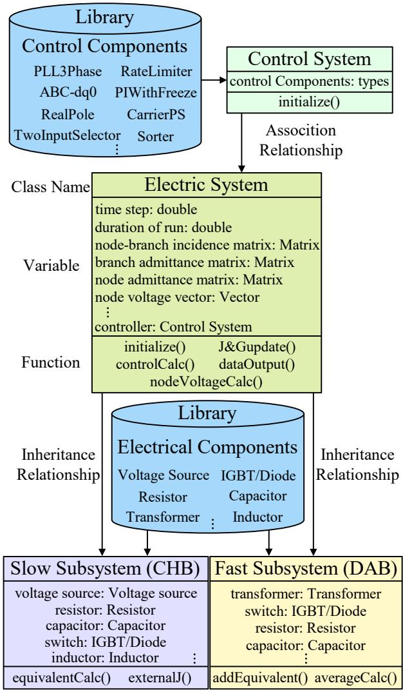  
Fig. 10. Class hierarchy diagram.

The C++ language is used to develop the simulation of this

multirate framework, which includes the solution of CHB and DAB subsystems. This program runs on a personal computer with an Intel(R) Core(TM) Ultra 7 255HX @ 2.40 GHz processor.

In this C++ program, the electric system class serves as the parent class, which includes the control system class, forming an association. The slow subsystem and fast subsystem, as subclasses, inherit all variables (attributes) and functions (methods) of the electric system class. Meanwhile, each subsystem has unique functions tailored to its respective simulation data transmission method. The class hierarchy is illustrated in Fig. 10.

Fig. 11 further details the functions of each module and the integration logic between them. The program's execution flow and functions are fully consistent with the multirate interaction framework shown in Fig. 6, representing its programmatic implementation.

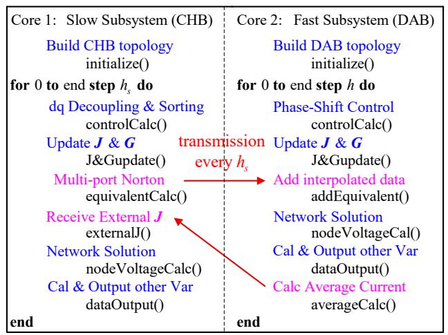  
Fig. 11. Multirate program execution flow.

By comparing with the TSR EMT simulation under the same simulation environment, the performance of the proposed method in terms of both precision and efficiency is demonstrated.

# A. Test System Introduction and Simulation Step Size Setting

The structure of the test case is consistent with that in Fig. 1. The specific parameters of the system are shown in TABLE I. In this test case, the CHB circuit of the PET utilizes a dqdecoupled dual-loop control to generate reference waveforms. The power exchange with the connected three-phase AC system through the high-voltage AC (HVAC) port is controlled by adjusting the amplitude and phase of these reference waveforms. Meanwhile, in combination with the voltage balancing strategy, the high-voltage DC (HVDC) port voltage of each power module is controlled. The outer loop active power control variable is the average DC voltage of the HVDC port PUs, and the reactive power control variable is set to 0, as shown in Fig. 12. The DAB circuit employs single phase-shift control to generate the reference phase-shift angle, as shown in Fig. 13. By adjusting the phases of the square waves generated by the two H-bridges, power transmission is achieved, and the voltage of the low-voltage DC (LVDC) port

is controlled.

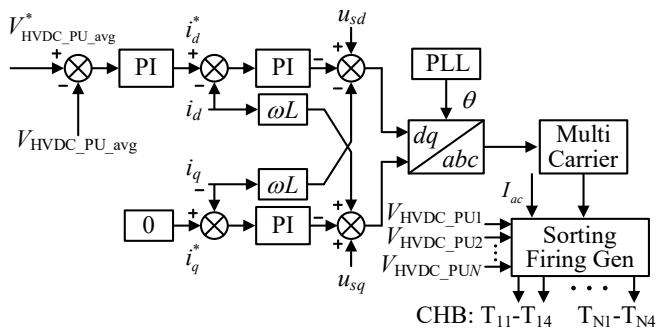

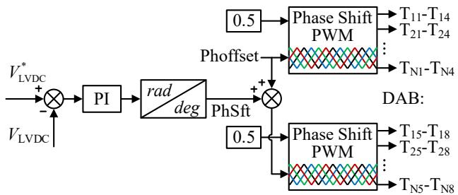  
Fig. 12. CHB closed-loop control strategy.   
Fig. 13. DAB single phase-shift control.

TABLE I PARAMETERS FOR CHB-DAB BASED PET TEST SYSTEM   

<table><tr><td>Symbols</td><td>Description</td><td>Value</td></tr><tr><td>fAC</td><td>AC system fundamental frequency (Hz)</td><td>50</td></tr><tr><td>fCHB</td><td>CHB switching frequency (Hz)</td><td>200</td></tr><tr><td>fDAB</td><td>DAB switching frequency (Hz)</td><td>5000</td></tr><tr><td>VL-L</td><td>Line-to-line RMS voltage on AC side (kV)</td><td>10</td></tr><tr><td>C1</td><td>HVDC port PU capacitance (μF)</td><td>4700</td></tr><tr><td>C2</td><td>LVDC port PU capacitance (μF)</td><td>150</td></tr><tr><td>N</td><td>Number of PUs in system</td><td>30</td></tr><tr><td>ST</td><td>Rated capacity of transformer (MVA)</td><td>0.25</td></tr><tr><td>XTpu</td><td>Leakage inductance of transformer (p.u.)</td><td>0.376</td></tr><tr><td>ITm</td><td>Magnetizing current of transformer (%)</td><td>0.4</td></tr><tr><td>Rload</td><td>LVDC output load (Ω)</td><td>4</td></tr></table>

As described above, considering the switching frequencies of the CHB and DAB, a time step of 2 μs for the TSR in PSCAD/EMTDC enables an accurate representation of the switching instants of the switches. Therefore, this result is taken as the benchmark in the proposed multirate simulation framework. The time step of the CHB subsystem is set to 50 μs, and that of the DAB subsystem is set to 25 μs, giving a rate ratio n of 2. Based on (13), a time step of approximately 25 μs would suffice to capture the changes occurring within the 17 kHz frequency range of the DAB circuit. The rate ratio n can be adjusted according to the target bandwidth to determine the appropriate simulation time step for the DAB subsystem.

# B. Accuracy Test

In this paper, the similarity between waveforms is quantified using the 2-norm of the difference between two

vectors. The relative error can be calculated by:

$$
E(\%) = \frac{\|x - y\|_{2}}{\|y\|_{2}} 100\% \tag{24}
$$

where E represents the percentage of relative error; x is the comparison vector; y is the reference vector. And ||*||2 denotes the 2-norm of a vector. Since the data dimensions generated by simulations with different time steps are inconsistent, when calculating the relative error, vectors of different dimensions are extracted at intervals of the least common multiple of the time steps to ensure that the vector norm can be calculated.

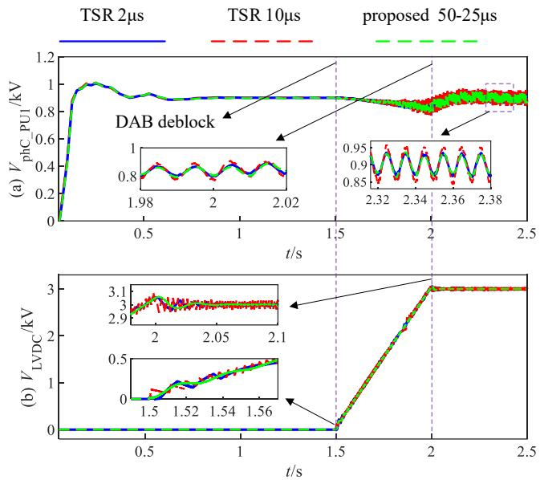

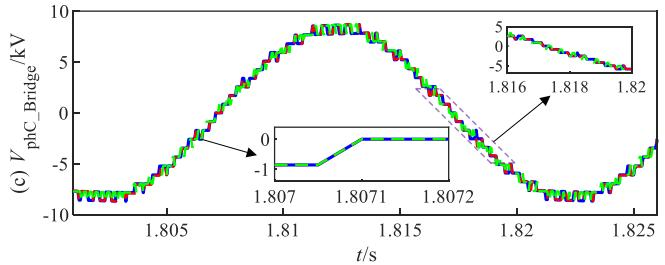  
Fig. 14. Comparison of TSR and proposed multirate method before fault: (a) HVDC port voltage of first PU in phase C; (b) LVDC port voltage; (c) voltage of the CHB arm in phase C.

The system operating conditions are set as follows:

1) During the time interval from 0 to 1.5 s, the DAB circuit is fully blocked while the CHB circuit is deblocked first to build up the HVDC port voltage of the PUs. At this stage, the PET is in a partially blocked state. 2) From 1.5 to 3.0 s, the DAB circuit is deblocked, and the LVDC port voltage gradually rises to the commanded value. At this stage, the PET is in a fully deblocked state. The system reaches steady state at approximately 2.3 s. 3) At 3.0 s, a short-circuit fault occurs at the LVDC port of the system. The DAB circuit is blocked within 2 ms after detection. The short-circuit fault persists for 0.1 s. 4) At 3.1 s, the fault is cleared, and DAB detects the clearance of the fault and restarts. The system enters the fault recovery process and returns to steady state after a period of control adjustment.

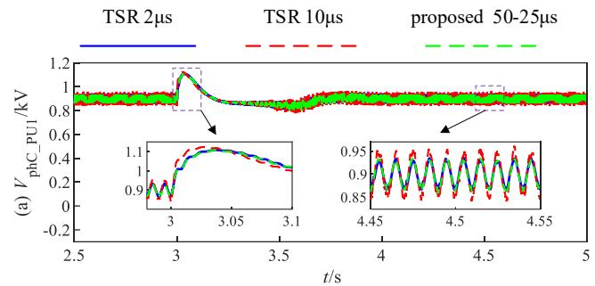

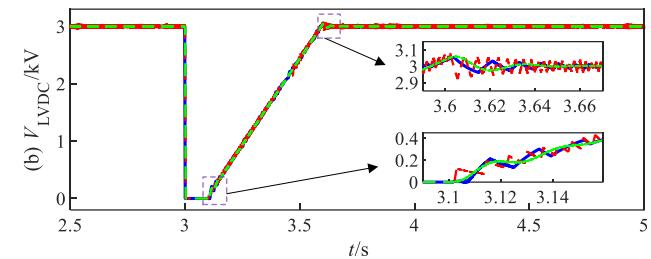

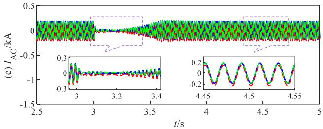

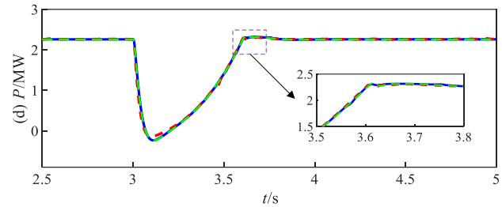

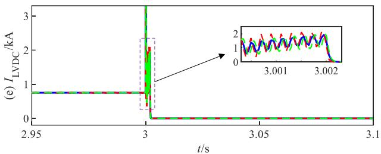  
Fig. 15. Comparison of TSR and proposed multirate method after fault: (a) HVDC port voltage of first PU in phase C; (b) LVDC port voltage; (c) HVAC port current; (d) active power; (e) LVDC port current.

1) Waveforms before the fault: Before the DAB is deblocked, CHB establishes the HVDC port voltage of each PU by regulating it to the command value of 0.9 kV, as shown in Fig. 14(a). The voltage of LVDC port rises after the DAB is deblocked at 1.5 s and stabilizes at 3 kV after 0.5 s, as depicted in Fig. 14(b). At the same time, the HVDC port voltage experiences a brief decline and subsequently recovers to the command value. The results indicate that when the time steps of the CHB subsystem and the DAB subsystem are set at 50 μs and 25 μs respectively, the proposed multirate method is

# > REPLACE THIS LINE WITH YOUR MANUSCRIPT ID NUMBER (DOUBLE-CLICK HERE TO EDIT) <

close to the benchmark TSR simulated at a unanimous time step of 2 μs, whereas the TSR simulated at 10 μs has large errors. Specifically, the relative errors of the proposed multirate method are 0.64% and 0.62% respectively, while those of the TSR with a 10 μs time step are 1.32% and 1.19%. The voltage of the CHB arm in phase C is shown in Fig. 14(c) which indicates that, compared with the TSR with a small time step, the proposed multirate method can still accurately insert and remove PUs when the time step of the CHB is enlarged to 50 μs. This validates the rationality of the time step selection for CHB subsystem and the necessity of enlarging the time step in specific areas for multirate simulation.

2) Waveforms during the fault and recovery process: A short-circuit fault takes place at 3 s. As depicted in Fig. 15, the HVDC port voltage of the first PU in phase C rises, the voltage of LVDC port drops to zero, the AC current decreases, and the active power fed into the HVAC port diminishes. After 2 ms, the DAB is blocked and the short-circuit current is cut off. Once the fault is cleared at 3.1 s, the DAB is deblocked. The voltage of LVDC port starts to rise and the active power transmission is resumed. The system returns to its pre-fault stable state at about 3.7 s. During this period, the relative errors of the HVDC and LVDC port voltage in the proposed multirate method are 0.51% and 0.52% respectively, while those of the TSR with 10 μs are 1.53% and 0.88%.

In conclusion, comparisons of these waveforms reveal that, whether in the steady state process or the transient process, the simulation results of the proposed multirate method highly overlap with those of the TSR method with a small time step. This indicates the correctness of the proposed method.

# C. Efficiency Test

On the premise of ensuring accuracy, the proposed multirate method reduces the numerical calculation times by reasonably increasing the simulation time step of each subsystem, thereby improving the simulation efficiency.

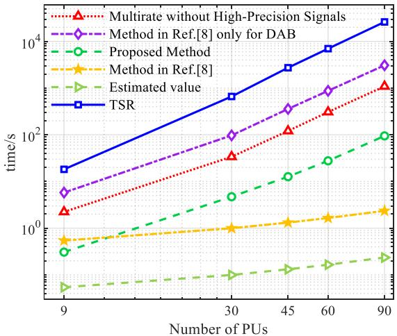  
Fig. 16. Comparison of total CPU time with different numbers of PUs.

Fig. 16, using a logarithmic scale, shows the actual time consumption of the proposed multirate method with a rate ratio n of 2 (50 μs for the CHB subsystem and 25 μs for the

DAB subsystem); the multirate method without high-precision firing signals (rate ratio n = 25, 50 μs for the CHB subsystem and 2 μs for the DAB subsystem); the 2 μs TSR; as well as the method in [8] and the node elimination method in [8] only for DAB, when simulating PETs with different numbers of PUs. All methods are implemented in C++, and the simulation duration is 0.2 s.

The results demonstrate that compared with the TSR, the multirate method without high-precision firing signals achieves a speedup of approximately 8 to 23 times under different numbers of PUs, and about 2 to 3 times faster than the method in [8] only for DAB. Moreover, the proposed method achieves a further speedup of around 7 to 11 times over the method without high-precision firing signals.

The number of nodes is identical for the method in [8] only for DAB and the multirate method. In this case, the efficiency improvement brought by network partitioning and multirate can be observed. However, the computational complexity of network solution is O(dim3), where dim denotes the matrix dimension. The method in [8] eliminates numerous internal nodes of the PETs, thus drastically reducing the computational load. Although the simulation efficiency is improved via the multirate in this paper, the number of nodes remains relatively large. Thus, it cannot exhibit the acceleration effect compared with [8] as the number of PUs increases. Fortunately, the multirate method proposed in this paper can be combined with [8] to further improve the simulation efficiency of PETs.

The floating-point computation volume of the test case in Fig. 1 for different methods is shown in TABLE II. The proposed method combined with [8] eliminates interconnection nodes and CHB cascaded nodes. Assuming both methods perform matrix inversion at each step, only the floating-point computation volume of the network solution part is counted. The order of magnitude of that in other parts does not exceed that of this part. (An ideal voltage source and its internal resistance are regarded as one node.)

TABLE II COMPARISON OF FLOATING-POINT COMPUTATION VOLUME   

<table><tr><td>Category</td><td>Method in Ref. [8]</td><td>Proposed Method combined with Ref. [8]</td></tr><tr><td>Simulation duration</td><td>0.2 s</td><td>0.2 s</td></tr><tr><td>Number of nodes</td><td>9</td><td>Fast Subsystem: 2
Slow Subsystem: 7</td></tr><tr><td>Time step</td><td>2 μs</td><td>Fast Subsystem: 25 μs
Slow Subsystem: 50 μs</td></tr><tr><td>Number of steps</td><td>100000</td><td>Fast Subsystem: 8000
Slow Subsystem: 4000</td></tr><tr><td>Floating-Point calculations</td><td>100000×9³</td><td>Fast Subsystem: 8000×2³
Slow Subsystem: 4000×7³</td></tr><tr><td>Total</td><td>7.3e7</td><td>1.4e6</td></tr></table>

TABLE II indicates that the proposed multirate method combined with the node elimination will yield an order of magnitude efficiency gain over [8]. Its estimated time value is shown in Fig. 16. This is the direction for future research.

# V. CONCLUSION

In this article, a multirate EMT simulation method of PETs

with high-precision firing signals is proposed. Given the frequency differences of the circuits at all levels of PETs, the multirate simulation method is applied to the interior of the power electronic apparatus. In addition, an interleaved data interaction framework is designed to achieve multirate simulation without additional time step delays between subsystems, guaranteeing the stability of the PETs simulation. A comparative analysis with PSCAD/EMTDC verifies that the proposed multirate method has the same accuracy as the TSR. Meanwhile, it achieves a speedup of about 23 times over TSR when only the multirate method is adopted. On this basis, after adopting high-precision firing signals, a further speedup of around 11 times is achieved. In the future, combining the proposed multirate method with the node elimination method will further improve the simulation efficiency.

# REFERENCES

[1] X. She, A. Q. Huang, F. Wang, and R. Burgos, “Wind energy system with integrated functions of active power transfer, reactive power compensation, and voltage conversion,” IEEE Trans. Ind. Electron., vol. 60, no. 10, pp. 4512-4524, Oct. 2013.   
[2] D. Shu, X. Xie, Q. Jiang, Q. Huang, and C. Zhang, “A novel interfacing technique for distributed hybrid simulations combining EMT and transient stability models,” IEEE Trans. Power Deliv., vol. 33, no. 1, pp. 130-140, Feb. 2018.   
[3] D. Shu, X. Xie, Z. Yan, V. Dinavahi, and K. Strunz, “A multi-domain co-simulation method for comprehensive shifted-frequency phasor DCgrid models and EMT AC-grid models,” IEEE Trans. Power Electron., vol. 34, no. 11, pp. 10557-10574, Nov. 2019.   
[4] A. M. Gole et al., “Guidelines for modeling power electronics in electric power engineering applications,” IEEE Trans. Power Deliv., vol. 12, no. 1, pp. 505-514, Jan. 1997.   
[5] T. Zhao, G. Wang, S. Bhattacharya, and A. Q. Huang, “Voltage and power balance control for a cascaded h-bridge converter-based solidstate transformer,” IEEE Trans. Power Electron., vol. 28, no. 4, pp. 1523-1532, Apr. 2013.   
[6] T. Zhao, J. Zeng, S. Bhattacharya, M. E. Baran, and A. Q. Huang, “An average model of solid state transformer for dynamic system simulation,” in Proc. IEEE Power Energy Soc. Gen. Meeting (PESGM), Calgary, AB, Canada, 2009, pp. 1-8.   
[7] P. Wang, X. Chen, C. Tong, P. Jia, and C. Wen, “Large- and smallsignal average-value modeling of dual-active-bridge DC–DC converter with triple-phase-shift control,” IEEE Trans. Power Electron., vol. 36, no. 8, pp. 9237-9250, Aug. 2021.   
[8] J. Xu et al., “High-speed electromagnetic transient (EMT) equivalent modelling of power electronic transformers,” IEEE Trans. Power Deliv., vol. 36, no. 2, pp. 975-986, Apr. 2021.   
[9] M. Feng et al., “Hierarchical modeling scheme for high-speed electromagnetic transient simulations of power electronic transformers,” IEEE Trans. Power Electron., vol. 36, no. 9, pp. 9994-10004, Sep. 2021.   
[10] M. Feng, C. Gao, J. Xu, C. Zhao, and G. Li, “A novel decoupled EMT approach and parallel simulation framework for modularized solid-state transformers,” IEEE Trans. Power Deliv., vol. 38, no. 5, pp. 3285-3295, Oct. 2023.   
[11] M. Feng, C. Gao, J. Xu, C. Zhao, and G. Li, “Modeling for complex modular power electronic transformers using parallel computing,” IEEE Trans. Ind. Electron., vol. 70, no. 3, pp. 2639-2651, Mar. 2023.   
[12] R. Kuffel et al., “Expanding an analogue HVDC simulator's modelling capability using a real-time digital simulator (RTDS),” in Proc. 1st Int. Conf. Digit. Power System Simulators, Texas, USA, 1995, pp. 199-204.   
[13] S. Y. R. Hui, K. K. Fung, M. Q. Zhang, and C. Christopoulos, “Variable time step technique for transmission line modelling,” IEE Proceedings A (Science, Measurement and Technology), vol. 140, pp. 299-302, Jul. 1993.   
[14] A. Benigni, A. Monti, and R. A. Dougal, “Latency-based approach to the simulation of large power electronics systems,” IEEE Trans. Power Electron., vol. 29, no. 6, pp. 3201-3213, Jun. 2014.   
[15] F. A. Moreira, J. R. Marti, L. C. Zanetta, and L. R. Linares, “Multirate

simulations with simultaneous-solution using direct integration methods in a partitioned network environment,” IEEE Trans. Circuits Syst. I-Regul. Pap., vol. 53, no. 12, pp. 2765-2778, Dec. 2006.   
[16] F. A. Moreira and J. R. Marti, “Latency techniques for time-domain power system transients simulation,” IEEE Trans. Power Syst., vol. 20, no. 1, pp. 246-253, Feb. 2005.   
[17] V. A. Galván, J. R. Martí, H. W. Dommel, J. A. Gutiérrez-Robles, and J. L. Naredo, “MATE multirate modelling of power electronic converters with mixed integration rules,” in Proc. Power Syst. Comput. Conf. (PSCC), Genoa, Italy, 2016, pp. 1-7.   
[18] D. Shu, X. Xie, Q. Jiang, G. Guo, and K. Wang, “A multirate EMT cosimulation of large AC and MMC-based MTDC systems,” IEEE Trans. Power Syst., vol. 33, no. 2, pp. 1252-1263, Mar. 2018.   
[19] T. Kato, K. Inoue, T. Fukutani, and Y. Kanda, “Multirate analysis method for a power electronic system by circuit partitioning,” IEEE Trans. Power Electron., vol. 24, no. 12, pp. 2791-2802, Dec. 2009.   
[20] Y. L. Kuo and M. L. Liou, “Computer-aided analysis of electronic circuits: algorithms and computational techniques,” Proc. IEEE, vol. 65, no. 6, pp. 991-992, Jun. 1977.   
[21] N. Watson and J. Arrillaga, “Power systems electromagnetic transients simulation,” in IEE Power and Energy Series 39, U.K: London, 2003.   
[22] H. W. Dommel, “Digital computer solution of electromagnetic transients in single-and multiphase networks,” IEEE Trans. Power App. Syst., vol. PAS-88, no. 4, pp. 388-399, Apr. 1969.   
[23] C. Ho, A. Ruehli, and P. Brennan, “The modified nodal approach to network analysis,” IEEE Trans. Circuits Syst., vol. 22, no. 6, pp. 504-509, Jun. 1975.   
[24] J. Mahseredjian, S. Dennetière, L. Dubé, B. Khodabakhchian, and L. Gérin-Lajoie, “On a new approach for the simulation of transients in power systems,” Electr. Power Syst. Res., vol. 77, no. 11, pp. 1514-1520, Sep. 2007.   
[25] P. S. R. Murty, “Chapter 5 - building of network matrices,” in Power Systems Analysis, 2nd ed., Boston: Butterworth-Heinemann, 2017, pp. 69-111.   
[26] Z. Boming, X. Niande, and W. Shiying, “Unified piecewise solution of power-system networks combining both branch cutting and node tearing,” Int. J. Electr. Power Energy Syst., vol. 11, no. 4, pp. 283-288, Oct. 1989.   
[27] W. Ren et al., “Interfacing issues in real-time digital simulators,” IEEE Trans. Power Deliv., vol. 26, no. 2, pp. 1221-1230, Apr. 2011.   
[28] M. Dargahi, A. Ghosh, P. Davari, and G. Ledwich, “Controlling current and voltage type interfaces in power-hardware-in-the-loop simulations,” IET Power Electron., vol. 7, no. 10, pp. 2618-2627, Oct. 2014.   
[29] B. De Kelper, L. A. Dessaint, V. Q. Do, and J.-C. Soumagne, “An algorithm for accurate switching representation in fixed-step simulation of power electronics,” in Proc. IEEE Power Eng. Soc. Winter Meet., Singapore, 2000, pp. 762-767.   
[30] J. C. G. de Siqueira, B. D. Bonatto, J. R. Martí, J. A. Hollman, and H. W. Dommel, “Optimum time step size and maximum simulation time in EMTP-based programs,” in Proc. Power Syst. Comput. Conf., Wroclaw, Poland, 2014, pp. 1-7.   
[31] K. L. Lian and P. W. Lehn, “Real-time simulation of voltage source converters based on time average method,” IEEE Trans. Power Syst., vol. 20, no. 1, pp. 110-118, Feb. 2005.   
[32] F. Zhang, W. Gu, Y. Zhang, L. Wang, and W. Li, “General linearized model of voltage source converter with fixed nodal admittance matrix,” IEEE Trans. Power Electron., vol. 39, no. 10, pp. 12143-12148, Oct. 2024.   
[33] “The universal converter model for enhanced real-time power electronics simulation,” Accessed: Jul. 2025. [Online]. Available: https://www.rtds. com/BlogPosts/UCM   
[34] H. Ding, X. Shi, Y. Qi, C. Jegues, and Y. Zhang, “Real-time simulations of microgrids: industrial case studies,” in Microgrids: Theory and Practice, pp. 615-631, 2024.   
[35] Y. Qi, H. Ding, S. Shi, Y. Zhang and A. Gole, “High efficiency modeling of multi-layer cascaded dual-active-bridge (DAB) units on real-time simulator,” in Proc. IEEE Power Energy Soc. Gen. Meeting (PESGM), Seattle, WA, USA, 2024, pp. 1-5.   
[36] M. Matar and R. Iravani, “FPGA implementation of the power electronic converter model for real-time simulation of electromagnetic transients,” IEEE Trans. Power Deliv., vol. 25, no. 2, pp. 852-860, Apr. 2010.   
[37] J. Zheng et al., “A semi-implicit parallel leapfrog solver with half-step sampling technique for FPGA-based real-time HIL simulation of power converters,” IEEE Trans. Ind. Electron., vol. 71, no. 3, pp. 2454-2464, Mar. 2024.