Received 30 July 2024, accepted 12 September 2024, date of publication 16 September 2024, date of current version 30 September 2024.

Digital Object Identifier 10.1109/ACCESS.2024.3462255

# RESEARCH ARTICLE

# Electromagnetic Transient Modeling of Asynchronous Machine in Modelica, Accuracy, and Performance Assessment

ALIREZA MASOOM 1, (Member, IEEE), AND JEAN MAHSEREDJIAN 2, (Life Fellow, IEEE)

1Hydro-Québec Research Institute, Varennes, QC J3X 1S1, Canada   
2Department of Electrical Engineering, Polytechnique Montréal, Montreal, QC H3T 1J4, Canada

Corresponding author: Alireza Masoom (masoom.alireza@hydroquebec.com)

This work was supported by NSERC, Hydro-Québec, RTE, EDF, and OPAL-RT as a part of the industrial chair ‘‘Multi Time-Frame Simulation of Transients for Large Scale Power Systems.’’

ABSTRACT Classical EMT-type simulators are mostly programmed in procedural languages, e.g. Fortran or C. In these languages, the focus is mainly on the solution methods. Modern languages, such as Modelica, are declarative and primarily focused on modeling and simulation. Modelica offers a much higher abstraction level, which makes the codes more concise and understandable. This paper contributes to the electromagnetic transient modeling and simulation of asynchronous machines in Modelica. In this paper, the modeling of a three-phase squirrel cage (single and double cage) and wound-rotor induction machine in three different reference frames is described and implemented. The accuracy and performance of Modelica models are compared and validated with the classical modeling approach used in the reference software EMTP. It is demonstrated that Modelica-based models with variable-step solvers offer fast and accurate results for time-domain simulations of motor sequential startup cases.

INDEX TERMS Asynchronous machine, sequential start-up, Modelica, equation-based modeling, variablestep solver.

# I. INTRODUCTION

Electromagnetic Transient (EMT) modeling and simulation deal with power electric components and systems in the form of differential equations for the study of a wideband range of phenomena such as switching, lightning, ferroresonace, and electromechanical oscillations [1]. The commonly used EMT-detailed models are implemented either using the block-diagram programming approach, e.g., Simscape Electrical Specialized Power System [2], or using an imperative language such as Fortran and C++ in, for example, EMTP® [3]. The block-diagram approach is at a higher level, and easily accessible, but the modeler must define the flow of information and the sequence of blocks.

Asynchronous machines (ASM) are widely used in power systems in the form of motors or generators in renewable

The associate editor coordinating the review of this manuscript and approving it for publication was Lei Zhao

energy sources, such as the Doubly Fed Induction Generator. Modeling of ASMs is principally based on the selectable reference frame. In the classical modeling approach, first, the differential equations of the ASM are discretized using a fixed-step solver, then using the companion circuit, the model is represented through a Norton equivalent (NE) in modifiedaugmented-nodal analysis (MANA) in [3], for example. The NE is based on a given numerical integration technique, such as commonly used trapezoidal integration, for example. In [3], it is optionally possible to iterate with network equations to achieve higher accuracy. Although such a solution method is fast and suitable for large circuits, it relies on a specific solver and detailed coding of all equations and procedures. Spurious oscillations can be suppressed using a damping resistor in parallel with inductors in the machine model [4]. In the classical approach, the controllers are modeled separately from the main electrical network. In some simulation packages [2], the machine models are

implemented using a current source. This approach may typically cause numerical instability problems, especially with larger time steps. To preserve simulation stability, a resistance whose value is dependent on the simulation time-step can be connected to the machine terminals [2].

Modelica [5] is an object-oriented declarative language. The modeler’s concentration is on model equations rather than giving a stepwise algorithm on how to achieve the desired goal. In Modelica, a model can be explicitly described by its Differential-Algebraic Equations and block diagrams at a much higher abstraction level and most importantly, it is independent of the underlying solution method. Modelica can be linked to various EMT-type codes through FMI [6], [7]. Modelica supports a graphical user interface (GUI) for designing the model symbol and drawing the network diagram. It simplifies the component connectivity checks, documentation, and observing the results as well. Several integration methods, such as the trapezoidal, backward Euler, DASSL [8], and IDA [9] are currently available in Modelica simulators, e.g. OpenModelica [10] and Dymola [11].

In Modelica, each component is coded by a specialized class model or block (can be used in the block diagram approach). Other types of classes exist to support modeling, including function (to provide algorithmic contents), package (to provide a structuring mechanism), connector (to define the model terminals), and partial model (used as base). In the class model, each electrical component is represented by the parameters, variables, and finally, the relation between variables of a model regardless of which one is known or unknown. During the compiling of Modelica codes, a flattening procedure is run to map the hierarchical structure of a model into a set of differential, algebraic and discrete equations. The solution direction of equations will adapt to the data flow dependencies between the equations. The analysis is not just sorting but also manipulation of equations, which includes, for example, index reduction and tearing of equations, to convert the coefficient matrix into block lower triangular form.

The Modelica language is frequently used in phasor domain simulations [12], for voltage and transient stability applications [13]. OpenIMDML [14], for example is a specialized library for simulations of drives and inductions machines in phasor domain. The existing machine models in the Modelica Standard Library [15] provide only basic models with several limitations and do not allow to perform EMT-type detailed simulations. The authors of this paper recently considered the Modelica language for EMT simulations [16], [17] including power electronics [18]. In addition, some other efforts have been carried out to accelerate the simulations using data locality and vectorization techniques [19] and compiled models in Dynawo [20].

This paper focuses on EMT-detailed asynchronous machine models (single and double cages, wound-rotor) development in Modelica. It is demonstrated that the modern approach helps modelers concentrate on modeling rather than the solution methods. In the numerical examples, the

performance and accuracy of ASM models are tested during fault and network islanding. This paper also presents the advantages of variable-step solvers for the simulation and analysis of motor sequential start-ups. It is also demonstrated that simulation converges directly with different tolerances and without the addition of artificial components.

This paper is organized as follows. In Section II, the theory of ASM models is described. In Section III, the implementation of the models in Modelica is presented. The models are validated using three examples in Section IV.

# II. ASYNCHRONOUS MACHINE THEOROTICAL DESCRPTION

# A. WOUND ROTOR AND SINGLE SQUIRREL CAGEMACHINES

A single squirrel cage machine is widely used as a motor in industry and can be represented as a wound-rotor machine in which the terminals are short-circuited. Therefore, the model of the wound-rotor machine will be discussed in this section. Fig. 1 shows the q-axis equivalent circuit of a wound-rotor ASM. The following equations describe the abc to reference frame transformations applied for ASM [21].

$$
\mathbf {v} _ {q d s} = \mathbf {P} (\theta) \mathbf {v} _ {a b c s} \tag {1}
$$

$$
\mathbf {v} _ {q d r} = \mathbf {P} (\beta) \mathbf {v} _ {a b c r} \tag {2}
$$

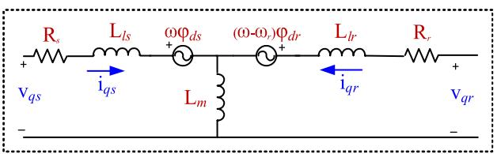  
FIGURE 1. The q-axis equivalent circuit of a wound-rotor ASM in time-domain.

where P denotes the Park transformation matrix, θ and $\beta =$ $\theta - \theta _ { r }$ represent the angular positions of the reference frame and the difference between the positions of the reference frame and the rotor position, θr , respectively. Depending on the chosen reference frame, θ can take different values; for example, if the rotor reference frame is chosen, then $\theta = \theta _ { r }$ .

Electrical equations of ASM can be declared by selecting the current or flux as independent variables, but from the simulation standpoint, if flux is chosen as the state variable, in the voltage equations only one derivative of flux appears, which causes more efficient computations. Equation (3) represents the electrical behavior of an ASM by a fourth-order nonlinear flux state-space model in per-unit (pu) form. In the following equations, bold uppercase represents matrices, bold lowercase denotes vectors and p is the derivative operator.

$$
p \boldsymbol {\varphi} = \omega_ {\text {b a s e}} (\mathbf {A} \boldsymbol {\varphi} + \mathbf {v}) \tag {3}
$$

$$
\mathbf {A} = - \left(\mathbf {R L} ^ {- 1} + \mathbf {W}\right) \tag {4}
$$

$$
\mathbf {i} = \mathbf {L} ^ {- 1} \boldsymbol {\varphi} \tag {5}
$$

$$
\mathbf {i} _ {a b c s} = \mathbf {P} ^ {- 1} (\theta) \mathbf {i} _ {q d s} \tag {6}
$$

$$
\mathbf {i} _ {a b c r} = \mathbf {P} ^ {- 1} (\beta) \mathbf {i} _ {q d r} \tag {7}
$$

where

$$
\boldsymbol {\varphi} = \left[ \begin{array}{l l l l} \varphi_ {q s} & \varphi_ {d s} & \varphi_ {q r} & \varphi_ {d r} \end{array} \right] ^ {\mathrm {T}} \tag {8}
$$

$$
\mathbf {v} = \left[ v _ {q s} v _ {d s} v _ {q r} v _ {d r} \right] ^ {\mathrm {T}} \tag {9}
$$

$$
\mathbf {i} = \left[ \begin{array}{l l l l} \mathrm {i} _ {q s} & \mathrm {i} _ {d s} & \mathrm {i} _ {q r} & \mathrm {i} _ {d r} \end{array} \right] ^ {\mathrm {T}} \tag {10}
$$

$$
\mathbf {R} = \operatorname {d i a g} \left(\mathrm {R} _ {s}, \mathrm {R} _ {s}, \mathrm {R} _ {r}, \mathrm {R} _ {r}\right) \tag {11}
$$

$$
\begin{array}{l} \mathbf {L} = \left[ \begin{array}{c c c c} \mathrm {L} _ {l s} + \mathrm {L} _ {m} & 0 & \mathrm {L} _ {m} & 0 \\ 0 & \mathrm {L} _ {l s} + \mathrm {L} _ {m} & 0 & \mathrm {L} _ {m} \\ \mathrm {L} _ {m} & 0 & \mathrm {L} _ {l p r} + \mathrm {L} _ {m} & 0 \\ 0 & \mathrm {L} _ {m} & 0 & \mathrm {L} _ {l p r} + \mathrm {L} _ {m} \end{array} \right] (12) \\ \mathbf {W} = \left[ \begin{array}{c c c c} 0 & \omega & 0 & 0 \\ - \omega & 0 & 0 & 0 \\ 0 & 0 & 0 & \omega - \omega_ {r} \\ 0 & 0 & - (\omega - \omega_ {r}) & 0 \end{array} \right] (13) \\ \end{array}
$$

In the above equations, all parameters and variables are computed on the stator side and the indices s and r represent the stator and rotor, respectively. The variables $\mathbf { v } _ { a b c s }$ and $\mathbf { v } _ { a b c r }$ are the stator and rotor terminal voltages; the vectors v, i, and φ denote the stator and rotor voltages; currents, and flux linkages in the qd frame, $\mathbf { i } _ { a b c s }$ and $\mathbf { i } _ { a b c i }$ r are the stator and rotor current vectors. Rs and ${ \sf R } _ { r }$ are stator and rotor resistances. L is a symmetrical matrix, and $\mathrm { L } _ { l s }$ , $\mathrm { L } _ { l p r }$ and $\mathrm { L } _ { m }$ indicates the stator and rotor leakage inductances and mutual inductance respectively. In (13), for the rotor reference frame, $\omega = \omega _ { r }$ , for stator reference frame $\omega = 0$ and finally for synchronous reference frame, $\omega = 1$ .

The mechanical equations in pu that describe the dynamics of the single mass rotor are given as:

$$
\mathrm {T} _ {e} = \varphi_ {d s} \mathrm {i} _ {q s} - \varphi_ {q s} \mathrm {i} _ {d s} \tag {14}
$$

$$
p \omega_ {r} = \frac {1}{2 \mathrm {H}} \left(\mathrm {T} _ {e} - \mathrm {T} _ {m}\right) \tag {15}
$$

$$
p \theta_ {r} = \omega_ {\text {b a s e}} \omega_ {r} \tag {16}
$$

where $\mathrm { T } _ { e }$ represents the electromagnetic torque, $\omega _ { b a s e }$ is the base electrical angular velocity in radian per second and H represents the inertia constant in pu-s. It is noted the mechanical equations can be easily extended to a multi-mass system.

For single-cage ASM, the terminals of rotor windings are short-circuited, therefore, (9) is given as follows. Other equations remain intact.

$$
\mathbf {v} = \left[ \begin{array}{l l l} \mathrm {v} _ {q s} & \mathrm {v} _ {d s} & 0 & 0 \end{array} \right] ^ {\mathrm {T}} \tag {17}
$$

# B. DOUBLE-CAGE INDUCTION MOTOR

Double-cage induction motors are used in applications where high starting torque is required. This arrangement increases the rotor resistance which is directly proportional to the starting torque of an induction motor. (9) Fig. 2 shows the q-axis equivalent circuit of a double-cage rotor for timedomain solution. The equivalent circuit is based on EMTP and differs from other EMT-type simulation packages, where the second cage is represented by duplicating and parallel connection of the single-cage rotor model [23]. Likewise, the

same circuit is obtained for d-axis by replacing the indices and reversing the polarity of speed voltage sources.

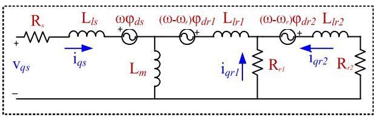  
FIGURE 2. The q-axis equivalent circuit of a double-cage-rotor in time-domain.

Equations (1)-(7) and (14)-(16) remain valid for the double-cage machines, Equations (8)-(13) are re-defined as (18)-(23), shown at the bottom of the next page.

In the above equations, indices r1 and r2 represent the properties of cage 1 and 2 respectively. In (23), $_ { \mathrm { L } _ { l r 1 } }$ and Llr2 are the leakage inductances of cages 1 and 2, respectively.

# III. MODEL IMPLEMENTATION IN MODELICA

This section presents the modeling of wound-rotor ASM in Modelica. Fig. 3 shows the high-level Modelica codes for the implementation of associated equations. The definition of variables and parameters is hidden due to space limitations and only the equation compartment is shown. In these pieces of code, firstly, the rotating reference is selected. The stator and rotor winding terminals are respectively represented by Ps and Pr. In Modelica, the physical terminal is coded as connector class and is composed of 3 pins (pin [1], pin [2], and pin [3]). For each pin, two variables; voltage (denoted by v), and current (denoted by i), are defined. Current is characterized as a flow variable. When two pins are connected, it means the connector variables without the flow prefix are equal (i.e. v) and the sum of corresponding connector variables with the flow prefix (i.e. i) equals zero. Then, using the selected reference frame, the stator and rotor voltage vector, denoted respectively by vqds and vqdr are computed. The Park transform is coded in a separate class (i.e. function) and denoted by P. The general rotation matrix,W is coded as per (13). The elements of this matrix are time-variant, and change based on the selected reference frame. Then, the state space electrical equation of ASM is implemented. In this equation, flux, phi, is a vector of state variables and defined as per (3). Stator and rotor current vector iqd_SR, is calculated using (5). Equation (10) defines the elements of this vector. Then, the stator and rotor currents are converted to abc frame.

Computation of electromagnetic torque and other electromechanical equations are coded as per (14)-(16). One can see that Modelica offers high-level and understandable codes in a few lines that match the equations of the model. In this approach, the equations are defined by $\cdots = \ j$ and the unknowns can lie on both sides, and there is no pre-defined causality (input/output data flow). There is no constraint to connect the terminals of the machine to the voltage or current source. The simulation engine must reorder the equations symbolically to determine their execution order.

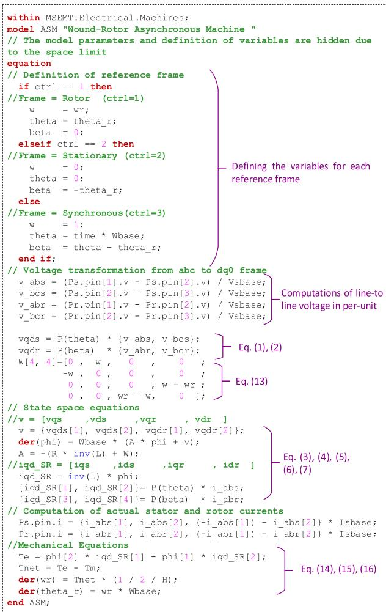  
FIGURE 3. Modelica code for implementation of wound-rotor ASM.

Fig. 4 shows the pieces of code for modeling of doublecage ASM. One can see that the modeling of double-cage

ASM is easily achieved by minimum manipulations in the existing codes (outline on this figure). For example, the matrices W is redefined as (22), the pin Pr is removed, and the voltage vector is modified as per (19). The current vector should be changed according to (20). Eq. (7) is re-used for computation of current of the second cage. The electrical equations (3)-(5) and mechanical ones (14)-(16) are remained intact.

Fig. 5. shows the icon and GUI designed for wound-rotor ASM. One can see the electrical pins (i.e. Ps and Pr) and control pins (e.g. Tm) for electrical and control connection. The GUI connectivity check prevents the user from connecting the electrical and control signal pins together wrongly. In addition, Modelica provides the properties to categorize the model parameters, and to change the units of parameters. Also, a graphical interface is available to plot variables from simulated models.

# IV. NUMERICAL TESTS AND VALIDATION

In this section, three numerical case studies are presented to compare the accuracy, performance, and numerical stability of Modelica ASM modeling with EMTP. All simulations are performed in OpenModelica, an open-source Modelica compiler in ODE mode.

# A. CASE STUDY 1, MODEL VALIDATION

Fig. 6 shows a circuit case for the model validation of the single-cage ASM during startup and short-circuit events [23]. The machine is a 900 hp, 2.4 kV, 4-pole motor with full-load power factor of 88 %, full-load current of 202 A, stator resistance of 0.08 , rotor resistance of 0.09 , stator leakage reactance of 0.32 , rotor leakage reactance at locked rotor of 0.45 ; the magnetizing reactance is 16 , full load slip is 0.15%, and inertia constant H is 1 s. The mechanical torque of the motor is modeled using the nonlinear block Fu,

$$
\boldsymbol {\varphi} = \left[ \begin{array}{l l l l l l} \varphi_ {q s} & \varphi_ {d s} & \varphi_ {q r 1} & \varphi_ {d r 1} & \varphi_ {q r 2} & \varphi_ {d r 2} \end{array} \right] ^ {\mathrm {T}} \tag {18}
$$

$$
\mathbf {v} = \left[ v _ {q s} v _ {d s} 0 0 0 0 \right] ^ {\mathrm {T}} \tag {19}
$$

$$
\mathbf {i} = \left[ \begin{array}{l l l l l l} \mathrm {i} _ {q s} & \mathrm {i} _ {d s} & \mathrm {i} _ {q r 1} & \mathrm {i} _ {d r 1} & \mathrm {i} _ {q r 2} & \mathrm {i} _ {d r 2} \end{array} \right] ^ {\mathrm {T}} \tag {20}
$$

$$
\mathbf {R} = \operatorname {d i a g} \left(\mathrm {R} _ {s}, \mathrm {R} _ {s}, \mathrm {R} _ {r 1}, \mathrm {R} _ {r 1}, \mathrm {R} _ {r 2}, \mathrm {R} _ {r 2}\right) \tag {21}
$$

$$
\mathbf {W} = \left[ \begin{array}{c c c c c c} 0 & \omega & 0 & 0 & 0 & 0 \\ - \omega & 0 & 0 & 0 & 0 & 0 \\ 0 & 0 & 0 & \omega - \omega_ {r} & 0 & 0 \\ 0 & 0 & - (\omega - \omega_ {r}) & 0 & 0 & 0 \\ 0 & 0 & 0 & \omega - \omega_ {r} & 0 & \omega - \omega_ {r} \\ 0 & 0 & - (\omega - \omega_ {r}) & 0 & - (\omega - \omega_ {r}) & 0 \end{array} \right] \tag {22}
$$

$$
\mathbf {L} = \left[ \begin{array}{c c c c c c} \mathrm {L} _ {l s} + \mathrm {L} _ {m} & 0 & \mathrm {L} _ {m} & 0 & \mathrm {L} _ {m} & 0 \\ 0 & \mathrm {L} _ {l s} + \mathrm {L} _ {m} & 0 & \mathrm {L} _ {m} & 0 & \mathrm {L} _ {m} \\ \mathrm {L} _ {m} & 0 & \mathrm {L} _ {b 1} + \mathrm {L} _ {m} & 0 & \mathrm {L} _ {b 1 1} + \mathrm {L} _ {m} & 0 \\ 0 & \mathrm {L} _ {m} & 0 & \mathrm {L} _ {b r 1} + \mathrm {L} _ {m} & 0 & \mathrm {L} _ {b r 1} + \mathrm {L} _ {m} \\ \mathrm {L} _ {m} & 0 & \mathrm {L} _ {b r 1} + \mathrm {L} _ {m} & 0 & \mathrm {L} _ {b r 1} + \mathrm {L} _ {b r 2} + \mathrm {L} _ {m} & 0 \\ 0 & \mathrm {L} _ {m} & 0 & \mathrm {L} _ {b r 1} + \mathrm {L} _ {m} & 0 & \mathrm {L} _ {i r 1} + \mathrm {L} _ {l r 2} + \mathrm {L} _ {m} \end{array} \right] \tag {23}
$$

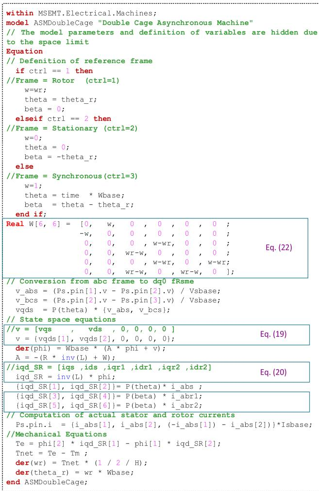  
FIGURE 4. Modelica code for implementation of double cage ASM.

whose input is rotor angular velocity. A three-phase shortcircuit occurs at $\scriptstyle t = 4 . 0 1 \ s$ . The reference frame is rotating synchronously. The simulation is run for 5 s with a tolerance of 1e-6 using the DASSL solver [8]. The same circuit is simulated with a time-step of 10 µs in EMTP using the trapezoidal-backward Euler (TBE) integration method.

Fig. 7 compares the different simulation results between Modelica and EMTP (distinguished by black curves). Fig. 7.(a) compares the stator current of phase-a. It is observed that the transient results match perfectly in both solutions. The motor starting current is 10 pu and decays at t=1.5 s. It is observed in Fig. 7.(b) that at this time, the rotor transient currents decay highly, and the rotor accelerates to its rated speed. The results match in this figure as well. At t=4.01 s, a three-phase fault occurs, and a decaying transient appears in both stator and rotor currents. The frequency of rotor transients is nearly 60 Hz since the rotor speed is nearly 1 pu. It is seen that both stator and rotor transients are damped quickly due to stator and rotor flux interactions. Both solutions are identical during the transients.

Fig. 7.(c, d and e) show and compare the solutions of both simulators for the rotor angular velocity, slip and torque. It is

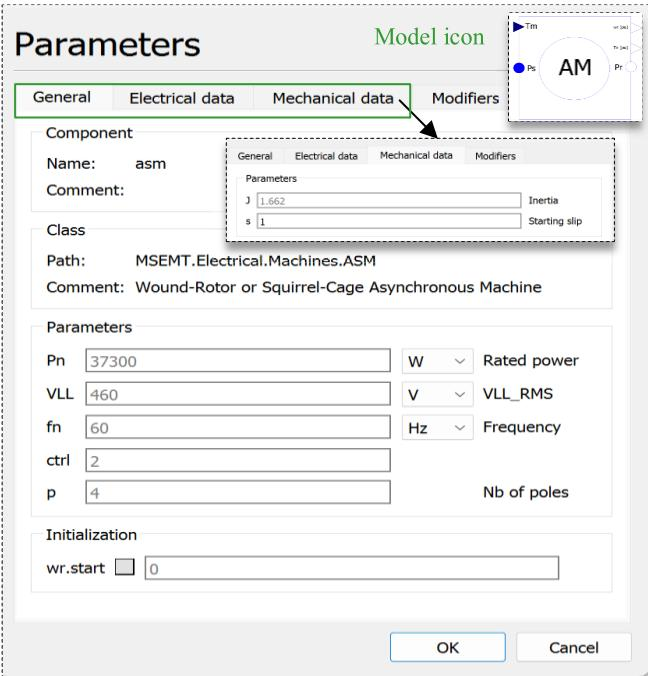  
FIGURE 5. The GUI of wound-rotor ASM.

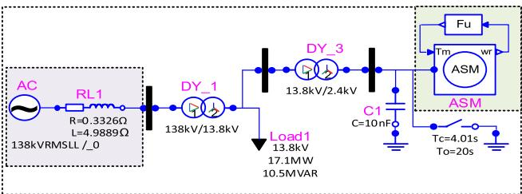  
FIGURE 6. System configuration for starting and terminal short-circuit of a 900-hp motor.

seen that the motor starts from stall and reaches steady-state speed (at t=1.5 s) of 0.98 pu. The steady-state slip of the motor is 1.09%. It is observed that in all plots the results obtained from Modelica solution match the ones from EMTP. Fig. 8 illustrates the relative errors between EMTP and Modelica solution points for phase-a stator current. The red and blue curves indicate the errors for the tolerances of 1e-6 and 1e-3, respectively. The norms of relative error for red and blue curves are 0.64% and 0.77%, respectively. It is seen that halving the solver tolerance has a slight impact on the precision of Modelica solutions.

Table 1 compares the runtimes between Modelica and EMTP. It is observed that increasing the tolerance effectively decreases the CPU time with DASSL. One can see that the EMTP outperforms the Modelica with a slight difference.

# B. CASE STUDY 2

Fig. 9.(a) shows a more complicated network with two synchronous machines and six double-cage ASMs [22]. The schematic diagram is designed in OpenModelica using the components of the MSEMT library [16]. Each ASM is a

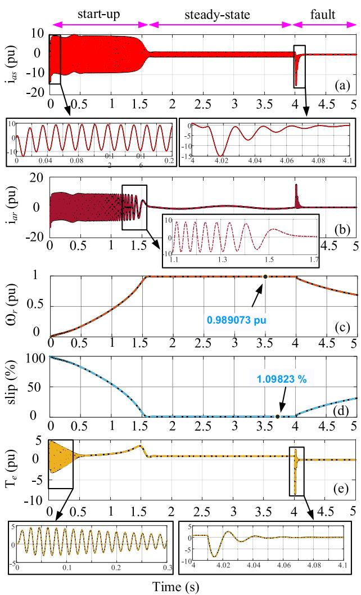  
FIGURE 7. Transients of a 900-hp induction motor during start-up, steadystate and three-phase fault at its terminals. EMTP results are distinguished by black curves. (a): stator current phase-a (b): rotor current phase-a (c) rotor angular velocity (d) slip (e) electromagnetic torque.

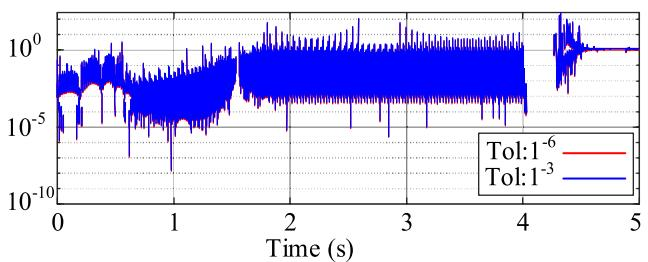  
FIGURE 8. Relative error (logarithmic scale) of stator current phase-a with different tolerances.

4 pole, 6.6 kV, 1100 hp motor. The breaker (SW_ASM1) is initially open and closes at time t = 1 s. This initiates the motor ASM1 startup. Fig. 9.(b) illustrates a nonlinear load model that defines the input mechanical torque of ASM1 as a function of rotor speed $( T _ { m } \propto \omega ^ { 2 } )$ ). The other five induction motors (ASM2 to ASM6) are simultaneously started at t = 0 s. The synchronous reference frame is used in all ASMs.

TABLE 1. Comparison of runtime between modelica and EMTP.   

<table><tr><td>Simulator</td><td colspan="2">Modelica</td><td>EMTP</td></tr><tr><td>Solver</td><td colspan="2">DASSL</td><td>Trap/BE</td></tr><tr><td>Tolerance</td><td>1e-6</td><td>1e-3</td><td>-</td></tr><tr><td>Timestep (Δt)</td><td>-</td><td>-</td><td>10 μs</td></tr><tr><td>No. solution pts</td><td>227 280</td><td>168 850</td><td>500 003</td></tr><tr><td>CPU time (s)</td><td>7.06 s</td><td>5.38</td><td>4.42 s</td></tr></table>

A two-phase-to-ground fault occurs at $t ~ = ~ 9 ~ \mathrm { s }$ on the 120 kV system and is cleared at $t = 9 . 1 5 \mathrm { s } ( 9 $ cycles), causing the islanding of the network (the switch SW_Network opens at $t ~ = ~ 9 . 1 5 ~ \mathrm { s } )$ . In this network, there are four transformers modeled using independent single-phase units with the nonlinear magnetizing branch. The generator, PowerPlant, consists of detailed models of a 13.8 kV, 500 MVA synchronous machine, exciter (type ST1A), and governor (type IEEEG1). The PowerPlant connects to the network through the transformer DYg_SM2. Simulation is run for 15 s with a tolerance of 1e-6 in OpenModelica, and in EMTP using the TBE solver with a time-step of 200 µs. The simulation in Modelica does not start from steady-state.

Fig. 10 compares the voltage waveforms obtained from both simulators at the interconnection point (point $" \mathrm { m } ^ { \prime \prime }$ o n Fig. 9.(a)). As one can see in Fig. 10. (a), the voltage reaches 1 pu when the system is in steady-state. When the fault occurs, the voltage decreases suddenly to 0.5 pu in the faulty phases.

Fig. 10.(b) shows the close-up view of the voltage waveform of phase-a after removing the fault and supplying the system only through PowerPlant. The high-frequency transients are observed in the red curve. The solutions of EMTP depicted by the black curve do not capture these transients using the time-step of 200 µs. This is because Modelica benefits from a variable-step solver in which the time-step is controlled automatically by the rate of transients in the network. Fig. 10.(c) shows the phase-a voltage close-up curve during steady-state, where both Modelica and EMTP solution points are identical. It is observed that the synchronous machine, PowerPlant, does not lose its synchronism and the islanded network preserves its stability.

Fig. 11.(a, b) compare the solution points of both simulators for phase-a stator current of ASM1. At the instant (t=1 s) the switch SW_ASM1 closes and a large starting current of 5 pu, is drawn by the machine till $t { = } 9 . 1 5 \ : \mathrm { s }$ . When the network is islanded and supplied only through PowerPlant, the inrush current increases to 7 pu. Fig. 11.(c) shows rotor angular velocity. The speed builds up and finally settles at a speed slightly lower than the synchronous speed at t=14 s. At this moment, the current passing through the stator of ASM1 decreases to 1 pu. Fig. 11.(d) plots the transient electromagnetic torque of ASM1. The torque signal fluctuates at 60 Hz, instantly after energizing the motor due to the transient offset of stator currents. The fluctuations decay at t=3 s to reach 0.5 pu. The electromagnetic torque reaches zero during the fault. After removing the fault and isolating the network, the governor and exciter of PowerPlant are trying to regulate

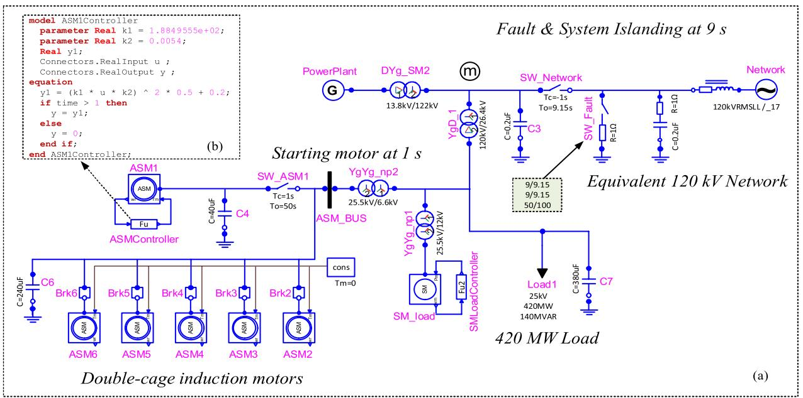  
FIGURE 9. Case study 2: (a) Modelica network, 6 double-cage ASMs and 2 synchronous machines; (b) nonlinear function defining the mechanical torque versus rotor speed.

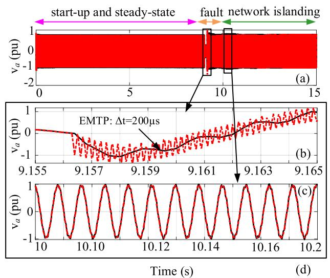  
FIGURE 10. Voltage waveform of phase-a at point m, Modelica solutions in red curves, EMTP solutions in black curves.

the network voltage and power, therefore the electromagnetic torque starts increasing from t=10 s and reaches steady-state at t=14 s. It is observed that in all cases the solutions of Modelica and EMTP are identical.

Fig. 12 compares the free-acceleration electromagnetic torque-speed characteristics of ASM6. It is observed that the electromagnetic torque reaches the steady-state value of 0.4 pu when the rotor speed is nearly 0.07 pu. It is once again observed that the solution points of Modelica match EMTP.

Table 2 and Fig. 13 compare the runtimes and results between Modelica and EMTP for different precisions. In EMTP, using the time-step of 20 µs yields results similar to

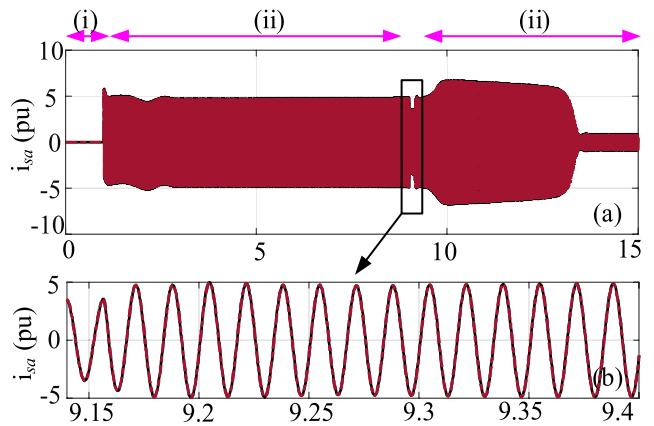

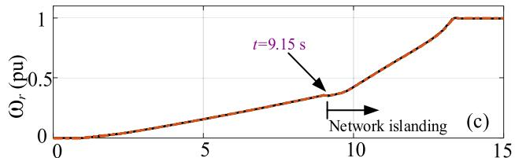

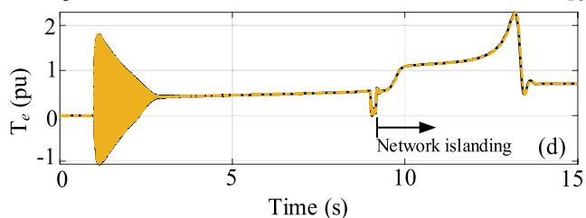  
FIGURE 11. Transient curves of ASM1 in three stages (i): stall (ii): from stall to fault. (iii): post- fault and islanding the network.; (a): stator current phase-a, (b): zoom-in view of phase-a, (c): rotor angular velocity, (d): electromagnetic torque.

Modelica, whereas the 200 µs time-step does not capture the faster transitions. Decreasing the time-step to 1 µs in EMTP

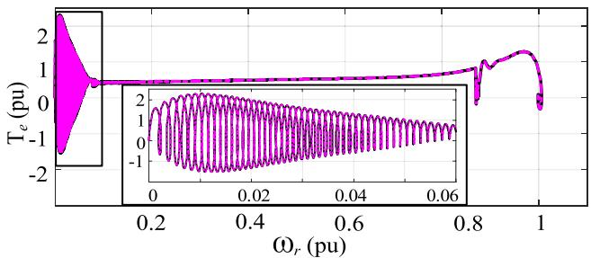  
FIGURE 12. Torque-speed characteristic of ASM6. EMTP solution points are distinguished by the black curve.

TABLE 2. Voltage curve of phase-a at bus ASM during the sequential start of ASM2 to ASM6.   

<table><tr><td>Simulator</td><td colspan="2">MSEMT</td><td colspan="3">EMTP</td></tr><tr><td>Solver</td><td colspan="2">DASSL</td><td colspan="3">Trap/BE</td></tr><tr><td>Tolerance</td><td>1e-6</td><td>1e-3</td><td>-</td><td>-</td><td>-</td></tr><tr><td>Timestep (Δt)</td><td>-</td><td>-</td><td>200 μs</td><td>20 μs</td><td>1 μs</td></tr><tr><td>No. time points</td><td>996362</td><td>582689</td><td>75008</td><td>750009</td><td>15000009</td></tr><tr><td>CPU time (s)</td><td>23.54 s</td><td>12.4 s</td><td>6.22 s</td><td>44.26 s</td><td>1119 s</td></tr></table>

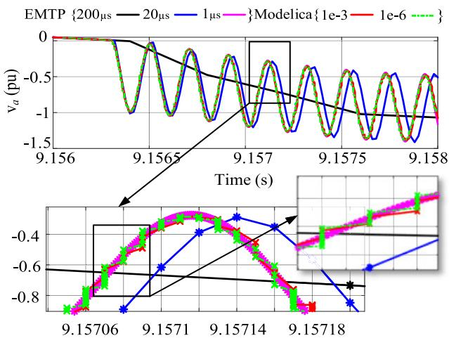  
FIGURE 13. Voltage curve at point m, for different resolutions obtained from EMTP and Modelica solvers.

results in the closest solutions to Modelica; in this case, the simulation time increases to 1119 s.

In Modelica, increasing the tolerance decreases CPU time, but it does not show a significant effect on the waveforms. In this case, when transitioning from transients to steadystate, over a long simulation period, the variable-step solver offers better performance than the fixed-step solver of EMTP. The average time-step sizes for the tolerances of 1e-3 and 1e-6 in Modelica are 2.5452e-05 and 1.5052e-05 respectively.

# C. CASE STUDY 3, SEQUENTIAL MOTOR STARTUPS

This case aims to exploit further the advantages of a variable time-step solver used in Modelica for the simulation of motor sequential startups in a practical plant simulation case.

A group of motors ASM2 to ASM5 starts sequentially in order from t = 15 s to t = 30 s with equal delays of

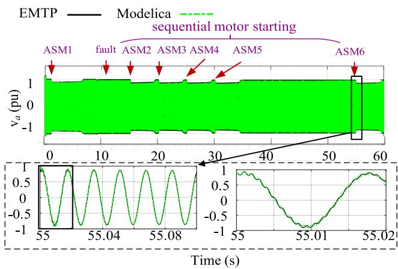  
FIGURE 14. Voltage curve of phase-a at Bus ASM during the sequential start of ASM2 to ASM6.

5 s and ASM6 starts at t = 50 s, after damping down all transients resulting from previous startups. Simulation is run for 60 s with the time-step of 20 µs in EMTP to capture faster transients. Similarly, the tolerance DASSL is chosen 1e-3 to yield accurate results. Fig. 14 illustrates the phase-a voltage waveform of ASM_BUS. It is seen that the results are identical to EMTP. The simulations last 112.6 s and 198.4 s respectively in Modelica and EMTP, which indicates the better performance of variable-step solver for this type of simulation, i.e. sequential startup. Increasing the delays between sequential start-ups increases the performance of Modelica as well. The average step size in the Modelica solver is 168.9 µs.

# V. CONCLUSION

This paper contributed a modern approach for the detailed electromagnetic modeling and simulation of asynchronous machines (ASMs) using Modelica. The electrical and mechanical equations of the machine are developed through a nonlinear state-space model for different qd-reference frames. Then, these equations are explicitly implemented using high-level, declarative, equation-based constructs. It was demonstrated that the proposed models are implemented in a few lines of code, are simply modifiable, expandable, and highly legible. The formulation of models is explicitly based on their true mathematical equations. Modelica simulations remain stable without the addition of artificial damping resistances.

It is shown that Modelica can achieve comparable numerical performance with EMTP for the presented ASM simulations. In fact, for the application of motor startup simulations over a long simulation interval, the variable time-step solver used in Modelica allows to achieve better performance. The advantages of variable time-step solution are highlighted, and research may follow with such implementations in EMTP.

Further research is being conducted for using Modelica for large-scale power systems with inverter-based resources.

# REFERENCES

[1] J. Mahseredjian, V. Dinavahi, and J. A. Martinez, ‘‘Simulation tools for electromagnetic transients in power systems: Overview and challenges,’’ IEEE Trans. Power Del., vol. 24, no. 3, pp. 1657–1669, Jul. 2009, doi: 10.1109/TPWRD.2008.2008480.   
[2] (Sep. 2022). Simscape Electrical User’s Guide (Specialized Power Systems), Release 2022b. [Online]. Available: https: www.mathworks.com/   
[3] J. Mahseredjian, S. Dennetière, L. Dubé, B. Khodabakhchian, and L. Gérin-Lajoie, ‘‘On a new approach for the simulation of transients in power systems,’’ Electric Power Syst. Res., vol. 77, no. 11, pp. 1514–1520, Sep. 2007, doi: 10.1016/j.epsr.2006.08.027.   
[4] H. W. Dommel, ‘‘Section 2-2-2 damping of numerical oscillations with parallel resistance,’’ in EMTP Theory Book, Microtran Power System Analysis Corporation, Vancouver, BC, Canada, 1992.   
[5] (Feb. 18, 2021). Modelica—A Unified Object-Oriented Language for Systems Modeling, Language Specification, Version 3.5. [Online]. Available: https://modelica.org/   
[6] A. Junghanns, C. Gomes, C. Schulze, K. Schuch, R. Pierre, M. Blaesken, and M. Najafi, ‘‘The functional mock-up interface 3.0-new features enabling new applications,’’ in Proc. 14th Modelica Conf., vol. 202, Sep. 2021, pp. 17–26, doi: 10.3384/ecp2118117.   
[7] Functional Mock-Up Interface. [Online]. Available: https://fmistandard.org/   
[8] C. C. Pantelides, ‘‘The consistent initialization of differential-algebraic systems,’’ SIAM J. Sci. Stat. Comput., vol. 9, no. 2, pp. 213–231, Mar. 1988, doi: 10.1137/0909014.   
[9] A. C. Hindmarsh, ‘‘SUNDIALS: Suite of nonlinear and differential/algebraic equation solvers,’’ ACM Trans. Math. Soft., vol. 31, no. 3, pp. 363–396, 2005, doi: 10.1145/1089014.1089020.   
[10] P. Fritzson, A. Pop, K. Abdelhak, A. Asghar, B. Bachmann, W. Braun, and P. Ostlund, ‘‘The OpenModelica integrated environment for modeling, simulation, and model-based development,’’ Model., Identificat. Control: A Norwegian Res. Bull., vol. 41, no. 4, pp. 241–295, 2020, doi: 10.4173/mic.2020.4.1.   
[11] Dymola: Dynamic Modeling Laboratory. [Online]. Available: https://www.3ds.com/products/catia/dymola   
[12] L. Vanfretti, T. Rabuzin, M. Baudette, and M. Murad, ‘‘ITesla power systems library (iPSL): A modelica library for phasor timedomain simulations,’’ SoftwareX, vol. 5, pp. 84–88, Jun. 2016, doi: 10.1016/j.softx.2016.05.001.   
[13] A. Guironnet, M. Saugier, S. Petitrenaud, F. Xavier, and P. Panciatici, ‘‘Towards an open-source solution using modelica for time-domain simulation of power systems,’’ in Proc. IEEE PES Innov. Smart Grid Technol. Conf. Eur. (ISGT-Europe), Sarajevo, Bosnia and Herzegovina, Oct. 2018, pp. 1–6, doi: 10.1109/ISGTEUROPE.2018.8571872.   
[14] F. Fachini, M. de Castro, T. Bogodorova, and L. Vanfretti, ‘‘OpenIMDML: Open instance multi-domain motor library utilizing the modelica modeling language,’’ SoftwareX, vol. 24, Dec. 2023, Art. no. 101591, doi: 10.1016/j.softx.2023.101591.   
[15] (2024). Modelica Standard Library (MSL) Verision 4.1. [Online]. Available: https://github.com/modelica/ModelicaStandardLibrary   
[16] A. Masoom, J. Mahseredjian, T. Ould-Bachir, and A. Guironnet, ‘‘MSEMT: An advanced modelica library for power system electromagnetic transient studies,’’ IEEE Trans. Power Del., vol. 37, no. 4, pp. 2453–2463, Aug. 2022, doi: 10.1109/TPWRD.2021.3111127.   
[17] A. Masoom, T. Ould-Bachir, J. Mahseredjian, A. Guironnet, and N. Ding, ‘‘Simulation of electromagnetic transients with modelica, accuracy and performance assessment for transmission line models,’’ Electric Power Syst. Res., vol. 189, Dec. 2020, Art. no. 106799, doi: 10.1016/j.epsr.2020.106799.

[18] A Masoom, J Gholinezhad, T. Ould-Bachir, J. Mahseredjian, ‘‘Electromagnetic transient modeling of power electronics in modelica, accuracy and performance assessment,’’ presented at the 14th Int. Conf. Electrimacs, Nancy, France, 2021, pp. 275–288, doi: 10.1007/978-3-031-24837-5_21.   
[19] A. Masoom, T. Ould-Bachir, J. Mahseredjian, and A. Guironnet, ‘‘Acceleration of electromagnetic transient simulations in modelica using spatial data locality,’’ Electric Power Syst. Res., vol. 211, Oct. 2022, Art. no. 108577, doi: 10.1016/j.epsr.2022.108577.   
[20] A. Masoom, A. Guironnet, A. A. Zeghaida, T. Ould-Bachir, and J. Mahseredjian, ‘‘Modelica-based simulation of electromagnetic transients using dynaωo: Current status and perspectives,’’ Electric Power Syst. Res., vol. 197, Aug. 2021, Art. no. 107340, doi: 10.1016/j.epsr.2021. 107340.   
[21] P. C. Krause, O. Wasynczuk, S. D Sudhoff, and S. D. Pekarek, Analysis of Electric Machinery and Drive Systems. Hoboken, NJ, USA: Wiley, 2013.   
[22] G. J. Rogers and D. Shirmohammadi, ‘‘Induction machine modelling for electromagnetic transient program,’’ IEEE Trans. Energy Convers., vol. EC-2, no. 4, pp. 622–628, Dec. 1987, doi: 10.1109/TEC.1987. 4765901.   
[23] J. C. Das, Transients in Electrical Systems. New York, NY, USA: McGraw-Hill, 2010.

ALIREZA MASOOM (Member, IEEE) received the M.A.Sc. and Ph.D. degrees in electrical engineering from Polytechnique Montréal, Montreal, QC, Canada, in 2017 and 2021, respectively. From 2003 to 2015, he was with industrial companies holding various positions in electrical protection, substation automation, and SCADA projects. From 2021 to 2023, he was a Research Assistant with Polytechnique Montréal. In 2023, he joined the Hydro-Québec Research Institute

(IREQ) working on the development of real-time and offline electromagnetic transients’ simulation tools. He is currently a Registered Engineer in the Province of Quebec. His research interests include electromagnetic transients modeling, computations, and simulation with high-level languages.

JEAN MAHSEREDJIAN (Life Fellow, IEEE) received the M.A.Sc. and Ph.D. degrees in electrical engineering from Polytechnique Montréal, Montreal, QC, Canada, in1985 and 1991, respectively. From 1987 to 2004, he was with IREQ (Hydro Quebec), Quebec, Canada, working on the research and development activities related to the simulation and analysis of electromagnetic transients. In 2004, he joined the Faculty of Electrical Engineering, Polytechnique Montréal. He is the

Creator and Lead Developer of EMTP1 Software.

1Registered trademark.