# An ultra-fast MMC-HVDC fault location algorithm based on transient voltage features and regression neural network☆

Yunqi Zhang * , Yue Yu , Guosheng Yang

State Key Laboratory for Security and Energy Saving, China Electric Power Research Institute, Beijing, China

# A R T I C L E I N F O

Keywords:

Fault location

MMC-HVDC

Transient voltage response

Extraction of characteristic variables

Regression neural network

# A B S T R A C T

An ultra-fast fault location algorithm based on the single-ended transient voltage features and regression neural network (RNN) is proposed, which utilizes 2.5 ms postfualt data window and is suitable for modular multilevel converter-based high-voltage DC (MMC-HVDC) grids equipped with quick-action protections and hybrid DC circuit breakers (HDCCBs). Firstly, the analyses based on the lumped RLC equivalent circuit demonstrate that the delay time, the first negative peak time and its value all have exact relationships with the fault location. Nevertheless, considering the actual parameters and topology of the MMC-HVDC grid, three features can only be approximately extracted. Thus, RNN is utilized to estimate fault locations. 2.02 × 104 distinct fault cases validate the algorithm’s high accuracy across all fault locations and transition resistances up to 1005 Ω. It can well tolerate reasonable deviations of line parameter and current limiting reactor value, as well as 40-dB white noise. Besides, it also has remarkable adaptability, and can be suitable for different systems.

# 1. Introduction

The modular multilevel converter-based high-voltage DC (MMC-HVDC) grids are usually equipped with quick-action protections and hybrid DC circuit breakers (HDCCBs) to isolate fault areas within few millionseconds. So after faults, only a quite short data window can be acquired before HDCCBs opening, which increases the difficulty of accurate fault location in MMC-HVDC grids.

Several exemplary traveling-wave-based fault location methods have been presented. Although the postfault data windows required by them are generally compatible with MMC-HVDC grids, they still have several drawbacks. The methods presented in [1–3] are all based on the faultgenerated surge arrival times of the traveling waves at double terminals. The authors in [4] present a fault location scheme for HVDC cable transmission based on the time difference between modal initial peaks. However, these methods require quite high sampling frequencies up to several MHz. The fault location methods proposed in [5,6] both need synchronized currents obtained by sensors distributed along the DC lines. In fact, the accuracy of the traveling-wave-based fault location methods highly relies on the precise traveling wave propagation velocity (TWPV) through the faulted line and the accurate moment when the initial traveling wave reaches the fault locator. The TWPV depends on

the propagation medium, so it is also frequency-dependent. When the fault occurs at different locations, the frequency band of the initial traveling wave distributes differently, and the TWPV is also different. Therefore, it is difficult to accurately obtain the TWPVs under different fault conditions. Besides, the initial traveling waves will have severe dispersion in the case of high-resistance faults or remote faults, so the moments they reach the fault locators are also difficult to capture accurately. By increasing the sampling frequency to several MHz or adding more measurement points along the lines, the above problems can be mitigated to some extent but cannot be eliminated. In reference [6], on an attempt to reduce the potential fault location errors resulting from low sampling frequency, while maintaining the cost to minimum, a machine learning approach is also introduced. Moreover, the accuracy of these methods depends on the strictly synchronous signals from double-ended or line-distributed sensors. Therefore, these methods have higher requirements on communication and measurement equipment. The required synchronous measurement points distributed along the line inflict more difficulties and costs in the practical implementation.

An electromagnetic time reversal (EMTR) fault location method is presented in [7] based on the lossy back-propagation model. The authors in [8] present a data-driven fault location algorithm based on EMTR voltage energy in mismatched media. However, a fairly long

postfault data window is used for them, which is not applicable to MMC-HVDC grids that use HDCCBs to quickly isolate DC faults.

Reference [9] presents a fault location scheme for MMC-HVDC grids that uses an estimated R-L representation of the transmission lines. In [10], a fault location method based on dynamic state estimation and gradient descent is presented. However, frequency-independent lumped model is used for DC line in the simulation verification. The authors in [11,12] proposed the least-square-based fault location algorithm. The authors in [13] proposed the fault location method based on the frog leaping particle swarm algorithm. Reference [14] proposed a DC fault location method by estimating the line inductance from the fault point to the DC line terminal, which is designated as L location. However, the methods in [11–14] are all calculated based on the lumped line model. The distribution characteristics and frequency-dependent characteristics of the actual line model are not considered. The fault location errors will increase significantly with the increase of line length. Thus, the fault location methods in [9–14] are only suitable for short lines, and cannot be applied to long transmission lines. Moreover, the iterative least square algorithm and the frog leaping particle swarm algorithm are both sensitive to the initial value of the solution variable and may converge to local minima of the error criterion. Furthermore, their iterative calculations would take a long time. In addition, with regard to L location in [14], the currents through the transition resistance are not accurately represented for all of the fault conditions during the calculation. Thus, the fault location errors are large when the fault resistances are relatively high or the fault points are relatively far from the fault locators.

The application of machine learning can greatly improve the accuracy of high-resistance fault location. The authors in [15] present a HVDC fault location method based on double-ended unsynchronized signals using convolutional neural network (CNN) and Hilbert–Huang transform. Nevertheless, the required data window and are too long to be suitable for MMC-HVDC grids. Reference [16] proposes a singleended fault location algorithm for AC transmission lines, which uses CNN to quantitatively evaluate the mapping relationships between the traveling wave full waveforms and the fault locations. Reference [17] utilizes a combination of feedforward neural network and support vector classifier for locating faults in radial distribution systems. Reference [18] presents utilizing Gaussian process regression (GPR) for fault location and support vector machine for fault identification in AC microgrids. In [19], a gradient boosting tree (GBT) model is proposed to localize single-phase-to-ground and three-phase faults in low voltage AC distribution grids. In [20], a Stack Auto-Encoder (SAE) is modeled to pinpoint fault point with the voltage and current phasors for AC distribution network. The fault location methods utilizing machine learning in [16–20] can also be improved and applied to HVDC grids.

In order to effectively address the above problems, we propose an improved ultra-fast fault location algorithm for MMC–HVDC grids based on transient voltage features and regression neural network (RNN). Firstly, three valuable features for the voltage fault transient response are analyzed based on the lumped RLC model of the MMC-HVDC grid. Considering the actual parameters and topology of the MMC-HVDC grid, the three features can only be approximately extracted from the transient voltage. Ergo, we use the well trained RNN to accurately locate faults through the three features of the single-ended transient voltage with ultra-high speed. Finally, this algorithm is validated by $2 . 0 2 \times 1 0 ^ { 4 }$ different fault cases excluded in the training datasets. The generalization ability, adaptability and anti-noise ability of this algorithm are all verified. Furthermore, the proposed fault location algorithm is compared with other algorithms.

The remainder of this paper is organized as follows. The fault characteristics of the transient voltage in the HB-MMC-HVDC grid are analyzed in Section II. Section III introduces the reasons for using RNN to locate faults, as well as the structure of RNN. Section VI proposes the specific process of the ultra-fast fault location algorithm. In Section V, the simulation test results validate the superiority of the proposed method. Finally, the conclusion is provided in Section VI.

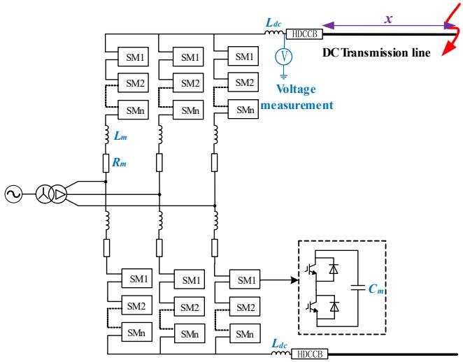  
Fig. 1. Diagram of a PGF in the HB-MMC-HVDC grid.

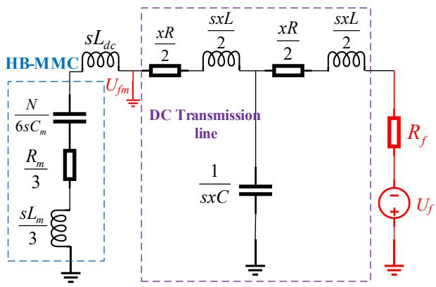  
Fig. 2. The fault component equivalent circuit of HB-MMC-HVDC.

# 2. Fault characteristics of transient voltage

A positive-to-ground fault (PGF) on a DC transmission line connected to the half-bridge modular multilevel converter (HB-MMC) is depicted in Fig. 1. Thereinto, $U _ { m }$ is the measured voltage at the terminal of the positive line. x is the distance from the fault point to the voltage measurement point. $R _ { f }$ is the transition resistance. $L _ { d c }$ is the DC inductance at the endpoint of line. Besides, the hybrid DC circuit breaker (HDCCB) is installed at the terminal of the DC line. Additionally, the capacitance of each MMC submodule is indicated as $C _ { m } ,$ and N is the number of the submodules in each arm of the MMC. The inductance and resistance of each MMC arm are represented as $L _ { \mathrm { m } }$ and $R _ { \mathrm { m } } ,$ respectively.

# 2.1. Analysis based on lumped RLC model

For the DC line connected to the HB-MMC shown in Fig. 1, the fault component equivalent circuit in s-domain is depicted in Fig. 2. Thereinto, U denotes the fault excitation voltage source, the value of which is the inverse prefault voltage at the fault point. $U _ { f m }$ is the fault component voltage at the endpoint of the positive line. During the post-fault transient period before the MMC blocking, the HB-MMC can be equipped as RLC series model. The impedance of the HB-MMC $Z _ { e q }$ in s-domain is expressed as follows,

$$
Z _ {e q} = \frac {s L _ {m}}{3} + \frac {R _ {m}}{3} + \frac {N}{6 s C _ {m}} \tag {1}
$$

To facilitate analysis, the DC transmission line is simplified into the

Table 1 Values of the parameters for HB-MMC and DC Line.   

<table><tr><td colspan="5">HB-MMC parameters</td></tr><tr><td>Rm(Ω)</td><td>Lm(mH)</td><td>Cm(uF)</td><td>N</td><td>Ldc(mH)</td></tr><tr><td>1</td><td>29</td><td>11,000</td><td>220</td><td>200</td></tr><tr><td colspan="5">DC Line parameters</td></tr><tr><td>R (Ω/km)</td><td></td><td>L (mH/km)</td><td></td><td>C (uF)</td></tr></table>

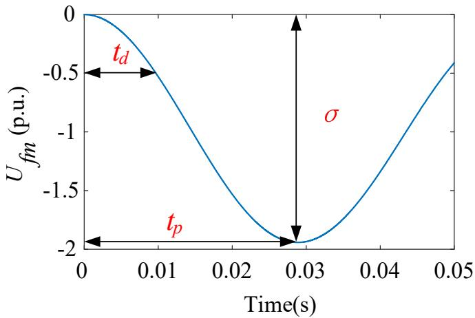  
Fig. 3. The unit-step response of $U _ { f m }$ based on based on lumped RLC model.

T-shaped RLC lumped model. $R ,$ L and C are the resistance, inductance and capacitance of the DC line per kilometer, respectively. Considering $U _ { f m }$ and $U _ { f }$ as the input and output variables respectively, the transfer function of this second-order circuit, $\phi ( s ) ,$ , is expressed as follows,

$$
\Phi (s) = \frac {U _ {\mathrm {f m}}}{U _ {\mathrm {f}}} = - \frac {k _ {1} \omega_ {\mathrm {n}} ^ {2} s ^ {4} + k _ {2} \omega_ {\mathrm {n}} ^ {2} s ^ {3} + k _ {3} \omega_ {\mathrm {n}} ^ {2} s ^ {2} + k _ {4} \omega_ {\mathrm {n}} ^ {2} s + \omega_ {\mathrm {n}} ^ {2}}{k _ {\mathrm {S}} s ^ {3} + s ^ {2} + 2 \xi \omega_ {\mathrm {n}} s + \omega_ {\mathrm {n}} ^ {2}} \tag {2}
$$

$$
k _ {1} = \frac {x C \left(\frac {L _ {m}}{3} + L _ {d c} + \frac {x L}{2}\right) \left(2 L _ {m} C _ {m} + 6 L _ {d c} C _ {m}\right)}{N} \tag {3}
$$

$$
k _ {2} = \frac {x C \left[ \left(2 L _ {m} C _ {m} + 6 L _ {d c} C _ {m}\right) \left(\frac {x R}{2} + \frac {R _ {m}}{3}\right) + 2 R _ {m} \left(\frac {L _ {m}}{3} + L _ {d c} + \frac {x L}{2}\right) \right]}{N} \tag {4}
$$

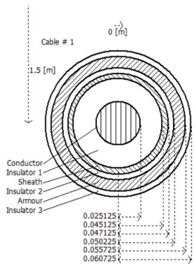

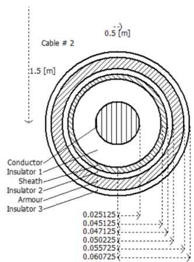  
Fig. 4. The configuration parameters of the bipolar DC cable line.

$$
k _ {3} = \frac {\left(1 + \frac {x N C}{6 C _ {m}}\right) \left(2 L _ {m} C _ {m} + 6 L _ {d c} C _ {m}\right)}{N} + \tag {5}
$$

$$
\frac {x C \left[ N \left(\frac {L _ {m}}{3} + L _ {d c} + \frac {x L}{2}\right) + 2 R _ {m} G _ {m} \left(\frac {x R}{2} + \frac {R _ {m}}{3}\right) \right]}{N}
$$

$$
k _ {4} = \frac {2 R _ {m} C _ {m} \left(1 + \frac {x N C}{6 C _ {m}}\right) + x N C \left(\frac {x R}{2} + \frac {R _ {a}}{3}\right)}{N} \tag {6}
$$

$$
k _ {5} = \frac {3 x ^ {2} L C C _ {m}}{C _ {m} \left(2 L _ {m} + 6 L _ {d c} + 3 x L\right) + x C C _ {m} \left(3 x R + 6 R _ {f}\right)} \tag {7}
$$

$$
\omega_ {n} = \sqrt {\frac {N}{C _ {m} \left[ 2 L _ {m} + 6 L _ {d c} + 3 x L + x C \left(3 x R + 6 R _ {f}\right) \right]}} \tag {8}
$$

$$
\xi = \frac {(2 R _ {m} + 3 x R) C _ {m}}{2 \sqrt {C _ {m} N [ 2 L _ {m} + 6 L _ {d c} + 3 x L + x C (3 x R + 6 R _ {f}) ]}} \tag {9}
$$

According to the values of these parameters in the practical engineering, $k _ { 1 } , k _ { 2 } , k _ { 3 } , k _ { 4 }$ and $k _ { 5 }$ are in the range of $1 0 ^ { - 1 3 } , 1 0 ^ { - 1 0 ^ { \circ } } , 1 0 ^ { - 5 } , 1 0 ^ { - 4 }$ and ${ { 1 0 } ^ { - 7 } } \mathrm { { . } }$ , respectively. Considering $k _ { 1 } , k _ { 2 } , k _ { 3 } , k _ { 4 }$ and $k _ { 5 }$ are all much smaller than 1, Φ(s) can be approximated as a second-order step response, which is expressed as follows,

$$
\Phi (s) = \frac {U _ {f m}}{U _ {f}} \cong - \frac {\omega_ {\mathrm {n}} ^ {2}}{\mathrm {s} ^ {2} + 2 \xi \omega_ {\mathrm {n}} \mathrm {s} + \omega_ {\mathrm {n}} ^ {2}} \tag {10}
$$

where $\omega _ { n }$ is the undamped natural oscillation angular frequency, and ζ is the damping coefficient. Considering the actual ranges of these parameters, the value of ζ is always in the range of 0 to 1 regardless of the exact fault location or transition resistance. Thus, $\varPhi ( s )$ is always underdamped step response for all of the fault conditions.

The typical values of the parameters for HB-MMC and DC line is illustrated in Table 1. Based on the exact parameter values in Table 1, the unit-step response of $U _ { f m }$ for a PGF with a 100 Ω transition resistance occurring 100 km away from the voltage measurement point is depicted in Fig. 3. Thereinto, the first negative peak time of $U _ { f m }$ and its value at this time are expressed as $t _ { p }$ and $\delta ,$ respectively. The delay time of $U _ { f m }$ is expressed as $t _ { d } .$ .

According to (10) and the theory of unit-step response in the secondorder system, $t _ { p } ,$ δ and $t _ { d }$ can be calculated as follows [21],

$$
t _ {p} = \frac {\pi}{\omega_ {\mathrm {n}} \sqrt {1 - \xi^ {2}}} \tag {11}
$$

$$
\delta = 1 + \mathrm {e} ^ {- \pi \xi / \sqrt {1 - \xi^ {2}}} \tag {12}
$$

$$
t _ {d} = \frac {1 + 0 . 7 \xi}{\omega_ {n}} \tag {13}
$$

When the values of the parameters in the equivalent circuit are known, $\omega _ { n }$ and ζ are both functions with respect to x and $R _ { f } .$ Therefore, $t _ { p } , \epsilon$ δ and $t _ { d }$ are all functions in regard to x and $R _ { f } .$ Namely, $t _ { p } = f _ { 1 } ( x , R _ { f } ) , \delta$ $= f _ { 2 } ( x , R _ { f } )$ and $t _ { d } = f _ { 3 } ( x , R _ { f } )$ . There are one-to-one mapping relationships between $t _ { p } , \delta ,$ td and $_ { x } , R _ { f } .$ Consequently, the unknown x and $R _ { f }$ can be obtained based on the three characteristic values.

MMC-HVDC grids usually install ultra-fast fault detectors and HDCCBs to rapidly isolate rising fault currents. After a fault occurs, the fault detector is required to issue a trip command within 3 ms, and the minimum time delay of fault-detection stage is 0.5 ms. Under normal operating conditions, the HDCCBs will open within 2 ms after receiving the trip signals. Therefore, the post-fault data that can be reliably utilized is within 2.5 ms to 5 ms, from the fault signature appearance time to when the HDCCB starts to open. As depicted in Fig. 3, $t _ { p }$ occurs

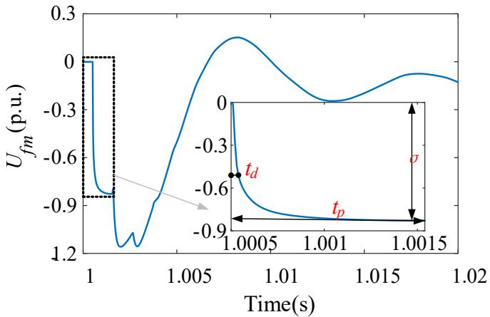  
Fig. 5. The unit-step response of $U _ { f m }$ based on frequency-depend line model and detail MMC model.

approximately 28 ms after the fault signature appears under the RLC lumped model of DC line and HB-MMC. It means that a relatively longer data window after fault is required to extract $t _ { p }$ and δ. Even if the MMC blocking stage is ignored, the MMC-HVDC grid cannot sustain such long time after fault. Consequently, considering the quick action of fault detectors and HDCCBs, it is invalid to simultaneously utilize (11)-(13) to locate faults in MMC-HVDC grids.

# 2.2. Analysis on frequency-dependent line model and detail MMC model

If the distributed frequency-dependent line model and the actual detail model of MMC are considered in the equivalent circuit of Fig. $^ { 2 , }$ then the transfer function, $\varPhi ( s )$ , will be irrational. And the three char acteristic variables $t _ { p } ,$ σ and t will be too complex to be expressed in closed-form equations like (11)-(13). Actually, numerical simulation is the simplest way to get the step response of the transient voltage $U _ { f m }$ in this MMC-HVDC system. Therefore, the MMC-HVDC system in Fig. 1 is simulated on PSCAD/EMTDC, considering the distributed frequencydependent cable line model and the detail MMC model. The configuration parameters of the DC bipolar cable lines and the MMC specifications are illustrated in Fig. 4 and Table 1, respectively.

Based on the specific parameters in Table 1 and Fig. 4, the unit-step response of $U _ { f m }$ for the same fault as in Fig. 3 is shown in Fig. 5. It can be seen that this step response includes faster oscillating components, apart from a component that approximates the second-order response. Consequently, the above three characteristic variables, i.e. $t _ { p } , \delta$ and $t _ { d } ,$ can be feasibly extracted within a quite short time with the distributed frequency-dependent line model and the detail MMC model. For the example in Fig. $^ { 5 , }$ extracting $t _ { p } ,$ δ and $t _ { d }$ only requires a postfault time window of no more than 1.5 ms.

# 3. Regression neural network

# 3.1. The reasons for using RNN

From the analysis in Section II, it can be known that three characteristic values of the single-ended voltage, namely $t _ { p } , \delta$ and $t _ { d } ,$ are all closely related with the fault location and the transition resistance. Moreover, when using the distributed frequency-dependent line model and the detail MMC model, $t _ { p } , \delta$ and $t _ { d }$ can be extracted within a quite short time. However, the following aspects increase the complexity of locating faults in MMC-HVDC grids by simultaneously using $t _ { p } ,$ δ and $t _ { d } .$

(1) The transfer function of the distributed frequency-dependent line model is irrational. Thus, it is difficult to express the relationships between $t _ { p } , \delta ,$ t and $_ { x , R _ { f } }$ in closed form.   
(2) The system has more than one MMC or DC line, and its topology is generally more complicated. Thus, the relationships between $t _ { p } , \delta , t _ { d }$ and

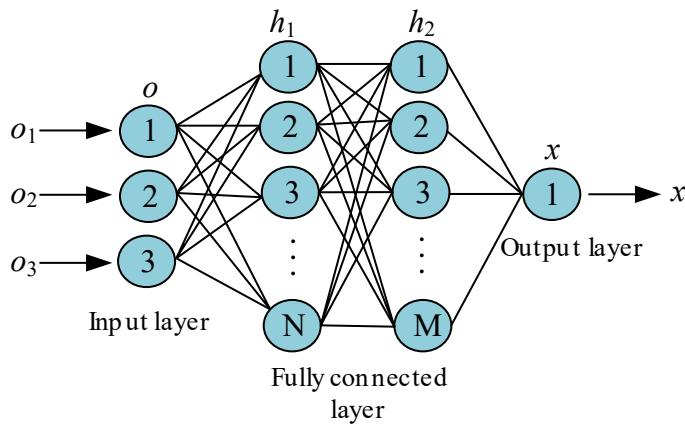  
Fig. 6. The typical structure of the RNN.

x ${ \mathbf { } } , R _ { f }$ could be more complex.

(3) The control dynamics of the detail MMC model also increases the complexity.

Therefore, $t _ { p } ,$ δ and $t _ { d }$ should be approximately extracted from the single-ended transient voltage. And a soft computing algorithm is desired to be used for locating faults in MMC-HVDC grids.

A lot of references have proved that the ability of neural networks to approximate complex nonlinear functions sufficiently accurately makes them powerful tools for addressing multi-input regression problems in nonlinear dynamic systems [21–28]. The salient advantages of RNN relative to other nonlinear regression techniques are mainly as follows.

(1) Based on the joint probability density function of the training dataset, the weight and bias of each neuron, as well as a series of hyperparameters of RNN are determined by optimization algorithm. Therefore, RNN has excellent adaptability and self-learning capability. The well trained RNN can become good candidate for approximating arbitrary surfaces with complex morphologies. Under the same amount of training datasets, RNN is competitive in terms of accuracy with other regression models.   
(2) The computation of RNN only involves simple algebraic equations, rendering a fast computation speed. The software simulation is easy to write and use. This characteristic makes RNN capable of handling problems in real time.

Consequently, RNN is selected to estimate fault locations based on the three characteristic variables of the transient voltage.

# 3.2. The structure of RNN

The RNN consists of one input layer, several fully connected layers and one output layer. The three input predictor variables are denoted as ${ \pmb O } { = } ( o _ { 1 } , o _ { 2 } , o _ { 3 } ) ^ { \mathrm { T } } ,$ , which consist of the vectors $( t _ { p } , \delta , t _ { d } )$ under different fault conditions. The output vector of the kth fully connected layer are denoted as ${ \cal H } _ { k } { = } ( h _ { k 1 }$ , h , $h _ { k 3 } , . . . , h _ { k j } ) ^ { \mathrm { T } }$ . And the output variable of the output layer is the fault location x. The signal operation of the RNN is expressed as follows [28],

$$
\left\{ \begin{array}{c} h _ {1 j} = f \left(\sum_ {i = 1} ^ {3} \omega_ {i j} \cdot o _ {i} + \theta_ {1 j}\right) \quad j = 1, 2, 3 \dots N \\ h _ {k j ^ {\prime}} = f \left(\sum_ {i = 1} ^ {N} \omega_ {j j ^ {\prime}} \cdot h _ {(k - 1) j ^ {\prime}} + \theta_ {k j ^ {\prime}}\right) \quad j ^ {\prime} = 1, 2, 3 \dots M, k = 2, 3 \dots K \\ x = f \left(\sum_ {j ^ {\prime} = 1} ^ {M} \omega_ {j ^ {\prime}} \cdot h _ {j ^ {\prime}} + \theta_ {1}\right) \end{array} \right. \tag {14}
$$

where $\omega _ { i j }$ and $\omega _ { j j ^ { \prime } }$ are the weights of the first fully connected layer $h _ { 1 j }$ j and the kth fully connected layer hkj’ respectively. θ1j and θkj’are the biases of

the first fully connected layer $h _ { 1 j }$ and the kth fully connected layer $h _ { k j } ,$ respectively. θ is the bias of the output layer x. There are K layers in the fully connected layer, the first and the kth layer of which have N and M output nodes, respectively. f denotes the activation function. One of the typical structures of the RNN is depicted as Fig. $^ { 6 . }$ .

To train the RNN’s weights and biases, as well as hyperparameters, a certain number of vectors $( t _ { p } , \delta , t _ { d } )$ under different fault conditions and the corresponding fault locations are loaded in RNN as the three predictor variables and the response variable, respectively. Then the well trained RNN could locate faults accurately based on the three features under unknown faults.

# 4. Proposed fault location algorithm

The proposed fault location algorithm is started to operate only after DC line internal faults are detected. The fault location algorithm mainly includes two stages: extraction of characteristic variables and estimation based on RNN. The specific algorithm process is illustrated in this section.

# 4.1. Extraction of characteristic variables

After adding the prefault component voltage to the fault component, the three characteristic variables $( \mathrm { i } . \mathrm { e } . \ t _ { p } , \ \delta$ and $t _ { d } )$ of the measured voltage also have exact relationships with fault location and transition fault. Thus $t _ { p } , \delta$ and $t _ { d }$ can also be approximately extracted from the measured voltage. The specific extraction steps are as follows.

(1) To compatible the minimum delay of 2.5 ms for fault detection and current interruption, the measured voltage on the faulty pole $U _ { f m }$ is extracted with a time window 0.1 ms before and 2.5 ms after the appearance of fault signatures at the terminal. The buffered voltage samples are considered as the input data.   
(2) If the negative-pole-to-ground fault (NGF) occurs, the measured voltage values are multiplied by − 1.   
(3) To mitigate the impact of higher harmonics and noise while maintaining accuracy, the buffered voltage samples $U _ { f m } [ t _ { 1 } ,$ , t2] is smoothed by a moving average window with a length of 30 us. The function smooth at any time t is expressed as follows:

$$
U _ {s f m} [ t ] = \bar {U} _ {f m} [ t - 1 5 \times 1 0 ^ {- 6}: t + 1 5 \times 1 0 ^ {- 6} ] \tag {15}
$$

where $U _ { s f m } [ t ]$ denotes the smoothed voltage data window at any time. The overline represents average calculation. For the samples at the beginning or end of the data window, the smoothing window is shortened to the existing samples.

(4) The average of prefault voltage $U _ { p r e }$ is obtained during the first 0.1 ms of $U _ { s f m } \colon$

$$
U _ {p r e} = \bar {U} _ {s f m} \left[ t _ {1}: t _ {1} + 0. 1 \times 1 0 ^ {- 3} \right] \tag {16}
$$

(5) $t _ { p }$ and δ are extracted by determining the first negative peak time and the value at this time for smoothed $U _ { s f m } [ t _ { 1 }$ , t2]. Functions like findpeaks(.) in MATLAB can be used for this purpose.   
(6) td is approximately estimated by the time when the average value of $U _ { p r e }$ and δ is located.

# 4.2. Estimation based on RNN

Considering the fault circuits of single-pole-to-ground faults (SGFs) and pole-to-pole faults (PPFs) are different, the three characteristic variables of SGFs and PPFs have different relationships with fault locations and transition resistances. Therefore, separate RNNs are trained for SGFs and PPFs location estimation. $t _ { p } ,$ δ and $t _ { d }$ are standardized before being loaded into the pretrained RNN, which is expressed as follows,

$$
C ^ {\prime} = \frac {C - \mu_ {C}}{\sigma_ {C}} \tag {17}
$$

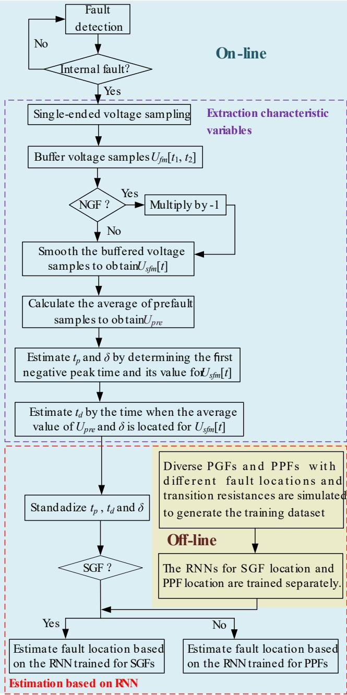  
Fig. 7. The flow chart of the proposed fault location algorithm.

where C and $C '$ are the initial and standardized characteristic variables respectively, i.e. $t _ { p } ,$ δ and $t _ { d } . \mu _ { C }$ and $\sigma _ { C }$ are the mean and standard deviation of the corresponding characteristic variables in the training datasets, respectively.

To generate the training datasets, 2222 diverse fault cases are simulated offline, which are PGFs and PPFs occurring at 0 % to 100 % of the faulted line with step of 10 % from the line terminal, and with transition resistances of 0.01 Ω to 1000.01 Ω with step of 10 Ω.

In regard to the training solver for all the weights and biases, a limited-memory Broyden-Fletcher-Goldfarb-Shanno quasi-Newton algorithm (LBFGS) is utilized to minimize the objective function. The objective function L consists of the mean squared error loss function between the calculation values and the true values, as well as the ridge penalty term, which increases the generalization ability of the RNN. L is expressed as follows $[ 2 6 , 2 9 ]$ .

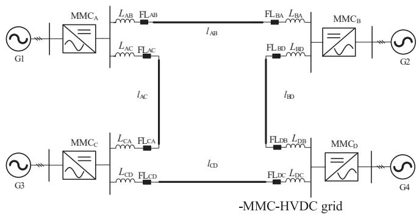  
Fig. 8. The topology of the HB-MMC-HVDC grid.

$$
L = \frac {1}{P} \sum_ {i = 1} ^ {P} \left(\mathbf {x} _ {i} - \widehat {\mathbf {x}}\right) + \lambda \sum \omega_ {i} ^ {2} \tag {18}
$$

where $x _ { i }$ and $\widehat { \boldsymbol { x } }$ are the calculation value after the i-th iteration and the true value, respectively. P is the total number of iterations, which is set to 60. $\sum \omega _ { i } ^ { 2 }$ represents the sum of squares of all weights in RNN after the i-th iteration. The LBFGS solver uses a standard line-search method with an approximation to the Hessian matrix in Newton’s iteration method, which can converge quickly as the solution is approached [29]. Additionally, the hyperparameters, i.e. activation $f ,$ regularization term strength λ, layersizes of the full connected layer and so $_ { 0 \mathrm { { n } } , }$ are determined by Bayesian optimization [30].

After being trained by Bayesian optimization, the RNN has two fully connected layers, the layersizes of which are set to 293 and 13, respectively. Additionally, the layersize of the output layer is set to 1. The action function is selected as rectified linear unit, which is expressed as follows:

$$
f (x) = \left\{ \begin{array}{l l} x, & x \geq 0 \\ 0, & x <   0 \end{array} \right. \tag {19}
$$

The regularization term strength λ is determined as $5 . 0 7 \times 1 0 ^ { - 6 }$ . Under the above trained RNN, the estimated value of the objective function is 0.09. The training time for the RNN on the computer with 16 GB RAM and i7-10510U CPU is 16.89 s.

The flow chart of the proposed fault location algorithm is depicted in Fig. 7. Thereinto, the training process of RNN is operated offline, and other parts are all operated online.

# 5. Simulation test results

The ± 500 kV four-terminal symmetrical bipolar HB-MMC-HVDC grid is simulated in PSCAD/EMTDC as the test system, the single-line topology of which is shown in Fig. 8. Thereinto, the distributed frequency-dependent cable model in Fig. 6 is used. $L _ { i j } \left( i , j = \mathbf { A } , \mathbf { B } , \mathbf { C } \right.$ and D) represents the current limiting reactor. The parameters of the HB-MMC-HVDC grid are set as shown in Table 1. The solid square denotes the fault locator (FL). Taking $\mathrm { F L } _ { \mathrm { A B } }$ as an example, 2222 diverse fault cases on $l _ { \mathrm { A B } }$ described in Section IV are simulated to generate the training datasets. The sampling frequency is set to 100 kHz.

# 5.1. Typical test

To verify the fault location algorithm suitable for different fault types, fault locations and transition resistances, another $2 . 0 2 \times 1 0 ^ { 4 }$ fault cases are simulated on the test system to generate the test datasets, which are NGFs and PPFs occurring at 0.5 % to 99.5 % of line $l _ { \mathrm { A B } }$ with step of 1 % from the line terminal, and with transition resistances of 5 Ω to 1005 Ω with step of 10 Ω. The sampling frequency is also 100 kHz. For the simulation results of the test datasets, the mean and standard deviation of the fault location percentage errors under different fault

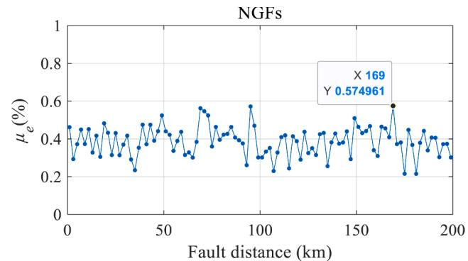

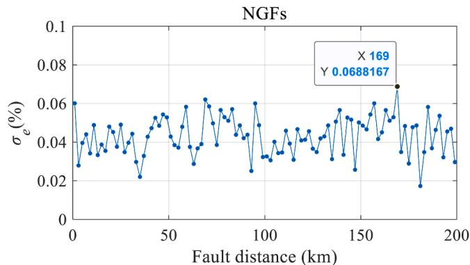  
(b)

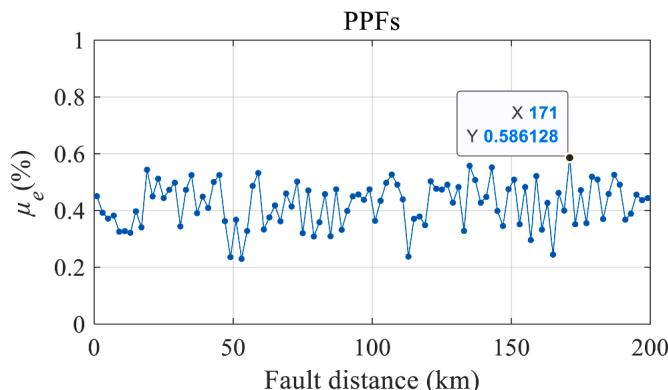

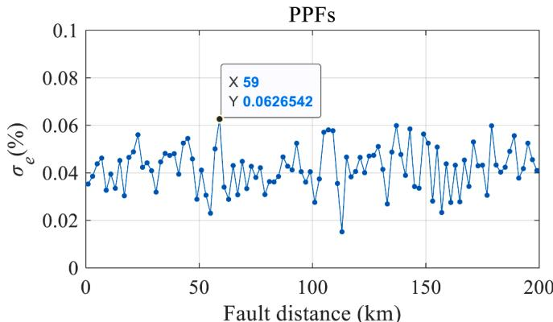  
  
Fig. 9. The values of $\mu _ { e }$ and $\sigma _ { e }$ for different fault locations.

locations and transition resistances, namely $\mu _ { e }$ and $\sigma _ { e } ,$ are shown in Fig. 9.

From Fig. 9, it can be seen that the values of $\mu _ { e }$ and $\sigma _ { e }$ for NGFs and PPFs with locations from 0.5 % to 99.5 % and transition resistances from 5 Ω to 1005 Ω are all below 0.59 % and 0.07 %, respectively.

Table 2 The Values of $\mu _ { e }$ and $\sigma _ { e }$ Under Line Parameter deviations.   

<table><tr><td rowspan="2">Deviation</td><td colspan="2">NGFs</td><td colspan="2">PPFs</td></tr><tr><td>μe(%)</td><td>σe(%)</td><td>μe(%)</td><td>σe(%)</td></tr><tr><td>Pole spacing and depth: +20 %</td><td>0.57</td><td>0.26</td><td>0.56</td><td>0.30</td></tr><tr><td>Pole spacing and depth: +30 %</td><td>0.88</td><td>0.55</td><td>0.93</td><td>0.59</td></tr><tr><td>Line length: +5%</td><td>0.49</td><td>0.41</td><td>0.57</td><td>0.44</td></tr><tr><td>Line length: +10 %</td><td>0.91</td><td>0.68</td><td>0.88</td><td>0.75</td></tr></table>

Table 3 The Values of $\mu _ { e }$ and $\sigma _ { e }$ Under Current Limitting Reactor Deviations.   

<table><tr><td rowspan="2">Deviation</td><td colspan="2">NGFs</td><td colspan="2">PPFs</td></tr><tr><td>μe(%)</td><td>σe(%)</td><td>μe(%)</td><td>σe(%)</td></tr><tr><td>The values of Lij: +10 %</td><td>0.52</td><td>0.45</td><td>0.51</td><td>0.42</td></tr><tr><td>The values of Lij: +20 %</td><td>0.97</td><td>0.70</td><td>0.98</td><td>0.73</td></tr></table>

Additionally, the $\mu _ { e }$ for all the NGFs and PPFs are as low as 0.39 % and 0.42 %, respectively. The $\sigma _ { e }$ for all the NGFs and PPFs are both as low as 0.04 %, respectively. Thus, the accuracy of the proposed single-ended MMC-HVDC fault location algorithm is quite high for diverse fault conditions. Moreover, the overall computing time of the proposed fault location algorithm for the well pretrained RNN is approximate 1.1 ms on the same computer.

# 5.2. Generalization ability

The generalization ability of the proposed algorithm is analyzed from the following three typical aspects.

# (1) Different voltage level or transmitted power

The changes in the voltage level of the DC line, as well as the magnitude and direction of the transmitted power have no impact on the proposed fault location algorithm. Because based on the analyses in Section V, the relationships between the fault location and the three characteristic variables, i.e. $t _ { p } ,$ δ and $t _ { d } ,$ only depend on the parameters of the DC lines and MMCs, as well as the topology of the system. Ergo, the well trained FLs are suitable for different DC voltage levels or transmitted powers.

# (2) DC Line parameter deviations

To test the generalization ability for line parameter deviations of the proposed algorithm, the pole spacing and depth of all DC cable lines in the test system are changed by + 30 % and + 20 % respectively, relative to the parameters depicted in Fig. 4. Moreover, all the DC line lengths are changed by + 5 % and + 10 %, respectively. The $2 . 0 2 \times 1 0 ^ { 4 }$ testing fault cases are obtained by re-simulating the changed system. The FLs are still trained by the original 2222 fault cases. The test results are shown in Table 2.

When the pole spacing and depth deviate by 30 % or the line length deviates by 10 %, $\mu _ { e }$ and $\sigma _ { e }$ are still below 1 % for both NGFs and PPFs. Therefore, the test results demonstrate that the proposed fault location algorithm can tolerate fairly large degree of line parameter deviations.

# (3) Current limiting reactor deviations

To verify the generalization ability for current limiting reactor de viations of the proposed algorithm, the values of all current limiting reactors in the test system are changed by + 10 % and + 20 % respectively, relative to the parameters depicted in Table 1. The 2.02 × 104 testing fault cases are obtained by re-simulating the changed system. The FLs are still trained by the original 2222 fault cases. The test results

Table 4 The Values of $\mu _ { e }$ and $\sigma _ { e }$ For Different Line Lengths.   

<table><tr><td rowspan="2">Line Length</td><td colspan="2">NGFs</td><td colspan="2">PPFs</td></tr><tr><td>μe(%)</td><td>σe(%)</td><td>μe(%)</td><td>σe(%)</td></tr><tr><td>400 km</td><td>0.45</td><td>0.25</td><td>0.44</td><td>0.24</td></tr><tr><td>600 km</td><td>0.94</td><td>0.79</td><td>0.97</td><td>0.81</td></tr></table>

# are shown in Table 3.

When the values of $L _ { i j }$ deviate by 20 %, $\mu _ { e }$ and $\sigma _ { e }$ are still below 1 % for both NGFs and PPFs. Therefore, the test results confirm that the proposed fault location algorithm can also tolerate relatively large degree of current limiting reactor deviations. It is similar for other equipment parameters’ deviations in the MMC-HVDC grid. The generalization ability of the proposed algorithm is sufficiently acceptable.

If the deviations of the DC line parameter or the current limiting reactor value as well as other equipment parameters exceed certain degrees or the topology of the system is changed, the FLs need to be retrained by the new training datasets obtained from the changed test system. This is equivalent to converting the FLs to a new system for application, which requires the adaptability of the fault location algorithm rather than the generalization ability.

# 5.3. Adaptability

The adaptability of the proposed fault location algorithm is also demonstrated from the following three typical aspects.

# 1) Different line lengths

To validate the proposed algorithm can be applied to different DC line lengths, all the DC lines are changed to 400 km and 600 km, respectively. For each line length, 2222 diverse fault cases are resimulated to generate the new training datasets, which are also PGFs and PPFs occurring at 0 % to 100 % of line $l _ { \mathrm { A B } }$ with step of 10 % from the line terminal, and with transition resistances of 0.01 Ω to 1000.01 Ω with step of 10 Ω. The RNNs are retrained for PGFs and PPFs with each different line length. The $2 . 0 2 \times 1 0 ^ { 4 }$ fault cases same as Section V-A are similarly simulated for each line length to generate the test datasets. The test results are shown in Table 4.

From Table 3, it can be seen that with the same amount of the training datasets, the fault location errors increase slightly as the line length increases, due to the fact that the fault location interval in the training datasets increases as the line length increases. Nevertheless, the 2222 training fault cases still maintain the values of $\mu _ { e }$ and $\sigma _ { e }$ below 1 % with the line length of 600 km. Therefore, the proposed fault location algorithm has exceptional adaptability to different line lengths.

# 2) Different current limiting reactors

To verify the proposed algorithm can be suitable for different current limiting reactor values, all current limiting reactors are changed to 50mH and 400mH, respectively. For each value of the current limiting reactors, 2222 diverse fault cases are re-simulated to generate the new training datasets, which are also PGFs and PPFs occurring at 0 % to 100 % of line $l _ { \tt A B }$ with step of 10 % from the line terminal, and with transition resistances of 0.01 Ω to 1000.01 Ω with step of 10 Ω. The RNNs are

Table 5 The Values of $\mu _ { e }$ and $\sigma _ { e }$ For Different Current Limitting Reactors.   

<table><tr><td rowspan="2">Lij</td><td colspan="2">NGFs</td><td colspan="2">PPFs</td></tr><tr><td>μe(%)</td><td>σe(%)</td><td>μe(%)</td><td>σe(%)</td></tr><tr><td>50mH</td><td>0.30</td><td>0.04</td><td>0.34</td><td>0.04</td></tr><tr><td>400mH</td><td>0.35</td><td>0.06</td><td>0.36</td><td>0.05</td></tr></table>

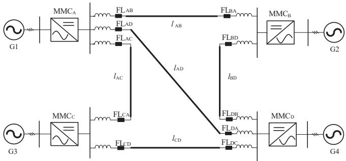  
Fig. 10. The topology of the HB-MMC-HVDC grid.

Table 6 The Values of $\scriptstyle \mu _ { e }$ and $\sigma _ { e }$ Under different SNRs.   

<table><tr><td rowspan="2">SNRs</td><td colspan="2">NGFs</td><td colspan="2">PPFs</td></tr><tr><td>μe(%)</td><td>σe(%)</td><td>μe(%)</td><td>σe(%)</td></tr><tr><td>50 dB</td><td>0.61</td><td>0.49</td><td>0.53</td><td>0.46</td></tr><tr><td>40 dB</td><td>0.91</td><td>0.69</td><td>0.86</td><td>0.64</td></tr><tr><td>30 dB</td><td>1.62</td><td>1.13</td><td>1.67</td><td>1.23</td></tr></table>

retrained for PGFs and PPFs under each different value of current limiting reactors. The $2 . 0 2 \times 1 0 ^ { 4 }$ fault cases same as Section V-A are similarly simulated for each value of current limiting reactors to generate the test datasets. The test results are shown in Table $^ { 5 , }$ .

From Table $^ { 5 , }$ it can be known that with the same amount of training datasets, the fault location errors are almost unaffected by the values of current limiting reactors. Whether the current limiting reactors are 50mH or 400mH, the 2222 training datasets maintain $\mu _ { e }$ and $\sigma _ { e }$ below 0.36 % and 0.06 ${ \% } ,$ respectively. Thus, the proposed fault location algorithm has excellent adaptability to different values of current limiting reactors. Similarly, the proposed fault location algorithm can also well adapt to any other equipment parameters’ changes in the MMC-HVDC grid.

# 3) Different system topologies

To test the adaptability for different system topologies of the proposed algorithm, a DC transmission line with length of 250 km is added between $\mathrm { { \bf M M C _ { A } } }$ and $\mathrm { M M C } _ { \mathrm { D } }$ of the test system. The single-line topology of the test system is depicted in Fig. 10. The 2222 training fault cases and $2 . 0 2 \times 1 0 ^ { 4 }$ testing fault cases same as Section V-A are re-simulated based on this system. Based on the retrained RNN, the values of $\mu _ { e }$ and $\sigma _ { e }$ for NGFs are 0.34 % and 0.05 %. The values of ${ \dot { \mu } } _ { e }$ and $\sigma _ { e }$ for PPFs are 0.32 % and 0.03 %. Therefore, this fault location algorithm can be well adaptive to systems with different topologies.

# 5.4. Anti-noise ability

In order to test the anti-noise ability of the proposed algorithm, white Gaussian noises with signal-to-noise ratio (SNRs) of 40 dB and 30 dB are added to the transient voltages obtained in the $2 . 0 2 \times 1 0 ^ { 4 }$ testing fault cases. $t _ { p } ,$ δ and td extracted from the noisy voltages are loaded into $\mathrm { F L } _ { \mathrm { A B } }$ pretrained by the 2222 noise-free fault cases. The test results are illustrated in Table 6. The test results can prove that the $\mu _ { e }$ and $\sigma _ { e }$ are all below 1 % for total NGFs and PPFs when SNR is not less than 40 dB. Thus, the proposed fault location method has relatively strong anti-noise ability.

# 5.5. Different sampling frequencies

To demonstrate the impact of different sampling frequency on the proposed algorithm, the sampling frequency is adjusted to 200 kHz, 100

Table 7 The Values of $\mu _ { e }$ and $\delta _ { e }$ For Different Sampling Frequencies.   

<table><tr><td rowspan="2">Sampling frequency</td><td colspan="2">NGFs</td><td colspan="2">PPFs</td></tr><tr><td>μe(%)</td><td>σe(%)</td><td>μe(%)</td><td>σe(%)</td></tr><tr><td>200 kHz</td><td>0.24</td><td>0.03</td><td>0.26</td><td>0.04</td></tr><tr><td>100 kHz</td><td>0.32</td><td>0.05</td><td>0.39</td><td>0.08</td></tr><tr><td>50 kHz</td><td>0.75</td><td>0.07</td><td>0.82</td><td>0.14</td></tr><tr><td>25 kHz</td><td>1.59</td><td>0.20</td><td>1.63</td><td>0.25</td></tr></table>

Table 8 Comparison with Other Fault Location Algorithms.   

<table><tr><td>Algorithm</td><td>Required signals</td><td>Sampling frequency</td><td>Postfault data window</td><td>μe(%)</td></tr><tr><td>Traveling waves [1-3]</td><td>Double-ended synchronized currents</td><td>1–2 MHz</td><td>Not illustrated</td><td>3.58</td></tr><tr><td>Modal traveling waves [4]</td><td>Double-ended/single-ended currents of cable&#x27;s conducting layers</td><td>1 MHz</td><td>Not illustrated</td><td>9.03</td></tr><tr><td>Traveling waves [5]</td><td>Synchronized currents from line distributed sensors</td><td>1 MHz</td><td>Not illustrated</td><td>2.19</td></tr><tr><td>Traveling waves [6]</td><td>Synchronized currents from line distributed sensors</td><td>5 kHz</td><td>5 ms</td><td>2.80</td></tr><tr><td>Dynamic line model [9]</td><td>Double-ended synchronized currents</td><td>20 kHz</td><td>5 ms</td><td>3.04</td></tr><tr><td>R-L line mode [10]</td><td>Double-ended synchronized currents</td><td>50 kHz</td><td>5 ms</td><td>3.20</td></tr><tr><td>L Location [13]</td><td>Single-ended voltages and currents</td><td>10 kHz</td><td>2 ms</td><td>10.78</td></tr><tr><td>CNN and Hilbert-Huang transform [15]</td><td>Double-ended unsynchronized voltages</td><td>100 kHz</td><td>12 ms</td><td>0.40</td></tr><tr><td>The proposed algorithm</td><td>Single-ended voltage</td><td>100 kHz</td><td>2.5 ms</td><td>0.41</td></tr></table>

kHz, 50 kHz and 25 kHz, respectively. The simulation results for the same $2 . 0 2 \times 1 0 ^ { 4 }$ testing fault cases specified in Section V-A are shown in Table 7.

Based on the simulation results in Table 5, it can be known that increasing the sampling frequency can improve the fault location accuracy. When the sampling frequency increased from 25 kHz to 100 kHz, $\mu _ { e }$ and $\sigma _ { e }$ for NGFs and PPFs are all significantly reduced. However, when the sampling frequency is increased from 100 kHz to 200 kHz, the fault location errors no longer decrease significantly. Moreover, the fault location accuracy with 100 kHz sampling frequency is sufficiently high. Thus, the sampling frequency of the proposed algorithm is set to 100 kHz.

# 5.6. Comparison with other methods

The proposed fault location algorithm is compared with other algorithms applied to HVDC grids from several aspects. The mean percentage errors of these fault location algorithms are tested by the same 2.02 × $1 0 ^ { 4 }$ fault cases as in Section V-A. The comparison results are illustrated in Table 8.

The comparison results demonstrate that the algorithm in [15] has the highest fault location accuracy for all of the fault conditions. However, for MMC-HVDC grids equipped with ultra-fast fault detectors and HDCCBs, the fault location algorithms with shorter postfault data window will be more compatible, due to the reliability for obtaining the required data before the ultra-fast fault-isolation stage. The required postfault data window of the algorithm in [15] is so long that it exceeds the maximum time allowed by MMC-HVDC grids equipped with HDCCBs (i.e. 5 ms). Although the postfault data windows required by

Table 9 Comparison with other Machine Learning Models.   

<table><tr><td>Model</td><td>μe(%)</td><td>σe(%)</td><td>Training time</td></tr><tr><td>GPR [18]</td><td>1.61</td><td>0.69</td><td>18.98 s</td></tr><tr><td>SVR [18]</td><td>1.09</td><td>0.47</td><td>28.95 s</td></tr><tr><td>GBT [19]</td><td>2.21</td><td>0.98</td><td>15.78 s</td></tr><tr><td>SAE [20]</td><td>2.24</td><td>1.02</td><td>32.10 s</td></tr><tr><td>RNN (The proposed)</td><td>0.41</td><td>0.04</td><td>21.84 s</td></tr></table>

the traveling-wave-based fault location algorithms in [1–6] can be compatible with MMC-HVDC grids, the accuracy is relatively low for high-resistance faults. Besides, the algorithms in [1–6] depend on the synchronized currents from double-ended or line-distributed sensors, which have high demands for communication and measurements. So, they will suffer more difficulties and costs in engineering implementation.

The comparison results also declare that the algorithm in [6] uti lizing either double-ended or single-ended signals requires quite high sampling frequency and its accuracy is relatively low. The algorithm in [13] using single-ended signals also has the lowest accuracy. Besides the algorithms in [6] and [13], the proposed fault location algorithm is the only single-ended fault location algorithm, without relying on reliable communication and precise synchronization between double terminals. Moreover, the proposed algorithm only needs voltage sampling data, which requires the fewest measurement sensors among all of the algorithms. This can further reduce costs and bring great convenience to engineering applications.

Additionally, the proposed RNN is compared with other machine learning models in the fault location estimation stage, such as GPR, GBT, support vector regression (SVR) and SAE. For the same training and testing datasets, the comparison results are shown in Table 9. Based on Table 7, it can be demonstrated that the proposed RNN has the lowest fault location errors. Although the training time of GPR and GBT is shorter than that of RNN, the accuracy of them is relatively low. Overall, the proposed algorithm is most suitable for MMC-HVDC grids.

# 6. Conclusion

This paper proposes an improved ultra-fast single-ended fault location algorithm for MMC-HVDC grids based on three features of the transient voltage and RNN. The proposed fault location algorithm has been comprehensively verified by $2 . 0 2 \times 1 0 ^ { 4 }$ different fault cases excluded in the training datasets simulated on PSCAD/EMTDC. The test results demonstrate that this algorithm has the following salient features. (1) The total mean and standard deviation of fault location errors are not more than 0.41 % and 0.04 % respectively, so the proposed al gorithm has quite high accuracy for all fault locations and high transition resistances up to 1005 Ω. (2) The required postfault data window is only 2.5 ms, which can be well compatible to MMC-HVDC grids equipped with quick-action protections and HDCCBs. (3) The proposed algorithm is based on single-ended signals, which is immune to communication link disturbances and time synchronization errors. (4) The algorithm’s exceptional generalization and adaptability ensure its versatility across various line parameters, current limiting reactor values as well as system topologies. Besides, it has satisfactory anti-noise ability, and it can tolerant 40-dB white noise.

# CRediT authorship contribution statement

Yunqi Zhang: Writing – review & editing, Writing – original draft, Visualization, Validation, Software, Resources, Project administration, Methodology, Formal analysis, Data curation. Yue Yu: Supervision, Investigation, Funding acquisition, Resources. Guosheng Yang: Investigation, Funding acquisition, Resources, Supervision.

# Declaration of competing interest

The authors declare that they have no known competing financial interests or personal relationships that could have appeared to influence the work reported in this paper.

# Data availability

The authors do not have permission to share data.

# References

[1] Azizi S, Sanaye-Pasand M, Abedini M, and Abbas Hasani. A Traveling-Wave-Based Methodology for Wide-Area Fault Location in Multiterminal DC Systems[J]. IEEE Transactions on Power Delivery, 2014, 29(6): 2552-2560.   
[2] Nanayakkara OMKK, Rajapakse AD, Wachal R. Traveling-wave-based line fault location in star-connected multiterminal HVDC systems[J]. IEEE Trans Power Delivery 2012;27(4):2286–94.   
[3] Azizi S, Afsharnia S, Sanaye-Pasand M. Fault location on multiterminal dc systems using synchronized current measurements[J]. Int J Electric Power Energy Syst 2014;63(12):779–86.   
[4] M. Ashouri, F. F. d. Silva, C. L. Bak, A. Abdoos, and S. M. Hosseini. Modal online differential fault detection and localisation scheme for VSC-MTDC cable transmission,” IET Generation Transmission and Distribution, 2020, 14(10): 4475–4487.   
[5] Tzelepis D, Fusiek G, Dysko A, Pawel Niewczas, Campbell Booth, and Xinzhou Dong. Novel Fault Location in MTDC Grids With Non-Homogeneous Transmission Lines Utilizing Distributed Current Sensing Technology[J]. IEEE Transactions on Smart Grid, 2018, 9(5): 5432-5443.   
[6] Tzelepisa D, Dy´skoa A, Fusieka G, Niewczasa P, Mirsaeidib S, Bootha C, et al. Advanced fault location in MTDC networks utilizing optically-multiplexed current measurements and machine learning approach[J]. Int J Electric Power Energy Syst 2018;97(4):319–33.   
[7] Razzaghi R, Lugrin G, Rachidi F, and Mario Paolone. Assessment of the Influence of Losses on the Performance of the Electromagnetic Time Reversal Fault Location Method[J]. IEEE Transactions on Power Delivery, 2017, 32(5): 2303-2312.   
[8] Wang Z, Chen Z, Paolone M. A data-driven fault location algorithm based on the electromagnetic time reversal in mismatched media[J]. IEEE Trans Power Delivery 2022;37(5):3709–21.   
[9] J. Xu, L.Y,C. Zhao, and J. Liang, A model based dc fault location scheme for multiterminal MMC-HVDC systems using a simplified transmission line representation. IEEE Transactions on Power Delivery, 2020, 35(1): 386–395.   
[10] Wang B, Liu Y, Lu D, Kang Yue, and Rui Fan. Transmission Line Fault Location in MMC-HVDC Grids Based on Dynamic State Estimation and Gradient Descent[J]. IEEE Transactions on Power Delivery, 2021, 36(3): 1714-1725.   
[11] Leonardo Ulises Iurinic, A. Ricardo Herrera-Orozco, Renato Gonçalves Ferraz. Distribution Systems High-Impedance Fault Location: A Parameter Estimation Approach [J]. IEEE Transactions on Power Delivery, 2016, 31(4): 1806-1814.   
[12] A.R. Herrera-Orozco a, A.S. Bretas, C. Orozco-Henao. Incipient fault location formulation: A time-domain system model and parameter estimation approach [J]. International Journal Electrical Power and Energy Systems. 2017, 90: 112-123.   
[13] Li D, Ukil A. Fault location estimation in voltage-source-converter-based DC system: The L location [J]. IEEE Trans Ind Electron 2022;69(11):11198–209.   
[14] Ka MU, Fenghua WANG, Yadong LIU. Asynchronous two-terminal fault location method for unbalanced fault based on parameter identification [J]. High Voltage Eng 2017;43(11):3763–8.   
[15] Lan S, Chen M-J, Chen D-Y. A novel HVDC double-terminal non-synchronous fault location method based on convolutional neural network[J]. IEEE Trans Power Delivery 2019;34(3):848–57.   
[16] Deng F, Zhong Y, Zeng Z, Yarui Zu, Zhang Z, Huang Y, et al. A single-ended fault location method for transmission line based on full waveform features extractions of traveling waves [J]. IEEE Trans Power Delivery 2023;38(4):2585–95.   
[17] Thukaram D, Khincha HP, Vijaynarasimha HP. Artificial neural network and support vector machine approach for locating faults in radial distribution systems [J]. IEEE Trans Power Delivery 2005;20(2):710–21.   
[18] Adhishree S. and S.K Parida. A Robust Fault Detection and Location Prediction Module Using Support Vector Machine and Gaussian Process Regression for AC Microgrid [J]. IEEE Transactions on Industrial Applications, 2022, 58(1):930-939.   
[19] Nikolaos S, Jesus L, Bertrand R. Fault diagnosis in low voltage smart distribution grids using gradient boosting trees[J]. Electr Pow Syst Res 2020;182:319–33.   
[20] Guo M, Ying J, Meng L, Yanmei L, Jinghan H. Stacked auto-encoder-based fault location in distribution network[J]. IEEE Acess 2020;8:28043–53.   
[21] Golnaraghi F, Kuo BC. Automatic Control Systems. 9th ed. Hoboken, NJ, USA: Wiley: 2009.   
[22] Specht DF. A general regression neural network[J]. IEEE Trans Neural Netw 1991; 2(6):568–76.   
[23] Narendra KS, Parthasarathy K. Identification and control of dynamical systems using neural networks[J]. IEEE Trans Neural Netw 1990;1(1):4–27.   
[24] Edward K.Blum, Leong Kwan Li. Approximation Theory and Feedforward Networks [J]. Neural Networks. 1991, 4: 511-515.

Y. Zhang et al.

[25] Goulermas JY, Liatsis P, Zeng X-J, Cook P. Density-Driven Generalized Regression Neural Networks (DD-GRNN) for function approximation [J]. IEEE Trans Neural Netw 2007;18(6):1683–96.   
[26] Kim S, Lu PY, Mukherjee S, Gilbert M, Jing Li, Ceperic V, et al. Integration of neural network-based symbolic regression in deep learning for scientific discovery [J]. IEEE Trans Neural Networks Learn Syst 2021;32(9):4166–77.   
[27] Kwok T-Y, Yeung D-Y. Constructive algorithms for structure learning in feedforward neural networks for regression problems [J]. IEEE Trans Neural Netw 1997;8(3):630–45.

[28] Wang X, Yang S, Wen J. ANN-based robust DC fault protection algorithm for MMC high-voltage direct current grids [J]. IET Renew Power Gener 2020;14(2): 199–210.   
[29] N. Azam. Machine learning for data science using MATLAB. 2020. [Online]. Available: Udemy.com.   
[30] Nocedal J, Wright SJ. Numerical Optimization[M]. 2nd ed. New York: Springer; 2006.