# Expanding the measuring range via S-parameters in a EHV voltage transformer modelling for reliable GIS VFT simulations

Gustavo H.C. Oliveira *,a , Lucas P.R.K. Ihlenfeld a , Lucas F.M. Rodrigues a , Ang´elica C.O. Rocha b , Diogo J.D.E. Santo c

a Department of Electrical Engineering, Federal University of Parana ´ (UFPR), Brazil   
b ATG, Brazil   
c Jirau Energia, Brazil

# A R T I C L E I N F O

Keywords:

Extra high voltage equipment

Frequency-domain measurement

Gas insulated substation

Rational models

S-parameters

Very fast transient overvoltages

Voltage transformer

# A B S T R A C T

The customary approach to modelling voltage transformers (VT) at gas insulate substations (GIS) subject to Very Fast Transients Overvoltages (VFTOs) consists of using a capacitive element. However, this simplistic approach is unable to reproduce characteristic resonances and predict how transients propagate to the VT’s secondary winding. Multiport black-box passive rational models built upon frequency-domain measurements are instrumental to overcome these challenges. The adoption of S-Parameters is an alternative to black-box approaches based on Y-Parameters so as to consistently expand the measurement frequency range which is required to accurately capture the dynamics involved in VFTO phenomena up to 50 MHz at GIS facilities. We validate our results using an strategy that entails measuring, modeling and simulation upon a multiport extra-high voltage (EHV) VT. The proposed approach using S-Parameters leads to increased accuracy compared with the customary approaches using Y-Parameters or capacitive elements.

We build two models estimated upon distinct frequency ranges to highlight the importance of extending the measurements into the MHz range so that time-domain simulations better reproduce VFTO characteristics. The black-box VT model thus obtained is incorporated into an actual 500 kV GIS model for transient simulations enabling the analysis of transient propagation between primary and secondary windings.

# 1. Introduction

Gas-insulated substations (GIS) have grown in number around the globe in the last decades owing to several advantages over the traditional air-insulated counter-part, these advantages include smaller space requirements, higher safety levels, simpler maintenance and commissioning, et cetera. The growing number of both planned and operational GIS brings such issues to the forefront of research on power systems. Conversely, GIS are more susceptible to Very Fast Transient Overvoltages (VFTO), as a consequence of its intrinsic physical properties [1–3].

As demonstrated in the literature, GIS are prone to VFTO during disconnector or circuit-breaker operations, see [1,2,4–8]. Essentially, several restrikes appear as a circuit-breaker operates in switching action to either establish or interrupt the current flow. These high frequency strikes constitute the root cause of VFTO at GIS.

In essence, VFTO are electromagnetic transients characterized by

signals with very short rise times (1 to 50 MHz) and tail with lower (30 to 300 kHz) frequency content [1,9]. Classification for transients in electric power systems [9] prescribes the VFTO frequency range from 100 kHz to 50 MHz, and associate it with transients originating from disconnector switching and faults at GIS. As they propagate through the GIS, these transients can damage high-voltage equipment [10,11]. As far as Instrument Transformers are concerned, according to the standard [12], immunity tests are recommended whenever frequency components beyond 1 MHz exist so that their impact on control circuits be properly assessed.

Reliable VFTO simulations at GIS require therefore models endowed with wide-band capabilities. In transient simulations, Voltage Transformers are traditionally described as a simple one-port capacitive element [1,9] which is a simplistic description incapable of reproducing all resonances that fully characterize the actual equipment.

On the other hand, multiport black-box rational models extracted over a wide frequency band [13–18], come as an appropriate alternative

to improve the modelling process in so long as the system’s dynamic behaviour as well as its interaction with surrounding substation be accurately modelled for transient overvoltages simulations.

Besides, it is also known that the transformer ratio is frequencydependent. Therefore, this dynamics can be understood and correctly simulated provided a reliable wide-band model be available. Still comparing with a single one-port capacitive model for VTs, the ability to describe transient overvoltages in both transformer windings requires a multiport approach, thus permitting the analysis of the impact overvoltages have on circuit protection/control and its associated digital apparatus. Some accounts in the literature suggest that control circuits experience voltage surges as a consequence of steep-front waves being transferred through either Voltage or Current transformers within the GIS [19–21].

Multiport black-box rational models assume a model structure whose parameters can be estimated upon measured input/output data. In power system applications, the admittance or Y-Parameters [22] are traditionally used as measured data. However, they are highly dependent on short-circuits at the accessible terminals and ensuring exact short-circuit conditions is not a trivial for frequencies in the MHz range as a direct consequence of the inherent stray capacitive couplings. Besides, measuring admittance parameters requires the use of current transducers that inevitably introduce an insertion impedance which needs to be further compensated, see for instance [23]. Such intrinsic aspects of admittance parameters may ultimately lead to undue inaccuracies at very high frequencies.

The literature contains many papers describing the application of Y-Parameter measurements and black-box modelling approach to power systems HV equipments, mostly on power transformers [13–15,24,25]. However, a common feature of these approaches is that they hardly achieve a few MHz. For instance, reference [25] sets its celing frequency at 500 kHz whereas references [14,15] achieve as far as 1 MHz. Other instances include a 2 MHz maximum reported in [24] as well as 10 MHz in [26].

Scattering Parameters (S-Parameters) can serve as a natural alternative to Y-Parameters to consistently improve the measurement fre quency range as they do not require current transducers or short-circuit terminations thus ensuring measurements with increased accuracy over the MHz range.

Theoretical and experimental aspects of S-Parameters are mature issues in engineering particularly when it comes to RF applications, however they are incipient when considering the power systems setting, specially in black-box modelling for multi-port high-voltage powersystems equipment. In the scarce literature we can mention the following: a 2-port, 150-m four-conductor industrial cable on [27], a 2-port 110 kV inductive VT on [28]. Moreover, the extraction of wave propagation properties of a 5-m, 12 kV crosslinked polyethylene cable by using S-Parameters is also studied on [29].

By browsing this reduced literature we identified a few gaps, namely: (a) addressing the challenges pertaining to measurement, modelling and validation of multiport Extra-High Voltage (EHV) power system equipments in the VFT range (up to 50 MHz) using S-Parameters; (b) applying black-box model to analyze how VFTOs originated at the primary circuit may propagate to GIS secondary circuits.

This paper presents addresses the first gap by the application of black-box modelling to a 3-port EHV GIS Voltage Transformer. This raises several issues such as: (i) the adoption of S-Parameters instead of Y-Parameters as a technique to consistently expand the measurements into the MHz range; (ii) to revisit a merge technique with simplified white/grey-box models to improve the data at low frequencies where the VT’s high-voltage terminal has an intrinsic high input impedance; (iii) to compare and validate the estimated passive model using actual time-domain measurements of the VT’s trans characteristic response from high to low terminals; (iv) to compare two models estimed upon distinct frequency ranges to highlight the importance of extending the measurements into the MHz range so that time-domain simulations

better reproduce VFTO characteristics.

The second gap is addressed by incorporating the estimated multiport EHV VT model into an actual 500 kV GIS model for transient simulations so that the transient propagation from primary to secondary is accounted for and both can be simulated and analyzed. This transient propagation from one winding to another cannot be accounted for using the traditional capacitive model.

The paper is structured into 6 Sections. This introductory Section 2 sets out the notation whereas Section 3 introduces the proposed methodology that is applied to an actual EHV-VT equipment in Section 3.1. In Section 4, a black-box model is derived and validated. In Section 5, two black-box models are obtained with distinct measurement ranges for comparison. The subsequent Section 6 furnishes an application whereby a wide-band EHV-VT model is used to illustrate the advantages of the proposed methodology in an actual GIS facility. Conclusions and discussions are in Section 7.

# 2. Network parameters and models

A linear electrical network possessing n-terminals may be characterized by sets of network parameters that relate linearly currents and voltages at the accessible terminals of the network. According to Carlin [30], there is no single network characterization that is always best, but rather that a variety of choices exist to fit specific types of problems.

While Y-Parameters establish a linear relation between input voltages to output currents in the frequency domain, S-Parameters are more general and determine a linear relation between power waves which are themselves linear combinations of the voltages and currents at the terminals [31,32]. Equations that relates incident and reflected waves to form the S-Parameters can be found in [30]. The latter characterization exists for every physical passive network whereas the former does not necessarily so, see [30,33].

In Eq. (1), we denote both admittance and scattering parameters by Y (s) and S(s), respectively. In the frequency domain, the linear relations established by these network parameters are as follows:

$$
\mathbf {I} (s) = \mathbf {Y} (s) \mathbf {V} (s) \tag {1a}
$$

$$
\mathbf {b} (s) = \mathbf {S} (s) \mathbf {a} (s) \tag {1b}
$$

where the first voltage V(s) and I(s) current vectors whereas the second relates incident a(s) and reflected power waves $\mathbf { b } ( s )$ vectors. In the high-frequency realm of transient simulations linear n-terminal devices and networks can be characterized as $\mathbf { Y } ( s )$ and S(s)-Parameters [14] [27], each admitting a particular state-space realization of the form {A, B, C, D} whose parameter matrices have conformable dimensions.

Such state-space realizations can be readily obtained using iterative rational approximation methods such as [34,35] which extract the parameters while minimizing the unconstrained error relative to the measured data. For instance, to approximate a measured scattering matrix, the following optimization problem should be solved:

$$
\underset {\mathbf {A}, \mathbf {B}, \mathbf {C}, \mathbf {D}} {\text {m i n i m i z e}} \sum_ {k = 1} ^ {K} \| \mathbf {S} (j w _ {k}) - \widetilde {\mathbf {S}} (j w _ {k}) \| _ {2} ^ {2}, \tag {2}
$$

whereby $\mathbf { S } ( j w _ { k } )$ and $ { \widetilde { \mathbf { s } } } ( j w _ { k } )$ respectively denote the model and measured scattering matrices at the kth frequency point. These identification algorithms estimate the parameter matrices using rational functions in an iterative manner, based on a weighted least-squares objective, in addition to some desired weighting scheme.

As already stressed, these algorithms yield causal, stable and minimal realizations by construction. The realization must also be passive and reciprocal, which can be achieved using $[ 1 6 , 3 6 - 3 8 ]$ .

# 3. S-parameters measurements of a EHV GIS voltage transformer

Choosing between different network characterizations is often

dictated by both theoretical and pragmatic considerations. In theory, certain characterizations is defined for certain circuit terminations being employed. In practice, specifically in a measurement context, some desired quantities can only be accurately measured up to a certain frequency limit, depending also on both the available instrumentation and physical phenomena.

The weakness of Y-Parameters resides in the measurement setup as a consequence of short-circuits terminations at high-frequencies and the requirement of using current transducers that inevitably introduce an insertion impedance which needs to be further compensated. This amounts to higher accuracy measurements over high-frequency ranges. The way S-Parameters are defined avoids such measurement problems as they use power waves and impedances at the terminations which can be measured very accurately up to very high-frequency ranges.

S-Parameters can be measured using a Vector Network Analyser (VNA) with appropriate cable compensations in accordance with [39–41]. The basic procedure for measuring S-Parameters of a 3-port Device Under Test (DUT) using a 2-port VNA is illustrated in the Fig. 1. The VNA’s P1 and P2 ports are connected to the corresponding DUT’s ports via shield cables (50 Ω characteristic impedance) whereas the DUT’s remaining port is terminated with 50 Ω impedance (reference impedance $Z _ { 0 } )$ . The setup displayed in Fig. 1 correspond to the measurement of the following elements of the S matrix: $S _ { 1 1 } , S _ { 2 2 } , S _ { 1 2 }$ and $s _ { 2 1 } ,$ where $S _ { i j }$ stands for element (i, j) of S. The remaining elements can be obtained in a similar manner by considering the other port combinations. In Fig. 2, the setup is visualized with emphasis on the terminal connections.

One approach to simulate electromagnetic transients (EMT) using Sparameters is to enter them directly into a simulator, e.g. PSCAD. However, some relevant EMT programs such as ATP or EMTP do not accept them directly as input, i.e., they do not allow the direct integration of n-terminal linear network blocks characterized by S-Parameters. Alternatively, it is customary for these computer packages to go thought Y-Parameters to build black-box models on EMT simulations.

Since S-Parameters can be readily converted into Y-Parameters, this paper follows the path of combining the increased accuracy achieved with S-Parameters measurements and the ubiquity of Y-Parameters. The measured frequency-domain data undergoes a sequence of three distinct steps: (i) data-acquisition directly in terms of S-Parameters, (ii) conversion from S to Y-Parameters and (iii) model derivation upon the converted Y-Parameters for the subsequent EMT simulation. In a nutshell, we adopt S-Parameters to get improved Y-Parameters. These steps are described in the sequence in the context of an actual EHV VT.

# 3.1. Case study - Part 1: measurement data for a GIS EHV VT

The single-phase EHV VT part of a GIS is illustrated in Fig. 3. The rated values for this VT are 525 3 kV/ 121.2 − 67.4 V at 60Hz and it will be characterized in terms of S-Parameters measured ai its terminals

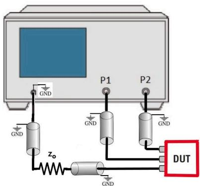  
Fig. 1. Basic measurement set-up.

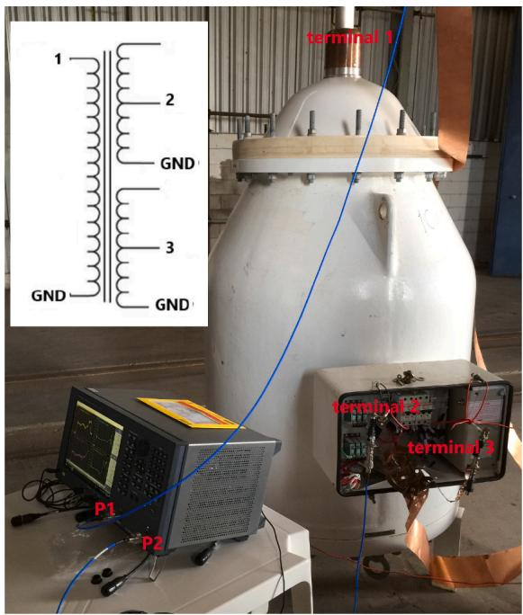  
Fig. 2. Basic measurement set-up in the field.

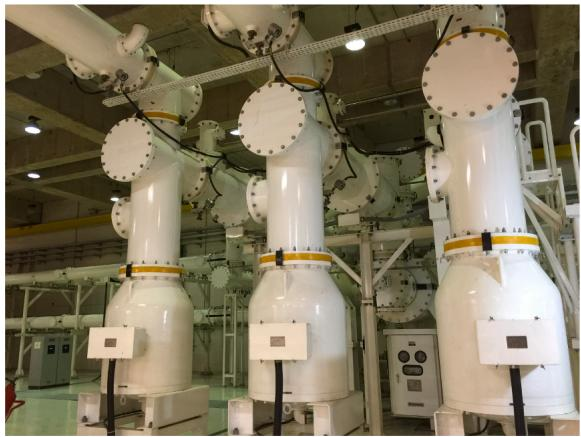  
Fig. 3. GIS and the three single-phase EHV-VT.

for subsequent VFT simulations.

The high-voltage (525 3 kV) terminal is labelled Terminal 1 whereas the low voltage (67.4 V) terminals are labelled Terminals 2 and 3. These are located inside a terminal box on the side of the tank seen in Figs. 2 and 3. All remaining low-voltage terminals are terminated in an open-circuit.

A total of 1600 frequency samples $\{ w _ { k } \} _ { k = 1 } ^ { 1 6 0 0 }$ logarithmically spaced between 20 Hz to 50 MHz are depicted in Fig. 4, these S-Parameters measurements were taken with the Keysight E5061B Vector Network Analyzer.

N-type cables having each 2.1 meters in length were used to connect the instrument to the DUT and calibration was done with these cables connected to the ports with standard terminations so that their effect is fully taken into account by the instrument’s own calibration system. This translates into measurement-based compensation as opposed to model-based compensation presented in [42]. CAble compensation is essential when frequencies up to the MHz range are considered. Connection details and the actual cable can be visualized in Figs. 1 and $^ { 2 , }$ respectively.

As expected, Fig. 4 confirms that the high-voltage terminal $( \mathrm { i } . \mathrm { e } . \ : S _ { 1 1 } )$

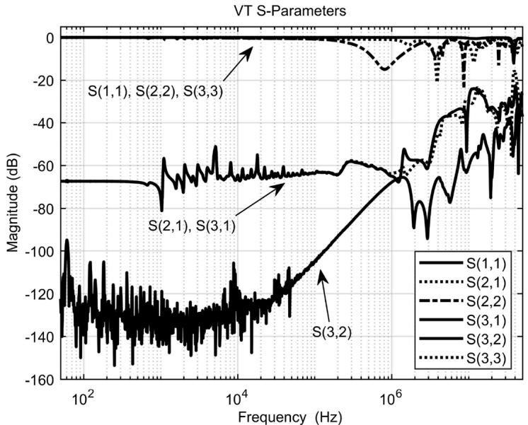  
Fig. 4. S-Parameters data for the GIS EHV-VT.

has nearly unitary scattering parameter for a wide frequency band as a consequence of the transformer’s high impedance. Focusing on the lowmid frequency range, the off-diagonal element $S _ { 3 2 }$ demonstrates the weak coupling between the low-voltage terminals as well as the worst signal-to-noise ratio among all elements of S matrix.

Figure 5 displays the Y-Parameters as obtained via conversion of the raw S-Parameters by means of the following relation [27]:

$$
\mathbf {Y} = \left(\sqrt {\mathbf {Z} _ {0}}\right) ^ {- 1} \left(\mathbf {I} - \mathbf {S}\right) \left(\mathbf {I} + \mathbf {S}\right) ^ {- 1} \left(\sqrt {\mathbf {Z} _ {0}}\right) ^ {- 1}, \tag {3}
$$

whereby $\mathbf { Z } _ { 0 }$ is a diagonal matrix whose entries hold the reference impedance $Z _ { 0 }$ used as terminations.

# 3.2. Case study - Part 2: measurement validation using high-low terminal transfer-voltage measurements

The measurements described in the previous section can be validated by calculating the VT’s high-to-low (Terminal 1 to Terminal 2) voltagetransfer for the same frequency samples for all measured frequencies.

This calculations assume Terminals 2 and 3 are are opened.

The voltage-transfer is calculated using Eq. (4) with data depicted in Fig. 5 as follows:

$$
\frac {V _ {2} (j \omega)}{V _ {1} (j \omega)} = \frac {Y _ {2 3} (j \omega) Y _ {3 3} ^ {- 1} (j \omega) Y _ {3 1} (j \omega) - Y _ {2 1} (j \omega)}{Y _ {2 2} (j \omega) - Y _ {2 3} (j \omega) Y _ {3 3} ^ {- 1} (j \omega) Y _ {3 2} (j \omega)}, \tag {4}
$$

whereby $V _ { 2 }$ and $V _ { 1 }$ denote the voltages at the corresponding low and high voltage terminals.

The voltage-transfer computed via Eq. (4) is then compared against the directly measured high-to-low voltage-transfer, Terminals 2 and 3 are are opened. A direct measurement of voltage transfers requires a different setup where an Agilent 33220A 20 MHz Function Generator is used to generate sinusoids that go through a Trek 2100HF Power Amplifier to be captured by a Tektronix TDS3032B Digital Oscilloscope. The specific settings and voltage-transfer calculations is performed by the proprietary software SFRA Lactec v3.0.

Figure 6 displays the measured versus computed voltage-transfers which corroborate their agreement thus validating both experiments. This figure also reveals that the transformer ratio at the rated frequency

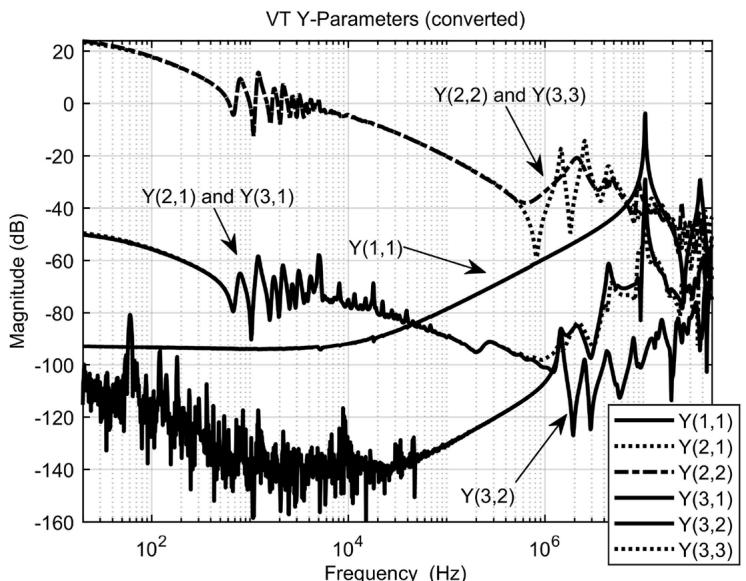  
Fig. 5. Converted Y-Parameters data.

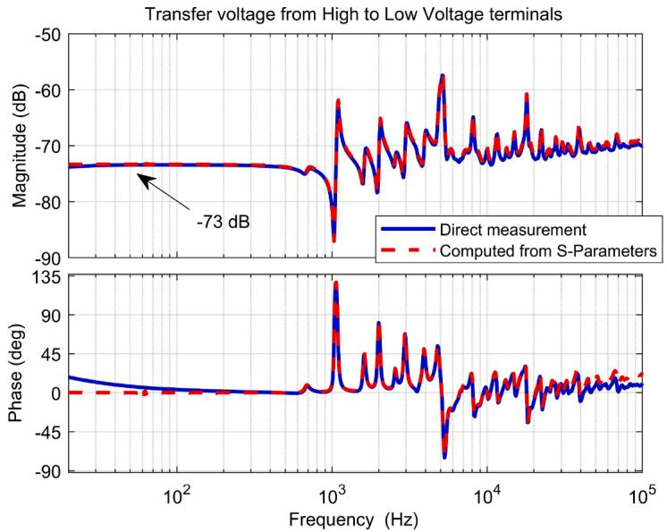  
Fig. 6. Comparison between voltage transfer from high-to-low terminals.

( − 73 dB at 60 Hz) have been precisely captured.

We could have used the inverse1 voltage-transfer relation, namely:

$$
\frac {V _ {1} (j \omega)}{V _ {2} (j \omega)} = \frac {Y _ {1 3} (j \omega) Y _ {3 3} ^ {- 1} (j \omega) Y _ {3 2} (j \omega) - Y _ {1 2} (j \omega)}{Y _ {1 1} (j \omega) - Y _ {1 3} (j \omega) Y _ {3 3} ^ {- 1} (j \omega) Y _ {3 1} (j \omega)}, \tag {5}
$$

but this would require instruments capable of dealing with high voltages owing to the VT’s high amplification factor.

# 3.3. Case study - Part 3: improving accuracy in the low-frequency range

As mentioned in Section 3.1, voltage transformers’ high-voltage terminals possess high input impedance at lower frequencies (correspondingly, the $Y _ { 1 1 }$ element has low admittance). This is a challenge to the instrument measuring the S-Parameters at the high-voltage terminal that translates into discrepancies in the corresponding converted Y-Parameters. As a consequence, the low-to-high voltage-transfer may fail to agree with the rated value at low frequencies owing to inaccuracies introduced by the element $Y _ { 1 1 }$ into Eq. (5). Note that element $Y _ { 1 1 }$ is the only matrix element out of Eq. (4) which has been validated by measurements using a different setup.

A similar situation may also occurs with power transformers blackbox models computed upon direct Y-Parameters measurements as well.

This issue can be dealt with by merging Y-Parameters measurement data with data from a white or grey-box model [43]. Motivated by the strategy presented in the aforementioned reference, we propose an alternative approach to circumvent the VT high impedance issue at high voltage terminal, namely merging the converted $Y _ { 1 1 }$ data with a simulated data of a simplified white or grey-box model, called here as $Y _ { 1 1 } ^ { w g }$ . This procedure can be summarized as: (i) derive an equivalent simplified model for the high-voltage terminal admittance is built as a RLC circuit using VT nominal values as well as manufacture and field test reports (such as, winding resistance measurement, capacitance tests and short circuit tests). (ii) select the turning point so that $Y _ { 1 1 } ^ { a }$ is determined as a combination of low frequency data from $Y _ { 1 1 } ^ { w g }$ and mid/high frequency data from the original $Y _ { 1 1 }$ .

Under these guidelines, RLC parameters for $Y _ { 1 1 } ^ { w g }$ yield: R = 10 MΩ, L = 4700 H and $C = 1 8 0 ~ \mathrm { p F } .$ .

Figure 7 depicts both $Y _ { 1 1 }$ and $Y _ { 1 1 } ^ { w g }$ as well as the resulting merged element $Y _ { 1 1 } ^ { a }$ . Note that the turning point is 100 kHz. Below is the greybox model data and above the original samples.

# 4. Black-box modelling for a EHV GIS VT

Transient simulations of VFTOs using rational approximations is efficient since CPU-time scales linearly with the length of EMT simulations. Passive devices specified by measured frequency-dependent network parameters can be efficiently derived by means of black-box modelling.

Data is originally measured as S-Parameters (comprising 1600 frequency samples in the range 20 Hz to 50 MHz) and then converted into Y-Parameters (Eq. (3)) for the subsequent black-box system identification. Only terminals 1 and 2 are considered as active terminals whereas terminal 3 is left open. A rational approximation can be obtained using the VF algorithm [34,44] setting the order at 80 under linear weighting.

This rational approximation is enforced to be passive using the approach described in [36]. Figure 8 contains both the passive rational model (herein denoted Model Y-50 MHz) just described and the data used to derive it, namely Y-Parameters converted from measured S-Parameters. As expected, these frequency-domain curves show there is very good agreement for the measurement range, i.e. 20 Hz to 50 MHz.

# 4.1. Time-domain validation

We use as input signal at the HV terminal a ramp-like having a 44 V amplitude with 195 $\mathrm { V } / \mu s$ starting at t = 1.972 μs so as to generate a time-domain response at the LV terminal. The setup for this time-domain measurement is illustrated in Fig. 9 where we use an Agilent 33220A 20 MHz function generator to be amplified with a Trek 2100HF power amplifier. The response is measured with a Tektronix TDS3032B digital oscilloscope and these time-domain measurements are reproduced in Fig. 10.

The input signal can now be used as excitation to the Y-50 MHz model in order to obtained a simulated time-domain response which is depicted in Fig. 11 along with the original output measured signal.

We can see that the signal’s characteristics have been fully reproduced by the model, i.e. the dominant oscillations, amplitudes and damping factors; thus validating the model.

Both signals’ frequency content are depicted in Fig. 12 where one can clearly see that the main resonances (around 1 MHz and 10 MHz)

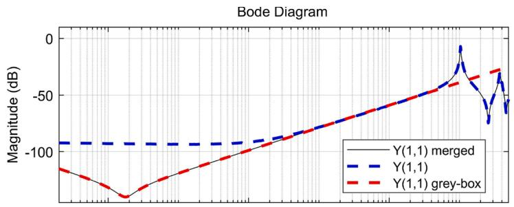

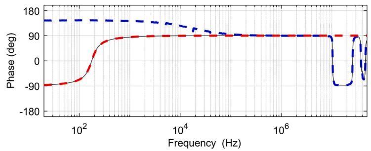  
Fig. 7. Improved $Y _ { 1 1 }$ measurements.

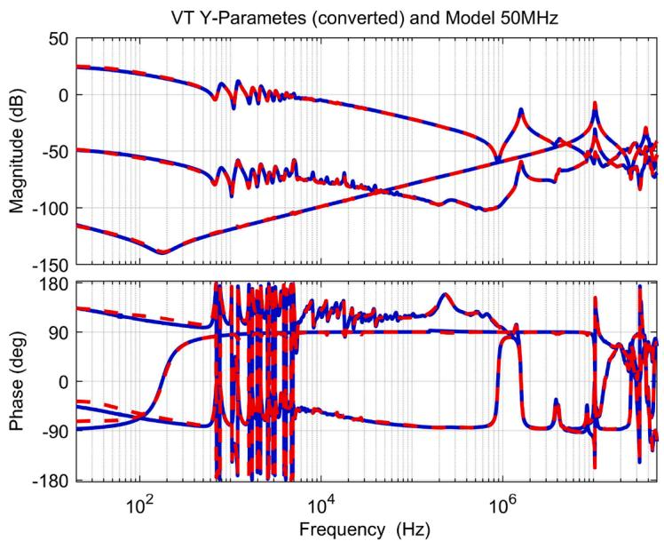  
Fig. 8. Comparing frequency-response measurements: model Y-50 MHz. Blue: measurements, red: model. (For interpretation of the references to color in this figure legend, the reader is referred to the web version of this article.)

coincide. This corroborates the importance of having a broader bandwidth that extends the upper-frequency bounds (as obtained with S-Parameters) to correctly reproduce the system’s main features.

# 5. Impact of measuring range on VFTO simulations

As discussed in the introduction Y-Parameters are only measured up to a few MHz owing to intrinsic limitations of the experimental setup. Therefore, scattering parameters (S-Parameters) serve as a natural alternative permitting the measurement frequencies to be expanded into the MHz range.

To assess the benefits derived from this broader frequency range we deliberately use censored data, i.e. having a reduced upper frequency bound, to built another model for further performance comparison of simulation results. In particular, we constrain this censored data to span the range 20 Hz to 1 MHz. This censored data is obtained by taken 1194 frequency samples out the previous 1600 samples so that the selected

portion has an upper band at 1 MHz.

A model is then derived upon this censored data in accordance with the same procedure detailed earlier and this second model is labelled Y-1 MHz. This model is used to generate frequency samples spanning the censored portion of the measured frequency-domain data, i.e. 1 MHz to 50 MHz. This procedure serves the purpose of showing how this model estimated upon censored data extrapolates into higher unseen frequencies.

The two models can now be compared to evaluate their distinct features in reproducing the VFTO phenomena. Figure 13 displays Y-Parameters measurements obtained by converting censored S-Parameters measurements as well as Y-Parameters simulated using the Y-1 MHz model. It can be clearly seen that the model shows good agreement only within the frequency band corresponding to data samples used in its estimation but extrapolates poorly for unseen frequency points, e.g. the main resonances in the seen frequencies were missed altogether.

To also compare the two models in the time-domain we repeat the

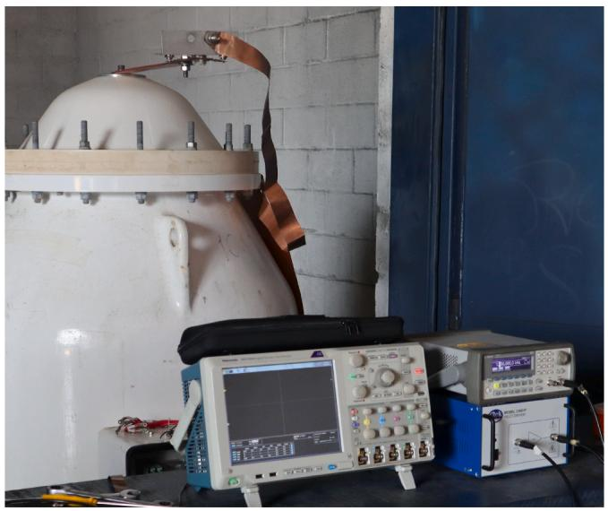  
Fig. 9. Illustration of the time-domain test set-up.

procedure described in the preceeding Section 4.1 using the same ramplike signal as excitation to both models. The result is displayed in Fig. 11 and it shows that the censoring the data undoubtedly resulted in an impared model. The limited Y-1 MHz model failed to reproduce the measured time-domain response as a consequence of missing important frequency characteristics such as the main resonances that occur at unseen frequencies. In addition, the censoring has also caused the response to have a reduced oscillation frequency as well as a dampened amplitude.

This discussion highlights the importance of expanding the measured frequency range and scattering parameters are the right choice to afford this expansion accurately as corroborated by the improved prediction ability of the Y-50 MHz model for very fast transients.

# 6. An application of VT models for VFT simulation at a GIS facility: Effect on the secondary circuit

In this section the models are deployed to simulations considering the surrounding GIS facilities which is part of a large hydroelectric

power plant (3,750 MW installed capacity) in northern Brazil. The power plant has two powerhouses each located the banks of the Madeira River in the Amazon region and a 500 kV transmission line connects it to the brazilian grid.

Figure 14 depicts a simplified schematic of the single-line diagram for the 500 kV GIS. Transmission lines L1 and L2 interconnect the power plant’s GIS to a collector substation which is approximately 90 km apart. Transmission line L4 interconnects the powerhouses on each bank. The GIS is connected to step-up transformers/generators (T1 to T7) through 7 bays. In this schematic rectangles and circles represent circuit-breakers and disconnectors, respectively. Furthermore, filled circles indicate a closed switch whereas circles correspond to an open switch. This entire GIS has been modelled using the electromagnetic transient program EMTP version 4.1 [45] and the model takes into account both geometrical and electrical data of every GIS component in compliance with guidelines recommended by Povh et al. [1] IEEE [46] Meppelink et al. [47].

The bus sections have been modeled with EMTP cable constant routine considering J. Marti’s high frequency dependent parameters calculation. Other components such as surge arrester, switches, bushings, spacers, elbows, current transformers were considered as lumped capacitances. Typical capacitance values available in GIS literature were used.

Table 1 consolidates the electrical parameters for some GIS components used to run the simulations.

The step-up transformer high frequency model was provided by the manufacturer and is presented in Fig. 15. The manufacturer’s model consists of concentrated inductances, capacitances and resistances to the bushing and winding.

The VT entered the simulation as the model described in to Section 4. Loads and control cables connected to the secondary side of the VT have also been included in the GIS model.

To reproduce a VFTO event, this simulation assumes that disconnector D21 switches closed which mimics the action of bypassing the L2 circuit-breaker while all transmission lines remain energized. This condition is critical when coinciding with a single restrike in the disconnector so that its de-energized terminal has the largest trapped charge.

The frequency content of the VFTO generated at the high voltage side of VT2 is shown in Fig. 16. Many resonance peaks can be visualized in the MHz-range, thus confirming the occurrence of a VFTO phenomena associated with switching operations in a GIS.

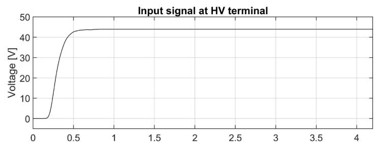

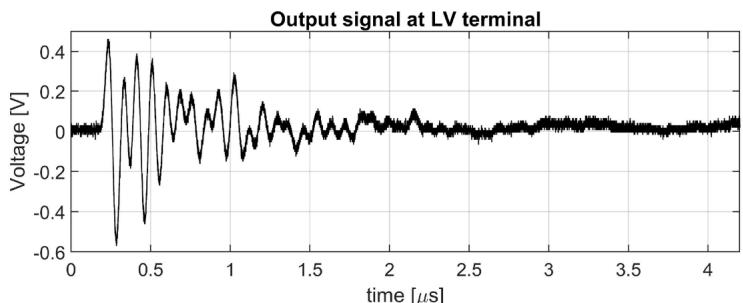  
Fig. 10. Time-domain measurement: Input (HV-terminal) and output (LV-terminal) signals.

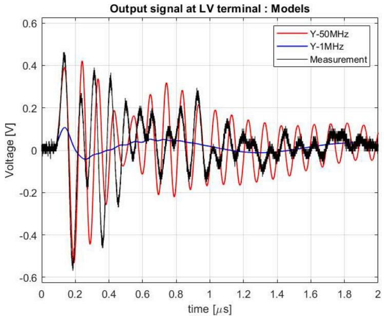  
Fig. 11. Time-domain signals: Measurements versus model predictions.

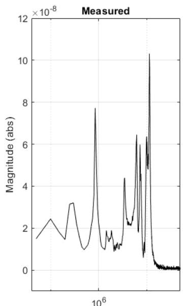  
Frequency (Hz)

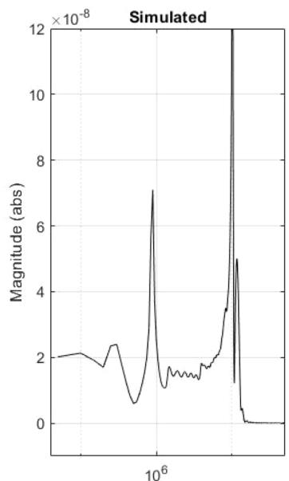  
Frequency (Hz)   
Fig. 12. Fast Fourier Transform: Measurements (left) versus model predictions.

Transient propaation to the secondary circuits is known to cause a number of problems such as disrupting control and protection systems [19,21], hence leading to irredeemable failures. Both the multi-terminal models discussed earlier in the paper, namely Y-1 MHz and Y-50 MHz, are now used to simulate how overvoltages generated at high-voltage side propagate through the VT to the low-voltage side under the described GIS switching operation.

A single-core buried cable was modeled with the EMTP cable constant routine connecting the VT secondary to a constant load which represented a protection relay. We reiterate that the analysis just made is feasible only when considering the VT as a multiport that takes into account both windings. The simplistic approach using a pure capactive element to represent the VT is unable to provide such results.

Figure 17 reproduces the voltages at the low-voltage under a VFTO at high-voltage side. The voltage predicted by the model Y-50 MHz at the low-voltage side oscillates at the same frequency (approximately 10

MHz) of that of the measured signal (cf. Figs. 11 and 12). This simulation reveals that the censored Model Y-1 MHz shows higher attenuation and damping if compared with Model Y-50 MHz, reinforcing the discussion of Section 4.1 but based on a different time-domain setting.

Despite the switching event being simulated in EMTP, the improved reliability obtained via the Y-50 MHz model is apparent.

The multi-terminal characteristic of the proposed modelling strategy enables the precise determination of the secondary voltage in the presence of VFTOs as it takes all these aspects into consideration, thus allowing for predictive maintenance guidelines to avoid failures.

# 7. Conclusions

A methodology that enhances electromagnetic transients simulations at GIS on both primary and secondary circuits under VFTO conditions has been presented which consists of using S-Parameters as a means of

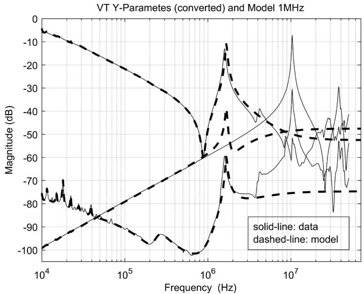  
Fig. 13. Comparing frequency-response measurements from 10 kHz - 50 MHz with model Y-1 MHz.

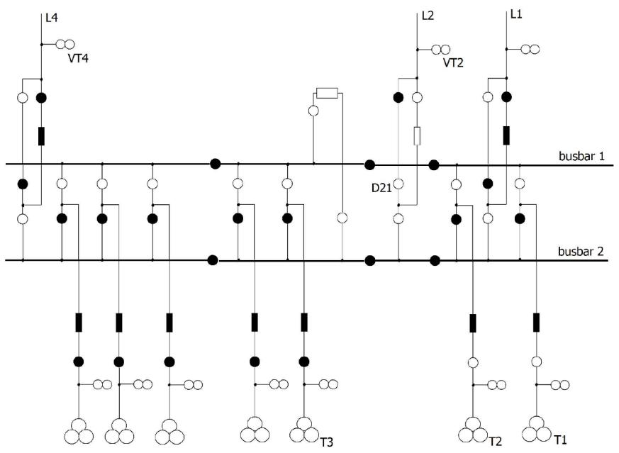  
Fig. 14. Simplified diagram of the 550kV GIS.

Table 1 Electrical parameters for GIS components.   

<table><tr><td>Component</td><td>Capacitances</td></tr><tr><td>Elbow</td><td>43 pF</td></tr><tr><td>Spacers</td><td>10 pF</td></tr><tr><td>Surge arrester</td><td>45 pF</td></tr><tr><td>Capacitance across disconnector open contacts</td><td>20 pF</td></tr><tr><td>Capacitance close disconnector</td><td>45 pF</td></tr><tr><td>Capacitance close circuit-breaker</td><td>40 pF</td></tr><tr><td>Open circuit breaker, capacitance across contacts</td><td>10 pF</td></tr><tr><td>SF6-air Bushings</td><td>530 pF</td></tr><tr><td>Current transformer</td><td>20 pF</td></tr><tr><td>Earth switches</td><td>45 pF</td></tr></table>

obtaining improved frequency-domain measurements aiming at computing black-box models for transient simulations.

As usage of S-Parameters in the power system context is incipient a

Fig. 15. GIS step-up transformer model.   
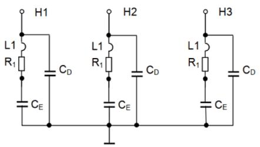  
- L1= HV Bushing and connection inductance   
- R1 = HV bushing ohmic resistance   
- CD = HV bushing capacitance to earth   
- CE = Winding capacitance

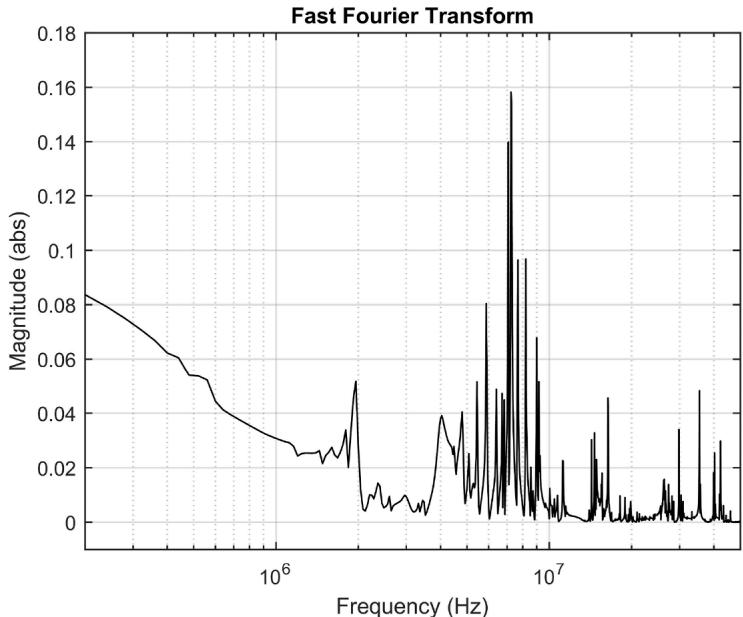  
Fig. 16. Fast Fourier Transform of VT2 Transient Voltage.

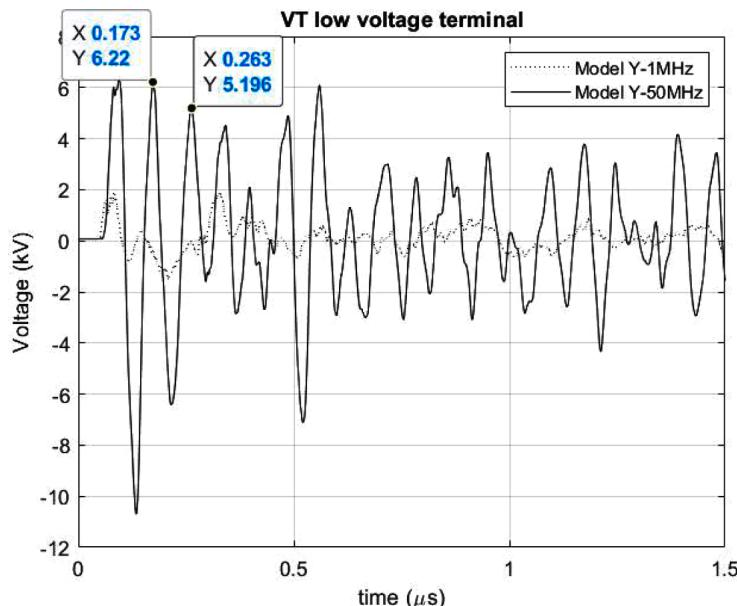  
Fig. 17. VT2 simulated transient voltage at low voltage terminal.

procedure based on measurement and modeling a GIS multiport EHV VT via S-Parameters is was proposed with a time-domain validation. The characteristic high impedance of VTs poses a difficulty for scattering parameters measurements and compensation for this inherent problem has been proposed. The importance of having frequency-domain measurements that extend further into higher frequencies to ensure improved time-domain predictive ability is demonstrated to be successfully achieved via S-Parameters.

The proposed procedure has culminated in a multiport black-box model for a EHV-VT with improved agreement in both the time and frequency domains. This endorses the adoption of scattering parameters instead of the traditional approach that relies only on a simple capacitive element which is unable to accurately reproduce the true dynamics of VFTOs at the VT’s high and low voltages sides.

# Declaration of Competing Interest

The authors declare that they have no known competing financial interests or personal relationships that could have appeared to influence the work reported in this paper.

# Acknowledgments

Preparation of this paper was supported by Energia Sustent´avel do Brasil (ESBR) through the research and technological development program, P&D ANEEL PD-06631-0006/2017, under the auspices of the Brazilian Electricity Regulatory Agency (ANEEL - Agˆencia Nacional de Energia El´etrica).

The authors are also grateful to the team from Lactec/Brazil for the fruitful cooperative work on the field measurements that make this work possible.

# References

[1] D. Povh, H. Schmitt, O. Valcker, R. Wutzmann, Modelling and analysis guidelines for very fast transients, IEEE Trans. Power Deliv. 11 (4) (1996) 2028–2035.   
[2] U. Riechert, Very fast transient overvoltages (VFTO) in gas-insulated EHV & UHV substations. IEEE PES Switchgear Committee, 2012 Fall Meeting, San Diego, CA, USA, 2012.   
[3] D. Moreira, M. Nunes, D. Moreira, D. Costa, Analysis of VFTO during the failure of a 550-kV gas-insulated substation, Electr. Power Syst. Res. 189 (2020) 106825.   
[4] Y. Shu, W. Chen, Z. Li, M. Dai, C. Li, W. Liu, X. Yan, Experimental research on veryfast transient overvoltage in 1100-kV gas-insulated switchgear, IEEE Trans. Power Deliv. 28 (1) (2013) 458–466.   
[5] B. Liu, Y. Tong, X. Deng, X. Feng, Measuring of very fast transient overvoltage and very fast transient current generated by disconnector operating. 2014 International Conference on Power System Technology, 2014, pp. 1349–1354.   
[6] A. Ametani, H. Xue, M. Natsui, J. Mahseredjian, Electromagnetic disturbances in gas-insulated substations and VFT calculations, Electr. Power Syst. Res. 160 (2018) 191–198.   
[7] W. Chen, H. Wang, B. Han, L. Wang, G. Ma, G. Yue, Z. Li, H. Hu, Study on the influence of disconnector characteristics on very fast transient overvoltages in 1100-kV gas-insulated switchgear, IEEE Trans. Power Deliv. 30 (4) (2015) 2037–2044.   
[8] H. Zhan, S. Duan, L. Yao, L. Zhao, Influence of switching properties of the disconnector on very fast transient overvoltage. 2017 IEEE Electrical Insulation Conference (EIC), 2017, pp. 412–416.   
[9] CIGRE, Guidelines for Representation of Networks Elements when Calculating Transients. CIGRE WG 33.02 Technical Brochure 39, 1990.   
[10] K.D. Tekletsadik, L.C. Campbell, SF6 breakdown in GIS, 1996.   
[11] S. Okabe, Insulation properties and degradation mechanism of insulating spacers in gas insulated switchgear GIS) for repeated/long voltage application, IEEE Trans. Dielectr. Electr.Insul. 14 (1) (2007) 101–110.   
[12] Electromagnetic Compatibility (EMC) - Part 6-5: Generic Standards - Immunity for Equipment used in Power Station and Substation Environment, 61000-6-5:2015 Standard, International Electrotechnical Commission (IEC), Geneva, CH, 2015.   
[13] B. Gustavsen, Y. Vernay, Measurement-based frequency-dependent model of a HVDC transformer for electromagnetic transient studies, Electr. Power Syst. Res. 180 (2020) 106141.   
[14] B. Gustavsen, Wide band modeling of power transformers, IEEE Trans. Power Deliv. 19 (2004) 414–422.   
[15] B. Gustavsen, Frequency-dependent modeling of power transformers with ungrounded windings, IEEE Trans. Power Deliv. 19 (2004) 1328–1334.   
[16] G.H.C. Oliveira, C. Rodier, L.P.R.K. Ihlenfeld, LMI-based method for estimating passive black-box models in power systems transient analysis, IEEE Trans. Power Deliv. (2016).   
[17] R. Schumacher, G.H.C. Oliveira, An optimal vector fitting method for estimating frequency-dependent network equivalents in power systems, Electr. Power Syst. Res. 150 (2017) 96–104.   
[18] T.M. Campello, S.L. Varricchio, G.N. Taranto, A. Ramirez, Enhancements in vector fitting implementation by using stopping criterion, frequency partitioning and model order reduction, Int. J. Electr. Power Energy Syst. 120 (2020).   
[19] I. Uglesic, S. Hutter, V. Milardic, I. Ivankovic, B. Filipovic-Grcic, Electromagnetic disturbances of the secondary circuits in gas insulated substation due to disconnector switching. International Conference on Power Systems Transients - IPST, 2003.   
[20] R. Hatano, T. Ueda, K. Nojima, H. Motoyama, Surge voltages induced in secondary circuits of 275kV full GIS, Electr. Theory B 123 (11) (2003) 1313–1317.   
[21] A. Tatematsu, K. Yamazaki, K. Miyajima, H. Motoyama, Experimental study of lightning and switching surges-induced overvoltages in low-voltage control circuits. International Symposium on Electromagnetic Compatibility - EMC Europe, 2013.   
[22] A. Morched, L. Marti, J. Ottevangers, A high frequency transformer model for the EMTP, IEEE Trans. Power Deliv. 8 (3) (1993) 1615–1626.

[23] B. Gustavsen, Removing insertion impedance effects from transformer admittance measurements, IEEE Trans. Power Deliv. 27 (2) (2012) 1027–1029.   
[24] B. Jurisic, I. Uglesic, A. Xemard, F. Paladian, P. Guuinic, Case study on transformer models for calculation of high frequency transmitted overvoltages, J. Energy 63 (2014) 262–272.   
[25] B. Jurisic, I. Uglesic, A. Xemard, F. Paladian, Difficulties in high frequency transformer modeling, Electr. Power Syst. Res. 138 (2016) 25–32.   
[26] B. Gustavsen, A hybrid measurement approach for wideband characterization and modeling of power transformers, IEEE Trans. Power Deliv. 25 (2010) 1932–1939.   
[27] B. Gustavsen, H.M.J.D. Silva, Inclusion of rational models in an electromagnetic transients program: Y-parameters, Z-parameters, S-parameters, transfer functions, IEEE Trans. Power Deliv. 28 (2) (2013) 1164–1174.   
[28] Z. Zhongyuan, L. Fangcheng, L. Guishu, High-frequency circuit model of a potential transformer for the very fast transient simulation in GIS, IEEE Trans. Power Deliv. 23 (4) (2013) 1995–1999.   
[29] R. Papazyan, P. Pettersson, H. Edin, R. Eriksson, U. Gafvert, Extraction of high frequency power cable characteristics from s-parameter measurements, IEEE Trans. Dielectr. Electr.Insul. 11(3).   
[30] H.J. Carlin, The scattering matrix in network theory, IRE Trans. Circuit Theory 3 (2) (1956) 88–97.   
[31] K. Kurokawa, Power waves and the scattering matrix, IEEE Trans. Microwave Theory 13 (2) (1965) 194–202.   
[32] R.H. Dicke, A computational method applicable to microwave networks, J. Appl. Phys. 18 (10) (1947) 873–878.   
[33] Y. Oono, Application of scattering matrices to the synthesis of n ports, IRE Trans. Circuit Theory 3 (2) (1956) 111–120.   
[34] B. Gustavsen, A. Semlyen, Rational approximation of frequency domain responses by vector fitting, IEEE Trans. Power Deliv. 14 (3) (1999) 1052–1061.   
[35] D. Deschrijver, T. Dhaene, B. Haegeman, Orthonormal vector fitting: a robust macromodeling tool for rational approximation of frequency domain responses, IEEE Trans. Adv. Packag. 30 (2) (2007) 216–225.   
[36] L.P.R.K. Ihlenfeld, G.H.C. Oliveira, On the optimality of passive and symmetric high-frequency n-terminal transformer models, IEEE Trans. Power Deliv. 34 (1) (2019) 129–136.   
[37] L.P.R.K. Ihlenfeld, G.H.C. Oliveira, Chordal graphs and partial positive passivity assessment, IEEE Trans. Power Deliv. 36 (2) (2021) 814–821, https://doi.org/ 10.1109/TPWRD.2020.2994063.   
[38] L.P.R.K. Ihlenfeld, G.H.C. Oliveira, Completion-based passivity enforcement for multiport networks rational models, IEEE Trans. Power Deliv. 36 (4) (2021) 2213–2220, https://doi.org/10.1109/TPWRD.2020.3022610.   
[39] J.C. Tippet, R.A. Speciale, A rigorous technique for measuring the scattering matrix of a multiport device with a 2-port network analyzer, IEEE Trans. Microwave TheoryTech. 30 (5) (1982) 661–666.   
[40] H.-C. Lu, T.-H. Chu, Multiport scattering matrix measurement using a reduced-port network analyzer, IEEE Trans. Microwave TheoryTech. 51 (5) (2003) 1525–1533.   
[41] I. Rolfes, B. Schiek, Multiport method for the measurement of the scattering parameters of n-ports, IEEE Trans. Microwave TheoryTech. 53 (6) (2005) 1990–1996.   
[42] B. Gustavsen, Eliminating measurement cable effects from transformer admittance measurements, IEEE Trans. Power Deliv. 31 (4) (2016) 1607–1609.   
[43] B. Gustavsen, A filtering approach for merging transformer high-frequency models with 50/60-hz low-frequency models, IEEE Trans. Power Deliv. 30 (3) (2015) 1420–1428.   
[44] D. Deschrijver, M. Mrozowski, T. Dhaene, D.D. Zutter, Macromodeling of multiport systems using a fast implementation of the vector fitting method, IEEE Trans.   
[45] EMTP-RV.   
[46] IEEE, Modeling guidelines for fast front transients, IEEE Trans. Power Deliv. 11 (1) (1996) 493–506.   
[47] J. Meppelink, K. Diederich, K. Feser, W. Pfaff, Very fast transients in GIS, IEEE Trans. Power Deliv. 4 (1) (1989) 223–233.