# Analysis and estimation of truncation errors in modeling complex resonant circuits with the EMTP

R. Carbone $^{a,\ast}$ , H.W. Dommel $^{b,1}$ , R. Langella $^{c,2}$ , A. Testa $^{c,2}$

$^{a}$ University of Reggio Calabria “Mediterranea”, D.I.M.E.T., via Graziella, 89100 Reggio Calabria, Italy $^{b}$ Department of Electrical and Computer Engineering, University of British Columbia, 2356 Main Mall, Vancouver, BC, Canada V6T 1Z4 $^{c}$ Dipartimento di Ingegneria dell'Informazione Aversa, II Univ. degli Studi di Napoli, Aversa Italy

Received 9 August 2000; accepted 14 May 2001

# Abstract

Most common computer programs for time domain simulations of power systems calculate the state of the system step by step, either with fixed or with variable step size. They integrate differential equations by using numerical methods. Whichever method of integration is used, numerical errors in modeling power system impedances will arise, which may not be negligible in the presence of resonances. The problem of analytically describing these errors for complex circuits is analyzed, with particular reference to computer programs of the EMTP type. © 2002 Elsevier Science Ltd. All rights reserved.

Keywords: EMTP; Resonant circuits; Truncation errors

# 1. Introduction

Computer programs for time domain simulations of power systems calculate the state of the system step-by-step, either with fixed or with variable step size. They are now being used over time spans, which are much larger than some of the program developers originally anticipated. Step-by-step simulations over millions of time steps raise questions about numerical errors, which may have been unimportant before.

In a previous paper [1], Dommel reviewed some of the questions of round-off and truncation errors, and their propagation and numerical stability in the numerical integration of differential equations. Numerical errors are unavoidable, but living with them is easier for program users if the nature of the errors is well understood and if useful error indicators are available.

The authors of Ref. [2] demonstrated that the numerical integration of differential equations may cause serious mathematical truncation errors in modeling electrical system impedances, especially if series and/or parallel

resonances occur. The errors depend significantly on the type of the integration method, and on the circuit complexity. This first error analysis was only carried out with respect to the trapezoidal rule of integration and for the simplest $R$ , $L$ , $C$ resonant circuits.

In this paper, the error analysis of the trapezoidal method is extended to complex circuits. A generalized error investigation with respect to resonance frequencies, impedance amplitude at the resonance frequencies and equivalent impedance quality factors is described. For simple series and parallel $R$ , $L$ , $C$ resonant circuits analytical error indicators are derived. For complex circuits the analysis, which is very difficult in principle, is developed by taking advantage of a curve fitting procedure, which preserves the use of analytical indices. Furthermore, for complex circuits in which very close resonances inhibit the aforementioned fitting procedure, a suitable numerical procedure based on the introduction of an apparent angular frequency is presented. Both the introduced analytical and numerical approaches give to program users information about the approximation involved in the integration method. Finally, the results of some comparisons with experimental error evaluations are discussed, which show the usefulness of the proposed error indicators.

# 2. Single inductor and capacitor

With reference to the trapezoidal rule of integration as

used in the EMTP [3], analytical expressions can be derived for the relative error of single inductor and single capacitor impedances. This error, $\bar{e}_Z$ , is defined as the difference between the EMTP modeled impedance (apparent impedance $\bar{Z}^{\mathrm{APP}}$ ) and the actual impedance, $\bar{Z}$ , normalized to the actual impedance amplitude

$$
\bar {e} _ {Z} (\omega) = \frac {\bar {Z} ^ {\mathrm {A P P}} (\omega) - \bar {Z} (\omega)}{| \bar {Z} (\omega) |} \tag {1}
$$

This definition makes it easy to develop analytical relationships for the errors, as will be shown in the following. From Eq. (1) it is also simple to evaluate the magnitude and the phase of the apparent impedance

$$
\bar {Z} ^ {\mathrm {A P P}} = | \bar {Z} | \cdot \bar {e} _ {Z} + \bar {Z},
$$

which allows the calculation of any other error defined differently.

Furthermore, starting from Eq. (1) and having evaluated the apparent impedance, it is possible to obtain the actual impedance by correcting it.

# 2.1. Inductors

By applying the trapezoidal rule of integration in the time interval $[t - \Delta t, t]$ , the differential equation of a self inductance is replaced by an approximate difference equation. By assuming that currents and voltages change sinusoidally at one frequency, the equation in the frequency domain becomes

$$
\bar {V} = \frac {2 L}{\Delta t} \frac {1 - \mathrm {e} ^ {- \mathrm {j} \omega t}}{1 + \mathrm {e} ^ {- \mathrm {j} \omega t}} \bar {I}
$$

or after some rewriting

$$
\bar {V} = \mathrm {j} \omega L \frac {\tan \left(\frac {\omega \Delta t}{2}\right)}{\left(\frac {\omega \Delta t}{2}\right)} \bar {I} = \mathrm {j} X _ {L} ^ {\mathrm {A P P}} \bar {I}. \tag {2}
$$

Eq. (2) shows that the trapezoidal rule does not see the correct reactance $X_{L}$ , but an apparent reactance, $X_{L}^{\mathrm{APP}}$

$$
X _ {L} ^ {\mathrm {A P P}} = X _ {L} (1 + \xi), \tag {3}
$$

where $\xi$ is the real auxiliary variable

$$
\xi = \frac {\tan \left(\frac {\omega \Delta t}{2}\right)}{\left(\frac {\omega \Delta t}{2}\right)} - 1. \tag {4}
$$

It also follows from Eq. (3)

$$
\xi = \frac {X _ {L} ^ {\mathrm {A P P}} - X _ {L}}{X _ {L}},
$$

that is to say, $\xi$ represents the relative error of the inductive reactance amplitude.

The analytical expression for the relative complex error

of the inductive reactance can now be easily obtained

$$
\bar {e} _ {X} (\omega) = \mathrm {j} \xi . \tag {5}
$$

For a fixed simulation time step, this error increases with frequency, and vice versa, for a fixed frequency it decreases when the time step decreases. In Ref. [2] it was shown that for typical simulation time step values, the errors are significantly high for frequencies above $5000\mathrm{Hz}$ .

Some computer programs approximate the lumped inductance of an inductor as a short-circuited 'stub line' with distributed inductance $L'$ and capacitance $C'$ . If the travel time of this shorted stub line is $\Delta t / 2$ , and if the distributed inductance multiplied with line length is equal to the value of the lumped inductance, then the surge impedance of the line becomes $2L / \Delta t$ . The exact solution of this lossless distributed parameter line gives the same answers as the trapezoidal rule applied to the lumped inductance [3]. This suggests a physical interpretation of the error: the inductance is distributed rather than lumped, with a small distributed shunt capacitance, which becomes smaller the smaller $\Delta t$ is.

# 2.2. Capacitor

Analogous results are obtained for capacitors. For a capacitor of capacitance $C$ , the apparent reactance $X_{C}^{\mathrm{APP}}$ and the analytical expression of the complex relative error are as follows:

$$
X _ {C} ^ {\mathrm {A P P}} = X _ {C} \frac {1}{(1 + \xi)}, \quad \xi = \frac {B _ {C} ^ {\mathrm {A P P}} - B _ {C}}{B _ {C}}, \tag {6}
$$

$$
\bar {e} _ {X} (\omega) = - \mathrm {j} \frac {\xi}{1 + \xi}. \tag {7}
$$

As for inductors, errors are high for frequencies above $5000\mathrm{Hz}$ .

# 3. Simple $R, L, C$ circuits

Even if EMTP errors for single inductors and/or capacitors can be considered negligible for typical simulation time steps, the numerical modeling of $R$ , $L$ , $C$ resonant circuits can produce significant errors, especially if a strong resonance characterizes the equivalent impedance. Fig. 1 refers to a series (a) and to a parallel (b) $R$ , $L$ , $C$ test circuit for the data shown in the figure caption: although the inductive and capacitive reactance errors are small, around the resonant frequency, the composite circuits have very big impedance errors ( $\cong 100\%$ ).

# 3.1. Series resonant circuits

The simple $R, L, C$ , series resonant circuit has a resonance angular frequency $\omega_0$ , a quality factor $Q$ and an actual

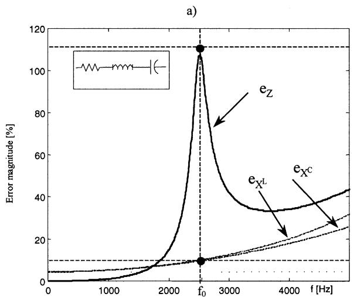

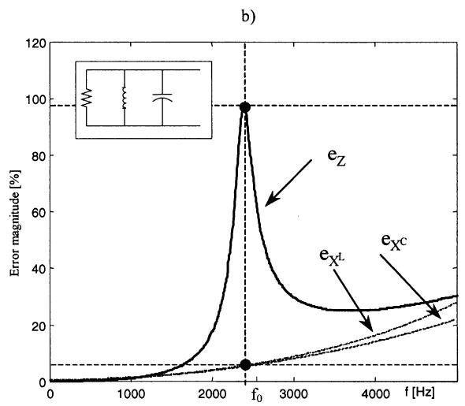  
Fig. 1. EMTP error magnitudes in modeling $X_{L}, X_{C}$ and the equivalent impedance, $Z$ , of a test circuit characterized by: $f_{0} = 2500\mathrm{Hz}$ , $Q = 10$ and $R = 1\Omega$ , for a time step $\Delta t = 50~\mu \mathrm{s}$ : (a) series connection, (b) parallel connection.

equivalent impedance $\bar{Z}$ , as follows:

$$
\omega_ {0} = \frac {1}{\sqrt {L C}}, \qquad Q = \frac {1}{R} \sqrt {\frac {L}{C}},
$$

$$
\bar {Z} = R + \mathrm {j} X _ {L} - \mathrm {j} X _ {C} = R \Bigg [ 1 + \mathrm {j} Q \bigg (\frac {\omega}{\omega_ {0}} - \frac {\omega_ {0}}{\omega} \bigg) \Bigg ].
$$

By applying the trapezoidal rule, the corresponding apparent expressions become

$$
\begin{array}{l} \bar {Z} ^ {\mathrm {A P P}} = R + \mathrm {j} X _ {L} (1 + \xi) - \mathrm {j} X _ {C} \frac {1}{(1 + \xi)} \\ = R \left[ 1 + j Q \left(\frac {\omega}{\omega_ {0}} (1 + \xi) - \frac {\omega_ {0}}{\omega} \frac {1}{(1 + \xi)}\right) \right], \\ \end{array}
$$

$$
\omega_ {0} ^ {\mathrm {A P P}} = \frac {2}{\Delta t} \tan^ {- 1} \left(\frac {\omega_ {0} \Delta t}{2}\right), \quad Q ^ {\mathrm {A P P}} = Q.
$$

Fig. 2 shows the modeling error effects with reference to the test system of Fig. 1a, for different time step values $\Delta t$ .

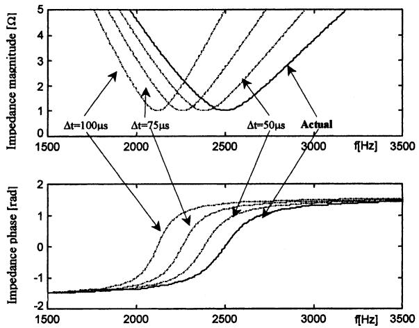  
Fig. 2. Magnitude and phase of series resonant circuit impedances, for different time step values $\Delta t$ .

Due to the simplicity of the analytical expressions for both the actual and apparent equivalent impedances, an analytical expression for the errors can be derived

$$
\bar {e} _ {Z} (\omega) = \mathrm {j} Q \xi \left(\frac {1}{1 + \xi} + \frac {\omega^ {2}}{\omega_ {0} ^ {2}}\right) \left(Q ^ {2} \frac {\omega}{\omega_ {0}} \left(1 - \frac {\omega^ {2}}{\omega_ {0} ^ {2}}\right) + \frac {\omega}{\omega_ {0}}\right) ^ {1 / 2} \tag {8}
$$

From Eq. (8), a parametric analysis of errors versus the angular frequency $\omega$ can be performed, as a function of the time step $\Delta t$ , the resonance angular frequency $\omega_0$ , and the circuit quality factor $Q$ . Details of this analysis are reported in Section 3.3 below.

From Eq. (8) the error at the resonance angular frequency, $\bar{e}_{\mathrm{Z0}}$ can also immediately be calculated as

$$
\bar {e} _ {Z 0} = \bar {e} _ {Z} \left(\omega_ {0}\right) = \mathrm {j} Q \xi_ {0} \frac {2 + \xi_ {0}}{1 + \xi_ {0}}, \tag {9}
$$

where $\xi_0 = \xi (\omega_0)$

To give a physical interpretation of $\xi_0$ , let us consider the basic definitions of the classical filter theory [4]. The analytical expression of the filter impedance versus angular frequency is

$$
\bar {Z} (\omega) = R \left[ 1 + \mathrm {j} Q \delta (\omega) \frac {(2 + \delta (\omega))}{(1 + \delta (\omega))} \right], \tag {10}
$$

where $\delta$ is the auxiliary variable defined as

$$
\delta = \frac {\omega - \omega_ {0}}{\omega_ {0}}.
$$

Due to uncertainty in the filter parameters, at the resonance angular frequency the impedance of the filter (apparent impedance) will be different from the ideal. In order to calculate the impedance error at the resonance angular frequency, it is possible to assume that

$$
\bar {Z} ^ {\mathrm {A P P}} \left(\omega_ {0}\right) \cong \bar {Z} \left(\omega_ {0} ^ {\mathrm {A P P}}\right), \tag {11}
$$

where $\omega_0^{\mathrm{APP}}$ is the resonance angular frequency of the actual filter impedance.

Taking into account for Eqs. (10) and (11), expression (1) gives

$$
\bar {e} _ {Z 0} = \mathrm {j} Q \delta \left(\omega_ {0} ^ {\mathrm {A P P}}\right) \frac {(2 + \delta \left(\omega_ {0} ^ {\mathrm {A P P}}\right))}{(1 + \delta \left(\omega_ {0} ^ {\mathrm {A P P}}\right))}. \tag {12}
$$

Finally, from a comparison between Eqs. (10) and (12), it can be shown that the auxiliary variable $\xi$ , introduced in Eq. (4) in $\omega$ assumes the physical interpretation of the classical detuning parameter, $\delta (\omega_0^{\mathrm{APP}})$ .

# 3.2. Parallel resonant circuits

The simple $R, L, C$ , parallel resonant circuit has an actual equivalent impedance $\bar{Z}$ , a resonance angular frequency $\omega_0$ , and a quality factor $Q$ as follows:

$$
\omega_ {0} = \frac {1}{\sqrt {L C}}, \qquad Q = R \sqrt {\frac {C}{L}},
$$

$$
\bar {Z} = \frac {1}{\frac {1}{R} - \mathrm {j} \frac {1}{X _ {L}} + \mathrm {j} \frac {1}{X _ {C}}} = \frac {R}{\left[ 1 + \mathrm {j} Q \left(\frac {\omega}{\omega_ {0}} - \frac {\omega_ {0}}{\omega}\right) \right]}.
$$

By applying the trapezoidal rule, the corresponding apparent expressions become

$$
\begin{array}{l} \bar {Z} ^ {\mathrm {A P P}} = \frac {1}{\frac {1}{R} - \mathrm {j} \frac {1}{X _ {L} (1 + \xi)} + \mathrm {j} \frac {1}{X _ {C}} (1 + \xi)} \\ = \frac {R}{\left[ 1 + \mathrm {j} Q \left(\frac {\omega}{\omega_ {0}} (1 + \xi) - \frac {\omega_ {0}}{\omega} \frac {1}{(1 + \xi)}\right) \right]}, \\ \end{array}
$$

$$
\omega_ {0} ^ {\mathrm {A P P}} = \frac {2}{\Delta t} \tan^ {- 1} \left(\frac {\omega_ {0} \Delta t}{2}\right), \qquad Q ^ {\mathrm {A P P}} = Q.
$$

Fig. 3 shows the modeling error effects with reference to the test system of Fig. 1b, for different time step values $\Delta t$ .

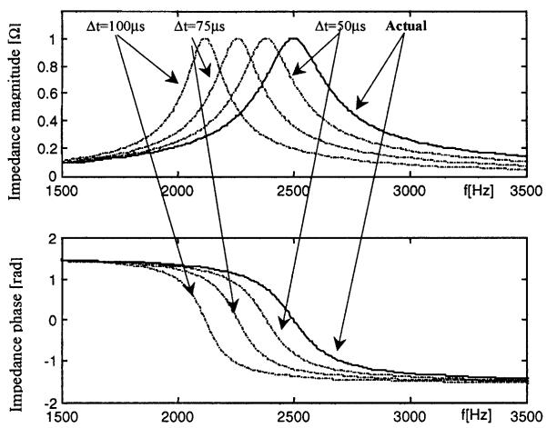  
Fig. 3. Magnitude and phase of parallel resonant circuit impedances, for different time step values $\Delta t$ .

In order to obtain an analytical expression for the relative error $\bar{e}_Z$ , let us first define the following complex coefficients, $\bar{\alpha}_{Y}$ , $\bar{\alpha}_{Z}$ :

$$
\bar {\alpha} _ {Y} = \frac {\bar {Y} ^ {\mathrm {A P P}} - \bar {Y}}{\bar {Y}}, \quad \bar {\alpha} _ {Z} = \frac {\bar {Z} ^ {\mathrm {A P P}} - \bar {Z}}{\bar {Z}}. \tag {13}
$$

Taking into account Eqs. (2) and (4), and after some rewriting, $\bar{\alpha}_{Y}$ becomes

$$
\bar {\alpha} _ {Y} = Q \xi \left(\frac {1}{1 + \xi} + \frac {\omega^ {2}}{\omega_ {0} ^ {2}}\right) \left(Q \left(\frac {\omega^ {2}}{\omega_ {0} ^ {2}} - 1\right) - j \frac {\omega}{\omega_ {0}}\right) ^ {- 1}. \tag {14}
$$

Then, it can be demonstrated that

$$
\bar {\alpha} _ {Z} = - \frac {\bar {\alpha} _ {Y}}{1 + \bar {\alpha} _ {Y}}. \tag {15}
$$

Finally, the analytical expression for $\bar{e}_Z$ can be obtained

$$
\bar {e} _ {Z} (\omega) = \bar {\alpha} _ {Z} \frac {\bar {Z}}{| \bar {Z} |} = \bar {\alpha} _ {Z} e ^ {- j \beta} \tag {16}
$$

with

$$
\beta = \tan^ {- 1} \left[ Q \left(\frac {\omega}{\omega_ {0}} - \frac {\omega_ {0}}{\omega}\right) \right].
$$

From Eq. (16), a parametric analysis of errors versus angular frequency $\omega$ can be performed, as a function of the time step $\Delta t$ , the resonance angular frequency $\omega_0$ , and the circuit quality factor $Q$ . The results are discussed in Section 3.3.

From Eq. (16), the error at the resonance angular frequency, $\omega_0$ , can be calculated as

$$
\bar {e} _ {Z 0} = \bar {\alpha} _ {Z 0} = - \frac {\bar {\alpha} _ {Y 0}}{1 + \bar {\alpha} _ {Y 0}}
$$

with

$$
\bar {\alpha} _ {Y 0} = \bar {e} _ {Y 0} = \mathrm {j} Q \xi_ {0} \frac {2 + \xi_ {0}}{1 + \xi_ {0}}. \tag {17}
$$

From filter theory, the filter admittance at the resonance angular frequency, versus detuning $\delta$ [4], is obtained as

$$
\bar {Y} (\omega) = \frac {1}{R} \bigg [ 1 + \mathrm {j} Q \delta (\omega) \frac {2 + \delta (\omega)}{1 + \delta (\omega)} \bigg ],
$$

and the admittance error at the resonance angular frequency results in

$$
\bar {e} _ {Y 0} = \mathrm {j} Q \delta \left(\omega_ {0} ^ {\mathrm {A P P}}\right) \frac {2 + \delta \left(\omega_ {0} ^ {\mathrm {A P P}}\right)}{1 + \delta \left(\omega_ {0} ^ {\mathrm {A P P}}\right)}. \tag {18}
$$

From a comparison between Eqs. (17) and (18) the physical interpretation of $\xi_0$ , previously underlined, is confirmed.

# 3.3. Parametric error analyses

Starting from Eqs. (8) and (16), some interesting parametric error analyses can be performed for simple series and parallel $R, L, C$ resonant circuits. For a fixed step size $\Delta t$ , the errors are obtained as a function of the resonance frequency

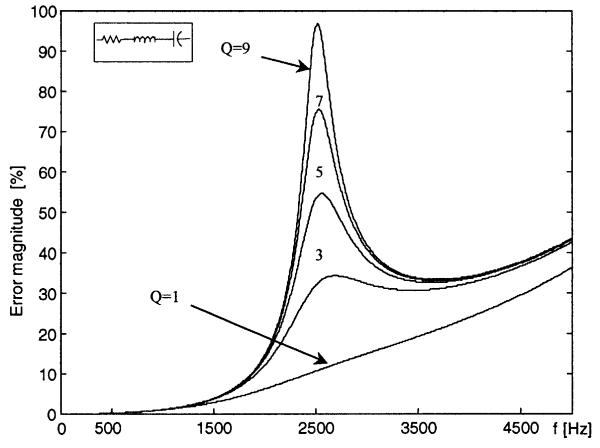  
a)

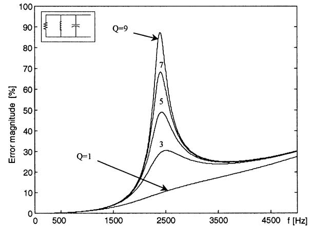  
b)   
Fig. 4. Error magnitude in series (a) and parallel (b) resonant circuits, characterized by $f_{0} = 2500\mathrm{Hz}$ , $Q$ from 1 to 9, and a time step $\Delta t = 50~\mu \mathrm{s}$ .

$f_{0}$ , and of the quality factor $Q$ , as shown in Figs. 4 and 5. In Fig. 4, the values used are, $f_{0} = 2500 \mathrm{~Hz}$ and $Q = 1,3,5,7,9$ , while Fig. 5 refers to $Q = 10$ and $f_{0} = 500$ , 1500, 2500, 3500, 4500 Hz; in both figures the time step is $\Delta t = 50 \mu \mathrm{s}$ .

It can be observed that maximum errors:

1. occur around $f_{0}$ ;   
2. quasi-linearly increase with $Q$ (Fig. 4), since their origins are resonance frequency shifts (Figs. 2 and 3), so the sharper the impedance curve is around the resonance frequency the bigger the errors are;   
3. increase according to a quasi-square law with $f_{0}$ (Fig. 5), since they are the cumulative effect of errors in modeling $X_{L}$ and $X_{C}$ (Fig. 1).

Comparing the behaviors of series and parallel circuits for the same $R, f_0$ and $Q$ values, it can be observed that:

1. errors in modeling series resonant circuits are always bigger;   
2. the maximum errors in series circuits always lie very close to the resonant frequency;

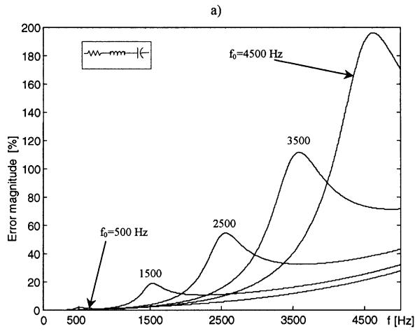

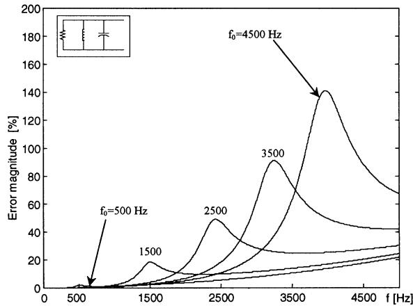  
b)   
Fig. 5. Error magnitude in series (a) and parallel (b) resonant circuits, characterized by $Q = 10$ , $f_{0}$ from 500 to $4500\mathrm{Hz}$ and a time step $\Delta t = 50~\mu \mathrm{s}$ .

3. the maximum errors in parallel resonant circuits lie at a frequency approximately $10\%$ before the resonant frequency.

# 4. Complex circuits

Unfortunately, when the number of inductors and/or capacitors increases, a mathematical error analysis is very arduous if not impossible, due to the complexity of analytical expressions of circuit equivalent impedances. In the following, starting from the analytical expression (8) and (16) in simple resonant circuits, two different proposals able to give in a simple way accurate information on errors are presented and discussed.

# 4.1. Circuits characterized by a single resonance

Numerical errors in complex circuits characterized by a single main series or parallel resonance can be estimated by taking advantage of Eq. (8) or (16) and of a curve fitting procedure: the actual complex circuit is substituted by a

simple $R, L, C$ circuit able to accurately fit, around $f_{0}$ , the equivalent impedance versus $f$ of the complex circuit. In practical cases, starting from complex circuit equivalent impedance versus $f$ (Fig. 6), the fitting circuit parameters, $R^{\mathrm{fitt}}, f_{0}^{\mathrm{fitt}}, Q^{\mathrm{fitt}}$ can be easily estimated as

$$
R ^ {\mathrm {f i t t}} = Z (f _ {0}), f _ {0} ^ {\mathrm {f i t t}} = f _ {0}, Q ^ {\mathrm {f i t t}} \cong \frac {f _ {0}}{f _ {2} - f _ {1}}.
$$

Then, expressions (8) and (16) can be utilized in the neighborhood of the resonance frequency.

# 4.2. Circuits characterized by two or more resonances

If the complex circuit under study results characterized by two ore more resonances, it is convenient to distinguish two different cases:

(a) resonance angular frequencies are significantly far from one another;   
(b) resonance angular frequencies are close to one another.

When condition (a) is verified, remembering that errors in numerical modeling of equivalent impedances are more significant in and around the resonance angular frequency, the equivalent impedance can be approximated by means of the series of different simple series and/or parallel $R$ , $L$ , $C$ resonant circuits. Then, errors can be separately estimated by means of $R$ , $L$ , $C$ fitting circuits, and the corresponding expression (8) and/or (16) around the corresponding resonance frequencies.

When condition (b) is verified, the aforementioned technique is not utilizable because of the interactions among resonances. Error estimations based on Eqs. (8) and (16), separately applied to the fitting circuits, could result in inaccurate answers.

On the other hand, from the apparent impedance analytical expressions of single inductors (Eq. (3)), single capacitors (Eq. (6)) and, also, of $R, L, C$ resonant circuits, it can be observed that apparent impedances versus angular

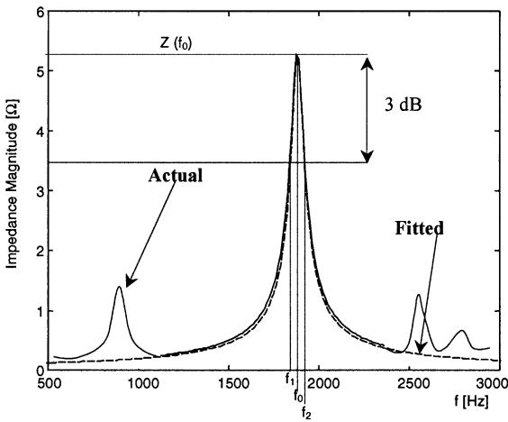  
Fig. 6. Fitting a circuit characterized by a single resonance.

frequency can be simply defined with the apparent angular frequency, $\omega^{\mathrm{APP}}$

$$
\omega^ {\mathrm {A P P}} = \omega (1 + \xi), \tag {19}
$$

as

$$
\bar {Z} ^ {\mathrm {A P P}} (\omega) = \bar {Z} \left(\omega^ {\mathrm {A P P}}\right); \tag {20}
$$

so expression (1) becomes

$$
\bar {e} _ {Z} = \frac {\bar {Z} \left(\omega^ {\mathrm {A P P}}\right) - \bar {Z} (\omega)}{| \bar {Z} (\omega) |}. \tag {21}
$$

It is important to emphasize that Eq. (21) is valid for the equivalent impedance of a generic complex resonant circuit.

The aforementioned technique can be applied in a very practical way, without solving the analytical expression of the actual equivalent impedance which might be very complex, by referring to the frequency scan diagrams. In this case, taking into account that

$$
\left| \bar {Z} ^ {\mathrm {A P P}} (\omega) \right| = \left| \bar {Z} \left(\omega^ {\mathrm {A P P}}\right) \right|, \quad \vartheta^ {\mathrm {A P P}} (\omega) = \vartheta \left(\omega^ {\mathrm {A P P}}\right),
$$

with $\vartheta$ being the phase of the impedance, the graphical representations of $|\bar{Z}|$ and $\vartheta$ versus $\omega$ (see Fig. 7a) are substituted by the representations of Fig. 7b. In these representations, the two curves are identical while their abscissas axis is doubled. The added axis refers the curves to the apparent angular frequency.

In this way, each point of the amplitude and phase equivalent impedance graphs contemporaneously represents the actual values, with respect to the actual axis, and the apparent values, with respect to the apparent axis (see Fig. 7b).

At each angular frequency and for each $\Delta t$ of interest, complex relative errors can be easily evaluated from $|\bar{Z}^{\mathrm{APP}}|, \vartheta^{\mathrm{APP}}, |\bar{Z}|$ and $\vartheta$ on the aforementioned doubled axis graphs

$$
\bar {e} _ {Z} (\omega) = \frac {\left| \bar {Z} ^ {\mathrm {A P P}} \right| \mathrm {e} ^ {\mathrm {j} \vartheta^ {\mathrm {A P P}}} - \left| \bar {Z} \right| \mathrm {e} ^ {\mathrm {j} \vartheta}}{\left| \bar {Z} \right|}.
$$

It is worthwhile to emphasize that the apparent axis is not linear, from Eq. (19), while the actual axis is obviously linear. A simple numerical routine can be utilized to solve the error calculation problem with very high frequency accuracy. Anyway, remembering again that errors are significant mainly in and around the resonance frequencies, expression (19) can also be linearized around the mean value as:

$$
\omega^ {\mathrm {A P P}} = k _ {1} + k _ {2} \omega ,
$$

with $k_{1}$ and $k_{2}$ being appropriate constant parameters according to Taylor's series theory, to obtain a double linear axis.

# 5. Numerical tests

The accuracy and the usefulness of the proposed error indicators are tested by means of several EMTP simulations. Firstly, error indicators of simple resonant circuits are

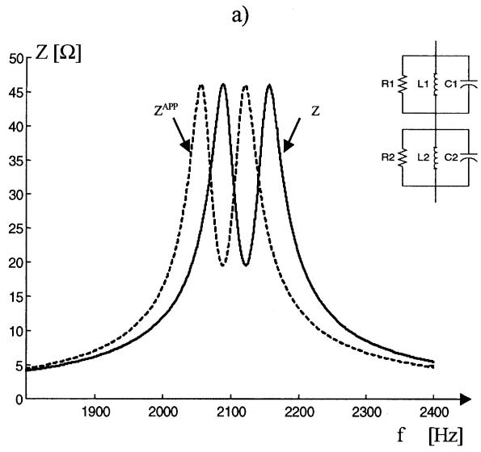

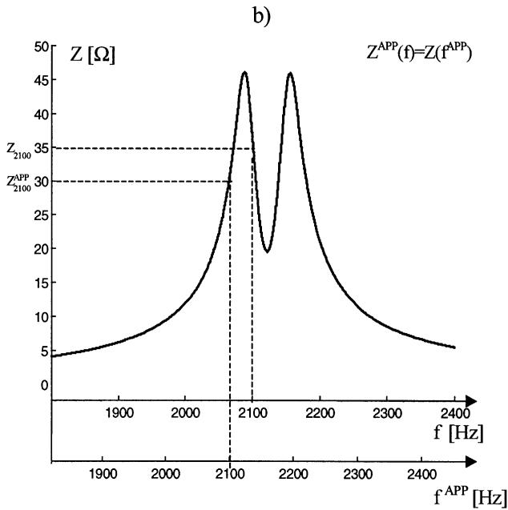

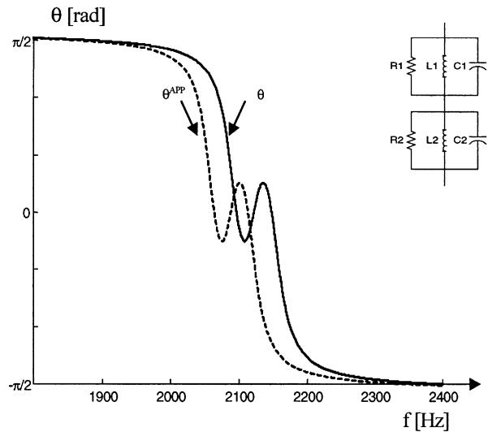

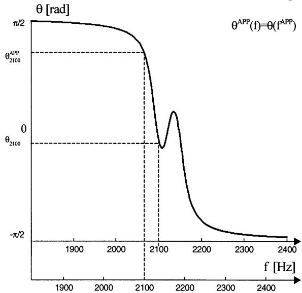  
Fig. 7. Amplitude and phase of actual and apparent impedances, of a double resonant test circuit for $\Delta t = 33~\mu \mathrm{s}$ : (a) versus the actual frequency; (b) versus actual and apparent frequencies.

considered. Then the proposed error estimation procedures are tested and their accuracy and usefulness are checked.

Four different case studies are used: the first two refer to the direct application of expressions (8) and (16). The third refers to the procedure developed in Section 4.2 for multi resonant circuits characterized by very far resonance frequencies. Finally, the fourth refers to the application of the procedure proposed for multi resonant circuits characterized by very close resonance frequencies.

# 5.1. Simple $R, L, C$ , series resonant circuits

A simple series resonant circuit characterized by $f_{0} = 1249.99\mathrm{Hz}$ , $Q = 15.3403$ and $R = 0.200000\Omega$ as in Section 3.1 is considered. The circuit is connected to a voltage source. Two EMTP simulations, both with $\Delta t =$

$50~\mu \mathrm{s}$ , were performed with a supply voltage of frequencies 1250 and $1000\mathrm{Hz}$ , respectively.

For both cases, the equivalent impedance of the circuit at the considered frequency was calculated from simulation results, and then the experimental error and the analytical error were obtained from Eqs. (1) and (8), respectively. In both cases, the experimental results $(\bar{e}_{Z,x,1250} = 0.00000000 + \mathrm{j}0.00169074,$ $\bar{e}_{Z,x,1000} = 0.00000000 + \mathrm{j}0.00110401)$ practically coincide with the analytical results $(\bar{e}_{Z,s,1250} = 0.00000000 +$ j0.00169075, $\bar{e}_{Z,s,500} = 0.00000000 + \mathrm{j}0.00112105)$ . This demonstrates the accuracy of the analytical index proposed for the circuit under study.

# 5.2. Simple $R$ , $L$ , $C$ , parallel resonant circuits

A simple parallel resonant circuit characterized by

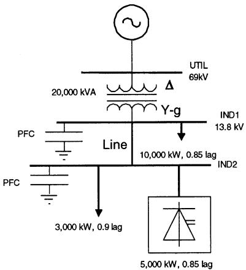  
Fig. 8. Simplified scheme of an industrial test system.

$f_{0} = 1249.99\mathrm{Hz}$ , $Q = 15.3403$ and $\mathbf{R}$ as in Section 5.1 is considered. The circuit is connected to a voltage source. Two EMTP simulations, both with $\Delta t = 50~\mu \mathrm{s}$ , were performed with a supply voltage of frequencies 1250 and $500\mathrm{Hz}$ , respectively.

For both cases, the equivalent impedance of the circuit at the considered frequency was calculated from the simulation results, and then the experimental errors were obtained from Eqs. (1) and (16), respectively. In both cases, the experimental results $(\bar{e}_{Z,x,1250} = -0.136765 - \mathrm{j}0.343438,\quad \bar{e}_{Z,x,500} = 0.000176905 + \mathrm{j}0.00284260)$ practically coincide with the analytical results $(\bar{e}_{Z,s,1250} = -0.136669 - \mathrm{j}0.343498,$ $\bar{e}_{Z,s,500} = 0.000176905 + \mathrm{j}0.00284260)$ , once again demonstrating the accuracy of the proposed analytical index.

# 5.3. Complex circuits with far resonances

The industrial system of Fig. 8 [5], consisting of two buses IND1 and IND2 connected through a short 3-phase, 4-wire line, is considered. The system is supplied by the utility through a $69\mathrm{kV} / 13.8\mathrm{kV}$ transformer. A line-commutated power-converter is connected to bus IND2. To calculate the harmonic voltage and total harmonic distortion (THD) on bus IND2, Ref. [5] suggests a frequency domain method and an EMTP simulation. In both cases, the converter is modeled as an ideal harmonic current injection.

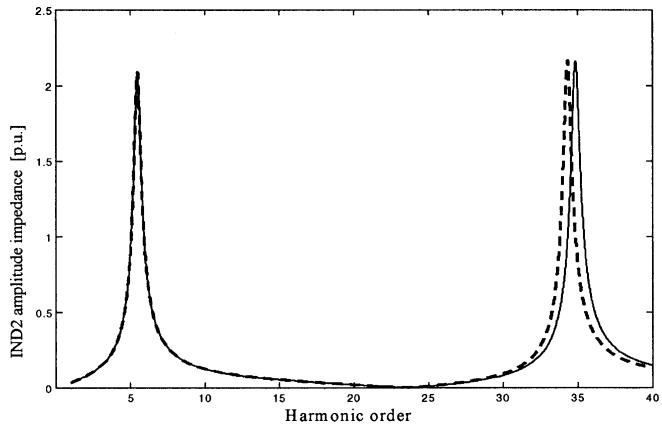  
Fig. 9. Equivalent impedance: actual (—) and apparent (- - - ) as seen from bus IND2, versus harmonic order.

As shown in Fig. 9, the equivalent impedance as seen from bus IND2 has two resonance frequencies, one around the fifth and the other around the 35th harmonic. The same figure also shows the EMTP apparent impedance; it confirms that the larger the resonance frequency, the larger is the resulting error.

Table 1 summarizes the results of the distortion analysis at bus IND2, in terms of errors $e_{Z,x}$ and $e_{Z,s}$ , as in Sections 5.1 and 5.2. Assuming as error free the results of the frequency current injection method, it is evident that the EMTP results are affected by representation errors, especially at the 35th harmonic. These errors decrease significantly only if the simulation time step is decreased drastically, starting from the value $\Delta t^{*}$ adopted in Ref. [5]. The analytical complex errors were evaluated by fitting the impedance curve, as shown in Fig. 6, and estimating the quality factors $(Q_{1} = 11.6, Q_{2} = 61.8)$ , and the resonance frequencies $(f_{01} = 327.74, f_{02} = 2090.0\mathrm{Hz})$ .

It is possible to underline as the estimated errors result very close to those obtained by means of very time consuming EMTP simulations.

# 5.4. Complex circuits with close resonances

The case study considered is the same as the one already used in the Section 5.3 and referred to in Fig. 7. It consists of

Table 1 Complex errors for harmonic voltages at bus IND2 of Fig. 7; experimentally obtained $\bar{e}_{Z,s}$ , analytically estimated $\bar{e}_{Z,s}$   

<table><tr><td rowspan="2">Methods</td><td rowspan="2"></td><td colspan="2">Fifth harmonic</td><td colspan="2">35th harmonic</td></tr><tr><td>\(\bar{e}_{Z,x}\) (p.u.)</td><td>\(\bar{e}_{Z,s}\) (p.u.)</td><td>\(\bar{e}_{Z,x}\) (p.u.)</td><td>\(\bar{e}_{Z,s}\) (p.u.)</td></tr><tr><td>Current injection</td><td></td><td>0 + j0</td><td>0 + j0</td><td>0 + j0</td><td>0 + j0</td></tr><tr><td rowspan="6">EMTP</td><td>\(\Delta t^{*}=33 \mu s\)</td><td>0.0027 + j0.0020</td><td>0.0026 + j0.0021</td><td>-0.72 + j0.11</td><td>-0.73 + j0.084</td></tr><tr><td>\(\Delta t=\Delta t^{*}/4\)</td><td>0.0002 + j0.0001</td><td>0.0002 + j0.0001</td><td>0.092 - j0.046</td><td>-0.091 - j0.050</td></tr><tr><td>\(\Delta t=\Delta t^{*}/8\)</td><td>0.0000 + j0.0000</td><td>0.0000 + j0.0000</td><td>-0.023 - 0.013</td><td>-0.023 - j0.015</td></tr><tr><td>\(\Delta t=\Delta t^{*}/16\)</td><td>0.0000 + j0.0000</td><td>0.0000 + j0.0000</td><td>-0.0058 - j0.0035</td><td>-0.0057 - j0.0038</td></tr><tr><td>\(\Delta t=\Delta t^{*}/32\)</td><td>0.0000 + j0.0000</td><td>0.0000 + j0.0000</td><td>-0.0014 - j0.0009</td><td>-0.0014 - j0.0009</td></tr><tr><td>\(\Delta t=\Delta t^{*}/64\)</td><td>0.0000 + j0.0000</td><td>0.0000 + j0.0000</td><td>-0.0004 - j0.0002</td><td>-0.0004 - j0.0000</td></tr></table>

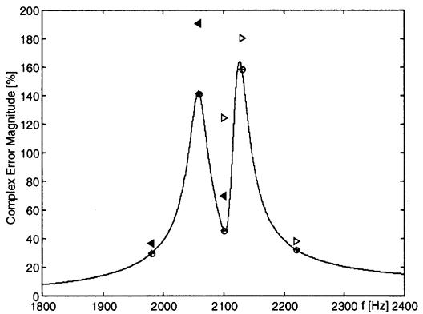

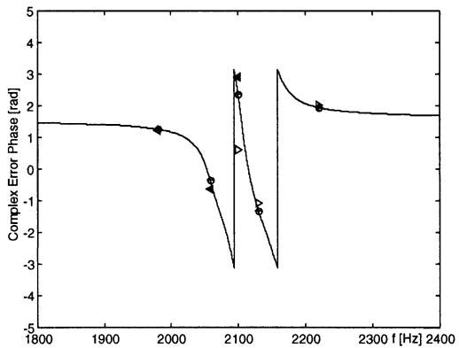  
Fig. 10. EMTP error estimation for the circuit of Fig.7; $(\text{一})$ : from doubled axis procedure, $\otimes$ : from EMTP simulations, $<$ , $\triangleright$ : from curve fitting procedures, left and right side, respectively.

a series connection of two parallel RLC resonant circuits, namely 1 and 2, with $Q_{1} = Q_{2} = 61.8$ and $f_{01} = 2091.0\mathrm{Hz}$ and $f_{02} = 2153.7\mathrm{Hz}$ . Fig. 10 shows the magnitude and the phase of the complex error in the frequency range from 1800 to $2400\mathrm{Hz}$ for $\Delta t = 33~\mu \mathrm{s}$ . It was obtained with the doubled axis graphs procedure implemented in Matlab. For five critical frequencies, the errors obtained by directly using EMTP simulations and the curve fitting procedure are also reported.

As can be seen, the errors estimated practically coincide with those effectively caused by the EMTP. The errors estimated (full triangle for right resonance fitting, empty triangle for left resonance fitting) sensibly overestimate the actual values.M

# 6. Conclusions

The error analysis of the trapezoidal method has been extended to complex circuits. A generalized error investigation with respect to resonance frequencies, impedance amplitude at the resonance frequencies and equivalent impedance quality factors has been described. For simple series and parallel $R, L, C$ resonant circuits, analytical error indicators have been derived. The analysis for complex circuits, which is very difficult in principle, has been developed by taking advantage of a curve fitting procedure, which preserves the use of analytical indices. Furthermore, for complex circuits in which very close resonances inhibit the aforementioned fitting procedure, a useful numerical procedure based on the introduction of an apparent angular frequency has been presented. Both the introduced analytical and numerical approaches give program users informa

tion about the approximation involved in the integration method. Finally, the results of some comparisons with experimental error evaluations have been discussed. They show the usefulness of the proposed error indicators.

The main outcomes of the paper are:

- errors can be expressed as a function of three parameters: the first and the second, $Q$ and $f_0$ , respectively, characterize the specific circuit sensitivity at a given resonance frequency;

the third, $\xi$ , is a function of the simulation time step $\Delta t$ and characterizes the trapezoidal rule sensitivity versus the same $\Delta t$ and the frequency;

- analytical expressions can estimate errors very accurately and can also be adopted to correct the results of frequency scans performed by usual time step EMTP simulations.

# References

[1] Dommel HW. Numerical errors in time-domain step-by-step simulations. Proceedings of EPRI/NSF Workshop on Application of Advanced Mathematics to Power Systems, 1993. p. 2-17-9.   
[2] Carbone R, Dommel HW, Marino P, Testa A. EMTP accuracy in representing electrical power system resonances. Proceedings of the Eighth IEEE International Conference on Harmonics and Quality of Power (ICHQP), Athens, Greece, 14-16 October 1998.   
[3] Electro Magnetic Transient Program, Reference Manual (EMTP Theory Book). August 1986, prepared by Dommel HW.   
[4] Arrillaga J, Bradley DA, Bodger PS. Power system harmonics. New York: Wiley, 1985.   
[5] IEEE Power Engineering Society (PES), Harmonics Modeling and Simulation Task Force, reference documents: A step-by-step guide for harmonic analysis: document and example cases (ATP and MATLAB).http://www.ee.ualberta.ca/pwrsys/IEEE/download.html.

Rosario Carbone was born in Taurianova, Italy, on 12 December 1965. He received his degree in Electrical Engineering from the University of Calabria, Italy, in 1990, and PhD degree in Electrical Engineering from the Department of Electrical Engineering of University of Naples, in 1995. He is engaged in researches on electrical power systems harmonic and interharmonic analysis.   
Hermann W. Dommel was born in Germany in 1933. He received the Dipl.-Ing. and Dr.-Ing. degrees in Electrical Engineering from Technical University, Munich, Germany in 1959 and 1962 respectively. From 1959 to 1966 he was with Technical University Munich, and from 1966 to 1973 with Bonneville Power Administration, Portland, Oregon. Since July 1973 he has been with the University of British Columbia in Vancouver, Canada. Dr Dommel is a Fellow of IEEE and registered professional engineer in British Columbia, Canada.

Roberto Langella was born in Naples, Italy, on 20 March 1972. He received the degree in Electrical Engineering from University of Naples, in 1996. He is working towards the PhD degree in Electrical Energy Conversion at the 'Dipartimento dell'Ingegneria dell'Informazione' Aversa, Italy.   
Alfredo Testa was born in Naples, Italy, on 10 March 1950. He received the degree in Electrical Engineering from University of Naples, in 1975. He is a Professor in Electrical Power Systems at the 'Dipartimento dell'Ingegneria dell'Informazione' Aversa, Italy. He is engaged in researches on electrical power systems reliability and harmonic analysis. Dr Testa is a member of IEEE Power Engineering Society and of AEI (the Italian Institute of Electrical Engineers).