# Admittance-based modelling of cables and overhead lines by idempotent decomposition✩

Felipe Camara a,∗, Antonio C.S. Lima b, Maria Teresa Correia de Barros c, Filipe Faria da Silva a, Claus L. Bak a

a Aalborg University, Denmark   
b Federal University of Rio de Janeiro, Brazil   
c University of Lisbon, Portugal

# A R T I C L E I N F O

Keywords:

Electromagnetic transients

Idempotent decomposition

Modelling

Overhead line

Vector fitting

# A B S T R A C T

This paper presents a new modelling approach based on idempotent decomposition of the nodal admittance matrix for representation of cables and overhead lines (OHL). By subjecting the idempotent matrices rather than the nodal admittance matrix to rational fitting, the poor observability of the smallest eigenvalues in the lower frequency range is overcome. Unlike the well-known method of characteristics (MoC), this alternative representation yields a so general fully-coupled admittance matrix suitable to tackle scenarios encompassing short and long lengths. Besides retaining the frequency dependence of parameters, the proposed phase-domain model showed to be accurate and suitable to circumvent the requirement of small time-steps.

# 1. Introduction

The field of cable modelling is an important research topic regarding simulation of electromagnetic transients (EMT). As a key enabler for integration of renewable energy resources, cables and overhead lines, hereinafter referred as lines, play an important role which requires accurate and efficient numerical models.

Time-domain solvers employ MoC-based models to evaluate travelling wave phenomena and several contributions have been proposed to overcome issues in modal-domain [1–11] and phase-coordinates [12– 16]. Numerical stability is reported as a concern since large residuepole ratios cause magnifications of interpolation errors leading to unstable time-domain simulations [17–20]. The influence of earth-return effects has receiving significant contributions since most parameter routines embedded in EMT-like software are based on conservative simplifying assumptions.

Simulations involving short line lengths require very small timesteps which increase the computation burden substantially. Some efforts addressed this problem [21,22] but it has been traditionally coped by cascading ??-sections which precludes frequency dependent effects.

To circumvent inherent issues related to MoC-based modelling, an alternative formulation exploits the nodal admittance matrix $\mathbf { Y } _ { n }$ [23,24] which relates the terminal voltage and current in the frequency domain. It imposes no constraint due to the cable length, phase conductor arrangement or circuits running in parallel. However, the direct fitting of $\mathbf { Y } _ { n }$ results in inaccurate characterization of the smallest eigenvalues in the lower frequency range. The so-called folded line equivalent model [25] addressed this issue through a similarity transformation in $\mathbf { Y } _ { n }$ by decomposing it into open-circuit and short-circuit contributions in the phase-domain. Another distinct approach called Bergeroncells [26] has been proposed for frequency-dependent modelling of transmission lines employing a cascade of cells in a similar fashion as in the cascaded ?? modelling. This methodology avoids the modal decomposition either in the identification and time-domain realization stages.

Commonly used in linear algebra, also known as spectral decomposition, the idempotent decomposition is a technique to decompose a given matrix into a sum of elementary matrices that, when multiplied by itself, produces itself again [27]. To the best of the author’s knowledge, the first use of idempotents in power systems is

reported to Prof. Wedepohl’s lecture notes [28]. Then, the idempotent decomposition was firstly proposed in the rational approximation of ?? in phase-coordinates for overhead lines [29]. Contrary to the modal domain transformation, it represents a linear transformation on idempotents instead of eigenvectors [30,31]. Later, the feasibility of applying idempotents for a full-frequency dependent line model using the MoC was investigated in the analysis of underground cables and overhead lines [32]. However, it was found that the accuracy is dependent on the number of circuits running in parallel due to coupling effects. In a similar way, this paper investigates the concept of idempotents as a similarity transformation for decomposition of $\mathbf { Y } _ { n }$ into the sum of products of idempotent matrices to overcome numerical issues related to low observability of eigenvalues for phase-coordinates modelling. Due to the fully-coupled structure of the admittance matrix, it is foreseen the applicability of this approach to represent cables and overhead lines in real-time or multi-scale simulations [33] to tackle short and long lengths.

This paper is organized as follows: Section 2 presents the available formulations to derive a wideband model for EMT computations. Section 3 presents the idempotent decomposition and how it can be implemented to allow the interface with time-domain solvers. In Section $^ { 4 , }$ the proposed formulation is validated through comparison with standard time-domain simulations. Finally, Section 5 presents the main conclusions.

# 2. Time-domain modelling

# 2.1. Method of characteristics (MoC)

Time-domain solvers resort to MoC models to represent cables in transient studies. Also known as travelling-wave method, it is based on propagation parameters given by the characteristic admittance $\mathbf { Y } _ { c }$ and the propagation function ??. It consists the full representation of the distributed nature of transmission line impedances together with the skin effect and earth-return path influence. The formulation in the frequency-domain is given as follows [34]

$$
\mathbf {I} _ {k} = \mathbf {Y} _ {c} \mathbf {V} _ {k} - \mathbf {H} \left[ \mathbf {Y} _ {c} \mathbf {V} _ {m} + \mathbf {I} _ {m} \right] \tag {1a}
$$

$$
\mathbf {I} _ {m} = \mathbf {Y} _ {c} \mathbf {V} _ {m} - \mathbf {H} \left[ \mathbf {Y} _ {c} \mathbf {V} _ {k} + \mathbf {I} _ {k} \right] \tag {1b}
$$

where $\mathbf { Y } _ { c }$ is the characteristic admittance and ?? is the propagation function given by

$$
\mathbf {Y} _ {c} = \mathbf {Z} ^ {- 1} \sqrt {\mathbf {Z Y}} \tag {2}
$$

$$
\mathbf {H} = \exp (- \ell \sqrt {\mathbf {Y Z}})
$$

in which ?? and ?? are the series impedance and shunt admittance matrices per unit length and ?? is the line length. The time-domain counterparts obtained by means of convolutions are given by

$$
\mathbf {i} _ {k} = \mathbf {y} _ {c} * \mathbf {v} _ {k} - \mathbf {h} * [ \mathbf {y} _ {c} * \mathbf {v} _ {m} + \mathbf {i} _ {m} ] \tag {3a}
$$

$$
\mathbf {i} _ {m} = \mathbf {y} _ {c} * \mathbf {v} _ {m} - \mathbf {h} * [ \mathbf {y} _ {c} * \mathbf {v} _ {k} + \mathbf {i} _ {k} ] \tag {3b}
$$

as $\mathbf { y } _ { c }$ and ?? are the unit impulse responses of $\mathbf { Y } _ { c }$ and ??, $\mathbf { v } _ { k } , \ \mathbf { v } _ { m } , \ \mathbf { i } _ { k }$ and $\mathbf { i } _ { m }$ are the terminal voltages and injected currents and the symbol ∗ indicates convolution. The implementation of MoC-based models requires $\mathbf { Y } _ { c }$ and ?? matrices to be subjected to a rational approximation. Even though the resulting approximation correspond to a passive rational model within a user-defined band, numerical issues still might occur $[ 1 7 , 1 8 , 3 5 ]$ ].

# 2.2. Nodal admittance matrix

The modelling through the nodal admittance matrix $\mathbf { Y _ { n } }$ in the frequency domain provides a more compact form without the requirement

to handle $\mathbf { Y } _ { c }$ and ?? matrices in an explicitly way. After subjected to a rational approximation, $\mathbf { Y } _ { n }$ presents the following form

$$
\mathbf {Y} _ {\mathbf {n}} (s) \approx \sum_ {m = 1} ^ {M} \frac {\mathbf {R} _ {m}}{s - p _ {m}} + \mathbf {D} \tag {4}
$$

where $p _ { m }$ is a set of common poles, either real or complex conjugate, $\mathbf { R } _ { m }$ is the residue matrix and ?? is the real part of $\mathbf { Y _ { n } }$ at infinite frequency.

Let a cable consisting of ?? phases or metallic conductors, $\mathbf { Y _ { n } }$ is given by

$$
\mathbf {Y} _ {\mathbf {n}} (s) = \left[ \begin{array}{l l} \mathbf {Y} _ {s} & \mathbf {Y} _ {m} \\ \mathbf {Y} _ {m} & \mathbf {Y} _ {s} \end{array} \right] \tag {5}
$$

where ${ \bf Y } _ { s }$ and $\mathbf { Y } _ { m }$ are $n \times n$ block matrices defined by

$$
\mathbf {Y} _ {s} = \mathbf {Y} _ {c} \left(\mathbf {I} + \mathbf {H} ^ {2}\right) \left(\mathbf {I} - \mathbf {H} ^ {2}\right) ^ {- 1} \tag {6a}
$$

$$
\mathbf {Y} _ {m} = - 2 \mathbf {Y} _ {c} \mathbf {H} (\mathbf {I} - \mathbf {H} ^ {2}) ^ {- 1} \tag {6b}
$$

and ?? is an ?? × ?? identity matrix. The direct fitting of ${ \bf Y _ { n } }$ often results in inaccurate characterization of small eigenvalues at low frequencies as a consequence of a large eigenvalue ratio. This common issue can be overcome resorting to the Modal Vector Fitting (MVF) [36], even though the computation time can be substantial, or to the Mode-Revealing Transformation (MRT) [37] or Folded Line Equivalent [25] schemes.

# 3. Idempotent decomposition

As aforementioned, the idempotent decomposition represents a linear transformation. In [32], the identification of ?? matrix was carried out by means of a sum of products of idempotent matrices as an alternative to the modal grouping in the original proposition of the socalled Universal Line Model (ULM) [12]. Here, an eigendecomposition of $\mathbf { Y } _ { n }$ is performed instead, resulting in the so-called idempotent matrices. These matrices are accomplished by the product of a frequency dependent transformation matrix ??, a diagonal matrix of modes $\mathbf { Y } _ { m }$ and the inverse matrix of ?? given by

$$
\mathbf {Y} _ {\mathbf {n}} (s) = \mathbf {T} \cdot \mathbf {Y} _ {m} \cdot \mathbf {T} ^ {- 1} \tag {7}
$$

Writing the transformation matrices ?? and $\mathbf { T } ^ { - 1 }$ in terms of their respective rows $\mathbf { r } _ { i }$ and columns $\mathbf { c } _ { i }$

$$
\mathbf {Y} _ {n} (s) = \left[ \begin{array}{l l l} \mathbf {c} _ {1} & \dots & \mathbf {c} _ {n} \end{array} \right] \left[ \begin{array}{l l l} y _ {1} & & \\ & \ddots & \\ & & y _ {n} \end{array} \right] \left[ \begin{array}{l} \mathbf {r} _ {1} \\ \vdots \\ \mathbf {r} _ {n} \end{array} \right] \tag {8}
$$

$$
\mathbf {Y} _ {n} (s) = \sum_ {i = 1} ^ {n} \mathbf {M} _ {i} \mathbf {y} _ {i}
$$

where n is the number of modes and $\mathbf { M } _ { i }$ are the idempotent matrices to be subjected to rational approximation with the Vector Fitting routine [38–41].

Aiming at lowering the order of the rational functions, the proposition to group idempotent matrices will be employed in a similar fashion like the grouping routine used in the ULM approach. Then, the grouping scheme sums up the idempotent matrices that have eigenvalues exhibiting similar behaviour, as sketched in (9).

$$
\mathbf {Y} _ {n} (s) = \mathbf {M} _ {1} + \mathbf {M} _ {2} = \sum_ {i = 1} ^ {n _ {1}} \mathbf {M} _ {i} \mathbf {y} _ {i} + \sum_ {i = n _ {1} + 1} ^ {n} \mathbf {M} _ {i} \mathbf {y} _ {i} \tag {9}
$$

where $n _ { 1 }$ is the number of modes considered for deriving $\mathbf { M } _ { 1 }$ and the remaining ones are considered for deriving $\mathbf { M } _ { 2 } .$ . It is worth mentioning that the time delay extraction is disregarded since $\mathbf { Y } _ { n }$ inherits the propagation delays through its block matrices derived from ??. Thus, it is implicitly considered in the ?? matrices.

For time-domain implementation of the proposed idempotent model, the procedure is slightly different from the implementation based on the direct fitting of the nodal admittance matrix $\mathbf { Y } _ { n } .$ . Since

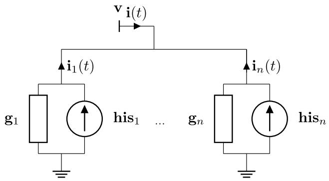  
Fig. 1. Time-domain realization of a idempotent line model.

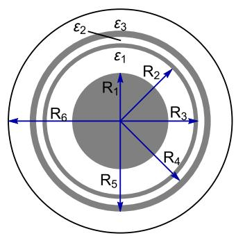  
Fig. 2. Case #1: 75 kV HVDC submarine cable configuration.

$\mathbf { Y } _ { n }$ was decomposed into a sum of independent matrices, the equivalent history current source should be represented as a set of parallel current sources associated with each idempotent matrix ?? , as depicted in Fig. 1. Assuming the grouping scheme yields two idempotent matrices, one has to update two current sources separately. Thus, the equivalent source is obtained by summing both contributions. A brief discription on the expressions to calculate the history current source for each idempotent group is provided in Appendix A.

# 4. Test cases

The accuracy of the proposed idempotent model is demonstrated with three test cases, namely:

1. case #1: single-core HVDC submarine cable, 2.5 km   
2. case #2: 132-kV overhead line, 10 km

A frequency-domain algorithm based on the Numerical Laplace Transform (NLT) [42–44] is employed for the sake of validation. Once the whole network is solved in the complex frequency domain, it can be considered as an accurate response. The abovementioned userdefined codes and the one to obtain the nodal admittance matrix were developed with

# 4.1. Case #1: HVDC cable

Let a single core (SC) armoured submarine cable employed in a VSC–HVDC link [45]. In such applications, the cables are buried just below the seabed, with depths varying from 1 to 2 m. Here, the burial depth is 1.5 m below the seabed and the cable is 2.5 km long. The crosssection is depicted in Fig. 2 and the reader is referred to Appendix B to assess the main data.

Firstly, the cable parameters were computed in the frequency range between 0.01 Hz – 1 MHz to extract the nodal admittance matrix $\mathbf { Y } _ { n }$ as stated in (5). It was considered a combination of linearly and logarithmically spaced frequency samples. Linear sampling provides a

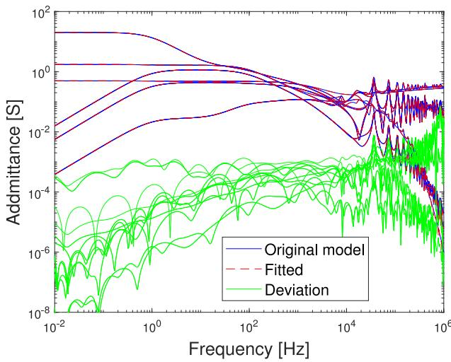  
Fig. 3. Case #1: Rational fitting of $\mathbf { Y } _ { n } .$ .

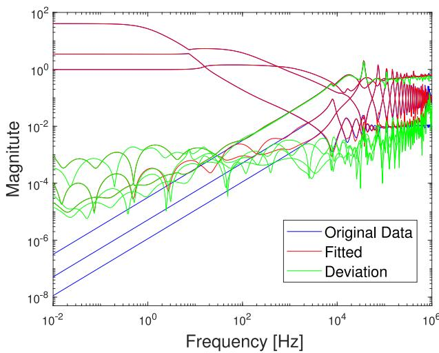  
Fig. 4. Case #1: Eigenvalues of $\mathbf { Y } _ { n }$

good resolution at low frequencies, while logarithmic sampling provides better resolution at high frequencies and when the frequency response of a given system exhibits significant changes in amplitude. When $\mathbf { Y } _ { n }$ is subjected to a direct fitting, a poor observation of the eigenvalues at low frequencies is observed even with a passived rational approximation of the original matrix $\mathbf { Y } _ { n } ,$ as shown in Figs. 3 and 4.

The proposed methodology consists in decomposing $\mathbf { Y } _ { n }$ into idempotent matrices and then applying the grouping scheme of modes with close eigenvalues. Naturally, each $\mathbf { M } _ { i } \mathbf { y } _ { i }$ could be fitted independently, as described in (8), although this would lead to a considerably larger model. It can be observed in Fig. 4 two mode groups with distinct behaviour at the lower frequency range. Thus, we can group their respective idempotent counterparts to lower the amount of matrices to be subjected to rational approximation with the VF routine.

In this example, the eigendecomposition of $\mathbf { Y } _ { n }$ yields six eigenvalues or modes and it was possible to reduce the six idempotent matrices into two equivalent groups, namely, $\mathbf { M } _ { 1 }$ and $\mathbf { M } _ { 2 }$ . Fig. 5 shows the elements of each matrix and the resulting pole-residue model with 70 and 90 poles, respectively, is presented in Fig. 6.

To evaluate the accuracy of the proposed idempotent model in the time-domain with the NLT algorithm, a voltage source is ramped up linearly to 1 V in 50 μ s at the core conductor as depicted in Fig. 7. To obtain a more oscilatory waveform, the sheath and armour conductors

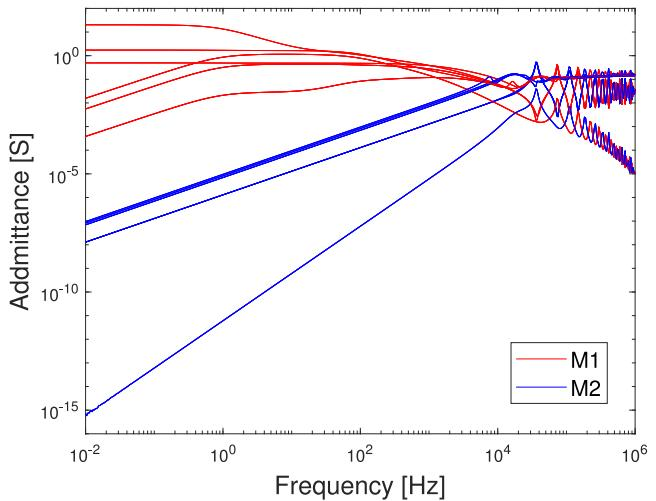  
Fig. 5. Case #1: Idempotent matrices.

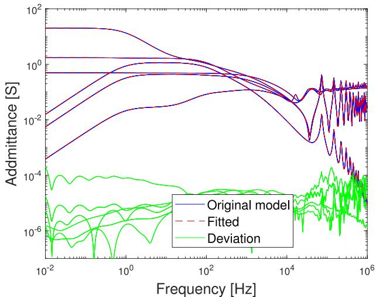  
(a) Fitting of ${ { \bf { M } } _ { 1 } }$

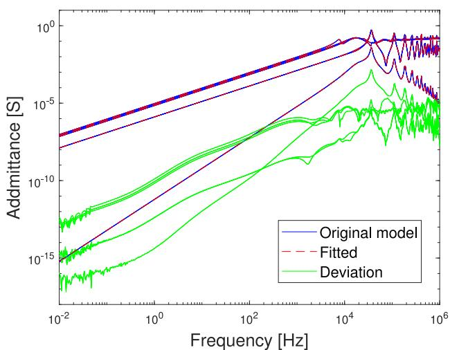  
(b) Fitting of ${ { \bf { M } } _ { 2 } }$   
Fig. 6. Case #1: Fitting results (HVDC submarine cable).

are bolted together and left ungrounded at both terminals. A timestep of ???? = 5 μs is assumed. The simulated core and sheath voltages

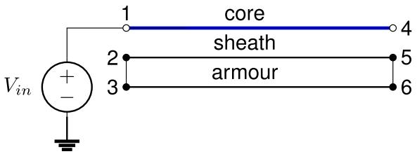  
Fig. 7. Case #1: Circuit for time-domain simulation.

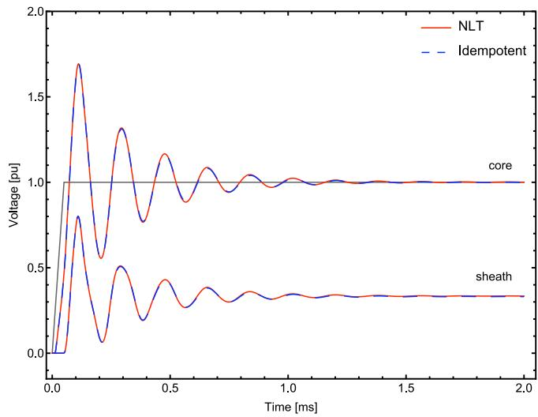  
Fig. 8. Case #1: Receiving end voltage.

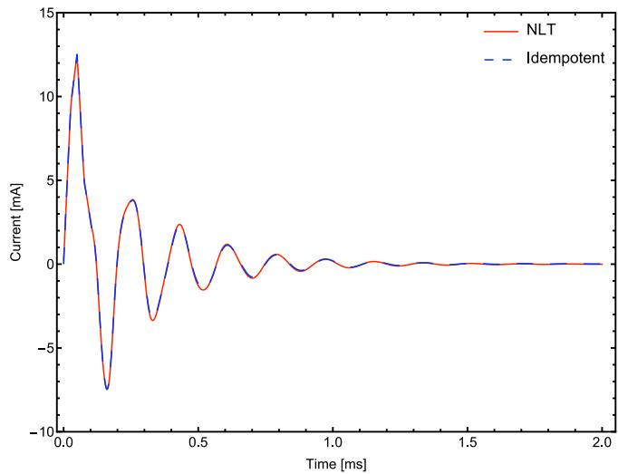  
Fig. 9. Case #1: Current at terminal #1.

at the receiving end are shown in Fig. 8 and the validation is done with the results obtained with the NLT algorithm. In a similar fashion, the current in the core conductor is shown in Fig. 9 and again a very accurate match is attained.

# 4.2. Case #2: Overhead line

The versatility of the idempotent model is to be verified by assessing the modelling of an overhead line (OHL). The simulation comprises a 10 km untransposed line while the ground wires are assumed continuously grounded [46], as shown in Fig. 10.

For this configuration, which presents a natural resonance frequency around 7.5 kHz, a combination of linearly and logarithmically

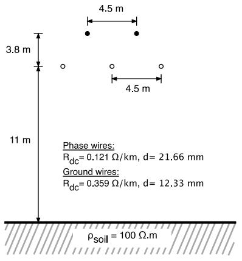  
Fig. 10. Case #2: 132-kV transmission line geometry.

spaced samples in the frequency range between 0.01 Hz–150 kHz was considered to extract the nodal admittance matrix $\mathbf { Y } _ { n } .$ The idempotent decomposition was then performed and the grouping scheme resulted in two idempotent matrices $\mathbf { M } _ { 1 }$ and $\mathbf { M } _ { 2 } .$ . The resulting rational models were achieved with 60 and 50 poles for $\mathbf { M } _ { 1 }$ and $\mathbf { M } _ { 2 } ,$ respectively, as shown in Fig. 11.

Fig. 12 shows the case representing a single-phase energization where the OHL receiving end is open-circuited. It is assumed a shortcircuit reactance behind the voltage source. The simulated voltage at terminal #4 is presented in Fig. 13 and the current at terminal #1 is presented in Fig. 14. Employing a time-step of $\varDelta t \ = \ 1 0 \ \mu s ,$ a very accurate match is observed without substantial loss of accuracy in comparison with the NLT algorithm.

# 5. Conclusions

This paper has introduced a new approach for simulation of electromagnetic transients involving cables and overhead lines in phasecoordinates exploiting the fully-coupled structure of the admittance matrix. Resorting to the idempotent decomposition, it showed to be a feasible alternative to circumvent the poor rational fitting of the smallest eigenvalues of the nodal admittance matrix $\mathbf { Y } _ { n }$ at the lower frequency range providing accurate time-domain results. The idempotent model is particularly useful as an alternative to the well-known MoCbased model to handle time-step constraints associated with travellingwave times in the presence of short and long cable lengths when simulating bulky power systems. Furthermore, has the benefit of handling highly coupled arrangements like parallel circuits. It allows to avoid the replacement of short line lengths by a frequency independent equivalent ??–circuit inasmuch as the frequency dependence can be taken into account.

# CRediT authorship contribution statement

Felipe Camara: Conceptualization, Methodology, Investigation, Formal analysis, Validation, Writing. Antonio C.S. Lima: Conceptualization, Methodology, Investigation, Formal analysis, Writing, Supervision. Maria Teresa Correia de Barros: Investigation, Validation, Writing, Supervision. Filipe Faria da Silva: Investigation, Validation, Writing, Supervision. Claus L. Bak: Investigation, Validation, Writing, Supervision.

# Declaration of competing interest

The authors declare that they have no known competing financial interests or personal relationships that could have appeared to influence the work reported in this paper.

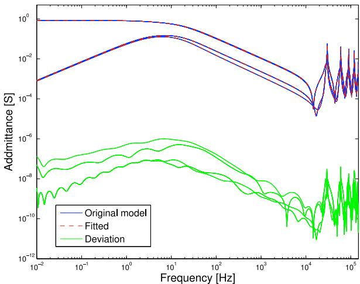  
(a) Fitting of M1

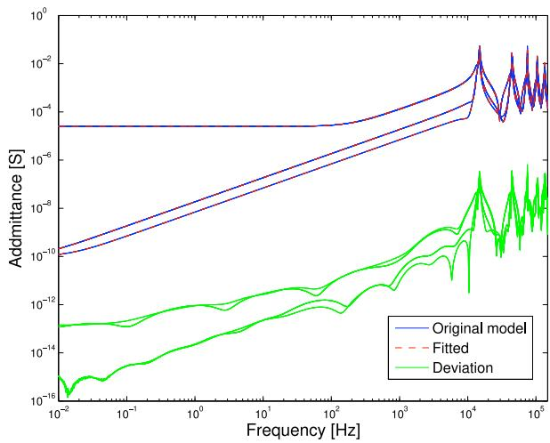  
(b) Fitting of $\mathbf { M } _ { 2 }$

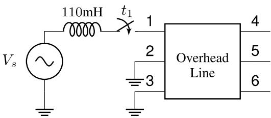  
Fig. 11. Case #2: Fitting results.   
Fig. 12. Case #1: Circuit for time-domain simulation.

# Data availability

Data will be made available on request.

# Appendix A. State-space realization

Consider a scalar element with the following transfer function in the frequency domain

$$
I (s) = \frac {r}{s - a} V (s) + d V (s) \tag {10}
$$

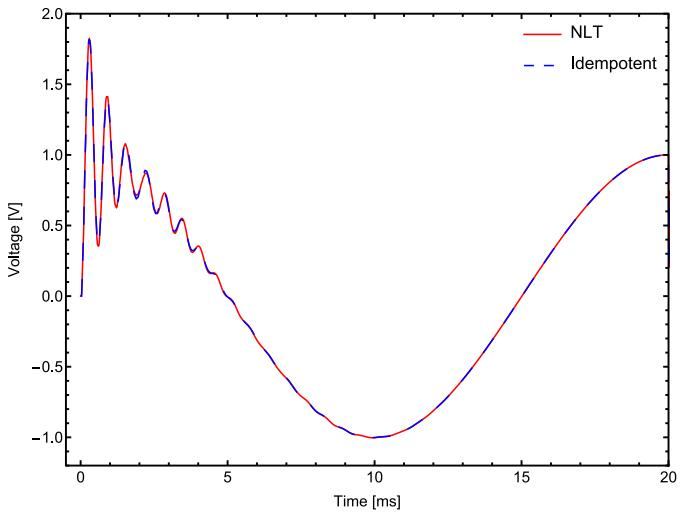  
Fig. 13. Case #2: Receiving end voltage at terminal # 4.

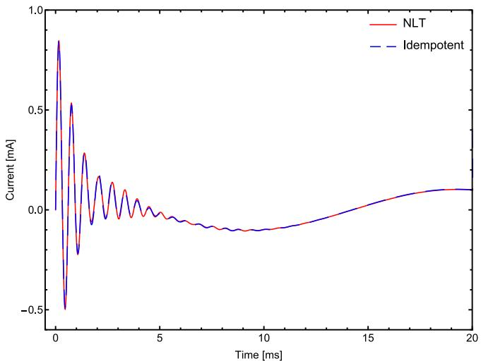  
Fig. 14. Case #2: Current at terminal # 1.

where $V ( s )$ and ??(??) are the complex voltage and current, $r ,$ ?? and ?? are real. In the time-domain, it is possible to rewrite (10) as

$$
\begin{array}{l} \dot {x} (t) = a x (t) + b v (t) \tag {11} \\ i (t) = r x (t) + d v (t) \\ \end{array}
$$

Using either the trapezoidal rule of integration or recursive convolution leads to the following discrete time equivalent

$$
\begin{array}{l} x (n) = \alpha x (n - 1) + (\alpha \lambda + \mu) v (n - 1) \tag {12} \\ i (n) = x (n) + (\lambda + d) v (n) \\ \end{array}
$$

where the coefficients $\alpha ,$ ?? and $\mu$ are given by (13) if trapezoidal rule is applied

$$
\alpha = \frac {2 + a \Delta t}{2 - a \Delta t} \quad \lambda = \mu = \frac {r \Delta t}{2 - a \Delta t} \tag {13}
$$

and in the case recursive convolutions are considered

$$
\begin{array}{l} \alpha = \exp (a \Delta t) \quad \lambda = - \frac {r}{a} \left(1 + \frac {1 - \alpha}{a \Delta t}\right) \tag {14} \\ \mu = \frac {r}{a} \left(\alpha + \frac {1 - \alpha}{a \Delta t}\right) \\ \end{array}
$$

The equation in (12) represents a companion network where

$$
i (n) = h i s (n) + g v (n) \tag {15}
$$

Table 1 Case #1: Submarine cable data.   

<table><tr><td>Core conductor</td><td>R1= 18.95 mm</td><td>ρc= 1.723 × 10-8Ω m</td></tr><tr><td>First insulation layer</td><td>R2= 28.95 mm</td><td>ε1= 2.5</td></tr><tr><td>Sheath</td><td>R3= 30.65 mm</td><td>ρs= 22 × 10-8Ω m</td></tr><tr><td>Second insulation layer</td><td>R4= 33.15 mm</td><td>ε2= 2.5</td></tr><tr><td>Armour</td><td>R5= 35.65 mm</td><td>ρa= 11 × 10-8Ω m, μa= 90</td></tr><tr><td>Armour insulation</td><td>R6= 44.10 mm</td><td>ε3= 2.5</td></tr></table>

with

$$
\begin{array}{l} h i s (n) = \alpha h i s (n - 1) + c v (n - 1) \\ g = \lambda + d \tag {16} \\ c = \alpha \lambda + \mu \\ \end{array}
$$

# Appendix B. HVDC cable data

# See Table 1.

# References

[1] H. Nakanishi, A. Ametani, Transient calculation of a transmission line using superposition law, IEE Proc. C - Gener., Transm. Distrib. 133 (5) (1986) 263–269.   
[2] G. Angelidis, A. Semlyen, Direct phase-domain calculation of transmission line transients using two-sided recursions, IEEE Trans. Power Deliv. 10 (2) (1995) 941–949.   
[3] B. Gustavsen, J. Sletbak, T. Henriksen, Calculation of the electromagnetic transients in transmission cables and lines taking frequency dependent effects accurately account, IEEE Trans. Power Deliv. 10 (2) (1995) 1076–1084.   
[4] T. Noda, N. Nagaoka, A. Ametani, Phase-domain modeling of frequencydependent transmission lines by means of an ARMA model, IEEE Trans. Power Deliv. 11 (1) (1996) 401–411.   
[5] H. Nguyen, H. Dommel, J. Marti, Direct phase-domain modelling of frequencydependent overhead transmission lines, IEEE Trans. Power Deliv. 12 (3) (1997) 916–921.   
[6] B. Gustavsen, A. Semlyen, Calculation of transmission line transients using polar decomposition, IEEE Trans. Power Deliv. 13 (3) (1998) 855–862.   
[7] B. Gustavsen, A. Semlyen, Combined phase and modal domain calculation of transmission line transients based on vector fitting, IEEE Trans. Power Deliv. 13 (2) (1998) 596–604.   
[8] T.C. Yu, J. Marti, A robust phase-coordinates frequency-dependent underground cable model (zcable) for the EMTP, IEEE Trans. Power Deliv. 18 (1) (2003) 189–194.   
[9] A.B. Fernandes, W.L.A. Neves, Phase-domain transmission line models considering frequency-dependent transformation matrices, IEEE Trans. Power Deliv. 19 (2) (2004) 708–714.   
[10] T. Noda, Application of frequency-partitioning fitting to the phase-domain frequency-dependent modeling of overhead transmission lines, IEEE Trans. Power Deliv. 30 (01) (2015) 174–183.   
[11] T. Noda, Application of frequency-partitioning fitting to the phase-domain frequency-dependent modeling of underground cables, IEEE Trans. Power Deliv. 31 (4) (2016) 1776–1777.   
[12] A. Morched, B. Gustavsen, M. Tartibi, A universal model for accurate calculation of electromagnetic transients on overhead lines and underground cables, IEEE Trans. Power Deliv. 14 (3) (1999) 1032–1038.   
[13] H.D. Silva, A. Gole, L. Wedepohl, Accurate electromagnetic transient simulations of HVDC cables and overhead transmission lines, in: International Conference on Power System Transients, (IPST), 2007.   
[14] B. Gustavsen, J. Nordstrom, Pole identification for the universal line model based on trace fitting, IEEE Trans. Power Deliv. 23 (1) (2008) 472–479.   
[15] A. Ramirez, R. Iravani, Enhanced fitting to obtain an accurate dc response of transmission lines in the analysis of electromagnetic transients, IEEE Trans. Power Deliv. 29 (6) (2014) 2614–2621.   
[16] I. Kocar, J. Mahseredjian, New procedure for computation of time delays in propagation function fitting for transient modeling of cables, IEEE Trans. Power Deliv. 31 (2) (2016) 613–621.   
[17] I. Kocar, J. Mahseredjian, G. Olivier, Improvement of numerical stability for the computation of transients in lines and cables, IEEE Trans. Power Deliv. 25 (2) (2010) 1104–1111.   
[18] B. Gustavsen, Avoiding numerical instabilities in the universal line model by a two-segment interpolation scheme, IEEE Trans. Power Deliv. 28 (3) (2013) 1643–1651.   
[19] I. Kocar, J. Mahseredjian, Accurate frequency dependent cable model for electromagnetic transients, IEEE Trans. Power Deliv. 31 (3) (2016) 1281–1288.

[20] M. Cervantes, I. Kocar, J. Mahseredjian, A. Ramirez, Partitioned fitting and DC correction for the simulation of electromagnetic transients in transmission lines/cables, IEEE Trans. Power Deliv. 33 (6) (2018) 3246–3248.   
[21] S. Henschel, A. Ibrahim, H. Dommel, Transmission line model for variable step size simulation algorithms, Int. J. Electr. Power Energy Syst. 21 (03) (1999) 191–198.   
[22] A. Ibrahima, S. Henschelb, A.C.S. Lima, H. Dommel, Applications of a new EMTP line model for short overhead lines and cables, Int. J. Electr. Power Energy Syst. 24 (08) (2002) 639–645.   
[23] N. Nagaoka, A. Ametani, Transient calculations on crossbonded cables, IEEE Trans. Power Appar. Syst. PAS-102 (4) (1983) 779–787.   
[24] I. Lafaia, J. Mahseredjian, A. Ametani, M.T. Correia de Barros, I. Koçar, Y. Fillion, Frequency and time domain responses of cross-bonded cables, IEEE Trans. Power Deliv. 33 (2) (2018) 640–648.   
[25] B. Gustavsen, A. Semlyen, Admittance-based modeling of transmission lines by a folded line equivalent, IEEE Trans. Power Deliv. 24 (1) (2009) 231–239.   
[26] T. Noda, Frequency-dependent modeling of transmission lines using bergeron cells, IEEJ Trans. Electr. Electron. Eng. 12 (S2) (2017) S23–S30, URL https: //onlinelibrary.wiley.com/doi/abs/10.1002/tee.22564.   
[27] G. Strang, Linear Algebra and Its Applications, Cengage Learning, 2006.   
[28] L.M. Wedepohl, Frequency Domain Analysis of Wave Propagation in Multiconductor Transmission Systems (Lecture Notes), The University of British Columbia, Dept. of Electrical Engineering, Vancouver, Canada, 1993.   
[29] F. Castellanos, J. Marti, Phase-domain multiphase transmission line models, in: International Conference on Power System Transients, (IPST), 1995, pp. 17–22.   
[30] F. Castellanos, J. Marti, F. Marcano, Phase-domain multiphase transmission line models, Electr. Power Energy Syst. 19 (4) (1997) 241–248, Elsevier Science Ltd.   
[31] F. Marcano, J. Marti, Idempotent line model: Case studies, in: Proceedings of IPST’97 - International Conference on Power Systems Transients, 1997, pp. 67–72.   
[32] M.Y. Tomasevich, A.C. Lima, Some developments on phase coordinates line modeling based on idempotent decomposition, Int. J. Electr. Power Energy Syst. 74 (2016) 410–419.

[33] F. Camara, A.C. Lima, K. Strunz, Multi-scale formulation of admittance-based modeling of cables, Electr. Power Syst. Res. 195 (2021) 107–120.   
[34] J.A. Martinez (Ed.), Power System Transients: Parameter Determination, CRC Press, 2010.   
[35] B. Gustavsen, Passivity enforcement for transmission line models based on the method of characteristics, IEEE Trans. Power Deliv. 24 (3) (2008) 2286–2293.   
[36] B. Gustavsen, C. Heitz, Modal vector fitting: A tool for generating rational models of high accuracy with arbitrary terminal conditions, IEEE Trans. Adv. Packag. 31 (4) (2008) 664–672.   
[37] B. Gustavsen, Rational modeling of multiport systems via a symmetry and passivity preserving mode-revealing transformation, IEEE Trans. Power Deliv. 29 (1) (2014) 199–206.   
[38] B. Gustavsen, A. Semlyen, Rational approximation of frequency domain responses by vector fitting, IEEE Trans. Power Deliv. 14 (3) (1999) 1052–1061.   
[39] B. Gustavsen, Rational approximation of frequency dependent admittance matrices, IEEE Trans. Power Deliv. 17 (4) (2002) 1093–1098.   
[40] B. Gustavsen, Improving the pole relocating properties of vector fitting, IEEE Trans. Power Deliv. 21 (03) (2006) 1587–1592.   
[41] D. Deschrijver, M. Mrozowski, T. Dhaene, D.D. Zutter, Macromodeling of multiport systems using a fast implementation of the vector fitting method, IEEE Microw. Wirel. Compon. Lett. 18 (6) (2008) 383–385.   
[42] D.J. Wilcox, Numerical Laplace transformation and inversion, Int. J. Elect. Eng. 15 (1978) 247–265.   
[43] F.A. Uribe, J.L. Naredo, P. Moreno, Electromagnetic transients in underground transmission systems through the numerical Laplace transform, Int. J. Electr. Power Energy Syst. 24 (3) (2002) 215–221.   
[44] P. Moreno, A. Ramirez, Implementation of the numerical Laplace transform: A review (task force on frequency domain methods for EMT studies), IEEE Trans. Power Deliv. 23 (4) (2008) 2599–2609.   
[45] C.H. Chien, R.W.G. Bucknall, Analysis of harmonics in subsea power transmission cables used in VSC–HVDC transmission systems operating under steady-state conditions, IEEE Trans. Power Deliv. 22 (4) (2007) 2489–2497.   
[46] B. Gustavsen, Validation of frequency dependent transmission line models, IEEE Trans. Power Deliv. 2 (2) (2005) 925–933.