# An Iterative Real-Time Nonlinear Electromagnetic Transient Solver on FPGA

Yuan Chen, Student Member, IEEE, and Venkata Dinavahi, Senior Member, IEEE

Abstract—A real-time transient simulation of nonlinear elements in transmission networks requires significant computational power. This paper proposes an iterative nonlinear transient solver on a field-programmable gate array. The parallel solver, based on the compensation method and the Newton–Raphson algorithm (continuous and piecewise), is entirely implemented in Very high speed integrated circuit Hardware Description Language. It also involves sparsity techniques, deeply pipelined arithmetic floating-point processing, and parallel Gauss–Jordan elimination. To validate the new solver, two case studies are simulated in real time: surge arrester transients in a series-compensated line and ferroresonance transients in a transformer, with time steps of 5 and 3 μs, respectively. The captured real-time oscilloscope results demonstrate high accuracy of the simulator in comparison to the offline simulation of the original system in the ATP version of electromagnetic transient program.

Index Terms—Electromagnetic transient simulation, fieldprogrammable gate arrays (FPGAs), nonlinear networks, parallel algorithms, real-time systems.

# I. INTRODUCTION

N ONLINEAR elements play a significant role in the incep-tion and propagation of transient overvoltages and over- tion and propagation of transient overvoltages and overcurrents in electrical power systems. The commonly occurring nonlinear phenomena in power systems include magnetic saturation in transformers, ferroresonance, switching surges, and lightning strikes. An accurate simulation of nonlinear phenomena is vital from the perspective of such studies as insulation coordination, protection system design, power quality, and, in general, for maintaining the transmission and distribution infrastructure in a reliable working condition. In the offline electromagnetic transient program (EMTP), the nonlinear solution has been well analyzed and implemented. However, in real-time simulators, accurate simulation of nonlinear elements is very challenging due to its computational burden.

In offline EMT-type software programs such as ATP, EMTP-RV, and PSCAD/EMTDC, the representation of nonlinear elements is either through a piecewise linear approximation method (also known as pseudo nonlinear method) or an iterative method [1], [2]. In the former, the nonlinearity is represented by several linear segments. At each simulation time step, it is

Manuscript received February 25, 2010; revised June 10, 2010; accepted July 11, 2010. Date of publication July 23, 2010; date of current version May 13, 2011. This work was supported by the Natural Science and Engineering Research Council of Canada.

The authors are with the Department of Electrical and Computer Engineering, University of Alberta, Edmonton, AB T6G 2V4, Canada (e-mail: yuanchen@ece.ualberta.ca; dinavahi@ece.ualberta.ca).

Color versions of one or more of the figures in this paper are available online at http://ieeexplore.ieee.org.

Digital Object Identifier 10.1109/TIE.2010.2060461

actually a specific linear element, such as a constant inductance, several of which can be used to represent, for example, the saturation characteristic of a transformer. However, the computational bottleneck occurs as the operating point switches from one linear segment to the next, necessitating a recalculation of the system admittance matrix, which results in a substantially longer run time for a large network. The frequent switching between linear segments is also known to cause numerical oscillations. For a more accurate simulation of nonlinear elements, an iterative method based on Newton–Raphson (N–R) can be used. Within each simulation time step, several N–R iterations are required for convergence, and each iteration entails a recalculation of the Jacobian matrix and solution of a set of linear equations. This process is very time consuming. In an offline simulator, the computational burden can perhaps be overlooked; however, it becomes quite cumbersome in a real-time simulator. In a deterministic hard real-time system built using general-purpose CPU or DSP-based sequential hardware, an iterative nonlinear transient solution may not even be implementable using a requisite time step mainly due to the uncertainty of convergence of the iterations within the time step and the limited computational power of such hardware.

The increasing need for higher computational bandwidth for real-time electromagnetic transient simulation has been met by the field-programmable gate array (FPGA) [3]. The FPGA is a reconfigurable digital logic device which contains a variety of programmable logic blocks called logic elements (LEs), which can be configured using a Hardware Description Language (HDL). The main advantages of FPGA over sequential hardware are wide parallelism, deep pipelining, and flexible memory architecture. With the dramatic increase in LE density, clock frequency, and advanced Intellectual Property (IP) cores such as floating-point arithmetics, FPGAs show great potential for real-time hardware emulation [4], [5] and control applications [6]–[8].

This paper proposes an iterative real-time nonlinear transient solver on the FPGA. The solution method is based on the compensation method [9] together with N–R iterations [10]. Sparse matrix methods and a parallel Gauss–Gordon elimination method [11] are employed for the linear solution. To take advantage of the inherent parallel architecture of FPGA, the nonlinear solution algorithm is fully paralleled and pipelined using a floating-point number representation. Although FPGAbased transient solvers currently exist for power networks including frequency-dependent elements [3], they address exclusively linear networks; an iterative nonlinear transient solver in real time has not yet been reported in the literature. The background on the nonlinear solution technique and on the N–R algorithm is described in Section II. Section III explains

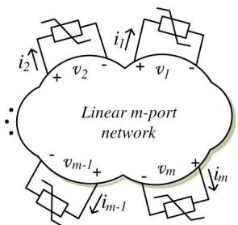  
(a)

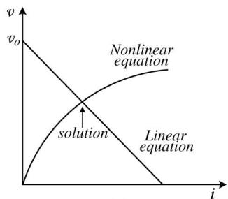  
  
Fig. 1. (a) Network with m nonlinear elements. (b) Illustration of compensation method.

the hardware framework of the FPGA-based iterative nonlinear transient solver and gives the implementation details. Two real-time transient simulation case studies are presented in Section IV and validated using an offline ATP simulation. Conclusions are given in Section V.

# II. NONLINEAR NETWORK TRANSIENT SOLUTION

With the inclusion of nonlinear elements, the power system network becomes a nonlinear system. In the EMTP, instead of solving the entire nonlinear network, the compensation method is commonly used to reduce computational burden.

# A. Compensation Method

This method first separates the nonlinear elements from the network, as shown in Fig. 1(a), where the m nonlinear elements have been extracted and connected to the linear m-port network. Then, the equations pertaining to the linear network (1) and those of the nonlinear elements (2) are solved simultaneously as illustrated graphically in Fig. 1(b)

$$
\boldsymbol {v} = \boldsymbol {v} _ {o} - \boldsymbol {R} _ {\text {t h e v}} i \tag {1}
$$

$$
\boldsymbol {v} = \boldsymbol {f} (\boldsymbol {i}) \tag {2}
$$

where v and i are the vectors of m-port voltages and currents, respectively. $v _ { o }$ is a vector of open-circuit voltages (without the nonlinear branches) at those ports, and $R _ { \mathrm { t h e v } }$ is an m × m Thévénin equivalent resistance matrix of the linear network. After the current i has been obtained, it is superimposed on the linear part of network as a current source injection to solve the entire network.

# B. N–R Method

The N–R method is widely used to solve the nonlinear equations [substituting (2) into (1)] due to its quadratic convergence. The objective is to find solution i such that

$$
\boldsymbol {F} (\boldsymbol {i}) \equiv \boldsymbol {f} (\boldsymbol {i}) - \boldsymbol {v} _ {\boldsymbol {o}} + \boldsymbol {R} _ {\text {t h e v}} \boldsymbol {i} = \mathbf {0}. \tag {3}
$$

By applying the first-order Taylor series expansion for the nonlinear function F (i), the updated solution is obtained by solving the following system of linear equations:

$$
\boldsymbol {J} \left(\boldsymbol {i} ^ {k + 1} - \boldsymbol {i} ^ {k}\right) = - \boldsymbol {F} \left(\boldsymbol {i} ^ {k}\right) \tag {4}
$$

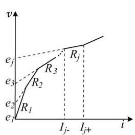

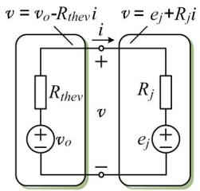  
(b)   
Fig. 2. (a) Piecewise linear function. (b) Its implementation in PNR.

where J is the Jacobian matrix; $i ^ { k + 1 }$ and $i ^ { k }$ are the current vectors at the (k + 1)th and kth iterations, respectively. This method is referred to as the continuous N–R (CNR) method in this paper since the nonlinear function is a continuous analytical equation. The Jacobian matrix and nonlinear functions are computed at each iteration using

$$
\left\{ \begin{array}{l} \boldsymbol {J} = \frac {\partial \boldsymbol {F} (\boldsymbol {i})}{\partial \boldsymbol {i}} = \boldsymbol {R} _ {\text {t h e v}} + \frac {\partial \boldsymbol {f} (\boldsymbol {i})}{\partial \boldsymbol {i}} \\ - \boldsymbol {F} (\boldsymbol {i} ^ {k}) = \boldsymbol {v} _ {o} - \boldsymbol {R} _ {\text {t h e v}} \boldsymbol {i} ^ {k} - \boldsymbol {f} (\boldsymbol {i} ^ {k}). \end{array} \right. \tag {5}
$$

The convergence criteria for the CNR iterations are defined as

$$
\left\| \boldsymbol {i} ^ {k + 1} - \boldsymbol {i} ^ {k} \right\| <   \varepsilon_ {1} \quad \left\| \boldsymbol {f} (\boldsymbol {i} ^ {k + 1}) \right\| <   \varepsilon_ {2} \tag {6}
$$

with $\varepsilon _ { 1 }$ and $\varepsilon _ { 2 }$ set to sufficiently small values.

If the nonlinear function is given by a piecewise linear curve, the method becomes piecewise N–R (PNR) [12]. As shown in Fig. 2(a), each linear segment of the piecewise curve can be defined by

$$
\boldsymbol {v} = \boldsymbol {e} _ {j} + \boldsymbol {R} _ {j} \boldsymbol {i}, \quad \boldsymbol {i} \in [ \boldsymbol {I} _ {j -}, \boldsymbol {I} _ {j +} ] \tag {7}
$$

where $e _ { j }$ and $R _ { j }$ are the intercept voltage and resistance of the jth segment of the curve, which falls within the interval $I _ { j - }$ and $I _ { j + }$ . Applying the N–R method to nonlinear (8)

$$
\boldsymbol {F} (\boldsymbol {i}) \equiv \left(\boldsymbol {v} _ {o} - \boldsymbol {R} _ {\text {t h e v}} \boldsymbol {i}\right) - \left(\boldsymbol {e} _ {j} + \boldsymbol {R} _ {j} \boldsymbol {i}\right) = \mathbf {0} \tag {8}
$$

and using (4), we obtain

$$
\left(- \boldsymbol {R} _ {\text {t h e v}} - \boldsymbol {R} _ {j}\right) \left(\boldsymbol {i} ^ {k + 1} - \boldsymbol {i} ^ {k}\right) = \left(\boldsymbol {e} _ {j} + \boldsymbol {R} _ {j} \boldsymbol {i} ^ {k}\right) - \left(\boldsymbol {v} _ {o} - \boldsymbol {R} _ {\text {t h e v}} \boldsymbol {i} ^ {k}\right)
$$

$$
\left(\boldsymbol {R} _ {\text {t h e v}} + \boldsymbol {R} _ {j}\right) \boldsymbol {i} ^ {k + 1} = \boldsymbol {v} _ {o} - \boldsymbol {e} _ {j}. \tag {9}
$$

It is important to observe that the term $i ^ { k }$ is canceled out in (9), which means that the calculation of Jacobian matrix J is not required in the PNR method. This is because $\mathbf { } R _ { j } ^ { \prime } \mathbf { s } _ { i }$ , which are the derivatives of the piecewise linear curve, have been precalculated. The solution is then checked to see if it satisfies $[ I _ { j - } , I _ { j + } ]$ ; if it does, a valid solution has been found.

# III. FPGA-BASED NONLINEAR TRANSIENT SOLVER

# A. Hardware Architecture and Parallelism

As shown in Fig. 3, the hardware architecture of the nonlinear solver consists of three main modules: a linear solver module, an N–R nonlinear solver module, and a global control module. The linear solver module calculates the open-circuit voltages

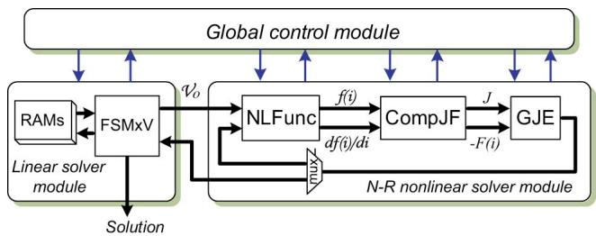  
Fig. 3. Overall architecture of the nonlinear transient solver in the FPGA.

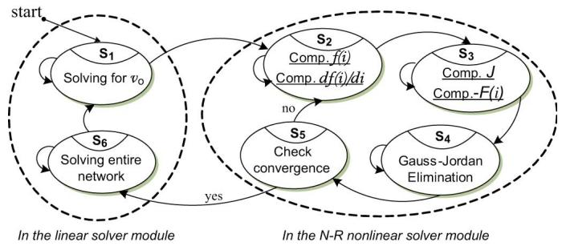  
Fig. 4. Finite-state machine of global control module.

${ \pmb v } _ { { \pmb o } }$ before the N–R iteration starts and also solves the entire network after the nonlinear solution is found. The detailed architecture of this module is presented in Section III-C. The N–R nonlinear solver module is the core of the design, which contains the following three hardware submodules: 1) NLFunc (evaluating nonlinear function $f ( i )$ and $\partial f ( i ) / \partial i ; 2 )$ CompJF (computing J and $- F ( i ) )$ ); and 3) parallel Gauss–Jordan elimination (GJE).

The global control module controls all the sequential and parallel operations in the overall design. Fig. 4 shows the finitestate machine diagram for the global control module. The sequential operations are clearly shown by state transitions $S _ { 1 } $ $S _ { 2 }  S _ { 3 }  S _ { 4 }  S _ { 5 }  S _ { 6 }  S _ { 1 }$ . The possible parallel operations, which take advantage of the hardware parallelism of the FPGA, are also shown in Fig. 4. For example, in state $S _ { 2 } .$ , the nonlinear function evaluations $f ( i )$ and $\partial f ( i ) / \partial i$ are performed simultaneously. The computation of J and −F (i) in (5) is also processed concurrently in state $S _ { 3 }$ . Meanwhile, the GJE procedure is paralleled in state $S _ { 4 }$ , as discussed in more details in Section III-E.

# B. Dedicated Floating-Point Arithmetic Units

Choosing either fixed- or floating-point number representation is the first step for any hardware design. Although the fixedpoint number operation has the advantages of fast computation and easy implementation, the floating-point number is widely used in real number arithmetic due to its large dynamic data range and higher accuracy. Due to the availability of FPGAs with a large capacity of logic resources, floating-point implementation is particularly useful for transient simulation. Considering the FPGA resource utilization and required precision, a 32-b single precision floating-point format (IEEE Standard 754) is used for the real-time N–R-based nonlinear solution. The basic floating-point operations include addition/subtraction

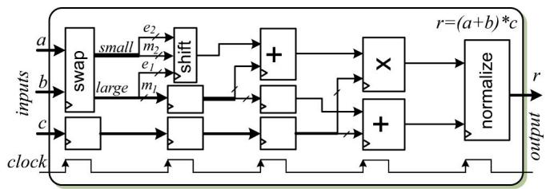  
Fig. 5. Dedicated floating-point arithmetic unit for $r = ( a + b ) * c .$

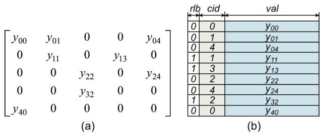  
Fig. 6. (a) Example sparse matrix. and (b) Its storage format.

and multiplication. They can be chained to realize many other computations such as $( a + b ) * c .$ This combination may result in a long computation latency. For example, the floatingpoint adder unit and multiplier unit in the Altera Quartus II software have a latency of seven and five cycles, respectively; therefore, the overall latency for the aforementioned computation is 12 cycles. To reduce the latency of such combined computations, dedicated floating-point arithmetic units were designed in this work. Fig. 5 shows the data flow for $r =$ $( a + b ) * c .$ The overall latency in this arithmetic unit is only five cycles. The saving in latency comes from deleting redundant processes, such as normalization of intermediate result, and from parallelizing possible operations. The collection of dedicated floating-point arithmetic units developed involves both scalar and vector quantities and includes operations such as simple addition/subtraction, multiplication, conversion between floating- and fixed-point numbers, etc.: $( a + b ) * c ,$ a $b + c * d , { \pmb A } _ { n \times n } * { \pmb B } _ { n \times 1 } , { \pmb C } _ { n \times n } * ( { \pmb A } _ { n \times 1 } - { \pmb B } _ { n \times 1 } )$ .

# C. FSMxV Multiplication Unit

Obtained using nodal analysis, the linear network equation is given as

$$
\boldsymbol {Y} \boldsymbol {V} = \boldsymbol {I} \tag {10}
$$

where Y , I, and V are network admittance matrix, injected nodal current sources, and unknown node voltages, respectively. In the real-time electromagnetic transient simulation, the V can be obtained directly by multiplying I by the inverse admittance matrix $Y ^ { - 1 }$ , which is precalculated and stored in the memory to save computation time. Since Y matrix is usually quite sparse in power systems, sparsity techniques are exploited to improve simulation efficiency [13]. A fast sparse matrix–vector (FSMxV) multiplication (FSMxV) submodule which is part of the linear solver module was developed. First, a very compact sparse matrix storage format which uses only one

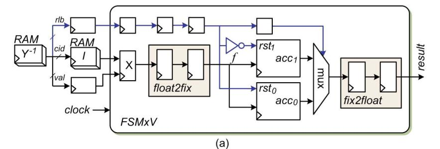

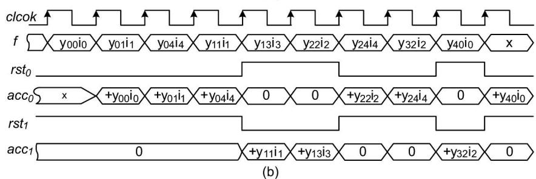  
Fig. 7. FSMxV multiplication unit. (a) Hardware design. (b) Timing diagram.

vector is defined. Each entry in this format has the following: 1) a 32-b val to store the subsequent nonzero value of matrix in row order; 2) an 8-b cid to identify column index of this nonzero value; and 3) a 1-b rlb to label all nonzero values in the same row with $^ { 6 6 } 0 ^ { 3 } \ 0 \mathrm { r } \ ^ { 6 6 } 1 . ^ { , 3 }$ Fig. 6 shows an example sparse matrix and its storage format.

In the FSMxV submodule, the accumulation is done in fixedpoint format. The reason is that floating-point accumulator has a much longer latency and requires much more logic resources to implement. The fixed-point accumulator needs only one adder with one clock cycle latency. The used fixed-point number format is 40.100, which has 40 integer bits and 100 fraction bits to guarantee both the range and precision.

As shown in Fig. 7(a), the FSMxV submodule contains one floating-point multiplier, one floating-to-fixed-point converter, two fixed-point adders, and one fixed-to-floating-point converter. The elements of sparse matrix $Y ^ { - 1 }$ are retrieved from $R A M _ { Y ^ { - 1 } }$ , while the cid is used to access the I stored in $R A M _ { I }$ . The registers are inserted for synchronization in the computation. The realized matrix–vector multiplication is fully pipelined and fast because there is no stall between two consecutive matrix row–vector multiplications. This is achieved by the two parallel fixed-point adders (accumulators) $a c c _ { 0 }$ and $a c c _ { 1 }$ with opposite reset inputs $r s t _ { 0 }$ and $r s t _ { 1 }$ controlled by the row label information rlb. Fig. 7(b) shows the logic timing diagram for the FSMxV multiplication unit based on the example in Fig. 7(a). As can be seen, the accumulation of the first matrix row–vector multiplication is processed in the $a c c _ { 0 }$ , while the acc1 is reset to zero, which makes it ready for the accumulation of the next matrix row–vector multiplication.

# D. Floating-Point Nonlinear Function Evaluation

At each N–R iteration, a nonlinear function evaluation is required. The computational burden of this evaluation depends on the number of nonlinear elements in the original system and the nature of these nonlinearities. The commonly used methods for

nonlinear function evaluation on the FPGA include the lookup table (LUT) method and other approximation methods such as COordinate Rotation DIgital Computer, series expansion, and the regular N–R iteration (an inner iterative loop inside the outer iteration) [14], [15]. Many of them have been implemented in hardware, but based mostly on a fixed-point format. The floating-point implementation is still cumbersome due to its large latency and logic resource utilization. Among the aforementioned methods, the LUT is still widely used due to its speed and convenience of implementation. The nonlinear function values for a given input range of interest are precalculated and stored in the memory. The input is used as the index for the LUT to access its corresponding value. The size of available memory limits the step (interval) of LUT and, therefore, the accuracy of the nonlinear function evaluation. To reduce the size of LUT while retaining the accuracy, linear interpolation has been used in this design to compute intermediate values between two locations of the LUT.

The challenge of implementing a floating-point LUT is that the LUT is addressed by integer number whereas the input is in the floating-point format. The traditional solution is to convert the floating-point input into integer format at the expense of extra latency for the conversion. In the proposed design, this conversion is not needed. The exponent and mantissa of the input floating-point number are used directly to access the LUT when the step length is always a power of two.

As shown in Fig. 8(a), the floating-point LUT for nonlinear function evaluation contains an address generation module, a dual-port RAM serving as the LUT, and a linear interpolation module. The address generation takes the floating-point input x and outputs the addresses of two points $x _ { i }$ and $x _ { i + 1 }$ on either side of x [state $P _ { 1 }$ in finite-state machine diagram Fig. 8(b)]. This is done by left shifting the leading $" 1 "$ and mantissa of x by dexp bits, where dexp is the difference of the exponent of input x and step. An example is shown in Fig. 8, where $s t e p = 0 . 0 6 2 5$ and $x = 3 . 1 0$ . The dual-port RAM has two independent ports which can output $f ( x _ { i } )$ and $f ( x _ { i + 1 } )$

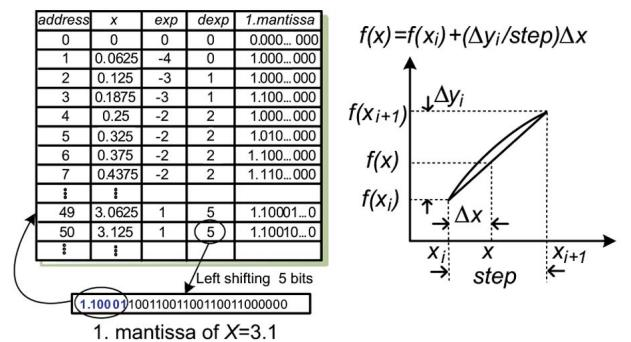

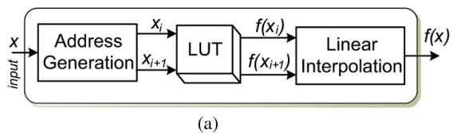

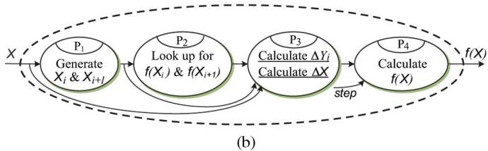  
Fig. 8. Floating-point nonlinear function computation. (a) Function block diagram. (b) Finite-state machine.

simultaneously (state $P _ { 2 } )$ . The final result $f ( x )$ is computed by the linear interpolation module (states $P _ { 3 }$ and $P _ { 4 } )$ .

# E. Parallel GJE

The set of linear algebraic equations in (4) and (9) are solved by GJE. Compared to other elimination methods such as Gaussian elimination with backward substitution and LU decomposition, the GJE is the simpler and easier for hardware implementation.

It is well known that the number of operations in sequential GJE is $N ^ { 3 }$ , where N is the order of the matrix. For a large matrix, the sequential GJE can be very time consuming. Hence, a parallel scheme has been designed to speed up the processing, as shown in Fig. 9. It consists of several processing elements (PEs) and a factorization module. Before the processing begins, the matrix J is augmented with vector F and evenly distributed by rows into $R A M _ { 1 }$ in each PE. Then, the GJE computation proceeds according to the following two steps.

1) Factorization: The ith row is retrieved from the corresponding PE [state $Q _ { 1 }$ in finite-state machine diagram Fig. 9(b)], and the diagonal element is identified and registered. Then, the remaining elements within the row are divided by the registered diagonal element (state $Q _ { 2 } )$ , and the factorized row is sent back to $R A M _ { 2 }$ in all PEs (state $Q _ { 3 } )$ .   
2) Elimination: Elimination is done simultaneously in all PEs. The element in the rth $( r \neq i )$ column is first recognized and registered, and then multiplied by the elements of factorized ith row read from $R A M _ { 2 }$ (state $Q _ { 4 } )$ . The resulting product is then added to the corresponding element of the rows in $R A M _ { 1 }$ (state $Q _ { 5 } )$ .

# IV. FPGA-BASED REAL-TIME NONLINEAR TRANSIENT SIMULATION

# A. FPGA Hardware Resources

The iterative real-time nonlinear electromagnetic transient solver was implemented on an Altera Stratix III Development Board DE3. The FPGA EP3SL150 used on this board has the following main features: 142 500 LEs, 6390 total RAM kilobits, 384 18  18-b multipliers, eight phase-locked loop, and 744 maximum user I/O pins.

Table I lists the FPGA resource utilization, generated by Altera Quartus II software, in percentage for each module of the iterative real-time nonlinear electromagnetic transient solver. As can be seen from this table, the nonlinear solver utilizes the most logic resources of the FPGA. The other logic resource utilization is for the modeling of transmission lines, RLC elements, power sources, etc. [3].

# B. Case Studies

Two case studies are used to show the effectiveness of the proposed iterative real-time nonlinear transient solver on the FPGA. The first case study is a three-phase series-compensated transmission system whose single-line diagram is shown in Fig. 10. The compensation capacitor C connected in series between two lines (line1 and line2) is protected by a surge arrester. The lines are modeled using distributed parameter line models (Bergeron’s model) to capture the traveling wave transients. The surge arresters are highly nonlinear resistors characterized by

$$
i = p \left(\frac {v}{V _ {\mathrm {r e f}}}\right) ^ {q} \tag {11}
$$

where $q$ is the exponent and $V _ { \mathrm { r e f } }$ and $p$ are the arbitrary reference values. The elements $R _ { L 1 } , L _ { L 1 }$ , and $R _ { L 2 }$ represent a composite load, and $R _ { f }$ is the fault resistance. The CNR method is used to solve the nonlinear equations. The convergence tolerances $\varepsilon _ { 1 }$ and $\varepsilon _ { 2 }$ are set to $1 0 ^ { - 6 }$ pu. The complete system data are listed in Appendix.

A three-phase fault is applied at the load terminals at $t =$ 0.2 s by closing the circuit breaker CB. The current increases in the series capacitor and produces an overvoltage that is limited by the surge arresters. Fig. 11 shows the three-phase voltage transients across the surge arresters captured from a real-time oscilloscope connected to 125MSPS DACs on the Stratix III FPGA board. The peak overvoltage is limited to 8 kV compared to 15 kV without the arrester. Fig. 12 shows the three-phase transient currents in the surge arresters in the real-time simulation. Large currents drawn by the arresters can be observed. Similar behavior can be observed from Figs. 13 and 14, which show the offline ATP simulation results.

The second case study illustrates ferroresonance in a threephase voltage transformer. Fig. 15(a) and (b) shows the singleline and equivalent network diagrams of this case study, respectively. The voltage transformer is connected to the power system represented by a voltage source $V _ { s }$ through a circuit breaker $C B . ~ C _ { w }$ is the circuit breaker’s grading capacitance, $C _ { s }$ is the total phase-to-Earth capacitance including transformer

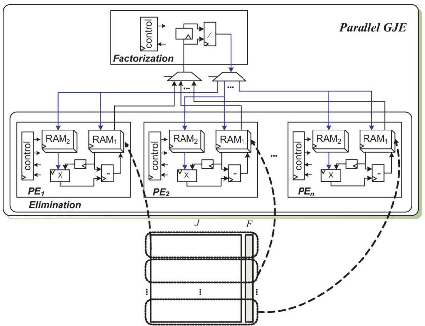

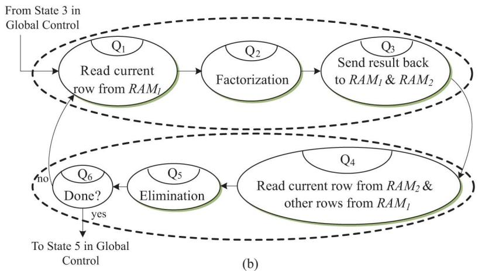  
(a)   
Fig. 9. Parallel GJE. (a) Functional block diagram. (b) Finite-state machine.

TABLE I FPGA RESOURCES UTILIZED BY MODULES   

<table><tr><td>Module</td><td>Logic Elements</td><td>Multipliers</td><td>Memory Bits</td></tr><tr><td>Global control</td><td>0.1%</td><td>0%</td><td>0%</td></tr><tr><td>Linear solver</td><td>4.0%</td><td>2.1%</td><td>0.5%</td></tr><tr><td>Nonlinear solver</td><td>10.8%</td><td>11.5%</td><td>1.9%</td></tr><tr><td>Transmission lines</td><td>8.3%</td><td>18.7%</td><td>5.2%</td></tr><tr><td>RLC elements</td><td>5.8%</td><td>8.3%</td><td>0.9%</td></tr><tr><td>Power sources</td><td>2.5%</td><td>1.1%</td><td>14.2%</td></tr><tr><td>Total</td><td>31.5%</td><td>41.7%</td><td>22.7%</td></tr></table>

winding capacitance. The resistor $R _ { f e }$ represents transformer core losses. The transformer current is represented by its piecewise nonlinear magnetization characteristic shown in Fig. 16; thus, the PNR method is used in this case study with five linear segments to represent the nonlinearity. The complete system data are also listed in Appendix. The ferroresonance response was verified by the opening of the circuit breaker caused by a three-phase fault on the transformer secondary at $t = 0 . 2 ~ \mathrm { s }$ . Again, similar behavior of real-time and offline simulations can be observed from Figs. 17 and 18.

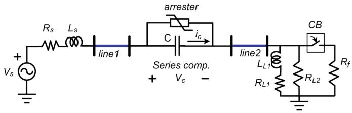  
Fig. 10. Single-line diagram for Case Study I (surge arrester transients in a series-compensated transmission line).

Fig. 19(a) and (b) shows the execution time for each state in the finite-state machine in Fig. 4 for the two case studies. The execution time for “others” includes the time used for calculating the models for transmission lines, RLC elements, power sources, etc. Based on the 60-MHz FPGA input clock, the total execution time for Case Study I is 4.91 μs for the average of three iterations, while the actual time step is 5 μs, with approximately 40% utilization of the FPGA multipliers. Thus, it is safe to say that a system of twice the size, i.e., a system with at least six nonlinear elements, can be simulated

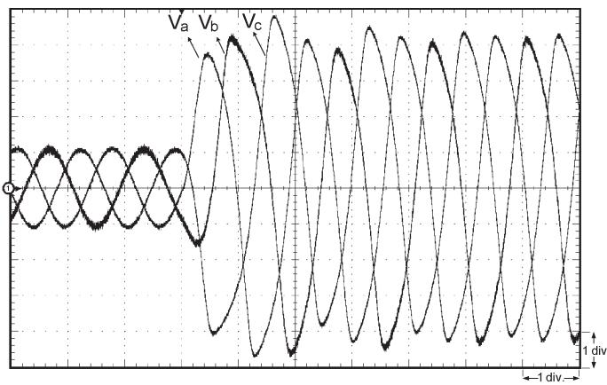  
Fig. 11. Real-time oscilloscope trace showing three-phase voltages across the surge arresters during a three-phase fault (x-axis: 1 div = 10 ms; y-axis: $1 \ \mathrm { d i v } = 2 \ \mathrm { k V } )$ .

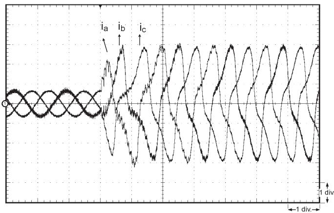  
Fig. 12. Real-time oscilloscope trace showing three-phase currents in the surge arresters during a three-phase fault (x-axis: 1 div = 10 ms; y-axis: $1 \check { \mathrm { d i v } } = 1 2 8 \mathrm { A } )$ .

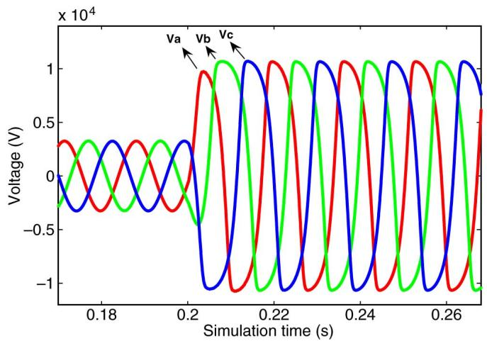  
Fig. 13. Three-phase voltages across the surge arresters during a three-phase fault at $t = 0 . 2 \mathrm { ~ s ~ } ( \mathrm { A T P }$ simulation).

within a time step of $5 \ \mu \mathrm { s } ,$ which is ten times smaller than the acceptable time step of $5 0 ~ \mu \mathrm { s }$ for transient simulation. It is therefore possible to simulate a system with at least 60 nonlinear elements within a $5 0 \mathrm { - } \mu \mathrm { s }$ time step. For Case Study II, since there are no calculations for the Jacobian matrix, the execution time is only $2 . 8 9 \mu \mathrm { s }$ , while the actual time step is $3 \mu \mathrm { s } .$

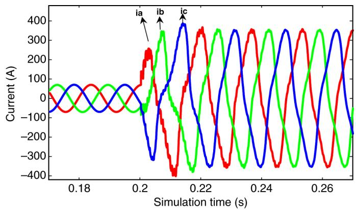

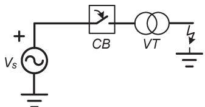  
Fig. 14. Three-phase currents in the surge arresters during a three-phase fault at t = 0.2 s (ATP simulation).   
(a)

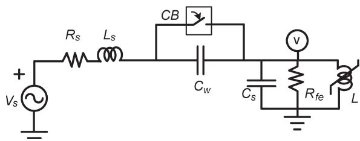

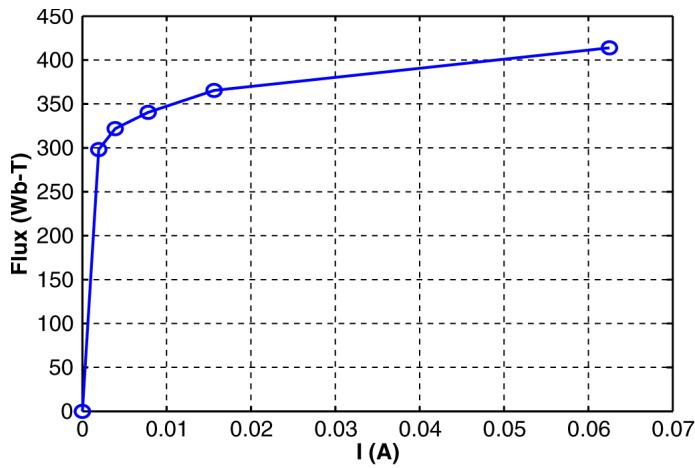  
Fig. 15. (a) Single-line diagram. (b) Equivalent network diagram for Case Study II (transformer ferroresonance transients).   
Fig. 16. Piecewise nonlinear magnetization characteristic of transformer in Case Study II.

# V. CONCLUSION

An accurate real-time transient simulation of power systems with nonlinear elements using an iterative algorithm is challenging with traditional sequential hardware such as CPUs or DSPs due to their limited computational power which precludes the iterations to be completed within the required time step to meet real-time constraints. The FPGA, on the other hand,

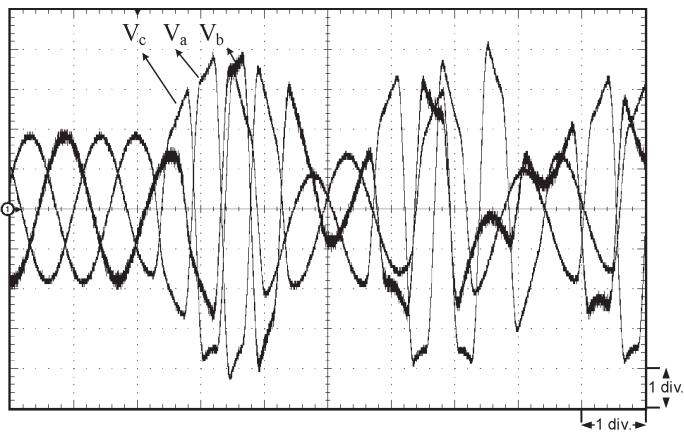  
Fig. 17. Real-time oscilloscope trace of the three-phase voltages at the transformer terminals during a three-phase-to-ground fault (x-axis: 1 div = 10 ms; y-axis: 1 div = 68 kV).

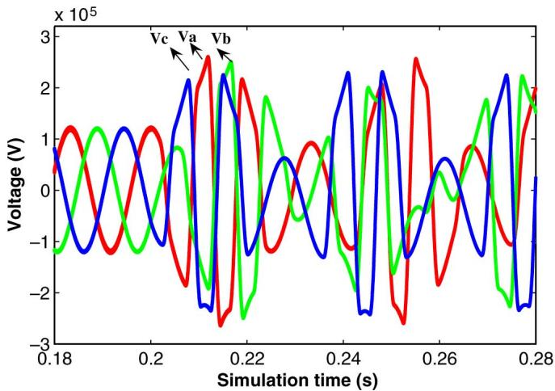

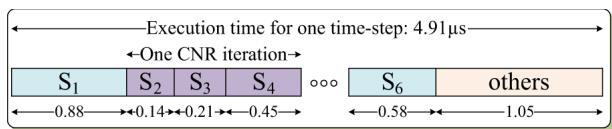  
Fig. 18. Three-phase voltages at the transformer terminals during a threephase-to-ground fault at t = 0.2 s (ATP simulation).   
(a)

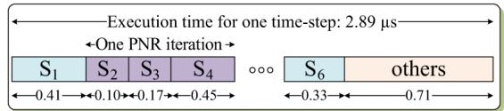  
  
Fig. 19. Execution time for the case studies in microseconds. $S _ { i }$ , $( i =$ $1 , \ldots , 6 )$ , denotes the states of the finite-state machine of the nonlinear solver.

is a programmable hardware device which allows parallelism and pipelining to be exploited to overcome the limitations of conventional sequential processors. This paper has proposed a real-time fully iterative nonlinear electromagnetic transient solver for power system network on the FPGA. The proposed nonlinear solver provides the following main features to achieve high accuracy and efficiency:

1) compensation method with the full N–R algorithm for nonlinear solution;

TABLE II DATA FOR THE CASE STUDIES   

<table><tr><td>Case Study I Parameters</td><td>Values</td></tr><tr><td>Vs</td><td>20kV peak</td></tr><tr><td>Rs, Ls</td><td>5Ω, 24.1mH</td></tr><tr><td rowspan="2">Transmission line resistance</td><td>mode+: 1.273e-5Ω/m</td></tr><tr><td>mode 0: 3.864e-4Ω/m</td></tr><tr><td rowspan="2">Transmission line inductance</td><td>mode+: 9.337e-4mH/m</td></tr><tr><td>mode 0: 4.126e-3mH/m</td></tr><tr><td rowspan="2">Transmission line capacitance</td><td>mode+: 1.274e-5μF/m</td></tr><tr><td>mode 0: 7.751e-6μF/m</td></tr><tr><td>Transmission line length</td><td>Line1: 100km, Line2: 100km</td></tr><tr><td>Series compensator C</td><td>100μF</td></tr><tr><td>RL1, LL1, RL2, Rf</td><td>8Ω, 4000mH, 270Ω, 0.0001Ω</td></tr><tr><td>Vref, p, q</td><td>8192V, 600A, 6</td></tr><tr><td>Case Study II Parameters</td><td>Values</td></tr><tr><td>Vs</td><td>125kV peak</td></tr><tr><td>Rs, Ls, Rfe</td><td>1Ω, 15mH, 200MΩ</td></tr><tr><td>CW, CS</td><td>5nF, 1.25nF</td></tr></table>

2) dedicated floating-point arithmetics for low latency computation;   
3) sparsity techniques for fast matrix computation;   
4) parallel GJE for the linear solution;   
5) deeply pipelined and paralleled design to achieve the highest throughput and lowest latency.

The nonlinear solver has been developed in the Very high speed integrated circuit HDL, making it portable to any FPGA platform and independent of any vendor-specific IP. Two case studies illustrate the use of both the CNR and PNR methods for the nonlinear solver to address the most commonly found nonlinear elements in power systems. The possible application of the proposed design could be twofold.

1) As a dedicated accelerator in existing CPU or DSP-based real-time simulator. The FPGA nonlinear solver can be interfaced as a PCI/e card to the host simulator which models the rest of the linear system.   
2) As a stand-alone solver in an all-FPGA real-time simulator employing multiple FPGAs.

Aside from power system transient modeling, the proposed solver can be also very useful for real-time simulation of power electronic drives to model insulated-gate bipolar transistor switching transients in great detail.

# APPENDIX

Table II provides the system parameters for the two case studies.

# REFERENCES

[1] H. W. Dommel, “Digital computer solution of electromagnetic transients in single and multiphase networks,” IEEE Trans. Power App. Syst., vol. PAS-88, no. 4, pp. 388–399, Apr. 1969.   
[2] H. W. Dommel, EMTP Theory Book. Portland, OR: Bonneville Power Administration, 1984.

[3] Y. Chen and V. Dinavahi, “FPGA-based real-time EMTP,” IEEE Trans. Power Del., vol. 24, no. 2, pp. 892–902, Apr. 2009.   
[4] G. Parma and V. Dinavahi, “Real-time digital hardware simulation of power electronics and drives,” IEEE Trans. Power Del., vol. 22, no. 2, pp. 1235–1246, Apr. 2007.   
[5] A. Myaing and V. Dinavahi, “FPGA-based real-time emulation of power electronic systems with detailed representation of device characteristics,” IEEE Trans. Ind. Electron., vol. 58, no. 1, pp. 358–368, Jan. 2011.   
[6] E. Monmasson and M. N. Cristea, “FPGA design methodology for industrial control systems—A review,” IEEE Trans. Ind. Electron., vol. 54, no. 4, pp. 1824–1842, Aug. 2007.   
[7] M.-W. Naouar, E. Monmasson, A. Naassani, I. Slama-Belkhodja, and N. Patin, “FPGA-based current controllers for AC machine drives— A review,” IEEE Trans. Ind. Electron., vol. 54, no. 4, pp. 1907–1925, Aug. 2007.   
[8] L. Idkhajine, E. Monmasson, M.-W. Naouar, A. Prata, and K. Bouallaga, “Fully integrated FPGA-based controllers for synchronous motor drive,” IEEE Trans. Ind. Electron., vol. 56, no. 10, pp. 4006–4017, Oct. 2009.   
[9] H. W. Dommel, “Nonlinear and time-varying elements in digital simulation of electromagnetic transients,” IEEE Trans. Power App. Syst., vol. PAS-90, no. 6, pp. 2561–2567, Nov. 1971.   
[10] L. O. Chua and P. Lin, Computer Aided Analysis of Electronic Circuit: Algorithms and Computational Techniques. Englewood Cliffs, NJ: Prentice-Hall, 1975.   
[11] G. H. Golub and C. F. Van Loan, Matrix Computations, 3rd ed. Baltimore, MD: Johns Hopkins Univ. Press, 1996.   
[12] L. O. Chua, “Efficient computer algorithms for piecewise linear analysis of resistive nonlinear networks,” IEEE Trans. Circuit Theory, vol. CT-18, no. 1, pp. 73–85, Jan. 1971.   
[13] L. Zhuo and V. K. Prasanna, “Sparse matrix–vector multiplication on FPGAs,” in Proc. FPGA, Monterey, CA, Feb. 2005, pp. 63–74.   
[14] S. Lachowicz and H. Pfleiderer, “Fast evaluation of the square root and other nonlinear functions in FPGA,” in Proc. 4th IEEE Int. Symp. Electron. Des. Test Appl., Hong Kong, Jan. 2008, pp. 474–477.   
[15] N. Boullis, O. Mencer, W. Luk, and H. Styles, “Pipelined function evaluation on FPGAs,” in Proc. 9th IEEE Field-Programmable Custom Comput. Mach., 2001, pp. 304–306.

Yuan Chen (S’06) received the B.Sc. and M.Sc. degrees in electrical engineering from Hunan University, Changsha, China, in 1992 and 2000, respectively. He is currently working toward the Ph.D. degree in the Department of Electrical and Computer Engineering, University of Alberta, Edmonton, AB, Canada.

He worked as an Electrical Engineer in China. His research interests include real-time simulation of power systems and field-programmable gate arrays.

Venkata Dinavahi (S’94–M’00–SM’08) received the Ph.D. degree in electrical and computer engineering from the University of Toronto, Toronto, ON, Canada, in 2000.

He is currently a Professor with the University of Alberta, Edmonton, AB, Canada. His research interests include real-time simulation of power systems and power electronic systems, large-scale system simulation, and parallel and distributed computing.