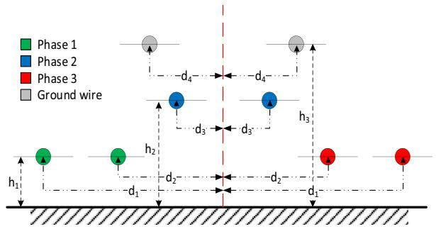
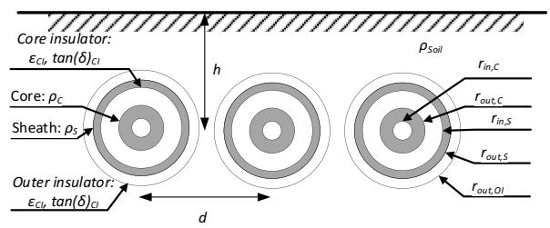
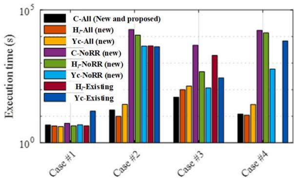
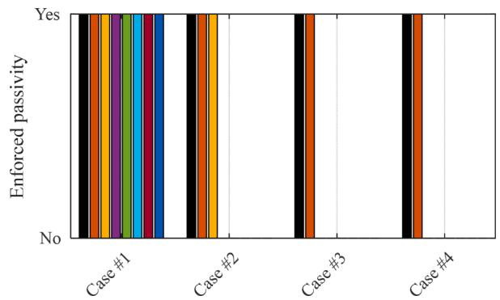
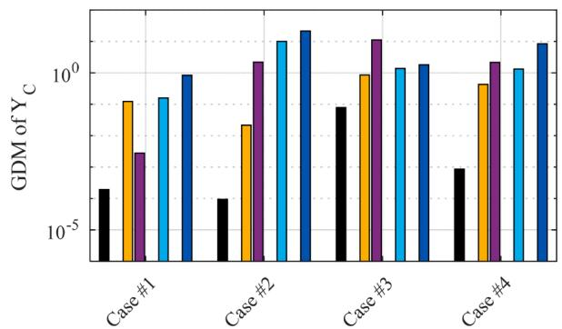
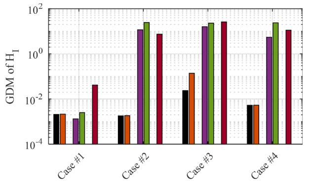
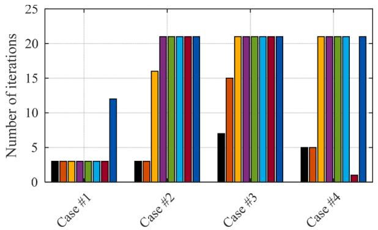
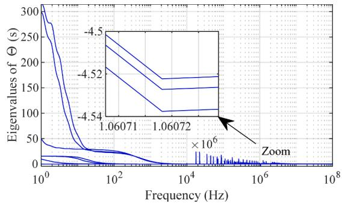
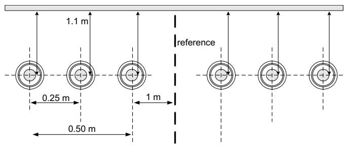
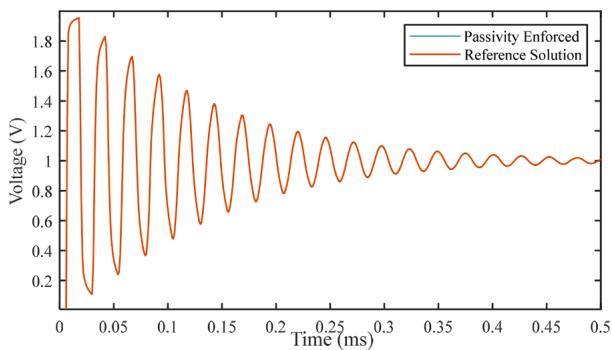

# Passivity enforcement of wideband model through a new and full perturbation formulation

Juan Miguel David Becerra a , Ilhan Kocar b,* , Jean Mahseredjian a

a Polytechnique Montreal, Canada   
b Department of Electrical Engineering, The Hong Kong Polytechnic University, Hung Hom, Kowloon, Hong Kong

# A R T I C L E I N F O

Keywords:

Electromagnetic transients

Passivity

Transmission-line model

# A B S T R A C T

Passive component models are necessary to ensure numerical stability in the simulation of electromagnetic transients in power systems. However, it is challenging to represent transmission lines and cables with frequencydependent wideband models that are accurate, efficient, and passive. This paper proposes a new method for the passivity enforcement of wideband line and cable models. The wideband models rely on pole-residue identification of characteristic admittance and propagation function in rational forms. In case the resulting models are not passive, the proposed method simultaneously applies perturbation to the residue matrices of characteristic admittance and propagation function. The set of equations related to passivity enforcement through the residues of propagation function in phase domain is complex and presented for the first time in this paper. The proposed approach minimizes the overall perturbation for maintaining passivity as opposed to the existing simplified approaches that rely on the perturbation of the residues of either characteristic admittance or diagonal elements of propagation function. The performance of the method is validated with application cases, and it is shown that it outperforms the existing methods that seek simplification in problem formulation.

# 1. Introduction

Transient simulators are commonly used in power systems to assess switching and lightning-induced overvoltages, precise short-circuit currents, harmonics, and resonance conditions [1]. In these studies, wideband models that consider the frequency dependence of electrical parameters are needed for higher accuracy. Other than integration and interpolation errors, non-passivity of wideband models may also lead to numerically unstable simulations in the time domain [2–5]. Thus, ensuring passivity will facilitate troubleshooting of an unstable time-domain simulation.

To accelerate time-domain simulations, wideband line/cable models including Universal Line Model (ULM) [6,7], and Frequency Dependent Cable Model (FDCM) [4], rely on the rational fitting of the propagation function and characteristic admittance matrices (also known as line/- cable functions). However, fitting processes performed in the complex domain such as vector fitting or the recently proposed more efficient algorithms [8,9] do not guarantee passive models. A model is deemed passive if its line admittance matrix is positive real. It is also known that passivity violations might stem from theoretical assumptions made to compute the line/cable parameters [10].

Passivity is usually enforced with perturbations [11–15], in case of wideband line/cable models through perturbation of residues of the rationally fitted line/cable functions. This perturbation should still preserve the accuracy of the fitted model. However, the enforcement of passivity in wideband line/cable models is not straightforward because the line admittance matrix is a complex function of the propagation function and characteristic admittance. The difficulty arises often because of the fitting of the propagation function since it is a multi-delay matrix function. The characteristic admittance itself is a passive function and its fitting is less stringent. The current methods try to enforce passivity through residue perturbation of either the fitted characteristic admittance or the diagonal elements of the fitted propagation function, but not simultaneously [5,11]. Although the passivity problem is often associated with the fitting of propagation function, perturbation of the residues of the fitted characteristic admittance as suggested in [11] is also reported to enforce passivity in some cases. Although this approach gives the impression to be disconnected from the root cause of the passivity problem, it can be justified given the fact that the reconstructed nodal admittance function of a line or cable is a function of its characteristic admittance.

Another weakness of the existing passivity enforcement techniques is

the perturbation of the diagonal elements of the fitted propagation function and lack of a complete passivity enforcement scheme in full phase domain. The procedure of passivity enforcement with the perturbation of characteristic admittance residues does not apply to the propagation function because the relation between the nodal admittance and the propagation function is non-linear.

In this paper, a new passivity enforcement method is proposed, which is based on the simultaneous perturbation of the characteristic admittance and propagation function in full phase domain. Its mathematical foundation allows dealing with nonlinear dependence between line admittance and propagation function. The proposed method results in faster convergence and reduced perturbations compared to existing methods, which either modify the characteristic admittance or the diagonal elements of the propagation function. The proposed method does not significantly alter the fitted functions and maintains fitting accuracy compared to the existing methods. This paper presents for the first time the set of equations related to passivity enforcement through the residues of propagation function in full phase domain.

The paper is organized as follows: in Section 2, the concept of passivity is briefly revisited to set the base. Section 3 discusses the proposed method. Several numerical examples are presented in Section 4 with an elaborate discussion about their results. A discussion about the implementation aspects of the proposed method is provided in Section 5. Conclusions are given in Section 6.

# 2. Passivity of travelling wave-type models

The passivity of a system represented by its admittance $\mathbf { Y } _ { n } ( s )$ can be assessed through the following condition [12,16]:

$$
\lambda_ {i} \geq 0 \forall \lambda_ {i} \in \lambda (\boldsymbol {\Theta} (s)); \quad s = j \omega \tag {1}
$$

with $\lambda ( \cdot )$ being the eigenvalue function and $\Theta ( s )$ given by:

$$
\boldsymbol {\Theta} (s) = \mathbf {Y} _ {n} (s) + \mathbf {Y} _ {n} ^ {H} (s) \tag {2}
$$

where $\mathbf { Y } _ { n } ^ { H } ( s )$ is the Hermitian of $\mathbf { Y } _ { n } ( s )$ .

In the case of wideband line and cable models, ${ \bf \cal Y } _ { n } ( s )$ can be generated as a function of s from the fitted characteristic admittance and propagation functions:

$$
\mathbf {Y} _ {n} = \left[ \begin{array}{c c} \left(\mathbf {I} - \mathbf {H} _ {I} ^ {2}\right) ^ {- 1} \left(\mathbf {I} + \mathbf {H} _ {I} ^ {2}\right) \mathbf {Y} _ {C} & - 2 \left(\mathbf {I} - \mathbf {H} _ {I} ^ {2}\right) ^ {- 1} \mathbf {H} _ {I} \mathbf {Y} _ {C} \\ - 2 \left(\mathbf {I} - \mathbf {H} _ {I} ^ {2}\right) ^ {- 1} \mathbf {H} _ {I} \mathbf {Y} _ {C} & \left(\mathbf {I} - \mathbf {H} _ {I} ^ {2}\right) ^ {- 1} \left(\mathbf {I} + \mathbf {H} _ {I} ^ {2}\right) \mathbf {Y} _ {C} \end{array} \right] \tag {3}
$$

Where I is the identity matrix, and $\mathbf { Y } _ { C }$ and $\mathbf { H } _ { I }$ denote the fitted characteristic admittance and propagation functions with rational functions, respectively. We drop (s) from the matrices for the sake of simplicity. The rational forms for $\mathbf { Y } _ { C }$ and H are given as follows:

$$
\mathbf {Y} _ {C} (s) = \sum_ {i = 1} ^ {n} \frac {\overline {{\mathbf {R}}} _ {i}}{s - \bar {p} _ {i}} + \overline {{\mathbf {D}}} \tag {4}
$$

$$
\mathbf {H} _ {I} (s) = \sum_ {g = 1} ^ {G} e ^ {- s \tau_ {g}} \sum_ {i = 1} ^ {n _ {g}} \frac {\widehat {\mathbf {R}} _ {i , g}}{s - \widehat {p} _ {i , g}} \tag {5}
$$

where n is the number of poles of $\mathbf { Y } _ { C } ( s )$ , D is the constant matrix, $\overline { { p } } _ { i }$ is the ith pole whose corresponding matrix of residues is denoted by $\mathbf { \overline { { R } } } _ { i } .$ . Also, G is the number of modal groups of $\mathbf { H } _ { I } ( s )$ , $n _ { g } \mathrm { i } s$ the corresponding number of poles of the gth modal group, $\tau _ { g }$ is the time delay associated with the gth modal group, $\widehat { P } _ { i , g }$ and $\widehat { \mathbf { R } } _ { i , g }$ are the ith pole and residue matrix of the gth modal group.

# 3. Passivity enforcement through mixed perturbation

# 3.1. General definition

In case a wideband model does not satisfy (1), one can enforce passivity by altering parameters of its corresponding $\mathbf { Y } _ { C }$ or HI . Usually, only residue matrices of $\mathbf { Y } _ { C }$ or $\mathbf { H } _ { I }$ are perturbed. Furthermore, as a common practice, one desires to perturb as little as possible in order to preserve the accuracy of the fitted model. Hence, passivity enforcement essentially casts in the form of a minimization problem with a nonlinear constraint due to the eigenvalue function. For the proposed method, the minimization problem is defined as:

$$
\min  _ {\Delta \widetilde {\mathbf {r}} ^ {R}} \binom {\left\| \left[ \begin{array}{c} \mathbf {T} \left(s _ {1}\right) \\ \vdots \\ \mathbf {T} \left(s _ {m}\right) \end{array} \right] \Delta \widetilde {\mathbf {r}} ^ {R} \right\|} _ {\mathbf {I}} ^ {2} \quad s. t. (8) \tag {6}
$$

where $\Delta \widetilde { \mathbf { r } } ^ { R }$ is a vector that contains the relative perturbations of the residue matrices of $\mathbf { Y } _ { C }$ and $\mathbf { H } _ { I } ,$ Iis an identity matrix such that $\Delta \widetilde { \mathbf { r } } ^ { R } =$ = $\mathbf { I } \Delta \widetilde { \mathbf { r } } ^ { R }$ , and $\widetilde { \mathbf { T } } ( s _ { m }$ )relates $\Delta \widetilde { \mathbf { r } } ^ { R }$ with the relative perturbations of $\mathbf { Y } _ { C } ( s _ { m } )$ and $\mathbf { H } _ { I } ( s _ { m } ) _ { : }$ , as given in Appendix.

Relative perturbations are treated here as the deviation of any given matrix or vector element divided by the value of the element itself, and they are chosen over their absolute counterparts since they provide better accuracy control [17].

The frequencies $\left( s _ { 1 } \quad \cdots \quad s _ { m } \right)$ are chosen as follows:

1 Computing the eigenvalues of Θ(s)with a fine logarithmic sampling typically at least 100 per decade, in a frequency range that contains the fitting frequency range.   
2 The data obtained previously is utilized to determine the number of passive and non-passive frequency bands of the model, ${ \mathbf { } } n _ { b }$ .   
3 For the desired number of frequency samples $m _ { d } ,$ , close tom, each frequency band is logarithmically sampled with the number of samples mb, given in (7).   
4 For each non-passive band, an extra sample is added with the worst passivity violation (lowest eigenvalue) obtained from step one. Thus, m represents the final number of frequency samples,

$$
m _ {b} = \left\{ \begin{array}{c c} \operatorname {f l o o r} \left(m _ {d} / n _ {b}\right) & m _ {d} / n _ {b} > 1 \\ 1 & m _ {d} / n _ {b} \leq 1 \end{array} \right. \tag {7}
$$

Regarding the nonlinear constraint caused by the eigenvalue function, it is replaced by a linear approximation because otherwise, it is likely to hamper the execution speed and convergence of the minimization problem [11,14]. Thus, we define the minimization problem constraint as:

$$
\left[ \begin{array}{c} \mathbf {P} (s _ {1}) \\ \vdots \\ \mathbf {P} (s _ {m}) \end{array} \right] \Delta \widetilde {\mathbf {r}} ^ {R} + \alpha \left[ \begin{array}{c} \lambda (\boldsymbol {\Theta} (s _ {1})) \\ \vdots \\ \lambda (\boldsymbol {\Theta} (s _ {m})) \end{array} \right] \Bigg > \mathbf {0} \tag {8}
$$

where αis a constant slightly greater than unity and $\mathsf { P } ( s _ { m } )$ is the matrix that relates the first differential of the eigenvalue function evaluated at the frequency $s _ { m }$ with the relative perturbation of the residues $\widetilde { \mathbf { r } } ^ { R }$ . The first differential is the linear part of the change of a given function due to a perturbation [18]. The definition of P, T and $\Delta \widetilde { \mathbf { r } } ^ { R }$ are in the Appendix.

# 3.2. Variants of the proposed method

The proposed method offers a range of possible variants, and one can classify them by considering three aspects: (i) perturbed functions, (ii) relative quantities and (iii) residue reduction. The first aspect leads to

$\mathbf { Y } _ { C } , \mathbf { H } _ { I } ,$ and simultaneous perturbations by modifying (6), (8) and (A.1)- (A.3) accordingly. The second one determines if all perturbations in the objective function are referenced to their original value, which requires simple modifications in (A.12), (A.14), (A.15) and (A.16) in case absolute perturbations are preferred. The third aspect controls if the perturbations on the residues and perturbed functions are minimized together by including the Imatrix in (6).

It is important to note that the residue reduction benefits the convergence of (6) strongly, as it will be shown in Section 4.

On the other hand, some previous works can be classified as subvariants of our proposed method. For example, the methods presented in [11] are obtained by perturbing $\mathbf { Y } _ { C }$ or HI without the use of relative quantities and residue reduction. In addition, these methods are simplified versions since they are based on the perturbation of diagonal elements, which is straightforward to include in (6).

# 3.3. Limitations

The existing passivity enforcement techniques for wideband line and cable models are limited to small perturbations [11–15]. The proposed method is also limited to small perturbations since it approximates the eigenvalue function with a linear function. However, as one of the application cases suggest, the proposed method can deal with larger violations compared to the existing methods. Passivity enforcement must be iteratively applied to achieve passivity since the linear approximation cannot guarantee full accuracy in the computation of the eigenvalue function [12]. In general, an additional limitation caused by using a linear approximation is that frequencies with repeated eigenvalues must be excluded since this approximation does not exist for these cases [18]. It should also be noted that passivity enforcement based on perturbation does not theoretically provide a guaranteed solution for all cases that present passivity violations. It rather provides a post fitting process and solution option to render a wideband line and cable model passive to ensure numerically stable time domain simulations.

In cases with large passivity violations near $\begin{array} { r } { \mathrm { D C } , } \end{array}$ one can vary the perunit-length conductance to mitigate and possibly, eliminate the passivity violation [5]. However, this may result in false transient responses particularly regarding the decay of trapped charge. On the other hand, applying DC correction [19] can help passivity without modifying the transient response.

Unlike the frequency dependent network equivalents represented with simple residue pole models, Ynhas a complex form in case of line and cable models since it is reconstructed from $\mathbf { Y } _ { C }$ and $\mathbf { H } _ { I } .$ . Note that, $\mathbf { Y } _ { C }$ is intrinsically a passive function and not demanding to fit with the existing fitting tools such as vector fitting or rational Krylov fitting [9, 20]. Its passivity enforcement is straightforward and the guaranteed passivity enforcement methods for network equivalents can be applied [21]. The propagation function, on the other hand, is not a passive function. There is no contemporary rational approximation method that provides the fitting of the propagation function in the phase domain while enforcing the passivity of ${ \bf Y } _ { n }$ .

# 4. Application examples

This section presents the metrics, test cases, and application results used to compare some variants of the proposed method with the following nomenclature “perturbed function”-“other aspects”. The perturbed functions can be $\mathbf { Y } _ { C } ,$ $\mathbf { H } _ { I }$ and simultaneous or combined (C). Regarding other aspects, we consider three options: All (use of relative quantities and residue reduction), NoRR (use of relative quantities without residue reduction) and existing options in the literature, which are described in Section III.B. Hence, the considered variants are C-All, HI -All, YC-All, C–NoRR, HI - NoRR, $\mathbf { Y } _ { C ^ { - } }$ NoRR, HI - existing, and ${ \pmb { \ Y } } _ { C ^ { - } }$ existing. The first five variants are the ones presented and formulated in this paper. The variant C-All is the most powerful option in terms of

enforcing passivity with minimum deviation in $\mathbf { Y } _ { C }$ and $\mathbf { H } _ { I } .$ The remaining variants are presented to demonstrate its performance and the weaknesses of the existing methods.

# 4.1. Metrics of efficiency

The efficiency of each enforcement option (variant) is evaluated by considering the following four metrics, (i) success in passivity enforcement, (ii) deviations in $\mathbf { Y } _ { C }$ and HI after the enforcement of passivity (iii) execution time, and (iv) number of iterations.

Regarding the first metric, a failure in passivity enforcement is declared if the model is not passive at the end of 21 iterations. This limit is quite permissive, considering that C-All converged in less than five iterations for most cases.

The induced deviations in $\mathbf { Y } _ { C }$ and $\mathbf { H } _ { I }$ are measured by applying the Feature Selective Validation (FSV) method [22,23] between DC and 100 MHz with 100 samples per decade. FSV gives a metric named Global Difference Measure (GDM), which yields a low value when the two datasets are in excellent agreement, and it can be interpreted as shown in Table 1. We took the maximum GDM of all elements in order to provide a global metric for all elements of $\mathbf { Y } _ { C }$ (or HI).

The execution time is included to provide further insight into the numerical implementation of the methods presented and associated computational burden. Note that passivity enforcement is an offline step performed after the rational fitting; hence, it does not have an impact on the performance of time-domain simulation, but it is evaluated to see if it is prohibitively large.

The number of iterations is provided to facilitate the assessment of the speed of convergence provided by the execution time.

# 4.2. Test cases

In this section, five cases are considered: an overhead transmission line (Case 1) and four underground multiconductor systems (Cases 2–5). The overhead line configuration is shown in Fig. 1, whereas the underground cases are based on the configuration depicted in Fig. 2. The details of the fitted models for all cases are provided in Tables 2, 3 and 4. It is important to mention that some models used the DC correction [19] to avoid large passivity violations at low frequencies. On the other hand, Case 5 is deliberately fitted starting from 10 Hz to generate large passivity violations and demonstrate the limitation of perturbation approach.

Regarding the frequency sampling, all variants used m = 20and enforced passivity between DC and 100 MHz, except for the overhead case, which used $m _ { d } = 8 0$ .

# 4.3. Discussion of results: cases 1 to 4

The results for each metric are shown in Figs. 3–7. According to Fig. 3, all variants have almost the same execution time for problems with small passivity violations, such as Case 1. The existing approach is the one described in [11] since it epitomizes the state-of-the-art in passivity enforcement approaches of line and cable models through residue perturbation. Note that the existing approach for the perturbation of HI is excluded in Fig. 3 since its application results in numerical problems. Similarly, its data should be ignored in Fig. 7.

As passivity violations become more significant, most variants stop being able to enforce passivity, as shown in Fig. 4. Only the proposed C-

Table 1 GDM interpretation scale.   

<table><tr><td>Range</td><td>Level of similarity</td><td>Range</td><td>Level of similarity</td></tr><tr><td>GDM ≤ 0.1</td><td>Excellent</td><td>0.4 &lt; GDM ≤ 0.8</td><td>Fair</td></tr><tr><td>0.1 &lt; GDM ≤ 0.2</td><td>Very good</td><td>0.8 &lt; GDM ≤ 1.6</td><td>Poor</td></tr><tr><td>0.2 &lt; GDM ≤ 0.4</td><td>Good</td><td>1.6 &lt; GDM</td><td>Extremely poor</td></tr></table>

  
Fig. 1. Overhead line configuration, the parameters are given in Table 1.

  
Fig. 2. Underground multiconductor configuration. The values of the parameters are given in Table 3.

Table 2 Parameters of case $\# 1 .$   

<table><tr><td>Parameter</td><td>Value</td><td>Parameter</td><td>Value</td></tr><tr><td>Diameter of phase conductors</td><td>4.06908 cm</td><td>h1</td><td>15.24 m</td></tr><tr><td>Diameter of ground wires</td><td>0.98044 cm</td><td>h2</td><td>23.622 m</td></tr><tr><td>DC resistance of phase conductors</td><td>0.0324 Ω/Km</td><td>h3</td><td>30.023 m</td></tr><tr><td>DC resistance of ground wires</td><td>1.6216 Ω/Km</td><td>d1</td><td>6.3246 m</td></tr><tr><td>Transmission line length</td><td>100 Km</td><td>d2</td><td>5.8674 m</td></tr><tr><td>Ground return resistivity</td><td>100 Ωm</td><td>d3</td><td>0.2286 m</td></tr><tr><td></td><td></td><td>d4</td><td>3.9319 m</td></tr></table>

Table 3 Parameters of each case.   

<table><tr><td>Parameter</td><td>Case #2</td><td>Case #3</td><td>Case #4</td><td>Case #5</td></tr><tr><td>rinC(mm)</td><td>3.175</td><td>0</td><td>3.175</td><td>0</td></tr><tr><td>routC(mm)</td><td>12.54</td><td>28</td><td>12.54</td><td>30</td></tr><tr><td>rinS(mm)</td><td>22.73</td><td>33.5</td><td>22.73</td><td>48.25</td></tr><tr><td>routS(mm)</td><td>26.22</td><td>38</td><td>26.22</td><td>48.47</td></tr><tr><td>routOI(mm)</td><td>29.335</td><td>42.5</td><td>29.335</td><td>53</td></tr><tr><td>ρC(Ωm)</td><td>1.7e-6</td><td>3.4e-8</td><td>1.7e-8</td><td>1.7e-8</td></tr><tr><td>ρS(Ωm)</td><td>2.1e-5</td><td>1.7e-8</td><td>2.1e-7</td><td>3.4e-7</td></tr><tr><td>ρSoil(Ωm)</td><td>100</td><td>150</td><td>100</td><td>100</td></tr><tr><td>εr,CI</td><td>3.5</td><td>2.81</td><td>3.5</td><td>2.85</td></tr><tr><td>εr,OI</td><td>2</td><td>2.51</td><td>2</td><td>2.51</td></tr><tr><td>tan(δ)CI</td><td>0</td><td>0</td><td>0.0004</td><td>0.01</td></tr><tr><td>tan(δ)OI</td><td>0</td><td>0</td><td>0.0004</td><td>0.01</td></tr><tr><td>h(m)</td><td>1</td><td>1</td><td>1</td><td>1</td></tr><tr><td>d(m)</td><td>0.3</td><td>0.3</td><td>0.3</td><td>0.3</td></tr><tr><td>Length (Km)</td><td>2</td><td>1.6</td><td>12</td><td>1</td></tr></table>

All and HI -All deal with all cases, whereas $\mathbf { Y } _ { C ^ { - } } \mathbf { A l l }$ has limited effectiveness, but it is better than the remaining variants. Fig. 4 shows the positive impact of using residue reduction on the convergence of the proposed method.

The low effectiveness of the variants in [11] is due to the diagonal perturbation restriction, which we tested by applying this restriction to C-All, H -All, and $\mathbf { Y } _ { C ^ { - } } \mathbf { A l l }$ in cases 2, 3, and 4, however, we did not include all the results due to space constraints.

Regarding the deviation performance, one can appreciate the

Table 4 Models details for each case.   

<table><tr><td>Parameter</td><td>Case #1</td><td>Case #2</td><td>Case #3</td><td>Case #4</td><td>Case #5</td></tr><tr><td>YC Order</td><td>7</td><td>15</td><td>5</td><td>12</td><td>12</td></tr><tr><td>Number of groups</td><td>2</td><td>4</td><td>4</td><td>6</td><td>4</td></tr><tr><td>Max group order</td><td>4</td><td>14</td><td>4</td><td>12</td><td>20</td></tr><tr><td>DC correction</td><td>No</td><td>Yes</td><td>No</td><td>Yes</td><td>Yes</td></tr><tr><td>Fitted frequency range (Hz)</td><td>[1, 1e8]</td><td>[1e-2, 1e7]</td><td>[1e-2, 1e8]</td><td>[1e-1, 1e8]</td><td>[10, 1e8]</td></tr><tr><td>Maximum passivity violation</td><td>-2.9e-6</td><td>-2.9e-5</td><td>-3.2e-2</td><td>-1.2e-4</td><td>-4.54</td></tr></table>

  
Fig. 3. Execution times of the different variants of passivity enforcement.

  
Fig. 4. Success of the considered variants of passivity enforcement (same legend as Fig. 3).

  
Fig. 5. Maximum GDM of $\mathbf { Y } _ { C }$ (same legend as Fig. 3). Variants who only perturb H are not reported since no deviation is induced in $\mathbf { Y } _ { C } .$ .

deviation-wise improved performance of C-All compared to other variants since C-All has an equal or better performance than ${ \bf H } _ { I ^ { - } } { \bf A } { \bf l } \mathrm { l }$ and ${ \pmb { \ Y } } _ { C ^ { - } }$ All for all cases, as shown in Figs. 5 and 6. Note that ${ \bf C } { \mathrm { - } } { \bf N } { \bf o } { \bf R } { \bf R }$ has a better performance than C-All, but only for the case with the smallest

  
Fig. 6. Maximum GDM of HI (same legend as $\mathrm { F i g . }$ 3). Variants who only perturb $\mathbf { Y } _ { C }$ are not reported since no deviation is induced in H .

  
Fig. 7. Number of iterations for each variant with a limit of 21 (same legend as Fig. 3).

passivity violation. Additionally, other variants including the existing ones induce a strong deviation (GMD>0.8) before hitting the iteration limit.

It can be seen in $\mathrm { F i g . } 7$ that C-All converges in fewer iterations than other variants and ${ \bf H } _ { I ^ { - } } { \bf A } { \bf l } \mathrm { l }$ is the only one which gets similar convergence, whereas the execution time shows the C-All and C–NoRR variants take more time than their non-concurrent counterparts, see Fig. 3. This cost in execution time is due to full formulation as opposed to the existing simplified and non-simultaneous formulations. However, the extra time cost tends to be negligible for C-All compared to ${ \bf H } _ { I ^ { - } } { \bf A } { \bf l } \mathrm { l }$ and Y -All, which is expected given the simple structure of $\mathbf { Y } _ { C }$ in contrast to H .

In consequence, C-All can replace other variants since it provides lower deviations, better convergence, and comparable execution times in general. Passivity enforcement is a one-time process before moving forward to time domain simulations and it does not have an impact on the CPU time of time domain simulations. Therefore, unless prohibitive, its execution time is not as important as convergence and deviation characteristics.

# 4.4. Limitations: case 5

The passivity violations of the wideband model are shown in Fig. 8. None of the perturbation approaches could enforce passivity. This is due to the large passivity violations and the proximity of the eigenvalues, as seen near 1 MHz in Fig. 8. The former pushes the passivity enforcement to induce a large perturbation to compensate large negative eigenvalues, rendering the linear approximation of the functions involved inaccurate. The latter reduces even more the range in which the linear approximation of the eigenvalues is accurate [24,25].

  
Fig. 8. Eigenvalues of $\mathbf { \Theta } \Theta ( s ) _ { ; }$ showing a large passivity violation near 1 MHz.

# 4.5. Multicable system: case 6

Consider the 6 phase 12 conductor cable system in Fig. 9 with electrical and magnetic properties as listed in Table 5. The objective of this test case is to show the applicability of the proposed combined method for large order systems. Depending on the setting of precision and number of poles, different sets of residue pole pairs can be obtained in fitting. The resulting model could exhibit passivity violations at different scales depending on the fitting parameters and selected fitting band. Although not guaranteed, if encountered, larger violations can be avoided by trying different fitting parameters. In this case, a wideband model with violations up to $1 0 ^ { - 3 }$ in magnitude is obtained. The sum of the number of poles of modal groups is 114.

The proposed combined method effectively eliminates passivity violations. The resulting model is tested in the time domain using a dc energization test set up for numerical purposes. In this test, the shield conductors are grounded. The first three core conductors are energized with a dc voltage source. The remaining core conductors, whether at the receiving or sending ends, are open circuited. It is possible to test the model for a rich frequency band using dc step voltage excitation. Fig. 10 shows the receiving end core voltage of the first cable obtained with the passivity enforced model which overlaps with the original solution.

# 5. Implementation aspects

The execution time may occasionally be very long, as shown in Fig. 3. This problem is caused by the numerical implementation of (6). Note that one can express the objective function of (6) as xTMTMx, where MTMmust be a positive definite matrix since ‖ Mx $\| _ { 2 } ^ { 2 } \mathbf { i }$ s a convex function. This rewritten expression is shown in (9). However, MTMmay not be positive definite due to limited numerical accuracy, even after applying suitable preconditioning, such as column normalization. Thus, a more robust numerical implementation is used to handle this problem at the cost of long execution times.

$$
\underset {\mathbf {x}} {\min } \| \mathbf {M} \mathbf {x} \| _ {2} ^ {2} \text {s . t .} (8) \tag {9}
$$

We exploited the sparsity of matrices T and I to improve the execution time of our proposed method, which can be implemented in

  
Fig. 9. Layout of the 12 conductor cable system.

Table 5 Cable data for the system of Fig. 9.   

<table><tr><td>Inner-Outer Radius of the Core</td><td>3.175–12.54 mm</td></tr><tr><td>Inner-Outer Radius of the Sheath</td><td>22.735–26.225 mm</td></tr><tr><td>Outer Insulation Radius</td><td>29.335 mm</td></tr><tr><td>Resistivity of Sheath</td><td>1.7 × 10-8Ohm m</td></tr><tr><td>Resistivity of Core</td><td>2.1 × 10-7Ohm m</td></tr><tr><td>Core Insulator Relative Permittivity</td><td>3.5</td></tr><tr><td>Shield Insulator Relative Permittivity</td><td>2.0</td></tr><tr><td>Insulation Loss Factor</td><td>0.001</td></tr><tr><td>Cable Length</td><td>1 km</td></tr><tr><td>Earth Resistivity</td><td>250 Ohm m</td></tr></table>

  
Fig. 10. Receiving end core voltage.

MATLAB with the LSQLIN or FMINCON routines.

Increasing the number of frequency samples may decrease the overall perturbation required to achieve the passivity with a lower number of iterations, but at the cost of increasing the execution time, which as seen in the examples, tends to be very short and should not be a concern. However, slightly greater perturbations are obtained for m ≥ 160. This behavior can be attributed to the loss of weight of $\Delta \widetilde { \mathbf { r } } ^ { R }$ with respect to the sheer number of the other elements of the norm in (6) when the number of frequency samples increases. Thus, selecting the optimum number and location of the samples requires further research.

# 6. Conclusions

This paper proposes a new simultaneous passivity enforcement method. The new method relies on the perturbation of characteristic admittance and propagation function simultaneously along with the use of relative quantities and residue reduction. Relative quantities improve the accuracy control whereas residue reduction helps the methods to converge faster.

The formulation of passivity enforcement problem in full phase frame is not straightforward for wideband line and cable models and provided for the first time in this paper. The proposed method allows obtaining more accurate passive-fitted models compared to the existing methods. The test cases show that the proposed method can be successfully applied to wideband line and cable models. It maintains passivity enforcement whereas the existing methods either fail or require larger deviations. On the other hand, the perturbation approach cannot provide a guaranteed solution and is negatively influenced by the scale of passivity violation and proximity of eigenvalues violating passivity. On the other hand, it is possible to reduce the violations by altering the fitting parameters in the first place and render the perturbation process more likely to produce a passive model.

# CRediT authorship contribution statement

Juan Miguel David Becerra: Writing – original draft, Writing – review & editing, Investigation, Validation, Visualization, Methodology, Conceptualization. Ilhan Kocar: Conceptualization, Formal analysis, Methodology, Investigation, Writing – original draft, Writing – review & editing, Software, Supervision, Project administration. Jean Mahseredjian: Supervision, Funding acquisition, Project administration.

# Declaration of Competing Interest

The authors declare that they have no known competing financial interests or personal relationships that could have appeared to influence the work reported in this paper.

# Data availability

No data was used for the research described in the article.

# Appendix: Matrix definitions

In this appendix, we drop the term (s) for the sake of brevity, and we define matricesP, Tand vector $\Delta \widetilde { \mathbf { r } } ^ { R } ;$ , required by (6), as follows:

$$
\mathbf {P} = \left[ \begin{array}{l} \operatorname {R e} \left(\mathbf {E} \left(\widetilde {\mathbf {A}} \overline {{\mathbf {W}}} \mathbf {F} + \widetilde {\mathbf {B}} \overline {{\mathbf {W}}} ^ {*} \mathbf {F} ^ {*}\right)\right) ^ {T} \\ \operatorname {I m} \left(\mathbf {E} \left(\widetilde {\mathbf {B}} \overline {{\mathbf {W}}} ^ {*} \mathbf {F} ^ {*} - \widetilde {\mathbf {A}} \overline {{\mathbf {W}}} \mathbf {F}\right)\right) ^ {T} \\ \operatorname {R e} \left(\mathbf {E} \left(\widetilde {\mathbf {C}} \widehat {\mathbf {W}} \mathbf {G} + \widetilde {\mathbf {D}} \widehat {\mathbf {W}} ^ {*} \mathbf {G} ^ {*}\right)\right) ^ {T} \\ \operatorname {I m} \left(\mathbf {E} \left(\widetilde {\mathbf {D}} \widehat {\mathbf {W}} ^ {*} \mathbf {G} ^ {*} - \widetilde {\mathbf {C}} \widehat {\mathbf {W}} \mathbf {G}\right)\right) ^ {T} \end{array} \right] ^ {T} \tag {A.1}
$$

$$
\mathbf {T} = \left[ \begin{array}{c c} L \left(\boldsymbol {\Xi} ^ {+} \overline {{\mathbf {F}}} \overline {{\mathbf {W}}} \mathbf {F}\right) & \mathbf {0} \\ \mathbf {0} & L \left(\widehat {\mathbf {G}} \widehat {\mathbf {W}} \mathbf {G}\right) \end{array} \right] \tag {A.2}
$$

$$
\Delta \overline {{\mathbf {r}}} ^ {R} = \left[ \begin{array}{l} \operatorname {R e} \left(\Delta \overline {{\mathbf {r}}} ^ {R}\right) \\ \operatorname {I m} \left(\Delta \overline {{\mathbf {r}}} ^ {R}\right) \\ \operatorname {R e} \left(\Delta \widehat {\mathbf {r}} ^ {R}\right) \\ \operatorname {I m} \left(\Delta \widehat {\mathbf {r}} ^ {R}\right) \end{array} \right] \tag {A.3}
$$

where +stands for pseudoinverse, the matrices E, Ã, B̃, C̃, D̃, W  , W  , F, G, F, Ĝ , Ξ and matrix function L are given in (A.4)- (A.18). Note that the vectors $\Delta \overline { { \mathbf { r } } } ^ { R }$ and $\Delta \widehat { \mathbf { r } } ^ { R }$ contain the relative perturbations of residues in Y and H .

$$
\mathbf {E} = \left[ \begin{array}{c} \mathbf {v} _ {1} ^ {T} \otimes \mathbf {v} _ {1} ^ {H} \\ \vdots \\ \mathbf {v} _ {2 n _ {c}} ^ {T} \otimes \mathbf {v} _ {2 n _ {c}} ^ {H} \end{array} \right] \quad \because \quad \| \mathbf {v} _ {i} \| = 1 \tag {A.4}
$$

$$
\widetilde {\mathbf {A}} = \left(\mathbf {I} _ {2 n _ {c}} \otimes \overline {{\mathbf {H}}} _ {I}\right) \boldsymbol {\Sigma} \tag {A.5}
$$

$$
\widetilde {\mathbf {B}} = \left(\overline {{\mathbf {H}}} _ {I} ^ {*} \otimes \mathbf {I} _ {2 n _ {c}}\right) \boldsymbol {\Sigma} \Phi \tag {A.6}
$$

$$
\begin{array}{l} \widetilde {\mathbf {C}} = - \left(\left(\mathbf {B} + \mathbf {C}\right) \overline {{\mathbf {Y}}} _ {C}\right) ^ {T} \otimes \mathbf {I} _ {2 n _ {c}} \boldsymbol {\Sigma} \left(\left(\mathbf {H} _ {I} \mathbf {D}\right) ^ {T} \otimes \mathbf {D}\right) \\ - \left(\left(\left(\mathbf {B} + \mathbf {C}\right) \overline {{\mathbf {Y}}} _ {C}\right) ^ {T} \otimes \mathbf {I} _ {2 n _ {c}}\right) \boldsymbol {\Sigma} \left(\mathbf {D} ^ {T} \otimes (\mathbf {D H} _ {I})\right) \tag {A.7} \\ + \left(\overline {{\mathbf {Y}}} _ {C} ^ {T} \otimes \mathbf {A}\right) \left(\boldsymbol {\Sigma} \left(\left(\mathbf {H} _ {I} ^ {T} \otimes \mathbf {I} _ {n _ {c}}\right) + \left(\mathbf {I} _ {n _ {c}} \otimes \mathbf {H} _ {I}\right)\right) - 2 \boldsymbol {\Pi}\right) \\ \end{array}
$$

$$
\begin{array}{l} \widetilde {\mathbf {D}} = - \left(\mathbf {I} _ {2 n _ {c}} \otimes \left((\mathbf {B} + \mathbf {C}) \overline {{\mathbf {Y}}} _ {C}\right) ^ {H}\right) \boldsymbol {\Sigma} \left(\mathbf {D} ^ {*} \otimes (\mathbf {H} _ {I} \mathbf {D}) ^ {H}\right) \boldsymbol {\Phi} \\ - \left(\mathbf {I} _ {2 n _ {c}} \otimes \left(\left(\mathbf {B} + \mathbf {C}\right) \overline {{\mathbf {Y}}} _ {C}\right) ^ {H}\right) \boldsymbol {\Sigma} \left(\left(\mathbf {D H} _ {I}\right) ^ {*} \otimes \mathbf {D} ^ {H}\right) \boldsymbol {\Phi} \tag {A.8} \\ + \left(\mathbf {A} ^ {*} \otimes \overline {{\mathbf {Y}}} _ {C} ^ {H}\right) \boldsymbol {\Sigma} \left(\left(\mathbf {H} _ {I} ^ {*} \otimes \mathbf {I} _ {n _ {c}}\right) + \left(\mathbf {I} _ {n _ {c}} \otimes \mathbf {H} _ {I} ^ {H}\right)\right) \boldsymbol {\Phi} \\ - 2 \left(\mathbf {A} ^ {*} \otimes \overline {{\mathbf {Y}}} _ {C} ^ {H}\right) \Pi \Phi \\ \end{array}
$$

$$
\widetilde {\mathbf {W}} = \left[ \begin{array}{l l l} \mathbf {I} _ {n _ {c}} \otimes \overline {{\mathbf {W}}} _ {1} \Xi & \dots & \mathbf {I} _ {n _ {c}} \otimes \overline {{\mathbf {W}}} _ {n} \Xi \end{array} \right] \tag {A.9}
$$

$$
\widehat {\mathbf {W}} = \left[ \begin{array}{c} \left(e ^ {- s \tau_ {1}} \widehat {\widehat {\mathbf {W}}} _ {1}\right) ^ {T} \\ \vdots \\ \left(e ^ {- s \tau_ {G}} \widehat {\widehat {\mathbf {W}}} _ {G}\right) ^ {T} \end{array} \right]; \quad \widehat {\widehat {\mathbf {W}}} _ {g} = \left[ \begin{array}{c} \left(\mathbf {I} _ {n _ {c}} \otimes \widehat {\mathbf {W}} _ {1, g}\right) ^ {T} \\ \vdots \\ \left(\mathbf {I} _ {n _ {c}} \otimes \widehat {\mathbf {W}} _ {n, g}\right) ^ {T} \end{array} \right] ^ {T} \tag {A.10}
$$

$$
\overline {{\mathbf {r}}} = \left[ \begin{array}{c} v e c h \left(\overline {{\mathbf {R}}} _ {1}\right) \\ \vdots \\ v e c h \left(\overline {{\mathbf {R}}} _ {n}\right) \end{array} \right] \tag {A.11}
$$

$$
\mathbf {F} = \operatorname {d i a g} (\bar {\mathbf {r}}) = \left[ \begin{array}{l l l l} \bar {\mathbf {r}} _ {1} & 0 & \dots & 0 \\ 0 & \bar {\mathbf {r}} _ {2} & \dots & 0 \\ \vdots & \vdots & \ddots & \vdots \\ 0 & 0 & \dots & \bar {\mathbf {r}} _ {n} \end{array} \right] \tag {A.12}
$$

$$
\widehat {\mathbf {r}} = \left[ \begin{array}{c} \mathbf {r} _ {1} \\ \vdots \\ \mathbf {r} _ {G} \end{array} \right]; \quad \mathbf {r} _ {g} = \left[ \begin{array}{c} v e c (\widehat {\mathbf {R}} _ {1, g}) \\ \vdots \\ v e c (\widehat {\mathbf {R}} _ {n _ {g}, g}) \end{array} \right] \tag {A.13}
$$

$$
\mathbf {G} = \operatorname {d i a g} (\widehat {\mathbf {r}}) \tag {A.14}
$$

$$
\overline {{\mathbf {F}}} = \operatorname {d i a g} \left(\operatorname {v e c} \left(\mathbf {Y} _ {C}\right)\right) ^ {- 1} \tag {A.15}
$$

$$
\widehat {\mathbf {G}} = \operatorname {d i a g} \left(\operatorname {v e c} \left(\mathbf {H} _ {I}\right)\right) ^ {- 1} \tag {A.16}
$$

$$
v e c (\mathbf {U}) = \Xi_ {N ^ {2} \times N (N + 1) / 2} v e c h (\mathbf {U}); \quad \mathbf {U} \in \mathbb {C} ^ {N \times N} \tag {A.17}
$$

$$
L (\mathbf {U}) = \left[ \begin{array}{l l} \operatorname {R e} (\mathbf {U}) & - \operatorname {I m} (\mathbf {U}) \\ \operatorname {I m} (\mathbf {U}) & \operatorname {R e} (\mathbf {U}) \end{array} \right] \tag {A.18}
$$

Symbols * and $\otimes$ stand for complex conjugate and Kronecker product, respectively. ${ \bf v } _ { i }$ is the right eigenvector associated with $\lambda _ { i } . \mathbf { I } _ { N }$ denotes an identity matrix of dimension Nand $n _ { c }$ is the number of conductors. The operator vec(•) stacks the elements of a matrix into a column vector, whereas operator vech(•) only stacks the lower triangular part of a symmetric matrix. Matrices $\mathbf { { \overline { { H } } } } _ { I } , \mathbf { { \overline { { Y } } } } _ { C } , \mathbf { { A } } , \mathbf { { B } } , \mathbf { { C } } , \mathbf { { D } } , \Phi , \Sigma , \mathbf { { I I } } , \mathbf { { \overline { { W } } } } _ { i }$ and $\widehat { \mathbf { W } } _ { i , g }$ are given in (A.19)-(A.29)

$$
\overline {{\mathbf {H}}} _ {I} = \mathbf {A} (\mathbf {B} + \mathbf {C}) \tag {A.19}
$$

$$
\overline {{\mathbf {Y}}} _ {C} = \mathbf {I} _ {2} \otimes \mathbf {Y} _ {C} \tag {A.20}
$$

$$
\mathbf {A} = \mathbf {I} _ {2} \otimes \left(\mathbf {I} _ {n _ {c}} - \mathbf {H} _ {I} ^ {2}\right) ^ {- 1} \tag {A.21}
$$

$$
\mathbf {B} (s) = \mathbf {I} _ {2} \otimes \left(\mathbf {I} _ {n _ {c}} + \mathbf {H} _ {I} ^ {2}\right) \tag {A.22}
$$

$$
\mathbf {C} = \left[ \begin{array}{l l} 0 & 1 \\ 1 & 0 \end{array} \right] \otimes (- 2 \mathbf {H} _ {I}) \tag {A.23}
$$

$$
\mathbf {D} = \left(\mathbf {I} _ {n _ {c}} - \mathbf {H} _ {I} ^ {2} (s)\right) ^ {- 1} \tag {A.24}
$$

$$
\operatorname {v e c} \left(\mathbf {U} ^ {T}\right) = \boldsymbol {\Phi} _ {N ^ {2} \times N ^ {2}} \operatorname {v e c} (\mathbf {U}) \tag {A.25}
$$

$$
\operatorname {v e c} \left(\mathbf {I} _ {2} \otimes \mathbf {U}\right) = \boldsymbol {\Sigma} _ {4 N ^ {2} \times N ^ {2}} \operatorname {v e c} (\mathbf {U}) \tag {A.26}
$$

$$
\operatorname {v e c} \left(\left[ \begin{array}{l l} 0 & 1 \\ 1 & 0 \end{array} \right] \otimes \mathbf {U}\right) = \boldsymbol {\Pi} _ {4 N ^ {2} \times N ^ {2}} \operatorname {v e c} (\mathbf {U}) \tag {A.27}
$$

$$
\overline {{\mathbf {W}}} _ {i} = \frac {1}{s - \bar {p} _ {i}} \mathbf {I} _ {n _ {c}} \tag {A.28}
$$

$$
\widehat {\mathbf {W}} _ {i, g} = \frac {1}{s - \widehat {p} _ {i , g}} \mathbf {I} _ {n _ {c}} \tag {A.29}
$$

The matrices Φ,Σ,Πand Ξ are made of 1′s and 0′s and thus, they are not affected by conjugate operations. Φis the commutation matrix and Ξis the duplication matrix.

The matrices presented here are obtained by applying matrix differentials theory [18].

# References

[1] J. Mahseredjian, V. Dinavahi, J.A. Martinez, Simulation tools for electromagnetic transients in power systems: overview and challenges, IEEE Trans. Power Deliv. 24 (3) (2009) 1657–1669. Jul.   
[2] B. Gustavsen, Avoiding numerical instabilities in the universal line model by a twosegment interpolation scheme, IEEE Trans. Power Deliv. 28 (3) (2013) 1643–1651. Jul.   
[3] I. Kocar, J. Mahseredjian, G. Olivier, Improvement of numerical stability for the computation of transients in lines and cables, IEEE Trans. Power Deliv. 25 (2) (2010) 1104–1111. Apr.   
[4] I. Kocar, J. Mahseredjian, Accurate frequency dependent cable model for electromagnetic transients, IEEE Trans. Power Deliv. 31 (3) (2016) 1281–1288. Jun.   
[5] B. Gustavsen, Passivity enforcement for transmission line models based on the method of characteristics, IEEE Trans. Power Deliv. 23 (4) (2008) 2286–2293. Oct.   
[6] J.R. Marti, Accurate modelling of frequency-dependent transmission lines in electromagnetic transient simulations, IEEE Trans. Power Appar. Syst. PAS-101 (1) (1982) 147–157. Jan.   
[7] A. Morched, B. Gustavsen, M. Tartibi, A universal model for accurate calculation of electromagnetic transients on overhead lines and underground cables, IEEE Trans. Power Deliv. 14 (3) (1999) 1032–1038. Jul.   
[8] A. Mouhaidali, D. Tromeur-Dervout, O. Chadebec, J.M. Guichon, S. Silvant, Electromagnetic transient analysis of transmission line based on rational Krylov approximation, IEEE Trans. Power Deliv. 36 (5) (2021) 2913–2920. Oct.   
[9] A. Gueye, I. Kocar, E. Francois, J. Mahseredjian, Comparison of rational Krylov and Vector fitting in transient simulation of transmission lines and cables, IEEE Trans. Power Deliv., doi:10.1109/TPWRD.2023.3272927. (early access).   
wire above a lossy ground, IEEE Trans. Electromagn. Compat. 57 (3) (2015) 555–564. Jun.   
[11] H.M.J.D. Silva, A.M. Gole, J.E. Nordstrom, L.M. Wedepohl, Robust passivity enforcement scheme for time-domain simulation of multi-conductor transmission lines and cables, IEEE Trans. Power Deliv. 25 (2) (2010) 930–938. Apr.   
[12] S. Grivet-Talocia, B. Gustavsen, Passive Macromodeling: Theory and Applications, Wiley, Hoboken, New Jersey, 2015.

[13] D. Deschrijver, B. Gustavsen, T. Dhaene, Causality preserving passivity enforcement for traveling-wave-type transmission-line models, IEEE Trans. Power Deliv. 24 (4) (2009) 2461–2462. Oct.   
[14] A. Chinea, S. Grivet-Talocia, Perturbation schemes for passivity enforcement of delay-based transmission line macromodels, IEEE Trans. Adv. Packag. 31 (3) (2008) 568–578. Aug.   
[15] C. Chen, D. Saraswat, R. Achar, E. Gad, M.S. Nakhla, M.C.E. Yagoub, Passivity compensation algorithm for method-of-characteristics-based multiconductor transmission line interconnect macromodels, IEEE Trans. Very Large Scale Integr. VLSI Syst. 17 (8) (2009) 1061–1072. Aug.   
[16] P. Triverio, S. Grivet-Talocia, M.S. Nakhla, F.G. Canavero, R. Achar, Stability, causality, and passivity in electrical interconnect models, IEEE Trans. Adv. Packag. 30 (4) (2007) 795–808. Nov.   
[17] S. Grivet-Talocia, A. Ubolli, Passivity enforcement with relative error control, IEEE Trans. Microw. Theory Tech. 55 (11) (2007) 2374–2383. Nov.   
[18] J.R. Magnus, H. Neudecker, Matrix Differential Calculus With Applications in Statistics and Econometrics, John Wiley & Sons, 2019 revised version.   
[19] M. Cervantes, I. Kocar, J. Mahseredjian, A. Ramirez, Partitioned fitting and DC correction for the simulation of electromagnetic transients in transmission lines/ cables, IEEE Trans. Power Deliv. 33 (6) (2018) 3246–3248. Dec.   
[20] E. Francois, I. Kocar, J. Mahseredjian, Wideband model based on constant transformation matrix and rational Krylov fitting, Electr. Power Syst. Res. 220 (2023), https://doi.org/10.1016/j.epsr.2023.109295 in pressISSN 0378-7796.   
[21] Y. Hu, W. Wu, A.M. Gole, B. Zhang, A guaranteed and efficient method to enforce passivity of frequency-dependent network equivalents, IEEE Trans. Power Syst. 32 (3) (2017) 2455–2463, https://doi.org/10.1109/TPWRS.2016.2611603. May.   
[22] A.P. Duffy, A.J.M. Martin, A. Orlandi, G. Antonini, T.M. Benson, M.S. Woolfson, Feature selective validation (FSV) for validation of computational electromagnetics (CEM). Part I-the FSV method, IEEE Trans. Electromagn. Compat. 48 (3) (2006) 449–459. Aug.   
[23] A.P. Duffy, A.J.M. Martin, A. Orlandi, G. Antonini, T.M. Benson, M.S. Woolfson, Feature selective validation (FSV) for validation of computational electromagnetics (CEM). Part II- assessment of FSV performance, IEEE Trans. Electromagn. Compat. 48 (3) (2006) 460–467. Aug.   
[24] G.W. Stewart, J. Sun, Matrix Perturbation Theory, 1st ed., Academic Press, Boston, 1990.   
[25] L. Hogben, Handbook of Linear Algebra, CRC Press, 2013.