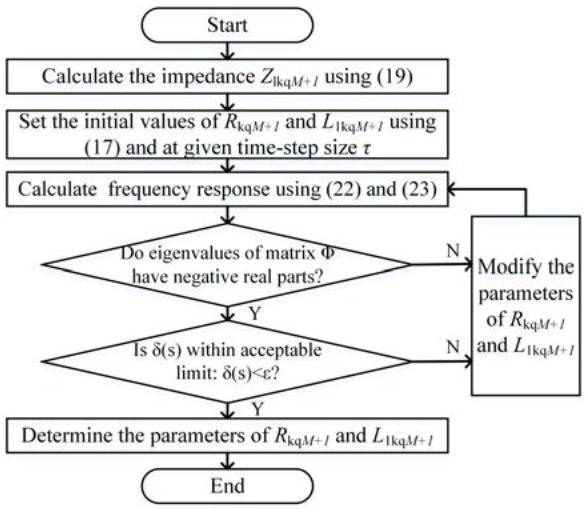
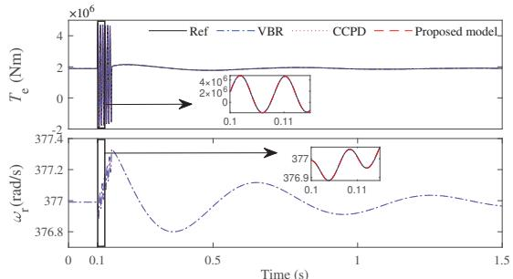
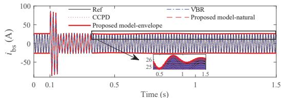
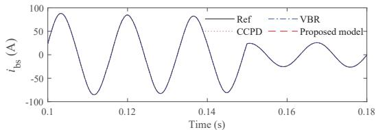
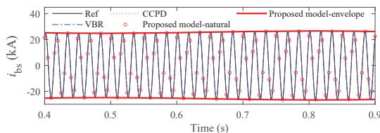

# Multi-scale Modeling of Synchronous Machine With Constant Conductance Matrix in Phase Domain

Peng Zhao, Yue Xia, Juan Su

CIEE, China Agricultural University

Beijing, China

zpengxm@163.com, yue.xia@cau.edu.cn, sujuan@cau.edu.cn

Zhikai You

Jiaxing Electric Power Supply Company

Jiaxing, China

youzkzk@163.com

Abstract—In this paper, a novel synchronous machine model is developed for the accurate and efficient simulation of multiscale transients. The machine stator equations are expressed with analytic signals in the phase domain, thus providing direct interface between machine model and external network model. Frequency shifting is applied to stator quantities to eliminate the ac carrier in the stator windings which enables the use of large time-step size. An artificial damper winding is introduced to eliminate the numerical saliency based on a pioneering technique. The proposed machine model is represented as a Norton equivalent with constant conductance matrix. The analysis of test cases demonstrates the effectiveness of the proposed synchronous machine model in terms of accuracy and efficiency.

Index Terms—synchronous machine, constant conductance matrix, multi-scale transients, frequency shifting

# I. INTRODUCTION

In recent years, modeling of synchronous machines has become a popular research topic. Numerous synchronous machine models have been proposed in the transient analysis of power systems.

The dq0 transformation finds extensive application in the modeling of synchronous machines [1]. The major advantage of the reference frame of dq0 component is that it yields constant inductances. However, the dq0 model requires an indirect machine-network interface. This may lead to unstable numerical solutions with large time-step sizes. In [2], the phase domain (PD) model is introduced to provide a direct interface between the network and the machine. In [3], a VBR model for simulation of electromagnetic transients was proposed. The VBR model offers improved accuracy and stability compared to the PD machine model [4], [5]. Both the PD and VBR models have time-varying conductance matrices that at each time-step need to be updated. This leads to a significant increase in the computation time. In [6], an EMTPtype constant conductance phase domain (CCPD) synchronous machine model was developed. The CCPD model has an artificial damper winding. The equivalent conductance matrix of CCPD model remains constant and is not affected by the positions of the rotor. However, the selection of parameters for artificial winding is sensitive to the time-step size. Inappropriate selection of artificial winding parameters may lead to the instability of the machine model. Moreover, the above EMTPtype models require small time-step sizes to guarantee the numerical integration accuracy. When ac carrier frequencies are around 50 or 60 Hz, they are inefficient in the simulation of low-frequency transients.

In this paper, an efficient multi-scale model is developed. There are threefold contributions in the paper. Firstly, a

model of the synchronous machine with a constant admittance matrix based on the frequency shifting concept is proposed in phase domain. Employing shift frequency as a new parameter, the multi-scale functionality supports the simulation of highfrequency and low-frequency transients in a range of time scales. Secondly, a constant conductance matrix is formulated by adding an artificial winding in the machine model. Avoiding the update of the conductance matrix for the network is maintained at every time-step. The novel rules for setting artificial winding parameters are proposed considering both accuracy and stability. Thirdly, the machine equations are reformulated and it results in a significant simplification of the expression for the machine model. This simplification reduces the required mathematical operations for modeling the synchronous machine, thereby decreasing computation time. Furthermore, the accuracy and efficiency of the proposed model are examined by test case.

# II. MULTI-SCALE SYNCHRONOUS MACHINE MODELING

# A. Discretized Multi-scale Synchronous Machine Model

The synchronous machine stator is connected to the grid. The ac carrier frequency does appear on the stator side of the machine. To support multi-scale simulation and frequency shifting operation, the machine stator equation in the phase domain presented in [2] is reconstructed with analytic signals:

$$
\left[ \begin{array}{c} \underline {{v}} _ {\mathrm {a b c s}} (t) \\ v _ {\mathrm {q d r}} (t) \end{array} \right] = \frac {\mathrm {d}}{\mathrm {d} t} \left[ \begin{array}{c} \underline {{\boldsymbol {\lambda}}} _ {\mathrm {a b c s}} (t) \\ \overline {{\boldsymbol {\lambda}}} _ {\mathrm {q d r}} (t) \end{array} \right] + \left[ \begin{array}{c c} \boldsymbol {R} _ {\mathrm {s}} & \boldsymbol {0} \\ \boldsymbol {0} & \boldsymbol {R} _ {\mathrm {r}} \end{array} \right] \left[ \begin{array}{c} - \underline {{i}} _ {\mathrm {a b c s}} (t) \\ i _ {\mathrm {q d r}} (t) \end{array} \right] \tag {1}
$$

where $v _ { \mathrm { a b c s } } ( t )$ and $\underline { { \dot { \imath } } } _ { \mathrm { a b c s } } ( t )$ )represent the voltage and current of stator, respectively; $v _ { \mathrm { q d r } } ( t )$ ) and $i _ { \mathrm { q d r } } ( t )$ represent the voltage tand current of rotor, respectively; $\Delta _ { \mathrm { a b c s } } ( t )$ and $\lambda _ { \mathrm { q d r } } ( t )$ represent the flux linkages of stator and rotor; $R _ { s }$ and $R _ { r }$ trepresent the resistance matrices of stator and rotor, respectively. The flux linkages $\Delta _ { \mathrm { a b c s } } ( t )$ and $\lambda _ { \mathrm { q d r } } ( t )$ are as follows:

$$
\left[ \begin{array}{c} \underline {{\boldsymbol {\lambda}}} _ {\mathrm {a b c s}} (t) \\ \overline {{\boldsymbol {\lambda}}} _ {\mathrm {q d r}} (t) \end{array} \right] = \left[ \begin{array}{c c} \boldsymbol {L} _ {\mathrm {s}} \left(\theta_ {\mathrm {r}} (t)\right) & \boldsymbol {L} _ {\mathrm {s r}} \left(\theta_ {\mathrm {r}} (t)\right) \\ \boldsymbol {L} _ {\mathrm {r s}} \left(\theta_ {\mathrm {r}} (t)\right) & \boldsymbol {L} _ {\mathrm {r}} \end{array} \right] \left[ \begin{array}{c} - \underline {{i}} _ {\mathrm {a b c s}} (t) \\ \boldsymbol {i} _ {\mathrm {q d r}} (t) \end{array} \right] \tag {2}
$$

where the variable with the underscore is the representation of analytic signal; $\theta _ { x } ( t )$ is the rotor position; $L _ { \mathrm { s } } ( \theta _ { \mathrm { r } } ( t )$ is the θ t θrepresentation of the matrix in stator inductance; $L _ { \mathrm { r s } } ( \theta _ { \mathrm { r } } ( t )$ , $\mathcal { D } _ { \mathrm { s r } } ( \theta _ { \mathrm { r } } ( t )$ θ tare the representation of time-varying matrices beθ ttween stator and rotor windings of the mutual inductances. The rotor inductance matrix $L _ { \mathrm { r } }$ is a constant matrix. The above matrices are from [7].

Frequency shifting is used in the stator voltage equation of (1):

$$
\begin{array}{l} \left[ \begin{array}{c} \mathcal {E} \left[ \underline {{\boldsymbol {v}}} _ {\mathrm {a b c s}} (t) \right] \\ \boldsymbol {v} _ {\mathrm {q d r}} (t) \end{array} \right] = \frac {\mathrm {d}}{\mathrm {d} t} \left[ \begin{array}{c} \mathcal {E} \left[ \underline {{\boldsymbol {\lambda}}} _ {\mathrm {a b c s}} (t) \right] \\ \boldsymbol {\lambda} _ {\mathrm {q d r}} (t) \end{array} \right] \\ + \left[ \begin{array}{c} \mathrm {j} 2 \pi f _ {\mathrm {s}} \mathcal {E} \left[ \underline {{\lambda}} _ {\mathrm {a b c s}} (t) \right] \\ \boldsymbol {0} \end{array} \right] + \left[ \begin{array}{c c} \boldsymbol {R} _ {\mathrm {s}} & \boldsymbol {0} \\ \boldsymbol {0} & \boldsymbol {R} _ {\mathrm {r}} \end{array} \right] \left[ \begin{array}{c} - \mathcal {E} \left[ \underline {{\boldsymbol {i}}} _ {\mathrm {a b c s}} (t) \right] \\ \boldsymbol {i} _ {\mathrm {q d r}} (t) \end{array} \right] \tag {3} \\ \end{array}
$$

where $f _ { \mathrm { s } }$ represents the shift frequency, $\varepsilon [ \cdot ]$ represents operaftion of frequency shifting, $\mathrm { e . g . , } \mathcal { E } \left[ \underline { { v } } _ { \mathrm { a b c s } } ( t ) \right] = \underline { { v } } _ { \mathrm { a b c s } } ( t ) \mathrm { e } ^ { - \mathrm { j } 2 \pi f _ { \mathrm { s } } t }$

t tThe discretization of (3) using the implicit trapezoidal integration method and substituting (2) into (3) yields:

$$
\begin{array}{l} \underline {{\boldsymbol {v}}} _ {\mathrm {a b c s}} (k) = - \left(\left(\frac {2}{\tau} + \mathrm {j} 2 \pi f _ {\mathrm {s}}\right) \boldsymbol {L} _ {\mathrm {s}} (\theta_ {\mathrm {r}} (k)) + \boldsymbol {R} _ {\mathrm {s}}\right) \underline {{\boldsymbol {i}}} _ {\mathrm {a b c s}} (k) \\ + \left(\frac {2}{\tau} + \mathrm {j} 2 \pi f _ {\mathrm {s}}\right) (\boldsymbol {I} + \mathrm {j} \boldsymbol {K}) \boldsymbol {L} _ {\mathrm {s r}} \left(\theta_ {\mathrm {r}} (k)\right) \boldsymbol {i} _ {\mathrm {q d r}} (k) + \underline {{e}} _ {\mathrm {s h}} (k) \tag {4} \\ \end{array}
$$

with

$$
\begin{array}{l} \underline {{\underline {{e}}}} _ {\mathrm {s h}} (k) = \left(- \frac {2}{\tau} + \mathrm {j} 2 \pi f _ {\mathrm {s}}\right) \mathrm {e} ^ {\mathrm {j} 2 \pi f _ {\mathrm {s}} \tau} \underline {{\boldsymbol {\lambda}}} _ {\mathrm {a b c s}} (k - 1) \tag {5} \\ - \boldsymbol {R} _ {\mathrm {s}} \mathrm {e} ^ {\mathrm {j} 2 \pi f _ {\mathrm {s}} \tau} \underline {{\boldsymbol {i}}} _ {\mathrm {a b c s}} (k - 1) - \mathrm {e} ^ {\mathrm {j} 2 \pi f _ {\mathrm {s}} \tau} \underline {{\boldsymbol {v}}} _ {\mathrm {a b c s}} (k - 1) \\ \end{array}
$$

where  represents time-step counter.

kDiscretizing rotor voltage equation in (3) using trapezoidal integration yields:

$$
\begin{array}{l} \boldsymbol {i} _ {\mathrm {q d r}} (k) = \left(\boldsymbol {R} _ {\mathrm {r}} + \frac {2}{\tau} \boldsymbol {L} _ {\mathrm {r}}\right) ^ {- 1} \left(\boldsymbol {v} _ {\mathrm {q d r}} (k) \right. \tag {6} \\ \left. + \frac {2}{\tau} \boldsymbol {L} _ {\mathrm {r s}} \left(\theta_ {\mathrm {r}} (k)\right) \boldsymbol {i} _ {\mathrm {a b c s}} (k) + \boldsymbol {e} _ {\mathrm {r h}} (k)\right) \\ \end{array}
$$

with

$$
\begin{array}{l} \boldsymbol {e} _ {\mathrm {r h}} (k) = \left(- \boldsymbol {R} _ {\mathrm {r}} + \frac {2}{\tau} \boldsymbol {L} _ {\mathrm {r}}\right) \boldsymbol {i} _ {\mathrm {q d r}} (k - 1) \tag {7} \\ - \frac {2}{\tau} \boldsymbol {L} _ {\mathrm {r s}} (\theta_ {\mathrm {r}} (k - 1)) \boldsymbol {i} _ {\mathrm {a b c s}} (k - 1) + \boldsymbol {v} _ {\mathrm {q d r}} (k - 1) \\ \end{array}
$$

Insertion of (6) into (4) yields Thevenin equivalent:

$$
\underline {{\boldsymbol {v}}} _ {\mathrm {a b c s}} (k) = \underline {{\boldsymbol {R}}} _ {\mathrm {e q}} (k) \underline {{\boldsymbol {i}}} _ {\mathrm {a b c s}} (k) + \underline {{\boldsymbol {e}}} _ {\mathrm {h}} (k) \tag {8}
$$

with

$$
\begin{array}{l} \underline {{\boldsymbol {R}}} _ {\mathrm {e q}} (k) = - \boldsymbol {R} _ {\mathrm {s}} - \left(\frac {2}{\tau} + \mathrm {j} 2 \pi f _ {\mathrm {s}}\right) \boldsymbol {L} _ {\mathrm {s}} \left(\theta_ {\mathrm {r}} (k)\right) + \boldsymbol {L} _ {\mathrm {s r}} \left(\theta_ {\mathrm {r}} (k)\right) \\ \times \frac {2}{\tau} \left(\frac {2}{\tau} + \mathrm {j} 2 \pi f _ {\mathrm {s}}\right) \left(\boldsymbol {R} _ {\mathrm {r}} + \frac {2}{\tau} \boldsymbol {L} _ {\mathrm {r}}\right) ^ {- 1} \boldsymbol {L} _ {\mathrm {r s}} (\theta_ {\mathrm {r}} (k)) \tag {9} \\ \end{array}
$$

$$
\begin{array}{l} \underline {{e}} _ {\mathrm {h}} (k) = \left(\frac {2}{\tau} + \mathrm {j} 2 \pi f _ {\mathrm {s}}\right) (\boldsymbol {I} + \mathrm {j} \boldsymbol {K}) \boldsymbol {L} _ {\mathrm {s r}} \left(\theta_ {\mathrm {r}} (k)\right) (10) \\ \times \left(\boldsymbol {R} _ {\mathrm {r}} + \frac {2}{\tau} \boldsymbol {L} _ {\mathrm {r}}\right) ^ {- 1} \left(\boldsymbol {v} _ {\mathrm {q d r}} (k) + \boldsymbol {e} _ {\mathrm {r h}} (k)\right) + \underline {{\boldsymbol {e}}} _ {\mathrm {s h}} (k) (10) \\ \end{array}
$$

In the case of the shift frequency equal to zero, small time-step sizes are used in simulation of high-frequency transient. When low-frequency transient is simulated, the shift frequency is set to the carrier frequency and large time-step sizes may be used.

B. Formulation of Constant Equivalent Conductance Matrix

As seen from (9), the resistance matrix $\underline { { R } } _ { \mathrm { e q } } ( k )$ is rotorkposition-dependent. This is not a desirable property. The machine conductance matrix is updated at every time-step. The efficiency of simulation may be enhanced by keeping the synchronous machine resistance matrix constant. Rearranging (9), the equivalent resistance matrix may be represented by a constant term along with a term dependent on the position of the rotor, as follows:

$$
\begin{array}{l} \underline {{\boldsymbol {R}}} _ {\mathrm {e q}} (k) = \boldsymbol {R} _ {\mathrm {c}} + \frac {1}{3} \left(Z _ {\mathrm {d}} ^ {\prime \prime} - Z _ {\mathrm {q}} ^ {\prime \prime}\right) \left(1 + \frac {\tau}{2} \mathrm {j} 2 \pi f _ {\mathrm {s}}\right) \\ \left[ \begin{array}{c c c} \cos 2 \theta_ {\mathrm {r}} (k) & \cos 2 \left(\theta_ {\mathrm {r}} (k) - \frac {\pi}{3}\right) & \cos 2 \left(\theta_ {\mathrm {r}} (k) + \frac {\pi}{3}\right) \\ \cos 2 \left(\theta_ {\mathrm {r}} (k) - \frac {\pi}{3}\right) & \cos 2 \left(\theta_ {\mathrm {r}} (k) - \frac {2 \pi}{3}\right) & \cos 2 \theta_ {\mathrm {r}} (k) \\ \cos 2 \left(\theta_ {\mathrm {r}} (k) + \frac {\pi}{3}\right) & \cos 2 \theta_ {\mathrm {r}} (k) & \cos 2 \left(\theta_ {\mathrm {r}} (k) + \frac {2 \pi}{3}\right) \end{array} \right] \tag {11} \\ \end{array}
$$

where $\scriptstyle { R _ { \mathrm { c } } }$ is the constant term. The equivalent discrete-time subtransient impedances $Z _ { \mathrm { d } } ^ { \prime \prime }$ and $Z _ { \mathrm { q } } ^ { 1 / 1 }$ of $^ { 4 - }$ and d−axises are defined as:

$$
Z _ {\mathrm {q}} ^ {\prime \prime} = \left(\left(Z _ {\mathrm {m q}}\right) ^ {- 1} + \sum_ {i = 1} ^ {M} \left(Z _ {\mathrm {l k q} i}\right) ^ {- 1}\right) ^ {- 1} \tag {12}
$$

$$
Z _ {\mathrm {d}} ^ {\prime \prime} = \left(\left(Z _ {\mathrm {m d}}\right) ^ {- 1} + \left(Z _ {\mathrm {l f d}}\right) ^ {- 1} + \sum_ {i = 1} ^ {N} \left(Z _ {\mathrm {l k d i}}\right) ^ {- 1}\right) ^ {- 1} \tag {13}
$$

with

$$
Z _ {\mathrm {m q}} = \frac {2}{\tau} L _ {\mathrm {m q}}, Z _ {\mathrm {m d}} = \frac {2}{\tau} L _ {\mathrm {m d}} \tag {14}
$$

$$
Z _ {1 g} = R _ {g} + \frac {2}{\tau} L _ {1 g}, g = \mathrm {k q 1}, \dots , \mathrm {k d} M, \mathrm {f d}, \mathrm {k d} 1, \dots , \mathrm {k d} N \tag {15}
$$

As observed from (11), the term $Z _ { \mathrm { d } } ^ { \prime \prime } - Z _ { \mathrm { q } } ^ { \prime \prime }$ is nonzero. The third term in $\underline { { R } } _ { \mathrm { e q } } ( k ) ( 1 1 )$ Z Z is therefore time-varying. Based on kthe method proposed in [6], the addition of artificial winding may remove the numerical difference between the $Z _ { \mathrm { d } } ^ { \prime \prime }$ and $Z _ { \mathrm { q } } ^ { \prime \prime }$ Z. The added artificial winding is not related to the actual Zmachine parameters. It is incorporated into the axis that has highest subtransient impedance which depends on the relative values of $Z _ { \mathrm { d } } ^ { \prime \prime }$ and $Z _ { \mathrm { q } } ^ { \prime \prime }$ . For example, in the case of $Z _ { \mathrm { d } } ^ { \prime \prime } < Z _ { \mathrm { q } } ^ { \prime \prime } ;$ a $M + 1$ Z Z Z < Zartificial winding is added to q-axis. The equivalent Msubtransient impedance with artificial winding becomes:

$$
Z _ {\mathrm {q}, \text {A d d}} ^ {\prime \prime} = \left(\left(\frac {2}{\tau} L _ {\mathrm {m q}}\right) ^ {- 1} + \sum_ {i = 1} ^ {M} \left(Z _ {1 \mathrm {k q} i}\right) ^ {- 1} + \left(Z _ {1 \mathrm {k q} M + 1}\right) ^ {- 1}\right) ^ {- 1} \tag {16}
$$

with

$$
Z _ {1 \mathrm {k q} M + 1} = R _ {\mathrm {k q} M + 1} + \frac {2}{\tau} L _ {1 \mathrm {k q} M + 1} \tag {17}
$$

where $R _ { { \mathrm { k q } } M + 1 }$ and $L _ { \mathrm { 1 k q } M + 1 }$ τrepresent resistance and leakage R M L Minductance in additional winding. To keep the third term in (11) zero, the following conditions must be satisfied:

$$
Z _ {\mathrm {d}} ^ {\prime \prime} = Z _ {\mathrm {q}, \text {A d d}} ^ {\prime \prime} \tag {18}
$$

Insertion of (12) and (16) into (18), the added winding equivalent impedance is

$$
Z _ {\mathrm {l k q} M + 1} = \left[ \left(Z _ {\mathrm {d}} ^ {\prime \prime}\right) ^ {- 1} - \left(Z _ {\mathrm {q}} ^ {\prime \prime}\right) ^ {- 1} \right] ^ {- 1} \tag {19}
$$

Eliminating numerical saliency from the term $Z _ { \mathrm { d } } ^ { \prime \prime } - Z _ { \mathrm { q } } ^ { \prime \prime }$ results Z Zin a constant conductance matrix. This will contribute to the improvement of the computational efficiency since there is an avoidance of network conductance matrix refactorization at each time-step.

# C. Setting of Artificial Winding Parameters

The setting of artificial winding parameters $R _ { { \mathrm { k q } } M + 1 }$ and $L _ { { \mathrm { 1 k q } } M + 1 }$ R Macross diverse time-steps is a challenging problem. L MThe selection of artificial winding parameters not only affects model accuracy but also numerical stability. In this section, parameter setting rules are developed for multi-scale simulation with multiple time-steps. The stability characteristics of the model including artificial winding may be identified by analyzing the eigenvalues. It is preferable to transform the machine equation (3) into dq0 frame so that the state matrix becomes constant:

$$
\begin{array}{l} \left[ \begin{array}{c} \mathcal {E} \left[ \begin{array}{c} \boldsymbol {v} _ {\mathrm {q d 0 s}} (t) \\ \boldsymbol {v} _ {\mathrm {q d r}} (t) \end{array} \right] = \frac {\mathrm {d}}{\mathrm {d} t} \left[ \begin{array}{c} \mathcal {E} \left[ \begin{array}{c} \boldsymbol {\lambda} _ {\mathrm {q d 0 s}} (t) \\ \boldsymbol {\lambda} _ {\mathrm {q d r}} (t) \end{array} \right] \end{array} \right] \end{array} \right] \\ + \left[ \begin{array}{c} \omega_ {r} \mathcal {E} \left[ \underline {{\boldsymbol {\lambda}}} _ {\mathrm {q d 0 s}} (t) \right] \\ 0 \end{array} \right] + \left[ \begin{array}{c c} \boldsymbol {R} _ {\mathrm {s}} & 0 \\ 0 & \boldsymbol {R} _ {\mathrm {r}} \end{array} \right] \left[ \begin{array}{c} - \mathcal {E} \left[ \underline {{\boldsymbol {i}}} _ {\mathrm {q d 0 s}} (t) \right] \\ \boldsymbol {i} _ {\mathrm {q d r}} (t) \end{array} \right] \tag {20} \\ \end{array}
$$

Equation (20) may be expressed in the standard state-space form:

$$
\frac {\mathrm {d} \underline {{\boldsymbol {i}}} (t)}{\mathrm {d} t} = \Phi \underline {{\boldsymbol {i}}} (t) + \boldsymbol {f} \underline {{\boldsymbol {v}}} (t) \tag {21}
$$

where i( ) represents current vector, ${ \pmb v } ( t )$ represents voltage vector, the matrix Φ represents the state matrix which is related to the machine parameters, f represents the input matrix. The model stability depends on the locations of the eigenvalues of state matrix Φ. When the real parts of eigenvalues are negative, the machine model is stable; otherwise, adjustments are required for the parameters of the artificial winding.

The impact of artificial winding on the accuracy is analyzed using machine frequency response represented by q- and daxis operational impedance [8]:

$$
X _ {\mathrm {q}} (s) = X _ {\mathrm {q}} \frac {\left(1 + \tau_ {1 \mathrm {q}} s\right) \left(1 + \tau_ {2 \mathrm {q}} s\right) \cdots \left(1 + \tau_ {M + 1 \mathrm {q}} s\right)}{\left(1 + \tau_ {1 \mathrm {Q}} s\right) \left(1 + \tau_ {2 \mathrm {Q}} s\right) \cdots \left(1 + \tau_ {M + 1 \mathrm {Q}} s\right)} \tag {22}
$$

$$
X _ {\mathrm {d}} (s) = X _ {\mathrm {d}} \frac {\left(1 + \tau_ {\mathrm {f d}} s\right) \left(1 + \tau_ {1 \mathrm {d}} s\right) \cdots \left(1 + \tau_ {N \mathrm {d}} s\right)}{\left(1 + \tau_ {\mathrm {f D}} s\right) \left(1 + \tau_ {1 \mathrm {D}} s\right) \cdots \left(1 + \tau_ {N \mathrm {D}} s\right)} \tag {23}
$$

where $X _ { \mathrm { q } } ( s )$ represents q-axis operational impedances, $X _ { \mathrm { d } } ( s )$ X srepresents d-axis operational impedances, $\tau _ { \mathrm { 1 q } } , ~ \tau _ { \mathrm { 2 q } } , . . . , \tau _ { M + 1 \mathrm { q } }$ τ τ ... τMrepresent the zero time constant of q-axis operational impedances, $\tau _ { \mathrm { 1 Q } } , \ \tau _ { \mathrm { 2 Q } } , . . . , \ \tau _ { M + 1 \mathrm { Q } }$ are the pole time constant of q-axis operational impedances, $\tau _ { \mathrm { f d } } , \ \tau _ { \mathrm { 1 d } } , \ . . . , \ \tau _ { N \mathrm { d } }$ are the τ τ ... τNzero time constant of q-axis operational impedances, fD, $\tau _ { \mathrm { 1 D } } , . . . , \tau _ { N \mathrm { D } }$ are the pole time constant of q-axis operational τ ... τNimpedances.

The frequency response characteristics may be obtained with (22) and (23). The following index $\delta ( s )$ is used to examδ sine the difference between frequency response characteristics with artificial winding and without artificial winding at the frequency range of interest:

$$
\delta (s) = \int_ {0} ^ {f _ {\text {s e t}}} \frac {\left| \operatorname {m a g} _ {1} (s) - \operatorname {m a g} _ {2} (s) \right|}{\left| \operatorname {m a g} _ {2} (s) \right|} \tag {24}
$$

  
Fig. 1. Flowchart of the setting of artificial winding parameters.

where $\mathrm { m a g _ { 1 } } ( s )$ represents the machine frequency response sconsidering artificial winding, $\operatorname* { m a g } _ { 2 } ( s )$ represents the original frequency response of the machine. It should be noted that $\mathrm { m a g _ { 1 } } ( s )$ is related to the artificial parameters. The smaller the smagnitude of $\delta ( s )$ , the less the impact of the artificial winding on accuracy.

The parameter design rules are shown in Fig. 1. In step 1, the impedance $Z _ { { \mathrm { l k q } } M + 1 }$ of the additional artificial winding is Z Mcalculated by (19). In step 2, the initial values of $R _ { { \mathrm { k q } } M + 1 }$ and $L _ { { \mathrm { 1 k q } } M + 1 }$ R M1 are set according to (17) and the time-step size $\tau .$ L M For example, the resistance $R _ { { \mathrm { k q } } M + 1 }$ may be set randomly τbetween 0 Ω and $Z _ { { \mathrm { l k q } } M + 1 }$ R M. In step 3, the frequency response Z Mcharacteristics are calculated using (22) and (23) with initial parameters of artificial winding. In step 4, the eigenvalues are calculated using the state space matrix Φ in (21). When the real part of at least one of eigenvalues is positive, the model becomes unstable. The adjustment of the artificial parameters is required. In step 5, the index $\delta ( s )$ is computed with (24). If $\delta ( s )$ δ sis not within acceptable limits, $R _ { { \mathrm { k q } } M + 1 }$ and $L _ { \mathrm { 1 k q } M + 1 }$ δ s R M L Mneeds to be adjusted. Then go to step 3. Otherwise, the additional winding parameters are determined.

# D. Formulation of Norton Equivalent

By introducing artificial winding and setting appropriate winding parameters, the resistance matrix $R _ { \mathrm { e q } }$ becomes constant. The resulting multi-scale machine model may be expressed by Norton equivalent based on (8):

$$
\underline {{\boldsymbol {G}}} _ {\text {e q , c}} \underline {{\boldsymbol {v}}} _ {\text {a b c s}} (k) = \underline {{\boldsymbol {i}}} _ {\text {a b c s}} (k) + \underline {{\boldsymbol {i}}} _ {\mathrm {h}} \tag {25}
$$

where the matrix $\underline { { G } } _ { \mathrm { e q , c } }$ is a constant equivalent conductance ,matrix. The modification of conductance matrix of overall network is no longer necessary.

# E. Efficient Representation of Phase Domain Synchronous Machine Model

The matrices $L _ { \mathrm { s r } } \left( \theta _ { \mathrm { r } } ( k ) \right)$ and $L _ { \mathrm { r s } } \left( \theta _ { \mathrm { r } } ( k ) \right)$ in (6) and (10) are θ k θ kfull matrices and depend on the rotor position. To improve the computation efficiency, the number of mathematical operations

is reduced by reformulating the rotor current $i _ { \mathrm { q d r } }$ and the history term $\underline { { e } } _ { \mathrm { h } }$ .

In the reference frame of the rotor, the following holds [8]:

$$
\boldsymbol {L} _ {\mathrm {s}} \left(\theta_ {\mathrm {r}} (k)\right) = \boldsymbol {T} ^ {- 1} \left(\theta_ {\mathrm {r}} (k)\right) \boldsymbol {L} _ {\mathrm {s}} ^ {\mathrm {r}} \boldsymbol {T} \left(\theta_ {\mathrm {r}} (k)\right) \tag {26}
$$

$$
\boldsymbol {L} _ {\mathrm {s r}} \left(\theta_ {\mathrm {r}} (k)\right) = \boldsymbol {T} ^ {- 1} \left(\theta_ {\mathrm {r}} (k)\right) \boldsymbol {L} _ {\mathrm {s r}} ^ {\mathrm {r}} \tag {27}
$$

$$
\boldsymbol {L} _ {\mathrm {r s}} \left(\theta_ {\mathrm {r}} (k)\right) = \boldsymbol {L} _ {\mathrm {r s}} ^ {\mathrm {r}} \boldsymbol {T} \left(\theta_ {\mathrm {r}} (k)\right) \tag {28}
$$

with

$$
L _ {\mathrm {s r}} ^ {\mathrm {r}} = \left[ \begin{array}{c c c c c c c c} L _ {\mathrm {m q}} & L _ {\mathrm {m q}} & \dots & L _ {\mathrm {m q}} & 0 & 0 & \dots & 0 \\ 0 & 0 & \dots & 0 & L _ {\mathrm {m d}} & L _ {\mathrm {m d}} & \dots & L _ {\mathrm {m d}} \\ 0 & 0 & \dots & 0 & 0 & 0 & \dots & 0 \end{array} \right] \tag {29}
$$

$$
\boldsymbol {L} _ {\mathrm {r s}} ^ {\mathrm {r}} = \left(\boldsymbol {L} _ {\mathrm {s r}} ^ {\mathrm {r}}\right) ^ {\mathrm {T}} \tag {30}
$$

Insertion of (27) and (28) into (10) and (7) respectively yields:

$$
\begin{array}{l} \underline {{e}} _ {\mathrm {h}} (k) = \left(\boldsymbol {I} + \mathrm {j} \boldsymbol {K}\right) \boldsymbol {K} ^ {- 1} \left(\theta_ {\mathrm {r}} (k)\right) \tag {31} \\ \times \left(\boldsymbol {Z} _ {\mathrm {a}} \boldsymbol {e} _ {\mathrm {r h}} ^ {\mathrm {r}} (k) - \boldsymbol {R} _ {\mathrm {b}} \boldsymbol {i} _ {\mathrm {q d 0 s}} (k - 1)\right) + \underline {{\boldsymbol {e}}} _ {\mathrm {s h}} (k) \\ \end{array}
$$

with

$$
\boldsymbol {Z} _ {\mathrm {a}} = \left(\frac {2}{\tau} + \mathrm {j} 2 \pi f _ {\mathrm {s}}\right) \boldsymbol {L} _ {\mathrm {s r}} ^ {\mathrm {r}} \left(\boldsymbol {R} _ {\mathrm {r}} + \frac {2}{\tau} \boldsymbol {L} _ {\mathrm {r}}\right) ^ {- 1} \tag {32}
$$

$$
\boldsymbol {R} _ {\mathrm {b}} = \left(\frac {2}{\tau} + \mathrm {j} 2 \pi f _ {\mathrm {s}}\right) \frac {2}{\tau} \boldsymbol {L} _ {\mathrm {s r}} ^ {\mathrm {r}} \left(\boldsymbol {R} _ {\mathrm {r}} + \frac {2}{\tau} \boldsymbol {L} _ {\mathrm {r}}\right) ^ {- 1} \boldsymbol {L} _ {\mathrm {r s}} ^ {\mathrm {r}} \tag {33}
$$

$$
\boldsymbol {e} _ {\mathrm {r h}} ^ {\mathrm {r}} (k) = \left(- \boldsymbol {R} _ {\mathrm {r}} + \frac {2}{\tau} \boldsymbol {L} _ {\mathrm {r}}\right) \boldsymbol {i} _ {\mathrm {q d r}} (k - 1) + \boldsymbol {v} _ {\mathrm {q d r}} (k) + \boldsymbol {v} _ {\mathrm {q d r}} (k - 1) \tag {34}
$$

Substituting for $\pmb { L } _ { \mathrm { s r } } ^ { \mathrm { r } }$ and $L _ { \mathrm { r s } } ^ { \mathrm { r } }$ in (33) and (34) gives:

$$
\boldsymbol {Z} _ {\mathrm {a}} = \left[ \begin{array}{c c c c c c} Z _ {\mathrm {a} 1} & \dots & Z _ {\mathrm {a} M} & 0 & \dots & 0 \\ 0 & \dots & 0 & Z _ {\mathrm {a} (M + 1)} & \dots & Z _ {\mathrm {a} (M + N + 1)} \\ 0 & \dots & 0 & 0 & \dots & 0 \end{array} \right] \tag {35}
$$

$$
\boldsymbol {R} _ {\mathrm {b}} = \left[ \begin{array}{c c c} R _ {\mathrm {b} 1} & 0 & 0 \\ 0 & R _ {\mathrm {b} 2} & 0 \\ 0 & 0 & 0 \end{array} \right] \tag {36}
$$

where the coefficients $Z _ { \mathrm { a 1 } } , \ Z _ { \mathrm { a 2 } } , \ \cdot \ \cdot \cdot , \ Z _ { \mathrm { a } M } , $ are constants. The matrices $Z _ { \mathrm { a } }$ Zand $R _ { \mathrm { b } }$ Z M R Rare sparse matrices.

Insertion of (28) and (30) into (6) yields:

$$
\begin{array}{l} \boldsymbol {i} _ {\mathrm {q d r}} (k - 1) = \left(\boldsymbol {R} _ {\mathrm {r}} + \frac {2}{\tau} \boldsymbol {L} _ {\mathrm {r}}\right) ^ {- 1} \tag {37} \\ \times \left(\boldsymbol {e} _ {\mathrm {r h}} ^ {\mathrm {r}} (k - 1) + \frac {2}{\tau} \boldsymbol {L} _ {\mathrm {r s}} ^ {\mathrm {r}} \left(\boldsymbol {i} _ {\mathrm {q d 0 s}} (k - 1) - \boldsymbol {i} _ {\mathrm {q d 0 s}} (k - 2)\right)\right) \\ \end{array}
$$

A comparative examination of (31) and (10) illustrates the benefit of the reformulation. Equation (10) makes use of $e _ { \mathrm { r h } } ( k )$ in (7) and $\dot { \pmb { \imath } } _ { \mathrm { q d r } } ( k )$ in (6). In analogy to that, (31) makes kuse of $e _ { \mathrm { r h } } ^ { \mathrm { r } } ( k )$ kin (34) and $\dot { \pmb { \imath } } _ { \mathrm { q d r } } ( k )$ in (37). Comparing (31) with k k(10), it is noteworthy that the full matrix $L _ { \mathrm { s r } } \left( \theta _ { \mathrm { r } } ( k ) \right)$ is absent θ kin the historical voltage source (31). The benefit of employing (34) and (37) is that sparse matrices $\angle \alpha , \beta \alpha$ , and $L _ { r s } ^ { \tau }$ can be obtained by the fast solution.

  
Fig. 2. Electromagnetic torque and angular speed.

  
Fig. 3. Phase b stator current $i _ { \mathrm { b s } } .$

  
Fig. 4. Zoomed-in view of current $i _ { \mathrm { b s } }$ during high-frequency transients stage.

  
Fig. 5. Zoomed-in view of current $i _ { \mathrm { b s } }$ during low-frequency transients stage.

# III. CASE STUDY

A test comprised of an 835 MVA three-phase synchronous machine directly connected to an ideal voltage source is considered to validate the proposed model. The machine parameters are from [7]. The purpose of the study is to analyze the numerical properties of the individual proposed model.

# A. Multi-Scale Simulation of Synchronous Machine Model

In this case study, the accuracy and efficiency of the proposed model are evaluated through transient analysis of a single-phase-to-ground fault. The excitation voltage of the machine $v _ { \mathrm { f d } }$ is 30.3V, and the mechanical torque $T _ { \mathrm { m } }$ is $1 . 8 9 \times 1 0 ^ { 6 }$ v TNm. At  = 0 1 s, phase b of the machine is shorted .to ground. $\mathrm { A t } ~ t = 0 . 1 5$ . s, the fault is cleared. For comparison, t .the same case is simulated with a dq0 synchronous machine model in MATLAB/Simulink using a time-step size of 1 $\mu \mathrm { s } .$ μThe results obtained with dq0 model are considered as the reference solutions [10]. The EMTP-type VBR [3] and CCPD models [6] are also included in the simulation. The timestep sizes of the VBR and CCPD models are set to 10 $\mu _ { 0 } .$ μTable I shows the simulation parameters. Fig. 2 illustrates the electromagnetic torque $T _ { \mathrm { e } }$ and angular speed $\omega _ { \mathrm { r } }$ of the T ωsynchronous machine. In Fig. 3, the phase b stator current $6 6 0$ is presented. The zoomed-in views of $i _ { \mathrm { b s } }$ iduring low-frequency

TABLE I   
SETTING OF SIMULATION AND ARTIFICIAL WINDING PARAMETERS   
TABLE II   

<table><tr><td rowspan="2">Time (s)</td><td rowspan="2">fs (Hz)</td><td rowspan="2">τ (s)</td><td colspan="2">Z1kqM+1</td></tr><tr><td>RkqM+1(Ω)</td><td>L1kqM+1(H)</td></tr><tr><td>0-0.1</td><td>60</td><td>5e-3</td><td>0.1284</td><td>2.5775e-6</td></tr><tr><td>0.1-0.36</td><td>0</td><td>1e-5</td><td>57.0343</td><td>1.2571e-6</td></tr><tr><td>0.36-1.5</td><td>60</td><td>5e-3</td><td>0.1284</td><td>2.5775e-6</td></tr></table>

2-NORM ERROR OF STATOR CURRENT $i _ { \mathrm { b s } }$ FOR DIFFERENT MODELS   
TABLE III   

<table><tr><td>Models</td><td>Time-step sizes (μs)</td><td>2-norm error (%)</td></tr><tr><td>VBR-EMTP</td><td>10</td><td>0.1709</td></tr><tr><td>VBR-EMTP</td><td>20</td><td>0.3001</td></tr><tr><td>CCPD-EMTP</td><td>10</td><td>0.2103</td></tr><tr><td>CCPD-EMTP</td><td>20</td><td>0.3191</td></tr><tr><td>Proposed model</td><td>multiple time-steps 10, 5e3</td><td>0.2615</td></tr></table>

COMPARISON OF CPU TIMES PER TIME-STEP   

<table><tr><td>Models</td><td>CPU time per step (μs)</td></tr><tr><td>CCPD-EMTP</td><td>1.1264</td></tr><tr><td>Proposed model fs=0 Hz</td><td>1.2150</td></tr><tr><td>Proposed model fs=60 Hz</td><td>1.4657</td></tr></table>

and high-frequency transient stages can be observed in Fig. 4 and Fig. 5, respectively. The results of all models are close to the reference solutions.

At first, the machine operates a steady state. The shift frequency $f _ { \mathrm { s } }$ equals 60 Hz, and the time-step size  equals 5 ms. f τThe parameters of artificial winding are set to $R _ { \mathrm { k q } M + 1 } ~ =$ 0 1284 Ω and $L _ { 1 \mathrm { k q } M + 1 } = 2 . 5 7 7 5 \times 1 0 ^ { - 6 }$ R MH according to the . Lrules in Section II. $\mathbf { A } \mathbf { t } t = 0 .$ .1 s, ground fault of phase b occurs t .at the stator terminal. Such a fault triggers electromagnetic transients. Natural waveforms are tracked at $f _ { \mathrm { s } } = 0$ Hz and $\tau = 1 0$ s. At $t = 0 . 1 5 ~ \mathrm { s } ,$ f the fault is cleared. High-frequency τ μ t .transients persist within the system. The shift frequency and time-step size remain $f _ { \mathrm { s } } ~ = ~ 0$ Hz and $\tau ~ = ~ 1 0 ~ \mu \mathrm { s }$ . At $t ~ = ~ 0 . 3 6 ~ \mathrm { ~ s ~ }$ f τ μ, the high-frequency transients have dissipated. t .Envelope waveforms are tracked at $f _ { \mathrm { s } } = 6 0$ Hz and $\tau = 5$ ms. f τBy appropriate selections of shift frequency, artificial winding parameters and time-step size, the proposed model supports accurate and efficient simulation of diverse transients.

# B. Accuracy and Efficiency Analysis

To further illustrate the accuracy and efficiency of the multiscale synchronous machine model, the 2-norm cumulative error and CPU time are considered. The 2-norm errors of current $i _ { \mathrm { b s } }$ are shown in Table II. The 2-norm error of the iproposed model is 0 2615 %. When the time-step size equals 10 $\mu _ { 0 } .$ ., the 2-norm errors of VBR and CCPD models are μ0 1709 % and 0 2103 %. When the time-step size equal 20 s, . . μthe 2-norm errors of VBR and CCPD models are 0 3001 % .and 0 3191 %. The 2-norm errors generated by the VBR and .CCPD models are close to those of the proposed model when using a time-step size between $\tau = 1 0 ~ \mu \mathrm { s }$ and $\tau = 2 0 ~ \mu \mathrm { s }$ .

τ μ τ μThe computational speed of the proposed model is compared to that of CCPD model. Since the VBR model has time-varying conductance matrix, it is not included in the comparison. Standard C language is employed for the implementation of both the EMTP-type CCPD and the proposed models. The simulations run on a personal computer with an Intel Core i5-10400F, 2.90-GHz processor and 16 GB RAM. The CPU times per step of different models are shown in Table III. The EMTP-type CCPD model requires 1 1264 $\mu \mathrm { s }$

per time-step. The proposed model at $f _ { \mathrm { s } } = 0$ Hz requires 1 2150 $\mu s$ fper time-step. Since the analytic signal is processed, . μthe proposed model requires more CPU time at each timestep. The proposed model at $f _ { \mathrm { s } } = 6 0$ Hz requires 1 4657 s f . μper time-step. Considering both the computation time per step and the added time-step, the efficiency of the proposed model is $( 5 \mathrm { m s } ) { \cdot } ( 1 . 1 2 6 4 \mu \mathrm { s } ) / 2 0 \mu \mathrm { s } / ( 1 { . } 4 6 5 7 \mu \mathrm { s } ) \approx$ 193 31 times . μ / μ / . μ .higher than that of the EMTP-type CCPD model during lowfrequency transients.

# IV. CONCLUSION

A synchronous machine model for multi-scale transient simulation was developed, implemented, and validated. The stator equations are expressed in phase domain with analytic signals. Frequency shifting is performed to eliminate the ac carrier in the stator winding. The shift frequency serves as an adjustable simulation parameter. An artificial winding is introduced to the model to maintain the machine conductance matrix constant. Rules for setting artificial winding parameters are established. To further improve the computational efficiency, the machine equations are reformulated. The number of mathematical operations involved in the modeling is decreased. Through appropriate setting of shift frequency and artificial winding parameters, accurate and efficient simulation of both highfrequency and low-frequency is obtained. The case study illustrates that proposed model maintains accuracy and exhibits higher computational efficiency compared to state-of-the-art machine models.

# REFERENCES

[1] H. K. Lauw and W. S. Meyer, “Universal machine modeling for the representation of rotating electric machinery in an electromagnetic transients program,” IEEE Trans. Power App. Syst, vol. PAS-101, pp. 1342–1351, Jun. 1982.   
[2] A. Gole, R. Menzies, H. Turanli, and D. Woodford, “Improved interfacing of electrical machine models to electromagnetic transients programs,” IEEE Trans. Power App. Syst, vol. PAS-103, pp. 2446–2451, Sep. 1984.   
[3] L. Wang and J. Jatskevich, “A voltage-behind-reactance synchronous machine model for the EMTP-type solution,” IEEE Trans. Power Syst., vol. 21, pp. 1539–1549, Nov. 2006.   
[4] S. D. Pekarek, O. Wasynczuk, and H. J. Hegner, “An efficient and accurate model for the simulation and analysis of synchronous machine/converter systems,” IEEE Trans. Energy Convers., vol. 13, pp. 42–48, Mar. 1998.   
[5] L. Wang, J. Jatskevich, and H. W. Dommel, “Re-examination of synchronous machine modeling techniques for electromagnetic transient simulations,” IEEE Trans. Power Syst., vol. 22, pp. 1221–1230, Aug. 2007.   
[6] L. Wang and J. Jatskevich, “A phase-domain synchronous machine model with constant equivalent conductance matrix for EMTP-type solution,” IEEE Trans. Energy Convers., vol. 28, pp. 191–202, Mar. 2013.   
[7] Y. Xia, Y. Chen,Y. Song, S. Huang, Z. Tan, and K. Strunz, “An efficient phase domain synchronous machine model with constant equivalent admittance matrix,” IEEE Trans. Power Del., vol. 34, pp. 929–940, Jun. 2019.   
[8] P. C. Krause, O. Wasynczuk, and S. D. Sudhoff, Analysis of Electric Machinery and Drive Systems, 2nd ed. Piscataway, NJ, USA: IEEE Press, 2002.   
[9] S. D. Pekarek and E. A. Walters, “An accurate method of neglect dynamic saliency of synchronous machines in power electronic based systems,” IEEE Trans. Energy Convers, vol. 14, pp.1177-1183, Dec. 1999.   
[10] Y. Xia and K. Strunz, “Multi-Scale induction machine model in the phase domain with constant inner impedance,” IEEE Trans. Power Syst., vol. 35, pp.2120-2132, May. 2020.