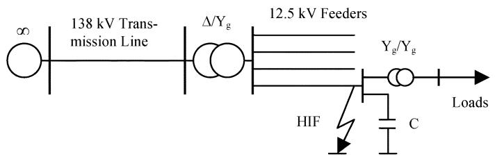
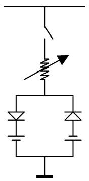
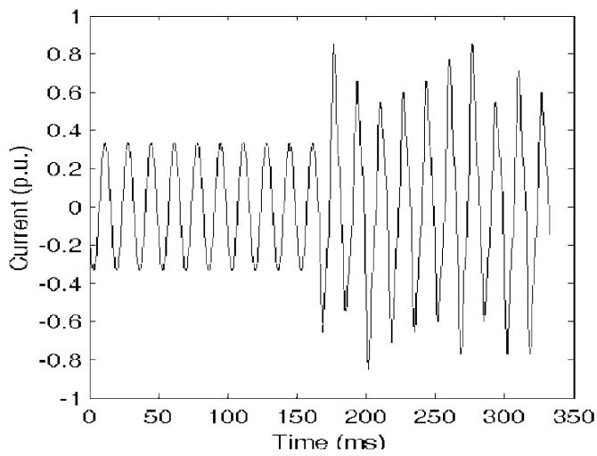
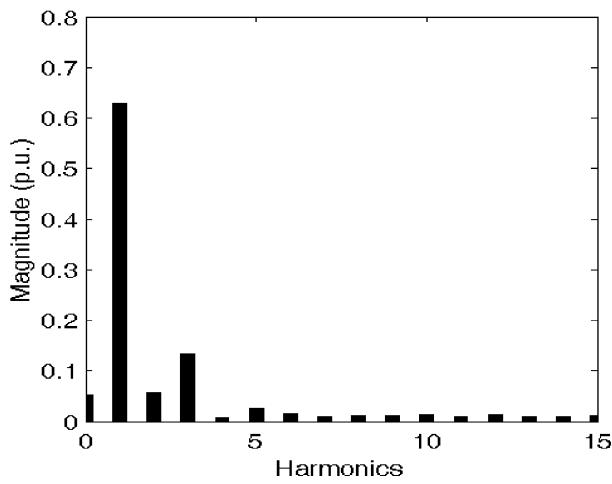
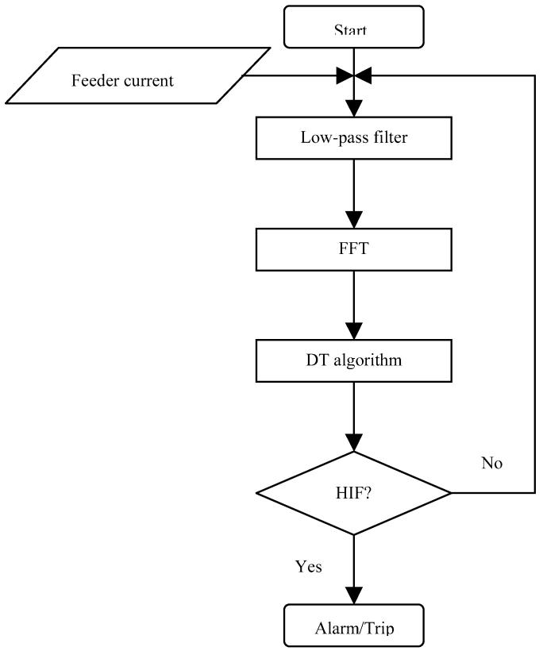

# Decision Tree-Based Methodology for High Impedance Fault Detection

Yong Sheng, Member, IEEE, and Steven M. Rovnyak, Member, IEEE

Abstract—This paper presents a high impedance fault (HIF) detection method based on decision trees (DTs). The features of HIF, which are the inputs of DTs, are those well-known ones, including current [in root mean square (rms)], magnitudes of the second, third, and fifth harmonics, and the phase of the third harmonics. The only measurements needed in the proposed method are the current signals sampled at 1920 Hz. It will reduce the cost of hardware compared with methods that use high sampling rates. A new HIF model is also used. The data of current signals are from the simulation of Electromagnetic Transients Program (EMTP). The DT algorithm trained can successfully distinguish the HIFs from most normal operations on simulation data, including switching loads, switching shunt capacitors, and load transformer inrush currents. Testing on experimental data is recommended for future work.

Index Terms—Arcing, decision trees, EMTP, harmonics, high impedance fault, protection, relay.

# I. INTRODUCTION

A high impedance fault (HIF) is the headache of most utilitiesfor its difficulty of being detected promptly and accurately. For the public safety and the potential huge expenses incurred if sued for any loss or damages resulting from an energized downed conductor [1], [2], utilities often install expensive and sophisticated commercial or self-developed HIF detection devices. Two most commonly installed commercial products are the Digital Feeder Monitor (DFM) from General Electric and the High Impedance Fault Analysis System (HIFAS) from Nordon Technologies [2].

This paper presents a decision tree (DT)-based solution with reasonable cost to utilities. Regarding the implementation, a microprocessor-based controller would perform the proposed DT and the harmonics calculations. The DT for the results reported here has 45 nodes, which was too large to show here but is straightforward to program. Execution of the trained DT algorithm is negligible compared to the harmonics calculations. DTs are to be trained offline from simulation and/or experimental data. DT training is relatively fast so updating with new data is a possibility. If the DT false trips for some reason, the DT could potentially be updated with the samples on which it falsely detected an HIF. The desired output for these samples would be set to no HIF.

Manuscript received September 6, 2002. This work was supported by the Louisiana Board of Regents through the Board of Regents Support Fund under Contract LEQSF(1999-02)-RD-A-25.

The authors are with the Electrical and Computer Engineering Department, Indiana University–Purdue University Indianapolis (IUPUI), IN 46202 USA.

Digital Object Identifier 10.1109/TPWRD.2003.820418

The DT uses only feeder current signals as these are standard substation relaying inputs. Also similar to what most researchers did, some of the feeder current harmonics are used in training the DTs. The DTs trained show excellent performance in 100 test cases. This technique is verified with the aid of Electromagnetic Transients Program (EMTP). The proposed method could also be trained using experimental data and those investigations are recommended using some or all of the techniques described in this paper.

# II. MODEL OF SIMULATIONS

The one-line diagram of a 60-Hz distribution system is given in Fig. 1. Four overhead feeders are connected to a 138/12.5-kV substation transformer, which is served by a 50-km transmission line from a bus considered to be infinite. Assume HIF faults occur near the end of a 5-km feeder that serves an industrial user having a load transformer and 1800 kVar of shunt capacitors. The loads have a lagging power factor equal to 0.80.

The modeling of most distribution system components is quite straightforward, including infinite source, transmission line, feeders, shunt capacitors, circuit breakers, and loads. For the transformers, BCTRAN, a supporting routine offered by EMTP to improve calculating transformer parameters, has been used to build their models. However, the most difficult model is HIF fault because most HIF phenomena involve arcing, which has not been accurately modeled so far. Some previous researchers have reached agreement that HIF is nonlinear and asymmetric, and modeling should include random and dynamic qualities of arcing. Emanuel et al. presented two dc sources connected in antiparallel with two diodes to simulate zero periods of arcing and asymmetry [3]. Yu and Khan used combinations of nonlinear resistors [4]. Wai and Xia introduced a sophisticated TACS switch controlling the open/close loop of HIF to reach nonlinearity and asymmetry [5]. In this paper, a more dynamic and random HIF model is applied. It combines most advantages of previous models proposed while it remains simple and universal.

The HIF model, as shown in Fig. 2, consists of a nonlinear resistor, two diodes, and two dc sources that change amplitudes randomly every half cycle. Thus, some dynamics and randomness are represented. Changing the mean and standard deviation of the dc source voltage amplitudes could be used to more closely approximate different ground surfaces such as asphalt, sand, or grass. A typical HIF current generated from simulations and its frequency spectrum are shown in Figs. 3 and 4. Compared with real-life HIF current waveforms that are appropriately conditioned and low-pass filtered, such as the one shown

  
Fig. 1. One-line diagram of a distribution system for simulations.

in [6, Fig. 8] by Russell and Chinchali, the current waveform in Fig. 3 shows a nearly perfect match.

# III. EMTP SIMULATIONS

The following events have been studied to distinguish HIF faults from normal operations: three-phase or single-phase load switching, shunt capacitor switching, no-load transformer switching, and HIF with or without downed conductor. For all load switching events, the power factor is kept unchanged, namely equal to 0.80. We also assume that no more than one event occurs simultaneously. EMTP input files, corresponding to different events, are generated by a C++ program according to the following rules.

# Training data:

• Phase of infinite source varies from 0 to 150 degrees in increments of 30 degrees for all events, namely, $0 , 3 0 , 6 0 , \ldots , 1 5 0$ degrees.   
• Six three-phase load changes: $3 0 \%  \ 7 0 \% , 7 0 \% $ $1 1 0 \% , 3 0 \%  1 1 0 \%$ .   
• Eight single-phase load changes: $3 0 \%  4 0 \% , 6 0 \% $ , , on each phase for a total of $8 \times 3 = 2 4$ load changes.   
• No-load transformer is energized and then cut off at different times in a cycle to obtain different remnant flux in the iron core of the load transformer. The cut off occurs at $1 / 1 2 , 2 / 1 2 , . . . ,$ and 12/12 cycle.   
• The following events were repeated for loads at 30%, 70%, and 110% of their base-case amounts.   
• Shunt capacitors are switched on or off.   
• Five random configurations are selected as described below and repeated for downed and not downed conductors for a total of 10 HIF events. In each configuration, the central value $V _ { C }$ is randomly selected from the set $\{ 1 0 0 0 , 2 0 0 0 , \ldots , 5 0 0 0 \}$ . The two dc sources are then set to $a _ { 1 } \ V _ { C }$ and $V _ { C }$ where $a _ { 1 }$ and are selected randomly from $\{ - 2 5 \% , - 2 0 \% , \ldots , 2 5 \% \}$ .

The grand total of training cases is hence equal to $6 \times ( 6 +$ $8 \times 3 + 1 2 + 3 \times ( 2 + 5 \times 2 ) ) = 4 6 8$ cases.

# Test data.

• Phase of infinite source equals a random value in the interval [0, 180] degrees. This notation means $0 ^ { \circ } < \phi <$ .   
• Twenty-five events of load switching. The loads are randomly either three phase or single phase. For single-phase switches, the initial load $L _ { 1 }$ is randomly selected from the interval [30%, 110%], and the load after switching is randomly selected from $[ L _ { 1 } - 1 0 \% , L _ { 1 } + 1 0 \% ]$ . Also, the switching occurs randomly on or off the monitored phase.

  
Fig. 2. HIF model.   
Fig. 3. Typical HIF current waveform generated from EMTP simulations.

  
Fig. 4. Spectrum of HIF current corresponding to Fig. 3.

For three-phase switches, both initial and final loads are randomly chosen from the interval [30%, 110%]. Switching between the two levels occurs at the starting moment of the eight-cycle window.

• Twenty-five events of no-load transformer switching. The cutoff time, after no-load transformer is energized, is randomly picked in the interval [0, 1] cycle.   
• Shunt capacitors have been randomly switched either on or off for 25 times with random loads in the interval [30%, 110%].

• Twenty-five events of HIF faults. The central value for the HIF model $V _ { C }$ is randomly selected from [1000, 5000] V, and two dc sources are chosen in the same way as for training events. The conductor is randomly either downed or not downed and the loads are randomly chosen in [30%, 110%].

The number of test cases is $2 5 \times 4 = 1 0 0$ .

One difficulty in EMTP simulations is to get random magnitudes of dc sources on every half cycle. In Fig. 2, it can be easily inferred that any dc source should change its magnitude during the open period of the diode with which it is in series. If bad timing occurs, abrupt changes will be observed on current waveforms. A C++ program, which implements trial and correction methodology, is used to find the appropriate changing times.

The output of EMTP is 32 points per cycle, which simulates a 1920-Hz sampling rate. In order to take advantage of the powerful computation ability of Matlab, the optional MCAT package has been installed for EMTP. The ICAT field in the second miscellaneous data card is set to 3 so that EMTP exports data in Matlab form.

# IV. EMTP RESULTS PROCESSING

Each simulation lasts ten cycles, of which eight cycles are picked up for further processing. Only current signals are processed and made available to DTs. The most commonly used features of HIF faults, which have been reinforced with either field or simulation data, including rms value, amplitudes of the second, third, and fifth harmonics relative to the rms value, and the phase of the third harmonics, are grouped into the input vectors of DTs. All of the values are calculated on a sliding one-cycle window, which consists of 32 sampling points. In order to make values comparable for different cases, amplitudes of harmonics have been normalized by dividing by the rms value of the signal over the window being analyzed. The window slides 1/8 cycle (four sampling points) between calculations. An eight-cycle interval contains 57 of these windows. Features calculated from one window together with the desired output are defined as a case and the eight-cycle interval is called an event so there are 57 cases per event and they all have the same desired output. The desired output is the output the DT algorithm is supposed to produce for that input vector. A Matlab program does all of the processing, including reading data from EMTP output files, doing fast Fourier transform (FFT), and writing input-output pairs into a data file in the format required by CART DT software [7].

The desired outputs yes or no are represented as 1 or 0. For the training set, 288 events or 16 416 cases have outputs of 0; 180 events or 10 260 cases have outputs of 1. For the test set, 25 events implying 1425 cases are associated with 1, and 75 events containing 4275 cases are paired with 0.

# V. DTS TRAINING AND TESTING

Pattern recognition is a learn-by-example mathematical tool, which is extremely useful for those problems that cannot be solved with analytical methods. For HIF detection problems,

several efforts have been made to implement pattern recognition methods. GE’s DFM is based on an expert system with nine algorithms [2]. Kim and Russell also proposed expert systems [8], and Ebron et al. introduced a neural network-based method verified with simulation data [9].

DT is also a type of pattern recognition tool, and is capable of classifying input vectors into discrete categories such as {0,1}. It is based on the principle that many separation boundaries can be approximated by combinations of hyperplanes that are parallel to the coordinate axes. The advantages of DTs include fast training compared with other popular pattern recognition tools, such as neural networks.

Four hundred and sixty-eight events containing 26 676 cases have been used to train the DTs. The DT training software, CART, allows the user to specify a parameter called relative misclassification cost, which can be used to adjust the frequency of the misclassification of 1 to 0 versus 0 to 1. This parameter specifies the consequence of misclassification. The misclassification cost for 0 to 1 is set to be ten times larger than the cost for 1 to 0 to make it much less likely for a 0 to be classified as a 1.

One-hundred events consisting of 5700 cases were used in testing the DTs previously trained. The raw DT output for these 5700 cases required further processing to decide whether the proposed DT-based controller produced the correct output for every case in the event. The criterion used here is similar to studies of R-Rdot relays [10] in which two consecutive 1’s from the DT are required to output yes from the DT-based relay. This also gives the reason of setting relative misclassification cost. For an event with a fault, it ideally should consist of 57 cases of 1’s. If the DT makes some mistakes and misclassifies some 1’s as 0’s, it can be seen that this event is more error tolerant even though numerous cases may have been misclassified. On the other hand, for an event with no fault, it is much more vulnerable to mistakes the DT may make. Two misclassifications of 0 as 1 result in a wrong judgment if they are consecutive.

The result on the test set of 100 events was perfect. The DTs distinguished all 25 events of HIF from 75 events of normal operations in two cycles. In other words, the DT, in fact, produced two consecutive 1 outputs during the first two cycles for every HIF in the test set. No false operations occurred during the entire eight cycles of each normal event.

# VI. IMPLEMENTATION AND COST EVALUATION

The implementation of this method is straightforward, consisting of three functional processes, as shown in Fig. 5.

To get rid of white noise and other high-frequency components, the current signals from feeders are low-pass filtered. This conditioning can be realized by digital or analog filters. The remaining signals are decomposed into harmonics by FFT. The trained DT algorithm makes the judgment according to those selected harmonic features. The training of the DT algorithm is offline. The online implementation is very fast.

Our implementation does not require any new measurement equipment. All of the necessary features are derived from standard substation relay inputs. The sample rate of 1920 Hz is lower than some other schemes reported in the literature. The DT algorithm needs to be run on a microprocessor-based controller

  
Fig. 5. Flowchart of the DT-based implementation.

in order to make the decisions proposed in this paper. For most utilities, it is standard equipment. Most of the cost is in algorithm development which, for a pattern recognition approach, involves data gathering and/or simulation.

# VII. CONCLUSION

A decision tree-based method is proposed to detect HIF faults using the well-known features: phase current (in rms), magnitudes of the second, third, and fifth harmonics, and the phase of the third harmonics. Excellent results are obtained on simulation data using EMTP. The DT training and testing could also be performed on experimental data and doing so appears to be promising. Another requirement for HIF detectors is low cost. The only measurements required for the method proposed here are the current signals for each phase sampled at the rate of 1920 Hz.

A new HIF model is also presented in this paper. The HIF model consists of a nonlinear resistor, two diodes, and two dc sources that change amplitudes randomly every half cycle. Thus, some dynamics and randomness are represented in the randomly changing dc values.

DTs were previously demonstrated for power transformer protection (TP) using EMTP simulations [11]. Wavelet coefficients derived from the one-cycle window were shown to improve the performance of DTs for TP. Perhaps wavelet

coefficients could be used to improve the performance of DTs for HIF detection on experimental data in case the need arises.

# REFERENCES

[1] 1999 Closed Electric Claims. Associated Electric & Gas Insurance Services Limited (AEGIS). [Online]. Available: http://www.aegislimited.com/LossControl/RMLL/electric_closed.htm   
[2] (1996) High Impedance Fault Detection Technology. PSRC Working Group D15. [Online]. Available: http://grouper.ieee.org/groups/td/dist/documents/highz.pdf   
[3] A. E. Emanuel, D. Cyganski, J. A. Orr, S. Shiller, and E. M. Gulachenski, “High impedance fault arcing on sandy soil in 15 kV distribution feeders: Contributions to the evaluation of the low frequency spectrum,” IEEE Trans. Power Delivery, vol. 5, pp. 676–684, Apr. 1990.   
[4] D. C. Yu and S. H. Khan, “An adaptive high and low impedance fault detection method,” IEEE Trans. Power Delivery, vol. 9, pp. 1812–1818, Oct. 1994.   
[5] D. C. Wai and Y. Xia, “A novel technique for high impedance fault identification,” IEEE Trans. Power Delivery, vol. 13, pp. 738–744, July 1998.   
[6] B. D. Russell and R. P. Chinchali, “A digital signal processing algorithm for detecting arcing faults on power distribution feeders,” IEEE Trans. Power Delivery, vol. 4, pp. 132–138, Jan. 1989.   
[7] . [Online]. Available: http://www.salford-systems.com   
[8] C. J. Kim and B. D. Russell, “Classification of faults and switching events by inductive reasoning and expert system methodology,” IEEE Trans. Power Delivery, vol. 4, pp. 1631–1637, July 1989.   
[9] S. Ebron, S. L. Lubkeman, and M. White, “A neural network approach to the detection of incipient faults on power distribution feeders,” IEEE Trans. Power Delivery, vol. 5, pp. 905–912, Apr. 1990.   
[10] S. M. Rovnyak, C. W. Taylor, and Y. Sheng, “Decision trees using apparent resistance to detect impending loss of synchronism,” IEEE Trans. Power Delivery, vol. 15, pp. 1157–1162, Oct. 2000.   
[11] Y. Sheng and S. M. Rovnyak, “Decision trees and wavelet analysis for power transformer protection,” IEEE Trans. Power Delivery, vol. 17, pp. 429–433, Apr. 2002.

Yong Sheng (S’00–M’03) received the B.S. degree in electrical engineering from Shanghai Jiao Tong University, Shanghai, China, the M.S. degree in electrical engineering from China Electric Power Research Institute, Beijing, China, and the Ph.D. degree in computational analysis and modeling from Louisiana Tech University, Ruston, LA, in 1989, 1992, and 2002, respectively.

From 1992 to 1997, he was an Electrical Engineer with China Electric Power Research Institute. He was a Visiting Assistant Professor of Computer Information Systems with Grambling State University, Grambling, LA. He became Postdoctoral Fellow at Indiana University–Purdue University Indianapolis in 2004.

Steven Rovnyak (S’89–M’95) was born in Lafayette, IN, on July 4, 1966. He received the B.A. degree in mathematics in 1988, and the B.S., M.S., and Ph.D. degrees in electrical engineering from Cornell University, Ithaca, NY, in 1988, 1990, and 1994, respectively.

Currently, he is an Assistant Professor of electrical and computer engineering at Indiana University–Purdue University Indianapolis (IUPUI). Previously, he was an Assistant Professor of Electrical Engineering at Louisiana Tech University, Ruston, and spent two years as a Postdoctoral Associate with Cornell University. He was with the Electric Power Research Institute, working on projects while he was a graduate student and Postdoctoral Assistant at Cornell University. He has developed algorithms to process wide-area monitoring system (WAMS) data with grant support from Entergy Transmission. His research interests include the development of pattern recognition methodologies for protective relaying and for one-shot stability controls.

Dr. Rovnyak is a member of Phi Beta Kappa and Phi Kappa Phi honor societies.