# Hybrid SVC-VSC modeling approaches for hardware-in-the-loop simulation

P. Le-Huy * , O. Tremblay

Power System Simulation group at IREQ, Hydro-Qu´ebec’s research center, 1800 boul. Lionel-Boulet, Varennes, Qu´ebec, J3 × 1S1, Canada

# A R T I C L E I N F O

Keywords:

Electromagnetic transient simulation

Hardware-in-the-loop

Modular multilevel converter

Real-time

Static var compensator

# A B S T R A C T

Hydro-Qu´ebec built two static var compensators at the 735-kV La Verendrye substation in 1985. Each has a capacity of +330/-110 Mvar to help regulate system voltage and power system dynamic. They exceeded their useful life, and their operation was becoming challenging due to the aging control technology. Spare part availability and cost were also becoming an issue. A refurbishment project was thus undertaken. Due to design constraints, a hybrid SVC was selected: traditional thyristor-switched capacitors are used, but thyristorcontrolled inductors are replaced by full-bridge modular multilevel converters.

Throughout the ongoing project, hardware-in-the-loop real-time simulation was used for dynamic performance testing, factory acceptance tests and pre-commissioning studies. Two modeling approaches were used to represent the hybrid SVC: conventional electromagnetic transient simulation and small time-step approach. As this paper demonstrates, both approaches are valid in this case and produce matching results if simulation contrivances are not neglected.

# 1. Introduction

HYDRO-QUEBEC ´ (HQ) installed several reactive power compensators in the 1980s and 1990s to help power transmission between the La Grande power generation complex and the load centers in the south of the Qu´ebec province [1–3] (see Fig. 1). Different technologies were explored and installed but most were static var compensators (SVC) with thyristor-controlled reactors (TCR) and thyristor-switched capacitors (TSC). In La V´erendrye 735-kV substation, two SVCs were built in 1985 with a capacity of +330/− 110 Mvar each. The SVC coupling transformer secondary was selected to operate at 16 kV, and filtering of the TCR harmonics was not implemented at that time. As time went by, operation of the twin SVCs became more challenging, and availability and cost of parts also became an issue.

In the early 2010s, refurbishment projects for the La Grande corridor SVCs were initiated and pre-project work was done for the La Verendrye SVCs. After careful consideration, it was decided to keep the SVC coupling single-phase transformers and perform a thorough overhaul on them. The selected refurbishment technology relies on voltage-source converters (VSC), more precisely on modular multilevel converters (MMC) using full-bridge (FB) submodules (SM) [4]. However, as the previous SVC was operating with a 16-kV secondary, providing the same Mvar capacity with solely MMC technology was non-optimal due to the

current limitation of power electronic used in MMCs. Classical TSCs were thus added to the mix to reach the required capacitive Mvar capability. This hybrid SVC-VSC is also advantageous space-wise as the original layout didn’t include space for filtering, which would be required today for optimal use of conventional TCRs.

Conventional SVC technology is well known and its modeling in realtime (RT) electromagnetic transient (EMT) simulation tools for hardware-in-the-loop (HIL) testing is well mastered. However, MMC technology, despite generating significant scientific papers, is not yet as widespread as thyristor-based apparatus. In fact, it is quite new at HQ: the La Verendrye project is the first HQ equipment based on MMC technology. Nevertheless, the HQ research center has been involved in MMC modeling since the early 2010s to adapt and prepare its RT simulation capabilities to cope with this technology [5–6].

Throughout this ongoing project, control HIL was used in several key steps, such as the dynamic performance study (DPS), the factory acceptance tests (FAT) and the pre-commissioning studies. The first two activities were conducted mainly by the manufacturer using RT EMT simulations with small time-steps $( t _ { s } < 5 ~ \mu s )$ . Both the real control and protection system and the replica were tested with this approach. Following the FAT, both control systems were prepared for relocation: the real system was prepared for site deployment while the replica was sent to the HQ research center (IREQ) for pre-commissioning testing,

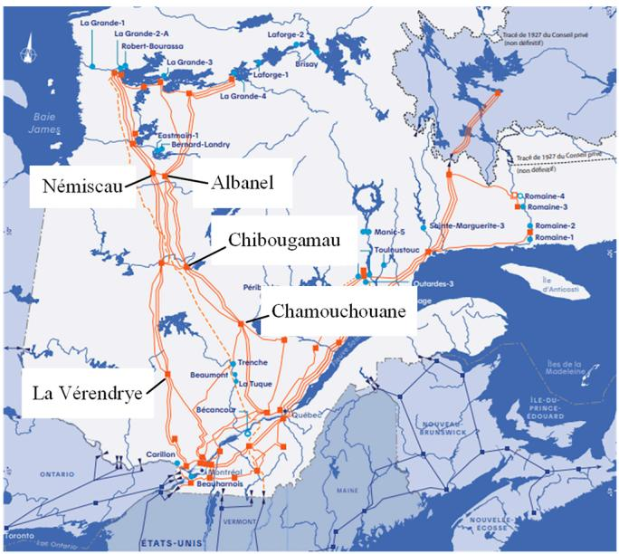  
Fig. 1. HQ La Grande 735-kV transmission corridor and its SVC substations. Abitibi, the 735-kV substation west of Chibougamau has two synchronous condensers instead of SVCs.

where it was connected to HQ RT simulator (RTS) using conventional RT EMT simulation $( t _ { s } > 2 0 ~ \mu s )$ .

In recent years, HQ, through various HIL projects (both HVDC and compensation systems), was exposed to assertive and zealous promotion of the idea that the sole valid possibility for HIL is the small time-step approach, regardless of the project details and specifications. The purpose of this paper is to share HQ’s experience modeling this hybrid SVC and to demonstrate that these two modeling approaches, when used properly, are valid in this case, and generate matching results. This paper, through this demonstration, aims to bring a more nuanced view to the HIL time-step issue and shed light on the often neglected impact of the small time-step contrivances.

Section II gives more details on the La Verendrye hybrid SVC, while Section III concentrates on its control and protection system. Section IV further discusses the modeling approaches used in this project, and Section V presents comparative results. Finally, after a short summary, general remarks and future work are provided in Section VI.

# 2. La Verendrye static var compensation

Initially, the La Verendrye compensation was comprised of a single TCR and three TSC for a total capacity of +330/− 110 Mvar per SVC. The same capacity is retained with the hybrid SVC, but it is now provided by 2 VSC branches and 2 TSC branches as shown in Fig. 2. Each TSC has a 95 Mvar capacity while each VSC branch is a delta-connected FB MMC sporting 22 SMs per phase. The current capacity is 1.45 kA, for a maximum contribution of 70 Mvar per branch. The SVC can be operated with one or two VSCs. If all VSCs are in service, they always operate with the same current order. This ensures that no circulating current appears between the two VSCs as they synthesize the same voltage waveforms.

# 3. Hybrid control system

The La Verendrye control and protection system replica is comprised of 7 cabinets as illustrated in Fig. 3. To the complete right is the protection cabinet followed to its left by 5 main control cabinets and to the complete left is the low-level control housing the power module management system (MMS) and the MMC simulator (MMCsim), a special rack used to simulate the SMs.

HV Bus - 735 kV/60 Hz

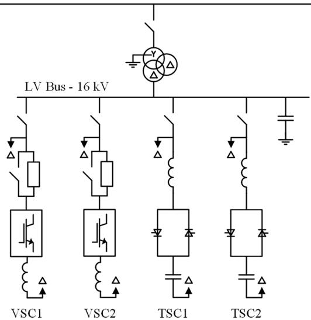  
Fig. 2. La Verendrye hybrid SVC one-line diagram.

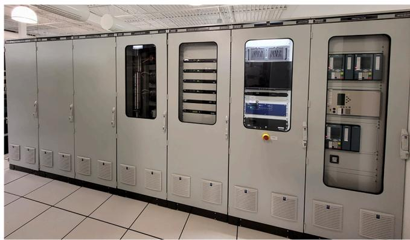  
Fig. 3. La Verendrye control system replica in the HQ RT simulation laboratory (in IREQ).

# 3.1. Main control cabinet

Responsible for all control functions, the control system replica is comprised of five cabinets: the human-machine interface (HMI) cabinet (second from the right in Fig. 3), the communication interface cabinet (third from the right), the binary interface cabinet (in the middle) and the main SVC control cabinet (second and third from the left).

• The HMI cabinet contains the operator’s console as well as all the computers (HMI computer, engineering workstation and digital transient fault recorder data server).   
• The communication interface cabinet contains switches and firewall units as well as the GPS clock. Protocol converters are also in that cabinet.   
• The binary interface cabinet handles status for the cooling system, the switchyard and controller messages.   
• The main SVC control cabinet houses the main control rack, IO modules and signal processing.

# 3.2. MMCsim

To simulate the MMCs, a special rack, called the MMCsim is used (see Fig. 4). This rack is connected to the control system through fiber optics (FO) to the MMS: the MMS sends the gating signal to the MMCsim which sends back the SM capacitor voltages. The MMS is connected to the RTS

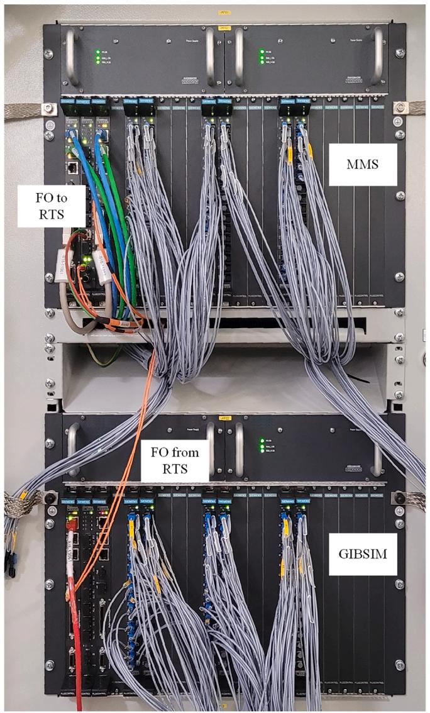  
Fig. 4. MMCsim rack and its FO connections to the main control system. FO to and from the RTS are also indicated (orange FO).

with FO to send the MMC equivalent voltages $V _ { O n }$ and $V _ { B l o c k }$ while a second FO carries the arm currents back from the RTS to the MMCsim (see Fig. 5B). The MMCsim refresh rate is 512 points per cycle, which gives a period of 32.5521 μs. The MMCsim was used for all HIL setup in both small and regular time-step. During FAT, the real control and protection system was connected to two MMCsim units while the control replica used a single MMCsim to emulate both VSC branches.

As illustrated in ${ \mathrm { F i g . } } 5 ,$ the task of the MMCsim is to make the bridge between the RTS and the MMS without revealing the IGBT pulse patterns as everything is kept internal to the control system. The RTS receives from the MMS equivalent voltages representing the VSC (Vconv and $V _ { b l k } )$ . The EMT simulation model that must be used in the RTS to represent each valve (or stack of 22 SMs in this case) of the VSC is also illustrated in Fig. 5. The diodes in the model allow the representation of the natural commutation phenomenon of the SMs, enabling the simulation of the charging sequence and their proper behavior during system over-voltages. The six arm currents $\left( I _ { a r m } \right)$ flowing through the delta branches of the VSCs are sent back to the MMCsim. With the IGBT pulses sent from the MMS and arm currents from the RTS, the MMCsim is able to calculate each SM’s capacitor voltage, which are then sent to the MMS. Finally, the MMS calculates, from the updated capacitor voltages, the equivalent voltage-source values to send to the RTS, effectively closing the loop.

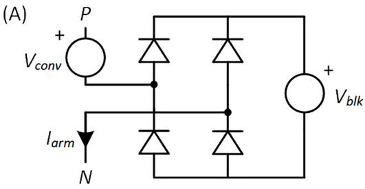

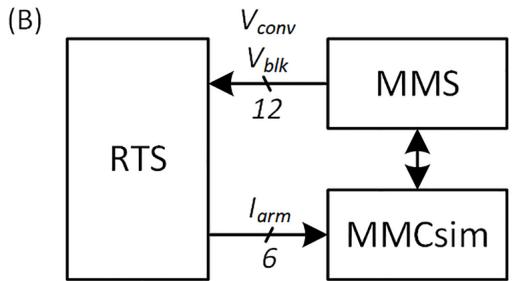  
Fig. 5. (A) EMT modeling of a FB-MMC delta branch and (B) RTS FO connections to MMS and MMCsim for VSC modeling.

# 3.3. Control architecture

For the simulation, the control system replica appears as a “physical black box”. As such, the control system’s exact architecture and implementation details are undisclosed and unknown. However, the control system architecture can conceptually be illustrated as in Fig. 6. High level control functions (measurement, synchronization, voltage regulation and current limiter) are the same as classical thyristor-based SVC control. The main difference resides in the distribution unit, as it must manage reactive power output of the compensator with classical TSC branches and VSCs. The VSC branches are used in the same manners as classical TCRs: to produce inductive reactive power, to fine tune the overall reactive power output and to smooth TSC switch-in/out. Contrary to TCRs, VSC branches can produce both inductive and capacitive reactive power: activation thresholds in the distribution unit are adjusted accordingly.

# 4. Simulation approaches

As mentioned previously, the DPS and FAT control-HIL relied on small time-step representation in the RTS. The following step in the project, the pre-commissioning study, used the standard approach with larger time-step.

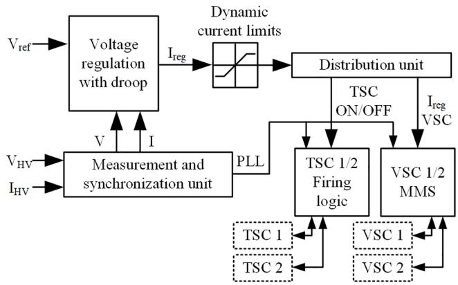  
Fig. 6. Hybrid SVC conceptual control architecture.

# 4.1. Dynamic performance simulations and factory acceptance tests

The simulation setup used for these two activities is illustrated in Fig. 7. The real control system was connected to two MMCsims while the replica only used one. Aside from this small difference, both HIL setups used the same approach. A time-step of 3 μs was used.

In order to execute with such small time-steps, the RTS imposes several constraints on the simulated power system. The first obvious constraint is that not all the components are supported in small time-step mode. Basic components are obviously supported, and several small time-step optimized super models are highly recommended (e.g., basic converters, SVC branches, etc.). There is also a limitation on the number of simulated nodes: a maximum of 30 single-phase nodes can be simulated in one small time-step task. The third main limitation of the small time-step mode is the representation of the power electronics: each small time-step task can only represent six standard $R _ { o n } / R _ { o f f }$ switches, the others must be represented as Pejovic (also known as LC switches) [7]. As seen in Fig. 8, this modeling technique represents switches in conduction as a small inductor L and open switches as a series RC branch, both type of branch with equivalent resistance given by:

$$
R _ {e q} = \frac {2 L}{\Delta T} = R + \frac {\Delta T}{2 C}. \tag {1}
$$

Ihist is calculated according to the state of the switch following the original EMTP formulation [8]. The standard guideline to choose the Pejovic switch parameters are based on the time-step ΔT, the switched current i and voltage v as well as a damping factor δ according to the following equations [9–10].

$$
F = \frac {1}{2 \left(\sqrt {\delta^ {2} + 1} - \delta\right)} \tag {2}
$$

$$
L = \frac {\sqrt {2} \Delta T F _ {V}}{i} \tag {3}
$$

$$
C = \frac {(\Delta T F) ^ {2}}{L} \tag {4}
$$

$$
R = \frac {2 L}{\Delta T} - \frac {\Delta T}{2 C} \tag {5}
$$

The great quality of this modeling technique is the constant $R _ { e q }$ that allows the use of the same admittance matrix for all combinations of switch state in the simulated system. This saves time for software performing refactoring at runtime, and it saves memory for software that pre-calculates all possible matrices. However, this modeling is notorious for producing uncharacteristic losses and noise, even when using timesteps in the range of 1–3 μs [11].

In light of these limitations and the complexity of the La Verendrye substation, one understands why that the small time-step simulated system contains stub lines to separate tasks and numerous Pejovic switches to represent various disconnectors and breakers.

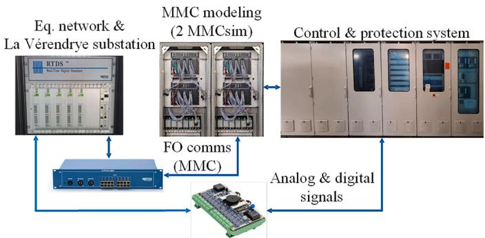  
Fig. 7. Control system HIL setup for DPS and FAT.

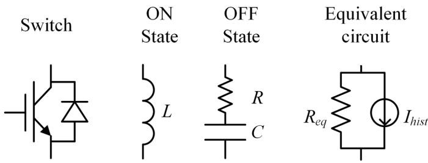  
Fig. 8. Pejovic switch model for fast EMT simulations.

IOs are generated at the same time-step as the rest of the simulation, providing a very high refresh rate compared to the MMCsim, operating at a time-step of 32.5521 μs.

At the end of the FAT, a series of benchmark tests are performed on the real control system. The purpose of these tests is to capture the control system behavior in a set of known simulation conditions. All non-linearities are removed from the simulation to facilitate repeating the tests on the IREQ setup. Reproducing the benchmark tests on the IREQ replica is the final step for the validation and acceptation of the replica as being an adequate representation of the real control system.

# 4.2. Pre-commissioning study

A standard HIL simulation is used to perform the pre-commissioning study (see Fig. 9). A time-step of 32.5521 μs is used. The simulation runs on an HP Z8 gen 4 workstation (dual Intel Scalable Gold 6244 but only three cores are required) and the IOs and the FO communication are handled by an Opal-RT OP5607. In addition to all the electrical components, all the switchgear is represented in HYPERSIM (as $R _ { o n } / R _ { o f f }$ switches): related control signals and status indication are exchanged through digital IOs with the control system.

The content of the simulation schematic is given in Table 1. The simulation is divided across three processing cores: one for the multipole equivalent network and primary side power components; one for the coupling transformer and all the power elements on the secondary side, including both VSCs, both TSCs and all disconnectors; and one for all the control blocks required for various IO preparation, switchgear logic and internal logic.

# 5. Comparative results

Prior to conducting all required pre-commissioning testing, the IREQ setup needs to be validated by first repeating the benchmark tests initially performed during the FAT.

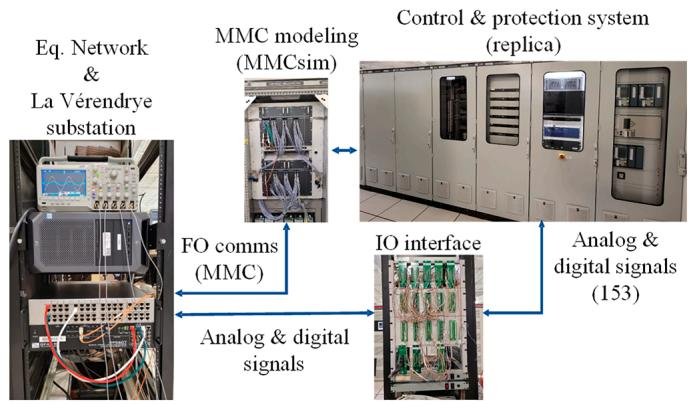  
Fig. 9. Replica HIL setup for pre-commissioning studies.

Table 1 IREQ Simulation schematic content by task.   

<table><tr><td>Power system element</td><td>Task 1</td><td>Task 2</td><td>Task 3</td></tr><tr><td>Electrical node</td><td>14</td><td>85</td><td>Only control blocks</td></tr><tr><td>Single-phase transformer</td><td>0</td><td>9</td><td></td></tr><tr><td>RLC</td><td>21</td><td>86</td><td></td></tr><tr><td>I/V source</td><td>6</td><td>18</td><td></td></tr><tr><td>Non-linear</td><td>0</td><td>21</td><td></td></tr><tr><td>Ron/Roff Switch</td><td>7</td><td>55</td><td></td></tr><tr><td>IO</td><td>153</td><td></td><td></td></tr></table>

# 5.1. Initial results

After removing all non-linearities and placing the IREQ setup in the same condition as the FAT system, a first batch of results were harvested and analyzed, yielding Figs. 10 and 11. The inductive part of the V-Q curve matches very well. The disturbances near 50 and 135 capacitive Mvars are related to TSC operations: they are highly dependent on the exact switching time and the system conditions. As a result, the disturbances are highly variable, and an exact reproduction of this behavior is not expected. However, the capacitive part outside the regulated zone should match and a 5 Mvar discrepancy is highly unexpected. From the branches’ currents in Fig. 11, it is obvious that the TSC behavior is different as there is a 40 A difference between both sets of results. While in the regulated zone, the VSCs are able to compensate, leading to slightly different currents as well. This explains why the V-Q is only different outside of the regulated zone.

# 5.2. Observations

Initial investigations focused on branch parameters as well as all the other components in the simulation. All parameters in both FAT and IREQ simulation schematics were identical. Further investigations then focused on parasitic elements introduced in small time-step modeling: stub line and Pejovic switches.

As illustrated in Fig. 12, a stub line for a 3 μs simulation introduces a transmission line with a series inductor of 40 μH and a shunt capacitance of 239 nF. Using (2) and (3) with the switch parameters give a Pejovic inductor of 90 μH. In the FAT setup, due to small time-step simulation constraints, a stub line is necessary between the VSCs and the TSCs on the secondary side of the compensator transformer as illustrated in Fig. 12. The disconnectors, which are closed for the entire duration of the V-Q simulation, are all represented as Pejovic switches in addition to all the diodes in both VSCs.

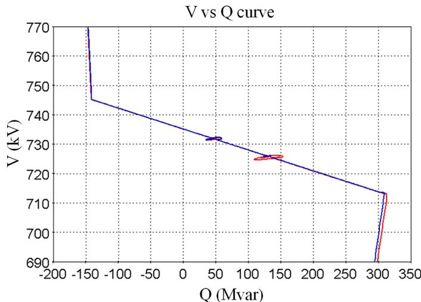  
Fig. 10. V-Q curve comparison between FAT (blue) and IREQ (red) replica simulations (inductive var are negative).

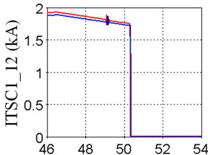  
RMS current (phase AB)

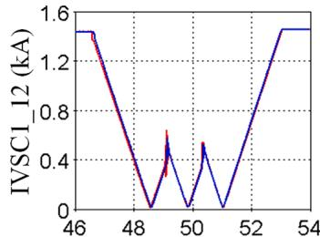

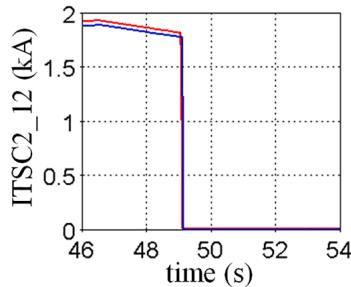

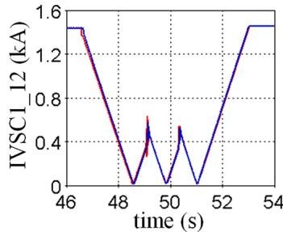  
Fig. 11. Reactive branch currents: comparison of FAT (blue) and IREQ (red) simulation results.

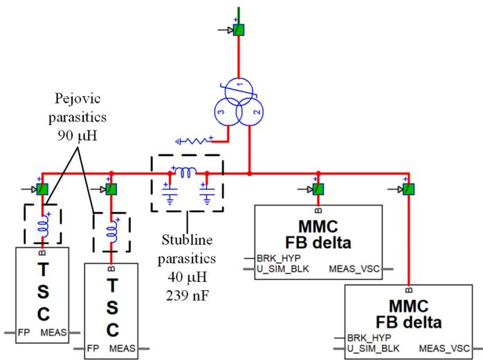  
Fig. 12. Stub line and Pejovic switch used in small time-step modeling reproduced in the IREQ simulation environment.

# 5.3. Modified simulation results

These parasitic values seemed negligeable at first glance but, for thoroughness’ sake, they were included in the IREQ simulation schematic, illustrated in Fig. 12. Results obtained from the V-Q benchmark test with this simulation schematic are presented in Figs. 13 and 14.

The match is excellent: the parasitic elements introduced to operate with a small time-step have a non-negligeable impact on the simulation and they need to be considered for a proper validation of the control system replica. To complete the benchmark validation procedure, the parasitic elements were obviously kept in the IREQ simulation schematic. An example of the results obtained for a six-cycle three-phase to ground fault are illustrated in Fig. 15: the results are closely matched but the small time-step delay as well as the difference in simulation timestep can be seen on the reactive power QSVC fault recovery waveform. The replica validation was easily and swiftly completed since all benchmark tests were matching as good as illustrated in Fig. 15 and no discrepancies were found.

As demonstrated with this case, both small time-step and regular

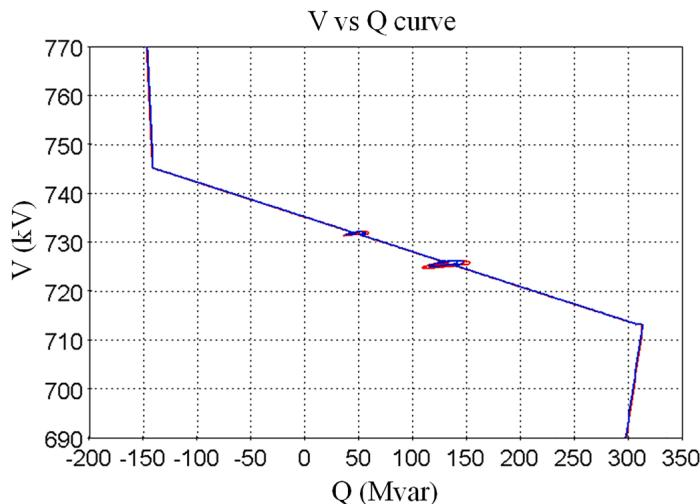  
Fig. 13. V-Q curve comparison between FAT (blue) and IREQ (red) replica simulations after modifications.

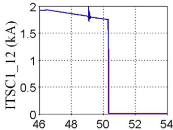  
RMS current (phase AB)

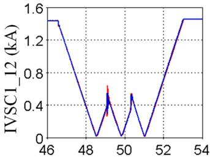

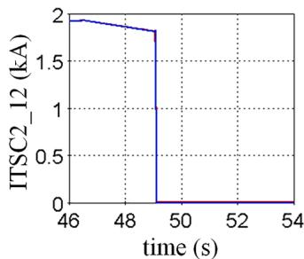

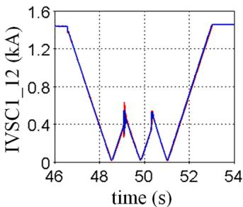  
Fig. 14. Reactive branch currents: comparison of FAT (blue) and IREQ (red) simulation results after modifications.

simulation can be used to adequately represent this VSC-based installation. Both simulation approaches give extremely close results when a fair comparison is made, i.e., when simulating the same system, including all extra and hidden components in each simulation tool.

# 6. Conclusion

The La Verendrye refurbishment project is the first HQ project based on VSC technology, more precisely, on MMC technology. Prior to the FAT and pre-commissioning testing, several questions remained unanswered regarding the VSC modeling and the pros and cons of the two simulation approaches. On one hand, the small time-step approach is highly advantageous regarding the refresh rate and the closed-loop time, but it presents limitations on system size and power electronic representation. On the other hand, at the price of reduced refresh rate, those limitations are lifted with regular simulation: large-scale power system representations can be used instead of simplified system equivalents and detailed representation of non-linear equipment can be simulated.

However, as demonstrated in this paper, for this case both

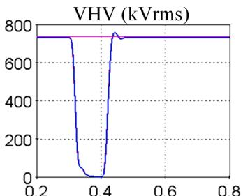

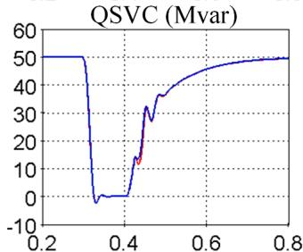

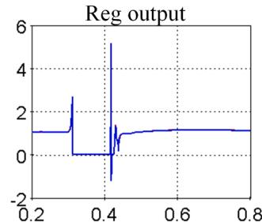

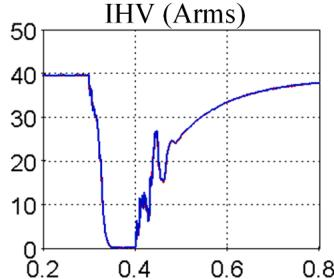  
Fig. 15. Waveform for a six-cycle three-phase fault to ground at the coupling transformer primary side (FAT setup red, IREQ setup blue).

approaches give results that match very well. To achieve such a good match, care must be taken to properly represent the same system in both simulation tools, including both hidden components or parasitic introduced by simulation artifices.

Now that the simulation approach for the IREQ setup has been validated and that the benchmark procedure has passed with flying colors, the La Verendrye substation modeling has been enhanced with detailed non-linear component representations and more complex system equivalents to provide the most representative simulation as possible to further de-risk the commissioning process, to perfectly tune the control system settings and all around optimize system performances.

# CRediT authorship contribution statement

P. Le-Huy: Conceptualization, Methodology, Validation, Formal analysis, Investigation, Writing – original draft, Writing – review & editing, Visualization, Project administration. O. Tremblay: Conceptualization, Methodology, Validation, Formal analysis, Investigation, Writing – review & editing, Visualization.

# Declaration of Competing Interest

The authors declare that they have no known competing financial interests or personal relationships that could have appeared to influence the work reported in this paper.

# Data availability

Data will be made available on request.

# References

[1] L. Gerin-Lajoie, G. Scott, S. Breault, E.V. Larsen, D.H. Baker, A.F. Imece, Hydro-Quebec multiple SVC application control stability study, IEEE Trans. Power Del. 5 (3) (1990) 1543–1551.   
[2] G. Trudel, S. Bernard, G. Scott, Hydro-Qu´ebec’s defense plan against extreme contingencies, IEEE Trans. Power Syst. 14 (3) (1999) 958–966.   
[3] Q. Bui-Van, M. Rousseau, Control of over-voltages on hydro-Qu´ebec’s 735-kV series-compensated system during a major electro-mechanical transient disturbance, in: IPST 2001, Rio de Janeiro, Brazil, June 24-28, 2001.   
[4] M. Pereira, D. Retzmann, J. Lottes, M. Wiesinger, G. Wong, SVC PLUS: an MMC STATCOM for network and grid access applications, in: IEEE PowerTech 2011, Trondheim, Norway, June 19-23, 2011.

[5] P. Le-Huy, P. Giroux, J.-C. Soumagne, Real-time simulation of modular multilevel converters for network integration studies, in: IPST 2011, Delft, the Netherlands, June 14-17, 2011.   
[6] P. Le-Huy, O. Tremblay, P. Giroux, J.-C. Soumagne, D. McNabb, Detailed fullbridge modular multilevel STATCOM modeling for real-time commissioning studies, in: IPST 2013, Vancouver, Canada July 18-20, 2013.   
[7] P. Pejovic, D. Maksimovic, A method of fast time-domain simulation of networks with switches, IEEE Trans. Power Electron. 9 (4) (1994) 449–456.

[8] H.W. Dommel, Digital computer solution of electromagnetic transients in single and multiphase networks, IEEE Trans. Power Appar. Syst. (4) (1969) 388–399. PAS-88.   
[9] T. Maguire, J. Giesbrecht, Small time-step (< 2μSec) VSC model for the real time digital simulator, in: IPST 2005, Montr´eal, Canada, June 19-23, 2005.   
[10] P.A. Forsyth, T.L. Maguire, D. Shearer, D. Rydmell, Testing firing pulse controls for a VSC based HVDC scheme with a real time timestep < 3 us, in: IPST’09, Kyoto, Japan, June 2-6, 2009.   
[11] L. Qi, S. Woodruff, M. Steurer, Study of power loss of small time-step VSC model in RTDS, in: 2007 IEEE PES General Meeting, Tampa, USA, June 24-28, 2007.