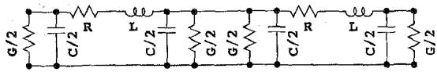
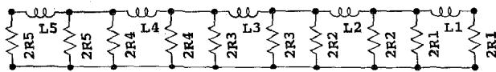
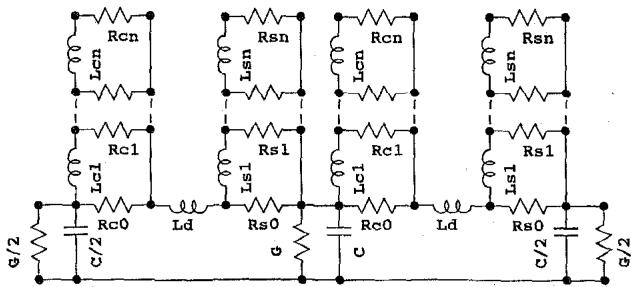
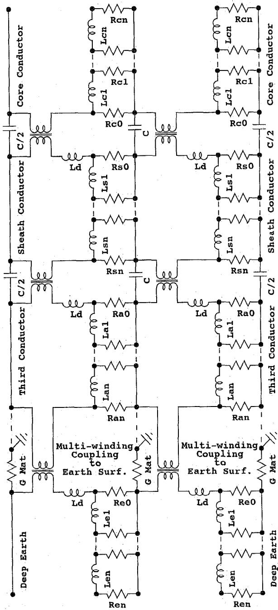
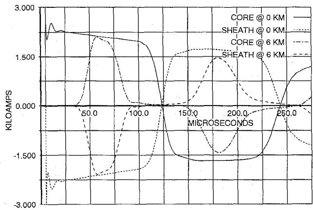
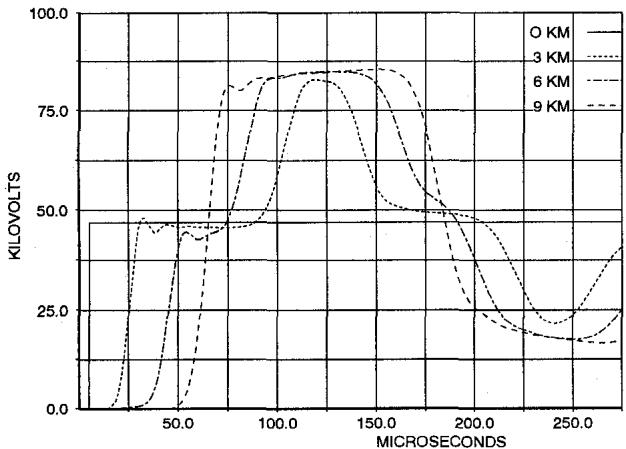
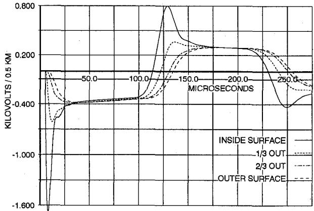
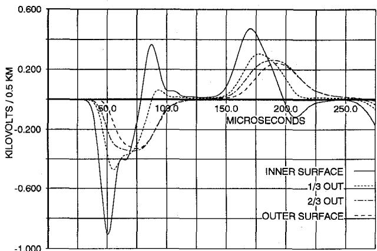
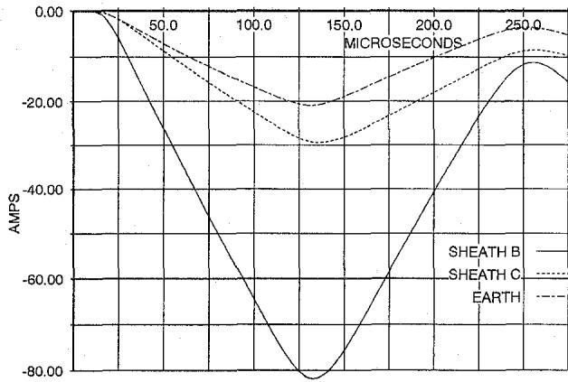
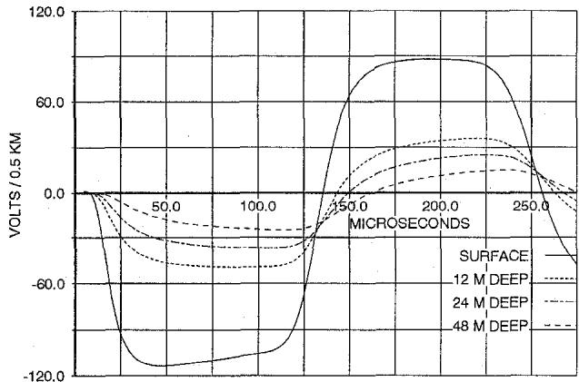

# EMTP MODELING OF ELECTROMAGNETIC TRANSIENTS IN MULTI-MODE COAXIAL CABLES BY FINITE SECTIONS

Robert J. Meredith

Member IEEE New York Power Authority, White Plains, New York 10601

Abstract -- This paper introduces a way of modeling electromagnetic propagation in conductive materials, termed the method of finite sections. It addresses the issues of modeling frequency-dependent impedances and frequency-dependent coupling of conductors. Its use is demonstrated by application to transient modeling of a multi-mode coaxial cable system in the Electromagnetic Transients Program (EMTP), a situation which currently eludes accurate representation.

In addition to its use in modeling coaxial cables, the method is applicable to modeling of overhead lines, pipe-type cables, transformer cores and walls, lightning arrestors and other situations in which sufficient planar or cylindrical symmetry exists. The method provides the only accurate EMTP means of modeling wave propagation in non-linear resistive and/or inductive conductors.

Key Words -- Electromagnetic propagation, EMTP, transients, frequency-dependency, non-linear, finite sections, pi sections, cables.

# I. INTRODUCTION

EMTP modeling of frequency-dependent resistances and reactances in transformer cores, transmission lines and cables is usually difficult for the typical user to implement, to understand and to verify. An example of this complexity is the approach of J. Marti [1] that has been implemented for transmission line and sometimes cable modeling in various versions of EMTP [2]. Its underlying principles include transformations from phase domain to modal domain, frequency-fitted modal attenuation and re-transformation to phase domain. Unfortunately even this complexity does not work adequately for most cable systems, whose natural propagation modes vary dramatically with frequency and thus are not amenable to use of J. Marti's constant transform assumption.

96 SM 437-4 PWRD A paper recommended and approved by the IEEE Transmission and Distribution Committee of the IEEE Power Engineering Society for presentation at the 1996 IEEE/PES Summer Meeting, July 28 - August 1, 1996, Denver, Colorado. Manuscript submitted December 27, 1995; made available for printing June 12, 1996.

At least two other complex approaches in the literature claim to overcome some of the cable modeling problems in J. Marti's approach. L. Marti [3] claims to be able to vary the modal transform as well as the modal characteristics with frequency. T. Noda, et al [4] claims to be able to work in phase domain, using an "auto-regressive moving average" (ARMA) computational method. Implementation of the L. Marti approach has been less than universal, perhaps due to fundamental technical problems documented in [5]. The T. Noda approach is currently being implemented in at least one version of EMTP, but has not been made generally available as of this writing.

All three of the above approaches start with steady-state impedance scans of the line or cable of interest, which this author believes ignores at least two effects in coaxial cables: wave reflections at the centers of conductors and at the sheath/earth transition, as well as propagation delays in traversing the sheath. The steady-state starting points for the existing methods both fail to recognize the existence of transient conductor surface impedances and, when using (instantaneous) impedance relationships, erroneously assume induced voltages at a distance before electromagnetic waves can propagate through the sheath to those distant points.

The author has concluded that most of the complexity and uncertainties of present frequency-dependent modeling techniques would be eliminated simply by recognizing and modeling wave propagation in the conductors as well as along the dielectrics. He has termed his approach the method of finite sections to reflect its intermediate position between pi-section modeling and finite elements analysis. Coaxial cable modeling represents one of the simpler demonstrations of this method.

# II. MODELING WAVE PROPAGATION

The intrinsic impedance $(\eta)$ of any medium is:

$$
\eta = \sqrt {j \omega \mu / (\sigma + j \omega \varepsilon)} \quad \text {o h m s} \tag {1}
$$

Here $\omega$ is the frequency in radians/second, $\pmb{\mu}$ is the magnetic permeability in Henry/meter, $\sigma$ is the conductivity in mho/meter and $\varepsilon$ is the permittivity in Farad/meter [6].

The variables $\mu, \sigma$ and $\varepsilon$ are analogous to the variables $L, G$ and $C$ , representing inductance, conductance and capacitance.

tance, respectively, and having identical units. The relationship analogous to (1) for the characteristic impedance $(Z_0)$ of a lossy-dielectric transmission line is:

$$
Z _ {0} = \sqrt {j \omega L / (G + j \omega C)} \quad \text {o h m s} \tag {2}
$$

As a rule, electromagnetic propagation can be modeled by pi sections whose series impedance per unit length is expressed by the numerator under the root sign of (2). The denominator under the root sign represents the shunt admittance per unit length that is to be modeled, generally split into two paths, making the traditional "pi" with the inductance across the top. The only additional criterion for pi-section modeling is that there be ten or more pi sections per wavelength to obtain reasonable accuracy.

When (2) is applied to propagation in a dielectric between two conductors it only models dielectric losses. To include conductor losses (2) is usually modified approximately:

$$
Z _ {0} = \sqrt {\left(R + j \omega L\right) / \left(G + j \omega C\right)} \quad \text {o h m s} \tag {3}
$$

Here $\pmb{R}$ represents the series resistances of the transmission line conductors and $\pmb{L}$ includes the conductor components of the line inductance at a desired frequency.

Fig. 1 shows a typical pair of pi sections used to model conductor guided propagation in a dielectric medium.

  
Fig. 1. Two Transmission Line Pi Sections Modeling Conductor-Guided Propagation in a Dielectric with Single Frequency Conductor Loss.

Propagation inside conductors may also be modeled by pi sections. In good conductors $C$ becomes insignificant and $G$ dominates the denominator of (2). Consequently the (numerator) series element of such a pi section remains an inductance and the (denominator) shunt elements represent a conductance $(G)$ instead of a capacitance $(C)$ . Fig. 2 shows pi-section modeling of electromagnetic propagation inside a conductor, in which conductances are rendered as resistances. Although only representing propagation inside a conductor, Fig. 2 can have broadband frequency validity, unlike Fig. 1.

  
Fig. 2. Five Pi Sections Modeling Electromagnetic Propagation Inside a Conductor.

# III. FINITE SECTIONS MODELING

Finite sections modeling, at its simplest manifestation, represents the integration of accurate conductor modeling in transmission pi-section modeling. Fig. 3 shows such an example. The single frequency series impedance branches of Fig. 1 are replaced by the more general representation of conductors shown in Fig. 2. Two conductor models are required because coaxial cable conductors are not identical.

In Fig. 3 the $Ld$ branch represents the inductance of the dielectric layer. The $Lc$ and $Ls$ branches pertain to the core and sheath conductors, respectively. Because Fig. 3 is drawn in the electric domain, rather than the magnetic domain, inductances do not depict actual current paths. However, the $G$ elements do represent leakage paths from core to sheath at points along the cable and the $R$ elements represent current paths at varying depths in the conductors. Those nearest the dielectric represent the surface facing it. The most outward represent the center of the core conductor and the outer surface of the sheath.

  
Fig. 3. Two Transmission Line Pi Sections Modeling Conductor-Guided Propagation in a Dielectric with Multi-frequency Conductor Loss.

# IV. DEFINING FINITE SECTIONS

Finite sections subdivide conductors radially to model radial wave propagation in the same way pi sections subdivide a long transmission line longitudinally to model longitudinal wave propagation. A finite section, like the finite element from which its name is derived, is simply a volume of modeled space. It is aligned with and bounded along the three mutually orthogonal directions of the E-field, the H-field and the direction of wave propagation.

Finite sections are often not uniform in size. Radial layers increase in circumference with radius and may optimally vary in thickness with distance from the surface of the conductors. For fields in and around conductors of interest the user must individually dimension the sections and calculate the appropriate $\pmb{L}$ , $\pmb{C}$ and $\pmb{R}$ (or $\pmb{G}$ ) for each finite section. Each finite section can readily represent a different material such as a surface coating or a semiconducting layer.

Because finite sections can be applied to multiple geometries the expressions defining parameters are most general when defined verbally. The verbal definitions apply to thin

layers involving either planar or cylindrical wave propagation. Finite section resistance (R) is defined as:

$$
R = \frac {N ^ {2} \rho (L e n g t h \_ A l o n g \_ E)}{(A r e a \_ A c r o s s \_ E)} \quad \text {o h m s} \tag {4}
$$

Here $\mathfrak{p}$ is the electrical resistivity, $E$ is the electric field and $N$ is an optional scaling factor. The latter could be used, for instance, to refer a transformer-core impedance model to a winding of $N$ turns. Note that the author calculates shunt resistance, rather than conductance, because EMTP data is entered as such. For nonlinear modeling, $\mathfrak{p}$ would be replaced by the ratio of electric field strength $(E)$ to current density $(J)$ for points in their ranges. The numerator and denominator values become those entered to represent nonlinear resistances in the EMTP.

Finite section inductance (L) is defined as:

$$
L = \frac {N ^ {2} \mu_ {R} \mu_ {0} (A r e a \_ A c r o s s \_ H)}{(L e n g t h \_ A l o n g \_ H)} \quad \text {H e n r i e s} \tag {5}
$$

Here $\mathbf{H}$ is the magnetic field; $\pmb{\mu_0}$ is the permeability of vacuum (4π E-7 Henry/meter) and $\pmb{\mu}_{\mathbb{R}}$ is the relative permeability. For nonlinear representation, the product of the latter two constants would be replaced by the ratio of the flux density ( $\pmb{B}$ in Tesla) to the magnetic field strength ( $\pmb{H}$ in Amp/meter) for points in their ranges. The numerator would express the flux and the denominator would express current as required for EMTP entry. For cylindrical H fields, and ignoring $N$ , (5) degenerates to:

$$
L = \frac {\mu_ {R} \mu_ {0} l \ln \left(r _ {2} / r _ {1}\right)}{2 \pi} \quad \text {H e n r i e s} \tag {6}
$$

Here $l$ is the length in meters; $r_1$ and $r_2$ are the inner and outer radii, respectively. Numerator and denominator nonlinear relationships are no longer preserved by (6). For the (rod-like) center of a conductor the following value is placed in series with the resistance of the entire finite section (rod):

$$
L = \frac {\mu_ {R} \mu_ {0} l}{8 \pi} = \frac {\mu_ {R} l}{2} x 1 0 ^ {- 7} \quad \text {H e n r i e s} \tag {7}
$$

Capacitances seldom appear in representation of conductors, but since finite sections can represent wave propagation in any material the defining expression is presented for completeness:

$$
C = \frac {\varepsilon_ {R} \varepsilon_ {0} (A r e a \_ A c r o s s \_ E)}{N ^ {2} (L e n g t h \_ A l o n g \_ E)} \quad \text {F a r a d s} \tag {8}
$$

Here $\varepsilon_{\mathbf{R}}$ is the relative permittivity and $\varepsilon_0$ is the dielectric constant (8.854 E-12 Farad/meter). For the case of cylindrical dielectrics in cables (8) becomes:

$$
C = \frac {2 \pi \varepsilon_ {R} \varepsilon_ {0} l}{\ln \left(r _ {2} / r _ {1}\right)} \quad \text {F a r a d s} \tag {9}
$$

Dimensioning the thickness of finite sections in the direction of propagation depends on the required frequency fidelity. Fidelity is greater at higher frequencies with thinner sections. Penetration depth $(\delta)$ can be used to assess the validity of the modeling at any particular frequency. In good conductors it is:

$$
\delta = \sqrt {\frac {2 \rho}{\omega \mu_ {R} \mu_ {0}}} \quad \text {m e t e r s} \tag {10}
$$

One penetration depth is $1 / (2\pi)$ wavelength of the frequency for which $\delta$ is calculated. Table 1 indicates that use of two or more finite sections per penetration depth proved reasonably accurate in replicating intrinsic impedance of a good conductor -- the impedance $\mathbf{R}_{\mathrm{s}} + \mathrm{j}\mathbf{X}_{\mathrm{s}}$ of a one meter square surface on a planar conductor where:

$$
\left| R _ {s} \right| = \left| X _ {s} \right| = \sqrt {\frac {\omega \mu_ {R} \mu_ {0} \rho}{2}} \quad \text {o h m s} \tag {11}
$$

TABLE1 FINITE SECTION MODELING ERRORS   

<table><tr><td>Sections/ Pen. Depth</td><td>Sections/ Wavelength</td><td>Impedance Error %</td><td>Resistance Error %</td><td>Reactance Error %</td></tr><tr><td>1.0</td><td>6.3</td><td>-5.4</td><td>+13.8</td><td>-29.7</td></tr><tr><td>2.0</td><td>12.6</td><td>-0.4</td><td>+5.7</td><td>-6.8</td></tr><tr><td>3.0</td><td>18.8</td><td>-0.1</td><td>+2.7</td><td>-2.9</td></tr><tr><td>4.0</td><td>25.1</td><td>nil</td><td>+1.6</td><td>-1.6</td></tr></table>

In linear materials there is no reason to size sections at depth in the conductor (from either surface) the same as those at the surface. Finite sections may grow thicker as the frequencies necessary to reach their depths decrease. A reasonable sectioning approach is to start at the center of the conductor or deepest earth and dimension the sections (layers) as a fraction of the remaining distance to the surface, with 1/4 to 1/2 being reasonable fractions. This process continues until less than one penetration depth of the highest frequency of interest remains unsectioned. It would be divided into perhaps two additional sections.

# V. ADDING COAXIAL CABLE MODES

Fig. 3 represents only a single propagation mode and only begins to exploit the power of finite section modeling. Addition of coaxial and dielectric layers, representation of coupled phases or parallel pipes can be readily handled.

The branches of Fig. 3 labeled "Rsn" represent the exterior surface of the sheath or outer conductor of the coaxial cable.

Voltages of sufficiently low frequency to reach those longitudinal branches will propagate (couple) to any parallel conductor if a circuit is completed. For instance, grounding both ends of the sheath will subject the near surface of the earth to this frequency-filtered excitation. Whether or not the next outward conductor is coaxial, just parallel or is earth, the form of the finite sections representation is the same and is shown in Fig. 4.

  
Fig. 4. Finite Section Modeling of Multiple Coaxial Conductors, Including Earth.   
Fig. 4 shows finite section modeling of several coaxial dielectric and conductive layers, with the bottom-most being

the earth. The dielectric $G$ branches are omitted in the interest of diagram simplification. The upper two conductors can be seen to be reconfigured from Fig. 3, with isolation transformers added. The transformers couple MMFs from conductor to conductor, effectively enforcing Ampere's Law and allowing grounding of any conductor at any point, despite the absence of the common electrical reference of Fig. 3. This reconfiguration removes any lingering resemblance to "pi sections," necessitating the "finite sections" naming. The isolation transformers are not required to be ideal. Each is represented as a lossless impedance array having a very large exciting branch and incorporating the associated "Ld" branch as a leakage inductance. Their orientations ensure that a finite sections model can sustain a trapped dc charge indefinitely. There is no requirement for any shunt conductance as there is in some existing models.

# VI. MODELING EARTH AND COUPLING TO OTHER PHASES

Multiple cables or conductors, such as pipes, earth and overhead conductors may be coupled together at their outer surfaces by lossless coupling models, as indicated by the bottom-most isolation transformers of Fig. 4. Those transformers have as many windings as there are conductors to be coupled, although Fig 4 shows only one cable in addition to the earth finite sections model.

Note that the "earth" that is modeled for inductive coupling is termed "deep earth," which effectively begins at some distance from the cables, considering the negligible conductivity of the closest earth layers. If capacitive coupling is to be modeled to ground, the indicated surface ground points would be used. The ground mat resistances at each section terminus can reasonably represent the distinction between the two points. Also note that the model may not allow earth currents to flow in the center ground mat, unless they can reenter the cable at that point. The deep earth nodes of all lines at a switching station should be interconnected. This prevents ground current flow in ground mat resistances unless they truly must enter or exit the earth.

For finite sections analysis the earth can be assumed to present so diffuse a return path that magnetic fields around the cables are circular at all distances of importance to conductivity. Such an assumption describes outward propagation of a cylindrical magnetic field whose lower hemisphere is in earth and whose upper hemisphere is in air. It can be modeled as just another (sectioned) coaxial conductor having the true conductivity of the lower hemisphere redistributed uniformly around the circumference. The inner radius of the earth cylinder is fairly arbitrary due to the insignificant conductivity of nearby earth, compared to deep earth -- particularly for frequencies that must penetrate a cable sheath. The inner radius can usually be made large

enough to encompass all cables and overhead conductors of interest. The earth cylinder model can extend to any required depth, even changing resistance with radius to reflect changes in conductivity.

Such a simple earth model deserves some verification. Table 2 compares the earth return impedance of a 20-cm diameter thin shell of negligible resistance, as calculated by the EMTP Line Constants routine for 100 ohm-meter earth, to that modeled by finite sections and J. Marti models. The finite section model employs 21 sections, each bounded at $30\%$ of the remaining distance to the inner surface from a radial depth of $10\mathrm{km}$ . The J. Marti model employs 21 poles and zeros to attain a "least square check error less than $0.09\%$ ," the highest accuracy the author could obtain without numerical instability of the fitting routine.

TABLE2 COMPARISON OF EARTH RETURN IMPEDANCES   

<table><tr><td>Modeling Method</td><td>1.0 Hz (Ohm/km)</td><td>100. Hz (Ohm/km)</td><td>10000. Hz (Ohm/km)</td></tr><tr><td>Line Constants Calc.</td><td>9.878E-4+ j 0.01394</td><td>0.09838+ j 1.105</td><td>9.558+ j 81.89</td></tr><tr><td>Finite Sections</td><td>9.865E-4+ j 0.01344</td><td>0.09852+ j 1.085</td><td>9.311+ j 79.86</td></tr><tr><td>J. Marti Model</td><td>6.942E-4+ j 0.01153</td><td>0.04617+ j 1.029</td><td>7.955+ j 86.22</td></tr></table>

The finite sections model consistently provides reasonable modeling, because it is a truc model of wave propagation. The J. Marti approach, although having access to accurate Line Constants calculations, errs somewhat in its numerical "best fit" of the results over a wide frequency range.

Modeling that cannot properly include ground mat resistance will be severely in error at low frequencies, especially for cables, which tend to be short. This is a severe weakness in existing models that ignore ground mat resistance and assume low frequency currents will flow via low resistance earth layers at several kilometers depth just to traverse short horizontal cable lengths.

Coupling among the outer surfaces of cables and pipes and the inner surface of the coaxial earth model is a matter of only coaxial and paired conductor relationships. The inductance of each conductor to the inner surface of the earth shell is found by (6), where $\pmb{r}_2$ is the radial distance from the cable center to the inner surface of the earth shell and $\pmb{r}_1$ is the outer radius of the cable. For earth return consistency, $\pmb{r}_2$ is assumed to be the same for each cable and pipe. If the inner earth shell surface is taken as the common reference for a system of impedances, (6) represents the external spacing self-impedance component of each cable or pipe.

Mutual inductances among the (non-earth) conductors are:

$$
L = \frac {\mu_ {R} \mu_ {0} l}{2 \pi} \ln \left(\frac {r _ {2}}{D}\right) \quad \text {H e n r i e s} \tag {12}
$$

Here $\pmb{D}$ is the separation of their centers and $\pmb{r}_2$ continues to represent the inner radius of the earth shell.

Use of (6) and (12) provides all self and mutual leakage inductances of the (transformer) arrays describing couplings among round objects, be they cables or pipes, and the earth cylinder surface. The addition of a common large exciting inductance to each of the leakage values, which also serves as the self inductance of the "earth" winding, creates a usable coupling array in EMTP. Capacitances and conductances among the conductors and the earth surface nodes can also be modeled if they are appropriate to the situation, as for overhead lines. Some high impedance reference to local ground may be required, anyway, if the isolation transformers are made too "ideal."

# VII. VALIDATION BY EXAMPLE

To make a non-trivial example, assume a horizontal (A-B-C) configuration of three $(115\mathrm{kV})$ lead sheathed, copper core cables $150~\mathrm{mm}$ on centers. The radii of the inner hole, core, insulation and sheath are 7, 15, 27 and $30.5\mathrm{mm}$ , respectively. Resistivities of 2.2E-8, 22.E-8 and 100. ohmeter are assumed for core, sheath and earth. Insulation relative permittivity is 3.5. The cable system is assumed to be six km in length with sheaths crossbonded (phase A sheath in series with next section's phase B sheath, etc.) every kilometer and solidly grounded every three km. Ground capacitances are calculated from an assumed 7-mm air gap around the sheath.

Steady state impedance comparisons with all conductors grounded at one end and excited by positive or zero sequence current sources at the other end are shown in Tables 3 and 4. In each case the ratio of phase A voltage to current is presented, since there is a phase variation.

The finite sections model was prepared to give correct representation to above $40\mathrm{kHz}$ , close to the quarter wavelength natural frequency of a 1-km cable section. It utilized 3 series sections per km. Sectioning resulted in seven layers for each core, six layers for each sheath and 22 earth layers. The model was prepared by a computer program to avoid errors in editing of highly repetitious data. About 1400 nodes and 3150 branches were used. The other calculation methods utilized 1-km cable sections.

Although steady state impedance replication over a wide frequency range may not be a sufficient test of a transient model, only the finite sections method, of those available to the author, could pass this minimal test. Neither the L. Marti approach nor the T. Noda approach are available to the author for comparisons -- the first because of its proprietary nature; the second because it is not yet implemented.

Surprisingly, even some of the single frequency modal models (e.g., 100-Hz zero sequence modes) failed to exactly replicate the impedance data from which they were generated. The J. Marti model with its transform at 100 Hz could not even model 100 Hz performance, while attempting to fit the entire frequency range.

TABLE3 POSITIVE SEQUENCE IMPEDANCE COMPARISON OF EXAMPLE SIX-KM CROSSBONDED CABLE   

<table><tr><td>Modeling Method</td><td>1.0 Hz (Ohm/6 km)</td><td>100. Hz (Ohm/6 km)</td><td>10000. Hz (Ohm/6 km)</td></tr><tr><td>Finite Sections</td><td>0.2431 + j 0.02110</td><td>0.5567 + j 2.191</td><td>10.55 - j 31.92</td></tr><tr><td>Exact Frequency Z Arrays</td><td>0.2431 + j 0.02111</td><td>0.5555 + j 2.191</td><td>not valid without capacitances</td></tr><tr><td>Exact Frequency Modes</td><td>0.2407 + j 0.04597</td><td>0.5632 + j 2.185</td><td>10.47 - j 31.90</td></tr><tr><td>100-Hz Modes</td><td>.2343 - j 0.05243</td><td>0.5632 + j 2.185</td><td>5.156 + j 12.10</td></tr><tr><td>J. Marti Models</td><td>0.07829 - j 0.01142</td><td>1.686 + j 1.174</td><td>- 6.904 - j 6.045</td></tr></table>

TABLE4 ZERO SEQUENCE IMPEDANCE COMPARISON OF EXAMPLE SIX-KM CROSSBONDED CABLE   

<table><tr><td>Modeling Method</td><td>1.0 Hz (Ohm/6 km)</td><td>100. Hz (Ohm/6 km)</td><td>10000. Hz (Ohm/6 km)</td></tr><tr><td>Finite Sections</td><td>0.2831 + j 0.2391</td><td>2.290 + j 0.8085</td><td>3.098 - j 15.36</td></tr><tr><td>Exact Frequency Z Arrays</td><td>0.2851 + j 0.2476</td><td>2.289 + j 0.8090</td><td>not valid without capacitances</td></tr><tr><td>Exact Frequency Modes</td><td>0.2864 + j 0.2715</td><td>2.294 + j 1.141</td><td>3.082 - j 15.21</td></tr><tr><td>100-Hz Modes</td><td>2.308 + j 0.01589</td><td>2.294 + j 1.141</td><td>43.34 + j 152.6</td></tr><tr><td>J. Marti Models</td><td>0.1066 + j 0.3640</td><td>1.784 + j 2.428</td><td>11.51 - j 10.88</td></tr></table>

The J. Marti fitter would not converge without perturbation of the physical symmetry, relaxation of tolerances and reduction of the number of frequencies fitted. It is not surprising that this misapplication of an otherwise useful approach failed, though not nearly as badly as using 100-Hz modes at the other frequencies.

The author's view of the successful agreement shown for the finite sections model is that such agreement is not possible in an entirely passive network unless the network truly

models both axial and radial wave propagation. Finite sections modeling is not a "look up" or curve fitting process. It is a self-proving means of modeling wave propagation, whether it be the steady-state standing waves generated for Tables 3 and 4 or general purpose transient simulation. If one accepts the validity of traditional transmission pi-section modeling, one is also forced to accept the validity of finite sections modeling, since it follows the same rules.

# VIII. TRANSIENT EXAMPLE

The author has chosen to illustrate the level of detail available from a finite sections model, with emphasis on sheath effects. The example assumes two identical 9-km long three-phase cables lying end to end. They have conductor dimensions as described in VII, but have continuously grounded sheaths. No crossbonding is involved. All terminal ground mat resistances are simplified to be zero ohms, and small (0.5 ohm) ground mat resistances are modeled at 1-km distances along the cables. The cables are open circuited at each end, except for switching that can connect phase A of one cable to phase A of the other cable. One cable is initially holding trapped charge of $93.9\mathrm{kV}$ , the crest voltage of a 115-kV system, on only phase A; the other is completely deenergized. At a time of five microseconds on the plots the switch is closed, allowing equal and oppositely signed current surges to propagate away from the switching point. All plots pertain to the initially deenergized cable.

  
Fig. 5 shows the surge current and the amount returning in the phase A sheath, both at the switch and $6\mathrm{km}$ from the switch.   
Fig. 5. Phase A Core and Sheath Currents at Switch and 6 km Away.

The dominant surge frequency is about $4.2\mathrm{kHz}$ . Since this is a half-wavelength resonance phenomenon on the total of the cable lengths, the wavelength is exactly $36\mathrm{km}$ and the propagation velocity is about $150000\mathrm{km/sec}$ , or near $1/2$ the speed of light. There are 18 series pi sections in each cable model or 72 sections per wavelength of the dominant frequency, yielding excellent accuracy at the dominant fre

quency and acceptable accuracy to render harmonics of up to $30\mathrm{kHz}$ with ten or more pi sections per wavelength. Sectioning of the copper core and lead sheath are equally fine. Six sections within the $3.5\mathrm{-mm}$ sheath thickness yield 14.7 pi sections per wavelength at $30\mathrm{kHz}$ . The surge current can be seen to decrease dramatically as the retreating surge fronts are separated by increasing series lengths of core and sheath resistance.

Fig. 6 shows phase A core voltages at $3\mathrm{-km}$ intervals along the cable. Note that the voltage at the switch is always exactly half the initial trapped charge level due to the exact symmetry of the two cables. The voltages at the surge front decrease with time and distance, also approaching eventual half voltage. The different propagation velocities of the harmonics comprising the initially vertical wavefront cause a progressive increase in rise time. The capacitances of the dielectric are modeled with series resistances yielding only about $5.0\%$ dissipation at $30\mathrm{kHz}$ , so the bulk of any damping is provided by conductor resistance effects.

  
Fig. 6. Phase A Core Voltage at 0, 3, 6, and $9\mathrm{km}$ from Switch.

Fig. 7 displays the longitudinal sheath voltages at both of its surfaces and the $1/3$ and $2/3$ of thickness points for the first $0.5\mathrm{-km}$ section near the switch. Fig. 8 displays the same information for the section beginning $6\mathrm{km}$ away. Each of these plots displays the sharp buildup of voltage as the surge front passes. At first all current flows in the inner surface layers of the sheath creating a high surface voltage. That voltage then propagates, attenuates and reflects until current density within the sheath is essentially uniform. Time delays in passing through the sheath are quite obvious if one looks at the zero crossing points near the 125 and 250 microsecond marks of Fig. 7.

Note that only low frequency components propagate to the outer surface of the sheath for further propagation to the other phases and earth. No eigenvectors, convolution, modal transforms or curve fitting are needed to get an accurate result. One simply models the physical wave

propagation. Fig. 8 shows an entirely different pattern than does Fig. 7. Not only is the total sheath current different at the two points, but the distribution of currents within the sheath is different at the two points. Fig. 8, for instance, indicates currents flowing in opposite directions on the sheath surfaces between 75 and 100 microseconds and very little duration of homogeneous conduction.

  
Fig. 7. Phase A Longitudinal Sheath Voltage near Switch.

  
Fig. 8. Phase A Longitudinal Sheath Voltage at $6\mathrm{km}$ from Switch.

Given the relatively high transient frequencies involved, it is not surprising that coupling to the other two phases and earth is minimal. Fig. 9 shows the minimal currents flowing in the phase B sheath, the phase C sheath and the earth near the switch end of the cable. These currents are even more devoid of high frequency content than the parallel phase A sheath. They vary with position along the cable, because all sheaths are connected together at the 1-km grounding intervals modeled. The earth current component is greatly influenced by the assumptions about grounding all along the cable, as well as at its ends. If the core current were interrupted, circulating currents in the sheaths would persist for several multiples of the plotted time scale.

  
Fig. 9. Sheath and Ground Currents at Switch End (0 km).

  
Fig. 10 displays the voltage propagating into the earth at various depths near the switch end. These profiles also vary along the cable with the parallel external phase A sheath voltages.   
Fig. 10. Longitudinal Voltages Propagating into the Earth at Switch End (0 km).

# VIII. CONCLUSIONS

The finite sections approach, which amounts to a simplification of a finite-elements approach where symmetry is obvious, is capable of accurately representing transient electromagnetic wave propagation in conductive materials. This paper introduces all of the theory necessary to produce EMTP models of coaxial cables, pipes and overhead lines that can surpass in accuracy any other available method. With integration into appropriate magnetic circuit models, it has also been applied at the New York Power Authority to modeling of submarine and pipe-type cables, parallel pipes, multi-phase transformer cores and transformer tank walls, including all nonlinearities.

The approach is simple to understand; model creation can be readily automated. The author's computer program, for instance, read 21 cards describing the cable layers and terminal names. Each cable model of about 1300 nodes and 2850 branches was then generated in about five seconds.

Simulation time was equally inconsequential. The 2600-node and 5700-branch simulation shown took 155 seconds to execute 2750 time steps on a $90\mathrm{MHz}$ Pentium® computer, undoubtedly far less time than any equivalent finite-elements analysis.

# IX. ACKNOWLEDGMENT

Neither the concepts underlying the finite sections approach, nor this paper, could have been developed without the support of my employers at the New York Power Authority.

# X. REFERENCES

[1] J. R. Marti, "Accurate Modelling of Frequency-Dependent Transmission Lines in Electromagnetic Transient Simulations," IEEE Trans. Power Apparatus and Systems, vol. 101, no. 1, January 1982, pp. 147-157   
[2] Alternative Transients Program Rule Book, Can-Am ATP User Group, Portland, OR, Copyright 1987-1994, pp. 4D3-1 to 4D3-9 and 17-1 to 17-3   
[3] L. Marti, "Simulation of Transients in Underground Cables with Frequency-Dependent Modal Transformation Matrices," IEEE Trans. on Power Delivery, vol. 3, no. 3, July 1988, pp. 1099-1110   
[4] T. Noda, N. Nagaoka, A. Ametani, “Phase Domain Modeling of Frequency-Dependent Transmission Lines by Means of an ARMA Model,” IEEE Trans. on Power Delivery, vol. 11, no. 1, January 1996, pp. 401-411   
[5] Tsu-huei Liu, Li Jin-gui, "Call for Help with Rational Function Approximations to Frequency-Dependent Transformation Matrices of Cables and Lines," EMTP News, Published by the Leuven EMTP Center, Belgium, March, 1988 (Copy at ftp.ee.mtu.edu as coldfusi.zip under $\backslash$ pub $\backslash$ atp)   
[6] E. C. Jordan, Electromagnetic Waves and Radiating Systems, Englewood Cliffs, NJ: Prentice Hall, 1950

# XI. BIOGRAPHY

Robert J. Meredith was born in Rochester, NY on July 3, 1945. He received the BE degree in Electrical Engineering and the ME degree in Electric Power Engineering from Rensselaer Polytechnic Institute in 1967 and 1968, respectively.

From 1968 to 1980, he worked as a transmission planning engineer for American Electric Power Service Corp. From 1980 to 1986 he worked as a consulting engineer for Evasco Services in the areas of transmission and generation planning. In 1986 he joined the New York Power Authority and currently is a Senior Engineer in the System Studies group of Power Generation, specializing in EMTP analysis.

Mr. Meredith is a member of the Power Engineering Society, IEEE, Eta Kappa Nu and Tau Beta Pi.