# Modeling and application of DQ-sequence dynamic phasors under unbalanced AC conditions

Xiaoming Mao a,* , Hongbo Luo a , Wenda Zhong a , Liang Wu b , Zhiyong Yuan c

a School of Automation, Guangdong University of Technology, Guangzhou, China   
b Power Dispatching and Control Center of the China Southern Power Grid Company, Guangzhou, China   
c Electric Power Research Institute of the China Southern Power Grid Company, Guangzhou, China

# A R T I C L E I N F O

Keywords:

Dynamic phasor

DQ-sequence dynamic phasor

MMC

Modeling

# A B S T R A C T

Increasing unbalanced AC operating conditions generates the need of developing models for power electronic equipment in such situations. The dq-sequence dynamic phasor method is proposed in this paper to model power electronic devices controlled in dq-rotating coordinates. Firstly, the instantaneous symmetric component decomposition and Park transformation are sequentially performed on a set of three-phase time-domain signals to define the dq-sequence dynamic phasors. Then, the multiplication property is derived. Next, the general steps for forming the state equations are provided, and the specific expressions of the state matrices are derived. Furthermore, a method is provided for quickly separating the real and imaginary parts of the complex-form state equations, as well as obtaining their simplest real-form. Case study on a two-terminal Modular Multilevel Converter − High Voltage Direct Current system verifies the effectiveness of the proposed modeling method. And the developed state space model is compared with existing similar models to show its advantages.

# 1. Introduction

With the widespread application of power electronic devices, electromagnetic transient (EMT) simulation with small time steps becomes an important means of studying the operational characteristics of power systems [1,2]. Due to the challenges of complicated models, heavy computational burden, and slow simulation speed faced by large-scale EMT simulations, it is necessary to develop more efficient simulation models and algorithms. In this regard, the dynamic phasor (DP) method provides a feasible and efficient solution.

DP refers to the time-varying Fourier coefficient of a time-domain signal based on Fourier decomposition. It breaks through the limitation of quasi-steady assumption, and has larger frequency bandwidth than conventional phasors. DP method selects the dominant frequency components for modeling and its simulation speed and accuracy are between the electromagnetic and electromechanical transient simulations.

When studying the dynamics of a power system, detailed internal dynamics of power electronic devices are generally not the focus, using DP simulation with a lower computational cost is generally more advantageous. Currently, the DP method has been widely used in modeling

of power electronic equipment under symmetric operating conditions, such as in [3] with Static Var Compensator (SVC), in [4] with Line Commutated Converter (LCC), in [5] with Modular Multilevel Converter (MMC), and in [6] with LCC-MMC, all for simulation purposes. The above studies show that the DP can reflect not only the external operation characteristics, but also their internal dynamics to some extent.

DP is also used in small-signal stability study based on eigenvalue analysis [7]. Note that the fast on–off and complicated harmonic behavior of power electronic equipment, such as MMC, makes it difficult to get the DC operation point which is required by traditional linearization methods. Considering that these devices typically use vector control based on the dq rotating coordinate system, the researchers select main frequency components and convert the AC system model to the dq rotating coordinate system for interface with the control systems and then linearize it [8–12]. The models in [8–12] can be classified under the DP model category and explanations are provided in Part 3.4 of this article.

As aforementioned, the DP method has been applied in both simulations and small-signal stability analysis, and existing work mainly focuses on AC balanced systems. However, asymmetric faults are more common in utility grid disturbances [13]. To cope with imbalanced

conditions, two DP modeling methods have been proposed, namely the three-phase and the sequence DP (SDP) modeling.

The three-phase DP modeling method is proposed in [14]. It defines the average value of the k-phasor in the three-phase time-domain signal within the frequency cycle as the corresponding k-DP and derives the differentiation property. Based on this method, [14] builds DP models for transmission lines et al, and [15] models the LCC-HVDC system.

The SDP modeling method [16,17] uses k-phasor in sequence timedomain signals to form the DPs and derives the differentiation and conjugation properties. However, the multiplication property that is more critical for modeling is not provided. Based on this method together with the concept of space vector, [16,17] model a single machine to infinite bus system and simulate the response of the motor and power grid under asymmetric faults. These studies show that the SDP model provides satisfactory accuracy.

Furthermore, for devices controlled in dq coordinate system, symmetric component decomposition and Park transformation are used to model the Doubly-fed Induction Generator (DFIG) [18], VSC [19] and MMC [20] under unbalanced conditions. Similar to [8–12], the models obtained can be classified under the DP model category. However, [18–20] do not utilize the mathematical properties of DPs, resulting in a laborious derivation process. Also, [18] transforms the fundamentalfrequency negative-sequence signal into a second harmonic signal thus fails to establish a steady-state operating point for the system to obtain a linearized small-signal model.

It is thus clear that the three-phase DP modeling method proposed in [14] is suitable for modeling static electromagnetic components (e.g. transmission lines), and power electronic devices controlled by a-b-c phases (e.g. LCC-HVDC). However, it is not optimal for sequentially controlled wind turbines and VSC-HVDC links in the dq coordinate system, since transforming the control system equations from the dq coordinate system into the abc system adds modeling difficulty.

On the other hand, the existing SDP modeling method lacks corresponding consideration for the dq frame. More importantly, the space vector can only consider the positive-sequence (PS) and negativesequence (NS) quantities under imbalanced conditions, and zerosequence (ZS) and DC quantities have to be treated separately. In addition, the multiplication property is not provided, limiting its application involving multiplication operation of two variables with multi-frequency components. For better computation, [21] provides a set of formulas that can represent the product of two variables containing multi-sequence and multiple-frequency using variables in the dq coordinate system. Based on them, a small-signal model for DC power grid with MMC is developed. The set of formulas in [21] offers a representation for the multiplication property of DPs in fact. However, it is not concise and can only simplify modeling complexity to limited extent.

From the above discussions, though DP theory has many applications in power system simulation and stability analysis, the current modeling method has room for improvement in imbalanced conditions and computation. This article suggests the dq-sequence dynamic phasor (dq-SDP) method along with a new MMC state-space model, and contributes in the following aspects:

1) defines the dq-SDPs;   
2) derives the multiplication property;   
3) provides the derivation steps and unified form of the dq-SDP state equations, together with the specific expressions for the state matrices;   
4) provides a quick method for converting complex-form state equations into real-form;   
5) develops a more concise state space model for the MMC under unbalanced AC conditions with less computation.

The remainder of this paper is organized as follows. Section 2 reviews the existing DP theory. The dq-SDP modeling method is described in detail in Section 3 to 5. MMC is used as an example to establish its

state space model under unbalanced AC conditions in Section 6. Section 7 concludes the paper.

# 2. Review on the dynamic phasor theory

# 2.1. Single-phase dynamic phasor

A time-domain signal x(τ) can be represented on the interval $\tau \in ( t - T , t ]$ in the form of Fourier series given in (1) [22].

$$
x (\tau) = \sum_ {k = - \infty} ^ {\infty} X _ {k} (t) e ^ {j k \omega \tau} \tag {1}
$$

where ω = 2π/T, and Xk(t) is the k-th Fourier coefficient calculated by the averaging operation in (2).

$$
X _ {k} (t) = \int_ {t - T} ^ {t} x (\tau) \mathrm {e} ^ {- \mathrm {j} k \omega \tau} \mathrm {d} \tau / T = \langle x \rangle_ {k} (t) \tag {2}
$$

If the dynamics of Xk(t) cannot be ignored when the interval with a width T slides on the time axis, we regard it as a DP. The DP has addition, multiplication, differentiation and conjugation properties, which can simplify modeling [22]. Among them, the multiplication property shown in (3) is the most crucial. For better distinguish, the time-domain signal is represented as a function of time τ; while the DP is represented as a function of time t in this paper.

$$
\langle x \mathcal {Y} \rangle_ {k} (t) = \sum_ {i = - \infty} ^ {\infty} \langle x \rangle_ {k - i} (t) \langle \mathcal {Y} \rangle_ {i} (t) \tag {3}
$$

# 2.2. Sequence dynamic phasor

A. M. Stankovi´c, et al [16,17], extend the definition of single-phase DPs to unbalanced poly-phase systems. The sequence time-domain signals are first obtained by instantaneous symmetric component decomposition in (4); then in (5) they are represented in the form of Fourier series.

$$
\left\{ \begin{array}{l} {\left[ \begin{array}{l l l} x ^ {+} & x ^ {-} & x ^ {0} \end{array} \right] ^ {\mathrm {T}} (\tau) = S \cdot \left[ \begin{array}{l l l} x _ {\mathrm {a}} & x _ {\mathrm {b}} & x _ {\mathrm {c}} \end{array} \right] ^ {\mathrm {T}} (\tau)} \\ S = \frac {1}{3} \left[ \begin{array}{l l l} 1 & a & a ^ {2} \\ 1 & a ^ {2} & a \\ 1 & 1 & 1 \end{array} \right] S ^ {- 1} = \left[ \begin{array}{l l l} 1 & 1 & 1 \\ a ^ {2} & a & 1 \\ a & a ^ {2} & 1 \end{array} \right] \end{array} \right. \tag {4}
$$

$$
\left[ \begin{array}{l l l} x ^ {+} & x ^ {-} & x ^ {0} \end{array} \right] ^ {\mathrm {T}} (\tau) = \sum_ {k = - \infty} ^ {\infty} \left[ \begin{array}{l l l} \langle x \rangle_ {k} ^ {+} & \langle x \rangle_ {k} ^ {-} & \langle x \rangle_ {k} ^ {0} \end{array} \right] ^ {\mathrm {T}} (t) \cdot \mathbf {e} ^ {\mathrm {j} k \omega \tau} \tag {5}
$$

where S is the symmetric component decomposition matrix with rotating factor $a = e ^ { \mathrm { i } 2 \pi / 3 } ; x ^ { + - 0 } ( \tau )$ are the PS, NS and ZS time-domain signals, respectively; $\langle \pmb { x } \rangle _ { k } ^ { + - 0 } ( t )$ are the k-th PS, NS, and ZS DPs; T represents the transpose operation.

The SDPs in (5) are calculated by averaging operation as shown in (6).

$$
\left[ \begin{array}{l l l} \langle x \rangle_ {k} ^ {+} & \langle x \rangle_ {k} ^ {-} & \langle x \rangle_ {k} ^ {0} \end{array} \right] ^ {\mathrm {T}} (t) = \int_ {t - T} ^ {t} \left[ \begin{array}{c c c} x ^ {+} & x ^ {-} & x ^ {0} \end{array} \right] ^ {\mathrm {T}} (\tau) \cdot \mathrm {e} ^ {- \mathrm {j} k \omega \tau} \mathrm {d} \tau \tag {6}
$$

According to the above definition, the SDP refers to the Fourier series of the sequence time-domain signals. Furthermore, the authors in [16,17] give the conjugation and differentiation properties of SDPs, as shown in (7) and (8). Note that (7) holds for real-valued waveforms.

$$
\left[ \overline {{\langle \mathbf {x} \rangle_ {k} ^ {+} \langle \overline {{\mathbf {x}}} \rangle_ {k} ^ {-}}} \overline {{\langle \mathbf {x} \rangle_ {k} ^ {0}}} \right] ^ {\mathrm {T}} (t) = \left[ \begin{array}{l l l} \langle \mathbf {x} \rangle_ {- k} ^ {-} & \langle \mathbf {x} \rangle_ {- k} ^ {+} & \langle \mathbf {x} \rangle_ {- k} ^ {0} \end{array} \right] ^ {\mathrm {T}} (t) \tag {7}
$$

$$
\frac {\mathrm {d}}{\mathrm {d} \tau} \left[ \begin{array}{l} \langle x ^ {+} (\tau) \rangle_ {k} \\ \langle x ^ {-} (\tau) \rangle_ {k} \\ \langle x ^ {0} (\tau) \rangle_ {k} \end{array} \right] (t) = \frac {\mathrm {d}}{\mathrm {d} t} \left[ \begin{array}{l} \langle x \rangle_ {k} ^ {+} \\ \langle x \rangle_ {k} ^ {-} \\ \langle x \rangle_ {k} ^ {0} \end{array} \right] (t) + \mathrm {j} k \omega \left[ \begin{array}{l} \langle x \rangle_ {k} ^ {+} \\ \langle x \rangle_ {k} ^ {-} \\ \langle x \rangle_ {k} ^ {0} \end{array} \right] (t) \tag {8}
$$

where $\overline { { \langle x \rangle _ { k } ^ { + } } } ( t )$ is the conjugation of $\langle x \rangle _ { k } ^ { + } ( t ) .$ , and so on.

The SDP provides an important modeling method for asymmetric operating conditions. However, the authors do not derive the multiplication property, which limits its wide use. In Section $^ { 3 , }$ we first reveal that the phasor composed of dq components obtained by Park transformation is essentially a SDP, and then derives the multiplication property in Section 4. On this basis, the unified SDP state equations formation method is given in Section 5.

# 3. Definition of the dq-sequence dynamic phasors

# 3.1. DP for single-phase signal

Generally, the single-phase signal in power systems is a real-valued signal and its k-th component can be represented in the cosine form shown in (9):

$$
X _ {k} \cos \left(k \omega \tau + \theta_ {k}\right) = X _ {k} \mathrm {e} ^ {\mathrm {j} \theta_ {k}} / 2 \cdot \mathrm {e} ^ {\mathrm {j} k \omega \tau} + X _ {k} \mathrm {e} ^ {- \mathrm {j} \theta_ {k}} / 2 \cdot \mathrm {e} ^ {- \mathrm {j} k \omega \tau} (k > 0) \tag {9}
$$

where $X _ { k }$ and $\theta _ { k }$ represent the amplitude and initial phase-angle of the cosine signal.

Comparing (9) and (1), the $X _ { k } \mathrm { e } ^ { \mathrm { j } \theta _ { k } } / 2$ and $X _ { k } \mathbf { e } ^ { - \mathrm { j } \theta _ { k } } / 2$ in (9) are the k-th plus-index and minus-index DP, respectively.

# 3.2. SDP for unbalanced three-phase signal

Similarly, unbalanced three-phase signals with multiple-frequency components as given in (10) can be decomposed into sequence signals in (11).

$$
\left[ \begin{array}{l} x _ {\mathrm {a}} \\ x _ {\mathrm {b}} \\ x _ {\mathrm {c}} \end{array} \right] (\tau) = \left[ \begin{array}{l} x _ {\mathrm {a} 0} \\ x _ {\mathrm {b} 0} \\ x _ {\mathrm {c} 0} \end{array} \right] (\tau) + \sum_ {k > 0} \left[ \begin{array}{l} X _ {\mathrm {a} k} \cos (k \omega \tau + \theta_ {\mathrm {a} k}) \\ X _ {\mathrm {b} k} \cos (k \omega \tau + \theta_ {\mathrm {b} k}) \\ X _ {\mathrm {c} k} \cos (k \omega \tau + \theta_ {\mathrm {c} k}) \end{array} \right] \tag {10}
$$

where $x _ { \mathsf { a } 0 } .$ 、 $x _ { \mathrm { b 0 } }$ and $x _ { \mathrm { c 0 } }$ are three-phase DC components, $X _ { \mathrm { a } k } , \theta _ { \mathrm { a } k }$ are the amplitude and initial phase angle of the a-phase k-th frequency component, respectively.

where $X _ { k } ^ { + }$ and $\theta _ { k } ^ { + }$ are amplitude and initial phase-angle of the PS k-th component, and so on.

Using $\pmb { T } _ { d q ( \theta ) }$ and $\pmb { T } _ { d q ( - \theta ) }$ in (12) to perform Park transformation to the PS and NS signals in (11) respectively, we can get (13).

$$
\boldsymbol {T} _ {d q (\theta)} = \frac {2}{3} \left[ \begin{array}{c c c} \cos \theta & \cos (\theta - 2 \pi / 3) & \cos (\theta + 2 \pi / 3) \\ - \sin \theta & - \sin (\theta - 2 \pi / 3) & - \sin (\theta + 2 \pi / 3) \\ 1 / 2 & 1 / 2 & 1 / 2 \end{array} \right] \tag {12}
$$

$$
\boldsymbol {T} _ {d q (\textbf {-} \theta)} = \frac {2}{3} \left[ \begin{array}{c c c} \cos \theta & \cos (\theta + 2 \pi / 3) & \cos (\theta - 2 \pi / 3) \\ \sin \theta & \sin (\theta + 2 \pi / 3) & \sin (\theta - 2 \pi / 3) \\ 1 / 2 & 1 / 2 & 1 / 2 \end{array} \right]
$$

where $\theta = k ( \omega \tau + \varphi _ { 0 } ) , \varphi _ { 0 }$ is the initial phase-angle of the orientation signal in Park transformation.

$$
\left\{ \begin{array}{l} x _ {k d} ^ {+} = X _ {k} ^ {+} \cos \left(\theta_ {k} ^ {+} - k \varphi_ {0}\right), x _ {k q} ^ {+} = X _ {k} ^ {+} \sin \left(\theta_ {k} ^ {+} - k \varphi_ {0}\right) \\ x _ {k d} ^ {-} = X _ {k} ^ {-} \cos \left(\theta_ {k} ^ {-} - k \varphi_ {0}\right), x _ {k q} ^ {-} = - X _ {k} ^ {-} \sin \left(\theta_ {k} ^ {-} - k \varphi_ {0}\right) \end{array} \right. \tag {13}
$$

where $x _ { k d } ^ { + } , x _ { k q } ^ { + } , x _ { k d } ^ { - } , x _ { k q } ^ { - }$ are the $d q$ components generated by Park transformation.

Rewrite (11) as (14), and decompose it into symmetric components to obtain (15). Substituting (13) into (15) yields (16).

$$
\begin{array}{l} \left[ \begin{array}{l} x _ {\mathrm {a}} \\ x _ {\mathrm {b}} \\ x _ {\mathrm {c}} \end{array} \right] (\tau) = \left[ \begin{array}{l} x _ {\mathrm {a 0}} \\ x _ {\mathrm {b 0}} \\ x _ {\mathrm {c 0}} \end{array} \right] (\tau) + \sum_ {k > 0} \left(\frac {1}{2} \mathbf {S} ^ {- 1} \left[ \begin{array}{l} X _ {k} ^ {+} \mathrm {e} ^ {\mathrm {j} \theta_ {k} ^ {+}} \\ X _ {k} ^ {-} \mathrm {e} ^ {\mathrm {j} \theta_ {k} ^ {-}} \\ X _ {k} ^ {0} \mathrm {e} ^ {\mathrm {j} \theta_ {k} ^ {0}} \end{array} \right] \mathrm {e} ^ {\mathrm {j} k \omega \tau}\right) \\ \left. + \frac {1}{2} \overline {{\boldsymbol {S} ^ {- 1}}} \left[ \begin{array}{l} X _ {k} ^ {+} \mathrm {e} ^ {- \mathrm {j} \theta_ {k} ^ {+}} \\ X _ {k} ^ {-} \mathrm {e} ^ {- \mathrm {j} \theta_ {k} ^ {-}} \\ X _ {k} ^ {0} \mathrm {e} ^ {- \mathrm {j} \theta_ {k} ^ {0}} \end{array} \right] \mathrm {e} ^ {- \mathrm {j} k \omega \tau}\right) \tag {14} \\ \end{array}
$$

$$
\left[ \begin{array}{l} x ^ {+} \\ x ^ {-} \\ x ^ {0} \end{array} \right] (\tau) = S \left[ \begin{array}{l} x _ {\mathrm {a} 0} \\ x _ {\mathrm {b} 0} \\ x _ {\mathrm {c} 0} \end{array} \right] (\tau) + \sum_ {k > 0} \frac {1}{2} \left[ \begin{array}{l} X _ {k} ^ {+} \mathrm {e} ^ {\mathrm {j} \theta_ {k} ^ {+}} \\ X _ {k} ^ {-} \mathrm {e} ^ {\mathrm {j} \theta_ {k} ^ {-}} \\ X _ {k} ^ {0} \mathrm {e} ^ {\mathrm {j} \theta_ {k} ^ {0}} \end{array} \right] e ^ {\mathrm {j} k \omega \tau} + \sum_ {k <   0} \frac {1}{2} \left[ \begin{array}{l} X _ {(- k)} ^ {-} \mathrm {e} ^ {- \mathrm {j} \theta_ {(- k)} ^ {-}} \\ X _ {(- k)} ^ {+} \mathrm {e} ^ {- \mathrm {j} \theta_ {(- k)} ^ {+}} \\ X _ {(- k)} ^ {0} \mathrm {e} ^ {- \mathrm {j} \theta_ {(- k)} ^ {0}} \end{array} \right] e ^ {\mathrm {j} k \omega \tau} \tag {15}
$$

$$
\left[ \begin{array}{l} x _ {\mathrm {a}} \\ x _ {\mathrm {b}} \\ x _ {\mathrm {c}} \end{array} \right] (\tau) = \left[ \begin{array}{l} x _ {\mathrm {a 0}} \\ x _ {\mathrm {b 0}} \\ x _ {\mathrm {c 0}} \end{array} \right] (\tau) + \sum_ {k > 0} \left[ \begin{array}{c} X _ {k} ^ {+} \cos (k \omega \tau + \theta_ {k} ^ {+}) + X _ {k} ^ {-} \cos (k \omega \tau + \theta_ {k} ^ {-}) + X _ {k} ^ {0} \cos (k \omega \tau + \theta_ {k} ^ {0}) \\ X _ {k} ^ {+} \cos (k \omega \tau + \theta_ {k} ^ {+} - \frac {2}{3} \pi) + X _ {k} ^ {-} \cos (k \omega \tau + \theta_ {k} ^ {-} + \frac {2}{3} \pi) + X _ {k} ^ {0} \cos (k \omega \tau + \theta_ {k} ^ {0}) \\ X _ {k} ^ {+} \cos (k \omega \tau + \theta_ {k} ^ {+} + \frac {2}{3} \pi) + X _ {k} ^ {-} \cos (k \omega \tau + \theta_ {k} ^ {-} - \frac {2}{3} \pi) + X _ {k} ^ {0} \cos (k \omega \tau + \theta_ {k} ^ {0}) \end{array} \right] \tag {11}
$$

$$
\left[ \begin{array}{l} x ^ {+} \\ x ^ {-} \\ x ^ {0} \end{array} \right] (\tau) = S \left[ \begin{array}{l} x _ {\mathrm {a} 0} \\ x _ {\mathrm {b} 0} \\ x _ {\mathrm {c} 0} \end{array} \right] (\tau) + \sum_ {k > 0} \left[ \begin{array}{l} \left(x _ {k d} ^ {+} + \mathrm {j} x _ {k q} ^ {+}\right) / 2 \\ \left(x _ {k d} ^ {-} - \mathrm {j} x _ {k q} ^ {-}\right) / 2 \\ X _ {k} ^ {0} \mathrm {e} ^ {\mathrm {j} \left(\theta_ {k} ^ {0} - k \varphi_ {0}\right)} / 2 \end{array} \right] (t) \mathrm {e} ^ {\mathrm {j} k (\omega \tau + \varphi_ {0})} + \sum_ {k <   0} \left[ \begin{array}{l} \left(x _ {(- k) d} ^ {-} + \mathrm {j} x _ {(- k) q} ^ {-}\right) / 2 \\ \left(x _ {(- k) d} ^ {+} - \mathrm {j} x _ {(- k) q} ^ {+}\right) / 2 \\ X _ {(- k)} ^ {0} \mathrm {e} ^ {- \mathrm {j} \left(\theta_ {(- k)} ^ {0} - (- k) \varphi_ {0}\right)} / 2 \end{array} \right] (t) \mathrm {e} ^ {\mathrm {j} k (\omega \tau + \varphi_ {0})} \tag {16}
$$

Comparing (15) and (16), it can be seen that both provide a form of Fourier decomposition for the signals $\pmb { x } ^ { + - 0 } ( \tau )$ . The base of (15) is $\mathrm { e } ^ { \mathrm { j } k \omega \tau }$ τ and that of (16) is $\mathrm { e } ^ { \mathrm { j } k ( \omega \tau + \varphi _ { 0 } ) } ;$ , which does not change the mathematical essence of Fourier decomposition. The Fourier coefficients in (15) are the SDPs defined by [16,17] satisfying (6), while the Fourier series in (16) is another form of SDPs which satisfy (17).

$$
\left[ \begin{array}{l} \langle x \rangle_ {k} ^ {+} \\ \langle x \rangle_ {k} ^ {-} \\ \langle x \rangle_ {k} ^ {0} \end{array} \right] (t) = \frac {1}{T} \int_ {t - T} ^ {t} \left[ \begin{array}{c} x ^ {+} \\ x ^ {-} \\ x ^ {0} \end{array} \right] (\tau) \mathrm {e} ^ {- \mathrm {j} k (\omega \tau + \varphi_ {0})} d \tau \tag {17}
$$

# 3.3. Intuitive interpretation of SDP

Use (16) for analysis.

From index perspective: When ${ k } = 0 , S [ x _ { \mathrm { a 0 } } , x _ { \mathrm { b 0 } } , x _ { \mathrm { c 0 } } ] ^ { \mathrm { T } }$ are the 0-th DPs; when $k > 0 ( k < 0 )$ , the coefficients before $\mathrm { e } ^ { \mathrm { j } ( \omega \tau + \varphi _ { 0 } ) }$ are the k-th plusindex (minus-index) DPs, respectively.

From sequence perspective: Taking the PS time-domain signal $x ^ { + } ( \tau )$ as an example, the 0-th PS DP is $\big ( x _ { \mathrm { a 0 } } + a x _ { \mathrm { b 0 } } + a ^ { 2 } x _ { \mathrm { c 0 } } \big ) / 3 ;$ the plus-index k-th PS DP is $\left( x _ { k d } ^ { + } + \mathrm { j } x _ { k q } ^ { + } \right) / 2 ;$ the minus-index k-th PS DP is $\left( x _ { \left( - k \right) d } ^ { - } + \right.$ $\mathrm { j } x _ { ( - k ) q } ^ { - } \Big ) / 2 .$ .

It is interesting that after being handled by matrix $s ,$ the three-phase DC components are changed into the 0-th SDPs. So far, the 0-th, plusand minus-index DPs share the same Fourier decomposition basis, thus they share the same mathematical operation laws.

# 3.4. DQ-SDP for three-phase signal

According to (16), the AC components of PS and NS signals are now represented by dq components, and intuitively they are essentially the SDPs based on the Park transformation reference angle. Although the 0- th and ZS DPs in (16) are generally written in the form of real and imaginary parts during modeling, i.e. $\begin{array} { r l r } { \langle { \pmb x } \rangle _ { 0 } ^ { + - 0 } = { \pmb x } _ { 0 \mathrm { r } } ^ { + - 0 } + \mathrm { j } { \pmb x } _ { 0 \mathrm { i } } ^ { + - 0 } , \langle { \pmb x } \rangle _ { k } ^ { 0 } = } & { { } } & { } \end{array}$ $x _ { k \mathrm { r } } ^ { 0 } + \mathrm { j } x _ { k \mathrm { i } } ^ { 0 }$ , with subscripts r and i representing the real and imaginary parts of a complex variable, the Fourier coefficients in (16) are collectively called dq-SDPs in this article. It should be noted that different forms of Park transformation may result in different expressions for the dq-SDPs in (16), but the rules are universal.

Look back to the models in [8–12] and [18–21], they select dq components as state variables, so they can be classified under the DP model category.

# 4. Derivation of the multiplication property

In standard state equations dx $/ \mathrm { d } \tau = \pmb { A } \pmb { x } + \pmb { b } .$ , the coefficients in A are multiplied by state variables in $x ,$ so multiplication property of DPs is crucial for modeling, especially when the frequency components of variables in A and x are complicated. Existing studies use acceptable omission to avoid multiplication calculations. For example, in [16,17], they ignore the 2-nd harmonic of the rotor speed to avoid calculating the product of two variables with multiple-frequency components. However, for power electronic equipment, excessive omission may lead to severe distortion of simulation results. In the following, we derive the multiplication property, which are applicable to both the SDPs defined in $[ 1 6 , 1 7 ]$ and in this article.

Use (18) to represent the product of two three-phase time-domain signals ${ \pmb x } _ { \mathrm { a b c } } ( \tau )$ and $\pmb { y } _ { \mathrm { a b c } } ( \tau )$ . Then, use the instantaneous symmetric component decomposition to transform (18) into (19) (see Appendix A).

$$
\left[ \begin{array}{l} x _ {\mathrm {a}} (\tau) y _ {\mathrm {a}} (\tau) \\ x _ {\mathrm {b}} (\tau) y _ {\mathrm {b}} (\tau) \\ x _ {\mathrm {c}} (\tau) y _ {\mathrm {c}} (\tau) \end{array} \right] = \left[ \begin{array}{l l l} x _ {\mathrm {a}} & 0 & 0 \\ 0 & x _ {\mathrm {b}} & 0 \\ 0 & 0 & x _ {\mathrm {c}} \end{array} \right] (\tau) \left[ \begin{array}{l} y _ {\mathrm {a}} \\ y _ {\mathrm {b}} \\ y _ {\mathrm {c}} \end{array} \right] (\tau) \tag {18}
$$

$$
\left[ \begin{array}{l} (x y) ^ {+} \\ (x y) ^ {-} \\ (x y) ^ {0} \end{array} \right] (\tau) = \left[ \begin{array}{c c c} x ^ {0} & x ^ {-} & x ^ {+} \\ x ^ {+} & x ^ {0} & x ^ {-} \\ x ^ {-} & x ^ {+} & x ^ {0} \end{array} \right] (\tau) \left[ \begin{array}{l} y ^ {+} \\ y ^ {-} \\ y ^ {0} \end{array} \right] (\tau) \tag {19}
$$

Based on the multiplication property of single-phase DPs in (3), we can get (20), namely the multiplication property of the SDPs.

$$
\left[ \begin{array}{l} \langle \boldsymbol {x y} \rangle_ {k} ^ {+} \\ \langle \boldsymbol {x y} \rangle_ {k} ^ {-} \\ \langle \boldsymbol {x y} \rangle_ {k} ^ {0} \end{array} \right] (t) = \sum_ {i = - \infty} ^ {\infty} \left[ \begin{array}{c c c} \langle \boldsymbol {x} \rangle_ {k - i} ^ {0} & \langle \boldsymbol {x} \rangle_ {k - i} ^ {-} & \langle \boldsymbol {x} \rangle_ {k - i} ^ {+} \\ \langle \boldsymbol {x} \rangle_ {k - i} ^ {+} & \langle \boldsymbol {x} \rangle_ {k - i} ^ {0} & \langle \boldsymbol {x} \rangle_ {k - i} ^ {-} \\ \langle \boldsymbol {x} \rangle_ {k - i} ^ {-} & \langle \boldsymbol {x} \rangle_ {k - i} ^ {+} & \langle \boldsymbol {x} \rangle_ {k - i} ^ {0} \end{array} \right] (t) \left[ \begin{array}{c} \langle y \rangle_ {i} ^ {+} \\ \langle y \rangle_ {i} ^ {-} \\ \langle y \rangle_ {i} ^ {0} \end{array} \right] (t) \tag {20}
$$

where $\langle x y \rangle _ { k } ^ { + }$ is the k-th DP of $( x y ) ^ { + } ( \tau ) , \langle x \rangle _ { i } ^ { 0 }$ is the i-th DP of $x ^ { 0 } ( \tau ) , \langle y \rangle _ { k - i } ^ { + }$ is the (k-i)-th DP of $y ^ { + } ( \tau )$ , and so on.

Combining (4) and (7) with (16), we can get (21) (see Appendix B).

$$
\left[ \begin{array}{l} \boldsymbol {x} _ {\mathrm {a}} \\ \boldsymbol {x} _ {\mathrm {b}} \\ \boldsymbol {x} _ {\mathrm {c}} \end{array} \right] (\tau) = \boldsymbol {S} ^ {- 1} \left[ \begin{array}{l} \langle \boldsymbol {x} \rangle_ {0} ^ {+} \\ \langle \boldsymbol {x} \rangle_ {0} ^ {-} \\ \langle \boldsymbol {x} \rangle_ {0} ^ {0} \end{array} \right] (t) + 2 \times \operatorname {R e} \left(\boldsymbol {S} ^ {- 1} \sum_ {k > 0} \left[ \begin{array}{l} \langle \boldsymbol {x} \rangle_ {k} ^ {+} \\ \langle \boldsymbol {x} \rangle_ {k} ^ {-} \\ \langle \boldsymbol {x} \rangle_ {k} ^ {0} \end{array} \right] (t) \mathrm {e} ^ {\mathrm {j} k (\omega \tau + \varphi_ {0})}\right) \tag {21}
$$

where Re(⋅) represents the real part of a phasor.

Apparently, (21) provides the relationship between the dq-SDPs and ${ \pmb x } _ { \mathrm { a b c } } ( \tau )$ . By solving the state equations of the dq-SDPs developed in Section 5, the dynamics of $\langle \pmb { x } \rangle _ { k } ^ { + - 0 } ( t )$ can be obtained. Then by substituting $\langle \pmb { x } \rangle _ { k } ^ { + - 0 } ( t )$ into (21), the dynamics of ${ \pmb x } _ { \mathrm { a b c } } ( \tau )$ can be acquired.

For simplicity, $\langle { \pmb x } \rangle _ { k } ^ { + } ( t )$ is abbreviated as $\pmb { x } _ { k } ^ { + } ( t )$ or $\pmb { x } _ { k } ^ { + }$ in the following, and so on.

# 5. Formation of the state equations for dq-sequence dynamic phasors

# 5.1. Derivation steps

The steps for deriving the state equations for single-phase DPs are extended to dq-SDPs in the following, where step 2 often uses (19) and step 3 often uses (20).

Step 1: Write three-phase state equations in the time-domain.

Step 2: Perform instantaneous symmetric component decomposition to obtain the state equations for sequence time-domain signals.

Step 3: Select appropriate SDPs for sequence time-domain signals and establish the SDP state equations.

Step 4: Separate the real and imaginary parts of the complex-form SDP state equations to obtain the real-form.

Step 5: Acquire the simplest real-form SDP state equations.

# 5.2. Unified form of the dq-SDP state equations

Take the standard three-phase state equations in (22) for studying.

$$
\frac {\mathrm {d}}{\mathrm {d} \tau} \left[ \begin{array}{l} x _ {\mathrm {a}} \\ x _ {\mathrm {b}} \\ x _ {\mathrm {c}} \end{array} \right] (\tau) = \left[ \begin{array}{l l l} A _ {\mathrm {a}} & 0 & 0 \\ 0 & A _ {\mathrm {b}} & 0 \\ 0 & 0 & A _ {\mathrm {c}} \end{array} \right] (\tau) \left[ \begin{array}{l} x _ {\mathrm {a}} \\ x _ {\mathrm {b}} \\ x _ {\mathrm {c}} \end{array} \right] (\tau) + \left[ \begin{array}{l} b _ {\mathrm {a}} \\ b _ {\mathrm {b}} \\ b _ {\mathrm {c}} \end{array} \right] (\tau) \tag {22}
$$

where $\pmb { x } _ { \mathrm { a b c } }$ are state variables, $\pmb { A } _ { \mathrm { a b c } }$ are coefficients in state matrix, $\pmb { b } _ { \mathrm { a b c } }$ are inputs.

Perform instantaneous symmetric component decomposition on (22), then get

$$
\frac {\mathrm {d}}{\mathrm {d} \tau} \left[ \begin{array}{l} x ^ {+} \\ x ^ {-} \\ x ^ {0} \end{array} \right] (\tau) = \left[ \begin{array}{c c c} A ^ {0} & A ^ {-} & A ^ {+} \\ A ^ {+} & A ^ {0} & A ^ {-} \\ A ^ {-} & A ^ {+} & A ^ {0} \end{array} \right] (\tau) \left[ \begin{array}{l} x ^ {+} \\ x ^ {-} \\ x ^ {0} \end{array} \right] (\tau) + \left[ \begin{array}{l} b ^ {+} \\ b ^ {-} \\ b ^ {0} \end{array} \right] (\tau) \tag {23}
$$

Suppose that we consider the 0-th to n-th frequency components for all the variables. When forming the state equations for SDPs, minusindex SDPs do not need to be considered due to the complexconjugation property in (7). Also, the k-th minus-index SDPs are generally replaced by the conjugate of the k-th plus-index SDPs, then the

state equations for the k-th SDP are derived as (24) and (25).

$$
\frac {\mathrm {d}}{\mathrm {d} t} \left[ \begin{array}{l} x _ {k} ^ {+} \\ x _ {k} ^ {-} \\ x _ {k} ^ {0} \end{array} \right] + \mathrm {j} k \omega \left[ \begin{array}{l} x _ {k} ^ {+} \\ x _ {k} ^ {-} \\ x _ {k} ^ {0} \end{array} \right] = \sum_ {i = - n} ^ {n} \left[ \begin{array}{c c c} A _ {k - i} ^ {0} & A _ {k - i} ^ {-} & A _ {k - i} ^ {+} \\ A _ {k - i} ^ {+} & A _ {k - i} ^ {0} & A _ {k - i} ^ {-} \\ A _ {k - i} ^ {-} & A _ {k - i} ^ {+} & A _ {k - i} ^ {0} \end{array} \right] (t) \left[ \begin{array}{l} x _ {i} ^ {+} \\ x _ {i} ^ {-} \\ x _ {i} ^ {0} \end{array} \right] (t) + \left[ \begin{array}{l} b _ {k} ^ {+} \\ b _ {k} ^ {-} \\ b _ {k} ^ {0} \end{array} \right] \tag {24}
$$

where $A _ { k } ^ { 0 }$ is the k-th DP of $A ^ { 0 } ( \tau ) , \overline { { A _ { n - k } ^ { + } } }$ is the conjugation of the (n-k)-th DP of $A ^ { + } ( \tau ) ,$ and so on.

Observing (27) and (28), when A and $\pmb { A } _ { 2 }$ are partitioned in the form of $3 \times 3 .$ , it is found $A _ { 1 , 1 1 } = A _ { 1 , 2 2 } = A _ { 1 , 3 3 } , A _ { 1 , 1 2 } = A _ { 1 , 2 3 } = A _ { 1 , 3 1 } , A _ { 1 , 1 3 } =$ $\pmb { A } _ { 1 , 2 1 } = \pmb { A } _ { 1 }$ _32; A2_11 = A2_23 = A2_32, A2_12 = A2_21 = A2_33, A2_13 = A2_22 ${ } = \pmb { A } _ { 2 , 3 1 }$ . This means when forming SDP state equations such as (26), only the PS equations require taking efforts, while the NS and ZS equations can be easily obtained from the PS ones, thus modelling complexity is

$$
\begin{array}{l} \frac {\mathrm {d}}{\mathrm {d} t} \left[ \begin{array}{l} x _ {k} ^ {+} \\ x _ {k} ^ {-} \\ x _ {k} ^ {0} \end{array} \right] + \mathrm {j} k \omega \left[ \begin{array}{l} x _ {k} ^ {+} \\ x _ {k} ^ {-} \\ x _ {k} ^ {0} \end{array} \right] = \sum_ {i = - n} ^ {- 1} \left[ \begin{array}{c c c} A _ {k - i} ^ {0} & A _ {k - i} ^ {-} & A _ {k - i} ^ {+} \\ A _ {k - i} ^ {+} & A _ {k - i} ^ {0} & A _ {k - i} ^ {-} \\ A _ {k - i} ^ {-} & A _ {k - i} ^ {+} & A _ {k - i} ^ {0} \end{array} \right] (t) \left[ \begin{array}{c} \overline {{x _ {- i} ^ {-}}} \\ \overline {{x _ {- i} ^ {+}}} \\ \overline {{x _ {- i} ^ {0}}} \end{array} \right] (t) + \sum_ {i = 0} ^ {k} \left[ \begin{array}{c c c} A _ {k - i} ^ {0} & A _ {k - i} ^ {-} & A _ {k - i} ^ {+} \\ A _ {k - i} ^ {+} & A _ {k - i} ^ {0} & A _ {k - i} ^ {-} \\ A _ {k - i} ^ {-} & A _ {k - 1} ^ {+} & A _ {k - i} ^ {0} \end{array} \right] (t) \left[ \begin{array}{c} x _ {i} ^ {+} \\ x _ {i} ^ {-} \\ x _ {i} ^ {0} \end{array} \right] (t) + \tag {25} \\ \sum_ {i = k + 1} ^ {n} \left[ \begin{array}{c c c} \overline {{A _ {i - k} ^ {0}}} & \overline {{A _ {i - k} ^ {+}}} & \overline {{A _ {i - k} ^ {-}}} \\ \overline {{A _ {i - k} ^ {-}}} & \overline {{A _ {i - k} ^ {0}}} & \overline {{A _ {i - k} ^ {+}}} \\ \overline {{A _ {i - k} ^ {+}}} & \overline {{A _ {i - k} ^ {-}}} & \overline {{A _ {i - k} ^ {0}}} \end{array} \right] (t) \left[ \begin{array}{c} x _ {i} ^ {+} \\ x _ {i} ^ {-} \\ x _ {i} ^ {0} \end{array} \right] (t) + \left[ \begin{array}{c} b _ {k} ^ {+} \\ b _ {k} ^ {-} \\ b _ {k} ^ {0} \end{array} \right] \\ \end{array}
$$

Rearrange (25), (26) is obtained.

$$
\frac {\mathrm {d}}{\mathrm {d} t} \left[ \begin{array}{l} x _ {k} ^ {+} \\ x _ {k} ^ {-} \\ x _ {k} ^ {0} \end{array} \right] + \mathrm {j} k \omega \left[ \begin{array}{l} x _ {k} ^ {+} \\ x _ {k} ^ {-} \\ x _ {k} ^ {0} \end{array} \right] = \boldsymbol {A} _ {1} \boldsymbol {x} + \boldsymbol {A} _ {2} \bar {\boldsymbol {x}} + \left[ \begin{array}{l} b _ {k} ^ {+} \\ b _ {k} ^ {-} \\ b _ {k} ^ {0} \end{array} \right] \tag {26}
$$

where $\pmb { x } = \left[ \pmb { x } ^ { + } | \pmb { x } ^ { - } | \pmb { x } ^ { 0 } \right] ^ { \mathrm { T } }$ is the vector composed of PS, NS and ZS DPs with $\begin{array} { c c c c c c c c } { { { \pmb x } ^ { + } = } } & { { [ { \pmb x } _ { 0 } ^ { + } } } & { { { \pmb x } _ { 1 } ^ { + } } } & { { \cdots } } & { { { \pmb x } _ { n - 1 } ^ { + } } } & { { { \pmb x } _ { n } ^ { + } ] { \pmb x } ^ { - } = } } & { { [ { \pmb x } _ { 0 } ^ { - } } } & { { { \pmb x } _ { 1 } ^ { - } } } & { { \cdots } } & { { { \pmb x } _ { n - 1 } ^ { - } } } & { { { \pmb x } _ { n } ^ { - } ] { \pmb x } ^ { 0 } = } } \end{array}$ ${ \left[ { x _ { 0 } ^ { 0 } \ x _ { 1 } ^ { 0 } \ \cdots \ x _ { n - 1 } ^ { 0 } \ x _ { n } ^ { 0 } } \right] } ; { \overline { { { x } } } }$ is conjugate vector of x; $b _ { k } ^ { + } , b _ { k } ^ { - } , b _ { k } ^ { 0 }$ are the k-th SDPs of input variables; $\pmb { A } _ { 1 }$ and $\pmb { A } _ { 2 }$ are state matrices with size $3 \times 3 ( n - 1$ 1) in (27) and (28).

reduced by two-thirds. For state equations containing multiple sets of three-phase time-domain variables, similar relationship also holds.

# 5.3. Examples

To help understand, two simple examples are provided in the following.

# 1) Example 1

If all the variables in (23) contain DC and fundamental frequency components, the highest order of the SDPs in (26) is n = 1. And the state equations for the 0-th and 1-st SDPs are (29) and (30) respectively, where the state vector is $\pmb { x } = [ \pmb { x } _ { 0 } ^ { + } \quad \pmb { x } _ { 1 } ^ { + } | \quad \pmb { x } _ { 0 } ^ { - } \quad \pmb { x } _ { 1 } ^ { - } | \quad \pmb { x } _ { 0 } ^ { 0 } \quad \pmb { x } _ { 1 } ^ { 0 }  ] ^ { \mathrm { T } }$ .

$$
\boldsymbol {A} _ {1} = \left[ \begin{array}{c c c c} A _ {k} ^ {0} \dots & A _ {0} ^ {0} & \overline {{A _ {1} ^ {0}}} \dots & \overline {{A _ {n - k} ^ {0}}} \\ A _ {k} ^ {+} \dots & A _ {0} ^ {+} & \overline {{A _ {1} ^ {-}}} \dots & \overline {{A _ {n - k} ^ {-}}} \\ A _ {k} ^ {-} \dots & A _ {0} ^ {-} & \overline {{A _ {1} ^ {+}}} \dots & \overline {{A _ {n - k} ^ {+}}} \end{array} \right] \left| \begin{array}{c c c c} A _ {k} ^ {-} \dots & A _ {0} ^ {-} & \overline {{A _ {1} ^ {+}}} \dots & \overline {{A _ {n - k} ^ {+}}} \\ A _ {k} ^ {0} \dots & A _ {0} ^ {0} & \overline {{A _ {1} ^ {0}}} \dots & \overline {{A _ {n - k} ^ {0}}} \\ A _ {k} ^ {+} \dots & A _ {0} ^ {+} & \overline {{A _ {1} ^ {-}}} \dots & \overline {{A _ {n}} ^ {-}} \end{array} \right| \left| \begin{array}{c c c c} A _ {k} ^ {+} \dots & A _ {0} ^ {+} & \overline {{A _ {1} ^ {-}}} \dots & \overline {{A _ {n - k} ^ {-}}} \\ A _ {k} ^ {-} \dots & A _ {0} ^ {-} & \overline {{A _ {1} ^ {+}}} \dots & \overline {{A _ {n - k} {} ^ {-}}} \\ A _ {k} ^ {+} \dots & A _ {0} ^ {+} & \overline {{A _ {1} ^ {-}}} \dots \end{array} \right|
$$

$$
\boldsymbol {A} _ {2} = \left[ \begin{array}{l l l l l l l l l l l l l l} 0 & A _ {k + 1} ^ {-} \dots & A _ {n} ^ {-} & 0 \dots & 0 & 0 & A _ {k + 1} ^ {0} \dots & A _ {n} ^ {0} & 0 \dots & 0 & 0 & A _ {k + 1} ^ {+} \dots & A _ {n} ^ {+} & 0 \dots & 0 \\ 0 & A _ {k + 1} ^ {0} \dots & A _ {n} ^ {0} & 0 \dots & 0 & 0 & A _ {k + 1} ^ {+} \dots & A _ {n} ^ {+} & 0 \dots & 0 & 0 & A _ {k + 1} ^ {-} \dots & A _ {n} ^ {-} & 0 \dots & 0 \\ 0 & A _ {k + 1} ^ {+} \dots & A _ {n} ^ {+} & 0 \dots & 0 & 0 & A _ {k + 1} ^ {-} \dots & A _ {n} ^ {-} & 0 \dots & 0 & 0 & A _ {k + 1} ^ {0} \dots & A _ {n} ^ {0} & 0 \dots & 0 \end{array} \right] \tag {28}
$$

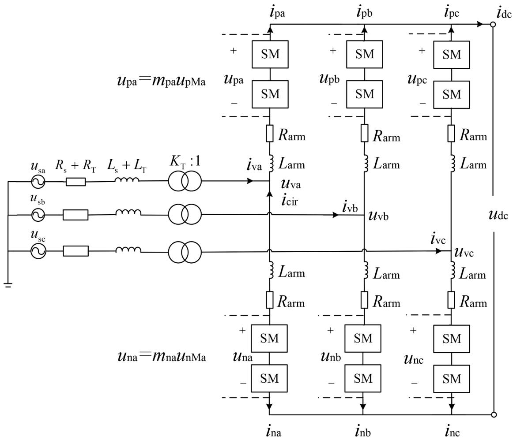  
Fig. 1. Structure of the MMC.

$$
\frac {\mathrm {d}}{\mathrm {d} t} \left[ \begin{array}{l} x _ {0} ^ {+} \\ x _ {0} ^ {-} \\ x _ {0} ^ {0} \end{array} \right] = \left[ \begin{array}{c c c c c} A _ {0} ^ {0} & \overline {{A _ {1} ^ {0}}} & A _ {0} ^ {-} & \overline {{A _ {1} ^ {+}}} & A _ {0} ^ {+} \\ A _ {0} ^ {+} & \overline {{A _ {1} ^ {-}}} & A _ {0} ^ {0} & \overline {{A _ {1} ^ {0}}} & A _ {0} ^ {-} \\ A _ {0} ^ {-} & \overline {{A _ {1} ^ {+}}} & A _ {0} ^ {+} & \overline {{A _ {1} ^ {-}}} & A _ {0} ^ {0} \end{array} \right] \boldsymbol {x} + \left[ \begin{array}{c c c c c} 0 & A _ {1} ^ {-} & 0 & A _ {1} ^ {0} & 0 \\ 0 & A _ {1} ^ {0} & 0 & A _ {1} ^ {+} & 0 \\ 0 & A _ {1} ^ {+} & 0 & A _ {1} ^ {-} & 0 \end{array} \right] \bar {\boldsymbol {x}} + \left[ \begin{array}{c} b _ {0} ^ {+} \\ b _ {0} ^ {-} \\ b _ {0} ^ {0} \end{array} \right] \tag {29}
$$

$$
\frac {\mathrm {d}}{\mathrm {d} t} \left[ \begin{array}{l} x _ {1} ^ {+} \\ x _ {1} ^ {-} \\ x _ {1} ^ {0} \end{array} \right] = \left[ \begin{array}{c c c c c c} A _ {1} ^ {0} & A _ {0} ^ {0} & A _ {1} ^ {-} & A _ {0} ^ {-} & A _ {1} ^ {+} & A _ {0} ^ {+} \\ A _ {1} ^ {+} & A _ {0} ^ {+} & A _ {1} ^ {0} & A _ {0} ^ {0} & A _ {1} ^ {-} & A _ {0} ^ {-} \\ A _ {1} ^ {-} & A _ {0} ^ {-} & A _ {1} ^ {+} & A _ {0} ^ {+} & A _ {1} ^ {0} & A _ {0} ^ {0} \end{array} \right] \boldsymbol {x} + \left[ \begin{array}{c c c c c c} 0 & 0 & 0 & 0 & 0 & 0 \\ 0 & 0 & 0 & 0 & 0 & 0 \\ 0 & 0 & 0 & 0 & 0 & 0 \end{array} \right] \bar {\boldsymbol {x}} + \left[ \begin{array}{c} b _ {1} ^ {+} \\ b _ {1} ^ {-} \\ b _ {1} ^ {0} \end{array} \right] - \mathrm {j} \omega \left[ \begin{array}{l} x _ {1} ^ {+} \\ x _ {1} ^ {-} \\ x _ {1} ^ {0} \end{array} \right] \tag {30}
$$

# 2) Example 2

Let state equations be (31). Using matrix S to handle it, we get (32):

$$
\frac {\mathrm {d}}{\mathrm {d} \tau} \left[ \begin{array}{l} x _ {\mathrm {a}} \\ x _ {\mathrm {b}} \\ x _ {\mathrm {c}} \end{array} \right] (\tau) = \left[ \begin{array}{l l l l l l} A _ {\mathrm {a}} & 0 & 0 & A _ {\mathrm {a}} ^ {\prime} & 0 & 0 \\ 0 & A _ {\mathrm {b}} & 0 & 0 & A _ {\mathrm {b}} ^ {\prime} & 0 \\ 0 & 0 & A _ {\mathrm {c}} & 0 & 0 & A _ {\mathrm {c}} ^ {\prime} \end{array} \right] (\tau) \left[ \begin{array}{l} x _ {\mathrm {a b c}} \\ y _ {\mathrm {a b c}} \end{array} \right] (\tau) \tag {31}
$$

$$
\frac {\mathrm {d}}{\mathrm {d} \tau} \left[ \begin{array}{l} x ^ {+} \\ x ^ {-} \\ x ^ {0} \end{array} \right] (\tau) = \left[ \begin{array}{c c c c c c} A ^ {0} & A ^ {-} & A ^ {+} & A ^ {0} & A ^ {' -} & A ^ {' +} \\ A ^ {+} & A ^ {0} & A ^ {-} & A ^ {' +} & A ^ {0} & A ^ {' -} \\ A ^ {-} & A ^ {+} & A ^ {0} & A ^ {' -} & A ^ {' +} & A ^ {0} \end{array} \right] (\tau) \left[ \begin{array}{l} x ^ {+ - 0} \\ y ^ {+ - 0} \end{array} \right] (\tau) \tag {32}
$$

where $x _ { \mathrm { a b c } } ( \tau )$ refer to $[ { x _ { \mathrm { a } } } \quad { x _ { \mathrm { b } } } \quad { x _ { \mathrm { c } } } ] ^ { \mathrm { T } } ( \tau ) , { x ^ { + - 0 } } ( \tau )$ refer to $\left[ \begin{array} { l l l } { x ^ { + } } & { x ^ { - } } & { x ^ { 0 } } \end{array} \right] ^ { \mathrm { T } } ( \tau ) ,$ , and so on.

Assuming that x(τ) contains only DC components, y(τ) and

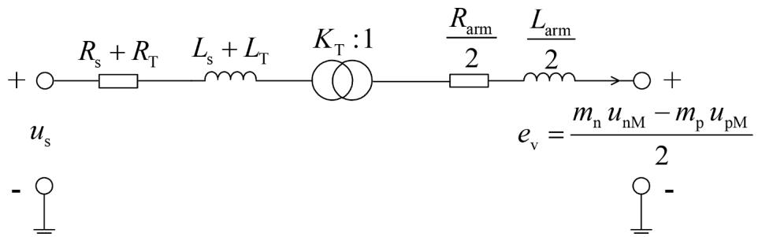  
Fig. 2. AC side equivalent circuit of the MMC.

Table 1 The frequency components of time-domain signals.   

<table><tr><td>quantity</td><td>DC</td><td>BF</td><td>DF</td></tr><tr><td>icir(τ)</td><td>✓</td><td></td><td>✓</td></tr><tr><td>iv(τ)</td><td></td><td>✓</td><td></td></tr><tr><td>uPM(τ),uNM(τ)</td><td>✓</td><td>✓</td><td>✓</td></tr><tr><td>us(τ)</td><td></td><td>✓</td><td></td></tr><tr><td>udc(τ)</td><td>✓</td><td></td><td>✓</td></tr><tr><td>mp(τ),mn(τ)</td><td>✓</td><td>✓</td><td>✓</td></tr></table>

coefficients in A(τ) contain DC and double-frequency components, then the highest order of the SDPs is n = 2, and the state vector in the SDP equations is $\pmb { x } = \left[ \begin{array} { c c c c c c c c } { { \pmb x _ { 0 } ^ { + } } } & { { \pmb x _ { 0 } ^ { - } } } & { { \pmb x _ { 0 } ^ { 0 } } } & { { \pmb y _ { 0 } ^ { + } } } & { { \pmb y _ { 2 } ^ { + } } } & { { \pmb y _ { 0 } ^ { - } } } & { { \pmb y _ { 2 } ^ { - } } } & { { \pmb y _ { 0 } ^ { 0 } } } & { { \pmb y _ { 2 } ^ { 0 } } } \end{array} \right] ^ { \mathrm { T } }$ . Note that (31) and (32) have similar forms as (22) and (23). Therefore, we can obtain the SDP state equations for $\left[ \begin{array} { l l l } { x _ { 0 } ^ { + } } & { x _ { 0 } ^ { - } } & { x _ { 0 } ^ { 0 } } \end{array} \right] ^ { \mathrm { { T } } }$ as (33).

complex variables.

$$
\left\{ \begin{array}{l} z _ {1} + z _ {2} = \left[ \begin{array}{l l} 1 & j \end{array} \right] \left(\left[ \begin{array}{l} z _ {1 r} \\ z _ {1 i} \end{array} \right] + \left[ \begin{array}{l} z _ {2 r} \\ z _ {2 i} \end{array} \right]\right), \frac {\mathrm {d}}{\mathrm {d} \tau} z = \left[ \begin{array}{l l} 1 & j \end{array} \right] \left(\frac {\mathrm {d}}{\mathrm {d} \tau} \left[ \begin{array}{l} z _ {r} \\ z _ {i} \end{array} \right]\right) \\ z _ {1} z _ {2} = \left[ \begin{array}{l l} 1 & j \end{array} \right] \left[ \begin{array}{l l} z _ {1 r} & - z _ {1 i} \\ z _ {1 i} & z _ {1 r} \end{array} \right] \left[ \begin{array}{l} z _ {2 r} \\ z _ {2 i} \end{array} \right], z _ {1} \overline {{z _ {2}}} = \left[ \begin{array}{l l} 1 & j \end{array} \right] \left[ \begin{array}{l l} z _ {1 r} & z _ {1 i} \\ z _ {1 i} & - z _ {1 r} \end{array} \right] \left[ \begin{array}{l} z _ {2 r} \\ z _ {2 i} \end{array} \right] \end{array} \right. \tag {34}
$$

where subscripts r and i represent the real and imaginary parts of a complex variable.

It can be seen that the addition, multiplication and differentiation operations of complex variables can be represented by similar operations of two matrices. Therefore, the real-form equations corresponding to (26) is (35).

$$
\frac {\mathrm {d}}{\mathrm {d} t} \left[ \begin{array}{l} x _ {0} ^ {+} \\ x _ {0} ^ {-} \\ x _ {0} ^ {0} \end{array} \right] = \left[ \begin{array}{c c c c c c c c c} A _ {0} ^ {0} & A _ {0} ^ {-} & A _ {0} ^ {+} & A _ {0} ^ {0} & \overline {{A _ {2} ^ {0}}} & A _ {0} ^ {-} & \overline {{A _ {2} ^ {+ +}}} & A _ {0} ^ {+} & \overline {{A _ {2} ^ {- - }}} \\ A _ {0} ^ {+} & A _ {0} ^ {0} & A _ {0} ^ {-} & A _ {0} ^ {+ +} & \overline {{A _ {2} ^ {- - }}} & A _ {0} ^ {0} & \overline {{A _ {2} ^ {0}}} & A _ {0} ^ {- - } & \overline {{A _ {2} ^ {+ +}}} \\ A _ {0} ^ {-} & A _ {0} ^ {+} & A _ {0} ^ {0} & A _ {0} ^ {- - } & \overline {{A _ {2} ^ {- + }}} & A _ {0} ^ {+ +} & \overline {{A _ {2} ^ {- - }}} & A _ {0} ^ {0} & \overline {{A _ {2} ^ {- +}}} \end{array} \right] \boldsymbol {x} + \left[ \begin{array}{c c c c c c c c c} 0 & 0 & 0 & 0 & A _ {2} ^ {- - } & 0 & A _ {2} ^ {+ 0} & 0 & A _ {2} ^ {' + + } \\ 0 & 0 & 0 & 0 & A _ {2} ^ {+ 0} & 0 & A _ {2} ^ {' + + } & 0 & A _ {2} ^ {' - + } \\ 0 & 0 & 0 & 0 & A _ {2} ^ {' + + } & 0 & A _ {2} ^ {' - + } & 0 & A _ {2} ^ {' 0} \end{array} \right] \bar {\boldsymbol {x}} \tag {33}
$$

# 5.4. Quick method for transforming complex-form state equations into real-form

The variables in (26), (29), (30) and (33) are all complex variables. Here, a unified fast approach to separate the real and imaginary parts of complex variables to obtain the corresponding real equations is provided. Let $z = z _ { \mathrm { r } } + \mathrm { j } z _ { \mathrm { i } }$ . Equation (34) shows the operation properties of

$$
\frac {\mathrm {d}}{\mathrm {d} t} \left[ \begin{array}{l} x _ {k r} ^ {+} \\ x _ {k i} ^ {+} \\ x _ {k r} ^ {-} \\ x _ {k i} ^ {-} \\ x _ {k r} ^ {0} \\ x _ {k i} ^ {0} \end{array} \right] - k \omega \left[ \begin{array}{l} x _ {k i} ^ {+} \\ - x _ {k r} ^ {+} \\ x _ {k i} ^ {-} \\ - x _ {k r} ^ {-} \\ x _ {k i} ^ {0} \\ - x _ {k r} ^ {0} \end{array} \right] = \left(\boldsymbol {A} _ {1} ^ {\prime} + \boldsymbol {A} _ {2} ^ {\prime}\right) \boldsymbol {x} ^ {\prime} + \left[ \begin{array}{l} b _ {k r} ^ {+} \\ b _ {k i} ^ {+} \\ b _ {k r} ^ {-} \\ b _ {k i} ^ {-} \\ b _ {k r} ^ {0} \\ b _ {k i} ^ {0} \end{array} \right] \tag {35}
$$

Table 2 The sequence dynamic phasors of state variables.   

<table><tr><td>index</td><td>sequence</td><td>upM(τ)</td><td>icir(τ)</td><td>iv(τ)</td></tr><tr><td rowspan="3">DC</td><td>PS</td><td>upM0+ = upM0r + jupM0i</td><td>icir0+ = icir0r + jicir0i</td><td>-</td></tr><tr><td>NS</td><td>upM0- = upM0r - jupM0i</td><td>icir0- = icir0r - jicir0i</td><td>-</td></tr><tr><td>ZS</td><td>upM00 = upM0r + jupM0i</td><td>icir00 = icir0r + jicir0i</td><td>-</td></tr><tr><td rowspan="3">BF</td><td>PS</td><td>upM1+ = (upM1d + jupM1q)/2</td><td>-</td><td>iv1+ = (iv1d + jiv1q)/2</td></tr><tr><td>NS</td><td>upM1- = (upM1d - jupM1q)/2</td><td>-</td><td>iv1- = (iv1d - jiv1q)/2</td></tr><tr><td>ZS</td><td>upM10 = upM1r + jupM1i</td><td>-</td><td>iv10 = iv10r + jiv1i</td></tr><tr><td rowspan="3">DF</td><td>PS</td><td>upM2+ = (upM2d + jupM2q)/2</td><td>icir2+ = (icir2d + jicir2q)/2</td><td>-</td></tr><tr><td>NS</td><td>upM2- = (upM2d - jupM2q)/2</td><td>icir2- = (icir2d - jicir2q)/2</td><td>-</td></tr><tr><td>ZS</td><td>upM20 = upM2r + jupM2i</td><td>icir20 = icir2r + jicir2i</td><td>-</td></tr></table>

Table 3 The sequence dynamic phasors of input variables.   

<table><tr><td>index</td><td>sequence</td><td>us(τ)</td><td>udc(τ)</td></tr><tr><td>DC</td><td>ZS</td><td>-</td><td>udc0= udc0r + judc0i</td></tr><tr><td>DF</td><td>ZS</td><td>-</td><td>udc2= udc2r + judc2i</td></tr><tr><td>BF</td><td>PS</td><td>us1+ = (us1d + jus1q)/2</td><td>-</td></tr><tr><td></td><td>NS</td><td>us1- = (us-d1 - jusq1)/2</td><td>-</td></tr></table>

where $\pmb { x } ^ { \prime } = \left[ \pmb { x } ^ { \prime } ^ { + } | \pmb { x } ^ { \prime } ^ { - } | \pmb { x } ^ { \prime } ^ { 0 } \right] ^ { \mathrm { T } }$ is state vector, $\begin{array} { r l } { \pmb { x } ^ { \prime } ^ { + } = } & { { } \big [ \pmb { x } _ { 0 \mathrm { r } } ^ { + } \ \pmb { x } _ { 0 \mathrm { i } } ^ { + } \ \pmb { x } _ { 1 \mathrm { r } } ^ { + } \ \pmb { x } _ { 1 \mathrm { i } } ^ { + } \ \cdot \ } \end{array}$ ⋯ $X _ { n r } ^ { + } X _ { n \downarrow } ^ { + } ] ^ { \mathrm { T } } , ~ { \bf { x } ^ { \prime - } } = ~ \left[ x _ { 0 \mathrm { T } } ^ { - } ~ x _ { 0 \mathrm { i } } ^ { - } ~ x _ { 1 \mathrm { r } } ^ { - } ~ x _ { 1 \mathrm { i } } ^ { - } ~ \cdots ~ x _ { n \mathrm { r } } ^ { - } ~ x _ { n \mathrm { i } } ^ { - } \right] ^ { \mathrm { T } } , ~ { \bf { x } ^ { \prime 0 } } = ~ \left[ x _ { 0 \mathrm { r } } ^ { 0 } ~ x _ { 0 \mathrm { i } } ^ { 0 } ~ x _ { 1 \mathrm { r } } ^ { 0 } ~ x _ { 1 \mathrm { i } } ^ { 0 } ~ \cdots ~ x _ { 0 \mathrm { r } } ^ { 0 } ~ x _ { 1 \mathrm { r } } ^ { 0 } \right] ^ { \mathrm { T } } ,$ $x _ { n \mathrm { r } } ^ { 0 } x _ { n \mathrm { i } } ^ { 0 } \big ] ^ { \mathrm { T } } . A _ { 1 } ^ { ' }$ and $\pmb { A } _ { 2 } ^ { \prime }$ are both state matrices of size $6 \times 6 ( n + 1 )$ , which are obtained by converting the element $a _ { 1 i j }$ in $\pmb { A } _ { 1 }$ and $a _ { 2 i j }$ in $\pmb { A } _ { 2 }$ into their corresponding second-order matrix, as shown in (36).

$$
\left\{ \begin{array}{l} a _ {1 i j} = \left(a _ {1 i j r} + j a _ {1 i j i}\right) \Leftrightarrow \left[ \begin{array}{c c} a _ {1 i j r} & - a _ {1 i j i} \\ a _ {1 i j i} & a _ {1 i j r} \end{array} \right] \\ a _ {2 i j} = \left(a _ {2 i j r} + j a _ {2 i j i}\right) \Leftrightarrow \left[ \begin{array}{c c} a _ {2 i j r} & a _ {2 i j i} \\ a _ {2 i j i} & - a _ {2 i j r} \end{array} \right] \end{array} \right. \tag {36}
$$

To help understand, (37) illustrates the real-form of (29).

Table 4 The sequence dynamic phasors of modulation signals.   

<table><tr><td>index</td><td>sequence</td><td>mp(τ)</td><td>mn(τ)</td></tr><tr><td>DC</td><td>ZS</td><td>mp0=mp0/2=1/2</td><td>mn0=mp0/2=1/2</td></tr><tr><td>BF</td><td>PS</td><td>mp1+ = - (m1d + jm1q) / 4 = -m1+ / 2</td><td>mn1+ = (m1d + jm1q) / 4 = m1+ / 2</td></tr><tr><td></td><td>NS</td><td>mp1- = - (m1d - jm1q) / 4 = -m1- / 2</td><td>mn1- = (m1d - jm1q) / 4 = m1- / 2</td></tr><tr><td>DF</td><td>NS</td><td>mp2- = - (m2d - jm2q) / 4 = -m2/2</td><td>mn2- = - (m2d - jm2q) / 4 = -m2/2</td></tr></table>

where $x _ { 0 \mathrm { r } } ^ { + }$ and $x _ { 0 \mathrm { i } } ^ { + }$ represent the real and imaginary parts o $: x _ { 0 } ^ { + }$ , and so on.

To acquire the simplest real-form state equations for (35), the state equations for $x _ { 0 \mathrm { r } } ^ { - } , x _ { 0 \mathrm { i } } ^ { - }$ and zero-state variables (including $x _ { 0 \mathrm { i } } ^ { 0 } )$ should be deleted. Then, in the state matrix, the coefficients corresponding to $x _ { 0 \mathrm { r } } ^ { + }$ and $x _ { 0 \mathrm { r } } ^ { - } , ~ x _ { 0 \mathrm { i } } ^ { + }$ and $x _ { 0 \mathrm { i } } ^ { - }$ , should be merged, and the coefficients corresponding to zero state-variables should be deleted. At last, the second item on the left end of (35) needs to be merged into the right end.

To help understand, (40) illustrates the simplest real-form of (37).

$$
\text {w h e r e} \boldsymbol {x} ^ {\prime \prime \prime} = \left[ \begin{array}{l l l l l l l l} x _ {0 r} ^ {+} & x _ {0 i} ^ {+} & x _ {1 r} ^ {+} & x _ {1 i} ^ {+} & x _ {1 r} ^ {-} & x _ {1 i} ^ {-} & x _ {0 r} ^ {0} & x _ {1 r} ^ {0} & x _ {1 i} ^ {0} \end{array} \right] ^ {\mathrm {T}}.
$$

$$
\frac {\mathrm {d}}{\mathrm {d} t} \left[ \begin{array}{c} x _ {0 \mathrm {r}} ^ {+} \\ x _ {0 \mathrm {i}} ^ {+} \\ x _ {0 \mathrm {r}} ^ {-} \\ x _ {0 \mathrm {i}} ^ {-} \\ x _ {0 \mathrm {r}} ^ {0} \\ x _ {0 \mathrm {i}} ^ {0} \end{array} \right] = \left[ \begin{array}{c c c c c c c c c c c c c} A _ {0 \mathrm {r}} ^ {0} & - A _ {0 \mathrm {i}} ^ {0} & A _ {1 \mathrm {r}} ^ {0} + A _ {1 \mathrm {r}} ^ {-} & A _ {1 \mathrm {i}} ^ {0} + A _ {1 \mathrm {i}} ^ {-} & A _ {0 \mathrm {r}} ^ {-} & - A _ {0 \mathrm {i}} ^ {-} & A _ {1 \mathrm {r}} ^ {+} + A _ {1 \mathrm {r}} ^ {0} & A _ {1 \mathrm {i}} ^ {+} + A _ {1 \mathrm {i}} ^ {0} & A _ {0 \mathrm {r}} ^ {+} & - A _ {0 \mathrm {i}} ^ {+} & A _ {1 \mathrm {r}} ^ {-} + A _ {1 \mathrm {r}} ^ {+} & A _ {1 \mathrm {i}} ^ {-} + A _ {1 \mathrm {i}} ^ {+} \\ A _ {0 \mathrm {i}} ^ {0} & A _ {0 \mathrm {r}} ^ {0} & \left(- A _ {1 \mathrm {i}} ^ {0}\right) + A _ {1 \mathrm {i}} ^ {-} & A _ {1 \mathrm {r}} ^ {-} + A _ {1 \mathrm {r}} ^ {-} & A _ {0 \mathrm {i}} ^ {-} & A _ {0 \mathrm {r}} ^ {-} & \left(- A _ {1 \mathrm {i}} ^ {+}\right) + A _ {1 \mathrm {i}} ^ {0} & A _ {1 \mathrm {r}} ^ {-} + A _ {1 \mathrm {r}} ^ {-} & A _ {0 \mathrm {i}} ^ {+} & A _ {0 \mathrm {r}} ^ {+} & \left(- A _ {1 \mathrm {i}} ^ {-}\right) + A _ {1 \mathrm {i}} ^ {+} & A _ {1 \mathrm {r}} ^ {-} - A _ {1 \mathrm {r}} ^ {+} \\ A _ {0 \mathrm {r}} ^ {+} & - A _ {0 \mathrm {i}} ^ {+} & A _ {\mathrm {I r}} ^ {-} + A _ {\mathrm {I r}} ^ {0} & A _ {\mathrm {I r}} ^ {-} + A _ {\mathrm {I r}} ^ {- 1} & A _ {\mathrm {I r}} ^ {- 0} & - A _ {\mathrm {O i}} ^ {- 0} & A _ {\mathrm {I r}} ^ {- 0} + A _ {\mathrm {I r}} ^ {- 1} & A _ {\mathrm {I i}} ^ {- 0} + A _ {\mathrm {I i}} ^ {- 1} & A _ {\mathrm {O i}} ^ {- 0} & - A _ {\mathrm {O i}} ^ {- 0} & A _ {\mathrm {I r}} ^ {- 0} + A _ {\mathrm {I r}} ^ {- 1} & A _ {\mathrm {I i}} ^ {- 0} + A _ {\mathrm {I i}} ^ {- 1} \\ A _ {\mathrm {O i}} ^ {- 1} & A _ {\mathrm {O r}} ^ {- 1} & \left(- A _ {\mathrm {I r}} ^ {-}\right) + A _ {\mathrm {I r}} ^ {- 1} & A _ {\mathrm {I r}} ^ {- - } + A _ {\mathrm {I r}} ^ {- 1} & A _ {\mathrm {O i}} ^ {- 0} & A _ {\mathrm {O r}} ^ {- 0} & \left(- A _ {\mathrm {I r}} ^ {- 1}\right) + A _ {\mathrm {I i}} ^ {- 1} & A _ {\mathrm {I r}} ^ {- 0} + A _ {\mathrm {I r}} ^ {- 1} & A _ {\mathrm {O i}} ^ {- 0} & - A _ {\mathrm {O i}} ^ {- 0} & \left(- A _ {\mathrm {I i}} ^ {-}\right) + A _ {\mathrm {I i}} ^ {- 1} & A _ {\mathrm {I r}} ^ {- 0} - A _ {\mathrm {I r}} ^ {- 1} \\ A _ {\mathrm {O r}} ^ {- 2} & - A _ {\mathrm {O i}} ^ {- 2} & A _ {\mathrm {I r}} ^ {- + } + A _ {\mathrm {I r}} ^ {- + } & A _ {\mathrm {I i}} ^ {- + } + A _ {\mathrm {I i}} ^ {- + } & A _ {\mathrm {O i}} ^ {- + } & - A _ {\mathrm {O i}} ^ {- + } & A _ {\mathrm {I r}} ^ {- + } + A _ {\mathrm {I r}} ^ {- + } & A _ {\mathrm {I i}} ^ {- + } + A _ {\mathrm {I i}} ^ {- + } & A _ {\mathrm {O i}} ^ {- 0} & - A _ {\mathrm {O i}} ^ {- 0} & A _ {\mathrm {{I r}}} ^ {- 0} + A _ {\mathrm {{I r}}} ^ {- 0} \\ A _ {\mathrm {{O i}}} ^ {- 2} & - A _ {\mathrm {{O r}}} ^ {- 2} & \left(- A _ {\mathrm {{I r}}} ^ {- + }\right) + A _ {\mathrm {{I r}}} ^ {- + } & A _ {\mathrm {{I r}}} ^ {- + } - A _ {\mathrm {{I r}}} ^ {- + } & A _ {\mathrm {{O i}}} ^ {- + } & A _ {\mathrm {{O r}}} ^ {- + } & \left(- A _ {\mathrm {{I r}}} ^ {- + }\right) + A _ {\mathrm {{I i}}} ^ {- + } & A _ {\mathrm {{I r}}} ^ {- + } - A _ {\mathrm {{I r}}} ^ {- + } & A _ {\mathrm {{O i}}} ^ {- 0} & - A _ {\mathrm {{O i}}} ^ {- 0} & \left(- A _ {\mathrm {{I i}}} ^ {- 0}\right) + A _ {\mathrm {{I i}}} ^ {- 0} \\ & & & & & & & & & & & \\ & & & & & & & & & & & \\ & & & & & & & & & & & \\
$$

$$
\frac {\mathrm {d}}{\mathrm {d} t} \left[ \begin{array}{l} x _ {0 \mathrm {r}} ^ {+} \\ x _ {0 \mathrm {i}} ^ {+} \\ x _ {0 \mathrm {r}} ^ {0} \end{array} \right] = \left[ \begin{array}{c c c c} A _ {0 \mathrm {r}} ^ {0} + A _ {0 \mathrm {r}} ^ {-} & - A _ {0 \mathrm {i}} ^ {0} + A _ {0 \mathrm {i}} ^ {-} & A _ {1 \mathrm {r}} ^ {0} + A _ {1 \mathrm {r}} ^ {-} & A _ {1 \mathrm {i}} ^ {0} + A _ {1 \mathrm {i}} ^ {-} \\ A _ {0 \mathrm {i}} ^ {0} + A _ {0 \mathrm {i}} ^ {-} & A _ {0 \mathrm {r}} ^ {0} - A _ {0 r} ^ {-} & - A _ {1 \mathrm {i}} ^ {0} + A _ {1 \mathrm {i}} ^ {-} & A _ {1 \mathrm {r}} ^ {0} - A _ {1 \mathrm {r}} ^ {-} \\ A _ {0 \mathrm {r}} ^ {-} + A _ {0 \mathrm {r}} ^ {+} & - A _ {0 \mathrm {i}} ^ {-} + A _ {0 \mathrm {i}} ^ {+} & A _ {1 \mathrm {r}} ^ {-} + A _ {1 \mathrm {r}} ^ {+} & A _ {1 \mathrm {i}} ^ {-} + A _ {1 \mathrm {i}} ^ {-} \\ & & A _ {1 \mathrm {i}} ^ {-} + A _ {1 \mathrm {i}} ^ {+} & A _ {1 \mathrm {r}} ^ {-} + A _ {1 \mathrm {r}} ^ {-} \end{array} \right] \left| \begin{array}{c c c c} A _ {\mathrm {1 r}} ^ {+} + A _ {\mathrm {1 r}} ^ {0} & A _ {\mathrm {1 i}} ^ {+} + A _ {\mathrm {1 i}} ^ {0} & A _ {\mathrm {0 r}} ^ {+} & A _ {\mathrm {1 r}} ^ {-} + A _ {\mathrm {1 r}} ^ {+} \\ - A _ {\mathrm {1 i}} ^ {+} + A _ {\mathrm {1 i}} ^ {0} & A _ {\mathrm {1 r}} ^ {-} + A _ {\mathrm {1 r}} ^ {- 1} & A _ {\mathrm {0 i}} ^ {-} & - A _ {\mathrm {1 i}} ^ {-} + A _ {\mathrm {1 i}} ^ {-} \\ A _ {\mathrm {1 r}} ^ {-} + A _ {\mathrm {1 r}} ^ {- 1} & A _ {\mathrm {1 i}} ^ {-} + A _ {\mathrm {1 i}} ^ {- 1} & A _ {\mathrm {0 r}} ^ {- 1} & A _ {\mathrm {1 r}} ^ {- 1} + A _ {\mathrm {1 r}} ^ {- 0} \\ & & A _ {\mathrm {0 i}} ^ {- 1} & A _ {\mathrm {1 r}} ^ {- 1} + A _ {\mathrm {1 r}} ^ {- 0} \end{array} \right|
$$

where $\pmb { x } ^ { \prime \prime } = \big [ x _ { 0 \mathrm { r } } ^ { + } ~ x _ { 0 \mathrm { i } } ^ { + } ~ x _ { 1 \mathrm { r } } ^ { + } ~ x _ { 1 \mathrm { i } } ^ { + } ~ x _ { 0 \mathrm { r } } ^ { - } ~ x _ { 0 \mathrm { i } } ^ { - } ~ x _ { 1 \mathrm { r } } ^ { - } ~ x _ { 1 \mathrm { i } } ^ { - } ~ x _ { 0 \mathrm { r } } ^ { 0 } ~ x _ { 0 \mathrm { i } } ^ { 0 } ~ x _ { 1 \mathrm { r } } ^ { 0 } ~ x _ { 1 \mathrm { i } } ^ { 0 } \big ] ^ { \mathrm { T } } .$

# 5.5. Acquisition of the simplest real-form state equations

Equation (35) is not the simplest real-form state equation, because some of the DPs may be zero. And the 0-th SDPs, which is usually written in the form of (38), has the properties as shown in (39) (see Appendix C).

$$
\left[ \begin{array}{l} x _ {0} ^ {+} \\ x _ {0} ^ {-} \\ x _ {0} ^ {0} \end{array} \right] (\tau) = S \left[ \begin{array}{l} x _ {\mathrm {a} 0} \\ x _ {\mathrm {b} 0} \\ x _ {\mathrm {c} 0} \end{array} \right] (\tau) = \left[ \begin{array}{l} x _ {0 \mathrm {r}} ^ {+} + \mathrm {j} x _ {0 \mathrm {i}} ^ {+} \\ x _ {0 \mathrm {r}} ^ {-} + \mathrm {j} x _ {0 \mathrm {i}} ^ {-} \\ x _ {0 \mathrm {r}} ^ {0} + \mathrm {j} x _ {0 \mathrm {i}} ^ {0} \end{array} \right] \tag {38}
$$

$$
x _ {0 \mathrm {r}} ^ {+} = x _ {0 \mathrm {r}} ^ {-}, x _ {0 \mathrm {i}} ^ {+} = - x _ {0 \mathrm {i}} ^ {-}, x _ {0 \mathrm {i}} ^ {0} = 0 \tag {39}
$$

# 6. Case study

At present, the half-bridge submodules based MMC has become the mainstream topology in HVDC transmission [23]. In this section, we develop a state space model for its main circuit under AC asymmetric conditions using the dq-SDP method. The control system is modelled by transfer functions in frequency-domain. It is worth mentioning the dq-SDP method is also applicable to other power electronic devices such as wind turbines and VSCs controlled in the dq coordinate system. MMC has complicated harmonic performance [24], thus can better demonstrate the advantages of the method proposed.

# 6.1. Derivation of sequence time-domain equation

The structure of a single-terminal MMC is shown in $\mathrm { F i g . ~ 1 }$ , where $u _ { s j } .$ AC voltage $( j = \mathsf { a } , \mathsf { b } , \mathsf { c } )$ .

$i _ { \mathrm { v } j } \mathrm { : }$ AC current injected into MMC by the AC system $( j = \mathbf { a } , \mathbf { b } , \mathbf { c } )$ .

$R _ { s }$ and $L _ { \mathrm { s } } \mathrm { : }$ equivalent resistance and inductance of the AC system.

$K _ { \mathrm { T } } , R _ { \mathrm { T } }$ and L : turn ratio, equivalent resistance and inductance of the converter transformer.

$R _ { \mathrm { a r m } }$ and $L _ { \mathrm { a r m } } { \mathrm { : } }$ equivalent resistance and inductance of the bridge arm.

$u _ { \mathrm { p M } j }$ and $u _ { \mathrm { n M } j } \mathrm { \cdot }$ total capacitance voltage of submodules in the upper and lower bridge arm $( j = \mathbf { a } , \mathbf { b } , \mathbf { c } )$ .

$m _ { \mathrm { p } j }$ and $m _ { \mathrm { n } j } .$ modulation signal of upper and lower bridge arms $( j = \mathsf { a } ,$ $\mathbf { b , c } )$ .

$u _ { \mathrm { p } j }$ and $u _ { \mathrm { \eta n j } } .$ voltage of upper and lower bridge arms $( j = \mathsf { a } , \mathsf { b } , \mathsf { c } )$ .

$i _ { \mathrm { p } j }$ and $i _ { \mathrm { n } j } \mathrm { : }$ current in upper and lower bridge arms $( j = \mathsf { a } , \mathsf { b } , \mathsf { c } )$

$u _ { \mathrm { d c } } \mathrm { . }$ output DC voltage.

When three-phase are symmetric, Fig. 2 shows the AC side equivalent circuit, and (41) and (42) describe the operating performance of the MMC, where the subscript ${ j = \mathsf { a } , \mathsf { b } , \mathsf { c } }$ are omitted, $C _ { \mathrm { a r m } } = C _ { \mathrm { S M } } / N$ is the equivalent capacitance of a bridge arm, $R _ { \mathrm { t o t } } = R _ { \mathrm { a r m } } / 2 + ( R _ { \mathrm { T } } + R _ { s } ) / K _ { \mathrm { T } } ^ { 2 }$ , Ltot $= L _ { \mathrm { a r m } } / 2 + ( L _ { \mathrm { T } } + L _ { s } ) / K _ { \mathrm { T } } ^ { 2 }$ .

$$
\left\{ \begin{array}{l} i _ {\mathrm {c i r}} (\tau) = \left(i _ {\mathrm {p}} - i _ {\mathrm {n}}\right) (\tau) / 2 \\ i _ {\mathrm {v}} (\tau) = \left(i _ {\mathrm {p}} + i _ {\mathrm {n}}\right) (\tau) \end{array} \right. \tag {41}
$$

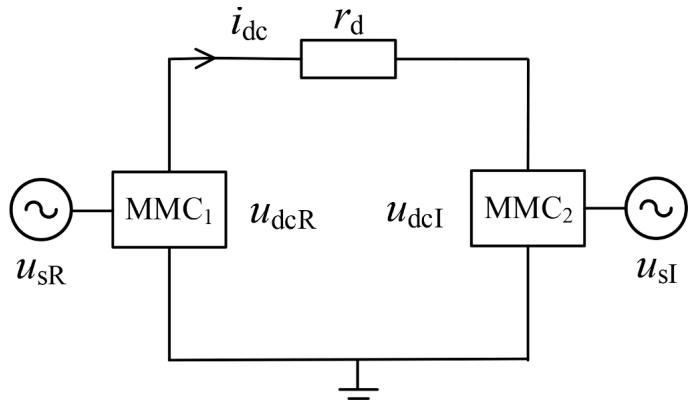  
Fig. 3. The scheme diagram for the two-terminal MMC-HVDC system.

ZS row coefficients in the state matrices when forming the SDP state equations in the next stage. For example, there is no ZS component in $i _ { \mathrm { v } } ( \tau ) ,$ , yet its BF-ZS DP is considered at this stage. While for other variables, only if a specific sequence, a specific frequency component exists, it is considered. It is also worth mentioning that the unbalanced threephase DC bridge arm voltages and circulating currents are handled as DC-PS, DC-NS and DC-ZS signals by matrix S in our modeling in Table $^ { 2 , }$ so that they can be treated within the same framework as other frequency components. Also, we know under unbalanced AC conditions, the 0-th and the 2-nd SDPs for upM(τ) and $u _ { \mathrm { n M } } ( \tau )$ are equal, while their 1-

$$
\frac {\mathrm {d}}{\mathrm {d} \tau} \left[ \begin{array}{c} i \text {c i r} \\ i v \\ u p M \\ u n M \end{array} \right] (\tau) = \left[ \begin{array}{c c c c} - R a r m / L a r m & 0 & m p / (2 L a r m) & m n / (2 L a r m) \\ 0 & - R t o t / L t o t & m p / (2 L t o t) & - m n / (2 L t o t) \\ - m p / C a r m & - m p / (2 C a r m) & 0 & 0 \\ - m n / C a r m & m n / (2 C a r m) & 0 & 0 \end{array} \right] (\tau) \cdot \left[ \begin{array}{c} i \text {c i r} \\ i v \\ u p M \\ u n M \end{array} \right] (\tau) + \tag {42}
$$

$$
\left[ \begin{array}{c c} - 1 / (2 L \mathrm {a r m}) & 0 \\ 0 & 1 / (K T L \mathrm {t o t}) \\ 0 & 0 \\ 0 & 0 \end{array} \right] \left[ \begin{array}{c} u \mathrm {d c} \\ u s \end{array} \right] (\tau)
$$

Write (42) in three-phase form and perform instantaneous symmetric component decomposition to obtain the state equations for the sequence time-domain signals as shown in (43).

$$
\mathrm {d} \boldsymbol {x} (\tau) / \mathrm {d} \tau = \boldsymbol {A} (\tau) \cdot \boldsymbol {x} (\tau) + \boldsymbol {b} (\tau) \tag {43}
$$

where the specific expressions of vectors and matrix can be seen in Appendix D.

# 6.2. Sequence dynamic phasors corresponding to sequence time-domain signals

The main frequency components of time-domain signals in (43) under imbalanced AC conditions are shown in Table 1, where BF and DF denote base-frequency and double-frequency, respectively.

According to the definition of dq-SDP in Section $^ { 3 , }$ Tables 2-4 list the SDPs corresponding to state variables, input variables and modulation signals, respectively, where $u \mathbf { p } \mathbf { M } _ { 0 } ^ { + }$ , upM− and $u { \bf p } { \bf M } _ { 2 } ^ { 0 }$ represent the 0-th PS, 1-st NS, 2-nd ZS DP of $u \mathbf { p } \mathbf { M } ( \tau ) _ { : }$ , respectively, and so on.

Note that for state variables, as long as a specific frequency component exists, PS, NS and ZS DPs are simultaneously considered at this stage to allow for application of the relationship between the PS, NS and

st SDPs are opposite. Namely, $\begin{array} { l c l } { { u { \bf p } { \bf M } _ { 0 } ^ { + - 0 } = } } & { { u { \bf n } { \bf M } _ { 0 } ^ { + - 0 } , } } & { { u { \bf p } { \bf M } _ { 2 } ^ { + - 0 } = } } \end{array}$ $u \mathrm { n M } _ { 2 } ^ { + - 0 } , u \mathrm { p M } _ { 1 } ^ { + - 0 } = \ - u \mathrm { n M } _ { 1 } ^ { + - 0 }$ . Hence, we use the SDPs for $u _ { \mathrm { p M } } ( \tau )$ to calculate the SDPs for $u _ { \mathrm { n M } } ( \tau )$ , and modeling of $u _ { \mathrm { n M } } ( \tau )$ is omitted in Table 2.

Next, let’s explain the DPs in Table 3. Due to the wiring method of the converter transformer, PS and NS are considered for $u _ { \mathrm { s } } ( \tau ) . u _ { \mathrm { d c } } ( \tau )$ is a single-phase signal, which mainly contains DC and DF components under unbalanced AC conditions. In order to model within a unified

Table 5 Parameters of the MMC-HVDC system.   

<table><tr><td>Type</td><td>Parameter</td><td>Value</td></tr><tr><td rowspan="5">AC side</td><td>Rated AC voltage</td><td>220 kV</td></tr><tr><td>Transformer ratio</td><td>220/200</td></tr><tr><td>Transformer wiring method</td><td>Y0/D</td></tr><tr><td>Transformer inductance</td><td>0.031H</td></tr><tr><td>AC system inductance</td><td>0.005H</td></tr><tr><td rowspan="5">MMC</td><td>Number of sub modules for a bridge arm</td><td>200</td></tr><tr><td>Capacitor voltage of a submodule</td><td>2 kV</td></tr><tr><td>Equivalent capacitance of a bridge arm</td><td>0.33mF</td></tr><tr><td>Inductance of a bridge arm</td><td>0.01H</td></tr><tr><td>Equivalent resistor of a bridge</td><td>0.1 Ω</td></tr><tr><td>Others</td><td>DC resistance</td><td>1 Ω</td></tr></table>

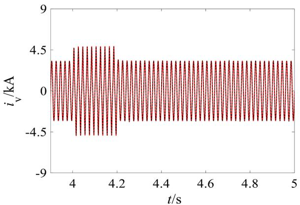  
(a) a-phase AC current

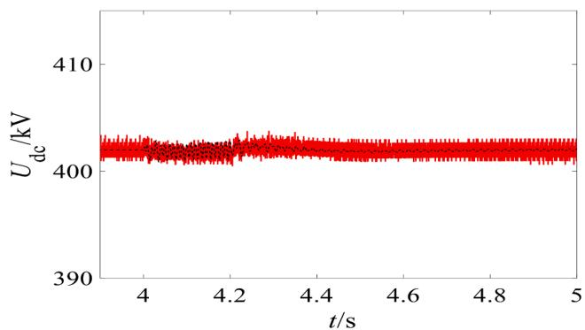

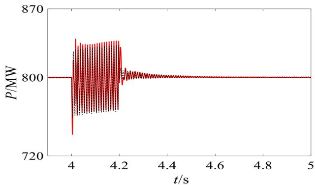  
(b) DC voltage

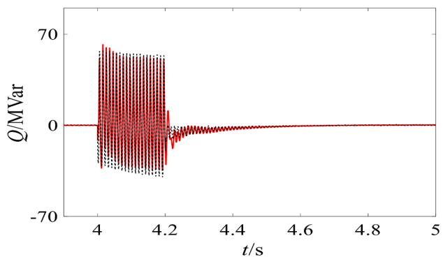  
(c) active power   
(d) reactive power

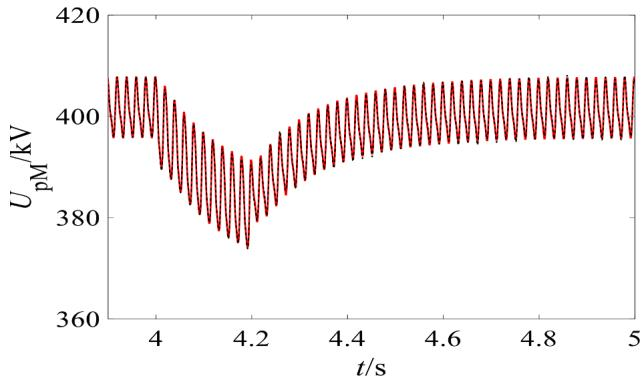

  
(e) a-phase voltage of the upper bridge arm

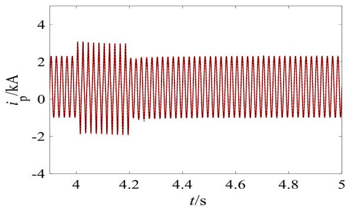  
(f) a-phase voltage of the lower bridge arm   
(g)a-phase current of the upper bridge arm

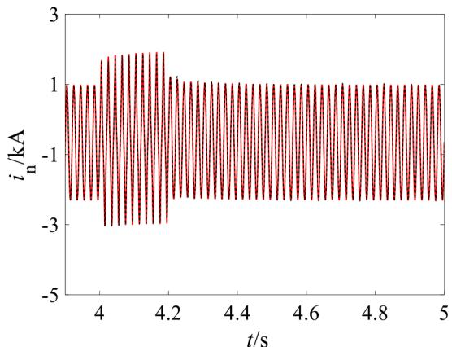  
(h) a-phase current of the lower bridge arm   
Fig. 4. Simulation results for suffering voltage drop at the rectifier side AC system.

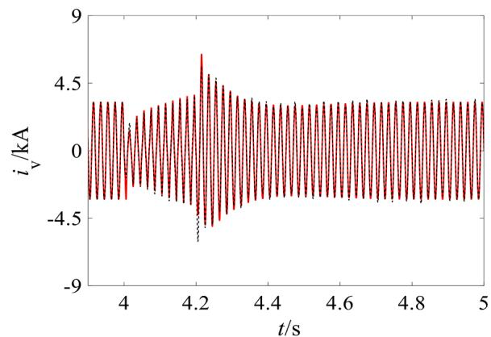  
(a) a-phase AC current

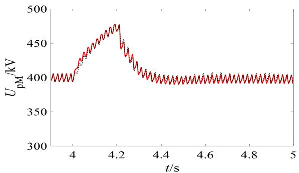  
(e) a-phase voltage of the upper bridge arm

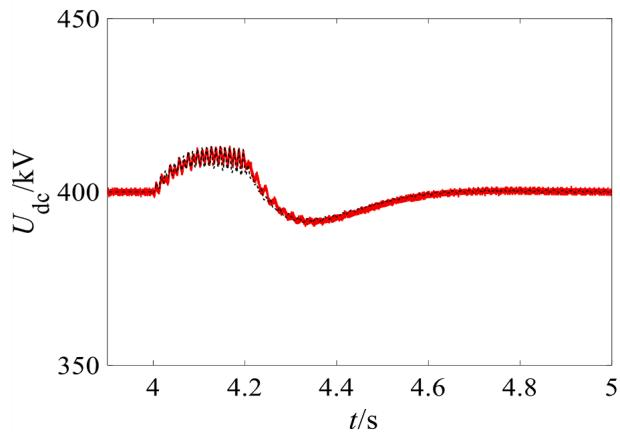  
(b) DC voltage

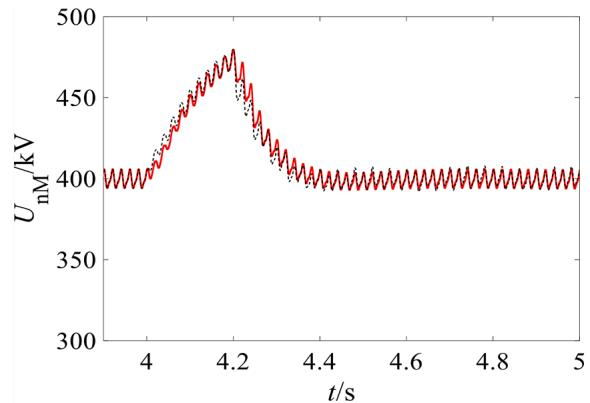  
(f) a-phase voltage of the lower bridge arm

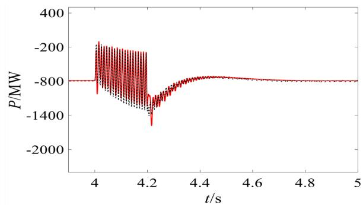  
(c) active power

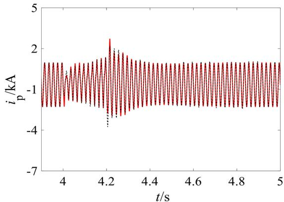  
(g)a-phase current of the upper bridge arm

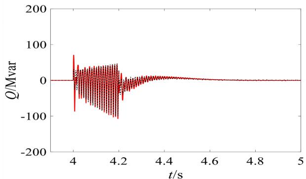  
(d) reactive power

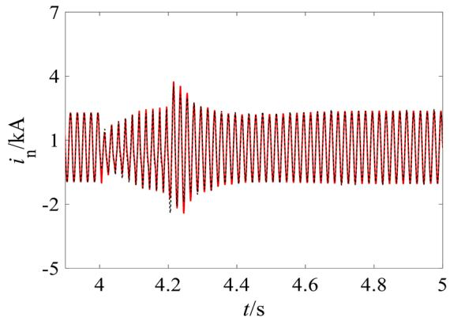  
(h) a-phase current of the lower bridge arm   
Fig. 5. Simulation results for suffering short-circuit at the inverter side AC system.

framework, we regard it as balanced three-phase signals, thus after treated by matrix S, it corresponds to DC-ZS and DF-ZS DPs.

Equation (44) shows the expression for the a-phase modulation signal, which can help understand the considered frequency and sequence components for $m _ { \mathrm { p } } ( \tau )$ and $m _ { \mathrm { n } } ( \tau )$ in Table 4.

where $\scriptstyle { E _ { k } }$ is identity matrix; O is zero matrix.

For matrix $\mathbf { A } _ { 1 } ,$ , there are still four blocks $A _ { 1 \_ 1 3 } , A _ { 1 \_ 2 3 } , A _ { 1 \_ 3 1 } , A _ { 1 \_ 3 2 }$ to be determined. As indicated in Part 5.2, we only introduce the derivation of the PS rows in the following. Take the PS rows of $\pmb { A } _ { 1 , 3 1 }$ as an example. See Appendix D, the corresponding time-domain state equa-

$$
\left\{ \begin{array}{l} m _ {\mathrm {p a}} (\tau) = 1 / 2 - M _ {1} ^ {+} \cos \left(\omega \tau + \theta_ {1} ^ {+}\right) / 2 - M _ {1} ^ {-} \cos \left(\omega \tau + \theta_ {1} ^ {-}\right) / 2 - M _ {2} ^ {-} \cos \left(2 \omega \tau + \theta_ {2} ^ {-}\right) / 2 \\ m _ {\mathrm {n a}} (\tau) = 1 / 2 + M _ {1} ^ {+} \cos \left(\omega \tau + \theta_ {1} ^ {+}\right) / 2 + M _ {1} ^ {-} \cos \left(\omega \tau + \theta_ {1} ^ {-}\right) / 2 - M _ {2} ^ {-} \cos \left(2 \omega \tau + \theta_ {2} ^ {-}\right) / 2 \end{array} \right. \tag {44}
$$

where $M _ { 1 } ^ { + } , M _ { 1 } ^ { - } , M _ { 2 } ^ { - }$ and $\theta _ { 1 } ^ { + } , \theta _ { 1 } ^ { - } , \theta _ { 2 } ^ { - }$ represent the magnitudes and initial phase angels of the BF-PS, BF-NS, DF-NS components of the modulation signals, respectively.

It is seen the DC and DF components of $m _ { \mathrm { p } } ( \tau )$ and $m _ { \mathrm { n } } ( \tau )$ are equal, whereas their BF components are opposite, therefore their 0-th and 2-nd SDPs are equal while their 1-st SDPs are opposite.

# 6.3. Formation of the SDP state equations

Remove the SDPs corresponding to unM(τ) and develop the complexform SDP state equations corresponding to (43), we can get:

$$
\mathrm {d} \boldsymbol {x} / \mathrm {d} t = \boldsymbol {A} _ {1} \boldsymbol {x} + \boldsymbol {A} _ {2} \bar {\boldsymbol {x}} + \boldsymbol {B} \tag {45}
$$

where

$$
\boldsymbol {x} = \left[ \begin{array}{c c c c c c} i \mathrm {c i r} _ {0} ^ {+} & i \mathrm {c i r} _ {2} ^ {+} & i \mathrm {c i r} _ {0} ^ {-} & i \mathrm {c i r} _ {2} ^ {-} & i \mathrm {c i r} _ {0} ^ {0} & i \mathrm {c i r} _ {2} ^ {0} \end{array} \right| \quad i \mathrm {v} _ {1} ^ {+} \quad i \mathrm {v} _ {1} ^ {-} \quad i \mathrm {v} _ {1} ^ {0} |
$$

$$
\left. \left. u p M _ {0} ^ {+} \quad u p M _ {1} ^ {+} \quad u p M _ {2} ^ {+} \quad u p M _ {0} ^ {-} \quad u p M _ {1} ^ {-} \quad u p M _ {2} ^ {-} \quad u p M _ {0} ^ {0} \quad u p M _ {1} ^ {0} u p M _ {2} ^ {0}\right) ^ {\mathrm {T}} \right.
$$

$$
\boldsymbol {B} = \left[ \begin{array}{c c c c c} 0 & 0 & 0 & 0 & - \frac {u d c _ {0} ^ {0}}{2 L a r m} \\ & & & & - \frac {u d c _ {2} ^ {0}}{2 L a r m} \end{array} \right. \frac {u s _ {1} ^ {+}}{K T L t o t} \frac {u s _ {1} ^ {-}}{K T L t o t}
$$

$$
\left. \begin{array}{l l l l l l l l l l} 0 & 0 & 0 & 0 & 0 & 0 & 0 & 0 & 0 & 0 \\ \end{array} \right] ^ {\mathrm {T}}
$$

State matrices $\pmb { A } _ { 1 }$ and $\pmb { A } _ { 2 }$ in (45) can be divided into blocks as (46).

$$
\boldsymbol {A} _ {1} = \left[ \begin{array}{l l l} \boldsymbol {A} _ {1 \backslash 1 1} & \boldsymbol {A} _ {1 \backslash 1 2} & \boldsymbol {A} _ {1 \backslash 1 3} \\ \boldsymbol {A} _ {1 \backslash 2 1} & \boldsymbol {A} _ {1 \backslash 2 2} & \boldsymbol {A} _ {1 \backslash 2 3} \\ \boldsymbol {A} _ {1 \backslash 3 1} & \boldsymbol {A} _ {1 \backslash 3 2} & \boldsymbol {A} _ {1 \backslash 3 3} \end{array} \right] \boldsymbol {A} _ {2} = \left[ \begin{array}{l l l} \boldsymbol {A} _ {2 \backslash 1 1} & \boldsymbol {A} _ {2 \backslash 1 2} & \boldsymbol {A} _ {2 \backslash 1 3} \\ \boldsymbol {A} _ {2 \backslash 2 1} & \boldsymbol {A} _ {2 \backslash 2 2} & \boldsymbol {A} _ {2 \backslash 2 3} \\ \boldsymbol {A} _ {2 \backslash 3 1} & \boldsymbol {A} _ {2 \backslash 3 2} & \boldsymbol {A} _ {2 \backslash 3 3} \end{array} \right] \tag {46}
$$

where the sizes of A1_11, A1_12, A1_13 are $6 { \times } 6 , 6 { \times } 3 , 6 { \times } 9 ,$ respectively, representing coefficients of the SDPs for icir(τ) with respect to the SDPs for itself, iv(τ) and upM(τ), respectively. The meanings of other subblocks in A1 and A2 are similar.

According to the sequence time-domain signals state equations in Appendix D, the following sub-blocks in $\pmb { A } _ { 1 }$ are easy to obtain as (47).

$$
\left\{ \begin{array}{c} \boldsymbol {A} _ {1 \backslash 1 1} = (- R \operatorname {a r m} / L \operatorname {a r m}) \times \boldsymbol {E} _ {6} + \operatorname {d i a g} (0 - 2 \omega \mathrm {j} 0 - 2 \omega \mathrm {j} 0 - 2 \omega \mathrm {j}) \\ \boldsymbol {A} _ {1 \backslash 2 2} = (- R \operatorname {t o t} / L \operatorname {t o t}) \times \boldsymbol {E} _ {3} + \operatorname {d i a g} (- \omega \mathrm {j} - \omega \mathrm {j} - \omega \mathrm {j}) \\ \boldsymbol {A} _ {1 \backslash 3 3} = \operatorname {d i a g} (0 - \omega \mathrm {j} - 2 \omega \mathrm {j} 0 - \omega \mathrm {j} - 2 \omega \mathrm {j} 0 - \omega \mathrm {j} - 2 \omega \mathrm {j}) \\ \boldsymbol {A} _ {1 \backslash 1 2} = \boldsymbol {O} _ {6 \times 3} \\ \boldsymbol {A} _ {1 \backslash 2 1} = \boldsymbol {O} _ {3 \times 6} \end{array} \right.
$$

(47)

tion is:

$$
\begin{array}{l} \frac {\mathrm {d} \mathrm {u p M} ^ {+}}{\mathrm {d} \tau} (\tau) = - \frac {1}{C a r m} \left(m p ^ {0} i c i r ^ {+} + m p ^ {-} i c i r ^ {-} + m p ^ {+} i c i r ^ {0} + \frac {m p ^ {0} i v ^ {+}}{2} \right. \\ \left. + \frac {m p ^ {-} i v ^ {-}}{2} + \frac {m p ^ {+} i v ^ {0}}{2}\right) (\tau) \tag {48} \\ \end{array}
$$

According to Table $^ { 2 , }$ the SDPs of upM+(τ) are upM+ , $u { \bf p } { \bf M } _ { 1 } ^ { + } , u { \bf p } { \bf M } _ { 2 } ^ { + } ,$ , and the SDPs of $i \mathrm { c i r } ^ { + - 0 } ( \tau )$ are icir+ ,icir+ ,icir− ,icir− ,icir0 ,icir0 . The size of the PS rows of $\pmb { A } _ { 1 , 3 1 }$ is $3 \times 6 ,$ representing the coefficients of $u \mathbf { p } \mathbf { M } _ { 0 } ^ { + }$ , upM+ , upM+ with respect to icir+ ,icir+ , $i \mathrm { c i r } _ { 0 } ^ { - } , i \mathrm { c i r } _ { 2 } ^ { - }$ 、icir0 ,icir0 . According to (27), the general expression for the PS rows of $\pmb { A } _ { 1 , 3 1 }$ is:

$$
\boldsymbol {A} _ {1 - 3 1 \mathrm {P S}} = - \frac {1}{C a r m} \left[ \begin{array}{l l l l l} m p _ {0} ^ {0} & \overline {{m p _ {2} ^ {0}}} & m p _ {0} ^ {-} & \overline {{m p _ {2} ^ {+}}} & m p _ {0} ^ {+} \\ m p _ {1} ^ {0} & \overline {{m p _ {1} ^ {0}}} & m p _ {1} ^ {-} & \overline {{m p _ {1} ^ {+}}} & m p _ {1} ^ {+} \\ m p _ {2} ^ {0} & \overline {{m p _ {0} ^ {0}}} & m p _ {2} ^ {-} & \overline {{m p _ {0} ^ {+}}} & m p _ {2} ^ {+} \end{array} \right] \tag {49}
$$

Then, substituting the SDPs in Table 4, we can get the final expression for $\pmb { A } _ { 1 . 3 1 \mathrm { P S } }$ . Note that the SDPs not listed in $\mathrm { T a b l e } 4 $ are zero. Following the method, (50) sequentially provides the expression for A1_13PS, $\pmb { A } _ { 1 }$ _23PS, $\pmb { A } _ { 1 , 3 1 \mathrm { P S } }$ and $\pmb { A } _ { 1 }$ _32PS.

$$
\left\{ \begin{array}{c} \boldsymbol {A} _ {1 - 1 3 \mathrm {P S}} = \frac {1}{2 L \operatorname {a r m}} \left[ \begin{array}{l l l l l l l l l} m _ {0} ^ {0} & 0 & 0 & 0 & - \overline {{m _ {1} ^ {+}}} & 0 & 0 & - \overline {{m _ {1} ^ {-}}} & - \overline {{m _ {2} ^ {-}}} \\ 0 & 0 & m _ {0} ^ {0} & - m _ {2} ^ {-} & - m _ {1} ^ {-} & 0 & 0 & - m _ {1} ^ {+} & 0 \end{array} \right] \\ \boldsymbol {A} _ {1 - 2 3 \mathrm {P S}} = \frac {1}{2 L \operatorname {t o t}} \left[ \begin{array}{l l l l l l l l l} 0 & m _ {0} ^ {0} & 0 & - m _ {1} ^ {-} & 0 & - \overline {{m _ {1} ^ {+}}} & - m _ {1} ^ {+} & 0 & - \overline {{m _ {1} ^ {-}}} \end{array} \right] \\ \boldsymbol {A} _ {1 - 3 1 \mathrm {P S}} = - \frac {1}{2 C a r m} \left[ \begin{array}{l l l l l l l l l} m _ {0} ^ {0} & 0 & 0 & 0 & 0 & 0 & - \overline {{m _ {2} ^ {-}}} \\ 0 & 0 & - m _ {1} ^ {-} & - \overline {{m _ {1} ^ {+}}} & - m _ {1} ^ {+} & - \overline {{m _ {1} ^ {-}}} \\ 0 & m _ {0} ^ {0} & - m _ {2} ^ {-} & 0 & 0 & 0 \end{array} \right] \\ \boldsymbol {A} _ {1 - 3 2 \mathrm {P S}} = - \frac {1}{4 C a r m} \left[ \begin{array}{l l l l l l l l l} 0 & - \overline {{m _ {1} ^ {+}}} & - \overline {{m _ {1} ^ {-}}} \\ m _ {0} ^ {0} & 0 & 0 \\ 0 & - m _ {1} ^ {-} & - m _ {1} ^ {+} \end{array} \right] \end{array} \right. \tag {50}
$$

As for $\mathbf { A } _ { 2 } ,$ it can be concluded from Appendix D that subblocks $\pmb { A } _ { 2 , 1 3 } ,$ $A _ { 2 , 2 3 } , A _ { 2 , 3 1 }$ and $\pmb { A } _ { 2 3 2 }$ are non-zero matrices. Using the aforementioned method and (28), (51) sequentially shows the coefficients in PS rows of these four matrices.

$$
\begin{array}{l} \left(A _ {2 - 1 3 \mathrm {P S}} = \frac {1}{2 L \operatorname {a r m}} \left[ \begin{array}{c c c c c c c c} 0 & - m _ {1} ^ {-} & - m _ {2} ^ {-} & 0 & 0 & 0 & 0 & - m _ {1} ^ {+} & 0 \\ 0 & 0 & 0 & 0 & 0 & 0 & 0 & 0 & 0 \end{array} \right] \right. \\ \boldsymbol {A} _ {2 - 2 3 \mathrm {P S}} = \frac {1}{2 L \mathrm {t o t}} \left[ \begin{array}{l l l l l l l l l} 0 & - m _ {2} ^ {-} & 0 & 0 & 0 & 0 & 0 & 0 & 0 \end{array} \right] \\ \boldsymbol {A} _ {2 - 3 1 \mathrm {P S}} = - \frac {1}{2 C \operatorname {a r m}} \left[ \begin{array}{c c c c c c} 0 & - m _ {2} ^ {-} & 0 & 0 & 0 & 0 \\ 0 & 0 & 0 & 0 & 0 & 0 \\ 0 & 0 & 0 & 0 & 0 & 0 \end{array} \right] \tag {51} \\ \mathbf {A} _ {\mathrm {2 - 3 2 P S}} = - \frac {1}{4 C a r m} \left[ \begin{array}{c c c} - m _ {1} ^ {-} & 0 & - m _ {1} ^ {+} \\ - m _ {2} ^ {-} & 0 & 0 \\ 0 & 0 & 0 \end{array} \right] \\ \end{array}
$$

Then, NS and ZS rows can be obtained from PS rows to obtain the complete $\pmb { A } _ { 1 }$ and $\pmb { A } _ { 2 } .$ And the 18-order complex-form SDP state equations of MMC is obtained as shown in Appendix E. It should be noted that the differential equations given in Appendix E are easy to observe, while the actual modeling uses matrix form. Furthermore, using the method for quickly separating the real and imaginary parts of complex-form state equations given in Part 5.4, a real-form MMC SDP state space model is obtained as shown in (52).

$$
\mathrm {d} \boldsymbol {\mathbf {x r}} (t) / \mathrm {d} t = \boldsymbol {\mathbf {A r}} (t) \cdot \boldsymbol {\mathbf {x r}} (t) + \boldsymbol {\mathbf {B r}} (t) \tag {52}
$$

where

To verify its correctness, the SDP and an equivalent EMT model for the two-terminal MMC-HVDC system shown in Fig. 3 are built on the MATLAB/Simulink platform. System parameters are shown in Table 5. Both models share dual-loop control structure. The MMC on the rectifier side controls the active and reactive power whose reference values are 800 MW and 0Mvar, respectively. The MMC on the inverter side controls the DC voltage and reactive power, with reference values of 400 kV and 0Mvar, respectively. The inner loop includes PS current tracking, NS and circulating current suppression controls.

Fig. 4 shows the simulated curves for MMC1 when rectifier side AC source suffers a-phase 50 % voltage drop. And Fig. 5 shows the dynamics of $\mathbf { M M C } _ { 2 }$ when inverter side AC source suffers a-phase short-circuit. Both faults happen at 4.0 s and are cleared at 4.2 s. It can be seen that results from the SDP (dashed line) and the EMT (solid line) coincide well, denoting the correctness of the developed SDP model. The calculation steps for SDP and EMT models are 100 μs and $1 0 \mu s ,$ , respectively, and their simulation time consumptions are approximately 43 s and 353 s, respectively. Therefore, the SDP method has higher simulation efficiency.

# 6.5. Comparison with existing similar models

Literature [20] and [21] are two representative papers studying the state space modeling of MMC in dq frame under AC asymmetric conditions. In this part, they are compared with the proposed model in this article.

# 6.5.1. Similarities

$$
\mathbf {x r} = \left[ \begin{array}{l l l l l l l l} i \mathrm {c i r} _ {\mathrm {r} 0} ^ {+} & i \mathrm {c i r} _ {\mathrm {i} 0} ^ {+} & i \mathrm {c i r} _ {d 2} ^ {+} / 2 & i \mathrm {c i r} _ {q 2} ^ {+} / 2 & i \mathrm {c i r} _ {\mathrm {r} 0} ^ {-} & i \mathrm {c i r} _ {\mathrm {i} 0} ^ {-} & i \mathrm {c i r} _ {d 2} ^ {-} / 2 & - i \mathrm {c i r} _ {q 2} ^ {-} / 2 & i \mathrm {c i r} _ {\mathrm {r} 0} ^ {0} & i \mathrm {c i r} _ {\mathrm {i} 0} ^ {0} & i \mathrm {c i r} _ {\mathrm {r} 2} ^ {0} & i \mathrm {c i r} _ {\mathrm {i} 2} ^ {0} \end{array} \right.
$$

$$
i v _ {d 1} ^ {+} / 2 \quad i v _ {q 1} ^ {+} / 2 \quad i v _ {d 1} ^ {-} / 2 \quad - i v _ {q 1} ^ {-} / 2 i v _ {r 1} ^ {0} \quad i v _ {i 1} ^ {0} \quad u p M _ {r 0} ^ {+} \quad u p M _ {i 0} ^ {+} u p M _ {d 1} ^ {+} / 2 \quad u p M _ {q 1} ^ {+} / 2 \quad u p M _ {d 2} ^ {+} / 2 \quad u p M _ {q 2} ^ {+} / 2
$$

$$
\left. \begin{array}{c c c c c c c c} u p M _ {r 0} ^ {-} & u p M _ {i 0} ^ {-} & u p M _ {d 1} ^ {-} / 2 & - u p M _ {q 1} ^ {-} / 2 & u p M _ {d 2} ^ {-} / 2 & - u p M _ {q 2} ^ {-} / 2 & u p M _ {r 0} ^ {0} & u p M _ {i 0} ^ {0} \\ & & & & & & u p M _ {r 1} ^ {0} & u p M _ {i 1} ^ {0} \\ & & & & & & u p M _ {r 2} ^ {0} & u p M _ {i 2} ^ {0} \end{array} \right] ^ {\mathrm {T}}
$$

$$
\begin{array}{l} \boldsymbol {B} _ {\mathrm {r}} = \left[ 0 0 0 0 0 0 0 - \frac {u d c _ {r 0} ^ {0}}{2 L a r m} - \frac {u d c _ {i 0} ^ {0}}{2 L a r m} - \frac {u d c _ {r 2} ^ {0}}{2 L a r m} - \frac {u d c _ {i 2} ^ {0}}{2 L a r m} \frac {u s _ {d 1} ^ {+}}{2 K T L t o t} \frac {u s _ {q 1} ^ {+}}{2 K T L t o t} \frac {u s _ {d 1} ^ {-}}{2 K T L t o t} \right. \\ \left. - \frac {u s _ {q 1} ^ {-}}{2 K T L t o t} 0 0 0 0 0 0 0 0 0 0 0 0 0 0 0 0 0 0 \right] ^ {T} \\ \end{array}
$$

Due to space considerations, the specific expression for Ar is omitted here. The SDP state equations (52) in real-form is 36-order. It is known there is no ZS component in $i _ { \mathrm { v } } ( \tau )$ due to the transformer wiring, so state variables $i \mathbf { v } _ { \mathrm { 1 r } } ^ { 0 } , \quad i \mathbf { v } _ { \mathrm { 1 i } } ^ { 0 }$ are zero. Also, according to (39), ic $\mathbf { i r } _ { 0 \mathrm { r } } ^ { - } =$ $i c i r _ { 0 \mathrm { r } } ^ { + } , \ i c i r _ { 0 \mathrm { i } } ^ { - } = \ - i c \mathrm { i r _ { 0 \mathrm { i } } ^ { + } } , \ u \mathrm { p M _ { 0 \mathrm { r } } ^ { - } } = u \mathrm { p M _ { 0 \mathrm { r } } ^ { + } } , \ u \mathrm { p M _ { 0 \mathrm { i } } ^ { - } } = \ - u \mathrm { p M _ { 0 \mathrm { i } } ^ { + } } , \ i c i r _ { 0 \mathrm { i } } ^ { 0 } = \ - \ \frac { 3 } { 2 } \mathrm { i } 2 , $ 0、 $u \mathbf { p } \mathbf { M } _ { \mathrm { 0 i } } ^ { 0 } = \mathbf { 0 } .$ . Then, following the method described in Part $5 . 5 ,$ the simplest 28-order real-form SDP model of the MMC is obtained. Also due to space concerns, it is not listed.

# 6.4. Simulation verification

The proposed 28-order real-form SDP model is for the main circuit.

In these three studies, the same three-phase time-domain state equations are used to derive the state space model for MMC in the dq coordinate system, and identical frequency components are considered in modelling. It should be clarified that, although [20] and [21] use the three-phase unequal DC components in $i _ { \mathrm { c i r } } ( \tau )$ and u (τ) as state variables while this article uses the defined 0-th SDPs, they are essentially the same and therefore will not affect the simulation results. That is why we only compare the results of SDP and EMT in Part 6.4.

# 6.5.2. Differences

In terms of model complexity, this article establishes the state equations in complex-form and then transforms them into real-form; while [20,21] directly derive the real-form state equations under asymmetric operation conditions. Therefore, the number of state variables and the size of state matrix in our model is only half and quarter of that of the compared literature, respectively.

In terms of computation complexity, this article uses instantaneous

symmetric component decomposition and Fourier decomposition based on the reference angle of Park transform to uniformly handle unbalanced DC components and sequence signals of various frequencies. Uniform mathematical operations of dq-SDPs are derived and the coefficient relationship inside state matrices are excavated, which significantly reduce the complexity and computational burden. While in [20,21], three-phase unbalanced DC components are handled in the stationary coordinate system; while the PS and NS components are considered in the dq rotating coordinate system; and the ZS components are based on the xy rotating coordinate system. Inconsistent handling methods lead to additional computational burden to obtain the target model, so the derivation process is cumbersome and almost unrepeatable.

In terms of model scalability, more harmonics of the MMC can be easily included in our proposed method. The method in [20,21] cannot.

In terms of model simplicity, the complex-form and real-form state matrices derived in this article have 117 and 236 non-zero elements, respectively. While in [20,21], there are 292 non-zero elements in the real-form state matrix. Obviously, the model developed in this article is more concise.

# 7. Conclusion

This article proposes the dq-sequence dynamic phasor state space modeling method. Under AC asymmetric conditions, this method can efficiently establish a simulation model for a class of power electronic devices controlled by sequence in the dq rotating coordinate system. The model establishes a DC operating point for the circuit, thus can be linearized to obtain a small-signal model.

Based on the proposed method, this article establishes a dynamic phasor model for the modular multilevel converter under unbalanced AC conditions. The model form is concise with relatively simple modeling process.

Our next work is to use the dq-sequence dynamic phasor modeling method to establish a small-signal analysis model for wind farms connected to the modular multilevel converter-high voltage direct current system, and explore a new topic, the impact of asymmetric grid conditions on system oscillation characteristics.

# CRediT authorship contribution statement

Xiaoming Mao: Writing – original draft, Methodology, Investigation, Conceptualization. Hongbo Luo: Visualization, Software, Data curation. Wenda Zhong: Software, Data curation. Liang Wu: Writing – review & editing. Zhiyong Yuan: Writing – review & editing, Supervision.

# Declaration of competing interest

The authors declare that they have no known competing financial interests or personal relationships that could have appeared to influence the work reported in this paper.

# Acknowledgments

This work is supported by the Guangdong Provincial Natural Science Foundation (2023A1515010716).

# Appendix A

Multiply the two sides of (18) by S, we have:

$$
\boldsymbol {S} \left[ \begin{array}{l} x _ {\mathrm {a}} (\tau) y _ {\mathrm {a}} (\tau) \\ x _ {\mathrm {b}} (\tau) y _ {\mathrm {b}} (\tau) \\ x _ {\mathrm {c}} (\tau) y _ {\mathrm {c}} (\tau) \end{array} \right] = \boldsymbol {S} \left[ \begin{array}{l l l} x _ {\mathrm {a}} & 0 & 0 \\ 0 & x _ {\mathrm {b}} & 0 \\ 0 & 0 & x _ {\mathrm {c}} \end{array} \right] (\tau) \boldsymbol {S} ^ {- 1} \cdot \boldsymbol {S} \left[ \begin{array}{l} y _ {\mathrm {a}} \\ y _ {\mathrm {b}} \\ y _ {\mathrm {c}} \end{array} \right] (\tau) \tag {A.1}
$$

Then,

$$
\left[ \begin{array}{l} (x y) ^ {+} \\ (x y) ^ {-} \\ (x y) ^ {0} \end{array} \right] (\tau) = \left[ \begin{array}{l l l} x ^ {0} & x ^ {-} & x ^ {+} \\ x ^ {+} & x ^ {0} & x ^ {-} \\ x ^ {-} & x ^ {+} & x ^ {0} \end{array} \right] (\tau) \left[ \begin{array}{l} y ^ {+} \\ y ^ {-} \\ y ^ {0} \end{array} \right] (\tau) \tag {A.2}
$$

# Appendix B

Separate the zero, plus and minus-index components of SDPs in (16), then get:

$$
\left[ \begin{array}{l} \boldsymbol {x} _ {\mathrm {a}} \\ \boldsymbol {x} _ {\mathrm {b}} \\ \boldsymbol {x} _ {\mathrm {c}} \end{array} \right] (\tau) = \boldsymbol {S} ^ {- 1} \left[ \begin{array}{l} \boldsymbol {x} ^ {+} \\ \boldsymbol {x} ^ {-} \\ \boldsymbol {x} ^ {0} \end{array} \right] (\tau) = \boldsymbol {S} ^ {- 1} \left[ \begin{array}{l} \langle \boldsymbol {x} \rangle_ {0} ^ {+} \\ \langle \boldsymbol {x} \rangle_ {0} ^ {-} \\ \langle \boldsymbol {x} \rangle_ {0} ^ {0} \end{array} \right] (t) + \left(\boldsymbol {S} ^ {- 1} \sum_ {k > 0} \left[ \begin{array}{l} \langle \boldsymbol {x} \rangle_ {k} ^ {+} \\ \langle \boldsymbol {x} \rangle_ {k} ^ {-} \\ \langle \boldsymbol {x} \rangle_ {k} ^ {0} \end{array} \right] (t) e ^ {j k (\omega \tau + \varphi_ {0})} + \boldsymbol {S} ^ {- 1} \sum_ {k <   0} \left[ \begin{array}{l} \langle \boldsymbol {x} \rangle_ {k} ^ {+} \\ \langle \boldsymbol {x} \rangle_ {k} ^ {-} \\ \langle \boldsymbol {x} \rangle_ {k} ^ {0} \end{array} \right] (t) e ^ {j k (\omega \tau + \varphi_ {0})}\right) \tag {B.1}
$$

Use the SDP conjugation property on the minus-index SDPs in (B.1), we have:

$$
\begin{array}{l} \overline {{S ^ {- 1} \sum_ {k <   0} \left[ \begin{array}{l} \langle x \rangle_ {k} ^ {+} \\ \langle x \rangle_ {k} ^ {-} \\ \langle x \rangle_ {k} ^ {0} \end{array} \right] (t) e ^ {j k (\omega \tau + \varphi_ {0})} = \overline {{S}} ^ {- 1} \sum_ {k <   0} \left[ \begin{array}{l} \langle x \rangle_ {k} ^ {+} \\ \langle x \rangle_ {k} ^ {-} \\ \langle x \rangle_ {k} ^ {0} \end{array} \right] (t)}} \overline {{e ^ {j k (\omega \tau + \varphi_ {0})}}} = \overline {{S}} ^ {- 1} \sum_ {k <   0} \left[ \begin{array}{l} \langle x \rangle_ {- k} ^ {-} \\ \langle x \rangle_ {- k} ^ {+} \\ \langle x \rangle_ {- k} ^ {0} \end{array} \right] (t) e ^ {j (- k) (\omega \tau + \varphi_ {0})} \tag {B.2} \\ = \overline {{\boldsymbol {S} ^ {- 1}}} \sum_ {k > 0} \left[ \begin{array}{l} \langle \boldsymbol {x} \rangle_ {k} ^ {-} \\ \langle \boldsymbol {x} \rangle_ {k} ^ {+} \\ \langle \boldsymbol {x} \rangle_ {k} ^ {0} \end{array} \right] (t) \mathrm {e} ^ {\mathrm {j} k (\omega \tau + \varphi_ {0})} = \boldsymbol {S} ^ {- 1} \sum_ {k > 0} \left[ \begin{array}{l} \langle \boldsymbol {x} \rangle_ {k} ^ {+} \\ \langle \boldsymbol {x} \rangle_ {k} ^ {-} \\ \langle \boldsymbol {x} \rangle_ {k} ^ {0} \end{array} \right] (t) \mathrm {e} ^ {\mathrm {j} k (\omega \tau + \varphi_ {0})} \\ \end{array}
$$

Substitute (B.2) into (B.1), then get:

$$
\left[ \begin{array}{l} x _ {\mathrm {a}} \\ x _ {\mathrm {b}} \\ x _ {\mathrm {c}} \end{array} \right] (\tau) = \boldsymbol {S} ^ {- 1} \left[ \begin{array}{l} \langle \boldsymbol {x} \rangle_ {0} ^ {+} \\ \langle \boldsymbol {x} \rangle_ {0} ^ {-} \\ \langle \boldsymbol {x} \rangle_ {0} ^ {0} \end{array} \right] (t) + 2 \times \operatorname {R e} \left(\boldsymbol {S} ^ {- 1} \sum_ {k > 0} \left[ \begin{array}{l} \langle \boldsymbol {x} \rangle_ {k} ^ {+} \\ \langle \boldsymbol {x} \rangle_ {k} ^ {-} \\ \langle \boldsymbol {x} \rangle_ {k} ^ {0} \end{array} \right] (t) \mathrm {e} ^ {\mathrm {j} k (\omega \tau + \varphi_ {0})}\right) \tag {B.3}
$$

# Appendix C

According to the definition of the 0-th SDP in (16), we have:

$$
\left[ \begin{array}{l} x _ {0} ^ {+} \\ x _ {0} ^ {-} \\ x _ {0} ^ {0} \end{array} \right] = S \left[ \begin{array}{l} x _ {\mathrm {a} 0} \\ x _ {\mathrm {b} 0} \\ x _ {\mathrm {c} 0} \end{array} \right] (\tau) = \frac {1}{3} \left[ \begin{array}{l l l} 1 & a & a ^ {2} \\ 1 & a ^ {2} & a \\ 1 & 1 & 1 \end{array} \right] \left[ \begin{array}{l} x _ {\mathrm {a} 0} \\ x _ {\mathrm {b} 0} \\ x _ {\mathrm {c} 0} \end{array} \right] (\tau) \tag {C.1}
$$

Then we get:

$$
\left[ \begin{array}{l} x _ {0} ^ {+} \\ x _ {0} ^ {-} \\ x _ {0} ^ {0} \end{array} \right] = \left[ \begin{array}{l} x _ {0 \mathrm {r}} ^ {+} + \mathrm {j} x _ {0 \mathrm {i}} ^ {+} \\ x _ {0 \mathrm {r}} ^ {-} + \mathrm {j} x _ {0 \mathrm {i}} ^ {-} \\ x _ {0 \mathrm {r}} ^ {0} + \mathrm {j} x _ {0 \mathrm {i}} ^ {0} \end{array} \right] = \frac {1}{3} \left[ \begin{array}{l} \left(x _ {\mathrm {a} 0} - \frac {1}{2} x _ {\mathrm {b} 0} - \frac {1}{2} x _ {\mathrm {c} 0}\right) + \mathrm {j} (\frac {\sqrt {3}}{2} x _ {\mathrm {b} 0} - \frac {\sqrt {3}}{2} x _ {\mathrm {c} 0}) \\ \left(x _ {\mathrm {a} 0} - \frac {1}{2} x _ {\mathrm {b} 0} - \frac {1}{2} x _ {\mathrm {c} 0}\right) - \mathrm {j} (\frac {\sqrt {3}}{2} x _ {\mathrm {b} 0} - \frac {\sqrt {3}}{2} x _ {\mathrm {c} 0}) \\ x _ {\mathrm {a} 0} + x _ {\mathrm {b} 0} + x _ {\mathrm {c} 0} \end{array} \right] (\tau) \tag {C.2}
$$

Therefore,

$$
x _ {0 \mathrm {r}} ^ {+} = x _ {0 \mathrm {r}} ^ {-}, x _ {0 \mathrm {i}} ^ {+} = - x _ {0 \mathrm {i}} ^ {-}, x _ {0 \mathrm {i}} ^ {0} = 0 \tag {C.3}
$$

# Appendix D

Vectors and matrices in the sequence time-domain signals state equations are as follows:

$$
\boldsymbol {x} = \left[ \begin{array}{l l l l l l l} i c i r ^ {+} & i c i r ^ {-} & i c i r ^ {0} & i v ^ {+} & i v ^ {-} & i v ^ {0}: & u p M ^ {+} & u p M ^ {-} & u p M ^ {0} & u n M ^ {+} & u n M ^ {-} & u n M ^ {0} \end{array} \right] ^ {\mathrm {T}} (\tau)
$$

$$
\boldsymbol {b} = \left[ \begin{array}{l l l} 0 & 0 & - u d c ^ {0} / (2 L a r m) \end{array} \quad u s ^ {+} / (K T L t o t) \quad u s ^ {-} / (K T L t o t) \quad u s ^ {0} / (K T L t o t): \quad 0 & 0 & 0 & 0 & 0 & 0 & 0 \end{array} \right] ^ {\mathrm {T}} (\tau)
$$

$$
\boldsymbol {A} = \left[ \begin{array}{c c} \boldsymbol {A} _ {1 1} & \boldsymbol {A} _ {1 2} \\ \boldsymbol {A} _ {2 1} & \boldsymbol {A} _ {2 2} \end{array} \right]
$$

$$
\boldsymbol {A} _ {1 1} = \operatorname {d i a g} \left[ - \frac {\text {R a r m}}{\text {L a r m}} - \frac {\text {R a r m}}{\text {L a r m}} - \frac {\text {R a r m}}{\text {L a r m}} - \frac {\text {R t o t}}{\text {L t o t}} - \frac {\text {R t o t}}{\text {L t o t}} - \frac {\text {R t o t}}{\text {L t o t}} \right]
$$

$$
\mathbf {A} _ {1 2} = \left[ \begin{array}{c c c c c c} \frac {m p ^ {0}}{2 L a r m} & \frac {m p ^ {-}}{2 L a r m} & \frac {m p ^ {+}}{2 L a r m} & \frac {m n ^ {0}}{2 L a r m} & \frac {m n ^ {-}}{2 L a r m} & \frac {m n ^ {+}}{2 L a r m} \\ \frac {m p ^ {+}}{2 L a r m} & \frac {m p ^ {0}}{2 L a r m} & \frac {m p ^ {-}}{2 L a r m} & \frac {m n ^ {+}}{2 L a r m} & \frac {m n ^ {0}}{2 L a r m} & \frac {m n ^ {-}}{2 L a r m} \\ \frac {m p ^ {-}}{2 L a r m} & \frac {m p ^ {+}}{2 L a r m} & \frac {m p ^ {0}}{2 L a r m} & \frac {m n ^ {-}}{2 L a r m} & \frac {m n ^ {+}}{2 L a r m} & \frac {m n ^ {0}}{2 L a r m} \\ \frac {m p ^ {0}}{2 L t o t} & \frac {m p ^ {-}}{2 L t o t} & \frac {m p ^ {+}}{2 L t o t} & \frac {m n ^ {0}}{2 L t o t} & \frac {m n ^ {-}}{2 L t o t} & \frac {m n ^ {+}}{2 L t o t} \\ \frac {m p ^ {+}}{2 L t o t} & \frac {m p ^ {0}}{2 L t o t} & \frac {m p ^ {-}}{2 L t o t} & \frac {m n ^ {+}}{2 L t o t} & \frac {m n ^ {-}}{2 L t o t} & \frac {m n ^ {-}}{2 L t o t} \\ \frac {m p ^ {-}}{2 L t o t} & \frac {m p ^ {+}}{2 L t o t} & \frac {m p ^ {0}}{2 L t o t} & \frac {m n ^ {-}}{2 L t o t} & \frac {m n ^ {-}}{2 L t o t} & \frac {m n ^ {-}}{2 L t o t} \\ \end{array} \right] A _ {2 1} = \left[ \begin{array}{c c c c c c} - \frac {m p ^ {0}}{\text {C a r m}} & - \frac {m p ^ {-}}{\text {C a r m}} & - \frac {m p ^ {+}}{\text {C a r m}} & - \frac {m p ^ {0}}{2 \text {C a r m}} & - \frac {m p ^ {-}}{2 \text {C a r m}} & - \frac {m p ^ {+}}{2 \text {C a r m}} \\ - \frac {m p ^ {+}}{\text {C a r m}} & - \frac {m p ^ {0}}{\text {C a r m}} & - \frac {m p ^ {-}}{\text {C a r m}} & - \frac {m p ^ {+}}{2 \text {C a r m}} & - \frac {m p ^ {0}}{2 \text {C a r m}} & - \frac {m p ^ {-}}{2 \text {C a r m}} \\ - \frac {m p ^ {-}}{\text {C a r m}} & - \frac {m p ^ {+}}{\text {C a r m}} & - \frac {m p ^ {0}}{\text {C a r m}} & - \frac {m p ^ {-}}{2 \text {C a r m}} & - \frac {m p ^ {+}}{2 \text {C a r m}} & - \frac {m p ^ {-}}{2 \text {C a r m}} \\ - \frac {m n ^ {0}}{\text {C a r m}} & - \frac {m n ^ {-}}{\text {C a r m}} & - \frac {m n ^ {+}}{\text {C a r m}} & \frac {m n ^ {0}}{2 \text {C a r m}} & - \frac {m n ^ {-}}{2 \text {C a r m}} & - \frac {m n ^ {-}}{2 \text {C a r m}} \\ - \frac {m n ^ {-}}{\text {C a r m}} & - \frac {m n ^ {-}}{\text {C a r m}} & - \frac {m n ^ {-}}{\text {C a r m}} & - \frac {\text {M n} ^ {-}}{2 \text {C a r m}} & - \frac {\text {M n} ^ {-}}{2 \text {C a r m}} & - \frac {\text {M n} ^ {-}}{2 \text {C a r m}} \\ - \frac {\text {M n} ^ {-}}{\text {C a r m}} & - \frac {\text {M n} ^ {-}}{\text {C a r m}} & - \frac {\text {M n} ^ {-}}{\text {C a r m}} & - \frac {\text {M n} ^ {-}}{2 \text {C a r m}} & - \frac {\text {M n} ^ {-}}{2 \text {C a r m}} & - \frac {\text {M n} ^ {-}}{2 \text {C a r m}} \\ - \frac {\text {M n} ^ {-}}{\text {C a rm}} & - \frac {\text {M n} ^ {-}}{\text {C a r m}} & - \frac {\text {M n} ^ {-}}{\text {C a r m}} & - \frac {\text {M n} ^ {-}}{2 \text {C a r m}} & - \frac {\text {M n} ^ {-}}{2 \text {C a r m}} & - \frac {\text {M n} _ {} {} {} {} {} {} {} {} {} {} {} {} {} {} {} {} {} {} {} {} {} {} {} {} {} {} {} {} {} {} {} {} {} {} {} {} {} {} {} {} {} {} {} {} {} {} {} {} {} {} {} {} {} {} {} {} {} {} {} {} } \\ 0. 5 5 5 5 5 5 5 5 5 5 5 5 5 5 5 5 5 5 5 5 5 5 5 5 5 5 5 5 5 5 5 5 5 5 5 5 5 5 5 5 5 5 5 5 5 5 5 5 5 5 8. 4 7 6 3 3 3 3 3 3 3 3 3 3 3 3 3 3 3 3 3 3 3 3 3 3 3 3 3 3 3 3 3 3 3 3 3 3 3 3 3 3 3 3 3 3 3 3 3 3 3 3 3 3 9. 4. 7.
$$

$$
\boldsymbol {A} _ {2 2} = \boldsymbol {0} _ {6 \times 6}
$$

# Appendix E

The SDP state equations for the MMC in complex-form are shown below. State equations for the PS, NS, and ZS DPs of an identical variable are arranged together, making it easy to observe the relationship between PS, NS, and ZS row coefficients in the state matrix.

$$
\begin{array}{l} \frac {\operatorname {d i c i r} _ {0} ^ {+}}{\operatorname {d t}} = - \frac {\operatorname {R a r m}}{\operatorname {L a r m}} i \operatorname {c i r} _ {0} ^ {+} + \frac {1}{2 \operatorname {L a r m}} \left(m _ {0} ^ {0} u p M _ {0} ^ {+} - \overline {{m _ {1} ^ {+}}} u p M _ {1} ^ {-} - \overline {{m _ {1} ^ {-}}} u p M _ {1} ^ {0} - \overline {{m _ {2} ^ {-}}} u p M _ {2} ^ {0} - m _ {1} ^ {-} \overline {{u p M _ {1} ^ {+}}} - m _ {2} ^ {-} \overline {{u p M _ {2} ^ {+}}} - m _ {1} ^ {+} \overline {{u p M _ {1} ^ {0}}}\right) \\ \frac {\operatorname {d i c i r} _ {0} ^ {-}}{\operatorname {d t}} = - \frac {\operatorname {R a r m}}{\operatorname {L a r m}} i \operatorname {c i r} _ {0} ^ {-} + \frac {1}{2 L \operatorname {a r m}} \left(m _ {0} ^ {0} u p M _ {0} ^ {-} - \overline {{m _ {1} ^ {+}}} u p M _ {1} ^ {0} - \overline {{m _ {1} ^ {-}}} u p M _ {1} ^ {+} - \overline {{m _ {2} ^ {-}}} u p M _ {2} ^ {+} - m _ {1} ^ {-} \overline {{u p M _ {1} ^ {0}}} - m _ {2} ^ {-} \overline {{u p M _ {2} ^ {0}}} - m _ {1} ^ {+} \overline {{u p M _ {1} ^ {-}}}\right) \\ \frac {\mathrm {d i c i r} _ {0} ^ {0}}{\mathrm {d} t} = - \frac {\operatorname {R a r m}}{\operatorname {L a r m}} \operatorname {i c i r} _ {0} ^ {0} + \frac {1}{2 \operatorname {L a r m}} \left(m _ {0} ^ {0} \operatorname {u p M} _ {0} ^ {0} - \overline {{m _ {1} ^ {+}}} \operatorname {u p M} _ {1} ^ {+} - \overline {{m _ {1} ^ {-}}} \operatorname {u p M} _ {1} ^ {-} - \overline {{m _ {2} ^ {-}}} \operatorname {u p M} _ {2} ^ {-} - m _ {1} ^ {-} \overline {{\operatorname {u p M} _ {1} ^ {-}}} - m _ {2} ^ {-} \overline {{\operatorname {u p M} _ {2} ^ {-}}} - m _ {1} ^ {+} \overline {{\operatorname {u p M} _ {1} ^ {+}}}\right) - \frac {\operatorname {u d c} _ {0} ^ {0}}{2 \operatorname {L a r m}} \\ \frac {\mathrm {d i c i r} _ {2} ^ {+}}{\mathrm {d t}} = \left(- \frac {\mathrm {R a r m}}{\mathrm {L a r m}} - 2 \omega \mathrm {j}\right) \mathrm {i c i r} _ {2} ^ {+} + \frac {1}{2 \mathrm {L a r m}} \left(m _ {0} ^ {0} \mathrm {u p M} _ {2} ^ {+} - m _ {2} ^ {-} \mathrm {u p M} _ {0} ^ {-} - m _ {1} ^ {-} \mathrm {u p M} _ {1} ^ {-} - m _ {1} ^ {+} \mathrm {u p M} _ {1} ^ {0}\right) \\ \frac {\mathrm {d i c i r} _ {2} ^ {-}}{\mathrm {d t}} = \left(- \frac {\mathrm {R a r m}}{\mathrm {L a r m}} - 2 \omega \mathrm {j}\right) i \mathrm {c i r} _ {2} ^ {-} + \frac {1}{2 \mathrm {L a r m}} \left(m _ {0} ^ {0} u p M _ {2} ^ {-} - m _ {2} ^ {-} u p M _ {0} ^ {0} - m _ {1} ^ {-} u p M _ {1} ^ {0} - m _ {1} ^ {+} u p M _ {1} ^ {+}\right) \\ \frac {\mathrm {d i c i r} _ {2} ^ {0}}{\mathrm {d t}} = \left(- \frac {\mathrm {R a r m}}{\mathrm {L a r m}} - 2 \omega \mathrm {j}\right) i \mathrm {c i r} _ {2} ^ {0} + \frac {1}{2 \mathrm {L a r m}} \left(m _ {0} ^ {0} \mathrm {u p M} _ {2} ^ {0} - m _ {2} ^ {-} \mathrm {u p M} _ {0} ^ {+} - m _ {1} ^ {-} \mathrm {u p M} _ {1} ^ {+} - m _ {1} ^ {+} \mathrm {u p M} _ {1} ^ {-}\right) - \frac {\mathrm {u d c} _ {2} ^ {0}}{2 \mathrm {L a r m}} \\ \frac {\mathrm {d i v} _ {1} ^ {+}}{\mathrm {d t}} = \left(- \frac {R \mathrm {t o t}}{L \mathrm {t o t}} - \omega \mathrm {j}\right) \mathrm {i v} _ {1} ^ {+} + \frac {1}{2 L \mathrm {t o t}} \left(m _ {0} ^ {0} \mathrm {u p M} _ {1} ^ {+} - m _ {1} ^ {-} \mathrm {u p M} _ {0} ^ {-} - \overline {{m _ {1} ^ {+}}} \mathrm {u p M} _ {2} ^ {-} - m _ {1} ^ {+} \mathrm {u p M} _ {0} ^ {0} - \overline {{m _ {1} ^ {-}}} \mathrm {u p M} _ {2} ^ {0} - m _ {2} ^ {-} \overline {{\mathrm {u p M} _ {1} ^ {+}}}\right) + \frac {\mathrm {u s} _ {1} ^ {+}}{K T L \mathrm {t o t}} \\ \frac {\mathrm {d} v _ {1} ^ {-}}{\mathrm {d} t} = \left(- \frac {R \mathrm {t o t}}{L \mathrm {t o t}} - \omega \mathrm {j}\right) i v _ {1} ^ {-} + \frac {1}{2 L \mathrm {t o t}} \left(m _ {0} ^ {0} u p M _ {1} ^ {-} - m _ {1} ^ {-} u p M _ {0} ^ {0} - \overline {{m _ {1} ^ {+}}} u p M _ {2} ^ {0} - m _ {1} ^ {+} u p M _ {0} ^ {+} - \overline {{m _ {1} ^ {-}}} u p M _ {2} ^ {+} - m _ {2} ^ {-} \overline {{u p M _ {1} ^ {0}}}\right) + \frac {u s _ {1} ^ {-}}{K T L \mathrm {t o t}} \\ \frac {\mathrm {d} \mathrm {i v} _ {1} ^ {0}}{\mathrm {d} t} = (- \frac {R \mathrm {t o t}}{L \mathrm {t o t}} - \omega \mathrm {j}) \mathrm {i v} _ {1} ^ {0} + \frac {1}{2 L \mathrm {t o t}} \left(m _ {0} ^ {0} \mathrm {u p M} _ {1} ^ {0} - m _ {1} ^ {-} \mathrm {u p M} _ {0} ^ {+} - \overline {{m _ {1} ^ {+}}} \mathrm {u p M} _ {2} ^ {+} - m _ {1} ^ {+} \mathrm {u p M} _ {0} ^ {-} - \overline {{m _ {1} ^ {-}}} \mathrm {u p M} _ {2} ^ {-} - m _ {2} ^ {-} \overline {{\mathrm {u p M} _ {1} ^ {-}}}\right) \\ \frac {\mathrm {d} u p M _ {0} ^ {+}}{\mathrm {d} t} = - \frac {1}{2 C a r m} \left(m _ {0} ^ {0} i c i r _ {0} ^ {+} - \overline {{m _ {2}}} ^ {-} i c i r _ {2} ^ {0} - m _ {2} ^ {-} \overline {{i c i r _ {2} ^ {+}}}\right) - \frac {1}{4 C a r m} \left(- \overline {{m _ {1} ^ {+}}} i v _ {1} ^ {-} - \overline {{m _ {1}}} ^ {-} i v _ {1} ^ {0} - m _ {1} ^ {-} \overline {{i v _ {1} ^ {+}}} - m _ {1} ^ {+} \overline {{i v _ {1} ^ {0}}}\right) \\ \frac {\mathrm {d} u p M _ {0} ^ {-}}{\mathrm {d} t} = - \frac {1}{2 C a r m} \left(m _ {0} ^ {0} i c i r _ {0} ^ {-} - \overline {{m _ {2}}} ^ {-} i c i r _ {2} ^ {+} - m _ {2} ^ {-} \overline {{i c i r _ {2} ^ {0}}}\right) - \frac {1}{4 C a r m} \left(- \overline {{m _ {1} ^ {+}}} i v _ {1} ^ {0} - \overline {{m _ {1}}} ^ {-} i v _ {1} ^ {+} - m _ {1} ^ {-} \overline {{i v _ {1} ^ {0}}} - m _ {1} ^ {+} \overline {{i v _ {1} ^ {-}}}\right) \\ \frac {\mathrm {d} u p M _ {0} ^ {0}}{\mathrm {d} t} = - \frac {1}{2 C a r m} \left(m _ {0} ^ {0} i c i r _ {0} ^ {0} - \overline {{m _ {2}}} i c i r _ {2} ^ {-} - m _ {2} ^ {-} \overline {{i c i r _ {2} ^ {-}}}\right) - \frac {1}{4 C a r m} \left(- \overline {{m _ {1} ^ {+}}} i v _ {1} ^ {+} - \overline {{m _ {1}}} ^ {-} i v _ {1} ^ {-} - m _ {1} ^ {-} \overline {{i v _ {1} ^ {-}}} - m _ {1} ^ {+} \overline {{i v _ {1} ^ {+}}}\right) \\ \frac {\mathrm {d} u p M _ {1} ^ {+}}{\mathrm {d} t} = - \omega j u p M _ {1} ^ {+} - \frac {1}{2 C a r m} \left(- m _ {1} ^ {-} i c i r _ {0} ^ {-} - \overline {{m _ {1} ^ {+}}} i c i r _ {2} ^ {-} - m _ {1} ^ {+} i c i r _ {0} ^ {0} - \overline {{m _ {1} ^ {-}}} i c i r _ {2} ^ {0}\right) - \frac {1}{4 C a r m} \left(m _ {0} ^ {0} i v _ {1} ^ {+} - m _ {2} ^ {-} i v _ {1} ^ {+}\right) \\ \frac {\mathrm {d} u p M _ {1} ^ {-}}{\mathrm {d} t} = - \omega j u p M _ {1} ^ {-} - \frac {1}{2 C a r m} \left(- m _ {1} ^ {-} i c i r _ {0} ^ {0} - \overline {{m _ {1} ^ {+}}} i c i r _ {2} ^ {0} - m _ {1} ^ {+} i c i r _ {0} ^ {+} - \overline {{m _ {1} ^ {-}}} i c i r _ {2} ^ {+}\right) - \frac {1}{4 C a r m} \left(m _ {0} ^ {0} i v _ {1} ^ {-} - m _ {2} ^ {-} \overline {{i v _ {1} ^ {0}}}\right) \\ \frac {\mathrm {d} u p M _ {1} ^ {0}}{\mathrm {d} t} = - \omega j u p M _ {1} ^ {0} - \frac {1}{2 C a r m} \left(- m _ {1} ^ {-} i c i r _ {0} ^ {+} - \overline {{m _ {1} ^ {+}}} i c i r _ {2} ^ {+} - m _ {1} ^ {+} i c i r _ {0} ^ {-} - \overline {{m _ {1} ^ {-}}} i c i r _ {2} ^ {-}\right) - \frac {1}{4 C a r m} \left(m _ {0} ^ {0} i v _ {1} ^ {0} - m _ {2} ^ {-} \overline {{i v _ {1} ^ {-}}}\right) \\ \frac {\mathrm {d} u p M _ {2} ^ {+}}{\mathrm {d} t} = - 2 \omega j u p M _ {2} ^ {+} - \frac {1}{2 C a r m} \left(m _ {0} ^ {0} i c i r _ {2} ^ {+} - m _ {2} ^ {-} i c i r _ {0} ^ {-}\right) - \frac {1}{4 C a r m} \left(- m _ {1} ^ {-} i v _ {1} ^ {-} - m _ {1} ^ {+} i v _ {1} ^ {0}\right) \\ \frac {\mathrm {d} u p M _ {2} ^ {-}}{\mathrm {d} t} = - 2 \omega j u p M _ {2} ^ {-} - \frac {1}{2 C a r m} \left(m _ {0} ^ {0} i c i r _ {2} ^ {-} - m _ {2} ^ {-} i c i r _ {0} ^ {0}\right) - \frac {1}{4 C a r m} \left(- m _ {1} ^ {-} i v _ {1} ^ {0} - m _ {1} ^ {+} i v _ {1} ^ {+}\right) \\ \frac {\mathrm {d} u p M _ {2} ^ {0}}{\mathrm {d} t} = - 2 \omega j u p M _ {2} ^ {0} - \frac {1}{2 C a r m} \left(m _ {0} ^ {0} i c i r _ {2} ^ {0} - m _ {2} ^ {-} i c i r _ {0} ^ {+}\right) - \frac {1}{4 C a r m} \left(- m _ {1} ^ {-} i v _ {1} ^ {+} - m _ {1} ^ {+} i v _ {1} ^ {-}\right) \\ \end{array}
$$

# Data availability

The authors do not have permission to share data.

# References

[1] Song G, Wang T, Huang X, Zhang C. An improved averaged value model of MMC-HVDC for power system faults simulation. Int J Electr Power Energy Syst Sep. 2019;110:223–31.   
[2] Jianzhong Xu, Hui Ding, Shengtao Fan, Gole A M, Chengyong Zhao, “Enhanced High-speed Electromagnetic Transient Simulation of MMC-MTdc Grid,” International Journal of Electrical Power and Energy Systems, vol. 83, pp. 7-14, Dec. 2016.   
[3] E Zhijun, D.Z. Fang, K.W. Chan, S.Q. Yuan, “Hybrid Simulation of Power Systems with SVC Dynamic Phasor Model, ”International Journal of Electrical Power and Energy Systems, vol. 31, pp.175-180, Jun.2009.   
[4] Daryabak M, Filizadeh S, Jatskevich J, Davoudi A, Saeedifard M, Sood VK, et al. Modeling of LCC-HVDC systems using dynamic phasors. IEEE Trans Power Delivery Aug. 2014;29(4):1989–98.   
[5] Rupasinghe J, Filizadeh S, Wang L. A dynamic phasor model of an MMC with extended frequency range for EMT simulations. IEEE J Emerg Selected Top Power Electron Mar. 2019;7(1):30–40.   
[6] Xiaoming Mao Yu, Wen LW, Zhou B. Simulation of LCC-MMC HVDC systems using dynamic phasors. IEEE Access Sep. 2021;9:122819–28.

[7] Zhou Q, Ding Y, Mai K, Bian X, Zhou Bo. Mitigation of subsynchronous oscillation in a VSC-HVDC connected offshore wind farm integrated to grid. Int J Electr Power Energy Syst Jul. 2019;109:29–37.   
[8] Tan Li, A. M. Gole, Chengyong Zhao, “Harmonic Instability in MMC-HVDC Converters Resulting from Internal Dynamics,” IEEE Transactions on Power Delivery, vol. 31, no. 4, pp. 1738-1747, Aug. 2016.   
[9] Guo C, Zheng A, Yin Z, Zhao C. Small-signal Stability of Hybrid Multi-terminal HVDC system. Int J Electr Power Energy Syst Jul. 2019;109:434–43.   
[10] Jamshidifar A, Jovcic D. Small-signal dynamic DQ model of modular multilevel converter for system studies. IEEE Trans Power Delivery Feb. 2016;31(1):191–9.   
[11] Xiaojun Lu, Xiang W, Lin W, Wen J. Small-signal modeling of MMC based DC grid and analysis of the impact of DC reactors on the small-signal stability. Int J Electr Power Energy Syst Oct. 2018;101:25–37.   
[12] Jiabing Hu, Zhu J, Wan M. Modeling and analysis of modular multilevel converter in DC voltage control timescale. IEEE Trans Industry Electron Aug. 2019;66(8): 6449–59.   
[13] Xie S, Sun Y, Lin J, Mei Su, Li X, Zhang X. Resistance-emulating control strategy for three-phase voltage source rectifiers under unbalanced grids. IEEE Trans Ind Electron Feb. 2022;69(2):1103–13.   
[14] Huang S, Song R, Zhou X. Analysis of balanced and unbalanced faults in power systems using dynamic phasors. Proc Int Conf Power Syst Technol Kunming, China 2002;3:1550–7.   
[15] Chongru Liu, A Bose, Pengfei Tian, “Modeling and Analysis of HVDC Converter by Three-Phase Dynamic Phasor,” IEEE Transactions on Power Delivery, vol. 29, no. 1, pp. 3-12, Feb. 2014.

[16] Stankovi´c AM, Aydin T. Analysis of asymmetrical faults in power systems using dynamic phasors. IEEE Trans Power Syst Aug. 2000;15(3):1062–8.   
[17] Stankovi´c AM, Sanders SR, Aydin T. Dynamic phasors in modeling and analysis of unbalanced polyphase AC machines. IEEE Trans Energy Convers Mar. 2002;17(1): 107–13.   
[18] T. Demiray, F. Milano, G. Andersson, “Dynamic Phasor Modeling of the Doubly-fed Induction Generator under Unbalanced Conditions,” Proceedings of International Conference on Power System Technology, Lausanne, Switzerland, 2007, pp. 1049- 1054.   
[19] Mortazavian S, Shabestary MM, Mohamed Y-A-R-I. Analysis and dynamic performance improvement of grid-connected voltage–source converters under unbalanced network conditions. IEEE Trans Power Electron Oct. 2017;32(10): 8134–49.

[20] Guo C, Yang J, Zhao C. Investigation of small-signal dynamics of modular multilevel converter under unbalanced grid conditions. IEEE Trans Ind Electron Mar. 2019;66(3):2269–79.   
[21] Hao Q, Li Z, Yue C, Gao F, Wang S. Small-signal model and dynamics of MMC-HVDC grid under unbalanced grid conditions. IEEE Trans Power Delivery Oct. 2021;36(5):3172–84.   
[22] Sanders SR, Noworolski JM, Liu XZ, Verghese GC. Generalized averaging method for power conversion circuits. IEEE Trans Power Electron Apr. 1991;6(2):251–9.   
[23] Mehrasa M, Pouresmaeil E, Zabihi S, Vechiu I, Catalao˜ JPS. A multi-loop control technique for the stable operation of modular multilevel converters in HVDC transmission systems. Int J Electr Power Energy Syst Mar. 2018;96:194–207.   
[24] Ozgür¨ Can Sakinci, Jef Beerten, “Impact of PLL Dynamics on the Small-signal Ability of the MMC Using Dynamic Phasor Modeling in the ABC frame”, International Journal of Electrical Power & Energy Systems, vol. 189, 106729, Dec. 2020.