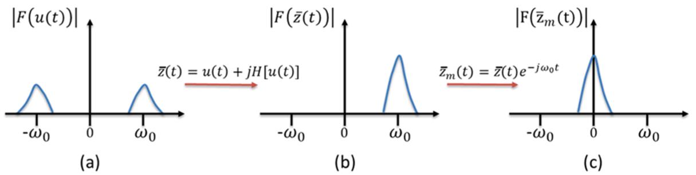
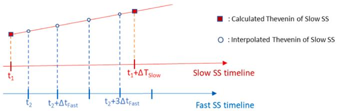
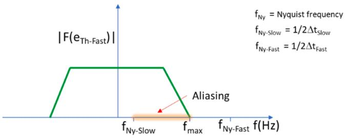
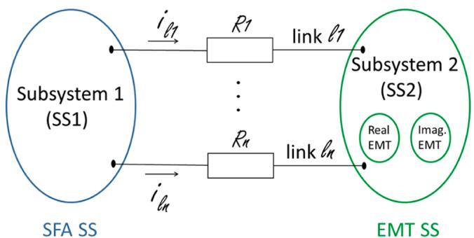
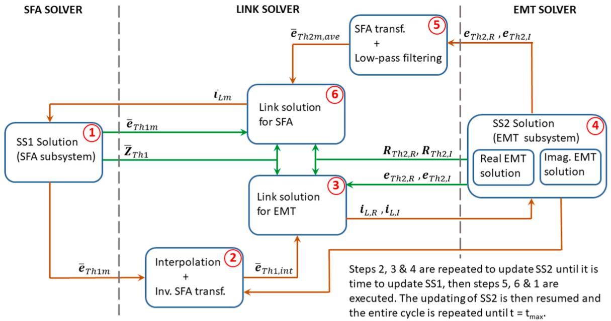
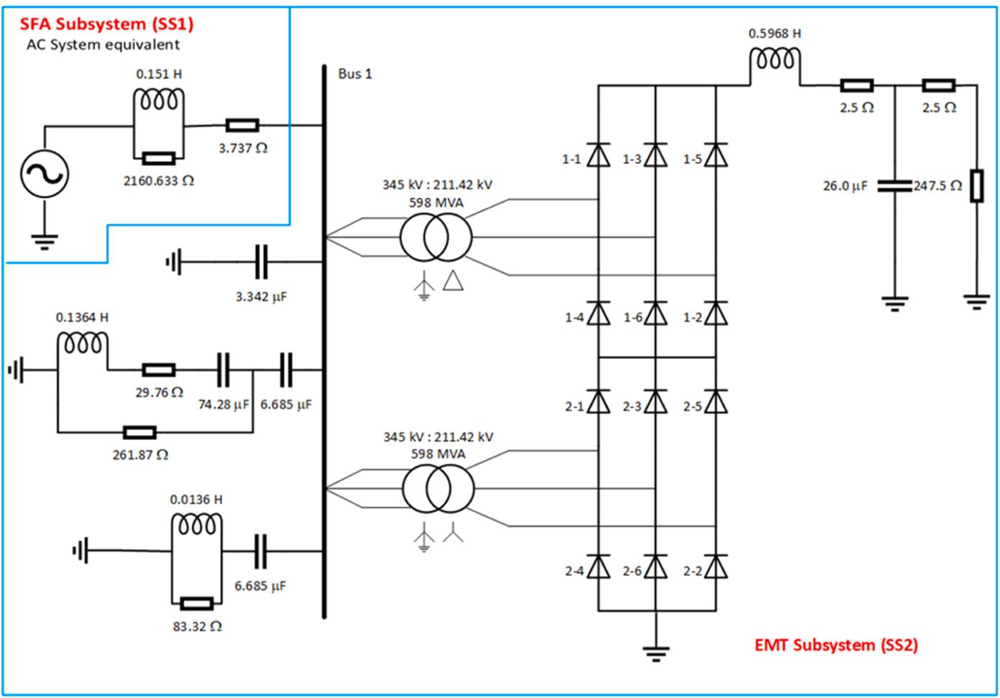
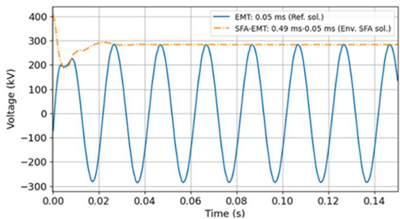
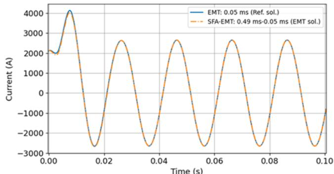
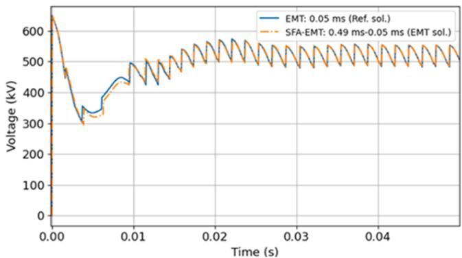
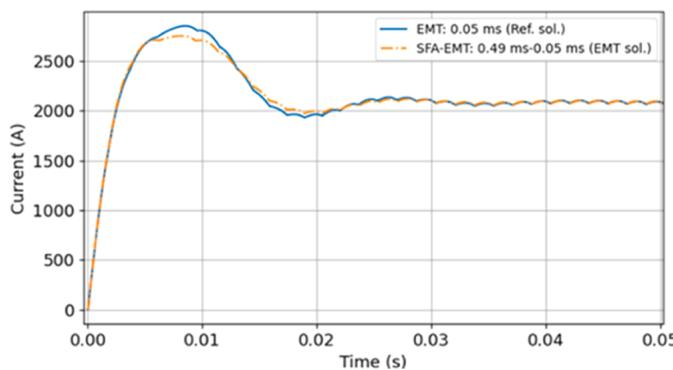

# SFA-EMT hybrid simulation of power systems: Application to HVDC systems

Javier O. Tarazona a , Andrea T.J. Martí b , Jos´e R. Martí c,*

a PSC North America, 155-4299 Canada Way, Burnaby, BC V5G4Y2, Canada   
b Department of Civil Engineering, University of British Columbia, Vancouver, BC V6T 1Z4, Canada   
c Department of Electrical and Computer Engineering, University of British Columbia, Vancouver, BC V6T 1Z4, Canada

# A R T I C L E I N F O

# Keywords:

Electromagnetic transients (EMT)

Hybrid simulation

Multirate simulation

Power electronic subsystems

Shifted frequency analysis (SFA)

# A B S T R A C T

This paper presents the application of a novel hybrid multirate protocol to interface a Shifted Frequency Analysis (SFA) solution with an Electromagnetic Transients (EMT) solution. Using the Multi Area Th´evenin Equivalent (MATE) framework, the protocol enables the direct interfacing of SFA and EMT solutions without time step delays, iterations, or the use of transmission lines to decouple the solutions. The protocol adds a parallel EMT solution to track both the real and imaginary parts of the EMT solution. This allows for a direct interface to the complex-number SFA solution. The proposed hybrid approach allows for large time steps in the SFA solution and does not require the time steps of the SFA and EMT systems to be multiples of each other. The protocol has been previously validated in a transient stability study, and it is applied in this paper to power electronics devices in the EMT subsystem using a modified CIGRE HVDC benchmark system. The use of SFA and the multirate nature of the solution offers significant computational savings for large power systems compared to an EMT-only solution.

# 1. Introduction

THE increased penetration of inverter-based resources (IBRs) is weakening the system’s inertia and increasing the effect of system perturbations [1]. Since the IBRs require small discretization steps, one option to study these systems is to use an electromagnetic transients (EMT) type of modelling for the entire system. However, given the size and extension of modern interconnected power systems, this approach becomes computationally expensive. A recent approach [2] uses the Multi Area Th´evenin Equivalent (MATE) concept [22] to create subsystems with different discretization step sizes.

For transient stability studies [3], a common approach has been to interface a conventional phasor solution of the AC system with an EMT solution of the IBR systems. This approach has the problem of intro ducing one time-step delay between the transient stability solution and the EMT solution [4–6]. This delay can lead to errors in the multirate solution. The hybrid simulators presented in [7] and [8] use interfacing protocols that iterate between the transient stability TS solvers and the EMT solvers to avoid the one-time-step delay in the multirate solution at the expense of additional iteration time.

The Shifted Frequency Analysis (SFA) method for transient stability

SFA-EMT [15] uses EMT discretization to find equivalent discrete-time circuit branches to replace the conventional impedance and admittance branches of transient stability programs to obtain a solution where the magnitude and phase angle of the voltage and current phasors are functions of time. Other approaches to having a time-dependent magnitude and phase angle phasor are Dynamic Phasor solutions [10, 11]; these approaches are based on Fourier decomposition instead of the EMT discretization approach. The SFA-EMT approach is particularly efficient in terms of time step sizes when the frequency deviations from 60 Hz are small. For larger deviations, the method is similar in efficiency to plain EMT solutions. Recent studies [12–14] show that SFA delivers better accuracy than a transient stability simulator for both classic and low inertia systems.

In general, previous approaches to interface an SFA solution of the AC grid with an EMT solution of IBRs have used transmission lines to decouple the two subsystems and, therefore, the maximum time step that could be used in the SFA solution was limited by the travelling time of the line.

A hybrid SFA-EMT multirate simulator is presented in [16] where good solutions are obtained without transmission lines interfacing. In [16], the proposed protocol was validated for a transient stability study

on the IEEE 39-bus test system. In that work we did not consider the details of power electronics subsystems. In the present paper, this SFA-EMT protocol is applied to a modified version of the CIGRE HVDC benchmark system [18] with the details of the power electronic devices simulated.

The rest of the paper is structured as follows: in Part II, a brief review of the SFA technique is presented. In Part III, some aspects of the MATE solution framework are discussed. The interaction protocol SFA/EMT is described in Part IV. Then, Part V discusses a simulation case study, and in Part VI, conclusions and directions for future work are presented.

# 2. Shifted frequency analysis of power systems

The dynamic behaviour of power systems is such that after the high frequencies associated with the electromagnetic transients have died out, the voltages and currents in the system have frequency spectra centered around the fundamental frequency of the system, with half bandwidths less than that frequency. This type of signal is called a bandpass signal. In the time domain, these signals are 60 Hz (or 50 Hz) sinusoids with a slow modulation in amplitude and phase or frequency.

# 2.1. Time-Dependent phasor

The time-dependent phasor U(t) of a bandpass signal $u ( t )$ , with its frequency spectrum centred on the system frequency $\omega _ { 0 } ,$ is defined as [19]

$$
\bar {U} (t) = u _ {I} (t) + j u _ {Q} (t) \tag {1}
$$

where $u _ { I } ( t )$ and $u _ { Q } ( t )$ are low-pass signals, modulating two in quadrature sinusoidal carrier signals with the same frequency (ω ) and 90◦ apart in phase.

# 2.2. The analytic signal

Another representation of u(t) is by means of its analytic signal $\overline { { z } } ( t )$ , defined as

$$
\bar {z} (t) = u (t) + j H [ u (t) ] \tag {2}
$$

where H[o ] signifies the Hilbert transform and is given by

$$
H [ u (t) ] = \frac {1}{\pi t} * u (t) = \frac {1}{\pi} \int_ {- \infty} ^ {\infty} \frac {u (\tau)}{t - \tau} d \tau \tag {3}
$$

The importance of the analytic signal is that it retains the real signal u(t) in its real part, its magnitude is the envelope of u(t), and the derivative of its angle is the instantaneous frequency of u(t) [19]. The relationship between the time-dependent phasor $\overline { { U } } ( t )$ and the analytic signal z(t) is as follows.

$$
\bar {z} (t) = \bar {U} (t) e ^ {i \omega_ {0} t} \tag {4}
$$

# 2.3. The SFA transformation

By defining a transformation T as follows:

$$
T ^ {- 1} = e ^ {- j \omega_ {0} t} \tag {5}
$$

Eq. (4) can be thought of as representing the mapping of the analytic signal into the time-dependent phasor domain. The signal z(t) in the normal time domain is related to the time-dependent phasor $\overline { { U } } ( t )$ as follows:

$$
\bar {U} (t) = \bar {z} _ {m} (t) = T ^ {- 1} \bar {z} (t) \tag {6}
$$

(subscript $\ " \mathbf { m } ^ { \ast }$ is used to denote the transformed time domain). For a bandpass signal with a frequency spectrum centred on $\omega _ { 0 } ,$ the analytic

signal is also a bandpass signal centred on $\omega _ { 0 }$ . From (6) and applying the properties of Fourier transform, it follows that the time-dependent phasor (TDP), or the transformed signal, has its frequency spectrum centred at zero frequency and is, therefore, a low-pass signal, which changes much less rapidly than the analytic signal. Hence, larger time steps can be used to capture this signal in the simulation. The above transformation is the one used for Shifted Frequency Analysis (SFA) [9], and, as mentioned previously, the transformed signals in the shifted frequency domain or SFA domain are the corresponding TDPs of the original real-valued time signals. In Fig. 1, the SFA process to derive the TDP from the real bandpass signal is shown.

EMT-like equivalent circuits can be derived for the different network elements, and the solution can be found for SFA in a similar way to EMT programs [14]. SFA models have been developed for several types of power system components [9,20,21]. The SFA solution of the circuit gives the magnitudes and angles of the time-dependent phasors in the system [14]. In this paper, unless otherwise stated, the term time-dependent phasor (TDP) will refer exclusively to the SFA solution.

# 3. MATE conceptual framework

The concept of Multi Area Th´evenin Equivalents was introduced in [22] to divide a system into subsystems where each subsystem can have its own solution method and its own solution step. The details of the MATE solution were presented in [17]. In MATE, after each subsystem is solved, the solutions are integrated simultaneously without time delays.

# 3.1. Multirate solution with MATE

MATE can be easily used in a partitioned system where each subsystem uses an EMT solution. In [2,23–25] successful MATE multirate EMT-EMT interacting simulations are presented. The applications in [23–25] require the time steps to be multiples of each other. In [2], this restriction was lifted, and an “asynchronous multirate solution” was presented. This approach is used in this paper.

In the asynchronous MATE solution, each subsystem is solved independently with its own arbitrary integration step. For each subsystem, at each solution time, the subsystem will have its Th´evenin equivalent available to interface with the other subsystems. In the EMT solution, the Th´evenin required for the solution of a particular subsystem at its next time step is calculated at the current time step, and a linear interpolation will provide a Th´evenin equivalent of that subsystem for the solution of the other subsystems [23]. This process is illustrated in Fig. 2 for a slow subsystem (using a large Δt) and a fast subsystem (using a small Δt).

In this asynchronous multirate solution, when a subsystem is being updated, the solutions of the subsystems advancing at a slower pace (larger time step) must be, using the terminology of signal processing, oversampled (interpolated) and the solutions of subsystems running at a higher rate (smaller time step) have to be decimated (downsampled) [2].

In the decimation of solutions advancing at faster rates, the simple interpolation of the Th´evenin voltages in the Th´evenin will not be enough. In fact, it may actually degrade the accuracy of the multirate solution because the fast solution may be ill-conditioned by the high frequencies that it may contain. According to the Shannon-Nyquist Sampling theorem, the maximum observable frequency in a sampled signal is the Nyquist frequency $( \mathrm { f _ { N y } } )$ , given by the inverse of twice the sampling interval (Δt) (this is a theoretical limit; in EMT simulation, one should stay at least 5 to 10 times below this frequency [26] for accuracy purposes). Any frequency higher than the Nyquist frequency present in the signal being sampled will produce a phenomenon known as aliasing in the sampled signal, which will distort the sampled signal. This situation is explained graphically in Fig. 3 for the case of two subsystems, fast and slow.

In order to prevent aliasing, prior to downsampling, the Th´evenin

  
Fig. 1. Amplitude spectra of a signal in different representations for the SFA process: a) Real bandpass signal, b) Analytic signal and c) SFA time-dependent phasor [19].

  
Fig. 2. Interpolation of the Th´evenin of the slow subsystem to calculate the link solutions required to update the fast subsystem at various solution times [19].

  
Fig. 3. Amplitude spectrum of the Fourier transform of the Th´evenin of the fast subsystem, with the indication of the range of frequencies that would produce aliasing in the slow subsystem solution [19].

voltages coming from the fast subsystem must be low-pass filtered (conditioned) to remove any frequencies above the Nyquist frequency of the slow subsystem.

# 4. Hybrid SFA-EMT simulation

# 4.1. SFA-EMT simulation in MATE

SFA permits the use of much larger times steps than would be required with a normal EMT simulation, but it turns the circuit variables into complex-valued ones. For a MATE solution of a system partitioned into an SFA subsystem and an EMT subsystem, the Th´evenin equivalent of the SFA subsystem is complex-valued in both the voltages and the impedances. This causes the real and imaginary parts in the normal time domain to be coupled, and therefore, the combined solution of the links to update the subsystems needs to be carried out in terms of complex numbers. For every SFA and EMT solution in an SFA-EMT simulation, a complex Th´evenin of the EMT subsystem is required. Since the EMT subsystem’s solution is real, an imaginary part has to be added to interface with the SFA complex solution.

It was shown in [16] that the imaginary part of the solution can be obtained by having a phantom imaginary EMT solution running simultaneously with the normal real part simulation. This approach allows for direct circuit-level interfacing of the SFA and EMT networks. For simplicity, we first explain the SFA-EMT interface methodology for the same time step in the SFA and EMT subsystems.

# 4.2. Single-rate SFA-EMT simulation [19]

Let us consider a system partitioned into two subsystems connected with $\ " \mathbf { n } \ "$ links, one identified as Subsystem 1 (SFA) and the other identified as Subsystem 2 (EMT), as indicated in Fig. 4. The SFA subsystem is to be solved with an SFA simulator and the EMT subsystem with an EMT simulator, both solutions use the same integration step Δt and the combined system solution will be found using MATE.

From the discussion at the beginning of this section, the EMT subsystem comprises two separate subsystems, one for the real part of the EMT solution and a companion running in parallel for the imaginary part of the solution. In the rest of this paper, the real and imaginary EMT subsystem solutions will be referred to as one single subsystem solution, with the understanding that whatever is done by that subsystem is done by both the real and the imaginary parts.

# 1) Links solution

Let us assume that the Th´evenin equivalents of both subsystems for solution time t have been determined at the end of the previous time step, and now it is time to solve for the links.

To update the subsystems, we need to solve the link currents in the normal time domain. Thus, applying the inverse SFA transformation to the equations for subsystem 1, separating them into real and imaginary parts, combining them with the equations for subsystem 2, and considering the voltage drops at the link resistances, we have that at time t

$$
\left(\boldsymbol {Z} _ {T h 1, R} + \boldsymbol {R} _ {l} + \boldsymbol {R} _ {T h 2, R}\right) \boldsymbol {i} _ {L, R} (t) - \boldsymbol {Z} _ {T h 1, l} \boldsymbol {i} _ {L, l} (t) = \boldsymbol {e} _ {R} (t) \tag {21}
$$

$$
\boldsymbol {Z} _ {\text {T h 1}, I} \boldsymbol {i} _ {L, R} (t) + \left(\boldsymbol {Z} _ {\text {T h 1}, R} + \boldsymbol {R} _ {I} + \boldsymbol {R} _ {\text {T h 2}, I}\right) \boldsymbol {i} _ {L, I} (t) = \boldsymbol {e} _ {I} (t) \tag {22}
$$

where $Z _ { T h 1 , R } , Z _ { T h 1 , I } , e _ { T h 1 , R } , e _ { T h 1 , I } , i _ { L , R } , i _ { L , I } , R _ { T h 2 , R } , R _ { T h 2 , I } , e _ { T h 2 , R } , e _ { T h 2 , I } ,$ are respectively, the real and imaginary parts of the matrix of Th´evenin impedances and the vector of Th´evenin sources of the SFA subsystem, the vector of link currents, the matrix of Th´evenin resistances and the vector of Th´evenin sources of the EMT subsystem. $\pmb { R } _ { l }$ is the matrix of link

  
Fig. 4. System split into two subsystems with $\ " \mathbf { n } \ "$ resistive links for SFA-EMT simulation with MATE [19].

resistances and ${ \pmb e } _ { R } ( t )$ and ${ \pmb e } _ { I } ( t )$ are given by

$$
\boldsymbol {e} _ {R} (t) = \boldsymbol {e} _ {\text {T h 1 . R}} (t) - \boldsymbol {e} _ {\text {T h 2 . R}} (t) \tag {23}
$$

$$
\boldsymbol {e} _ {I} (t) = \boldsymbol {e} _ {\text {T h 1}, I} (t) - \boldsymbol {e} _ {\text {T h 2}, I} (t) \tag {24}
$$

Making

$$
\boldsymbol {i} (t) = \left[ \begin{array}{l} \boldsymbol {i} _ {L, R} (t) \\ \boldsymbol {i} _ {L, I} (t) \end{array} \right] \tag {25}
$$

$$
\boldsymbol {e} (t) = \left[ \begin{array}{l} \boldsymbol {e} _ {R} (t) \\ \boldsymbol {e} _ {I} (t) \end{array} \right] \tag {26}
$$

$$
\boldsymbol {Z} = \left[ \begin{array}{c c} \boldsymbol {Z} _ {T h 1, R} + \boldsymbol {R} _ {l} + \boldsymbol {R} _ {T h 2, R} & - \boldsymbol {Z} _ {T h 1, I} \\ \boldsymbol {Z} _ {T h 1, I} & \boldsymbol {Z} _ {T h 1, R} + \boldsymbol {R} _ {l} + \boldsymbol {R} _ {T h 2, I} \end{array} \right] \tag {27}
$$

from (21)-(27) we have that

$$
\boldsymbol {Z} \boldsymbol {i} (t) = \boldsymbol {e} (t) \tag {28}
$$

$$
\boldsymbol {i} (t) = \boldsymbol {Z} ^ {- 1} \boldsymbol {e} (t) \tag {29}
$$

From the solution of (29), the real and imaginary link currents to update the subsystems can be extracted.

2) Individual subsystems solution   
a) EMT Subsystem

The real and imaginary EMT solutions can be calculated using the following equations;

$$
\boldsymbol {v} _ {2, R} (t) = \boldsymbol {e} _ {2, R} (t) - \boldsymbol {G} _ {2, R} ^ {- 1} \boldsymbol {C} _ {2} \boldsymbol {i} _ {L, R} (t) \tag {30}
$$

$$
\boldsymbol {v} _ {2, I} (t) = \boldsymbol {e} _ {2, I} (t) - \boldsymbol {G} _ {2, I} ^ {- 1} \boldsymbol {C} _ {2} \boldsymbol {i} _ {L, I} (t) \tag {31}
$$

where, ${ \pmb e } _ { 2 , R } ( t ) , { \pmb e } _ { 2 , I } ( t ) , { \pmb \nu } _ { 2 , R } ( t ) , { \pmb \nu } _ { 2 , I } ( t ) , { \pmb G } _ { 2 , R }$ and $\pmb { G } _ { 2 , I }$ are, for the EMT subsystem, the vectors of open-circuit voltages for the solution at time t, the vectors of solution voltages at time t and the conductance matrices for the real and imaginary solutions, respectively. $C _ { 2 }$ is the connectivity matrix of the EMT subsystem.

b) SFA Subsystem

To update the SFA subsystem, the real and imaginary link currents have to be combined in complex form, transformed to the SFA domain and then injected into the SFA subsystem employing Eq. (32).

$$
\bar {\boldsymbol {v}} _ {1 m} (t) = \bar {\boldsymbol {e}} _ {1 m} (t) - \overline {{\boldsymbol {Y}}} _ {1} ^ {- 1} \boldsymbol {C} _ {1} \bar {\dot {\boldsymbol {l}}} _ {L m} (t) \tag {32}
$$

where, $\bar { i } _ { L m } ( t )$ is the vector of link currents at time t in the SFA domain. $\overline { { \pmb { e } } } _ { 1 m } ( t )$ and $\overline { { \nu } } _ { 1 m } ( t )$ are for the SFA subsystem, the SFA vectors of open circuit voltages and the solution voltages at time t, respectively. $\overline { { \pmb { Y } } } _ { 1 }$ and $c _ { 1 }$ are the admittance matrix and the connectivity matrix of the SFA subsystem.

# 4.3. Multirate SFA-EMT simulation [19]

The SFA-EMT multirate interfacing protocol uses equations similar to those derived previously for the single-rate protocol. Considering the same system as in Fig. 4, let us assume that the SFA subsystem will be solved with a large time step $( \Delta \mathrm { T } _ { \mathrm { S F A } } ) _ { \mathrm { : } }$ , and the EMT subsystem will be solved with a small time step (ΔtEMT).

# 1) EMT Subsystem solution

After the SFA subsystem has been solved, the EMT subsystem’s solution begins. Assuming that the SFA subsystem has been updated at time $\mathbf { t } _ { 1 } ,$ the link currents at $\mathbf { t } ,$ where $\mathrm { t } _ { 1 } < t < \mathrm { t } _ { 1 } + \Delta \mathrm { T } _ { \mathrm { S F A } }$ can be found

applying (29) by interpolation of the Th´evenin equivalent of the SFA subsystem between the solutions at t and $\mathbf { t } _ { 1 } + \Delta \mathbf { T } _ { \mathrm { S F A } }$ [16]. The solution of the EMT subsystem is then obtained by injecting the link currents using (30) and (31).

# 2) SFA Subsystem solution

To solve the SFA subsystem at time t, after the EMT subsystem has been solved at $\mathbf { t } _ { 2 } ,$ where $\begin{array} { r } { \mathrm { t } _ { 2 } < t < \mathrm { t } _ { 2 } + \Delta \mathrm { t } _ { \mathrm { E M T } } , } \end{array}$ Eq. (29) can be used to determine the link currents. As mentioned in Sub-section III.A, in order to prevent aliasing in the solution of the SFA subsystem, a low-pass filtered or smoothed-out version of the Th´evenin Equivalents of the EMT subsystem must be used. The link currents from (29) are combined into a complex form and then transformed into the SFA domain to obtain the link currents to update the SFA subsystem using (32).

# 3) Antialiasing processing of the EMT solution

All the EMT Th´evenin equivalents are combined into complex forms and are shifted to the SFA domain. The shifted EMT solutions are now subjected to antialiasing processing. In this paper, the Savitzky-Goley (S-G) low-pass filter of order two is used as suggested in [2]. S-G filters have very flat passbands with moderate attenuation in their stopbands and have the important property that they do not introduce a phase delay; thus, the components of the signal are not distorted, while some high-frequency noise is attenuated [27].

# 4) SFA-EMT solution protocol

The SFA-EMT solution protocol previously described is summarized graphically in Fig. 5.

# 5. CASE study

In [16], the performance of the proposed SFA-EMT interfacing protocol was assessed for a case study using the IEEE 39-bus test system. The case study in this paper uses the proposed protocol in a system that contains power-electronics devices whose operation involves internal recurrent or periodic switching. A modified version of the CIGRE HVDC benchmark system [18] as indicated in Fig. 6, was simulated.

The modifications to the benchmark system were as follows. Only the AC system on the rectifier side, the rectifier station and the DC line were modelled. The inverter station was modelled with an equivalent resistive load of 247.5 Ω. The 3-winding 345/211.42/211.42 kV, 1196 MVA converter transformer was modelled as two 345/211.42 kV, 598 MVA, three-phase banks of three single-phase ideal transformers, one with a grounded star/delta connection and the other with a grounded-star/ ungrounded-star connection. The thyristors of the 6-pulse bridges of the rectifier station were modelled as diodes, that is, with no firing control. The rest of the data of that system is reported in [18]. The SFA and EMT software developed at our UBC lab was used for these cases.

As indicated in Fig. 6, the system was partitioned into two subsystems. The equivalent AC system was identified as the SFA Subsystem, and the HVDC part, which includes the rectifier converter station, the filters, capacitive compensators and all the DC parts, was identified as the EMT subsystem. The SFA subsystem was simulated with the SFA solver using a time step of 0.49 ms, and the EMT subsystem was simulated with the EMT solver using a time step of 0.05 ms. The rate ratio for this multirate simulation is 9.8, not to use an integer multiple of the time steps.

In order to prevent numerical oscillations in the SFA solution, the backward Euler integration rule is used in the SFA solver. To prevent numerical oscillations in the power electronics subsystem, the EMT solver uses the trapezoidal rule with Critical Damping Adjustment (CDA) [26].

The simulation started the rectifier station from a blocking condition

  
Fig. 5. SFA-EMT MATE multirate protocol [19].

  
Fig. 6. Modified CIGRE HVDC benchmark system and SFA and EMT subsystems [19].

of its valves; that is, in a steady state at initial conditions $\left( t = 0 ~ s \right)$ , everything was connected, but all valves were kept in a blocking condition. For the transient simulation (t = 0+), the valves’ blocking condition was removed, and they were allowed to operate normally. The

system’s transient behaviour was recorded for 300 ms.

The purpose of the study is mainly to capture the electromagnetic transients in the EMT subsystem using the proposed interfacing protocol. In this case, there are no electromechanical transients in the SFA

subsystem, and the generator is an ideal source. In order to evaluate the performance of the protocol, the results are compared with a reference solution conducted by simulating the entire system as a single unit with an EMT solver using a single small time-step of 0.05 ms and using the trapezoidal rule with CDA.

The results for the SFA subsystem are presented in Fig. 7. The magnitude of the time-dependent phasor of the SFA solution accurately captures the envelope of the voltage-time signal. After the transient period, the error was 0.2 %.

The results for the EMT subsystem are shown in Fig. 8 through Fig. 10. The accuracy of these results is shown in Table 1. From these results, it can be seen that the EMT solution reproduces the transient period of the startup of the rectifier with good accuracy. In Fig. 8, it is observed that the error in the peak current of phase “a” that flows from the AC system is 2.5 %. For the DC voltage at the rectifier (Fig. 9), the maximum error in the transient period is 5.4 %, but at the peak is just 0.8 %. In Fig. 10, the error at the peak value for the DC current at the rectifier terminal is 3.5 %.

These results validate the application of the proposed hybrid interface model between an SFA solution and an EMT solution for the multirate simulation of systems with power electronics-based components. In order to allow for higher rate ratios, the boundary between the SFA and EMT subsystems should be placed at some distance from the source of transients.

The accuracy of the results is excellent when the rectifier has reached normal operating conditions. This latter aspect was examined in an additional case with a time step of 4.01 ms for the SFA solution, keeping the time step of the EMT solution at 0.05 ms, which corresponds to a rate ratio of 80.2. In this case, the multirate solution matches the reference EMT solution very well for the steady state period, with maximum errors in the AC quantities <1.25 % and <0.6 % in the DC quantities.

The SFA solution uses complex phasors, while for the EMT solution, there is a solver for the real part and a solver for the imaginary part. Both solutions have some overhead. If N1 is the number of nodes of the AC network (SFA), N2 is the number of nodes of the EMT network, Δt-large is the time step for the AC network, and Δt-small is the time step for the EMT network, then the speedup of the hybrid solution is approximately N1⋅Δt-large/N2⋅Δt-small compared to a full EMT solution. For example, if Δt-large/Δt-small is 50 times, for a case where N1/N2 = 5 (20 % penetration of IBR), the speed-up would be 250 times.

# 6. Conclusions

In this paper, we use a hybrid protocol to interface a time-dependent phasor solution based on shifted frequency analysis (SFA) and an electromagnetic transient (EMT) solution based on discrete-time analysis. The solution protocol integrates both solutions in a multirate mode within the MATE solution framework. For the EMT solution, the framework performs two simultaneous parallel EMT simulations: one for the real part and another for the imaginary part of the SFA phasor

  
Fig. 7. Voltage on phase “b” of bus 1 in the SFA subsystem.

  
Fig. 8. Current from the AC system into phase “b” of bus 1 in the EMT subsystem.

Table 1 Accuracy of the sfa-emt results.   

<table><tr><td rowspan="2">Hybrid SFA-EMT solution</td><td rowspan="2">SFA after the transient 
Envelope of 
Bus 1 voltage</td><td colspan="3">EMT solution during the transient</td></tr><tr><td>Peak current 
from AC 
system</td><td>Peak DC 
voltage at 
rectifier</td><td>Peak DC 
current at 
rectifier</td></tr><tr><td>Error with 
respect to EMT 
reference [%]</td><td>0.2</td><td>2.5</td><td>0.8</td><td>3.5</td></tr></table>

  
Fig. 9. DC voltage at the rectifier terminal in the EMT subsystem.

  
Fig. 10. DC current at rectifier terminal in the EMT subsystem.

solution. An arbitrary time step can be used in each subsystem. The solution is based on a-b-c coordinates and, therefore, needs no assumptions regarding balanced operating conditions.

The validity of the proposed method has been demonstrated in a system with power electronics-based components. A modified version of the CIGRE HVDC benchmark system was used. The results show that the

proposed method exhibits good accuracy for capturing the transient behaviour of the EMT subsystem for the startup or initialization of the rectifier converter station. The use of SFA and the multirate nature of the solution offers significant computational savings for large power systems in comparison with an EMT-only solution.

As the proposed SFA-EMT multirate protocol lends itself naturally to the simulation of sub-harmonic and harmonic interactions between the EMT and the SFA subsystems, future research would be directed to study the effect on the AC grid of the injection of harmonics and/or subharmonics from distributed energy resources.

# CRediT authorship contribution statement

Javier O. Tarazona: Writing – original draft, Validation, Software, Methodology, Investigation, Formal analysis, Data curation, Conceptualization. Andrea T.J. Martí: Data curation, Writing – review & editing, Validation, Software, Methodology, Investigation, Formal analysis. Jose´ R. Martí: Supervision, Conceptualization, Validation, Project administration, Methodology, Investigation, Funding acquisition, Formal analysis, Writing – review & editing, Resources.

# Declaration of competing interest

The authors declare the following financial interests/personal relationships which may be considered as potential competing interests:

Jose R Marti reports financial support was provided by Natural Sciences and Engineering Research Council of Canada. If there are other authors, they declare that they have no known competing financial interests or personal relationships that could have appeared to influence the work reported in this paper.

# Data availability

Data will be made available on request.

# References

[1] V.N. Sewdien, et al., Effects of increasing power electronics on system stability: results from MIGRATE questionnaire, in: 2018 International Conference and Utility Exhibition on Green Energy for Sustainable Development (ICUE), IEEE, Oct. 2018, pp. 1–9.   
[2] V.A. Galvan-S´ anchez, ´ J.R. Martí, E.S. Banuelos-Cabral, ˜ J. Sotelo-Castan˜on, ´ J. L. García-Sanchez, ´ J.A. Guti´errez-Robles, An asynchronous MATE-multirate method for the modeling of electric power systems, Electr. Eng. 103 (2) (Apr. 2021) 993–1007, https://doi.org/10.1007/s00202-020-01128-x.   
[3] V. Jalili-Marandi, V. Dinavahi, K. Strunz, J.A. Martinez, A. Ramirez, Interfacing techniques for transient stability and electromagnetic transient programs - IEEE task force on interfacing techniques for simulation tools, IEEE Trans. Power Deliv. 24 (4) (Oct. 2009) 2385–2395.   
[4] A.A. van der Meer, M. Gibescu, M.A. van der Meijden, W.L. Kling, J.A. Ferreira, Advanced hybrid transient stability and EMT simulation for VSC-HVDC systems, IEEE Trans. Power Deliv. 30 (3) (Jun. 2015) 1057–1066.   
[5] Q. Huang, V. Vittal, Application of electromagnetic transient-transient stability hybrid simulation to FIDVR study, IEEe Trans. Power. Syst. 31 (4) (Jul. 2016) 2634–2646, https://doi.org/10.1109/TPWRS.2015.2479588.   
[6] D. Shu, X. Xie, Q. Jiang, Q. Huang, C. Zhang, A novel interfacing technique for distributed hybrid simulations combining EMT and transient stability models, IEEE Trans. Power Deliv. 33 (1) (Feb. 2018) 130–140.

[7] F. Plumier, P. Aristidou, C. Geuzaine, T. Van Cutsem, Co-simulation of electromagnetic transients and phasor models: a relaxation approach, IEEE Trans. Power Deliv. 31 (5) (Oct. 2016) 2360–2369.   
[8] X. Zhang, A.J. Flueck, S. Abhyankar, Implicitly coupled electromechanical and electromagnetic transient analysis using a frequency-dependent network equivalent, IEEE Trans. Power Deliv. 32 (3) (Jun. 2017) 1262–1269.   
[9] P. Zhang, J.R. Marti, H.W. Dommel, Shifted-frequency analysis for EMTP simulation of power-system dynamics, IEEE Trans. Circuits Syst. I 57 (9) (Sep. 2010) 2564–2574, https://doi.org/10.1109/TCSI.2010.2043992.   
[10] K. Mudunkotuwa, S. Filizadeh, U. Annakkage, Development of a hybrid simulator by interfacing dynamic phasors with electromagnetic transient simulation, IET Gener. Transm. Distrib. 11 (12) (Aug. 2017) 2991–3001, https://doi.org/10.1049/ iet-gtd.2016.1616.   
[11] J. Rupasinghe, S. Filizadeh, A.M. Gole, K. Strunz, Multi-rate co-simulation of power system transients using dynamic phasor and EMT solvers, J. Eng. 2020 (10) (Oct. 2020) 854–862, https://doi.org/10.1049/joe.2020.0099.   
[12] G. Nakti, J. Dinkelbach, M. Mirz, A. Monti, Comparative assessment of shifted frequency modeling in transient stability analysis using the open source simulator DPsim, in: 2022 Open Source Modelling and Simulation of Energy Systems (OSMSES), IEEE, Apr. 2022, pp. 1–6.   
[13] J. Dinkelbach, G. Nakti, M. Mirz, A. Monti, Simulation of low inertia power systems based on shifted frequency analysis, Energy 14 (7) (Mar. 2021) 1860.   
[14] A.T.J. Marti, J. Jatskevich, Transient stability analysis using shifted frequency analysis (SFA), in: 2018 Power Systems Computation Conference (PSCC), IEEE, Jun. 2018, pp. 1–7.   
[15] A.T.J. Marti, The Application of Shifted Frequency Analysis in Power System Transient Stability Studies, Univ. British Columbia, Vancouver, BC, Canada, 2018. M.A.Sc. Dissertation.   
[16] J.O. Tarazona, A.T.J. Martí, J.R. Martí, F.A. Moreira, Shifted frequency analysis-EMTP multirate simulation of power systems,Electr.Power Syst.Res.197 (2021) 107292, https://doi.org/10.1016/j.epsr.2021.107292.   
[17] J.R. Marti, L.R. Linares, J.A. Hollman, F.A. Moreira, OVNI: integrated software/ hardware solution for real-time simulation of large power systems, in: 14th Power Systems Computation Conference (PSSC), Sevilla, Spain, Jun. 2002.   
[18] M. Szechtman, T. Wess, C.V. Thio, First benchmark model for HVDC control studies, Electra 135 (Apr. 1991) 56–73.   
[19] J. Tarazona, Hybrid Shifted Frequency Analysis-Electromagnetic Transients Multirate Simulation of Power Systems, University of British Columbia, Vancouver, BC, Canada, 2023. PhD Dissertation.   
[20] Y. Huang, M. Chapariha, F. Therrien, J. Jatskevich, J.R. Marti, A constantparameter voltage-behind-reactance synchronous machine model based on shiftedfrequency analysis, IEEE Trans. Energy Convers. 30 (2) (Jun. 2015) 761–771, https://doi.org/10.1109/TEC.2014.2367098.   
[21] Peng Zhang, J.R. Marti, H.W. Dommel, Induction machine modeling based on shifted frequency analysis, IEEe Trans. Power. Syst. 24 (1) (Feb. 2009) 157–164.   
[22] J.R. Marti, L.R. Linares, J. Calvino, H.W. Dommel, J. Lin, OVNI: an object approach to real-time power system simulators, in: POWERCON ’98. 1998 International Conference on Power System Technology. Proceedings (Cat. No.98EX151), Beijing, China, IEEE, Aug. 1998, pp. 977–981.   
[23] F.A. Moreira, J.R. Marti, Latency techniques for time-domain power system transients simulation, IEEe Trans. Power. Syst. 20 (1) (Feb. 2005) 246–253.   
[24] F.A. Moreira, J.R. Marti, L.C. Zanetta, L.R. Linares, Multirate simulations with simultaneous-solution using direct integration methods in a partitioned network environment, IEEE Trans. Circuits Syst. I 53 (12) (Dec. 2006) 2765–2778, https:// doi.org/10.1109/TCSI.2006.882821.   
[25] V.A. Galvan, J.R. Marti, H.W. Dommel, J.A. Gutierrez-Robles, J.L. Naredo, MATE multirate modelling of power electronic converters with mixed integration rules, in: 2016 Power Systems Computation Conference (PSCC), Genoa, Italy, IEEE, Jun. 2016, pp. 1–7, https://doi.org/10.1109/PSCC.2016.7540945.   
[26] J.R. Marti, J. Lin, Suppression of numerical oscillations in the EMTP power systems, IEEe Trans. Power. Syst. 4 (2) (May 1989) 739–747, https://doi.org/ 10.1109/59.193849.   
[27] R.W. Schafer, On the frequency-domain properties of Savitzky-Golay filters, in: 2011 Digital Signal Processing and Signal Processing Education Meeting (DSP/ SPE), Palo Alto, CA, IEEE, Jan. 2011, pp. 54–59, https://doi.org/10.1109/DSP-SPE.2011.5739186.