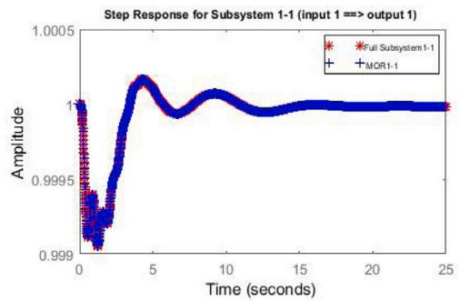
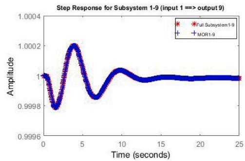
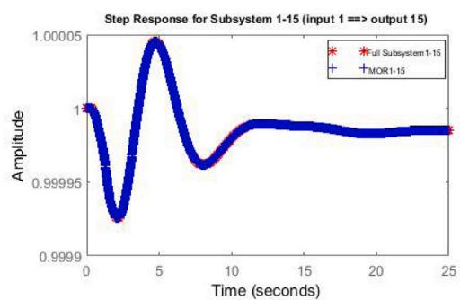
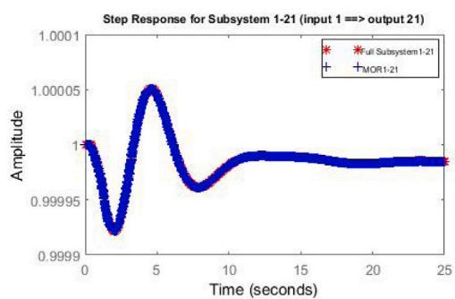
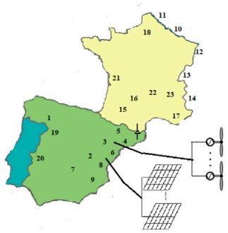
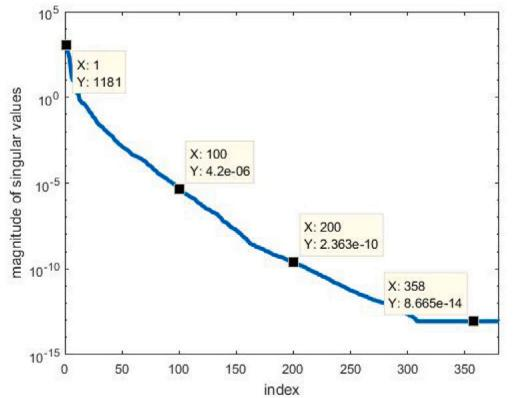
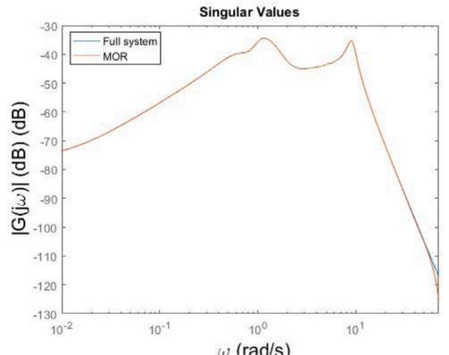
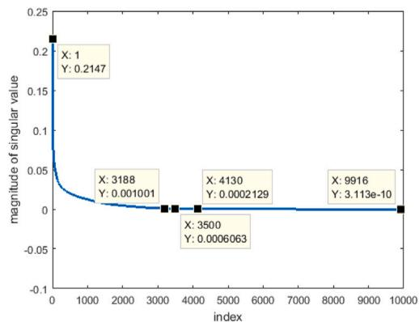
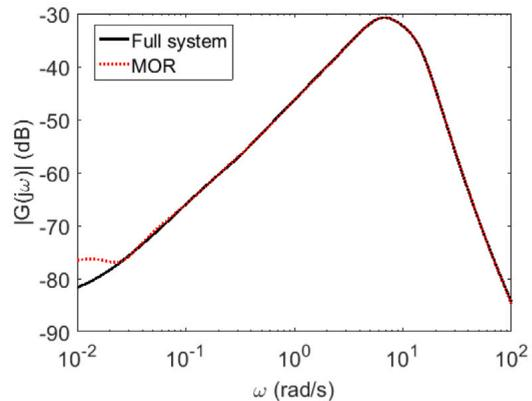

# Exhaustive modal analysis of large-scale power systems using model order reduction

M. Kouki a, B. Marinescu a,∗, F. Xavier b

a Ecole Centrale Nantes-LS2N-CNRS, Nantes, France   
b RTE-R&D, Paris LA DEFENSE CEDEX, France

# A R T I C L E I N F O

Keywords:

Modal analysis

Coupling modes

Large-scale power systems

Model order reduction

Balanced truncation

# A B S T R A C T

This paper presents an efficient modal analysis methodology that computes all modes of any given large-scale power system in exhaustive manner using the model order reduction techniques. For this, a reduced order model is generated using the Balanced Truncation (BT) method for which the controllability and observability gramians are approximated using the low-rank Cholesky factors. This leads to a rapid identification of classes of coupled dynamic devices of the original system. Next, approximated oscillatory modes are computed for each class. Finally, the exact values of the oscillatory modes of the overall power system are determined by iterative computations (the Modified Arnoldi method) initialized to the approximated modes found at the first step. The proposed methodology is able to put into evidence all coupling modes of any given large-scale power system (containing power electronics or any other specific dynamic devices). No a priori knowledge about the pattern of oscillations is needed. The accuracy and efficiency of the proposed methodology are thoroughly validated on several power systems with different orders, including a large scale model of the interconnected European power system.

# 1. Introduction

Power systems are in a radical change from electromechanical systems to power electronics based systems due to a massive penetration of renewable energies connected to the network via power electronic devices. Also, the immense size of actual power systems yields to linear mathematical models with very high dimensions which complicates further analysis. Hence, modal analysis of large scale systems becomes numerically fastidious.

Small-signal stability studies based on modal analysis are important to ensure global system stability [1,2]. Modal analysis of large-scale power systems is a challenging task, especially when an exhaustive computation of oscillatory modes is required. In fact, exhaustive modal analysis should be able to put into evidence all oscillatory modes of the system, i.e, inter-area and electrical coupling modes, as discussed in our previous works [3,4].

To this end, several approaches have been developed and discussed in literature. Most of them are unable to be exhaustive and provide only a selective modal analysis [5,6]. Moreover, they were developed based on the hypothesis that the modes of interest are mainly due to large synchronous machines. This is no longer the case now and in future because of the presence of renewable energy sources and power

electronics. To overcome these limitations, a new approach was discussed and developed in [4]. It was validated on several power systems including the large-scale model of the European power system [7]. The new approach provides an analytic and systematic way to compute all the coupling modes (inter-area, electrical, . . . ) of any given power system (conventional systems and systems with large penetration of power electronics) by aggregating dynamic devices which swing together into coupling class. It is able to quantify the interaction between the conventional generators, between the converters and conventional generators, and between the converters, in order to put into evidence all coupling modes.

It mainly consists in three steps. First, the quantification phase in which the interaction degree between the different dynamic devices of the power system is quantified. More specifically, for each device, the other devices that are coupled with it are determined and this leads to a partition into classes of coupled dynamic devices. Next, for each class, an approximation of its coupling modes is performed using a selective modal analysis method. Finally, a full analysis should be done in order to precisely compute the characteristics of all oscillatory modes such as their frequencies, damping ratios, modes shapes, and participation factors. This methodology outperforms the classic modal analysis methods and it is efficient especially in large scale cases.

However, the complexity and hence the computational time of the proposed methodology can be reduced to facilitate engineering studies. For this, in this paper, the model order reduction (MOR) techniques will be integrated to the first step (the quantification phase) of the proposed approach. In fact, an accurate reduced order model facilitates the quantification of the multi-input/multi-output interactions especially for large scale, which is the case of the European power system. This leads to a rapid and accurate identification of classes of coupled dynamic devices-independently to the system’s order and to the dynamic device type.

Quantification of the interaction between the different dynamic devices of a given power system consists of computing the modal controllability and observability, which are related to the energy needed for the control and observation of the states of the system, i.e., to the transfer from inputs to states and from states to outputs. In order to obtain the same results, but with a reduced complexity and computation time, order reduction techniques will be used.

For this, several order reduction techniques have been studied and used to substitute large-scale systems by reduced ones (low-dimensional systems) while maintaining the same input–output behavior of original systems (e.g. Krylov methods [8], SVD-based methods $[ 9 , 1 0 ] , \ldots ) ,$ , among which the Balanced Truncation (BT) will be used here for its robustness and efficiency in the elimination of the states that are difficult to reach and/or to observe. Indeed, with such order reduction, the most important input–output dynamic behaviors are preserved and they correspond to the most coupled devices of the original power system. BT is based on gramians which will be used in the quantification phase along with other input/output interaction indices, like the relative sensitivity indices.

This improves the first step of the aforementioned new modal analysis method. This step of classes computation is the one which needs the most time and computational effort. The accuracy and efficiency are validated by comparison with the old full computation of the classes on several power systems among which the large scale interconnected European power system [7].

This paper is organized as follows. Section 2 provides the problem formulation. Section 3 presents the modal analysis of large scale power system through model order reduction along with application cases. Section 4 concludes this work.

# 2. Problem formulation

Mathematical modeling of power systems leads to the following set of Differential–Algebraic Equations (DAE)

$$
\left\{ \begin{array}{l} \dot {x} = G (x, z) \\ 0 = H (x, z), \end{array} \right. \tag {1}
$$

where $x \in \mathbb { R } ^ { n }$ is the vector of differential variables and $z \in \mathbb { R } ^ { q }$ the vector of algebraic variables.

Linearization of (1) around an equilibrium point $( x _ { 0 } , z _ { 0 } )$ leads to

$$
\left\{ \begin{array}{l} \dot {x} = G _ {x} x + G _ {z} z \\ 0 = H _ {x} x + H _ {z} z, \end{array} \right. \tag {2}
$$

If the algebraic variables are eliminated from (2), the following state matrix is obtained

$$
A = G _ {x} - G _ {z} H _ {z} ^ {- 1} H _ {x}. \tag {3}
$$

The oscillatory modes of the system are among the complex conjugate eigenvalues of A:

$$
\lambda_ {i} = \sigma_ {i} \pm j w _ {i}. \tag {4}
$$

Using the information associated to these eigenvalues (frequencies, damping ratio, eigenvectors, $, \ldots ) ,$ , a full classification/analysis of oscillatory modes can be done. Thus, both electromechanical and electrical modes, called coupling modes in the sequel, can be analyzed. This full modal analysis is possible for small and classical systems. However, it is a challenging task in all other cases, at least for the following reasons:

• new power systems: can be considered as unknown systems because no prior knowledge about the structure and the shape of their oscillations is available   
• large-scale power systems: their models have a large number of states due to the size of the interconnected zones and of the detail need to model the dynamic devices   
• systems with high penetration of power electronics: in the last decade, the integration of Power Park Modules (PPMs) for renewable energy sources is in the full evolution. They present new types of electrical coupling modes which involve power converters.

As a consequence, the exhaustive modal analysis (eigenvalues, eigenvectors, modes shapes, . . . ) is numerically fastidious and even impossible with classical methods. Indeed, in most cases, these methods fail to systematically and automatically scan unknown or new largescale grids to find all coupling modes without a prior knowledge (like frequencies, path of oscillations, . . . ). In addition, most of these methods are selective (and not exhaustive) and only compute electromechanical modes where the large classic synchronous thermal plants are involved.

The methodology introduced in [3,4,11] overcomes these limitations. Its main part consists in grouping the dynamic devices of whole system in classes of interaction. The time and computation burden of this part are very important since the whole model of the system should be considered. Intuitively, the identification of the coupling classes of any given power system can be done by exciting, one by one, each dynamic device with a well chosen temporal signal, and by analyzing the correlation degree between the output responses of all dynamic devices [3]. However, in the case of large scale power systems this technique is numerically expensive and even impossible in many cases. For this, an analytic quantification of the interactions between the inputs/outputs of all dynamic devices was used in [4,11].

Both techniques (analytic and intuitive quantification), are based on the transfer between the inputs and outputs of the analyzed power system. The chosen inputs are the ones which excite one or several coupling modes, and the outputs are the variables of distant devices with important responses in such cases. This means that the considered coupling modes are controllable by the chosen inputs and observable from the chosen outputs. For this, the suitable inputs for the inter-area modes are the references of the voltage regulators $V _ { r e f }$ and the outputs are the speed ?? of each synchronous machine. For the cases of electrical coupling modes associated to the PPMs, the most significant transfer is between the reference of the voltage regulators and the power (reactive and active) injected to the grid.

Mathematically, the above definition of the coupling classes corresponds to a Multi-Input-Multi-Output (MIMO) view of the power system. For that, starting from (2) the MIMO power system can be described using the following state–space form,

$$
\left\{ \begin{array}{l} \dot {x} = A x + B u \\ y = C x, \end{array} \right. \tag {5}
$$

where $u \in \mathbb { R } ^ { m }$ and $\boldsymbol { y } \in \mathbb { R } ^ { q }$ are, respectively, the input and output vectors as defined above. $A \in \mathbb { R } ^ { n * n } , B \in \mathbb { R } ^ { n * m }$ and $C \in \mathbb { R } ^ { q * m }$ are the system matrices.

Notice that the identification of coupling classes for large-scale systems is possible with above mentioned analytic method, but with an important complexity and computational time. In order to more directly obtain the same results, order reduction techniques were used in the work presented here.

The model order reduction technique used in the phase of the coupling classes identification should be able to preserve the transfer behavior between the inputs and outputs of interest in the sense that the significant coupling behavior between the inputs and the outputs should be detected.

It is shown in Fig. 1 for a chosen test case which will be detailed in the next section that these transfer are well reproduced with the

  
Fig. 1. Time domain step responses for the full (order 1011) Spain–France power system (Fig. 2) and reduced one (order 200), for input at GARO-BA $( V _ { r e f 1 }$ 1-generator 1) and outputs at GARO-BA (??1-generator 1), at COFRENT (??9-generator 9), at GOLF52 (??15-generator 15) and at BRAUD (??21-generator 21).

  
Fig. 2. Spain–France interconnected power system.

reduced model in comparison with the ones obtained with the full model.

In the next section it is shown how this model reduction is exploited to simplify the exhaustive modal analysis approach.

# 3. Modal analysis using reduced order model

# 3.1. Model order reduction of state–space models

BT [8,12] based method is used here to eliminate the states which are not relevant in the chosen transfers. The latter are the ones which are less controllable and observable. They are put into evidence by computing the singular value decomposition (svd) of the controllability (?? ) and observability (??) gramian matrices. As a matter of fact, the state variables with strong contribution, are those associated to the largest singular values, which have thus to be preserved in the reduced model.

Mathematically, four main steps are required to compute a reducedorder model using BT

• Compute the gramian matrices ?? and ?? as solutions of the following Lyapunov equations

$$
\left\{ \begin{array}{l} A P + P A ^ {T} + B B ^ {T} = 0, \\ A ^ {T} Q + Q A + C ^ {T} C = 0. \end{array} \right. \tag {6}
$$

• Compute the Cholesky factors of ?? and ??

$$
\left\{ \begin{array}{l} P = U U ^ {T}, \text {w h e r e} U \text {i s a n u p p e r m a t r i x ,} \\ Q = L L ^ {T}, \text {w h e r e} L \text {i s a l o w e r m a t r i x .} \end{array} \right. \tag {7}
$$

• Compute the singular values of $U ^ { T } L$ and balance them into large and small values

$$
s v d \left(U ^ {T} L\right) = W \Sigma Y ^ {T} = \left[ \begin{array}{l l} W _ {1} & W _ {2} \end{array} \right] \left[ \begin{array}{c c} \Sigma_ {1} & 0 \\ 0 & \Sigma_ {2} \end{array} \right] \left[ \begin{array}{l} Y _ {1} ^ {T} \\ Y _ {2} ^ {T} \end{array} \right] \tag {8}
$$

where $W _ { 1 }$ and $Y _ { 1 }$ are consist of the first ?? columns of ?? and $Y _ { i }$ , respectively. The first ?? columns (?? ≪ ??) correspond to the largest singular values $\Sigma _ { 1 }$ of $\boldsymbol { \Sigma } = d i a g \{ \sigma _ { 1 } , \dots , \sigma _ { k } , \dots , \sigma _ { n } \}$ .

• Compute two projection matrices $T _ { L }$ and $T _ { R }$ that will be used in the construction of reduced state–space realization

$$
T _ {L} = L Y _ {1} \Sigma_ {1} ^ {- 1 / 2}, T _ {R} = U W _ {1} \Sigma_ {1} ^ {- 1 / 2} \tag {9}
$$

Based on $T _ { L }$ and $T _ { R } ,$ the matrices of the state-representation of the reduced model are

$$
A _ {r} = T _ {L} ^ {T} A T _ {R}, \quad B _ {r} = T _ {L} ^ {T} B, \quad C _ {r} = C T _ {R}, \tag {10}
$$

$$
\left\{ \begin{array}{l} \dot {x} _ {r} = A _ {r} x _ {r} + B _ {r} u \\ y _ {r} = C _ {r} x \end{array} \right. \tag {11}
$$

The classical implementation of the BT method [8] has three critical disadvantages:

• computationally expensive (takes several days for a system of the size of the European power system model),   
• high memory consumption,   
• suitable only for small to medium-sized systems (around 5000- states).

  
(a) Singular values for the case of Spain-France power system

  
(b)Frequency responses for the full transfer (order 1011)and reduced one (order 20O) between the input and output of GARO-BA generator (generator 1) for the Spain-France power system

  
(c) Singular values for the case of European power system

  
(d）Frequency responses for the original transfer (order 44143） and reduced one (order 35oo) between the input and output of GARMG12 generator (generator in Greece area) for the European power system   
Fig. 3. Spain–France and European power systems.

These disadvantages were counteracted in the enhanced BT [13]. More specifically, this new implementation of the BT is developed especially for the reduction of power systems using the sparse low-rank Cholesky factorization for the computing in a much faster way the controllability and observability gramians.

# 3.2. Test cases

Two test cases were used to assess performances of the methodology. The first one is a small model of the France–Spain interconnection and the second one is a large scale model of the European power system.

• The Spain--France interconnected power system consists of 23 synchronous generators, a PV solar farm, a wind farm, and a HVDC link between Spain and France as given in Fig. 2. Its resulting Jacobian matrix is of order 1011. An input ?? and an output ?? will be considered for each generator and each PPM according to the arguments presented in Section 2 to chose the inputs and the outputs of the MIMO model of the power system $\begin{array} { r } { ( u = V _ { r e f } , } \end{array}$ the references of the voltage regulators of each generator/PPM and $y = \varOmega ,$ , the speed deviation of each generator, and $y = p o w e r ,$ the active/reactive power of each PPM). Thus, 27 inputs and 27 outputs for Spain–France power system are used.   
• European interconnected power system The detailed model of the European power system including the Turkish zone [14] is used here. It consists of 1074 synchronous generators, therefore 1074 inputs and 1074 outputs were used (using the

same considerations as for the French-Spain case), and the resulting Jacobian matrix is of order 44 143.

All computations were carried out using Matlab R2019b on an i7 processor with a 3.60-GHz clock and 16 GB of RAM.

Based on the variation of the singular values (ranged in $[ 1 1 8 1 , 1 0 ^ { - 1 4 } ] )$ of the overall Spain–France power system given in $\mathrm { F i g . } \ 3 . { \mathsf { a , } }$ , the first 100 singular values (ranged in [1181, $1 0 e ^ { - 0 6 } ] )$ can be considered as the most significant ones. Indeed, the order of reduced system can be equal to 100, but for more accuracy the minimal singular value used here is equal to $1 0 e ^ { - 1 0 }$ which correspond to 200-state system. The frequency responses for the full and reduced subsystems are illustrated in Fig. 3.b. These results indicate a very good correlation between the full and reduced-order models which means that the coupled dynamic behavior of the full system is accurately preserved.

Fig. 3.c illustrates the largest singular values of the European power system. These singular values are ranged in $[ 0 . 0 2 1 , 1 0 e ^ { - 1 0 } ] ,$ . From these results it is shown that the most suitable reduced model order is equal to 3500. In fact, starting from this order the variation of the singular values is non considerable. The computational time to obtain this latter is 3597.5 s, which is very small compared to the computational time of the classical BT method (takes several days).

From Fig. 3.d we notice a good approximation of full system for all frequencies. This validates the choice of the reduced model order.

# 3.3. Coupling classes identification

Based on the obtained reduced-order state representation (11) of the full system, the interactions between the chosen inputs/outputs

Table 1 Comparison of coupling classes of Spain–France power system obtained using the full model (1 01 1 ) and reduced one (200) .   

<table><tr><td colspan="31">HII index</td></tr><tr><td colspan="31">Coupling classes using HI index and full model δHI=0.025</td></tr><tr><td>Generator</td><td>Gen1</td><td>Gen2</td><td>Gen3</td><td>Gen4</td><td>Gen5</td><td>Gen6</td><td>Gen7</td><td>Gen8</td><td>Gen9</td><td>Gen10</td><td>Gen11</td><td>Gen12</td><td>Gen13</td><td>Gen14</td><td>Gen15</td><td>Gen16</td><td>Gen17</td><td>Gen18</td><td>Gen19</td><td>Gen20</td><td>Gen21</td><td>Gen22</td><td>Gen23</td><td>HVDCF</td><td>HVDCS</td><td>WIND</td><td>PV</td><td></td><td></td><td></td></tr><tr><td>Class 1</td><td>✓</td><td></td><td></td><td></td><td></td><td></td><td></td><td></td><td></td><td></td><td></td><td></td><td>✓</td><td></td><td></td><td></td><td></td><td></td><td>✓</td><td>✓</td><td></td><td></td><td></td><td></td><td></td><td></td><td></td><td></td><td></td><td></td></tr><tr><td>:</td><td>:</td><td>:</td><td>:</td><td>:</td><td>:</td><td>:</td><td>:</td><td>:</td><td>:</td><td>:</td><td>:</td><td>:</td><td>:</td><td>:</td><td>:</td><td>:</td><td>:</td><td>:</td><td>:</td><td>:</td><td>:</td><td>:</td><td>:</td><td>:</td><td>:</td><td>:</td><td>:</td><td>:</td><td>:</td><td></td></tr><tr><td>Class 17</td><td></td><td>✓</td><td>✓</td><td></td><td></td><td></td><td></td><td></td><td>✓</td><td></td><td>✓</td><td>✓</td><td>✓</td><td>✓</td><td>✓</td><td></td><td></td><td>✓</td><td>✓</td><td>✓</td><td>✓</td><td>✓</td><td></td><td>✓</td><td>✓</td><td>✓</td><td>✓</td><td>✓</td><td>✓</td><td></td></tr><tr><td>:</td><td>:</td><td>:</td><td>:</td><td>:</td><td>:</td><td>:</td><td>:</td><td>:</td><td>:</td><td>:</td><td>:</td><td>:</td><td>:</td><td>:</td><td>:</td><td>:</td><td>:</td><td>:</td><td>:</td><td>:</td><td>:</td><td>:</td><td>:</td><td>:</td><td>:</td><td>:</td><td>:</td><td>:</td><td>:</td><td></td></tr><tr><td colspan="30">Coupling classes using HI index and reduced model with δHI=0.025</td><td></td></tr><tr><td>Class 1</td><td>✓</td><td></td><td></td><td></td><td></td><td></td><td></td><td></td><td></td><td></td><td></td><td></td><td>✓</td><td></td><td></td><td></td><td></td><td></td><td>✓</td><td>✓</td><td></td><td></td><td></td><td></td><td></td><td></td><td></td><td></td><td></td><td></td></tr><tr><td>:</td><td>:</td><td>:</td><td>:</td><td>:</td><td>:</td><td>:</td><td>:</td><td>:</td><td>:</td><td>:</td><td>:</td><td>:</td><td>:</td><td>:</td><td>:</td><td>:</td><td>:</td><td>:</td><td>:</td><td>:</td><td>:</td><td>:</td><td>:</td><td>:</td><td>:</td><td>:</td><td>:</td><td>:</td><td></td><td></td></tr><tr><td>Class 17</td><td></td><td>✓</td><td>✓</td><td></td><td></td><td></td><td></td><td></td><td>✓</td><td></td><td>✓</td><td>✓</td><td>✓</td><td>✓</td><td>✓</td><td></td><td></td><td>✓</td><td>✓</td><td>✓</td><td>✓</td><td>√</td><td>✓</td><td>✓</td><td>✓</td><td>✓</td><td>✓</td><td>✓</td><td></td><td></td></tr><tr><td>:</td><td>:</td><td>:</td><td>:</td><td>:</td><td>:</td><td>:</td><td>:</td><td>:</td><td>:</td><td>:</td><td>:</td><td>:</td><td>:</td><td>:</td><td>:</td><td>:</td><td>:</td><td>:</td><td>:</td><td>:</td><td>:</td><td>:</td><td>:</td><td>:</td><td>:</td><td>:</td><td>:</td><td>:</td><td></td><td></td></tr><tr><td colspan="30">PM index</td><td></td></tr><tr><td colspan="30">Coupling classes using PM index and original model with δPM=0.025</td><td></td></tr><tr><td>Class 1</td><td>✓</td><td></td><td></td><td></td><td></td><td></td><td></td><td></td><td></td><td></td><td></td><td></td><td>✓</td><td></td><td></td><td></td><td></td><td></td><td>✓</td><td>✓</td><td></td><td></td><td></td><td></td><td></td><td></td><td></td><td></td><td></td><td></td></tr><tr><td>:</td><td>:</td><td>:</td><td>:</td><td>:</td><td>:</td><td>:</td><td>:</td><td>:</td><td>:</td><td>:</td><td>;</td><td>:</td><td>:</td><td>:</td><td>:</td><td>:</td><td>:</td><td>:</td><td>:</td><td>:</td><td>:</td><td>:</td><td>:</td><td>:</td><td>:</td><td>:</td><td>:</td><td>:</td><td></td><td></td></tr><tr><td>Class 17</td><td></td><td>✓</td><td>✓</td><td></td><td></td><td></td><td></td><td></td><td>✓</td><td></td><td>✓</td><td>✓</td><td>✓</td><td>✓</td><td>✓</td><td></td><td></td><td>✓</td><td>✓</td><td>✓</td><td>✓</td><td>✓</td><td>✓</td><td>✓</td><td>✓</td><td>✓</td><td>✓</td><td>✓</td><td></td><td></td></tr><tr><td>:</td><td>:</td><td>:</td><td>:</td><td>:</td><td>:</td><td>:</td><td>:</td><td>:</td><td>:</td><td>:</td><td>:</td><td>:</td><td>:</td><td>:</td><td>:</td><td>:</td><td>:</td><td>:</td><td>:</td><td>:</td><td>:</td><td>:</td><td>:</td><td>:</td><td>:</td><td>:</td><td>:</td><td>:</td><td></td><td></td></tr><tr><td colspan="30">Coupling classes using PM index and reduced order model with δPM=0.025</td><td></td></tr><tr><td>Class 1</td><td>✓</td><td></td><td></td><td></td><td></td><td></td><td></td><td></td><td></td><td></td><td></td><td></td><td>✓</td><td></td><td></td><td></td><td></td><td></td><td>✓</td><td>✓</td><td></td><td></td><td></td><td></td><td></td><td></td><td></td><td></td><td></td><td></td></tr><tr><td>:</td><td>:</td><td>:</td><td>:</td><td>:</td><td>:</td><td>:</td><td>:</td><td>:</td><td>;</td><td>:</td><td>:</td><td>:</td><td>:</td><td>:</td><td>:</td><td>:</td><td>:</td><td>:</td><td>:</td><td>:</td><td>:</td><td>:</td><td>:</td><td>:</td><td>:</td><td>:</td><td>:</td><td>:</td><td></td><td></td></tr><tr><td>Class 17</td><td></td><td>✓</td><td>✓</td><td></td><td></td><td></td><td></td><td></td><td>✓</td><td></td><td>✓</td><td>✓</td><td>✓</td><td>✓</td><td>✓</td><td></td><td></td><td>✓</td><td>✓</td><td>✓</td><td>✓</td><td>✓</td><td>✓</td><td>✓</td><td>✓</td><td>✓</td><td>✓</td><td>✓</td><td></td><td></td></tr><tr><td>:</td><td>:</td><td>:</td><td>:</td><td>;</td><td>:</td><td>:</td><td>:</td><td>:</td><td>:</td><td>:</td><td>:</td><td>:</td><td>:</td><td>:</td><td>:</td><td>:</td><td>:</td><td>:</td><td>:</td><td>:</td><td>:</td><td>:</td><td>:</td><td>:</td><td>:</td><td>:</td><td>:</td><td>:</td><td></td><td></td></tr><tr><td colspan="29">RST index</td><td></td><td></td></tr><tr><td colspan="29">Coupling classes using RST index and original model with δRST=2e-04</td><td></td><td></td></tr><tr><td>Class 1</td><td>✓</td><td></td><td></td><td></td><td>✓</td><td>✓</td><td>✓</td><td></td><td></td><td></td><td></td><td></td><td></td><td></td><td></td><td>✓</td><td>✓</td><td></td><td></td><td>✓</td><td></td><td>✓</td><td></td><td>✓</td><td>✓</td><td>✓</td><td>✓</td><td>✓</td><td></td><td></td></tr><tr><td>:</td><td>:</td><td>:</td><td>:</td><td>:</td><td>:</td><td>:</td><td>:</td><td>:</td><td>:</td><td>:</td><td>:</td><td>:</td><td>:</td><td>:</td><td>:</td><td>:</td><td>:</td><td>:</td><td>:</td><td>:</td><td>:</td><td>:</td><td>:</td><td>:</td><td>:</td><td>:</td><td>:</td><td>:</td><td></td><td></td></tr><tr><td>Class 17</td><td></td><td></td><td></td><td></td><td>✓</td><td>✓</td><td>✓</td><td></td><td></td><td></td><td></td><td></td><td></td><td></td><td></td><td></td><td></td><td></td><td></td><td></td><td></td><td></td><td></td><td></td><td></td><td></td><td></td><td></td><td></td><td></td></tr><tr><td>:</td><td>:</td><td>:</td><td>:</td><td>:</td><td>:</td><td>:</td><td>:</td><td>:</td><td>:</td><td>:</td><td>:</td><td>:</td><td>:</td><td>:</td><td>:</td><td>:</td><td>:</td><td>:</td><td>:</td><td>:</td><td>:</td><td>:</td><td>:</td><td>:</td><td>:</td><td>:</td><td>:</td><td></td><td></td><td></td></tr><tr><td colspan="29">Coupling classes using RST index and reduced order model with δRST=0.2</td><td></td><td></td></tr><tr><td>Class 1</td><td>✓</td><td></td><td></td><td></td><td>✓</td><td>✓</td><td></td><td>✓</td><td></td><td></td><td></td><td></td><td></td><td></td><td></td><td></td><td></td><td></td><td>✓</td><td></td><td>✓</td><td>✓</td><td>✓</td><td>✓</td><td></td><td></td><td></td><td></td><td></td><td></td></tr><tr><td>:</td><td>:</td><td>:</td><td>:</td><td>:</td><td>:</td><td>:</td><td>:</td><td>:</td><td>:</td><td>:</td><td>:</td><td>:</td><td>:</td><td>:</td><td>:</td><td>:</td><td>:</td><td>:</td><td>:</td><td>:</td><td>:</td><td>:</td><td>:</td><td>:</td><td>:</td><td>:</td><td>:</td><td></td><td></td><td></td></tr><tr><td>Class 17</td><td></td><td></td><td></td><td></td><td>✓</td><td>✓</td><td>✓</td><td></td><td></td><td></td><td></td><td></td><td></td><td></td><td></td><td></td><td></td><td></td><td></td><td></td><td></td><td></td><td></td><td></td><td></td><td></td><td></td><td></td><td></td><td></td></tr><tr><td>:</td><td>;</td><td>:</td><td>:</td><td>:</td><td>:</td><td>:</td><td>:</td><td>:</td><td>:</td><td>:</td><td>:</td><td>:</td><td>:</td><td>:</td><td>:</td><td>:</td><td>:</td><td>:</td><td>:</td><td>:</td><td>:</td><td>:</td><td>:</td><td>:</td><td>:</td><td>:</td><td>:</td><td></td><td></td><td></td></tr></table>

Table 2 CPU time to compute one coupling class using Full Order Model (FOM) and Reduced Order Model (MOR).   

<table><tr><td rowspan="2">Index</td><td colspan="2">CPU time (s) Spain-France</td><td colspan="2">CPU time (s) European</td></tr><tr><td>FOM 1011-states</td><td>ROM 200-states</td><td>FOM 44143-states</td><td>ROM 3500-states</td></tr><tr><td>HII</td><td>6.18</td><td>1.16</td><td>-</td><td>615</td></tr><tr><td>PM</td><td>4.74</td><td>0.75</td><td>-</td><td>545</td></tr><tr><td>RST</td><td>0.53</td><td>0.0079</td><td>8.89e+04</td><td>6.71</td></tr></table>

of all dynamic devices can be quantified in several ways, according to several interaction indices which exist in the control design domain. The gramian indices (Participation Matrix (PM) index [15], the Hankel Interaction (HI) index [16]) and the Relative Sensitivity Technique (RST) index [17] are used here as they are characterized by a high accuracy in the quantification of the inputs/outputs transfer.

# 3.3.1. Gramian indices

As mentioned before, the observability and controllability matrices $P$ and $Q ,$ respectively, quantify the amount of the energy transferred from the inputs to the outputs. Indeed, the controllability and the observability measures are proportional to the coupling degree between the inputs and outputs of dynamic devices of a given power system. Mathematically, the coupling degree can be quantified using HI or PM indexes which both use gramians.

From the MIMO the state–space realization (5), several Single Input Single Output (SISO) subsystems $( A , b _ { j } , c _ { i }$ for $i = j = 1$ ∶ ???????????? $o f$ ?????????????? ??????????????) can be obtained for each pair of chosen input/outputs. For each subsystem the observability and controllability gramian matrices will be computed.

The HI index takes into account the steady-state and dynamic effects of the system in the quantification of the interaction between the inputs and the outputs. In fact, only the effect of the high singular values of the elementary subsystems can be taken into account by the HI index. Mathematically, the Hankel norm will be computed for each elementary subsystem, and then a matrix that quantifies all interactions will be generated.

$$
H I _ {i j} = \sqrt {\lambda_ {\max } \left(P _ {i} Q _ {j}\right)} = \sigma_ {1} ^ {H}, \tag {12}
$$

where, $P _ { i }$ and $Q _ { j }$ are, respectively, the controllability and the observability gramian matrices of the subsystem $( i , j ) . \lambda _ { m a x }$ is the greatest eigenvalue of $P _ { i } Q _ { j }$ and $\sigma _ { 1 } ^ { H }$ is the greatest Hankel singular value of the elementary subsystem $( i , j )$ .

The HI index only quantifies the effect of greatest Hankel singular values. However, in order to provide a matrix of coupled dynamic devices that is more efficient in constructing final classes, the effect of all Hankel singular values should be taken into account. This, in fact, can be done using the PM index. Mathematically, the PM index is defined by

$$
P M _ {i j} = \frac {\operatorname {t r} \left[ P _ {i} Q _ {j} \right]}{\operatorname {t r} [ P Q ]}, \tag {13}
$$

where ???? $\left[ P _ { i } Q _ { j } \right]$ is the trace of the matrix $\left[ P _ { i } Q _ { j } \right]$ , which denotes the ?????? of the squared Hankel singular values of the elementary subsystem $( i ,$ $j ) ,$ and $t r \left[ P Q \right]$ is equal to the sum of all $t r \left[ P _ { i } Q _ { i } \right]$ .

Notice that, these protocols are carried out for all the subsystems. Therefore, two matrices of coupled dynamic devices will be generated. Moreover, according a selection threshold $\delta ,$ two matrices of coupling classes will be determined.

• HI index

• PM index

# 3.3.2. RST index

Although the proved efficiency of the gramian indices in the quantification of the input/output interaction, when the system is very large and the number of chosen inputs is very high, the gramian indices require an important time to put into evidence all coupling classes. This high computational time is caused by the resolution of two Lyapunov equations for each elementary subsystem. To overcome this limitation, the RST index can be used.

The RST index assesses the magnitude response of ??th output to an impulse in ?? input using the relative degree $( r _ { i j } )$ , and then generates the Relative Sensitivity Matrix (RSM) defined by

$$
s _ {i j} = C _ {j} A ^ {r _ {i j} - 1} B _ {i} \Rightarrow S = \left[ \begin{array}{c c c} s _ {1 1} & \dots & s _ {n m} \\ \vdots & \dots & \vdots \\ s _ {m 1} & \dots & s _ {m n}, \end{array} \right] \tag {14}
$$

where $r _ { i j }$ is the lower integer that satisfies $s _ { i j } \neq 0 .$ .

Based on the ?? matrix, the RSM can be computed using the following Euclidean norm approximation.

$$
R S M _ {i j} = \frac {s _ {i j} ^ {2}}{\sum_ {i = 1} ^ {n} s _ {i j} ^ {2}}. \tag {15}
$$

Identifying all the classes of coupled dynamic devices (appropriate input–output pairs) of the grid can be done based on a selection threshold $\delta , \mathsf { i . e . } ,$ , the number of dynamic devices selected in each class varies according to ??.

• ∣ ??????(??, ??) ∣ ≥ ???????? ⇒ device ?? and device ?? are coupled,   
$\mid R S M ( i , j ) \mid < \delta _ { R S T } \Rightarrow$ device ?? and device ?? are not coupled.

# 3.3.3. Coupling classes of the Spain-France power system

A comparative study between the coupling classes obtained using the full system and reduced-order model for all interaction indices will be presented here.

The Spain–France power system is composed of 27 dynamic devices (23 synchronous generators and 3 renewable sources), therefore, 27 coupling classes must be generated. Table 1 illustrates only the coupled dynamic devices of classes 1 and 17 obtained with the gramians and RST indices for the Spain–France system with $\delta _ { P M } \ = \ 0 . 0 2 5 , \ \delta _ { H I } \ =$ 0.025, $\delta _ { R S T } ( f u l l ) = 2 e ^ { - 0 4 }$ , and $\delta _ { R S T } ( R O M ) \ = \ 0 . 2$ . The identification of coupling classes is done here using the full and reduced models of the Spain–France system. From these results, we notice that the classes obtained using the reduced-order model are similar to those generated using the full model for the gramians indices and quasi-similar for the RST index. These results validate the choice of the reduction order, the accuracy of the reduced-order model in preservation of the main input/output behavior of the original system, and also the accuracy of the gramians indices.

# 3.3.4. Coupled classes of the European power system

Computing the gramian matrices requires the resolution of two Lyapunov equations for each matrix element which is numerically very expensive, even impossible in large-scale cases. This makes the use of gramians indices only possible for the reduced model. In this case, the largest class contains 234 generators and it is computed in 10 min using a classical PC. This makes computation of all classes feasible for the scale of the European power system. Of course, the use of a super computer would supplementary speed such computations.

Table 3 Comparison between modal analysis using reduced-order model and full model for Spain–France power system.   

<table><tr><td>Number</td><td>Mode of full model</td><td>Mode with RST index using MOR</td><td>Mode with HI index using MOR</td><td>Mode with PM index using MOR</td></tr><tr><td>1</td><td>-131.5163 + j*178.9952</td><td>-131.5162 + j*178.9952</td><td>-131.5163 + j*178.9952</td><td>-131.5163 + j*178.9952</td></tr><tr><td>2</td><td>-135.0671 + j*164.8829</td><td>-135.0670 + j*164.8829</td><td>-135.0671 + j*164.8829</td><td>-135.0671 + j*164.8829</td></tr><tr><td>3</td><td>-139.8447 + j*136.6876</td><td>-139.8447 + j*136.6876</td><td>-139.8446 + j*136.6876</td><td>-139.8446 + j*136.6876</td></tr><tr><td>4</td><td>-144.6338 + j*97.2166</td><td>-144.6336 + j*97.2166</td><td>-144.6333 + j*97.2166</td><td>-144.6339 + j*97.2164</td></tr><tr><td>5</td><td>-73.1979 + j*72.7548</td><td>-73.1980 + j*72.7547</td><td>-73.1979 + j*72.7548</td><td>-73.1979 + j*72.7548</td></tr><tr><td>7</td><td>-17.7045 + j*55.9061</td><td>-17.7045 + j*55.9061</td><td>-17.7045 + j*55.9061</td><td>-17.7045 + j*55.9061</td></tr><tr><td>:</td><td>:</td><td>:</td><td>:</td><td>:</td></tr><tr><td>21</td><td>-0.3808 + j*6.0187</td><td>-0.3106 + j*5.8806</td><td>-0.3102 - j*5.2888</td><td>-0.3804 + j*6.0189</td></tr><tr><td>22</td><td>-0.3001 + j*5.5004</td><td>-0.2719 + j*5.5425</td><td>-0.3145 + j*5.4447</td><td>-0.3102 + j*5.2888</td></tr><tr><td>23</td><td>-0.5725 + j*4.9878</td><td>-0.5798 + j*4.9887</td><td>-0.5859 - j*4.9847</td><td>-0.5859 - j*4.9847</td></tr><tr><td>33</td><td>-0.2751 + j*1.0169</td><td>-0.3033 + j*0.9975</td><td>-0.2920 + j*1.0137</td><td>-0.2920 + j*1.0137</td></tr><tr><td>35</td><td>-1.4482 + j*0.8053</td><td>-1.5697 + j*0.8475</td><td>-1.4200 + j*0.9378</td><td>-1.4147 - j*0.7782</td></tr><tr><td>:</td><td>:</td><td>:</td><td>:</td><td>:</td></tr><tr><td>51</td><td>-0.2248 + j*0.1895</td><td>-0.2241 + j*0.1948</td><td>-0.2248 + j*0.1895</td><td>-0.2248 + j*0.1895</td></tr><tr><td>59</td><td>-0.1236 + j*0.0601</td><td>-0.1235 + j*0.0615</td><td>-0.1233 + j*0.0611</td><td>-0.1232 + j*0.0611</td></tr></table>

Table 4 Machines with highest participation in mode 35.   

<table><tr><td>Mac.</td><td>Rel. Part. (%)</td><td>Phase r. evec. δ (deg)</td><td>Rot. part</td><td>D-axes part.</td><td>Converter part.</td></tr><tr><td>G20</td><td>30.2</td><td>-150.5</td><td>0.0018</td><td>0.1170</td><td>-</td></tr><tr><td>G9</td><td>1.4</td><td>-9.0</td><td>0.0015</td><td>0.0035</td><td>-</td></tr><tr><td>G2</td><td>76.4</td><td>-0.1</td><td>0.0109</td><td>0.4641</td><td>-</td></tr><tr><td>G3</td><td>76.4</td><td>-0.1</td><td>0.0111</td><td>0.4652</td><td>-</td></tr><tr><td>G12</td><td>1.9</td><td>169.7</td><td>0.0062</td><td>0.0128</td><td>-</td></tr><tr><td>G13</td><td>2.8</td><td>168.9</td><td>0.0100</td><td>0.01960</td><td>-</td></tr><tr><td>G18</td><td>1.1</td><td>165.9</td><td>0.0015</td><td>0.0054</td><td>-</td></tr><tr><td>G14</td><td>1.5</td><td>156.1</td><td>0.0065</td><td>0.0016</td><td>-</td></tr><tr><td>G16</td><td>1.9</td><td>66.3</td><td>0.0001</td><td>0.0083</td><td>-</td></tr><tr><td>G21</td><td>4.3</td><td>47.2</td><td>0.0111</td><td>0.0034</td><td>-</td></tr><tr><td>G15</td><td>1.3</td><td>38.3</td><td>0.0055</td><td>0.0001</td><td>-</td></tr><tr><td>G4</td><td>1.6</td><td>2.9</td><td>0.0012</td><td>0.0109</td><td>-</td></tr><tr><td>G6</td><td>4.4</td><td>0.6</td><td>0.0052</td><td>0.0260</td><td>-</td></tr><tr><td>G7</td><td>1.6</td><td>0.6</td><td>0.0028</td><td>0.0065</td><td>-</td></tr><tr><td>Wind</td><td>3.3</td><td>0.0</td><td>-</td><td>-</td><td>0.0126</td></tr><tr><td>HVDC</td><td>5.4</td><td>0.0</td><td>-</td><td>-</td><td>0.0203</td></tr><tr><td>PV</td><td>7.3</td><td>0.0</td><td>-</td><td>-</td><td>0.0276</td></tr><tr><td>G8</td><td>100</td><td>0.0</td><td>0.0087</td><td>0.4082</td><td>-</td></tr></table>

Table 5 Machines with highest participation in mode 2.   

<table><tr><td>Mac.</td><td>Rel. Part. (%)</td><td>Phase r. evec. δ (deg)</td></tr><tr><td>PV</td><td>100</td><td>0.0</td></tr><tr><td>HVDC</td><td>78.8</td><td>0.0</td></tr><tr><td>Wind</td><td>23.5</td><td>0.0</td></tr></table>

Table 6 Machines with highest participation in mode 22.   

<table><tr><td>Mac.</td><td>Rel. Part. (%)</td><td>Phase r. 
evec. δ 
(deg)</td><td>Rot. part</td><td>D-axes part.</td><td>Converter 
part.</td></tr><tr><td>G8</td><td>88.6</td><td>8.2</td><td>0.2628</td><td>0.0082</td><td>-</td></tr><tr><td>G2</td><td>33.2</td><td>6.8</td><td>01002</td><td>0.0025</td><td>-</td></tr><tr><td>G3</td><td>33.1</td><td>6.8</td><td>0.0999</td><td>0.0024</td><td>-</td></tr><tr><td>G5</td><td>3.6</td><td>4.0</td><td>0.0105</td><td>0.0001</td><td>-</td></tr><tr><td>G9</td><td>28.0</td><td>3.7</td><td>0.0826</td><td>0.0611</td><td>-</td></tr><tr><td>G4</td><td>3.1</td><td>0.4</td><td>0.0084</td><td>0.0002</td><td>-</td></tr><tr><td>HVDC</td><td>1.2</td><td>0.0</td><td>-</td><td>-</td><td>0.0035</td></tr><tr><td>G7</td><td>100</td><td>0.0</td><td>0.2957</td><td>0.0065</td><td>-</td></tr><tr><td>G6</td><td>11.1</td><td>-7.3</td><td>0.0315</td><td>0.0011</td><td>-</td></tr><tr><td>G17</td><td>1.1</td><td>-117.7</td><td>0.0035</td><td>0.0002</td><td>-</td></tr><tr><td>G20</td><td>2.7</td><td>-128.7</td><td>0.0101</td><td>0.0019</td><td>-</td></tr><tr><td>G16</td><td>2.3</td><td>-150.2</td><td>0.0077</td><td>0.0001</td><td>-</td></tr><tr><td>G23</td><td>4.0</td><td>-159.2</td><td>0.0127</td><td>0.0007</td><td>-</td></tr><tr><td>G19</td><td>19.3</td><td>-161.7</td><td>0.0648</td><td>0.0040</td><td>-</td></tr></table>

For the RST index, computing all classes takes two hours on the same classical PC using the reduced model. This time is much improved compared with several days needed to compute some classes using the full model.

Table 2 illustrates the CPU times to compute one coupled class using full and reduced models of Spain–France and European systems with respect to all interaction indices. These results prove that the model order reduction technique accurately decreases the computational coast of the analysis of multi-input/multi-output large-scale power systems. In addition, the quantification of the input/output interaction becomes possible through all interaction indices independently of the system’s order.

# 3.4. Modes computation

For each coupling class, an approximation of all its modes is performed using SMA. Next, the approximate modes found by SMA should be adjusted to the exact values of the coupling modes of the overall system. For this, several iterative classic selective modal analysis like, e.g., modified Arnoldi or GSMA [5,18] method can be used.

59 oscillatory modes for the Spain–France power system are obtained. Table 3 provides some examples of modes obtained by different computations: with SMA for coupled classes generated using the reduced-order model, the gramians indices, and RST index. The second column of Table 3 illustrates the exact modes values that were directly computed on the overall system. The coupling modes obtained from the classes generated by the PM index are very precisely computed for all eigenvalues. This means that the constructed classes are efficient in the sense that there are no significant interactions between the dynamic devices of each of these classes and the rest of the system.

Based on results provided in Table 3, the coupling modes of the Spain–France power system can be classified mainly in two types: inter-are and electrical coupling modes. Three examples are given in Tables 4, 5, and 6.

Table 7 Comparison between modal analysis using reduced-order model and full model for European power system.   

<table><tr><td>Number</td><td>Mode with PM index using MOR</td><td>Mode with HI index using MOR</td><td>Mode with RST index using full model</td><td>Mode using full model</td><td>Freq. (Hz)</td><td>Damp.</td></tr><tr><td>1</td><td>-0.1247 ± j1.1142</td><td>-0.2602 ± j1.0712</td><td>-0.2362 ± j1.1142</td><td>-0.1199 ± j1.0671</td><td>0.1698</td><td>11.16</td></tr><tr><td>2</td><td>-0.1980 ± j1.5467</td><td>-0.1824 ± j1.9752</td><td>0.2003 ± j2.0038</td><td>-0.1728 ± j1.5044</td><td>0.2394</td><td>11.41</td></tr><tr><td>3</td><td>-0.1489 ± j2.0089</td><td>-0.1724 ± j0.1.9708</td><td>-0.1315 ± j2.0102</td><td>-0.1493 ± j1.9883</td><td>0.3164</td><td>7.49</td></tr></table>

Table 8 Machines with highest participation in mode 1.

Algorithm 1 Exhaustive Modal Analysis using model order reduction (Inputs: ???????? − ??????????; Outputs: Coupling modes)   

<table><tr><td>Country</td><td>Mac.</td><td>Real. Part. (%)</td><td>Phase R.avec. δ</td></tr><tr><td>Turkey</td><td>G1</td><td>100</td><td>0</td></tr><tr><td>Turkey</td><td>G2</td><td>100</td><td>0</td></tr><tr><td>Bulgaria</td><td>G3</td><td>89.7</td><td>5.9</td></tr><tr><td>:</td><td>:</td><td>:</td><td>:</td></tr><tr><td>France</td><td>G561</td><td>41.0</td><td>167.9</td></tr><tr><td>Spain</td><td>G562</td><td>36.3</td><td>-180.0</td></tr><tr><td>France</td><td>G563</td><td>57.8</td><td>171.9</td></tr></table>

• The results of mode 35 are illustrated in 4. This mode involves 18 geographically distant dynamic devices (15 synchronous generators and 3 converters). The participation of electrical dynamics (D-axes and converters) is more important than the electromechanical contribution. Thus, it is an electrical coupling mode between conventional power sources (synchronous generators) and renewable sources (participate through the converters).   
• The coupling mode number 2 involves only the renewable sources with the highest participation factors associated to the converters as given in Table 5. Hence, this mode is an electrical coupling mode.   
• The mode number 7 involves 10 distant geographical synchronous generators where the important contribution is associated to the electromechanical parts as given in Table 6. Thus, it is an inter-area mode.

Table 7 provides the well-known 3 slowest east–west inter-area modes of the European power system computed using the reducedorder model (order 3500) and the gramians indexes applied to the leading 10 classes. These results are compared to those obtained with the RST index applied to the full model. It follows from these results that computations with the PM index are more precisely compared to those generated by the other indexes.

The slowest and the most spread inter-area mode of the European power system is the mode number 1 in Table 7. It involves more than 500 generators from east–west extremities of the system (mainly from Spain, France, Turkey, Greece). Table 8 gives some elements of its analysis (mode shape and participation factors).

The main steps of the exhaustive modal analysis using model order reduction are summarized in Algorithm 1.

# 4. Conclusion

In this paper, an exhaustive modal analysis method based on a reduced-order model is presented. This method is able to find all coupling modes of any given power system. The latter may contain classic generator and renewable ones connected to the grid via power electronics. It does not require any a priory knowledge neither about the nature of modes nor about the participating dynamic devices.

This method is based on the choice of inputs and outputs to put into evidence the coupling degree between the all dynamic devices of the power system. For the large-scale cases, the quantification of the coupling degree is given by analytic methods which require low computational burden. For this, the BT model order reduction technique and analytic indices for quantification of dynamic interactions have been used. This proposed methodology is able to perform a full modal analysis of any given RMS model as well as the EMT models. For this

(1) Linearize the grid model and generate the state–space realization as (5)   
(2) Generate a suitable reduced order model using the BT model order reduction method   
(3) Generate the classes of coupled devices using an interaction index   
(4) for i=1:m do According to the threshold ??, select the different coupled dynamic devices

# end

(5) for k=1:number of classes do

(5.1) Generate the sub-matrices $( A _ { r r } , A _ { r z } , A _ { z r } , A _ { z z } )$ for each class   
(5.2) Apply the SMA algorithm and compute the modes related to the relevant dynamics   
(5.3) Select only the complex eigenvalues

# end

(6) Starting from each mode found at each class, do a full eigencalculation in order to obtain the exact values of the modes of the overall system.   
(7) Perform a full modal analysis (mode shape, participation factors, ...) to identify the really coupling modes.

latter the number of states will be higher than those of RMS models. However, using a robust MOR technique in the quantification phase can facilitate their analysis especially for large-scale cases.

Results included coupling classes, eigenvalues, step responses and frequency responses of full and reduced systems. They showed the efficiency of the BT method in the preservation of the transfer between the different dynamic devices and then in the identification of suitable coupled classes. The improved version of the exhaustive modal analysis showed high accuracy and effectiveness when applied to any given power system, especially, for large-scale systems.

# CRediT authorship contribution statement

M. Kouki: Methodology, Implementation, Validation tests, Writing. B. Marinescu: Methodology, Writing. F. Xavier: Formulation, Validation, Reviewing.

# Declaration of competing interest

The authors declare that they have no known competing financial interests or personal relationships that could have appeared to influence the work reported in this paper.

# Acknowledgment

This project has received funding from the European Union’s Horizon 2020 research and innovation programme under grant agreement No. 883985 (POSYTYF — POwering SYstem flexibiliTY in the Future through RES, https://posytyf-h2020.eu/)

# References

[1] P. Kundur, Power Systems Stability and Control, EPRI, 1994.   
[2] K. Kim, H. Schattler, V. Venkatasubramanian, J. Zaborszky, P. Hirsch, Methods for calculating oscillations in large power systems, IEEE Trans. Power Syst. 12 (4) (1997) 1639–1648.   
[3] M. Kouki, B. Marinescu, F. Xavier, Eigencalculation of coupling modes in largescale interconnected power systems with high power electronics penetration, in: 2018 Power Systems Computation Conference (PSCC), 2018, pp. 1–7.   
[4] M. Kouki, B. Marinescu, F. Xavier, Exhaustive modal analysis of large-scale interconnected power systems with high power electronics penetration, IEEE Trans. Power Syst. 35 (4) (2020) 2759–2768.   
[5] L. Rouco, I.J. Pérez-Arriaga, R. Criado Calero, J. Soto, A computer package for analysis of small signal stability in large electric power systems, in: Proceedings of the 11th Power Systems Computation Conference, Avignon (France), 1993, pp. 1141–1148.   
[6] J. Rommes, N. Martins, F.D. Freitas, Computing rightmost eigenvalues for smallsignal stability assessment of large-scale power systems, IEEE Trans. Power Syst. 25 (2) (2010) 929–938.   
[7] A. Semerow, S. Höhn, M. Luther, W. Sattinger, H. Abildgaard, A.D. Garcia, G. Giannuzzi, Dynamic study model for the interconnected power system of continental europe in different simulation tools, in: IEEE Eindhoven PowerTech, IEEE, 2015, pp. 1–6, June, 2015.   
[8] A.C. Antoulas, Approximation of Large-Scale Dynamical Systems, Society for Industrial and Applied Mathematics, 2005.   
[9] A. Ramirez, A. Mehrizi-Sani, D. Hussein, M. Matar, M. Abdel-Rahman, J.J. Chavez, S. Kamalasadan, Application of balanced realizations for model-order reduction of dynamic power system equivalents, IEEE Trans. Power Deliv. 31 (5) (2015) 2304–2312, (2016).

[10] Y.G.I. Acle, F.D. Freitas, N. Martins, J. Rommes, Parameter preserving model order reduction of large sparse small-signal electromechanical stability power system models, IEEE Trans. Power Syst. 34 (4) (2019) 2814–2824.   
[11] M. Kouki, B. Marinescu, F. Xavier, Exhaustive modal analysis of interconnected European power system, in: 2020 IEEE Electric Power and Energy Conference (EPEC), 2020, pp. 1–6.   
[12] S. Gugercin, A.C. Antoulas, A survey of model reduction by balanced truncation and some new results, Internat. J. Control 77 (8) (2004) 748–766.   
[13] F.D. Freitas, J. Rommes, N. Martins, Gramian-based reduction method applied to large sparse power system descriptor models, IEEE Trans. Power Syst. 23 (3) (2008) 1258–1270.   
[14] M. Luther, I. Biernaka, D. Preotescu, Feasibility Aspects of a Synchronous Coupling of the IPS/UPS with the UCTE, CIGRE Session, C1-204, Paris, France, 2010.   
[15] A. Conley, M.E. Salgado, Gramian based interaction measure, in: Proceedings of the 39th IEEE Conference on Decision and Control (Cat. No. 00CH37187), Vol. 5, 2000, pp. 5020–5022.   
[16] B. Wittenmark, M.E. Salgado, Hankel-norm based interaction measure for input– output pairing, in: Proc. IFAC 15th Triennial World Cong., Barcelona, Spain, 21-26 July, 2002, pp. 429–434.   
[17] X. Yin, J. Liu, Input–output pairing accounting for both structure and strength in coupling, AIChE J. 63 (4) (2017) 1226–1235.   
[18] I.J. Perez-Arriaga, G.C. Verghese, F.C. Schweppe, Selective modal analysis with applications to electric power systems, PART I: Heuristic introduction, IEEE Trans. Power Appar. Syst. PAS-101 (9) (1982) 3117–3125.