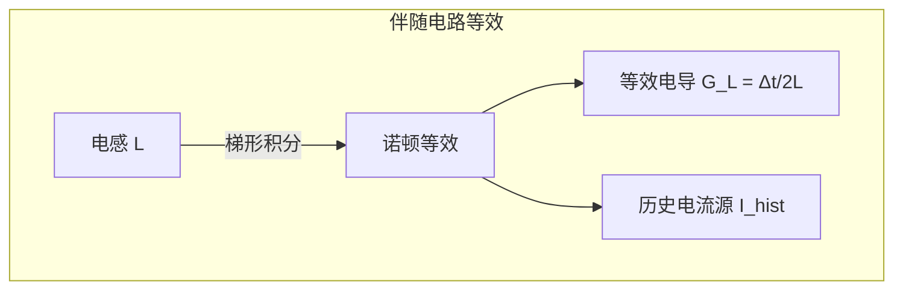
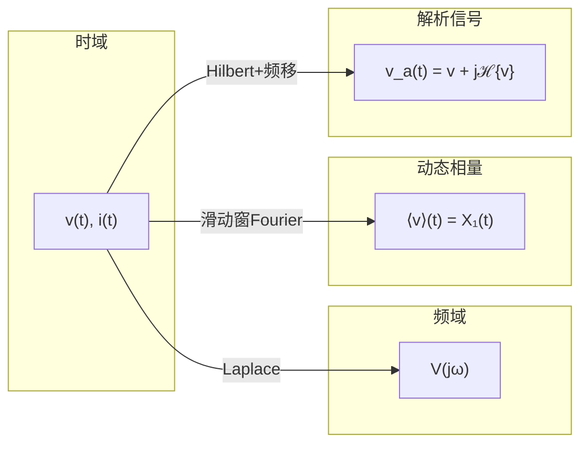

# 学术表达提升工作计划

## 概述

本计划针对 EMT Wiki 现有 1136 个页面的学术表达质量，从四个维度进行系统性提升：符号标准化、学术语言统一、图示规划、学习路径设计。目标是使 wiki 从"可读"升级为"可引用"——技术文档的清晰度和一致性接近教科书水平。

---

## 第一部分：符号表与全文学术表达统一

### 1.1 现状问题

- 同一物理量在不同页面使用不同符号（如步长同时出现 Δt、h、δt、T_s）
- 复数表示不一致（j 与 i 混用，* 与 overline 混用）
- 矩阵/向量/标量的字体区分不统一
- 公式编号和引用缺乏规范
- 同一概念表述方式多样（如"伴随电路" vs "伴随电路模型"，"频变" vs "频率相关"）

### 1.2 符号表设计

创建 `wiki/standards/symbol-table.md`，作为全 wiki 的符号引用标准。

#### 核心原则

| 类别 | 规则 | 示例 |
|------|------|------|
| 标量 | 斜体 | v, i, t, h, L, C |
| 向量 | 粗体小写 | **v**, **i**, **x** |
| 矩阵 | 粗体大写 | **Y**, **Z**, **A** |
| 复数 | 加点或粗体 | \\.{V}, \\.{I} 或粗体 |
| 相量 | 大写加点 | \\.{V} 表示电压相量 |
| 估计值 | hat | \hat{x} |
| 平均值 | langle rangle | \langle x \rangle |
| 共轭 | * 上标 | V^* |

#### 通用符号规范表（节选）

| 符号 | 含义 | 替代禁用 |
|------|------|---------|
| h 或 Δt | 仿真步长 | 禁用 δt、T_s（T_s 留给采样周期） |
| t_n | 第 n 个时间点 | |
| x_n | 第 n 步的状态向量 | |
| **Y**_n | 节点导纳矩阵 | |
| **A**, **B**, **C**, **D** | 状态空间矩阵 | |
| ω_s | 额定角频率（= 2πf_s） | 禁用 ω_0、ω_base（留给基准值） |
| j | 虚数单位 | 禁用 i（保留给电流） |
| ℋ | Hilbert 变换算子 | |
| τ | 传播时延 / 时间常数 | |
| Z_c | 特征阻抗 | |
| v_{crit} | 起晕电压阈值 | |
| V_{dc} | 直流母线电压 | |
| S(t) | 开关函数 | |

#### 下标规范

| 下标 | 含义 | 使用 |
|------|------|------|
| d, q | dq 坐标系 | v_d, i_q |
| α, β | αβ 坐标系 | v_α, i_β |
| 0, 1, 2 | 零/正/负序 | V_0, V_1, V_2 |
| ref | 参考值 | v_ref |
| err | 误差 | v_err |
| max, min | 最大/最小 | v_max, v_min |
| avg | 平均 | v_avg |
| hist | 历史源 | I_hist |
| L, C, R | 元件标识 | G_L, I_hist,C |

### 1.3 学术表述规范

创建 `wiki/standards/academic-style-guide.md`，内容涵盖：

#### 语言规范

| 场景 | ✅ 正确 | ❌ 避免 |
|------|---------|--------|
| 论文引用 | "X 等 (2024) 提出了..." | "论文提出..."（拟人化）|
| 方法描述 | "该方法适用于..." | "该方法可以完美解决..."（过度承诺）|
| 对比 | "与 A 相比，B 的误差减小了 X%" | "B 明显优于 A"（模糊比较）|
| 边界 | "验证限于 X 算例" | "该方法通用有效"（无边界）|
| 量化 | "加速比为 3.47×（5 核配置）" | "显著加速"（模糊）|
| 数学推导 | "由式 (12) 可得..." | "显然"（缺乏推导线索）|

#### 数学公式规范

- 所有公式必须使用 LaTeX `$$...$$` 块级或 `$...$` 行内
- 关键公式需编号（`\tag{1}` 或手动 `(1)`）
- 公式中的变量首次出现需解释
- 推导的关键步骤不可跳跃

#### 已完成的实体页修正模式

此前在 entity 页面中执行的修正可以作为模板推广到所有页面：

- 全球领先 → 有研究成果 / 用于
- 最经典 → 经典
- 突破 → 贡献
- 泰斗/权威 → 学者
- 广泛使用 → 用于
- 彻底解决 → 能够处理

### 1.4 执行策略

**Phase A**: 先完成 symbol-table.md 和 academic-style-guide.md 两个标准文档
**Phase B**: 编写自动化脚本扫描常见违规模式（可基于现有 strict_audit 框架扩展）
**Phase C**: 按优先级分批修正：entity → method → model → topic → source

---

## 第二部分：附图展示方案

### 2.1 现状评估

现有 wiki 页面几乎全部为纯文本+公式，**没有任何示意图**。对于以下类型的知识，文字描述效率远低于图示：

### 2.2 图示需求分级

#### P0 — 高优先级（无图严重影响理解）

| 页面 | 所需图示类型 | 说明 |
|------|-------------|------|
| methods/companion-circuit.md | 伴随电路等效图 | 电感→诺顿等效、电容→诺顿等效 的转化图示 |
| methods/bergeron-line-model.md | 行波传播图 | 入射/反射波、Bergeron 特征线 |
| methods/nodal-analysis.md | 节点法示意图 | 伴随电路接入节点网络的流程 |
| models/mmc-model.md | MMC 拓扑图 | 三相 MMC 桥臂、子模块结构 |
| methods/ss-method-or-vector-fitting.md | 算法流程图 | VF 迭代求解流程 |
| methods/hybrid-simulation-interface.md | 混合仿真接口图 | EMT-RMS 数据交换时序 |
| topics/real-time-simulation.md | 实时仿真架构图 | HIL 闭环结构 |

#### P1 — 中优先级（有图显著提升效率）

| 页面 | 所需图示类型 | 数量 |
|------|-------------|:----:|
| methods/dynamic-phasor.md | 频谱搬移示意图 | 2 |
| methods/hilbert-transform.md | 解析信号构造 | 1 |
| models/transmission-line-model.md | 各类线路模型对比 | 1 |
| methods/companion-circuit.md 的补充 | 开关事件的伴随电路变化 | 1 |
| models/vsc-model.md | 两电平/三电平 VSC | 1 |
| models/lcc-model.md | LCC 拓扑 + 换相过程 | 2 |
| methods/multirate-method.md | 多速率时序图 | 1 |
| methods/vector-fitting.md 的补充 | 极点/留数拟合过程 | 1 |
| methods/parallel-in-time.md | 时间并行网格图 | 1 |
| methods/state-space-method.md | SS ↔ 电路转换 | 1 |
| topics/co-simulation.md | 混合仿真架构总览 | 1 |
| topics/wideband-oscillation-stability.md | 振荡类型谱系图 | 1 |

#### P2 — 低优先级（锦上添花）

其余 method/model/topic 页面的公式类示意图、对比表格的可视化。

### 2.3 图示技术选型

| 类型 | 工具 | 说明 |
|------|------|------|
| 电路拓扑 | Mermaid.js / SVG | 用 Mermaid 的 block diagram 画基本拓扑，复杂拓扑用 SVG |
| 算法流程图 | Mermaid flowchart | VF、NR 迭代等流程 |
| 时序/信号图 | Mermaid sequence | 混合仿真数据交互时序 |
| 频谱类 | Mermaid block / text | 频谱搬移前后对比 |
| 对比表格 | 原生 Markdown 表格 | 不需要图，但可优化表格样式 |

**技术约束**: Mermaid.js 在 GitHub Markdown 中原生渲染，零依赖，因此优先使用。

#### Mermaid 示例

````markdown

````

### 2.4 执行策略

**Phase A**（首批 10 图）：选取 P0 中最急需的 10 个页面，每个页面添加 1-2 个核心 Mermaid 图
**Phase B**（P0+P1 覆盖）：完成全部 P0 和 P1 级别的图示约 25-30 个
**Phase C**（持续补充）：结合新页面创建和读者反馈持续补充

---

## 第三部分：学习路线图

### 3.1 设计思路

基于书稿规划的六篇结构和现有 wiki 的 448 个方法/模型/主题页，设计多条学习路线。每条路线标注：先修知识、核心页面、进阶页面、典型论文和预期学习时间。

### 3.2 学习路线概览

| 路线 | 难度 | 目标读者 | 预计时间 |
|------|:----:|---------|:--------:|
| **A: EMT 仿真入门** | ★☆☆ | 研究生/工程师入门 | 2-3 周 |
| **B: 数值方法与求解器** | ★★☆ | 算法研究人员 | 3-4 周 |
| **C: 输电线路与电缆建模** | ★★☆ | 电力系统工程师 | 2-3 周 |
| **D: 电力电子与 MMC 建模** | ★★★ | 电力电子研究人员 | 4-6 周 |
| **E: 混合仿真接口技术** | ★★★ | 系统仿真工程师 | 3-4 周 |
| **F: 实时仿真与硬件在环** | ★★☆ | 实时仿真工程师 | 2-3 周 |
| **G: 新能源并网 EMT 分析** | ★★☆ | 新能源研究人员 | 3-4 周 |
| **H: 模型降阶与宽频等值** | ★★★ | 高级研究人员 | 3-5 周 |

### 3.3 各路线详细设计

#### 路线 A: EMT 仿真入门

**目标**: 理解 EMT 仿真的基本流程、核心算法和典型应用

```
先修要求: 电路原理、电力系统分析基础

Step 1 ── wiki/topics/emt-mathematical-foundation.md
  │         DAE 基础、节点法 vs 状态空间法
  ▼
Step 2 ── wiki/methods/nodal-analysis.md
  │         EMTP 标准求解框架
  ▼
Step 3 ── wiki/methods/numerical-integration.md
  │         梯形法、后向欧拉、稳定性分析
  ▼
Step 4 ── wiki/methods/companion-circuit.md
  │         RLC 的诺顿等效
  ▼
Step 5 ── wiki/models/transmission-line-model.md
  │         Bergeron 模型、频变线路
  ▼
Step 6 ── wiki/models/transformer-model.md
  │         变压器饱和、励磁涌流
  ▼
Step 7 ── wiki/topics/transformer-modeling.md
  │         专题深化
  ▼
Step 8 ── wiki/topics/switching-transient.md
           应用场景: 开关暂态分析
```

**核心页面**: 8-10 页
**进阶页面**: 各页面的 "相关方法/模型" 链接 + 代表性 source 论文
**验证**: 能解释 EMTP 一个时间步内的完整计算流程

#### 路线 D: 电力电子与 MMC 建模（示例详细展开）

**目标**: 掌握 MMC 的 EMT 建模方法，从详细开关模型到平均值模型

```
先修要求: EMT 仿真入门 (路线 A)、电力电子技术基础

Phase 1 ── 开关建模基础
  wiki/methods/switch-modeling.md
  wiki/methods/switching-function-method.md
  wiki/methods/fixed-admittance.md
  wiki/models/detailed-switch-model.md
  wiki/models/average-value-model.md  → 等待创建

Phase 2 ── VSC 基础
  wiki/models/vsc-model.md
  wiki/methods/pwm-modulation.md
  wiki/methods/vector-control.md

Phase 3 ── MMC 详细模型
  wiki/models/mmc-model.md
  wiki/models/submodule.md
  wiki/models/half-bridge-smb.md
  wiki/models/full-bridge-smb.md
  wiki/methods/half-bridge-submodule.md
  wiki/methods/fbsm.md, cdsm.md, mbsm.md
  wiki/topics/mmc-modeling.md

Phase 4 ── MMC 等效模型
  wiki/methods/average-value-model.md
  wiki/methods/detailed-equivalent-model.md
  models/gnanarathna-2011-efficient-mmc.md  (source)
  models/peralta-2012-detailed-mmc.md        (source)
  models/gruson-2011-reduced-mmc.md          (source)

Phase 5 ── MMC 控制
  wiki/methods/circulating-current-suppression.md
  wiki/methods/nearest-level-control.md
  wiki/methods/vsc-control.md

Phase 6 ── MMC-HVDC 系统
  wiki/topics/vsc-hvdc.md
  wiki/models/mtdc-model.md
  wiki/methods/back-to-back-hvdc.md
  wiki/methods/hvdc-control.md
  wiki/methods/commutation-failure.md
```

**预期产出**: 能独立搭建 MMC-HVDC 系统的 EMT 仿真模型并解释各模型层次的精度/效率取舍

### 3.4 学习路线图文件结构

创建 `wiki/learning-paths/` 目录，存放每条路线：

```
wiki/learning-paths/
├── index.md                          # 总索引与选路建议
├── A-emt-fundamentals.md             # EMT 入门
├── B-numerical-methods.md            # 数值方法与求解器
├── C-transmission-line.md            # 输电线路与电缆
├── D-power-electronics-mmc.md        # 电力电子与 MMC
├── E-hybrid-simulation.md            # 混合仿真
├── F-real-time-hil.md                # 实时仿真与 HIL
├── G-renewable-integration.md        # 新能源并网
└── H-model-order-reduction.md        # 模型降阶与等值
```

### 3.5 与书稿规划的关系

每条学习路线映射到书稿规划的对应篇章和章节，使读者在 wiki 上学习后可以无缝过渡到书稿阅读：

| 路线 | 对应篇章 | 对应章节 |
|------|---------|---------|
| A | 第一篇 基础篇 | Ch1-Ch3 |
| B | 第一篇 + 第三篇 | Ch2, Ch3, Ch11, Ch13 |
| C | 第二篇 | Ch4, Ch10 |
| D | 第二篇 | Ch7, Ch8 |
| E | 第四篇 | Ch14, Ch15 |
| F | 第四篇 + 第五篇 | Ch17, Ch18 |
| G | 第六篇 | Ch21, Ch24 |
| H | 第四篇 | Ch16 |

---

## 第四部分：执行优先级与时间估算

### 4.1 总体阶段划分

| 阶段 | 内容 | 工作量估计 | 优先级 |
|------|------|:---------:|:------:|
| **Phase 1** | 编写 symbol-table.md 和 academic-style-guide.md | 1-2 天 | 🔴 最高（先建立标准）|
| **Phase 2** | P0 级别 8 个页面的核心图示（约 12 图） | 2-3 天 | 🔴 最高 |
| **Phase 3** | 首批 3 条学习路线（A, D, E） | 2-3 天 | 🟡 高 |
| **Phase 4** | 全文学术表达式批量扫描与修正 | 3-5 天 | 🟡 高 |
| **Phase 5** | P1 级别图示（约 15 图） | 2-3 天 | 🟢 中 |
| **Phase 6** | 剩余 5 条学习路线 | 2-3 天 | 🟢 中 |
| **Phase 7** | P2 图示 + 读者反馈迭代 | 持续 | 🔵 低 |

### 4.2 相互依赖关系

```
Phase 1 (标准) ──→ Phase 4 (批量修正)
       │
       └──→ Phase 3 (学习路线) ──→ Phase 6 (剩余路线)

Phase 2 (P0图示) ──→ Phase 5 (P1图示) ──→ Phase 7 (P2+反馈)
```

---

## 第五部分：质量标准与验证

### 5.1 符号表合规检查

- 对随机抽取的 20 个 method 页面检查符号使用与 symbol-table 的一致性
- 目标：符号一致率 > 90%

### 5.2 学术表达检查

- 基于 academic-style-guide.md 编写自动化扫描脚本
- 检查模式：强断言词库、拟人化表述、模糊量词、无边界结论
- 目标：每页面违规 < 2 处

### 5.3 图示覆盖率

- P0 页面图示覆盖率 100%
- P1 页面图示覆盖率 ≥ 70%
- 每图需包含简短说明文字

### 5.4 学习路线可用性

- 每条路线必须包含：先修要求、步骤化路径、验证方式
- 必须验证路线中所有 wiki 链接有效
- 必须包含预期时间估计

---

## 附录：示例产出

### A. 符号表示例（Mermaid 版）



### B. 学习路线索引页表格

| 路线 | 难度 | 聚焦领域 | 开始 |
|:----:|:----:|---------|:----:|
| **A** | ★☆☆ | 首次接触 EMT | [开始学习](A-emt-fundamentals.md) |
| **D** | ★★★ | MMC-HVDC 系统 | [开始学习](D-power-electronics-mmc.md) |

---

*本计划为草案，各阶段的具体执行方案可在实施前进一步细化讨论。*
