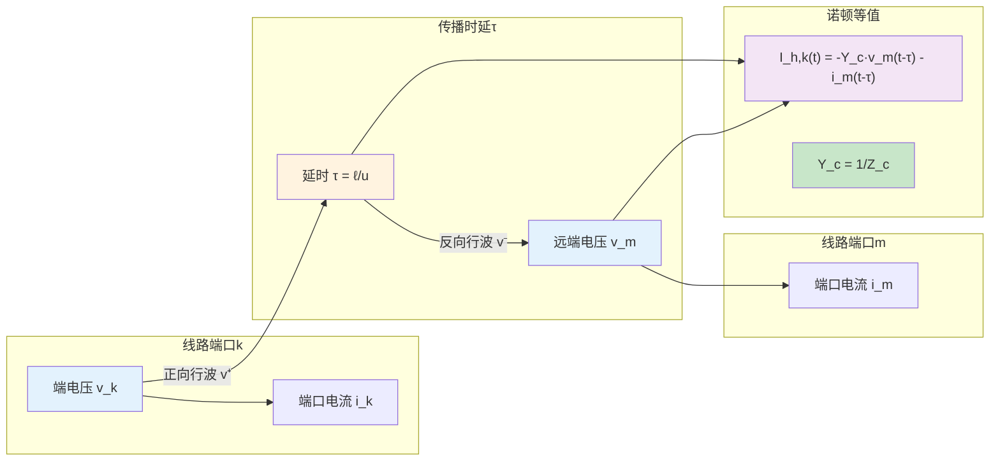

# Bergeron 线路模型 (Bergeron Line Model)

## 定义与边界

Bergeron 线路模型是在 EMT 中用端口历史量表示传输线行波传播的一类时域模型。它把一段均匀线路等效为端口特性导纳和延时历史电流源，使线路两端在当前时间步只通过已知延时量相互耦合。

本页讨论的是线路元件的特征线/行波时域实现。它不等同于完整的 [[distributed-parameter-line]] 理论，也不自动包含频率相关导体损耗、大地返回路径或非均匀线路几何；这些内容需要与 [[frequency-dependent-line-model]]、[[earth-return-impedance]] 和 [[frequency-dependent-soil]] 连接。

## EMT 中的作用

Bergeron 模型在 EMT 中主要用于下列任务：

- 保留线路有限传播速度、端点反射和故障行波到达时间。
- 在节点导纳方程中把线路表示为固定导纳加历史电流源。
- 为长线路、架空线路、常参数线路和某些多导体模态模型提供可计算的时域接口。
- 作为频变线路模型的结构参照，帮助理解 [[universal-line-model]] 和频变 Bergeron 扩展中的历史项更新。

它的价值在于把空间传播问题转成端口延时关系。若研究问题对频变衰减、土壤参数、护套耦合或非换位强耦合敏感，单纯常参数 Bergeron 表示应视为近似。

## 核心机制

无损单相线路的电报方程可写为：

$$-\frac{\partial v}{\partial x}=L\frac{\partial i}{\partial t},\quad
-\frac{\partial i}{\partial x}=C\frac{\partial v}{\partial t}$$

其行波解为：

$$v(x,t)=v^+(t-x/u)+v^-(t+x/u)$$

$$i(x,t)=\frac{1}{Z_c}\left[v^+(t-x/u)-v^-(t+x/u)\right]$$

其中 $u=1/\sqrt{LC}$ 为传播速度，$Z_c=\sqrt{L/C}$ 为特性阻抗。长度为 $\ell$ 的线路传播时延为：

$$\tau=\ell/u=\ell\sqrt{LC}$$

若端口电流均按流入线路为正，$k$ 端的 Norton 形式可写成：

$$i_k(t)=Y_c v_k(t)+I_{h,k}(t),\quad Y_c=1/Z_c$$

$$I_{h,k}(t)=-Y_c v_m(t-\tau)-i_m(t-\tau)$$

$m$ 端对称成立。历史电流源中的远端电压、电流来自延时队列；当前时间步求解网络方程后，再把端口量写入队列供未来时刻使用。

## 分类与变体

| 变体 | 处理方式 | 适合用途 | 主要边界 |
|------|----------|----------|----------|
| 无损常参数 Bergeron | $R,G$ 忽略或另行近似 | 行波教学、长架空线基础暂态 | 衰减和频变损耗不足 |
| 集中损耗 Bergeron | 在线路两端或中点加入电阻/电导近似 | 工频附近或低损耗线路 | 高频损耗分布不准确 |
| 模态 Bergeron | 多相线路经 [[modal-transformation]] 解耦后逐模态处理 | 换位或近似可解耦线路 | 频率相关变换矩阵会破坏常数模态假设 |
| 频变 Bergeron 扩展 | 用有理函数或卷积修正 $Z_c(\omega)$ 与传播项 | 宽频线路暂态研究 | 需要拟合、无源性和时域稳定性检查 |

## 数值实现要点

延时 $\tau$ 通常不一定是时间步长 $\Delta t$ 的整数倍。若 $\tau=n\Delta t+\delta\Delta t$，历史量需要插值：

$$x(t-\tau)\approx (1-\delta)x(t-n\Delta t)+\delta x(t-(n+1)\Delta t)$$

插值会影响相位和高频分量，因此应记录采用的插值阶次、时间步长和线路最短传播时间。若线路传播时延小于或接近全局时间步，特征线模型可能变成步长约束来源；折叠线等效等方法正是围绕这个问题提出不同实现路径。

## 适用边界与失败模式

- 常参数 Bergeron 不能替代宽频参数计算。导体集肤效应、邻近效应和大地返回路径会改变传播衰减与相位。
- 多导体线路的解耦假设需要检查。非换位、平行线路和地下电缆可能需要相域或频变模态处理。
- 延时插值和短线路步长约束会影响数值响应，尤其在雷电、陡波和高频振荡场景中。
- 历史源符号依赖端口电流方向约定。页面或代码实现比较时必须先统一端口正方向。
- 频变扩展若用有理函数拟合，应检查极点稳定性和 [[passivity-enforcement]]，否则时域仿真可能出现非物理增长。

## 代表性证据

- [[frequency-dependent-multiconductor-line-model-based-on-the-bergeron-method]]：可支撑“Bergeron 框架可扩展到频变多导体线路”的说法，但具体频带、误差和算例结论应回到原文。
- [[fitting-the-frequency-dependent-parameters-in-the-bergeron-line-model]]：可作为频变参数拟合进入 Bergeron 历史源结构的代表性来源。
- [[耦合长线电磁暂态分析的扩展bergeron模型]]：适合说明耦合长线路与扩展 Bergeron 表示之间的关系；不应外推为所有耦合线路的统一误差保证。
- [[transmission-line-model-for-variable-step-size-simulation-algorithms]]：说明可变步长 EMT 会改变延时历史量处理方式，适合支撑数值实现边界。

## 与相关页面的关系

- [[distributed-parameter-line]] 给出线路电报方程和分布参数建模总框架。
- [[folded-line-equivalent]] 是另一种围绕线路节点导纳和开路/短路贡献组织模型的实现方式。
- [[universal-line-model]] 在相域中处理频率相关特征导纳和传播矩阵。
- [[frequency-dependent-soil]] 与 [[earth-return-impedance]] 决定大地返回相关线路参数。
- [[frequency-scan]] 和 [[impedance-measurement]] 可用于检查线路等效对系统频响的影响。

## 修订与证据使用注意事项

后续补充本页时，不应加入未绑定来源的“典型波速”“适用长度”“误差百分比”或软件能力描述。若需要比较 Bergeron、JMarti、ULM 或 FLE，应列出线路类型、频带、步长、拟合设置和对比基线。
