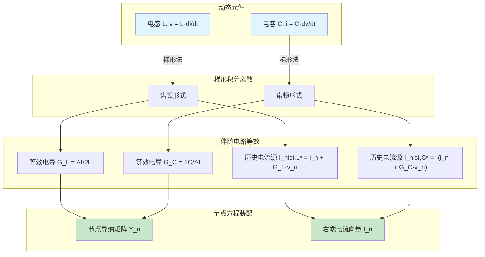
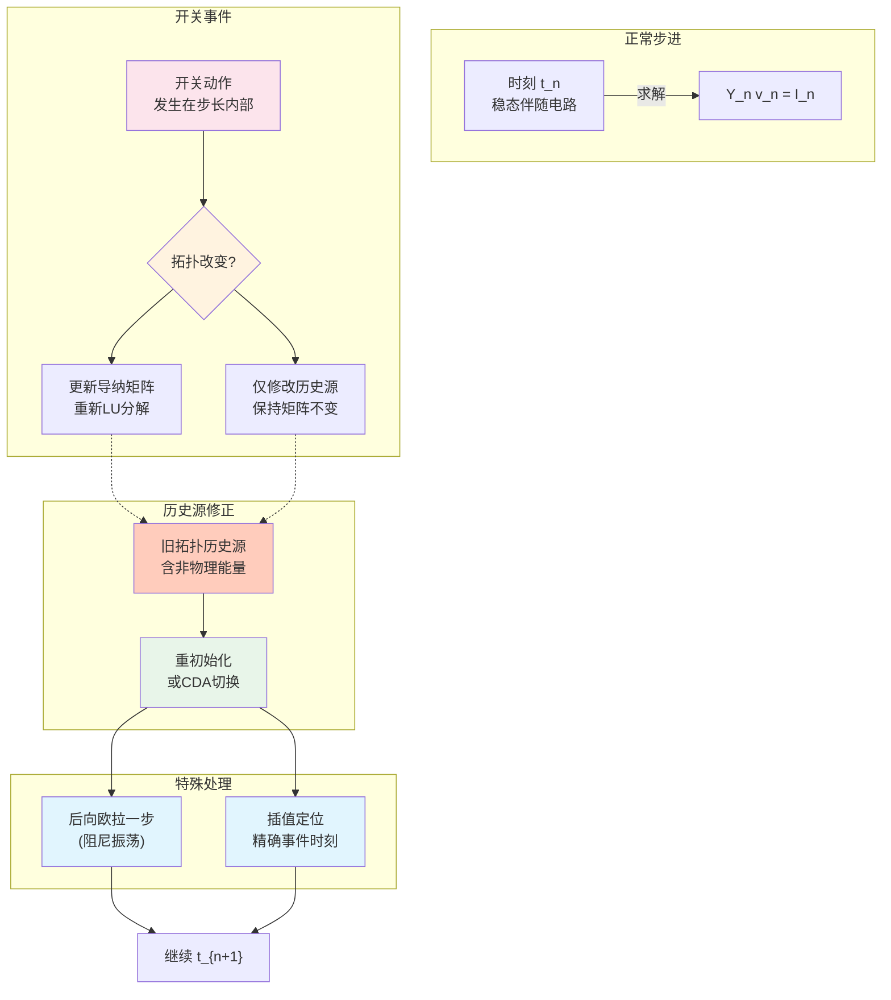

# 伴随电路 (Companion Circuit)

## 定义与边界

伴随电路（Companion Circuit）是在 EMT 时间步求解中，由数值积分公式生成的离散等效电路。它把电感、电容、线路、状态空间子系统或局部网络的微分关系改写成当前时刻的等效导纳/阻抗加历史源，使网络在每个时间步可由代数方程求解。

本页强调“电路等效形态”：元件如何贡献到节点导纳矩阵和右端历史源。更一般的离散模型概念见 [[companion-model]]；积分公式本身见 [[trapezoidal-rule]] 和 [[backward-euler]]；保持矩阵不变的特殊电力电子策略见 [[fixed-admittance]]。

## EMT 中的作用

伴随电路是 EMTP 类时域仿真的基础接口之一：

- 电感、电容通过积分公式变成当前导纳和历史电流源。
- 线路 Bergeron 模型在端口表现为特性导纳和延时历史源。
- 状态空间集群可离散为端口导纳矩阵和历史注入项。
- 非线性元件可在 Newton 迭代中用增量电导和等效源线性化。
- 多端口子网络可通过 Schur 补消去内部节点，形成端口诺顿等效。

伴随电路只表示当前步的离散端口关系；其精度和稳定性由积分方法、步长、事件处理和模型假设共同决定。

## 核心机制

### 电感支路

对电感 $v=L\,di/dt$，用梯形积分可得：

$$
i_{n+1}=i_n+\frac{\Delta t}{2L}(v_{n+1}+v_n)
$$

整理为诺顿伴随形式：

$$
i_{n+1}=G_L v_{n+1}+I_{hist,L}^{n}
$$

$$
G_L=\frac{\Delta t}{2L},\quad
I_{hist,L}^{n}=i_n+G_L v_n
$$

### 电容支路

对电容 $i=C\,dv/dt$，梯形积分给出：

$$
i_{n+1}=G_C v_{n+1}+I_{hist,C}^{n}
$$

$$
G_C=\frac{2C}{\Delta t},\quad
I_{hist,C}^{n}=-(i_n+G_C v_n)
$$

以上符号假设支路电流和支路电压方向一致。若程序采用相反注入方向，历史源符号必须同步改变。

### 后向欧拉伴随形式

同一动态元件也可由 [[backward-euler]] 生成一阶伴随形式。电感支路可写为：

$$
i_{n+1}=G_{BE,L}v_{n+1}+I_{hist,BE,L}^{n},
\qquad
G_{BE,L}=\frac{\Delta t}{L}
$$

其中历史项由上一时刻电感电流决定。电容支路可写为：

$$
i_{n+1}=G_{BE,C}v_{n+1}+I_{hist,BE,C}^{n},
\qquad
G_{BE,C}=\frac{C}{\Delta t}
$$

后向欧拉数值阻尼更强，常用于事件点、刚性支路或抑制梯形积分突变后的交替误差；代价是同一步长下低阶精度和数值耗散更明显。

### 频变支路伴随形式

频率相关支路通常先由 [[vector-fitting]]、部分分式展开或状态空间模型得到有理函数近似：

$$
Y(s)\approx D+sE+\sum_{r=1}^{N}\frac{R_r}{s-p_r}
$$

进入 EMT 时，每个极点-留数项被离散为递推状态或等效历史源。此类伴随形式不能只检查拟合误差，还需要检查稳定性、因果性和 [[passivity-enforcement]]，否则时域求解可能出现非物理能量增长。

### 装配到节点方程

对连接节点 $p$ 和 $q$ 的等效电导 $G$，导纳矩阵贡献为：

$$
Y_{pp}\leftarrow Y_{pp}+G,\quad
Y_{qq}\leftarrow Y_{qq}+G
$$

$$
Y_{pq}\leftarrow Y_{pq}-G,\quad
Y_{qp}\leftarrow Y_{qp}-G
$$

历史电流源进入右端向量。全网可写成：

$$
\mathbf{Y}\mathbf{v}_{n+1}
=\mathbf{i}_{src,n+1}+\mathbf{i}_{hist}^{n}
$$

拓扑和等效导纳不变时，可复用矩阵分解；拓扑、开关状态或非线性导纳改变时，需要更新矩阵或使用恒导纳类处理。

## 分类与变体

| 伴随电路 | 当前项 | 历史项 | 边界 |
|----------|--------|--------|------|
| 电感伴随 | $G_L v_{n+1}$ | 上一步电流和电压 | 受积分方法和饱和处理影响 |
| 电容伴随 | $G_C v_{n+1}$ | 上一步电压和电流 | 开关后需检查历史源 |
| Bergeron 线路 | $v/Z_c$ | 延时端口电压、电流 | 损耗和频变需扩展 |
| 状态空间集群 | $\mathbf{Y}_{eq}\mathbf{v}$ | 离散状态历史项 | 端口映射必须明确 |
| 非线性伴随 | 增量电导 | 线性化截距 | 需要迭代收敛 |
| 多端口伴随 | 导纳矩阵 | 历史源向量 | 互耦项不可随意删除 |

## 事件处理与失败模式

伴随电路最容易出错的环节不是公式本身，而是事件和历史项：

- 开关、故障或二极管换相发生在步长内部，却按网格点处理，会产生事件时间误差。
- 拓扑变化后继续使用旧拓扑下的历史源，会引入非物理能量。
- 梯形法在突变后可能保留高频交替误差，需要 [[backward-euler]]、CDA 或重初始化策略。
- 理想开关用极大/极小电导表示时，可能造成矩阵条件数问题。
- 非线性元件的增量电导若未收敛，伴随电路只是一轮线性化近似。
- 多端口 Schur 补若内部矩阵病态，会放大历史源和端口导纳误差。

## 代表性证据

[[a-combined-state-space-nodal-method-for-the-simulation-of-power-system-transient]] 支撑“任意规模状态空间电气集群经梯形积分后可形成历史项加端口导纳，并装配到节点矩阵”的机制。该来源适合说明伴随电路不只适用于单个 RLC 元件，也适用于集群模型。

[[high-speed-emt-modeling-of-mmcs-with-arbitrary-multiport-submodule-structures-us]] 支撑“多端口子模块先写成伴随电路节点方程，再经 Schur 补消去内部节点，形成外部诺顿等效并可回代恢复内部状态”的机制。其具体加速和误差数字应限于原文摘要或表图，不在本页泛化。

[[real-time-digital-simulator-of-the-electromagnetic-transients-of-power-transmiss]] 支撑 Bergeron 线路端口可写成特性导纳加延时历史源，并可与集中电阻近似组合用于实时线路模型。

[[accurate-time-domain-simulation-of-power-electronic-circuits]] 支撑事件定位、同时开关和历史项修正对功率电子伴随电路的重要性；其量化结论应绑定原文开关算例。

## 与相关页面的关系

- [[companion-model]]：更抽象的离散模型页面，覆盖状态更新、积分方法和模型组织。
- [[trapezoidal-rule]]：常用积分公式，会生成二阶伴随电路但可能有数值振荡。
- [[backward-euler]]：常用于事件点阻尼和刚性系统。
- [[nodal-admittance-matrix]]：伴随电路装配后的全局矩阵形式。
- [[thevenin-norton-equivalent]]：伴随电路可写成戴维南或诺顿端口形式。
- [[fixed-admittance]]：把伴随电路进一步约束为开关状态不改主导纳矩阵的技术。

## 开放问题

- 自动生成伴随电路时，需要统一端口方向、历史源符号和节点装配规则。
- 混合积分、变步长和事件回退会使历史源更新更复杂，需要可复核的实现记录。
- 对宽频和多端口模型，伴随电路的离散稳定性、无源性和矩阵条件数应同时检查。

## 来源论文

参见 [[index]] 获取更多伴随电路相关文献。
