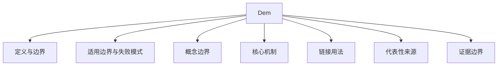

# DEM

## 定义与边界

DEM 在当前 Wiki 中主要作为 Detailed Equivalent Model 的英文缩写入口。canonical 技术页是 [[detailed-equivalent-model]]。本页只负责缩写收敛，不另起一篇完整的详细等效模型文章。

## 适用边界与失败模式

- **valid_when**: MMC 桥臂级等效、VSC 开关网络端口简化、大规模换流器阵列的加速仿真；各子模块电容电压平衡良好，开关频率远高于系统截止频率。
- **invalid_when**: 需要评估子模块级故障、IGBT 开关暂态过程或器件应力；端口外特性受非线性或频变效应主导时，固定导纳 DEM 的精度可能不足。
- **assumptions**: 假设子模块电容电压在开关周期内近似恒定，端口外响应可用离散诺顿等效描述（据方法推断）。
- **evidence_gaps**: DEM 在不同设备类型（MMC、VSC、LCC）中的统一端口定义尚未收敛；无源性检查在多端口 DEM 中的实施要求和验证基线仍未标准化。

## 概念边界

- DEM 不等于“任何详细模型”，也不等于“完整开关模型”。它必须绑定端口、频段、运行点、开关状态或设备层级。
- MMC 语境中的 DEM 只是详细等效模型的一类应用；不应把 MMC 桥臂并行化结论外推到线路、变压器或所有频变网络等值。
- 若页面讨论端口导纳、有理函数、状态空间、无源性和降阶，应链接 [[detailed-equivalent-model]]。
- 本页不保留旧页面中错误混入的线路电报方程、雷电来源和通用仿真性能数字。

## 核心机制

详细等效模型（DEM）的基本思路是利用端口等效简化内部详细开关网络。对于任意一个 $n$ 端口网络，其端口特性在离散时间步长 $\Delta t$ 下可写为诺顿等效形式：

$$
\mathbf{i}_{	ext{port}}(t) = \mathbf{G}_{	ext{eq}} \mathbf{v}_{	ext{port}}(t) + \mathbf{i}_{	ext{hist}}(t - \Delta t)
$$

其中 $\mathbf{G}_{	ext{eq}}$ 为等效电导矩阵，$\mathbf{i}_{	ext{hist}}$ 为历史电流源向量。DEM 的精髓是把内部开关状态映射到 $\mathbf{G}_{	ext{eq}}$ 和 $\mathbf{i}_{	ext{hist}}$ 的实时更新中，从而在保持端口电气行为的同时获得比完整开关模型更快的求解速度。

## 链接用法

旧页面中已有 `[[dem]]` 链接可保留作为缩写兼容；新技术说明应优先链接 [[detailed-equivalent-model]]。若讨论 MMC 并行 DEM，可同时链接 [[parallelization-of-mmc-detailed-equivalent-model]]。

## 代表性来源

- [[detailed-equivalent-model]]：详细等效模型主页面。
- [[an-accelerated-detailed-equivalent-model-for-modular-multilevel-converters]]：MMC 详细等效模型来源入口。
- [[parallelization-of-mmc-detailed-equivalent-model]]：MMC DEM 多核 CPU 并行化来源入口。

## 证据边界

本页不新增误差、加速比、阶数、步长或适用场景结论。DEM 相关结论必须回到具体对象和来源，说明端口定义、等效目标、验证基线、无源性检查和不可外推范围。
