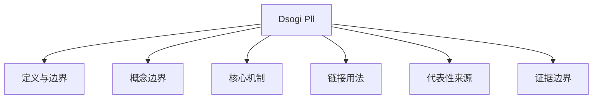

# DSOGI-PLL

## 定义与边界

DSOGI-PLL 指基于双二阶广义积分器的锁相环方法，用于从三相电压中提取正序同步量，并改善不平衡、谐波或扰动条件下的相位/频率估计。本页是 DSOGI-PLL 的英文受控入口；PLL 总体边界见 [[phase-locked-loop]]，SRF 基准结构见 [[srf-pll]]。

## 概念边界

- DSOGI-PLL 是同步算法，不是并网逆变器完整控制器、频率支撑策略或故障穿越方案。
- DSOGI 中的正交信号生成和正序提取依赖具体滤波、带宽和频率反馈实现；不同论文的冻结频率、自适应带宽或反正切误差设计不能互相替代。
- PLL 结论必须绑定网络强度、故障类型、谐波条件、控制结构和仿真/实验平台。
- 本页删除旧页面中与 VSC-ESS 惯量控制、线路电报方程和通用仿真性能无关的公式与指标。

## 核心机制

DSOGI-PLL 的核心是二阶广义积分器（SOGI）构成的 quadrature signal generator。SOGI 的传递函数为：

$$
D(s) = rac{v'(s)}{v(s)} = rac{k\omega_0 s}{s^2 + k\omega_0 s + \omega_0^2}, \quad Q(s) = rac{qv'(s)}{v(s)} = rac{k\omega_0^2}{s^2 + k\omega_0 s + \omega_0^2}
$$

其中 $\omega_0$ 为谐振频率（通常由 PLL 锁定的基波频率更新），$k$ 为阻尼系数。$D(s)$ 输出与输入同相的滤波信号 $v'$，$Q(s)$ 输出滞后 90° 的正交信号 $qv'$。两个 $lphaeta$ 轴上的 SOGI 配合正序计算（$v_{lphaeta}^+ = rac12 [1 - e^{j\pi/2}; e^{j\pi/2}, 1] v_{lphaeta}$）即可在不平衡条件下提取正序分量。

## 链接用法

需要具体 DSOGI-PLL 分支时链接 [[dsogi-pll]]；讨论 PLL 总体同步方法时链接 [[phase-locked-loop]]；需要 SRF 对照时链接 [[srf-pll]]；讨论参数整定时链接 [[pll-design]]；讨论并网对象时链接 [[grid-connected-inverter]] 或 [[gfl-inverter-model]]。

## 代表性来源

- [[advanced-dsogi-pll-with-adaptive-bandwidth-for-improved-transient-performance-of]]：支撑改进 DSOGI-PLL、暂态频率冻结和自适应带宽的来源入口；具体数值只在其测试系统和扰动范围内有效。
- [[rmsx002b-augmenting-the-traditional-circuit-model-to-capture-pll-instability]]：支撑 PLL 与电路/网络交互失稳的相邻来源。
- [[analytical-calculation-method-of-outer-loop-controller-parameters-of-hvdc-conver]]：可作为换流器控制参数设计中 PLL/外环交互的来源入口。

## 证据边界

本页不新增带宽、RMSE、SCR 临界值、相位误差或稳定裕度结论。关于 DSOGI-PLL 暂态改进的所有数字必须绑定原文的弱网强度、扰动类型、仿真工具、控制参数和对比基线；不能外推为所有 PLL 或所有并网逆变器均适用。
