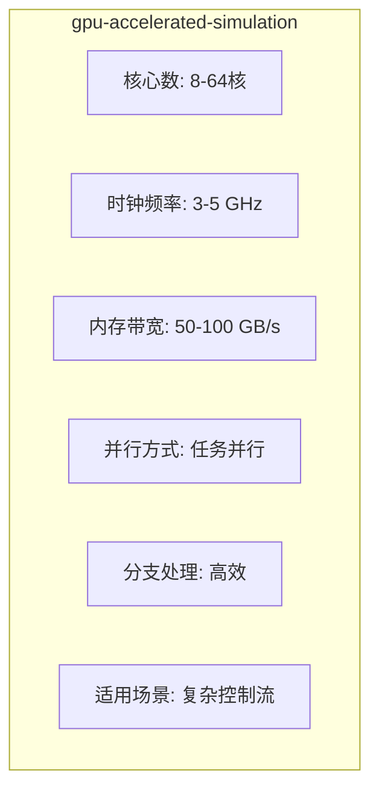

# GPU加速仿真 (GPU-Accelerated Simulation)





## 定义与概述

GPU加速仿真是利用图形处理器（Graphics Processing Unit）的大规模并行计算能力加速电磁暂态（EMT）仿真的技术。与传统CPU串行计算相比，GPU通过单指令多线程（SIMT）架构可同时执行成千上万个计算任务，特别适合处理大规模电力系统中大量同质化组件（如风电场中的DFIG、MMC中的子模块）的并行计算，可实现10-20倍的仿真加速。

## 1. 理论基础

### 1.1 GPU架构特点

**SIMT（单指令多线程）执行模型**:
- 成百上千个计算核心同时执行相同指令
- 线程按"warp"（32线程）分组调度
- 适合数据并行计算（同一操作应用于大量数据）

**GPU vs CPU对比**:

| 特性 | CPU | GPU |
|------|-----|-----|
| 核心数 | 8-64核 | 数千个CUDA核心 |
| 时钟频率 | 3-5 GHz | 1-2 GHz |
| 内存带宽 | 50-100 GB/s | 500-1000 GB/s |
| 并行方式 | 任务并行 | 数据并行 |
| 分支处理 | 高效 | 效率下降 |
| 适用场景 | 复杂控制流 | 大规模同质化计算 |

**内存层次**:
- 全局内存：容量大（16-80GB），延迟高
- 共享内存：容量小（48-164KB/SM），延迟低
- 寄存器：每个线程私有，最快

### 1.2 CUDA编程模型

**内核函数（Kernel）**:
```cuda
__global__ void gpu_kernel(float* data, int n) {
    int tid = blockIdx.x * blockDim.x + threadIdx.x;
    if (tid < n) {
        data[tid] = compute(data[tid]);
    }
}
```

**执行配置**:
- Grid：由多个Block组成
- Block：由多个Thread组成（最多1024线程）
- Warp：32个线程为一组同时执行

**关键优化原则**:
1. **合并内存访问**：相邻线程访问相邻内存地址
2. **减少分支**：避免线程发散（warp内线程走不同分支）
3. **利用共享内存**：数据复用时缓存到共享内存
4. **隐藏延迟**：每个SM上运行足够多的warp

### 1.3 同质性与并行效率

**同质性定义**:
组件具有相同的数学模型、相同的计算流程、仅参数不同。

**GPU效率交叉点**:
- 当组件数量 < 阈值：GPU启动开销 > 并行收益
- 当组件数量 > 阈值：GPU并行优势显现

**典型阈值**:
| 组件类型 | CPU/GPU交叉阈值 | 原因 |
|----------|-----------------|------|
| MMC子模块 | ~15电平 | 低于此值数据传输开销大 |
| DFIG风机 | ~100台 | 低于此值线程利用率低 |
| 输电线路 | ~50条 | 需考虑网络拓扑耦合 |

## 2. EMT仿真应用

### 2.1 风电场GPU并行仿真

**应用场景**:
大规模风电场（1000-10000台DFIG）接入交直流混联电网的EMT仿真。

**并行策略**:
- 每台风机分配给一个GPU线程块
- 各风机并行计算本地电磁-机械动态
- CPU汇总全网网络方程

**拓扑重构与解耦**:
1. **内部解耦**：将DFIG的5阶状态空间分解为独立子系统
2. **同质化增强**：统一数学模型，仅参数不同
3. **数值阶数降低**：从$O(N^3)$降至$O(N)$

**量化成果**:
- 401电平MMC：GPU加速约**10倍**
- 8000台DFIG：GPU加速约**20倍**
- 计算时间：GPU并行稳定在29-35秒区间

### 2.2 MMC子模块并行计算

**并行架构**:
```
CPU侧（控制+网络）:
- 外环控制器（定直流电压/有功）
- 内环控制器（电流控制）
- 网络节点导纳矩阵求解

GPU侧（子模块并行）:
- 三相桥臂并行（3个kernel）
- 每桥臂子模块并行（N个线程）
- 电容电压更新
- 开关状态判断
```

**子模块电压计算**:
$$v_{SM} = i_{SM}r_{on} + g_1 \int \frac{i_{SM}}{C} dt + (g_1 - \text{sgn}(i_{SM}))2V_f + (g_1 + \text{sgn}(i_{SM}) - 1)V_j$$

其中：
- $r_{on}$: IGBT导通电阻
- $C$: 子模块电容
- $V_f$: 二极管正向压降
- $g_1$: 开关函数

### 2.3 异构CPU-GPU协同

**自适应任务分配**:

| 计算任务 | 分配处理器 | 原因 |
|----------|-----------|------|
| 交流电网 | CPU | 网络拓扑不规则，稀疏矩阵求解 |
| 外环控制 | CPU | 控制逻辑复杂，分支多 |
| 直流线路 | CPU | 传输线模型，串行依赖 |
| DFIG风机 | GPU | 数量大，模型同质化 |
| MMC子模块 | GPU | 数量大，计算独立 |
| 逆变器 | GPU | PWM计算并行化 |

**数据流**:
```
CPU: 网络求解 → 边界条件 → GPU显存
                        ↓
GPU: 大规模并行计算（风机/子模块）
                        ↓
CPU: 结果汇总 ← 注入电流 ← GPU显存
```

**性能交叉点分析**:
- MMC < 15电平：CPU更优（GPU启动开销）
- MMC > 15电平：GPU更优
- 风机 < 100台：CPU更优
- 风机 > 100台：GPU更优

### 2.4 输电网络并行求解

**稀疏矩阵求解瓶颈**:
传统LU分解串行度高，难以直接GPU并行。

**解决方案**:
1. **节点重排序**：减少填充元，增加并行度
2. **分块分解**：将大矩阵分解为可并行块
3. **迭代求解**：预条件共轭梯度法（PCG）

**层级低秩近似（Hierarchical Low-Rank）**:
- 利用电网的空间局部性
- 远场交互用低秩矩阵近似
- 近场精确计算
- 矩阵-向量乘法高度并行

## 3. 实现技术

### 3.1 CUDA C++实现框架

**内核函数设计**:
```cuda
// DFIG风机并行计算内核
__global__ void dfig_kernel(
    float* psi_s,      // 定子磁链
    float* psi_r,      // 转子磁链
    float* i_s,        // 定子电流
    float* i_r,        // 转子电流
    float* v_s,        // 定子电压
    float* v_r,        // 转子电压
    float* omega_r,    // 转子转速
    float dt,          // 仿真步长
    int n_turbines     // 风机数量
) {
    int tid = blockIdx.x * blockDim.x + threadIdx.x;
    
    if (tid < n_turbines) {
        // 每个线程处理一台风机
        int offset = tid * 5;  // 5阶状态空间
        
        // 读取当前状态
        float x[5] = {psi_s[offset], psi_r[offset], ...};
        
        // 梯形积分法求解
        float x_new[5];
        trapezoidal_integration(x, x_new, dt, tid);
        
        // 写回结果
        psi_s[offset] = x_new[0];
        psi_r[offset] = x_new[1];
        // ...
    }
}
```

**内存管理**:
```cuda
// 主机端（CPU）内存分配
float* h_data = (float*)malloc(n * sizeof(float));

// 设备端（GPU）内存分配
float* d_data;
cudaMalloc(&d_data, n * sizeof(float));

// 数据拷贝：主机→设备
cudaMemcpy(d_data, h_data, n * sizeof(float), cudaMemcpyHostToDevice);

// 启动内核
dfig_kernel<<<numBlocks, threadsPerBlock>>>(d_data, ..., n);

// 数据拷贝：设备→主机
cudaMemcpy(h_data, d_data, n * sizeof(float), cudaMemcpyDeviceToHost);

// 释放内存
cudaFree(d_data);
free(h_data);
```

### 3.2 优化策略

**内存访问优化**:
```cuda
// 合并访问：相邻线程访问相邻地址
__global__ void coalesced_access(float* data) {
    int tid = blockIdx.x * blockDim.x + threadIdx.x;
    float value = data[tid];  // 合并访问
}

// 共享内存缓存
__shared__ float shared_mem[256];
__global__ void shared_memory_kernel(float* data) {
    int tid = blockIdx.x * blockDim.x + threadIdx.x;
    int local_tid = threadIdx.x;
    
    // 加载到共享内存
    shared_mem[local_tid] = data[tid];
    __syncthreads();
    
    // 使用共享内存计算
    float result = compute(shared_mem[local_tid]);
    data[tid] = result;
}
```

**分支优化**:
```cuda
// 避免线程发散
__global__ void branch_optimized(float* data, int* flag) {
    int tid = blockIdx.x * blockDim.x + threadIdx.x;
    
    // 低效：线程发散
    // if (flag[tid]) { A(); } else { B(); }
    
    // 高效：分离kernel
    // kernel_A处理flag=1的线程
    // kernel_B处理flag=0的线程
}
```

### 3.3 硬件平台配置

**典型配置**:
| 组件 | 规格 | 作用 |
|------|------|------|
| CPU | Intel Xeon E5-2698 v4 (20核) | 网络求解、控制逻辑 |
| GPU | NVIDIA Tesla V100 (5120 CUDA核心) | 大规模并行计算 |
| 内存 | 192 GB DDR4 | 主机内存 |
| 显存 | 32 GB HBM2 | GPU全局内存 |
| 互联 | PCIe 3.0 x16 | CPU-GPU数据传输 |

**多GPU扩展**:
- NVLink高速互联
- GPUDirect RDMA
- 多GPU负载均衡

## 4. 仿真软件实现

### 4.1 CPU-GPU协同框架

```cpp
// C++主机代码框架
class HeterogeneousSimulator {
private:
    CPUSolver cpu_solver;
    GPUSolver gpu_solver;
    
public:
    void simulate_step() {
        // 1. CPU：网络方程求解
        cpu_solver.solve_network();
        
        // 2. CPU：生成边界条件
        BoundaryConditions bc = cpu_solver.get_boundary();
        
        // 3. 拷贝到GPU
        gpu_solver.copy_to_device(bc);
        
        // 4. GPU：并行计算风机/子模块
        gpu_solver.launch_kernels();
        
        // 5. 拷贝回CPU
        InjectionCurrents inj = gpu_solver.copy_to_host();
        
        // 6. CPU：汇总并推进时间步
        cpu_solver.update_state(inj);
    }
};

// GPU求解器类
class GPUSolver {
private:
    float *d_psi_s, *d_psi_r, *d_i_s, *d_i_r;
    float *d_v_s, *d_v_r, *d_omega_r;
    
public:
    void launch_kernels() {
        // DFIG内核
        int threadsPerBlock = 256;
        int numBlocks = (n_turbines + threadsPerBlock - 1) / threadsPerBlock;
        
        dfig_kernel<<<numBlocks, threadsPerBlock>>>(
            d_psi_s, d_psi_r, d_i_s, d_i_r,
            d_v_s, d_v_r, d_omega_r,
            dt, n_turbines
        );
        
        // MMC内核
        mmc_kernel<<<numBlocksMMC, threadsPerBlock>>>(...);
        
        // 同步
        cudaDeviceSynchronize();
    }
};
```

### 4.2 OpenACC简化编程

```c
// OpenACC自动并行化
#pragma acc parallel loop
for (int i = 0; i < n_turbines; i++) {
    // 编译器自动映射到GPU
    compute_dfig(i);
}
```

### 4.3 Python GPU接口

```python
## CuPy：NumPy的GPU版本
import cupy as cp

## 数据在GPU上创建
psi_s = cp.random.rand(n_turbines, 2)  # 定子磁链
psi_r = cp.random.rand(n_turbines, 2)  # 转子磁链

## GPU上执行计算
i_s = cp.dot(psi_s, L_matrix)  # 矩阵乘法在GPU上执行

## 结果拷贝回CPU
i_s_cpu = i_s.get()
```

## 5. 典型参数参考

| 应用场景 | GPU型号 | 规模 | 加速比 | 计算时间 |
|----------|---------|------|--------|----------|
| MMC子模块 | Tesla V100 | 401电平 | 10x | ~30s |
| DFIG风电场 | Tesla V100 | 8000台 | 20x | ~30s |
| 输电网络 | Tesla V100 | 10000节点 | 5x | ~20s |
| 光伏逆变器 | RTX 3090 | 1000台 | 15x | ~25s |
| 电动汽车 | Tesla T4 | 500辆 | 12x | ~15s |

## 相关方法
- [[fpga-real-time-simulation|FPGA实时仿真]] - 另一种硬件加速方案对比
- [[multirate-method|多速率方法]] - 与GPU加速协同技术
- [[hil-simulation|HIL仿真]] - GPU在硬件在环中的应用
- [[electromechanical-electromagnetic-hybrid-simulation|机电-电磁混合仿真]] - CPU-GPU异构计算
- [[discretization-methods|离散化方法]] - GPU并行离散化算法

## 相关模型
- [[dfig-model|DFIG模型]] - GPU并行的典型应用场景
- [[mmc-model|MMC模型]] - 子模块大规模并行计算
- [[pv-system-model|光伏系统模型]] - 逆变器阵列并行仿真
- [[wind-farm-modeling|风电场建模]] - 大规模同质化风机组件
- [[pmsm-model|PMSM模型]] - 永磁同步电机并行求解

## 相关主题
- [[parallel-computing|并行计算]] - GPU的SIMT并行原理与优化
- [[real-time-simulation|实时仿真]] - GPU加速实时仿真技术
- [[wind-farm-modeling|风电场建模]] - GPU主要应用领域
- [[vsc-hvdc|VSC-HVDC]] - GPU加速仿真应用场景

## 7. 适用边界与限制

### 7.1 适用条件
- **大规模同质化组件**：组件数量>100，模型相同仅参数不同
- **数据并行度高**：计算流程一致，无复杂分支
- **计算密集**：每个组件计算量足够大，掩盖数据传输开销
- **独立性高**：组件间耦合弱，减少同步开销

### 7.2 失效边界
- **小规模系统**：组件数量<阈值，GPU启动开销>并行收益
- **强耦合系统**：组件间高度耦合，需频繁同步
- **复杂控制流**：大量if-else分支导致线程发散
- **不规则数据访问**：无法合并内存访问

### 7.3 性能边界
| 限制因素 | 影响 | 缓解方法 |
|----------|------|----------|
| 数据传输 | PCIe带宽瓶颈 | 减少CPU-GPU数据传输 |
| 内存容量 | 显存限制 | 分块计算，流式处理 |
| 分支发散 | warp效率下降 | 分离kernel，排序处理 |
| 同步开销 | 线程等待 | 减少全局同步点 |

## 8. 来源论文

| 论文 | 年份 | 核心贡献 |
|------|------|----------|
| Adaptive Heterogeneous Transient Analysis of Wind Farm Integrated AC/DC Grids | 2021 | CPU-GPU异构协同，401电平MMC 10倍加速，8000台DFIG 20倍加速 |
| 面向指数积分方法的电磁暂态仿真GPU并行算法 | 2020 | 指数积分GPU并行，稀疏矩阵求解加速 |
| 新能源电力系统细粒度并行与多速率电磁暂态仿真 | 2022 | 细粒度GPU并行，多速率协同 |
| A Hierarchical Low-Rank Approximation-based Network Solver for EMT | 2021 | 层级低秩近似，GPU加速网络求解 |

---

*本页面基于Karpathy LLM Wiki Pattern构建，内容来自682篇EMT领域学术文献的深度分析*
