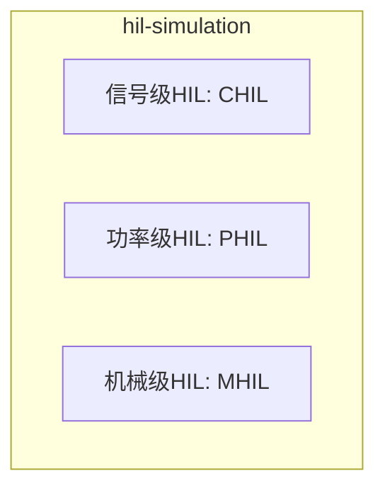

# 硬件在环仿真 (Hardware-in-the-Loop Simulation)





## 定义与概述

硬件在环仿真（Hardware-in-the-Loop, HIL）是将实际物理控制器或保护装置接入实时数字仿真回路中的测试技术。通过实时数字仿真器（RTDS、FPGA等）模拟被控对象（电力系统、电机、电力电子设备等）的动态行为，真实的控制器在实时环境下与仿真模型交互，形成"控制器硬件+被控对象仿真"的闭环测试系统。HIL仿真能够在实验室环境下安全、可重复地验证控制器在各种正常和故障工况下的性能，大幅缩短研发周期，降低现场测试风险。

## 1. 理论基础

### 1.1 HIL仿真基本原理

**信号流向**:
```
┌─────────────┐     模拟量/数字量      ┌─────────────┐
│   控制器    │ ◄──────────────────► │  实时仿真器   │
│   (真实)    │    反馈信号           │  (被控对象)   │
│             │ ◄──────────────────► │  (数字模型)   │
└─────────────┘    控制信号           └─────────────┘
```

**核心要求**:
- **实时性**: 仿真器必须在固定步长内完成计算，不能出现超时
- **确定性**: 每次仿真运行结果必须一致，保证测试可重复性
- **接口保真**: 模拟量/数字量接口必须准确复现真实信号特性
- **延迟控制**: 接口延迟必须小于被测系统的时间常数

### 1.2 HIL仿真分类

**按功率等级分类**:

| 类型 | 英文缩写 | 功率等级 | 应用场景 | 接口形式 |
|------|----------|----------|----------|----------|
| 信号级HIL | CHIL | <10W | 控制器算法验证 | 低电压模拟信号 |
| 功率级HIL | PHIL | 10W-10kW | 功率装置测试 | 功率放大器 |
| 机械级HIL | MHIL | 机械功率 | 机电系统测试 | 机械接口 |

**按应用领域分类**:
- **控制器HIL**: 测试保护继电器、调速器、FACTS控制器
- **电力电子HIL**: 测试变流器控制板、驱动电路
- **电机HIL**: 测试电机控制器、变频器
- **电网HIL**: 测试电网保护、安稳控制装置

### 1.3 实时性约束

**时间尺度匹配**:
$$T_{calc} + T_{interface} < T_{step}$$

其中：
- $T_{calc}$: 模型计算时间
- $T_{interface}$: 接口通信时间（含A/D、D/A转换）
- $T_{step}$: 仿真步长

**典型步长要求**:
| 应用类型 | 典型步长 | 最大允许延迟 |
|----------|----------|--------------|
| 电力系统保护 | 50-100 μs | <1 ms |
| 电机控制 | 10-50 μs | <100 μs |
| 电力电子控制 | 1-10 μs | <10 μs |
| 高频谐振分析 | 0.1-1 μs | <1 μs |

## 2. EMT仿真应用

### 2.1 控制器硬件在环测试

**测试对象**:
- 线路保护继电器（距离保护、差动保护）
- 变压器保护装置
- 发电机励磁调节器
- HVDC控制保护系统
- FACTS装置控制器

**测试内容**:
- 保护定值整定验证
- 故障响应特性测试
- 通信协议一致性测试
- 抗干扰能力评估

**接口信号类型**:
- 电压/电流模拟量（0-120V, 0-5A）
- 开关量输入/输出（GOOSE、硬接点）
- 通信接口（IEC 61850、Modbus）

### 2.2 电力电子HIL测试

**MMC子模块测试**:
- 子模块控制器功能验证
- 电容电压均衡算法测试
- 故障旁路逻辑验证

**变流器控制测试**:
- PWM调制算法验证
- 电流环/电压环参数整定
- 故障穿越特性测试

**接口技术**:
- **低电平接口**: 直接连接控制板DSP/FPGA
- **功率级接口**: 通过功率放大器驱动真实子模块

### 2.3 功率级HIL (PHIL)

**功率接口技术**:

**电压型接口**:
$$V_{device} = V_{simulation} + Z_{interface} \cdot I_{device}$$

**电流型接口**:
$$I_{device} = I_{simulation} + Y_{interface} \cdot V_{device}$$

**接口稳定性条件**:
$$|Z_{simulation} \cdot Y_{interface}| < 1$$

**典型应用**:
- 新能源发电设备并网测试
- 电动汽车充电机测试
- 储能变流器测试

### 2.4 多速率协同HIL

**RTDS-TSA混合仿真**:
- RTDS: 50μs步长仿真电力电子设备
- TSA: 10ms步长仿真大规模交流电网
- 接口: GTFPGA高速数字通信

**CPU-FPGA协同**:
- CPU: 20μs步长处理控制逻辑、电网动态
- FPGA: 2μs步长处理开关暂态、换相过程
- 接口: 离散电感解耦边界

**量化成果**:
- 硬件资源节约67%（混合仿真vs全RTDS）
- 通信时延降低至微秒级
- TSA步长(2ms)是RTDS步长(50μs)的40倍

## 3. 实现技术

### 3.1 实时仿真平台

**RTDS (Real Time Digital Simulator)**:
- 基于专用数字信号处理器
- 标准步长50μs
- 支持大规模电网实时仿真
- 硬件接口丰富（模拟量、数字量、通信）

**FPGA实时仿真器**:
- 基于Xilinx Virtex/Kintex系列
- 步长可达1μs甚至10ns级
- 高度并行架构
- 适合电力电子详细建模

**CPU-based实时仿真**:
- 基于多核Intel Xeon处理器
- 步长20-100μs
- 灵活性高，易于模型修改
- 成本较低

### 3.2 接口技术

**模拟量接口**:
```
仿真器数字量 → D/A转换 → 功率放大 → 被测设备
被测设备输出 → 信号调理 → A/D转换 → 仿真器
```

**关键参数**:
- 分辨率: 16-18位
- 采样率: >100kHz
- 带宽: >10kHz
- 延迟: <10μs

**数字量接口**:
- GOOSE/SV (IEC 61850-9-2)
- 硬接点（开入/开出）
- 光纤通信（专用协议）

**通信接口延迟**:
| 接口类型 | 典型延迟 | 适用场景 |
|----------|----------|----------|
| 模拟量I/O | 5-20 μs | 传统保护测试 |
| 数字量GOOSE | 3-10 ms | 智能变电站 |
| 光纤直连 | 1-5 μs | 高频控制 |
| GTFPGA数字 | <1 μs | 混合仿真 |

### 3.3 频率相关网络等值 (FDNE)

**FDNE在HIL中的应用**:
将大规模外部网络等值为端口宽频导纳模型，降低HIL系统的计算负担。

**有理函数拟合**:
$$Y_{FDNE}(s) = \sum_{i=1}^{n} \frac{c_i}{s-a_i} + d + se$$

**状态空间实现**:
$$\dot{x} = Ax + Bu$$
$$y = Cx + Du$$

**离散化诺顿等效**:
$$I(t) = I_{hist} + G_{eq}V(t)$$

**优势**:
- 比基频等值更准确
- 可描述谐波和宽频暂态
- 计算效率高

## 4. 仿真软件实现

### 4.1 RTDS HIL配置

```c
// RTDS用户自定义模型框架
void User_Model(
    float* analog_inputs,   // 模拟量输入（来自被测设备）
    float* analog_outputs,  // 模拟量输出（到被测设备）
    int* digital_inputs,    // 数字量输入
    int* digital_outputs,   // 数字量输出
    float timestep          // 仿真步长
) {
    // 1. 读取被测设备输出
    float v_measured = analog_inputs[0];
    float i_measured = analog_inputs[1];
    
    // 2. 计算网络响应
    solve_network_equations(v_measured, i_measured);
    
    // 3. 输出到被测设备
    analog_outputs[0] = calculated_voltage;
    analog_outputs[1] = calculated_current;
    
    // 4. 处理数字量
    process_digital_io(digital_inputs, digital_outputs);
}
```

### 4.2 FPGA HIL核心模块

```verilog
// HIL接口同步模块
module hil_interface (
    input clk,
    input rst,
    input [15:0] adc_data,      // A/D转换结果
    output [15:0] dac_data,     // D/A转换输入
    output adc_trigger,         // A/D触发
    output dac_trigger,         // D/A触发
    input [31:0] simulation_time
);
    reg [15:0] adc_buffer [0:3];
    reg [15:0] dac_buffer [0:3];
    
    // 同步状态机
    always @(posedge clk) begin
        case (state)
            READ_ADC: begin
                adc_buffer[0] <= adc_data;
                state <= COMPUTE;
            end
            COMPUTE: begin
                // 网络计算（流水线）
                dac_buffer[0] <= network_solver(adc_buffer[0]);
                state <= WRITE_DAC;
            end
            WRITE_DAC: begin
                dac_data <= dac_buffer[0];
                state <= READ_ADC;
            end
        endcase
    end
endmodule
```

### 4.3 自动化测试脚本

```python
## Python自动化HIL测试框架
import pyRSCAD  # RTDS脚本接口

class HILTestSuite:
    def __init__(self, rtds_ip, test_cases):
        self.rtds = pyRSCAD.Connection(rtds_ip)
        self.test_cases = test_cases
        
    def run_fault_test(self, fault_type, location, duration):
        # 1. 设置初始状态
        self.rtds.set_switch('Fault_Switch', 'Open')
        self.rtds.run_to_steady_state()
        
        # 2. 施加故障
        self.rtds.set_switch('Fault_Switch', 'Closed')
        self.rtds.set_fault_type(fault_type)
        self.rtds.wait(duration)
        
        # 3. 清除故障
        self.rtds.set_switch('Fault_Switch', 'Open')
        
        # 4. 记录响应
        response = self.rtds.capture_waveform(['V_bus', 'I_line', 'Trip_signal'])
        
        # 5. 分析结果
        trip_time = self.analyze_trip_time(response)
        return trip_time
    
    def batch_test(self):
        results = []
        for case in self.test_cases:
            result = self.run_fault_test(
                case['fault_type'],
                case['location'],
                case['duration']
            )
            results.append({
                'case': case['name'],
                'trip_time': result,
                'pass': result < case['expected_time']
            })
        return results
```

## 5. 典型参数参考

| 应用场景 | 仿真平台 | 步长 | 接口类型 | 延迟要求 |
|----------|----------|------|----------|----------|
| 线路保护测试 | RTDS | 50 μs | 模拟量+GOOSE | <1 ms |
| 变压器保护 | RTDS | 50 μs | 模拟量+SV | <1 ms |
| HVDC控制 | 多FPGA | 1-10 μs | 光纤直连 | <50 μs |
| MMC子模块 | FPGA | 1 μs | 数字量 | <10 μs |
| 光伏逆变器 | Typhoon HIL | 1 μs | 功率级 | <100 μs |
| 电机驱动 | dSPACE | 10 μs | 编码器+PWM | <50 μs |

## 6. 相关主题与链接

### 6.1 相关模型
- [[mmc-model|MMC模型]] - HIL测试的典型对象
- [[vsc-model|VSC模型]] - 变流器HIL测试
- [[synchronous-machine-model|同步电机模型]] - 调速器HIL测试

### 6.2 相关方法
- [[fpga-real-time-simulation|FPGA实时仿真]] - HIL硬件基础
- [[multirate-method|多速率方法]] - HIL与外部系统协同
- [[network-equivalent|网络等值]] - HIL中外部系统简化
- [[fdne-model|FDNE模型]] - HIL宽频等值

### 6.3 相关主题
- [[real-time-simulation|实时仿真]] - HIL核心技术
- [[co-simulation|混合仿真]] - HIL系统集成方法
- [[vsc-hvdc|VSC-HVDC]] - HIL主要应用场景

## 7. 适用边界与限制

### 7.1 适用条件
- **控制器已研制**: 被测控制器硬件已完成
- **实时性要求**: 需要真实时间尺度的交互
- **安全性考虑**: 避免现场测试风险
- **重复性测试**: 需要大量工况的自动化测试

### 7.2 失效边界
- **极高频率**: 射频级暂态难以精确复现
- **强非线性**: 某些非线性特性难以实时计算
- **复杂人机交互**: 需要人工操作的系统
- **多物理耦合**: 涉及热、机械等多域耦合

### 7.3 精度边界
| 接口类型 | 幅值误差 | 相位误差 | 延迟误差 |
|----------|----------|----------|----------|
| 模拟量I/O | <0.1% | <0.1° | <10 μs |
| 功率级 | <1% | <1° | <100 μs |
| GOOSE | <0.01% | - | 3-10 ms |
| 光纤直连 | <0.01% | <0.01° | <5 μs |

## 8. 来源论文

| 论文 | 年份 | 核心贡献 |
|------|------|----------|
| 大规模电力电子设备接入的电力系统混合仿真接口技术综述 | 2022 | 系统综述HIL接口技术，涵盖等值形式、数据转换、接口位置、交互时序 |
| 采用频率相关网络等值的RTDS-TSA异构混合仿真平台开发 | 2014 | GTFPGA高速数字接口，FDNE提高HIL精度，硬件资源节约67% |
| 电力电子设备及含电力电子设备电力系统实时仿真研究综述 | 2022 | 涵盖器件级/设备级/电网级HIL应用，FPGA/GPU异构平台 |
| Multi-rate real time hybrid simulation of CLCC-HVDC | 2026 | CPU-FPGA协同HIL，2μs步长，计算时间降低77% |

## 相关模型

- [[mmc-model|MMC模型]] - HIL测试的典型对象，用于验证子模块控制器和电容电压均衡算法
- [[vsc-model|VSC模型]] - 变流器HIL测试的核心模型，用于PWM控制和故障穿越验证
- [[synchronous-machine-model|同步电机模型]] - 调速器和励磁系统HIL测试的基础模型
- [[transformer-model|变压器模型]] - 变压器保护装置HIL测试的对象
- [[cable-model|电缆模型]] - 电缆故障模拟和定位算法的HIL验证

## 相关主题

- [[real-time-simulation|实时仿真]] - HIL的核心技术基础，提供实时计算平台
- [[co-simulation|混合仿真]] - HIL与外部系统协同仿真的方法论
- [[vsc-hvdc|VSC-HVDC]] - HIL测试的主要应用场景之一
- [[parallel-computing|并行计算]] - 大规模HIL仿真的计算加速技术

---

*本页面基于Karpathy LLM Wiki Pattern构建，内容来自682篇EMT领域学术文献的深度分析*
