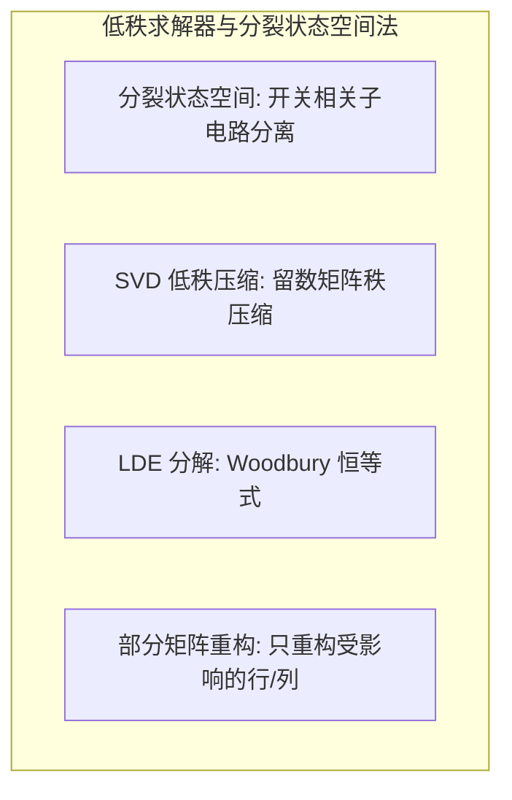

# 低秩求解器与分裂状态空间法

## 定义与边界

低秩求解器和分裂状态空间法是一类以矩阵分解和子空间压缩为核心的高效 EMT 求解技术。其共同思想是：大规模含变流器系统的状态矩阵包含大量不随开关状态变化的常数结构，通过识别并分离这部分结构，可大幅降低时变部分的计算维度。低秩网络求解器通过矩阵低秩近似压缩系统，分裂状态空间法通过自动识别开关相关子电路将状态矩阵拆分为常数部分和时变部分。

本页关注这两种方法的数学原理及其在 EMT 仿真中的应用。相关方法包括 [[state-space-method]]、[[model-order-reduction]] 和 [[exponential-integrator]]。

## EMT 中的作用

含电力电子变换器的大规模 EMT 仿真面临的核心计算瓶颈是状态矩阵随开关事件频繁变化：

- 状态矩阵时变：开关状态变化改变电路拓扑，使系统矩阵每次变化时需重新处理。
- 维数灾难：大规模新能源并网系统包含数十至数百个变流器，状态变量可达数万维。
- 低秩/分裂方法的切入点：将时变部分限制在开关相关子电路范围内，常数部分可复用预计算结果。

## 核心机制

### 分裂状态空间法

将完整状态空间方程分解为：

$$
\dot{x} = A x + B u = (A_1 + A_2(s)) x + B u
$$

其中 \(A_1\) 包含不随开关状态变化的网络、元件和耦合关系，\(A_2(s)\) 只保留由开关状态 \(s\) 决定的最小千电路贡献。这个最小子电路不是人工指定，而是通过自动开关分组和 SASV（Switch-Adjacent State Variables）识别找到与开关直接相关的状态变量集合。

随后使用指数分裂公式求解：

$$
e^{h(A_1 + A_2)} \approx \prod_{i} e^{\alpha_i h A_1} e^{\beta_i h A_2}
$$

其中 \(\alpha_i\)、\(\beta_i\) 为分裂系数。\(A_1\) 对应的矩阵指数只需预计算一次并可复用，\(A_2\) 仅在开关状态改变时局部更新，避免对完整时变矩阵反复求指数。

### 低秩网络求解器

低秩网络求解器利用系统矩阵的数值低秩特性进行压缩。对导纳矩阵或状态矩阵做低秩近似：

$$
A \approx U_r \Sigma_r V_r^T, \quad r \ll n
$$

其中 \(r\) 为有效秩，\(n\) 为原始维数。在网络求解中，Woodbury 恒等式将高维矩阵求逆转化为低秩矩阵求逆：

$$
(A + U C V)^{-1} = A^{-1} - A^{-1} U (C^{-1} + V A^{-1} U)^{-1} V A^{-1}
$$

矩阵求逆复杂度从 \(O(n^3)\) 降至 \(O(r^3)\)，\(r \ll n\)。典型应用包括：

- **FDNE 压缩**：将频率相关网络等值的留数矩阵通过 SVD 压缩秩，当压缩秩 \(r < (N+1)/2\)（\(N\) 为端口数）时计算量显著降低。
- **LDE 分解（Linking-Domain Extraction）**：将网络导纳矩阵分块，通过 Woodbury 恒等式将大规模系统求逆复杂度从 \(O(N^3)\) 降至 \(O(N)\)。

### 伴随电路方法

伴随电路方法与低秩相关：通过 Schur 补消去内部节点后，端口导纳矩阵往往具有数值低秩结构，可进一步压缩。相关技术见 [[companion-circuit]]。

## 分类与变体

| 方法 | 压缩策略 | 计算复杂度 | 适用场景 |
|------|----------|-----------|----------|
| 分裂状态空间 | 开关相关子电路分离 | \(O(r^3)\), \(r\) 为子电路维数 | 含多开关变流器系统 |
| SVD 低秩压缩 | 留数矩阵秩压缩 | \(O(rN)\), \(r\) 为压缩秩 | FDNE 等值 |
| LDE 分解 | Woodbury 恒等式 | \(O(N)\) | 大规模交直流电网分区 |
| 部分矩阵重构 | 只重构受影响的行/列 | 局部更新 | 拓扑频繁变化场景 |

## 相关方法

- [[state-space-method]] — 状态空间建模基础
- [[exponential-integrator]] — 指数积分与分裂求解
- [[model-order-reduction]] — 模型降阶理论
- [[vector-fitting]] — 有理逼近与留数提取
- [[frequency-dependent-network-equivalent]] — FDNE 等值

## 相关模型

- [[fdne-model]] — 频率相关网络等值模型
- [[mmc-model]] — MMC 大规模系统模型
- [[equivalent-modeling]] — 等效建模方法

## 相关主题

- [[low-rank-and-efficient-solvers]]
- [[network-equivalent]]
- [[parallel-computing]]

## 代表性来源

- Fu 等 — Splitting State-Space Method for Converter-Integrated Power Systems EMT Simulations (2025)
- Hu 等 — Compacting and partitioning-based simulation solution for frequency-dependent network equivalents (2015)
- Duan, Dinavahi — A Novel Linking-Domain Extraction Decomposition Method for Parallel EMT Simulation (2020)