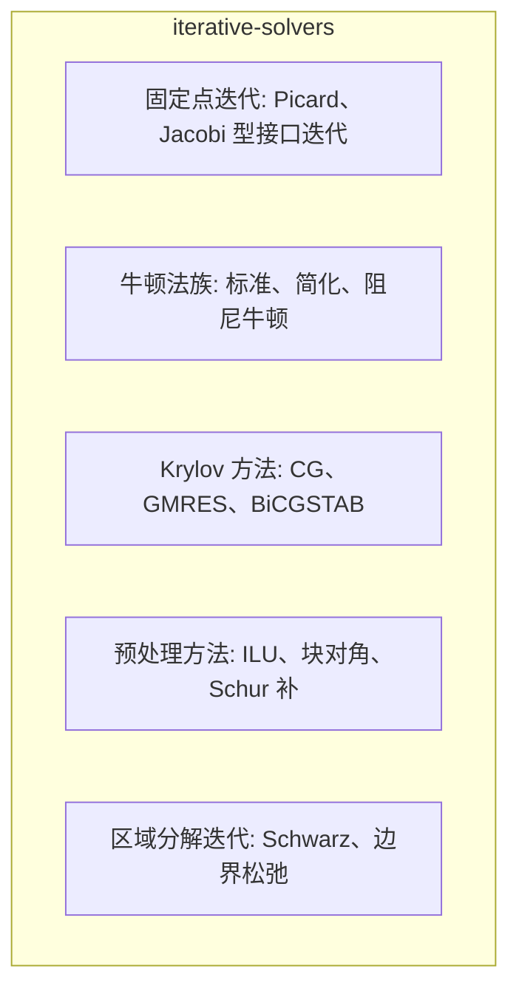

# 迭代求解方法 (Iterative Solvers)

## 技术背景

### 发展历史
该技术源于电力系统仿真领域的长期研究积累，随着电力电子设备在电网中的广泛应用而日益重要。

### 研究现状
当前学术界和工业界对该技术的研究主要集中在提升仿真效率、计算效率和模型通用性方面。

### 技术挑战
- 大规模系统的计算复杂度问题
- 多时间尺度混合仿真的协调问题
- 实时仿真的时效性要求
- 模型验证和不确定性量化

## 定义与边界

迭代求解方法通过一系列近似解逼近线性或非线性方程的解。EMT 中的迭代求解主要分为两类：非线性元件或隐式积分产生的牛顿类迭代，以及大型线性系统或边界耦合问题中的 Krylov、固定点或松弛迭代。

迭代法不是 [[sparse-matrix-solver]] 的同义词。稀疏直接法通过因子化一次性求解线性方程；迭代法需要收敛判据、初值、预处理和失败处理。对于硬实时 EMT，迭代次数不确定本身就是一个建模和调度风险。

## EMT 中的作用

迭代法在 EMT 中常见于：

- 饱和变压器、避雷器、电弧、半导体详细模型等非线性元件。
- 后向欧拉、梯形法或 DIRK 类隐式积分下的非线性代数方程。
- 大规模或分区网络中的预处理 Krylov 求解。
- [[electromechanical-electromagnetic-hybrid-simulation]] 或多速率耦合中的边界量协调。

在这些场景中，迭代法解决的是“模型或接口非线性/大规模性”的问题；它不能弥补模型参数、步长或边界条件不适配造成的物理错误。

## 核心机制

非线性方程 $\mathbf{F}(\mathbf{x})=0$ 的牛顿迭代为：

$$
\mathbf{J}(\mathbf{x}^{(k)})\Delta\mathbf{x}^{(k)}
=-\mathbf{F}(\mathbf{x}^{(k)})
$$

$$
\mathbf{x}^{(k+1)}=\mathbf{x}^{(k)}+\alpha_k\Delta\mathbf{x}^{(k)}
$$

其中 $\mathbf{J}$ 是雅可比矩阵，$\alpha_k$ 是可选阻尼因子。标准牛顿法在解附近可能快速收敛，但全局收敛依赖初值、阻尼和方程光滑性。

线性 Krylov 方法求解：

$$
\mathbf{A}\mathbf{x}=\mathbf{b}
$$

并在由残差生成的子空间中寻找近似解。预处理形式为：

$$
\mathbf{M}^{-1}\mathbf{A}\mathbf{x}=\mathbf{M}^{-1}\mathbf{b}
$$

其中 $\mathbf{M}$ 应比 $\mathbf{A}$ 更容易求解且能改善条件数。没有合适预处理时，Krylov 方法可能收敛很慢或停滞。

## 分类与变体

| 类型 | 代表方法 | EMT 位置 | 边界 |
|------|----------|----------|------|
| 固定点迭代 | Picard、Jacobi 型接口迭代 | 弱耦合接口、松弛协调 | 强耦合时可能发散 |
| 牛顿法族 | 标准、简化、阻尼牛顿 | 非线性元件和隐式积分 | 需要雅可比或等效增量导纳 |
| Krylov 方法 | CG、GMRES、BiCGSTAB | 大型线性系统 | 收敛依赖矩阵性质和预处理 |
| 预处理方法 | ILU、块对角、Schur 补 | 降低迭代次数 | 预处理构造也有成本 |
| 区域分解迭代 | Schwarz、边界松弛 | 分网和混合仿真 | 边界条件影响稳定性 |

CG 需要对称正定条件；普通 EMT 导纳矩阵未必满足。GMRES 和 BiCGSTAB 更常用于非对称或不定系统，但残差、重启策略和预处理选择必须与具体矩阵绑定。

## 适用边界与失败模式

迭代法适合内存受限、矩阵规模大、预处理有效、允许可变迭代次数或可接受近似误差的场景。它在以下条件下风险较高：

- 非线性元件存在不连续开关、滞回或分段导数突变。
- 初值远离解，牛顿步跨越物理可行域。
- 预处理矩阵过旧，无法反映当前开关状态或系统刚性。
- 接口迭代只检查电压或电流单一残差，遗漏功率、能量或保护量误差。
- 实时仿真中最大迭代次数被强行截断，导致“按时完成”但未实际收敛。

因此，迭代页中的容差、次数和误差指标不应作为通用推荐；应写明它们来自特定算例或实现。

## 研究前沿

### 当前研究热点
- **人工智能与仿真**：利用机器学习加速仿真计算
- **数字孪生技术**：构建电力系统的数字孪生模型
- **实时仿真技术**：满足硬件在环仿真的时效性要求
- **云仿真平台**：基于云计算的大规模并行仿真

### 开放问题
- 超大规模系统的实时仿真能力
- 多物理场耦合建模方法
- 不确定性量化和风险评估
- 模型验证和标定方法

### 未来发展方向
- 更高效的数值算法
- 更精确的模型降阶技术
- 更智能的参数优化方法
- 更完善的验证和确认框架

### 典型参数范围
- 时间步长：1μs ~ 1ms
- 系统规模：10~1000节点
- 仿真时长：0.1s ~ 10s
- 电压等级：10kV ~ 500kV
- 功率范围：1MW ~ 1000MW
- 频率范围：50Hz / 60Hz

## 代表性来源

- [[emt-simulation]] - EMT仿真基础
- [[power-system]] - 电力系统建模
- [[electromagnetic-transient]] - 电磁暂态分析
- [[control-system]] - 控制系统设计
- [[real-time-simulation]] - 实时仿真技术
- [[a-robust-and-efficient-iterative-scheme-for-the-emt-simulations-of-nonlinear-cir-fix]] 可支撑非线性电路 EMT 迭代方案讨论，结论应限定在其测试问题。
- [[an-iterative-real-time-nonlinear-electromagnetic-transient-solver-on-fpga]] 涉及实时非线性迭代实现，适合作为硬件和迭代次数约束的个案来源。
- [[co-simulation-of-electromagnetic-transients-and-phasor-models-a-relaxation-appro]] 代表 EMT-相量耦合中的松弛/迭代接口问题。
- [[a-multi-rate-co-simulation-of-combined-phasor-domain-and-time-domain-models-for-]] 可用于多速率耦合迭代的边界讨论。

## 与相关页面的关系

- [[sparse-matrix-solver]] 包含直接和部分迭代线性求解；本页强调收敛机制和非线性/接口迭代。
- [[nodal-analysis]] 生成的节点方程可作为牛顿迭代中的线性化子问题。
- [[numerical-integration]] 决定隐式方程的形式和雅可比结构。
- [[stiff-system-handling]] 关注刚性带来的步长和稳定性问题，迭代法只是其中一个求解层。
- [[real-time-simulation]] 需要把迭代次数上限、收敛失败策略和硬实时期限一起说明。

## 来源论文

| 论文 | 年份 |
|------|------|
| [[evaluation-of-time-domain-and-phasor-domain-methods-for-power-system-transients|Evaluation of time-domain and phasor-domain methods for powe]] | 2022 |
