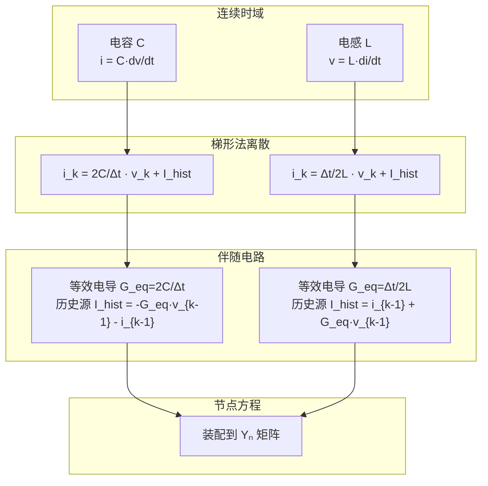

# 节点分析法 (Nodal Analysis)

## 1. 物理背景与工程需求

### 为什么要有节点分析？

求解一个电路网络，本质上是在解一个方程组。这个方程组来源于两条最基本的物理定律：

- **KCL**（基尔霍夫电流定律）：流入任意节点的电流之和为零
- **KVL**（基尔霍夫电压定律）：沿任意闭合回路的电压降之和为零

如果直接用这两条定律列方程，得到的是混合的微分-代数方程组——既有节点电压，又有支路电流，还有电感、电容的状态变量。对于一个几百个节点的电网，这种混合方程的求解规模非常大。

节点分析的**核心思想**是：把每个元件都表示为等效电流源（诺顿等效），使得列出来的方程只含节点电压一个未知量。这样就把一个庞大的混合问题简化成了纯粹的线性代数问题。

```text
元件特性 + 拓扑连接 → KCL方程组 → 只有节点电压是未知数
```

### 在 EMT 仿真中的角色

电磁暂态仿真是**时域步进**的——从 $t=0$ 开始，每步算一个时刻，每步都要解一次电路方程。如果每次解一个巨大的混合方程组，仿真会非常慢。

节点分析在 EMT 中相当于**装配线**：它让各个元件（电阻、电感、电容、线路、开关）在每一时步都转化成标准接口（诺顿等效导纳 + 历史电流源），然后统一求解。

```mermaid
graph LR
    subgraph 元件层
        L[电感 L]
        C[电容 C]
        R[电阻 R]
        Line[输电线路]
    end
    subgraph 接口层（伴随电路转化）
        L --> Geq_L[等效导纳 + 历史源]
        C --> Geq_C[等效导纳 + 历史源]
        R --> Geq_R[电导 g]
        Line --> Geq_Line[多端口等效]
    end
    subgraph 网络求解层
        Geq_L --> Yn[组装节点导纳矩阵 Yₙ]
        Geq_C --> Yn
        Geq_R --> Yn
        Geq_Line --> Yn
        Yn --> Solve[求解 Yₙ·v = i]
    end

    style Solve fill:#c8e6c9
```

这种"元件-接口-求解"三层分离架构，使得 EMT 仿真程序具有良好的可扩展性——新元件只需要实现自己的伴随电路接口，不需要修改网络求解器。

---

## 2. 数学描述

### 从 KCL 到矩阵方程

考虑一个 $N$ 个节点的电路。对节点 $k$，KCL 给出：

$$
\sum_{j} i_{kj} = 0
$$

其中 $i_{kj}$ 是从节点 $k$ 流向节点 $j$ 的电流。如果支路 $(k,j)$ 是一个电导 $g_{kj}$，则：

$$
i_{kj} = g_{kj}(v_k - v_j)
$$

代入 KCL 并整理：

$$
(\sum_j g_{kj}) v_k - \sum_{j \neq k} g_{kj} v_j = 0
$$

对所有节点写出上述方程，就得到了节点方程的矩阵形式：

$$
\mathbf{Y}_n \mathbf{v} = \mathbf{i}
$$

其中：

- $\mathbf{Y}_n \in \mathbb{R}^{N \times N}$：节点导纳矩阵
  - 对角线元素 $Y_{kk} = \sum_j g_{kj}$（与节点 $k$ 相连的所有支路电导之和）
  - 非对角线元素 $Y_{kj} = -g_{kj}$（支路电导取负）
- $\mathbf{v} \in \mathbb{R}^{N}$：节点电压向量（待求解）
- $\mathbf{i} \in \mathbb{R}^{N}$：注入电流向量（独立电流源 + 历史电流源）

### 方程的物理含义

这个方程的每一行都是在说一件事：**节点 $k$ 上的净注入电流等于从该节点流向所有相邻节点的电流之和**。换句话说，它就是 KCL 的代数形式。

把方程展开来看更清楚。对于节点 $k$：

$$
g_{k1}(v_k - v_1) + g_{k2}(v_k - v_2) + \cdots + g_{kN}(v_k - v_N) = i_k
$$

左边每一项 $g_{kj}(v_k - v_j)$ 都是从节点 $k$ 流向节点 $j$ 的电流。如果某一对节点之间没有直接连接，对应的 $g_{kj} = 0$。

### 节点导纳矩阵的装配规则

对一个连接在节点 $p$ 和 $q$ 之间的支路电导 $g$，它对矩阵的贡献非常直观：

$$
Y_{pp} \mathrel{+}= g, \quad Y_{qq} \mathrel{+}= g, \quad Y_{pq} \mathrel{-}= g, \quad Y_{qp} \mathrel{-}= g
$$

这种装配方式是**叠加的**——每个元件独立贡献，最终矩阵是所有元件贡献的叠加。这给编程实现带来了极大的便利：遍历所有元件，把每个元件的导纳贡献累加到对应位置即可。

### 参考节点的处理

节点方程中有一个自由度是冗余的——整个系统的电压基准需要指定。通常选取大地（或某一节点）作为参考节点（地节点），其电压固定为零，不参与方程求解。这样，矩阵 $

tbf{Y}_n$ 是 $(N-1) \times (N-1)$ 的（若总共有 $N$ 个节点，其中一个为地）。

---

## 3. 计算模型与离散化

### 动态元件的伴随电路转化

这是节点分析在 EMT 中发挥作用的关键一步。一个动态元件（电感、电容）在连续时域中是由微分方程描述的，但在数字计算机上，我们只能处理代数方程。**数值积分把微分方程离散化，而伴随电路把离散后的方程表现为等效电路。**

#### 电容

电容的特性方程：

$$
i_C(t) = C \frac{dv_C(t)}{dt}
$$

用梯形法在 $t_k$ 时刻离散：

$$
i_C(t_k) = \frac{2C}{\Delta t} v_C(t_k) - \left[ \frac{2C}{\Delta t} v_C(t_{k-1}) + i_C(t_{k-1}) \right]
$$

记 $G_{eq} = 2C/\Delta t$，$I_{hist} = -[G_{eq} v_C(t_{k-1}) + i_C(t_{k-1})]$，则：

$$
i_C(t_k) = G_{eq} v_C(t_k) + I_{hist}
$$

这就是一个电导 $G_{eq}$ 与电流源 $I_{hist}$ 并联的**诺顿等效电路**。

#### 电感

电感的特性方程：

$$
v_L(t) = L \frac{di_L(t)}{dt}
$$

同理离散：

$$
i_L(t_k) = \frac{\Delta t}{2L} v_L(t_k) + \left[ i_L(t_{k-1}) + \frac{\Delta t}{2L} v_L(t_{k-1}) \right]
$$

记 $G_{eq} = \Delta t/(2L)$，$I_{hist} = i_L(t_{k-1}) + G_{eq} v_L(t_{k-1})$，则：

$$
i_L(t_k) = G_{eq} v_L(t_k) + I_{hist}
$$

同样是一个诺顿等效电路。



### 关键洞察

上表中隐含了一个非常重要的结论：**等效电导 $G_{eq}$ 只取决于元件参数 $C$（或 $L$）和步长 $\Delta t$，与历史状态无关。** 这意味着：

1. 如果步长不变，等效电导在仿真过程中保持不变
2. 矩阵 $\mathbf{Y}_n$ 只需在步长变化或开关动作时才需要重新分解
3. 每个时步的计算量主要是：装配右端项 $\mathbf{i}$ + 一次前代回代

这是 EMTP 类程序能够高效运行的根本原因。

### 其他积分公式的影响

上面的推导用了梯形法。如果改用其他积分公式，等效电导的形式会不同：

| 积分方法 | 电容等效电导 $G_{eq}$ | 特性 |
|----------|----------------------|------|
| 后向欧拉 | $C/\Delta t$ | L-稳定，无数值振荡 |
| 梯形法 | $2C/\Delta t$ | A-稳定，可能有数值振荡 |
| Gear-2 | $3C/(2\Delta t)$ | L-稳定，精度较低 |
| 2S-DIRK | 取决于具体格式 | L-稳定，高阶精度 |

这就是"节点分析本身不保证数值特性，数值特性取决于积分公式"的含义。

---

## 4. 实现方法与算法细节

### 一个完整时步的计算流程

在 EMT 中，每一时步的节点分析流程如下：

```text
输入: 本时步的电压/电流历史值, 步长 Δt

1. 更新所有元件的诺顿等效
   - 对每类元件, 计算其历史电流源 I_hist
   - 注意: 若步长未变且无开关动作, G_eq 不需重算

2. 装配右端电流向量 i
   - 将所有元件的 I_hist 和独立电流源叠加到对应节点

3. 求解节点方程
   - 若 Y_n 不变: 前代回代 (O(n²) 稀疏求解)
   - 若 Y_n 变化: 重新 LU 分解 + 前代回代

4. 更新支路量
   - 从节点电压回代计算各支路电流
   - 更新元件的状态变量 (电容电压、电感电流等)

输出: 本时步的节点电压和所有支路量
```

### 矩阵复用与重新分解

$

tbf{Y}_n$ 的 LU 分解是整个仿真中计算量最大的步骤之一。实际程序中会用以下策略减少分解次数：

- **恒导纳模型**：开关动作时不改变矩阵，通过补偿法或插值来模拟开关效果
- **部分重分解**：只更新矩阵中受开关影响的几个元素，对 LU 因子做局部修正
- **符号分解 + 数值分解分离**：矩阵稀疏模式不变时，只用重做数值分解

### 与稀疏矩阵求解器的配合

实际电网的节点导纳矩阵是高度稀疏的（每个节点只与少数几个节点相连）。因此节点方程不会用稠密高斯消去法求解，而是使用专门的稀疏矩阵技术：

- **KLU 求解器**：EMTP 类程序中最常用的稀疏求解器
- **AMD 重排序**：减少 LU 分解中的填充元
- **BTF 预处理**：将矩阵分解为块三角形式，每个块独立求解

---

## 5. 适用边界与失效模式

### 什么条件下好用？

- 网络拓扑清晰，大部分元件可用导纳或诺顿等效表示
- 电网规模大但连接稀疏（稀疏性使得求解效率高）
- 步长相对于系统最快暂态足够小

### 什么条件下会出问题？

| 问题场景 | 表现 | 原因 | 缓解办法 |
|----------|------|------|----------|
| 数值振荡 | 开关动作后电压/电流出现非物理振荡 | 梯形法在突变时无法快速衰减高频分量 | 切换为后向欧拉、CDA 算法、或插值法 |
| 矩阵病态 | 求解结果精度丧失 | 断路支路使用过小导纳、闭合支路使用过大导纳 | 合理选择开关电导比值（通常 $10^{4}\sim10^{6}$） |
| 奇异回路 | 节点方程无解 | 理想开关形成仅含电压源的回路 | 增加寄生电阻或使用增广节点法 |
| 接口延迟 | 分网仿真精度下降 | 子网间信息交换滞后一时步 | 使用迭代接口或预测-校正方法 |
| 非线性迭代发散 | 牛顿法不收敛 | 雅可比矩阵更新不及时或初始猜测不好 | 减小步长、使用阻尼牛顿法 |

### 工程经验值

- 开关电导比（开态/关态）推荐 $10^{5}$ 左右，太大或太小都会恶化矩阵条件数
- 梯形法 + CDA 的组合是 EMTP 中最成熟的工程方案
- 恒导纳模型需要配合延迟和插值，不能仅靠矩阵不变就声称"精确"

---

## 6. 一个简单的数值算例

考虑一个 RC 串联电路：电阻 $R=100\Omega$，电容 $C=10\mu\text{F}$，电压源 $V_s = 100\text{V}$（阶跃输入）。求电容电压 $v_C(t)$ 的响应。

**步骤 1：节点方程**

电路中只有两个节点（地 + 节点1），节点方程为：

$$
\left(\frac{1}{R} + \frac{2C}{\Delta t}\right) v_1(t_k) = \frac{V_s}{R} + \left[\frac{2C}{\Delta t} v_1(t_{k-1}) + i_C(t_{k-1})\right]
$$

**步骤 2：节点方程的迭代求解**（取 $\Delta t = 50\mu\text{s}$）

该电路时间常数 $\tau = RC = 1$ms，解析解 $v_C(t) = V_s(1 - e^{-t/RC})$。

每步先根据上一时步的状态计算历史电流源，然后求解节点方程得到新的 $v_1$，再从 $v_1$ 回代电流 $i_C$ 供下一步使用。读者可代入参数自行验证：梯形法伴随电路的数值解会以二阶精度收敛到解析解。

如果把步长增大到 $500\mu\text{s}$ 并在 $t = \tau$ 处突然切除电容（开关动作），梯形法就会出现明显的数值振荡，需要切换到后向欧拉来阻尼。

---

## 7. 延伸阅读

### 核心参考文献

- [[a-combined-state-space-nodal-method-for-the-simulation-of-power-system-transient]] — 状态空间与节点方程结合的路线
- [[a-comparative-study-of-electromagnetic-transient-simulations-using-companion-cir]] — 伴随电路离散策略的系统比较
- [[2728nested-fast-and-simultaneous-solution-for-time-domain-simulation-of-integrat]] — 嵌套求解与矩阵复用技术
- [[a-bridge-arm-module-based-fixed-admittance-adc-model-for-converters-in-emt-simul]] — 固定导纳模型在 MMC 等值中的应用
- [[neural-electromagnetic-transients-program]] — 基于学习的节点求解替代方案

### 相关页面

- [[nodal-admittance-matrix]] — 节点导纳矩阵的构造和性质
- [[sparse-matrix-solver]] — 稀疏线性方程组的求解
- [[companion-circuit]] — 伴随电路模型的详细推导
- [[fixed-admittance]] — 固定导纳建模策略
- [[numerical-oscillation-suppression]] — 数值振荡的抑制方法
</｜DSML｜parameter>

## 来源论文

| 论文 | 年份 |
|------|------|
| [[耦合长线电磁暂态分析的扩展bergeron模型|耦合长线电磁暂态分析的扩展Bergeron模型]] | 1996 |
| [[电磁暂态计算中新的变压器模型|电磁暂态计算中新的变压器模型]] | 1999 |
| [[frequency-dependent-transmission-line-modeling-utilizing-transposed-conditions-p|Frequency-dependent transmission line modeling utilizing tra]] | 2001 |
| [[37s0142-061528962900045-2|37/s0142-0615%2896%2900045-2]] | 2003 |
| [[a-time-domain-approach-to-transmission-network-equivalents-via-prony-analysts-fo|A TIME-DOMAIN APPROACH TO TRANSMISSION NETWORK EQUIVALENTS V]] | 2004 |
| [[a-high-frequency-transformer-model-for-the-emtp-power-delivery-ieee-transactions|A high frequency transformer model for the EMTP - Power Deli]] | 2004 |
| [[creating-an-electromagnetic-transients-program-in-matlab-matemtp-power-delivery-|Creating An Electromagnetic Transients Program In Matlab: Ma]] | 2004 |
| [[frequency-dependent-transformation-matrices-for-untransposed-transmission-lines-|Frequency-Dependent Transformation Matrices for Untransposed]] | 2004 |
| [[improved-control-systems-simulation-in-the-emtp-through-compensation|Improved control systems simulation in the EMTP through comp]] | 2004 |
| [[modelling-of-circuit-breakers-in-the-electromagnetic-transients-program-power-sy|Modelling of circuit breakers in the Electromagnetic Transie]] | 2004 |
| [[multi-port-frequency-dependent-network-equivalents-for-the-emtp-power-delivery-i|Multi-port frequency dependent network equivalents for the E]] | 2004 |
| [[multiphase-power-flow-solutions-using-emtp-and-newtons-method-power-systems-ieee|Multiphase power flow solutions using EMTP and Newtons metho]] | 2004 |
| [[power-converter-simulation-module-connected-to-the-emtp-power-systems-ieee-trans|Power converter simulation module connected to the EMTP - Po]] | 2004 |
| [[real-time-digital-simulator-of-the-electromagnetic-transients-of-power-transmiss|Real-time digital simulator of the electromagnetic transient]] | 2004 |
| [[three-phase-transformer-modelling-for-fast-electromagnetic-transient-studies-pow|Three phase transformer modelling for fast electromagnetic t]] | 2004 |
| [[using-tacs-functions-within-empt-to-teach-protective-relaying-fundamentals-power|Using TACS Functions Within EMPT To Teach Protective Relayin]] | 2004 |
| [[validation-of-frequency-dependent|Validation of Frequency-Dependent]] | 2005 |
| [[a-voltage-behind-reactance-synchronous-machine-model-for-the-emtp-type-solution|A Voltage-Behind-Reactance Synchronous Machine Model for the]] | 2006 |
| [[a-voltage-behind-reactance-synchronous-machine-model-for-the-emtp-type-solution|A Voltage-Behind-Reactance Synchronous Machine Model for the]] | 2006 |
| [[a-voltage-behind-reactance-synchronous-machine-model-for-the-emtp-type-solution|A Voltage-Behind-Reactance Synchronous Machine Model for the]] | 2006 |
| [[hybrid-transient-stability-simulation-using-dynamic-phasor-based-interface-model-22|Hybrid Transient Stability Simulation Using Dynamic Phasor B]] | 2006 |
| [[hybrid-model-transient-stability-simulation-using-dynamic-phasors-based-hvdc-system-model|Hybrid-model transient stability simulation using dynamic ph]] | 2006 |
| [[inclusion-of-frequency-dependent-soil-parameters-in|Inclusion of Frequency-Dependent Soil Parameters in]] | 2006 |
| [[2728nested-fast-and-simultaneous-solution-for-time-domain-simulation-of-integrat|Nested fast and simultaneous solution for time-domain simula]] | 2006 |
| [[电力系统机电暂态和电磁暂态混合仿真程序设计和实现|电力系统机电暂态和电磁暂态混合仿真程序设计和实现]] | 2006 |
| [[on-a-new-approach-for-the-simulation-of-transients|On a new approach for the simulation of transients]] | 2007 |
| [[on-a-new-approach-for-the-simulation-of-transients|On a new approach for the simulation of transients]] | 2007 |
| [[re-examination-of-synchronous-machine|Re-examination of Synchronous Machine]] | 2007 |
| [[re-examination-of-synchronous-machine|Re-examination of Synchronous Machine]] | 2007 |
| [[re-examination-of-synchronous-machine|Re-examination of Synchronous Machine]] | 2007 |
| [[numerical-integration-by-the-2-stage-diagonally|Numerical Integration by the 2-Stage Diagonally Implicit Run]] | 2008 |
| [[a-link-between-emtp-rv-and-flux3d-for-transformer-energization-studies|A link between EMTP-RV and FLUX3D for transformer energizati]] | 2009 |
| [[fpga-based-real-time-emtp|FPGA-Based Real-Time EMTP]] | 2009 |
| [[frequency-adaptive-power-system-modeling-for|Frequency-Adaptive Power System Modeling for]] | 2009 |
| [[a-time-domain-harmonic-power-flow-algorithm|A Time-Domain Harmonic Power-Flow Algorithm]] | 2010 |
| [[approximate-voltage-behind-reactance-induction-machine-model-for-efficient-inter|Approximate Voltage-Behind-Reactance Induction Machine Model]] | 2010 |
| [[approximate-voltage-behind-reactance-induction-machine-model-for-efficient-inter|Approximate Voltage-Behind-Reactance Induction Machine Model]] | 2010 |
| [[approximate-voltage-behind-reactance-induction-machine-model-for-efficient-inter|Approximate Voltage-Behind-Reactance Induction Machine Model]] | 2010 |
| [[efcient-modeling-of-modular-multilevel-hvdc-15|Efficient Modeling of Modular Multilevel HVDC]] | 2010 |
| [[including-magnetic-saturation-in-voltage-behind-reactance-induction-machine-mode|Including Magnetic Saturation in Voltage-Behind-Reactance In]] | 2010 |
| [[methods-of-interfacing-rotating-machine-models-in-emtp|Methods of Interfacing Rotating Machine Models in EMTP]] | 2010 |
| [[methods-of-interfacing-rotating-machine-models-in-emtp|Methods of Interfacing Rotating Machine Models in EMTP]] | 2010 |
| [[a-robust-and-efficient-iterative-scheme-for-the-emt-simulations-of-nonlinear-cir-fix|A Robust and Efficient Iterative Scheme for the EMT Simulati]] | 2011 |
| [[a-combined-state-space-nodal-method-for-the-simulation-of-power-system-transient|A combined state-space nodal method for the simulation of po]] | 2011 |
| [[magnetically-saturable-voltage-behind-reactance-model-for-induction-machines|Magnetically Saturable Voltage Behind Reactance Model for In]] | 2011 |
| [[frequency-dependent-network-equivalent-for-electromagnetic-and-electromechanical|Frequency Dependent Network Equivalent for Electromagnetic a]] | 2012 |
| [[nodal-reduced-induction-machine-modeling-for|Nodal Reduced Induction Machine Modeling for]] | 2012 |
| [[nodal-reduced-induction-machine-modeling-for|Nodal Reduced Induction Machine Modeling for]] | 2012 |
| [[photovoltaic-generator-modelling-to-improve-numerical-robustness-of-emt-simulati|Photovoltaic generator modelling to improve numerical robust]] | 2012 |
| [[saturation-in-transient-and-stability-phenomena-for-cylindrical-13&14|Saturation in Transient and Stability Phenomena for Cylindri]] | 2012 |
| [[the-recongurable-hardware-real-time-and|The Reconfigurable-Hardware Real-Time and]] | 2012 |
| [[time-domain-transformation-method|Time Domain Transformation Method]] | 2012 |
| [[comparison-between-electromechanical-transient-model-and-electromagnetic-transie|Comparison between electromechanical transient model and ele]] | 2013 |
| [[electromechanical-transient-modeling-of-modular-multilevel-converter-based-multi|Electromechanical Transient Modeling of Modular Multilevel C]] | 2013 |
| [[electromechanical-transient-modeling-of-modular-multilevel-converter-based-multi|Electromechanical Transient Modeling of Modular Multilevel C]] | 2013 |
| [[modular-multilevel-converter-models|Modular Multilevel Converter Models]] | 2013 |
| [[synchronous-machine-exciter-circuit-model-in-a|Synchronous Machine Exciter Circuit Model In A]] | 2013 |
| [[analysis-and-mitigation-of-subsynchronous-resonance-in-series-compensated-wind-p|Analysis and Mitigation of Subsynchronous Resonance in Serie]] | 2014 |
| [[analysis-and-mitigation-of-subsynchronous-resonance-in-series-compensated-wind-p|Analysis and Mitigation of Subsynchronous Resonance in Serie]] | 2014 |
| [[dynamic-average-value-modeling-of-13&14|Dynamic Average-Value Modeling of]] | 2014 |
| [[parallel-massive-thread-electromagnetic-transient-simulation-on-gpu|Parallel Massive-Thread Electromagnetic Transient Simulation]] | 2014 |
| [[application-of-frequency-partitioning-fitting-to-the-phase-domain-frequency-depe|Application of Frequency-Partitioning Fitting to the Phase-D]] | 2015 |
| [[application-of-frequency-partitioning-fitting-to-the-phase-domain-frequency-depe|Application of Frequency-Partitioning Fitting to the Phase-D]] | 2015 |
| [[comparison-of-detailed-modeling-techniques-for-mmc-employed-on-vsc-hvdc-schemes|Comparison of Detailed Modeling Techniques for MMC Employed ]] | 2015 |
| [[frequency-domain-simulation-of-electromagnetic-transients-using-variable|Frequency-Domain Simulation of Electromagnetic Transients Us]] | 2015 |
| [[transient-stability-analysis-of-mmc-hvdc-system-considering-dc-side-fault|Transient Stability Analysis of MMC-HVDC System Considering ]] | 2015 |
| [[29tpwrd20162518676-2|29/TPWRD.2016.2518676]] | 2016 |
| [[29tpwrd20162590569-2|29/TPWRD.2016.2590569]] | 2016 |
| [[31tpwrd20162529662-2|31/tpwrd.2016.2529662]] | 2016 |
| [[31tpwrd20162529662-2|31/tpwrd.2016.2529662]] | 2016 |
| [[an-automated-fpga-real-time-simulator-for-power-electronics-and-power-systems-el|An automated FPGA real-time simulator for power electronics ]] | 2016 |
| [[current-source-modular-multilevel-converter-modeling-and-control|Current Source Modular Multilevel Converter Modeling and Con]] | 2016 |
| [[enhanced-high-speed-electromagnetic-transient-simulation-17|Enhanced high-speed electromagnetic transient simulation]] | 2016 |
| [[enhanced-high-speed-electromagnetic-transient-simulation|Enhanced high-speed electromagnetic transient simulation]] | 2016 |
| [[improved-accuracy-average-value-models-of-modular-multilevel-converters|Improved Accuracy Average Value Models of Modular Multilevel]] | 2016 |
| [[nonlinear-magnetic-equivalent-circuit-based-real-time-sen-transformer-electromag|Nonlinear Magnetic Equivalent Circuit-Based Real-Time Sen Tr]] | 2016 |
| [[线性开关电路电磁暂态分析的状态方程法|线性开关电路电磁暂态分析的状态方程法]] | 2016 |
| [[30tpwrd20172714639-2|30/TPWRD.2017.2714639]] | 2017 |
| [[34tpwrd20172749427|34/TPWRD.2017.2749427]] | 2017 |
| [[a-novel-interfacing-technique-for-distributed-hybrid-simulations-combining-emt-a|A Novel Interfacing Technique for Distributed Hybrid Simulat]] | 2017 |
| [[modeling-of-modular-multilevel-converters-with-different-levels-of-detail-13&14|Dynamic Electro-Magnetic-Thermal Modeling of MMC-Based DC-DC]] | 2017 |
| [[dynamic-phasor-based-interface-model-for-emt-and-transient-stability-hybrid-simu|Dynamic Phasor Based Interface Model for EMT and Transient S]] | 2017 |
| [[a-dynamic-phasor-model-of-an-mmc-with-extended-frequency-range-for-emt-simulatio|A Dynamic Phasor Model of an MMC with Extended Frequency Ran]] | 2018 |
| [[an-enhanced-average-value-model-of-modular-multilevel-converter-for-accurate-rep|An Enhanced Average Value Model of Modular Multilevel Conver]] | 2018 |
| [[cpu-based-parallel-computation-of-electromagnetic-transients-for-large-power-gri|CPU based parallel computation of electromagnetic transients]] | 2018 |
| [[co-simulation-of-electrical-networks-by-interfacing-emt-and-dynamic-phasor-simul|Co-simulation of electrical networks by interfacing EMT and ]] | 2018 |
| [[2169-3536-c-2018-ieee-translations-and-content-mining-are-permitted-for-academic|Efficient GPU-based Electromagnetic Transient Simulation for]] | 2018 |
| [[evaluation-of-the-impact-of-different-transmission-line-models-on-electromagneti|Evaluation of the impact of different transmission line mode]] | 2018 |
| [[general-approach-for-accurate-resonance-analysis-in-transformer-windings|General approach for accurate resonance analysis in transfor]] | 2018 |
| [[real-time-fpga-rtds-co-simulator-for-power-systems|Real-Time FPGA-RTDS Co-Simulator for Power Systems]] | 2018 |
| [[real-time-simulation-of-hybrid-modular-multilevel-converters-using-shifted-phaso|Real-time Simulation of Hybrid Modular Multilevel Converters]] | 2018 |
| [[real-time-simulation-of-hybrid-modular-multilevel-converters-using-shifted-phaso|Real-time Simulation of Hybrid Modular Multilevel Converters]] | 2018 |
| [[saturable-reactor-hysteresis-model-based-on-jilesatherton-formulation-for-ferror|Saturable reactor hysteresis model based on Jiles–Atherton f]] | 2018 |
| [[unified-high-speed-emt-equivalent-and-implementation-method-of-mmcs-with-single-|Unified High-Speed EMT Equivalent and Implementation Method ]] | 2018 |
| [[wwwelseviercomlocateepsr|www.elsevier.com/locate/epsr]] | 2018 |
| [[双端口子模块mmc电磁暂态通用等效建模方法|双端口子模块MMC电磁暂态通用等效建模方法]] | 2018 |
| [[a-universal-blocking-module-based-average-value-model-of-modular-multilevel-conv|A Universal Blocking-Module-Based Average Value Model of Mod]] | 2019 |
| [[an-efficient-phase-domain-synchronous-machine-model-with-constant-equivalent-adm|An Efficient Phase Domain Synchronous Machine Model With Con]] | 2019 |
| [[an-efficient-phase-domain-synchronous-machine-model-with-constant-equivalent-adm|An Efficient Phase Domain Synchronous Machine Model With Con]] | 2019 |
| [[an-efficient-phase-domain-synchronous-machine-model-with-constant-equivalent-adm|An Efficient Phase Domain Synchronous Machine Model With Con]] | 2019 |
| [[modeling-of-a-modular-multilevel-converter-with-embedded-energy-storage-for-elec|Modeling of a Modular Multilevel Converter With Embedded Ene]] | 2019 |
| [[modeling-of-a-modular-multilevel-converter-with-embedded-energy-storage-for-elec|Modeling of a Modular Multilevel Converter With Embedded Ene]] | 2019 |
| [[multi-scale-induction-machine-model-in-the-phase-domain-with-constant-inner-impe|Multi-scale Induction Machine Model in the Phase Domain with]] | 2019 |
| [[real-time-mpsoc-based-electrothermal-transient-simulation-of-fault-tolerant-mmc-|Real-Time MPSoC-Based Electrothermal Transient Simulation of]] | 2019 |
| [[35tpwrd20192933610|Small Time-Step FPGA-based Real-Time Simulation of Power Sys]] | 2019 |
| [[spurious-power-losses-in-modular-multilevel-converter-arm-equivalent-model|Spurious Power Losses in Modular Multilevel Converter Arm Eq]] | 2019 |
| [[适用于交直流混联电网的ch-mmc电磁暂态快速仿真模型-15|适用于交直流混联电网的CH-MMC电磁暂态快速仿真模型]] | 2019 |
| [[a-harmonic-phasor-domain-co-simulation-method-and-new-insight-for-harmonic-analy|A Harmonic Phasor Domain Co-Simulation Method and New Insigh]] | 2020 |
| [[a-hierarchical-low-rank-approximation-based-network-solver-for-emt-simulation|A Hierarchical Low-Rank Approximation Based Network Solver f]] | 2020 |
| [[a-hierarchical-low-rank-approximation-based-network-solver-for-emt-simulation|A Hierarchical Low-Rank Approximation Based Network Solver f]] | 2020 |
| [[a-pulse-source-pair-based-acdc-interactive-simulation-approach-for-multiple-vsc-|A Pulse-Source-Pair-Based AC/DC Interactive Simulation Appro]] | 2020 |
| [[development-of-a-voltage-dependent-line-model-to-represent-the-corona-effect-in-|Development of a Voltage-Dependent Line Model to Represent t]] | 2020 |
| [[hierarchical-device-level-modular-multilevel-converter-modeling-for-parallel-and|Hierarchical Device-Level Modular Multilevel Converter Model]] | 2020 |
| [[high-performance-computing-engines-for-the-fpga-based-simulation-of-the-ulm|High performance computing engines for the FPGA-based simula]] | 2020 |
| [[iet-generation-transmission-distribution|IET Generation, Transmission & Distribution]] | 2020 |
| [[parallel-in-time-object-oriented-electromagnetic-transient-simulation-of-power-s|Parallel-in-Time Object-Oriented Electromagnetic Transient S]] | 2020 |
| [[simulation-of-electromagnetic-transients-with-modelica-accuracy-and-performance-|Simulation of electromagnetic transients with Modelica, accu]] | 2020 |
| [[spurious-power-and-its-elimination-in-modular-multilevel-converter-models|Spurious power and its elimination in modular multilevel con]] | 2020 |
| [[适用于电磁暂态仿真的变阶变步长3s-dirk算法|适用于电磁暂态仿真的变阶变步长3S-DIRK算法]] | 2020 |
| [[a-parallelization-in-time-approach-for-accelerating-emt-simulations|A parallelization-in-time approach for accelerating EMT simu]] | 2021 |
| [[an-fpga-based-electromagnetic-transient-analysis-of-power-distribution-network|An FPGA based electromagnetic transient analysis of power di]] | 2021 |
| [[comparison-and-selection-of-grid-tied-inverter-models-for-accurate-and-efficient|Comparison and Selection of Grid-Tied Inverter Models for Ac]] | 2021 |
| [[compensation-method-for-parallel-real-time-emt-studies|Compensation method for parallel real-time EMT studies✰]] | 2021 |
| [[compensation-method-for-parallel-real-time-emt-studies|Compensation method for parallel real-time EMT studies✰]] | 2021 |
| [[earth-return-admittance-impact-on-crossbonded-underground-cables|Earth return admittance impact on crossbonded underground ca]] | 2021 |
| [[electromechanical-transient-modelling-and-application-of-modular-multilevel-conv|Electromechanical transient modelling and application of mod]] | 2021 |
| [[hierarchical-modeling-scheme-for-high-speed-electromagnetic-transient-emt-simula|Hierarchical Modeling Scheme for High-Speed Electromagnetic ]] | 2021 |
| [[implementation-of-the-universal-line-model-in-the-alternative-transients-program|Implementation of the universal line model in the alternativ]] | 2021 |
| [[parallel-computation-of-power-system-emts-through-polyphase-qmf-filter-banks|Parallel computation of power system EMTs through Polyphase-]] | 2021 |
| [[parallelization-of-mmc-detailed-equivalent-model|Parallelization of MMC detailed equivalent model]] | 2021 |
| [[a-testing-tool-for-converter-dominated-power-system-stochastic-electromagnetic-t|A Testing Tool for Converter-Dominated Power System: Stochas]] | 2022 |
| [[average-value-modeling-of-line-commutated-inverter-systems-with-commutation-fail|Average-Value Modeling of Line-Commutated Inverter Systems W]] | 2022 |
| [[co-simulation-applied-to-power-systems-with-high-penetration-of-distributed-ener|Co-simulation applied to power systems with high penetration]] | 2022 |
| [[direct-interfacing-of-parametric-average-value-models-of-acx2013dc-converters-fo|Direct Interfacing of Parametric Average-Value Models of AC&]] | 2022 |
| [[direct-interfacing-of-parametric-average-value-models-of-acx2013dc-converters-fo|Direct Interfacing of Parametric Average-Value Models of AC&]] | 2022 |
| [[fast-simulation-model-of-voltage-source-converters-with-arbitrary-topology-using|Fast Simulation Model of Voltage Source Converters With Arbi]] | 2022 |
| [[full-state-arm-average-value-model-for-simulation-of-active-modular-multilevel-c|Full-state Arm Average Value Model for Simulation of Active ]] | 2022 |
| [[implementation-of-modal-domain-transmission-line-models-in-the-atp-software|Implementation of Modal Domain Transmission Line Models in t]] | 2022 |
| [[neural-electromagnetic-transients-program|Neural Electromagnetic Transients Program]] | 2022 |
| [[phase-domain-model-of-twelve-phase-synchronous-machine-for-emtp-type-simulation|Phase-domain model of twelve-phase synchronous machine for E]] | 2022 |
| [[phase-domain-model-of-twelve-phase-synchronous-machine-for-emtp-type-simulation|Phase-domain model of twelve-phase synchronous machine for E]] | 2022 |
| [[the-averaged-value-model-of-a-flexible-power-electronics-based-substation-in-hyb|The Averaged-value Model of a Flexible Power Electronics Bas]] | 2022 |
| [[一种用于电磁暂态仿真的两电平电压源型换流器解耦模型|一种用于电磁暂态仿真的两电平电压源型换流器解耦模型]] | 2022 |
| [[中-国-电-机-工-程-学-报-34|中  国  电  机  工  程  学  报]] | 2022 |
| [[中-国-电-机-工-程-学-报-36|中  国  电  机  工  程  学  报]] | 2022 |
| [[中-国-电-机-工-程-学-报|中  国  电  机  工  程  学  报]] | 2022 |
| [[2728模块化多电平换流器时间尺度变换建模和仿真|模块化多电平换流器时间尺度变换建模和仿真]] | 2022 |
| [[模块化多电平换流器电磁暂态模型研究综述|模块化多电平换流器电磁暂态模型研究综述]] | 2022 |
| [[模块化多电平换流器的高效电磁暂态仿真方法研究|模块化多电平换流器的高效电磁暂态仿真方法研究]] | 2022 |
| [[混合型mmc全状态高效电磁暂态仿真方法研究|混合型MMC全状态高效电磁暂态仿真方法研究]] | 2022 |
| [[电力系统电磁暂态实时仿真中并行算法的研究|电力系统电磁暂态实时仿真中并行算法的研究]] | 2022 |
| [[级联h桥型电力电子变压器的电磁暂态等效建模方法|级联H桥型电力电子变压器的电磁暂态等效建模方法]] | 2022 |
| [[高频隔离型电力电子变压器电磁暂态加速仿真方法与展望|高频隔离型电力电子变压器电磁暂态加速仿真方法与展望]] | 2022 |
| [[a-phase-domain-synchronous-machine-modeling-technique-by-using-magnetic-circuit-|A phase-domain synchronous machine modeling technique by usi]] | 2023 |
| [[a-phase-domain-synchronous-machine-modeling-technique-by-using-magnetic-circuit-|A phase-domain synchronous machine modeling technique by usi]] | 2023 |
| [[a-phase-domain-synchronous-machine-modeling-technique-by-using-magnetic-circuit-|A phase-domain synchronous machine modeling technique by usi]] | 2023 |
| [[admittance-based-modelling-of-cables-and-overhead-lines-by-idempotent-decomposit|Admittance-based modelling of cables and overhead lines by i]] | 2023 |
| [[an-automatable-approach-for-small-signal-stability-analysis-of-power-electronic-|An Automatable Approach for Small-Signal Stability Analysis ]] | 2023 |
| [[an-efficient-half-bridge-mmc-model-for-emtp-type-simulation-based-on-hybrid-nume|An Efficient Half-Bridge MMC Model for EMTP-Type Simulation ]] | 2023 |
| [[an-accelerated-detailed-equivalent-model-for-modular-multilevel-converters|An accelerated detailed equivalent model for modular multile]] | 2023 |
| [[an-improved-high-accuracy-interpolation-method-for-switching-devices-in-emt-simu|An improved high-accuracy interpolation method for switching]] | 2023 |
| [[analysis-and-general-calculation-of-dc-fault-currents-in-mmc-mtdc-grids|Analysis and general calculation of DC fault currents in MMC]] | 2023 |
| [[average-value-model-for-voltage-source-converters-with-direct-interfacing-in-emt|Average-Value Model for Voltage-Source Converters With Direc]] | 2023 |
| [[average-value-model-for-voltage-source-converters-with-direct-interfacing-in-emt|Average-Value Model for Voltage-Source Converters With Direc]] | 2023 |
| [[fast-electromagnetic-transient-simulation-method-for-mmc-hvdc-system|Fast electromagnetic transient simulation method for MMC-HVD]] | 2023 |
| [[fast-electromagnetic-transient-simulation-of-modular-multilevel-converter-based-|Fast electromagnetic transient simulation of modular multile]] | 2023 |
| [[generalized-electromagnetic-transient-equivalent-modeling-and-implementation-of-|Generalized Electromagnetic Transient Equivalent Modeling an]] | 2023 |
| [[modeling-for-large-scale-offshore-wind-farm-using-multi-thread-parallel-computin|Modeling for large-scale offshore wind farm using multi-thre]] | 2023 |
| [[optimized-high-frequency-white-box-transformer-model-for-implementation-in-atp-e|Optimized high-frequency white-box transformer model for imp]] | 2023 |
| [[passivity-enforcement-of-wideband-model-through-a-new-and-full-perturbation-form|Passivity enforcement of wideband model through a new and fu]] | 2023 |
| [[portal-analysis-approach-used-for-the-efficient-electromagnetic-transient-emt-si|Portal Analysis Approach Used for the Efficient Electromagne]] | 2023 |
| [[real-time-simulation-for-detailed-wind-turbine-model-based-on-heterogeneous-comp|Real-time simulation for detailed wind turbine model based o]] | 2023 |
| [[sparse-solver-application-for-parallel-real-time-electromagnetic-transient-simul|Sparse solver application for parallel real-time electromagn]] | 2023 |
| [[unified-mana-based-load-flow-for-multi-frequency-hybrid-acdc-multi-microgrids|Unified MANA-based load-flow for multi-frequency hybrid AC/D]] | 2023 |
| [[一种级联h桥型电力电子变压器电磁暂态解耦与仿真模型|一种级联H桥型电力电子变压器电磁暂态解耦与仿真模型]] | 2023 |
| [[交直流电力系统分割并行电磁暂态数字仿真方法|交直流电力系统分割并行电磁暂态数字仿真方法]] | 2023 |
| [[基于cpu-fpga异构平台的虚拟同步并网逆变器实时仿真算法设计|基于CPU-FPGA异构平台的虚拟同步并网逆变器实时仿真算法设计]] | 2023 |
| [[多类型子模块mmc电磁暂态通用建模和实现方法|多类型子模块MMC电磁暂态通用建模和实现方法]] | 2023 |
| [[大功率链式statcom电磁暂态快速等效建模和误差评估|大功率链式STATCOM电磁暂态快速等效建模和误差评估]] | 2023 |
| [[新能源高占比电力系统电磁暂态并行仿真的优化分网方法|新能源高占比电力系统电磁暂态并行仿真的优化分网方法]] | 2023 |
| [[a-waveform-dependence-lightning-impulse-corona-model-in-pscademtdc-for-investiga|A waveform-dependence lightning impulse corona model in PSCA]] | 2024 |
| [[an-open-source-parallel-emt-simulation-framework|An open-source parallel EMT simulation framework]] | 2024 |
| [[assessment-of-the-accuracy-of-the-modal-domain-line-models-with-real-and-frequen|Assessment of the accuracy of the modal-domain line models w]] | 2024 |
| [[efficient-electromagnetic-transient-simulation-for-dfig-based-wind-farms-using-f|Efficient electromagnetic transient simulation for DFIG-base]] | 2024 |
| [[high-frequency-transients-in-buried-insulated-wires-transmission-line-simulation-19、20、21|High-frequency transients in buried insulated wires: Transmi]] | 2024 |
| [[multi-scale-modeling-of-synchronous-machine-with-constant-conductance-matrix-in-|Multi-scale Modeling of Synchronous Machine With Constant Co]] | 2024 |
| [[numerically-efficient-average-value-model-for-voltage-source-converters-in-nodal|Numerically Efficient Average-Value Model for Voltage-Source]] | 2024 |
| [[paraemt-an-open-source-parallelizable-and-hpc-compatible-emt-simulator-for-large|ParaEMT: An Open Source, Parallelizable, and HPC-Compatible ]] | 2024 |
| [[time-domain-modeling-of-a-subsea-buried-cable|Time-domain modeling of a subsea buried cable]] | 2024 |
| [[基于fpga的电力电子恒导纳开关模型修正算法及实时仿真架构|基于FPGA的电力电子恒导纳开关模型修正算法及实时仿真架构]] | 2024 |
| [[基于模块化多电平换流器的超级电容储能系统高效仿真方法|基于模块化多电平换流器的超级电容储能系统高效仿真方法]] | 2024 |
| [[大规模海上风电场电磁暂态受控源解耦加速模型|大规模海上风电场电磁暂态受控源解耦加速模型]] | 2024 |
| [[a-component-level-modeling-and-fine-grained-simulation-method-for-renewable-ener|适用于级联型电力电子拓扑电磁暂态仿真的N端口网络通用等效建模方法]] | 2024 |
| [[非隔离型直流变压器的快速电磁暂态等效建模方法|非隔离型直流变压器的快速电磁暂态等效建模方法]] | 2024 |
| [[a-component-level-modeling-and-fine-grained-simulation-method-for-renewable-ener-1|A Component-Level Modeling and Fine-Grained Simulation Metho]] | 2025 |
| [[a-julia-based-simulation-platform-for-power-system-transients|A Julia-based simulation platform for power system transient]] | 2025 |
| [[a-julia-based-simulation-platform-for-power-system-transients|A Julia-based simulation platform for power system transient]] | 2025 |
| [[a-julia-based-simulation-platform-for-power-system-transients|A Julia-based simulation platform for power system transient]] | 2025 |
| [[a-state-variables-elimination-based-emtp-type-constant-admittance-equivalent-mod|A State Variables Elimination-Based EMTP-Type Constant Admit]] | 2025 |
| [[a-state-variable-preserving-method-for-the-efficient-modelling-of-inverter-based|A state-variable-preserving method for the efficient modelli]] | 2025 |
| [[accelerating-electromagnetic-transient-simulations-using-graphical-processing-un|Accelerating electromagnetic transient simulations using gra]] | 2025 |
| [[an-electromagnetic-transient-simulation-model-of-mmc-bess-for-various-operating-|An Electromagnetic Transient Simulation Model of MMC-BESS fo]] | 2025 |
| [[co-simulation-and-compensation-method-for-parallel-simulation-of-electromagnetic|Co-simulation and compensation method for parallel simulatio]] | 2025 |
| [[co-simulation-and-compensation-method-for-parallel-simulation-of-electromagnetic|Co-simulation and compensation method for parallel simulatio]] | 2025 |
| [[co-simulation-and-compensation-method-for-parallel-simulation-of-electromagnetic|Co-simulation and compensation method for parallel simulatio]] | 2025 |
| [[compact-scheme-challenges-in-emt-type-simulations|Compact scheme challenges in EMT-Type simulations]] | 2025 |
| [[discretized-impedance-based-modeling-of-converter-interfaced-energy-resources-fo|Discretized Impedance-Based Modeling of Converter-Interfaced]] | 2025 |
| [[fine-grained-optimal-allocation-of-wind-farm-decoupled-models-for-cpu-gpu-parall|Fine-Grained Optimal Allocation of Wind Farm Decoupled Model]] | 2025 |
| [[high-accuracy-emt-simulations-through-pole-residue-compensation|High-accuracy EMT simulations through pole-residue compensat]] | 2025 |
| [[mtof-a-novel-fpga-based-emt-toolbox-in-matlab|MTOF: A Novel FPGA-Based EMT Toolbox in MATLAB]] | 2025 |
| [[mtof-a-novel-fpga-based-emt-toolbox-in-matlab|MTOF: A Novel FPGA-Based EMT Toolbox in MATLAB]] | 2025 |
| [[modeling-method-for-dfig-based-wind-farm-in-high-efficiency-real-time-electromag|Modeling Method for DFIG-Based Wind Farm in High-Efficiency ]] | 2025 |
| [[multirate-emt-simulation-of-power-electronic-transformers-with-high-precision-fi|Multirate EMT Simulation of Power Electronic Transformers Wi]] | 2025 |
| [[partial-refactorization-techniques-for-electromagnetic-transient-simulations|Partial Refactorization Techniques for Electromagnetic Trans]] | 2025 |
| [[partial-refactorization-techniques-for-electromagnetic-transient-simulations|Partial Refactorization Techniques for Electromagnetic Trans]] | 2025 |
| [[realization-of-rational-models-for-tower-footing-grounding-systems|Realization of rational models for tower-footing grounding s]] | 2025 |
| [[revisiting-dynamic-phasors-and-their-efficacy-in-simulating-electric-circuits|Revisiting dynamic phasors and their efficacy in simulating ]] | 2025 |
| [[simplified-emt-model-of-multiple-active-bridge-based-power-electronic-transforme|Simplified EMT Model of Multiple-Active-Bridge Based Power E]] | 2025 |
| [[simulation-of-electromagnetic-transients-with-a-family-of-implicit-multi-step-os|Simulation of electromagnetic transients with a family of im]] | 2025 |
| [[the-fdload-model-for-accurate-frequency-dynamics-in-the-sfa-emt-simulator|The fdLoad model for accurate frequency dynamics in the SFA-]] | 2025 |
| [[universal-decoupled-equivalent-circuit-models-of-solid-state-transformer-for-acc|Universal Decoupled Equivalent Circuit Models of Solid-State]] | 2025 |
| [[基于fpga的变电站实时仿真培训系统|基于FPGA的变电站实时仿真培训系统]] | 2025 |
| [[dead-time-effect-modeling-for-hybrid-modular-multilevel-converter-using-twin-map|Dead-time effect modeling for hybrid modular multilevel conv]] | 2026 |
| [[decoupled-detailed-equivalent-model-for-parallel-and-multi-rate-emt-type-simulat|Decoupled Detailed Equivalent Model for Parallel and Multi-R]] | 2026 |
| [[equivalent-modeling-of-electromagnetic-transient-for-mmc-hvdc-based-on-semi-impl|Equivalent modeling of electromagnetic transient for MMC-HVD]] | 2026 |
| [[nuclear-powered-hybrid-energy-system-for-clean-hydrogen-production-time-step-opt|Nuclear-Powered Hybrid Energy System for Clean Hydrogen Prod]] | 2026 |
| [[nuclear-powered-hybrid-energy-system-for-clean-hydrogen-production-time-step-opt|Nuclear-Powered Hybrid Energy System for Clean Hydrogen Prod]] | 2026 |
| [[rmsx002b-augmenting-the-traditional-circuit-model-to-capture-pll-instability|RMS&#x002B;: Augmenting the Traditional Circuit Model to Cap]] | 2026 |
| [[stability-improved-network-partition-based-on-a-small-step-synthesis-model-for-e|Stability-improved network partition based on a small-step s]] | 2026 |
