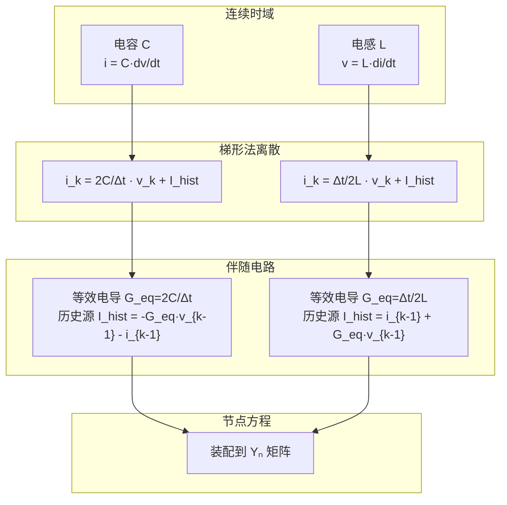

# 节点分析法 (Nodal Analysis)

## 1. 物理背景与工程需求

### 为什么要有节点分析？

求解一个电路网络，本质上是在解一个方程组。这个方程组来源于两条最基本的物理定律：

- **KCL**（基尔霍夫电流定律）：流入任意节点的电流之和为零
- **KVL**（基尔霍夫电压定律）：沿任意闭合回路的电压降之和为零

如果直接用这两条定律列方程，得到的是混合的微分-代数方程组——既有节点电压，又有支路电流，还有电感、电容的状态变量。对于一个几百个节点的电网，这种混合方程的求解规模非常大。

节点分析的**核心思想**是：把每个元件都表示为等效电流源（诺顿等效），使得列出来的方程只含节点电压一个未知量。这样就把一个庞大的混合问题简化成了纯粹的线性代数问题。

```text
元件特性 + 拓扑连接 → KCL方程组 → 只有节点电压是未知数
```

### 在 EMT 仿真中的角色

电磁暂态仿真是**时域步进**的——从 $t=0$ 开始，每步算一个时刻，每步都要解一次电路方程。如果每次解一个巨大的混合方程组，仿真会非常慢。

节点分析在 EMT 中相当于**装配线**：它让各个元件（电阻、电感、电容、线路、开关）在每一时步都转化成标准接口（诺顿等效导纳 + 历史电流源），然后统一求解。

```mermaid
graph LR
    subgraph 元件层
        L[电感 L]
        C[电容 C]
        R[电阻 R]
        Line[输电线路]
    end
    subgraph 接口层（伴随电路转化）
        L --> Geq_L[等效导纳 + 历史源]
        C --> Geq_C[等效导纳 + 历史源]
        R --> Geq_R[电导 g]
        Line --> Geq_Line[多端口等效]
    end
    subgraph 网络求解层
        Geq_L --> Yn[组装节点导纳矩阵 Yₙ]
        Geq_C --> Yn
        Geq_R --> Yn
        Geq_Line --> Yn
        Yn --> Solve[求解 Yₙ·v = i]
    end

    style Solve fill:#c8e6c9
```

这种"元件-接口-求解"三层分离架构，使得 EMT 仿真程序具有良好的可扩展性——新元件只需要实现自己的伴随电路接口，不需要修改网络求解器。

---

## 2. 数学描述

### 从 KCL 到矩阵方程

考虑一个 $N$ 个节点的电路。对节点 $k$，KCL 给出：

$$
\sum_{j} i_{kj} = 0
$$

其中 $i_{kj}$ 是从节点 $k$ 流向节点 $j$ 的电流。如果支路 $(k,j)$ 是一个电导 $g_{kj}$，则：

$$
i_{kj} = g_{kj}(v_k - v_j)
$$

代入 KCL 并整理：

$$
(\sum_j g_{kj}) v_k - \sum_{j \neq k} g_{kj} v_j = 0
$$

对所有节点写出上述方程，就得到了节点方程的矩阵形式：

$$
\mathbf{Y}_n \mathbf{v} = \mathbf{i}
$$

其中：

- $\mathbf{Y}_n \in \mathbb{R}^{N \times N}$：节点导纳矩阵
  - 对角线元素 $Y_{kk} = \sum_j g_{kj}$（与节点 $k$ 相连的所有支路电导之和）
  - 非对角线元素 $Y_{kj} = -g_{kj}$（支路电导取负）
- $\mathbf{v} \in \mathbb{R}^{N}$：节点电压向量（待求解）
- $\mathbf{i} \in \mathbb{R}^{N}$：注入电流向量（独立电流源 + 历史电流源）

### 方程的物理含义

这个方程的每一行都是在说一件事：**节点 $k$ 上的净注入电流等于从该节点流向所有相邻节点的电流之和**。换句话说，它就是 KCL 的代数形式。

把方程展开来看更清楚。对于节点 $k$：

$$
g_{k1}(v_k - v_1) + g_{k2}(v_k - v_2) + \cdots + g_{kN}(v_k - v_N) = i_k
$$

左边每一项 $g_{kj}(v_k - v_j)$ 都是从节点 $k$ 流向节点 $j$ 的电流。如果某一对节点之间没有直接连接，对应的 $g_{kj} = 0$。

### 节点导纳矩阵的装配规则

对一个连接在节点 $p$ 和 $q$ 之间的支路电导 $g$，它对矩阵的贡献非常直观：

$$
Y_{pp} \mathrel{+}= g, \quad Y_{qq} \mathrel{+}= g, \quad Y_{pq} \mathrel{-}= g, \quad Y_{qp} \mathrel{-}= g
$$

这种装配方式是**叠加的**——每个元件独立贡献，最终矩阵是所有元件贡献的叠加。这给编程实现带来了极大的便利：遍历所有元件，把每个元件的导纳贡献累加到对应位置即可。

### 参考节点的处理

节点方程中有一个自由度是冗余的——整个系统的电压基准需要指定。通常选取大地（或某一节点）作为参考节点（地节点），其电压固定为零，不参与方程求解。这样，矩阵 $

tbf{Y}_n$ 是 $(N-1) \times (N-1)$ 的（若总共有 $N$ 个节点，其中一个为地）。

---

## 3. 计算模型与离散化

### 动态元件的伴随电路转化

这是节点分析在 EMT 中发挥作用的关键一步。一个动态元件（电感、电容）在连续时域中是由微分方程描述的，但在数字计算机上，我们只能处理代数方程。**数值积分把微分方程离散化，而伴随电路把离散后的方程表现为等效电路。**

#### 电容

电容的特性方程：

$$
i_C(t) = C \frac{dv_C(t)}{dt}
$$

用梯形法在 $t_k$ 时刻离散：

$$
i_C(t_k) = \frac{2C}{\Delta t} v_C(t_k) - \left[ \frac{2C}{\Delta t} v_C(t_{k-1}) + i_C(t_{k-1}) \right]
$$

记 $G_{eq} = 2C/\Delta t$，$I_{hist} = -[G_{eq} v_C(t_{k-1}) + i_C(t_{k-1})]$，则：

$$
i_C(t_k) = G_{eq} v_C(t_k) + I_{hist}
$$

这就是一个电导 $G_{eq}$ 与电流源 $I_{hist}$ 并联的**诺顿等效电路**。

#### 电感

电感的特性方程：

$$
v_L(t) = L \frac{di_L(t)}{dt}
$$

同理离散：

$$
i_L(t_k) = \frac{\Delta t}{2L} v_L(t_k) + \left[ i_L(t_{k-1}) + \frac{\Delta t}{2L} v_L(t_{k-1}) \right]
$$

记 $G_{eq} = \Delta t/(2L)$，$I_{hist} = i_L(t_{k-1}) + G_{eq} v_L(t_{k-1})$，则：

$$
i_L(t_k) = G_{eq} v_L(t_k) + I_{hist}
$$

同样是一个诺顿等效电路。



### 关键洞察

上表中隐含了一个非常重要的结论：**等效电导 $G_{eq}$ 只取决于元件参数 $C$（或 $L$）和步长 $\Delta t$，与历史状态无关。** 这意味着：

1. 如果步长不变，等效电导在仿真过程中保持不变
2. 矩阵 $\mathbf{Y}_n$ 只需在步长变化或开关动作时才需要重新分解
3. 每个时步的计算量主要是：装配右端项 $\mathbf{i}$ + 一次前代回代

这是 EMTP 类程序能够高效运行的根本原因。

### 其他积分公式的影响

上面的推导用了梯形法。如果改用其他积分公式，等效电导的形式会不同：

| 积分方法 | 电容等效电导 $G_{eq}$ | 特性 |
|----------|----------------------|------|
| 后向欧拉 | $C/\Delta t$ | L-稳定，无数值振荡 |
| 梯形法 | $2C/\Delta t$ | A-稳定，可能有数值振荡 |
| Gear-2 | $3C/(2\Delta t)$ | L-稳定，精度较低 |
| 2S-DIRK | 取决于具体格式 | L-稳定，高阶精度 |

这就是"节点分析本身不保证数值特性，数值特性取决于积分公式"的含义。

---

## 4. 实现方法与算法细节

### 一个完整时步的计算流程

在 EMT 中，每一时步的节点分析流程如下：

```text
输入: 本时步的电压/电流历史值, 步长 Δt

1. 更新所有元件的诺顿等效
   - 对每类元件, 计算其历史电流源 I_hist
   - 注意: 若步长未变且无开关动作, G_eq 不需重算

2. 装配右端电流向量 i
   - 将所有元件的 I_hist 和独立电流源叠加到对应节点

3. 求解节点方程
   - 若 Y_n 不变: 前代回代 (O(n²) 稀疏求解)
   - 若 Y_n 变化: 重新 LU 分解 + 前代回代

4. 更新支路量
   - 从节点电压回代计算各支路电流
   - 更新元件的状态变量 (电容电压、电感电流等)

输出: 本时步的节点电压和所有支路量
```

### 矩阵复用与重新分解

$

tbf{Y}_n$ 的 LU 分解是整个仿真中计算量最大的步骤之一。实际程序中会用以下策略减少分解次数：

- **恒导纳模型**：开关动作时不改变矩阵，通过补偿法或插值来模拟开关效果
- **部分重分解**：只更新矩阵中受开关影响的几个元素，对 LU 因子做局部修正
- **符号分解 + 数值分解分离**：矩阵稀疏模式不变时，只用重做数值分解

### 与稀疏矩阵求解器的配合

实际电网的节点导纳矩阵是高度稀疏的（每个节点只与少数几个节点相连）。因此节点方程不会用稠密高斯消去法求解，而是使用专门的稀疏矩阵技术：

- **KLU 求解器**：EMTP 类程序中最常用的稀疏求解器
- **AMD 重排序**：减少 LU 分解中的填充元
- **BTF 预处理**：将矩阵分解为块三角形式，每个块独立求解

---

## 5. 适用边界与失效模式

### 什么条件下好用？

- 网络拓扑清晰，大部分元件可用导纳或诺顿等效表示
- 电网规模大但连接稀疏（稀疏性使得求解效率高）
- 步长相对于系统最快暂态足够小

### 什么条件下会出问题？

| 问题场景 | 表现 | 原因 | 缓解办法 |
|----------|------|------|----------|
| 数值振荡 | 开关动作后电压/电流出现非物理振荡 | 梯形法在突变时无法快速衰减高频分量 | 切换为后向欧拉、CDA 算法、或插值法 |
| 矩阵病态 | 求解结果精度丧失 | 断路支路使用过小导纳、闭合支路使用过大导纳 | 合理选择开关电导比值（通常 $10^{4}\sim10^{6}$） |
| 奇异回路 | 节点方程无解 | 理想开关形成仅含电压源的回路 | 增加寄生电阻或使用增广节点法 |
| 接口延迟 | 分网仿真精度下降 | 子网间信息交换滞后一时步 | 使用迭代接口或预测-校正方法 |
| 非线性迭代发散 | 牛顿法不收敛 | 雅可比矩阵更新不及时或初始猜测不好 | 减小步长、使用阻尼牛顿法 |

### 工程经验值

- 开关电导比（开态/关态）推荐 $10^{5}$ 左右，太大或太小都会恶化矩阵条件数
- 梯形法 + CDA 的组合是 EMTP 中最成熟的工程方案
- 恒导纳模型需要配合延迟和插值，不能仅靠矩阵不变就声称"精确"

---

## 6. 一个简单的数值算例

考虑一个 RC 串联电路：电阻 $R=100\Omega$，电容 $C=10\mu\text{F}$，电压源 $V_s = 100\text{V}$（阶跃输入）。求电容电压 $v_C(t)$ 的响应。

**步骤 1：节点方程**

电路中只有两个节点（地 + 节点1），节点方程为：

$$
\left(\frac{1}{R} + \frac{2C}{\Delta t}\right) v_1(t_k) = \frac{V_s}{R} + \left[\frac{2C}{\Delta t} v_1(t_{k-1}) + i_C(t_{k-1})\right]
$$

**步骤 2：节点方程的迭代求解**（取 $\Delta t = 50\mu\text{s}$）

该电路时间常数 $\tau = RC = 1$ms，解析解 $v_C(t) = V_s(1 - e^{-t/RC})$。

每步先根据上一时步的状态计算历史电流源，然后求解节点方程得到新的 $v_1$，再从 $v_1$ 回代电流 $i_C$ 供下一步使用。读者可代入参数自行验证：梯形法伴随电路的数值解会以二阶精度收敛到解析解。

如果把步长增大到 $500\mu\text{s}$ 并在 $t = \tau$ 处突然切除电容（开关动作），梯形法就会出现明显的数值振荡，需要切换到后向欧拉来阻尼。

---

## 7. 延伸阅读

### 核心参考文献

- [[a-combined-state-space-nodal-method-for-the-simulation-of-power-system-transient]] — 状态空间与节点方程结合的路线
- [[a-comparative-study-of-electromagnetic-transient-simulations-using-companion-cir]] — 伴随电路离散策略的系统比较
- [[2728nested-fast-and-simultaneous-solution-for-time-domain-simulation-of-integrat]] — 嵌套求解与矩阵复用技术
- [[a-bridge-arm-module-based-fixed-admittance-adc-model-for-converters-in-emt-simul]] — 固定导纳模型在 MMC 等值中的应用
- [[neural-electromagnetic-transients-program]] — 基于学习的节点求解替代方案

### 相关页面

- [[nodal-admittance-matrix]] — 节点导纳矩阵的构造和性质
- [[sparse-matrix-solver]] — 稀疏线性方程组的求解
- [[companion-circuit]] — 伴随电路模型的详细推导
- [[fixed-admittance]] — 固定导纳建模策略
- [[numerical-oscillation-suppression]] — 数值振荡的抑制方法
</｜DSML｜parameter>