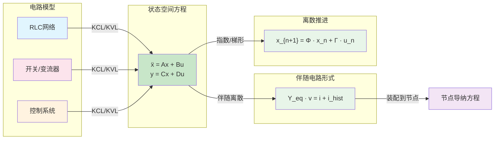

# 状态空间法

## 定义与边界

状态空间法（State-Space Method）以状态向量 $\mathbf{x}$ 的一阶微分或差分方程描述电气、控制和接口动态，典型形式为 $\dot{\mathbf{x}}=\mathbf{A}\mathbf{x}+\mathbf{B}\mathbf{u}$，$\mathbf{y}=\mathbf{C}\mathbf{x}+\mathbf{D}\mathbf{u}$。在 EMT 语境中，状态通常来自电感电流、电容电压、控制器积分量、线路递推量或拟合模型内部状态。

它不是 [[nodal-analysis]] 的替代总框架。节点分析以网络节点电压为未知量，适合大规模稀疏网络；状态空间法更适合内部动态强、端口数有限、需要控制/模态/降阶解释的子系统。工程实现中常把设备内部写成状态空间，外部仍接入节点导纳方程。

## EMT 中的作用

状态空间法在 EMT 中有三类作用：一是把变流器、控制器和机器模型组织成可离散推进的状态方程；二是把 [[vector-fitting]]、[[prony-analysis]] 或 [[fdne-model]] 生成的极点-留数模型转成时域递推；三是支撑 [[model-order-reduction]]、[[small-signal-analysis]] 和实时仿真中的模型压缩。

它特别适合描述“输入、输出、内部状态和端口变量之间的关系”。若研究重点是含大量开关事件的全网络拓扑重构，则直接状态矩阵重建可能比伴随电路和节点法更重。

## 核心机制

连续线性系统可写为 $\dot{\mathbf{x}}(t)=\mathbf{A}\mathbf{x}(t)+\mathbf{B}\mathbf{u}(t)$，$\mathbf{y}(t)=\mathbf{C}\mathbf{x}(t)+\mathbf{D}\mathbf{u}(t)$。其中 $\mathbf{x}$ 是状态，$\mathbf{u}$ 是端口电压、控制指令或注入量，$\mathbf{y}$ 是端口电流或观测量。

离散 EMT 步进需要把连续模型变成 $\mathbf{x}_{n+1}=\mathbf{\Phi}\mathbf{x}_n+\mathbf{\Gamma}\mathbf{u}_n$ 或含 $\mathbf{u}_{n+1}$ 的隐式形式。$\mathbf{\Phi}$ 可来自矩阵指数、[[trapezoidal-rule]]、[[backward-euler]] 或其他 [[numerical-integration]]。刚性系统、病态矩阵和事件时刻插值都会影响稳定性。

对含代数约束的系统，可写成描述符形式 $\mathbf{E}\dot{\mathbf{x}}=\mathbf{A}\mathbf{x}+\mathbf{B}\mathbf{u}$。这对电感割集、电容回路和端口约束有用，但接入 EMT 求解器前要检查指数、可解性和离散化后的代数一致性。

## 分类与变体

| 形式 | 主要用途 | 适用边界 |
|------|----------|----------|
| 直接状态空间 | 小规模电路、控制器、设备内部模型 | 开关拓扑频繁变化时矩阵更新成本高 |
| 描述符状态空间 | 含代数约束的电路或多端口模型 | 需处理奇异 $\mathbf{E}$ 和一致初值 |
| 状态空间-节点混合 | 设备内部状态接入外部节点网络 | 端口变量方向、历史项和迭代顺序必须一致 |
| 分段/广义状态空间平均 | 变流器开关周期平均、低频动态 | 不保留完整开关纹波 |
| 极点-留数状态实现 | FDNE、线路/电缆宽频模型 | 需无源性和稳定性检查 |

## 适用边界与失败模式

- 大规模稀疏网络：若系统主要是线性 RLC 网络，[[nodal-analysis]] 和稀疏矩阵求解通常更直接。
- 频繁开关：每个开关状态对应不同 $\mathbf{A}$ 或端口矩阵时，预计算、分组或混合法不可少。
- 非线性：状态空间表达非线性并不困难，但线性矩阵形式和模态解释只对工作点或分段范围成立。
- 数值稳定：矩阵指数、Padé/Krylov 近似和隐式积分的误差不能只用“精确”概括，应按步长、矩阵谱和实现说明。
- 降阶风险：降阶后状态不一定保留原始物理含义；电容电压、能量和保护相关峰值需要单独验证。

## 代表性来源

| 来源 | 支撑内容 | 证据边界 |
|------|----------|----------|
| [[a-comparative-study-of-electromagnetic-transient-simulations-using-companion-cir]] | 比较伴随电路与描述符状态空间的 EMT 表达 | 适合作为建模形式对比，不是所有网络的性能结论 |
| [[a-piecewise-generalized-state-space-model-of-power-converters-for-electromagneti]] | 分段广义状态空间用于变流器 EMT 模型 | 适用对象限于原文变流器算例 |
| [[alternative-method-to-include-the-frequency-effect-on-transmission-line-paramete]] | 频变线路参数可通过状态空间时域实现 | 频率范围和线路参数需按原文设置 |
| [[a-state-space-approach-for-accelerated-simulation-of-modular-multilevel-converte]] | MMC 加速仿真中的状态空间建模 | 加速量不得外推到任意 MMC 拓扑 |
| [[splitting-state-space-method-for-converter-integrated-power-systems-emt-simulati]] | 变流器集成系统的分裂状态空间求解 | 需要核查分裂误差和接口稳定性 |

## 与相关页面的关系

- [[nodal-analysis]]：节点分析负责全局网络代数方程；状态空间法负责内部动态或端口等效。
- [[companion-circuit]]：伴随电路把动态元件离散成等效导纳和历史源；状态空间法保留显式状态递推。
- [[vector-fitting]]：矢量拟合输出的极点-留数模型通常转成状态空间接入 EMT。
- [[model-order-reduction]]：许多降阶算法以状态空间模型为输入，但降阶误差需通过频域和时域双重检查。
- [[small-signal-analysis]]：小信号分析依赖线性化状态矩阵，但不能直接代表大扰动 EMT 行为。

## 来源论文

| 论文 | 年份 |
|------|------|
| [[modeling-nonuniform-transmission-lines-for-time-domain-simulation-of-electromagn|Modeling nonuniform transmission lines for time domain simul]] | 2001 |
| [[zfunction-convolution-in-ehv|Z.function convolution in EHV]] | 2002 |
| [[power-converter-simulation-module-connected-to-the-emtp-power-systems-ieee-trans|Power converter simulation module connected to the EMTP - Po]] | 2004 |
| [[state-equation-approximation-of-transfer-matrices-and-its-application-to-the-pha|State equation approximation of transfer matrices and its ap]] | 2004 |
| [[state-equation-approximation-of-transfer-matrices-and-its-application-to-the-pha|State equation approximation of transfer matrices and its ap]] | 2004 |
| [[using-tacs-functions-within-empt-to-teach-protective-relaying-fundamentals-power|Using TACS Functions Within EMPT To Teach Protective Relayin]] | 2004 |
| [[含统一潮流控制器装置的电力系统动态混合仿真接口算法研究|含统一潮流控制器装置的电力系统动态混合仿真接口算法研究]] | 2005 |
| [[2728nested-fast-and-simultaneous-solution-for-time-domain-simulation-of-integrat|Nested fast and simultaneous solution for time-domain simula]] | 2006 |
| [[电力系统机电暂态和电磁暂态混合仿真程序设计和实现|电力系统机电暂态和电磁暂态混合仿真程序设计和实现]] | 2006 |
| [[re-examination-of-synchronous-machine|Re-examination of Synchronous Machine]] | 2007 |
| [[fast-realization-of-the-modal-vector-fitting|Fast Realization of the Modal Vector Fitting]] | 2009 |
| [[the-computer-simulation-and-real-time-stabilization-control-for-the-inverted-pen|The Computer Simulation and Real-Time Stabilization Control ]] | 2009 |
| [[the-computer-simulation-and-real-time-stabilization-control-for-the-inverted-pen|The Computer Simulation and Real-Time Stabilization Control ]] | 2009 |
| [[improvement-of-numerical-stability-for-the-computation-of-transients-in-lines-an-fix|Improvement of Numerical Stability for the Computation of Tr]] | 2010 |
| [[methods-of-interfacing-rotating-machine-models-in-emtp|Methods of Interfacing Rotating Machine Models in EMTP]] | 2010 |
| [[a-combined-state-space-nodal-method-for-the-simulation-of-power-system-transient|A combined state-space nodal method for the simulation of po]] | 2011 |
| [[analyses-of-the-modifications-in-the-pi-circuits-for-inclusion-of-frequency-infl|Analyses of the modifications in the pi circuits for inclusi]] | 2011 |
| [[analyses-of-the-modifications-in-the-pi-circuits-for-inclusion-of-frequency-infl|Analyses of the modifications in the pi circuits for inclusi]] | 2011 |
| [[application-of-pi-circuits-for-simulation-of-corona-effect-in-transmission-lines|Application of pi circuits for simulation of corona effect i]] | 2011 |
| [[proposal-of-an-alternative-transmission-line-model-for-symmetrical-and-asymmetri|Proposal of an alternative transmission line model for symme]] | 2011 |
| [[nodal-reduced-induction-machine-modeling-for|Nodal Reduced Induction Machine Modeling for]] | 2012 |
| [[saturation-in-transient-and-stability-phenomena-for-cylindrical-13&14|Saturation in Transient and Stability Phenomena for Cylindri]] | 2012 |
| [[ahmed-等-a-computationally-efficient-continuous-model-for-the-modular-multilevel-|Ahmed 等 | A Computationally Efficient Continuous Model for t]] | 2014 |
| [[dynamic-average-value-modeling-of-13&14|Dynamic Average-Value Modeling of]] | 2014 |
| [[the-use-of-averaged-value-model-of-modular-37|The Use of Averaged-Value Model of Modular]] | 2014 |
| [[a-parallel-multi-rate-electromagnetic-transient-simulation-algorithm-based-on-ne|基于传输线分网的并行多速率电磁暂态仿真算法]] | 2014 |
| [[a-parallel-multi-rate-electromagnetic-transient-simulation-algorithm-based-on-ne|基于传输线分网的并行多速率电磁暂态仿真算法]] | 2014 |
| [[analysing-a-power-transformers-internal-response-to-system-transients-using-a-hy|Analysing a power transformer⠒s internal response to system ]] | 2015 |
| [[线性开关电路电磁暂态分析的状态方程法|线性开关电路电磁暂态分析的状态方程法]] | 2016 |
| [[线性开关电路电磁暂态分析的状态方程法|线性开关电路电磁暂态分析的状态方程法]] | 2016 |
| [[accelerated-frequency-dependent-method-of-characteristics-for-the-simulation-of-|Accelerated frequency-dependent method of characteristics fo]] | 2018 |
| [[reduced-order-dynamic-model-of-modular|Reduced-Order Dynamic Model of Modular]] | 2019 |
| [[stability-of-algorithms-for-electro-magnetic-transient-simulation-of-networks-wi|Stability of Algorithms for Electro-Magnetic-Transient Simul]] | 2019 |
| [[基于状态空间法的高压直流输电系统电磁暂态简化模型的解析算法|基于状态空间法的高压直流输电系统电磁暂态简化模型的解析算法]] | 2019 |
| [[适用于电磁暂态高效仿真的变流器分段广义状态空间平均模型|适用于电磁暂态高效仿真的变流器分段广义状态空间平均模型]] | 2019 |
| [[analysis-of-low-frequency-interactions-of-dfig-wind-turbine-systems-in-series-co|Analysis of low frequency interactions of DFIG wind turbine ]] | 2020 |
| [[compacting-and-partitioningbased-simulation-solution-for-frequencydependent-netw|Compacting and partitioning‐based simulation solution for fr]] | 2020 |
| [[compacting-and-partitioningbased-simulation-solution-for-frequencydependent-netw|Compacting and partitioning‐based simulation solution for fr]] | 2020 |
| [[gpu-based-power-converter-transient-simulation-with-matrix-exponential-integrati|GPU-based power converter transient simulation with matrix e]] | 2020 |
| [[high-performance-computing-engines-for-the-fpga-based-simulation-of-the-ulm|High performance computing engines for the FPGA-based simula]] | 2020 |
| [[interpolation-for-power-electronic-circuit-simulation-revisited-with-matrix-expo|Interpolation for power electronic circuit simulation revisi]] | 2020 |
| [[partitioned-fitting-and-dc-correction-in-transmission-linecable-models-for-wideb|Partitioned fitting and DC correction in transmission line/c]] | 2020 |
| [[passivity-enforcement-of-wideband-line-model-through-coupled-perturbation-of-res|Passivity enforcement of wideband line model through coupled]] | 2020 |
| [[simulation-of-electromagnetic-transients-with-modelica-accuracy-and-performance-|Simulation of electromagnetic transients with Modelica, accu]] | 2020 |
| [[spurious-power-and-its-elimination-in-modular-multilevel-converter-models|Spurious power and its elimination in modular multilevel con]] | 2020 |
| [[stability-evaluation-of-interpolation-extrapolation-and-numerical-oscillation-da|Stability Evaluation of Interpolation, Extrapolation, and Nu]] | 2020 |
| [[time-domain-implementation-of-damping-factor-white-box-transformer-model-for-inc|Time-Domain Implementation of Damping Factor White-Box Trans]] | 2020 |
| [[适用于电磁暂态仿真的变阶变步长3s-dirk算法|适用于电磁暂态仿真的变阶变步长3S-DIRK算法]] | 2020 |
| [[adaptive-heterogeneous-transient-analysis-of-wind-farm-integrated-comprehensive-|Adaptive Heterogeneous Transient Analysis of Wind Farm Integ]] | 2021 |
| [[analysis-of-frequency-dependent-network-equivalents-in-dynamic-harmonic-domain|Analysis of Frequency-Dependent Network Equivalents in Dynam]] | 2021 |
| [[analytical-model-building-for-type-3-wind-farm-subsynchronous-oscillation-analys|Analytical model building for Type-3 wind farm subsynchronou]] | 2021 |
| [[expanding-the-measuring-range-via-s-parameters-in-a-ehv-voltage-transformer-mode|Expanding the measuring range via S-parameters in a EHV volt]] | 2021 |
| [[mmc-hvdc系统高频稳定性分析与抑制策略(一)稳定性分析|High Frequency Stability Analysis and Suppression Strategy o]] | 2021 |
| [[review-and-comparison-of-frequency-domain-curve-fitting-techniques-vector-fittin|Review and comparison of frequency-domain curve-fitting tech]] | 2021 |
| [[review-and-comparison-of-frequency-domain-curve-fitting-techniques-vector-fittin|Review and comparison of frequency-domain curve-fitting tech]] | 2021 |
| [[考虑中间变压器饱和特性的电容式电压互感器宽频非线性模型|考虑中间变压器饱和特性的电容式电压互感器宽频非线性模型]] | 2021 |
| [[accuracy-evaluation-of-electromagnetic-transients-simulation-algorithms|Accuracy Evaluation of Electromagnetic Transients Simulation]] | 2022 |
| [[active-damping-control-and-parameter-calculation-for-resonance-suppression-in-dc-distribution|Active Damping Control and Parameter Calculation for Resonan]] | 2022 |
| [[characteristic-analysis-of-high-frequency-resonance-of-flexible-high-voltage-dir|Characteristic Analysis of High-frequency Resonance of Flexi]] | 2022 |
| [[high-frequency-oscillation-analysis-and-suppression-strategy-of-mmc-hvdc-system-|High-frequency oscillation analysis and suppression strategy]] | 2022 |
| [[structure-preserving-aggregation-method-for-doubly-fed-induction-generators-in-w|Structure Preserving Aggregation Method for Doubly-Fed Induc]] | 2022 |
| [[the-averaged-value-model-of-a-flexible-power-electronics-based-substation-in-hyb|The Averaged-value Model of a Flexible Power Electronics Bas]] | 2022 |
| [[一种用于电磁暂态仿真的两电平电压源型换流器解耦模型|一种用于电磁暂态仿真的两电平电压源型换流器解耦模型]] | 2022 |
| [[中-国-电-机-工-程-学-报|中  国  电  机  工  程  学  报]] | 2022 |
| [[基于umec的双芯sen变压器电磁暂态模型|基于UMEC的双芯Sen变压器电磁暂态模型]] | 2022 |
| [[模块化多电平换流器电磁暂态模型研究综述|模块化多电平换流器电磁暂态模型研究综述]] | 2022 |
| [[直驱式风电机组机电暂态建模及仿真|直驱式风电机组机电暂态建模及仿真]] | 2022 |
| [[直驱风力发电单元的电磁暂态半隐式延迟解耦与仿真方法|直驱风力发电单元的电磁暂态半隐式延迟解耦与仿真方法]] | 2022 |
| [[计及电容过渡过程的双钳位型mmc电磁暂态高效仿真方法|计及电容过渡过程的双钳位型MMC电磁暂态高效仿真方法]] | 2022 |
| [[alternative-method-to-include-the-frequency-effect-on-transmission-line-paramete|Alternative method to include the frequency-effect on transm]] | 2023 |
| [[an-automatable-approach-for-small-signal-stability-analysis-of-power-electronic-|An Automatable Approach for Small-Signal Stability Analysis ]] | 2023 |
| [[electromagnetic-transient-emt-simulation-algorithms-for-evaluation-of-large-scal|Electromagnetic Transient (EMT) Simulation Algorithms for Ev]] | 2023 |
| [[inaccuracies-due-to-the-frequency-warping-in-simulation-of-electrical-systems-us|Inaccuracies due to the frequency warping in simulation of e]] | 2023 |
| [[massively-parallel-modeling-of-battery-energy-storage-systems-for-acdc-grid-high|Massively Parallel Modeling of Battery Energy Storage System]] | 2023 |
| [[the-impact-of-frame-transformations-on-power-system-emt-simulation|The Impact of Frame Transformations on Power System EMT Simu]] | 2023 |
| [[一种级联h桥型电力电子变压器电磁暂态解耦与仿真模型|一种级联H桥型电力电子变压器电磁暂态解耦与仿真模型]] | 2023 |
| [[基于一致性算法的多虚拟同步机功率振荡协调抑制|基于一致性算法的多虚拟同步机功率振荡协调抑制]] | 2023 |
| [[a-semi-analytical-approach-for-state-space-electromagnetic-transient-simulation|A Semi-Analytical Approach for State-Space Electromagnetic T]] | 2024 |
| [[a-semi-analytical-approach-for-state-space-electromagnetic-transient-simulation|A Semi-Analytical Approach for State-Space Electromagnetic T]] | 2024 |
| [[analytical-calculation-method-of-outer-loop-controller-parameters-of-hvdc-conver|Analytical Calculation Method of Outer Loop Controller Param]] | 2024 |
| [[enhancing-computation-performance-of-rational-approximation-for-frequency-depend-17|Enhancing computation performance of rational approximation ]] | 2024 |
| [[shooting-method-based-modular-multilevel-converter-initialization-for-electromag|Shooting method based modular multilevel converter initializ]] | 2024 |
| [[基于全阶模型的直驱风电机组多时间尺度等效惯量机理建模|基于全阶模型的直驱风电机组多时间尺度等效惯量机理建模]] | 2024 |
| [[a-component-level-modeling-and-fine-grained-simulation-method-for-renewable-ener|适用于级联型电力电子拓扑电磁暂态仿真的N端口网络通用等效建模方法]] | 2024 |
| [[a-component-level-modeling-and-fine-grained-simulation-method-for-renewable-ener|适用于级联型电力电子拓扑电磁暂态仿真的N端口网络通用等效建模方法]] | 2024 |
| [[a-state-variables-elimination-based-emtp-type-constant-admittance-equivalent-mod|A State Variables Elimination-Based EMTP-Type Constant Admit]] | 2025 |
| [[a-state-space-approach-for-accelerated-simulation-of-modular-multilevel-converte|A state-space approach for accelerated simulation of modular]] | 2025 |
| [[a-state-space-approach-for-accelerated-simulation-of-modular-multilevel-converte|A state-space approach for accelerated simulation of modular]] | 2025 |
| [[discretized-impedance-based-modeling-of-converter-interfaced-energy-resources-fo|Discretized Impedance-Based Modeling of Converter-Interfaced]] | 2025 |
| [[improving-emt-simulations-using-frequency-shifted-rational-approximations|Improving EMT simulations using frequency-shifted rational a]] | 2025 |
| [[modeling-and-application-of-dq-sequence-dynamic-phasors-under-unbalanced-ac-cond|Modeling and application of DQ-sequence dynamic phasors unde]] | 2025 |
| [[modeling-and-application-of-dq-sequence-dynamic-phasors-under-unbalanced-ac-cond|Modeling and application of DQ-sequence dynamic phasors unde]] | 2025 |
| [[reduced-order-and-simultaneous-solution-of-power-and-control-system-equations-in|Reduced-order and simultaneous solution of power and control]] | 2025 |
| [[revisiting-dynamic-phasors-and-their-efficacy-in-simulating-electric-circuits|Revisiting dynamic phasors and their efficacy in simulating ]] | 2025 |
| [[simplified-emt-model-of-multiple-active-bridge-based-power-electronic-transforme|Simplified EMT Model of Multiple-Active-Bridge Based Power E]] | 2025 |
| [[splitting-state-space-method-for-converter-integrated-power-systems-emt-simulati|Splitting State-Space Method for Converter-Integrated Power ]] | 2025 |
| [[stability-assessment-of-multi-rate-electromagnetic-transient-simulations|Stability Assessment of Multi-Rate Electromagnetic Transient]] | 2025 |
| [[type-3-wind-turbine-generator-model-with-generic-high-level-control-for-electrom|Type-3 wind turbine generator model with generic high-level ]] | 2025 |
| [[z-tool-frequency-domain-characterization-of-emt-models-for-small-signal-stabilit|Z-Tool: Frequency-domain characterization of EMT models for ]] | 2025 |
| [[改善暂态稳定性的多构网型变换器频率同步协同控制|改善暂态稳定性的多构网型变换器频率同步协同控制]] | 2025 |
| [[dead-time-effect-modeling-for-hybrid-modular-multilevel-converter-using-twin-map|Dead-time effect modeling for hybrid modular multilevel conv]] | 2026 |
| [[harmonic-preserved-average-value-model-for-converters-in-electromagnetic-transie|Harmonic-Preserved Average-Value Model for Converters in Ele]] | 2026 |
| [[rmsx002b-augmenting-the-traditional-circuit-model-to-capture-pll-instability|RMS&#x002B;: Augmenting the Traditional Circuit Model to Cap]] | 2026 |
| [[基于矩阵对角化的电磁暂态时间并行计算方法|基于矩阵对角化的电磁暂态时间并行计算方法]] | 2026 |