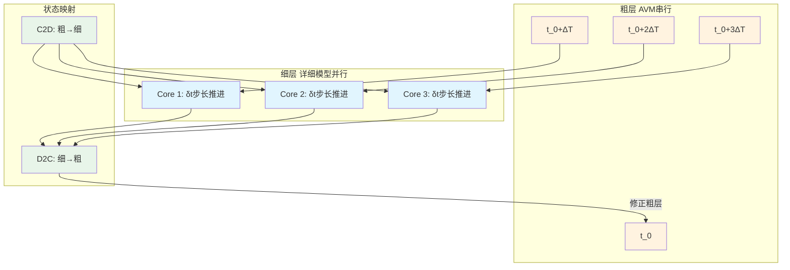

# 时间并行方法 (Parallel-in-Time)

## 定义与边界

时间并行方法是一类将仿真时间轴划分后并行推进的加速技术，与传统的空间并行（网络分区解耦）正交。核心思想不是把电路拓扑拆成子网络，而是把整个时间窗口划分为粗时间区间，每个区间内的细步长计算分配到不同计算核心并行执行。在 EMT 仿真中，时间并行方法为 MMC-HVDC 等空间并行度受限的大规模电力电子系统提供了额外的加速维度。

本页关注时间并行方法与 EMT 仿真的结合，特别是粗/细模型的双层网格结构和状态映射机制。空间并行见 [[network-partitioning]] 和 [[multirate-method]]；GPU 加速见 [[gpu-accelerated-simulation]]。

## EMT 中的作用

EMT 仿真的并行化长期受限于空间并行度瓶颈：

- **MMC 桥臂限制**：MMC 换流器的空间并行通常按 6 个桥臂拆分，最多 6 路并行，每个桥臂内大量子模块状态仍需串行更新。
- **细步长约束**：电力电子开关频率要求微秒级步长，长时间仿真总步数巨大。
- **时间并行的补充作用**：在空间并行已达上限时，沿时间轴提供额外并行度，实现 "空间 + 时间" 双维度加速。

## 核心机制

### 双层时间网格结构

方法采用粗-细两层时间网格和双模型结构：

- **粗层**（Coarse Grid）：使用平均值模型（AVM），在较大粗时间步（如几十至几百微秒）上串行推进，提供全仿真窗口内的初始时间轨线。
- **细层**（Fine Grid）：使用详细开关模型，在每个粗时间区间内以微秒级步长解析开关细节，多个区间可分配到不同计算核心并行执行。

### 状态映射（Translation Method）

关键机制是粗-细模型之间的状态转换：

- **粗到细**：将平均值模型的状态（如桥臂能量、平均电容电压）转换为详细开关模型可接受的初始条件（各子模块电容电压分布、IGBT 门极状态）。
- **细到粗**：用详细模型计算得到的区间末端状态修正粗层轨线，使下一轮并行细仿真的初值更接近详细参考解。

迭代过程逐步减少粗细模型不一致造成的误差：

$$
x_{\text{fine}}^{(k+1)} = F_{\text{fine}}(x_{\text{coarse}}^{(k)}) + \text{correction}(x_{\text{fine}}^{(k)} - F_{\text{fine}}(x_{\text{coarse}}^{(k)}))
$$

### 与 MGRIT/Parareal 的关系

时间并行方法与经典的时间并行算法框架一致：

- **MGRIT（Multi-Grid in Time）**：多层时间网格，粗层用低精度模型快速传播，细层高精度校正。
- **Parareal**：粗层预测 + 细层并行精化 + 粗层校正的迭代过程。

EMT 场景的特殊性在于粗层必须使用物理一致的平均值模型，而非简单的降阶积分器，因为开关动态的丢失需要由 AVM 从物理上补偿。

## 分类与变体

| 方法 | 粗层策略 | 细层策略 | 适用场景 |
|------|----------|----------|----------|
| AVM 时间并行 | 平均值模型串行 | 详细模型并行 | MMC-HVDC 系统 |
| 矩阵对角化时间并行 | 对角化矩阵大步长 | 原始矩阵细步长 | 线性网络为主 |
| 指数积分时间并行 | 大步长指数积分 | 小步长指数积分 | 电力电子系统 |
| Parareal-EMT | 低阶积分器串行 | 高阶积分器并行 | 通用 EMT |

## 相关方法

- [[multirate-method]] — 多速率仿真，时间并行的基础概念
- [[network-partitioning]] — 空间并行，与时间并行互补
- [[gpu-accelerated-simulation]] — GPU 加速实现时间并行
- [[average-value-model]] — 粗层的核心建模工具

## 相关模型

- [[mmc-model]] — MMC 详细模型，时间并行的主要应用对象
- [[vsc-model]] — VSC 模型
- [[equivalent-modeling]] — 等效建模方法

## 相关主题

- [[parallel-computing]]
- [[real-time-simulation]]
- [[multirate-and-network-partitioning]]

## 代表性来源

- Debnath — Parallel-in-Time Simulation Algorithm for Power Electronics: MMC-HVdc System (2019)
- 汪芳宗等 — 基于矩阵对角化的电磁暂态时间并行计算方法 (2017)
- 赵金利等 — 面向指数积分方法的电磁暂态仿真 GPU 并行算法 (2018)