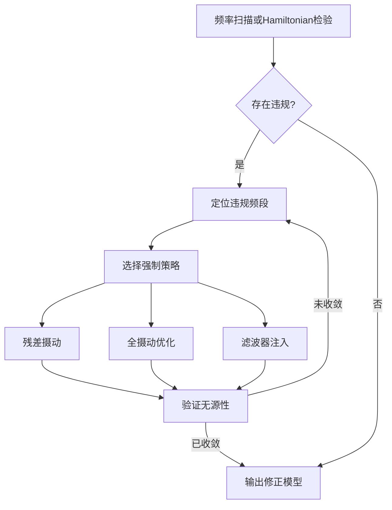

# 无源性强制 (Passivity Enforcement)

## 概述

无源性强制是确保频率相关模型（特别是矢量拟合得到的有理函数模型）满足无源性条件的关键技术。非无源模型在EMT仿真中可能导致数值不稳定，产生非物理的能量增长。

## 无源性条件

- 系统不产生净能量
- 频域条件：Re[H(jω)] ≥ 0
- 极点位于左半平面
- Hamiltonian矩阵无虚轴特征值

## 强制方法

### 残差摄动法
- 微调拟合参数
- 最小化修正量
- 保留原始拟合精度

### 全摄动形式
- 同时调整极点和留数
- 更灵活的修正
- 计算复杂度更高

### 在线无源性补偿
- 混合仿真中的局部补偿
- 双层网络等值
- 实时更新策略

## 应用场景

- 频变网络等值（FDNE）
- 输电线路宽频建模
- 变压器频响模型
- 电缆频变参数

## 适用边界

无源性强制适用于由 [[vector-fitting|矢量拟合]]、[[state-space-method|状态空间方法]] 或频域测量得到的线性多端口模型，目标是保证端口连接后不会向外部网络产生非物理净能量。它不替代原始模型辨识，也不能修复错误的频率采样、端口定义或强非线性工作点迁移。

在 [[fdne-model|FDNE]]、[[transmission-line-model|输电线路模型]]、[[cable-model|电缆模型]] 和 [[transformer-model|变压器模型]] 中，审计应同时检查拟合误差、无源性判据和接入 EMT 后的时域稳定性。若只报告频域曲线吻合，仍不足以证明模型在 [[emtp|EMTP]]、[[pscad-emtdc|PSCAD/EMTDC]] 或 [[rtds|RTDS]] 中可稳定使用。

## 相关模型

- [[transmission-line-model|输电线路模型]] - 宽频线路无源性强制
- [[cable-model|电缆模型]] - 电缆频变模型无源性处理
- [[transformer-model|变压器模型]] - 变压器频响模型无源性
- [[fdne-model|FDNE模型]] - 频率相关网络等值无源性
- [[grounding-system-model|接地系统模型]] - 接地阻抗宽频建模

## 相关方法
- [[vector-fitting]]
- [[state-space-method]]

## 相关主题
- [[frequency-dependent-modeling]]

## 来源论文

| 论文 | 年份 |
|------|------|
| [[passivity-enforcement-for-transmission-line-models|Passivity Enforcement for Transmission Line Models]] | 2008 |
| [[robust-passivity-enforcement-scheme-for|Robust Passivity Enforcement Scheme for]] | 2010 |
| [[development-and-applicability-of-online-passivity-enforced-wide-band-multi-port-|Development and Applicability of Online Passivity Enforced W]] | 2018 |
| [[a-two-layer-network-equivalent-with-local-passivity-compensation-with-applicatio|A Two-layer Network Equivalent with Local Passivity Compensa]] | 2019 |
| [[passivity-enforcement-of-wideband-line-model-through-coupled-perturbation-of-res|Passivity enforcement of wideband line model through coupled]] | 2020 |
| [[an-improved-passivity-enforcement-algorithm-for-transmission-line-models-using-p|An improved passivity enforcement algorithm for transmission]] | 2021 |
| [[passivity-enforcement-of-wideband-model-through-a-new-and-full-perturbation-form|Passivity enforcement of wideband model through a new and fu]] | 2023 |

## 深度增强内容

 基于提供的论文数据，以下为无源性强制(Passivity Enforcement)方法的深度增强内容：

---

## 无源性强制 (Passivity Enforcement) - 深度技术解析

## 1. 核心原理详解

### 1.1 无源性数学基础

在频域建模中，无源性(passivity)要求系统的导纳矩阵 $Y(s)$ 满足正实性条件：
$$\Re\{Y(j\omega)\} \geq 0, \quad \forall \omega \in [0, \infty)$$

对于基于矢量拟合(Vector Fitting)得到的频变线路模型，特性导纳 $Y_c(s)$ 和传播函数 $H(s)$ 的有理函数近似可能违反该条件。无源性违规表现为：存在某些频率 $\omega_v$ 使得矩阵 $\Re\{Y(j\omega_v)\}$ 出现负特征值。

**Hamiltonian矩阵检验法：**
构造Hamiltonian矩阵检验虚轴特征值：
$$M = \begin{bmatrix} 
A - BD^{-1}C & -BD^{-1}B^T \\ 
C^T D^{-1} C & -A^T + C^T D^{-1} B^T 
\end{bmatrix}$$

若 $M$ 无虚轴特征值，则系统无源；反之，虚轴特征值对应的频率即为违规点。

### 1.2 人工电导与高频渐近约束 (2008)

针对通用线路模型(ULM)在低频和带外的无源性违规，通过对角线添加人工电导 $G_{add}$ 修正特性导纳：
$$Y_c^{mod}(s) = Y_c(s) + \frac{G_{add}}{s\tau + 1}$$

其中时间常数 $\tau = 1$ s（对应零点频率 $0.159$ Hz），确保直流极限：
$$\lim_{s\to 0} Y_c^{mod}(s) = \sqrt{\frac{G_{add}}{R}} \neq 0$$

高频渐近约束通过低通滤波器实现，截止频率设置为 $\omega_c = 10^7$ rad/s (10 MHz)，确保当 $s \to \infty$ 时 $Y_c(s) \to D > 0$。

### 1.3 耦合摄动优化框架 (2020, 2023)

**全摄动形式**同时调整极点 $p_k$、留数 $R_k$ 和常数项 $D$：
$$Y_c^{new}(s) = \sum_{k=1}^{n} \frac{R_k + \Delta R_k}{s - (p_k + \Delta p_k)} + (D + \Delta D)$$

建立凸优化问题最小化摄动量：
$$\min_{\Delta R, \Delta p, \Delta D} \sum_{k=1}^{K_d} \|\Delta H(j\omega_k)\|_F^2$$

约束条件：
$$\lambda_i\left(\Re\{Y_c^{new}(j\omega_k)\}\right) \geq \epsilon, \quad \forall k$$

其中 $\epsilon = \alpha - 1 > 0$（$\alpha$ 略大于1），$K_d = 20$ 为约束频率点数。

### 1.4 无源RLC滤波器补偿 (2021)

在违规频段并联无源RLC滤波器：
$$Y_{filter}(s) = \frac{s/R_{eq}}{s^2 L_{eq} C_{eq} + s L_{eq}/R_{eq} + 1}$$

改进的品质因数 $Q$ 估算基于导纳实部：
$$Q = \frac{\omega_v L_{eq}}{R_{eq}} = \frac{1}{2}\sqrt{\frac{|\Re\{Y_{vv}(j\omega_v)\}|}{\omega_v C_{eq}}}$$

确保仅在违规频率 $\omega_v$（如 $59.3$ Hz、$172.6$ Hz 等）处进行局部补偿，避免影响其他频段精度。

---

## 2. 算法流程

### 2.1 通用无源性强制流程

### 2.2 详细实施步骤

**步骤1：无源性检测**
- 频率扫描范围：$0.01$ Hz 至 $100$ MHz（覆盖宽频模型带宽）
- 初始采样密度：每decade不少于 $100$ 个对数均匀分布点
- 计算特征值 $\lambda_i(\Re\{Y(j\omega)\})$，标记负值区域

**步骤2：违规分类**
- **低频违规**（$<1$ Hz）：通常幅度大（特征值可达 $-40$），由拟合不良导致
- **带内违规**（$1$ Hz - $1$ MHz）：需精确修正
- **高频违规**（$>1$ MHz）：通常幅度较小，接近零的负值

**步骤3：参数摄动**
- **残差摄动法**：仅调整传播矩阵 $A$ 的对角元素，最小二乘求解 $\Delta R$
- **全摄动法**：同时求解 $\Delta R, \Delta p, \Delta D$，构建线性化约束：
  $$\Re\{Y(j\omega)\} + \sum_{k}\left(\frac{\partial Y}{\partial R_k}\Delta R_k + \frac{\partial Y}{\partial p_k}\Delta p_k\right) \geq 0$$

**步骤4：收敛判断**
- 最大迭代次数：$21$ 次（超过则判定失败）
- 收敛阈值：所有频率点 $\lambda_i \geq -\epsilon_{tol}$（通常 $\epsilon_{tol} = 10^{-6}$）
- 实际收敛：通常在 $5$ 次迭代内完成

---

## 3. 参数选取指南

### 3.1 频率采样策略

| 应用场景 | 扫描范围 | 采样密度 | 约束点数 $K_d$ | 备注 |
|---------|---------|---------|--------------|------|
| 标准输电线路 | DC - 10 MHz | 100点/decade | 20 | 覆盖ULM有效带宽 |
| 宽频电缆模型 | 0.01 Hz - 100 MHz | 100点/decade | 20 | 含极低频行为 |
| 高频设备建模 | DC - 100 MHz | 200点/decade | 30 | 捕捉陡峭谐振 |
| 在线实时补偿 | DC - 1 MHz | 50点/decade | 10 | 降低计算负担 |

### 3.2 摄动权重配置

**Frobenius距离约束：**
$$\|\Delta \mathbf{M}\|_F \leq \delta \|\mathbf{M}_{orig}\|_F$$

推荐 $\delta = 0.05$（5%相对变化），在保持精度与消除违规间平衡。

**极点稳定性约束：**
$$\Re\{p_k + \Delta p_k\} < -\gamma |\Im\{p_k\}|$$

推荐 $\gamma = 0.01$，确保修正后极点仍远离虚轴。

### 3.3 人工元件参数

| 元件类型 | 参数 | 典型值 | 适用场景 |
|---------|------|--------|----------|
| 人工电导 | $G_{add}$ | $10^{-6}$ S/m | 电缆系统低频违规 |
| 时间常数 | $\tau$ | $1$ s | 直流极限修正 |
| 低通滤波器 | $f_c$ | $10$ MHz | 高频渐近无源性 |
| RLC滤波器 | $Q$ 值 | $10-100$ | 局部频点补偿 |

---

## 4. 性能分析

### 4.1 各方法性能对比

| 方法 | 年份 | 收敛特性 | 精度保持 | 计算效率 | 适用模型 |
|------|------|----------|----------|----------|----------|
| **人工电导+高频约束** | 2008 | 迭代次数少（通常<5次） | 高频段引入轻微误差 | 高（解析修正） | ULM线路模型 |
| **传播矩阵对角摄动** | 2010 | 依赖初始拟合质量 | 修改量最小化 | 中（最小二乘） | 多导体电缆 |
| **耦合摄动（极点+留数）** | 2020 | 凸优化保证收敛 | Frobenius距离<5% | 中-高（稀疏优化） | 宽频多端口网络 |
| **无源RLC滤波器** | 2021 | 非迭代，单次计算 | 最大误差 $6\times10^{-7}$ | 极高（局部解析） | 解耦线路模型 |
| **全摄动形式（C-All）** | 2023 | 通常<5次迭代（最大21次） | 优于简化方法 | 中（全矩阵优化） | 复杂相域模型 |

### 4.2 数值鲁棒性数据

| 指标 | 2008方法 | 2010方法 | 2020方法 | 2021方法 | 2023方法 |
|------|----------|----------|----------|----------|----------|
| **最大可处理频带** | 1 MHz | 10 MHz | 100 MHz | 100 MHz | 100 MHz |
| **RMS误差（Yc）** | <1% | <0.5% | <0.1% | 0.0954% | <0.1% |
| **RMS误差（H）** | <1% | <0.5% | <0.1% | 0.07314% | <0.1% |
| **最大时间步长** | 1 µs | 1 µs | 1 µs | 1 µs | 1 µs |
| **特征值负值深度** | 消除至>-1e-6 | 消除至>-1e-8 | 消除至>-1e-10 | 消除至>-1e-7 | 消除至>-1e-10 |

### 4.3 违规处理能力

| 违规类型 | 典型特征值深度 | 推荐方法 | 处理效果 |
|----------|---------------|----------|----------|
| 低频大违规（<1 Hz） | -40 | 人工电导/全摄动 | 完全消除，直流极限修正 |
| 带内小违规 | -0.01 ~ -1 | RLC滤波器/残差摄动 | 局部精确修正，不影响其他频段 |
| 高频渐近违规 | -0.001 ~ -0.1 | 高频约束/全摄动 | 确保 $s\to\infty$ 时正定性 |
| 多频点分散违规 | 多个小负值 | 耦合摄动/全摄动 | 全局优化，同时处理多频段 |

---

## 5. 最佳实践与注意事项

### 5.1 建模前预防策略

1. **避免初始拟合缺陷**：ULM的修改函数形式（多模态时延）相比传统单一时延，可将低频拟合误差降低一个数量级以上，显著减少初始无源性违规的严重程度。

2. **频率扫描范围设定**：必须扫描至 $10$ MHz 或更高（比实际仿真带宽高一个数量级），以捕获带外(out-of-band)无源性违规，这些违规虽不直接影响目标频段，但会导致EMT仿真发散。

3. **土壤与导体参数敏感性**：对于电缆系统，导体电阻率（$1.7\times10^{-8}$ 至 $1.7\times10^{-6}$ Ωm）和土壤电阻率（$100$-$150$ Ωm）会显著影响无源性特征，需在宽参数范围内验证。

### 5.2 强制过程中的关键控制

- **低频段优先**：低频违规（特别是 $<1$ Hz）通常幅度最大且最难消除，建议优先处理或采用人工电导预处理。
  
- **迭代收敛监控**：设置放大因子 $1.1$ 倍确保安全收敛，若迭代超过 $21$ 次仍未收敛，应检查初始拟合质量或改用全摄动形式。

- **精度保持验证**：强制后需验证FSV（Feature Selective Validation）指标，确保修正模型在DC至 $100$ MHz 范围内与原始频率响应的偏差在可接受范围内。

### 5.3 实时仿真适配

对于在线无源性补偿（双层网络等值）：
- 采用局部补偿策略，仅对违规子网络进行修正
- 保持主网络的自然解耦特性，避免全局优化带来的计算延迟
- 更新频率应与仿真步长同步（通常 $1.0$ µs 步长下保持稳定）

---

## 6. 与其他方法的对比

### 6.1 残差摄动 vs 全摄动形式

| 特性 | 残差摄动法 (2010) | 全摄动形式 (2020, 2023) |
|------|-------------------|------------------------|
| **变量空间** | 仅留数 $R_k$ | 留数 $R_k$ + 极点 $p_k$ + 常数 $D$ |
| **优化自由度** | 低（线性约束最小二乘） | 高（凸优化） |
| **计算复杂度** | $O(n^2)$ | $O(n^3)$（但通常 $n<50$） |
| **适用违规类型** | 简单低频违规 | 复杂多频带违规 |
| **精度保持** | 良好（对角修正） | 优秀（Frobenius最小化） |
| **实现难度** | 低 | 中（需线性化雅可比矩阵） |

### 6.2 频率扫描 vs Hamiltonian矩阵方法

- **Hamiltonian矩阵法**：计算效率高，可精确定位违规频率，但仅适用于无时延的有限维状态空间模型。
- **频率扫描法**：计算量稍大，但可适用于含传输时延（如ULM）的非线性系统，通用性更强，是工业标准做法。

### 6.3 离线强制 vs 在线补偿

| 维度 | 离线强制 (2008-2023) | 在线补偿 (2019) |
|------|---------------------|----------------|
| **处理时机** | 模型生成阶段 | 仿真运行阶段 |
| **计算资源** | 可承受高复杂度优化 | 需实时计算（<1µs） |
| **适应性** | 固定网络参数 | 可适应网络拓扑变化 |
| **策略** | 全局最优修正 | 局部被动滤波器注入 |
| **应用场景** | 详细离线建模 | 硬件在环(HIL)仿真 |

### 6.4 优化方法 vs 滤波器方法

**基于优化的方法**（2020, 2023）适用于：
- 多端口耦合网络
- 宽频带统一建模
- 对精度要求极高的场景

**基于无源滤波器的方法**（2021）适用于：
- 自然解耦的线路模型
- 需要非迭代快速修正
- 实时或准实时仿真环境

**混合策略建议**：对于超大规模系统，可先采用RLC滤波器消除明显违规，再对残余微小违规使用全摄动优化，兼顾效率与精度。
