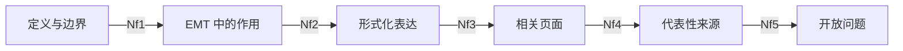

# PI 控制模型 (PI Model)

## 定义与边界

PI 控制模型指比例-积分控制器及其连续、离散和抗饱和实现形式。在本 Wiki 中，这个入口页用于承接泛化的 `[[pi-model]]` 链接，并把读者导向更具体的控制器模型页面。

## EMT 中的作用

PI 控制器常用于电流环、电压环、功率环、速度环和频率环。其具体作用取决于被控对象、采样实现和限幅逻辑，不能脱离场景单独评价。

## 形式化表达

PI 控制器的连续形式可写为：

$$
u(t)=K_p e(t)+K_i\int_0^t e(\tau)\,d\tau
$$

离散实现常写为：

$$
x_i[k]=x_i[k-1]+K_iT_s e[k], \qquad u[k]=K_p e[k]+x_i[k]
$$

其中 $e$ 为误差信号，$x_i$ 为积分状态，$T_s$ 为采样周期。Wiki 中若讨论抗饱和、限幅或离散积分方式，应进一步指向具体模型页或来源页。

## 相关页面

- [[pi-controller-model]]：PI/PID 控制器的模型细节、离散化和抗饱和实现。
- [[dual-loop-pi-controller]]：PI 在级联系统中的组织方式。
- [[control-system]]：更广义的控制系统入口。
- [[pll-model]]：PI 在同步环节中的常见应用。
- [[vector-control]]：PI 在 dq 坐标控制中的典型场景。

## 代表性来源

- [[pi-controller-model]]：当前 Wiki 中关于 PI/PID 连续、离散和抗饱和实现的主入口。
- [[dynamic-performance-of-embedded-hvdc-with-13&14]]：说明 PI 在 VSC-HVDC 常规双环中的场景化作用。

## 开放问题

- 不同离散积分方式和限幅逻辑对 EMT 波形的影响如何统一表述。
- PI 参数是否来自控制设计、工程整定还是论文算例，需要显式区分。

## 证据边界

本页不单独给出参数整定建议或性能结论；具体实现应参考目标设备和对应来源页。
