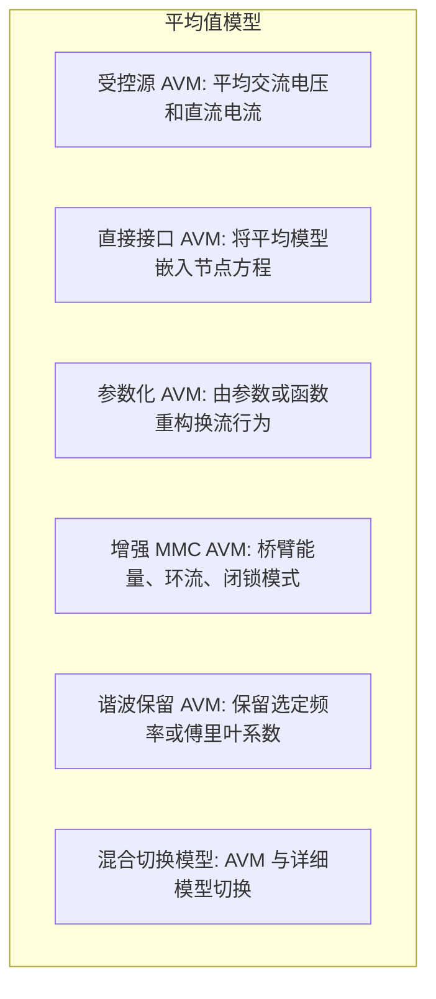

# 平均值模型

## 定义与边界

平均值模型（Average-Value Model, AVM）用开关周期平均量、调制函数或等效受控源替代详细开关动作。它保留变流器的低频功率交换、控制响应和主要储能状态，但通常不保留单个器件的开关沿、载波纹波、反向恢复和高频共模。

AVM 与 [[phasor-model]] 的区别在于：AVM 多数仍在时域中描述控制和暂态平均量；相量模型主要表示选定频率的幅值和相角。AVM 与 [[three-phase-instantaneous-model]] 的区别在于：瞬时值模型直接求解 $abc$ 波形，而 AVM 把开关周期内的细节压缩为平均变量。

## EMT 中的作用

AVM 常用于 EMT 系统级研究中的电力电子子系统：

- VSC、MMC、LCC、DC-DC 变换器和新能源并网变流器的低频等效。
- 控制器调试、故障穿越策略和大系统暂态扫描。
- EMT 与机电暂态或频域模型的混合仿真接口。
- 与详细开关模型切换，以在局部事件期间恢复高保真。

使用 AVM 时必须说明哪些状态被保留，例如直流电容电压、桥臂能量、环流、滤波器电流、控制器状态和闭锁状态。

## 核心方程

以两电平 VSC 的平均桥臂为例，调制函数 $\mathbf{m}_{abc}$ 可生成平均交流侧电压：

$$
\bar{\mathbf{v}}_{abc}=
\left(\mathbf{I}-\frac{1}{3}\mathbf{1}\mathbf{1}^{T}\right)
\frac{V_{\mathrm{dc}}}{2}\mathbf{m}_{abc}.
$$

直流侧平均电流可由交流侧电流和调制函数耦合得到：

$$
\bar{i}_{\mathrm{dc}}=\frac{1}{2}\mathbf{m}_{abc}^{T}\mathbf{i}_{abc},
$$

具体系数取决于电压基准、变换定义和功率归一化。一般状态方程可写为：

$$
\dot{\bar{x}}=f(\bar{x},\bar{u},m,\sigma),
$$

其中 $\bar{x}$ 为平均状态，$m$ 为调制或插入指数，$\sigma$ 表示闭锁、限流、故障穿越等运行模式。

对 MMC，桥臂平均电压通常与投入子模块数或插入指数相关：

$$
\bar{v}_{\mathrm{arm}}=n_{\mathrm{ins}}\bar{v}_{C,\mathrm{arm}},
$$

但是否保留子模块电容电压分布、桥臂能量和闭锁二极管路径取决于具体 AVM 变体。

## 变体

| 变体 | 保留内容 | 主要用途 | 边界 |
|------|----------|----------|------|
| 受控源 AVM | 平均交流电压和直流电流 | 系统级暂态 | 接口延迟和功率一致性需验证 |
| 直接接口 AVM | 将平均模型嵌入节点方程 | EMT 节点法耦合 | 推导依赖具体拓扑和离散格式 |
| 参数化 AVM | 由参数或函数重构换流行为 | LCC、VSC 和故障工况近似 | 参数有效域必须声明 |
| 增强 MMC AVM | 桥臂能量、环流、闭锁模式 | MMC-HVDC 故障和控制研究 | 不一定保留单个子模块差异 |
| 谐波保留 AVM | 保留选定频率或傅里叶系数 | 谐波和宽频振荡近似 | 截断频带外不可见 |
| 混合切换模型 | AVM 与详细模型切换 | 局部高保真和全局效率平衡 | 状态映射和历史项初始化是关键 |

## 适用边界与失败模式

- **开关纹波不可见**：载波边带、器件电压应力和开关损耗不能由基础 AVM 直接得到。
- **故障模式缺失**：直流故障、闭锁、旁路、换相失败和限流若未进入模式变量，模型会给出错误路径。
- **接口延迟**：受控源接口可能引入一步延迟和非物理功率误差；直接接口或同步求解需要单独推导。
- **能量不一致**：平均桥臂能量、电容电压和详细子模块状态之间切换时可能不守恒。
- **参数外推**：PAVM 或拟合型 AVM 只能在参数识别覆盖的工况内使用。

## 代表性证据边界

本页保留文献路线，但不保留无绑定的步长、误差和加速比数字。代表性来源包括：

- [[average-value-models-for-modular-multilevel-converters-operating-in-a-vsc-hvdc-grid]]：讨论 MMC AVM 在 VSC-HVDC 网格中的适用边界。
- [[an-enhanced-average-value-model-of-modular-multilevel-converter-for-accurate-rep]]：代表增强 MMC AVM 对闭锁和暂态初始条件的处理路线。
- [[a-universal-blocking-module-based-average-value-model-of-modular-multilevel-conv]]：代表闭锁模块化 AVM 的统一处理思路。
- [[combining-detailed-equivalent-model-with-switching-function-based-average-value-]]：代表详细模型与开关函数 AVM 的切换路线。
- [[average-value-modeling-of-line-commutated-ac-dc-converters-with-unbalanced-ac-ne]]：代表 LCC 在交流不平衡网络下的参数化 AVM。
- [[direct-interfacing-of-parametric-average-value-models-of-acx2013dc-converters-fo]] 和 [[average-value-model-for-voltage-source-converters-with-direct-interfacing-in-emt]]：代表直接接口 AVM 的节点法耦合路线。
- [[numerically-efficient-average-value-model-for-voltage-source-converters-in-nodal]]：代表把 VSC AVM 写入节点分析框架的数值实现方向。

这些来源各自绑定到具体拓扑、接口和验证工况；不能合并成“AVM 总是高精度或总能大步长稳定”的结论。

## 与相关页面的关系

- [[switching-function-method]]：平均值模型常从开关函数周期平均得到。
- [[state-space-average-method]]：给出 AVM 的状态空间推导形式。
- [[switch-modeling]]：详细开关模型是 AVM 的高保真对照。
- [[three-phase-instantaneous-model]]：用于验证 AVM 丢弃的瞬时波形和不平衡细节。
- [[direct-interface-technique]]：处理 AVM 与 EMT 网络方程同步耦合。
- [[dynamic-phasor]]：同属平均化或频带压缩思想，但变量和频率保留方式不同。

## 开放问题

AVM 的研究重点是边界透明：平均窗口、模式变量、接口方程、能量状态和验证工况必须明确。对于保护动作、闭锁故障、子模块不均衡和高频振荡，应使用增强 AVM 或详细 EMT 模型交叉验证。

## 来源论文

| 论文 | 年份 |
|------|------|
| [[improved-control-systems-simulation-in-the-emtp-through-compensation|Improved control systems simulation in the EMTP through comp]] | 2004 |
| [[modelling-of-circuit-breakers-in-the-electromagnetic-transients-program-power-sy|Modelling of circuit breakers in the Electromagnetic Transie]] | 2004 |
| [[power-converter-simulation-module-connected-to-the-emtp-power-systems-ieee-trans|Power converter simulation module connected to the EMTP - Po]] | 2004 |
| [[a-voltage-behind-reactance-synchronous-machine-model-for-the-emtp-type-solution|A Voltage-Behind-Reactance Synchronous Machine Model for the]] | 2006 |
| [[numerical-integration-by-the-2-stage-diagonally|Numerical Integration by the 2-Stage Diagonally Implicit Run]] | 2008 |
| [[an-iterative-real-time-nonlinear-electromagnetic-transient-solver-on-fpga|An Iterative Real-Time Nonlinear Electromagnetic Transient S]] | 2011 |
| [[digital-hardware-emulation-of-universal-machine-13&14|Digital Hardware Emulation of Universal Machine]] | 2011 |
| [[dynamic-average-modeling-of-front-end-diode-rectifier-loads-considering-13&14|Dynamic Average Modeling of Front-End Diode Rectifier Loads ]] | 2011 |
| [[dynamic-average-modeling-of-front-end-diode-rectifier-loads-considering-13&14|Dynamic Average Modeling of Front-End Diode Rectifier Loads ]] | 2011 |
| [[a-vsc-hvdc-model-with-reduced-computational-intensity|A VSC-HVDC Model with Reduced Computational Intensity]] | 2012 |
| [[dynamic-averaged-and-simplified-models-for|Dynamic Averaged and Simplified Models for]] | 2013 |
| [[dynamic-averaged-and-simplified-models-for|Dynamic Averaged and Simplified Models for]] | 2013 |
| [[dynamic-averaged-and-simplified-models-for|Dynamic Averaged and Simplified Models for]] | 2013 |
| [[modular-multilevel-converter-models|Modular Multilevel Converter Models]] | 2013 |
| [[average-value-models-for-modular-multilevel-converters-operating-in-a-vsc-hvdc-grid|Average-Value Models for Modular Multilevel Converters Opera]] | 2014 |
| [[comparative-study-on-electromechanical-and-electromagnetic-transient-model-for-g|Comparative study on electromechanical and electromagnetic t]] | 2014 |
| [[dynamic-average-value-modeling-of-13&14|Dynamic Average-Value Modeling of]] | 2014 |
| [[the-use-of-averaged-value-model-of-modular-37|The Use of Averaged-Value Model of Modular]] | 2014 |
| [[the-use-of-averaged-value-model-of-modular-37|The Use of Averaged-Value Model of Modular]] | 2014 |
| [[a-review-of-efficient-modeling-methods-for-modular-multilevel-converters|A review of efficient modeling methods for modular multileve]] | 2015 |
| [[a-review-of-efficient-modeling-methods-for-modular-multilevel-converters|A review of efficient modeling methods for modular multileve]] | 2015 |
| [[advanced-hybrid-transient-stability-and-emt-simulation-for-vsc-hvdc-systems|Advanced Hybrid Transient Stability and EMT Simulation for V]] | 2015 |
| [[modulation-index-dependent-thevenin-equivalent-circuit-model-of-vsc-and-apdr|Modulation Index Dependent Thévenin Equivalent Circuit Model]] | 2015 |
| [[29tpwrd20162590569-2|29/TPWRD.2016.2590569]] | 2016 |
| [[current-source-modular-multilevel-converter-modeling-and-control|Current Source Modular Multilevel Converter Modeling and Con]] | 2016 |
| [[an-enhanced-average-value-model-of-modular-multilevel-converter-for-accurate-rep|An Enhanced Average Value Model of Modular Multilevel Conver]] | 2018 |
| [[an-improved-approach-for-modeling-lightning-transients-of-wind-turbines|An improved approach for modeling lightning transients of wi]] | 2018 |
| [[field-validated-generic-emt-type-model-of-a-full-converter-wind-turbine-based-on|Field Validated Generic EMT-Type Model of a Full Converter W]] | 2018 |
| [[a-universal-blocking-module-based-average-value-model-of-modular-multilevel-conv|A Universal Blocking-Module-Based Average Value Model of Mod]] | 2019 |
| [[a-universal-blocking-module-based-average-value-model-of-modular-multilevel-conv|A Universal Blocking-Module-Based Average Value Model of Mod]] | 2019 |
| [[modeling-of-a-modular-multilevel-converter-with-embedded-energy-storage-for-elec|Modeling of a Modular Multilevel Converter With Embedded Ene]] | 2019 |
| [[parallel-in-time-simulation-algorithm-for-power-electronics-mmc-hvdc-system|Parallel-in-Time Simulation Algorithm for Power Electronics:]] | 2019 |
| [[spurious-power-losses-in-modular-multilevel-converter-arm-equivalent-model|Spurious Power Losses in Modular Multilevel Converter Arm Eq]] | 2019 |
| [[适用于电磁暂态高效仿真的变流器分段广义状态空间平均模型|适用于电磁暂态高效仿真的变流器分段广义状态空间平均模型]] | 2019 |
| [[适用于电磁暂态高效仿真的变流器分段广义状态空间平均模型|适用于电磁暂态高效仿真的变流器分段广义状态空间平均模型]] | 2019 |
| [[adaptive-modular-multilevel-converter-model-for-electromagnetic-transient-simula|Adaptive Modular Multilevel Converter Model for Electromagne]] | 2020 |
| [[adaptive-modular-multilevel-converter-model-for-electromagnetic-transient-simula|Adaptive Modular Multilevel Converter Model for Electromagne]] | 2020 |
| [[combining-detailed-equivalent-model-with-switching-function-based-average-value-|Combining Detailed Equivalent Model With Switching-Function-]] | 2020 |
| [[combining-detailed-equivalent-model-with-switching-function-based-average-value-|Combining Detailed Equivalent Model With Switching-Function-]] | 2020 |
| [[combining-detailed-equivalent-model-with-switching-function-based-average-value-|Combining Detailed Equivalent Model With Switching-Function-]] | 2020 |
| [[combining-detailed-equivalent-model-with-switching-function-based-average-value-|Combining Detailed Equivalent Model With Switching-Function-]] | 2020 |
| [[spurious-power-and-its-elimination-in-modular-multilevel-converter-models|Spurious power and its elimination in modular multilevel con]] | 2020 |
| [[average-value-model-for-a-modular-multilevel-converter-with-embedded-storage|Average-Value Model for a Modular Multilevel Converter With ]] | 2021 |
| [[average-value-modeling-of-line-commutated-ac-dc-converters-with-unbalanced-ac-ne|Average-Value Modeling of Line-Commutated AC-DC Converters W]] | 2021 |
| [[comparison-and-selection-of-grid-tied-inverter-models-for-accurate-and-efficient|Comparison and Selection of Grid-Tied Inverter Models for Ac]] | 2021 |
| [[comparison-and-selection-of-grid-tied-inverter-models-for-accurate-and-efficient|Comparison and Selection of Grid-Tied Inverter Models for Ac]] | 2021 |
| [[compensation-method-for-parallel-real-time-emt-studies|Compensation method for parallel real-time EMT studies✰]] | 2021 |
| [[equivalent-circuit-model-of-a-transmission-tower-considering-a-lightning-struck-|Equivalent Circuit Model of a Transmission Tower Considering]] | 2021 |
| [[mmc-hvdc系统高频稳定性分析与抑制策略(一)稳定性分析|High Frequency Stability Analysis and Suppression Strategy o]] | 2021 |
| [[parallelization-of-mmc-detailed-equivalent-model|Parallelization of MMC detailed equivalent model]] | 2021 |
| [[an-equivalent-hybrid-model-for-a-large-scale-modular-multilevel-converter-and-co|An Equivalent Hybrid Model for a Large-Scale Modular Multile]] | 2022 |
| [[analysis-and-prospect-of-development-of-chinas-independent-electromagnetic-trans-fix|Analysis and Prospect of Development of China]] | 2022 |
| [[direct-interfacing-of-parametric-average-value-models-of-acx2013dc-converters-fo|Direct Interfacing of Parametric Average-Value Models of AC&]] | 2022 |
| [[full-state-arm-average-value-model-for-simulation-of-active-modular-multilevel-c|Full-state Arm Average Value Model for Simulation of Active ]] | 2022 |
| [[2728modeling|Modeling_of_LCC_HVDC_Systems_Using_Dynam]] | 2022 |
| [[the-averaged-value-model-of-a-flexible-power-electronics-based-substation-in-hyb|The Averaged-value Model of a Flexible Power Electronics Bas]] | 2022 |
| [[index|中  国  电  机  工  程  学  报]] | 2022 |
| [[协调分布式潮流控制器串并联变流器能量交换的等效模型|协调分布式潮流控制器串并联变流器能量交换的等效模型]] | 2022 |
| [[协调分布式潮流控制器串并联变流器能量交换的等效模型|协调分布式潮流控制器串并联变流器能量交换的等效模型]] | 2022 |
| [[模块化多电平换流器电磁暂态模型研究综述|模块化多电平换流器电磁暂态模型研究综述]] | 2022 |
| [[模块化多电平换流器的高效电磁暂态仿真方法研究|模块化多电平换流器的高效电磁暂态仿真方法研究]] | 2022 |
| [[直驱式风电机组机电暂态建模及仿真|直驱式风电机组机电暂态建模及仿真]] | 2022 |
| [[a-multi-solver-framework-for-co-simulation-of-transients-in-modern-power-systems|A multi-solver framework for co-simulation of transients in ]] | 2023 |
| [[average-value-model-for-voltage-source-converters-with-direct-interfacing-in-emt|Average-Value Model for Voltage-Source Converters With Direc]] | 2023 |
| [[equivalent-modeling-method-of-parallel-elements-for-fast-electromagnetic-transie|Equivalent Modeling Method of Parallel Elements for Fast Ele]] | 2023 |
| [[equivalent-model-of-nearest-level-modulation-for-fast-electromagnetic-transient-|Equivalent model of nearest level modulation for fast electr]] | 2023 |
| [[equivalent-model-of-nearest-level-modulation-for-fast-electromagnetic-transient-|Equivalent model of nearest level modulation for fast electr]] | 2023 |
| [[generalized-electromagnetic-transient-equivalent-modeling-and-implementation-of-|Generalized Electromagnetic Transient Equivalent Modeling an]] | 2023 |
| [[harmonics-interaction-mechanism-and-impact-on-extinction-angles-in-multi-infeed-|Harmonics Interaction Mechanism and Impact on Extinction Ang]] | 2023 |
| [[modeling-of-mmc-based-statcom-with-embedded-energy-storage-for-the-simulation-of|Modeling of MMC-based STATCOM with embedded energy storage f]] | 2023 |
| [[sparse-solver-application-for-parallel-real-time-electromagnetic-transient-simul|Sparse solver application for parallel real-time electromagn]] | 2023 |
| [[switch-averaged-frequency-domain-simulation-of-photovoltaic-systems|Switch-Averaged Frequency Domain Simulation of Photovoltaic ]] | 2023 |
| [[switch-averaged-frequency-domain-simulation-of-photovoltaic-systems|Switch-Averaged Frequency Domain Simulation of Photovoltaic ]] | 2023 |
| [[多样性子模块混合型mmc统一外特性高效电磁暂态模型|多样性子模块混合型MMC统一外特性高效电磁暂态模型]] | 2023 |
| [[电力系统数字混合仿真技术综述及展望|电力系统数字混合仿真技术综述及展望]] | 2023 |
| [[基于mmc平均值仿真模型的损耗快速评估方法|Fast Loss Evaluation Method Based on MMC Average Simulation ]] | 2024 |
| [[基于mmc平均值仿真模型的损耗快速评估方法|Fast Loss Evaluation Method Based on MMC Average Simulation ]] | 2024 |
| [[initializing-emt-models-of-grid-forming-vscs-in-mtdc-systems|Initializing EMT models of grid forming VSCs in MTDC systems]] | 2024 |
| [[initializing-emt-models-of-grid-forming-vscs-in-mtdc-systems|Initializing EMT models of grid forming VSCs in MTDC systems]] | 2024 |
| [[numerically-efficient-average-value-model-for-voltage-source-converters-in-nodal|Numerically Efficient Average-Value Model for Voltage-Source]] | 2024 |
| [[shooting-method-based-modular-multilevel-converter-initialization-for-electromag|Shooting method based modular multilevel converter initializ]] | 2024 |
| [[基于模块化多电平换流器的超级电容储能系统高效仿真方法|基于模块化多电平换流器的超级电容储能系统高效仿真方法]] | 2024 |
| [[a-state-variables-elimination-based-emtp-type-constant-admittance-equivalent-mod|A State Variables Elimination-Based EMTP-Type Constant Admit]] | 2025 |
| [[accelerating-electromagnetic-transient-simulations-using-graphical-processing-un|Accelerating electromagnetic transient simulations using gra]] | 2025 |
| [[an-electromagnetic-transient-simulation-model-of-mmc-bess-for-various-operating-|An Electromagnetic Transient Simulation Model of MMC-BESS fo]] | 2025 |
| [[an-equivalent-dynamic-phasor-model-for-a-single-phase-boost-power-factor-correct|An Equivalent Dynamic Phasor Model for a Single-Phase Boost ]] | 2025 |
| [[comprehensive-full-scale-converter-wind-park-initialization-for-electromagnetic-|Comprehensive Full-Scale Converter Wind Park Initialization ]] | 2025 |
| [[discretized-impedance-based-modeling-of-converter-interfaced-energy-resources-fo|Discretized Impedance-Based Modeling of Converter-Interfaced]] | 2025 |
| [[electromagnetic-transient-modeling-and-simulation-of-large-power-systems-emt-sim|Electromagnetic Transient Modeling and Simulation of Large P]] | 2025 |
| [[low-dimensional-equivalent-models-and-multithreading-based-parallel-emt-simulati|Low-Dimensional Equivalent Models and Multithreading-Based P]] | 2025 |
| [[simplified-emt-model-of-multiple-active-bridge-based-power-electronic-transforme|Simplified EMT Model of Multiple-Active-Bridge Based Power E]] | 2025 |
| [[universal-decoupled-equivalent-circuit-models-of-solid-state-transformer-for-acc|Universal Decoupled Equivalent Circuit Models of Solid-State]] | 2025 |
| [[decoupled-detailed-equivalent-model-for-parallel-and-multi-rate-emt-type-simulat|Decoupled Detailed Equivalent Model for Parallel and Multi-R]] | 2026 |
| [[decoupled-detailed-equivalent-model-for-parallel-and-multi-rate-emt-type-simulat|Decoupled Detailed Equivalent Model for Parallel and Multi-R]] | 2026 |
| [[electromechanical-transientelectromagnetic-transient-hybrid-simulation-method-co|Electromechanical transientelectromagnetic transient hybrid ]] | 2026 |
| [[equivalent-modeling-of-electromagnetic-transient-for-mmc-hvdc-based-on-semi-impl|Equivalent modeling of electromagnetic transient for MMC-HVD]] | 2026 |
| [[harmonic-preserved-average-value-model-for-converters-in-electromagnetic-transie|Harmonic-Preserved Average-Value Model for Converters in Ele]] | 2026 |