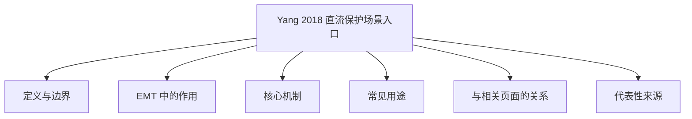

# Yang 2018 直流保护场景入口

## 定义与边界

该入口用于承接与 `Yang 2018` 相关的直流保护、故障判据或张北类直流场景引用。当前更合理的定位是“文献/案例入口”，而不是独立于 [[dc-protection]] 之外的新通用保护方法。

本页讨论的是一个案例化入口，不把一般直流保护总论或无关线路模型误写成 Yang 2018 方法本身。

## EMT 中的作用

在 EMT 图谱中，这类入口主要用于：

- 承接测试系统或来源页中的引用链接；
- 把具体文献案例与更一般的 [[dc-protection]]、[[dccb]]、[[zhangbei-dc-grid]] 页面关联起来；
- 提醒后续编辑者这是“案例型入口”，不是新的保护总方法页。

## 核心机制

直流保护的核心是快速识别故障并发出跳闸信号。以行波保护为例，保护启动判据可写为电压行波的幅值与阈值比较：

$$
|dv/dt| > \tau_v \quad \text{or} \quad |di/dt| > \tau_i
$$

其中 $dv/dt$ 和 $di/dt$ 分别为故障初期电压和电流行波的上升率，$\tau_v$ 和 $\tau_i$ 为保护启动阈值。实际保护方案可能综合行波幅值、极性、小波熵或多端时间差等特征量以提高选相和区段识别的可靠性。具体阈值、延时和配合策略必须绑定直流电压等级、线路长度和保护对象。

## 常见用途

- 作为张北或 VSC-HVDC 直流保护文献的落脚点；
- 作为测试系统页中具体保护方案的引用入口；
- 作为更一般直流保护方法页的案例补充。

## 与相关页面的关系

- [[dc-protection]]：直流保护总入口。
- [[dccb]]：保护动作与开断背景。
- [[zhangbei-dc-grid]]：张北类工程场景背景。
- [[zhangbei-four-terminal-vsc]]：四端直流场景背景。

## 代表性来源

- [[protection-system-representation-in-the-electromagnetic-transients-program-power]]：保护算法与 EMT 平台耦合背景。
- [[application-of-wavelet-singular-entropy-theory-in-transient-protection-and-accel]]：暂态特征保护背景。
- [[single-ended-travelling-wave-based-protection-scheme-for-double-circuit-transmis]]：行波保护背景。

## 证据边界

本页不写无来源的动作时间、准确率或统一保护结论。若后续确认 `Yang 2018` 对应明确论文，应优先回填正式 source 页并决定是否保留此入口。

## 开放问题

- 当前页尚未确认 `Yang 2018` 在现有图谱中具体对应哪一篇正式 source 页。
- 若后续找到明确论文映射，本页可进一步并入正式保护案例页或删除旧链接来源。
